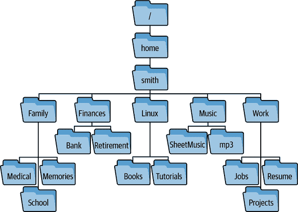

# 第四章：浏览文件系统

在 1984 年的经典文化喜剧电影《八维空间的巴克路·班赛历险记》中，英雄主角提供了以下类似禅宗的智慧言论：“记住，无论你走到哪里……那里就是你自己。” 巴克路也可能在谈论 Linux 文件系统：

```
$ cd /usr/share/lib/etc/bin              *No matter where you go...*
$ pwd
/usr/share/lib/etc/bin                   *...there you are.*
```

同样的情况也适用于 Linux 文件系统中的任何位置——你当前的目录——最终都会去别的地方（到另一个目录）。你能够更快速、更高效地执行这种导航，你的生产力也就越高。

本章中的技术将帮助你以更少的输入更快速地导航文件系统。它们看起来简单，但是带来的回报却非常大，学习曲线很小，收益很高。这些技术可以分为两大类：

+   快速移动到特定目录

+   快速返回到以前访问过的目录

如果你需要快速查看 Linux 目录，请参阅附录 A(Linux)。如果你使用的是除 `bash` 外的 shell，请参阅附录 B(Shells)获取额外的注意事项。

# 高效访问特定目录

如果你问 10 位 Linux 专家命令行中最乏味的部分是什么，其中 7 位会说：“输入长长的目录路径。”^(1) 毕竟，如果你的工作文件在 */home/smith/Work/Projects/Apps/Neutron-Star/src/include*，你的财务文件在 */home/smith/Finances/Bank/Checking/Statements*，你的视频在 */data/Arts/Video/Collection*，重复输入这些路径肯定不是一件有趣的事情。在本节中，你将学习如何高效地导航到指定目录。

## 跳转到你的主目录

让我们从基础知识开始。无论你在文件系统的哪个位置，通过运行 `cd` 命令不带参数，都可以返回到你的主目录：

```
$ pwd
/etc                              *Start somewhere else*
$ cd                              *Run cd with no arguments...*
$ pwd
/home/smith                       *...and you're home again*
```

从任何文件系统中跳转到你的主目录的子目录时，使用简写而不是绝对路径，比如 */home/smith*。一个简写是 shell 变量 `HOME`：

```
$ cd $HOME/Work
```

另一个是波浪号（tilde）：

```
$ cd ~/Work
```

`$HOME` 和 `~` 都是 shell 扩展的表达式，你可以通过将它们输出到标准输出来验证这一点：

```
$ echo $HOME ~
/home/smith /home/smith
```

波浪号也可以在用户名前面直接表示另一个用户的主目录：

```
$ echo ~jones
/home/jones
```

## 使用 Tab 键更快地移动

当你输入 `cd` 命令时，通过按 Tab 键自动产生目录名称来节省输入。作为演示，访问一个包含子目录的目录，比如 */usr*：

```
$ cd /usr
$ ls
bin  games  include  lib  local  sbin  share  src
```

假设你想访问子目录 *share*。输入 `sha` 并按一次 Tab 键：

```
$ cd sha*<Tab>*
```

shell 会自动完成目录名：

```
$ cd share/
```

这个方便的快捷方式称为*选项卡完成*。当您输入的文本匹配单个目录名称时，它立即生效。当文本匹配多个目录名称时，您的 shell 需要更多信息才能完成所需的名称。假设您只输入了`s`并按了 Tab 键：

```
$ cd s*<Tab>*
```

shell 无法完成名称*share*（尚未完成），因为其他目录名称也以`s`开头：*sbin*和*src*。再次按 Tab 键，shell 会打印出所有可能的完成以指导您：

```
$ cd s*<Tab><Tab>*
sbin/  share/  src/
```

并等待您的下一步操作。为了解决歧义，请输入另一个字符`h`，然后按一次 Tab 键：

```
$ cd sh*<Tab>*
```

shell 会为您完成目录名称，从*sh*到*share*：

```
$ cd share/
```

通常按一次 Tab 键执行尽可能多的完成，或按两次打印所有可能的完成。您输入的字符越多，歧义就越少，匹配效果就越好。

选项卡完成非常适合加快导航速度。不必输入长路径如*/home/smith/Projects/Web/src/include*，只需输入尽可能少的内容并不断按 Tab 键。通过练习，您很快就能掌握这个技巧。

# 选项卡完成根据程序而异

选项卡完成不仅适用于`cd`命令。对于大多数命令，它也适用，尽管行为可能有所不同。当命令是`cd`时，Tab 键会完成目录名称。对于操作文件的其他命令，如`cat`、`grep`和`sort`，选项卡完成还会扩展文件名。如果命令是`ssh`（安全外壳），它会完成主机名。如果命令是`chown`（更改文件所有者），它会完成用户名。您甚至可以为速度创建自己的完成规则，正如我们将在示例 4-1 中看到的那样。还请参阅`man bash`并阅读其“可编程完成”主题。

## 使用别名或变量跳转到频繁访问的目录

如果您经常访问远程目录，例如*/home/smith/Work/⁠Projects​/Web/src/include*，请创建一个执行`cd`操作的别名：

```
# In a shell configuration file:
alias work="cd $HOME/Work/Projects/Web/src/include"
```

只需随时运行别名即可到达目的地：

```
$ work
$ pwd
/home/smith/Work/Projects/Web/src/include
```

或者，创建一个变量来保存目录路径：

```
$ work=$HOME/Work/Projects/Web/src/include
$ cd $work
$ pwd
/home/smith/Work/Projects/Web/src/include
$ ls $work/css                                *Use the variable in other ways*
main.css  mobile.css
```

# 使用别名编辑经常编辑的文件

有时经常访问目录的原因是编辑特定文件。如果是这种情况，请考虑定义一个别名来通过绝对路径编辑该文件，而不必更改目录。以下别名定义允许您通过运行`rcedit`编辑*$HOME/.bashrc*，无论您在文件系统的哪个位置，都不需要`cd`：

```
# Place in a shell configuration file and source it:
alias rcedit='$EDITOR $HOME/.bashrc'
```

如果您经常访问路径很长的许多目录，可以为每个目录创建别名或变量。然而，这种方法也有一些缺点：

+   很难记住所有这些别名/变量。

+   您可能会意外地创建与现有命令同名的别名，从而引起冲突。

另一种方法是创建一个像示例 4-1 中的 shell 函数，我称之为`qcd`（“快速 cd”）。这个函数接受一个字符串键作为参数，比如`work`或`recipes`，然后运行`cd`到选定的目录路径。

##### 示例 4-1\. 一个用于`cd`到远程目录的函数

```
# Define the qcd function
qcd () {
  # Accept 1 argument that's a string key, and perform a different
  # "cd" operation for each key.
  case "$1" in
    work)
      cd $HOME/Work/Projects/Web/src/include
      ;;
    recipes)
      cd $HOME/Family/Cooking/Recipes
      ;;
    video)
      cd /data/Arts/Video/Collection
      ;;
    beatles)
      cd $HOME/Music/mp3/Artists/B/Beatles
      ;;
    *)
      # The supplied argument was not one of the supported keys
      echo "qcd: unknown key '$1'"
      return 1
      ;;
  esac
  # Helpfully print the current directory name to indicate where you are
  pwd
}
# Set up tab completion
complete -W "work recipes video beatles" qcd
```

把这个函数存储在一个像*$HOME/.bashrc*这样的 shell 配置文件中（参见“环境和初始化文件，简明版”），然后 source 它，就可以运行了。输入`qcd`再加上一个支持的键，可以快速访问相关目录：

```
$ qcd beatles
/home/smith/Music/mp3/Artists/B/Beatles
```

作为奖励，脚本的最后一行运行命令`complete`，这是一个 shell 内置命令，为`qcd`设置自定义的制表符补全，以便完成这四个支持的键。现在你不必记住`qcd`的参数！只需输入`qcd`，后面加一个空格，然后按两次 Tab 键，shell 将打印出所有键供参考，你可以像往常一样完成其中任何一个：

```
$ qcd *<Tab><Tab>*
beatles  recipes  video    work
$ qcd v*<Tab><Enter>*                       *Completes 'v' to 'video'*
/data/Arts/Video/Collection
```

## 使用 CDPATH 让大型文件系统变得更小

`qcd`函数只处理你指定的目录。shell 提供了一个更通用的解决方案来进行`cd`，没有这种缺陷，称为*cd 搜索路径*。这个 shell 特性改变了我在 Linux 文件系统中导航的方式。

假设你有一个重要的子目录，经常要访问，名为*Photos*。它位于*/home/smith/Family/Memories/Photos*。当你在文件系统中穿梭时，每次想要进入*Photos*目录，可能需要输入一个长路径，比如：

```
$ cd ~/Family/Memories/Photos
```

如果你能把这个路径缩短到只是*Photos*，无论你在文件系统的哪个位置，都能到达你的子目录，那不是很棒吗？

```
$ cd Photos
```

通常情况下，这个命令会失败：

```
bash: cd: Photos: No such file or directory
```

除非你碰巧在正确的父目录（*~/Family/Memories*）或其他含有*Photos*子目录的目录中。好吧，通过一点设置，你可以指示`cd`在除了当前目录之外的其他位置搜索你的*Photos*子目录。搜索速度非常快，只在你指定的父目录中查找。例如，你可以指示`cd`在当前目录之外，还搜索*$HOME/Family/Memories*。然后，当你从文件系统的其他位置输入`cd Photos`时，`cd`会成功：

```
$ pwd
/etc
$ cd Photos
/home/smith/Family/Memories/Photos
```

cd 搜索路径工作原理类似于命令搜索路径`$PATH`，但不是找命令，而是找子目录。用 shell 变量`CDPATH`配置它，格式与`PATH`相同：用冒号分隔的目录列表。例如，如果你的`CDPATH`由这四个目录组成：

```
$HOME:$HOME/Projects:$HOME/Family/Memories:/usr/local
```

并且你输入：

```
$ cd Photos
```

然后`cd`将按顺序检查以下目录的存在，直到找到一个或完全失败：

1.  当前目录中的*Photos*

1.  *$HOME/Photos*

1.  *$HOME/Projects/Photos*

1.  *$HOME/Family/Memories/Photos*

1.  */usr/local/Photos*

在这种情况下，`cd`在第四次尝试成功，并且将目录更改为*$HOME/Family/Memories/Photos*。如果`$CDPATH`中有两个子目录命名为*Photos*，则较早的父目录胜出。

###### 注意

通常，成功的`cd`不会打印任何输出。但是，当`cd`使用你的`CDPATH`定位到一个目录时，它会在标准输出上打印绝对路径，以通知你新的当前目录：

```
$ CDPATH=/usr     *Set a CDPATH*
$ cd /tmp         *No output: CDPATH wasn't consulted*
$ cd bin          *cd consults CDPATH...*
/usr/bin          *...and prints the new working directory*
```

填充`CDPATH`以包含你最重要或最频繁使用的父目录，你可以在文件系统的任何地方进入它们的任何子目录，无论其深度有多深，几乎不用输入路径的大部分。相信我，这很*棒*，下面的案例研究应该可以证明它。

## 组织你的主目录以快速导航

让我们使用`CDPATH`来简化你导航主目录的方式。通过一点配置，你可以使主目录中的许多目录在任何文件系统中的任何地方易于访问，减少输入，效果显著。如果你的主目录组织良好，至少有两个级别的子目录，这种技术效果最佳。图 4-1 展示了一个组织良好的目录布局示例。



###### 图 4-1\. */home/smith*目录中的两级子目录

设置你的`CDPATH`的技巧是按顺序包含以下内容：

1.  `$HOME`

1.  你的主目录的子目录选择

1.  一个父目录的相对路径，用两个点（`..`）表示

通过包含`$HOME`，你可以立即跳转到任何它的子目录（*Family*、*Finances*、*Linux*、*Music*和*Work*）而不用在文件系统中的任何地方输入前导路径：

```
$ pwd
/etc                                   *Begin outside your home directory*
$ cd Work
/home/smith/Work
$ cd Family/School                     *You jumped 1 level below $HOME*
/home/smith/Family/School
```

通过在你的`CDPATH`中包含主目录的子目录，你可以一次跳转到它们的子目录：

```
$ pwd
/etc                                   *Anywhere outside your home directory*
$ cd School
/home/smith/Family/School              *You jumped 2 levels below $HOME*
```

到目前为止，你的`CDPATH`中的所有目录都是主目录和其子目录中的绝对路径。然而，通过包含相对路径`..`，你可以在*每个*目录中赋予新的`cd`行为。无论你在文件系统中的哪个位置，你都可以通过名称跳转到任何*同级*目录（../`sibling`）而不用输入两个点，因为`cd`将搜索你当前的父目录。例如，如果你在*/usr/bin*中，想要移动到*/usr/lib*，你只需要`cd lib`：

```
$ pwd
/usr/bin                              *Your current directory*
$ ls ..
bin   include   lib   src             *Your siblings*
$ cd lib
/usr/lib                              *You jumped to a sibling*
```

或者，如果你是一个在*src*、*include*和*docs*子目录上工作代码的程序员：

```
$ pwd
/usr/src/myproject
$ ls
docs   include   src
```

你可以简洁地在子目录之间跳转：

```
$ cd docs                            *Change your current directory*
$ cd include
/usr/src/myproject/include           *You jumped to a sibling*
$ cd src
/usr/src/myproject/src               *Again*
```

一个用于图图 4-1 中的树的`CDPATH`可能包含六个项目：你的主目录、其四个子目录以及父目录的相对路径：

```
# Place in a shell configuration file and source it:
export CDPATH=$HOME:$HOME/Work:$HOME/Family:$HOME/Linux:$HOME/Music:..
```

在配置文件中载入后，你可以在不输入长目录路径的情况下`cd`到许多重要目录，只需输入短目录名称。太棒了！

如果所有 `CDPATH` 目录下的子目录都有唯一的名称，则此技术效果最佳。如果有重复的名称，例如 *$HOME/Music* 和 *$HOME/Linux/Music*，你可能无法获得想要的行为。命令 `cd Music` 将始终先检查 *$HOME*，而不是 *$HOME/Linux*，因此无法找到 *$HOME/Linux/Music*。

要检查 `$HOME` 的前两级目录中是否存在重复的子目录名称，请尝试这个大胆的单行命令。它列出 `$HOME` 的所有子目录和子子目录，用 `cut` 隔离子子目录名称，排序列表，并用 `uniq` 计算出现次数：

```
$ cd
$ ls -d */ && (ls -d */*/ | cut -d/ -f2-) | sort | uniq -c | sort -nr | less
```

你可能会从 “检测重复文件” 中认识到这种重复检查技术。如果输出显示任何大于 1 的计数，则存在重复项。我意识到这个命令包含了一些我尚未介绍的功能。您将在 “技巧 #1：条件列表” 中了解到双与符号 (`&&`)，以及在 “技巧 #10：显式子 shell” 中的括号。

# 高效返回目录

你刚刚看到如何有效访问目录。现在我将向你展示，当你需要返回时如何快速重新访问目录。

## 使用 “cd -” 在两个目录之间切换

假设你在一个深层目录中工作，然后运行 `cd` 去其他地方：

```
$ pwd
/home/smith/Finances/Bank/Checking/Statements
$ cd /etc
```

然后想着，“不，等等，我想回到我刚才所在的 *Statements* 目录。” 不要重新输入长目录路径。只需运行带有破折号作为参数的 `cd`：

```
$ cd -
/home/smith/Finances/Bank/Checking/Statements
```

此命令将您的 shell 返回到其先前的目录，并帮助打印其绝对路径，以便您知道自己在哪里。

要在一对目录之间来回跳转，重复运行 `cd -`。当你在单个 shell 中专注于两个目录时，这将节省时间。然而，有一个注意事项：shell 一次只记住一个上一个目录。例如，如果你在 */usr/local/bin* 和 */etc* 之间切换：

```
$ pwd
/usr/local/bin
$ cd /etc                 *The shell remembers /usr/local/bin*
$ cd -                    *The shell remembers /etc*
/usr/local/bin
$ cd -                    *The shell remembers /usr/local/bin*
/etc
```

并且当你运行 `cd` 而不带参数跳转到你的主目录时：

```
$ cd                      *The shell remembers /etc*
```

shell 现在忘记了 */usr/local/bin* 作为上一个目录：

```
$ cd -                    *The shell remembers your home directory*
/etc
$ cd -                    *The shell remembers /etc*
/home/smith
```

下一个技巧克服了这个限制。

## 使用 pushd 和 popd 在多个目录之间切换

`cd -` 命令在两个目录之间切换，但是如果你有三个或更多需要跟踪的目录怎么办？假设你在 Linux 计算机上创建一个本地网站。这通常涉及四个或更多目录：

+   部署的现场网页的位置，例如 */var/www/html*

+   Web 服务器配置目录，通常位于 */etc/apache2*

+   SSL 证书的位置，通常位于 */etc/ssl/certs*

+   你的工作目录，例如 *~/Work/Projects/Web/src*

相信我，反复输入以下内容非常乏味：

```
$ cd ~/Work/Projects/Web/src
$ cd /var/www/html
$ cd /etc/apache2
$ cd ~/Work/Projects/Web/src
$ cd /etc/ssl/certs
```

如果您有大型窗口显示器，可以通过为每个目录打开单独的 shell 窗口来减轻负担。但是，如果您在单个 shell 中工作（比如通过 SSH 连接），可以利用一个称为*目录堆栈*的 shell 特性。它让您可以轻松快速地在多个目录之间移动，使用内置的 shell 命令`pushd`、`popd`和`dirs`。学习曲线可能只需 15 分钟，但速度上的巨大回报将持续一生。^(2)

*目录堆栈*是您在当前 shell 中访问并决定跟踪的目录列表。您通过执行称为*推入*和*弹出*的两个操作来操作堆栈。推入目录将其添加到列表的开头，传统上称为堆栈的*顶部*。弹出则从堆栈中移除顶部目录。^(3) 最初，堆栈仅包含当前目录，但您可以添加（推入）和移除（弹出）目录，并快速使用`cd`在它们之间切换。

###### 注意

每个正在运行的 shell 都维护其自己的目录堆栈。

我将从基本操作（推入、弹出、查看）开始，然后进入精彩内容。

### 推送目录到堆栈

命令`pushd`（“推入目录”缩写）执行以下所有操作：

1.  将给定目录添加到堆栈的顶部

1.  执行`cd`到该目录

1.  打印堆栈，从顶部到底部，以便您参考。

我将构建一个包含四个目录的目录堆栈，逐个将它们推入堆栈：

```
$ pwd
/home/smith/Work/Projects/Web/src
$ pushd /var/www/html
/var/www/html ~/Work/Projects/Web/src
$ pushd /etc/apache2
/etc/apache2 /var/www/html ~/Work/Projects/Web/src
$ pushd /etc/ssl/certs
/etc/ssl/certs /etc/apache2 /var/www/html ~/Work/Projects/Web/src
$ pwd
/etc/ssl/certs
```

Shell 在每个`pushd`操作后打印堆栈。当前目录是最左边（顶部）的目录。

### 查看目录堆栈

使用`dirs`命令打印 shell 的目录堆栈。它不会修改堆栈：

```
$ dirs
/etc/ssl/certs /etc/apache2 /var/www/html ~/Work/Projects/Web/src
```

如果您喜欢从顶部到底部打印堆栈，请使用`-p`选项：

```
$ dirs -p
/etc/ssl/certs
/etc/apache2
/var/www/html
~/Work/Projects/Web/src
```

甚至将输出管道到命令`nl`以从零开始为行编号：

```
$ dirs -p | nl -v0
     0  /etc/ssl/certs
     1  /etc/apache2
     2  /var/www/html
     3  ~/Work/Projects/Web/src
```

更简单的方法是运行`dirs -v`以打印带有编号行的堆栈：

```
$ dirs -v
 0  /etc/ssl/certs
 1  /etc/apache2
 2  /var/www/html
 3  ~/Work/Projects/Web/src
```

如果您喜欢这种自顶向下的格式，请考虑创建一个别名：

```
# Place in a shell configuration file and source it:
alias dirs='dirs -v'
```

### 从堆栈中弹出一个目录

`popd`命令（“弹出目录”）是`pushd`的反向操作。它执行以下所有操作：

1.  从堆栈顶部删除一个目录

1.  执行`cd`到新的顶部目录

1.  打印堆栈，从顶部到底部，以便您参考。

例如，如果您的堆栈有四个目录：

```
$ dirs
/etc/ssl/certs /etc/apache2 /var/www/html ~/Work/Projects/Web/src
```

然后重复运行`popd`将从顶部到底部遍历这些目录：

```
$ popd
/etc/apache2 /var/www/html ~/Work/Projects/Web/src
$ popd
/var/www/html ~/Work/Projects/Web/src
$ popd
~/Work/Projects/Web/src
$ popd
bash: popd: directory stack empty
$ pwd
~/Work/Projects/Web/src
```

###### 提示

`pushd`和`popd`命令是如此节省时间，我建议创建两个字符的别名，可以像输入`cd`一样快速输入：

```
# Place in a shell configuration file and source it:
alias gd=pushd
alias pd=popd
```

### 交换堆栈上的目录

现在你可以构建和清空目录栈了，让我们专注于实际应用场景。没有参数的`pushd`交换栈中的前两个目录，并导航到新的顶部目录。通过简单运行`pushd`在*/etc/apache2*和你的工作目录之间多次跳转。看看第三个目录*/var/www/html*作为栈的第一个两个目录交换位置：

```
$ dirs
/etc/apache2 ~/Work/Projects/Web/src /var/www/html
$ pushd
~/Work/Projects/Web/src /etc/apache2 /var/www/html
$ pushd
/etc/apache2 ~/Work/Projects/Web/src /var/www/html
$ pushd
~/Work/Projects/Web/src /etc/apache2 /var/www/html
```

注意，`pushd`的行为类似于`cd -`命令，可以在两个目录之间切换，但它没有记住仅一个目录的限制。

### 将一个错误的`cd`转变为`pushd`

假设你在几个目录之间使用`pushd`跳转，意外运行`cd`而不是`pushd`丢失了一个目录：

```
$ dirs
~/Work/Projects/Web/src /var/www/html /etc/apache2
$ cd /etc/ssl/certs
$ dirs
/etc/ssl/certs /var/www/html /etc/apache2
```

糟糕，意外的`cd`命令用*/etc/ssl/certs*替换了栈中的*~/Work/Projects/Web/src*。但不要担心。你可以将丢失的目录添加回栈中，而不需要输入其长路径。只需运行两次`pushd`，一次带有破折号参数，一次没有：

```
$ pushd -
~/Work/Projects/Web/src /etc/ssl/certs /var/www/html /etc/apache2
$ pushd
/etc/ssl/certs ~/Work/Projects/Web/src /var/www/html /etc/apache2
```

让我们解析为什么这样能行：

+   第一个`pushd`返回到你的 shell 的上一个目录*~/Work/Projects/Web/src*，并将其推送到栈上。`pushd`和`cd`一样，接受破折号作为参数表示“返回到我的上一个目录”。

+   第二个`pushd`命令交换了栈中的前两个目录，带你回到*/etc/ssl/certs*。最终结果是，你将*~/Work/Projects/Web/src*恢复到栈中的第二位置，就像如果你没有犯错一样。

这个“oops, I forgot a pushd”命令非常有用，值得设置一个别名。我称之为`slurp`，因为在我看来，它可以“吸回”我误操作丢失的目录：

```
# Place in a shell configuration file and source it:
alias slurp='pushd - && pushd'
```

### 深入了解栈

如果你想要在栈中除了顶部两个之外的目录之间进行`cd`，`pushd`和`popd`接受一个正整数或负整数参数以进一步操作栈中的目录。命令：

```
$ pushd +*N*
```

将*`N`*个目录从栈的顶部移到底部，然后执行`cd`到新的顶部目录。负数参数（*`-N`*）在执行`cd`之前将目录从底部移到顶部。^(4)

```
$ dirs
/etc/ssl/certs ~/Work/Projects/Web/src /var/www/html /etc/apache2
$ pushd +1
~/Work/Projects/Web/src /var/www/html /etc/apache2 /etc/ssl/certs
$ pushd +2
/etc/apache2 /etc/ssl/certs ~/Work/Projects/Web/src /var/www/html
```

以这种方式，你可以用简单的命令跳转到栈中的任何其他目录。然而，如果你的栈很长，可能很难凭眼睛判断目录的数字位置。因此，像在“查看目录栈”中那样打印每个目录的数字位置，使用`dirs -v`命令：

```
$ dirs -v
 0  /etc/apache2
 1  /etc/ssl/certs
 2  ~/Work/Projects/Web/src
 3  /var/www/html
```

要将*/var/www/html*移到栈的顶部（并使其成为当前目录），运行`pushd +3`。

要跳转到栈底的目录，请运行`pushd -0`（减零）：

```
$ dirs
/etc/apache2 /etc/ssl/certs ~/Work/Projects/Web/src /var/www/html
$ pushd -0
/var/www/html /etc/apache2 /etc/ssl/certs ~/Work/Projects/Web/src
```

你还可以使用带有数值参数的`popd`从栈中移除顶部目录之外的目录。命令：

```
$ popd +*N*
```

从堆栈中移除位置为*N*的目录，从顶部开始计数。负参数（*`-N`*）则从堆栈底部开始计数。计数从零开始，因此`popd +1`将移除第二个顶部目录：

```
$ dirs
/var/www/html /etc/apache2 /etc/ssl/certs ~/Work/Projects/Web/src
$ popd +1
/var/www/html /etc/ssl/certs ~/Work/Projects/Web/src
$ popd +2
/var/www/html /etc/ssl/certs
```

# 总结

这一章中的所有技巧只需稍加练习即可轻松掌握，能够节省大量时间和输入。我发现特别改变生活的技巧有：

+   用于快速导航的`CDPATH`

+   用于快速返回的`pushd`和`popd`

+   偶尔使用的`cd -`命令

^(1) 我虽然是编造的，但这肯定是真实的。

^(2) 另一种方法是使用`screen`和`tmux`等命令行程序打开多个虚拟显示，它们被称为*终端复用器*。学习成本比目录堆栈更高，但也值得一试。

^(3) 如果你了解计算机科学中的堆栈，目录堆栈正是一组目录名的堆栈。

^(4) 程序员可能会认出这些操作是堆栈的旋转。
