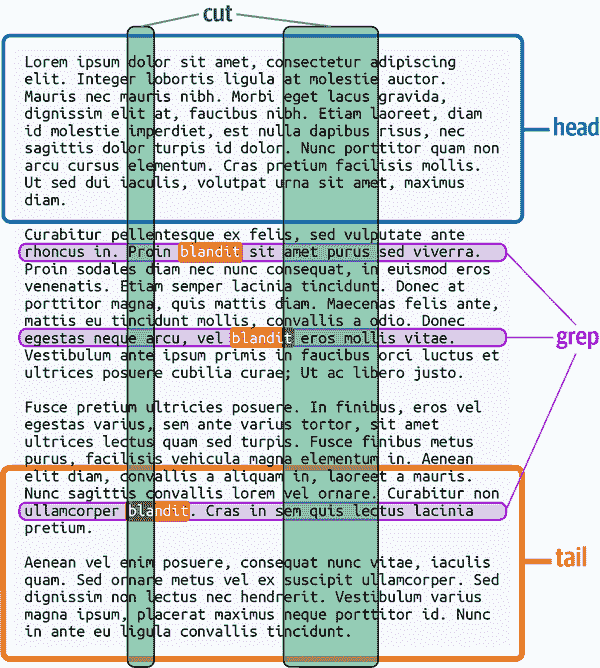

# 第五章：扩展您的工具箱

Linux 系统自带数千个命令行程序。经验丰富的用户通常依赖更小的子集，一种工具箱，他们一再返回。第一章向您的工具箱中添加了六个非常有用的命令，现在我将向您介绍大约十几个更多的命令。我将简要描述每个命令并展示一些示例用法。（要查看所有可用选项，请查看命令的 man 页。）我还将介绍两个强大的命令，它们学习起来更困难但却非常值得，称为`awk`和`sed`。总的来说，本章中的命令满足流水线和其他复杂命令的四个常见实际需求：

生成文本

打印日期、时间、数字和字母序列、文件路径、重复字符串以及其他文本，以启动您的流水线。

隔离文本

使用`grep`、`cut`、`head`、`tail`和`awk`的一个方便功能来提取文本文件的任何部分。

合并文本

从上到下使用`cat`和`tac`合并文件，或使用`echo`和`paste`并排合并文件。您还可以使用`paste`和`diff`交错文件。

转换文本

使用简单命令（如`tr`和`rev`）或更强大命令（如`awk`和`sed`）将文本转换为其他文本。

本章是一个快速概述。后续章节将展示这些命令的实际应用。

# 生成文本

每个流水线从打印到标准输出的简单命令开始。有时候是像`grep`或`cut`这样的命令，从文件中选择数据：

```
$ cut -d: -f1 /etc/passwd | sort      *Print all usernames and sort them*
```

或者甚至`cat`，方便地将多个文件的完整内容通过管道传递给其他命令：

```
$ cat *.txt | wc -l                   *Total the number of lines*
```

其他时候，管道中的初始文本来自其他来源。您已经知道这样的一个命令，即`ls`，它打印文件和目录名称及相关信息。让我们来看看其他产生文本的命令和技术：

`date`

以各种格式打印日期和时间

`seq`

打印一系列数字

大括号扩展

一个 Shell 功能，用于打印一系列数字或字符

`find`

打印文件路径

`yes`

重复打印相同的行

## 日期命令

`date`命令以各种格式打印当前日期和/或时间：

```
$ date                                *Default formatting*
Mon Jun 28 16:57:33 EDT 2021
$ date +%Y-%m-%d                      *Year-Month-Day format*
2021-06-28
$ date +%H:%M:%S                      *Hour:Minute:Seconds format*
16:57:33
```

要控制输出格式，请提供以加号（`+`）开头的参数，后跟任意文本。文本可能包含以百分号（`%`）开头的特殊表达式，例如`%Y`表示当前四位数年份，`%H`表示当前 24 小时制的小时数。日期的 man 页上有完整的表达式列表。

```
$ date +"I cannot believe it's already %A!"        *Day of week*
I cannot believe it's already Tuesday!
```

## seq 命令

`seq`命令在范围内打印一系列数字。提供两个参数，范围的低值和高值，`seq`将打印整个范围：

```
$ seq 1 5                     *Print all integers from 1 to 5, inclusive*
1
2
3
4
5
```

如果提供了三个参数，则第一个和第三个定义范围，中间的数字是增量：

```
$ seq 1 2 10                  *Increment by 2 instead of 1*
1
3
5
7
9
```

使用负增量如`-1`生成一个降序序列：

```
$ seq 3 -1 0
3
2
1
0
```

或者使用小数增量生成浮点数：

```
$ seq 1.1 0.1 2                       *Increment by 0.1*
1.1
1.2
1.3
⋮
2.0
```

默认情况下，值由换行符分隔，但您可以使用 `-s` 选项后跟任意字符串来更改分隔符：

```
$ seq -s/ 1 5                 *Separate values with forward slashes*
1/2/3/4/5
```

使用 `-w` 选项使所有值具有相同的宽度（以字符为单位），如有必要添加前导零：

```
$ seq -w 8 10
08
09
10
```

`seq` 可以生成许多其他格式的数字（请参阅手册页），但我的示例代表了最常见的用法。

## 大括号扩展（一种 Shell 特性）

shell 提供了一种自己的打印数字序列的方式，称为 *大括号扩展*。从左大括号开始，添加两个用两个点分隔的整数，以右大括号结束：

```
$ echo {1..10}                        *Forward from 1*
1 2 3 4 5 6 7 8 9 10
$ echo {10..1}                        *Backward from 10*
10 9 8 7 6 5 4 3 2 1
$ echo {01..10}                       *With leading zeros (equal width)*
01 02 03 04 05 06 07 08 09 10
```

更一般地，shell 表达式 `{`*x*`..`*y*`..`*z*`}` 生成从 *x* 到 *y* 的值，以 *z* 递增：

```
$ echo {1..1000..100}                               *Count by hundreds from 1*
1 101 201 301 401 501 601 701 801 901
$ echo {1000..1..100}                               *Backward from 1000*
1000 900 800 700 600 500 400 300 200 100
$ echo {01..1000..100}                              *With leading zeros*
0001 0101 0201 0301 0401 0501 0601 0701 0801 0901
```

# 大括号与方括号的区别

方括号是用于文件名的模式匹配运算符（第二章）。另一方面，大括号扩展不依赖于文件名。它只是评估为一个字符串列表。您可以使用大括号扩展来*打印*文件名，但不会进行模式匹配：

```
$ ls
file1 file2 file4
$ ls file[2-4]           *Matches existing filenames*
file2 file4
$ ls file{2..4}          *Evaluates to: file2 file3 file4*
ls: cannot access 'file3': No such file or directory
file2  file4
```

大括号扩展还可以生成字母序列，而 `seq` 不能实现：

```
$ echo {A..Z}
A B C D E F G H I J K L M N O P Q R S T U V W X Y Z
```

大括号扩展总是在单行上生成以空格字符分隔的输出。通过将输出传输到其他命令，如 `tr`（参见“tr 命令”），可以改变这一点：

```
$ echo {A..Z} | tr -d ' '      *Delete spaces*
ABCDEFGHIJKLMNOPQRSTUVWXYZ
$ echo {A..Z} | tr ' ' '\n'    *Change spaces into newlines*
A
B
C
⋮
Z
```

创建一个别名，用于打印英文字母表的第 *n* 个字母：

```
$ alias nth="echo {A..Z} | tr -d ' ' | cut -c"
$ nth 10
J
```

## find 命令

`find` 命令递归列出目录中的文件，进入子目录并打印完整路径。^(1) 结果不是按字母顺序的（如果需要，将输出管道传输到 `sort`）：

```
$ find /etc -print            *List all of /etc recursively*
/etc
/etc/issue.net
/etc/nanorc
/etc/apache2
/etc/apache2/sites-available
/etc/apache2/sites-available/default.conf
⋮
```

`find` 具有许多可以组合的选项。以下是一些非常有用的选项。仅限制输出为文件或目录的 `-type` 选项：

```
$ find . -type f -print               *Files only*
$ find . -type d -print               *Directories only*
```

通过 `-name` 选项将输出限制为与文件名模式匹配的名称。引用或转义模式，以防止 shell 首先对其进行评估：

```
$ find /etc -type f -name "*.conf" -print           *Files ending with .conf*
/etc/logrotate.conf
/etc/systemd/logind.conf
/etc/systemd/timesyncd.conf
⋮
```

使用 `-iname` 选项使名称匹配不区分大小写：

```
$ find . -iname "*.txt" -print
```

`find` 还可以使用 `-exec` 在输出中的*每个文件路径*上执行 Linux 命令。语法有些奇怪：

1.  构造一个 `find` 命令并省略 `-print`。

1.  在 `-exec` 后面添加要执行的命令。使用表达式 `{}` 指示文件路径应该出现在命令中的位置。

1.  以引号或转义分号结束，例如 `";"` 或 `\;`。

下面是一个玩具示例，打印文件路径两侧的 `@` 符号：

```
$ find /etc -exec echo @ {} @ ";"
@ /etc @
@ /etc/issue.net @
@ /etc/nanorc @
⋮
```

更实际的例子是对 */etc* 及其子目录中所有 *.conf* 文件执行长列表（`ls -l`）：

```
$ find /etc -type f -name "*.conf" -exec ls -l {} ";"
-rw-r--r-- 1 root root 703  Aug 21  2017 /etc/logrotate.conf
-rw-r--r-- 1 root root 1022 Apr 20  2018 /etc/systemd/logind.conf
-rw-r--r-- 1 root root 604  Apr 20  2018 /etc/systemd/timesyncd.conf
⋮
```

`find -exec` 非常适合于整个目录结构中的大量文件删除（但要小心！）。让我们删除目录 *$HOME/tmp* 及其子目录中以波浪符（`~`）结尾的文件。为了安全起见，首先运行命令 `echo rm` 查看将要删除的文件，然后删除 `echo` 以实际删除：

```
$ find $HOME/tmp -type f -name "*~" -exec echo rm {} ";"       *echo for safety*
rm /home/smith/tmp/file1~
rm /home/smith/tmp/junk/file2~
rm /home/smith/tmp/vm/vm-8.2.0b/lisp/vm-cus-load.el~
$ find $HOME/tmp -type f -name "*~" -exec rm {} ";"            *Delete for real*
```

## `yes` 命令

`yes` 命令打印相同的字符串，直到终止：

```
$ yes          *Repeats "y" by default*
y
y
y ^C           *Kill the command with Ctrl-C*
$ yes woof!    *Repeat any other string*
woof!
woof!
woof! ^C
```

这种奇特行为有什么用处？`yes`可以为交互式程序提供输入，使其无人值守运行。例如，程序`fsck`检查 Linux 文件系统错误时，可能会提示用户继续并等待`y`或`n`的响应。将`yes`命令的输出通过管道传递给`fsck`，它将代表您回答每个提示，因此您可以离开让`fsck`完成运行。^(2)

对于我们的目的，`yes`的主要用途是通过将`yes`管道传递给`head`来多次打印一个字符串（您将在“生成测试文件”中看到一个实际示例）：

```
$ yes "Efficient Linux" | head -n3            *Print a string 3 times*
Efficient Linux
Efficient Linux
Efficient Linux
```

# 隔离文本

当你只需要文件的一部分时，最简单的组合和运行命令是`grep`、`cut`、`head`和`tail`。你已经在第一章中看到了前三者的使用：`grep`打印匹配字符串的行，`cut`打印文件的列，`head`打印文件的前几行。新命令`tail`则是`head`的相反，打印文件的最后几行。图 5-1 展示了这四个命令如何一起工作。



###### 图 5-1\. `head`、`grep`和`tail`提取行，`cut`提取列。在这个例子中，`grep`匹配包含字符串“blandit”的行。

在本节中，我更深入地探讨了`grep`，它不仅仅匹配普通字符串，还解释了更正式的`tail`用法。我还预览了用于提取列的`awk`命令的一个功能，这是`cut`无法做到的。这五个命令的组合可以使用单一管道隔离几乎任何文本。

## grep：深入探讨

你已经看到`grep`从文件中打印出匹配给定字符串的行：

```
$ cat frost
Whose woods these are I think I know.
His house is in the village though;
He will not see me stopping here
To watch his woods fill up with snow.
This is not the end of the poem.
$ grep his frost                              *Print lines containing "his"*
To watch his woods fill up with snow.
This is not the end of the poem.              *"This" matches "his"*
```

`grep`还有一些非常有用的选项。使用`-w`选项仅匹配完整单词：

```
$ grep -w his frost                         *Match the word "his" exactly*
To watch his woods fill up with snow.
```

使用`-i`选项忽略大小写：

```
$ grep -i his frost
His house is in the village though;             *Matches "His"*
To watch his woods fill up with snow.           *Matches "his"*
This is not the end of the poem.                *"This" matches "his"*
```

使用`-l`选项仅打印包含匹配行的文件名，而不包括匹配行本身：

```
$ grep -l his *             *Which files contain the string "his"?*
frost
```

然而，`grep`的真正威力体现在超越匹配简单字符串，而是匹配称为*正则表达式*的模式时。^(3) 语法与文件名模式不同；部分描述在表 5-1 中。

表 5-1\. `grep`、`awk`和`sed`共享的一些正则表达式语法​^(a)

| 匹配此内容： | 使用此语法： | 示例 |
| --- | --- | --- |
| 行的开头 | `^` | `^a` = 以`a`开头的行 |
| 行尾 | `$` | `!$` = 以感叹号结尾的行 |
| 任意单个字符（换行符除外） | `.` | `…` = 任意三个连续字符 |
| 字面上的插入符号、美元符号或任何其他特殊字符 *`c`* | `\`*c* | `\$` = 字面上的美元符号 |
| 表达式 *E* 的零个或多个出现 | *`E`*`*` | `_*` = 零个或多个下划线 |
| 集合中的任意单个字符 | `[`*`characters`*`]` | `[aeiouAEIOU]` = 任意元音 |
| 不在集合中的任意单个字符 | `[^`*`characters`*`]` | `[^aeiouAEIOU]` = 任意非元音 |
| 在给定范围内的任意字符 | `[`*`c`[1]*`-`*`c`[2]*`]` | `[0-9]` = 任意数字 |
| 不在给定范围内的任意字符 | `[^`*`c`[1]*`-`*`c`[2]*`]` | `[⁰-9]` = 任意非数字 |
| 两个表达式*`E`[1]*或*`E`[2]*中的任意一个 | *`E`[1]*`\&#124;`*`E`[2]*    用于 grep 和 sed | `one\&#124;two` = 要么是`one`要么是`two` |
| *`E`[1]*`\&#124;`*`E`[2]*    用于 awk | `one\&#124;two` = 要么是`one`要么是`two` |
| 分组表达式*`E`*用于优先级 | `\(`*`E`*`\)`    用于 grep 和 sed ^(b) | `\(`one\&#124;two`\)*` = 零个或多个`one`或`two` |
| `(one\&#124;two)*`    用于 awk | `(one\&#124;two)*` = 零个或多个`one`或`two` |
| ^(a) 这三个命令在处理正则表达式时也有所不同；表 5-1 展示了部分列表。^(b) 对于`sed`，此语法不仅仅是分组；详见“在 sed 中匹配子表达式”。 |

这里有一些带有正则表达式的示例`grep`命令。匹配所有以大写字母开头的行：

```
$ grep '^[A-Z]' myfile
```

匹配所有非空行（即匹配空行并使用`-v`排除它们）：

```
$ grep -v '^$' myfile
```

匹配包含*cookie*或*cake*的所有行：

```
$ grep 'cookie\|cake' myfile
```

匹配至少五个字符长的所有行：

```
$ grep '.....' myfile
```

匹配所有包含小于号在大于号之前的行，例如 HTML 代码行：

```
$ grep '<.*>' page.html
```

正则表达式很强大，但有时候它们会妨碍你。假设你想要搜索*frost*文件中包含`w`后跟句点的两行。以下命令会产生错误结果，因为句点是正则表达式中的特殊字符，表示“任意字符”：

```
$ grep w. frost
Whose woods these are I think I know.
He will not see me stopping here
To watch his woods fill up with snow.
```

要解决这个问题，可以转义特殊字符：

```
$ grep 'w\.' frost
Whose woods these are I think I know.
To watch his woods fill up with snow.
```

但是，如果要转义许多特殊字符，这种解决方案将变得繁琐。幸运的是，你可以强制`grep`忘记正则表达式，并在输入中按字面意义搜索每个字符，方法是使用`-F`（“固定”）选项；或者，为了获得等效结果，可以使用`fgrep`代替`grep`：

```
$ grep -F w. frost
Whose woods these are I think I know.
To watch his woods fill up with snow.
$ fgrep w. frost
Whose woods these are I think I know.
To watch his woods fill up with snow.
```

`grep`还有许多其他选项；我将只介绍解决常见问题的一个。使用`-f`选项（小写；不要与`-F`混淆）来匹配一组字符串而不是单个字符串。作为实际示例，让我们列出文件*/etc/passwd*中找到的所有 shell，这是我在“命令#5：排序”中介绍过的。如你所记得的那样，*/etc/passwd*中的每行包含有关用户的信息，以冒号分隔的字段组织。每行的最后一个字段是用户登录时启动的程序。这个程序通常但并非总是一个 shell：

```
$ cat /etc/passwd
root:x:0:0:root:/root:/bin/bash                         *7th field is a shell*
daemon:x:1:1:daemon:/usr/sbin:/usr/sbin/nologin         *7th field is not a shell*
⋮
```

如何确定一个程序是否是一个 shell？嗯，文件 */etc/shells* 列出了 Linux 系统上所有有效的登录 shell：

```
$ cat /etc/shells
/bin/sh
/bin/bash
/bin/csh
```

因此，你可以通过提取第七个字段与 `cut` 结合，消除重复项并与 */etc/shells* 中的结果进行比对，使用 `grep -f` 检查。我还添加了 `-F` 选项以提高谨慎性，因此 */etc/shells* 中的所有行都会被字面量接受，即使它们包含特殊字符：

```
$ cut -d: -f7 /etc/passwd | sort -u | grep -f /etc/shells -F
/bin/bash
/bin/sh
```

## tail 命令

`tail` 命令打印文件的最后几行，默认是 10 行。它是 `head` 命令的配对命令。假设你有一个名为 *alphabet* 的文件，包含着 26 行，每行一个字母：

```
$ cat alphabet
A is for aardvark
B is for bunny
C is for chipmunk
⋮
X is for xenorhabdus
Y is for yak
Z is for zebu
```

用 `tail` 打印最后三行。选项 `-n` 设置要打印的行数，就像 `head` 一样：

```
$ tail -n3 alphabet
X is for xenorhabdus
Y is for yak
Z is for zebu
```

如果在数字前加上加号 (`+`)，则从该行号开始打印并继续到文件末尾。以下命令从文件的第 25 行开始打印：

```
$ tail -n+25 alphabet
Y is for yak
Z is for zebu
```

结合 `tail` 和 `head` 从文件中打印任何行范围。例如，要单独打印第四行，请提取前四行并单独隔离最后一行：

```
$ head -n4 alphabet | tail -n1
D is for dingo
```

通常，要打印第 *M* 至第 *N* 行，请提取前 *N* 行并用 `tail` 隔离最后 *N-M+1* 行。打印 *alphabet* 文件的第六至第八行：

```
$ head -n8 alphabet | tail -n3
F is for falcon
G is for gorilla
H is for hawk
```

###### 提示

`head` 和 `tail` 都支持一个更简单的语法，用来指定行数而不需要 `-n`。这种语法已经非常古老，未记录并且已经被弃用，但很可能会一直被支持：

```
$ head -4 alphabet       *Same as head -n4 alphabet*
$ tail -3 alphabet       *Same as tail -n3 alphabet*
$ tail +25 alphabet      *Same as tail -n+25 alphabet*
```

## awk 的 {print} 命令

命令 `awk` 是一个通用的文本处理器，有着数百种用途。让我们预览一个小功能 `print`，它可以从文件中提取列，这是 `cut` 无法做到的。考虑系统文件 */etc/hosts*，其中包含以任意数量的空白分隔的 IP 地址和主机名：

```
$ less /etc/hosts
127.0.0.1       localhost
127.0.1.1           myhost      myhost.example.com
192.168.1.2       frodo
192.168.1.3     gollum
192.168.1.28        gandalf
```

假设你想通过打印每行的第二个单词来隔离主机名。挑战在于每个主机名之前都有任意数量的空白。`cut` 需要通过列号 (`-c`) 或由单一一致字符分隔的列 (`-f`) 来操作它的列。你需要一个命令来打印每行的第二个单词，`awk` 可以轻松提供：

```
$ awk '{print $2}' /etc/hosts
localhost
myhost
frodo
gollum
gandalf
```

`awk` 通过美元符号加上列号来引用任何列：例如，第七列为 `$7`。如果列号有多位数，请用括号括起来，例如 `$(25)`。要引用最后一个字段，请使用 `$NF`（“字段数量”）。要引用整行，请使用 `$0`。

`awk` 默认情况下不会在值之间打印空白。如果需要空白，请用逗号分隔值：

```
$ echo Efficient fun Linux | awk '{print $1 $3}'           *No whitespace*
EfficientLinux
$ echo Efficient fun Linux | awk '{print $1, $3}'          *Whitespace*
Efficient Linux
```

`awk` 的 `print` 语句非常适合处理超出整齐列的命令输出。例如 `df`，它打印 Linux 系统上的空闲和已用磁盘空间数量：

```
$ df / /data
Filesystem      1K-blocks       Used  Available Use% Mounted on
/dev/sda1      1888543276  902295944  890244772  51% /
/dev/sda2      7441141620 1599844268 5466214400  23% /data
```

根据 `Filesystem` 路径的长度、磁盘大小和您传递给 `df` 的选项，列位置可能会有所不同，因此您不能可靠地使用 `cut` 提取值。然而，使用 `awk`，您可以轻松地隔离（比如）每行的第四个值，表示可用磁盘空间：

```
$ df / /data | awk '{print $4}'
Available
890244772
5466214400
```

并且还可以同时使用一点 `awk` 魔法删除第一行（标题），仅打印大于 1 的行号：

```
$ df / /data | awk 'FNR>1 {print $4}'
890244772
5466214400
```

如果遇到除空格字符外的其他分隔符的输入，`awk` 可以使用 `-F` 选项将其字段分隔符更改为任何正则表达式：

```
$ echo efficient:::::linux | awk -F':*' '{print $2}'       *Any number of colons*
linux
```

您将在 “awk essentials” 中了解更多有关 `awk` 的详细信息。

# 结合文本

您已经了解了几个从不同文件组合文本的命令。首先是 `cat`，它将多个文件的内容打印到 stdout。它是文件自顶向下的连接器。这就是它的名字的由来——它连接文件：

```
$ cat poem1
It is an ancient Mariner,
And he stoppeth one of three.
$ cat poem2
'By thy long grey beard and glittering eye,
$ cat poem3
Now wherefore stopp'st thou me?
$ cat poem1 poem2 poem3
It is an ancient Mariner,
And he stoppeth one of three.
'By thy long grey beard and glittering eye,
Now wherefore stopp'st thou me?
```

您已经看到的第二个组合文本的命令是 `echo`，它是打印您给它的任何参数，以单个空格字符分隔的 shell 内建。它将字符串并排组合在一起：

```
$ echo efficient             linux     in     $HOME
efficient linux in /home/smith
```

让我们再看一些结合文本的命令：

`tac`

文本文件的自底向上组合器

`paste`

文本文件的并排组合器

`diff`

通过打印它们的差异，交错来自两个文件的文本的命令

## tac 命令

`tac` 命令逐行反转文件。它的名称是 *cat* 的倒写。

```
$ cat poem1 poem2 poem3 | tac
Now wherefore stopp'st thou me?
'By thy long grey beard and glittering eye,
And he stoppeth one of three.
It is an ancient Mariner,
```

请注意，在反转文本之前，我将三个文件串联起来。如果我向 `tac` 提供多个文件作为参数，它会依次反转每个文件的行，生成不同的输出：

```
$ tac poem1 poem2 poem3
And he stoppeth one of three.                    *First file reversed*
It is an ancient Mariner,
'By thy long grey beard and glittering eye,      *Second file*
Now wherefore stopp'st thou me?                  *Third file*
```

`tac` 非常适合处理已按时间顺序排列但无法使用 `sort -r` 命令反转的数据。典型情况是反转 Web 服务器日志文件，以处理其从最新到最旧的行。

```
192.168.1.34 - - [30/Nov/2021:23:37:39 -0500] "GET / HTTP/1.1" ...
192.168.1.10 - - [01/Dec/2021:00:02:11 -0500] "GET /notes.html HTTP/1.1" ...
192.168.1.8 - - [01/Dec/2021:00:04:30 -0500] "GET /stuff.html HTTP/1.1" ...
⋮
```

行按时间戳的顺序排列，但不是按字母或数字顺序排列，因此 `sort -r` 命令无法帮助。`tac` 命令可以反转这些行，而无需考虑时间戳。

## paste 命令

`paste` 命令将文件以单个制表符分隔的列侧边合并在一起。它是 `cut` 命令的伙伴，后者从制表符分隔的文件中提取列：

```
$ cat title-words1
EFFICIENT
AT
COMMAND
$ cat title-words2
linux
the
line
$ paste title-words1 title-words2
EFFICIENT	linux
AT	the
COMMAND line
$ paste title-words1 title-words2 | cut -f2        *cut & paste are complementary*
linux
the
line
```

使用 `-d` 选项（意为“分隔符”），将分隔符更改为另一个字符，如逗号：

```
$ paste -d, title-words1 title-words2
EFFICIENT,linux
AT,the
COMMAND,line
```

使用 `-s` 选项转置输出，生成粘贴的行而不是粘贴的列：

```
$ paste -d, -s title-words1 title-words2
EFFICIENT,AT,COMMAND
linux,the,line
```

`paste` 还可以将来自两个或多个文件的数据交错，如果将分隔符更改为换行符（`\n`）：

```
$ paste -d "\n" title-words1 title-words2
EFFICIENT
linux
AT
the
COMMAND
line
```

## diff 命令

`diff` 逐行比较两个文件，并打印它们之间差异的简洁报告：

```
$ cat file1
Linux is all about efficiency.
I hope you will enjoy this book.
$ cat file2
MacOS is all about efficiency.
I hope you will enjoy this book.
Have a nice day.
$ diff file1 file2
1c1
< Linux is all about efficiency.
---
> MacOS is all about efficiency.
2a3
> Have a nice day.
```

符号 `1c1` 表示文件之间的变化或差异。它表示第一个文件中的第一行与第二个文件中的第一行不同。此符号后跟来自 *file1* 的相关行，一个三个破折号分隔符 (`---`)，以及来自 *file2* 的相关行。前导符号 `<` 总是表示第一个文件的行，而 `>` 表示第二个文件的行。

符号 `2a3` 表示添加。它表示 *file2* 在第二行之后有一个第三行。此符号后跟来自 *file2* 的额外行，“祝您今天愉快。”

`diff` 输出可能包含其他符号，并且可以采用其他形式。然而，对于我们的主要目的而言，这个简短的解释已经足够，即将 `diff` 作为一个交错两个文件行的文本处理器使用。许多用户并不将 `diff` 看作这样的工具，但它非常适合形成管道以解决某些类型的问题。例如，您可以使用 `grep` 和 `cut` 隔离不同的行：

```
$ diff file1 file2 | grep '^[<>]'
< Linux is all about efficiency.
> MacOS is all about efficiency.
> Have a nice day.
$ diff file1 file2 | grep '^[<>]' | cut -c3-
Linux is all about efficiency.
MacOS is all about efficiency.
Have a nice day.
```

您将在 “技巧＃4：过程替换” 和 “检查匹配的文件对” 中看到实际示例。

# 转换文本

第一章 介绍了几个从 stdin 读取文本并将其转换为 stdout 中其他内容的命令。`wc` 打印行数、单词数和字符数；`sort` 按字母或数字顺序排列行；`uniq` 合并重复行。让我们讨论另外几个将其输入转换的命令：

`tr`

将字符转换为其他字符

`rev`

反转行中的字符

`awk` 和 `sed`

通用转换器

## tr 命令

`tr` 将一个字符集转换为另一个字符集。在 第二章 中，我展示了一个将冒号转换为换行符以打印 shell 的 `PATH` 的示例：

```
$ echo $PATH | tr : "\n"              *Translate colons into newlines*
/home/smith/bin
/usr/local/bin
/usr/bin
/bin
/usr/games
/usr/lib/java/bin
```

`tr` 接受两组字符作为参数，并将第一组的成员转换为第二组的对应成员。常见用途是将文本转换为大写或小写：

```
$ echo efficient | tr a-z A-Z         *Translate a into A, b into B, etc.*
EFFICIENT
$ echo Efficient | tr A-Z a-z
efficient
```

将空格转换为换行符：

```
$ echo Efficient Linux | tr " " "\n"
Efficient
Linux
```

并使用 `-d`（删除）选项删除空白：

```
$ echo efficient linux | tr -d ' \t'      *Remove spaces and tabs*
efficientlinux
```

## rev 命令

rev 命令反转每行输入的字符：^(4)

```
$ echo Efficient Linux! | rev
!xuniL tneiciffE
```

除了明显的娱乐价值外，`rev` 对于从文件中提取棘手信息非常有用。假设您有一个名人姓名文件：

```
$ cat celebrities
Jamie Lee Curtis
Zooey Deschanel
Zendaya Maree Stoermer Coleman
Rihanna
```

如果您想从每行提取最后一个单词（Curtis、Deschanel、Coleman、Rihanna）。如果每行具有相同数量的字段，则使用 `cut -f` 很容易实现，但字段数量会有所变化。使用 `rev`，您可以反转所有行，剪切*第一个*字段，然后再次反转以实现您的目标：^(5)

```
$ rev celebrities
sitruC eeL eimaJ
lenahcseD yeooZ
nameloC remreotS eeraM ayadneZ
annahiR
$ rev celebrities | cut -d' ' -f1
sitruC
lenahcseD
nameloC
annahiR
$ rev celebrities | cut -d' ' -f1 | rev
Curtis
Deschanel
Coleman
Rihanna
```

## awk 和 sed 命令

`awk` 和 `sed` 是处理文本的通用“超级命令”。它们可以完成本章中其他命令的大部分功能，但语法看起来更加神秘。举个简单的例子，它们可以像 `head` 一样打印文件的前 10 行：

```
$ sed 10q myfile                  *Print 10 lines and quit (q)*
$ awk 'FNR<=10' myfile            *Print while line number is ≤ 10*
```

它们还可以执行我们其他命令无法执行的操作，比如替换或交换字符串：

```
$ echo image.jpg | sed 's/\.jpg/.png/'                 *Replace .jpg by .png*
image.png
$ echo "linux efficient" | awk '{print $2, $1}'        *Swap two words*
efficient linux

```

`awk` 和 `sed` 比我讲过的其他命令更难学习，因为它们每个都内置了一个微型编程语言。它们有很多功能，以至于整本书都有人写给它们。（参见 ^(6）我强烈建议花时间学习这两个命令（或至少其中一个）。要开始你的旅程，我介绍了每个命令的基本原理，并演示了一些常见用途。我还推荐了几个在线教程，以深入了解这些强大而关键的命令。

不要担心记住每一个`awk`或`sed`的功能。成功使用这些命令真正意味着：

+   理解它们可以实现的*转换类型*，这样你可以想到，“啊！这是`awk`（或`sed`）的工作！”并在需要时应用它们。

+   学会阅读它们的 man 页面，并在 [Stack Exchange](https://oreil.ly/0948M) 和其他在线资源上找到完整的解决方案

### awk 的基本要素

`awk` 将文件（或 stdin）的文本行转换为任何其他文本，使用称为*awk 程序*的一系列指令。^(7) 你在编写 awk 程序方面的技能越高，就越能灵活地操纵文本。你可以在命令行上提供 awk 程序：

```
$ awk *program* *input-files*
```

你还可以将一个或多个 awk 程序存储在文件中，并使用 `-f` 选项引用它们，程序将按顺序运行：

```
$ awk -f *program-file1* -f *program-file2* -f *program-file3* *input-files*
```

一个 awk 程序包括一个或多个*操作*，比如计算值或打印文本，在输入行匹配*模式*时运行。程序中的每条指令的形式为：

```
*pattern* {*action*}
```

典型的模式包括：

单词 `BEGIN`

它的操作只运行一次，在 `awk` 处理任何输入之前。

单词 `END`

它的操作只运行一次，在`awk`处理完所有输入后。

用斜杠括起来的正则表达式（见 表 5-1）

一个例子是 `/^[A-Z]/` 用于匹配以大写字母开头的行。

其他特定于 `awk` 的表达式

例如，要检查输入行的第三个字段（`$3`）是否以大写字母开头，可以使用模式 `$3~/^[A-Z]/`。另一个例子是 `FNR>5`，它告诉 `awk` 跳过输入的前五行。

没有模式的操作对每一行输入运行一次。（在 “awk {print} 命令” 中有几个这种类型的 awk 程序。）例如，`awk` 通过直接打印每行的最后一个词，优雅地解决了来自 “rev 命令” 的“打印名人的姓氏”问题：

```
$ awk '{print $NF}' celebrities
Curtis
Deschanel
Coleman
Rihanna
```

###### 提示

在命令行上提供一个`awk`程序时，用引号括起来以防止 shell 评估`awk`的特殊字符。根据需要使用单引号或双引号。

没有任何操作的模式运行默认操作`{print}`，只是打印任何匹配的输入行，不做任何更改：

```
$ echo efficient linux | awk '/efficient/'
efficient linux
```

为了更充分地演示，处理来自示例 1-1 的制表符分隔文件*animals.txt*，以生成整洁的参考书目，将行从这种格式转换为：

```
python	Programming Python	2010	Lutz, Mark
```

到这个格式：

```
Lutz, Mark (2010). "Programming Python"
```

这需要重新排列三个字段，并添加一些字符如括号和双引号。以下`awk`程序可以做到这一点，使用选项`-F`将输入分隔符从空格更改为制表符(`\t`)：

```
$ awk -F'\t' '{print $4, "(" $3 ").", "\"" $2 "\""}' animals.txt
Lutz, Mark (2010). "Programming Python"
Barrett, Daniel (2005). "SSH, The Secure Shell"
Schwartz, Randal (2012). "Intermediate Perl"
Bell, Charles (2014). "MySQL High Availability"
Siever, Ellen (2009). "Linux in a Nutshell"
Boney, James (2005). "Cisco IOS in a Nutshell"
Roman, Steven (1999). "Writing Word Macros"
```

添加一个正则表达式来处理只有“horse”书籍：

```
$ awk -F'\t' '/^horse/{print $4, "(" $3 ").", "\"" $2 "\""}' animals.txt
Siever, Ellen (2009). "Linux in a Nutshell"
```

或者仅处理 2010 年或之后的书籍，通过测试字段`$3`是否匹配`²⁰¹`：

```
$ awk -F'\t' '$3~/²⁰¹/{print $4, "(" $3 ").", "\"" $2 "\""}' animals.txt
Lutz, Mark (2010). "Programming Python"
Schwartz, Randal (2012). "Intermediate Perl"
Bell, Charles (2014). "MySQL High Availability"
```

最后，添加一个`BEGIN`指令打印友好的标题，一些短划线作为缩进，和一个`END`指令引导读者进一步了解信息：

```
$ awk -F'\t' \
  'BEGIN {print "Recent books:"} \
  $3~/²⁰¹/{print "-", $4, "(" $3 ").", "\"" $2 "\""} \
  END {print "For more books, search the web"}' \
  animals.txt
Recent books:
- Lutz, Mark (2010). "Programming Python"
- Schwartz, Randal (2012). "Intermediate Perl"
- Bell, Charles (2014). "MySQL High Availability"
For more books, search the web
```

`awk`不仅可以打印，它还可以执行计算，比如对 1 到 100 的数字求和：

```
$ seq 1 100 | awk '{s+=$1} END {print s}'
5050
```

要了解`awk`超出几页书可以覆盖的内容，可以在[tutorialspoint.com/awk](https://www.tutorialspoint.com/awk/)或[riptutorial.com/awk](https://riptutorial.com/awk)上参加`awk`教程，或者搜索“awk 教程”。你会感到高兴的。

### 改进重复文件检测器

在“检测重复文件”中，您构建了一个通过检验检验和检测和计数重复 JPEG 文件的管道，但它不足以打印文件名：

```
$ md5sum *.jpg | cut -c1-32 | sort | uniq -c | sort -nr | grep -v "      1 "
      3 f6464ed766daca87ba407aede21c8fcc
      2 c7978522c58425f6af3f095ef1de1cd5
      2 146b163929b6533f02e91bdf21cb9563
```

现在你已经了解了`awk`，你可以打印文件名。让我们构建一个新命令，读取`md5sum`输出的每一行：

```
$ md5sum *.jpg
146b163929b6533f02e91bdf21cb9563  image001.jpg
63da88b3ddde0843c94269638dfa6958  image002.jpg
146b163929b6533f02e91bdf21cb9563  image003.jpg
⋮
```

不仅计算每个检验和的出现次数，还存储文件名以供打印。您将需要两个名为*数组*和*循环*的附加`awk`功能。

一个*数组*是一个保存值集合的变量。如果数组命名为`A`并保存了七个值，则可以访问值`A[1]`、`A[2]`、`A[3]`，一直到`A[7]`。1 到 7 的值称为数组的*键*，而`A[1]`到`A[7]`称为数组的*元素*。你可以创建任何你想要的键。如果你更愿意使用迪士尼角色的名字访问你的数组的七个元素，那就这样命名它们`A["Doc"]`、`A["Grumpy"]`、`A["Bashful"]`，一直到`A["Dopey"]`。

要计算重复图像，创建一个名为 `counts` 的数组，其中每个校验和有一个元素。每个数组键都是一个校验和，关联的元素包含输入中该校验和出现的次数。例如，数组元素 `counts["f6464ed766daca87ba407aede21c8fcc"]` 可能有值 3\. 以下 awk 脚本检查 `md5sum` 输出的每行，隔离校验和 (`$1`)，并将其用作 `counts` 数组的键。运算符 `++` 每次 `awk` 遇到其关联的校验和时将其元素增加 1：

```
$ md5sum *.jpg | awk '{counts[$1]++}'
```

到目前为止，awk 脚本并不生成任何输出 — 它只是计算每个校验和并退出。要打印计数，需要使用 `awk` 的第二个特性，称为 `for` 循环。`for` 循环逐个键步进数组，并依次处理每个元素，语法如下：

```
for (*variable* in *array*) *do something with array[variable]*
```

例如，按其键打印每个数组元素：

```
for (key in counts) print array[key]
```

将此循环放入 `END` 指令中，以便在计算完所有计数后运行。

```
$ md5sum *.jpg \
  | awk '{counts[$1]++} \
         END {for (key in counts) print counts[key]}'
1
2
2
⋮
```

接下来，将校验和添加到输出中。每个数组键都是一个校验和，因此只需在计数后打印键即可：

```
$ md5sum *.jpg \
  | awk '{counts[$1]++} \
         END {for (key in counts) print counts[key] " " key}'
1 714eceeb06b43c03fe20eb96474f69b8
2 146b163929b6533f02e91bdf21cb9563
2 c7978522c58425f6af3f095ef1de1cd5
⋮
```

要收集并打印文件名，还需使用第二个数组 `names`，其中同样以校验和为键。当 `awk` 处理每行输出时，将文件名 (`$2`) 附加到 `names` 数组的相应元素后，使用空格作为分隔符。在 `END` 循环中，在打印校验和 (`key`) 后，打印冒号和该校验和对应的收集文件名：

```
$ md5sum *.jpg \
  | awk '{counts[$1]++; names[$1]=names[$1] " " $2} \
         END {for (key in counts) print counts[key] " " key ":" names[key]}'
1 714eceeb06b43c03fe20eb96474f69b8: image011.jpg
2 146b163929b6533f02e91bdf21cb9563: image001.jpg image003.jpg
2 c7978522c58425f6af3f095ef1de1cd5: image019.jpg image020.jpg
⋮
```

以 1 开头的行表示仅出现一次的校验和，因此它们不是重复项。将输出管道传递给 `grep -v` 以删除这些行，然后使用 `sort -nr` 对结果进行数值排序，从高到低，即可得到所需的输出：

```
$ md5sum *.jpg \
  | awk '{counts[$1]++; names[$1]=names[$1] " " $2} \
         END {for (key in counts) print counts[key] " " key ":" names[key]}' \
  | grep -v '¹ ' \
  | sort -nr
3 f6464ed766daca87ba407aede21c8fcc: image007.jpg image012.jpg image014.jpg
2 c7978522c58425f6af3f095ef1de1cd5: image019.jpg image020.jpg
2 146b163929b6533f02e91bdf21cb9563: image001.jpg image003.jpg
```

### sed 基础知识

`sed`，像 `awk` 一样，可以将文件（或标准输入）中的文本转换为任何其他文本，使用一系列称为 *sed 脚本* 的指令。^(8) 初看起来 `sed` 脚本非常神秘。例如，`s/Windows/Linux/g` 表示将每个 `Windows` 字符串替换为 `Linux`。这里的 *脚本* 不是指文件（如 shell 脚本），而是指一个字符串。^(9) 在命令行上调用 `sed` 时，只需使用单个脚本：

```
$ sed **script** *input-files*
```

或者使用 `-e` 选项提供多个按顺序处理输入的脚本：

```
$ sed -e **script1** -e **script2** -e **script3** *input-files*
```

您还可以将 `sed` 脚本存储在文件中，并使用 `-f` 选项引用它们，它们按顺序运行：

```
$ sed -f *script-file1* -f *script-file2* -f *script-file3* *input-files*
```

与 `awk` 一样，`sed` 的实用性取决于您在创建 `sed` 脚本方面的技能。最常见的脚本类型是替换脚本，它用一个字符串替换另一个字符串。语法如下：

```
s/*regexp*/*replacement*/
```

其中 *`regexp`* 是要与每个输入行匹配的正则表达式（见 表 5-1），*`replacement`* 是要替换匹配文本的字符串。例如，将一个单词更改为另一个简单的示例：

```
$ echo Efficient Windows | sed "s/Windows/Linux/"
Efficient Linux
```

###### 提示

当在命令行上提供一个 `sed` 脚本时，用引号括起来，以防止 shell 评估 `sed` 的特殊字符。根据需要使用单引号或双引号。

`sed`可以通过正则表达式轻松解决来自“rev 命令”的“打印名人姓氏”的问题。只需匹配所有字符（`.*`）直到最后一个空格，并将它们替换为空：

```
$ sed 's/.* //' celebrities
Curtis
Deschanel
Coleman
Rihanna
```

# 替换和斜杠

替换中的斜杠可以用任何其他方便的字符替换。当正则表达式本身包含斜杠时（否则需要转义），这将非常有帮助。这三个`sed`脚本是等效的：

```
s/one/two/	s_one_two_	s@one@two@
```

您可以在替换之后跟随几个选项以影响其行为。选项`i`使匹配不区分大小写：

```
$ echo Efficient Stuff | sed "s/stuff/linux/"         *Case sensitive; no match*
Efficient Stuff
$ echo Efficient Stuff | sed "s/stuff/linux/i"        *Case-insensitive match*
Efficient linux
```

选项`g`（“全局”）替换所有匹配正则表达式的实例，而不仅仅是第一个：

```
$ echo efficient stuff | sed "s/f/F/"         *Replaces just the first "f"*
eFficient stuff
$ echo efficient stuff | sed "s/f/F/g"        *Replaces all occurrences of "f"*
eFFicient stuFF
```

另一种常见的`sed`脚本类型是删除脚本。它根据它们的行号删除行：

```
$ seq 10 14 | sed 4d                 *Remove the 4th line*
10
11
12
14
```

或者匹配正则表达式的行：

```
$ seq 101 200 | sed '/[13579]$/d'    *Delete lines ending in an odd digit*
102
104
106
⋮
200
```

### 使用 sed 匹配子表达式

假设你有一些文件名：

```
$ ls
image.jpg.1  image.jpg.2  image.jpg.3
```

并且想要生成新的名称，*image1.jpg*，*image2.jpg*和*image3.jpg*。`sed`可以将文件名拆分为部分并通过*子表达式*重新排列它们。首先，创建一个匹配文件名的正则表达式：

```
image\.jpg\.[1-3]
```

您希望将最终数字移动到文件名的前面，因此用符号`\(`和`\)`将该数字孤立出来。这定义了一个子表达式——正则表达式的指定部分：

```
image\.jpg\.\([1-3]\)
```

`sed`可以按编号引用子表达式并操作它们。您只创建了一个子表达式，所以它的名称是`\1`。第二个子表达式将是`\2`，依此类推，最多可以到`\9`。您的新文件名将具有形式`image\1.jpg`。因此，您的 sed 脚本将是：

```
$ ls | sed "s/image\.jpg\.\([1-3]\)/image\1.jpg/"
image1.jpg
image2.jpg
image3.jpg
```

为了使事情更加复杂，假设文件名有更多变化，由小写单词组成：

```
$ ls
apple.jpg.1  banana.png.2  carrot.jpg.3
```

创建三个子表达式以捕获基本文件名、扩展名和最终数字：

```
\([a-z][a-z]*\)                 *\1 = Base filename of one letter or more*
\([a-z][a-z][a-z]\)             *\2 = File extension of three letters*
\([0-9]\)                       *\3 = A digit*
```

用转义点（`\.`）将它们连接起来形成这个正则表达式：

```
\([a-z][a-z]*\)\.\([a-z][a-z][a-z]\)\.\([0-9]\)
```

将新转换后的文件名表示为`\1\3.\2`，最终与`sed`的替换变成：

```
$ ls | sed "s/\([a-z][a-z]*\)\.\([a-z][a-z][a-z]\)\.\([0-9]\)/\1\3.\2/"
apple1.jpg
banana2.png
carrot3.jpg
```

此命令不会重命名文件——它只是打印新名称。章节“在序列中插入文件名”展示了一个类似的示例，它还执行了重命名操作。

要深入学习`sed`，超出了几页书籍的内容，可以在[tutorialspoint.com/sed](https://www.tutorialspoint.com/sed)或[grymoire.com/Unix/Sed.html](https://www.grymoire.com/Unix/Sed.html)上参加`sed`教程，或在网络上搜索“sed 教程”。

# 朝着一个更大的工具箱前进

大多数 Linux 系统都附带成千上万个命令行程序，它们中的大多数都有许多选项可以改变其行为。您不太可能学习并记住它们全部。因此，在需要时，如何找到一个新程序或调整您已经了解的程序以实现您的目标？

您的第一（显而易见的）步骤是使用网络搜索引擎。例如，如果您需要一个命令来限制文本文件中行的宽度，自动换行任何太长的行，请搜索“Linux 命令 wrap lines”，您将会找到 `fold` 命令：

```
$ cat title.txt
This book is titled "Efficient Linux at the Command Line"
$ fold -w40 title.txt
This book is titled "Efficient Linux at
the Command Line"
```

要发现已安装在您的 Linux 系统上的命令，运行命令 `man -k`（或者等价地，`apropos`）。给定一个单词，`man -k` 在 man 手册顶部的简短描述中搜索该单词：

```
$ man -k width
DisplayWidth (3)     - image format functions and macros
DisplayWidthMM (3)   - image format functions and macros
fold (1)             - wrap each input line to fit in specified width
⋮
```

`man -k` 接受 `awk` 风格的正则表达式作为搜索字符串（参见 表 5-1）：

```
$ man -k "wide|width"
```

在您的系统上未安装的命令可能仍然可以通过系统的软件包管理器安装。软件包管理器是用于安装适用于您系统的 Linux 程序的软件。一些流行的软件包管理器包括 `apt`、`dnf`、`emerge`、`pacman`、`rpm`、`yum` 和 `zypper`。使用 `man` 命令来确定您系统上安装了哪个软件包管理器，并了解如何搜索未安装的软件包。通常是一个两条命令的序列：一条命令将来自互联网的最新可用软件包数据（“元数据”）复制到您的系统上，另一条命令用于搜索元数据。例如，对于基于 Ubuntu 或 Debian 的 Linux 系统，命令如下：

```
$ sudo apt update                   *Download the latest metadata*
$ apt-file search *string*            *Search for a string*
```

如果长时间搜索后仍无法找到或构建一个满足您需求的适当命令，请考虑在在线论坛上寻求帮助。提问的一个很好的起点是 Stack Overflow 的 [“如何提出一个好问题？”帮助页面](https://oreil.ly/J0jho)。总的来说，请尊重他人的时间来提问问题，专家们将更倾向于回答。这意味着让您的问题简短明了，包括任何错误消息或其他输出文字，并解释您自己已经尝试了什么。花时间质问质答：这不仅会增加获得有帮助答案的机会，而且如果论坛是公开可搜索的，清晰的问题和答案可能会帮助其他有类似问题的人。

# 摘要

您现在已经超越了 第 1 章 中的迷你工具箱，并准备在命令行中解决更具挑战性的业务问题。接下来的章节中充满了在各种情况下使用新命令的实际示例。  

^(1) 相关命令 `ls -R` 生成的输出格式不太适合用于管道操作。

^(2) 现在，一些 `fsck` 的实现具有选项 `-y` 和 `-n`，分别对每个提示回答是或否，因此此处不需要 `yes` 命令。

^(3) *grep* 的名称缩写为 “get regular expression and print”。

^(4) 测验：管道 `rev myfile | tac | rev | tac` 做什么？

^(5) 不久你将看到使用 `awk` 和 `sed` 的简单解决方案，但这种双`rev`技巧很实用。

^(6) 包括 O'Reilly 出版的书籍 [*sed & awk*](https://oreil.ly/FjtTm)。

^(7) *awk* 的名字是由程序的创作者 Aho、Weinberger 和 Kernighan 的首字母组成的缩写。

^(8) *sed* 的名字缩写来自于“流编辑器（stream editor）”，因为它编辑文本流。

^(9) 如果你熟悉编辑器 `vi`、`vim`、`ex` 或者 `ed`，那么 `sed` 脚本语法可能看起来很熟悉。
