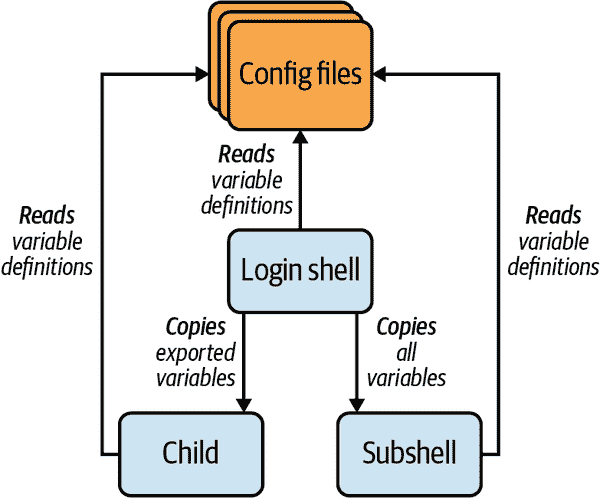

# 第六章：父进程、子进程和环境

shell 的目的——运行命令——对于 Linux 来说是如此基本，以至于您可能认为 shell 是以某种特殊方式内置到 Linux 中的。事实并非如此。shell 就像`ls`或`cat`一样是一个普通程序。它被编程为一遍又一遍地重复以下步骤……

1.  打印提示符。

1.  从 stdin 中读取命令。

1.  评估并运行该命令。

Linux 在很大程度上隐藏了 shell 是一个普通程序的事实。当您登录时，Linux 会自动为您运行一个 shell 实例，称为您的*登录 shell*。它的启动如此无缝，以至于看起来它*是* Linux，但实际上它只是一个代表您启动的程序，用于与 Linux 交互。

# 您的登录 shell 在哪里？

如果您在非图形终端上登录，例如使用 SSH 客户端程序，登录 shell 就是您与之交互的初始 shell。它打印第一个提示符并等待您的命令。

或者，如果您在计算机的控制台上有图形显示，您的登录 shell 会在幕后运行。它启动桌面环境，如 GNOME、Unity、Cinnamon 或 KDE Plasma。然后您可以打开终端窗口来运行额外的交互式 shell。

对 shell 的理解越多，您与 Linux 的有效工作能力就越高，对其内部工作原理的迷信就越少。本章比第二章更深入地探讨了以下 shell 的奥秘：

+   shell 程序的位置

+   不同的 shell 实例之间如何关联

+   为什么不同的 shell 实例可能具有相同的变量、值、别名和其他上下文

+   如何通过编辑配置文件更改 shell 的默认行为

最后，希望您会发现，这些神秘并不那么神秘。

# Shell 是可执行文件

大多数 Linux 系统上的默认 shell 是`bash`，^(1) 它只是一个普通程序——一个可执行文件——位于系统目录*/bin*，与`cat`、`ls`、`grep`和其他熟悉的命令一起：

```
$ cd /bin
$ ls -l bash cat ls grep
-rwxr-xr-x 1 root root 1113504 Jun  6  2019 bash
-rwxr-xr-x 1 root root   35064 Jan 18  2018 cat
-rwxr-xr-x 1 root root  219456 Sep 18  2019 grep
-rwxr-xr-x 1 root root  133792 Jan 18  2018 ls
```

`bash` 也不一定是您系统上唯一的 shell。通常在文件*/etc/shells*中列出有效的 shell，每行一个：

```
$ cat /etc/shells
/bin/sh
/bin/bash
/bin/csh
/bin/zsh
```

要查看您正在运行的 shell，请`echo` shell 变量`SHELL`：

```
$ echo $SHELL
/bin/bash
```

理论上，Linux 系统可以将*任何程序*视为有效的登录 shell，如果用户帐户配置为在登录时调用它，并且它在*/etc/shells*中列出（如果在您的系统上需要）。使用超级用户权限，您甚至可以编写和安装自己的 shell，就像示例 6-1 中的脚本一样。它读取任何命令并回应：“对不起，我不能做到。”这个自定义 shell 故意愚蠢，但它证明了其他程序可以像*/bin/bash*一样成为合法的 shell。

##### 示例 6-1。halshell：一个拒绝运行您命令的 shell

```
#!/bin/bash
# Print a prompt
echo -n '$ '
# Read the user's input in a loop. Exit when the user presses Ctrl-D.
while read line; do
 # Ignore the input $line and print a message
 echo "I'm sorry, I'm afraid I can't do that"
 # Print the next prompt
 echo -n '$ '
done
```

由于`bash`只是一个程序，您可以像运行其他任何命令一样手动运行它：

```
$ bash
```

如果你这样做，你只会看到另一个提示符，就好像你的命令没有产生任何效果：

```
$
```

但实际上，你已经运行了一个新的 `bash` 实例。这个新实例会打印一个提示符，并等待你的命令。为了使新实例更加可见，通过设置 shell 变量 `PS1` 将其提示符（比如改为 `%%`），并运行一些命令：

```
$ PS1="%% "
%% ls                                 *The prompt has changed*
animals.txt
%% echo "This is a new shell"
This is a new shell
```

现在运行 `exit` 来终止新的 `bash` 实例。你会回到原始的 shell，它有一个美元符号提示符：

```
%% exit
$
```

我必须强调，从`%%`切换回`$`并不是一个提示符的改变。这是整个 shell 的变化。新的 `bash` 实例已经结束，所以原始 shell 会提示你输入下一个命令。

手动运行 `bash` 不仅仅是为了娱乐价值。你会在第七章中利用手动调用的 shell。

# 父进程和子进程

当一个 shell 实例调用另一个 shell 实例时，就像我刚才演示的那样，原始 shell 被称为*父进程*，新实例称为*子进程*。对于任何一个 Linux 程序调用另一个 Linux 程序也是如此。调用的程序是父进程，被调用的程序是它的子进程。运行中的 Linux 程序称为*进程*，因此你也会看到*父进程*和*子进程*这些术语。一个进程可以调用任意数量的子进程，但每个子进程只有一个父进程。

每个进程都有自己的环境。一个环境，你可能还记得来自“环境和初始化文件简介”，包括当前目录，搜索路径，shell 提示符和其他重要信息保存在 shell 变量中。当创建一个子进程时，其环境主要是父进程环境的副本。（我将在“环境变量”中进一步解释。）

*每次运行简单命令时，你都创建一个子进程*。这是理解 Linux 的一个非常重要的观点，我会再说一遍：即使你运行像`ls`这样的简单命令，该命令实际上是在一个新的子进程中以其自己（复制的）环境中运行的。这意味着你对子进程所做的任何更改，比如在子 shell 中更改提示变量 `PS1`，只影响子进程，当子进程退出时这些更改都会丢失。同样地，对父进程的任何更改都不会影响已经运行的子进程。然而，父进程的更改*可以*影响*将来*的子进程，因为每个子进程的环境都是从其父进程的环境中复制过来的。

为什么在子进程中运行命令很重要？首先，这意味着你运行的任何程序都可以在整个文件系统中进行`cd`，但退出后，你当前的 shell（即父进程）的当前目录并未改变。下面是一个快速实验来证明这一点。在你的主目录中创建一个名为`cdtest`的 shell 脚本，其中包含一个`cd`命令：

```
#!/bin/bash
cd /etc
echo "Here is my current directory:"
pwd
```

让它变得可执行：

```
$ chmod +x cdtest
```

打印当前目录名称，然后运行脚本：

```
$ pwd
/home/smith
$ ./cdtest
Here is my current directory:
/etc
```

现在检查你的当前目录：

```
$ pwd
/home/smith
```

您当前的目录并没有改变，即使`cdtest`脚本已经移动到*/etc*目录。这是因为`cdtest`在具有自己环境的子进程中运行。子进程的环境更改不会影响父进程的环境，因此父进程的当前目录没有改变。当您运行像`cat`或`grep`这样的可执行程序时也是一样——它们在运行在子进程中，在程序终止后退出，带走任何环境更改。

# 为何 cd 必须是 Shell 内建功能

如果 Linux 程序无法更改您的 Shell 当前目录，那么`cd`命令如何管理更改呢？嗯，`cd`并不是一个程序。它是 Shell 的内建特性（即 Shell 内建）。如果`cd`是 Shell 外部的程序，目录更改将是不可能的——它们将在子进程中运行，并且无法影响父进程。

管道会启动多个子进程：每个管道中的命令一个子进程。此命令来自“命令＃6：uniq”部分，启动了六个子进程：

```
$ cut -f1 grades | sort | uniq -c | sort -nr | head -n1 | cut -c9
```

# 环境变量

您已经了解到，每个 Shell 实例都有一组变量，如您在“变量评估”中所学。某些变量是局部变量，限于单个 Shell。它们称为*本地变量*。其他变量会自动从给定 Shell 复制到它调用的每个子 Shell 中。这些变量称为*环境变量*，并且它们共同形成 Shell 的环境。环境变量及其用途的一些示例包括：

`HOME`

指向您的主目录的路径。登录时，您的登录 Shell 会自动设置其值。像`vim`和`emacs`这样的文本编辑器会读取`HOME`变量以定位和读取它们的配置文件（*$HOME/.vim* 和 *$HOME/.emacs*）。

`PWD`

您的 Shell 当前目录。每次使用`cd`切换到另一个目录时，Shell 会自动设置和维护其值。`pwd`命令读取`PWD`变量以打印 Shell 当前目录的名称。

`EDITOR`

您首选文本编辑器的名称（或路径）。通常由您在 Shell 配置文件中设置其值。其他程序会读取此变量以代表您启动适当的编辑器。

使用`printenv`命令查看 Shell 的环境变量。输出结果每行一个变量，未排序，可能非常长，因此可以通过`sort`和`less`进行友好查看：^(2)

```
$ printenv | sort -i | less
⋮
DISPLAY=:0
EDITOR=emacs
HOME=/home/smith
LANG=en_US.UTF-8
PWD=/home/smith/Music
SHELL=/bin/bash
TERM=xterm-256color
USER=smith
⋮
```

本地变量不会出现在`printenv`的输出中。通过在变量名前加上美元符号并使用`echo`打印结果来显示它们的值：

```
$ title="Efficient Linux"
$ echo $title
Efficient Linux
$ printenv title                               *(produces no output)*
```

## 创建环境变量

要将本地变量转换为环境变量，请使用`export`命令：

```
$ MY_VARIABLE=10                  *A local variable*
$ export MY_VARIABLE              *Export it to become an environment variable*
$ export ANOTHER_VARIABLE=20      *Or, set and export in a single command*
```

`export`命令指定变量及其值将从当前 Shell 复制到任何未来的子 Shell 中。本地变量不会复制到未来的子 Shell 中：

```
$ export E="I am an environment variable"     *Set an environment variable*
$ L="I am just a local variable"              *Set a local variable*
$ echo $E
I am an environment variable
$ echo $L
I am just a local variable
$ bash                                        *Run a child shell*
$ echo $E                                     *Environment variable was copied*
I am an environment variable
$ echo $L                                     *Local variable was not copied*
                                              *Empty string is printed*
$ exit                                        *Exit the child shell*
```

请记住，子进程的变量是*副本*。对副本的任何更改都不会影响父 shell：

```
$ export E="I am the original value"          *Set an environment variable*
$ bash                                        *Run a child shell*
$ echo $E
I am the original value                       *Parent's value was copied*
$ E="I was modified in a child"               *Change the child's copy*
$ echo $E
I was modified in a child
$ exit                                        *Exit the child shell*
$ echo $E
I am the original value                       *Parent's value is unchanged*
```

随时启动一个新的 shell 并更改其环境中的任何内容，当您退出 shell 时所有更改都会消失。这意味着您可以安全地尝试 shell 功能 - 只需手动运行一个 shell，创建一个子进程，并在完成时终止它。

## 超级警告： “全局” 变量

有时 Linux 将其内部工作隐藏得太好了。一个很好的例子是环境变量的行为。以某种魔法的方式，像`HOME`和`PATH`这样的变量在所有的 shell 实例中都有一个一致的值。它们在某种意义上看起来像是“全局变量”（我甚至在 O'Reilly 之外的其他 Linux 书籍中见过这种说法）。但环境变量*并不是全局的*。每个 shell 实例都有自己的副本。在一个 shell 中修改一个环境变量不会改变其他正在运行的 shell 中的值。修改只影响该 shell 未来的子进程（尚未调用的）。

如果是这样，像`HOME`或`PATH`这样的变量如何在所有的 shell 实例中保持其值？有两种方法可以实现这一点，这在图 6-1 中有所说明。简而言之：

子进程从其父进程复制。

对于像`HOME`这样的变量，其值通常由您的登录 shell 设置和导出。所有未来的 shell（直到您退出登录）都是登录 shell 的子进程，因此它们会收到变量及其值的副本。在现实世界中，这些系统定义的环境变量很少被修改，它们看起来像是全局的，但它们只是按照普通规则运行的普通变量。（您甚至可以在运行中的 shell 中更改它们的值，但这可能会扰乱该 shell 和其他程序的预期行为。）

不同的实例读取相同的配置文件。

本地变量，这些变量不会复制到子进程中，可以在 Linux 配置文件中设置其值，比如*$HOME/.bashrc*（详细信息请参见“配置您的环境”）。每次调用时，shell 实例都会读取和执行相应的配置文件。因此，这些本地变量看起来会从一个 shell 复制到另一个 shell。对于其他非导出的 shell 功能，如别名，情况也是如此。

这种行为使一些用户认为`export`命令创建了一个全局变量。实际上不是这样。命令`export WHATEVER`只是声明变量`WHATEVER`将从当前 shell 复制到任何未来的子进程中。



###### 图 6-1\. Shell 可能通过导出或读取相同的配置文件共享变量和值

# 子 shell 与子 shell

子进程是其父进程的部分副本。例如，它包括其父进程的环境变量的副本，但不包括其父进程的本地（未导出）变量或别名：

```
$ alias                        *List aliases*
alias gd='pushd'
alias l='ls -CF'
alias pd='popd'
$ bash --norc                  *Run a child shell and ignore bashrc files*
$ alias                        *List aliases - none are known*
$ echo $HOME                   *Environment variables are known*
/home/smith
$ exit                         *Exit the child shell*
```

如果您曾经想知道为什么您的别名在 shell 脚本中不可用，现在您知道了。Shell 脚本在子进程中运行，不会接收到父进程的别名副本。

与父 shell 完全相同的*子 shell*，不同的是它包括父 shell 的所有变量、别名、函数等。要在子 shell 中启动命令，请使用括号括起命令：

```
$ (ls -l)                                      *Launches ls -l in a subshell*
-rw-r--r-- 1 smith smith 325 Oct 13 22:19 animals.txt
$ (alias)                                      *View aliases in a subshell*
alias gd=*pushd*
alias l=*ls -CF*
alias pd=*popd*
⋮
$ (l)                                          *Run an alias from the parent*
animals.txt
```

要检查 shell 实例是否为子 shell，请打印变量`BASH_SUBSHELL`。在子 shell 中，值为非零；否则为零：

```
$ echo $BASH_SUBSHELL         *Check the current shell*
0                             *Not a subshell*
$ bash                        *Run a child shell*
$ echo $BASH_SUBSHELL         *Check the child shell*
0                             *Not a subshell*
$ exit                        *Exit the child shell*
$ (echo $BASH_SUBSHELL)       *Run an explicit subshell*
1                             *Yes, it's a subshell*
```

我将介绍一些子 shell 的实际用途在“技术 #10：显式子 shell”。目前，只需知道您可以创建它们并复制父 shell 的别名即可。

# 配置您的环境

当`bash`运行时，通过读取一系列文件（称为*配置文件*）并执行它们的内容来配置自己。这些文件定义变量、别名、函数和其他 shell 特性，并且可以包含任何 Linux 命令。（它们就像配置 shell 的 shell 脚本。）一些配置文件由系统管理员定义，适用于系统中的所有用户。它们位于*/etc*目录中。其他配置文件由个别用户拥有和更改。它们位于用户的主目录中。表 6-1 列出了标准`bash`配置文件。它们有几种类型：

启动文件

仅在您登录时自动执行的配置文件，即仅适用于您的登录 shell。例如，此文件中的一个命令可能会设置并导出一个环境变量。但是，在此文件中定义别名则不太有用，因为别名不会复制给子进程。

初始化文件

对于每个非登录 shell 实例执行的配置文件，例如，手动运行互动式 shell 或（非互动式）shell 脚本时。例如，初始化文件中的一个示例命令可能会设置一个变量或定义一个别名。

清理文件

在您的登录 shell 退出之前立即执行的配置文件。此文件中的示例命令可能是`clear`，用于在注销时清空屏幕。

表 6-1\. `bash` 所使用的标准配置文件

| 文件类型 | 被以下运行 | 系统范围的位置 | 个人文件位置（按调用顺序） |
| --- | --- | --- | --- |
| 启动文件 | 登录 shell，在启动时 | */etc/profile* | *$HOME/.bash_profile*、*$HOME/.bash_login* 和 *$HOME/.profile* |
| 初始化文件 | 互动式 shell（非登录时）启动时 | */etc/bash.bashrc* | *$HOME/.bashrc* |
| Shell 脚本，在启动时 | 将变量`BASH_ENV`设置为初始化文件的绝对路径（示例：`BASH_ENV=/usr/local/etc/bashrc`） | 将变量`BASH_ENV`设置为初始化文件的绝对路径（示例：`BASH_ENV=/usr/local/etc/bashrc`） |
| 清理文件 | 登录 shell，在退出时 | */etc/bash.bash_logout* | *$HOME/.bash_logout* |

注意你的家目录中有三个个人启动文件选择（*.bash_profile*、*.bash_login* 和 *.profile*）。 大多数用户可以选择其中一个并坚持使用。 你的 Linux 发行版可能已经提供了其中一个，里面预置了（理想情况下）有用的命令。 如果你运行其他如 Bourne shell（*/bin/sh*）和 Korn shell（*/bin/ksh*）的 shell，情况会有所不同。 这些 shell 也会读取 *.profile*，并且如果传递了 `bash` 特定的命令执行可能会失败。 将 `bash` 特定的命令放在 *.bash_profile* 或 *.bash_login* 中（再次，只需选择一个）。

用户有时会发现个人启动文件与个人初始化文件的分离令人困惑。 为什么要让你的登录 shell 与在多个窗口中打开的其他 shell 行为不同呢？ 答案是，在许多情况下，你不需要它们行为不同。 你的个人启动文件可能只做一点事情，就是源自你的个人初始化文件 *$HOME/.bashrc*，所以所有交互式 shell（登录或非登录）都会有基本相同的配置。

在其他情况下，你可能更喜欢在你的启动和初始化文件之间分配责任。 例如，你的个人启动文件可能设置和导出你的环境变量以供将来的子进程复制，而 *$HOME/.bashrc* 可能定义所有你的别名（这些别名不会被复制到子进程）。

另一个考虑因素是你是否登录到图形窗口桌面环境（GNOME、Unity、KDE Plasma 等），在这种情况下，你的登录 shell 可能会被隐藏。 这种情况下，你可能不关心登录 shell 的行为，因为你只与其子进程交互，所以你可能会把大部分或全部配置放在 *$HOME/.bashrc* 中。^(4) 另一方面，如果你主要从非图形终端程序如 SSH 客户端登录，那么你直接与登录 shell 交互，因此它的配置非常重要。

在这些情况下，让你的个人启动文件源自你的个人初始化文件通常是值得的：

```
# Place in $HOME/.bash_profile or other personal startup file
if [ -f "$HOME/.bashrc" ]
then
  source "$HOME/.bashrc"
fi
```

无论你做什么，尽量不要在两个不同的配置文件中放置相同的配置命令。 这是一种造成混乱的方法，而且很难维护，因为你在一个文件中做的任何更改都必须记住在另一个文件中复制（而且你会忘记，相信我）。 反而，像我展示的那样，从一个文件中源另一个文件。

## 重新读取配置文件

当你更改任何启动或初始化文件时，你可以通过源文件强制运行的 shell 重新读取它，就像在“环境和初始化文件简短版本”中解释的那样。

```
$ source ~/.bash_profile             *Uses the builtin "source" command*
$ . ~/.bash_profile                  *Uses a dot*
```

# 为什么存在 source 命令

为什么要使用配置文件而不是使用 `chmod` 使其可执行，然后像运行 shell 脚本一样运行它？因为脚本在子进程中运行。脚本中的任何命令都不会影响您预期的（父）shell。它们只会影响子进程，子进程退出后，您将一无所获。

## 在您的环境中旅行

如果您在多个位置使用许多 Linux 机器，某个时候您可能希望在多台机器上安装精心制作的配置文件。不要从一台机器复制单个文件到另一台机器 - 这种方法最终会导致混乱。相反，将文件存储和维护在[GitHub](https://github.com)或类似的软件开发服务中，具有版本控制。然后，您可以在任何 Linux 机器上方便且一致地下载、安装和更新配置文件。如果在编辑配置文件时出现错误，您可以通过发出一两个命令回滚到先前的版本。版本控制超出了本书的范围；请参阅“将版本控制应用于日常文件”以了解更多信息。

如果您不熟悉 Git 或 Subversion 等版本控制系统，请将配置文件存储在像 Dropbox、Google Drive 或 OneDrive 这样的简单文件服务上。更新配置文件将不太方便，但至少文件将很容易可用于复制到其他 Linux 系统。

# 总结

我遇到了许多对 Linux 用户感到困惑（或不知情）的人，他们不理解父进程和子进程、环境以及许多 shell 配置文件的目的。阅读本章后，我希望您对所有这些事情有了更清晰的认识。它们在第七章中作为运行命令的强大工具发挥作用。

^(1) 如果您使用不同的 shell，请参阅附录 B。

^(2) 我选择性地削减输出以显示常见的环境变量。您的输出可能更长，充满了晦涩的变量名。

^(3) 它完整，除了陷阱，“在启动时从其父进程继承的值” (`man bash`)。我在本书中不再进一步讨论陷阱。

^(4) 为了让事情稍微更加混乱，一些桌面环境有它们自己的 shell 配置文件。例如，GNOME 有 *$HOME/.gnomerc*，底层的 X 窗口系统有 *$HOME/.xinitrc*。
