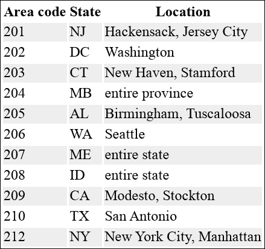
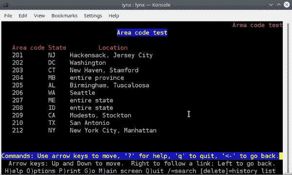

# 第十章：键盘效率

在典型的 Linux 工作站上，一天之中，您可能会打开许多应用程序窗口：网页浏览器、文本编辑器、软件开发环境、音乐播放器、视频编辑器、虚拟机等等。一些应用程序专注于 GUI，例如绘图程序，并且专为鼠标或轨迹球等指针设备设计。其他应用程序则更注重键盘操作，例如终端程序中的 Shell。典型的 Linux 用户可能每小时要在键盘和鼠标之间切换数十次（甚至数百次）。每次切换都需要时间。它会减慢您的工作效率。如果能减少切换次数，您将能够更高效地工作。

本章讨论如何在键盘上花费更多时间，少用指针设备。十根手指敲击一百个键通常比两根手指在鼠标上更灵活。我不只是在谈论使用键盘快捷键 —— 我相信您可以在不需要本书的情况下查找它们（尽管我会提供一些）。我谈论的是加快一些看似天生适合“鼠标操作”的日常任务的不同方法：操作窗口、从网络检索信息以及使用剪贴板复制和粘贴。

# 使用 Windows

在本节中，我分享了如何高效启动窗口的技巧，特别是 Shell 窗口（终端）和浏览器窗口。

## 即时 Shell 和浏览器

大多数 Linux 桌面环境，如 GNOME、KDE Plasma、Unity 和 Cinnamon，都提供某种方式来定义热键或自定义键盘快捷键 —— 特殊的按键组合，可以启动命令或执行其他操作。我强烈建议您为这些常见操作定义键盘快捷键：

+   打开一个新的 Shell 窗口（终端程序）

+   打开一个新的网页浏览器窗口

有了这些定义好的快捷键，您可以随时即刻打开终端或浏览器，而不管您正在使用的是哪个其他应用程序。^(1) 要设置这些快捷键，您需要了解以下内容：

启动您偏爱的终端程序的命令

一些流行的是 `gnome-terminal`、`konsole` 和 `xterm`。

启动您偏爱的浏览器的命令

一些流行的是 `firefox`、`google-chrome` 和 `opera`。

如何定义自定义键盘快捷键

每个桌面环境的说明略有不同，并且可能会随版本变化而变化，因此最好您在网上查找相关信息。搜索您的桌面环境名称，后面跟上“定义键盘快捷键”。

在我的桌面上，我将键盘快捷键 Ctrl-Windows-T 分配给运行 `konsole`，将 Ctrl-Windows-C 分配给运行 `google-chrome`。

# 工作目录

当您通过桌面环境的键盘快捷键启动一个 Shell 时，它是您登录 Shell 的子进程。其当前目录是您的主目录（除非您已经以某种方式配置为不同目录）。

将此与从终端程序内部打开新 shell 进行对比——通过在命令行中显式运行（比如）`gnome-terminal` 或 `xterm`，或使用终端程序的菜单打开一个新窗口。在这种情况下，新 shell 是*该终端的 shell*的子进程。其当前目录与其父进程相同，这可能不是你的主目录。

## 一次性窗口

假设你正在同时使用几个应用程序，突然需要一个 shell 来运行一个命令。许多用户会抓起鼠标，并在他们打开的窗口中搜索运行的终端。不要这样做——这是在浪费时间。只需用你的快捷键快速打开一个新的终端，运行你的命令，然后立即退出终端。

一旦你为启动终端程序和浏览器窗口分配了快捷键，放心地随意打开和关闭这些窗口。我推荐这样做！定期创建和销毁终端和浏览器窗口，而不是长时间保持它们开放。我称这些短暂存在的窗口为*一次性窗口*。你快速地打开它们，使用几分钟，然后关闭它们。

如果你正在开发软件或执行其他长时间的工作，可能会保留几个终端窗口很长时间，但一次性终端窗口非常适合在一天中的其他时间执行一些随机命令。*弹出一个新终端通常比在屏幕上搜索现有终端更快。* 不要问自己：“我需要的那个终端窗口在哪里？” 然后在桌面上四处查找。创建一个新的，并在其完成任务后关闭它。

同样适用于 Web 浏览器窗口。在经过一整天的 Linux 黑客工作后，你是否会抬头发现你的浏览器只有一个窗口，但却有 83 个打开的标签页？这是使用一次性窗口太少的一个症状。弹出一个窗口，查看你需要查看的网页，然后关闭它。需要稍后再访问页面吗？在浏览器历史记录中找到它。

## 浏览器键盘快捷键

谈到浏览器窗口，确保你知道 表 10-1 中最重要的键盘快捷键。如果你的手已经在键盘上，并且你想浏览新网站，通常按下 Ctrl-L 跳到地址栏或 Ctrl-T 打开一个标签页比使用鼠标更快。

表 10-1\. Firefox、Google Chrome 和 Opera 的最重要的键盘快捷键

| 动作 | 键盘快捷键 |
| --- | --- |
| 打开新窗口 | Ctrl-N |
| 打开新的隐私/无痕窗口 | Ctrl-Shift-P (Firefox), Ctrl-Shift-N (Chrome 和 Opera) |
| 打开新标签页 | Ctrl-T |
| 关闭标签页 | Ctrl-W |
| 在浏览器标签页之间切换 | Ctrl-Tab（向前切换）和 Ctrl-Shift-Tab（向后切换） |
| 跳转到地址栏 | Ctrl-L（或 Alt-D 或 F6） |
| 查找（搜索）当前页面的文本 | Ctrl-F |
| 显示你的浏览历史记录 | Ctrl-H |

## 切换窗口和桌面

当你繁忙的桌面上充满窗口时，如何快速找到想要的窗口？你可以通过指点和点击的方式在混乱中寻找，但通常使用键盘快捷键 Alt-Tab 更快。持续按下 Alt-Tab 键，你将逐个循环浏览桌面上的所有窗口。当到达你想要的窗口时，释放键，该窗口即处于焦点并准备好使用。要反向循环，请按 Alt-Shift-Tab 键。

要在桌面上循环浏览属于同一应用程序的所有窗口，例如所有 Firefox 窗口，请按下 Alt-`（Alt-backquote，或 Alt 加上 Tab 键上方的键）。要向后循环，请加上 Shift 键（Alt-Shift-backquote）。

一旦能够切换窗口，现在是时候谈论切换桌面了。如果你在 Linux 上进行严肃工作，而且只使用一个桌面，那么你会错过一个很好的组织工作的方式。多个桌面，也称为工作区或虚拟桌面，正如它们听起来的那样。你可能不只有一个桌面，而是有四个、六个或更多，每个都有自己的窗口，你可以在它们之间切换。

在运行 KDE Plasma 的 Ubuntu Linux 工作站上，我运行六个虚拟桌面，并为它们分配不同的目的。第一个桌面是我的主工作区，用于电子邮件和浏览，第二个是家庭相关任务，第三个是运行 VMware 虚拟机，第四个用于撰写书籍等工作，第五和第六个则用于任何临时任务。这些一致的分配使得从不同应用程序中快速轻松地找到我的打开窗口。

每个 Linux 桌面环境如 GNOME、KDE Plasma、Cinnamon 和 Unity 都有自己实现虚拟桌面的方式，并且它们都提供一个图形化的“切换器”或“分页器”来在它们之间切换。我建议在你的桌面环境中定义键盘快捷键，以便快速跳转到每个桌面。在我的电脑上，我定义了 Windows + F1 到 Windows + F6 分别跳转到第 1 到第 6 个桌面。

还有许多其他与桌面和窗口工作方式相关的风格。有些人每个应用程序使用一个桌面：一个用于 shell，一个用于网页浏览，一个用于文字处理等等。有些人在小型笔记本屏幕上每个桌面只打开一个全屏窗口，而不是每个桌面上打开多个窗口。找到适合你的风格，只要它既快速又高效即可。

# 从命令行访问网页

点击浏览器几乎已成为网页的代名词，但是你也可以通过 Linux 命令行高效访问网站。

## 从命令行启动浏览器窗口

你可能习惯于通过点击或触摸图标来启动网页浏览器，但你也可以通过 Linux 命令行来完成。如果浏览器尚未运行，请添加一个“&”以使其在后台运行，这样你就可以恢复到 shell 提示符：

```
$ firefox &
$ google-chrome &
$ opera &
```

如果已经有一个浏览器在运行，请省略 ampersand 符号。该命令会告诉现有的浏览器实例打开一个新窗口或选项卡。命令会立即退出并返回 shell 提示符。

###### 提示

后台运行的浏览器命令可能会输出诊断消息并混乱你的 shell 窗口。为了防止这种情况发生，在首次启动浏览器时将所有输出重定向到 */dev/null*。例如：

```
$ firefox &> /dev/null &
```

要从命令行打开浏览器并访问 URL，请将 URL 作为参数提供：

```
$ firefox https://oreilly.com
$ google-chrome https://oreilly.com
$ opera https://oreilly.com
```

默认情况下，上述命令会打开一个新选项卡并将其置于焦点。要强制它们打开一个新窗口，请添加一个选项：

```
$ firefox --new-window https://oreilly.com
$ google-chrome --new-window https://oreilly.com
$ opera --new-window https://oreilly.com
```

要打开私密或隐身浏览器窗口，请添加相应的命令行选项：

```
$ firefox --private-window https://oreilly.com
$ google-chrome --incognito https://oreilly.com
$ opera --private https://oreilly.com
```

上述命令可能会让你觉得输入和努力都很多，但你可以通过为经常访问的网站定义别名来提高效率：

```
# Place in a shell configuration file and source it:
alias oreilly="firefox --new-window https://oreilly.com"
```

同样地，如果有一个包含感兴趣 URL 的文件，请使用 `grep`、`cut` 或其他 Linux 命令提取 URL，并将其传递给命令行上的浏览器。这里有一个带有两列的制表符分隔文件的示例：

```
$ cat urls.txt
duckduckgo.com	My search engine
nytimes.com	My newspaper
spotify.com	My music
$ grep music urls.txt | cut -f1
spotify.com
$ google-chrome https://$(grep music urls.txt | cut -f1)      *Visit spotify*
```

或者，假设你通过一个包含跟踪号的文件来跟踪你正在等待的包裹：

```
$ cat packages.txt
1Z0EW7360669374701	UPS	Shoes
568733462924		FedEx	Kitchen blender
9305510823011761842873	USPS	Care package from Mom
```

示例 10-1 中的 shell 脚本打开适当承运商（UPS、FedEx 或美国邮政服务）的追踪页面，并将追踪号追加到相应的 URL 中。

##### 示例 10-1\. `track-it` 脚本，访问承运商的追踪页面

```
#!/bin/bash
PROGRAM=$(basename $0)
DATAFILE=packages.txt
# Choose a browser command: firefox, opera, google-chrome
BROWSER="opera"
errors=0

cat "$DATAFILE" | while read line; do
  track=$(echo "$line" | awk '{print $1}')
  service=$(echo "$line" | awk '{print $2}')
  case "$service" in
    UPS)
      $BROWSER "https://www.ups.com/track?tracknum=$track" &
      ;;
    FedEx)
      $BROWSER "https://www.fedex.com/fedextrack/?trknbr=$track" &
      ;;
    USPS)
      $BROWSER "https://tools.usps.com/go/TrackConfirmAction?tLabels=$track" &
      ;;
    *)
      >&2 echo "$PROGRAM: Unknown service '$service'"
      errors=1
      ;;
  esac
done
exit $errors
```

## 使用 `curl` 和 `wget` 检索 HTML 页面

Web 浏览器不是唯一可以访问网站的 Linux 程序。程序 `curl` 和 `wget` 可以通过单个命令下载网页和其他网络内容，而不需使用浏览器。默认情况下，`curl` 将其输出打印到标准输出，而 `wget` 则将其输出保存到文件中（之前会输出大量诊断消息）：

```
$ curl https://efficientlinux.com/welcome.html
Welcome to Efficient Linux.com!
$ wget https://efficientlinux.com/welcome.html
--2021-10-27 20:05:47--  https://efficientlinux.com/
Resolving efficientlinux.com (efficientlinux.com)...
Connecting to efficientlinux.com (efficientlinux.com)...
⋮
2021-10-27 20:05:47 (12.8 MB/s) - ‘welcome.html’ saved [32/32]
$ cat welcome.html
Welcome to Efficient Linux.com!
```

###### 提示

有些网站不支持 `wget` 和 `curl` 下载。在这种情况下，这两个命令可以伪装成另一个浏览器。只需告诉每个程序更改其用户代理（标识向 web 服务器表明其身份的字符串）。一个方便的用户代理是“Mozilla”：

```
$ wget -U Mozilla *url*
$ curl -A Mozilla *url*
```

`wget` 和 `curl` 都有大量的选项和功能，你可以在它们的 man 手册中了解到。现在，让我们看看如何将这些命令整合到简洁的单行命令中。假设网站 *efficientlinux.com* 有一个包含文件 *1.jpg* 到 *20.jpg* 的目录 *images*，你想下载它们。它们的 URL 是：

```
https://efficientlinux.com/images/1.jpg
https://efficientlinux.com/images/2.jpg
https://efficientlinux.com/images/3.jpg
⋮
```

一个低效的方法是逐个在 web 浏览器中访问每个 URL 并下载每个图像。（如果你曾这样做，请举手！）更好的方法是使用 `wget`。使用 `seq` 和 `awk` 生成 URL：

```
$ seq 1 20 | awk '{print "https://efficientlinux.com/images/" $1 ".jpg"}'
https://efficientlinux.com/images/1.jpg
https://efficientlinux.com/images/2.jpg
https://efficientlinux.com/images/3.jpg
⋮
```

然后将字符串“wget”添加到 awk 程序中，并将生成的命令通过管道传递给 `bash` 执行：

```
$ seq 1 20 \
  | awk '{print "wget https://efficientlinux.com/images/" $1 ".jpg"}' \
  | bash
```

或者，使用 `xargs` 创建和执行 `wget` 命令：

```
$ seq 1 20 | xargs -I@ wget https://efficientlinux.com/images/@.jpg
```

如果您的`wget`命令包含任何特殊字符，则`xargs`解决方案更好。而“管道到 bash”解决方案会导致 shell 评估这些字符（这是您不希望发生的），而`xargs`则不会。

我的示例有点牵强，因为图像文件名如此统一。在一个更现实的示例中，您可以通过使用`curl`检索页面，通过一系列巧妙的命令来隔离图像 URL（每行一个），然后应用我刚刚向您展示的技术之一来下载网页上的所有图像：

```
curl *URL* | *...clever pipeline here...* | xargs -n1 wget
```

## 使用 HTML-XML-utils 处理 HTML

如果您了解一些 HTML 和 CSS，您可以从命令行解析网页的 HTML 源代码。有时这比手动从浏览器窗口复制和粘贴网页的片段更有效。用于此目的的一套方便的工具是 HTML-XML-utils，在许多 Linux 发行版和[万维网联盟](https://oreil.ly/81yM2)上都可以找到。一个通用的步骤是：

1.  使用`curl`（或`wget`）捕获 HTML 源代码。

1.  使用`hxnormalize`来帮助确保 HTML 格式正确。

1.  识别要捕获的值的 CSS 选择器。

1.  使用`hxselect`来隔离这些值，并将输出导向进一步处理的命令。

让我们扩展“构建区号数据库”的示例，从网上获取区号数据并生成在该示例中使用的*areacodes.txt*文件。为了方便起见，我已经为您创建了一个区号的 HTML 表格供您下载和处理，如图 10-1 所示。



###### 图 10-1\. 一个区号表格，位于[*https://efficientlinux.com/areacodes.html*](https://efficientlinux.com/areacodes.html)

首先，使用`curl`获取 HTML 源代码，使用`-s`选项来抑制屏幕消息。将输出导向`hxnormalize -x`以稍微清理一下。将其导向`less`以逐屏查看输出：

```
$ curl -s https://efficientlinux.com/areacodes.html  \
  | hxnormalize -x  \
  | less
<!DOCTYPE HTML PUBLIC "-//W3C//DTD HTML 4.01//EN"
"http://www.w3.org/TR/html4/strict.dtd">
<html>
⋮
  <body>
    <h1>Area code test</h1>
    ⋮
```

该页面上的 HTML 表格，如示例 10-2 所示，具有 CSS ID `#ac`，其三列（区号、州和位置）分别使用 CSS 类`ac`、`state`和`cities`。

##### 示例 10-2\. 图 10-1 中表格的部分 HTML 源代码

```
<table id="ac">
  <thead>
    <tr>
      <th>Area code</th>
      <th>State</th>
      <th>Location</th>
    </tr>
  </thead>
  <tbody>
    <tr>
      <td class="ac">201</td>
      <td class="state">NJ</td>
      <td class="cities">Hackensack, Jersey City</td>
    </tr>
    ⋮
</tbody>
</table>
```

运行`hxselect`来从每个表格单元格中提取区号数据，提供`-c`选项以省略输出中的`td`标签。将结果打印为一行，用您选择的字符分隔字段（使用`-s`选项）。^(2) 我选择字符`@`是因为在页面上易于看到：

```
$ curl -s https://efficientlinux.com/areacodes.html \
  | hxnormalize -x \
  | hxselect -c -s@ '#ac .ac, #ac .state, #ac .cities'
201@NJ@Hackensack, Jersey City@202@DC@Washington@203@CT@New Haven, Stamford@...
```

最后，将输出导向`sed`，将这一长行转换为三个以制表符分隔的列。编写一个正则表达式来匹配以下字符串：

1.  区号，由数字组成，`[0-9]*`

1.  一个`@`符号

1.  州缩写，即两个大写字母，`[A-Z][A-Z]`

1.  一个`@`符号

1.  城市，即不包含`@`符号的任何文本，`[^@]*`

1.  一个`@`符号

组合部分以生成以下正则表达式：

```
[0-9]*@[A-Z][A-Z]@[^@]*@
```

通过将区号、州和城市括在`\(`和`\) `中，捕获三个子表达式。您现在拥有了`sed`的完整正则表达式：

```
\([0-9]*\)@\([A-Z][A-Z]\)@\([^@]*\)@
```

对于`sed`的替换字符串，提供由制表符分隔并以换行符终止的三个子表达式，这会生成*areacodes.txt*文件的格式：

```
\1\t\2\t\3\n
```

将前述正则表达式和替换字符串组合，以制作此 sed 脚本：

```
s/\([0-9]*\)@\([A-Z][A-Z]\)@\([^@]*\)@/\1\t\2\t\3\n/g
```

完成的命令会生成*areacodes.txt*文件所需的数据：

```
$ curl -s https://efficientlinux.com/areacodes.html \
  | hxnormalize -x \
  | hxselect -c -s'@' '#ac .ac, #ac .state, #ac .cities' \
  | sed 's/\([0-9]*\)@\([A-Z][A-Z]\)@\([^@]*\)@/\1\t\2\t\3\n/g'
201	NJ	Hackensack, Jersey City
202	DC	Washington
203	CT	New Haven, Stamford
⋮
```

## 使用基于文本的浏览器检索渲染的 Web 内容

有时，当您在命令行检索网页数据时，您可能不希望获取网页的 HTML 源码，而是希望获取页面的文本渲染版本。渲染后的文本可能更容易解析。要完成此任务，请使用文本浏览器如`lynx`或`links`。文本浏览器以简化格式显示网页，没有图像或其他花哨功能。图 10-2 显示了由`lynx`渲染的前一节中的区号页面。



###### 图 10-2\. `lynx`渲染页面 [*https://efficientlinux.com/areacodes.html*](https://efficientlinux.com/areacodes.html)

无论您更喜欢哪个程序，`lynx`和`links`都使用`-dump`选项下载渲染后的页面。

```
$ lynx -dump https://efficientlinux.com/areacodes.html > tempfile
$ cat tempfile
                              Area code test

Area code State   Location
201       NJ      Hackensack, Jersey City
202       DC      Washington
203       CT      New Haven, Stamford
⋮
```

###### 提示

`lynx`和`links`也非常适合检查看起来可疑的链接，以确定它们是否合法或恶意。这些文本浏览器不支持 JavaScript 或渲染图像，因此它们不太容易受到攻击。（当然，它们无法完全保证安全性，所以请慎重使用。）

# 命令行剪贴板控制

每个带有编辑菜单的现代软件应用程序都包括剪切、复制和粘贴操作，以在系统剪贴板中传输内容。您可能还知道这些操作的键盘快捷键。但您是否知道您可以直接从命令行处理剪贴板？

首先稍微背景：Linux 上的复制和粘贴操作是称为*X 选择*的更一般机制的一部分。选择是复制内容的目的地，如系统剪贴板。 “X”只是 Linux 窗口软件的名称。

大多数基于 X 构建的 Linux 桌面环境，如 GNOME、Unity、Cinnamon 和 KDE Plasma，支持两种选择。^(3) 第一种是*剪贴板*，它的工作方式与其他操作系统上的剪贴板相似。当您在应用程序中执行剪切或复制操作时，内容将存储在剪贴板中，并且您可以通过粘贴操作检索内容。一个较少见的 X 选择称为*主要选择*。在某些应用程序中选择文本时，即使您没有运行复制操作，它也会被写入主要选择。例如，在终端窗口中用鼠标突出显示文本。该文本会自动写入主要选择。

###### 注意

如果通过 SSH 或类似程序远程连接到 Linux 主机，则通常由本地计算机处理复制/粘贴，而不是远程 Linux 主机上的 X 选择。

表格 10-2 列出了在 GNOME 终端 (`gnome-terminal`) 和 KDE 的 Konsole (`konsole`) 中访问 X 选择的鼠标和键盘操作。如果您使用不同的终端程序，请检查其编辑菜单以获取复制和粘贴的键盘等效操作。

表 10-2\. 在常见终端程序中访问 X 选择

| 操作 | 剪贴板 | 主要选择 |
| --- | --- | --- |
| 复制（鼠标） | 打开右键菜单并选择复制 | 点击并拖动；或双击选择当前单词；或三次单击选择当前行 |
| 粘贴（鼠标） | 打开右键菜单并选择粘贴 | 按下中间鼠标按钮（通常是滚轮） |
| 复制（键盘） | Ctrl-Shift-C | *n/a* |
| 粘贴（键盘），`gnome-terminal` | Ctrl-Shift-V 或 Ctrl-Shift-Insert | Shift-Insert |
| 粘贴（键盘），`konsole` | Ctrl-Shift-V 或 Shift-Insert | Ctrl-Shift-Insert |

## 将选择连接到标准输入和输出

Linux 提供了一个命令，`xclip`，它将 X 选择连接到标准输入和输出。因此，您可以将复制和粘贴操作插入到管道和其他组合命令中。例如，您可以像这样将文本复制到应用程序中：

1.  运行 Linux 命令并将其输出重定向到文件。

1.  查看文件。

1.  使用鼠标将文件内容复制到剪贴板。

1.  将内容粘贴到另一个应用程序中。

使用 `xclip`，您可以大大简化这个过程：

1.  将 Linux 命令的输出管道到 `xclip`。

1.  将内容粘贴到另一个应用程序中。

相反，您可能已经将文本粘贴到文件中，以便使用 Linux 命令处理它，例如：

1.  使用鼠标在应用程序中复制一大段文本。

1.  将其粘贴到文本文件中。

1.  使用 Linux 命令处理文本文件。

使用 `xclip -o`，您可以跳过中间文本文件：

1.  使用鼠标在应用程序中复制一大段文本。

1.  将 `xclip -o` 的输出管道到其他 Linux 命令以进行处理。

###### 警告

如果你在 Linux 设备上以数字方式阅读本书，并且想尝试本节中的一些`xclip`命令，请*不要将命令*复制并粘贴到 shell 窗口中。手动输入命令。为什么？因为你的复制操作可能会覆盖`xclip`访问的同一 X 选择，导致命令产生意外结果。

默认情况下，`xclip`从标准输入读取并写入主选择。它可以从文件中读取：

```
$ xclip < myfile.txt
```

或者来自管道：

```
$ echo "Efficient Linux at the Command Line" | xclip
```

现在将文本打印到标准输出，或将选择内容管道化到其他命令，例如`wc`：

```
$ xclip -o                                         *Paste to stdout*
Efficient Linux at the Command Line
$ xclip -o > anotherfile.txt                       *Paste to a file*
$ xclip -o | wc -w                                 *Count words*
6
```

任何将结果写入标准输出的组合命令都可以将其结果通过`xclip`管道化，就像来自“命令 #6: uniq”的这个例子：

```
$ cut -f1 grades | sort | uniq -c | sort -nr | head -n1 | cut -c9  | xclip
```

使用`echo -n`将主选择清空设置为空字符串：

```
$ echo -n | xclip
```

`-n`选项很重要；否则，`echo`会在标准输出中打印一个换行符，最终会出现在主选择中。

要将文本复制到剪贴板而不是主选择中，请使用`xclip`选项`-selection clipboard`运行：

```
$ echo https://oreilly.com | xclip -selection clipboard               *Copy*
$ xclip -selection clipboard -o                                       *Paste*
https://oreilly.com
```

`xclip`选项可以缩写，只要它们不引起歧义：

```
$ xclip -sel c -o                     *Same as xclip -selection clipboard -o*
https://oreilly.com
```

启动 Firefox 浏览器窗口访问前述 URL，使用命令替换：

```
$ firefox $(xclip -selection clipboard -o)
```

Linux 提供另一种命令`xsel`，它也可以读取和写入 X 选择。它还有一些额外的功能，如清除选择(`xsel -c`)和追加到选择(`xsel -a`)。请随意阅读 man 页并尝试使用`xsel`。

## 改进密码管理器

让我们利用你对`xclip`的新知识，将 X 选择集成到密码管理器`pman`中，来自“构建密码管理器”。修改后的`pman`脚本匹配*vault.gpg*文件中的单行，将用户名写入剪贴板，将密码写入主选择。之后，你可以通过 Ctrl-V 粘贴用户名，通过中键粘贴密码来填写网页上的登录页。

###### 警告

确保你*没有*运行剪贴板管理器或其他跟踪 X 选择及其内容的应用程序。否则，用户名和/或密码会在剪贴板管理器中可见，这是一个安全风险。

新版本的`pman`在示例 10-3 中。`pman`的行为已以下列方式发生了变化：

+   新功能`load_password`加载相关的用户名和密码到 X 选择中。

+   如果`pman`找到一个与搜索字符串匹配的单个结果，无论是按键（字段 3）还是按行中的任何其他部分，它都会运行`load_password`。

+   如果`pman`找到多个匹配项，它会打印所有匹配行中的键和注释（字段 3 和字段 4），以便用户可以再次按键搜索。

##### 示例 10-3。一个改进的`pman`脚本，将用户名和密码加载为选择项

```
#!/bin/bash
PROGRAM=$(basename $0)
DATABASE=$HOME/etc/vault.gpg

load_password () {
    # Place username (field 1) into clipboard
    echo "$1" | cut -f1 | tr -d '\n' | xclip -selection clipboard
    # Place password (field 2) into X primary selection
    echo "$1" | cut -f2 | tr -d '\n' | xclip -selection primary
    # Give feedback to the user
    echo "$PROGRAM: Found" $(echo "$1" | cut -f3- --output-delimiter ': ')
    echo "$PROGRAM: username and password loaded into X selections"
}

if [ $# -ne 1 ]; then
    >&2 echo "$PROGRAM: look up passwords"
    >&2 echo "Usage: $PROGRAM string"
    exit 1
fi
searchstring="$1"

# Store the decrypted text in a variable
decrypted=$(gpg -d -q "$DATABASE")
if [ $? -ne 0 ]; then
    >&2 echo "$PROGRAM: could not decrypt $DATABASE"
    exit 1
fi

# Look for exact matches in the third column
match=$(echo "$decrypted" | awk '$3~/^'$searchstring'$/')
if [ -n "$match" ]; then
    load_password "$match"
    exit $?
fi

# Look for any match
match=$(echo "$decrypted" | awk "/$searchstring/")
if [ -z "$match" ]; then
    >&2 echo "$PROGRAM: no matches"
    exit 1
fi

# Count the matches
count=$(echo "$match" | wc -l)

case "$count" in
    0)
	>&2 echo "$PROGRAM: no matches"
	exit 1
	;;
    1)
	load_password "$match"
	exit $?
	;;
    *)
	>&2 echo "$PROGRAM: multiple matches for the following keys:"
	echo "$match" | cut -f3
	>&2 echo "$PROGRAM: rerun this script with one of the keys"
	exit
	;;
esac
```

运行脚本：

```
$ pman dropbox
Passphrase: xxxxxxxx
pman: Found dropbox: dropbox.com account for work
pman: username and password loaded into X selections
$ pman account
Passphrase: xxxxxxxx
pman: multiple matches for the following keys:
google
dropbox
bank
dropbox2
pman: rerun this script with one of the keys
```

密码会一直保存在主要选择中，直到它被覆盖。要在（比如）30 秒后自动清除密码，请在`load_password`函数的末尾添加以下行。该行在后台启动一个子 shell，等待 30 秒然后清除主要选择（设置为空字符串）。根据需要调整数字 30。

```
(sleep 30 && echo -n | xclip -selection primary) &
```

如果你已经定义了一个自定义的键盘快捷方式来启动终端窗口在“即时外壳和浏览器”，现在你有一个快速访问密码的方法。通过热键弹出一个终端，运行`pman`，然后关闭终端。

# 总结

希望本章节鼓励你尝试一些新技巧，使你能保持双手在键盘上。起初可能需要付出努力，但随着练习，它们会变得快速和自动化。很快你会成为 Linux 朋友羡慕的对象，因为你能够顺利地操作桌面窗口、网络内容和 X 选择，而这是鼠标绑定的群众所不能及的。

^(1) 除非你在捕获所有按键的应用程序中工作，比如一个窗口中的虚拟机。

^(2) 这个例子使用了三个 CSS 选择器，但是一些旧版本的`hxselect`只能处理两个。如果你的版本受到这个缺陷的影响，从[万维网联盟](https://oreil.ly/81yM2)下载最新版本，并使用命令`configure && make`进行构建。

^(3) 实际上有三个 X 选择，但其中一个称为*次要选择*，在现代桌面环境中很少暴露。
