## 第一部分：入门

准备使用你的树莓派来探索 Python！你需要一个树莓派和一些其他部件和电缆来进行第一部分。以下是你的购物清单：

+   树莓派 2 型 B

+   8 GB SD 内存卡，预装了树莓派基金会的 NOOBS（新开箱即用软件）

+   带有微型 USB 电缆的 USB 电源（必须提供 1.2 A @ 5 V）

+   USB 键盘

+   USB 鼠标

+   电视或监视器

+   连接到电视或监视器的电缆（关于你的电视或监视器的特定电缆在第第一章中有讨论）

可选项目：

+   树莓派外壳

第一部分将帮助你开始使用树莓派，并让你用 Python 编程启动。在第第一章中，你将设置你的树莓派，学习如何启动（或引导）它，然后查看 Pi 的桌面。在第第二章中，你将开始探索 Python 语言。你将创建你的第一个程序，并学习如何使用 Python 给树莓派下达指令。

到第一部分结束时，你将知道如何启动树莓派。你将能够编写 Python 程序，并与你的 Pi 交互，使其执行诸如计算奶酪汉堡套餐成本和显示愚蠢信息在屏幕上的事情。

## 第一章：认识树莓派

**在本章中，你将学习如何**

+   *设置你的树莓派*

+   *在你的 Pi 上安装操作系统——Raspbian*

+   *查找和打开应用程序*

+   *在 Python 中编写你的第一段代码*

你认为你可以用树莓派做什么？

> **1**. 玩游戏。
> 
> **2**. 看视频。
> 
> **3**. 创建一个视频游戏。
> 
> **4**. 听音乐。
> 
> **5**. 为舞会制作一个声音混合器。
> 
> **6**. 建造一个机器人。

信不信由你，这些都是你可以自己动手做的项目，如果你学会了用 Python 编程，那么你的天空就是无边的。你可以在你的树莓派上实现很多功能，只要你能够编写一个程序来实现它。但在我们谈论这个之前，让我们先看看树莓派，并了解是什么让它运转。

### 什么是树莓派？

树莓派（有时被称为 Pi），是由英国树莓派基金会发明的一种小型、低成本计算机。它提供了一个易于使用的工具，帮助你学习用 Python 编程（其名称中的 Pi 部分来源于其专注于用 Python 编程）。

大小约等于一副扑克牌，它不像笔记本电脑或台式计算机那样强大；它的计算能力更类似于智能手机。但它缺乏的处理能力，它通过其许多功能来弥补：

+   它在 Python 编程方面的准备情况

+   你可以用它的许多方式

+   它的小尺寸和成本

树莓派及其配套的内存卡预装了所有你需要开始用 Python 编程的软件。输入命令，看看会发生什么。输入你在互联网或杂志上找到的程序，运行它，看看它是如何工作的。树莓派是为了让你通过玩耍、使用和与之交互来学习编码而设计的。

一旦你学会了用 Python 编程，你就可以将树莓派作为各种项目的基石——凭借你的想象力，可能性是无限的！树莓派的小巧尺寸使其便于携带并融入项目。你可以把它藏在架子上，或者装在墙上带摄像头的安全系统中；如果你需要它便携，可以用充电电池组供电；甚至可以把它连接到遥控车上或直升机上。而且如果你不小心弄坏了什么，恢复起来也很简单。即使你弄坏了树莓派，更换起来也很便宜。

核心上，树莓派是一块电路板，它拥有许多计算机中找到的所有组件。下一节将检查树莓派的组件并探讨它们的功能。让我们开始吧！

### 探索你的树莓派组件：硬件

曾经你用放大镜仔细观察过昆虫，或者拆解过玩具吗？人类天生对事物的工作原理感到好奇。不同的部分是什么，它们的功能是什么？哪些部分是独特的？让我们以同样的方式对待树莓派，探索其组件，并学习如何设置它。

幸运的是，你不需要打开它来查看其组件。你可以在手中的绿色电路板上看到树莓派的组件（见图 1.1）。让我们逐一了解树莓派的组件以及它们的功能。我们将重点关注树莓派 2 型 B 版；如果你有树莓派 1 型 B+或 B 版，请参阅附录 B 获取更多信息。

##### 图 1.1\. 树莓派为学习 Python 编程提供了一个极好的平台。它包括许多输入和输出端口，以便你灵活地连接它。就像使用台式计算机一样，在开始使用你的树莓派之前，你需要连接键盘、鼠标、显示器和电源线。

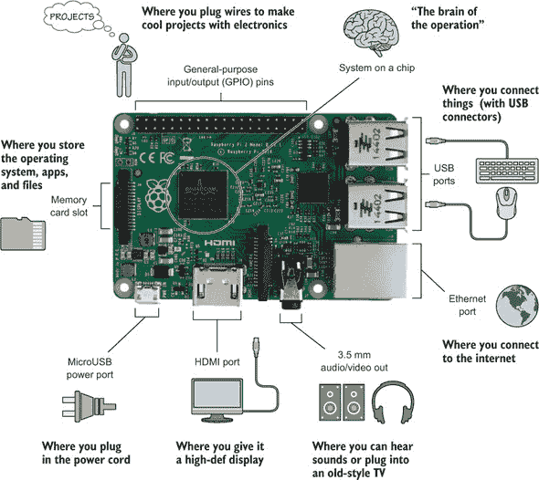


**定义一些技术术语**

*输入* 和 *输出* 是用于计算机通信的术语。

*USB* 是计算机上常见的连接器。它用于连接键盘、鼠标、闪存驱动器以及许多其他计算机外围设备。

*HDMI* 是一种将设备连接到高清电视或显示器的标准方式。我们将在讨论如何将电视或显示器连接到你的树莓派时进一步讨论这个问题。

*以太网* 是一种用于将计算机连接到网络的技术。此端口提供了一种在无线连接不可用时连接到互联网或家庭网络的方式。


#### 给你的树莓派一个舒适的家园：树莓派外壳

我们都喜欢在我们的家中感到温暖舒适。Raspberry Pi 也不例外。做正确的事情，通过将 Pi 放入外壳（见图 1.2）来保护它（图 1.2）。如果你的 Pi 没有附带外壳，你有很多选择。你可以购买一个或者自己制作一个。我最喜欢的做法是从木材、纸板、塑料容器甚至乐高积木中制作自己的外壳。关键是确保你的 Pi 免受意外跌落，理想情况下，避免溅洒。但在你将 Pi 收入外壳之前，让我们先仔细看看它的一些特性。

##### 图 1.2\. 一个外壳保护你的 Raspberry Pi 免受损坏，同时使其易于访问端口。有些人使用外壳来给他们的 Pi 增加独特的个性。你可以购买一个外壳，或者更好的是，自己制作一个。塑料外壳是最常见的，但这些图片展示了由纸张、塑料和铝制成的外壳示例。你甚至可以尝试使用乐高积木来制作一个。

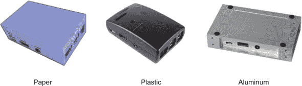

#### 你的 Pi 的脑：系统芯片

认识一下你的 Raspberry Pi 的脑。*系统芯片（SoC）* 是 Pi 电路板中间的黑方块，如图 1.3 所示。图 1.3。这个令人难以置信的芯片是许多部分的组合：中央处理器（CPU）、图形处理器（GPU）、数字信号处理器和 Pi 的工作内存。芯片提供了运行应用程序和播放视频的计算能力、图形能力和内存。

##### 图 1.3\. Raspberry Pi 的系统芯片（SoC）包含其计算和图形处理能力以及工作内存。Pi 使用 ARM11 微处理器作为其 CPU，并使用 VideoCore IV 作为其 GPU。ARM11 微处理器存在于手持式电子产品中，如智能手机和游戏系统。Raspberry Pi 2 Model B 中的 SoC 配备了 1 GB 的 RAM。

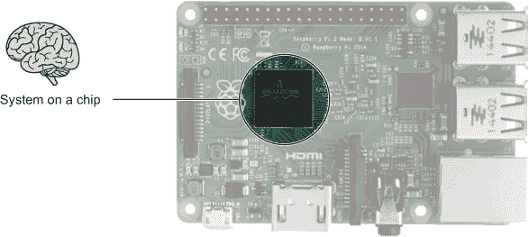

Pi 的 CPU 负责运行应用程序和执行指令。同样的处理器也存在于智能手机和电子阅读器中。把它想象成你大脑中允许你遵循指令和计算数学问题答案的部分。

GPU 就像你大脑中的视觉部分，允许你在脑海中可视化一个 3D 对象或追踪向你投掷的球。它处理 Pi 的多媒体任务，如处理数字图像、绘制图形和播放视频。GPU 为你的 Pi 提供了令人惊讶的高清视频播放能力。中央处理器和图形处理器共享 Pi 的工作内存，或 RAM，它是 SoC 的一部分。


**工作内存：RAM**

问题：你能记住以下杂货店清单吗？*香蕉、牛奶、花生酱、果酱、面包*。再读一遍清单，然后远离书本，尝试从记忆中背诵清单。

为了记住它，你需要将物品的名称保持在你的记忆中。你只需要暂时存储它们。一旦你去商店购买这些物品，你就可以忘记它们了。

当计算机工作时，它做的大同小异。它可能必须每秒记住和处理数百万条指令和信息片段，但一旦处理完毕，它通常会忘记它们。计算机使用工作内存或*随机存取存储器（RAM）*来完成这项工作。它集成在 SoC 中，并使您的树莓派能够通过在工作时记住信息片段并在不再需要时忘记它们来快速处理指令——这与您大脑中的神经元协同工作以记住购物清单的方式非常相似。稍后，我们将讨论长期存储信息以及信息存储的地方。


#### 连接键盘和鼠标：USB 端口

来认识一下树莓派上的*USB*端口。每个金属矩形盒子中包含两个 USB 端口，如图 1.4 所示。图 1.4。USB 代表*通用串行总线*。^([1]) 树莓派提供 USB 端口，以便您连接键盘、鼠标、U 盘和其他 USB 外围设备。

> ¹
> 
> *U*代表*通用*，因为它为计算机制造商和计算机设备制造商提供了一种连接到计算机的标准方式。连接到计算机的东西通常被称为*外围设备*。

##### 图 1.4。树莓派 2 Model B 有四个 USB 端口。它们在板上以两对两的形式并排排列。USB 端口用于将键盘和鼠标连接到您的树莓派。也可以插入 USB 集线器，以允许连接更多的外围设备。

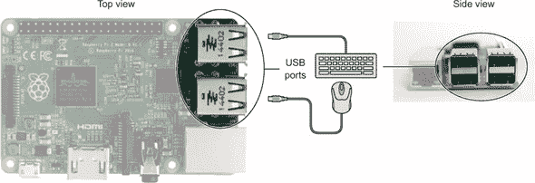


**为什么它们被称为端口？**

回到古代，当罗马人四处走动并用拉丁语交谈时，门或门的单词是*porta*。虽然计算机没有门或闸门，但它们有可以插入东西的地方，称为*端口*。

端口允许电信号进出您的计算机。没有端口，您就无法查看计算机的屏幕、下载网页或移动鼠标。

让我们假设您能够缩小，并且您有特殊的眼镜，可以用来看到这些电信号。当我按下键盘上的 E 键时，您会看到什么？您会看到一个电信号从键盘飞过键盘的线，通过计算机的端口，进入计算机。端口就像一个门，允许信号进入或离开您的计算机。


准备好你的键盘和鼠标。让我们将它们连接到你的树莓派上。

##### 连接键盘

您需要一个可以插入 USB 端口的键盘。图 1.5 展示了带有 USB 连接器的键盘示例.^([2])

> ²
> 
> 如果您没有 USB 连接器的键盘，不要担心。您可以在网上或您当地的电脑或电子产品店以低于 15 美元的价格找到它。

##### 图 1.5。您需要一个 USB 键盘在您的树莓派上打字和输入命令。键盘插入树莓派 2 Model B 上的四个可用 USB 端口之一。

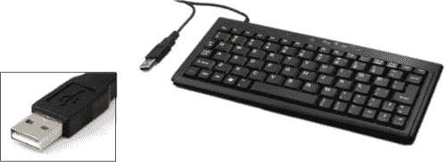

要将键盘连接到你的 Pi，请将键盘的线缆插入树莓派的 USB 端口。你的 Pi 上有四个 USB 端口。你选择哪一个都无关紧要。

| |
| --- |

##### 小贴士

如果键盘的 USB 接口无法插入树莓派的 USB 接口，请翻转接口并再次尝试。USB 接口只能以一个方向插入。

| |
| --- |

太棒了！你的键盘已经连接到 Pi 上了。现在是时候添加鼠标了。

##### 连接鼠标

对于这一步骤，你需要一个可以插入 USB 端口的鼠标。键盘正在使用你的树莓派的四个 USB 端口之一。将你的鼠标插入另一个端口。

##### 另一个选项：无线键盘和鼠标组合

如果你拥有无线键盘和鼠标组合，你可以将 USB 接收器插入 Pi 的一个 USB 端口，而不是使用线缆。这会释放你的一个 USB 端口，如果你决定连接多个 USB 设备（如 USB Wi-Fi 适配器或 USB 闪存驱动器）或你想要在桌子上减少线缆数量时，这会很有用。

太好了！给你的 Pi 提供存储和检索信息的能力是你的下一个任务。

#### 存储记忆：你的 Pi 获得了一张存储卡

我们都喜欢记住对我们重要的事情。生日、假期和节日都是美好的时光，我们发明了帮助回忆它们的方法。你可能使用剪贴簿或相册来存储记忆。即使经过多年，你仍然可以打开这些书籍并回忆起这些过去的事件。

除了工作内存（RAM）外，计算机还需要一种方式来记住事物，即使它们长时间关闭。树莓派，就像所有计算机一样，具有这种内存存储能力，使其能够保存和检索数据、文件和应用程序。就像相册让你回忆假期一样，树莓派的内存存储允许你存储重要的应用程序和信息。当你学习如何保存 Python 指令集或程序时，你会使用这种能力。

##### SD 存储卡

树莓派与大多数计算机不同，因为它的内存存储包含在 SD 存储卡中，而大多数笔记本电脑和台式机使用硬盘。文件、应用程序，甚至是 Pi 的操作系统都存储在 SD 存储卡上，无论是你创建的 Python 游戏还是为 Pi 的新音乐播放器应用程序。如果你购买树莓派套件，它将附带一张 SD 卡（见图 1.6）。^([3])

> ³
> 
> 有关兼容卡的信息，请参阅[`elinux.org/RPi_SD_cards`](http://elinux.org/RPi_SD_cards)。

##### 图 1.6\. SD 存储卡为树莓派提供了存储内存，用于存储所有软件和文件，包括操作系统。树莓派套件附带一张预装了启动 Pi 所需软件的 SD 卡。左边的两张图片显示了 Pi 板底部的 SD 存储卡插槽位置。右边的图片显示了一张插入 SD 卡插槽的 SD 存储卡。

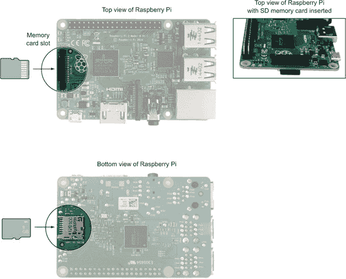

| |
| --- |

**SD 卡有多种尺寸**

SD 卡有三种尺寸：全尺寸 SD 卡（最大）、miniSD 和 microSD（最小）。Raspberry Pi 2 Model B 使用 microSD 卡。

| |
| --- |

你可以通过连接 USB 外设，如 USB 闪存驱动器或 USB 硬盘，为你的 Pi 添加更多存储空间。

##### NOOBS

你的 Raspberry Pi 套件附带了一张预装了 NOOBS 的 SD 卡。由 Raspberry Pi 基金会开发的新开箱即用软件（NOOBS）是一组文件，可以帮助你首次设置 Pi。如果你丢失了它或需要 NOOBS SD 内存卡，你可以在网上购买新的。或者，如果你有一张 SD 卡并想在上面安装 NOOBS，请访问 Raspberry Pi 基金会网站([www.raspberrypi.org/downloads](http://www.raspberrypi.org/downloads))了解如何操作。

##### SD 内存卡插槽

图 1.6 显示了 SD 内存卡插槽的位置。这个薄薄的金属插槽位于 Raspberry Pi 的底部。当你插入时，为了让你的 Pi 工作，它必须有一些初始知识来启动并在屏幕上显示一些内容。除了这些启动信息外，它还必须有一个地方来存储任何新的信息。

##### 将 SD 卡插入插槽

持卡时，让带有金属触点的端面向上并朝向 Pi。将卡片沿板底插入插槽。当卡片被推入插槽时，你会听到一个小咔哒声。卡片通过一个小弹簧机构固定。卡片只能以一种方式插入，所以如果它不合适，就翻过来。如果你需要移除卡片，再次按下它（你会听到咔哒声）；然后你可以将其拔出。

##### 替换丢失或损坏的 SD 卡

如果你丢失了 SD 卡，你将失去存储在卡上的信息、应用程序和操作系统。这就像你在家用电脑上丢失了硬盘。你可以轻松地更换卡片，但你需要从头开始。以下是更换卡片的两种选择：

+   在商店购买 SD 卡并重新设置。建议你购买至少有 8GB 存储空间的 SD 内存卡。你可以从 Raspberry Pi 基金会网站[www.raspberrypi.org/downloads](http://www.raspberrypi.org/downloads)下载并安装启动软件。参见附录 A 了解如何为你的 Raspberry Pi 制作新的 SD 卡。

+   购买预装了 Raspberry Pi 启动软件的 SD 内存卡。你可以在 Raspberry Pi 基金会网站和在线零售商处找到出售的卡片。

##### SD 卡使你的 Pi 内存变得便携

如果你的 Raspberry Pi 坏了，你可以移除 SD 内存卡并将其插入新的 Pi。所有你的文件和软件都会在那里。这就像带着你的相册搬到一个新家。记忆在相册中是安全的，随时准备让你享受。

| |
| --- |

##### 小贴士

你可以为你的 Raspberry Pi 设置多个 SD 卡，并且随时切换它们，以给 Pi 带来完全不同的个性。也许为 Pi 设置一个作为媒体中心的 SD 卡，包括游戏、音乐和视频。为你的 Pi 机器人项目设置另一个 SD 卡。每张存储卡都可以独立设置，具有不同的操作系统、应用程序和文件。更换 SD 卡并重新启动 Pi，你立刻就拥有了一个具有不同特性的 Pi，以满足你的需求。


#### 连接电视或显示器：HDMI 端口

如图 1.7 所示，*HDMI*端口用于将你的 Raspberry Pi 连接到电视或显示器。HDMI 代表*高清晰度多媒体接口*。输出提供的是音频和视频的组合信号——这意味着声音和图像都从这个端口输出并传输到你的电视或显示器。如果你想要清晰、清晰的显示，并且你已经拥有高清电视或显示器，那么你将想要使用 HDMI 输出端口将 Raspberry Pi 连接到它。因为 HDMI 输出包含音频和视频信号，如果你的电视或显示器内置了扬声器，那么你的 Raspberry Pi 的声音可以设置为从扬声器输出，而不是通过 3.5 毫米音频输出。

##### 图 1.7\. Raspberry Pi 上的 HDMI 端口提供了一种可以连接到电视或显示器的全高清音频和视频信号。使用 HDMI 线缆将你的 Pi 连接到你的电视或显示器。根据电视或显示器上的连接器，你可能需要适配器。

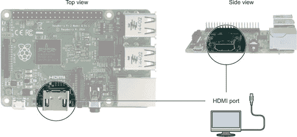

现在你已经了解了 HDMI 端口，让我们看看如何将你的 Pi 连接到电视或显示器。

##### 将你的 Pi 连接到电视或显示器

一旦你决定了要使用的电视或显示器，你需要在电视或显示器上寻找可用的视频输入端口（查看背面或侧面以找到它们）。你看到了哪些端口？不幸的是，制造商经常提供各种不同的端口。把它想象成一场匹配游戏。你的目标是匹配电视上的连接器与 Pi 上的连接器。如果它们不匹配，你需要使用稍后讨论的适配器之一。无论如何，你肯定能解决这个问题。

##### 识别端口并建立连接

花时间研究你的电视或显示器上的连接。尝试识别视频端口，将它们与图 1.8 中的连接器图片进行比较。

##### 图 1.8\. HDMI 和 DVI 是现代电视和显示器上常见的视频输入端口类型。使用 HDMI 端口将 Raspberry Pi 连接到电视或显示器最简单。HDMI 提供高清图像，不需要任何适配器或转换器——只需要一根 HDMI 线缆，这通常包含在许多 Pi 套件中。DVI 端口需要特殊适配器才能与 Pi 连接。

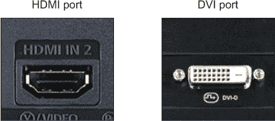

本节提供了如何使用 HDMI 或 DVI 端口将你的 Pi 连接到电视或显示器的说明。如果你的电视或显示器有不同的视频输入端口，请查看附录 B 以获取连接它们的技巧。

##### HDMI

HDMI 端口是一个金属的、大部分是矩形的端口，上面标有*HDMI*。将一根 HDMI 线从屏幕的 HDMI 端口连接到你的 Raspberry Pi 的 HDMI 端口（见图 1.9）。如果你已经连接了 HDMI 线，你现在可以跳过其他端口在 Pi 上的讨论。

##### 图 1.9\. 使用 HDMI 线，可以将 Raspberry Pi 连接到电视或显示器。将线从 Pi 的 HDMI 端口连接到电视或显示器的 HDMI 输入。除了视频外，HDMI 线还包含 Pi 的音频输出，可以通过电视或显示器的扬声器播放。

![01fig09_alt.jpg]

##### DVI

电视和显示器上的 DVI 端口有多种不同的形式。它们都是带有三排八个方形针孔和一个水平孔或一组孔旁边的矩形端口。如果你已经有了 HDMI 线，解决方案是购买一个 HDMI-to-DVI 适配器。你可以在网上或电脑店找到这些适配器。将适配器插入电脑屏幕的 DVI 端口，然后将你的 HDMI 线插入适配器的背面，另一端插入 Raspberry Pi 的 HDMI 端口（见图 1.10）。

##### 图 1.10\. 使用 HDMI-to-DVI 适配器和 HDMI 线，可以将 Raspberry Pi 连接到带有 DVI 端口的电视或显示器。HDMI 线的一端插入 Pi 的 HDMI 端口。另一端连接到适配器，适配器连接到电视或显示器。适配器可以通过在线零售商或当地电脑店购买。

![01fig10_alt.jpg]

另一个解决方案，而不是使用适配器，是购买一个 DVI-to-HDMI 线。你可以在网上或电脑店找到这些线。将线的 DVI 接头插入你的电脑屏幕，然后将 HDMI 接头插入 Pi 的 HDMI 端口。

太棒了！你已经通过将你的 Pi 连接到电视或显示器完成了一个重要的步骤。

#### 其他端口和连接

你会在你的 Raspberry Pi 上找到其他端口。我们将在后面的章节中介绍这些端口，或者你可以参考附录 B 以获取有关特定端口和连接的更多信息。以下是一些包括的内容：

+   ***GPIO 引脚*** —Raspberry Pi 上两排长的引脚用于发送和接收电信号。本书的第三部分将介绍如何编程这些引脚和构建项目。

+   ***互联网*** —你可以通过插入以太网线将你的 Raspberry Pi 连接到互联网或家庭网络。但你可能会发现，使用许多 Raspberry Pi 套件中提供的 USB Wi-Fi 适配器上网是最简单的方法。附录 B 有关于以太网端口和使用 USB Wi-Fi 适配器的信息。

+   ***3.5 mm 音频/视频输出*** —这个小圆形插头用于插入耳机或带电源的扬声器。第八章将向您展示如何将 Raspberry Pi 变成音乐播放器时播放声音。

让我们看看如何为您的 Pi 供电。

#### 为您的 Pi 供电：microUSB 电源端口

Raspberry Pi 的电源通过位于板角附近的 microUSB 电源端口提供。这是您将电源适配器连接到 Pi 的地方；它与许多手机上的端口相同。Raspberry Pi 套件附带一个 microUSB 电源适配器。

##### 图 1.11\. Raspberry Pi 需要至少提供 1.2 安培（A）电流的 microUSB 电源适配器。如果您计划使用 Pi 上的所有 USB 端口，您可能需要一个提供 2 安培（A）或更多电流的适配器。推荐的电压是 5 伏（V），但 Pi 可以在 4.8 伏到 5.2 伏的电压范围内运行。如果您有一个想与 Pi 一起使用的电源适配器，请检查其输出电压和电流，这些信息在充电器的小字中列出。在这个例子中，该充电器的输出为 5.1 伏和 2.5 安培的电流，使其成为 Pi 的合适电源。使用错误的电压或电流不足可能会损坏或摧毁您的 Pi，所以请仔细检查。


##### 注意

只有某些手机充电器可以用来为 Raspberry Pi 供电。该充电器必须产生足够的电流来供电。如果您想走这条路，那么您应该阅读充电器上的详细说明。该充电器必须为 Pi 产生 1.2 安培（A）或更多的电流。


#### 它活着！插入 Pi

在将 Raspberry Pi 连接到电源之前，请通过此快速检查清单：

> **1**. 您确定您的键盘、鼠标和显示器已连接到 Pi 吗？
> 
> **2**. 您是否已打开电视或显示器，并将其设置为正确的输入源？例如，如果您将 Raspberry Pi 插入电视的 HDMI 端口，请确保电视设置为 HDMI 输入。
> 
> **3**. 您是否已将带有 NOOBS 的 SD 卡插入 Pi 中？

一个示例设置如图图 1.12 所示。

##### 图 1.12\. 连接外围设备和插入 SD 卡的 Raspberry Pi 的示例设置。键盘和鼠标连接到 Pi 的两个可用 USB 端口。一个 microUSB 电源适配器插入 Pi；另一端放在桌子上，准备插入墙壁。一根 HDMI 线从 Pi 的 HDMI 端口连接到显示器的后面。以太网端口从路由器（未显示）插入一根以太网线。

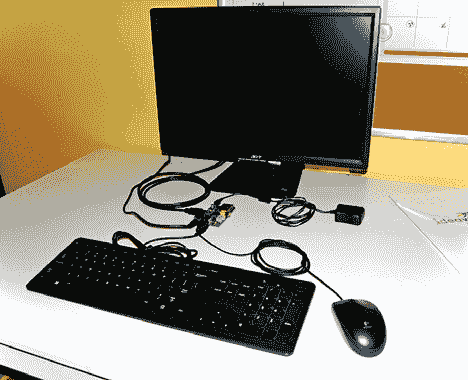


##### 小贴士

电视和显示器通常允许您连接多个视频源。也许您的电视上有 Wii、DVD 播放器和数字视频录像机。这些电视和显示器有选择显示到屏幕上的输入选项。使用您的电视或显示器的输入选择器设置正确的输入。


好的，如果您已经完成了这三个步骤，那么是时候启动您的 Raspberry Pi 了。将电源适配器插入电源插座，并将微型 USB 连接器插入 Pi。您的 Pi 的指示灯将开始闪烁。享受灯光的美丽光芒——这是您的 Raspberry Pi 正在启动的标志。这也被称为 *引导*；这是计算机检测连接到它的设备并启动计算机操作系统的时刻（OS）。有些人认为术语 *引导* 来自于踢马使其开始移动。您可以想象您正在给 Pi 一点“引导”以启动它。

### 让您的 Pi 运行起来：软件

您已经将 Pi 连接好并准备就绪。现在是时候让它运行起来并做一些有用的事情了——为此，您需要一些软件。

操作系统是一组常见的指令或软件，有助于管理计算机。您可能遇到的一些常见操作系统包括 Microsoft Windows、Apple 的 OS X 和 Linux。所有这些操作系统都控制着您的键盘、鼠标、显示器和其他外围设备的连接。最重要的是，操作系统为您在计算机上安装应用程序并使用它们提供了一个基础。

您的 Pi 套件中附带的 SD 存储卡已经包含了在 Pi 上安装多个不同操作系统的文件。我们将逐步安装 Raspbian 操作系统——Pi 的默认操作系统——并对其进行配置。

#### 安装 Raspbian 操作系统

第一次启动 Raspberry Pi 时，您需要在上面安装一个操作系统，然后配置它以便为您良好地工作。让我们一步步来完成第一个任务：安装操作系统。您将在下一节中进行配置。一旦您连接上 Pi，您将看到用于选择操作系统的 NOOBS 菜单，如图 1.13 所示。

##### 图 1.13\. NOOBS 选择菜单允许您选择要安装到 SD 卡并用于 Raspberry Pi 的操作系统。此菜单在您第一次启动 Pi 时出现。

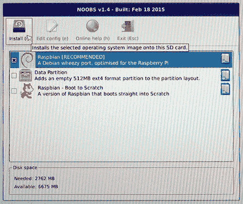

Raspberry Pi 可以安装多种操作系统。Raspberry Pi 基金会推荐使用 Raspbian 操作系统，这也是本书中我们将使用的系统。让我们了解一下如何在您的 Pi 上安装它。

| |
| --- |

**如果您没有看到 NOOBS 软件屏幕怎么办？**

如果您在第一次启动 Pi 后没有看到 NOOBS 软件屏幕，那么有一些事情需要检查。

如果您在插入 Pi 时没有看到指示灯闪烁，请确保您使用的电源插座有电。许多 Pi 用户不小心将 Pi 插入电源插座，并忘记了打开电源插座。听起来很傻，但即使是最好的程序员也会犯错误。

如果您在插入电源供应时 Pi 的指示灯闪烁，但您的显示器屏幕上没有显示任何内容，请确保显示器已插入电源插座，HDMI 线已从显示器连接到 Pi，并且您已打开显示器。

最后，如果你的 Pi 开始启动，你在黑色屏幕上看到许多消息，但你从未看到 NOOBS 选择菜单，那么很可能是你的 SD 卡出现了错误。请参阅附录 A 了解修复 SD 卡的方法。

有时你可能会遇到你的 Pi 的问题。如果你遇到了，请使用附录 A 中的故障排除步骤，并在 Raspberry Pi 基金会网站上搜索解决方案^([a])。

> ^a
> 
> Raspberry Pi 基金会网站是[www.raspberrypi.org](http://www.raspberrypi.org)。


在 NOOBS 选择菜单（见图 1.13），按照以下步骤操作：

> **1**. 选择 Raspbian（确保 Raspbian 旁边的框中有 X；如果没有，点击框以选择它）。
> 
> **2**. 点击菜单顶部的“安装”按钮。
> 
> **3**. 出现一条消息，警告你该过程将安装操作系统，并且 SD 卡上所有现有数据将被覆盖.^([4]) 选择“是”以继续安装。
> 
> > ⁴
> > 
> > 当你被告知所有数据将被覆盖时，这并不包括 NOOBS，它保留在 SD 卡上，以便你需要在任何时候重新安装操作系统。
> > 
> **4**. 等待安装完成。这可能需要 5 到 10 分钟，所以你可以喝点东西或拿点小吃，同时等待。
> 
> **5**. 安装完成后，会弹出一个框，告诉你操作系统已成功安装。点击“确定”，你的 Raspberry Pi 将开始加载 Raspbian。
> 
> **6**. 当它完成加载 Raspbian 后，你的 Raspberry Pi 会自动重启。首先出现一个黑色屏幕，然后显示许多许多消息。不要担心；这些消息是 Pi 执行其启动任务，例如检测键盘、鼠标和电视或显示器。

恭喜你！你已经安装了你的 Raspberry Pi 的操作系统，Raspbian。现在你将想要配置它的工作方式以适应你。

#### 配置操作系统：让它成为你的

你已经完成了在 SD 卡上安装 Raspbian 操作系统，并且第一次运行。接下来你会看到 Raspberry Pi 配置屏幕，如图 1.14 所示。

##### 图 1.14\. 当你的 Pi 第一次启动时，你会看到 Raspberry Pi 配置菜单。这个菜单通过允许你更改设置（如时区和键盘布局）来简化 Pi 的设置。菜单还有一个选项，可以将 Pi 设置为始终启动到 Raspbian 桌面环境。

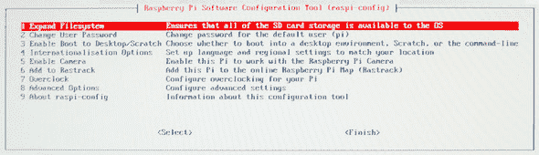


##### 小贴士

你不能使用鼠标来操作这个菜单！请使用箭头键（上、下、左、右）和 Tab 键在菜单中移动。按 Enter 键选择高亮的菜单项。

让我们了解一下你可能想要更改的一些基本配置设置。


##### 更改键盘设置

树莓派在英国制造，因此预设为英国键盘。如果你住在世界其他地方，键盘可能会在屏幕上显示意外的字符。例如，你可能输入一个 # 符号（Shift-3），而你的 Pi 显示的是英镑符号。奇怪，对吧？

你可以使用配置工具通过以下步骤更改 Pi 的键盘布局：

> **1**. 在树莓派配置菜单中，选择选项 4—国际化选项—并按 Enter 键。
> 
> **2**. 选择更改键盘布局，并按 Enter 键。
> 
> **3**. 选择你的键盘型号——例如，戴尔——并按 Enter 键。
> 
> **4**. 你可以看到键盘布局的国家/地区选项。选择适当的地区，并按 Enter 键。
> 
> **5**. 出现键盘布局列表。选择你所在位置的布局，并按 Enter 键。
> 
> **6**. 在接下来的几个屏幕上，你可以设置快捷键。设置成你个人的偏好。如果你不确定，接受默认设置（按 Enter 键直到返回到配置菜单）。

如果需要，你总是可以返回配置工具。你将在后面的章节中学习如何使用命令行模式。

##### 选择你的树莓派启动方式

Raspbian，像大多数操作系统一样，允许你以两种不同的方式使用它（见图 1.15）：

##### 图 1.15\. 树莓派运行 Raspbian 操作系统的命令行模式（顶部）和图形用户界面模式（底部）的示例屏幕图像。命令行模式是基于文本的：你在提示符下输入指令。图形用户界面几乎与 Windows 或 Mac 界面相同，有窗口、图标和菜单，你可以使用鼠标指针与之交互。

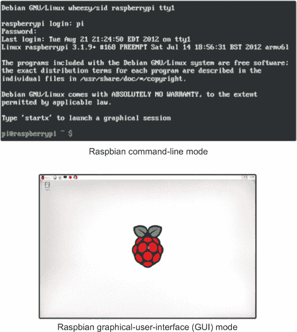

+   **命令行模式** —你向操作系统输入命令。这对于新手来说可能有点困难，因为你需要知道命令并准确输入。由于这种模式使用起来更困难，你在这本书中只有在需要运行需要管理员或超级用户权限的命令时才会使用它。例如，当你创建使用 GPIO 引脚的 Python 程序或想要更改 Pi 的配置时，你需要命令行。

+   **图形用户界面（GUI）模式** —所有内容都显示在窗口、图标和菜单中，你可以通过点击来与之交互。就像在 Windows 和 Mac 电脑上一样，这将是你与 Pi 和用 Python 编程的主要交互方式。它代表了访问应用程序、文件和文件夹的最自然方式。

问题：你更喜欢哪个选项？

+   你的树莓派启动到一个带有闪烁光标的屏幕，等待你输入命令

+   树莓派启动并显示一个带有应用程序图标排列在屏幕上的桌面，等待你用鼠标指向并点击它们

如果你选择了第二个选项，你可以按照以下步骤将 Raspbian 设置为始终启动到桌面：

> **1**.  在 Raspberry Pi 配置菜单中，选择选项 3—启用启动到桌面/Scratch—and 按 Enter。
> 
> **2**.  选择第二个选项——“在图形桌面以用户‘pi’登录”——然后按 Enter。

太棒了！下次你的 Raspberry Pi 启动时，你将被带到 Raspbian 桌面。


##### 小贴士

如果你决定你更喜欢将 Raspberry Pi 启动到命令行，你总是可以在命令行中输入 `startx` 来启动 Raspbian 桌面。

|  |

##### 小贴士

有时你可能会发现自己在使用 Raspbian 图形用户界面，但你想使用命令行。有一个简单的方法可以改变。你可以通过点击菜单按钮，然后选择附件类别并点击 Terminal^([5)) 图标来在窗口中打开命令行模式。

> ⁵
> 
> Terminal 是 LXTerminal 或 Linux 终端的简称。Raspbian 是基于 Linux 的操作系统，*终端* 指的是你可以输入命令的命令行模式。


##### 进行其他更改

Raspberry Pi 配置菜单包括其他选项，如设置摄像头和超频。如果你需要使用它们，这些选项都是可用的。查看 Raspberry Pi 论坛以获取有关这些选项的更多信息。

#### 保存配置和重新启动

如果你对你对 Raspberry Pi 所做的更改感到满意，请按照以下步骤退出 Raspberry Pi 配置工具并重新启动你的 Pi：

> **1**.  在 Raspberry Pi 配置菜单中，使用箭头键选择完成，然后按 Enter。
> 
> **2**.  你会看到这条消息：“你现在想重新启动吗？”选择是，然后按 Enter。

当你的 Raspberry Pi 启动时，它会显示许多行文本。（是的，它又这样做了！不要担心，很快这对你来说就会显得很正常。）这是你的 Pi 连接外围设备并启动操作系统时的启动序列。接下来，将出现一个带有 Raspberry Pi 标志的白色屏幕，以及一组图标——这是你的 Raspbian 桌面（见 图 1.16）。恭喜！你的 Raspberry Pi 准备就绪。

##### 图 1.16\. Raspberry Pi 启动后 Raspbian 桌面的视图。桌面类似于 Microsoft Windows 或 Apple Mac OS X 的桌面。如果你的桌面与此不同，请不要担心。根据你购买 Pi 的时间，你可能收到了带有较旧或较新版本 Raspbian 的 SD 卡。

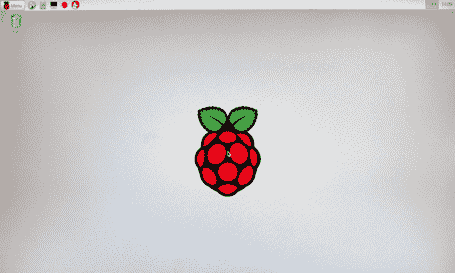

##### 面前的 Pi 的一点点：故障排除

如果你没有看到 图 1.16 中显示的视图，不要气馁。这很可能是因为你没有选择启动到桌面的选项。如果你的屏幕显示 Raspbian 的命令行模式 (图 1.17)，你可以登录并启动 Raspbian 图形用户界面。

##### 图 1.17\. 如果你没有设置你的 Pi 以启动到 Raspbian 桌面，当你的 Raspberry Pi 启动时将显示命令行模式。它会要求你输入用户名和密码。

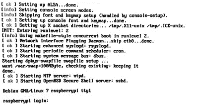

在命令行中，你会被提示输入你的登录名和密码。默认登录名是 `pi`，密码是 `raspberry`。输入这些信息后，使用以下步骤从命令行启动 Raspbian 桌面：

> **1**.  输入 `startx`。
> 
> **2**.  按 Enter 键。

执行命令后，树莓派将启动 Raspbian 图形用户界面模式并显示你的树莓派桌面。如果你遇到不同的问题，请参阅附录 A 以获取故障排除思路。

### 导航：学习 Raspbian

在你的树莓派上四处逛逛，看看随 Raspbian 操作系统预装的一些应用程序。

#### 在你的树莓派上查找和打开应用程序

你的树莓派上有许多应用程序。你可以通过点击桌面左上角的菜单按钮来访问它们（见图 1.18）。享受探索你的 Pi 上预装的内容吧。

##### 图 1.18\. 当你在桌面左上角点击菜单按钮时，Raspbian 应用程序菜单会打开。你可以通过将鼠标移到菜单上列出的类别上，然后点击应用程序来打开一个应用程序。

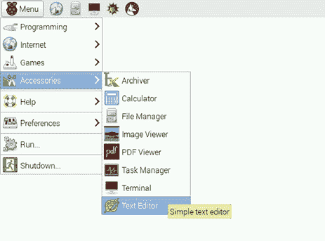

#### 你的文件和文件夹

与 Windows 资源管理器或 Mac Finder 类似，Raspbian 有一些内置的工具，可以让你更容易地在树莓派上导航文件夹和文件。在 Raspbian 中，用于管理文件的程序称为 *文件管理器*，你可以通过点击 Raspbian 桌面左上角的文件夹图标来访问它。图 1.19 展示了图标和文件管理器应用程序。就像在 Windows 资源管理器中一样，你可以

##### 图 1.19\. Raspbian 文件管理器允许你像在 Windows 资源管理器或 Mac Finder 中一样管理文件。你可以通过点击桌面左上角的文件夹图标来访问文件管理器。这是存储在 /home/pi 文件夹中大量文件的树莓派视图。

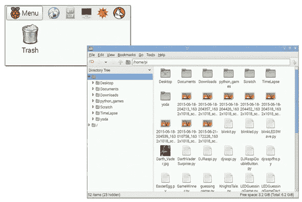

+   通过双击文件夹进入文件夹。

+   拖动文件将它们移动到另一个文件夹。

+   使用文件和文件夹上的右键菜单复制和粘贴文件。

+   重命名文件。

+   通过双击文件打开它们。

树莓派是为编程而设计的。让我们看看你如何在你的树莓派上编写代码。

#### 编写代码

你将学习如何在 Python 编程语言中编写代码。认识一个新的程序，IDLE。IDLE 是一个帮助你编写 Python 程序的工具。IDLE 代表 Integrated DeveLopment Environment。Python 语言是以 Monty Python 命名的，而 IDLE 这个缩写是对 Monty Python 创始成员之一 Eric Idle 的致敬。

按照以下步骤操作：

点击桌面上的菜单按钮。

选择编程 > Python 3。

几秒钟后，IDLE 会打开 Python Shell，如图图 1.20 所示。

##### 图 1.20\. IDLE 是一个开发环境，它使得编写 Python 程序变得更加容易。这是你可以用来逐个输入 Python 命令或指令的 IDLE Python Shell。

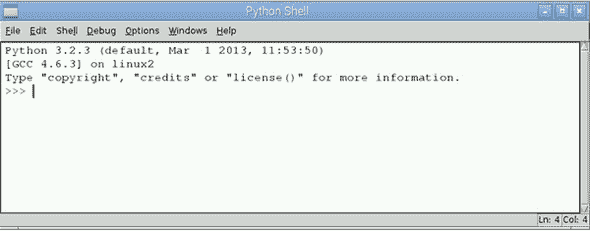

| |
| --- |

##### 注意

之前的 Raspberry Pi 模型在桌面上有 Python 的图标：IDLE 和 IDLE 3。*您将在这本书的练习中使用 Python 3（或 IDLE 3）。* 在较老的 Pi 模型上，IDLE 3 图标打开 Python 3 的 Python Shell。你可能已经猜到了，没有 3 的 IDLE 图标打开的是 Python 2 的 IDLE。

| |
| --- |
| |

##### 注意

要从 Raspbian 命令行启动 Python Shell，请输入 `python3` 并按 Enter。您将看到一个 `>>>` 提示符，可以交互式地输入 Python 命令。当您完成使用 Python Shell 后，输入 `exit()` 并按 Enter 以结束您的 Python 会话。

| |
| --- |

图 1.20 中所示的 Python Shell 允许您输入 Python 命令并按 Enter 执行它们。命令提示符允许您在三个大于号（`>>>`）之后输入命令。

执行以下操作：

> **1**.  输入 `3 + 4`。
> 
> **2**.  按 Enter 键。

屏幕显示答案：7。尝试一些减法：

> **1**.  输入 `17 – 9`。
> 
> **2**.  按 Enter 键。

屏幕显示答案：8。现在让我们让 Python 通过在屏幕上打印一条消息来与你交谈：

> **1**.  输入 `print("I am alive!")`。
> 
> **2**.  按 Enter 键。

你的屏幕应该显示“我活着！”

了不起的工作！你写了三行代码。当你每按一次 Enter 后，Raspberry Pi 的处理器就会执行这些命令并完成你所要求的事情。这是强大的！

### Fruit Picker Extra：在 Pi Store 购物

你的 Raspberry Pi 可以做很多事情。我们在书中包含了特殊部分，称为 *Fruit Picker Extras*，以教你一些 Pi 可以做的不同事情。这个 Fruit Picker Extra 是关于在 Pi Store 购物的。

Pi Store 是一个在线应用商店，提供对 Pi 的游戏、应用和资源的访问（见图 1.21）。您可以从任何设备浏览 Pi Store，例如手机或笔记本电脑。要从 Raspberry Pi 访问它，请双击桌面上的 Pi Store 图标。如果您想将内容下载到 Pi 上，您需要将 Pi 连接到互联网，并且您还需要使用电子邮件地址和密码创建一个 IndieCity 账户。

##### 图 1.21\. 您可以从 Raspbian 桌面上的图标访问 Pi Store。商店允许您浏览和下载包括游戏、教程和数字杂志在内的应用和内容。您将找到免费和付费内容，分为五个类别：游戏、应用、教程、开发工具和媒体。

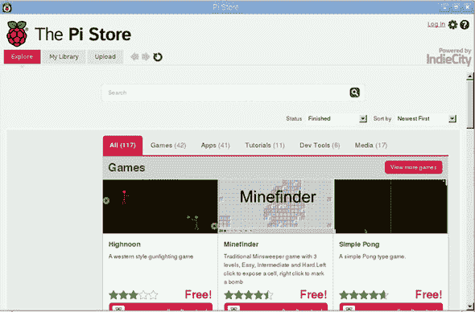

一些应用是免费的；其他则需要付费。您将找到一些很好的资源，例如免费的 *MagPi* 期刊，这是 Raspberry Pi 社区杂志，一本充满技巧、项目和编程教程的数字杂志（在 Pi Store 的媒体类别中寻找这些）。尽情享受将免费游戏和教程下载到 Pi 上吧！


### 挑战

每一章的结尾都会有挑战供你尝试。如果你无法解决它们，请查看书的背面（见附录 C）以获取提示和答案。

#### 寻宝游戏

是时候通过寻宝游戏来探索你的树莓派了。目标是通过对周围环境进行观察、打开应用程序并与之互动来了解更多关于树莓派的信息。尝试完成以下寻宝物品清单：

> **1**.  找到一个松鼠吃其他松鼠的游戏。你能获得“Omega Squirrel”的称号吗？提示：双击 Python Games 桌面图标来寻找它。
> 
> **2**.  在你的树莓派上找到一个计算器应用程序。计算一个数学问题的答案：87x34。提示：计算器在菜单>附件中找到。
> 
> **3**.  在不拔掉你的树莓派的情况下，你能想出如何关闭或重启它吗？
> 
> **4**.  将你的桌面背景设置为黑色。
> 
> **5**.  加分：打开 Scratch，尝试让一只猫跳舞。

想象自己是一名官方的树莓派探险家。如果你想，可以花更多的时间点击一些图标，看看它们的功能。你已经取得了很大的成就！

### 摘要

树莓派在很多方面都与其他计算机相似，但也有一些重要的差异。与其他计算机的相似之处包括以下：

+   树莓派需要键盘、鼠标和显示器，就像其他台式机一样。这些设备的接口是树莓派的一部分。

+   树莓派可以配置为桌面操作系统 Raspbian，它与微软 Windows 或苹果 OS X 类似。

+   尽管它的计算能力有限（类似于智能手机），但树莓派仍然可以让你做许多在台式机或笔记本电脑上做的事情，比如浏览网站、玩游戏和听音乐。

树莓派具有使其特殊和独特的品质和能力。与其他计算机相比，以下是一些关键差异：

+   树莓派的成本和尺寸都较小，使其成为项目的理想选择。

+   树莓派是为 Python 编程而设计的，并预装了 Python 开发环境，这样你就可以立即开始编码。

+   树莓派使用 SD 存储卡来存储所有文件和软件，包括操作系统。

+   它有 GPIO 引脚可以发送和接收电信号。在这本书的第三部分中，你将学习如何使用这些引脚创建与周围世界交互的项目。

## 第二章。探索 Python

**在本章中，你将学习如何通过使用 Python 与你的树莓派进行交互**

+   *快速轻松地进行数学计算*

+   *使用变量存储信息*

+   *让消息显示在屏幕上*

+   *在 Python 中创建并运行你的第一个程序*

编程的有趣之处在于让计算机与你互动。这是让计算机感觉具有人工智能的第一步。

### 玩 Python

学习编程的最好方法之一是通过探索和玩耍。当你玩耍时，你会尝试做一些事情并观察会发生什么。通过体验编程的行为并看到结果，你可以学习。在这种方法中，你会尝试输入不同的命令并观察会发生什么。

通过点击菜单按钮并选择你的树莓 Pi 桌面上的“编程 > Python 3”，打开 Python 3 的 IDLE（见图 2.1）。点击后，你需要等待几秒钟，直到 IDLE 打开。

##### 图 2.1\. 你的树莓 Pi 上的 Python 3 图标打开一个交互式编程 Shell，用于 Python 3.x。

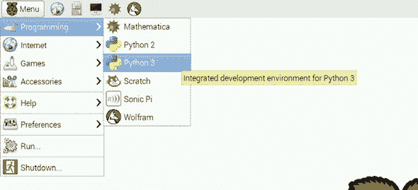


##### 注意

在你的桌面上的“菜单 > 编程”下，既有 Python 3 图标也有 Python 2 图标。请确保你点击的是 Python 3 而不是 Python 2。


Python 3 图标打开 IDLE.^([1]) 你会看到一个提示符，准备接收你的命令——这就是 Python Shell（见图 2.2）。在 Python Shell 打开的情况下，让我们看看如何使用 Python 与你的树莓派进行交互。

> ¹
> 
> 树莓 Pi 预先安装的 Python 版本可能因购买时间而异。截至本文撰写时，大多数树莓派都配备了 Python 版本 3.2.3。

##### 图 2.2\. 在树莓 Pi 桌面上的“菜单 > 编程”下打开 Python 3 应用程序，它会打开 IDLE 并进入 Python 3.x 的 Python Shell。

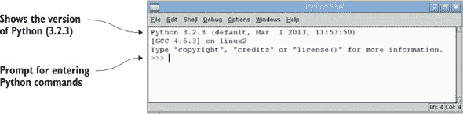

### 发现 Python 的数学运算符

编程语言的核心能力之一是进行数学运算，或者说，用程序员的术语来说，执行数学操作。让我们尝试不同的数学运算，看看哪些可行，哪些不可行。

#### 加法和减法

假设你去了你最喜欢的餐厅，点了一份汉堡、薯条和橙味汽水。你想知道你需要付多少钱。菜单（见图 2.3）上写着汉堡是 5.49 美元，薯条是 1.99 美元，橙味汽水是 1.49 美元。

##### 图 2.3\. 你最喜欢的汉堡餐厅的菜单


使用 Python 来计算总额。在 IDLE Python Shell 中输入

```
>>> 5.49 + 1.99 + 1.49
```

按下 Enter 键查看 Python 计算结果：8.97，或 $8.97（见图 2.4）。

##### 图 2.4\. 在 Python 中使用 + 符号进行加法运算。

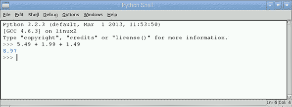

好消息：你记得你有一个 3.00 美元的优惠券，所以让我们再次计算总额。在 IDLE Python Shell 中输入

```
>>> 8.97 – 3.00
```

结果是 5.970000000000001\. 哇！为什么它不是正好 5.97 呢？这是因为计算机如何将数字存储为 1 和 0 有关。我们不会在这里详细讲解，但脚注^([2])中有一个网页链接，你可以了解更多信息。目前，这个数字对于你的计算来说已经足够接近了。

> ²
> 
> 在这里了解更多关于十进制数学（也称为 *浮点数学*）的信息：[`docs.python.org/3.4/tutorial/floatingpoint.html`](https://docs.python.org/3.4/tutorial/floatingpoint.html)。

如你所见，Python 在进行数学运算方面相当出色，并使用熟悉的运算符进行加法和减法：

+   加法运算符（`+`）计算两个数字的和：

    ```
    >>> 4 + 5
    ```

    结果是 9。

+   减法运算符 (`-`) 计算两个数字之间的差：

    ```
    >>> 8 - 5
    ```

    结果是 3。


**Python 风格：运算符和数字的间距**

尝试输入 24 加 32，在加号 (`+`) 和数字之间没有任何空格：

```
>>> 24+32
```

然后尝试在它周围有很多空格：

```
>>> 24    +      32
```

两者都得到了相同的答案：56\. 当你做数学时，数字和运算符之间的空格数量并不重要。Python 忽略额外的空格并计算总和。

最好的方法是什么？嗯，Pythonista（这个名字是给那些用 Python 编程的人起的）认为你的代码应该是易于阅读的。Python 风格指南^([a])建议在数学运算符前后使用空格。你不必这样做，但这样做更容易阅读！

> ^a
> 
> Python 风格指南被称为 PEP 8，可以在网上找到：[www.python.org/dev/peps/pep-0008](http://www.python.org/dev/peps/pep-0008)。


让我们看看你可以在 Python 中做哪些其他数学运算。


##### 小贴士

当输入大数字时，不要输入逗号来分隔每三位数字。因此，1000 应该输入为 1000\. Python 无法解释数字中的逗号分隔符，所以如果你添加了它们，你会得到一些奇怪的结果。Python 会将逗号解释为你正在输入一个数字列表。例如，12,231 被解释为两个数字的列表：12 和 231。你将在本书的第二部分中了解更多关于列表的内容。


#### 乘法和除法

在狼吞虎咽地吃完汉堡后，你发现自己还想吃两球冰淇淋和一块草莓派作为甜点。冰淇淋每球 $1.79，派每片 $3.50，所以你的总账单是多少？

使用 Python 来找出答案。尝试使用 Python 的乘法运算符 (`*`):

```
>>> (2 * 1.79) + 3.50
```

你的总账单是 $7.08\. 你还可以看到你可以使用括号来分组。

你的三个朋友和你一起在餐厅吃饭，每个人都点了甜点。在更多的冰淇淋和派之后，总账单变成了 $33.36\. 他们都同意平均分摊账单。使用 Python 的除法运算符 (`/`) 来计算他们每个人应该支付的价格：

```
>>> 33.36 / 3
```

结果是每份 $11.12。这可是很多甜点了！

在吃饱了之后，你观察了 Python 执行乘法和除法以及你可以如何使用括号进行分组：

+   乘法运算符 (`*`) 给你两个数字的乘积：

    ```
    >>> 7 * 3.14
    ```

    结果是 21.98。

+   除法运算符 (`/`) 可以用来除以两个数字：

    ```
    >>> 40 / 8
    ```

    结果是 5。

+   括号可以用来分组数字，以便它们先被评估：

    ```
    >>> (3 + 7) * 10
    ```

    Python 的答案是 100。

你认为这会得到什么结果？

```
>>> 3 + (7 * 10)
```

如果你猜到 73，你就对了。如果你改变括号的位置，你会得到不同的答案。当我们检查运算顺序时，我们会更多地讨论这个问题。

#### 确定整数和余数

你的朋友告诉你今年还有 19,272 分钟的学校时间。你如何计算出多少小时和分钟？首先，你将 19,272 除以 60，因为一小时有 60 分钟。你会发现结果是 321 小时余 12 分钟。在 Python 中，你有两个运算符可以给出除法总和的整数部分和余数：

+   `//` (地板除法) 给出整数部分：

    ```
    >>> 19272 // 60
    ```

    结果是 321。

+   `%` (取模) 给出余数：

    ```
    >>> 19272 % 60
    ```

    结果是 12。

你已经除了一些大数，但让我们看看 Python 如何处理更大的数。

#### 指数

你可能在天文学中学到的一个有趣的事实是，地球到太阳的距离大约是 1.496 × 10⁸ km。让我们用 Python 来表示这个数字。在 Python 中，你使用指数运算符 (`**`) 如下所示：

```
>>> 1.496 * 10**8
```

Python 的答案是 149600000.0 km。

指数运算允许你取两个数 (*a*, *b*) 并将一个数提升到另一个数的幂(*a*^b)。Python 使用两个数之间的指数运算符 (`**`) 来执行此操作。例如，如果你想将 2 提到三次幂，你会输入

```
>>> 2 ** 3
```

结果是 8 `(2 * 2 * 2 = 8)`。

再试一次：

```
>>> 122 ** 5
```

结果是 27,027,081,632 (`122 * 122 * 122 * 122 * 122 = 27027081632`）。

| |
| --- |

##### 注意

在 Python 的旧版本中，你可能看到 `122**5` 显示的结果是 27027081632L。这是因为之前 Python 在表示非常长的整数时会在数字后添加字母 `L`。

| |
| --- |

指数运算在解决这类问题时很有用：

+   估算天文距离

+   根据给定的利率计算银行账户余额

+   根据给定的增长率预测动物群体的规模

#### 平方根

你可以通过使用指数 1/2 或 0.5 来找出平方根。这等同于取平方根：

```
>>> 14400**0.5
```

结果是 120.0。

#### 挑战：堆叠 Raspberry Pi！

需要堆叠多少个 Raspberry Pi 才能到达太阳？你可以测量你的 Pi，你会发现 Raspberry Pi 的长度为 85.6 毫米或 0.0856 米。首先，你需要将 Pi 的尺寸转换为千米，通过将 0.0856 除以 1000；然后，将地球到太阳的距离除以 Pi 的千米长度（见 图 2.5）。这将给出太阳的距离，以 Pi 的数量表示。

##### 图 2.5。地球到太阳的距离大约是 149,600,000 km。Raspberry Pi 的长度为 85.6 毫米。

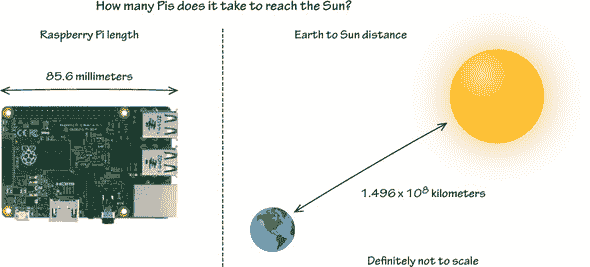

将方程输入 Python：

```
>>> 1.496 * 10**8 / (0.0856 / 1000)
```

Python 的答案是 1747663551401.8694。这是超过 1700 亿个 Raspberry Pi 连接起来的长度。想想这么多 Pi 真是挺有趣的！

| |
| --- |

**数字类型：整数和浮点数**

到目前为止，你已经在计算中使用了整数和小数。在 Python 中，小数也称为 *浮点数*，或简称为 *float*。以下是一些浮点数的例子：

```
1.2
0.00001
3.14159
1000000.01
```

**检查类型**

尝试输入以下内容：

```
>>> type(3.14)
```

Python 会回答您：`<class 'float'>`。您刚刚使用了 Python 内置的工具来检查某物的类型。这些内置工具被称为 *函数*。您稍后会看到更多这些函数。让我们看看这个函数的作用：

```
>>> type(10001)
```

你猜到了吗？这返回了 `<class 'int'>`，其中 `int` 代表 *整数*。


到目前为止，您已经输入了数字并执行了计算。但如果你想要更改一个数字，你必须再次输入所有信息。您也没有保存信息的方法——每次都必须查找并输入数字。好消息！有更好的方法。

### 使用变量存储信息

在编程中，有时存储信息比反复输入信息更容易。*变量* 提供了这种特殊功能。变量为您提供了一种存储信息并在任何时候检索信息的方法。让我们看看一个例子。

想象一下，您拥有一家披萨餐厅，您的价格如 图 2.6 所示。

##### 图 2.6\. 您披萨餐厅的菜单


第一位顾客，丹尼尔点了一份披萨和橙味汽水：

```
>>> 14 + 1.5
```

丹尼尔的餐费为 15.50 美元。

第二位顾客，埃琳点了一份披萨、橙味汽水和鸡翅：

```
>>> 14 + 1.5 + 8
```

埃琳的餐费为 23.50 美元。

每次您想要计算餐费时，您必须记住或查找每个项目的价格并输入它。想象一下，如果您有一份包含 15 个项目和 100 位顾客的菜单，查找项目和将它们的单价加起来将花费很长时间！您还容易出错。让我们让计算机为您做这项工作。

#### 创建变量并分配值

这是在程序中使用变量的完美场所。变量存储信息以使您的生活更轻松。（我们是程序员，我们喜欢偷懒。至少我们总是在寻找更高效的方法来做事情。）让我们再次这样做，但为每种食品项目创建变量。第一步是定义您的第一个变量并设置其值：

```
>>> cheese_pizza = 14
```

让我们仔细看看这段代码是如何在 图 2.7 中工作的。

##### 图 2.7\. 变量存储信息，可以创建并分配一个值。等号用作操作符（也称为 *赋值操作符*），位于变量名左侧和右侧分配给它的值之间。

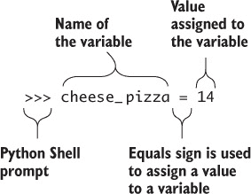

接下来，让我们为橙味汽水和鸡翅创建另外两个变量：

```
>>> orange_soda = 1.5
>>> wings = 8.00
```

在您输入每一行后，屏幕上不会显示任何内容，但 Python 会将变量及其值存储在您的树莓派内存中。

#### 显示变量值

您如何检查变量中存储的内容？就像之前的 `type` 函数一样，您使用 Python 中的另一个内置函数 `print`，如下所示：

```
>>> print(cheese_pizza)
     14
```

*打印* 并非指用纸张和墨水打印某物。在 Python 中，打印意味着在屏幕上显示某物。


##### 注意

当您在 Shell 中工作时，Python 会显示表达式的结果。但如果你将总和分配给一个变量，Shell 不会显示该值，除非您使用 `print`。


使用 `print`，你已经看到 `cheese_pizza` 中存储了值 14。你应该确信你的变量正在保存你放入它们的信息。

让我们看看你是否能使用变量来计算餐费（而无需查找数字）：

```
>>> meal_cost = cheese_pizza + orange_soda
```

打印 `meal_cost` 来查看其值：

```
>>> print(meal_cost)
15.5
```

Python 显示 15.5。现在，让我们计算其他餐点的费用：

```
>>> meal_cost = cheese_pizza + orange_soda + wings
>>> print(meal_cost)
23.5
```

Python 返回 23.5。当你需要重复计算时，你会更加欣赏变量如何节省你的时间和精力。恭喜你——你正在使用变量来存储信息！

| |
| --- |

##### 定义

将值放入变量的过程称为 *赋值*。

| |
| --- |

在你开始创建大量变量之前，让我们学习命名它们的指南。

##### 变量命名

每个人都遇到过无法辨认他人笔迹的问题。作者可能知道他们写了什么，但你却无法解读。你想要避免变量带来的这种混淆。为了做到这一点，有一套创建清晰变量名的指南——这些名字对你和阅读你代码的其他人来说都是有意义的：

+   不要使用任何空格。相反，使用下划线（`_`）。

+   Python 风格指南建议使用小写字母和单词之间的下划线来使你的代码易于阅读。

+   不要以数字开头。

+   不要使用 Python 的任何保留字作为你的变量名（见边栏“注意保留字”）。

这里有一些变量名的例子：

```
>>> shoe_size = 10
>>> age = 16
>>> favorite_color = 'blue'
>>> first_name = "John"
>>> pizza_slices_eaten = 4
```

尽量使用有意义的变量名。

| |
| --- |

**注意保留字**

Python 中某些单词是 *保留的*，因为它们是 Python 语言的一部分。你不能将这些单词用作变量的名称：

```
False      class      finally    is         return
None       continue   for        lambda     try
True       def        from       nonlocal   while
and        del        global     not        with
as         elif       if         or         yield
assert     else       import     pass
break      except     in         raise
```

Python 3.x 保留字被 Python 用于特殊目的，不能用作变量名。

| |
| --- |

##### 赋值：左边和右边

当你创建一个变量并为其赋值时，将变量的名字放在等号的左边。将你想要设置的值放在等号的右边。让我们创建一个名为 `name` 的变量并将其设置为“亚瑟王”：

```
>>> name = "King Arthur"
```

在这一行中，左边创建了一个名为 `name` 的变量，并将字符集“亚瑟王”存储在其中。让我们学习更多关于在变量中存储文本的知识。

#### 在变量中存储字符串

生活不仅仅是数字。你可能想要创建显示荒谬信息或屏幕上讲述故事的程序。这些信息是一种称为 *字符串* 的数据类型。字符串是一组字符。

##### 字符串

Python 允许你在变量中存储一组字符（或字符串）。你已经在“亚瑟王”的例子中使用了字符串。

关于字符串，以下是一些你应该知道的事情：

+   它们必须始终以引号开头和结尾。

+   你可以使用单引号（‘Hi’）或双引号（“Hi”），但不能混合使用（“Hi’）：

    ```
    >>> message = "Greetings Earthlings"
    ```

    或者，使用单引号：

    ```
    >>> message = 'Greetings Earthlings'
    ```

+   当数字放在引号内时，它就是一个字符串。

+   字符串可以是短的（零个或只有几个字符）或很长的。

+   字符串甚至可以是空的。这些被称为 *零长度字符串*：

    ```
    my_string = ""
    ```

##### 字符串的例子

一些字符串的例子会给你一个关于可能性的概念：

```
"Y"
"No"
"Spam"
"Yeah, remarkable bird the Norwegian Blue"

"There he is!"
"No, no sir, it's not dead. It's resting."
"17"
"RUNAWAY, RUNAWAY, RUNAWAY!"
"Tuesday"
```

##### 测量字符串的长度

你可以使用 `len` 函数让 Python 告诉你字符串的长度。我们将在第三章中更多地讨论字符串函数，但这里是一个使用 `len` 的例子：

```
>>> your_nickname = "Pi Master"
>>> len(your_nickname)
9
```

或者尝试一个更长的：

```
>>> quote = "To be, or not to be, that is the question."
>>> len(quote)
42
```

在确定字符串长度时，空格也被计算在内。这是一个讨论空格的好点。

##### 空格计数

虽然空格可能看起来没什么，但它们被认为是字符。你可以创建单个空格或一组空格的字符串，例如

```
short_set_of_spaces = " "
long_set_of_spaces = "    "
```

你现在已经了解了变量和字符串，字符串是一种可以存储在其中的数据类型。让我们看看你如何改变你的变量。

#### 改变变量的值

如你所猜，存储在变量中的值可以更改或更新。试试看。你正在为你的电脑设置一个密码。创建一个变量 `password`，并将其设置为 `bunny`：

```
>>> password = "bunny"
```

现在让我们将密码更改为 `dragon`：

```
>>> password = "dragon"
```

你认为存储在 `password` 中的值是什么：“bunny”还是“dragon”？让我们使用 `print` 函数检查值：

```
>>> print(password)
dragon
```

显示了值 `dragon`。注意 Python 如何在将新值赋给变量时替换存储在变量中的值。

##### 将变量可视化成盒子

将其可视化的一种方法是想象创建一个变量就像制作一个盒子——一个用于存储信息的盒子。当你创建这个盒子时，你给它起一个名字，并在其中存储一个值。图 2.8 是创建变量并将其重新赋值的图形表示。

##### 图 2.8。当创建变量时，它存储在你的树莓派内存中。你可以随时更改变量的值。使用 `print` 函数，你可以在屏幕上显示变量的值。

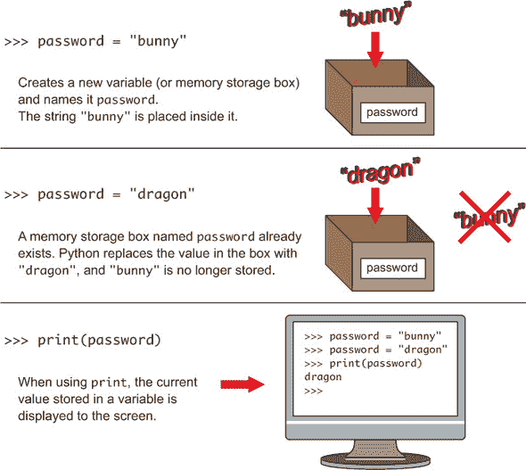

在 Python 中改变变量的值很容易。让我们看看另一个例子。

##### 变量重新赋值

让我们看看 Python 如何评估这些语句：

```
>>> x = 10
```

这将 `x` 设置为值 10。接下来，你用 `x` 做一个计算，并将计算结果存储在 `x` 中：

```
>>> x =  x * 10 + 32
```

当 Python 计算这一行时，它首先处理等号右边的表达式：

> **1**.  Python 计算等号右边的表达式：`x * 10 + 32`。
> 
> **2**.  Python 获取 `x` 的当前值，10，并计算 `10 * 10`。
> 
> **3**.  Python 将 32 加到这个数上。等号右边的数是 132。
> 
> **4**.  它最后计算等号左边的表达式。结果是 132，存储在等号左边的变量 `x` 中。

你已经看到了 Python 可以使用变量存储和检索信息。变量可以节省你的时间，因为它们持有它们被赋予的值，这意味着你不必记住值或查找它们。变量可以是数字或字符串的形式，你可以使用 `print` 函数检查存储在变量中的值。

太棒了！你已经看到了变量赋值的顺序为什么很重要。检查一下数学运算的顺序是如何重要的。

##### 运算顺序

你认为如果你输入以下内容，Python 会返回什么？

```
>>> (3 * 2) * 5**3 / 25 + 10
```

如果你猜到 40，你是对的。Python 遵循你在数学课上学习的运算顺序。

| |
| --- |

##### 小贴士

你可能还记得学校里学过的 BOMDAS 或 PEMDAS。这个字母模式对于记住在数学方程中评估运算的顺序很有用。Python 遵循相同的运算顺序：括号（或括号），指数（或阶数），乘法和除法，然后是加法和减法。

| |
| --- |

首先评估括号或方括号中分组的内容。`3 * 2` 等于 6。让我们将 `3 * 2` 替换为 `6` 并进行下一步：

```
>>> 6 * 5**3 / 25 + 10
```

接下来分析指数（或阶数）。`5**3` 等于 125（与 `5 * 5 * 5` 相同）：

```
>>> 6 * 125 / 25 + 10
```

乘法和除法接下来，并且从左到右进行。`6 * 125` 是 `750`。`750 / 25` 是 30：

```
>>> 30 + 10
```

最后一步是加法和减法。`30 + 10` 等于 40。图形上，图 2.9 显示了数学中解决示例方程的顺序以及 Python 如何处理它。

##### 图 2.9。Python 遵循数学中使用的运算顺序。你可能知道它是 BOMDAS 或 PEMDAS：括号（或括号），指数（或阶数），乘法和除法，最后是加法和减法。

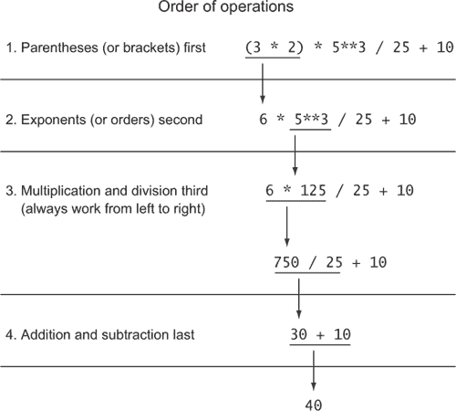

你在 Python 中做数学题做得相当不错。你准备好学习更多关于如何使用 Python 在屏幕上通信和显示文本的知识了。

### 在屏幕上显示文本

与技术互动并让它做出回应很有趣。这可以表现为计算机的俏皮回应，使其感觉更像人类。或者计算机的回应可以更实用，在网站表单上显示个人信息。在两种情况下，你希望你的计算机与你沟通。

在屏幕上显示文本，也被称为 Python 中的 *打印*，是计算机直接与你沟通的一种直接方式。你可以使用打印让你的树莓派做类似这样的事情：

+   显示随机、愚蠢的消息。

+   在冒险游戏中描述神秘场景。

+   输出复杂数学问题的答案。

将信息打印到屏幕上是一种输出各种信息的关键方式。

#### 使用 print 函数

在本章的早期，你使用了 `print` 函数来显示变量的值。让我们再来了解一下如何使用 `print` 函数。尝试像这样将消息“Hello World！”打印到屏幕上：

```
>>> print("Hello World!")
Hello World!
```

仔细看看你如何在 图 2.10 中使用 `print` 函数。Python 将“Hello World！”打印到 Python Shell。

##### 图 2.10\. Python 中的`print`函数在屏幕上显示文本。括号内的字符串必须用单引号或双引号括起来。

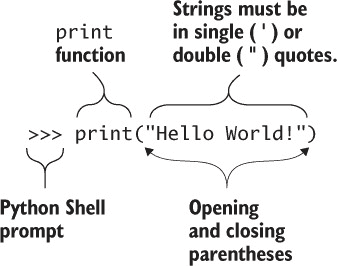

##### 重复文本

让我们尝试一些不同的东西。输入

```
>>> message = "Hello, I am your Raspberry Pi!"
>>> print(message)
```

这将在屏幕上打印一次消息。你可以使用乘法运算符与字符串一起打印多次：

```
>>> print(message * 100)
```

消息在屏幕上横向和纵向重复 100 次（见图 2.11)。

##### 图 2.11\. 如果你使用字符串和乘法运算符（`*`）与 Python 的`print`函数一起使用，它可以重复显示文本在屏幕上。

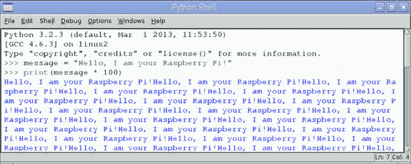

享受这个过程。尝试一些更大的数字和不同的消息，看看你会得到什么。

#### 故障排除

我们都是人类，所以在按键和输入代码时可能会出错。在创建存储字符串的变量时，你可能忘记关闭引号：

```
>>> message = "Hello, I am your Raspberry Pi!
```

注意到感叹号后面的引号缺失了。这听起来可能有些滑稽，但想想引号就像拥抱。当你拥抱某人时，你会用双臂环绕他们。一个字符串必须用引号包围才能完成。如果你在 Python Shell 中运行这段代码，你会收到一个错误，如图 2.12 所示。

##### 图 2.12\. 记住要在字符串的开始和结束处放置引号。如果你忘记关闭引号，Python 将显示一个错误。

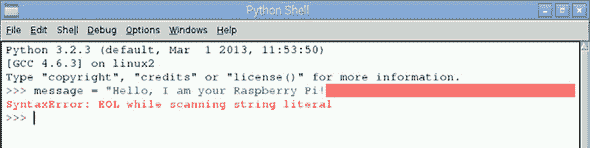

Python 显示一个错误消息（`SyntaxError: EOL while scanning string literal`）。你可以通过再次输入带有前后引号的字符串来修复它。

### 创建程序

再次想象你拥有一家披萨店，并且你想使用 Python 来计算包括税费在内的餐费。一位顾客点了一份两片披萨和橙汁。让我们先创建两个变量来记录菜单价格：

```
>>> pizza_slice = 3.5
>>> orange_soda = 1.50
```

创建两个变量来跟踪披萨片和饮料的数量：

```
>>> num_slices = 2
>>> num_drinks = 1
```

接下来让我们计算不含税的餐费：

```
>>> meal_no_tax = (num_slices * pizza_slice) + (num_drinks *
   orange_soda)
```

定义 5%的税率，并计算税费：

```
>>> tax = 0.05
>>> meal_cost = meal_no_tax + (meal_no_tax * tax)
>>> print(meal_cost)
8.925
```

现在想象如果其中一个或多个数字发生了变化。比如说披萨片现在是$4.75，橙汁是$1.75。你不得不再次输入所有信息。这会花费太多时间。

更好的方法是把八个语句放入一个文本文件中。然后你可以告诉 Python 读取文件并执行指令。


##### 定义

*程序*是一组指令。Python 程序可以创建在文本文件中。程序可以反复运行（或执行）。


现在你可以反复运行程序，并在需要时进行更新。如果菜单项目的价格发生变化或顾客想要不同数量的披萨片，你可以更新程序并再次运行。这将节省大量时间！

计算机程序是一组指令。到目前为止，您已经使用 Python Shell 逐个输入命令。程序允许您创建、保存和运行更复杂的指令集。您可以轻松地编辑您的程序并再次运行它们。您的程序可能只有几行，也可能有数千行长。

#### 使用 IDLE 编写 Python 程序

编写程序需要一种输入指令的方法。IDLE 将是您选择的程序。IDLE 是一个使开发程序更简单的应用程序。

##### Python 的拼写检查器

如果您曾经使用过 Microsoft Word 或 Gmail，您应该熟悉拼写检查器功能。它已经拯救了成千上万的家庭作业免于得到低分，并阻止了拼写错误的电子邮件被发送。每个程序都会突出显示您拼错的单词，这样您就可以轻松地找到它们并进行更正。

当您编写程序时，您希望有一些东西可以帮助您捕捉错误。IDLE 就是这样为您做的。IDLE 会自动为您的 Python 语句着色，以便您知道您正在使用正确的拼写。通过使用着色，IDLE 可以帮助您在输入命令错误时发出警报，并突出显示错误或错误。在后面的章节中，我将向您介绍 IDLE 的一些功能。

##### 集成开发环境

其他编程语言也有类似于 IDLE 的软件应用程序，可以使编程过程更加愉快，帮助防止错误，甚至提出修复建议。这些软件应用程序统称为*集成开发环境（IDE）*。IDLE 是 Python 中最受欢迎的 IDE 之一。

##### 使用文本编辑器

除了 IDLE，您还可以在任何您喜欢的文本编辑器中编写和保存 Python 程序。例如，您可以使用 Leafpad 或 Nano，它们是 Raspbian 附带的简单文本编辑器。请注意：它们允许您编写，但它们不会帮助您避免错误或找到代码中的错误，这使得 IDLE 成为一个更好的选择。

#### 开始新程序

让我们创建我们的第一个程序。在 IDLE Python Shell 中使用时，选择文件 > 新窗口。您将看到一个空白的新窗口出现，顶部标题为“未命名”（见图 2.13）。这是 IDLE 文本编辑器。

##### 图 2.13。顶部窗口是 IDLE Python Shell。底部窗口是 IDLE 文本编辑器，可以用来创建和编辑 Python 程序。您可以通过按 Ctrl-N 或从 IDLE Python Shell 中选择文件 > 新窗口来打开 IDLE 文本编辑器。

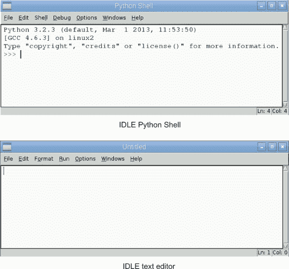

| |
| --- |

##### 小贴士

打开新 IDLE 文本编辑器的快捷键是 Ctrl-N。

| |
| --- |

让我们在 IDLE 文本编辑器中编写一个程序。输入以下文本行：

```
message = "And now for something completely different."
print(message)
```

| |
| --- |

##### 小贴士

文本编辑器会自动突出显示 Python 语言中的关键字。在这个例子中，您会注意到`print`以紫色文本出现，表示它是一个 Python 关键字。字符串以绿色着色。

| |
| --- |

这是从《蒙提·派森的飞行马戏团》中的经典台词。节目以这句台词开始。图 2.14 显示了 IDLE 文本编辑器中的程序。

##### 图 2.14\. IDLE 提供了一个文本编辑器，帮助你编写 Python 程序。编辑器突出显示单词以帮助你编写程序并识别错误。此程序在屏幕上打印一条消息。

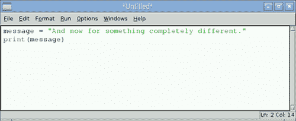

现在你已经编写了一个程序，你将想要保存它，以便你可以稍后打开、运行和编辑它。

#### 保存程序

要保存程序，选择 File > Save。一个保存对话框出现。将文件命名为 FirstProgram，然后点击保存（见图 2.15）。默认情况下，文件将保存到你的/home/pi 文件夹。如果你愿意，你可以为你的 Python 程序创建一个文件夹。

##### 图 2.15\. 使用 File > Save 菜单选项或按 Ctrl-S 保存程序。默认保存位置是/home/pi。当文件保存时，其名称末尾会附加.py，表示它是一个 Python 程序。

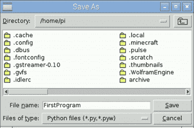

| |
| --- |

##### 小贴士

保存程序的快捷键是 Ctrl-S。

| |
| --- |
| |

##### 注意

当你点击保存时，程序将保存到你的/home/pi 文件夹，扩展名为.py。你可以使用文件管理器打开你的/home/pi 文件夹，查看你保存的文件：FirstProgram.py。

| |
| --- |

当使用 Python 文本编辑器时，你可以通过点击 Run > Run Module 运行程序，或者按 F5。当你这样做时，IDLE Python Shell 成为活动窗口，你将看到打印到 Shell 的消息（见图 2.16）。

##### 图 2.16\. 你可以从 IDLE 文本编辑器运行程序。在 IDLE 中运行程序会在 Python Shell 中显示程序的结果。这通过显示一条消息展示了你的第一个程序的输出。

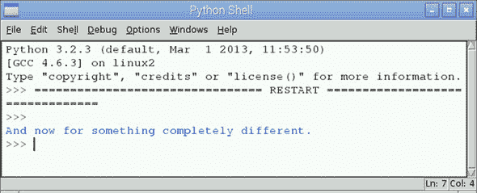

#### Python 解释程序

当你运行你的程序时，Python 会打开文件并解释每一行文本。第一行创建一个名为`message`的变量，存储值为“`And now for something completely different`。”你的程序的第二行调用 Python 的`print`函数，并将变量`message`传递给它以输出到屏幕。太棒了——你将在本书的下一部分继续构建更多程序。

### 水果采摘者额外内容：创建文档

本节特别介绍教你新且不同的事情，你的树莓派可以做什么。这部分额外内容是关于创建文档的。

#### 写下愚蠢的事情并保存它们

让我们从创建一个简单的文本文件并保存它开始。使用树莓派来完成作业可以非常有趣。也许你会写一个描述你最新游戏想法的文档，或者创建一个短篇故事集。与其使用父母的电脑或纸笔，不如使用你的树莓派。

幸运的是，Raspbian 自带一个名为 Leafpad 的应用程序。它是一个用于创建文本文档的轻量级软件程序。

##### 在 Leafpad 中创建文本文件

创建 Leafpad 文档的简单步骤如下：

> **1**. 点击桌面左上角的菜单按钮。
> 
> **2**. 将鼠标悬停在“附件”上。
> 
> **3**. 找到“文本编辑器”，并点击它。这将打开 Leafpad。
> 
> **4**. 在 Leafpad 窗口中输入：`I'm a lumberjack and I'm okay!`（见图 2.17）。
> 
> ##### 图 2.17\. Leafpad 是 Raspbian 附带的一个文本编辑器。您可以从“附件”菜单访问 Leafpad。
> ##### 
> 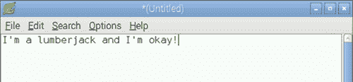

现在您已经创建了文件，让我们保存它（见图 2.18）：

> **1**. 选择“文件”>“保存”，或使用键盘快捷键 Ctrl-S。
> 
> **2**. 出现一个窗口，您可以使用它来保存文件。您需要选择您想要保存文件的文件夹。点击标有 pi 的文件夹。这是您个人的文件夹，您可以在其中保存文件。
> 
> **3**. 在名称框中，输入 `lumberjack` 作为文件名。
> 
> **4**. 点击“保存”按钮。

##### 图 2.18\. 在 Leafpad 中保存文件让您可以选择保存的文件夹并输入文件名。保存窗口的工作方式与您在 Microsoft Word 中保存文件的方式类似。

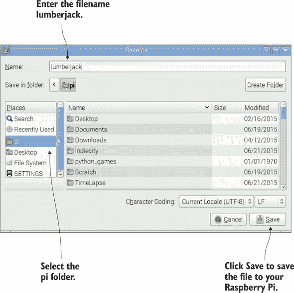

恭喜！您已将 lumberjack 文件保存到 Raspberry Pi 的内存卡中，位于此处：\home\pi（这意味着文件保存在主文件夹中，并在名为 pi 的子文件夹中）。文件包含您输入的句子：“我是一个伐木工，我很好！”。现在可以关闭 Leafpad。


**Nano：命令行文本编辑器**

Leafpad 使用窗口，因此仅从 Raspbian GUI 中可用。但如果您决定更喜欢使用 Raspbian 命令行，有一个方便的文本编辑器叫做 nano，您可以使用。在命令行中输入 `nano` 并按 Enter 打开 nano。Nano 使用键盘控制来打开、保存和关闭文件。以下是一个 nano 文本编辑器的示例：

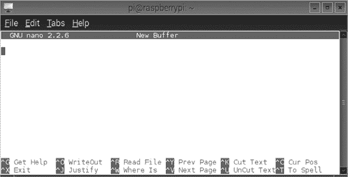

您必须使用键盘，而不是鼠标，在 nano 中进行选择和执行操作。例如，Ctrl-X 退出 nano。一旦您习惯了使用命令键来导航，nano 如果您决定更喜欢使用 Raspbian 的命令行模式，将非常有用。


##### 查找已保存的文件

您已保存文件。现在让我们看看您是否可以使用文件管理器找到它并再次打开它：

> **1**. 打开文件管理器。
> 
> **2**. 点击左侧标有 pi 的文件夹图标。
> 
> **3**. 查看窗口中列出的文件夹和文件。注意，在顶部，pi 文件夹位于 \home\pi。这意味着 pi 文件夹位于 Raspberry Pi 的 SD 卡上的 home 文件夹中。
> 
> **4**. 在文件列表中找到 lumberjack 文件，并双击它（见图 2.19）。
> 
> ##### 图 2.19\. 使用文件管理器查看文件夹内容
> ##### 
> 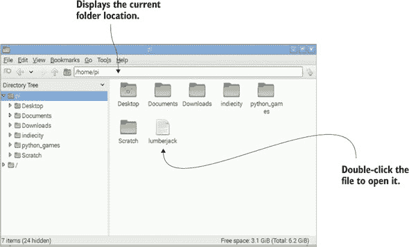

Leafpad 将打开，您将看到您输入的消息。现在让我们关闭 Leafpad 并学习如何输入一些代码。

享受制作文档和探索 Pi 可以做的其他事情！


### 挑战

尝试这些挑战，这些挑战将测试您对数学运算符、打印和变量的使用。

#### 矩阵

使用 `print` 函数，创建一个类似于流行计算机图形中的 1 和 0 的级联屏幕。提示：记得你如何使用 `print(message * 100)` 在屏幕上显示一条信息 100 次。图 2.20 展示了这种效果的一个例子。

##### 图 2.20\. 尝试使用 `print` 函数和字符串来创建一个全屏的 1 和 0。

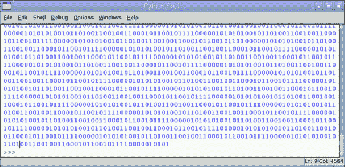

矩阵挑战是关于创建一个全屏的数字。尝试其他数字和字符。

#### 建造砖墙

对于这个挑战，创建一个名为 `brick` 的变量，并在其中存储一个字符串，当反复打印时，会使你的屏幕变成砖墙（参见图 2.21）。

##### 图 2.21\. 这个挑战使用 `print` 函数和一个名为 `brick` 的字符串在屏幕上创建砖墙图案。


你的目标是找出应该存储在名为 `brick` 的变量中的字符串，以便实现这个显示。祝你好运！奖励：你能让你的砖块看起来更像覆盆子，或者让它们包含 RPi 以代表 Raspberry Pi 吗？

#### Pi 电子

对于这个高级挑战，让我们检查从电源流入你的 Raspberry Pi 的电流。然后，让我们看看你是否能以每秒流入 Pi 的等效电子数量来表示那个电流。

| |
| --- |

##### 小贴士

你可能已经了解到，电流是电荷通过某一点的量度。一安培（或安培）的电流等于每秒流过一库仑的电荷。

| |
| --- |

你的 Pi 所使用的电流量取决于你使用了多少个 USB 端口，但让我们假设你的 Pi 正在使用一安培。一安培相当于每秒流过 1 库仑的电荷。一个电子的电荷为 1.60 × 10^(-19) 库仑（或 0.000000000000000000160 库仑）。需要多少个电子每秒才能等于流进你的 Raspberry Pi 的 1 安培？提示：你可以将电子的电荷表示为 `1.60 * 10**-19`。

对于挑战的提示和解决方案，请参阅附录 C。

### 概述

编程是关于能够与计算机交互和通信的能力。你的 Raspberry Pi 配备了 IDLE，这是一个用于 Python 编程的开发环境。Python 提供了两种不同的编程方式：

+   通过交互式地一次输入一个命令使用 Python Shell。Shell 对于快速计算或测试命令很有用。

+   通过创建保存在文件中的程序或命令集。程序允许你反复编写、编辑和运行你的代码。

你可以与你的树莓派进行的第一场对话之一就是使用 Python 进行数学交流。Python 提供了一套完整的数学运算符，你可以使用它们。当你需要在程序中执行计算时，如跟踪屏幕上玩家的位置，数学运算符就非常方便。另一种交互方式是使用 Python 内置的`print`函数在你的树莓派屏幕上显示文本。这让你能够创建在计算机和你之间进行通信的程序。

编程中的一个重要思想是使用变量来存储信息——它们为你节省时间，可以反复使用。在 Python 中，变量可以存储不同类型的数据，包括整数、浮点数（小数）和字符串。使用变量，你可以存储信息并在任何时候检索它。这是一个关键优势，因为它意味着你不必记住值；Python 会为你处理。你还可以更改变量的值，当你想要用不同的输入运行相同的指令时，这是一个非常有用的功能。
