## 第二部分\. 与 Python 玩耍

Minecraft、Pac-Man 和超级马里奥兄弟都是优秀的游戏，它们都是由像您这样的程序员创造的。您将需要获得更多技能才能制作出那样的游戏，但您可以快速创建一些基本游戏。所有这些游戏都让游戏玩家与计算机互动。计算机被编程为具有 *逻辑*：控制游戏如何对玩家的选择做出反应的指令。游戏不断响应用户的输入，无论是按钮点击还是按键。

游戏是学习编程的好方法，因为它们将创造力、乐趣和逻辑思维结合到一个项目中。游戏也是交互式的，需要用户做出选择，并使计算机对这些选择做出响应。目标是使游戏有趣，因此您将使用您的创造力和想象力为您的游戏增添魔力。您决定如何编程您的游戏以及它如何响应！

在 第二部分 中，您将使用 Python 和您的 Raspberry Pi 创建自己的交互式游戏。您将从 第三章 开始，制作一个创建荒谬句子的程序。您将学习如何使用 Python 请求用户输入信息，将信息存储在变量中，并使您的 Pi 响应。第四章 将深入探讨如何创建一个使您的 Pi 更智能的猜谜游戏：它将根据玩家的选择做出简单的决定。您还将了解如何使用 Python 使您的 Raspberry Pi 反复执行某些指令。第五章 中，您将戴上头盔和头灯，进入地下洞穴。您将创建一个基于文本的游戏，玩家可以选择去哪里；根据他们的选择，他们可能会找到财富或面临不幸的死亡。

## 第三章\. 荒谬句子生成器 3000：创建交互式程序

**在本章中，您将了解如何使用 Python** 

+   *为游戏创建一个欢迎信息*

+   *在您的代码中添加注释*

+   *请求用户输入（或键入）信息并使用变量保存它*

+   *连接字符串*

+   *根据该信息将信息显示回用户*

访问一个网站、启动游戏系统或打开移动应用程序，它可能会要求您输入姓名和电子邮件地址并创建密码。这些都是计算机程序，一旦您登录，它们可能会在屏幕顶部显示特殊消息，例如“欢迎，Aaron”（或您的名字）。一些程序非常复杂，会记住您玩过的游戏、获得的徽章、账户余额或查看过的产品。

iTunes、Netflix、Facebook 和 Gmail 都是使用计算机程序来询问您信息、保存信息并根据这些信息与您互动的网站。在本章中，您将了解如何使用 Python 创建一个荒谬有趣的单词游戏，名为 Silly Sentence Generator 3000。

### 创建欢迎信息

在 Silly Sentence Generator 3000 中，游戏玩家（也就是你）被要求输入诸如名词、动词、形容词等单词。你将把这些单词存储为变量，然后使用它们来创建荒谬、不合逻辑的句子。图 3.1 展示了完成程序的一个示例。

> ¹
> 
> 如果你曾经玩过疯狂填词游戏，这很相似。

##### 图 3.1\. Silly Sentence Generator 3000 要求用户输入他们的名字和一些单词，然后从这些单词中创建一个荒谬的句子。

![03fig01_alt.jpg]

把程序想象成一个接收一组输入并创建输出的机器。你将通过创建驱动它的指令来组装这个机器。从概念上讲，这个“机器”可能看起来像图 3.2。改变你输入的单词，你会得到一个完全不同的结果。这就是游戏如此有趣的一部分原因！

##### 图 3.2\. 一个交互式游戏让你输入信息，然后创建输出。

![03fig02_alt.jpg]

让我们看看如何创建这个游戏。一旦创建，你可以随意修改和添加。

#### 开始一个新的程序

如果你打开一个游戏，你看到的第一件事可能是一个主菜单或标题屏幕。让我们利用你关于在屏幕上显示文本的知识来让你的程序显示一个游戏标题。你首先打开 IDLE 并创建一个新的程序。通过点击菜单按钮，在树莓派的桌面上选择编程 > Python 3 来打开 IDLE for Python 3（见图 3.3）。

##### 图 3.3\. 选择菜单 --> 编程 --> Python 3 以在树莓派上打开 Python Shell。

![03fig03_alt.jpg]

给你的树莓派一点时间来打开 IDLE。IDLE 打开后，你会看到 Python Shell（见图 3.4）。

##### 图 3.4\. Python Shell

![03fig04_alt.jpg]

按下 Ctrl-N 或选择文件 > 新建窗口以打开 IDLE 文本编辑器。你会看到一个空白窗口，准备好让你开始输入你的程序（见图 3.5）。

##### 图 3.5\. IDLE 文本编辑器是你可以输入你的 Python 程序的地方。你也可以使用菜单选项来编辑、保存和运行程序。

![03fig05_alt.jpg]

使用你在第二章中学到的 `print` 函数，让我们制作一个标题屏幕：

```
print("*" * 48)
print("* Welcome to the Silly Sentence Generator 3000 *")
print("*" * 48)
```

极好。请随意详细说明欢迎信息和不同角色的艺术作品。在你继续之前，你应该保存程序。

#### 保存程序

通过选择文件 > 保存或按 Ctrl-S 来保存程序。这将打开一个窗口询问你想要将程序保存到哪个位置以及如何命名它。让我们命名为 SillySentence（见图 3.6）。默认情况下，IDLE 将你的文件保存到 /home/pi 文件夹。让我们使用那个文件夹。

##### 图 3.6\. 将您的文件保存为 SillySentence。这样会将文件存储在您的 Raspberry Pi 的 /home/pi 文件夹中，以便您运行程序并对其进行修改。

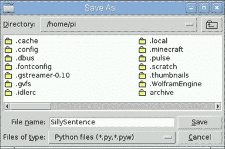

点击保存，文件将保存为 SillySentence.py（.py 文件扩展名由 IDLE 自动添加）。保存文件后，文本编辑器窗口顶部的标题将显示文件名和文件位置，如图 3.7 所示。

##### 图 3.7\. 您的程序的前三行使用 `print` 函数创建 Silly Sentence Generator 3000 程序的欢迎信息。

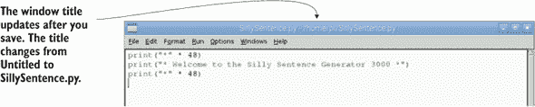

猜测输出。您认为运行程序时会得到什么？

让我们试试。点击运行 > 运行模块（或按键盘快捷键 F5）。Python 将读取您程序的每一行并执行命令。这些命令在屏幕上打印一行 * 字符，欢迎信息，以及另一行 * 字符（见图 3.8）。

##### 图 3.8\. 运行程序 SillySentence.py 在屏幕上显示一条欢迎信息。

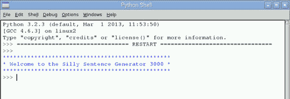

太棒了！现在您为您的游戏有了合适的欢迎信息。接下来，您需要从游戏玩家那里收集一些输入。一些游戏使用按钮点击，但您将在这个游戏中使用键盘。

| |
| --- |

**从命令行运行程序**

运行程序的另一种方式是从 Raspbian 命令行。您可以通过在菜单中找到的终端应用程序访问命令行，即菜单-->附件。一个窗口将打开，显示以下提示：

```
pi@raspberrypi ~ $
```


要在命令行中运行 Silly Sentence 程序，请输入

```
pi@raspberrypi ~ $ python3 SillySentence.py
```

下一个图显示了此命令及其结果。请注意，您在命令行中得到了相同的输出。

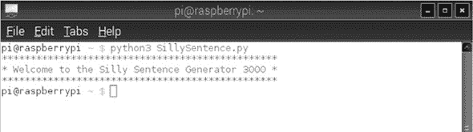

命令行是运行 Python 程序的另一种选项。在这本书的第三部分中，您将看到一些程序需要您从命令行运行它们，因为您必须在 Raspberry Pi 上以超级用户身份运行它们。

| |
| --- |

### 在您的代码中添加注释

想象一本没有文字的漫画书。仅从图片中，您可能很难理解正在发生的事情。也许如果您足够长时间地研究这本漫画，您可能能够弄清楚，但文字对于理解故事非常重要。代码行可能就像一本没有文字的漫画书：您知道正在发生某事，但您可能无法不猜测就能知道。

正因如此，程序员发明了添加注释的想法。*注释* 是代码中的注释，用于解释正在发生的事情。它们既是为了您，也是为了可能阅读您代码的其他人。您可以使用注释来解释您为什么编写这个程序以及程序的部分是如何工作的。

#### 使用标签进行注释

您可以通过在行首添加一个标签（`#`）和一个空格，然后输入您的注释文本来添加注释。让我们在 Silly Sentence Generator 3000 的开头添加注释，以解释程序标题、其目的以及谁编写了它。

##### 列表 3.1\. 给您的程序添加注释

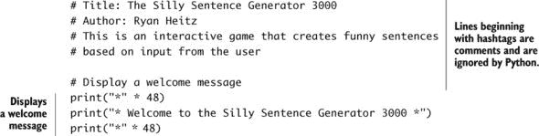

注释对阅读代码的人类很有帮助。但 Python 在运行您的程序时会忽略注释。您可以通过保存您的程序并再次运行它来检查这一点；您会发现您得到的结果与之前相同。

| |
| --- |

**Easter egg：Python 的禅意**

Python 在 Python 风格方面有一个隐藏的惊喜。在计算机程序中，这些惊喜有时被称为 *Easter eggs*。您可以通过在 Python Shell 中输入 `import this` 并按 Enter 键来找到这个蛋。屏幕上会出现一首名为“Python 的禅意”的美丽诗歌。

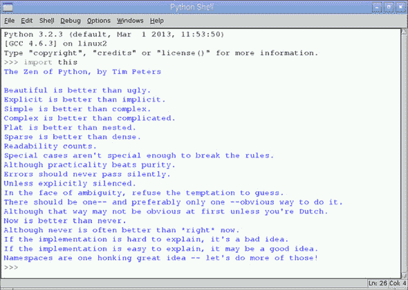

诗歌强调了 Python 的哲学。其中一些谈论了高级主题，但许多行讨论了适用于任何使用 Python 的人的编码方式。第七行捕捉了 Python 中的一个伟大想法：“可读性很重要。”使用简单、易于阅读的指令编写程序，比试图将步骤混合在复杂、长的代码行中要好。在回到您的项目之前，尝试做一些深度的冥想 Python 呼吸。

| |
| --- |

Python 的创造者 Guido van Rossum 表示，代码的阅读频率比写作频率更高。² 可读性是编程中极其重要的部分，也是 Python 程序风格的一个指导原则。注释是保持代码易于阅读和理解的重要方式。

> ²
> 
> 查看由 Python 创造者编写的资源 *PEP 8——Python 风格指南*：[`legacy.python.org/dev/peps/pep-0008`](http://legacy.python.org/dev/peps/pep-0008)。一个名为“愚蠢的一致性是小智者的妖怪”的精彩部分讨论了可读代码的重要性。

注释是您的新朋友，它们会使您的代码易于阅读。您将在收集游戏玩家（或用户）的信息并创建一个愚蠢的句子时继续使用它们来为代码添加注释。

### 获取和存储信息

要从用户那里获取输入，您可以使用 `input` 函数。让我们在您的程序中添加一行代码，询问用户他们的信息并将该信息存储在变量中。

##### 列表 3.2\. 从玩家那里收集输入

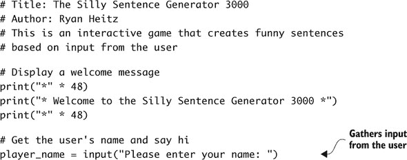

当您使用 `input` 函数时，它会显示一个提示并等待用户的回复。用户输入一些内容并按 Enter 键后，信息将存储在等号左侧的变量中。

在 IDLE 编辑器中，`input` 以紫色高亮显示，表示它是 Python 中一个函数的名称。让我们仔细看看 `input` 函数，看看它是如何工作的（参见图 3.9）。

##### 图 3.9\. `input` 函数向用户显示提示信息。提示信息“请输入您的名字:”告诉用户您希望他们输入或输入的内容。在这种情况下，您是在询问他们的名字。

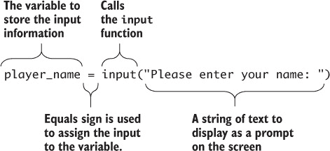

在等号右边，调用`input`函数，并打开一组括号。你可以给`input`函数一个字符串作为提示。这是显示在屏幕上的消息，告诉用户“嘿，请输入一些内容”——但更加礼貌！确保你的字符串以引号（`""`）开头和结尾。

通过按 F5 或选择运行 > 运行模块来运行程序。程序显示欢迎消息，然后显示带有闪烁光标的输入提示。Python 正在等待你的输入：它需要你输入一些内容并按 Enter 键。

在等号左边是存储信息的变量的名字。当你输入一些内容并按 Enter 键时，你输入的值的值将作为字符串存储在变量`player_name`中。


##### Python 2.X

`input`函数在 Python 2.X 中是`raw_input`。


### 连接字符串

就像其他应用程序和网站一样，你希望用户感到受欢迎，所以让我们使用他们的名字并给予他们适当的问候。屏幕上显示的友好消息可能是

```
"Hello, Ryan! Let's make a silly sentence!"
```

为了营造个人化的感觉，你需要创建一条将用户的名字与一些欢迎词结合在一起的消息。你使用加号（`+`）符号来连接字符串：

```
message =  "Hello, " + player_name + "!  Let's make a silly sentence!"
```

如果`player_name`等于“Melissa”，则消息等于

```
"Hello, Melissa!  Let's make a silly sentence!"
```

将此添加到你的程序中，并使用`print`将消息显示在屏幕上。

##### 列表 3.3\. 使用`+`连接字符串

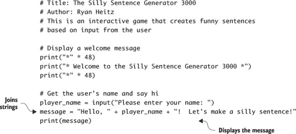

程序让用户输入他们的名字，这个名字存储在变量 p`layer_name`中。在下一行，通过连接字符串创建了一条消息。这条消息显示在屏幕上，为游戏创建个性化的开始。


**更多字符串工具：字符串方法**

为了让生活更简单，Python 包含了一些用于处理字符串的内置工具。这些工具与之前看到的函数类似，但它们被称为*方法*。以下是一个将字符串的第一个字母大写的示例方法：

```
"jOHn".capitalize()
```

`capitalize`方法将“jOHn”转换为“John”。

Python 有一整套内置的方法。字符串的一个方法是`lower`方法，它将字符串转换为全部小写：

```
"RABBIT".lower()
```

这使得“RABBIT”变成了“rabbit”。

另一个方法，`upper`，将所有字母转换为大写：

```
"king Arthur".upper()
```

`upper`方法非常适合大声喊叫。它将“king Arthur”转换为“KING ARTHUR”。

这些方法可以节省你的时间^([a])，并使你更容易完成任务。

> ^a
> 
> 你可以在在线 Python 文档中了解更多关于可用字符串方法的信息：[`mng.bz/9z49`](http://mng.bz/9z49)。

**方法与函数**

方法是一种函数类型，但它们使用*点符号*。这意味着你在项目后面放一个点（`.`），然后是方法的名字。如果你的项目是“John Cleese”并且你想使用的方法是`lower`，你会写成

```
"John Cleese".lower()
```

括号跟在方法名后面。你需要在括号中放入方法所需的所有输入。你可以在网上查看 Python 文档，看看需要什么。

一些方法不需要任何输入，比如字符串方法`capitalize`、`upper`和`lower`。但有些方法，比如`count`，需要输入。想象一下，你有一套测试答案，用`T`代表正确，用`F`代表错误，你想要计算正确答案的数量。你可以使用`count`：

```
>>> TestAnswers = "TTTFFFTTTFTFFFFTTTFFTT"
>>> TestAnswers.count("T")
12
```

测试中有 12 个正确答案。


让我们更进一步，添加更多的输入。

#### 使用多个输入

你的游戏开始了，这是一个美好的开始。现在你需要从玩家那里收集多个输入。让我们先请玩家给出一个名词——一个著名人物的名称：

```
famous_person = input("Enter the name of a famous person: ")
```

接下来，你应该再获取一些单词：

```
adjective1 = input("Enter an adjective: ")
adjective2 = input("Enter another adjective: ")
verb = input("Enter a verb ending in –ING: ")
```

使用这些多个输入，你的代码现在应该看起来像以下列表。

##### 列表 3.4。从玩家那里收集多个项目

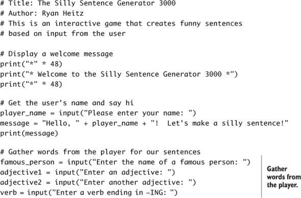

你多次使用`input`函数从用户那里收集一组单词。每个单词都存储在等号左边的变量中。尽量使用有意义的变量名；这样以后更容易记住你存储了什么。

#### 构建句子

现在，让我们通过使用`+`来连接单词来为你的“愚蠢句子生成器 3000”创建句子：

```
silly_sentence = ("The " + adjective1 + " " + player_name + " is " +
                 verb + " the " + adjective2 + " " + famous_person)
```

让我们更仔细地看看图 3.10 中的这一行代码，看看发生了什么。

##### 图 3.10。`silly-sentence`是通过连接一系列字符串创建的。这些字符串是你输入的，并用引号括起来的字符串，以及从游戏玩家那里收集并存储在变量中的字符串的组合。括号是必需的，因为代码太长，无法放在一行中。

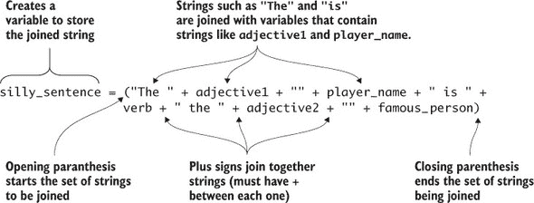

在等号右边，括号括住了要连接以创建句子的字符串。它们使用`+`运算符连接（或*连接*）。因为这一行代码太长，你可以使用一组括号将其分成两行。Python 建议将所有行限制在不超过 79 个字符，这样代码就可以很容易地阅读。查看等号左边，你会看到结果字符串存储在名为`silly_sentence`的变量中。

尤其令人兴奋的是，这段代码会在用户输入不同的单词时创建不同的句子。因为你使用了变量，并且变量存储了用户的输入，所以这真是一个愚蠢的句子生成器！

#### 故障排除

在编写代码时，很容易犯错误，称为*错误*。讨厌错误。为了追踪并修复它们，你需要*调试*你的代码。调试万岁。你可能忘记关闭一组引号，你可能遗漏了一个括号，或者你可能拼错了单词。让我们看看你可能犯的一些常见错误以及如何修复它们。

在最后一个部分，你使用了`+`来连接字符串和存储字符串的变量。看看这个有错误的代码：

```
silly_sentence = ("The  + adjective1 + " " + player_name + " is " +
                 verb + " the " + adjective2 + " " + famous_person)
```

你看到问题了吗？第一个字符串（`"The"”）缺少关闭引号（`"The "`）。如果你运行这个程序，Python 会输出错误（见图 3.11）。给缺少关闭引号的字符串添加关闭引号，然后保存你的程序并再次运行。

##### 图 3.11。如果你忘记关闭字符串周围的引号，当你尝试运行程序时，Python 会给你错误。Python 会在红色中突出显示有错误的行。检查每个字符串以找到并修复错误。

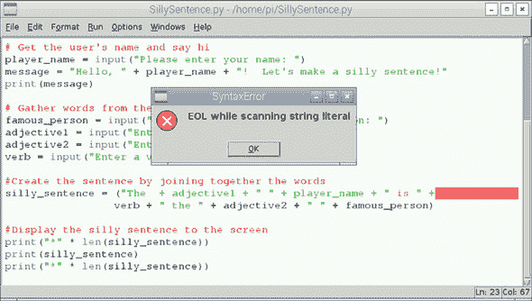

你可能犯的另一个常见错误是拼写变量名错误或使用不同的首字母大小写。这是相同的一行代码，但这次有一个拼写错误的变量和一个大小写错误的变量。你能找到它们吗？

```
silly_sentence = ("The " + adjectve1 + " " + player_name + " is " +
                 verb + " the " + adjective2 + " " + Famous_person)
```

第一个是`adjectve1`，应该是`adjective1`（缺少`i`）。第二个错误是`Famous_person`，应该是`famous_person`（`F`应该小写）。如果你运行这个程序，你会看到的错误显示在图 3.12 中。

##### 图 3.12。编程中的一个常见错误是拼写变量名错误或使用不正确的大小写。显示的错误说程序的第 25 行有问题。错误类型是`NameError: name 'adjectve1 ' is not defined`。

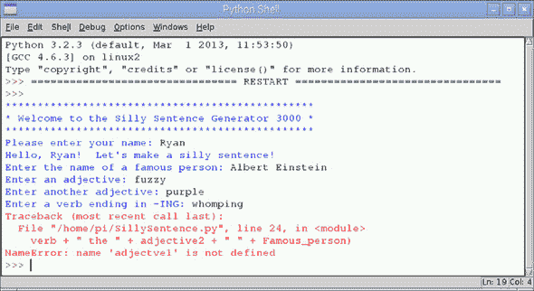


##### 小贴士

变量的拼写和大小写必须始终相同。如果你将变量命名为`my_number`，然后后来输入`my_nomber`或`My_number`，Python 会给你一个错误。


通过修正`adjectve1`的拼写使其变为`adjective1`来纠正错误。修正后，你仍然会收到错误，但这次是因为`Famous_person`的大小写错误（`NameError: name 'Famous_person' is not defined`）。将`Famous_person`的大小写更改为`famous_person`。一旦你进行了修正，保存程序并再次运行。

你已经调试了你的程序。做得好！

### 完成程序：显示愚蠢的句子

你已经制作了你的愚蠢句子，并希望 Python 将其显示给玩家。使用`print`语句打印它，但像你的欢迎信息一样，让我们给它添加一些活力！

```
print("*" * 48)
print(silly_sentence)
print("*" * 48)
```

猜猜它做什么？它在屏幕上打印一排*字符（星号）48 次。然后显示句子，并再次打印一排*符号 48 次。尝试其他字符或字符模式，看看哪个看起来对你来说更好！

它看起来相当不错，但你可以做得更好。通过运行程序来测试你的程序，你会注意到符号的数量与句子的长度不匹配。你编程使其显示正好 48 个星号——不多也不少。相反，让我们更新这些行，使符号重复以匹配愚蠢句子的长度。你将使用另一个内置的 Python 函数`len`，它计算字符串的长度并返回一个数字，告诉你字符的数量：

```
print("*" * len(silly_sentence))
print(silly_sentence)
print("*" * len(silly_sentence))
```

好多了！让我们一起看看代码（见图 3.13）。

##### 图 3.13\. Silly Sentence Generator 3000 是一个有趣的程序，展示了程序如何从用户那里收集信息，与他们互动，并提供更个性化的体验。

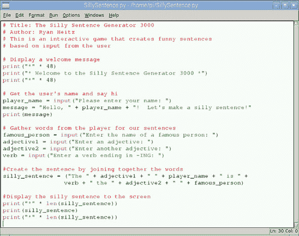

你已经完成了你的程序。让我们进行一些最后的测试，看看它能做什么！见图 3.14 以查看游戏的输出示例。

##### 图 3.14\. Silly Sentence Generator 3000 基于你输入的单词生成一些荒谬的句子。

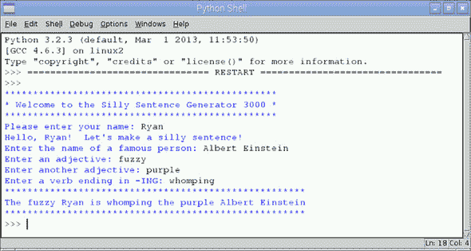

太棒了！你可以自由地更新代码以添加更多的形容词、动词或名词。你已经学会了如何从计算机用户那里获取输入，并通过在屏幕上显示消息与他们互动。

### 水果采摘器额外功能：Minecraft Pi

在这个水果采摘器额外功能中，你将探索 Pi 的另一个独特功能：它有自己的 Minecraft 版本。多亏了 Minecraft 制造商 Mojang 和 Raspberry Pi 基金会的合作，Raspberry Pi 上提供了一款免费、精简版的 Minecraft。自 2014 年 9 月以来，这个版本被称为 Minecraft Pi，并自动与 Raspbian 操作系统一起安装。

#### 什么是 Minecraft？

Minecraft 是一个发生在由方块组成的 3D 虚拟世界中的游戏。在最基本层面上，你四处跑动采矿（通过击打方块来挖掘）和制作物品（在游戏中组合物品以制作新物品）。你还可以在这个虚拟世界中使用不同类型的方块来建造东西。

#### 启动 Minecraft Pi

在菜单>游戏下寻找 Minecraft Pi 图标（见图 3.15）。如果你在 2014 年 9 月之前获得了 Pi，请参阅第六章侧边栏“更新你的 Pi”以了解如何更新 Raspbian。

##### 图 3.15\. Minecraft Pi 是基于 Minecraft Pocket Edition 的精简版免费 Minecraft。与完整版本相比，它有所限制，但仍然非常有趣！

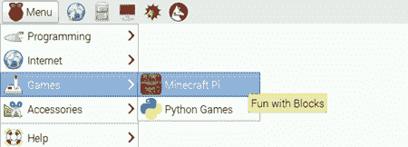

点击 Minecraft Pi 图标以打开游戏。一个 Minecraft 窗口将会打开（见图 3.16）。它有点古怪——你会在 Minecraft 窗口后面看到一个黑色窗口，但这很正常。

##### 图 3.16\. Minecraft Pi 主屏幕允许你开始单人游戏或加入多人游戏。多人选项允许你连接到其他人的世界，但你需要在同一网络中。

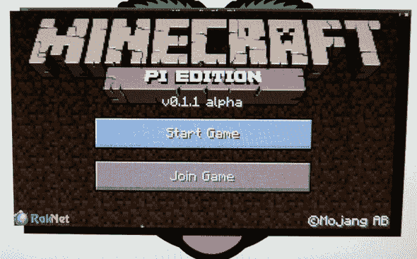

点击“开始游戏”开始游戏。接下来，点击“创建新游戏”创建一个新的世界。加载完成后，你将发现自己在一个方块世界中（见图 3.17）。每个世界都不同，所以你可能看到树木、水、泥土或任何数量的环境。

##### 图 3.17\. 每个 Minecraft 世界都是由方块组成，但各不相同。你可能会发现自己在一个森林里或沙漠中。屏幕底部显示了你背包中的物品。使用鼠标滚轮选择不同的物品，或者按键盘上的数字 1-9。

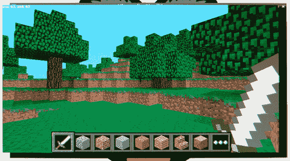

在 Minecraft 中，你是一个可以使用以下控制键四处走动的玩家：

+   ***W*** —向前移动。

+   ***A*** —向左移动。

+   ***S*** —向后移动。

+   ***D*** —向右移动。

+   ***空格键*** —跳跃。

+   ***鼠标移动*** —四处查看或转身。

+   ***Escape*** —退出游戏。

除了基本操作外，这里还有一些你可能需要的其他动作：

+   ***空格键两次*** —飞到空中（双击空格键然后按住以飞起）。按左 Shift 键向下移动。如果你在飞行，双击空格键以回到地面。

+   ***E*** —显示你可以使用的方块和物品的游戏库存（与游戏的完整版本相比有限）。将你想要的物品拖到屏幕底部的下方小方块中。按 Esc 键隐藏库存屏幕。

+   ***滚轮或数字 1-9 键*** —从屏幕底部底部的玩家库存位置中选择一个物品。选中的物品现在在你的手中供你使用。

一旦你掌握了移动的方法，使用鼠标左键来挖掘或破坏方块。使用鼠标右键放置方块或使用手中的工具。当你准备离开时，按 Esc 键退出游戏。


##### 小贴士

要退出 Minecraft Pi，按 Esc > 退出到标题，然后点击角落的 X 来关闭窗口。


#### Python 编程接口到 Minecraft Pi

Minecraft Pi 有一个有趣的材料和工具库存——甚至还有一把剑！更好的是，Minecraft Pi 有一个 Python 编程接口。前往 Raspberry Pi 基金会网站了解更多关于如何使用 Python 与 Minecraft Pi 交互的信息。

探索世界，挖掘地下基地，或建造一个树屋。你将做什么？


### 挑战

尝试这些挑战，看看你是否可以使用`input`函数和字符串创建一些有趣且交互式的项目。

#### 骑士故事创造者 3000

在这个挑战中，尝试使用你关于输入（收集文本）和输出（显示文本）的知识来创建一个骑士故事生成器。这里有一个你可以使用的模板故事：

> *曾经有一位勇敢的骑士，[player_name]，被派去消灭[adjective]的恶棍，[famous_person]。骑着他/她的可靠的[animal]，勇敢的[player_name]穿越到遥远的[travel_place]。[player_name]使用他的[sharp_thing]勇敢地与[famous_person]的军队战斗，直到击败他们。胜利归来，[player_name]大声喊道，“[exclamation]!!!”我代表 Python 声称[travel_place]的土地。*

括号中的单词是为了在程序中创建的变量；你需要让玩家输入这些单词。记得使用`+`来连接字符串，创建一个独特的骑士故事，然后将故事打印到屏幕上。祝你好运！

#### 潜意识信息

*潜意识信息*是一种隐藏的信息，试图让人们思考你希望他们思考的事情。常用于电视广告，这是一种与朋友和父母尝试以获得你想要的东西的绝佳技巧.^([3]) 在这个挑战中，尝试创建一个隐藏在大量字符显示中的信息。信息应该通过询问人的名字、他们想要的东西的名字和字母、数字和符号的模式来构建。在你的程序中，你应该创建一个信息，说“你真的很想给[玩家名字]买一个[东西]”，并将其隐藏在一个字符模式中。图 3.18 显示了示例。

> ³
> 
> 在自己的风险下使用潜意识信息（给瑞恩送披萨！）。如果人们知道你试图操纵他们的思想，他们可能会用他们自己的潜意识信息进行反击。

##### 图 3.18\. 潜意识信息挑战是在屏幕上的一堆字符中隐藏一个秘密信息。你能看到隐藏的信息吗？

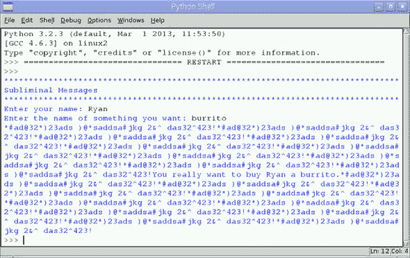

在这个例子中，隐藏的信息是，“你真的很想给瑞恩买一个玉米卷。”要狡猾一点，看看你能否找到一种方法来创建和隐藏一个潜意识信息！

### 概述

在本章中，你学习了如何编写交互式程序，从一个人那里获取信息并提供娱乐性回应：

+   使用`input`函数从一个人那里收集文本输入。使用变量和等号来存储人们输入的信息。以下是一个要求用户告诉你他们最喜欢的颜色并将其保存到名为`favorite_color`的变量中的示例：

    ```
    favorite_color = input("What is your favorite color?")
    ```

+   通过在行首添加一个井号（`#`）和一个空格来为你的程序添加注释：

    ```
    # A comment tells you about the code
    # They help you read the code,
    # but they are ignored by Python
    ```

+   使用`+`来连接字符串。

+   当你需要连接超过单行的字符串时，请使用括号：

    ```
    name = input("What is your name?")
    favorite_color = input("What is your favorite color?")
    message = ("Your name is: " + name + " and your "+
               "favorite color is: " + favorite_color)
    ```

你创建的游戏使用相同的思想从用户那里收集信息，并以他们每天在网站、移动应用和游戏中看到的方式与他们互动。

## 第四章. 挪威蓝鹦鹉游戏：为程序添加逻辑

**在本章中，你将学习如何创建 Python 程序，**

+   *显示一个介绍*

+   *从用户那里收集输入*

+   *使用* `if` *语句以不同的方式对用户做出响应*

+   *使用* `while` *循环来重复做某事*

+   *使用 Python 代码库生成随机数*

打开一个流行的游戏，如 Minecraft，或者想想一个机器人，如火星漫游车。两者都是计算机程序。它们有什么共同点？它们都有从输入中获取信息并对其进行处理的的能力。它们所做的事情取决于它们所接收的输入。在游戏中，如果你按前进并从悬崖上掉下来，你的角色就会掉下来死去。如果你只剩下一条命，那么你就会被带到游戏结束屏幕。同样，火星漫游车可能会被指示前往某个位置，但如果它检测到前方有一个大石头，它就会停止或尝试绕过障碍物。

游戏的工作逻辑或漫游车移动的逻辑被编程进去。但您如何在程序中创建这种逻辑呢？您将通过制作一个关于特殊鹦鹉——挪威蓝鹦鹉的简单猜年龄游戏来学习如何做到这一点。

### 显示游戏介绍

挪威蓝鹦鹉是一种虚构的鹦鹉，是蒙提·派森最著名的喜剧片段之一的主旨。^([1)] 您的游戏是假装您正在参观一个出售挪威蓝鹦鹉的宠物店。店主挑战您猜测鹦鹉的年龄（见图 4.1)。如果您猜对了，那么您可以免费带回家这只鹦鹉。

> ¹
> 
> 如果您还没有看过，请查看这个维基百科页面，其中包含了这个喜剧片段的音频录音：[`zh.wikipedia.org/wiki/Dead_Parrot_sketch`](http://zh.wikipedia.org/wiki/Dead_Parrot_sketch)。

##### 图 4.1\. 挪威蓝鹦鹉有着美丽的羽毛，是猜年龄游戏的绝佳主题。

![04fig01.jpg]

每次玩游戏时，程序都会选择一个介于 1 和 20 之间的不同随机数作为鹦鹉的年龄。游戏玩家有五次机会猜测鹦鹉的年龄。如果玩家猜对了，游戏会显示一条有趣的祝贺信息，恭喜他们赢得了他们新鹦鹉。如果玩家猜错了，程序会显示一条善意的侮辱，就像它对玩家的猜测感到冒犯一样。如果玩家在五次尝试内没有猜对，他们就会输，宠物店老板会告诉他们鹦鹉的真实年龄（见图 4.2）。

##### 图 4.2\. 游戏逻辑可以用文字表达。问号表示游戏需要逻辑来做出决定。此图还显示了需要重复的代码，因为玩家有五次猜测机会。每个决定都有简单的真/假或是/否答案。

![04fig02.jpg]

当这个游戏完成时，您将能够玩它。输出将类似于图 4.3。在示例中，玩家前四次猜测都不正确；但在第五次尝试时，他们猜对了。他们赢了，店主给了他们这只鹦鹉。

##### 图 4.3\. 挪威蓝鸟猜年龄游戏是关于尝试猜测宠物店里一只鸟的年龄。

![04fig03_alt.jpg]

#### 创建游戏欢迎信息和说明

让我们从打开 Python 3 的 IDLE 并创建一个新的程序开始。通过点击您的树莓派桌面上的菜单 > 编程下的 Python 3 图标来打开 IDLE（见图 4.4）。

##### 图 4.4\. 点击 Python 3 图标，在您的树莓派上打开 IDLE 的 Python 3 Shell。

![04fig04_alt.jpg]

给您的树莓派几秒钟的时间来打开 IDLE。您将看到 Python Shell。按 Ctrl-N 或文件 > 新窗口来打开 IDLE 文本编辑器。您将看到一个空白窗口，准备好让您开始输入程序。

让我们在文本编辑器的程序顶部输入一些注释。每行以一个井号(#)和一个空格开始。

##### 列表 4.1。在你的新程序顶部创建注释

```
# Title: The Norwegian Blue Parrot Guessing Game
# Author: Ryan Heitz
# The goal of the game is guess the age of a parrot.
# The program generates a random age between 1 and 20.
# The player gets 5 guesses to guess the age correctly.
# If they're correct, they win the parrot!
```

将单词改为你喜欢的。注释是你和可能与你分享程序的人的笔记，所以让它们以你想要的方式阅读。记住，避免注释超出屏幕——保持每行不要太长。每行不超过 79 个字符是良好的风格；这确保了你的美丽 Python 程序可以适应窗口，并且不需要用户滚动或调整窗口大小。


##### 提示

你可以通过使用光标位置信息来跟踪你的光标所在的行和列（见图 4.5）。它显示在文本编辑器的右下角。字母*Col*代表列：这显示了光标从屏幕左侧的距离。左侧是 0，中间是 40，右侧是 80，以此类推。

##### 图 4.5。一旦保存了文件，窗口顶部将显示文件名和文件存储在 Raspberry Pi 上的位置（/home/pi/NorwegianBlue.py）。光标位置始终显示在窗口的右下角。


在 IDLE 文本编辑器中的程序现在包含几行注释。在你继续之前，保存你的工作：按 Ctrl-S 保存程序。将弹出一个窗口，你可以命名并选择保存文件的位置。在文件名文本框中，输入文件名：命名为`NorwegianBlue`。当你点击保存按钮时，文件将以 NorwegianBlue.py（.py 扩展名由 IDLE 自动添加）保存，并存储在 Pi 的 SD 内存卡上的/home/pi 文件夹中.^([2]) 程序保存后，文本编辑器将在窗口顶部显示文件位置和文件名（见图 4.5）。

> ²
> 
> 你可以在新文件夹中创建一个用于存储你的 Python 程序。通过打开 Raspbian 文件管理器应用程序并选择文件 > 创建新 > 文件夹来创建文件夹。就像你的鞋子一样，你想要记住你存储程序的地方，这样你就不必花太多时间寻找它们。

接下来，你需要让用户知道你的游戏名称和玩法说明。使用 Python 的内置`print`函数编写几行代码，在屏幕上显示标题。

##### 列表 4.2。在屏幕上显示标题


在玩家看到标题后，你需要让他们知道接下来要做什么。你应该为游戏设置场景并提供说明。让我们创建一个名为`instructions`的变量，并存储描述如何玩游戏的句子。就像在第三章的 Silly Sentence Generator 3000 中一样，这个变量将包含几个句子长度的字符字符串。

你不想在一行中输入一个超级长的字符串，你希望使用一种更整洁的方式来保持字符串在屏幕上，并且限制其宽度不超过 79 个字符（记住，好的 Python 风格是保持文本在屏幕上）。在 Python 中，你可以使用字符串字面量来做这件事。

| |
| --- |

##### 定义

*字符串字面量* 是可以包含多行文本并且当它们在屏幕上显示时，会精确地按照你在文本编辑器中输入的样子显示的字符串。字符串字面量保留了行与字符之间的空格。要创建一个字符串字面量，你可以用三个双引号(`"""`)或三个单引号(`'''`)开始和结束字符串。

| |
| --- |

让我们在程序的注释之后添加一些说明。你将使用字符串字面量来编写说明，并将其打印到显示设备上。

##### 列表 4.3\. 包含多行文本的字符串字面量

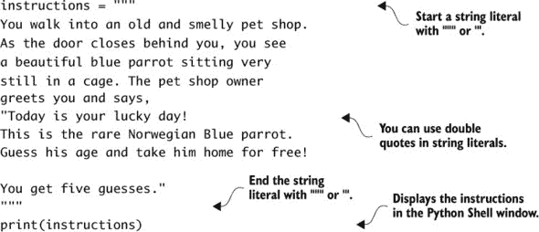

字符串字面量让你能够以你输入文本编辑器中的样子精确地显示字符串。把它想象成一种“所见即所得”的创建字符串的方式。

| |
| --- |

**用 ASCII art 表达**

在桌面操作系统（OS）和游戏拥有高端图形之前，计算机的显示能力有限。计算机用户和程序员发明了一种新的艺术形式，称为 *ASCII art*，它使用文本字符来制作图像。

ASCII 是一种将字符存储为二进制数字的方式。例如，字母 *A* 被表示为 1000001。后来的编码支持了更多的字符，以支持更多的语言，但 *ASCII art* 这个名字保留了下来。ASCII art 使用精心设计的图案中的 95 个 ASCII 字符（字母、数字和符号）来表示图像。

这里有一个例子，展示了如何通过创建一个字符串字面量并将其打印到屏幕上来制作游戏标题的 ASCII art。用一点想象力和试错法来制作你自己的 ASCII art：

```
bird_art = """

#########################################################################
                        ____
                       /  0 \         NORWEGIAN
                      |      >
                      |UUU) |         BLUE
                      |UUU) |
                     //UUU) |         GUESSING
                    //UUU)  /
                   //UU)   /          GAME
                  //U)    /
                 // -|--|/
              ==// ==W==W====
               //
              /
#########################################################################
"""
print(bird_art)
```

有时候，稍微模糊一下你的眼睛，看看图像是否看起来像你想要的样子，会有所帮助。发挥创意，想想你如何可以使用大写和小写字母来创造效果，比如用*U*来代表鹦鹉翅膀上的羽毛，或者用*W*来代表鹦鹉的爪子。

尝试这些 ASCII art 网站，享受乐趣：

+   ***[www.chris.com/ascii](http://www.chris.com/ascii)*** —一个按主题分类的 ASCII art 大集合

+   ***[`patorjk.com/software/taag`](http://patorjk.com/software/taag)*** —一个文本到 ASCII art 生成器 (TAAG)。你输入文字，它会自动为你创建 ASCII art。

+   ***[`picascii.com`](http://picascii.com)*** —一个将图片转换为 ASCII art 的工具

看看你是否能制作一些比这更好的 ASCII art 作为你游戏标题屏幕。享受这个过程吧！

| |
| --- |

经常测试你的程序总是一个好主意，以捕捉任何错误。现在测试你的程序，看看你得到了什么。标题和说明应该会很好地显示在屏幕上。

当你输入此代码时，你可能会犯的一个常见错误是忘记在字符串开头或结尾处的一些引号。如果你这样做，图 4.6 展示了你在 Python 中会收到的错误示例。

##### 图 4.6\. 如果你忘记了开始或结束引号，Python 会显示错误。有错误的行将在你的程序中高亮显示。通过添加缺失的引号修复程序，然后保存并运行程序。

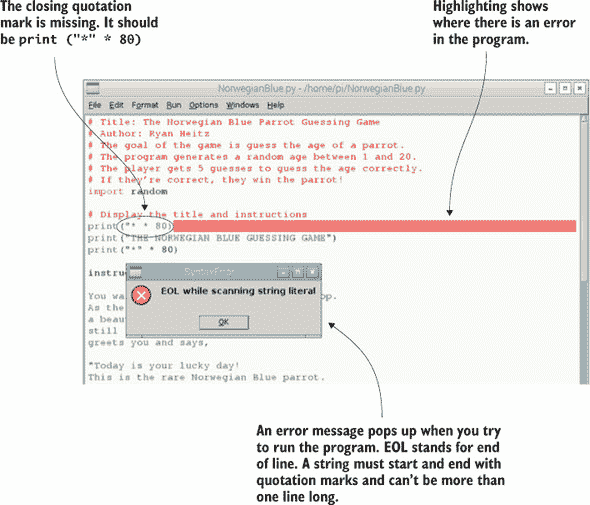

你可能会犯的另一个类似错误是忘记以三重引号开始你的字符串字面量。在这种情况下，Python 会给你一个语法错误消息（见图 4.7）。

##### 图 4.7\. 字符串字面量必须以一组三个引号开始和结束。如果你忘记了，Python 会告诉你你有语法错误。添加缺失的三重引号以修复错误。

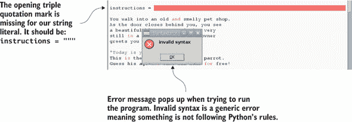

通过确保字符串字面量开头和结尾有三个引号，可以轻松修复这个错误。使用 IDLE 文本编辑器中显示的高亮来找出导致问题的那一行。

### 从玩家那里收集输入

你的游戏有一个合适的介绍；现在让我们开始与玩家互动。游戏、网站和应用程序都是关于引起互动的，无论是为了创造一些乐趣还是帮助你在线购买东西。这与你最近看过的电影形成对比。电影没有互动——它们总是相同的。

计算机程序接受输入并响应输入的能力是特殊的。在像你正在创建的基于文本的游戏中，这种交互通过键盘发生。玩家输入答案或做出选择，游戏就会做出响应。

对于这个游戏，你希望让游戏玩家猜测鹦鹉的年龄。程序知道鹦鹉的年龄，并检查玩家的每个猜测是否与之匹配。为了使这起作用，你必须给程序提供鹦鹉的年龄（它存储在一个变量中）。这给了你作为程序员类似神一样的力量——作为游戏的制作者，你可以决定这个值是多少。让我们创建一个变量并将其设置为你要选择的值。作为计算机程序员的一个很好的事情是，只有你知道鹦鹉的真实年龄.^([3])

> ³
> 
> 任何其他正在阅读这本书的人！稍后你将让游戏使用一个随机数，即使你也不知道鹦鹉的年龄。

让鹦鹉变老。创建一个名为 `parrot_age` 的变量，并将其赋值为 19。

##### 列表 4.4\. 为鹦鹉创建一个年龄

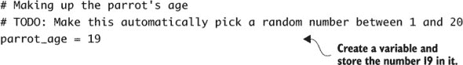

注意，在注释中包含了一个 `TODO` 备注：这告诉你你有一个稍后要完成的项。

| |
| --- |

##### 小贴士

在你的注释中使用 `TODO` 作为提醒，指出程序中未完成或需要进一步改进的区域。注释是你的朋友，它们在那里帮助你。根据需要使用它们！

| |
| --- |

接下来，让我们获取用户的第一次猜测。使用 Python 的 `input` 函数（就像你在第二章中做的那样）从用户那里收集输入并存储在一个名为 `guess` 的变量中。给 `input` 函数一个清晰的消息，提示游戏玩家输入适当的值。当你期望他们在 1 到 20 之间输入一个数字时，你不想他们输入 50。在这种情况下，你希望他们猜测一个 1 到 20 之间的数字。

##### 列表 4.5\. 获取猜测并将其存储在变量中

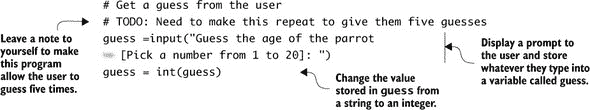

在从用户那里收集输入后，你需要将值从字符串（例如，“5”）转换为整数（简单地是整数 5）。默认情况下，游戏玩家输入的任何内容都存储为字符串（即使他们输入的是数字）。图 4.8 以图形方式显示了这一点：你从用户那里收集输入，然后将其转换为整数。`int` 函数将 `guess` 变量的值转换为整数，然后将其存储回 `guess` 变量。

##### 图 4.8\. `input` 函数收集用户输入的文本；然后文本以字符串数据类型存储。你取变量的值（“5”），将其转换为整数（5），并存储为变量。

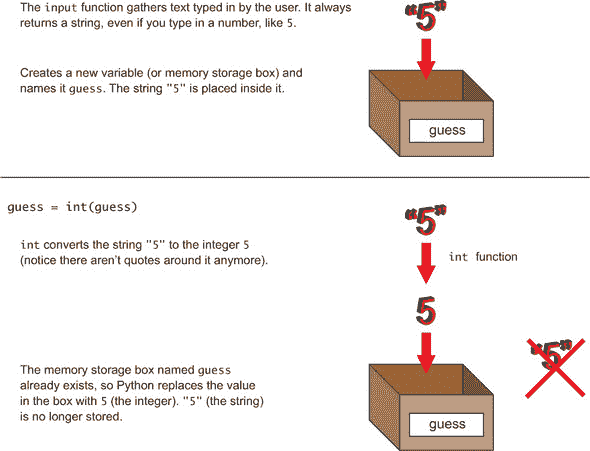

与人合作的一个危险是，他们可以输入他们想要的任何东西。如果有人输入“one”而不是“1”，你会看到这样的错误：

```
Traceback (most recent call last):
  File "<pyshell#C>", line 1, in <module>
    int(guess)
ValueError: invalid literal for int() with base 10: 'one'
```

这个错误表示你没有给 `int` 函数提供一个有效的字符串，该字符串可以转换为整数。

如果你将你想要在代码中创建的逻辑与目前的程序进行比较，你会发现你已经完成了几个部分（见图 4.9）。

##### 图 4.9\. 左边是你想要创建的逻辑。右边是你的代码。到目前为止，你已经欢迎了用户，并给出了游戏说明。你还添加了收集他们猜测的代码。

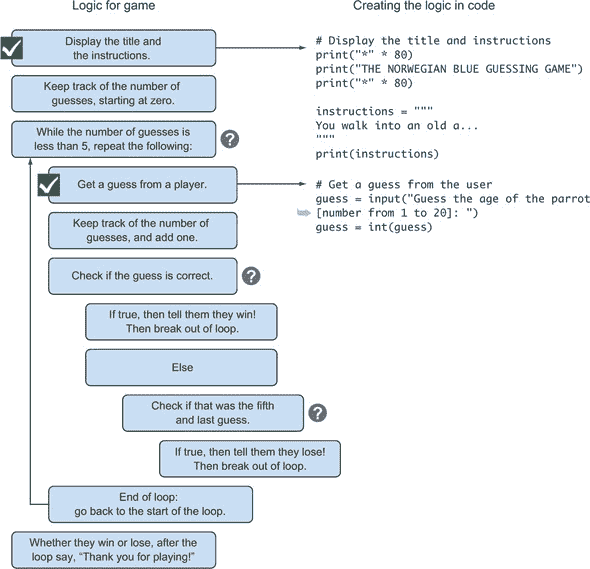

太棒了！再次测试程序以确保它正在正常工作。现在它将要求你输入一个猜测。在下一节中，你将看到如何测试猜测是否正确。

### 使用 if 语句以不同方式响应用户

当你醒来吃早餐时，你可能会走进厨房四处看看有什么可以吃的。你使用逻辑来选择你的早餐。如果你的最爱食物在厨房里，你就会吃它。例如，如果你的最爱食物是巧克力芯片松饼，厨房里有，那么你就会吃它们。如果没有，你可能会吃一碗谷物。在这个例子中，你应用了简单的逻辑——你使用推理来做决定。

计算机程序使用类似的逻辑与用户和周围的世界交互。这些交互基于你（程序员）编写的一组规则。我们作为程序员创建这种逻辑的一种方法是通过称为 `if` 语句的东西。

在你的游戏中，你想要测试玩家的猜测是否与（等于）鹦鹉的年龄匹配。你想要在代码中创建的逻辑如下：

+   如果玩家的猜测等于鹦鹉的年龄，祝贺他们，并给他们一只挪威蓝鸟带回家。结束游戏。

+   否则（如果玩家的猜测不等于鹦鹉的年龄），显示一条轻微侮辱性的消息，告诉他们猜错了。如果这不是他们的最后一次猜测，让他们再猜一次。如果是他们的最后一次猜测，结束游戏。

让我们在程序中使用`if`语句来创建你需要的逻辑。

##### 列表 4.6\. 使用`if`语句给游戏添加逻辑

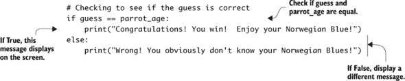

让我们仔细看看`if`语句是如何工作的，以及它是如何给你在程序中创建逻辑的方法（参见图 4.10）。

##### 图 4.10\. `if`语句可以控制程序的流程。这个例子展示了如何使用`if`语句在`guess`等于鹦鹉的年龄时显示一条消息，如果不等于，则显示不同的消息。

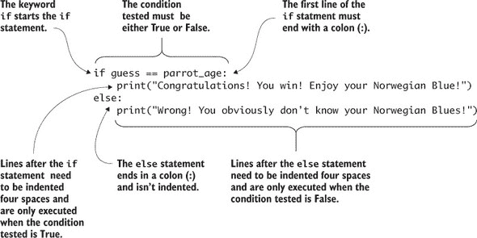

关键字`if`后面跟着`guess == parrot_age`，并且行以冒号（`:`）结束。`guess == parrot_age`是要测试的条件。双等号（`==`）是一个特殊运算符，用于检查`guess`和`parrot_age`的相等性。


##### 小贴士

确保你在测试相等性时不要使用单个等号。单个等号用于将值赋给（或存储）变量。


如果它们相等，`if`条件将被评估为真，Python 将执行其后的缩进命令。在这种情况下，你将打印一条消息：

```
Congratulations! You win!  Enjoy your Norwegian Blue!
```

如果猜测错误（`guess == parrot_age`为假），那么 Python 将执行`else`部分。`else`部分要执行的语句缩进四个空格。在这种情况下，如果猜测错误，程序将在屏幕上显示以下内容：

```
Wrong! You obviously don't know your Norwegian Blues!
```

如果你检查代码并回想一下你想要创建的逻辑，你可以看到`if`语句是如何让你检查猜测是否正确的（参见图 4.11）。

##### 图 4.11\. 你想要创建的逻辑在代码中显示。你使用`if`语句来检查玩家的猜测是否正确。

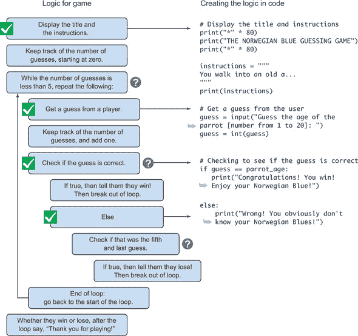

你已经看到了`if`语句如何让程序做出决策。这是一个通过检查某事是否为真或假来控制程序的一种简单方法。


**没有“嗯...也许”**

`if`语句使用一种称为*布尔逻辑*的东西。在布尔逻辑中，答案必须始终是真或假。没有“嗯...也许”。它总是要么是真要么是假。

布尔逻辑有一套自己的比较操作。这些比较在数学课上应该很熟悉，例如小于（`<`）和大于（`>`）。以下是一个表格，列出了你可能需要在你的`if`语句中使用的一些常见比较：

| 比较操作 | 定义 |
| --- | --- |
| == | 等于 |
| != | 不等于 |
| < | 小于 |
| <= | 小于或等于 |
| > | 大于 |
| >= | 大于等于 |

对于这个游戏，你使用相等比较来检查两个值是否相等。

如果你需要反转比较中的逻辑，可以使用 `not` 操作符。`not` 操作符将 True 变为 False 或将 False 变为 True。如果 `x` 是 True，那么 `not x` 就是 False。

记住这些比较运算符。无论你使用哪一个，Python 都会分析比较并返回 True 或 False 的答案。


#### 练习 `if` 语句

尝试更多 `if` 语句的例子将帮助你熟悉逻辑和如何编写它们。让我们做一个例子，检查一个秘密密码是否正确。如果是，代码应该允许该人访问；否则，应该拒绝访问。

##### 列表 4.7\. 使用 `if` 语句检查密码

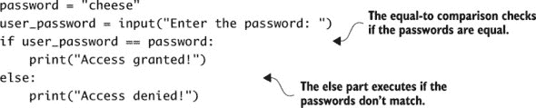

Python 的 `if` 语句是创建能够按你希望的方式响应的程序的有力工具。你现在有了创建逻辑的能力，让你的程序根据与用户的交互来反应和响应。这是在程序中添加一点人工智能的第一步。做得太棒了！

在使用 `if` 语句时最常见的错误之一是忘记在末尾放置冒号 (`:`)。图 4.12 是一个缺少冒号的 `if` 语句的例子。

##### 图 4.12\. 在 `if` 语句的末尾缺少冒号将会创建一个语法错误。Python 会突出显示错误所在的位置。在行末添加一个冒号来修复问题。

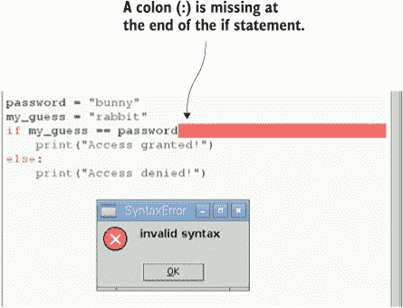

编写程序时，错误是常见的。尽量记住在 `if` 语句的末尾添加冒号。如果 Python 抛出一个语法错误框并突出显示 `if` 语句末尾的空格，你就知道你做了什么。

### 使用 `while` 循环重复事物

你已经从用户那里获得了输入，但你需要一种方式让用户反复猜测鹦鹉的年龄。你可能觉得反复做同样的事情会感到无聊，但计算机会乐意重复你想要的次数。程序的重复部分被称为 *循环*。

在你的猜测游戏中，你给游戏玩家五次机会猜测鹦鹉的年龄。Python 有几种类型的循环：你将使用 `while` 循环。`while` 循环会重复执行，直到某个条件或情况不再为真。重复什么由你决定。每次通过循环时，在程序重复你给出的指令之前，它会检查那个条件。

让我们看看如何使用 `while` 循环与 `if` 语句结合，只给用户五次猜测的机会。为了帮助，你将创建一个名为 `number_of_guesses` 的变量来跟踪猜测次数。

##### 列表 4.8\. 使用 `while` 循环重复指令

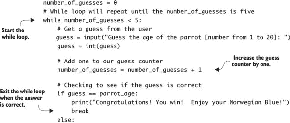

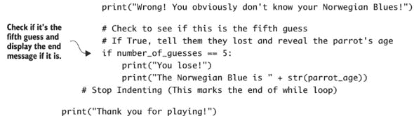

注意你如何必须稍微调整程序中的代码。首先，你开始`while`循环，然后要求用户输入他们的猜测。还要注意，`while`循环中要重复的代码是缩进的（向右移动四个空格）。让我们更仔细地看看`while`循环的关键元素（见图 4.13）。

##### 图 4.13。思考你想要创建的逻辑，然后将其翻译成你的代码。当你需要重复某些内容时，可以使用`while`循环。当你需要检查某个条件是否为真或假时，可以使用`if`语句。

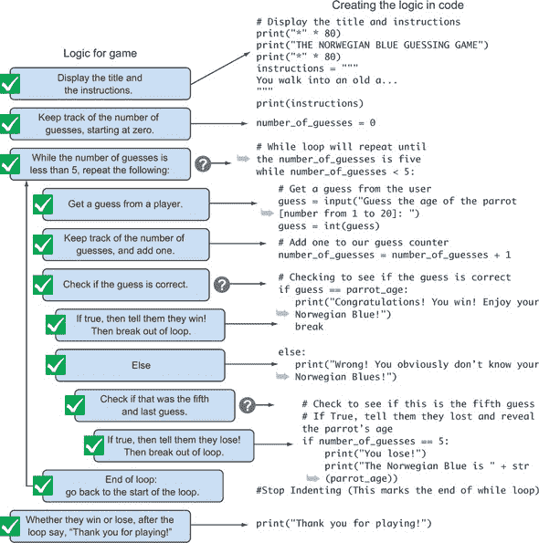

`while`循环有一个特殊之处：你必须缩进所有你想要循环重复的代码（就像你在`if`语句中做的那样）。每一行应该从左边缩进四个空格（从你输入`while`中的`w`的位置开始测量）。同样，当你想要`while`循环结束时，停止缩进代码。没有缩进的代码位于`while`循环之外，并且只有在`while`循环完成后才会执行。

| |
| --- |

##### 小贴士

IDLE 文本编辑器会自动为你缩进循环文本。在 Python 中，缩进用于将代码分组。

| |
| --- |

注意，你创建了一个名为`number_of_guesses`的变量，它有助于跟踪已经进行了多少次猜测。它从 0 开始；每次猜测后，值增加 1。当它达到 5 的值时，如果最后一次猜测是错误的，游戏应该结束。只要猜测次数少于五次，程序将检查玩家输入的猜测是否正确。如果猜测正确，游戏应该恭喜玩家，跳出循环，并结束。

#### 深入了解`while`循环

`while`循环会重复执行一系列指令或代码，但只有在`while`循环的条件为真时才会这样做。当你想要重复某些内容但需要一个表示何时停止的开关时，这非常有用。`while`循环的一个非常常见的用途是在游戏中。循环使得用户可以反复玩游戏，直到他们表示不想再玩了。

图 4.14 中的`while`循环从 0 计数到 99。让我们更仔细地看看它的各个部分。

##### 图 4.14。你可以使用`while`循环重复执行任务。循环中的代码缩进四个空格。在这种情况下，这个`while`循环显示从 0 到 99 的数字；完成后，它会打印消息，“我完成计数了！”通常，条件应该是这样的，循环中的代码可以使其变为假，从而结束循环。

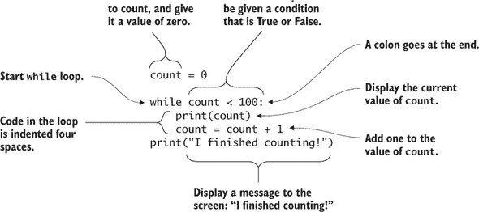

和`if`语句一样，`while`循环有一个表达式，它必须是 True 或 False。图 4.14 中的例子使用了`count < 100`。这一行以冒号（`:`）结束，属于循环的后续行应该缩进四个空格。在`while`循环中，你可以使用你通常在 Python 中使用的任何其他命令。为了表示循环的结束，停止缩进语句。注意，`print("I finished counting!")`没有缩进，所以它只会在计数完成后打印一次。Python 通过缩进来知道你想要你的循环从哪里开始和结束。

| |
| --- |

##### 小贴士

你可以在`while`循环中使用`if`语句。在你的游戏中，你在一个`while`循环中使用`if`语句。听起来很复杂，但你需要检查玩家的猜测是否正确，并且你需要重复这样做以给他们提供五次猜测机会。

| |
| --- |

使用循环可以让你避免编写大量的代码。它们让你可以命令计算机重复执行一系列命令多次。命令只需要在循环中写一次。

#### 跳出`while`循环

有时候你需要休息一下，吃点东西或者喝点饮料。Python 有一个`break`命令，它允许你提前跳出`while`循环。在这个例子中，你想要循环重复，如果玩家的最后一次猜测是错误的。如果玩家正确猜出鹦鹉的年龄，那么你想要跳出循环——即使你没有达到第五次猜测，你想要停止循环，因为玩家已经得到了正确答案。

让我们修改之前的计数例子，将其改为 99，这样当它达到数字 77 时就会跳出循环。你可以使用一个`if`语句来完成这个操作。

##### 列表 4.9\. 跳出循环

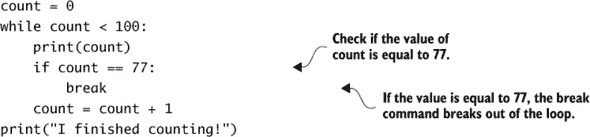

#### 练习`while`循环

让我们再试一个使用`while`循环的例子，以熟悉如何编写它们：一个询问你最喜欢的颜色的`while`循环。看看你是否能弄清楚这个程序做了什么。

##### 列表 4.10\. 最喜欢的颜色

```
favorite_color = input("What is your favorite color? ")

while favorite_color != "blue":
    print("Nope, you got it wrong!")
    favorite_color = input("Try again: What is your favorite color? ")

print("Me too! What a coincidence!")
```

这个例子要求你输入你最喜欢的颜色；如果你输入`blue`，它会说，“我也是！真巧！”然后结束。如果你没有输入`blue`，程序会不断地要求你输入你最喜欢的颜色（直到你说它是蓝色）。

假设你的循环没有产生你预期的输出。也许猜谜游戏给你六次猜测而不是五次。这就是你尝试找出问题并修复它的时候——这个过程也被称为*故障排除*。在`while`循环中修复错误可能很棘手，因为循环中可能有多个命令。命令执行得很快，所以很难看到发生了什么。你可以使用的一种故障排除技术是在循环中添加一个`print`函数，并在每次循环迭代时使用它来打印变量的值，例如计数器。

在这个例子中，你可能会在循环中添加这一行：

```
print(number_of_guesses)
```

这会在代码每次通过循环时打印出存储在 `number_of_guesses` 变量中的值。您可以看到计数器是否如您预期的那样递增，以及它是否从正确的数字开始。

### 使用 Python 代码库生成随机数

您的程序应该运行得很好。玩家有五次猜测机会，如果他们正确猜出鹦鹉的年龄，他们就会赢！游戏的一个令人兴奋的部分是其不可预测性——您永远不知道您什么时候会赢或输。您的下一个任务是让程序随机选择挪威蓝鹦鹉的年龄。这将使其更加刺激，因为即使您也不知道答案！

如果您曾经尝试修理过一辆坏自行车、烤面包机或汽车，您可能需要一些工具。赤手空拳可以做好多事情，但可能不足以完成这项工作。同样，在 Python 中，标准工具（您的赤手空拳）也不够用。有时您需要拿一个工具箱，拿出一把大锤、烙铁或螺丝刀。

Python 也有工具箱。这些工具箱也称为 *模块*。每个工具箱（模块）都包含不同集合的工具（方法），这些工具对特定工作很有用。以下是一些常见的 Python 模块示例：

+   `datetime` 提供了获取当前时间和日期以及格式化它们的实用工具。

+   `random` 给您创建随机数的能力。

+   `math` 支持更广泛的数学函数。

+   `fileinput` 支持从文件中读取信息。

在您可以使用这些工具箱之前，您必须首先将它们带入房间，就像您可能会拿起一个自行车工具箱来修理自行车一样。要引入一个工具箱，您使用 `import` 命令：

```
import random
```

您可以在程序中的任何地方添加此行，在您需要使用它来创建随机数之前。在您的游戏程序开头的注释之后添加它。这将在程序开始时引入工具箱，使其他阅读您代码的人更容易看到您正在使用哪些工具箱（或模块）。这一行实际上是在将工具箱加载到 Python 的内存中，以便您可以在程序中使用这些工具。

现在您已经添加了工具箱，您可以使用一个名为 `randint` 的工具来生成介于 1 和 20 之间的随机数。此代码替换了 `parrot_age = 19` 这一行：

```
parrot_age = random.randint(1,20)
```

注意，您输入工具箱的名称，然后放一个点（`.`），然后放您想要使用的工具的名称。这个特定的工具 `randint` 需要您提供两个数字：随机整数应该介于的下限和上限。如果您想要一个介于 1 和 100 之间的数字，您会写

```
parrot_age = random.randint(1,100)
```

添加这两行代码后，完整的代码列表应与图 4.15 中的代码相匹配。图 4.15。

##### 图 4.15。要随机选择一个数字，您需要导入 `random` 库并使用 `randint` 函数来选择介于 1 和 20 之间的随机整数。

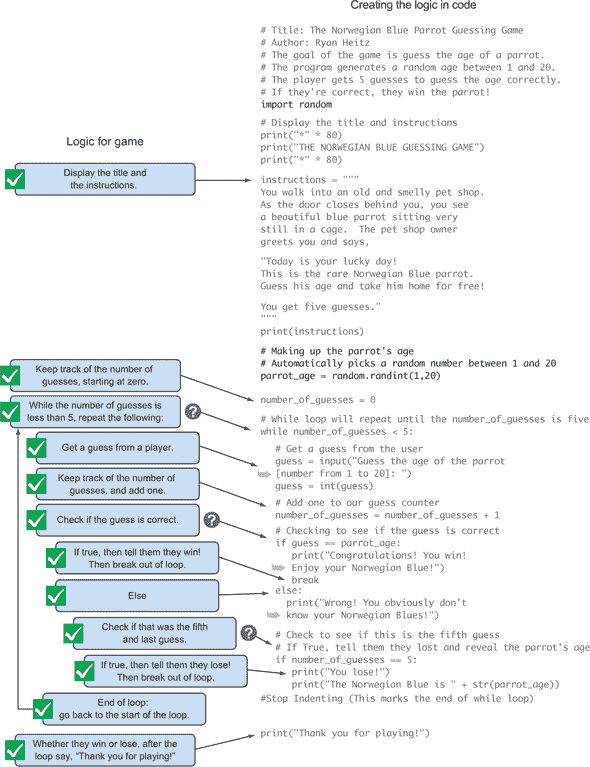

太棒了！你已经制作了一个挪威蓝猜测游戏，并学会了如何使用 `if` 语句和 `while` 循环在你的程序中创建逻辑。

### 果实采摘者额外：Scratch

你是否好奇为什么你的 Pi 有一个猫头图片的图标？那是 Scratch 的图标。麻省理工学院（MIT）开发 Scratch 是为了帮助教授编程，Scratch 是一个简单的程序，你可以用它来在你的 Raspberry Pi 上创建动画和游戏。Scratch 还是一种基于拖放程序块的简单易用的编程语言。

通过点击菜单 > 编程 > Scratch 在你的 Raspbian 桌面上打开 Scratch。当 Scratch 打开时，你会看到一个白色方块中的猫。图 4.16 展示了 Scratch 界面的概述。

##### 图 4.16。Scratch 界面分为精灵移动的区域和脚本区域。你可以在脚本区域通过拖放块并连接它们来为你的精灵创建程序。

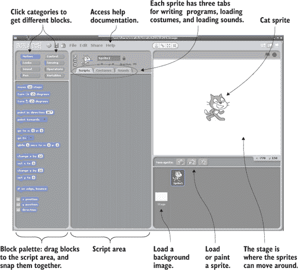

Scratch 可以做很多事情，我们不会解释所有内容。你可以通过点击帮助 > 帮助页面来了解更多关于如何使用 Scratch 创建项目的信息。帮助信息告诉你如何使用每个块，并提供了一些教程。

你有没有项目的想法？就像在 Python 中一样，你可以编写程序来请求输入、显示消息、生成随机数，并使用 `if` 语句和循环。你可能添加一个狗精灵，并在点击它时让它像人一样唱歌。或者尝试创建你最喜欢的经典电子游戏的 Scratch 版本。


### 挑战

让我们玩石头、剪刀、布！对于这个挑战，尝试创建经典游戏。

石头、剪刀、布是用手玩的。每个人同时用他们的手做出三种形状之一：石头的形状、一张纸或一把剪刀。如果两个人做出相同的形状，则为平局。三种游戏形状相互作用如下：

+   石头胜剪刀。

+   布胜石头。

+   剪刀胜布。

让我们计划如何应对这个挑战。以下是一些关键要素：

+   使用 `while` 循环反复要求玩家选择石头、布或剪刀。

+   创建一个选择列表：

    ```
    choices = ["Rock","Paper","Scissors"]
    ```

+   使用 `random` 库让计算机在三个选择（“石头”，“布”和“剪刀”）之间随机选择。

+   记住，`randint` 选择一个随机整数。你可以选择并将随机选择存储在变量中：

    ```
    computer_choice = choices[random.randint(0,2)]
    ```

+   你可以通过使用表示列表中项目位置的数字来选择列表中的不同项。这个数字被称为 *列表索引*。在这种情况下，列表中有三个项目。第一个项目的索引为 0，第二个项目的索引为 1，第三个项目的索引为 2。要显示列表中的第二个项目，你写下 `print(choices[1])`；代码会在屏幕上显示“布”。

+   使用 `if` 语句比较玩家的选择和计算机的选择，并让玩家知道谁赢了。

+   询问玩家是否想要再玩一次。如果是，循环应该重复；如果不是，游戏应该结束。

看看您是否能想出一个程序！参见附录 C 以获取解决方案。

### 摘要

在本章中，您已经学习了在 Python 中处理文本的一些新技巧以及创建程序逻辑的一些基础元素：

+   您可以让 Python 按照您想要的方式打印内容。字符串字面量允许您创建跨越多行的文本。使用它们来使文本以与您在程序中输入的方式相同的方式显示。

+   您可以编写能够做出决定的智能代码。`if` 语句通过仅在特定条件为 True 时做出响应来向程序添加逻辑。您可以将 `if` 与 `else` 语句结合使用，使程序在条件为 False 时执行不同的操作。

+   您不必重复输入内容——您可以让 Python 为您重复它们。`while` 循环可以用来重复某些内容，只要某个条件为 True。`break` 命令允许您在需要时退出 `while` 循环。

+   您可以使用模块（工具箱）来访问更多强大的工具，以便在您的程序中使用。`random` 模块有一个生成随机整数的工具。

## 第五章\. 拉斯皮洞穴冒险

**在本章中，您将创建一个游戏来学习新的编程技术：**

+   *绘制流程图以映射复杂程序*

+   *使用布尔运算符检查用户输入*

+   *使用* `if`*,* `elif`*, 和* `else` *语句制作多选代码*

+   *创建和使用您自己的函数来组织代码并避免重复代码*

+   *嵌套* `if`*/*`else` *语句以创建具有复杂逻辑的游戏*

就像一本好书一样，一个游戏可以在您的脑海中创造一个完整的虚构世界。游戏中最令人兴奋的方面之一就是您感觉就像身处游戏之中。这不需要虚拟现实眼镜或高清晰度图形。您可以通过与玩家的想象力建立联系，并创造一个他们可以做出决定并决定自己命运的世界，即使在完全基于文本的游戏中也能创造出这种沉浸感。要创建具有虚构世界的游戏，您通常需要通过让用户从一个房间移动到另一个房间或从一个场景移动到另一个场景来产生深度感。游戏应该允许用户选择自己的路径并引入惊喜元素。最后，您还应该有一些出色的描述，让玩家感觉他们就在房间里。

在本章中，您将创建这样一个游戏，基于探索地下洞穴。在这个过程中，玩家将不得不做出选择，如果他们做出错误的决定，游戏就结束了。如果他们做出正确的决定，他们将找到无法计数的黄金、红宝石和钻石！

### 项目介绍：拉斯皮洞穴冒险

游戏设定在中世纪：一个石头城堡、骑士和剑的时代，以及（有人说）喷火的神话生物。你的主要角色是一个名叫 Raspi 的年轻男孩。^([1)] 一天，Raspi 外出砍柴时在森林中迷了路。他偶然发现了洞穴的入口。他朝入口看去，发现洞穴分为一个左隧道和一个右隧道。他记得他祖母曾经讲述的一个民间故事，说的是这个森林里有一个神秘的洞穴，里面藏有巨大的宝藏。据说宝藏被一只凶猛的喷火龙守护着。Raspi 无法抗拒探索洞穴的诱惑；尽管他知道他应该回头，但他慢慢地走进了黑暗的洞穴。这是你下一个项目的开始：Raspi 的洞穴冒险。

> ¹
> 
> 因为这是你的游戏，你可以自由地让 Raspi 成为女孩或男孩。

游戏可以有多种不同的结果，这取决于玩家为 Raspi 选择的路径。程序输出的一个简短示例显示在图 5.1 中。

##### 图 5.1。Raspi 的洞穴冒险要求玩家决定走哪条路。根据他们的选择，玩家将遇到不同的命运。

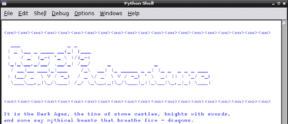

让我们看看洞穴的地图，看看宝藏在哪里，龙也住在哪里！因为你是游戏设计师和开发者，你将使用这个作为指南来编写创建游戏逻辑的代码（见图 5.2)。

##### 图 5.2。这张洞穴系统的地图显示 Raspi 将需要做出许多选择。如果他做出了错误的选择，游戏就结束了！但如果他做出了正确的选择，他将找到传说中的宝藏！


让我们来看看 Raspi 在洞穴中可以选择的不同路径和选择以及他可能的命运。当 Raspi 进入洞穴的入口后，他可以选择向左或向右走。

#### 左边洞穴

如果 Raspi 进入左边的洞穴，他会发现自己靠近一条地下河流。他需要决定是乘船顺流而下，还是游泳顺流而下，或者沿着河岸行走。如果 Raspi 决定乘船，他很快就会知道船上有洞，他会沉下去（游戏结束）。如果 Raspi 选择避开河流并沿着河岸行走，他很快就会被他的思绪分心，踩在石头上，撞到头上（游戏结束）。如果 Raspi 富有冒险精神并决定在河中游泳，他将到达对岸，并发现一个藏有丰富宝藏的隐藏宝库！

#### 右边洞穴

如果 Raspi 决定进入右边的洞穴，他需要决定是使用绳子爬进洞里还是走向看起来像火炬的东西。在走向火炬之后，Raspi 将进入一个满是晶体的洞穴。晶体洞穴听起来很有希望，但不幸的是，一个晶体将从天花板落下，结束 Raspi 的生命（游戏结束）。或者，如果 Raspi 使用绳子并从洞里下去，他会在龙穴中发现自己，面临最后的抉择：是和龙战斗还是进入一个黑暗的房间。如果 Raspi 和龙战斗，龙会吃掉他；但如果 Raspi 走向黑暗的房间，他会发现里面装满了成千上万的金币、红宝石和钻石。Raspi 变得富有，而且非常健康！

### 嘿，等等，你需要一个计划（流程图）

你的目标是创建一个允许玩家做出多个决策的程序。你有一张洞穴地图；现在你需要将这张地图变成一个可以指导你编写游戏代码的图表。就像你在第二章中所做的那样，你将布置游戏的逻辑，然后编写代码来创建这种逻辑。

你可以制作一个既是一张地图又是一个流程图的图表。你可以可视化决策集和每个决策的结果。图 5.3 显示了洞穴地图作为流程图。

##### 图 5.3\. Raspi 的洞穴冒险流程图显示了玩家可以做出的各种决策及其结果。它是游戏逻辑的地图，可以在你编程逻辑时为你提供指导。

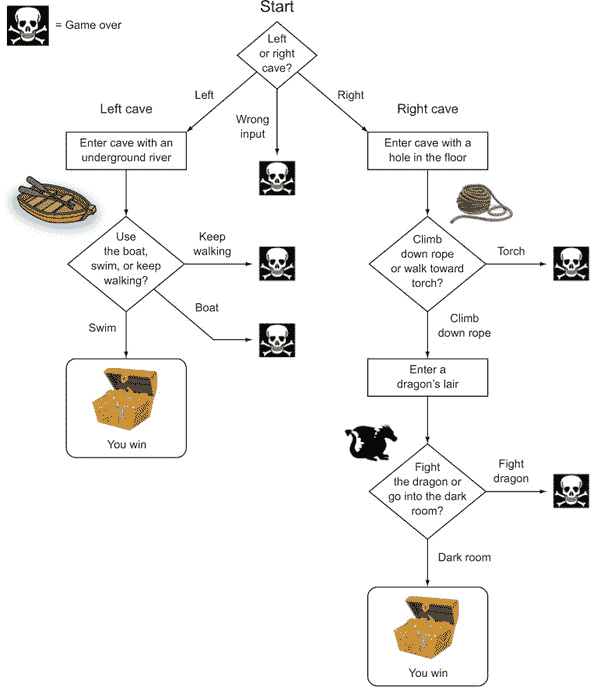

图表中的每个决策都由一个菱形形状表示。菱形内部是当前的问题。菱形外部是表示可能选择及其结果的箭头。有时选择会引出其他选择（其他菱形）。有时，一个选择会导致赢得游戏或游戏结束！

流程图遵循一些简单的规则（见图 5.4）。你可以为任何决策集构建一个流程图，包括游戏、机器人和应用程序中使用的决策集。

##### 图 5.4\. 流程图是展示程序逻辑的视觉方式。它们使用菱形、箭头和方框来表示决策、选择和活动。这个例子展示了一个当按钮被按下时打开灯的程序流程图。

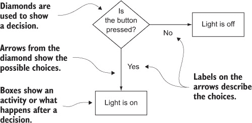

流程图是组织思路和将复杂问题分解成一系列简单步骤的绝佳方式。记住 Python 的方式：简单比复杂好。

### Raspi 该走哪条路呢？（检查输入）

拿着你的图表，第一部分的逻辑是用户选择是向左走还是向右走。让我们显示文本来告诉玩家他们在洞穴中看到的东西，然后提示他们输入一个选择。你使用`input`函数提示用户并收集信息。

##### 列表 5.1\. 选择左边的洞穴或右边的洞穴

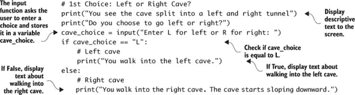

此示例使用 `input` 函数和 `if`/`else` 语句来创建所需的逻辑。代码要求用户通过输入 `L` 或 `R` 来做出选择。`if` 语句检查用户的选项是否等于`L`。如果是 True，则代码显示玩家进入了左洞。如果他们的选择不等于 L（如果该条件为 False），则程序转到 `else` 语句并显示玩家进入了右洞。

#### 处理意外输入

用户经常做一些意外的事情。作为一名程序员，你必须思考的一件事是，如果用户做了你预料之外的事情会发生什么。玩你的游戏的人可以输入他们想要的任何内容。让我们检查一些不同的可能性，看看会发生什么：

+   如果用户输入 `l`（小写的 `L`）会怎样？如果用户输入 `l`，程序将检查（评估）`l`是否等于`L`。因为这两个字符串不同，这个条件是 False。程序将执行 `else` 语句并显示用户输入了右洞的消息。

+   如果用户输入 `left` 会怎样？如果用户输入 `left`，程序将评估`left`是否等于“L”。因为这两个字符串不同，这个条件是 False。程序将执行 `else` 语句并显示用户输入了右洞的消息。

+   如果用户输入类似 `44992` 或 `banana` 这样愚蠢的内容会怎样？程序检查`44992`或`banana`是否等于“L”。因为这两个都不等于“L”，这个条件是 False。程序将执行 `else` 语句并显示用户输入了右洞的消息。

+   如果用户输入除 `L` 之外的内容会怎样？你猜对了；他们将看到一条消息，表明他们输入了右洞。

这并不理想。让我们按如下方式改进代码：

> **1**.  允许用户输入 `L` 或 `l`，以及 `Left` 或 `left` 来进入左洞。
> 
> **2**.  允许用户输入 `R` 或 `r`，以及 `Right` 或 `right` 来进入右洞。
> 
> **3**.  通过让游戏对用户输入错误的内容进行斥责并以幽默的方式结束游戏来处理其他任何问题。也许天花板上的钟乳石会掉下来，或者洞穴蜘蛛会咬他们！

要创建这种行为，你需要引入布尔 `or` 运算符。你还需要使用 Python 的 `upper()` 方法将输入信息转换为大写字母。最后，为了处理所有三种可能的结果，你将使用一个新的 `if`/`elif`/`else` 语句（见 列表 5.2）。


**方法**

*方法* 是仅对特定类型的 Python 对象（程序员称之为 *对象*）起作用的函数。在这个例子中，`.upper()` 只能作用于字符串，因此被称为 *字符串方法*。方法的调用方式与其他函数不同。方法使用 *点表示法*，这意味着你输入对象（对象）的名称，然后输入一个点（`.`）和方法。

这里有一些示例：

+   `"Left".upper()`产生“LEFT”。

+   `"riGHt".lower()`变为“right”。

| |
| --- |

这里是更新后的代码，以应用这些新方法来避免用户输入错误。

##### 列表 5.2.改进玩家选择的代码

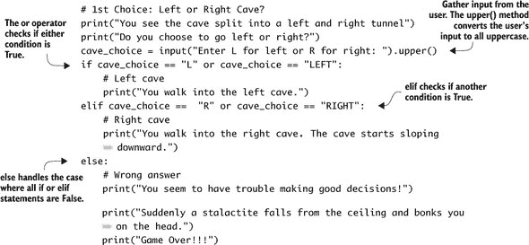

`upper()`方法将输入文本转换为大写。如果用户输入`LEFT`、`LeFt`、`left`或`Left`，字符串将被转换为`LEFT`。

##### 布尔或运算符：检查任一是否为真

`or`运算符检查是否有一个条件或另一个条件为真。这使你的代码更具灵活性——它能够接受多个输入并继续执行。如果任一为真，则`if`语句为真，Python 会执行`if`语句下缩进的任何操作。

##### `elif`是`else if`的缩写。

`elif`语句是`else if`的缩写。它检查另一个条件是否为真。把它想象成一个多项选择题。如果用户没有输入`L`或`Left`，程序就会转到下一个选项。如果用户没有输入`R`或`r`，程序就会转到`else`语句，并在他们的头上掉下一块钟乳石。游戏结束！更仔细地看看图 5.5 中的`if`/`elif`/`else`语句，看看如何创建一个。

##### 图 5.5.`if`语句可以有多种形式。这是一个带有两个`elif`和一个`else`的`if`语句。它创建了代码中的逻辑，可以根据用户的输入执行许多不同的事情。在这种情况下，你让玩家猜测鹦鹉的年龄。程序会告诉他们他们的猜测是太高、太低、正确还是无效。

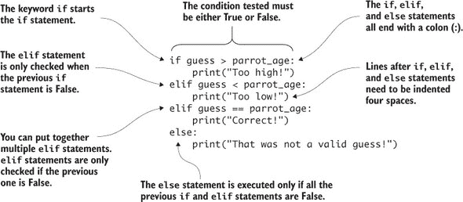

注意，你可以有多个`elif`语句。实际上，你可以有任意多个。使用`if`/`elif`语句，你可以创建你的洞穴所需的逻辑。

| |
| --- |

**布尔逻辑运算符：`and`、`or`和`not`**

Python 有一套完整的布尔运算符，你可以用来构造表达式：

+   当你希望表达式在任一操作数为真时为真时，使用`or`。

+   当你希望表达式仅在两个操作数都为真时为真时，使用`and`。

+   `not`用于将操作数从真变为假或从假变为真。

让我们看看使用这些运算符的一些示例。

**`and`运算符**

假设你想要创建一个程序，只有当你的用户名和密码*都*正确时，才能访问系统。你可以使用`and`运算符来编写这个程序：

```
if name == "Ryan" and password == "PiTaster":
    print("The name and password are correct!")
    print("Access granted! Welcome!")
else:
    print("Access denied!")
```

只有当`name`和`password`都正确时，程序才会授予你访问权限。试着创建一个自己的吧！

**`or`运算符**

接下来，让我们想象你想要创建一个程序，如果某人的年龄小于 20 岁或他们有优惠券，就会免费送他们披萨。假设你有一个变量`age`，它是人的年龄，另一个变量`coupon`已经持有真或假的值。使用`or`运算符，你可以创建如下逻辑：

```
if age < 20 or coupon == True:
    print("You get 1 FREE PIZZA")
else:
    print("No free pizza for you!")
```

如果*任一*为真，用户就会得到披萨。如果*两者*都为真，他们就会得到披萨。如果*两者*都不为真，那么就没有免费的披萨！

**`not` 运算符**

最后，假设你有一个等于 True 或 False 的变量 `is_absent`。`is_absent` 告诉你学生是否在场。如果你想要打印一个“欢迎来到学校！”的消息，如果学生没有缺席，你可以使用 `not` 运算符：

```
if not is_absent:
    print("Welcome to school!")
else:
    print("Please return to school as soon as possible. School misses you!")
```

`not` 运算符将一个为 True 的变量或语句转换为 False，将一个为 False 的转换为 True。它帮助你创建当你阅读代码时更有意义的条件语句（`if` 语句）。正如你所见，布尔运算符为你提供了创建逻辑表达式的多种不同选项。


是时候用你新学的 `if`/`elif`/`else` 和布尔运算符去洞穴探险（这是一个探索洞穴的时髦词）了！

#### 将流程图转换为代码

现在，让我们集中精力为左边的洞穴编写一个程序。玩家已经进入了左边的洞穴，需要做出下一步的选择。查看地图和流程图，玩家接下来遇到的是一条地下溪流。玩家看到一艘船，必须在三个选项中进行选择：

+   沿着河岸继续前行。

+   登上船。

+   在河里游泳。

这些都将是你的代码中的 `if` 或 `elif` 语句。但是等等！还有一个第四种可能的结果——他们没有选择这三个选项之一。你将这个作为 `else` 语句。 显示了左边的洞穴流程图和创建所需逻辑的代码。

##### 图 5.6。左边的洞穴内部有一条溪流，用户有三个下一步行动的选择。在代码中，你创建一个 `if` 语句，后面跟着两个 `elif` 语句，以涵盖每个选项。`else` 语句用于控制如果用户输入了除了三个选项之外的任何内容会发生什么。

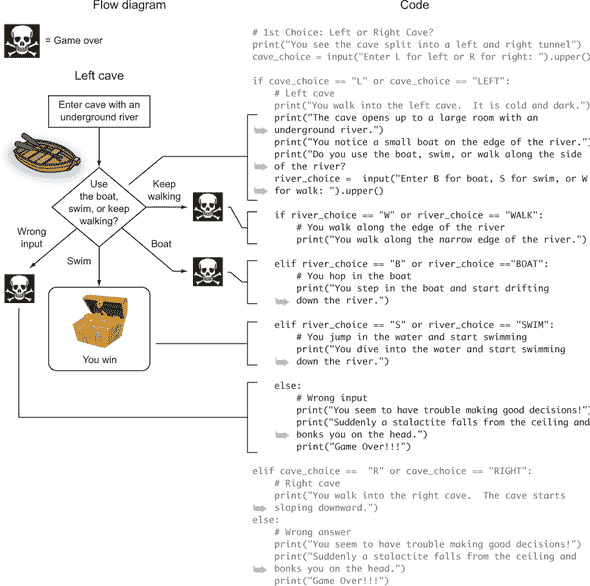

你显示一些关于 Raspberry Pi 在左边的洞穴内看到的内容的文字。你要求用户选择下一步要做什么。然后，一旦你收集了这些输入，你就评估这些信息并相应地做出回应。注意，每个可能的选项都出现在一个 `if` 或 `elif` 语句中，并且缩进在左边的洞穴 `if` 语句之下。用户必须选择是继续前行（`W`）、使用船（`B`）还是游泳（`S`）。对于每种情况，程序应该显示你根据流程图设计的信息。


**这不仅仅适用于洞穴**

布尔运算符和 `if`/`elif`/`else` 语句非常适合当你的程序需要多个选项或选择时。看看你能否创建一个有四个可能选项的程序：A、B、C 和以上皆非。以下代码片段展示了使用 `elif` 语句创建这四种可能结果的一个示例。在这个例子中，你假装一个人在参加一个游戏节目，选择一个后面有奖品背后的门：

```
print("Welcome to the Pi Game Show!")
print("There are three doors with prizes behind them: A, B, and C.")
door = input("Select a door by typing A, B, or C").upper()

#Logic for door selection
if door == "A":
    print("You've won a new car!")
elif door == "B":
    print("You've won a new boat!")
elif door == "C":
    print("You've won a trip around the world!")
else:
    print("Uh oh! You didn't follow directions!")
    print("Game Over!!!")

print("Thank you for playing.")
```

基于逻辑创建带有选择的程序是一种强大的编程技能。通过组合简单的选择，你可以创建复杂的程序。


优秀的工作！你已经为 Raspi 的洞穴冒险创建了左侧洞穴的逻辑。让我们添加更多的决策。

### 简化！创建自己的函数

哎呀！左侧洞穴的代码开始看起来很长（而且有点丑陋和难以阅读），你还有右侧洞穴要处理。你如何简化你的程序？

答案是*函数*。这次你不会调用内置的 Python 函数——你将创建自己的函数！

函数就像你可以创建的小型程序，用于组织或简化你的代码。当你有很长的程序时，你可以将逻辑代码块（所有代码都放在一起）放入函数中。一旦你创建（或定义）了一个函数，你就可以在代码中调用（或使用）该函数。


##### 注意

函数应该始终在程序顶部定义。函数的定义必须在其被调用（或使用）之前。


让我们通过为左侧洞穴创建（或定义）两个函数来看看这是如何工作的。

##### 列表 5.3\. 为左侧洞穴创建函数

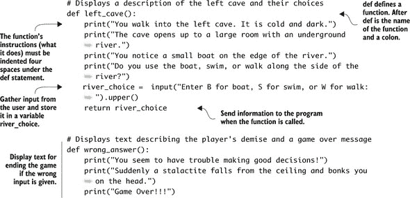

在继续之前，让我们更仔细地看看你如何创建自己的函数（见图 5.7）。你已经创建了两个函数：`left_cave`和`wrong_answer`。让我们重写洞穴程序以使用（或调用）这些函数。每次你调用一个函数时，就好像代码都在那个地方，但你将其隐藏了。

##### 图 5.7\. 函数简化你的代码并可以减少重复。使用`def`关键字创建一个新函数，并在其下缩进函数代码。如果你需要一个函数返回一个值，请在函数中包含一个`return`语句。


一些函数需要返回某些内容；而另一些则不需要。你可能有一个打印屏幕或播放声音的函数；这些类型的函数不需要返回任何内容。在示例代码中，`wrong_answer()`函数是一个很好的例子。你可以这样调用函数：

```
wrong_answer()
```

或者，当函数返回某些内容并且你想存储这些信息时，你可以这样写：

```
choice = left_cave()
```

这将存储调用`left_cave()`函数返回的任何信息，并将其存储在名为`choice`的变量中。列表 5.4 显示了如何通过调用`left_cave()`和`wrong_answer()`函数来简化程序。

##### 列表 5.4\. 使用新函数简化你的代码

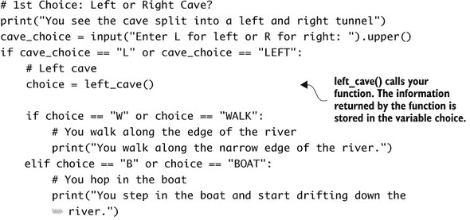

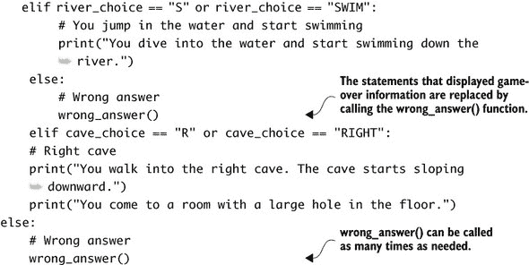

太棒了！生成的代码更容易阅读，你避免了代码重复。注意，你调用了`wrong_answer()`函数两次。这让你不必两次编写这些代码行。此外，如果你想要更改错误答案的结尾，你只需在一个地方更改（在函数中）。除了帮助你组织代码外，能够重用函数是它们的关键特性之一。你没有改变程序的功能，但通过使用函数，你使代码更容易阅读并简化了它。


##### 定义

*重构* 是一种编程技术，它专注于重新组织和简化程序中的代码。重构使代码更容易阅读且更简单。

|  |

**传递参数：具有输入的函数**

到目前为止，你已经看到了两个不同的函数：一个不返回任何内容，另一个返回内容。除了能够返回某些内容的能力之外，函数还具有另一个特性——它们也可以接收信息。将其视为函数的输入。在编程术语中，你说该函数有一个 *参数* 或 *参数*。让我们通过一个例子来看看这是如何工作的。假设你有一个猜谜游戏，你想创建一个函数，该函数会在屏幕上打印一条消息，告诉玩家他们的猜测是太高、太低还是准确无误：

```
def check_guess(guess, answer):
    # Compare the guess to the answer
    if guess == answer:
        print("You're correct!")
        is_correct = True
    elif guess < answer:
        print("Too low!")
        is_correct = False
    elif guess > answer:
        print("Too high!")
        is_correct = False
    else:
        print("Invalid guess")
        is_correct = False
    # Return True or False depending upon if the guess is correct
    return is_correct
```

在这种情况下，`def` 语句具有你的函数名称（`check_guess`）。在括号内是两个用逗号分隔的参数：这些是函数的输入。第一个输入或参数是 `guess`。这是用户所做的猜测。第二个是 `answer`，这是用户试图猜测的数字。然后函数比较 `guess` 和 `answer` 并告诉用户他们是否正确或猜测得太低或太高。这个函数的伟大之处在于它可以与任何数值猜测和答案（1 到 10，1 到 1,000,000）一起工作。通过使用参数，你使代码更加灵活。


了解函数的最佳方式是通过实践。以下是一些函数的要点：

+   使用一个描述函数的简单名称。

+   在函数内部添加关于你的函数的注释。

+   当你想在程序中使用它们时返回值。

以下是一些函数的禁忌：

+   使用复杂的名称。

+   创建只有一行代码的函数。

+   忘记在 `def` 语句的末尾放置冒号。

+   在你的主程序中忘记调用函数。

优秀的编程！你通过使用函数简化代码，正在实现 Python 的禅意。

#### 完成左侧洞穴

要完成左侧洞穴，你需要为 Raspi 的选择添加代码：沿着河岸行走、乘船或游泳（获胜的结局）。你将使每个选择都成为自己的函数，以帮助组织你的代码并保持其整洁。你可以在主程序中调用这些函数，如下一列表所示。

##### 列表 5.5\. 为左侧洞穴选择调用函数

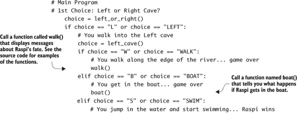

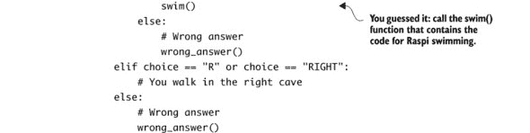

查看 第五章 的源代码，以了解这些函数（`walk()`、`boat()` 和 `swim()`）的示例。它们的结构类似于 `left_cave()` 和 `wrong_answer()` 函数。你可以自由地编写关于 Raspi 发生的事情的描述，或者将结果更改为你希望的方式。

#### 探索右侧洞穴

在这个游戏中，Raspi 有两个初始洞穴选择：左或右。编程右洞穴与左洞穴类似。再次使用地图和流程图作为你的指南。让我们添加右洞穴的逻辑，它从用户在地面上找到一个洞开始（见图 5.8）。

##### 图 5.8\. 右洞穴由一系列决策组成。一步走错，Raspi 就会面临死亡。如果用户做出正确的选择，Raspi 将找到宝藏。代码使用 `if`/`elif`/`else` 语句和函数。请参阅第五章的代码文件以获取函数的示例。


右洞穴使用与左洞穴类似的逻辑。你将使用 `if`、`elif` 和 `else` 语句来处理所有可能的选择。与左洞穴一样，请注意，你将在其他 `if` 语句下缩进 `if`/`elif`/`else` 语句以创建你想要的逻辑。*嵌套*是指在一组 `if` 语句内部缩进另一组。当你的逻辑需要在先前的条件为真时才执行时，嵌套 `if` 语句的技术很有用。在这种情况下，你只想在用户已经决定使用绳子爬进洞中时才给用户选择与龙战斗的机会。现在的逻辑与游戏的流程图相匹配。

让我们通过另一个不同的例子再次看看嵌套。想象一下，你想编写一个程序，在输入正确的秘密名称（“Tim”）和正确的秘密密码（“raspberrypi”）后显示一个秘密信息。如果秘密名称猜对了，那么用户必须猜测秘密密码（见图 5.9）才能看到秘密信息。

##### 图 5.9\. `if` 语句可以嵌套在其他 `if` 语句中。在这种情况下，只有当用户首先正确猜出秘密名称时，才会提示用户猜测密码。Python 使用缩进来确定哪些语句属于一组，以及哪些 `if` 语句嵌套在其他语句中。


如果密码正确，用户必须输入他们最喜欢的颜色。如果颜色是红色，程序将显示秘密信息（见图 5.9）。

#### 故障排除

创建 `if`/`elif`/`else` 语句时常见的错误是忘记在 `if` 语句末尾包含冒号。在这种情况下，当你运行程序时，你会在 IDLE 中看到一个弹出消息说“无效语法”，Python 文本编辑器会将行尾突出显示为红色（见图 5.10）。你可以通过在 `if` 语句末尾添加冒号来修复这个错误。

##### 图 5.10\. 当 `if` 语句末尾缺少冒号（`:`）导致无效语法时，IDLE 会突出显示


另一个错误是在创建自己的函数时忘记在`def`语句的末尾放置冒号。在这种情况下，你会在缺少冒号的行末看到相同的消息（“无效语法”）和红色高亮。

最后，第三个常见的错误是在`if`语句中比较两个值时使用单个等号（`=`）。Python 会突出显示错误等号，如图图 5.11 所示。记住，你需要使用双等号（`==`）来测试两个值的相等性。这返回 True（如果值相等）或 False（如果它们不相等）。单个等号（`=`）用于将值赋给变量，例如`x = 7`。

##### 图 5.11\. 当只有一个等号时，IDLE 的突出显示


通过将单个等号（`=`）替换为双等号（`==`）来修复这个错误。正如你所看到的，小问题可能导致程序出现错误。如果你真的遇到了困难，请让朋友查看你的代码，或者将你的代码发布到论坛并寻求帮助。你会惊讶于其他程序员是多么有帮助！

### 水果采摘者额外功能：播放视频

除了显示文本，就像洞穴冒险游戏一样，Raspberry Pi 还可以输出声音，显示图像，播放视频。让我们看看如何在你的 Raspberry Pi 上播放视频。参见附录 A 了解如何设置你的 Raspberry Pi 的 Wi-Fi 适配器。你可以在 Pi 上使用许多不同的视频播放器应用程序，但 OMXPlayer 是一个很好的选择。它是专门为 Raspberry Pi 创建的，并预安装在 Raspbian 中。我们将在第八章中探索 OMXPlayer 的音频（或声音）播放功能。

为了展示你的 Pi 的能力，让我们播放一部名为*Big Buck Bunny*的电影的高清演示视频。^([2]) 它大约 10 秒长，没有声音。打开 LXTerminal，在提示符下输入

> ²
> 
> 这是一个开发用于测试视频播放和显示的视频。

```
omxplayer /opt/vc/src/hello_pi/hello_video/test.h264
```

你应该看到一个无声的视频播放大约 10 秒钟。享受它！如果你在网上知道一个视频文件（.mp4 或 H.264 格式），只要你有良好的互联网连接，OMXPlayer 就可以播放它。例如，要观看另一部名为*Sintel*的视频预告片，请确保你已连接到互联网，并输入

```
omxplayer https://download.blender.org/durian/trailer/sintel_trailer-
 720p.mp4
```

为什么不在网络浏览器中打开电影呢？因为 OMXPlayer 可以更容易地播放它们——它被设计为使用 Pi 的图形处理单元（GPU）来播放视频。这意味着你 Pi 的大部分资源都可以用于其他事情。

#### 直播流：从你的 Pi 探索

你一直在假装探索洞穴。现在让我们看看你是否可以使用你的 Pi 通过从网络摄像头直播视频来探索海洋或太空。你可以通过连接到来自加利福尼亚蒙特雷湾水族馆的实时流来将你的 Pi 变成一种可以看到鲨鱼和海龟的方式。或者，也许你现在想看看地球从国际空间站看起来是什么样子。

通过几个步骤，你可以配置你的 Pi 来播放直播视频。首先，你需要一个名为 Livestreamer 的小工具，它可以接收直播视频流并将其输出给 OMXPlayer 播放，就像你的测试视频一样。让我们确保你有 Python 包安装器。确保你有工作的互联网连接，然后使用 Linux 终端（选择菜单-->附件-->终端）打开 Raspbian 命令行，并安装软件：

```
sudo apt-get install python-pip
```

完成后，安装 Livestreamer：

```
sudo pip install livestreamer
```

现在你需要一个指向视频直播流的链接。Livestreamer 可以与许多最受欢迎的直播网站一起工作。在这个例子中，你将使用 Ustream，但你也可以使用 YouTube Live 和其他许多网站。如果你访问 Ustream 网站，^([3])，你可以找到直播视频的链接。以下是网站上找到的几个不同链接：

> ³
> 
> 在[www.ustream.tv/explore/all](http://www.ustream.tv/explore/all)探索 UStream 的直播视频。

+   在蒙特雷湾水族馆观看鲨鱼和海龟：[www.ustream.tv/channel/9600798](http://www.ustream.tv/channel/9600798).

+   查看蒙特雷湾水族馆中生活在海藻床上的海洋生物：[www.ustream.tv/channel/9948292](http://www.ustream.tv/channel/9948292).

+   查看国际空间站的视角（如果空间站在地球的阴影中，它可能看起来很暗）：[www.ustream.tv/channel/9408562](http://www.ustream.tv/channel/9408562).


##### 注意

这些链接可能会随时间变化。你可以通过搜索 Ustream 网站来获取最新的链接。


你在接下来的几个步骤中需要一个互联网连接。你需要确定可用的视频分辨率。对于蒙特雷湾水族馆的直播流，输入

```
livestreamer http://www.ustream.tv/channel/9600798
```

出现了一些消息，底部是支持的流分辨率。对于这个直播流，你应该看到一个响应，表明

```
Available streams: mobile_240p (worst, best)
```

这意味着`mobile_240p`是视频流的唯一可用分辨率。这是一个低分辨率的流，但观看起来仍然很有趣。告诉 Livestreamer 使用以下命令将视频发送到 OMXPlayer：

```
livestreamer http://www.ustream.tv/channel/9600798 mobile_240p --
 player omxplayer --fifo
```

太好了！几秒钟后你应该会看到一个视频打开。它将是低分辨率，但请坐下来观看令人惊叹的现场鱼群直播，包括鲨鱼（见图 5.12）！

##### 图 5.12\. Pi 的显示器是一个来自水族馆的实时流。看看那只鲨鱼！通过使用 Livestreamer 和 OMXPlayer，你可以从非洲的水坑和国际空间站等异国他乡的地方直播视频。


##### 注意

注意，你必须输入`mobile_240p`。你将输入上一步中支持的分辨率之一。


按下 Ctrl-C 停止 Livestreamer 和 OMXPlayer。享受从你的 Pi 上探索世界吧！


### 挑战

这些挑战集中在改进 Raspi 的洞穴冒险游戏。如果你遇到困难，请查看附录 C 以获取提示和解决方案。

#### 介绍戏剧性的停顿

这个第一个挑战是在 Raspi 的洞穴冒险游戏中通过在 `print` 和 `input` 语句之间添加两秒的暂停来增加一些戏剧性。这将创造对接下来会发生什么的期待，并给玩家更多的时间在回答之前阅读信息。

这里有一些如何完成这个任务的提示。首先，Python 有一个内置的 `time` 模块，它提供了一些用于处理时间的有用函数。在程序顶部，你需要添加一个 `import` 语句来使用这个内置的 Python 工具箱：

```
import time
```

一旦你导入了 `time` 模块，你可以在程序中调用 `sleep` 函数：

```
time.sleep(1)
```

这个示例代码使程序暂停 1 秒。它采用 `time.sleep(seconds)` 的形式，其中 `seconds` 是程序需要暂停的秒数。例如，如果你想显示一条消息，等待 3 秒，然后显示另一条消息，你会写

```
print("It was a dark, dark cave...")
time.sleep(3)
print("Suddenly, a dragon appears out of the shadows.")
```

尝试创造一些戏剧性。如果你卡住了，请查阅附录 C 或回顾代码文件。

#### 随机死亡

当游戏具有不可预测性元素时，游戏总是更有趣。尝试通过改进 `wrong_answer` 函数，随机显示玩家可能遇到死亡的一组可能方式的消息来给你的游戏增加一些惊喜。以下是一些开始时的例子：

+   Raspi 看到地上有一块石头，就把它捡起来。他感到一阵剧痛，然后扔掉了石头。当他倒在地上时，他意识到那不是石头，而是一只有毒的蜘蛛。

+   站在洞穴里，Raspi 看到一个小兔子靠近。Raspi 对这只兔子有一种不好的感觉。突然，兔子攻击了他，咬住了他的脖子。

提示：创建具有不同结尾的 `if`/`elif`/`else` 语句，然后使用 `random` 模块从可能的结果中选择。

#### 再玩一次？

修改游戏，使其无论以何种方式结束，用户都始终有再次玩的机会。提示：创建一个初始设置为“Y”的变量 `play_again`。你还需要在你的游戏中添加一个 `while` 循环，使游戏在 `play_again` 等于“Y”时重复。

#### 喊叫！

如果你有一副耳机或者你的 Pi 通过 HDMI 线连接到带有内置扬声器的电视，你应该能够播放声音并听到它们。让我们看看一个简单的程序，在 Pi 上播放声音：

```
import os
scream_file_path =
 "/usr/share/scratch/Media/Sounds/Human/Scream-male2.mp3"
os.system("omxplayer " + scream_file_path)
```

测试程序，你应该会听到尖叫。现在看看你如何将尖叫或其他声音整合到 Raspi 的洞穴冒险中。你可以在 Pi 的 Scratch 文件夹中找到更多声音：/usr/share/scratch/Media/Sounds/。

| |
| --- |

##### 注意

OMXPlayer 与以 .mp3 结尾的声音文件配合得最好。只有一些以 .wav 结尾的文件才能工作。我们将在第八章中更多地讨论声音文件和 OMXPlayer。第八章。

| |
| --- |

如果你需要帮助解决这些问题，请参阅附录 C！祝你好运！

### 摘要

通过将逻辑和指令组合到更复杂的程序中，你可以创建引人入胜的程序：

+   在开始之前，使用流程图来规划复杂的程序。

+   通过使用布尔运算符创建灵活的程序，以便处理意外的输入。

+   使用 `if`、`elif` 和 `else` 语句构建具有多个选择和结果的程序。通过链式连接多个 `elif` 语句来创建所需数量的选择。

+   当逻辑中嵌套逻辑时，通过嵌套 `if` 语句来创建依赖于先前选择或条件的决策。

+   通过定义自己的函数并在程序中调用它们来组织代码并减少重复。
