## 第三部分。Pi 和 Python 项目

让我们面对现实。按按钮、播放声音和点亮酷炫的彩色灯是很有趣的！现在你可以用你的 Pi 来让这些事情发生。你将创建使用 Pi 的输入和输出引脚的交互式项目。这使得你的 Pi 成为一种特殊的计算机，它不仅能在屏幕上显示图像，还能控制和感知周围的世界。这个领域被称为*物理计算*。机器人技术是物理计算的一部分，但想想所有创造性的可能性，比如制作交互式艺术、创建能感知你的存在并打开灯光或播放音乐的智能房间，或者生产一些可以提醒你即将下雨或你的宠物正在喝水的物品。

在第三部分中，你将构建可以使用 Python 和你的 Raspberry Pi 与世界交互的项目。这些项目可能需要一些额外的部件，你可以单独购买或作为套件的一部分购买，例如 CanaKit 终极套件、Adafruit 入门套件或 MCM Electronics 入门套件：

+   包含 SD 卡、电源、线缆、键盘和显示器的 Raspberry Pi 2 Model B

+   面包板

+   Model B+ (40 引脚) 的 GPIO 排线

+   GPIO 扩展板

+   12 根跳线，公对公

+   1 个红色 LED（发光二极管）

+   1 个绿色 LED

+   1 个蓝色 LED

+   3 个按钮

+   3 个 10K 欧姆电阻

+   3 个 180 欧姆电阻（或介于 100 到 300 欧姆之间）

+   头戴式耳机或带电源的计算机扬声器

你从第六章开始，通过使用电子面包板设置你的 Pi，构建一个简单的电路，并使用 Python 控制 LED（灯）。你将学习如何通过 Pi 的输出引脚进行通信，以使某些事情发生。在这种情况下，你将使 LED 灯亮。在第七章中，我们将深入探讨创建一个使用灯光响应玩家输入的交互式猜谜游戏，用不同的颜色告诉他们他们的答案是对是错。在第八章中，你将学习如何通过在面包板上连接一个按钮来监听你的 Pi 的输入引脚，并在按下时做出响应；你将完成一个结合按钮和声音来制作你自己的 DJ Raspi 声音混音器的项目。到那时，目标是让你拥有知识、技能和信心，能够想出并创建你自己的 Pi 和 Python 项目。

## 第六章。闪烁的 Pi

**在本章中，你将学习的内容**

+   *通过连接器给你的 Pi 赋予与任何东西交流的能力*

+   *用简单的电/电子电路编程你 Pi 之外的世界*

+   *使用你之前的 Python 知识编程连接器以创建灯光图案*

让机器人运动起来，创建带有传感器的智能家庭，以及设计一个交互式电子艺术展览听起来像是截然不同的主题，但这些都是你可以用你的 Raspberry Pi 做到的事情。在每种情况下，Pi 都可以作为大脑，通过做一些事情与世界互动，比如

+   检查机器人的传感器和控制其电机

+   感知房间的居住者并调整恒温器或灯光

+   作为艺术展示的一部分控制声音、运动和灯光

在本章中，你将设置你的 Pi 来控制称为 *发光二极管 (LED)* 的小型灯泡。你将使用 Python 使 LED 闪烁。为此，你需要了解一些如何在面包板上构建电路的知识。如果你从未听说过面包板，不要担心！它是一个带有许多孔的小板，这使得构建电路更容易。你还将使用短导线（称为 *跳线*）来连接某些孔。你甚至将学习如何添加电阻，以防止你的 LED 烧毁。参见图 6.1 了解所需部件及其外观；收集部件，让我们开始吧！

##### 图 6.1\. Blinky Pi 项目需要一些在 Raspberry Pi 入门套件中常见或可以在线购买的部件。

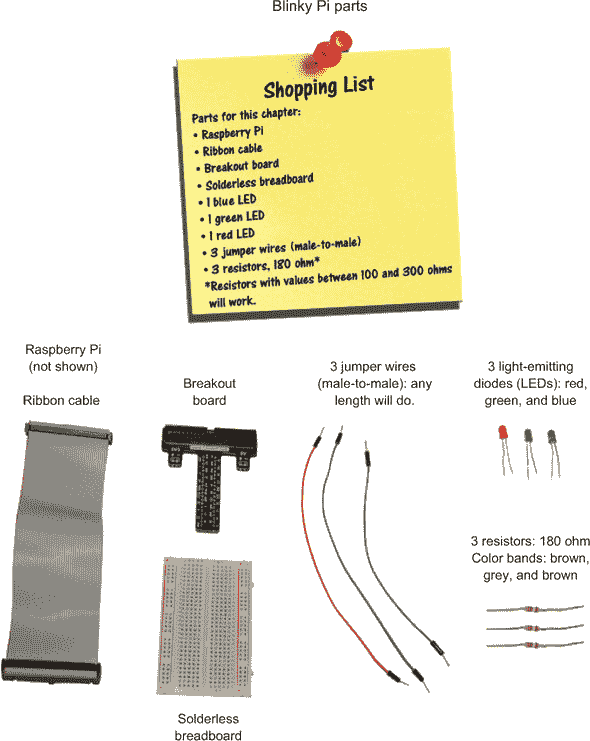

### 为物理计算设置你的 Pi

与大多数计算机相比，你的 Pi 由于其输入和输出引脚，称为 *GPIO* 引脚而独特。让我们学习如何与这些引脚一起工作。

| |
| --- |

##### 定义

GPIO 代表 *通用输入/输出*。这些是 Raspberry Pi 上的引脚，允许它感知和控制周围的事物。

| |
| --- |

#### GPIO 引脚

Raspberry Pi 2 Model B 和 Raspberry Pi 1 Model B+ 在电路板的边缘有 40 个引脚，排列成两行，每行 20 个引脚（见图 6.2）。Pi 上的大多数引脚都用于输入和输出，因此它们通常被称为 Pi 的 GPIO 引脚。

##### 图 6.2\. Raspberry Pi 2 Model B 在 Pi 板的边缘和角落有一组引脚。

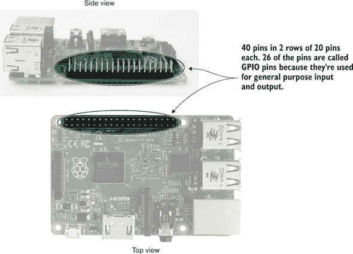

| |
| --- |

##### 警告

这个项目是为 Raspberry Pi 2 Model B 编写的。较早的 Raspberry Pi 模型只有 26 个引脚。有关与较现代 Pi 板的差异信息，请参阅附录 B。要使用 Raspberry Pi 1 Model B 完成此项目，你可能需要选择不同的引脚来点亮你的 LED。

| |
| --- |

由于所有引脚看起来都相同，你需要一个钥匙或图表来告诉你每个引脚的作用。图 6.3 显示了标记的引脚。

##### 图 6.3\. Raspberry Pi B+ 有 40 个引脚。它们执行不同的功能：一些提供 5 伏或 3.3 伏，一些是地线引脚（0 伏），而许多是输入和输出引脚，你可以编程。

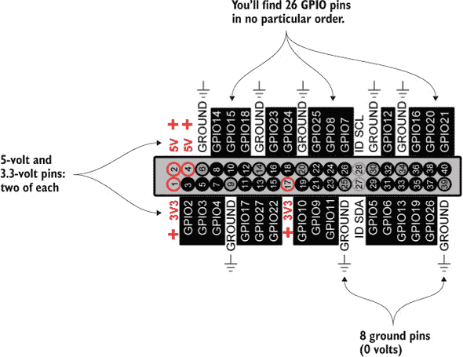

| |
| --- |

**物理引脚与 GPIO 引脚编号**

在本书中，我们始终会提到 GPIO 引脚编号，*而不是* 物理引脚位置。物理引脚从 1 到 40 编号（如图 6.3 中的圆圈所示）。GPIO 引脚编号从 1 到 26，这些编号与物理引脚编号不匹配。例如，GPIO 24 对应于物理引脚 18。始终使用 GPIO 编号，这将使你布线电路和创建程序更容易。

| |
| --- |

哇，引脚真多！一些引脚用于供电，标有 3V3 或 5V。它们分别产生 3.3 伏或 5 伏。还有 8 个接地引脚和 26 个 GPIO 引脚^([1])——26 个引脚，就像字母表中 26 个字母一样。

> ¹
> 
> 奇怪的是，你会发现 GPIO 引脚从 2 号到 27 号编号。0 号和 1 号引脚用于通过一个称为 I2C 的超级特殊协议与其他计算机芯片通信。这些在图 6.3 中标有 ID SDA 和 ID SCL。

GPIO 引脚支持发送电信号（输出）或监听来自传感器的电信号（输入）。在你的身体里，你的大脑可以向你的手发送信号，让你拍打自己的额头（试试看！）——这就像 Pi 的输出一样。信号从 Pi 发出，以在世界上产生某种效果。

输出的对立面是输入。当有人戳你时，你的身体可以通过体内的神经检测到这个戳。一个电信号（输入）被发送到你的大脑，让你知道你被戳了。这就像你的 Pi 可以用来检测世界中的输入或动作一样。

你将在本章和第七章中学习如何输出信号。第八章将涵盖检测来自世界的外部输入，例如检测按钮是否被按下。

让我们准备好连接一些电线！但是等等：直接将 LED 连接到 Raspberry Pi 板上的 GPIO 引脚是不可行的，因为引脚之间的距离太近了。你能做什么呢？你需要更多的空间来构建电路。

#### 将 GPIO 引脚扩展到面包板

为了给你留出空间，你需要将 GPIO 引脚移动到面包板上。这被称为*引脚扩展*。为此，你需要一根扁平电缆、扩展板和无焊面包板（见图 6.4）。

##### 图 6.4\. 为了轻松使用 Pi 的 GPIO 引脚创建项目，你可以使用扁平电缆和扩展板将 Pi 连接到面包板。图中所示的部分是许多 Raspberry Pi 套件中常见的部件示例。

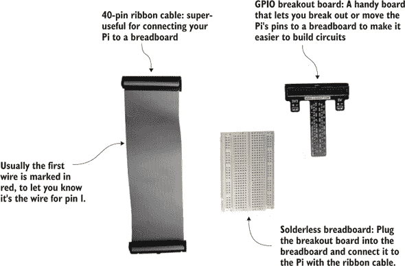

面包板使电路原型设计变得简单。就像公园可能提供宽敞的开放场地，使运动变得容易一样，把面包板想象成一个宽敞的电气运动场，你可以在这里玩电气部件。面包板允许你将电线和组件插入小孔。你可以在面包板上轻松构建和重建电路。

找到你的扩展板，并将其插入面包板的顶部。在按下*硬*之前对齐引脚（见图 6.5）。你的扩展板可能看起来略有不同，但它们的作用都是一样的。有了扩展板，使用 GPIO 引脚构建电路会更容易。

##### 图 6.5\. 小心地对齐扩展板，然后将其牢固地压入面包板中。扩展板上的两排引脚应该跨越中心间隙。

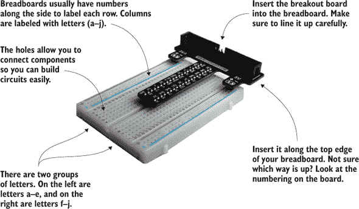

将带状电缆的一端连接到 Pi 的 GPIO 引脚；在按下之前仔细对齐。然后将电缆的另一端连接到面包板上的扩展板（见图 6.6）。扩展板有一个缺口，这样带状电缆就只能以一个方向插入。

##### 图 6.6\. 将带状电缆的一端连接到扩展板。将另一端连接到你的 Raspberry Pi。

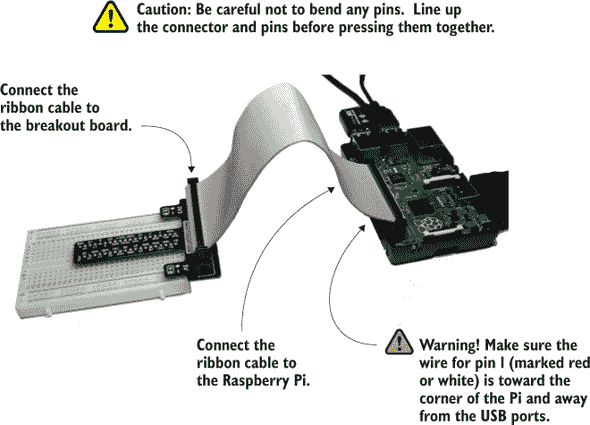


##### 警告

带状电缆通常有一条标记第一条线的条纹。白色或灰色带状电缆通常使用红色条纹。黑色带状电缆通常有白色条纹。这些标记了电缆上的第一条线。确保这条第一条线连接到你的 Pi 板的边缘，远离 USB 端口。


#### 面包板基础知识

面包板^([2])有一组内部连接，你无法看到。但如果你有 X 光视力，你会看到某些孔是相连的。让我们看看你的面包板上的连接（见图 6.7）。

> ²
> 
> 在我们使用的面包板开发之前，人们会在用来切面包的木板上搭建电路（因此得名）。他们需要一个快速连接电路的方法，通过钻孔和使用钉子和电线，他们可以使用面包板尝试不同的电路。

##### 图 6.7\. 面包板有内部连接。你需要了解它们才能搭建电路。引脚行是水平相连的，但不是跨越中间的缝隙。称为*电源总线*的长轨垂直沿着板的两侧运行。

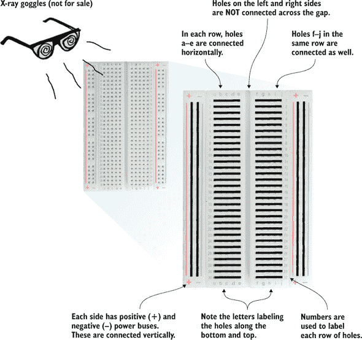

在这个面包板上，行用数字标记（1–30），列用字母标记（左侧为 a–e，右侧为 f–j）。你可以通过说出面包板上的特定孔的行号和字母来引用它。例如，如果你想引用位于第 25 行，c 列的孔，你可以说 25c（见图 6.8）。就像你可能会通过走通道找到体育场中的座位，然后沿着行移动以找到正确的座位一样，你将使用字母和数字来指导你搭建电路。

##### 图 6.8\. 要在面包板上找到特定的孔，请使用行和列标签。这是一张面包板的特写，显示了如何找到孔 25c 的位置（我们将把这个孔称为 BB25c，其中*BB*代表*面包板*）。

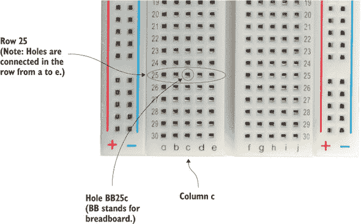

##### 面板孔（BB 孔）

我们将提到行和列，但我们会预先加上字母*BB*，这样你知道我们谈论的是面包板的位置。图 6.8 显示了 BB25c 的位置。如果我们谈论 GPIO 引脚或连接，我们将在数字前加上*GP*（GPIO 引脚 21 是 GP21）。

尝试记住面包板上哪些部分是连接的，哪些部分没有连接。如果你忘记了，你总是可以回顾一下图 6.7。例如，注意 BB25 的 a、b、c、d 和 e 都是连接的。同样，BB30 的 f、g、h、i 和 j 也是连接的。但是，板的左侧并没有连接到右侧。例如，BB25e 并没有连接到 BB25f。要连接它们，你需要在 BB25e 和 BB25f 之间放置一个跳线。

你可以在面包板的侧面看到垂直排列的孔。这些是*电源总线*，提供了将电气元件连接到电源（正极）和地（负极）的简便方法。

| |
| --- |

**电路 101**

让我们学习关于电和电路的知识。在最简单的层面上，一个*电路*是一个回路或路径，其中电能从电源（电源的正极）开始，通过一个或多个电气元件（如灯或电机），然后通过连接回电源的负极来完成回路（或路径）。

**什么是电？**

*电*是电荷的流动。通常，它是电子的流动，电子带有负电荷。要使电子流动，你需要有电荷差异。就像磁铁的北极会被另一个磁铁的南极吸引一样——正负电荷也会相互吸引。如果电荷可以自由移动，它就会移动。我们通常认为电路中的电是从电源的正极（+）流向电源的负极（-）。对于你的 Pi 来说，电源来自电源适配器（Micro USB 插头）。Pi 作为电源可以提供+3.3 伏或+5 V（伏特）。它通过物理引脚 1、2 和 4 提供这种电源，但也可以通过任何 26 个 GPIO 引脚发送+3.3 V（你很快就会编程使其这样做）。

**电压（伏特）**

*电压*是正负电源之间电电荷差异的度量。当你有两个不同的电荷时，它们会相互吸引（正负相吸）。电荷差异越大，推动电荷通过电路从正极到负极的力（或电压力）就越大。

电压以伏特（V）为单位测量，这个名字是为了纪念亚历山德罗·伏打，他被认为是第一个电池的发明者。9 伏（或 9 V）的电池比 AA 电池具有更大的推动电荷的电场，AA 电池的电压仅为 1.5 V。

**电流（安培）**

电路中的*电流*是流动的电荷量。所以，虽然电压是衡量电荷*想要*流动的程度，但电流是衡量实际流动电荷量的程度。

想象一下，你可以在导线内部，并看到电荷通过它流动。大电流意味着在一段时间内有大量的电荷（通常是电子）沿着导线碰撞并通过。在相同导线中的小电流意味着在相同时间内流动的电荷要少得多。电流以安培（A）为单位测量，以安德烈-玛丽·安培的名字命名。1 安培（或 1A）的电流相当于每秒通过导线的 6.241 × 10¹⁸个电子的电荷量！这是大量的电荷流动。你可以通过增加电路对电荷流动的电阻来减少电路中的电流。

**电阻（欧姆）**

电路中的*电阻*是衡量它反对电荷流动（电流）的程度。灯泡、电机和你的身体都有电阻。电阻的相反是*电导*。金属（铜、银和金）等物质都是良好的导体，这就是为什么我们用金属线构建电路，让电流通过。

有时候你需要控制电流（电荷的流动）。电阻用于此目的；它们由减缓电荷流动的材料制成。最常见的是由碳制成（你将在你的项目中使用这些）。电路的电阻以欧姆为单位测量，以乔治·欧姆的名字命名，并使用希腊符号 omega（Ω）表示。

**PI 电路**

你可以将树莓派视为从 Pi 的正极提供 3.3V，或者稍后从 GPIO 引脚之一输出。这个+3.3V 是一种试图将电荷推向源负极（-）的力。负极有时被称为*地*——想象它是一个大型的汇流排或水库，如果有一条路径到达那里，电流就会流向那里。在接下来的几章中，你将使用 LED 和电阻搭建电路。你使用电阻与 LED 一起减少电荷流动（电流），以防止电流过大烧毁 LED。烧毁 LED 会发出难闻的气味！


在你的面包板上，将所有 GPIO 引脚都视为电压（正）的潜在来源。从 GPIO 引脚发出的电路应返回到任何一个多个地（负）连接中。

### 搭建 LED 电路

你的第一个项目是点亮一个红色 LED。你将使用 GPIO 引脚 21（GPIO21）来控制 LED。你需要以下这些部件：

+   树莓派、扁平电缆和连接到面包板上的扩展板

+   1 个红色 LED（5mm）

+   1 个 180 欧姆电阻

+   1 根跳线（公对公）

你将在面包板上搭建 LED 电路，然后编程使其点亮。图 6.9 显示了电路图。要点亮 LED，你需要从树莓派的 GPIO 引脚 21 通过 LED、通过电阻，然后到地（0V）流动电。

##### 图 6.9\. 点亮 LED 项目的电路图

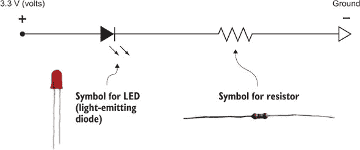

图 6.10 显示了在面包板上构建的 LED 电路。请注意，有多种不同的方法可以创建这个电路——这只是其中一种。让我们一步步来构建电路。

##### 图 6.10。在面包板上构建的 LED 电路。你正在使用 GPIO 引脚 21 作为电源。直到你编程使电压从引脚输出，灯不会亮。

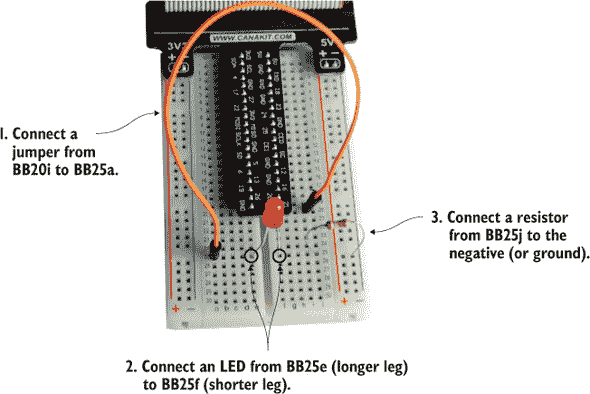


##### 注意

你可能使用的面包板与本书中使用的不同。如果是这样，你的面包板上的编号可能与这里显示的不同。在这种情况下，你需要根据相同的原则创建电路，但使用不同的编号孔。


#### 第 1 步：连接 GPIO 引脚 21 的跳线

树莓派 GPIO 引脚可以输出 3.3V。你可以选择任何引脚，但本项目使用 GPIO 引脚 21。

将你面包板上的 GPIO21 引脚连接到面包板上的一个空行。使用第 25 行。将电线牢固地推入孔中。电线的金属尖端应进入孔中，而不是放在上面。

开关板引脚连接到面包板上的行。我们将参考面包板上的孔（见图 6.11）。将跳线的一端插入 BB20i，另一端插入 BB25a。

##### 图 6.11。开关板有标签，与你的 Pi 引脚相对应。要将电线连接到 GP16，将其插入标记为 BB18f 或 BB18j 的面包板孔中。

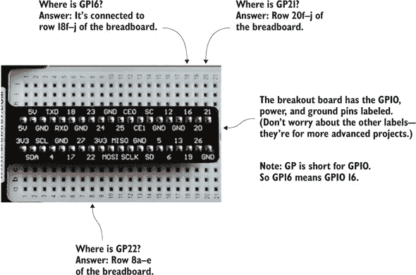

#### 第 2 步：添加红色 LED

是时候连接红色 LED 了。LED 只允许电流单向通过，所以正确放置它们很重要。LED 有两个电线或*腿*。较长的腿称为*阳极*，连接到电路的正极（见图 6.12）。较短的腿，称为*阴极*，连接到电路的负极或地线。

##### 图 6.12。LED 有两个腿（电线）从它们中出来。较长的腿称为阳极，连接到电路的正极。较短的腿称为阴极，连接到电路的负极。

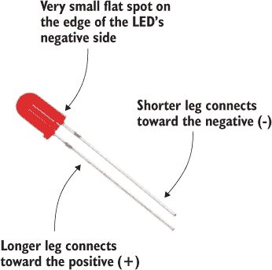

使用红色 LED，将较长的腿连接到 BB25e，将较短的腿连接到 BB25f。你可能需要弯曲腿并稍微推一下，才能将它们插入孔中。

#### 第 3 步：连接电阻

拿起你的 180 欧姆电阻.^([3]) 你可以通过其颜色编码的带子来识别电阻。180 欧姆的电阻有棕色、灰色和棕色的颜色带（见图 6.13）。它们后面跟着一个第四个带子，表示电阻的公差或质量。第四个带子的常见颜色是金色（±5%公差）和银色（±10%公差）。

> ³
> 
> 如果你没有 180 欧姆的电阻，你可以使用 100 到 330 欧姆之间的电阻。如果你使用值太大的电阻，LED 可能不会亮起或会很暗。尝试使用不同的电阻来调整亮度。

##### 图 6.13\. 电阻的值由其彩色带决定。参见侧边栏“电阻颜色代码”中的图表；还有许多在线颜色代码图表。


电阻阻止过多的电流通过您的 LED，从而避免烧毁它。将 180 欧姆电阻的一端插入 BB25j，另一端插入负极（-）电源总线（或地）。

> ⁴
> 
> 电流是每秒电荷流动的量度。如果通过 LED 的电流过高，LED 将会烧毁。

*电流将通过电阻双向流动，所以您连接的方向无关紧要*。记住，负电源总线或地线在面包板的右侧垂直运行。大多数板在其旁边都有一个蓝色条纹。

| |
| --- |

**电阻颜色代码**

电阻有颜色代码，可以告诉它们的值和公差。此图表显示了如何读取电阻颜色带。

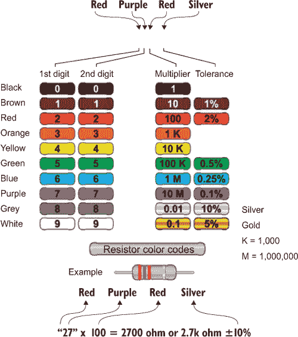

例如，考虑一个带有红色、紫色、红色和银色带的电阻。按照以下步骤使用图表：

+   查找第一条带和第二条带的数字，并将它们组合起来。在这种情况下，数字是 2 和 7：将它们组合起来，得到 27。请注意，您不需要将数字相加；您将它们视为电阻值的第一个和第二个数字。

+   通过查找第三条带的颜色来找到乘数。在这种情况下，它是 100 欧姆（红色）。

+   将它们全部组合起来：27 × 100 欧姆等于 2,700 欧姆或 2.7K 欧姆（K = 1,000）。

+   第四条带（银色）表示电阻的公差为 ±10%。

一个红色、紫色、红色和银色的电阻是一个公差为 ±10% 的 2.7K 欧姆电阻。在需要查找电阻值时，随时使用这个方便的图表。

| |
| --- |

就这样！您已经在面包板上构建了一个完成的 LED 电路。现在，是时候编程它了！

### 软件：blinkLED 程序

通过在菜单 > 编程下选择 Python 3 来打开 IDLE。这将在 Python 3.x Shell 中打开 IDLE。在 Python Shell 中，让我们检查您的 Pi 是否已经安装了所需的 GPIO 库：

```
>>>  import RPi.GPIO as GPIO
```

如果您没有看到错误，您就可以开始了。如果您看到错误消息说没有名为 `RPi.GPIO` 的模块，请参阅侧边栏“更新您的 Pi”。

| |
| --- |

**更新您的 Pi**

在编程之前，您需要检查您的 Pi 是否已更新。确保您的 Pi 已连接到互联网。通过转到菜单 --> 附件 --> 终端来打开终端程序，并运行以下命令以更新 Raspberry Pi 并确保您有所需的 Raspberry Pi GPIO 软件包。

首先，让我们更新 `apt-get` 数据库。`apt-get` 程序负责在您的 Pi 上安装和删除软件。在终端中输入以下命令：

```
pi@raspberrypi ~ $ sudo apt-get update
```

您需要等待一段时间，以便下载和安装一些文件。您将在终端中看到许多消息。当命令完成时，您将再次看到终端的`$`提示符。接下来，要获取最新的 Pi 软件，请输入

```
pi@raspberrypi ~ $ sudo apt-get upgrade
```

再次，将下载并安装文件。在一系列消息之后，您将看到有关使用额外磁盘空间升级的警告，以及以下提示：“您想继续吗 [Y/n]？”输入`Y`并按 Enter 键继续升级。

现在是抓一个三明治和汽水的好时机。更新可能需要 15 分钟或更长时间才能完成。完成之后，您将拥有最新的树莓派软件和 Python 库，包括您需要用于与 GPIO 引脚通信和控制所需的库。


您将要编写一个闪烁 LED 的程序。它将从 GPIO 引脚发送电压（+3.3 V）来点亮 LED，然后关闭它，并重复此操作。首先，在 IDLE 中创建以下新程序。在 Python Shell 中，通过按 Ctrl-N 或选择文件 > 新窗口来启动新程序。

##### 列表 6.1\. 闪烁 LED 程序

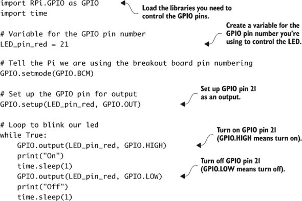

将程序保存为 blinkLED.py 到您的家目录中。程序不能以您之前使用 IDLE 运行程序的方式运行。

#### 运行程序

从 IDLE 文本编辑器中选择运行 > 运行模块（或按 F5）来运行您的程序。在较旧的 Raspbian 版本中，使用 GPIO 引脚的程序必须以超级用户（或 root）的身份从 Raspbian 命令提示符运行^([5]）。如果您在 IDLE 的 Python Shell 中运行程序，您将得到一个错误：

> ⁵
> 
> 在 2015 年 10 月，树莓派基金会发布了 Raspbian 版本“Jessie”，允许您直接从 IDLE 使用 GPIO 引脚运行程序。使用“Jessie”，您不需要打开命令提示符。只需按 F5 或在 IDLE 文本编辑器菜单中选择运行 > 运行模块即可运行您的程序。

```
RuntimeError: No access to /dev/mem. Try running as root!
```

在这种情况下，您使用`sudo`命令来完成此操作。要运行 blinkLED.py 程序，打开 LXTerminal 并输入以下命令：

```
pi@raspberrypi ~ $ sudo python3 blinkLED.py
```

看看闪烁的 LED 灯！通过调整`sleep`函数中的值来尝试使灯光闪烁得更快。使用更小的秒数，例如 0.5 或 0.1.^([6]) 要停止程序，请按 Ctrl-C。

> ⁶
> 
> 数字太小可能会导致灯光看起来一直亮着，但亮度较低。这是因为您的眼睛只能感知大于大约 1/25 秒的闪烁，或 0.04 秒。


##### 注意

使用 Ctrl-C 停止程序可能会导致灯光保持开启状态（取决于您何时按下它）。此外，下次您运行程序时，您可能会看到运行时错误，但程序仍然可以工作。我们在这里不涉及它，但请在网上查找 Python 命令`try/except/finally`和`GPIO.cleanup()`命令。这是一种确保在退出程序时所有 GPIO 引脚都被重置的优雅方式。


##### 故障排除

如果灯光没有闪烁，这里有一些您可以检查的事情：

+   屏幕上是否显示了开和关的消息？如果是这样，可能不是你的代码有问题。检查面包板上的电路。确保扁平电缆连接正确，第一根线连接到 Pi 的边缘，远离 USB 端口。再次检查跳线、LED 和电阻是否连接到正确的孔位。

+   你的 LED 是否插反了？确保较短的腿朝向负极或地线侧。试着把它转过来。

+   仔细检查电路中使用的电阻值。如果电阻太大，LED 灯将不会亮起。100 到 300 欧姆之间的电阻应该可以工作。

+   在你的 Python 程序中查找错误。检查你是否已将`LED_pin_red`设置为 21，并且你正在将其设置为`HIGH`然后设置为`LOW`。

#### blinkLED：它是如何工作的

让我们更详细地看看 blinkLED.py 代码是如何工作的。

##### 加载库

`import`命令加载了你在程序中想要使用的库或工具箱：

```
import RPi.GPIO as GPIO
import time
```

这些命令加载了控制 Pi GPIO 引脚的 Python 库。它们还加载了`time`库，这样你就可以使用`sleep`函数来控制闪烁的速度。

| |
| --- |

**使用 as 关键字导入库**

注意到`import RPi.GPIO as GPIO`中的`as`关键字。为什么不能直接输入`import RPi.GPIO`？

`as`关键字告诉 Python 将库加载到指定的某个名称下。这有点像给整个库起一个昵称。在这种情况下，是为了让你可以简单地用`GPIO`来引用`RPi.GPIO`。

一个例子会使其更清晰。一旦你将`RPi.GPIO`库导入为`GPIO`，你可以输入`GPIO.setmode(GPIO.BCM)`。没有它，你将不得不输入`RPi.GPIO.setmode(RPi.GPIO.BCM)`。你可以看到使用`as GPIO`如何节省你一些输入时间！

| |
| --- |

一旦库加载完成，你就可以设置你的 GPIO 引脚。

##### 设置 GPIO 引脚为输出

要设置 GPIO 引脚，你首先需要告诉 Python Pi，你将按照标准断接器编号方案来引用引脚。这些是断接板上打印的数字。你使用`setmode`函数：

```
GPIO.setmode(GPIO.BCM)
```

BCM 代表 Broadcom——Pi 使用的计算机芯片的制造商。接下来，你告诉你的 Raspberry Pi，你将使用`LED_pin_red`（GP21）进行输出，这意味着你计划从它发送一些电流：

```
LED_pin_red = 21

GPIO.setup(LED_pin_red, GPIO.OUT)
```

`GPIO.OUT`将 GP21 准备好发送+3.3 伏的电流。

##### 循环和闪烁

最后，你创建一个无限`while`循环，将 LED 打开（设置`GPIO.HIGH`）然后关闭（设置`GPIO.LOW`）。你还使用了 Python 的`time`库中的`sleep`方法来添加延迟。注意`sleep`函数接受一个参数，即休眠或暂停的秒数。在这种情况下，你使用 1 秒：

```
while True:
    GPIO.output(LED_pin_red, GPIO.HIGH)
    print("On")
    time.sleep(1)
    GPIO.output(LED_pin_red, GPIO.LOW)
    print("Off")
    time.sleep(1)
```

`print`命令会在屏幕上显示消息。虽然它们对于使 LED 闪烁不是必需的，但可以帮助调试你的程序。如果你使用它们，屏幕可能会迅速充满消息。设置更长的延迟时间以防止这种情况。如果你在屏幕上看到消息，但 LED 没有点亮，那么你可能在电路中而不是在程序中存在错误。检查你的接线，尝试翻转 LED，或者尝试使用不同的 LED 以检查是否损坏。

### 添加更多 LED

一个 LED 很有趣，所以三个 LED 肯定更有趣。让我们尝试添加绿色和蓝色 LED，并修改程序来控制它们。以下是你需要的部分：

+   之前的 Raspberry Pi 和电路

+   1 个绿色 LED

+   1 个蓝色 LED

+   2 个 180 欧姆电阻

+   2 根公对公跳线

#### 构建电路

你将遵循之前的过程来添加绿色和蓝色 LED。图 6.14 显示了现在的电路图，图 6.15 显示了面包板上的电路。

##### 图 6.14。三个 LED 的电路图：红色、绿色和蓝色。你将像之前一样使用 180 欧姆的电阻。它们将由不同的 GPIO 引脚控制。红色将使用 21，绿色将使用 22，蓝色将连接到引脚 23。你可以使用任何 26 个不同的 GPIO 引脚。

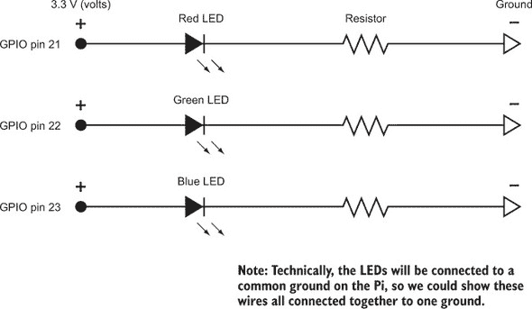

##### 图 6.15。三个 LED 电路在面包板上构建。每个 LED 及其相应的电阻都排成一行。本例使用第 25、27 和 29 行。

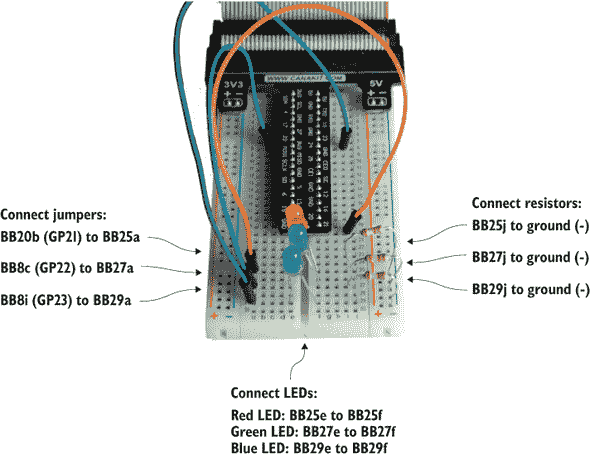

要添加绿色 LED，请按照以下步骤操作：

> **1**. GP22 位于面包板第 8 行的**左侧**的扩展板上。将其连接到**第 27 行**：将跳线的一端插入 BB8c，另一端插入 BB27a。
> 
> **2**. 将绿色 LED 的长腿连接到 BB27e，短腿连接到 BB27f。如果需要，弯曲腿。
> 
> **3**. 将一个 180 欧姆的电阻（棕色、灰色和棕色）从 BB27j 连接到负电源总线上的最近孔。

这是添加蓝色 LED 的步骤：

> **1**. GPIO23 位于面包板第 8 行的**右侧**的扩展板上。将其连接到**第 29 行**：将跳线的一端插入 BB8i，另一端插入 BB29a。
> 
> **2**. 将蓝色 LED 的长腿连接到 BB29e，短腿连接到 BB29f。如果需要，弯曲腿。
> 
> **3**. 拿一个 180 欧姆的电阻。没错！它是棕色、灰色和棕色的颜色编码。将其从 BB29j 连接到负电源总线上的最近孔。

### 多个 LED：编程它！

你需要修改程序以添加更多 LED，并使它们同时闪烁。以下列表显示了更新的代码。

##### 列表 6.2。三个闪烁的 LED

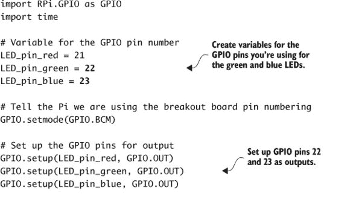

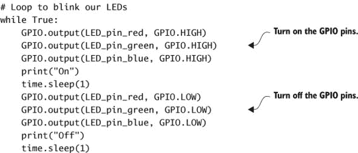

将代码保存为 blinkLED3.py，并尝试运行它。打开 LXTerminal，并输入以下命令：

```
pi@raspberrypi ~ $ sudo python3 blinkLED3.py
```

太棒了！你正在举办自己的灯光秀！

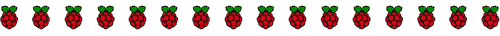

### 挑战

尝试这些挑战来练习控制你的树莓派的 GPIO 引脚。每个都提供了一个独特的问题来解决。

#### 波浪模式

修改程序，使每个 LED 依次打开，直到它们都打开。然后，依次关闭每个 LED。提示：尝试调整`time.sleep(1)`命令的位置。你能使 LED 以波浪模式点亮和熄灭吗？

#### 西蒙说

编写一个函数，该函数可以闪烁 LED，并接受五个参数，代表彩色闪烁的模式。每个参数都是一个表示颜色的字符串：红色、蓝色或绿色。该函数应该以适当的模式闪烁灯光。以下是一些你应该尝试使你的函数生成的西蒙说模式：

红，绿，红，红，蓝

蓝，绿，蓝，绿，红

绿，蓝，蓝，红，绿

#### 随机闪烁

创建一个程序，生成灯光保持开启和关闭的随机持续时间。持续时间应该是介于 0 到 3 秒之间的随机浮点数。提示：你可以使用`random`方法生成介于 0 和 1.0 之间的随机浮点数。以下是一个示例：

```
off_random_time = random.random() * 3
```

为了将这个数字缩放到 0 到 3 之间，你可以将`off_random_time`乘以 3。如果你在挑战中遇到困难，请查看附录 C 和章节源代码以获取提示和解决方案。

### 概述

在本章中，你学习了以下内容：

+   树莓派能够与周围的世界互动。通过添加一些额外的部件，你可以将其设置为物理计算项目。

+   树莓派可以发送电信号！你可以通过 GPIO 引脚发送输出，这可以用来点亮 LED 或控制许多其他电子组件（电机、蜂鸣器、继电器等）。

+   面板就像电子的游乐场。它们使创建用于 Pi 的电路变得容易，因为你可以轻松地构建和拆卸电路以用于 Pi。

+   `RPi.GPIO`库内置了使用 Python 设置和控制 GPIO 引脚输出（电压）的函数。

想象一下使用你的树莓派控制几乎任何电气设备的可能性。更好的是，想象一下根据传感器（输入）使设备工作，这样你就可以创建由你编程的智能设备！

## 第七章\. 点亮猜测游戏

**在本章中，你将学习关于**

+   *通过更深思熟虑的设计和使用函数来简化和提高你的代码*

+   *构建一个电路来控制一个特殊的 LED（灯泡），可以产生并组合红、绿和蓝光*

+   *将光的颜色相加以创建新的颜色*

+   *通过让树莓派使用不同颜色的灯光做出反应来使它生动起来*

你的 Raspberry Pi 具有与周围世界互动的独特能力。在上一个章节中，你根据编程模式使灯光闪烁。不错，但这并不是真正的交互式，因为 Pi 总是闪烁你编程的模式。在本章中，让我们看看你是否能创建一个可以通过其 GPIO 引脚对你做出响应的交互式项目。你将利用你关于条件逻辑（`if`/`elif`/`else`）的知识，让你的 Pi 做出决策并做出响应。就像在早期章节中做的那样，你需要收集输入，使用循环，并应用一些其他编程技术来完成它。

你正在制作一个点亮猜测游戏，但不仅仅如此：这个游戏将点亮一个小灯，称为*RGB*（代表红色、绿色、蓝色）*LED*，它可以产生任何颜色。你将使用你的 Pi、面包板和电气部件，以及你将要编写的程序。如果你的猜测过高或过低，Pi 将通过闪烁 RGB LED 的不同颜色来让玩家知道他们是否正确。

图 7.1 显示了所需的部件。你会注意到其中一些与第六章中的相同，但你还需要一个 RGB LED。让我们开始吧！

##### 图 7.1\. 点亮猜测游戏使用红色、绿色、蓝色（RGB）LED。RGB LED 可以产生许多不同的颜色，因为它内部有三个 LED（红色、绿色和蓝色）。

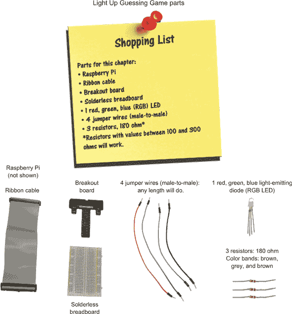

### 猜测游戏设计

游戏的目标是猜测一个魔法数字。这次，Pi 将通过点亮不同颜色的 RGB LED 来向用户提供反馈。以下是游戏的一些细节：

+   魔法数字是 1 到 20 之间随机生成的数字。

+   玩家有五次猜测正确数字的机会。

+   如果他们猜对了，RGB LED 会闪烁绿色。

+   如果猜测过高，RGB LED 会闪烁红色。

+   如果猜测过低，RGB LED 会闪烁蓝色。

+   玩家可以选择再次游戏。

图 7.2 显示了游戏的输出示例。

##### 图 7.2\. 点亮猜测游戏在每次猜测后对用户做出响应。面包板上的灯亮起，让玩家知道他们的猜测是过高还是过低。

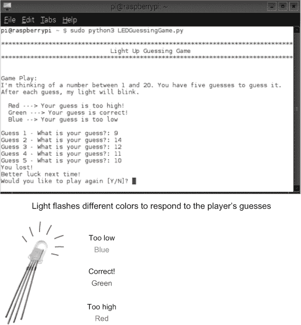

你将分两部分来处理这个项目。第一部分是构建电路（硬件），第二部分是编写程序（软件）。

### 硬件：构建电路

让我们开始构建！你将在面包板上构建一个电路来控制一种新型 LED，它可以产生你想要的任何颜色。你将首先使用扁平电缆和 GPIO 扩展板将 Pi 的 GPIO 引脚连接到面包板上。如果你需要提醒如何设置，请参考第六章（6.1 节）。你的 Pi 和面包板应该看起来像图 7.3。

##### 图 7.3\. Raspberry Pi、扩展板和面包板设置。在你之前，你以为你的桌子很乱！

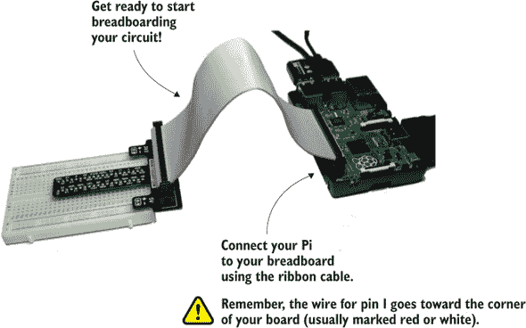

#### 数字，数字，数字！

如在第六章第六章中首次解释的那样，你需要一种方法来找到面包板上的特定孔，为此，你将使用数字和字母。记住，这就像你可能在音乐会或体育赛事的体育场中找到你的座位一样。

要引用面包板上的特定孔，我们将引用行和列，但我们将添加字母*BB*来代表*面包板*。不太难，对吧？找到面包板孔涉及搜索行，然后是列。当引用 GPIO 引脚时，我们将在前面添加字母*GP*。例如，GPIO 引脚 12 被称为 GP12。

#### 连接 RGB LED

你正在连接一种新型 LED，称为 RGB LED。


##### 定义

RGB LED 是一个由三个 LED 组成的光泡：一个红色（R）、一个绿色（G）和一个蓝色（B），所有这些都位于一个塑料 LED 灯泡外壳中。


RGB LED 几乎可以产生你想要的任何颜色，使用它内部的三个微小的 LED。通过以不同的量供电，你可以混合光线来制造颜色。

RGB LED 有四条腿（或电线）从中伸出，所以你需要弄清楚如何连接它。它比你在第六章第六章中连接的单色 LED 要复杂一些，但使用起来相当简单。

#### 电路草图

点亮猜测游戏项目的电路图显示在图 7.4。要点亮 RGB LED，你需要从你的 Pi 的 GPIO 引脚 12、16 和 21 流过电（+3.3 V），通过每个电阻器，通过 LED，然后到地（0 V）。

##### 图 7.4\. 点亮猜测游戏项目的电路图

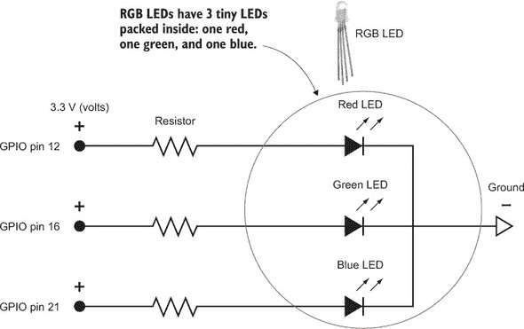

你将在面包板上构建 RGB LED 电路，然后编程使其点亮。按照以下顺序连接：

> **1**. 将 RGB LED 放入面包板。
> 
> **2**. 连接三条跳线，这些跳线将 GPIO 引脚连接到 LED（每种颜色一条）。
> 
> **3**. 将三个电阻器添加到连接跳线到 LED 的红色、绿色和蓝色腿上。
> 
> **4**. 添加最后的跳线，将 LED 的地线腿连接到负（地）电源总线。

完成后，电路将看起来像你在图 7.5 中看到的那样。让我们一步步来构建这个电路。

##### 图 7.5\. 你在面包板上构建的 RGB LED 电路使用 GPIO 引脚 12、16 和 21 来供电 LED。灯不会亮，直到你编程电压从引脚输出。


##### 第 1 步\. 添加 RGB LED

在你将其添加到面包板之前，让我们更仔细地看看 RGB LED。记住，里面有三个微小的 LED（红色、绿色和蓝色）。你需要能够弄清楚哪条腿是哪种颜色，哪条是地线。图 7.6 是一个方便的参考。

##### 图 7.6\. RGB LED 有很多引脚！最长的引脚是地线。其他的分别是红色、绿色和蓝色。这适用于所谓的 *共阴极* RGB LED，这是 Pi 套件中包含的，也是你在电子供应商那里最常找到的。

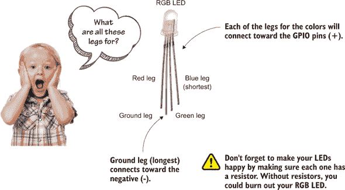


##### 注意

你需要弯曲 RGB LED 的引脚，以便将它们插入面包板上的孔。尽量将它们弯曲成与孔对齐，然后一次性慢慢推入引脚。


拿起你的 RGB LED，让我们将其插入面包板。你将把它放在面包板上的第 22、24、26 和 28 行，h 列。以下是连接引脚的位置：

+   红色引脚插入孔 BB22h

+   地线引脚（最长引脚）插入孔 BB24h

+   绿色引脚插入孔 BB26h

+   蓝色引脚（最短）插入孔 BB28h

当它插入时，它将看起来像 图 7.7。检查一下是否已经压入面包板，以便所有引脚都能良好连接。

##### 图 7.7\. 弯曲 RGB LED 的引脚，并将其插入面包板上的 BB22h、BB24h、BB26h 和 BB28h。最长的引脚插入孔 BB24h。

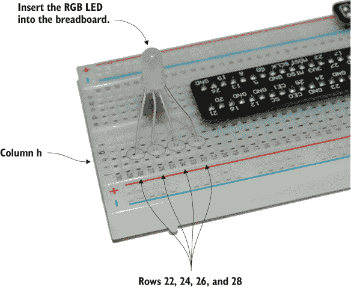

干得好！你刚刚完成了最困难的部分。

##### 第 2 步：连接 GPIO 跳线

断线板上有数字，这些数字指的是 Raspberry Pi 的 GPIO 编号系统。记住，我们在引脚编号前加上 *GPIO* 来指代 GPIO 引脚。所以如果我们谈论 GPIO 引脚 12，它就是 GPIO12。

问题：你的面包板上哪个孔紧挨着 *GPIO12*（GPIO 引脚 12）？

答案：仔细观察，你会看到它旁边的孔是 *BB16i* 和 *BB16j*。


##### 注意

跳线颜色不重要，但有时选择与 LED 引脚颜色相匹配的跳线可能会有所帮助。当你解决问题时，这可以帮助你轻松记住哪个 GPIO 引脚控制着 RGB LED 中的每种颜色的光。


现在你已经找到了靠近 GPIO 引脚的孔，你可以开始按照以下步骤连接跳线：

+   从 BB16j 到 BB22a 的跳线（连接 GP12 到 RGB LED 的红色引脚）

+   从 BB18j 到 BB26a 的跳线（连接 GP16 到 RGB LED 的绿色引脚）

+   从 BB20j 到 BB28a 的跳线（连接 GP21 到 RGB LED 的蓝色引脚）

当你添加了电线后，电路将看起来像 图 7.8。

##### 图 7.8\. 跳线将 Pi 的 GPIO 引脚连接到 RGB LED。如果你有更早的 Pi 模型，你可以使用其他 GPIO 引脚。只需记住你使用的是哪些引脚，并在编程 Pi 时使用这些数字来打开和关闭 GPIO 引脚。

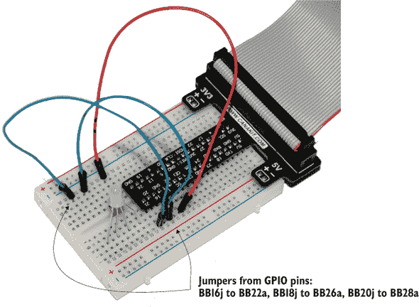

##### 第 3 步：添加三个电阻

是时候连接你的 180 欧姆电阻了！^([1]) 它应该有棕色、灰色和棕色的条纹，然后是一个第四个金色或银色条纹。记住，电流可以通过电阻双向流动，所以连接的方式并不重要。图 7.9 是一个有用的图表，提醒你如何通过使用彩色条纹来计算电阻的值。

> ¹
> 
> 这是一个安全值，不会对你的 Pi 造成损害，并且会使事情变得简单。对于那些追求精度的人来说，从技术上讲，你可能想为每种颜色的 LED（红色、绿色和蓝色）使用稍微不同的电阻，因为每个 LED 都需要不同数量的电流（安培）来使其发光。如果你对 RGB LED 感兴趣，可以查看一些在线电阻计算器和 Pi 论坛。

##### 图 7.9\. 电阻上的彩色条纹告诉你电阻有多少电阻。对于这个项目，你想要一个棕色（1）、灰色（8）、棕色（×10）电阻，或者 18×10=180 欧姆电阻。如果没有？任何大约 100 到 300 欧姆的电阻都应该工作得很好。

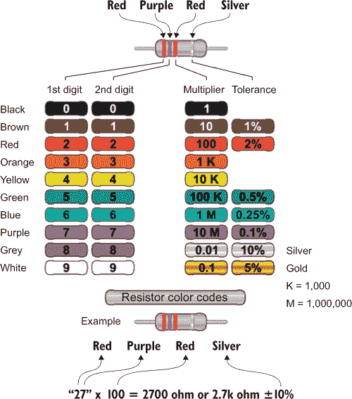

按以下方式连接电阻：

+   将第一个电阻的一端插入 BB22c，另一端插入 BB22f。

+   将第二个电阻的一端插入 BB26c，另一端插入 BB26f。

+   将第三个电阻的一端插入 BB28c，另一端插入 BB28f。

添加完成后，你会得到一个看起来像图 7.10 的东西。现在你已经准备好进行最后一步了！

##### 图 7.10\. 添加你的电阻！确保将它们推入面包板的孔中。如果你不喜欢它们立得那么高，你可以使用剪刀剪掉两端。

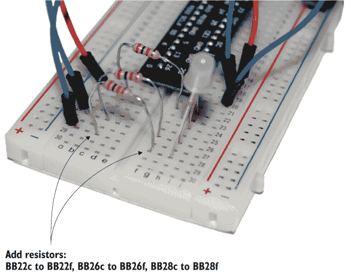

##### 第 4 步\. 添加跳线到地

记住，地线沿着面包板右侧垂直运行，旁边有一个蓝色条纹。从 BB24j 到负极（-）电源总线或地线（任何靠近蓝色条纹的孔都可以）添加一个跳线。图 7.11 显示了它的样子。

##### 图 7.11\. 跳线已添加，以连接 RGB LED 的地线与 Raspberry Pi 的地线。跳线可以连接到地线轨道上的任何位置（通常旁边有一个蓝色条纹）。

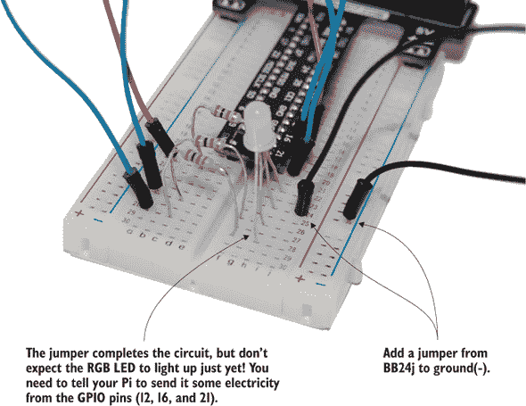

哇哦！你已经在面包板上完成了 RGB 电路。电路完成后，是时候编写你的程序来测试它了。


**使用 RGB LED 进行颜色混合**

你可以通过打开或关闭 GPIO 引脚 12、16 和 21 来编程 RGB LED，使其变红、绿或蓝。但 RGB LED 可以通过混合不同量的红、绿和蓝光来制造更多颜色。例如，你可以混合等量的红光和蓝光来制作漂亮的洋红色。或者，为了使 LED 变黄，你可以混合等量的绿光和红光。电视也是基于同样的原理。这个概念被称为*加色法*，意味着混合不同量的不同颜色的光来制造新的颜色。

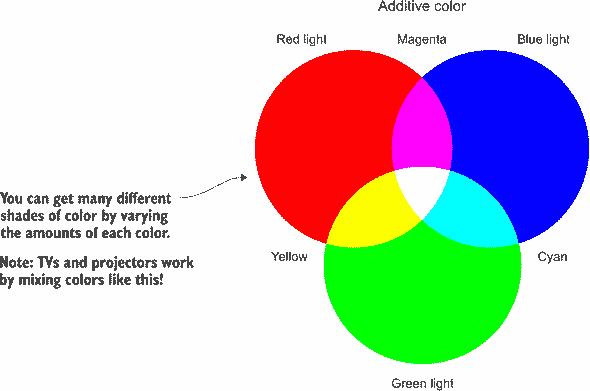

等等！你的 Pi 只能打开或关闭 LED（你将它们设置为`HIGH`或`LOW`）！你怎么能制作出可能是 80%红色和 20%蓝色的东西，比如树莓红色？这是可能的，但你需要学习如何快速脉冲 Pi 的 GPIO 输出。这被称为*脉冲宽度调制（PWM）*。在网上查找有关如何使用`RPi.GPIO`模块进行 PWM 以及创建你想要的几乎任何颜色的信息。


### 软件：LEDGuessingGame 程序

你正在创建一个猜数字的游戏。正如本章开头所提到的，你将根据以下简单规则（你可以随意修改以符合你的喜好）来设计游戏玩法：

+   魔法数字是 1 到 20 之间的随机生成的数字。

+   玩家有五次机会猜对数字。

+   如果他们猜对了，RGB LED 会闪烁绿色。

+   如果他们猜得太高，RGB LED 会闪烁红色。

+   如果他们猜得太低，RGB LED 会闪烁蓝色。

+   五次猜测后，游戏结束。

+   玩家可以选择是否再次玩游戏。

正如你在前面的章节中看到的，编程通常是将复杂问题分解成更小的问题，然后逐一解决。让我们先快速绘制一个程序应该做什么的示意图（见图 7.12）。

##### 图 7.12\. 显示猜测游戏应该如何工作的流程图。注意，如果你猜得太低、太高或正确，你会闪烁 LED。你还给玩家选择是否想要再次玩游戏的机会。

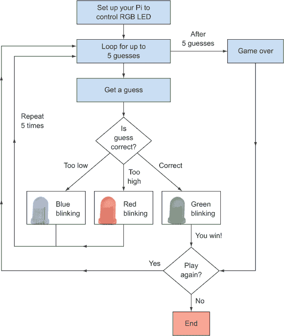

在接近这个程序时，让我们看看你是否可以通过将代码组织成*函数*来简化代码，特别是当你有可以轻松分离的代码块时。记住，你可以使用函数来组织代码并简化它。你将创建三个函数来处理每个闪烁灯，以简化程序的主要部分：

+   **`flash_red`** —使 RGB LED 闪烁红色

+   **`flash_blue`** —使 RGB LED 闪烁蓝色

+   **`flash_green`** —使 RGB LED 闪烁绿色

你还将创建一个函数，用于在游戏结束时显示一条消息。

现在你已经有了计划，让我们按照以下顺序编写代码：

> **1**. 导入库，创建闪烁和游戏结束函数，并设置 RGB LED 输出引脚。
> 
> **2**. 显示标题和简介，创建循环，并获取和检查最多五次猜测。
> 
> **3**. 添加逻辑，允许用户决定是否想要再次玩游戏。

让我们开始吧！通过选择菜单>编程下的 Python 3 来打开 IDLE。这将在 Python 3.x Shell 中打开 IDLE。在 Python Shell 中，通过按 Ctrl-N 或选择文件>新建窗口来启动一个新程序。

#### 设置 RGB LED 的 GPIO 引脚

在 IDLE 3 文本编辑器中，你首先需要加载所需的 Python 库，创建函数，并准备你的 Pi 向 RGB LED 发送电流（见图 7.13）。

##### 图 7.13\. 程序首先导入你将需要使用的 Python 库，设置 Pi 的 GPIO 引脚以点亮 LED，并定义你需要的函数。

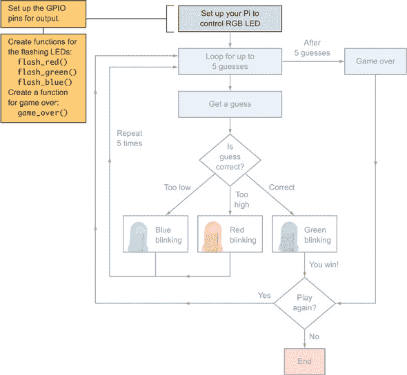

##### 设置你的 Pi 的 GPIO 引脚

你需要让你的 Pi 准备好输出到 GPIO 引脚，并告诉 Pi 你计划使用哪些引脚（参见 清单 7.1）。如果你还记得之前的接线，你正在使用这些引脚来控制 RGB LED 内部的三个 LED：

+   GP12 用于红色 LED

+   GP16 用于绿色 LED

+   GP21 用于蓝色 LED

之后，你将编写控制这些引脚的代码。让我们先导入用于 Raspberry Pi 的 GPIO 库，并设置 GPIO 引脚，以便它们可以输出电压来控制 RGB LED。

##### 列表 7.1\. 设置 Pi 的 GPIO 引脚

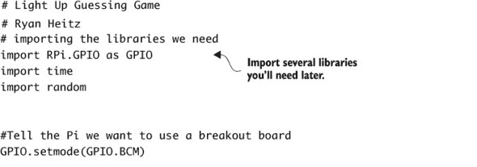

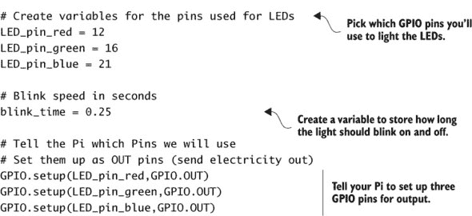

太好了！你已经通过导入 `time` 和 `random` 库开始了，因为你将需要它们来闪烁 LED 并在游戏开始时帮助你生成随机数。你定义了你使用的引脚变量，甚至添加了一个变量 `BlinkTime`，它说明了你将闪烁灯光的时间。最后，你告诉你的 Pi 你想要使用三个引脚作为输出。现在让我们编写函数。

##### 创建函数以简化代码

你需要三个函数来闪烁 RGB LED 内部的三个 LED，以及一个用于游戏结束的函数。将闪烁函数命名为 `flash_red`、`flash_blue` 和 `flash_green`，如下所示。

##### 列表 7.2\. 闪烁不同颜色 LED 的函数

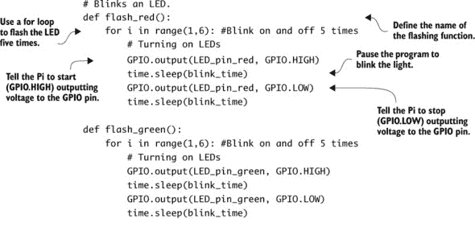

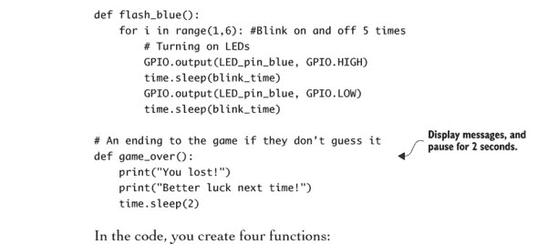

在代码中，你创建了四个函数：

+   `flash_red()`

+   `flash_green()`

+   `flash_blue()`

+   `game_over()`

这三个闪烁函数在 RGB LED 中闪烁不同颜色的 LED。闪烁是通过使用 `for` 循环和 `sleep` 函数来实现的，同时将 GPIO 引脚的输出从 `HIGH`（开）切换到 `LOW`（关）。想象一下，这就像站在一个开关旁边，打开然后关闭，五次。

在你继续之前，请将程序保存为 LEDGuessingGame.py 到你的家目录中。


**何时使用函数**

信不信由你，我们并不总是知道何时创建一个函数。这种确定的能力是随着编写程序的经验和看到模式而获得的技能。以下是一些决定将什么做成函数的提示：

+   你是否需要重复使用一组指令，变化很小？

+   你是否有大量代码块使你的程序难以阅读？

函数可以简化你的代码，并使其更容易更新。


##### 重构你的函数

你注意到闪烁 LED 的函数非常相似吗？每个函数中的大部分代码都是相同的，除了 GPIO 引脚，所以让我们看看你是否可以改进这段代码，使其更简单。这个过程称为 *重构*。

如果将三个函数重写为一个单一函数，如列表 7.3 所示，这个新函数接受一个参数`LED_pin`，它代表你想要控制的 GPIO 引脚号。它可以是你用于 RGB LED 颜色的任何 GPIO 引脚。例如，如果`LED_pin`是 16，则对应于 GPIO 引脚 16，应该闪烁绿灯。

##### 列表 7.3\. 将三个闪烁函数重构为一个单一函数

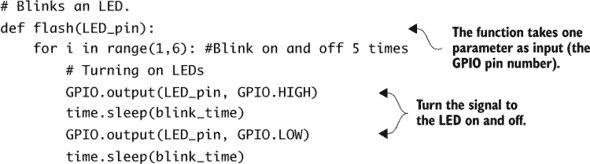

在这种情况下，你正在重构一组非常相似的功能，这些功能可以合并为一个接受参数（`LED_pin`）的单个函数。这个参数使函数更加灵活或动态，因此它可以取代三个单独的函数。

#### 主游戏循环和逻辑

程序的下一部分创建主游戏循环（见图 7.14）。你将执行以下操作：

+   设置游戏。

+   显示给玩家看的标题和说明。

+   创建一些变量，并获取一个随机数。

+   创建循环和猜测逻辑。

##### 图 7.14\. 在显示游戏标题和说明后，你需要定义变量来存储重要的游戏信息，包括玩家试图猜测的随机数。游戏的主循环被重复执行以允许用户进行五次猜测；它也会闪烁灯光。

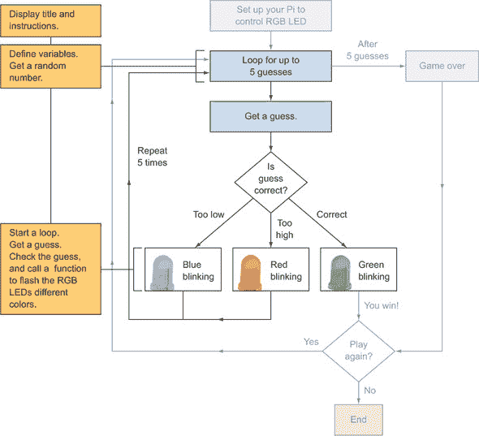

##### 游戏设置

让我们看看你需要为游戏准备的一些变量：

+   `number_in_my_head` 存储一个随机数（一个介于 1 和 20 之间的整数），玩家试图猜测这个数。

+   `count_guesses` 帮助你计数并跟踪玩家已经做了多少次猜测。

+   `play_again` 跟踪玩家是否想要再次玩的状态。你将使用布尔类型来表示这个，因为它应该始终是 True（是的，让我们再玩一次）或 False（不，我们不再玩）。

下一列表添加了这三个变量并设置了它们。你还创建并显示了标题和游戏说明。

##### 列表 7.4\. 创建变量并显示游戏标题和说明

```
# A random number for our game
number_in_my_head = random.randint(1,20)
count_guesses = 1  # Counter for the number of guesses

# Used to keep track of whether they want to play again
play_again = True

title = """
**********************************************************************
                         Light Up Guessing Game
**********************************************************************
"""
print(title)

intro = """
Game Play:
I'm thinking of a number between 1 and 20\. You have five guesses to guess it.
After each guess, my light will blink.

  Red ---> Your guess is too high!
  Green ---> Your guess is correct!
  Blue --> Your guess is too low
"""
```

太棒了！变量为猜测游戏逻辑奠定了基础。它就像房子的地基——你需要它来建造其余的部分。

#### 猜测游戏循环和逻辑

代码包含两个循环，一个嵌套在另一个内部。外循环给用户提供了再次玩的机会——我们将其称为“再次玩循环”。在这个循环内部还有一个循环，给玩家五次猜测的机会——我们将其称为“猜测游戏循环”。

主游戏循环包括获取猜测、检查猜测、闪烁 RGB LED 的适当颜色，然后重复直到玩家猜对或用完所有五次猜测。下一列表显示了猜测游戏循环的程序和检查猜测的逻辑。

##### 列表 7.5\. 猜测游戏循环

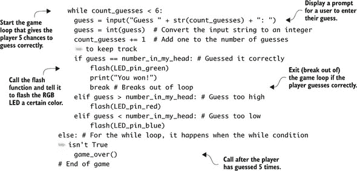

猜测游戏循环包含以下逻辑

+   跟踪猜测次数。

+   获取一个猜测。

+   检查猜测是否正确、过高或过低。

响应玩家的逻辑在哪里？它在循环中。每次你得到一个猜测，一系列的`if`/`elif`语句会检查猜测是否正确、过高或过低。根据哪个情况为 True，`flash()`函数会被调用以闪烁相应颜色的 LED。如果用户猜对了数字，RGB LED 会闪烁绿色，然后`break`命令会退出`while`循环。

注意到你在`while`循环中添加了一个`else`语句。当猜测次数超过限制（`count_guesses`大于 5）时，`else`语句会被触发，并调用`game_over`函数。`else`块仅在`while`条件检查为 False 时发生（在这种情况下，当猜测次数超过 5 时）。

在下一节中，你将看到如何给玩家提供再次玩游戏的选择。

#### 添加再次游戏循环和逻辑

你想要添加一个功能，让用户选择是否想要再次玩游戏。为此，你需要另一个循环，它围绕在猜数字游戏循环周围（参见图 7.15）。再次游戏循环需要重复猜数字游戏循环，直到用户回答他们想要再次玩游戏。

##### 图 7.15\. 再次游戏循环被包裹在猜数字游戏循环中。当玩家用完他们的猜测或猜对了数字后，他们会被告知是否想要再次玩游戏。根据他们的回答，游戏将重新开始或结束。

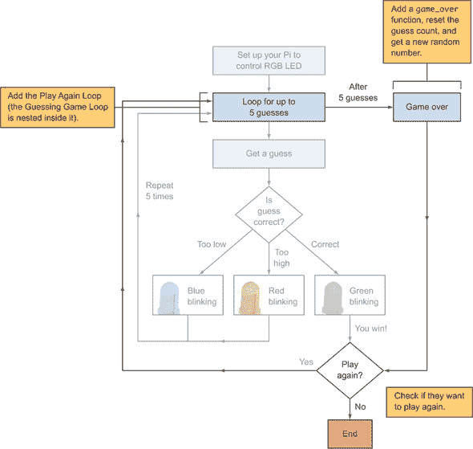

##### 列表 7.6\. 再次游戏循环

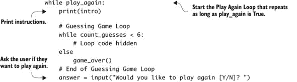

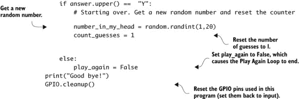

太棒了！你已经组装了一个控制 RGB LED 的电路，并编写了 Python 代码来使游戏与之交互。现在，让我们测试它。

#### 玩游戏

将代码保存为 LEDGuessingGame.py，并尝试运行它。从 IDLE 文本编辑器中选择运行 > 运行模块（或按 F5）来运行你的程序。如果你有一个较旧的 Raspbian 版本（在 2015 年 10 月之前），打开终端并输入以下命令：

```
pi@raspberrypi ~ $ sudo python3 LEDGuessingGame.py
```

太棒了！你应该能看到你的猜数字游戏启动。让我们测试一下它是否工作。尝试猜测数字。尝试猜错，只是为了确保`game_over`函数工作。

| |
| --- |

##### 注意

记住，任何使用 GPIO 引脚的程序都必须以超级用户（或 root）的身份从 Raspbian 命令提示符运行。`sudo`命令让你这样做。如果你尝试在 IDLE 的 Python Shell 中运行程序，那么你会得到一个以“`RuntimeError: No access to /dev/mem. Try running as root!`”结尾的错误。

| |
| --- |

#### 故障排除

如果每次猜测后灯光没有闪烁，这里有一些你可以检查的事情：

+   检查面包板上的电路。扁平电缆是否正确连接，第一根线连接到 Pi 的边缘，远离 USB 端口？

+   请再次确认跳线、RGB LED 和电阻是否连接到面包板上的正确孔位。你的 RGB LED 是否插反了（较短的腿朝向负极或地线侧）？如果你不确定，可以试着将它翻转过来。

+   检查你的 Python 程序中的错误。如有必要，编辑程序以添加一些 `print` 语句，以便你可以看到哪些部分正在工作。例如，在内层循环中处理五个猜测的部分，你可以使用 `print` 函数显示 `count_guesses` 的值：

    ```
    print(count_guesses)
    ```

+   在 `flash` 函数中尝试添加一个 `print` 消息，以确保它被调用。例如，你可以添加

    ```
    print("Blinking the LED")
    ```

如果你喜欢玩你的游戏，尝试一些额外的挑战来增加乐趣！


### 挑战

这些挑战使用了你已经连接好的 RGB LED。如果你无法解决它们，请查看 附录 C 以获取提示和解决方案。

#### 游戏赢家

在游戏中编写一个函数，当用户正确猜出数字时，该函数会创建一个闪烁动画。例如，你可以尝试快速闪烁 RGB LED 的不同颜色。

#### 复活节彩蛋

上一个是不是太简单了？那么，试试这个：在你的游戏中创建一个复活节彩蛋。创建逻辑，以便如果有人输入某个特定的词（可能是 *Spam*），程序会显示一条秘密消息并以疯狂的方式闪烁灯光。

#### 温暖和寒冷

扩展你程序的逻辑，使闪烁的速度表明玩家的猜测是接近还是远离正确答案。作为一个提示，想想你设置的闪烁速度。比如说，一个猜测偏离了 10（玩家猜测 15，而魔法数字是 5）。你希望灯光闪烁缓慢。你可以取差值（忽略任何负号）并除以 10。这将使闪烁速度是差值的十分之一，或者如果你偏离了 10（相当慢），每秒闪烁一次。如果玩家的猜测偏离了 2，灯光将每二十分之一秒闪烁一次（相当快）。这样，闪烁速度就可以告诉玩家他们的猜测是接近还是远离。

#### 达斯·维达惊喜

看看你是否能在玩家没有正确猜出数字时，让达斯·维达的形象出现。这里有一个提示来帮助你开始。安装名为 fim 的 Linux 图像查看软件，^([2])，这是一个允许你从 Raspbian 命令行打开图像的程序。要安装 fim，确保你的 Pi 已连接到互联网，然后打开终端并使用以下命令：

> ²
> 
> fim 是 fbi 的改进版本，是 Linux 上的图像查看软件，可以从命令行运行。

```
pi@raspberrypi ~ $ sudo apt-get -y install fim
```

接下来，下载达斯·维达的图片，让游戏在屏幕上显示它。假设你已经下载了一个名为 Darth_Vader.jpg 的图片。你可以使用以下 Python 命令来显示它：

```
import os
os.system("fim Darth_Vader.jpg")
```

祝你好运！愿原力与你同在！

### 摘要

在本章中，你学习了

+   通过程序中的 GPIO 引脚与 Pi 交互，Pi 可以以丰富和令人兴奋的方式做出反应。

+   函数、循环和条件语句可以与你的 Pi 的输出能力结合，创建出能够对人和环境做出反应的程序。

+   RGB LED 非常酷，因为它们可以制造出不同的颜色，实际上是将三个 LED 封装在一个小包装中。

+   一个`while`循环可以有一个`else`语句，允许你在循环条件不再为真时控制发生的事情。

+   可以将一个再次播放循环包裹在主游戏循环中，以便用户可以反复玩游戏。

+   *重构*是一个听起来很高级的词，实际上只是意味着通过寻找使代码更有效率的途径来简化或缩短你的代码。不过要小心，你不想简化得太多以至于代码变得难以理解（记住 Python 的禅宗！）

## 第八章\. DJ Raspi

**在本章中，你将**

+   *通过让 Pi 在按钮按下时与你交互来响应输入信号*

+   *了解电子按钮以及如何使用它们在面包板上构建电路*

+   *运行 Raspbian 操作系统命令，以便你的程序可以播放音乐、显示视频等*

+   *使用 Python 存储称为列表的信息集合*

+   *探索如何在你的 Pi 上播放声音并将其变成音乐机器*

我们没有考虑我们的五种感官（味觉、嗅觉、触觉、听觉和视觉），但没有它们，我们就无法感受到、了解并与周围的世界互动。想想你的 Pi 就像一个人，直到现在，他只有有限的感官。到目前为止，你的 Pi 只能对按键和鼠标点击做出反应。

就像疯狂科学家将某物带来生命一样，在本章中，你将开始一个项目，为你的 Pi 连接一个新的触觉感官。好吧，可能不会像创造一个仿生生物那样疯狂，但按钮给 Pi 带来了触觉。你将把几个按钮连接到 Pi 的 GPIO 引脚上（回想一下，GPIO 代表通用输入/输出，因此这是 Pi 感知和影响环境的方式）。然后，你将编写程序让 Pi 对按钮按下做出反应。激动人心的时刻即将到来！

这个项目只是你为你的 Pi 提供各种不同感官体验的一个小缩影。能够检测周围环境的电子组件被称为*传感器*。按钮是最简单的传感器之一，因为它可以检测触摸。你还能添加哪些传感器呢？以下是一些想法：

+   一个可以使用称为*计算机视觉*的特殊软件跟踪球或人脸的摄像头，该软件可以识别物体（这与微软 Kinect 的工作方式类似）

+   超人类能力，如接近传感器，可以检测附近有人行走（就像用来在杂货店开门时触发门的传感器）

+   一个麦克风，以便它能听到

所有这些都可以用 Pi 实现，一些解决问题的决心，以及一点尝试新事物的勇气。

### 项目概述

在本章中，你将把你的 Pi 变成 DJ Raspi——一个当你按下按钮时播放不同声音的音乐电脑。你将在面包板上连接两个微型按钮，并找出如何编写代码使按钮播放声音。稍后，如果你想的话，你可以向你的 Pi 添加其他传感器并编程它们。这个项目将给你一个如何处理传感器输入的例子。图 8.1 显示了你需要准备的部件。

##### 图 8.1。DJ Raspi 项目需要几个不同的部件，将你的 Pi 变成音乐播放器。跳线长度和颜色无关紧要。

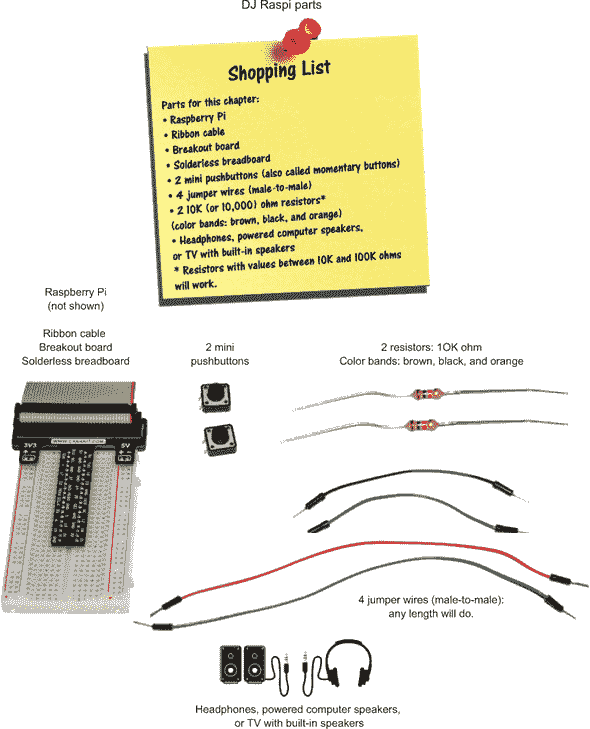

收集所需部件，准备享受乐趣。你会发现其中一些与第六章和第七章中的相同，但你还需要一些新物品。这些大多数都包含在树莓派入门套件中，但你也可以在网上电子零售商那里找到它们。你将分两部分来完成这个项目：构建电路（硬件）和编写程序（软件）。让我们开始吧！

### 设置 Pi 以播放声音

首先，让我们让你的 Pi 准备好播放声音。Pi 可以通过耳机插孔（也称为*3.5 毫米音频端口*）或通过 HDMI 输出声音。在你开始之前，插入你的耳机、带电源的电脑扬声器，或者，如果你愿意，通过 HDMI 线连接内置扬声器的电视。


**所有声音并不相同：音频格式**

如果你想要给某人留一条秘密信息，你可以选择几种不同的方式将信息变成秘密代码。你可以使用不同的符号来代表单词，或者你可能替换字母或改变字母的位置。有无数种不同的编码方式。

类似地，人们想出了许多不同的方式来存储声音（或音频文件）。这些方式（称为*格式*）是压缩或编码声音信息的不同方式，以便于在计算机或音乐播放器上存储。有时声音被编码，只能在某些音乐播放器上播放。

这里有一些常见的格式：

+   ***MP3*** —在大多数音频播放器中最常用的音频文件格式。文件以 .mp3 结尾。

+   ***WAV 或 WAVE*** —代表波形音频文件格式。它在许多 Windows 计算机上使用。这些文件以 .wav 结尾。

+   ***Ogg*** —一个为流媒体应用开发的开放格式。文件以 .ogg 结尾。

每种格式都使用不同的方法来压缩或缩小声音，使其更小以便存储。Pi 有许多不同的软件应用程序用于播放音频。每个都可以播放不同的格式。如果你想了解更多关于不同播放器和它们最适合什么的信息，请查看树莓派论坛。


你将专注于从你的 Pi 上播放 MP3，因为这是一种常见的音频文件格式。你能用什么来播放它们？

#### OMXPlayer 和 MP3s

当你在电脑上观看电影或听音乐时，你可能使用 iTunes 或 Windows Media Player。Raspbian 有自己的等效程序，称为 OMXPlayer，可以播放声音或视频。幸运的是，它能够播放 MP3 文件（或 MP3s）——这是最常见的音频格式之一。


##### 定义

OMXPlayer 是为 Raspberry Pi 创建的视频和音频播放器。


如果你没有 MP3，你可以使用 Pi 上已有的声音测试 OMXPlayer。Scratch 软件附带的一些文件夹中包含相当多的 MP3 文件。打开文件管理器，转到此文件夹查看一些文件：/usr/share/scratch/Media/Sounds/Vocals/。在文件夹中，你会看到 MP3 和 WAV 格式的文件（见图 8.2）。

##### 图 8.2\. 当你在 Pi 上安装 Raspbian 时，它附带 Scratch，其中包含许多声音文件，包括人声、音效、动物声音和鼓点。

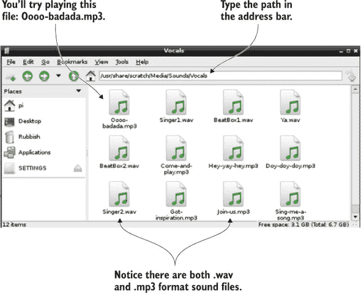

要使用 OMXPlayer 播放 MP3，请打开终端，并输入

```
pi@raspberrypi ~ $ omxplayer /usr/share/scratch/Media/Sounds/Vocals/
 Oooo-badada.mp3
```

你应该听到一段女性演唱的简短音乐片段。享受这首歌吧！


##### 注意

在终端中，按上箭头和下箭头可以循环查看之前的命令。按一下上箭头然后按回车键可以再次运行最后一个命令。


太棒了！你的 Pi 现在可以和你说话了。

#### 故障排除

如果你的扬声器或耳机已经插上，但听不到任何声音？OMXPlayer 应该会自动检测是否将声音输出到 3.5 毫米音频输出或 HDMI。如果它没有这样做，请尝试以下命令用于耳机插孔（3.5 毫米音频输出）：

```
pi@raspberrypi ~ $ omxplayer –o local /usr/share/scratch/Media/Sounds/
 Vocals/Oooo-badada.mp3
```

`–o` 是一个特殊的开关或 *标志*，它让 OMXPlayer 知道你想告诉它什么。在这种情况下，`–o` 代表 *输出*，它告诉 OMXPlayer 你希望将声音输出到何处。在这种情况下，你将其设置为 `-o local`，这样声音就会输出到 3.5 毫米（耳机插孔）输出。


**开关（标志）**

开关，如用于输出的 `–o`，像选项或程序的特殊控制一样。在命令行界面中使用时很常见。通常，你可以通过让命令打印出其帮助信息来获取程序有哪些开关。大多数你可以在命令行中运行的程序，当你输入程序名然后 `–h` 时，都会给你一个所有开关或标志的列表。`–h` 开关代表 *帮助*。尝试用 OMXPlayer 来试试：

```
pi@raspberrypi ~ $ omxplayer –h
```

你将看到一系列你可以用来控制视频和音频文件播放方式的选项。尝试在其他命令行程序中使用 `-h` 来查看你得到的结果。


如果你需要指定将声音发送到显示器上的扬声器，那么请使用 `–o` 开关并指定 `hdmi` 以输出到 HDMI 端口：

```
pi@raspberrypi ~ $ omxplayer –o hdmi /usr/share/scratch/Media/Sounds/
 Vocals /Oooo-badada.mp3
```

现在你已经知道你可以播放音乐，让我们构建电路并编写一些代码来创建你的 DJ Raspi！

### 硬件：构建电路

建造时间！你正在面包板上构建一个电路来检测或监听按钮。当按钮被按下时，你的电路将向你的 Pi 的 GPIO 引脚发送电流。你将首先使用扁平电缆和 GPIO 扩展板将 Pi 的 GPIO 引脚连接到面包板。如果你需要回忆如何设置，请参阅第六章（6.1 节）。


**关于数字的提醒**

就像在体育场里找座位一样，我们将使用前缀*BB*来指代面包板上的孔。所以位于第 25 行，第 a 列的孔是*BB25a*。同样，我们将使用前缀*GP*来指代 Pi 的 GPIO 引脚，然后是引脚号。所以 GPIO 引脚 24 简称为*GP24*。


#### 焊接按钮

让我们开始焊接按钮。按钮有很多不同的类型，但你会使用一个迷你按钮（见图 8.3）。这些按钮通常与跳线、电阻和 LED 一起出现在 Raspberry Pi 套件中。如果你需要购买，你可以在许多在线电子产品零售商那里以低于汉堡包的价格购买 10 个或 20 个的包装。收集好零件后，让我们组装电路。

##### 图 8.3\. 当你按下中间的黑按钮时，迷你按钮会发出清脆的点击声。按下它就像闭合开关一样，完成电路。

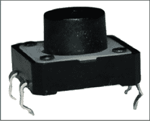

#### 电路草图

DJ Raspi 的电路图显示在图 8.4 中。为了监听按钮是否被按下，你需要从你的 Pi 到按钮流动电（+3.3 V）。当按钮被按下时，电流将通过按钮并分流。一小部分电流将流向 GPIO 引脚 6（GP06），其余的将通过 10K 欧姆电阻然后流向地（0 V）。让我们在面包板上组装起来。

##### 图 8.4\. DJ Raspi 项目中的第一个按钮的电路图显示了电流如何通过电路流动。按钮是一个开关，当按下或闭合时，允许电流流向 GP06 和地（-）。

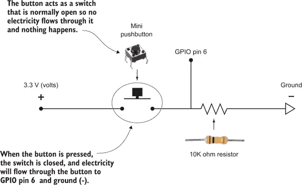

让我们在面包板上构建按钮电路，并编程你的 Pi 以知道何时按下按钮。你将通过以下顺序连接按钮，使你的 Pi 能够感觉到按钮被按下：

> **1**.  将迷你按钮添加到面包板上。
> 
> **2**.  从 3.3 伏特连接一根跳线到按钮上。你将使用沿着面包板侧面的正电源总线（+）。
> 
> **3**.  将电阻从按钮连接到负电源总线（-），也称为地。
> 
> **4**.  将第二根跳线从按钮连接到 GP06（GPIO 引脚 6）。

一个按钮的完整电路看起来就像你在图 8.5 中看到的那样。

##### 图 8.5。迷你按钮将从正电源轨连接到 3.3 伏特。当按钮被按下时，电流通过按钮并分流。一部分电流流向 GP06（GPIO 引脚 6），其余的电流通过电阻然后流向负电源总线（-）。

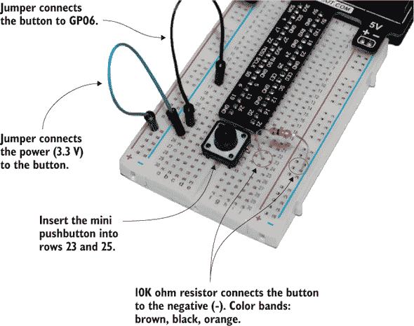

不要忘记，当你按下按钮时，什么也不会发生。你必须编程你的树莓派来响应这种新发现的触觉。让我们一步步来构建电路：

##### 第 1 步。添加迷你按钮

在我们继续之前，让我们看看按钮是如何工作的。如果你有 X 光眼镜，你会看到按钮顶部的左右引脚是相连的。同样，按钮底部的左右引脚也是相连的。按钮的顶部和底部是不相连的。

但当你按下按钮时，图 8.6 展示了会发生什么。按下按钮会使一个小金属棒向下移动，使得顶部和底部相连。我们说开关是*闭合*的。当你松开按钮时，按钮中的弹簧会将金属棒推回，开关再次打开。拿起你的迷你按钮，让我们将其插入到面包板上。

##### 图 8.6。在按钮中，引脚在顶部相连，而在底部则是分别相连的。当按钮被按下时，顶部和底部通过一个小金属棒相连。


##### 注意

你需要将按钮非常牢固地推入面包板。如果按钮引脚没有与面包板孔对齐，你可能会不小心弯曲一些按钮引脚。不用担心——你可以将它们弯曲回来再试一次。如果引脚断裂，请使用新的按钮。


你将把按钮放在面包板列 d 和 g 的行 23 和 25 上。连接引脚：

+   顶部引脚：*BB23d* 和 *BB23g*

+   底部引脚：*BB25d* 和 *BB25g*

当按钮插入时，它看起来像图 8.7。再次确认它已经按下并推入面包板，以确保所有引脚都能良好连接。干得好——你刚刚完成了最棘手的部分！

##### 图 8.7。将按钮与面包板孔对齐，然后按下它进入面包板。确保你按下它，使按钮引脚向下进入面包板孔并良好连接。如果你不小心弯曲了引脚，不用担心！只需将它们弯曲回来再试一次。

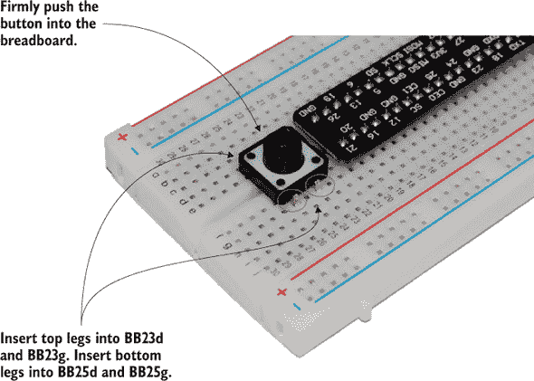

##### 第 2 步。从 3.3 伏特连接一根跳线到按钮。

你需要将按钮连接到电流源。你将使用面包板边缘的正电源轨作为电源（你也可以直接将跳线连接到扩展板上的 3V3 引脚）。

将跳线从*正电源总线*（+）连接到*BB25a*。记住，你可以将跳线连接到电源轨上的任何孔（它旁边有一条红线）。当你添加了电线后，它看起来像图 8.8。

##### 图 8.8\. 跳线将电源（3.3 伏特）连接到按钮的底部。

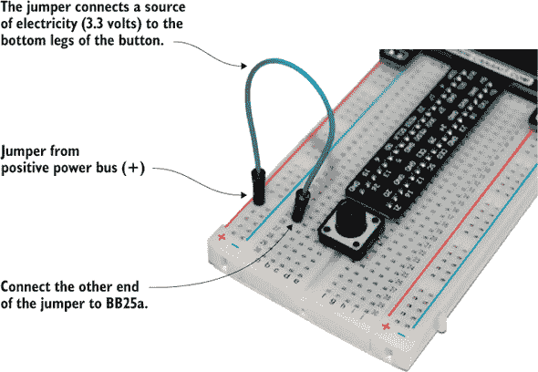

太棒了！现在电流已经到达按钮的底部腿。

##### 第 3 步\. 添加 10K 欧姆电阻

是时候连接您的 10K 欧姆电阻了。它有棕色、黑色和橙色的带子，后面跟着一个金色或银色的第四个带子。*记住，电流可以通过电阻双向流动，所以您放置的方向无关紧要。*

您正在将电阻从按钮的顶部连接到负电源总线（-）。这是一组带有蓝色条纹的孔，沿着面包板的边缘运行。

将电阻的一端插入*BB23i*，另一端插入*负电源总线（-）*。您可以选择蓝色线上的任何孔。一旦添加了电阻，您将得到类似图 8.9 的外观。现在您已经准备好进行最后一步了。

##### 图 8.9\. 添加电阻。确保其两端被推入面包板孔中。


##### 第 4 步\. 将跳线添加到 GPIO 引脚

需要一小部分电流到达一个 GPIO 引脚（您将使用 GP06），因此您需要从按钮的顶部到 GPIO 引脚旁边的孔的跳线。为了建立这个连接，请从*BB23a*到*BB16a*添加一个跳线。图 8.10 显示了其外观。

##### 图 8.10\. 跳线将按钮的顶部连接到 GP06。稍后，您将设置您的 Pi 以监听此 GPIO 引脚上的电输入。

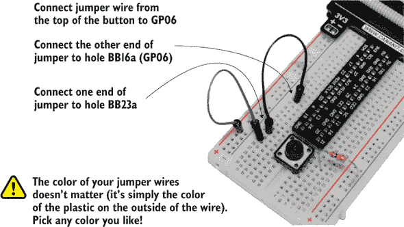

当按钮被按下时，一小部分电流将流向 GP06 并通过电阻流向地。目前还没有发生任何事情，但接下来您将编写一个 Python 程序来检测这种电流并播放一些声音。

#### 添加第二个按钮

让我们在板上添加第二个按钮。图 8.11 显示了完成后的样子。

##### 图 8.11\. 在第一个按钮下方添加第二个按钮。布线方式相同，但您将将其连接到 GP19（GPIO 引脚 19）。任何可用的 GPIO 引脚都可以，但请记住，您的代码将必须反映您选择的 GPIO 引脚。

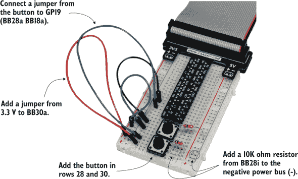

要添加另一个按钮，您将创建相同的电路，但将按钮放置在面包板上的第 28 行和第 30 行。您将按钮连接到 GP19。

##### 第 1 步\. 添加迷你按钮

将按钮插入，使顶部腿位于*BB28d*和*BB28g*，底部腿位于*BB30d*和*BB30g*。

##### 第 2 步\. 从 3.3 伏特连接跳线到按钮

您需要将来自正电源总线（+）的电源连接到按钮的底部。电源轨是带有红色线条的孔线。从正电源总线（+）的任何位置插入一个跳线到*BB30a*。

##### 第 3 步\. 添加 10K 欧姆电阻

为了防止按下按钮时电流过多，您需要添加一个电阻。与之前一样，您将添加一个 10K 欧姆电阻（颜色带为棕色、黑色和橙色），将按钮的顶部连接到负电源总线（-）。

将电阻的一端插入*BB28i*，另一端插入负电源总线（-）。蓝色线上的任何孔都可以。

##### 步骤 4。将跳线连接到 GPIO 引脚

最后，当按钮被按下时，需要电流流向 GPIO 引脚。对于第二个按钮，您使用 GP19。从*BB28a*连接跳线到*BB18a*（GP19）。

太棒了！第二个按钮已连接，您已完成了按钮电路。让我们称第一个按钮为按钮 1。它连接到 GP06。第二个按钮，按钮 2，连接到 GP19。现在一切都已经连接好，让我们为它编写代码！

### 软件：DJ Raspi 程序

您的项目是将您的树莓派变成一个由按钮控制的出色音乐播放器。以下是它的工作方式：

+   按下按钮 1 使树莓派播放随机音乐片段。

+   按下按钮 2 使树莓派播放随机声乐（唱歌）声音。

您需要以下设备之一来听到声音：

+   耳机

+   有源电脑扬声器

+   您的树莓派通过 HDMI 连接到内置扬声器的电视。

让我们思考一下这个程序将如何工作。图 8.12 显示了一个逻辑的快速图。

##### 图 8.12。一个流程图，显示了 DJ Raspi 程序应该如何工作。程序必须在开始时收集声音列表，然后检查按钮是否被按下。按钮将反复检查。

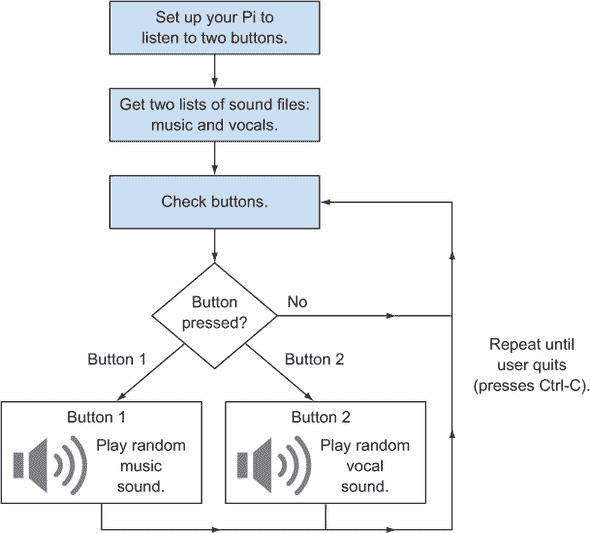

让我们按以下顺序编写代码：

> **1**. 设置您的树莓派以侦听来自按钮的输入。
> 
> **2**. 收集音乐和声乐声音的列表。
> 
> **3**. 编写一个循环来检查按钮。如果它们被按下，则播放随机声音。

您将在过程中尝试使用函数来简化您的代码。

让我们开始！通过选择菜单>编程下的 Python 3 来打开 IDLE。在 Python Shell 中，通过按 Ctrl-N 或选择文件>新建窗口来启动一个新程序。

#### 设置树莓派：初始化按钮

在 IDLE 文本编辑器中，您将首先加载您将需要使用的 Python 库。您还将设置树莓派的几个 GPIO 端口以侦听来自按下按钮的电信号。在流程图中，这是初始化按钮的第一步（见图 8.13）。

##### 图 8.13。第一步是设置按钮作为输入。这意味着您的树莓派将准备好检查是否检测到任何电压输入，这将在按钮被按下时发生。

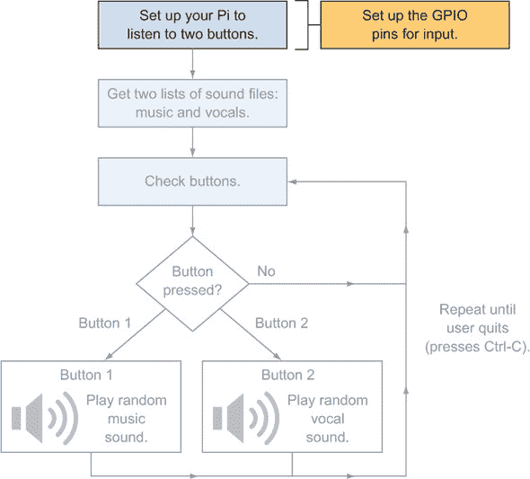

当您设置 GPIO 端口时，您使用`GPIO.IN`来告诉树莓派您计划将该端口用作输入。为了准备树莓派以输入 GPIO 引脚，您需要告诉它您计划使用哪些引脚。根据电路，您正在使用以下引脚作为输入：

+   GP06 用于按钮 1

+   GP19 用于按钮 2

以下列表显示了您如何使用`GPIO.setup`命令将 GPIO 引脚设置为输入。

##### 列表 8.1。设置 GPIO 引脚为输入

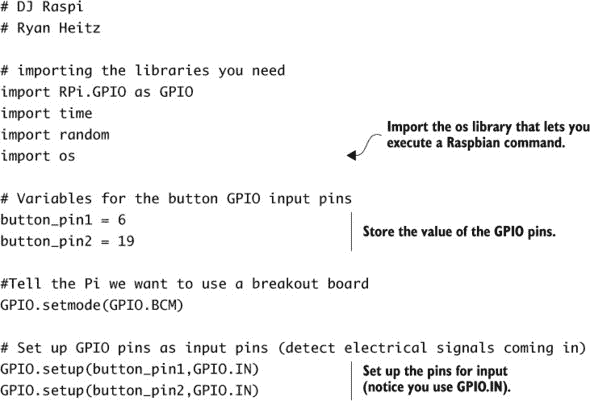

你可能会注意到你导入了新的`os`模块。我们将在下一节讨论为什么你需要它，当你收集声音文件列表时。

#### 获取声音列表

列表无处不在。你列出你需要做的事情、要买的礼物、你想去的地方，以及你最喜欢的东西，比如你最喜欢的 10 部电影或书籍。

你的 DJ Raspi 需要一个声音文件的*列表*：一个用于音乐片段（或循环）和一个用于人声。根据设计，你需要从你的 Pi 上的一个文件夹中获取文件列表，然后你需要从列表中选择一个随机声音文件并播放它（参见图 8.14）。

##### 图 8.14。DJ Raspi 程序的下一步是获取一组声音文件。稍后，你将添加使用按钮触发从列表中播放随机声音的部分。

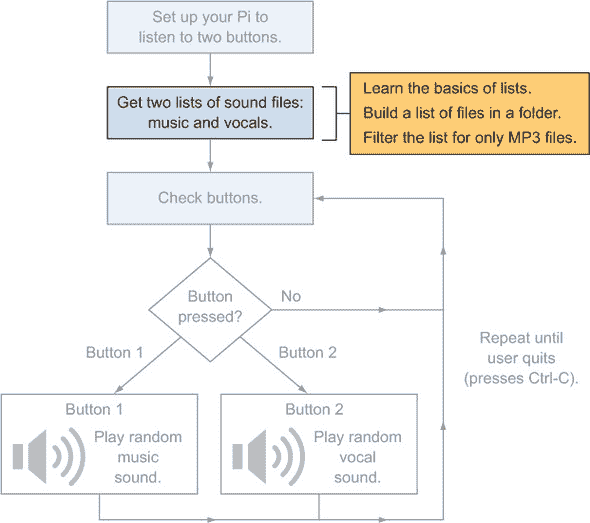

在 Python 中，你可以轻松地创建列表或事物组。让我们看看一些例子。

让我们创建一个篮球运动员名字的列表。通过在菜单>编程下选择 Python 3.x Shell 来打开 IDLE。在 Python Shell 中，创建一个列表：

```
>>> basketball_players = ["Kevin Durant", "LeBron James", "Chris Paul",
 "John Wall"]
```

按照这种方式打印列表，你就会看到里面的内容：

```
>>> print(basketball_players)
['Kevin Durant', 'LeBron James', 'Chris Paul', 'John Wall']
```

要创建一个项目列表，将它们放入一组方括号（`[]`）中，并用逗号分隔每个项目（参见图 8.15）。对于字符串列表，列表中的每个项目都必须用引号包围。很简单！这就是 Python 的方式。

##### 图 8.15。你通过使用方括号括起来的一组事物来创建列表。列表中的每个项目都应该用逗号分隔。Python 甚至允许你创建包含不同类型数据的列表，如字符串和整数。

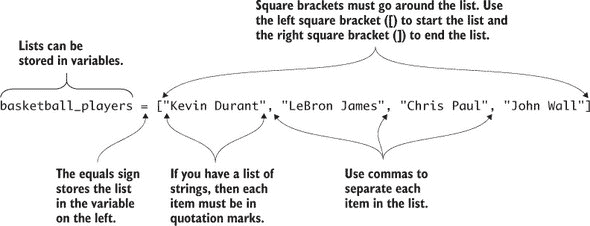

尝试创建一个名为`favorite_numbers`的列表，如下所示：

```
>>> favorite_numbers = [22, 27, 49, 121, 2, 25]
```

使用`print`显示列表的内容：

```
>>> print(favorite_numbers)
[22, 27, 49, 121, 2, 25]
```

| |
| --- |

##### 注意

当制作数字列表时，你不需要使用任何引号。

| |
| --- |

享受制作你最喜欢的东西的列表！

| |
| --- |

**列表可以做的更多事情**

你可以用列表做很多事情！让我们试几个。

你可以通过向列表中添加更多项目来使列表更长。为此，请使用`append`方法。让我们向`basketball_players`列表中添加 Stephen Curry 的名字。以下是使用`append`来完成此操作的方法：

```
>>> basketball_players.append("Stephen Curry")
```

使用`print`来查看结果：

```
>>> print(basketball_players)
['Kevin Durant', 'LeBron James', 'Chris Paul', 'John Wall', 'Stephen Curry']
```

太棒了！要从列表中删除一个项目，你可以使用`remove`方法。如果你想从列表中移除 John Wall，可以这样写

```
>>> basketball_players.remove("John Wall")
```

再次打印列表以查看它是否工作：

```
>>> print(basketball_players)
['Kevin Durant', 'LeBron James', 'Chris Paul', 'Stephen Curry']
```

太棒了！如果你需要按字母顺序或从低到高对列表进行排序，你可以使用`sort`方法，如下所示：

```
>>> favorite_numbers.sort()
```

通过将列表打印到屏幕上来检查它是否工作：

```
>>> print(favorite_numbers)
[2, 22, 25, 27, 49, 121]
```

数字都排序了！这也适用于字符串列表。如果你对`basketball_players`列表进行排序，它将根据每个字符串的第一个字母按字母顺序排列。Python 为列表提供了许多内置方法。

查阅在线 Python 文档^([a])以获取更多关于列表的操作。然后坐下来享受思考你可以在未来的程序中使用它们的所有可能性。

> ^a
> 
> 前往 Python 网站获取有关列表操作的信息：[`docs.python.org/3.4/tutorial/datastructures.html`](https://docs.python.org/3.4/tutorial/datastructures.html)。

| |
| --- |

对于你的 DJ Raspi，让我们看看如何

+   获取列表中存储的项目值。

+   获取列表的长度。

#### 获取列表中存储的项目值

让我们从一个新的篮球运动员列表开始：

```
basketball_players = ["Kevin Durant", "LeBron James", "Chris Paul",
 "Stephen Curry"]
```

如你所见，列表存储信息。你可能不知道的是，列表中的每个位置都有一个称为*索引*的数字。列表中第一个项目的索引是零（0）。第二个项目的索引是 1。第三个项目的索引是 2，以此类推。要获取`basketball_players`列表中的第三个项目，你将输入

```
>>> print(basketball_players[2])
Chris Paul
```

如果你想要搜索列表，并让 Python 告诉你项目在列表中首次出现的位置索引，你可以使用`index`方法：

```
>>> basketball_players.index("Kevin Durant")
0
>>> basketball_players.index("Stephen Curry")
3
```

如果项目不在列表中，Python 会给出错误信息：

```
>>> basketball_players.index("Me")
Traceback (most recent call last):
  File "<pyshell#40>", line 1, in <module>
    basketball_players.index("Me")
ValueError: 'Me' is not in list
```

| |
| --- |

##### 注意

记住，列表的索引从 0 开始计数，而不是 1！例如，`basketball_players[1]`将给你`"Lebron James"`，这是列表中的第二个项目。

| |
| --- |

图 8.16 展示了列表的索引示例以及如何获取列表中的特定项。

##### 图 8.16\. 可以将事物集合存储在列表中。你可以使用索引从列表中检索项目，索引代表项目在列表中的位置。列表的索引从 0 开始。


#### 获取列表的长度

最后，有时你已经将信息加载到列表中，需要一种方法来检查列表的长度。使用`len()`函数来完成：

```
>>> yummy_snacks = ["chips", "popcorn", "donuts", "cheese",
   "pretzels", "spam"]
>>> print(len(yummy_snacks))
6
```

干得好——你已掌握了列表的基础知识。现在让我们看看如何创建 MP3 列表。

#### 使用 os 库构建声音文件列表

要使 DJ Raspi 项目工作，你需要

> **1**. 从你的 Pi 上的文件夹中抓取两组声音文件列表。
> 
> **2**. 在 DJ Raspi 程序中，使用 OMXPlayer 从 Python 播放声音文件。

让我们学习如何。

Pi 通过一个名为`os`模块（OS 代表*操作系统*）的 Python 模块具有这两种能力。使用它，你可以从 Python 程序中运行操作系统命令（你可以在终端窗口中输入的命令）。这太棒了，因为它意味着你可以获取文件列表，也可以调用 OMXPlayer 来播放特定文件——这正是你所需要的！

##### 从文件夹中获取文件列表：使用 listdir()

如你在第 8.1 节中看到的，你的 Pi 上已经有一些声音文件。你将使用这两个文件夹中的文件：

+   /usr/share/scratch/Media/Sounds/Music Loops/

+   /usr/share/scratch/Media/Sounds/Vocals/

`os`库提供了一个内置函数`os.listdir(some_path)`，用于获取`some_path`路径下的文件列表。要获取 Scratch 音乐循环和声乐的列表，使用以下命令：

```
# Folders with sound files
path_music = "/usr/share/scratch/Media/Sounds/Music Loops/"
path_vocals = "/usr/share/scratch/Media/Sounds/Vocals/"

# Creating two lists with the files in the folders
sounds_music = os.listdir(path_music)
sounds_vocals = os.listdir(path_vocals)
```

如果你打印列表，你将得到类似这样的内容：

```
print(sounds_music)
['Cave.mp3', 'Techno.mp3', 'HipHop.mp3', 'Triumph.mp3', 'Medieval2.mp3',
 'HumanBeatbox2.mp3', 'DripDrop.mp3', 'Xylo3.mp3', 'GuitarChords1.mp3',

 'DrumSet2.mp3', 'Xylo2.mp3', 'DrumSet1.mp3', 'Garden.mp3',
 'GuitarChords2.mp3', 'Jungle.mp3', 'Xylo1.mp3', 'Eggs.mp3',
 HumanBeatbox1.mp3', 'Drum.mp3', 'DrumMachine.mp3', 'Techno2.mp3',
 'Medieval1.mp3', 'xylo4.mp3']

print(sounds_vocals)
['Oooo-badada.mp3', 'Singer1.wav', 'BeatBox1.wav', 'Ya.wav',
 'BeatBox2.wav', 'Come-and-play.mp3', 'Hey-yay-hey.mp3',
 'Doy-doy-doy.mp3', 'Singer2.wav', 'Got-inspiration.mp3',
 'Join-you.mp3', 'Sing-me-a-song.mp3']
```

哇——你有一些看起来很棒的列表！但是等等：看起来`sounds_vocals`有 WAV（.wav）文件和 MP3。让我们过滤掉 WAV 文件，这样你只剩 MP3。

##### 仅过滤 MP3 文件

要过滤列表，你可以使用 Python 的*列表推导*功能。列表推导是一种快速创建列表的方法。当你使用它时，你可以包括某些条件或应用于列表项的操作，例如确保列表中的所有文件都以.mp3 结尾。让我们看看如何使用列表推导从旧列表创建新列表，但只保留以.mp3 结尾的文件：

```
sounds_music = [sound for sound in sounds_music if
  sound.endswith('.mp3')]
sounds_vocals = [sound for sound in sounds_vocals if sound.endswith
 ('.mp3')]
```

列表推导式内部有一个`for`循环。在这种情况下，Python 正在遍历原始声音列表中的声音文件列表。对于列表中的每个项目，Python 只有在它符合以.mp3 结尾的条件时，才会将其添加到新的声音列表中。

#### 按钮被按下时播放声音

在你的计划中的下一步是编写代码，当按钮被按下时，将从你的列表中播放一个随机声音。你需要将其放在一个循环中，以便反复检查按钮是否被按下（见图 8.17）。让我们首先创建游戏的标题和创建主游戏循环。

##### 图 8.17\. DJ Raspi 程序的主要部分是检查按钮的循环。你将使用一个`while`循环来反复检查按钮。如果其中一个被按下，你将告诉 Raspbian 使用 OMXPlayer 播放一个随机声音。

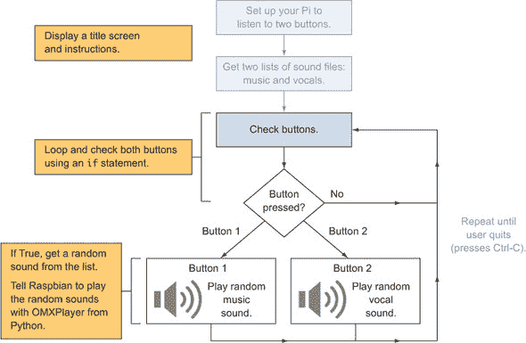

##### 检查按钮的循环

首先，让我们添加一些代码来显示标题屏幕和 DJ Raspi 的说明。你可以随意使标题屏幕更华丽！

##### 列表 8.2\. DJ Raspi 标题屏幕

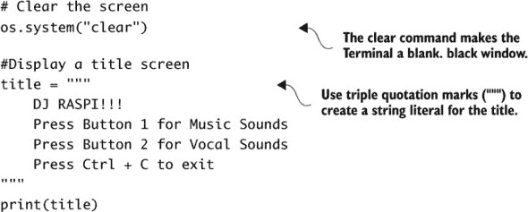

现在让我们编写代码来反复检查是否按下了任一按钮。当按钮被按下时，GPIO 引脚将给你一个 True 的响应，然后你可以调用一个函数来播放一个随机的 MP3。

##### 列表 8.3\. DJ Raspi 游戏循环

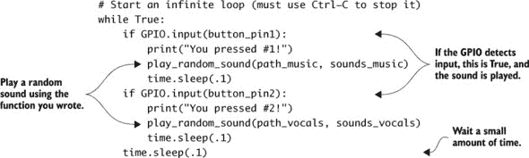

代码反复检查按钮 1 或按钮 2 是否被按下。如果按钮 1 被按下，代码将播放一个随机的音乐声音。如果按钮 2 被按下，代码将播放一个随机的声乐（唱歌）声音。如果两个都没有被按下，代码将循环回来再次检查。循环永远不会结束，所以你需要按 Ctrl-C 来退出程序。

##### 播放声音：使用 Python 中的操作系统命令

你已经准备好播放你的声音了！`os`模块将允许你运行操作系统命令（你通常在终端中运行的命令）。要播放`sounds_music`列表中的第一个声音，你可以写

```
os.system("omxplayer -o local '" + path_music + sounds_music[0] + " &")
```

在本章的后面部分，我们将解释为什么该命令的末尾有一个和号（`&`）。此命令的结果将与在 Raspbian 命令行中键入以下内容相同：

```
omxplayer –o local "/usr/share/scratch/Media/Sounds/Music Loops/Cave.mp3"
```


##### 注意

记住，如果你要将声音输出到 HDMI（如果你的电视有扬声器），你需要将`–o local`更改为`–o hdmi`。

| |
| --- |

太棒了！让我们回顾一下你到目前为止学到的内容：

+   你的 Pi 可以使用 OMXPlayer 播放 MP3 格式的声音。

+   Python 可以将事物集合存储为列表。

+   Python 的 `os` 库有一个名为 `listdir(path)` 的函数，可以给你一个文件夹中的声音列表。

+   Python 的 `os` 库中有一个 `os.system(command)` 函数，可以从 Python 中运行操作系统命令，例如使用 OMXPlayer 播放声音。

#### 函数！

让我们思考一下如何为 DJ Raspi 编写函数。你需要创建两个函数：

+   **`get_MP3_sounds`** —此函数将从指定的文件夹中获取以 .mp3 结尾的声音列表。你将告诉该函数（传递一个参数）你想要获取 MP3 声音文件的文件夹名称。该函数将返回一个声音列表。

+   **`play_random_sound`** —此函数将接受一个声音列表，随机选择一个数字，然后使用 `os.system` 告诉 Raspbian 使用 OMXPlayer 播放声音。

图 8.18 展示了这些函数在流程图中的位置。

##### 图 8.18\. 有两个地方可以创建函数，以便你可以重用代码。一个函数创建声音文件列表，另一个函数在按下按钮时播放随机声音。

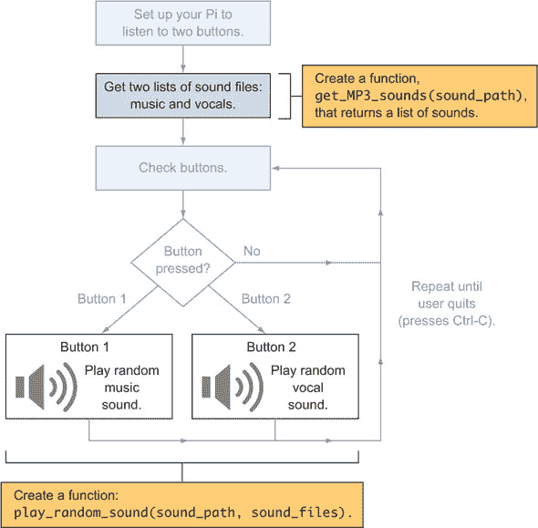

为什么不将其作为一个单独的函数呢？一个原因是你只需要在程序开始附近加载一次声音文件列表。每次按下按钮时，你都会播放声音文件。列表 8.4 展示了 `get_MP3_sounds` 和 `play_random_sound` 函数的代码。

| |
| --- |

##### 注意

记得将这些函数放在程序的开头附近。它们必须在第一次使用之前添加。

| |
| --- |

在此列表的末尾，你使用（或调用）`get_MP3_sounds` 两次以获取你的音乐和声乐声音文件列表。

##### 列表 8.4\. 加载和播放声音文件的函数

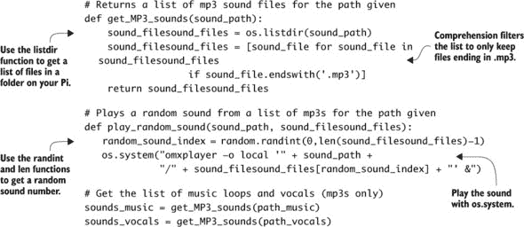

你可能已经注意到，此行添加了一些额外的东西：

```
os.system("omxplayer -o local '" + sound_path +
          "/" + sound_filesound_files[random_sound_index] + "' &")
```

此行将运行 OMXPlayer 的命令与你的声音文件路径 (`sound_path`) 以及你想要播放的随机声音文件 (`sound_filesound_files[random_sound_index]`) 相结合。在最后，你添加一个和号 (`&`)。和号告诉 Raspbian 在后台运行命令。这样你就可以快速按下一个按钮，然后按下另一个按钮。

| |
| --- |

**同时做多件事：遇到和号 (&)**

当你播放声音时，你希望能够像 DJ 一样快速地按下按钮，并且让声音重叠以创建有趣的音乐。通常，你的 Pi 会播放一个声音，当它播放完毕后，让你播放另一个。这不是你想要的。以下是一个播放两个声音的例子。你只能在第一个命令完成后才能运行第二个命令：

```
omxplayer /usr/share/scratch/Media/Sounds/Vocals/Oooo-badada.mp3
omxplayer /usr/share/scratch/Media/Sounds/Vocals/Hey-yay-hey.mp3
```

幸运的是，你的树莓派可以同时做几件事情。你可能同时打开几个不同的窗口。每个窗口都连接到在树莓派上运行的某些底层代码或指令集。这些底层代码集被称为*进程*或*线程*。Raspbian，像其他现代操作系统一样，管理这些进程并为每个进程分配其唯一的 ID 号。命令末尾放置的符号`&`告诉你的树莓派以另一个进程的形式在后台运行该命令，与任何其他进程并行。

再次尝试这两个命令，但这次使用符号“&”：

```
omxplayer /usr/share/scratch/Media/Sounds/Vocals/Oooo-badada.mp3 &
omxplayer /usr/share/scratch/Media/Sounds/Vocals/Hey-yay-hey.mp3 &
```

注意每个命令末尾的符号`&`。这样，树莓派就会播放你的声音，但代码不会在播放声音之前等待，然后再做其他事情。在 OMXPlayer 命令末尾添加一个符号`&`会使按钮在后台播放每个声音。移除符号`&`可以一次播放一个声音。因为这是操作系统的一个特性，所以使用符号执行命令作为它们自己的独特进程的概念也适用于你已知或将要学习的其他 Linux 命令。


太好了！你已经准备好测试你的项目了！

#### 测试：DJ Raspi 的第一次演出

将代码保存为 DJRaspi.py，然后尝试运行它。从 IDLE 文本编辑器中选择运行 > 运行模块（或按 F5）来运行你的程序。如果你有较旧的 Raspbian 版本（2015 年 10 月之前），使用 GPIO 引脚的程序必须以超级用户（或 root）的身份从 Raspbian 命令提示符运行。打开终端，并输入以下命令：

```
pi@raspberrypi ~ $ sudo python3 DJRaspi.py
```

你应该看到标题屏幕显示。通过按按钮来测试它，看看它们是否工作。


##### 注意

记住，任何使用 GPIO 引脚的程序都必须以超级用户（或 root）的身份从 Raspbian 命令提示符运行。


信不信由你，程序第一次就能完美运行的情况很少。如果它没有，请阅读以下“故障排除”部分，并检查你的电路和程序，以尝试找出如何让它工作。

### 故障排除

如果你按下按钮时声音没有播放，这里有一些你可以检查的事情：

+   检查面包板上的电路。扁平电缆是否正确连接，第一根线是否连接到你的树莓派边缘，远离 USB 端口？

+   仔细检查跳线、按钮和电阻是否在正确的孔中，并且完全压入面包板。

+   你的程序是否打印了“你按了 #1！”和“你按了 #2！”？如果是这样，你就知道你的电路是正常工作的，要么是加载声音文件的代码有问题，要么是你的扬声器或耳机不工作。尝试从终端运行以下命令之一来检查扬声器是否工作。对于插入 3.5 毫米音频输出的耳机或扬声器：

    ```
    omxplayer –o local /usr/share/scratch/Media/Sounds/Vocals/
     Oooo-badada.mp3
    ```

    对于通过 HDMI 连接的电视扬声器：

    ```
    omxplayer –o hdmi /usr/share/scratch/Media/Sounds/Vocals/
     Oooo-badada.mp3
    ```

+   检查你的 Python 程序中的错误。尝试在你的函数中添加一些 `print` 语句，以确保它们正确地获取 MP3 文件列表。

如果你喜欢创建 DJ Raspi，请查看按钮挑战。


### 挑战

尝试这些按钮活动，增加乐趣！

#### 双按钮按下惊喜

给你的程序一个惊喜的按钮组合。看看你是否可以同时按下两个按钮来播放一组新的声音效果。

提示：当你想要同时满足两个条件时，可以使用和号（`&`）。如果第一个和第二个条件都为真，`if` 语句才会为真。它看起来像这样：

```
if GPIO.input(button_pin1) & GPIO.input(button_pin2):
    print("Both buttons are pressed!")
```

这里是 Pi 上一些 Scratch 声音效果路径：

```
path_effects = "/usr/share/scratch/Media/Sounds/Effects/"
```

#### 尤达魔法八球

有一个很经典的玩具叫做魔法八球。当你摇晃它时，它会显示一个问题的答案。问它一个问题，你会得到一些真正神奇的建议。魔法八球有 20 个不同的答案，从“肯定如此”到“我的消息来源说不是”。

| |
| --- |

##### 注意

我不建议使用魔法八球来就重大生活问题提供建议！

| |
| --- |

你的挑战是制作一个魔法八球程序：

+   大声提出一个问题，然后按下一个按钮。

+   按下按钮会使你的 Pi 从文件夹中随机选择一个尤达剪辑并播放。

要开始，找到一些尤达的简短语音文件。一个可以找到这些文件的地方是 [soundboard.com](http://soundboard.com)。搜索“yoda”看看是否能找到一些好的剪辑（你需要创建一个账户来下载它们供个人使用）。

奖励：尝试给你的 Pi 添加一个方便的按钮，每次按下它都会播放蒙提·派森的声音剪辑。

#### 继续探索

现在，你已经给了 Pi 一种新的触觉感知，你只需要更改几行代码就可以制作许多其他项目，例如这些：

+   每次按下按钮时都会显示不同的数字照片的交互式显示屏

+   你自己的 Raspberry Pi 电影播放器，按下按钮即可播放剪辑或电影

+   一个 MP3 音乐播放器，可以播放你最喜欢的歌曲

你还可以将按钮扩展到传感器，例如被动红外（PIR）传感器或摄像头。例如，PIR 传感器可以检测传感器附近的运动。这些非常适合创建 Pi 安全系统或在你家门口吓唬人的东西。也许你想触发一个电影，让一个恐怖的僵尸头出现，或者产生令人毛骨悚然的尖叫声。你唯一的限制是你的想象力和淘气的想法。

### 概述

在本章中，你学习了

+   Pi 可以通过 GPIO 引脚的输入能力感知其周围的环境。这为 Pi 拥有类似人类甚至超人的感官创造了无限可能。

+   Python 列表使得存储和检索诸如数字、声音文件、图像和视频等集合的事物变得容易。

+   按钮作为简单的开关，向你的 Pi 的 GPIO 引脚发送少量电流，它可以检测到。在连接按钮或其他传感器时，你无需担心！

+   Python 程序可以使用 `os` 库运行 Raspbian 命令。这为你的程序打开了众多可能性，从播放音乐到显示或录制视频，显示或拍照，以及从网站获取信息。

你已经完成了一次学习 Python 编程和如何使用你的 Raspberry Pi 的伟大冒险。但前方还有更多的兴奋等待着你。查看附录 D 以获取更多你可以用你的 Pi 实现的项目想法。有了你的 Raspberry Pi、Python 知识以及一点无畏，可能性是无限的！
