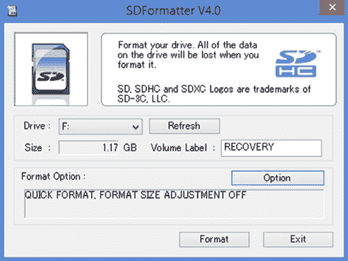

## 附录 A. Raspberry Pi 故障排除

在本附录中，你将学习如何解决设置 Raspberry Pi 时常见的问题。我们将涵盖常见的 Pi 启动（或引导）问题，包括如何修复 Pi 的 SD 卡问题或设置新的 SD 卡。

### 确保你的 Pi 有电源

有时 Pi 不会启动。在你尝试像为 Pi 创建新的 SD 卡这样的极端措施之前，检查 Pi 的电源：

+   当你插入你的 Pi 时，Pi 的红色电源灯亮了吗？在你的 Pi 板上寻找一个小红色灯（LED）。所有的 Pi 都有，但如果你看不到 Pi 板，你可能需要取下你的外壳。红色电源灯告诉你你的 Pi 正在接收电源。当你插入 Pi 时，它应该亮起，并且在你使用整个过程中保持亮着。如果它没有亮起，这意味着你的 Pi 没有接收电源。检查电源是否已插入。如果你使用的是电源插座，请检查它是否已打开。遗憾的是，一些电源插座制作得不好。如果问题是电源问题，请购买一个新的电源插座。

+   在红色灯旁边，当你插入 Pi 时，绿色活动灯（LED）是否闪烁很多？闪烁是 Pi 正在做某些工作的标志。绿色活动灯应该开启和关闭，有时快速闪烁，当 Pi 启动时。当它完成启动后，绿色灯会关闭，并且只有在 Pi 正在积极做某事，如打开游戏或 Python 时才会亮起。如果绿色灯亮起并保持亮着，但屏幕上没有显示任何内容，这很可能是 SD 卡的问题。跳转到 A.4 部分学习如何创建新的 SD 卡。

如果你怀疑是电源问题，购买一个新的电源插座并尝试使用它。为 Pi 提供足够的电功率（2 安培）和正确的电压（5 伏特）对于 Pi 正常工作非常重要。

### 检查你的电视或显示器连接

如果你插入 Pi 后红色灯保持亮着，绿色灯亮起并关闭，但你没有在电视或显示器上看到任何图像，那么是时候检查你的屏幕连接了。以下是一些根据你使用的电视或显示器类型需要调查的事项。

如果你从 Pi 连接 HDMI 线缆到电视或显示器，尝试以下事项：

+   确保电视或显示器已打开。

+   确保电视或显示器已设置为正确的输入。它们通常有多个输入，你必须按一个输入按钮来选择正确的输入。否则，屏幕将显示无内容或检测不到输入的消息。

+   如果你有多余的 HDMI 线缆，尝试使用它来查看是否是线缆的问题。

如果你的设置需要你使用适配器将 Pi 连接到电视或显示器，那么你可能需要确保你的适配器工作正常或类型正确。有两种常见的适配器类型：

+   ***HDMI-to-DVI 适配器*** —此适配器用于将 Raspberry Pi 的 HDMI 线缆连接到具有数字视觉接口（DVI）端口的显示器。有时您可能会购买一个不起作用的适配器。如果可能，尝试将您的 Pi 连接到另一个使用 HDMI 的电视或显示器，以检查是否是适配器的问题。再次提醒，如果红灯亮起且绿灯闪烁，但您在屏幕上什么也看不到，那么很可能是显示器连接的问题。

+   ***HDMI-to-VGA 适配器*** —较旧的显示器没有 HDMI 或 DVI 端口，可能只有视频图形阵列（VGA）端口。您唯一的选项可能是购买一个 HDMI-to-VGA 适配器来将 Pi 连接到显示器。并非所有 HDMI-to-VGA 适配器都适用。您最好的选择是从销售 Raspberry Pi 的商店购买一个标明适用于 Pi 的适配器。如果您不确定，请尝试仅使用 HDMI 线缆将 Pi 连接到另一台电视或显示器进行测试，以确定是否是您的问题。

如果执行了所有这些步骤后您仍然看不到图片，那么很可能是您的 SD 卡有问题。

### Pi 启动但随后停止

您可能还会遇到的问题是，您的 Raspberry Pi 开始启动，您在屏幕上看到一系列消息，然后消息停止，但 Pi 没有达到 Raspbian 桌面或命令行。如果是这种情况，那么很可能是 SD 卡已损坏。但另一个原因是您的 GPIO 引脚中可能存在问题。

如果您在连接到 Pi 的面包板上构建电路（请参阅第六章章节 6–8 章中的示例），如果连接不当，Pi 可能无法完全启动。为了确定这是否是问题，请从 Pi 上断开扁平电缆和面包板，然后再次尝试开机。如果问题仍然存在，那么很可能是 SD 卡的问题。

### 将 Pi 设置为新的 SD 卡

仍然无法启动？SD 卡问题是一个常见原因。如果 Pi 在信息存储（或写入）时关闭，SD 卡可能会停止工作，或者它可能会因老化而损坏。

| |
| --- |

##### 注意

当 SD 卡失败时，您需要从头开始，并且您将丢失卡上任何数据或新安装的应用程序。将来，您可以创建 SD 卡的备份。查看在线论坛了解如何进行此操作。

| |
| --- |

如果您认为这是问题所在，您有几个选择：

> **1**. 使用 Raspberry Pi 新出厂软件（NOOBS）清洁和重置您的 SD 卡。
> 
> **2**. 从销售 Raspberry Pi 的许多在线商店之一购买一张新卡。它们的价格大约为 10 美元。

让我们回顾一下如何使用 NOOBS 清洁和设置您的 SD 卡。执行这些步骤需要另一台计算机，例如 Windows PC 或 Mac。

#### 重新格式化您的 SD 卡

*格式化*是将存储器设置起来以便可以在其上放置信息的过程。要重新格式化 SD 卡并使用 NOOBS 的新版本设置，请执行以下操作：

> **1**.  使用您的另一台电脑，从 SD 协会网站：[`www.sdcard.org`](https://www.sdcard.org)下载并安装 SDFormatter 软件。在网站上，查找下载部分，下载适用于 Windows 或 Mac 的 SDFormatter 的适当版本。按照安装说明在您的电脑上加载软件。
> 
> **2**.  将 SD 卡插入电脑。注意插入后分配给 SD 卡的驱动器字母：它可能是 E:、F:或类似。
> 
> ##### 注意
> ##### 
> 对于树莓派 2 型和 B+型号，SD 卡是 microSD 卡，因此您需要一个 microSD 到 SD 卡适配器才能将其插入电脑的 SD 卡槽。您可以在网上购买此类适配器。
> 
> |  |
> | --- |
> 
> **3**.  打开 SDFormatter，选择您的 SD 卡的正确驱动器字母，然后点击格式化（见图 A.1）。它将询问您是否要继续。接受警告以重新格式化 SD 卡。
> 
> ##### 图 A.1\. 使用 SD 协会网站提供的 SDFormatter 软件清理（或重新格式化）您的 SD 卡。在 SDFormatter 中，选择您的 SD 卡的驱动器字母，然后点击格式化以清除您的卡片。这个过程意味着您将从头开始——您将丢失在 Pi 上保存或安装的所有内容——但有时这是唯一的选择。
> ##### 
> 
> 
> **4**.  访问树莓派网站 [`www.raspberrypi.org/downloads`](https://www.raspberrypi.org/downloads)，点击链接下载 NOOBS 压缩文件。这是一个大文件，所以下载时可以准备些小吃。
> 
> **5**.  解压 NOOBS 压缩文件，并将所有解压的文件拖到 SD 卡上。
> 
> **6**.  文件复制完成后，将 SD 卡从电脑中取出，放入树莓派中。连接键盘、鼠标和显示器后，插入树莓派以查看是否启动。如果无法启动，可能需要从销售树莓派的本地或在线商店购买新的 NOOBS SD 卡。

### 未涵盖的问题

这里不可能涵盖所有内容，所以请上网查找！大量故障排除信息发布在树莓派论坛上。如果您遇到问题，请在互联网上搜索“树莓派故障排除”，您将找到许多资源。虽然我们都是特别的，但很少遇到其他人没有发现的问题。很可能，许多其他人也遇到了同样的问题，所以请阅读论坛，从树莓派用户社区的多样性中受益所有知识！
