## 附录 B. Raspberry Pi 端口和旧版板

在本附录中，您将找到有关一些 Raspberry Pi 端口和连接的信息，这些信息我们在第一章中没有讨论。我们的重点是 Raspberry Pi 2 Model B。我们将更详细地介绍以下连接和端口：

+   使用 USB 无线网卡进行无线互联网连接

+   3.5 mm 音频/视频端口

+   摄像机串行接口（CSI）端口

+   以太网端口

+   电视或显示器连接选项

在本附录的 B.2 节中，我们将回顾旧版 Raspberry Pi 1 模型与 Raspberry Pi 2 Model B 之间的关键差异。我们将更多地关注这些流行但较旧的模式：

+   Raspberry Pi 1 Model B rev 2（2012 年 9 月发布）

+   Raspberry Pi 1 Model B+（2014 年 7 月发布）

让我们更仔细地看看端口和连接。

### Raspberry Pi 端口

Raspberry Pi 有许多不同的端口，您可以将许多不同的东西连接到它。在第一章中，我们介绍了您将使用的常见端口，但在这里我们将讨论一些其他端口。为了参考，图 B.1 显示了 Raspberry Pi 2 Model B 的端口及其典型用途。

##### 图 B.1\. Raspberry Pi 2 Model B 有许多不同的输入和输出端口，允许您连接键盘或鼠标、显示器，甚至高清摄像头。

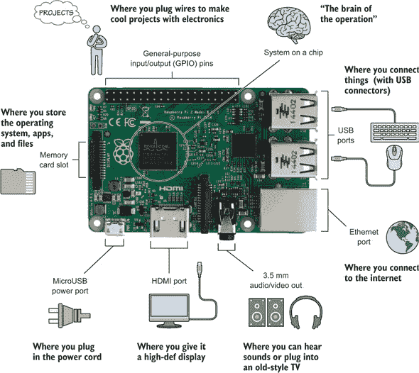

现在，让我们更详细地看看一些我们在第一章或后续章节中没有涉及的一些端口和连接。

#### 连接到无线网络

连接到互联网的一个首选方式是使用 USB 无线网卡。一旦连接，您就可以上网冲浪，从 Pi 商店下载应用程序，或从另一台电脑远程登录到您的 Pi。我们大多数人没有将 Pi 设置在以太网电缆附近，因此无线连接是最佳且唯一的选择。让我们看看如何操作。

##### 插入您的 USB 无线网卡

关闭您的 Raspberry Pi，将 USB 无线网卡插入其中一个 USB 端口。有许多不同的 USB 无线网卡可以用于 Pi。大多数套件都附带一个，但如果您需要购买一个，请参考 Raspberry Pi 论坛（见[`www.raspberrypi.org/forums/`](https://www.raspberrypi.org/forums/））以研究那些已知可以工作的型号。销售 Raspberry Pi 的商店也倾向于销售兼容的 USB 无线网卡。

##### 配置您的 Wi-Fi 连接

要首次连接到 Wi-Fi 网络，请按照以下步骤操作：

在右上角，点击网络图标（看起来像两个小电脑相连）。您将看到可用的 Wi-Fi 网络列表（见图 B-2）。

##### 图 B.2\. 网络连接图标位于 Raspbian 桌面右上角。点击它允许您查看附近的无线网络。

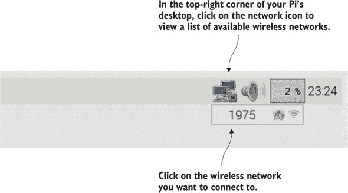

点击您想要连接的 Wi-Fi 网络名称。

点击 Wi-Fi 网络名称将弹出一个小窗口。输入预共享密钥（也称为 Wi-Fi 密码）并点击“确定”以连接（见图 B.3）。网络图标将更改为 Wi-Fi 图标，显示 Wi-Fi 信号的强度。

##### 图 B.3\. 输入网络的预共享密钥并点击“确定”以连接到它。

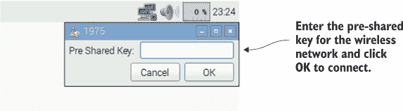

太棒了！打开网页浏览器，例如您的树莓派的 Epiphany 网页浏览器，并访问您最喜欢的网站以享受您的新 Wi-Fi 连接。

##### 故障排除

如果您无法连接，请检查您输入的预共享密钥是否正确。如果正确，并且您的网页浏览器显示错误消息“无法解析主机名”，那么您的树莓派可能需要更新其 IP 地址。IP 地址是一系列唯一的数字，无线路由器将其分配给您的树莓派和其他网络设备。要更新树莓派的 IP 地址，请打开终端并输入以下两个命令：

```
pi@raspberrypi ~ $ sudo dhclient -v -r eth0
pi@raspberrypi ~ $ sudo dhclient -v eth0
```

如果您仍然无法连接到互联网，请联系设置或管理网络的人以获取帮助。

#### 3.5mm 音频/视频端口

不论是贝多芬、Lady Gaga 还是 Minecraft 中的爬行者爆炸声，您都希望在您的树莓派上听声音。认识一下 3.5mm 音频/视频端口（见图 B.4）。这个端口是一个黑色带圆形孔的连接器^([1])。它之所以得名是因为孔的直径为 3.5mm。连接耳机或一套带电源的电脑扬声器来听树莓派的声音。

> ¹
> 
> 在较旧版本的树莓派上，端口可能是蓝色而不是黑色。

##### 图 B.4\. 树莓派的 3.5mm 音频/视频端口用于连接耳机或扬声器以播放声音。如果您购买 3.5mm 到 RCA 复合视频适配器，它也可以作为低质量视频输出使用。

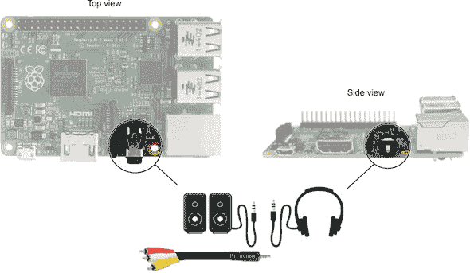

| |
| --- |

##### 小贴士

如果您连接电脑扬声器，请使用带电源的扬声器，例如与台式电脑或 iPod 一起使用的类型。从树莓派 3.5mm 音频/视频端口输出的声音仅足够一对耳机或耳塞使用。如果您想让房间里的人都能听到您的音乐，请连接一套带内置放大器的带电源扬声器，以增强声音。

| |
| --- |

从树莓派 1 Model B+和树莓派 2 Model B 开始，此端口也可以用于输出视频信号。视频信号不是像 HDMI 端口那样的高分辨率，但在紧急情况下，它是一个选项。输出视频信号是复合视频或单通道视频，意味着所有视频信号都通过一根线输出。这是许多旧款 DVD 播放器和视频游戏机曾经使用过的。您可以购买一根插入端口的电缆，另一端有 RCA 连接器，以便将您的树莓派连接到旧电视。

#### 摄像头串行接口：连接摄像头

如果您想尝试时间流逝摄影或设置一个相机来拍摄野生动物或宠物的照片，您将需要将一个相机添加到您的 Pi 上。将高清数字相机添加到 Raspberry Pi 的最佳方式是使用 Raspberry Pi 相机模块。由 Raspberry Pi 基金会创建，它通常不包含 Pi 套件，因此您需要单独购买。该模块包含一个安装在电路板上的 500 万像素相机，并附带一根短扁平电缆（参见图 B.5）。

##### 图 B.5\. Raspberry Pi 相机模块是由 Raspberry Pi 基金会创建的，用于拍摄高清数字照片和视频。该相机通过连接到 Camera Serial Interface 端口的扁平电缆连接到 Pi。相机模块可以使用 Python 进行编程，用于自然摄影或创建您自己的家庭监控系统。

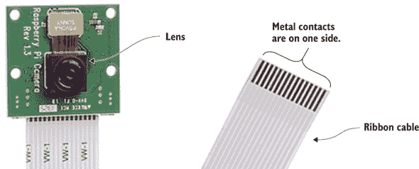

相机连接到 Pi 的 Camera Serial Interface (CSI) 端口（参见图 B.6），可以拍摄静态照片或高清视频。该模块能够轻松连接到 Pi 并录制高清视频，同时比使用 USB 相机消耗更少的处理能力。

##### 图 B.6\. Raspberry Pi 相机可以连接到 CSI 端口，该端口位于 HDMI 端口和 3.5 毫米音频/视频端口之间。要连接相机，您需要抬起黑色连接器，插入扁平电缆（金属接触面向 HDMI 端口），然后再次按下黑色连接器。

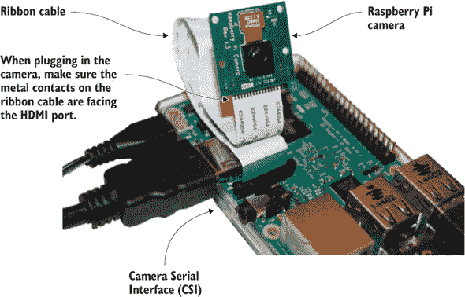

要连接相机模块，请按照以下步骤操作：

> **1**. 通过抬起黑色塑料连接器的顶部部分来打开 Pi 上的 CSI 连接器。
> 
> **2**. 将扁平电缆的末端插入 CSI 连接器。扁平电缆上的光亮金属触点应朝向远离以太网端口，朝向 HDMI 端口（参见图 B.6）。
> 
> **3**. 将黑色塑料连接器推回原位以关闭它，夹紧扁平电缆到连接器中。


##### 小贴士

Pi 相机板附带一根短扁平电缆。如果您需要更长的电缆，您可以在像 Adafruit 这样的在线商店找到延长电缆。


一旦连接了相机模块，您需要启用它。打开终端以进入 Raspbian 命令行模式。输入命令以打开 Raspberry Pi 配置菜单：

```
pi@raspberrypi ~ $ sudo raspi-config
```

当出现蓝色屏幕和 Raspberry Pi 配置菜单时，选择选项 5：启用相机。选择启用，然后在主配置菜单中选择完成。您的 Pi 将询问您是否要现在重启；选择是。当 Pi 重启后，通过打开终端并输入

```
pi@raspberrypi ~ $ raspistill -t 3000 -o PiPhoto.jpg
```

这将在 3 秒后打开相机并拍照。`–t 3000`部分告诉`raspistill`程序等待的时间——在这种情况下，它设置为 3,000 毫秒或 3 秒。图片被保存到名为 PiPhoto.jpg 的文件中。你可以通过打开文件管理器并查看 pi\home 文件夹来查看文件。查看在线资源以获取更多你可以用你的相机做的事情，包括使用 PiCamera，这是一个用于控制相机的 Python 库。

如果你考虑在夜间拍摄视频或照片，有一个 Pi 相机模块的替代版本，称为 Pi NoIR（近红外）相机模块。它使用相同的 CSI 端口并以相同的方式连接。一个区别是，你需要在你要拍摄的目标上照射红外光源。有了 Pi NoIR，你就可以用 Pi 进行一些夜间恶作剧的新可能性。

#### 以太网端口

有互联网连接可以让你使用 Pi 浏览网页和下载软件；你甚至可以从另一台电脑控制你的 Pi。你的树莓派的以太网端口位于 USB 端口旁边（参见图 B.7）。使用以太网端口是连接树莓派到互联网的简单方法。唯一的问题是，你需要将 Pi 放在以太网线缆可以到达的地方。

##### 图 B.7\. 树莓派的以太网端口支持将 Pi 连接到家庭网络。从你的 Pi 到你的路由器或调制解调器连接一根以太网线缆以访问互联网。当你的 Pi 连接到网络时，你可以使用特殊的程序（如 SSH 和 VNC Server）从另一台电脑远程连接到 Pi。

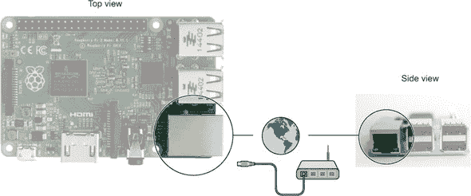

#### 电视或显示器连接选项

如果你的电视或显示器有 HDMI 端口或 DVI 端口，连接树莓派到电视或显示器是最容易的；这已在第一章中介绍。但如果你没有这些端口怎么办？还有其他方法可以将 Pi 连接起来。让我们首先识别你可能在电视或显示器后面看到的几种不同类型的端口，然后学习如何将 Pi 连接到它们。

##### 识别端口并建立连接

花时间研究你的电视或显示器上的连接。尝试识别视频端口，并将它们与图 B.8 中的连接器图片进行比较。

##### 图 B.8\. 电视和显示器上常见的视频输入端口类型。树莓派可以连接到这些端口中的任何一个。一些端口（DVI、VGA、RCA [或复合] 和分量）需要使用带有 Pi 的特殊适配器或转换器。

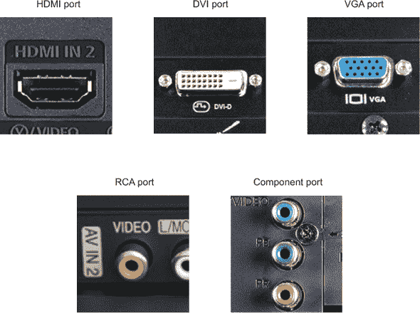

对于某些端口，你可能需要购买一个适配器，将一种类型的端口转换为另一种类型。我们将介绍 VGA、RCA 和分量端口。有关 HDMI 和 DVI 端口的连接，请参阅第一章。

##### RCA 端口

这种类型的端口是一个黄色、圆形的连接器。它通常位于红白 RCA 音频连接器旁边。

您需要购买一根特殊的线缆，一端是 3.5 毫米四极插头，另一端是 RCA 复合视频和音频线缆。将线缆插入 3.5 毫米音频/视频端口，并将另一端插入您屏幕的复合视频输入。通常，屏幕旁边会有红白音频输入插头。如果您想同时有声音，请连接红白 RCA 音频插头（参见图 B.9）。

##### 图 B.9\. Raspberry Pi 可以通过 RCA 视频线连接到电视或显示器。该线缆从 Pi 的 3.5 毫米音频/视频端口连接到电视或显示器上的 RCA 视频输入端口。使用 RCA 连接会产生低质量的图像，但如果您没有支持 HDMI 的电视或显示器，这可以是一个不错的选择。

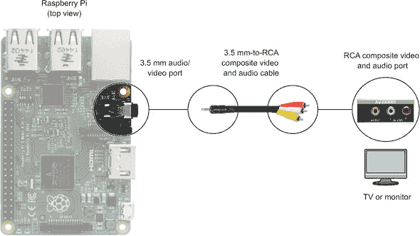

##### VGA 端口

VGA 端口顶部和底部是平的，侧面向内倾斜。端口有三排五个圆形针孔。不建议使用带有 VGA 端口的电视或显示器连接 Pi，因为您需要购买一个适配器，并且可能遇到配置 Pi 以检测您的显示器的问题。如果您决定尝试此选项，您将需要一个 HDMI 到 VGA 适配器。您还需要更新您的 Raspberry Pi 的配置设置。本书中未涵盖此内容，但 Raspberry Pi 论坛可以为您提供有关更改配置设置以使用 HDMI 到 VGA 适配器的更多信息。

##### 组件视频输入

电视上的组件视频端口有一组三个圆形插头，分别是绿色、蓝色和红色。由于转换器的额外成本以及您可能需要额外配置 Pi 以成功连接到您的显示器，因此不建议使用此端口。如果您决定使用此选项，您将需要一个组件到 HDMI 转换器。这样的转换器应附带其自身的电源供应。避免那些不带电源供应的转换器，因为它们与您的 Pi 不兼容。转换器的价格大约为 50 美元，所以如果您有其他选择，请节省您的钱——尝试使用不同的电视或显示器，或者将这笔钱用于为您的 Pi 购买新的或二手的 LCD 或 LED 显示器。

在端口被覆盖的情况下，让我们来检查 Raspberry Pi 2 Model B 和旧型号板子之间的差异。

### 旧型号板子

Raspberry Pi 是由 Raspberry Pi 基金会制造的，在过去几年中已经发布了多个版本和型号。我们将展示并讨论这些板子之间的主要差异。

#### Raspberry Pi 1 Model B

Raspberry Pi 1 Model B 是许多人都喜爱的 Pi 版本。Pi 最初是为了帮助培养新一代的程序员和黑客而设计的，但它意外地受到许多爱好者和企业家的欢迎，因为他们可以用它做很多事情并制造出很多产品。该板子看起来与 Raspberry Pi 2 Model B 略有不同（参见图 B.10）。

##### 图 B.10。Raspberry Pi 1 Model B 非常受欢迎。它被用于从科学研究到艺术和教育的各种应用。

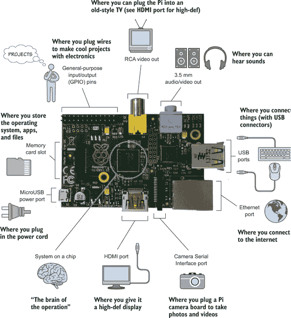

下面是 Raspberry Pi 1 Model B 和 Raspberry Pi 2 Model B 之间的一些关键区别：

+   ***USB 端口*** —Pi 1 Model B 只有两个 USB 端口。这使得连接键盘、鼠标和 USB Wi-Fi 适配器变得具有挑战性。一个很好的解决方案是使用带电 USB 集线器来连接更多的 USB 设备。

+   ***RCA（或复合）视频输出*** —Pi 1 Model B 有一个专用的 RCA 连接器，可以连接到老式电视。Pi 2 Model B 将此集成到 3.5 mm 音频/视频端口中。

+   ***片上系统*** —早期的 Pi Model B 使用单核 700 MHz 处理器，而 Pi 2 Model B 使用四核 900 MHz 处理器。因此，新模型的速度大约快四倍。

+   ***内存卡槽*** —Pi 1 Model B 使用标准尺寸的 SD 卡。Pi 2 Model B 使用带有弹簧机构的 mini-SD 卡槽，以安全地固定卡片。

+   ***GPIO 引脚*** —早期 Model B 的引脚数量和编号方式不同。旧型号只有 20 个引脚；新型号有 40 个引脚。如果你在使用 Pi 1 Model B，请参考在线参考资料以了解引脚编号。

#### Raspberry Pi 1 Model B+

在 Raspberry Pi 1 Model B 之后推出了 Raspberry Pi 1 Model B+。这些板子看起来非常不同。相比之下，如果你将 Raspberry Pi 1 Model B+与后来的 Raspberry Pi 2 Model B 进行比较，它们几乎完全相同——在可用的端口和端口位置方面，它们完全一样。图 B.11 展示了 Raspberry Pi 1 Model B+。

##### 图 B.11。Raspberry Pi 1 Model B+是 Raspberry Pi 1 Model B 的重大改进。它将 USB 端口数量从两个增加到四个，增加了 GPIO 引脚，并改为使用 microSD 内存卡槽。Raspberry Pi 1 Model B+的端口与 Raspberry Pi 2 Model B 的端口相同。

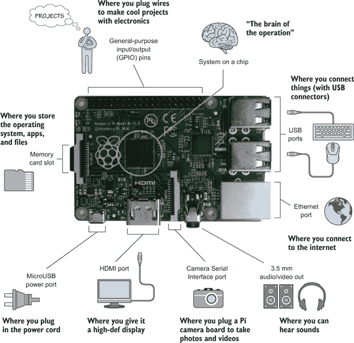

与 Raspberry Pi 2 Model B 的关键区别如下：

+   ***片上系统*** —B+型号拥有一颗 700 MHz 的单核处理器，而 Pi 2 Model B 则拥有四核 900 MHz 的处理器。

+   ***工作内存（RAM）*** —B+型号有 512 MB，而 Pi 2 Model B 有 1 GB。

#### 其他板子

我们没有涵盖 Raspberry Pi Model A 或 A+，但许多端口是相同的。主要区别在于 Model A 和 A+只有一个 USB 端口，没有以太网端口，并且工作内存（RAM）更少——256 MB。当你的项目需要一个比 Model B 或 B+功耗更低的更小计算机时，Model A 和 A+非常有用。
