## 附录 C. 章节挑战的解决方案

在这个附录中，你可以找到每个章节末尾提出的挑战的答案。对于需要比一页能容纳的更多代码行的挑战，我提供了提示和代码片段。解决方案的完整程序可以在与本书配套的代码下载中找到。代码中包含注释，以帮助您理解程序的设计和功能。挑战的解决方案按章节组织。让我们开始吧！

### 第一章

在第一章结束时，你将进行一次寻宝游戏：

+   ***松鼠*** —要找到松鼠游戏，请选择菜单 > 游戏 > Python 游戏。选择你希望如何输出声音（音频）后，你将看到一系列 Python 游戏。松鼠游戏位于列表中间附近。赢得游戏，并实现欧米茄松鼠。

+   ***计算器*** —选择菜单 > 附件 > 计算器。89 × 34 等于 3,026。

+   ***关机*** —通过选择菜单 > 关机来关闭或重新启动你的树莓派。关机菜单允许你选择关闭、重启或注销。

+   ***黑色桌面*** —要将桌面背景更改为黑色，请右键单击桌面上的任何位置，然后选择桌面首选项。在桌面首选项窗口中，屏幕中间查找背景颜色标签。单击白色框以选择新的背景颜色。单击“确定”以选择颜色，然后单击“关闭”以关闭桌面首选项窗口。

+   ***Scratch 奖励*** —要打开 Scratch，请选择菜单 > 编程 > Scratch。当 Scratch 打开时，通过将程序块拖动到脚本区域为你的猫精灵构建一个程序。图 C.1 展示了一个示例，当按下空格键时，猫会来回跳舞 10 次。

    ##### 图 C.1\. 通过将程序块拖动到脚本区域，使猫在 Scratch 中跳舞。

    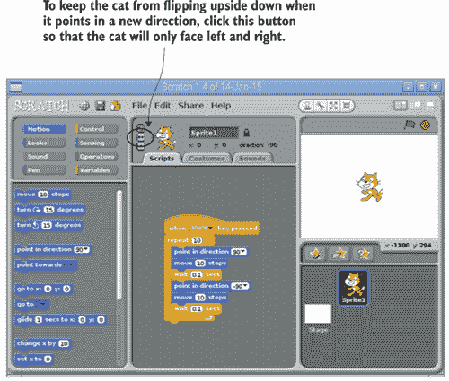

### 第二章

本章的挑战是关于在屏幕上显示字符和一些数学运算。

#### 矩阵

通过使用 `print` 函数和乘法运算符创建一个由 1 和 0 组成的屏幕，如下所示：

```
matrix = "0100101101001100100110001011001011110000010101"
print(matrix * 100)
```

#### 建造砖墙

要解决这个问题，创建一个名为 `brick` 的变量，并给它一个如下的字符字符串：

```
brick = "|__"
print(brick * 1000)
```

要让砖块看起来像树莓，你可以尝试

```
brick = "|_o88{_"
print(brick*300)
```

用你的想象力来想象这是一个侧放的树莓砖。括号是树莓顶部的叶子。

#### π电子

你正在尝试计算每秒需要多少个电子才能等于流入你的树莓派中的 1 安培。使用 Python 的计算如下：

```
>>> electron_charge = 1.60 * 10**-19
>>> electrons_flowing = 1 / electron_charge
>>> print(electrons_flowing)
6.249999999999999e+18
```

答案是 6,250,000,000,000,000,000。那可是一大堆电子！

### 第三章

这些挑战是关于收集输入、合并字符串和在屏幕上显示文本。

#### 骑士传说创作者 3000

要制作这个程序，你首先需要打印一个标题，然后从玩家那里收集一系列单词：

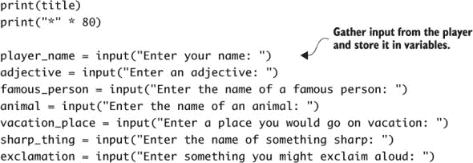

接下来，你将输入单词与故事连接起来。你可以逐句这样做，以使代码更容易理解：

```
sentence1 = "There was a brave knight, " + player_name + ", who was
 sent on a quest to vanquish the " + adjective + " evildoer,
 " + famous_person + ". "
sentence2 = "Riding on his/her trusty " + animal + ", the brave " +
 player_name + " traveled to the faraway land of " + vacation_place
 + ". "
sentence3 = player_name + " battled valiantly against " + famous_person +
 "'s army using his " + sharp_thing + " until he defeated them. "
sentence4 = "Emerging victorious, " + player_name + " exclaimed, '" +
 exclamation + "!!!' I claim the land of " + vacation_place + " in the
 name of Python."
```

最后，让我们将句子连接起来，并将故事显示在屏幕上：

```
tale = sentence1 + sentence2 + sentence3 + sentence4
print(tale)
```

#### 潜意识信息

你试图创建一个隐藏在大量字符显示中的信息。你首先询问人的名字和他们想要的东西：

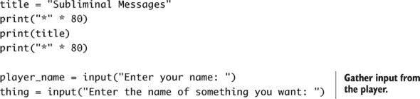

接下来，创建一个由字母、数字和符号组成的模式，你将在其中隐藏信息：

```
weird_characters = "*#ad@32*)23 )@*sad# 2&^ 32⁴²³!"
```

最后，你通过在屏幕上打印出消息前后字符的模式来创建完整的消息：“你真的很想为[player_name]买[thing]”，但将其隐藏：

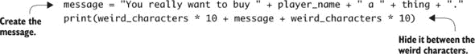

### 第四章

本章的挑战是关于使用你的一些新技能，如`if`/`then`（或条件）语句，以及像`random`模块这样的工具箱。

#### 石头、纸牌、剪刀！

对于这个挑战，你首先导入`random`模块，创建一个标题，并定义你将要需要的任何变量：

```
import random

play_again = "Yes"
choices = ["Rock","Paper","Scissors"]
```

接下来，你想要显示标题，然后启动一个`while`循环，该循环将收集玩家的选择并获取一个随机的电脑选择：

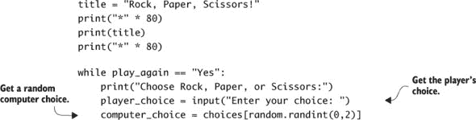

你接下来想要显示两个选择，并使用一个`if`语句来测试玩家和电脑的选择是否相同。如果不相同，你想要检查你是否拥有以下玩家对电脑的组合之一：

+   石头（玩家）胜过剪刀（电脑）

+   剪刀（玩家）胜过纸牌（电脑）

+   纸牌（玩家）胜过石头（电脑）

你将所有这些都在`while`循环中编程，因为你想要它重复，直到玩家想要再玩。在循环的末尾，玩家被问是否想要再玩一次：

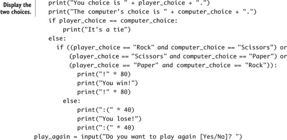

你创建了一个大的`if`语句，用于测试`player_choice`和`computer_choice`是否形成以下获胜组合之一。每个组合都被括号括起来，你使用`or`在它们之间。这确保了如果任何一个组合是正确的，获胜信息将被显示。

### 第五章

#### 介绍戏剧性停顿

你在第五章（kindle_split_014.html#ch05）中得到了一些关于如何做到这一点的良好提示。在这里不显示太多代码，我建议你前往代码下载区查看其外观。

#### 随机死亡

在这个挑战中，你正在为你的冒险家 Raspi 创建一个更随机和有趣的结局。为此，你需要在程序顶部导入`random`模块，定义一些用于不同结局的新变量，并创建一个结局列表。这将允许电脑选择一个数字：

```
import time
import random

demise1 = """Raspi sees a rock on the ground and picks it up. He feels a
 sharp pinch and drops the rock. Just then he realizes it wasn't a rock
 but a poisonous spider as he collapses to the ground."""
demise2 = """Standing in the cave, Raspi sees a small rabbit approach
 him. Raspi gets a bad feeling about this rabbit. Suddenly, the
 rabbit attacks him, biting his neck."""
demise3 = """Whoa, is that a piece of gold? As Raspi walks over to it,
 he doesn't see a hole in the floor. Suddenly, he falls down the hole,
 never to be heard from again."""
endings = [demise1, demise2, demise3]
```

你使用三引号，称为*字符串字面量*，来创建跨越多行的字符串。你还将三个不同的结局存储在一个名为`endings`的列表中。

最后，为了解决这个挑战，将`wrong_answer`函数更改为获取一个随机数，选择一个结局，并将其显示在屏幕上：

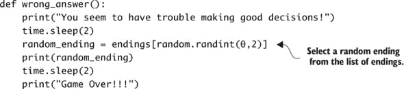

查看代码下载以了解它们是如何一起工作的。

#### 再玩一次？

要添加再玩一次选项，在程序顶部添加一个新变量，并将其设置为 `"Y"` 以开始：

```
play_again = "Y"
```

接下来，将所有你的洞穴选择逻辑放入 `while` 循环中。`while` 循环将取决于 `play_again` 的值，但你会使用字符串函数 `upper()` 将 `play_again` 值全部转换为大写。这有助于用户不小心输入 `y` 而不是 `Y`：

```
while play_again.upper() == "Y":
```

在 `while` 循环结束时，你还需要询问用户是否想要再玩一次。将他们的响应存储在 `play_again` 变量中：

```
print("Do you want to play again?")
play_again = input("Enter Y for yes or N for no: ")
```

这个挑战的另一个部分是添加尖叫声（或任何你想要的其他声音）。首先，确保你导入了 `os` 模块，并设置一个包含声音文件的变量：

```
import os
scream_file_path =
 "/usr/share/scratch/Media/Sounds/Human/Scream-male2.mp3"
```

在 `wrong_answer` 函数中添加一行新代码，调用 OMXPlayer 并告诉它播放尖叫声：

```
os.system("omxplayer " + scream_file_path)
```

运行程序以测试它！将其添加到游戏中所有其他游戏结束部分，使其更加有趣！

| |
| --- |

##### 注意

确保你的扬声器或耳机已连接，否则你将听不到任何声音。

| |
| --- |

### 第六章

#### 波形模式

让我们逐个开启每个 LED。然后，当它们都开启后，你将逐个关闭它们。每个灯光通过将其状态设置为 `HIGH`（开启）或 `LOW`（关闭）来开启或关闭。你通过在每条命令之间添加时间延迟来创建序列：

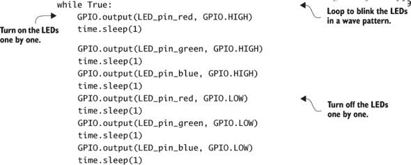

你可以调整睡眠时间以获得更快或更慢的动画。

#### Simon says

在这个挑战中，你需要创建一个程序，使灯光按照经典游戏 *Simon* 的模式闪烁。和之前一样，程序需要导入 GPIO 和时间模块，并正确设置 GPIO 引脚。请参阅代码下载以获取完整的代码列表。首先定义 `simon_says` 函数：

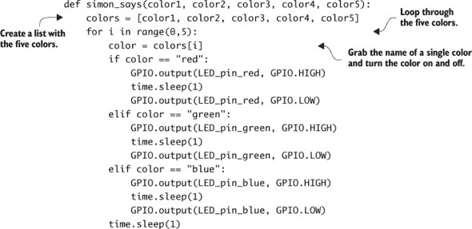

这创建了一个包含所有颜色的列表，并逐个遍历它们。对于每一个，函数都会检查其值并开启和关闭该颜色的 LED。要使用该函数，你需要调用它，并给它你想要创建的模式，以及一些有用的信息：

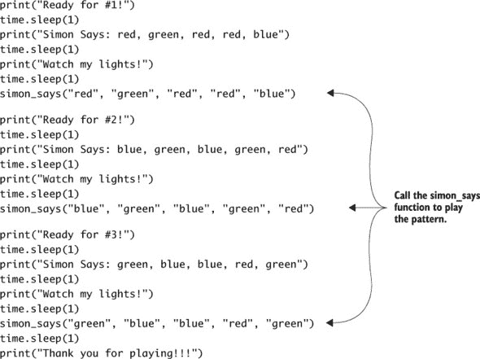

去吧，Simon，出发！

#### 随机闪烁

这个挑战是关于在 0 到 3 秒之间随机闪烁 LED 的。让我们看看如何做到这一点。我不会展示程序的上半部分，即 GPIO 引脚的典型设置；请参阅代码下载以获取完整的代码列表。在程序顶部，别忘了导入 `random` 模块，以便你可以使用它来生成随机数：

```
import random
```

要完成这个挑战，你需要创建两个变量，并将介于 0 和 3 之间的随机数存储在它们中。这些变量是灯光应该开启和关闭的时间长度：

```
on_random_time = random.random() * 3
off_random_time = random.random() * 3
```

接下来，你可以使用 `sleep` 函数和随机时间来使灯光闪烁。将此放在循环中，确保每次通过循环时都创建新的随机开启和关闭时间：

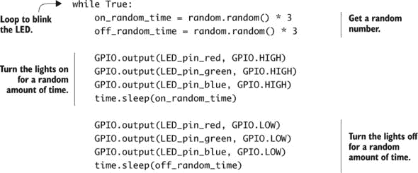

关闭和开启时间每次通过循环时都会改变。享受一些有趣的闪烁吧！

### 第七章

本章挑战涉及使用你的猜测游戏和控制 RGB LED。

#### 游戏赢家

让我们编写一个函数来快速闪烁 RGB LED 三种不同的颜色。定义一个新的函数叫做`winning_flash`：

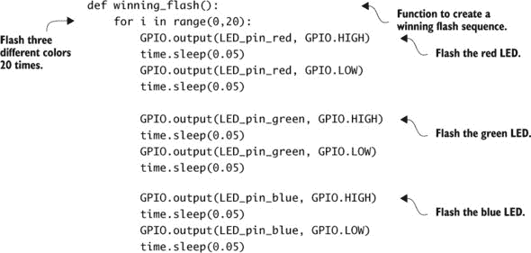

如果你需要帮助确定在哪里添加这个函数并在代码中调用它，请查看代码下载以获取更多答案。你需要在`guess`等于`number_in_my_head`时添加到`if`语句中，这样你就能在获胜时得到一个精彩的闪烁庆祝。

#### 复活节彩蛋

要在你的程序中创建一个复活节彩蛋，你需要让代码检查玩家是否输入了特定的值而不是通常的数字猜测。编辑 LED 猜测游戏程序的主要逻辑部分，首先检查是否输入了秘密单词。如果没有，程序将继续将输入文本转换为整数，并检查猜测是否正确、过高或过低。如果玩家输入了单词*Spam*，你将调用一个`easter_egg`函数：

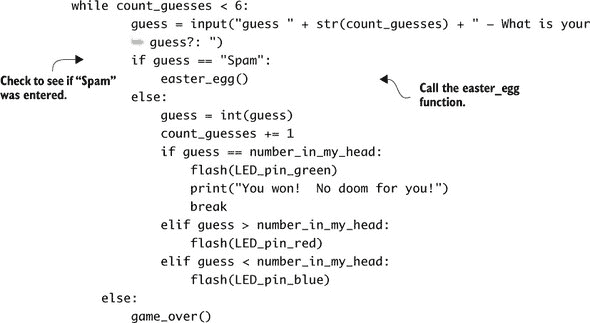

作为一项特别奖励，你可以创建一个显示 Spam 歌曲或你想要的任何信息的`easter_egg`函数。

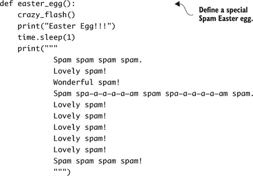

在`easter_egg`函数中，你调用一个`crazy_flash`函数。这里展示的函数会使 RGB LED 快速闪烁紫色和绿色。这与你创建的`winning_flash`函数类似：

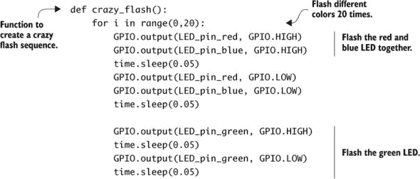

创建你自己的`easter_egg`和`crazy_flash`函数，或者查看代码下载以获取可以修改的示例。

#### 更热和更冷

如果你感觉更冷或者离正确答案更远，就让我们把猜测游戏中的闪烁速度放慢；如果你感觉更热或者离正确答案更近，就加快闪烁速度。添加一些计算，使得`blink_time`由猜测值与正确答案之间的差异决定：

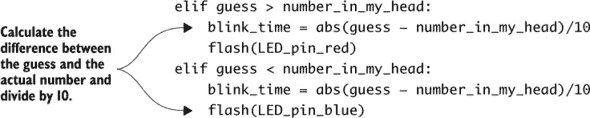

`abs`函数获取绝对值——一个数字与零之间的距离。你需要这样做，因为你不能告诉你的 Pi 设备睡眠负数时间。那会很愚蠢！你需要在两种情况下都进行这个加法：当玩家的猜测值高于或低于实际数字时。你将数字除以 10 来加快`blink_time`，并确保你的灯光不会闪烁得太慢。

最后，一个很好的细节是向游戏说明中添加额外信息，让玩家知道闪烁速度可以给他们提供接近或远离答案的提示。查看代码下载以获取示例。

#### Darth Vader 惊喜

使用你在第七章中学到的知识和一些新东西，让我们看看你能否在游戏中失败时在屏幕上弹出 Darth Vader 的图像。接下来的几个步骤你需要一个互联网连接。从网上下载一张好的 Darth Vader 图像，并确保将其保存到你的 Python 程序所在的 home\pi 文件夹中。特别注意文件名。

下载图片后，在你的 Raspberry Pi 上安装`fim`图片查看软件：

```
pi@raspberrypi ~ $ sudo apt-get -y install fim
```


##### 注意

确保在程序顶部包含一行来导入`os`模块。


完成后，在终端中测试`fim`是否工作：

```
pi@raspberrypi ~ $ fim Darth_Vader.jpg
```


##### 注意

当`fim`正在运行时，你需要按 Esc（escape）键退出。


当你退出`fim`时，屏幕将显示图像的残留部分。这是一个有趣的问题，你可以通过抓住你的窗口的标题栏并在屏幕上滑动它来擦除图像残留并恢复到正常的 Raspbian 桌面外观。

在猜谜游戏中，因为你需要从你的 Python 程序中调用`fim`，所以在程序顶部添加一行来导入`os`模块：

```
import os
```

接下来，编辑`game_over`函数以显示图像。`game_over`函数仅在玩家猜错五次时调用：

```
def game_over():
    print("You lost!")
    print("Better luck next time!")
    time.sleep(2)
    os.system("fim –a Darth_Vader.jpg")
```

注意，你使用带有`–a`选项的`fim`来显示达斯·维德。此选项会自动调整图像以填充整个屏幕。以下是一些你可以在屏幕上显示图像时使用的命令来旋转或调整图像大小：

| Option | 结果 |
| --- | --- |
| +/- | 放大/缩小 |
| A | 自动缩放 |
| F | 翻转 |
| M | 镜像 |
| R/r | 顺时针/逆时针旋转 10 度 |
| Esc/q | 退出 |

测试一下看看是否工作！

### 第八章

看看你能用按钮做些什么有趣的事情。

#### 双击按钮惊喜

这个挑战涉及从章节中获取项目，并在同时按下两个按钮时使项目发生新的不同的事情。在这种情况下，你将让你的 Pi 播放打击乐声音，以配合你的声音和音乐。你不需要更改任何接线，因为你已经有了两个按钮。

首先，让我们在程序顶部添加一些代码来创建存储音效的路径：

```
path_effects = "/usr/share/scratch/Media/Sounds/Effects/"
```

接下来，从文件夹中获取效果列表，并将列表存储在变量`sounds_effects`中。将此放在加载其他列表的旁边：

```
sounds_effects = get_MP3_sounds(path_effects)
```

最后，你需要让程序检查按钮 1 和按钮 2 是否被按下。你将修改主游戏循环，首先检查两个按钮是否都被按下。你使用`if`/`elif`语句来做这件事。使用布尔“与”运算符（`&`）来使这个`if`语句仅在按钮 1 和按钮 2 都被按下时为真。如果不是，该语句将接下来检查按钮 1，最后检查按钮 2：

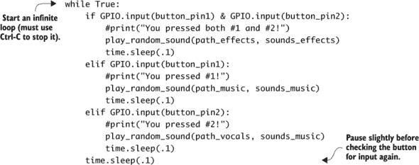

让我们测试一下看看是否工作！如果你需要关于程序的更多详细信息，请查看代码下载。

#### 约达魔法 8 球

在你开始编写这个挑战的编程代码之前，你需要处理硬件。因为这个挑战只需要一个按钮，所以从面包板上移除按钮 2 及其跳线电阻。现在你的面包板上应该只剩下一个按钮，连接到 GPIO 6。

接下来，收集一组尤达声音。一旦您创建了一个免费账户，您就可以从 Soundboard 下载声音。对于这个示例解决方案，您将使用五个声音文件，但请随意使用您想要的任何文件。确保它们是 MP3 声音文件，这样它们才能与 OMXPlayer 一起工作。本示例解决方案中的尤达声音文件如下：

+   Fear in You.mp3

+   I am strong.mp3

+   No.mp3

+   Patience.mp3

+   Use the Force.mp3

与经典的魔法 8 球游戏类似，答案有时清晰，有时奇怪或不清晰。

正如 DJ Raspi 项目一样，您需要为此项目导入几个模块，设置 Pi 的 GPIO 引脚用于输入（检测电信号），并创建一些变量。最值得注意的是，您需要为包含您的尤达声音文件的文件夹创建一个变量：

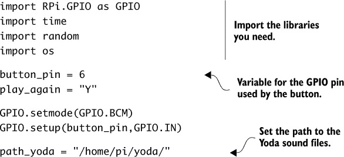

使用来自您的 DJ Raspi 项目的相同`get_MP3_sounds`和`play_random_sound`函数。您可以对`play_random_sound`函数进行的一个小改进是隐藏 OMXPlayer 在屏幕上显示的消息（它们使得阅读游戏告诉您做什么变得更困难）。将这一行更改为将所有输出消息重定向到空或空位置：

```
def play_random_sound(sound_path, sound_files):
    random_sound_index = random.randint(0,len(sound_files)-1)
    # print("Playing: " + sound_files[random_sound_index])
    os.system("omxplayer -o local '" + sound_path +
              "/" + sound_files[random_sound_index] + "' >/dev/null")
```

这是一个能够重用代码的绝佳例子！接下来，您将从文件夹中收集 MP3 尤达声音列表。

```
sounds_yoda = get_MP3_sounds(path_yoda)
```

在打印出漂亮的标题后，然后向玩家展示说明并进入主循环，该循环检查按钮是否被按下。在这个循环中，您调用`play_random_sound`函数，这样树莓派就会对玩家的提问做出回答：

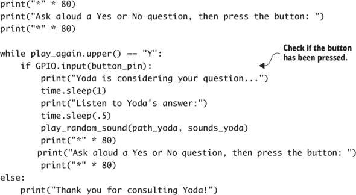

在尤达的帮助下享受做出您未来决策的乐趣！
