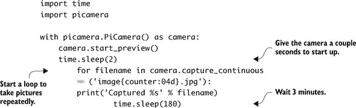

## 附录 D. 树莓派项目

在本附录中，你可以找到关于你可以用树莓派做的项目的简短讨论和描述。目标是让你开始行动。这不是一套详细的说明，而是关于如何制作这些项目的提示和基本步骤。

### 万圣节头部

万圣节可以是一个使用树莓派为你的家创建有趣或恐怖展示的鼓舞人心的时刻。让我们面对现实——在万圣节吓人是件有趣的事情。这个项目是关于建立一个系统，用来惊喜那些来你门口的万圣节糖果收集者。当他们接近时，他们的动作会触发一个运动传感器，显示一个说话或唱歌的视频。视频被投影到一个放在门旁边的泡沫塑料头上。

这里是你需要为此项目准备的东西：

+   带面包板、扩展板和扁平电缆的树莓派

+   被动红外（PIR）运动传感器

+   投影仪

+   有源电脑扬声器

+   泡沫塑料头（一个或多个）

+   小桌子：一个用于 Pi 和投影仪，另一个用于泡沫塑料头

+   延长线和电源插座

+   唱歌或说话的头部视频

构建此项目，以下是步骤：

> **1**. 将你的树莓派连接到面包板，并添加 PIR 传感器。这类似于你在第八章中添加迷你按钮的方式。第八章
> 
> **2**. 下载一个带有说话或唱歌的头部视频，或者录制你自己的。编写一个 Python 程序，当 PIR 传感器被触发时播放视频。这类似于 DJ Raspi 程序，当按钮被按下时播放声音。
> 
> **3**. 使用传感器和视频一起测试你的程序。
> 
> **4**. 在你前门大约 10 英尺远的地方设置一张小桌子。在桌子上，设置你的树莓派、带有 PIR 传感器的面包板、扬声器和投影仪。将 PIR 传感器放置在可以检测到有人接近门的位置。使用延长线提供所需的电力。（只有当预报没有雨时才设置此设备！）
> 
> **5**. 在门旁边再设置一张小桌子或一个盒子。将泡沫塑料头放在上面。调整头部的位置，使得投影仪的视频显示在头部上。测试并调整投影仪和头部位置，确保一切对齐。当视频播放时，头部看起来就像活了一样！

这里有一些可能有助于这个项目的关键资源：

+   访问 SparkFun 网站[www.sparkfun.com](http://www.sparkfun.com)，并搜索 PIR 传感器。这家公司有很多优秀的组件，可以帮助你制作几乎任何你想象的电子产品项目。

+   你可以使用带有空白选项的 OMXPlayer 使整个屏幕变黑（全黑），如下所示：

    ```
    pi@raspberrypi ~ $ omxplayer –b singheads.mp4
    ```

### 时间流逝摄影

你可以轻松地将一个高清相机连接到 Raspberry Pi，该相机能够拍摄数字照片或视频（有关更多信息，请参阅附录 B [kindle_split_020.html#app02]）。在这个项目中，你将探索如何设置 Pi 来拍摄时间流逝照片。

时间流逝摄影通常涉及拍摄一系列照片，然后将它们拼接成视频。这些单独的照片可能是在几秒、几分钟、几小时或几天后拍摄的。这种技术通常用于展示某事加速发生的视图。以下是一些时间流逝场景的例子：

+   冰川在一年内缓慢后退

+   太阳的升起和落下，以及月亮的升起和落下

+   植物的生长

这里有一些简单的步骤，帮助你开始时间流逝摄影项目：

> **1**.  使用 Pi 相机套件设置 Raspberry Pi，并测试其是否正常工作。
> 
> **2**.  你的时间流逝主题决定了你需要如何安装 Pi 相机。相机没有附带外壳或任何固定方式，因此你需要设计一种类型的支架。纸板、热胶、工艺棒和胶带都是制作支撑相机的优秀材料。乐高积木也可以是一种有用的材料。
> 
> 如果你打算将相机长时间放在户外，考虑你是否需要为 Raspberry Pi 防水。外卖食品剩下的塑料容器可以制作成很好的外壳；你只需要在容器上打孔以供电线通过，并用热胶密封任何缝隙。
> 
> **3**.  规划如何为 Pi 提供电力。这可能决定了你设置 Pi 和相机的地方。
> 
> **4**.  编程 Raspberry Pi 拍照并将照片存储在文件夹中。打开 LXTerminal，为 Python 3.X 安装 `picamera` 模块：
> 
> `pi@raspberrypi ~ $ sudo apt-get install python3-picamera`

为了让你开始，你可以使用这样的程序来捕捉一系列照片。以下示例每 3 分钟拍摄一张照片：



当相机完成拍照后，你可以按 Ctrl-C 来结束程序。


##### 注意

此程序将图像保存到程序运行的文件夹中。你应该为你的时间流逝项目创建一个文件夹，并从该文件夹运行程序。


接下来，你需要将图像组合成视频。你可以使用一个名为 `mencoder` 的应用程序将图像转换为电影。按照以下步骤安装它：

```
pi@raspberrypi ~ $ sudo apt-get install mencoder
```

然后，你将创建一个简单的文本文件，其中包含你想要组合的所有图像的名称。你可以使用列表命令 (`ls`)，选择所有以 .jpg 结尾的文件，并将列表输出到文本文件中：

```
pi@raspberrypi ~ $ ls image*.jpg > list.txt
```

接下来使用 `mencoder` 将所有单个图像组合成时间流逝电影。以下示例创建了一个名为 TimeLapseMovie.avi 的电影：

```
pi@raspberrypi ~ $ mencoder -nosound -ovc lavc -lavcopts
 vcodec=mpeg4:aspect=16/9:vbitrate=8000000 -vf scale=1920:1080 -o
 TimeLapseMovie.avi -mf type=jpeg:fps=24 mf://@list.txt
```

完成后，你可以使用 OMXPlayer 播放电影：

```
pi@raspberrypi ~ $ omxplayer TimeLapseMovie.avi
```

你可以在线阅读有关 mencoder 选项的更多信息。

### Raspberry Pi 机器人

通过使用 Pi 的 GPIO 功能添加伺服电机和传感器，Raspberry Pi 可以轻松地变成一个机器人。Pi 可以用 Python 编程来做出决策，从传感器获取输入，并控制伺服电机与世界交互。

虽然您可以从头开始组装自己的机器人，但有一些 Raspberry Pi 机器人套件可以使这个过程变得容易得多。对于这个项目，我们将讨论使用 Dexter Industries 的 GoPiGo 套件。这是一个价格合理、设计精良的套件，几小时内就能让您控制 Pi 移动。您可以添加超声波传感器（检测其前面的物体）并编写 Python 程序，使 Pi GoPiGo 机器人能够自主（独立）地使用您之前学到的相同的 `if`/`else` 语句在房间内导航。

我们将介绍构建 GoPiGo 的基本步骤（您可以在 [www.dexterindustries.com/GoPiGo](http://www.dexterindustries.com/GoPiGo) 上在线阅读完整说明）：

> **1**.  按照在线说明构建您的 GoPiGo 机器人。将 Raspberry Pi 连接到机器人：它倒置放在 GoPiGo 板的顶部。Pi 通过 GPIO 引脚与 GoPiGo 板通信。
> 
> **2**.  将 GoPiGo SD 卡插入您的 Pi。SD 卡包含一个定制的 Raspbian 发行版。将 Pi 连接到键盘、鼠标、USB Wi-Fi 适配器和电视或显示器。稍后您将能够从另一台计算机远程连接到 GoPiGo。使用提供的电池组供电。启动 Pi，并将 GoPiGo 连接到您的无线网络。
> 
> **3**.  设置您的计算机以从另一台计算机远程访问您的 Pi。这意味着您将能够从家中的另一台 Windows 或 Mac 计算机上看到您的 Raspbian 桌面。为此，您需要使用名为 VNC 的软件。您需要在 Raspberry Pi 上安装 VNC 服务器，然后在您的计算机上安装 VNC 客户端。Adafruit 网站上有一些很好的教程，例如如何进行此操作。访问 [`learn.adafruit.com`](https://learn.adafruit.com)，并搜索“安装 VNC。”
> 
> **4**.  使用 VNC，从您的家用 Windows 或 Mac 计算机上连接到您的 Raspberry Pi。一旦您确认 VNC 服务器和客户端运行正常，您可以从显示器、键盘和鼠标上断开 Pi，只留下 USB Wi-Fi 适配器连接。您的 GoPiGo 准备就绪，可以移动了！
> 
> **5**.  在您的 Windows 或 Mac 上的 VNC 客户端中，打开 Pi 上的 LXTerminal。使用 `cd` 命令将目录更改为桌面上的 GoPiGo Python 文件夹：
> 
> `cd Desktop/GoPiGo/Software/Python/`

运行 GoPiGo 测试控制器 Python 程序：

```
sudo python basic_test_all.py
```

程序启动后，您可以使用以下键来移动 GoPiGo 在房间内：

| w | 向前移动 |
| --- | --- |
| a | 向左转 |
| s | 向后移动 |
| d | 向右转 |
| x | 停止 |
| t | 增加速度 |
| g | 减少速度 |

太棒了！你已经将你的树莓派变成了一个机器人。添加传感器并编写程序来在房间内导航，或者连接一个树莓派摄像头并将视频流传输到另一台计算机，这样你就可以看到你的树莓派所看到的内容了。
