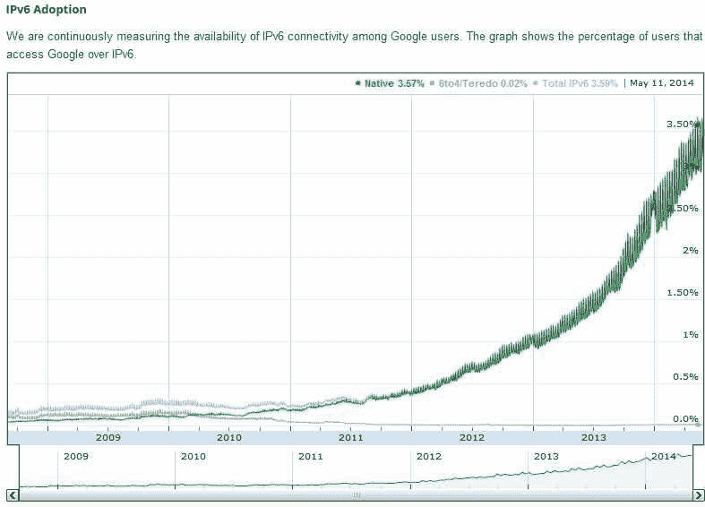

## 第一章：为什么选择 IPv6？

当前在网络和互联网中使用的 IP 版本是 IPv4（IP 版本 4）。IPv4 于 70 年代初期开发，目的是促进美国政府研究人员和学者之间的通信与信息共享。当时，该系统是封闭的，访问点数量有限，因此开发人员并未考虑安全性或服务质量等需求。值得称赞的是，IPv4 已经存在了 30 多年，并且成为了互联网革命的核心部分。但即便是最巧妙设计的系统也会随着时间的推移逐渐过时，IPv4 也不例外。如今的网络需求远远超出了支持网页和电子邮件的范围。网络设备多样性和移动通信的爆炸性增长，以及网络技术、新服务和社交网络的全球普及，已经压垮了 IPv4，促使了下一代互联网协议的发展。

IPv6 的开发基于我们在开发和使用 IPv4 中的丰富经验。已经验证并建立的机制得以保留，已知的局限性被舍弃，扩展性和灵活性得到了增强。IPv6 是一个旨在应对互联网增长速度、满足服务、移动性和端到端安全性等严格要求的协议。

当互联网在 1983 年一天之内从使用网络控制协议（NCP）切换到互联网协议（IP）时，IP 并不是我们今天所熟悉的成熟协议。许多广为人知且常用的扩展是在随后的几年里为了满足互联网日益增长的需求而开发的。相比之下，硬件厂商和操作系统供应商自 1995 年 IPv6 成为草案标准以来就已经支持 IPv6。在此后的十年里，这些实现已经成熟，IPv6 的支持不仅限于基础网络设施，还将继续扩展。

对组织来说，尽早关注 IPv6 的引入非常重要，因为从长远来看，IPv6 的使用是不可避免的。如果将 IPv6 纳入战略规划；如果组织提前考虑可能的整合场景；如果在投资 IT 资本支出时考虑到其引入，组织就能节省可观的成本，并能在需要时更高效地启用 IPv6。

关于互联网历史的有趣且幽默的概述可以在 RFC 2235《霍布斯互联网时间线》中找到。该记载从 1957 年开始，讲述了苏联发射*斯普特尼克*卫星和美国国防部（DoD）成立高级研究计划局（ARPA）的事件。RFC 中还列出了互联网主机、网络和域名注册的年度增长率。

以下是来自 RFC 的一些摘录：

+   1969 年：史蒂夫·克罗克（Steve Crocker）提出了第一个《评论请求》（RFC 1）：“主机软件”。

+   1970 年：ARPANET 主机开始使用网络控制协议（NCP）。

+   1971 年：23 台主机连接到 ARPANET（UCLA、SRI、UCSB、犹他大学、BBN、MIT、RAND、SDC、哈佛、林肯实验室、斯坦福、UIU©、CWRU、CMU、NASA/Ames）。

+   1972 年：成立了互联网工作组（INWG），由文顿·瑟夫（Vinton Cerf）担任主席，旨在解决制定统一协议的需求。Telnet 规范（RFC 318）发布。

+   1973 年：与 ARPANET 的首次国际连接在伦敦大学（英国）和皇家雷达研究所（挪威）完成。鲍勃·梅特卡夫（Bob Metcalfe）的哈佛博士论文概述了以太网的构想。文件传输规范（RFC 454）发布。

+   1976 年：伊丽莎白二世女王发送了一封电子邮件。

+   1981 年：法国电信公司在法国部署了 Minitel（Teletel）。

+   1983 年：1 月 1 日，从 NCP 到 TCP/IP 的切换完成。

+   1984 年：主机数量突破 1,000。

+   1987 年：使用 CSNET 协议在德国和中国之间建立了电子邮件连接，第一封来自中国的邮件于 9 月 20 日发送。第 1000 号 RFC 发布。主机数量突破 10,000。

+   1988 年：一只互联网蠕虫通过网络传播，影响了 60,000 台主机中的 10%。

+   1989 年：主机数量突破 100,000。克利福德·斯托尔（Clifford Stoll）写下了《布谷鸟的蛋》一书，讲述了一群德国黑客渗透美国多个设施的真实故事。

+   1991 年：万维网（WWW）由蒂姆·伯纳斯-李（Tim Berners-Lee）开发，并由 CERN 发布。

+   1992 年：主机数量突破 1,000,000。世界银行上线。

+   1993 年：白宫在比尔·克林顿总统任期内上线。新型蠕虫开始在网络中传播——WWW 蠕虫（W4）与蜘蛛、流浪者、爬虫和蛇一起登场。

+   1994 年：互联网购物被引入；第一封垃圾邮件被发送；必胜客上线。

+   1995 年：梵蒂冈上线。域名注册不再免费。

+   1996 年：9,272 个组织因未支付域名费用，被 InterNIC 取消了其名称服务，结果未能列入名单。

+   1997 年：第 2,000 号 RFC 发布。

RFC 的历史发展到此为止。但历史仍在继续。根据[`www.internetworldstats.com/emarketing.htm`](http://www.internetworldstats.com/emarketing.htm)，全球在线用户在 2000 年达到了 3.61 亿（渗透率为 5.8%），2002 年达到了 5.87 亿。2003 年，美国国防部宣布将于 2008 年前将国防部网络迁移到 IPv6，并启动了[Moonv6 项目](http://www.moonv6.org)（现已结束）。2005 年，谷歌注册了一个/32 的 IPv6 前缀，互联网之父 Vint Cerf 加入了谷歌。到那时，互联网用户数量已达 10.8 亿。到 2014 年写作时，全球互联网用户数量约为 24 亿，渗透率为 34%。

因此，尽管这些数字反映了所有互联网用户，无论 IP 协议版本如何，但现在我们开始看到 IPv6 互联网的增长。它仍处于初期阶段，但根据过去两年的增长数据，我们预计增长将呈指数级，并且可能比我们当中的热衷者预期的还要快。IPv6 互联网的增长可以在[Google IPv6 采纳统计数据](http://www.google.com/ipv6/statistics.html)中看到，2014 年春季的统计数据如图 1-1 所示。

统计数据显示，在 2011 年初（当 IANA 的 IPv4 池用尽时），原生 IPv6 互联网用户的比例约为 0.2%。统计数据显示，非原生 IPv6 的用户（例如 6to4 或 Teredo，红线）的比例已降至几乎为零，并且从那时起变得微不足道。在一年内，IPv6 互联网用户的数量翻了一番，达到了 0.4%——虽然是一个小数字，但仍然是增长。到 2013 年 1 月，IPv6 互联网的用户已经突破了 1%的大关，我们进入了 2014 年，IPv6 互联网用户接近 3%，大约为 7200 万用户。在交付本章时，即 2014 年 4 月，我们达到了 3.5%。目前，IPv6 互联网用户的数量大约每九个月翻一番。

这些只是互联网历史中的一些精选事件和里程碑。继续关注，更多的历史将继续展开。我们大家都在共同创造这段历史。

图 1-1. 2014 年春季 Google 全球 IPv6 采纳统计数据

## IPv6 的历史

互联网工程任务组（IETF）在 1990 年代初开始着手开发 IPv4 的继任协议。为了解决预见到的地址空间限制并提供额外的功能，多个平行的努力同时展开。IETF 于 1993 年启动了互联网协议下一代（或*IPng*）领域，旨在研究不同的提案并为进一步的程序提供建议。

IETF 的 IPng 领域负责人在 1994 年的多伦多 IETF 会议上推荐创建 IPv6。他们的建议在 RFC 1752 中有所规定，“IP 下一代协议的推荐”。这些负责人组建了一个地址生命周期期望（ALE）工作组，旨在确定 IPv4 的预期生命周期是否足够支持开发具有新功能的协议，或者剩余时间是否仅足以开发一个地址空间解决方案。1994 年，ALE 工作组预计，根据现有统计数据，IPv4 地址耗尽将发生在 2005 年至 2011 年之间。

对于那些对不同提案感兴趣的人，这里有一些关于过程的更多信息（来自 RFC 1752）。主要有四个提案：CNAT、IP Encaps、Nimrod 和 Simple CLNP。随后又有三个提案：P Internet Protocol (PIP)、Simple Internet Protocol (SIP) 和 TP/IX。1992 年 3 月的圣地亚哥 IETF 会议后，Simple CLNP 发展成了带有更大地址的 TCP 和 UDP（TUBA），而 IP Encaps 变成了 IP 地址封装（IPAE）。IPAE 与 PIP 和 SIP 合并，并自称为 Simple Internet Protocol Plus (SIPP)。TP/IX 工作组更名为互联网通用架构（CATNIP）。现在的主要提案是 CATNIP、TUBA 和 SIPP。关于这些提案的简短讨论，请参阅 RFC 1752。

### 注意

CATNIP 在 RFC 1707 中有规范；TUBA 在 RFC 1347、1526 和 1561 中有规范；SIPP 在 RFC 1710 中有规范。

互联网工程指导小组（IESG）于 1994 年 11 月 17 日批准了 IPv6 的建议，并草拟了一个提议标准。RFC 1883，《互联网协议，第六版（IPv6）规范》，于 1995 年发布。IPv6 的核心协议集于 1998 年 8 月 10 日成为 IETF 草案标准。此标准包括 RFC 2460，废除了 RFC 1883。

### 注意

为什么新协议不叫 IPv5？版本号 5 无法使用，因为它已经被分配给了实验流协议。

IPv6 的一个重大挑战，同时也是主要机遇之一，就是我们可以重新设计网络以适应未来。这是企业在规划 IPv6 集成时应最关注的，确保他们不仅仅是将旧有的概念复制到新协议上。我们必须重新思考我们的架构。这一千载难逢的机会可以用来摆脱许多遗留问题。一份有趣的 RFC 有助于在这一过程中看到全局，那就是 RFC 6250，《IP 模型的演变》。它展示了在多年运营网络的过程中，这一模型发生了多大的变化。因此，它有助于解放我们的思维，以便从新的角度思考。以下是一个有趣的小引述，能体现我所说的内容。

在这份 RFC 中提到了第一个 IP 模型和寻址架构，并引用了 RFC 791，该文档定义了 IPv4 和 IPv4 地址：

> *地址长度固定为四个字节（32 位）。地址以一个字节的网络号开始，后跟三个字节的本地地址。这个三字节字段被称为“剩余”字段。*

这就是我们走到的地步。现在，考虑到 IPv6 广阔的地址空间，将这一点展望到未来。如何有意义地利用新的地址架构和巨大的空间，将书写 IP 模型演变的下一个篇章。

### 注意

这里是 Vint Cerf 的一句引述：

> 广阔的 IPv6 地址空间为重新审视地址的概念提供了巨大机会。IETF 仅为当前使用分配了 IPv6 地址空间的 1/8。剩余的 7/8 地址空间仍待分配。因此，我们可能能够以不同于拓扑端点的方式解释 IP 地址空间的新段。这正是当前互联网发展过程中，关注 IPv6 未来的重要原因。

## IPv6 有什么新特点？

IPv6 是 IPv4 的演进。该协议作为软件升级在大多数设备和操作系统中安装。如果你购买的是最新的硬件和操作系统，IPv6 通常会得到支持，只需激活或配置。在许多情况下，它默认是激活的。目前可用的过渡机制允许逐步引入 IPv6，而不会危及当前的 IPv4 基础设施。

以下是主要变化的概述：

*扩展的地址空间*

地址格式从 32 位扩展到 128 位。这为地球上每一粒沙子提供了多个 IP 地址。此外，它还允许在地址空间中进行层次化结构，从而优化全球路由。

*自动配置*

也许 IPv6 最吸引人的新特性是其*无状态地址自动配置（SLAAC）*机制。当一个设备在 IPv6 环境中启动并请求其网络前缀时，它可以从其连接上的 IPv6 路由器获取一个或多个网络前缀。通过这些前缀信息，设备可以使用其 MAC 标识符或一个私有随机数来自动配置一个或多个有效的全球 IP 地址，从而构建一个唯一的 IP 地址。在 IPv4 环境中，我们必须为每个设备分配唯一的 IP 地址，通常是通过手动配置或使用 DHCP。SLAAC 应当能简化网络管理员的工作，并大幅节省维护 IP 网络的成本。此外，假设将来在家中需要 IP 地址的设备数量不断增加，这一特性将变得不可或缺。想象一下，当你购买一台新电视时，必须重新配置家里的 DHCP 服务器！无状态地址自动配置还使得移动设备（例如智能手机）在切换到外国网络时能够轻松连接。

*头部格式简化*

IPv6 头部比 IPv4 头部简单得多，其固定长度为 40 字节。这允许更快的处理。它基本上包含了两组 16 字节的源地址和目标地址，并且只有 8 字节用于一般的头部信息。

*增强的选项和扩展支持*

IPv4 将在基本头部中集成选项，而 IPv6 则在所谓的*扩展头部*中携带选项，只有在需要时才插入这些选项。再次，这允许更快地处理数据包。基本规范描述了一组六个扩展头部，包括路由、服务质量和安全头部。  

## 为什么我们需要 IPv6？  

出于历史原因，美国的组织和政府机构使用了大部分可分配的 IPv4 地址空间。世界其他地区必须共享剩余的部分。有些组织曾拥有比整个亚洲还多的 IPv4 地址空间（亚洲拥有超过 50%世界人口）。这也解释了为什么 IPv6 在亚洲的部署比在欧洲和美国要普遍得多。  

### 注意  

一个有趣的统计资源网站可以通过以下链接访问：[`www.internetworldstats.com/stats.htm`](http://www.internetworldstats.com/stats.htm)。  

IPv4 地址空间的理论上限为 43 亿个地址。然而，早期的分配方法效率低下。结果，一些组织获得了远超其需求的地址块，而本可以在其他地方使用的地址如今已不可用。如果可以重新分配 IPv4 地址空间，它将能更有效地使用，但这一过程是不可行的，全球重新分配和重新编号也是不现实的。除此之外，这样做也没多大意义，因为即使是 43 亿个地址，在当前的增长速度下也很快就不够用了。我们必须考虑到未来我们将需要为数十亿的设备分配 IP 地址。各行各业的厂商都在开发基于 IP 的监控、控制和管理系统。

正如前一节所示，IPv6 工作组做的远不止扩展地址空间。对于当今及未来的许多复杂网络，以及各种类型 IP 设备的数量，IPv6 的自动配置功能将成为必要。传统的地址分配方法无法管理这些服务，*无状态地址自动配置*也将帮助减少组织的管理成本。  

扩展的地址空间以及恢复互联网原始的端到端模型，使得可以消除网络地址转换（NAT）。在 NAT 中，一个或少数几个公共 IPv4 地址用于通过将内部地址映射到公共地址，连接大量使用私有地址的用户到互联网。NAT 是作为解决 IPv4 地址空间限制的短期修复方案引入的，因为 IPv6 当时尚未准备好（参见 RFC 1631；原始的 NAT 规范在 2001 年被 RFC 3022 废止）。NAT 在 IPv4 网络中变得非常常见，但它们在管理和操作中带来了严重的缺点：为了进行地址映射，NAT 会修改 IP 头中的终端节点地址。通常，应用层网关（ALG）会与 NAT 一起使用，以提供应用层透明性。有一长串协议和应用程序在 NAT 环境中使用时会出现问题，IPsec 和对等应用程序就是两个著名的例子。NAT 的另一个已知问题是在合并网络时私有地址空间的重叠，这需要对其中一个网络进行重新编号或创建复杂的地址映射方案。NAT 的主要优点——扩大有限的地址空间，在 IPv6 中不再需要，因此设计上不予支持。

通过引入更灵活的头部结构（扩展头部），该协议被设计为开放且可扩展的。未来，可以轻松地定义并集成新的扩展到协议集中。基于 IPv4 已经使用近 30 年的事实，IPv6 的开发是基于对 IPv4 的经验，并着重于创建一个可扩展的基础；你可以期待它能够持续很长时间。

许多国家的宽带普及率继续加速，在某些情况下，已达到 65%或更高。这种“始终在线”且带宽容量可观的连接方式意味着设备连接的机会更大。而且许多消费电子产品制造商已经抓住了这一机会。在线游戏不再是 PC 游戏的专利。游戏主机，如索尼的 PlayStation 4、Xbox One 或任天堂 Wii U，都已经增加了在线功能。许多电信运营商也在其 IP 网络上提供电视类服务（电影、音频内容等）。甚至家电产品，如冰箱、炉子、热水器和浴缸等，也开始联网。虽然将浴缸联网看起来有些荒谬，但许多此类设备被联网的目的是为了实现电力管理、远程控制、故障排除，以及远程监控/监测等功能。我们正步入智能建筑和智能城市的时代。这个网络化过程的最终结果是需要进行寻址的设备数量大增，其中许多设备将不具备标准的用户界面。在这些情况下，IPv6 地址空间结合邻居发现、无状态自动配置和移动 IPv6 等特性，将帮助迎来家庭计算机化的新时代，但希望能够避免当前协议部署所带来的巨大头痛。

无线行业（包括蜂窝网络和无线网络）的增长可谓是现象级的。在越来越多的国家，手机数量实际上超过了人口数量。在这个持续可达、随时能够获取信息的世界中，终端用户对移动性的需求变得尤为重要。从运营商的角度来看，特别是那些支持多种媒体接入类型（例如 3G、WiMax、LTE）的运营商，利用 IP 作为传输和路由数据包的方式是有道理的。智能手机上网、与其他用户玩游戏、打电话，甚至播放视频内容。与其使用不同的传输协议支持所有这些功能并创建中介应用来促进通信，不如更高效地利用现有的互联网和公司网络基础设施。我们稍后会看到，从技术角度来看，移动 IPv6 的设计非常优雅，能够高效地支持移动用户，并提供覆盖机制，使用户在不同网络之间移动时保持连接，即使这些网络使用的媒体接入类型不同。

关于 IPv6 对企业的价值仍然存在一些疑问，值得承认的是，每个组织都需要评估 IPv6 对其内部使用的好处和最佳时机。在许多情况下，组织可以找到巧妙的方法，利用 IPv6 解决“痛点”问题，而不必迁移整个网络。采用可以逐步进行，制定一个最小化集成难题的计划，并确保当需要“切换开关”时，一切都已准备就绪。正如许多案例研究所示，经过精心规划的引入成本比预期要低得多；节省成本的主要因素是提前规划使你能够使用所有的更新周期，从而最大限度地减少成本。逐步引入使你能够边学边做，从而节省大量资金和麻烦，并且可以在不影响现有 IPv4 基础设施的情况下进行。

但在考虑了所有这些思考和顾虑后，我们也不能忘记 IPv6 最根本的优势。通过其新的结构和扩展，IPv6 为新一代服务提供了基础。未来市场上将会出现一些无法用 IPv4 开发的设备和服务。这为厂商和服务提供商带来了新的市场和商业机会。先行者的机会是巨大的，延长当前产品生命周期的机会也同样可观，因为可以通过将技术与 IPv6 结合来刷新产品。另一方面，这意味着组织和用户在中期将需要此类服务。因此，建议通过逐步而非破坏性的方式小心地集成新协议，为这些新服务做好基础设施准备。这可以避免在没有充分规划的情况下，以不合理的高成本引入基于 IPv6 的业务关键应用。

## 常见误解

考虑到所有这些优势，或许应该问的是：“为什么不选择 IPv6？”与客户交流时，我们经常发现他们有一套类似的误解，阻止他们考虑 IPv6。以下是最常见的误解：

“引入 IPv6 会使我们现有的 IP 基础设施——我们的网络和服务——面临风险。”

这种担忧没有依据。IPv6 发展的一个主要焦点是创建允许两种协议和平共存的集成机制。你可以将 IPv6 与 IPv4 一起使用，也可以独立使用 IPv6。可以在引入 IPv6 的同时使用它来访问新的服务，同时保留 IPv4 来访问传统服务。这不仅确保了不间断地访问 IPv4 服务，而且还允许逐步引入 IPv6。我在第七章中讨论了这些机制。你最大的风险是不利用 IPv6 所提供的所有机会。只有在有时间的情况下进行规划，你才能利用这些机会。

“IPv6 协议还不成熟，尚未证明它能够经得起时间的考验，或者它是否能够满足需求。”

这是 2006 年我们发布本书第二版时，许多人关心的问题。而到了 2014 年，这种说法已不再成立。许多 ISP 和组织正在部署 IPv6，厂商也在加快步伐，工作组已经开发并优化了有助于集成的机制。没有技术上的理由不使用 IPv6。

“引入 IPv6 的成本太高。”

采用 IPv6 肯定会有一些成本。在许多情况下，较新的网络会发现它们现有基础设施中对 IPv6 的支持实际上已经很高。不管怎样，过渡过程中将需要一些硬件和软件的投入。组织需要创建新的设计，审查当前的概念，培训 IT 人员，可能还需要寻求外部专家的帮助，以便充分利用 IPv6。

然而，IPv6 带来的成本节约已经变得越来越容易定义。基于 IPv4 的网络变得越来越复杂。新的 IT 服务，如 VoIP、即时消息、视频会议、IPTV 和统一通信，增加了中间件层和复杂性。正在合并的组织或进行 B2B 交易的公司正在实施具有高管理成本且难以排查故障的 NAT 重叠解决方案。而且，日益增长的移动设备和网络设备市场需要强大的访问模型，而这些模型在 IPv4 环境中既昂贵又难以实现。在所有这些情况下，IPv6 从长远来看提供了比 IPv4 更简洁且具有成本效益的模型。事实上，投资 IPv4 就是投资一个即将淘汰的技术，而投资 IPv6 则是在投资未来的技术。

“通过无状态地址自动配置（Stateless Address Autoconfiguration），我们将无法控制或监控网络访问。”

虽然对于广泛使用无状态地址自动配置的网络，这种说法通常是正确的，但管理员将有选择其控制级别的权利。根据 RFC 3315 定义的 DHCPv6 已经扩展以支持两种常见的操作模式：有状态和无状态。有状态模式是当前使用 DHCP（用于 IPv4）的用户熟悉的模式，其中一个节点（DHCP 客户端）动态地从 DHCP 服务器请求 IP 地址和配置选项。DHCPv6 还提供了无状态模式，在这种模式下，DHCPv6 客户端只是从 DHCPv6 服务器请求配置选项，并通过其他方式，如无状态地址自动配置，来获取 IPv6 地址。

“我们的互联网服务提供商（ISP）不提供 IPv6 服务，因此我们无法使用它。”

你不必等待你的 ISP 在公司或私人网络中启用 IPv6。如果你想连接到全球 IPv6 网络，可以使用过渡机制之一，通过 ISP 的 IPv4 基础设施传输你的 IPv6 数据包。这对于较小的组织来说是可行的。另一方面，在 2014 年写作时，你可以期望大型 ISP 面向企业客户时会支持 IPv6。这应该成为你在任何合同续签和服务水平协议（SLA）中的标准要求。如果你的 ISP 不提供 IPv6 服务，考虑更换服务提供商。

“升级我们的骨干网络将会太昂贵且复杂。”

过渡机制使得在适当的情况下可以使用 IPv6，而无需规定升级顺序。通常对于骨干网络，建议等待常规生命周期，当硬件需要更换时再进行升级。确保选择支持性能 IPv6 路由的硬件。与此同时，你可以通过 IPv4 骨干网络隧道传输你的 IPv6 数据包。使用 MPLS 的网络可以轻松地通过其 IPv4 MPLS 骨干网络隧道传输 IPv6 数据包。你可以在第七章中了解更多内容。越来越多的组织开始考虑在下一个更新或重新设计周期中将其骨干网和数据中心迁移到仅支持 IPv6，因为这能显著降低运营成本。在这种情况下，我们将开始通过 IPv6 骨干网隧道传输 IPv4 数据包。IPv4 作为一种服务是新的关键词。

“将所有应用程序迁移到 IPv6 会太复杂且成本过高。”

将应用程序迁移到 IPv6 上运行所需的工作量通常远低于预期。如果应用程序编写得很好，它可能只需通过 IPv6 就能正常运行，而无需修改。不要假设它无法工作，测试一下就知道了。对于需要修改但尚不可用的应用程序，或者对于那些迁移没有意义的应用程序，有可用的机制可以支持 IPv4 应用程序在 IPv6 网络中运行，或者支持 IPv6 应用程序在 IPv4 网络中运行。另一种选择是运行双栈网络，在这种网络中，你可以使用 IPv4 访问 IPv4 应用程序，使用 IPv6 访问 IPv6 应用程序。无论如何，建议企业客户尽早开始规划，并为应用团队提供良好的实验环境，让他们在没有时间压力的情况下测试应用程序。

“我们有足够的 IPv4 地址；我们不需要 IPv6。”

这是真的——如果你有足够的 IPv4 地址，今天可能没有迫切需要集成 IPv6。但出于这个原因忽略 IPv6 是一种假设，认为你的网络完全与外界隔离，包括你的供应商、合作伙伴和客户。IPv6 在亚洲和欧洲的普及进展比在美国更快，因此，即使你在丹佛的运营有足够的地址空间，与你在东京的合作伙伴组织互联时，如果你不支持 IPv6，最终可能会变得复杂。此外，认为 IPv6 仅仅是关于地址空间的假设，并没有考虑到 IPv6 所带来的先进功能。

## 什么时候是切换到 IPv6 的时机？

2014 年的答案是*现在*！如果世界其他地方都迁移到 IPv6，而你仍坚持使用 IPv4，那么你将把自己排除在全球通信和可达性之外。等待太久的风险包括失去潜在客户、无法进入新市场以及无法使用基于 IPv6 的新业务应用。

IT 领域有一条黄金法则：“永远不要触碰一个正在运行的系统。”只要你的 IPv4 基础设施运行良好并满足你的需求，就没有理由更改任何东西。但从现在起，每当你投资于基础设施时，应该考虑 IPv6。对新技术的投资将使其拥有更长的生命周期，并保持网络的最前沿。

以下是一些主要的指标，表明你可能需要考虑切换或集成 IPv6：

+   你需要扩展或修复你的 IPv4 网络或 NAT 实现。

+   你已用尽地址空间。

+   你想为基于 IPv6 高级功能的应用程序准备网络。

+   你需要为大量用户提供端到端的安全性，但你没有足够的地址空间，或者你在 NAT 实现上遇到了困难。

+   你需要更换那些已经进入生命周期末期的硬件或应用程序。确保购买支持 IPv6 的产品，即使你暂时不启用它。

+   你希望在没有时间压力的情况下引入 IPv6。

为了充分准备 IPv6，可以采取以下措施：

+   构建内部知识，培训 IT 员工，并创建测试网络。

+   将 IPv6 纳入你的 IT 战略。

+   在你有时间的情况下，设计未来-proof 的网络、安全和服务概念。

+   根据你的网络和需求创建集成场景。

+   在所有硬件和软件采购指南中增加对 IPv6 的支持要求。具体说明必须支持哪些特性（RFC）。不要忘记在外包和服务合同以及 SLA 中添加 IPv6 要求。

+   强迫你的供应商为他们的产品添加 IPv6 支持。

如果你这么做，你可以决定在你的网络中引入 IPv6 的最佳时机。你也可以评估是否继续投资 IPv4 基础设施更有意义，或者引入 IPv6 会是一个更好的选择。

IPv6 不会像 1983 年从 NCP 转向 IPv4 时那样有一个“切换日”。可能也不会有杀手级应用程序，所以不要指望出现一个。或者正如一些人喜欢说的，IPv6 的杀手级应用程序就是互联网。IPv6 将逐步融入我们的网络和互联网中。根据您的需求，采取逐步实施 IPv6 的方法可能是最具成本效益的整合方式。这种方法不会使您的当前基础设施面临风险，也不会强迫您在准备好之前更换硬件或软件，它允许您熟悉该协议，进行实验，学习，并将所学整合到您的策略中。

### 注意

您可能希望首先在公共服务中启用 IPv6。由于 IPv4 地址的匮乏，想要扩展客户基础的 ISP（谁不想这么做呢？）使用 NAT 类型的机制来扩展其 IPv4 地址空间。这包括 CGN（运营商级 NAT），即多个客户共享一个公共 IPv4 地址，并且位于多个 NAT 层后面。

这些用户可能在访问您的 IPv4 网站时体验不佳，对于电子商务或其他更复杂的服务，甚至可能完全无法访问。用户并不知道是提供商的 CGN 导致了问题，而会把责任归咎于您的网站。如果您为网站提供双栈，这些用户可以通过 IPv6 访问您的网站，绕过 IPv4 的 NAT。

### 注意

在第七章的“通过 NAT 扩展 IPv4 地址空间”部分中可以找到更多关于 CGN 的信息。

## IPv6 状态和供应商支持

如前所述，IPv6 已在大多数最新版本的路由和操作系统中实现。对于标准应用程序，假设 IPv6 支持已经添加或将在下一个主要版本中添加。要为您的企业网络创建 IPv6 集成计划，您需要单独评估每个供应商的 IPv6 支持状态和程度。许多供应商都有一个信息网站，通常可以在 *http://www.<vendor>.com/ipv6* 找到。

可以说，IPv6 至网络层的支持已经成熟、经过测试并得到了优化。这包括路由、过渡机制、DNS 和 DHCPv6。

在安全性、过渡机制、IPv4/IPv6 MIB 集成和移动 IPv6 等领域的开发最为活跃。在网络管理和防火墙方面仍需要更多的工作。思科（Cisco）、检查点（Checkpoint）、瞻博（Juniper）等众多供应商都在这些领域开展工作。应用领域持续发展，新的应用程序将出现在市场上，利用 IPv6 的先进功能。得益于过渡机制，您仍然可以在 IPv6 网络中使用 IPv4 应用程序。

### 注意

在第九章中可以找到更多关于规划过程的信息。

现在你知道为什么你应该关心 IPv6 了。书中的以下章节旨在让你愉快地学习 IPv6。所以请继续阅读。

## 参考文献

这是本章中提到的最重要的 RFC 列表。有时我还会包括一些额外的与主题相关的 RFC，供你进一步个人学习。

### RFCs

+   RFC 1, “主机软件，”1969 年

+   RFC 791, “互联网协议，”1981 年

+   RFC 1347, “具有更大地址的 TCP 和 UDP（TUBA），”1992 年

+   RFC 1526, “TUBA/CLNP 主机的系统标识符分配，”1993 年

+   RFC 1561, “在 TUBA 环境中使用 ISO CLNP，”1993 年

+   RFC 1631, “IP 网络地址转换器（NAT），”1994 年

+   RFC 1707, “CATNIP：互联网的通用架构，”1994 年

+   RFC 1710, “简单互联网协议加白皮书，”1994 年

+   RFC 1752, “下一代 IP 协议的推荐，”1995 年

+   RFC 1883, “互联网协议，第 6 版（IPv6）规范，”1995 年

+   RFC 2235, “霍布斯互联网时间线，”1997 年

+   RFC 2324, “超文本咖啡壶控制协议（HTCPCP/1.0），”1998 年 4 月 1 日

+   RFC 2460, “互联网协议，第 6 版（IPv6）规范，”1998 年

+   RFC 2555, “30 年的 RFC，”1999 年

+   RFC 2663, “IP 网络地址转换器（NAT）术语和考虑因素，”1999 年

+   RFC 3022, “传统 IP 网络地址转换器（传统 NAT），”2001 年

+   RFC 3027, “IP 网络地址转换器的协议复杂性，”2001 年

+   RFC 4677, “IETF 的道：互联网工程任务组新手指南，”2006 年

+   RFC 5902, “IAB 关于 IPv6 网络地址转换的思考，”2010 年

+   RFC 6250, “IP 模型的演变，”2011 年

+   RFC 6269, “IP 地址共享问题，”2011 年

+   RFC 6921, “超光速（FTL）通信的设计考虑，”2013 年 4 月 1 日

+   RFC 7168, “茶叶流出设备的超文本咖啡壶控制协议（HTCPCP-TEA），”2014 年 4 月 1 日
