## 第二章：IPv6 地址

一个 IPv4 地址有 32 位，外观看起来很熟悉。一个 IPv6 地址有 128 位，乍一看显得非常复杂。扩展地址空间是开发 IPv6 的主要原因之一，同时还包括优化路由表，尤其是在互联网上。本章将帮助你熟悉扩展的地址空间，并解释 IPv6 地址是如何工作的，以及为什么它被设计成现在这个样子。理解的不仅仅是 128 位的地址，地址架构已经得到扩展，庞大的地址空间为新的地址设计提供了机会。所以，在你开始制定 IPv6 地址规划之前，务必要深入了解这一点。IPv6 地址架构在 RFC 4291 中进行了定义。

## IPv6 地址空间

IPv4 地址空间的 32 个位提供了理论上最大值为 2³²的地址，即大约 42.9 亿个地址。目前全球人口超过 70 亿。因此，即使能够完全使用 IPv4 地址空间，我们也无法为地球上的每个人分配一个 IP 地址。事实上，这个地址空间中只有很小一部分是可以使用的。在 IP 的早期阶段，没有人预见到今天我们所知的互联网的存在。因此，大量的地址块被分配时并没有考虑到全球路由和地址节约的问题。这些地址范围不能轻易回收，因此有很多未使用的地址无法分配。

### 注

你是否知道今天（2014 年）只有大约 24 亿人能够上网？这大约占全球人口的 34%。

关于 IPv4 地址池耗尽的激烈讨论在 2011 年 2 月 3 日当 IANA（互联网号码分配局）宣布免费池已空时画上了句号。这发生在 IPv4 地址消耗在 2010 年翻了一番之后。过去 10 年，全球平均每年消耗大约 10 个/8 地址块。到 2010 年 1 月时，仍有 24 个/8 地址块可用。所以按理说这些地址应该还能用超过两年。然而，仅仅一年后，在 2011 年 1 月，地址池就空了。这表明互联网增长的速度是多么之快。而且互联网将继续以这样的速度增长，甚至可能更快。现在，由于 IPv4 池已经耗尽，互联网的增长将在很大程度上通过 IPv6 来实现。

互联网及其服务的演进表明，在未来，我们不仅需要为用户和计算机分配地址，还需要为各种需要永久连接互联网的设备分配越来越多的地址，例如智能手机、平板电脑、网络摄像头、冰箱、汽车、输液泵、水表、电表等许多设备。以汽车制造商为例，它们正在设计未来的联网汽车，每辆车需要多个 IP 地址。我们有多少辆车呢？根据[`howmanyarethere.net`](http://howmanyarethere.net)的数据显示，2011 年全球约有 10 亿辆汽车。那么，假设每辆车需要 50 个 IP 地址……结果就出来了！这些地址将用于监控和维护，也用于访问天气、交通等服务信息。在上个十年初，曾有一款原型车，配备了集成的思科路由器和内置的移动 IPv6 实现。大多数大型汽车制造商都有类似的计划和原型。

IPv6 地址空间使用 128 位地址，这意味着我们最多可以拥有 2¹²⁸个可用地址。想知道这个数字有多大吗？它等于 340,282,366,920,938,463,463,374,607,431,768,211,456，或者换句话说，每平方米地球表面上大约有 6.65 × 10²³个地址。这个数字可以读作 340 无尽亿个地址。对于像我这样无法想象这个数字的人来说，这个数量可以比作为地球上每一粒沙子分配多个 IP 地址。IPv4 地址空间，按最初定义的地址类别（A、B、C、D、E）允许最多有 2,113,389 个网络 ID。在引入无类别域间路由（CIDR）后，这个数字稍有增加。让我们将其与 IPv6 进行比较。目前，全球单播地址（前缀为二进制 001）地址空间允许使用/48 前缀的 2⁴⁵个网络 ID，即 35,184,372,088,832 个网络。每个网络还可以利用剩余的 16 位前缀进一步划分为 65,536 个子网。

稍后，当我们深入讨论这一章并讲解地址格式时，我将给你展示一个新的对比，帮助你更好地理解这个地址空间究竟有多大。

## 地址类型

IPv4 支持单播、广播和组播地址。而在 IPv6 中，广播地址不再使用，取而代之的是组播地址。这是个好消息，因为广播在大多数网络中都存在问题。任播地址是一种通过 RFC 1546 引入的地址类型，虽然在 IPv4 中已经有使用，但预计在 IPv6 中会更加广泛使用。

### 单播、组播和任播地址

IPv6 地址可以分为三类：

*单播*

单播地址唯一标识一个 IPv6 节点的接口。发送到单播地址的数据包会被传送到该地址所标识的接口。

*组播*

多播地址用于标识一组 IPv6 接口。发送到多播地址的数据包将由多播组中的所有成员处理。

*任播*

任播地址分配给多个接口（通常位于多个节点上）。发送到任播地址的数据包只会送达其中一个接口，通常是最近的那个接口。

### 一些通用规则

IPv6 地址分配给接口的方式与 IPv4 类似，而不是像 OSI 中那样分配给节点，因此每个节点的每个接口至少需要一个单播地址。一个接口也可以分配多个类型的 IPv6 地址（单播、多播和任播）。因此，节点可以通过其任何接口的地址来标识自己。出于负载共享的原因，也可以将一个单播地址分配给多个接口，但如果这样做，需要确保硬件和驱动程序支持此功能。

### 注意

在 IPv6 中，所有的零和一都是合法的地址字段值。

IPv6 支持不同*作用域*的地址。存在全局作用域和非全局作用域（例如链路本地）。在操作上，使用非全局地址的概念通过使用私有范围内的 IP 地址或管理作用域的多播地址引入了 IPv4。IPv6 的设计在基础架构中包含了地址作用域。除了未指定地址外的每个 IPv6 地址都有一个特定的作用域，作用域是地址可以作为接口或接口组唯一标识符使用的拓扑范围。地址的作用域作为地址的一部分进行编码。你可以在多播地址章节找到关于作用域的描述，并参考 RFC 4007《IPv6 作用域地址架构》以了解作用域的解释。

## 地址表示法

IPv6 地址有 128 位，或 16 字节。该地址被划分为 8 个 16 位的十六进制块，由冒号分隔。例如：

```
2001:0db8:0000:0000:0202:b3ff:fe1e:8329
```

为了简化生活，可以使用一些缩写。例如，16 位块中的前导零可以省略。此时，示例地址看起来如下：

```
2001:db8:0:0:202:b3ff:fe1e:8329
```

双冒号可以替代地址中的连续零或前导零或尾随零。如果我们应用此规则，地址看起来如下所示：

```
2001:db8::202:b3ff:fe1e:8329
```

请注意，在一个地址中，双冒号只能出现一次。这个规则的原因是计算机始终使用地址的完整 128 位二进制表示，即使显示的地址已经简化。当计算机遇到双冒号时，它会用所需数量的零来扩展地址以达到 128 位。如果一个地址有两个双冒号，计算机就无法确定每个冒号应该添加多少零。因此，IPv6 地址`2001:db8:0000:0000:0056:abcd:0000:1234`可以通过以下方式表示（注意双冒号的两个可能位置）：

```
2001:db8:0000:0000:0056:abcd:0000:1234
2001:db8:0:0:56:abcd:0:1234
2001:db8::56:abcd:0:1234
2001:db8:0:0:56:abcd::1234
```

有很多种不同的方式来写和缩写 IPv6 地址，这可能会导致操作上的问题。如果你要在数据库或电子表格中进行查找，必须确保每个人都使用相同的格式来存储地址；否则，你将无法判断某个地址是否已经在列表中。为了这个目的，最好的选择可能是使用完整的格式，因为它是唯一不含歧义的格式。还要注意，有些系统对大小写敏感，因此需要定义是否使用大写字母。

为了简化管理，写了一份 RFC 来规范 IPv6 地址的表示方法。它还讨论了在将 IPv6 地址存储在数据库和电子表格中以供查找时可能出现的问题。你需要有明确的地址表示规则，才能找到地址。对于这些情况，最好使用完整的地址表示方法，因为它是唯一不含歧义的表示方式。对于所有其他情况，RFC 5952 建议使用以下规则：

+   必须省略前导零。

+   单个 16 位的 0000 字段必须表示为 0，并且不应被双冒号替代。

+   尽可能简化表示。尽量使用双冒号。

+   总是缩短最大数量的零。

+   如果两个零区块长度相同，应该缩短第一个。

+   对于 a、b、c、d、e、f 使用小写字母。

在 IPv4 和 IPv6 节点混合的环境中，另一种方便的 IPv6 地址表示方式是将 IPv4 地址的值放入地址的四个低位字节中。IPv4 地址`192.168.0.2`可以表示为`x:x:x:x:x:x:192.168.0.2`，而`0:0:0:0:0:0:192.168.0.2`可以写作`::192.168.0.2`。如果你愿意，也可以写成`::c0a8:2`。这是 192.168.0.2 的十六进制表示法。

对于带有端口号的 IPv6 地址表示，最好的方法是将 IPv6 地址放在方括号中，后跟冒号和端口号。因此，它可能看起来像这样：`[2001:db8::1]:80`。

### 注意

这些建议完全符合 RFC 4291 的要求。但 RFC 4291 还提供了更多的选择。IPv6 的实现必须始终能够处理任何 RFC 4291 规定的格式表示的地址。

## 前缀表示法

前缀的表示法也在 RFC 4291 中进行了规定。*全局路由前缀*是用于标识子网或特定类型地址的 IP 地址的高位字节（参见表 2-2）。它在早期的 RFC 中被称为*格式前缀*。前缀表示法与 IPv4 地址在 CIDR（无类域间路由）表示法中的写法非常相似，它也常用于子网划分的 IPv4 地址。该表示法在前缀后附加前缀长度，前缀长度作为以斜杠分隔的比特数表示，形成以下格式：

```
      *`IPv6 address/prefix length`*
```

前缀长度指定了地址中有多少最左边的位表示前缀。这是标记*子网掩码*的另一种方式。记住，子网掩码指定了 IPv4 地址中属于网络 ID 的位。前缀用于识别一个接口所属的子网，并由路由器用于转发。以下示例解释了如何理解前缀。考虑 IPv6 前缀表示法`2001:db8:1200::/40`。为了理解这个地址，我们将十六进制转换为二进制，如表 2-1 所示。

表 2-1. 理解前缀表示法

| 十六进制表示 | 二进制表示 | 位数 |
| --- | --- | --- |
| 2001 | 0010 0000 0000 0001 | 16 |
| 0db8 | 0000 1101 1011 1000 | 16 |
| 1200 | 0001 0010 | 8 |
|  |  | 总计：40 |

*压缩表示法*（用双冒号替换一连串的零）同样适用于前缀表示。尽管如此，它应谨慎使用，因为一个地址中通常会有两个或更多的零范围，且只能压缩其中一个。RFC 5952 中的规则定义了如何进行压缩，但如前所述，IPv6 接口仍然必须能够处理不符合 RFC 5952 的地址。

## 全球路由前缀

表 2-2 概述了当前保留前缀和特殊地址的分配情况，例如链路本地地址或多播地址。大部分地址空间（超过 80%）是未分配的，只有少数特殊情况，如下所述。这为未来的分配留出了空间。

表 2-2. 分配的前缀列表

| 分配 | 前缀二进制 | 前缀十六进制 | 地址空间占比 |
| --- | --- | --- | --- |
| 全球单播 | 001 | 2000::/3 | 1/8 |
| 链路本地单播 | 1111 1110 10 | fe80::/10 | 1/1024 |
| 唯一本地 IPv6 地址 | 1111 110 | fc00::/7 |  |
| 多播 | 1111 1111 | ff00::/8 | 1/256 |

所有未列在表 2-2 中的地址范围目前都是保留的或未分配的（以下列出了几个例外）。互联网号码分配局（IANA）目前仅从以 001 开头的二进制范围中分配地址。

### 注意

更新的地址分配列表可以在以下链接找到：[`www.iana.org/assignments/ipv6-address-space`](http://www.iana.org/assignments/ipv6-address-space)。你还可以在这里找到更新的 IANA 特殊用途前缀列表：[`bit.ly/1pDkTzo`](http://bit.ly/1pDkTzo)。

一些特殊地址是从保留地址空间中分配的，具有二进制前缀`0000 0000`。这些包括*未指定地址*、*回环地址*和嵌入 IPv4 地址的 IPv6 地址，后面章节中我会详细讨论这些地址。

单播地址可以通过其前缀与多播地址区分开。全局唯一的单播地址的高阶字节以`001`开头。一个高阶字节为`1111 1111`（即十六进制的`ff`）的 IPv6 地址始终是多播地址。有关多播地址的更多信息，请参阅 Multicast Address 部分。

Anycast 地址来自单播地址空间，因此仅通过查看前缀无法识别它们是 Anycast 地址。如果你将相同的单播地址分配给多个接口，从而使其成为 Anycast 地址，你必须配置这些接口，使它们都知道该地址是 Anycast 地址。有关 Anycast 地址的更多信息，请参阅 Anycast Address 部分。

## 全局单播地址

全局单播地址通过二进制前缀`001`进行标识，如表 2-2 中所示。RFC 4291 定义了全局单播地址格式，如图 2-1 所示。

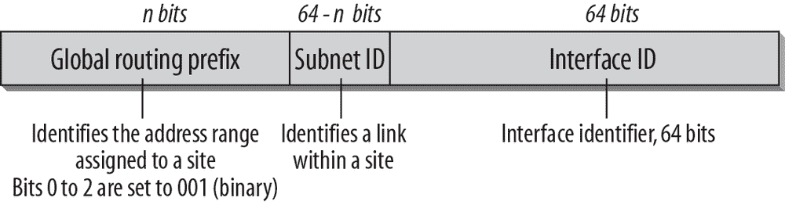图 2-1. 全局单播地址格式

*全局路由前缀*标识分配给站点的地址范围。该部分地址由国际注册服务和互联网服务提供商（ISPs）分配，并具有层级结构。*子网 ID*标识站点内的一个链路。一个链路可以分配多个子网 ID。站点的本地管理员分配该部分地址。*接口 ID*标识子网中的一个接口，并且在该子网内必须唯一。接口 ID 始终为 64 位，因此 IPv6 子网始终为/64 子网。IPv6 不再存在子网掩码问题。

### 国际注册服务和当前地址分配

IPv6 地址的国际分配已经委托给多个区域注册服务：ARIN（美国互联网号码注册中心）负责北美和撒哈拉以南非洲；RIPE NCC（欧洲 IP 网络协调中心）负责欧洲、中东、中亚和北非；APNIC（亚太网络信息中心）负责亚太地区；LACNIC（拉丁美洲和加勒比互联网地址注册中心）负责拉丁美洲。AfriNIC（非洲网络信息中心）于 2005 年开始运营，未来将覆盖非洲地区。

每个注册机构的网站上都有关于地址分配问题、当前实践和程序的信息。

已经进行了多个分配，如表 2-3 所列。

表 2-3. 当前分配

| 前缀 | 分配 | RFC |
| --- | --- | --- |
| 0100::/64 | 丢弃专用地址块 | RFC 6666 |
| 64:ff9b::/96 | IPv4-IPv6 转换器 | RFC 6052 |
| 2000::/3 | 全球单播地址空间  从`2000::/3`空间分配的地址可以在[`bit.ly/ipv6-add`](http://bit.ly/ipv6-add)查看 | RFC 4291 |
| 2001::/32 | Teredo | RFC 4380 |
| 2001:db8::/32 | 仅用于文档目的，不可路由 | RFC 3849 |
| 2002::/16 | 6to4 | RFC 3056 |
| fc00::/7 | 唯一本地地址（ULA） | RFC 4193 |
| fe80::/10 | 链路范围单播 | RFC 4291 |

### 注意

[`www.iana.org/numbers`](http://www.iana.org/numbers)是全球 IP 地址服务、IPv4 和 IPv6 当前地址分配以及如何请求 IPv6 地址服务的重要入口。你还可以在此找到更新的 IANA 特殊用途前缀列表：[`bit.ly/1pDkTzo`](http://bit.ly/1pDkTzo)。

6Bone 操作的地址空间（`3ffe::/16`）在 2006 年 6 月被逐步淘汰，前缀被返回到未分配的地址池中。这个地址空间的创建是为了在 IPv6 地址分配尚未标准化时，允许进行全球范围的 IPv6 测试。由于 IPv6 地址分配已被定义，6Bone 主机已迁移到官方的 IPv6 地址空间。

### 注意

关于如何获取 IPv6 地址空间，请参考第九章中的规划内容。

### 那么，这个地址空间到底有多大呢？

在本章的引言部分，当我们讨论 IPv6 提供了多少个地址时，我曾承诺稍后会做一个例子。现在，我来提供这个例子。

如果 ISP 获得了/32 前缀，这意味着前缀中有 32 位可以由 ISP 或其客户进行管理。

### 注意

想象一下：一个单一的/32 地址块比我们在 IPv4 中曾经拥有的地址空间还要大，因为在 IPv4 中，地址的 32 位包括主机 ID，而在 IPv6 中，每个/64 子网有 64 位用于接口 ID。

这算多吗？显然，比我们在 IPv4 中拥有的要多得多。但我们仍然不知道它到底有多大。

让我们看看 IANA 的 IPv6 地址池。到 2014 年 3 月为止，已经分配了 138,786 个/32 块。如果我们考虑到其中一个块比我们在 IPv4 中曾经拥有的地址空间还要大，那么这个数字看起来相当可观。

### 注意

如果我们计算当前可用的总 IPv6 地址空间（`2000::/3`）中有多少，结果是占 0.026%。

使用 138,786 个/32 块，可以为超过 90 亿个客户分配/48 地址，每个客户可以创建 65,536 个/64 子网。

在[`www.bgpexpert.com/addrspace-ipv6.php`](http://www.bgpexpert.com/addrspace-ipv6.php)上，你可以找到关于 IPv6 分配的最新数据。

因此，我恳请你在开始工作时，将这些数字作为你每天的座右铭。当我们进行 IPv6 地址规划时，其中一个最大挑战就是摆脱那些深深植入我们细胞中的地址节约规则。即使某些做法看起来非常浪费，实际上也许并不是。如果我们必须意识到我们过于浪费了，因为我们在 20 年内使用完了`2000::/3`，我们依然有 7 倍更多的空间可以利用。所以，`2000::/3`仅仅是二进制 001 块，它目前用于全球唯一的单播 IPv6 地址。

### 接口标识符

前缀范围`001`到`111`之间的地址应使用遵循 EUI-64（扩展唯一标识符）格式的 64 位接口标识符（多播地址前缀为`1111 1111`的地址除外）。[EUI-64](http://bit.ly/1mOVk9G)是由电气和电子工程师协会（IEEE）定义的唯一标识符。RFC 4291 的附录 A 解释了如何创建 EUI-64 标识符，更多细节可以在特定的 RFC 中找到，如“IPv6 over Ethernet”或“IPv6 over FDDI”。第五章包含了简短的讨论和这些 RFC 的列表。

在无状态地址自动配置期间，接口使用遵循 EUI-64 格式的标识符。例如，当一个接口通过其 MAC 地址在以太网接口上自动配置链路本地地址时，必须从 48 位（6 字节）以太网 MAC 地址创建 64 位接口标识符。首先，将十六进制数字`0xff-fe`插入到 MAC 地址的第三个字节和第四个字节之间。然后，MAC 地址的第一个字节`0x00`中的第二个低位（universal/local 位）被补充。`0x00`的第二个低位是`0`，补充后变为`1`；因此，MAC 地址的第一个字节变为`0x02`。

因此，IPv6 接口标识符对应于以太网 MAC 地址`00-02-b3-1e-83-29`的是`02-02-b3-ff-fe-1e-83-29`。此示例仅讨论了 EUI-64 创建过程。在无状态地址自动配置期间，还会发生许多其他步骤。

### 注意

要了解 IPv6 无状态地址自动配置如何工作，请参阅第四章。

接口的链路本地地址是前缀`fe80::/64`和一个以 IPv6 冒号十六进制表示的 64 位接口标识符的组合。因此，前述示例接口的基于 MAC 的链路本地地址，具有前缀`fe80::/64`和接口标识符`02-02-b3-ff-fe-1e-83-29`，为`fe80::202:b3ff:fe1e:8329`。此过程如图 2-2 所示，并在 RFC 2464《IPv6 数据包在以太网网络上传输》中有所描述。

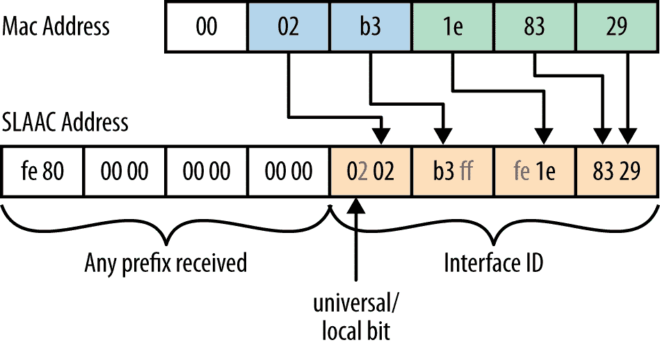图 2-2. MAC 地址如何转换为接口标识符

图中展示了该接口标识符如何与链路本地前缀结合。如图所示，它可以与接收到的任何其他前缀结合。（更多内容请参见第四章，关于邻居发现。）在撰写时，关于是否使用基于硬件信息的接口标识符，存在讨论。更多信息请见下文。

### 地址隐私

使用接口标识符的自动配置 IPv6 地址隐私性是 IPv6 初期在 IETF 中讨论的问题。如果 IPv6 地址是使用 MAC 标识符构建的，那么即使跨网络，你的互联网访问也可能被追踪，因为这个标识符是唯一的，与你的接口相关。需要理解的是，IPv6 节点可以基于接口标识符拥有一个地址，但这并不是必须的。作为替代，IPv6 设备可以拥有类似当前 IPv4 地址的地址，这些地址可以是静态手动配置的，也可以是由 DHCP 服务器动态分配的。RFC 4941《IPv6 无状态地址自动配置的隐私扩展》引入了另一种仅在 IPv6 中使用的地址类型，其中包含一个随机数字，代替硬件地址。这个接口 ID 也可以随着时间的推移而变化。有时它也被称为*临时地址*。它是在 EUI-64 接口 ID 之外生成的。临时地址用于外发通信，而基于 EUI-64 的地址用于服务器功能和传入连接。

作为 IP 通信目标的互联网设备——例如，Web 或 FTP 服务器——需要一个唯一且稳定的 IP 地址。但运行浏览器或 FTP 客户端的主机则不需要每次连接互联网时都使用相同的地址。一些 DHCPv6 实现支持根据 RFC 4941 生成随机接口标识符。通过这种方式，它们使用 DHCPv6 管理地址空间，但防止任何人进行拓扑映射或追踪其节点。

在 IPv6 的地址架构中，你可以选择两种类型的地址：

*唯一稳定的 IP 地址*

通过手动配置、DHCP 服务器或使用 EUI-64 接口标识符的无状态地址自动配置分配，或者使用永久 IID 创建的其他地址类型（见下文）。

*临时过渡性 IP 地址*

使用定期变化的随机数字分配，并可以作为稳定接口标识符的替代。

虽然临时隐私地址通过增加窃听者和其他信息收集者（例如日志文件、头部信息）关联主机活动的难度提供了一些安全性，但它们在其他领域可能会带来挑战。从网络管理的角度来看，临时地址增加了事件日志记录、故障排除、访问控制和服务质量的复杂性。因此，一些组织即使牺牲了隐私，也禁用了临时地址的使用。为了确保地址稳定且不频繁变化（如隐私地址所做的那样），RFC 7217 中定义了稳定隐私地址，《一种生成语义不透明接口标识符的 IPv6 无状态地址自动配置方法》。其目标是使 IPv6 地址在子网内稳定，但在主机从一个网络迁移到另一个网络时会发生变化，并且不基于任何硬件标识符。此方法适用于主机可能使用的所有前缀，如链路本地、全局或唯一本地地址。

与此同时，目前（截至 2014 年初）有一份名为《稳定 IPv6 接口标识符建议》（*draft-ietf-6man-default-iids-00*）的草案正在讨论。该草案建议使用不基于硬件标识符的稳定 SLAAC 地址。如前所述，已经有人提出将硬件信息嵌入 IPv6 地址中会带来安全和隐私风险。草案《IPv6 地址生成机制的隐私考虑》（*draft-ietf-6man-ipv6-address-generation-privacy-01.txt*）对每种接口 ID 生成选项的利弊进行了很好的讨论。

### 注意

请注意，在考虑所有这些因素时，接口 ID 并不是唯一用于追踪用户的方法。DNS 名称、Cookie、浏览器指纹和应用层用户名都可以用来将主机的活动关联在一起。

## 特殊地址

我们需要讨论一些特殊地址。IPv6 地址空间的第一部分以`0000 0000`为前缀，该部分被保留。在这个前缀中，已经定义了一些特殊地址：

*未指定地址*

未指定地址的值为`0:0:0:0:0:0:0:0`，因此也称为*全零地址*。它与 IPv4 中的`0.0.0.0`类似。它表示缺少有效地址，例如，在启动过程中，主机在发送地址配置请求时，可以使用该地址作为源地址。如果应用本章前面讨论的记法规范，未指定地址也可以简写为`::`。它永远不应静态或动态分配给接口，且不应出现在目标 IP 地址或 IPv6 路由头中。有时它在软件配置文件中被使用，告诉程序使用接口上配置的任何 IPv6 地址。

*回环地址*

`127.0.0.1`这个 IPv4 回环地址你可能很熟悉。它在故障排除和测试 IP 协议栈时非常有用，因为可以用来将数据包发送到协议栈，而无需将其发送到子网。对于 IPv6，回环地址的作用相同，表示为`0:0:0:0:0:0:0:1`，简写为`::1`。它不应被静态或动态地分配给接口。

接下来的部分将描述为与不同过渡机制一起使用而被指定的不同类型的地址，这些地址可以在向 IPv6 迁移的过程中使用。这些虚拟接口通常称为*伪接口*。

### 注意

有关过渡机制的描述可以在第七章中找到。

### 带有嵌入 IPv4 地址的 IPv6 地址

由于向 IPv6 的过渡将是渐进的，因此为与 IPv4 兼容而定义了两种特殊类型的地址。两者均在 RFC 4291 中有所描述：

*IPv4 兼容的 IPv6 地址（已弃用）*

这种类型的地址用于通过 IPv4 路由基础设施动态隧道 IPv6 数据包。使用这种技术的 IPv6 节点会被分配一个特殊的 IPv6 单播地址，其中低位 32 位包含一个 IPv4 地址。到目前为止，这种地址类型很少被使用，并且在 RFC 4291 中已被弃用。新的或更新的实现将不再需要支持这种类型的地址。

*IPv4 映射的 IPv6 地址*

这种类型的地址用于将 IPv4-only 节点的地址表示为 IPv6 地址。IPv6 节点可以使用该地址将数据包发送到 IPv4-only 节点。该地址还在地址的低位 32 位中携带 IPv4 地址。

图 2-3 显示了这两种地址的格式。

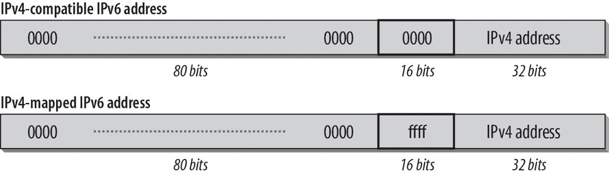图 2-3. 带有嵌入 IPv4 地址的 IPv6 地址的格式

这两种地址几乎相同，唯一的区别是中间的 16 位。当它们设置为 0 时，该地址为 IPv4 兼容的 IPv6 地址；如果这些位设置为 1，则为 IPv4 映射的 IPv6 地址。

### 6to4 地址

IANA 已经永久分配了一个 13 位的 TLA 标识符，用于 6to4 操作，属于全球单播地址范围（001）。6to4 是定义的一种机制，用于让 IPv6 主机或网络通过仅支持 IPv4 的基础设施进行通信。我在第七章中描述了 6to4，并且它在 RFC 3056 中有所规定。6to4 的 TLA 标识符是`0x0002`。地址格式见图 2-4。

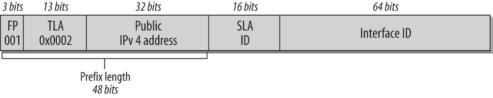图 2-4. 6to4 地址的格式

前缀的总长度为 48 位。前缀中的 IPv4 地址必须是一个公共的 IPv4 地址，并以十六进制表示。例如，如果你为 6to4 配置一个接口，并且该接口的 IPv4 地址为 `62.2.84.115`，则 6to4 前缀为 `2002:3e02:5473::/48`。通过这个接口，所有在该链路上的 IPv6 主机都可以通过 IPv4 基础设施隧道传输它们的包。

### 注意

6to4 规范是在全球单播地址格式根据 RFC 2374 为当前时，编写的，因此它使用了旧的术语和格式（格式前缀、TLA、SLA）。

### 6rd 地址

2010 年发布了一项名为 6rd（IPv6 快速部署）的规范。它在 第七章中进行了描述，并在 RFC 5969 中进行了规范。地址格式基于 6to4，并显示在 图 2-5 中。

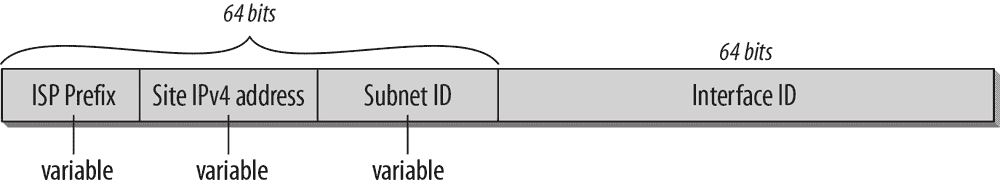图 2-5. 6rd 地址格式

地址的主要区别在于，6rd 不使用像 6to4 那样的特殊前缀，也没有像 /48 这样的固定边界。前缀的总长度为 64 位，并分为 ISP 前缀和站点的 IPv4 地址。如图所示，这两部分的长度是可变的。如果提供商使用他的 /32 前缀并添加站点的完整 IPv4 地址，他最终会为客户分配 /64 子网。在大多数情况下，不推荐这样做。即使是家庭站点，未来也需要多个子网。根据 ISP 的环境、地址架构和客户结构，设计 6rd 地址有很多种方式。一个选择是，如果 ISP 有 /28 前缀，他可以添加 32 位的 IPv4 地址，并向客户分配 /60 前缀。或者，如果他的 IPv4 地址规划允许在一个 /8 前缀（客户的 IPv4 地址）中聚合客户，则 6rd 前缀的大小将是以下之一：

+   如果提供商有 /28 前缀（28 + 24 用于聚合客户 IPv4 块），则为 /52。

+   如果提供商有 /32 前缀（32 + 24 用于聚合客户 IPv4 块），则为 /56。

在多个地区，如 RIPE 和 ARIN，正在进行讨论，旨在通过向 ISP 分配更大的 6rd 前缀来简化这一过程。

### 注意

这里的重点是分配前缀给家庭用户，以便他们可以拥有多个子网。有关区域注册表政策和家庭网络的描述，请参阅 第九章。

### ISATAP 地址

*站内自动隧道地址协议*（ISATAP）是一种自动隧道机制，在 RFC 5214 中进行了规范。它为通过仅支持 IPv4 的基础设施分隔的双栈节点设计。它将 IPv4 网络视为一个大型链路层网络，并允许这些双栈节点使用任何形式的 IPv4 地址自动在彼此之间隧道传输。ISATAP 使用`0xFE`的类型标识符来指定带有嵌入 IPv4 地址的 IPv6 地址。ISATAP 地址的格式如图 2-6 所示。

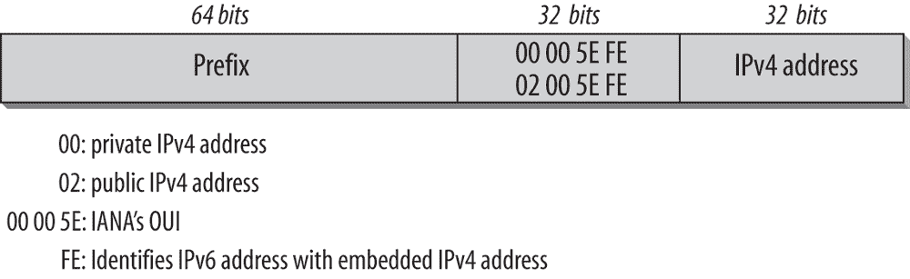图 2-6. ISATAP 地址格式

前 64 位遵循全局单播地址的格式。IANA 拥有 IEEE 组织唯一标识符（OUI）`00-00-5E`，并在该 OUI 内指定了 EUI-48 格式的接口标识符分配。在前 16 位中，一个类型标识符表示 IPv4 地址是来自私有范围（`0000`）还是全局唯一地址（`0200`）。接下来的 8 位包含一个类型标识符，用于表明这是一个带有嵌入式 IPv4 地址的 IPv6 地址。该类型标识符是`0xFE`。最后 32 位包含嵌入的 IPv4 地址，该地址可以用点分十进制表示法或十六进制表示法写出。

假设我们有一个 IPv4 地址为`192.168.0.1`的主机，并且该主机被分配了一个 64 位前缀`2001:db8:510:200::/64`。该主机的 ISATAP 地址为`2001:db8:510:200:0:5efe:192.168.0.1`。或者，你也可以使用 IPv4 地址的十六进制表示形式，此时地址写作`2001:db8:510:200:0:5efe:c0a8:1`。该主机的链路本地地址为`fe80::5efe:192.168.0.1`。

### Teredo 地址

*Teredo*是一种旨在为位于一个或多个 NAT 后面的主机提供 IPv6 连接性的机制。其通过在 UDP 中隧道传输 IPv6 数据包来实现。该机制包括 Teredo 客户端、服务器和中继。Teredo 中继是位于 Teredo 服务和本地 IPv6 网络之间的 IPv6 路由器。Teredo 在 RFC 4380 中进行了规范。原本预期这一服务会广泛应用，直到 ISP 升级到本地 IPv6 服务。但当前的互联网统计数据显示，情况并非如此。你可以参考[Google 统计](http://www.google.com/ipv6/statistics.html)，查看代表 6to4 和 Teredo 流量的红线如何下降到几乎为零。

一个 Teredo 地址的格式如图 2-7 所示。

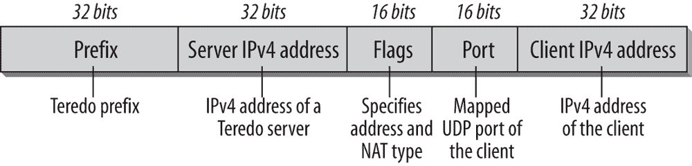图 2-7. Teredo 地址格式

该前缀的长度为 32 位。全球 Teredo IPv6 服务前缀是`2001:0000:/32`。服务器 IPv4 地址字段的长度为 32 位，包含 Teredo 服务器的 IPv4 地址。标志字段长度为 16 位，指定所使用的地址类型和 NAT 类型。16 位端口字段包含 Teredo 服务在客户端的映射 UDP 端口，客户端 IPv4 地址字段包含客户端的映射 IPv4 地址。在这种格式中，客户端的映射 UDP 端口和映射 IPv4 地址都会被混淆：地址和端口号中的每一位都会被反转。

### 注意

要了解 IPv6 和 IPv4 如何通过这些地址共存，请参考第七章。

### 加密生成地址

为了增加邻居发现（ND）的安全性，RFC 3972 定义了加密生成地址（CGA）。RFC 3972 已经被 RFC 4581 和 4982 更新。CGA 包含了公共密钥的加密哈希，作为接口 ID 的一部分。相应的私钥可以用来签署从该地址发送的消息。这可以防止攻击者接管一个 IPv6 地址，并可在没有公钥基础设施（PKI）的环境中使用。

## 链路本地地址和唯一本地 IPv6 地址

在 IPv4 中，组织通常使用 RFC 1918 定义的私有地址范围中的 IP 地址。保留用于私有用途的地址永远不应通过互联网路由器转发，而应限制在组织的网络内部。为了连接到互联网，网络地址转换（NAT）将内部私有地址映射到公开注册的 IPv4 地址。

最初的 IPv6 规范为链路本地和站点本地用途分配了两个独立的地址空间（作用域），并通过它们的前缀来标识。这些站点本地地址的前缀是`fec0::/10`。

### 注意

站点本地地址已在 RFC 3879 中被弃用。由于该地址在应用过程中出现了过多潜在问题，因此被替换为唯一本地 IPv6 地址，也叫做 ULA（见下文）。

*链路本地*地址用于单一链路，并且不应被路由。它不需要全球前缀，可以用于自动配置机制、邻居发现以及没有路由器的网络，因此它对于创建临时网络非常有用。假设你在会议室遇到你的朋友，并且你想要分享计算机中的文件。你可以通过无线网络或在以太网接口之间使用交叉电缆连接计算机，利用链路本地地址共享文件，而无需任何特殊配置。

站点本地地址的替代方案称为*唯一本地 IPv6 单播地址(ULA)*，简称*本地 IPv6 地址*。该地址在 RFC 4193 中有详细说明。这些地址是全球唯一的，但不应路由到全球互联网。它们旨在用于公司站点或有限的网络集内。

唯一本地 IPv6 单播地址的特点如下：

+   拥有一个唯一的全球前缀，允许在网络边界进行过滤

+   允许网络之间的私密连接，而不必担心地址冲突和重新编号其中一个站点的后果

+   与 ISP 无关

+   可以在没有互联网连接的情况下用于内部通信

+   可以像常规全球单播地址一样供应用程序使用

这些地址的格式见图 2-8.

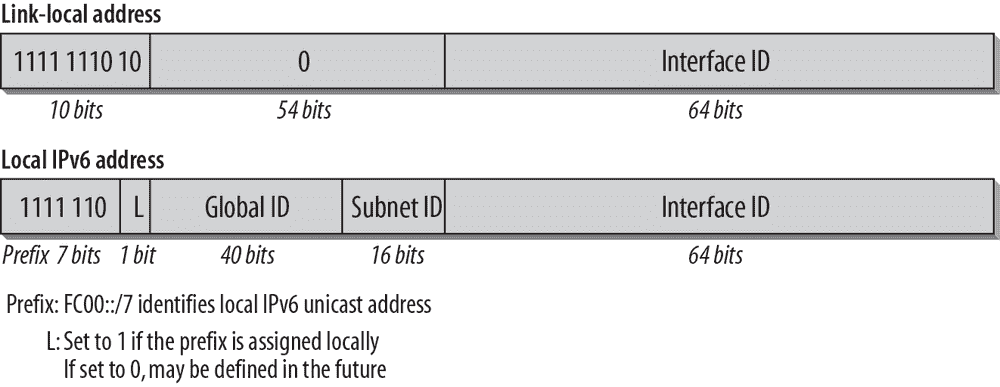图 2-8. 链路和站点本地地址格式

在十六进制表示法中，链路本地地址由前缀`fe80::/10`标识。对于唯一本地 IPv6 地址，RFC 4193 指定了`fc00::/7`的前缀。第 8 位目前设置为`1`，表示该前缀由本地管理。将第 8 位设置为`0`可能在未来用于中心化管理的地址。目前，已决定只标准化本地分配的版本。如果未来确实有强烈需求，可能会定义中心化分配的形式。

### 注意

与此同时，你可以使用[Sixxs 非官方注册网站](http://www.sixxs.net/tools/grh/ula/)进行查询。你还可以在那里找到其他有用的 IPv6 信息和工具。

对于本地管理地址，目前我们使用的十六进制前缀是`fd00::/8`。它后面跟着 40 位的全球 ID，该 ID 是随机生成的，以确保具有较高的唯一性；16 位用于子网 ID；64 位用于接口标识符。如果你使用的是较旧的实现，仍然可能会看到已弃用的站点本地地址，其前缀为`fec0::/10`，但新实现或部署应避免使用此地址，而应替换为全球单播地址或 ULA。

确保你的全球 ID 是使用 RFC 4193 中定义的*伪随机全球 ID 算法*生成的。此算法包括时间、硬件标识符以及其他系统特定的值等。这是为了确保你的前缀是唯一的，并且在将你的网络与任何其他 ULA 网络合并时，不会发生 ULA 冲突。

如前所述，这些本地地址不应路由到互联网上。边界路由器应配置为过滤这些前缀。本地地址不应出现在全球 DNS 服务器中。它们可以在你自己的内部私有 DNS 服务器上使用。

链路本地地址 (`fe80::/10`) 默认通过自动配置分配。ULA 必须通过在路由器上配置本地前缀（路由器广告）或通过 DHCPv6 进行分配。

### 注意

如果你对弃用站点本地地址的原因感兴趣，请参考 RFC 3879\. 在第九章中找到关于是否以及何时使用 ULA 的讨论。

## Anycast 地址

Anycast 地址旨在提供冗余和负载均衡，适用于多个主机或路由器提供相同服务的情况。Anycast 并非为 IPv6 设计；它在 1993 年由 RFC 1546 定义，为 IPv4 提供了一种实验性规范。该 RFC 为 Anycast 分配了一个特殊前缀，使得 Anycast 地址可以根据前缀被识别出来。Anycast 主要用于 DNS 和 HTTP 等服务。该 RFC 讨论了针对这些不具有全球唯一性的地址可能对 TCP 进行的修改。

实际上，Anycast 并没有按预期那样实现。通常会选择一种叫做*共享单播地址*的方法。这种方法通过将一个常规单播地址分配给多个接口，并在路由表中创建多个条目来实现。在这种情况下，网络层和传输层假定它是一个全球唯一的 IP 地址。如果它不是，处理歧义地址的机制需要集成到应用程序中。这个规则的一个例外是如果应用程序使用独立的无状态请求/应答事务——例如，DNS over UDP。互联网中的根 DNS 服务器是通过共享单播地址设置的。由于该过程不需要网络层的任何支持，因此它也可以与 IPv6 一起使用。

从一开始，IPv6 开发者就考虑将 Anycast 纳入网络层，按照 RFC 1546 的定义。没有分配特殊前缀。IPv6 Anycast 地址与全局单播地址处于相同的地址范围内，并且每个参与的接口都必须配置有 Anycast 地址。在包含相同 Anycast 地址的接口所在的区域内，每个主机必须作为路由表中的一个单独条目进行广告。

在一个网络中，如果一组路由器可以提供访问共同的路由域，它们可以分配一个单一的地址。当客户端将数据包发送到此地址时，它将被转发到下一个可用的路由器。一个例子是 RFC 3068 中指定的 6to4 中继 Anycast 地址，并在第七章中进行了描述。移动 IPv6 规范也使用 Anycast 地址。

使用任何播送地址时，我们必须意识到发送者无法控制数据包将被送达哪个接口。这个决定是在路由协议层面做出的。当发送者向任何播送地址发送多个数据包时，由于路由表的不稳定或在请求期间发生的变化，数据包可能到达不同的目的地。如果存在一系列的请求和应答，或者数据包必须被分段，这可能会导致问题。

*子网路由器任何播送地址*，定义在 RFC 4291 中，并在图 2-9 中展示，是一个必需的任何播送地址。

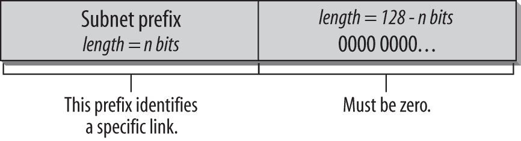图 2-9. 子网路由器任何播送地址的格式

基本上，这个地址看起来像是一个常规的单播地址，前缀指定了子网，标识符设置为全零。发送到该地址的数据包将被送达该子网上的一个路由器。所有路由器都需要支持子网路由器任何播送地址，才能支持它们有接口的子网。

保留的子网任何播送地址可以有两种格式，如图 2-10 所示。

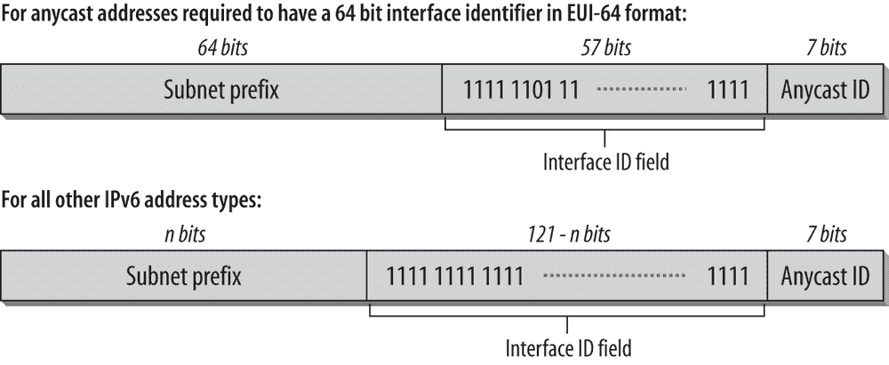图 2-10. 任何播送地址的一般格式

RFC 2526 规定，在每个子网内，最高的 128 个接口标识符值保留作为子网任何播送地址分配。目前，已预留的任何播送 ID 列表请参见表 2-4。

表 2-4. 保留的任何播送 ID

| 十进制 | 十六进制 | 描述 |
| --- | --- | --- |
| 127 | 7F | 保留 |
| 126 | 7E | 移动 IPv6 主代理的任何播送 |
| 0–125 | 00–7D | 保留 |

这种使用任何播送的形式与共享单播地址的主要区别在于，后者需要应用程序支持任何播送，而前者则尽量避免这种支持。如果需要，应该提供如何使用此方式的指南，并对现有的有状态传输协议进行修改。

### 注意

如果你对任何播送（anycast）有兴趣，想了解更多信息和背景，参考 RFC 7094，"IP Anycast 的架构考虑"。它提供了任何播送的历史概述，讨论了不同的架构模型和原理，并涵盖了 IPv6 中的任何播送及部署注意事项。

## 组播地址

本节介绍了组播地址格式。有关组播和组播监听发现（MLD）的描述，参见第四章。有关组播主题的一般概述和总结，请参见第五章.

组播地址是一个标识符，用于标识一组节点，这些节点的高字节为`ff`，即二进制表示为`1111 1111`（参见本章前面的表 2-2）。组播前缀为`ff00::/8`。一个节点可以属于多个组播组。当数据包发送到组播地址时，组播组的所有成员都将处理该数据包。IPv4 中也存在组播，但 IPv6 中的组播经过重新定义和改进。组播地址格式如图 2-11 所示。

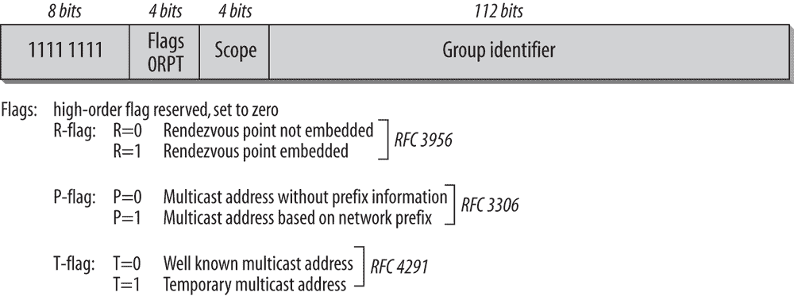图 2-11. 组播地址格式

第一个字节标识该地址为组播地址。接下来的四位用于标识标志位，定义如下：标志字段的第一个比特必须为零，保留供未来使用。第二个比特表示该组播地址是否包含*会合点*。会合点是组播网络中某一特定组播流的分发点（参见 RFC 3956）。第三个比特表示该组播地址是否包含前缀信息（本章稍后讨论；另见 RFC 3306）。标志字段的最后一位表示该地址是否为永久分配——即由 IANA 分配的知名组播地址，或临时组播地址。最后一位为零时定义为知名地址，为一时则表示临时地址。作用域字段用于限制组播地址的范围。可能的值请参见表 2-5。

表 2-5. 作用域字段的值

| 值 | 描述 |
| --- | --- |
| 0 | 保留 |
| *1* | *接口本地范围（在早期规范中曾称为节点本地范围）* |
| *2* | *链路本地范围* |
| 3 | 保留 |
| 4 | 管理本地范围 |
| *5* | *站点本地范围* |
| 6, 7 | 未分配 |
| 8 | 组织本地范围 |
| 9, A, B, C, D | 未分配 |
| *E* | *全局范围* |
| F | 保留 |

范围的边界（除接口本地、链路本地和全局之外）必须由网络管理员定义和配置。保留的范围不应使用。RFC 4007《IPv6 作用域地址架构》定义了不同作用域 IPv6 地址的架构特性、预期行为、文本表示和使用方法。

### 知名组播地址

根据 RFC 4291，地址的最后 112 位携带组播组 ID。RFC 3307《IPv6 组播地址分配指南》参考了一个 32 位的组 ID。

RFC 2375 定义了永久分配的 IPv6 组播地址的初始分配。某些分配是为固定作用域做的，而某些分配则在所有作用域上有效。 表 2-6 给出了为固定作用域分配的地址的概览。请注意，在紧随 `ff`（第一个字节）之后的字节中列出的作用域值，这些值列在 表 2-5 中。

表 2-6. 知名组播地址

| 地址 | 描述 |
| --- | --- |
| **接口-local 作用域** |  |
| ff01::1 | 所有节点地址 |
| ff01::2 | 所有路由器地址 |
| ff01::fb | mDNSv6 |
| **链路-local 作用域** |  |
| ff02::1 | 所有节点地址 |
| ff02::2 | 所有路由器地址 |
| ff02::4 | DVMRP 路由器 |
| ff02::5 | OSPFIGP |
| ff02::6 | OSPFIGP 指定路由器 |
| ff02::7 | ST 路由器 |
| ff02::8 | ST 主机 |
| ff02::9 | RIP 路由器 |
| ff02::a | EIGRP 路由器 |
| ff02::b | 移动代理 |
| ff02::d | 所有 PIM 路由器 |
| ff02::e | RSVP 封装 |
| ff02::16 | 所有支持 MLDv2 的路由器 |
| ff02::6a | 所有嗅探器 |
| ff02::fb | mDNSv6 |
| ff02::1:1 | 链路名称 |
| ff02::1:2 | 所有 DHCP 代理 |
| ff02::1:3 | 链路-local 多播名称解析 (LLMNR) |
| ff02::1:4 | DTCP 公告 |
| ff02::1:ffXX:XXXX | 请求节点地址 |
| ff02::2:ff00::/104 | 节点信息查询 |
| **站点-local 作用域** |  |
| ff05::2 | 所有路由器地址 |
| ff05::fb | mDNSv6 |
| ff05::1:3 | 所有 DHCP 服务器 |
| ff05::1:1000 到 ff05::1:13ff | 服务位置 (SLP) 版本 2 |

来自 RFC 2375 的术语 *node-local scope* 已更改为 *interface-local scope*，因此你可能会遇到这两个术语。与作用域无关的永久分配组播地址的列表较长，并且可以在 附录 B 和 RFC 2375 中找到。所有这些地址的开头都是 `ff0X`，`X` 是一个可变作用域值的占位符。

IPv4 广播地址被链路-local 所有节点多播地址 `ff02::1` 替代。

### 注意

在此查看最新的组播地址分配列表: [`www.iana.org/assignments/ipv6-multicast-addresses`](http://www.iana.org/assignments/ipv6-multicast-addresses)。

举个例子，我们来看 RFC 2373 中描述的一个例子。为所有 NTP 服务器定义了一个组播组 ID。该组播组 ID 为 `0x101`。这个组 ID 可以与不同的作用域值一起使用，如下所示：

`ff01::101`

发送方所在节点的所有 NTP 服务器。

`ff02::101`

发送方所在链路的所有 NTP 服务器。

`ff05::101`

发送方所在站点的所有 NTP 服务器。

`ff0e::101`

互联网上的所有 NTP 服务器。

临时分配的组播地址仅在定义的作用域内有意义。

### 注意

多播地址不应作为 IPv6 数据包中的源地址使用，也不应出现在任何路由头中。

在多播管理方面，IPv6 使用基于 ICMPv6 的多播监听器发现（MLD）。

### 注意

要了解多播地址的管理方式，请参考第四章中的多播监听器发现。若要获得关于多播的概述和总结，请参考第五章.

### 请求节点多播地址

*请求节点多播地址*是每个节点必须为其分配的每个单播和任何播地址加入的多播地址。它用于邻居发现，详细内容见第四章。RFC 4291 规定了请求节点多播地址。

在 IPv4 网络中，ARP 请求（用于确定接口的 MAC 地址）会发送到 MAC 层广播地址，因此会被链路上的每个接口检查。而在 IPv6 网络中，接口的 MAC 地址解析是通过发送邻居请求消息（在第四章中讨论）到请求节点多播地址来完成的，而不是发送到链路本地所有节点的多播地址。这样，只有注册到该多播地址的节点才会检查该数据包。

这个地址是通过取一个 IPv6 地址的低 24 位（主机 ID 的最后一部分），并将这些位附加到已知前缀 `ff02:0:0:0:0:1:ff00::/104` 后形成的。因此，请求节点多播地址的范围从 `ff02:0:0:0:0:1:ff00:0000` 到 `ff02:0:0:0:0:1:ffff:ffff`。

例如，我们的主机 Marvin 拥有 IPv6 地址 `fe80::202:b3ff:fe1e:8329`。对应的请求节点多播地址是 `ff02::1:ff1e:8329`。如果该主机还有其他 IPv6 单播或任何播地址，每个地址都会有一个对应的请求节点多播地址，主机必须注册该地址。

### 将多播地址映射到 MAC 地址

当一个数据包发送到一个 IPv6 多播地址时，必须将该 IPv6 地址映射到链路层的 MAC 地址。以太网 MAC 多播地址的格式在 RFC 2464 中有规定。IPv6 MAC 多播地址的前两个字节是 `0x3333`。接下来的四个字节对应于 IPv6 多播地址的最后四个字节。

图 2-12 展示了多播地址如何映射到 MAC 地址。

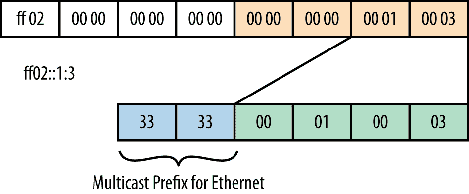图 2-12. IPv6 多播地址的 MAC 表示

`ff02::1:3` 的链路本地作用域多播地址映射到 MAC 地址 `33:33:00:01:00:03`。其他媒体类型的映射在单独的 RFC 中进行了说明。您可以在 第五章 中找到有关其他媒体类型的更多信息，或通过搜索 RFC 数据库。

### 多播地址的动态分配

多播地址架构在 RFC 3306 中得到了扩展。它包含允许基于单播前缀地址和源特定多播地址分配的定义。它基于一种修改过的多播地址格式，其中包含前缀信息。此规范的目标是减少分配多播地址所需的协议数量。

图 2-13 显示了扩展多播地址的格式。

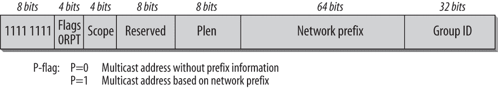图 2-13. 扩展多播地址的格式

在原始规范中，标志字段仅使用最后一位（T）来指定多播地址是已知地址还是临时地址。这里显示的扩展格式使用倒数第二位（P）来指示多播地址分配是否基于网络前缀（值为 1）或不是（值为 0）。P 设置为 1 表示这是一个遵循扩展格式的多播地址。作用域字段的使用没有变化。如果 P 标志设置为 1，则作用域字段后的八位被保留并设置为 0。接下来的八位（PLen）指定前缀字段中的前缀长度。如果前缀长度小于 64 位，则前缀字段中的未使用位应设置为 0。组 ID 使用 32 位。注意，当 P 设置为 1（扩展多播地址）时，T 标志也应设置为 1（临时多播地址）。

多播监听者发现（MLD）用于多播管理。它有两个版本，MLDv1 和 MLDv2。MLDv2 支持*源特定多播*。有关源特定多播的概述，请参阅 RFC 3569。在传统的多播模型中，称为任意源多播（ASM），多播监听者无法控制它想接收的数据源。而在源特定多播（SSM）中，一个接口可以注册一个多播组，并指定数据的源(s)。SSM 可以通过 MLDv2 和扩展的多播地址格式实现。

对于源特定多播地址，T 和 P 标志都设置为 1。前缀长度和网络前缀都设置为 0。这将导致一个多播前缀 `ff3x:/32`，其中 `x` 是作用域值。IPv6 头中的源地址标识多播地址的所有者。所有 SSM 地址的格式为 `ff3X::/96`。

### 注

有关更多信息，请参阅 RFC 3307，“IPv6 多播地址分配指南”。

RFC 4489《链路范围组播地址格式》定义了 IPv6 协议的组播寻址架构的扩展。该扩展允许使用接口标识符来分配链路本地范围的组播地址。在这个组播地址中，标志字段被设置为二进制 `0011`；作用域字段被设置为 2，表示链路本地作用域；pLen 字段被设置为 `ff`（全是 1 的二进制）；网络 ID 字段的 64 位用于接口标识符。组 ID 生成以指示组播应用，并且只需在该主机上唯一。它设计用于使用链路本地范围组播地址的环境。

## 必需的地址

标准规定，每个主机必须分配以下地址来标识自己：

+   每个接口的链路本地地址

+   所有分配的单播和任何播地址

+   回环地址

+   所有节点的组播地址

+   为其分配的每个单播和任何播地址的请求节点组播地址

+   主机所属的所有其他组的组播地址

路由器需要识别所有上述地址，并且还需要识别以下地址：

+   配置为在每个链路上作为路由器工作的接口的子网路由器任何播地址

+   路由器已配置的所有任何播地址

+   所有路由器的组播地址

+   路由器所属的所有其他组的组播地址

## 默认地址选择

IPv6 的架构允许一个接口拥有多个地址。这些地址可能在作用域（链路本地、全球）或状态（首选、过时）上有所不同；它们可能是移动性（家庭地址、临时地址）或多宿主情况的一部分；也可能是永久的公共地址或虚拟隧道接口。双栈主机具有 IPv6 和 IPv4 地址。结果是，IPv6 实现需要发起连接时，通常面临从多个源地址和目的地址中做出选择的情况。

假设有这样一种情况，一个客户端发出对外部服务的 DNS 请求，并接收到一个全球 IPv6 地址和一个公共 IPv4 地址。如果该客户端有一个私有 IPv4 地址和一个全球 IPv6 地址，那么使用 IPv6 访问该外部服务是有意义的。但如果该客户端有一个隧道化的 IPv6 地址和一个公共 IPv4 地址，则应选择 IPv4 地址来连接服务。这些是在未来混合网络环境中需要处理的情况和选择，一些是仅支持 IPv4 的，另一些是仅支持 IPv6 的，还有一些是双栈的。如何处理这些情况取决于具体的实现。应用程序开发人员需要意识到这一点，并尽力提供能够使应用程序在每种可能的环境中都能表现最佳的机制。

RFC 6724, “IPv6 的默认地址选择”定义了两个通用算法，一个用于源地址选择，另一个用于目标地址选择。所有 IPv6 节点（主机和路由器）都必须实现 RFC 6724。该算法指定了 IPv6 节点的默认行为。该算法不覆盖应用程序、上层协议或其他策略做出的选择。该 RFC 包含一个策略表，类似于路由表，是一个最长匹配前缀查找表。为每个列出的前缀分配一个*优先级*和一个*标签*。优先级用于对目标地址进行排序；标签值用于定义将特定源地址与给定目标地址关联的策略。

下面是最重要规则的总结：

+   相同作用域或类型（链路本地、全球）的地址对优先。

+   目标地址的作用域越小越优先（使用最小的作用域）。

+   优先选择首选（非弃用）地址。

+   如果有原生 IPv6 地址可用，则不使用过渡地址（例如 ISATAP 或 6to4 地址）。

+   如果所有标准相似，则优先选择具有最长公共前缀的地址对。

+   优先选择外向接口。

+   优先选择由下一跳广告的前缀中的地址。

+   优先匹配标签。

+   对于源地址，临时地址优先于公共地址。

+   使用最长匹配前缀。

+   在移动 IP 环境中，家庭地址优先于照看地址。

简而言之，默认表格优先选择原生 IPv6 地址，其次是原生 IPv4 地址，再次是 NAT 转换后的 IPv4 地址，最后是 6to4 和其他隧道。

### 注意

RFC 6724 中的规则在没有其他规定时应被使用。实现应提供机制，以覆盖默认策略，并根据网络的具体情况单独配置地址选择。RFC 7078 定义了一个 DHCP 选项，允许管理员分发覆盖 RFC 6724 默认策略的地址选择策略。

现在你已经熟悉了扩展的地址空间和 IPv6 地址类型，下一章将讨论 IPv6 头部和扩展头部。

## 参考文献

以下是本章中提到的最重要的 RFC 和草案的列表。有时我还会为你个人的进一步学习，加入一些与主题相关的附加 RFC。

### RFC 文档

+   RFC 1546, “主机任播服务”，1993 年

+   RFC 1918, “私人互联网地址分配”，1996 年

+   RFC 2101, “今天的 IPv4 地址行为”，1997 年

+   RFC 2365, “管理员作用域的 IP 多播”，1998 年

+   RFC 2464, “IPv6 数据包通过以太网网络的传输”，1998 年

+   RFC 2471, “IPv6 测试地址分配（6Bone）”，1998 年

+   RFC 2526, “保留的 IPv6 子网任播地址”，1999 年

+   RFC 2710, “IPv6 的多播监听发现（MLD）”，1999 年

+   RFC 2908, “互联网多播地址分配架构”，2000 年

+   RFC 3056, “通过 IPv4 云连接 IPv6 域”（6to4），2001 年

+   RFC 3068，“用于 6to4 转发路由器的任何播前缀”，2001 年

+   RFC 3306，“基于单播前缀的 IPv6 多播”，2002 年

+   RFC 3307，“IPv6 多播地址的分配指南”，2002 年

+   RFC 3569，“源特定多播（SSM）概述”，2003 年

+   RFC 3587，“IPv6 全球单播地址格式”，2003 年

+   RFC 3590，“多播监听器发现（MLD）协议的源地址选择”，2003 年

+   RFC 3810，“IPv6 多播监听器发现版本 2（MLDv2）”，2004 年

+   RFC 3849，“IPv6 文档地址”，2004 年

+   RFC 3879，“弃用站点本地地址”，2004 年

+   RFC 3956，“在 IPv6 多播地址中嵌入会合点（RP）地址”，2004 年

+   RFC 3972，“加密生成地址（CGA）”，2005 年

+   RFC 4007，“IPv6 范围地址架构”，2005 年

+   RFC 4192，“无需标志日的 IPv6 网络重新编号程序”，2005 年

+   RFC 4193，“唯一本地 IPv6 单播地址”，2005 年

+   RFC 4291，“IPv6 地址架构”，2006 年

+   RFC 4380，“Teredo：通过网络地址转换（NAT）在 UDP 上隧道 IPv6”，2006 年

+   RFC 4489，“生成链路范围 IPv6 多播地址的方法”，2006 年

+   RFC 4581，“加密生成地址（CGA）扩展字段格式”，2006 年

+   RFC 4795，“链路本地多播名称解析（LLMNR）”，2007 年

+   RFC 4941，“IPv6 无状态地址自动配置的隐私扩展”，2007 年

+   RFC 4982，“加密生成地址（CGA）中对多种哈希算法的支持”，2007 年

+   RFC 5156，“特殊用途 IPv6 地址”，2008 年

+   RFC 5214，“站内自动隧道地址协议（ISATAP）”，2008 年

+   RFC 5375，“IPv6 单播地址分配注意事项”，2008 年

+   RFC 5453，“保留的 IPv6 接口标识符”，2009 年

+   RFC 5569，“IPv6 在 IPv4 基础设施上的快速部署（6rd）”，2010 年

+   RFC 5952，“IPv6 地址文本表示的建议”，2010 年

+   RFC 5991，“Teredo 安全更新”，2010 年

+   RFC 6052，“IPv4/IPv6 转换器的 IPv6 地址分配”，2010 年

+   RFC 6081，“Teredo 扩展”，2011 年

+   RFC 6085，“以太网上的 IPv6 多播数据包地址映射”，2011 年

+   RFC 6164，“在路由器间链路上使用 127 位 IPv6 前缀”，2011 年

+   RFC 6177，“IPv6 地址分配给最终站点”，2011 年

+   RFC 6724，“IPv6 默认地址选择”，2012 年

+   RFC 7078，“通过 DHCPv6 分发地址选择策略”，2014 年

+   RFC 7094，“IP Anycast 的架构考虑”，2014 年

+   RFC 7108，“L-Root 部署的各种机制总结，用于识别任何播节点”，2014 年

+   RFC 7136，“IPv6 接口标识符的重要性”，2014 年

+   RFC 7217，“使用 IPv6 无状态地址自动配置（SLAAC）生成语义不透明的接口标识符的方法”，2014 年

### 草案

草案可以在[`www.ietf.org/ID.html`](http://www.ietf.org/ID.html)找到。要查找草案的最新版本，请参考[`datatracker.ietf.org/public/pidtracker.cgi`](https://datatracker.ietf.org/public/pidtracker.cgi)。你可以输入草案名称而不需要版本号，系统会自动显示最新版本。如果草案没有显示出来，可能是它已经被删除。如果草案已发布为 RFC，RFC 编号会显示出来。[`tools.ietf.org/wg`](http://tools.ietf.org/wg)也是一个非常有用的网站。关于标准化过程、RFC 和草案的更多信息，可以在附录 A 中找到。

这里是我在本章中参考的一些草案列表，以及与本章主题相关的有趣草案：

“IPv6 地址生成机制的隐私考虑”

*draft-ietf-6man-ipv6-address-generation-privacy-01*

“稳定的 IPv6 接口标识符建议”

*draft-ietf-6man-default-iids-00*
