## 第三章：IPv6 协议的结构

本章解释了 IPv6 头部的结构，并将其与 IPv4 头部进行了比较。还讨论了 IPv6 中新引入的扩展头部。

理解协议头部的结构以及其中包含的信息类型，是理解协议工作原理的最佳基础。这种理解有助于你识别如何最优配置协议以及有哪些选项。同时，它也帮助你在故障排除时识别潜在的问题和问题源。

IPv6 数据包的头部结构在 RFC 2460 中有详细说明。头部的长度是固定的，为 40 字节。源地址和目的地址各占 16 字节（128 位），因此一般头部信息只剩下 8 字节。因此，基础的 IPv6 头部比 IPv4 头部要简单得多，处理起来也更高效，正如我们稍后所看到的，它在扩展协议以满足未来需求时也更加灵活。

## 一般头部结构

在 IPv6 中，IPv4 头部的五个字段被移除了：

+   头部长度

+   标识符

+   标志

+   分段偏移

+   头部校验和

头部长度字段被移除，因为在一个固定长度的头部中不需要它。在 IPv4 中，最小的头部长度是 20 字节，但如果添加选项，它可以每次增加 4 字节，最多扩展到 60 字节。因此，在 IPv4 中，关于头部总长度的信息是很重要的。在 IPv6 中，选项定义在扩展头部中（在本章后面会讲到）。

标识符、标志和分段偏移字段是 IPv4 头部中用于数据包分段的字段。*分段*发生在当一个大的数据包必须通过只支持较小数据包大小的网络发送时。在这种情况下，IPv4 路由器会将数据包分割成更小的部分并转发多个数据包。目标主机会收集这些数据包并将它们重新组装。如果只有一个数据包丢失或出现错误，则整个传输必须重新进行；这非常低效。在 IPv6 中，主机通过一种叫做*路径 MTU 发现*的程序来学习路径最大传输单元（MTU）大小，该程序在 RFC 1981 中定义。在 IPv4 中，*不分段位*（DF 位）用于路径 MTU 发现。如果路由器由于数据包大小无法转发，并且由于 DF 位被设置而无法进行分段，它会向源节点发送 ICMP“数据包过大”消息。如果发送方的 IPv6 主机希望对数据包进行分段，它将使用扩展头部来实现。IPv6 路由器在数据包的路径上不会像 IPv4 那样提供分段服务。因此，路由器总是向源节点发送“数据包过大”消息。这就是为什么标识符、标志和分段偏移字段被从 IPv6 头部中移除的原因，如果需要，它们将由源主机插入到扩展头部中。我将在本章后面解释扩展头部。

### 注意

路径 MTU 发现过程将在第四章中进行解释。

头部校验和字段被移除以提高处理速度。如果路由器不需要检查和更新校验和，处理速度将大大提高。在 IPv4 开发时期，媒体接入层的校验和检查并不常见，因此 IPv4 头部中的校验和字段是合理的。今天，未被检测到的错误和错误路由的数据包的风险已经非常低。传输层（UDP 和 TCP）中也有校验和字段。对于 IPv4，UDP 校验和是可选的；而在 IPv6 中，UDP 校验和是必须的。由于 IP 是一个*尽力而为的传输协议*，因此确保数据完整性的责任属于上层协议。

流量类字段取代了 IPv4 中的“服务类型”字段。IPv6 有不同的机制来处理优先级。IPv4 中的协议类型字段已更名为下一个头部字段，生存时间（TTL）字段已更名为跳数限制字段。还新增了流标签字段。

## IPv6 头部字段

通过熟悉 IPv6 头部字段，你将更好地理解 IPv6 的工作原理。

图 3-1 概述了 IPv6 头部。接下来的列表中将详细讨论各个字段。

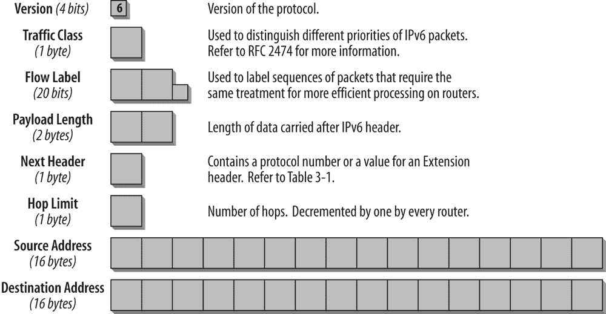图 3-1. IPv6 头部字段

图 3-1 显示，即使头部的总大小为 40 字节，是默认 IPv4 头部的两倍长，但实际上它已经进行了精简，因为大部分头部空间被两个 16 字节的 IPv6 地址占据。这样，只有 8 字节的空间用于其他头部信息。

版本（4 位）

这个 4 位字段包含了协议的版本号。在 IPv6 中，该数字为 6。版本号 5 不能使用，因为它已经被分配给了实验性流协议（RFC 1819）。

流量类（1 字节）

该字段取代了 IPv4 中的服务类型字段。它有助于处理实时数据以及任何其他需要特殊处理的数据，发送节点和转发路由器可以利用该字段识别并区分不同类别或优先级的 IPv6 数据包。

RFC 2474《IPv4 和 IPv6 头部中的区分服务字段（DS 字段）定义》解释了如何使用 IPv6 中的流量类字段。RFC 2474 使用*DS 字段*一词来指代 IPv4 头部中的服务类型字段以及 IPv6 头部中的流量类字段。

### 注意

有关流量类字段使用的更多信息，请参见第五章.

流标签（20 位）

该字段区分了需要相同处理的数据包，以便促进实时流量的处理。发送主机可以为一系列数据包标记一组选项。路由器跟踪流，并可以更高效地处理属于同一流的数据包，因为它们不需要重新处理每个数据包的头部。流标签和源节点的地址唯一标识该流。不支持流标签字段功能的节点在转发数据包时必须保持该字段不变，在接收数据包时忽略该字段。所有属于同一流的数据包必须具有相同的源和目的 IP 地址。

### 注意

流标签字段的使用是实验性的，且在写作时仍在 IETF 讨论中。有关更多信息，请参见 第五章.

Payload 长度（2 字节）

该字段指定 *负载*——即 IP 头部之后携带的数据长度。IPv6 中的计算与 IPv4 中的不同。IPv4 中的长度字段包含 IPv4 头部的长度，而 IPv6 中的 Payload Length 字段仅包含 IPv6 头部之后的数据。扩展头被视为负载的一部分，因此也包含在计算中。

Payload Length 字段有 2 字节，限制了最大数据包负载大小为 64 KB。IPv6 有一个 *Jumbogram 选项*，在需要时可以支持更大的数据包大小。Jumbogram 选项携带在跳跃-跳跃选项头中（将在本章后面讨论）。只有当 IPv6 节点连接到具有大于 64 KB 的链路 MTU 的链路时，Jumbogram 才是相关的；它们在 RFC 2675 中进行了规范。

下一头（1 字节）

在 IPv4 中，该字段称为协议类型字段，但在 IPv6 中更名，以反映 IP 数据包的新组织结构。如果下一个头部是 UDP 或 TCP，则此字段将包含与 IPv4 中相同的协议编号——例如，TCP 的协议编号是 6，UDP 的协议编号是 17。但如果在 IPv6 中使用了扩展头，则此字段包含下一个扩展头的类型。扩展头位于 IP 头和 TCP 或 UDP 头之间。表 3-1 列出了下一头字段中的可能值。新的 IPv6 相关头部为加粗显示。

表 3-1. 下一头字段中的值

| 值 | 描述 |
| --- | --- |
| 0 | 在 IPv4 头部中：保留并未使用 **在 IPv6 头部中：跳跃-跳跃选项头跟随** |
| 1 | 网络控制消息协议（ICMPv4）—IPv4 支持 |
| 2 | 网络组管理协议（IGMPv4）—IPv4 支持 |
| 4 | IPv4 |
| 5 | 流协议（RFC 1819） |
| 6 | TCP |
| 8 | 外部网关协议（EGP） |
| 9 | IGP—任何私有内部网关（由 Cisco 用于其 IGRP） |
| 17 | UDP |
| 41 | **IPv6** |
| 43 | **路由头** |
| 44 | **分片头** |
| 45 | 跨域路由协议（IDRP） |
| 46 | 资源预留协议（RSVP） |
| 47 | 通用路由封装（GRE） |
| 50 | **封装安全负载头** |
| 51 | **身份验证头** |
| 58 | **ICMPv6** |
| 59 | **无下一个头部用于 IPv6** |
| 60 | **目标选项头** |
| 88 | EIGRP |
| 89103 | OSPFPIM |
| 108 | IP Payload Compression Protocol |
| 115 | 第 2 层隧道协议（L2TP） |
| 132 | 流控制传输协议（SCTP） |
| 135 | *移动头（移动 IPv6）* |
| 140 | Shim6（RFC 5533） |
| 143–252 | 未分配 |
| 253, 254 | 用于实验和测试（RFC 3692） |
| 255 | 保留 |

头部类型编号来源于与协议类型编号相同的编号范围，因此不应与其冲突。

### 注意

请访问[`www.iana.org/assignments/protocol-numbers`](http://www.iana.org/assignments/protocol-numbers)查看当前列表。

跳数限制（1 字节）

该字段类似于 IPv4 中的 TTL 字段。最初，IPv4 中的 TTL 字段包含一个秒数，表示数据包在被销毁之前可以在网络中停留的时间。实际上，IPv4 路由器在每次转发时都会将该值减一。为了反映其目的，这个字段在 IPv6 中被更名为跳数限制。该字段中的值表示跳数。每个转发节点将该数字减一。如果路由器接收到一个跳数限制为 1 的数据包，它会将其减为 0，丢弃该数据包，并向发送方发送 ICMPv6 消息“跳数限制在传输中被超越”。

源地址（16 字节）

该字段包含数据包发起者的 IP 地址。

目标地址（16 字节）

该字段包含数据包预期接收者的 IP 地址。这可以是最终目标地址，或者如果例如存在路由头部，则为下一跳路由器的地址。

图 3-2 显示了在跟踪文件中的 IPv6 头部。

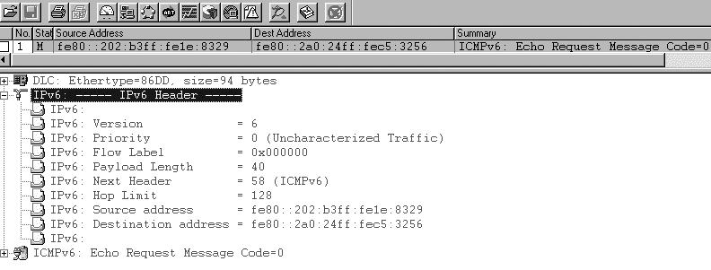图 3-2. IPv6 头部在跟踪文件中的显示

该跟踪文件显示了所有讨论过的头部字段以及它们如何在跟踪文件中呈现。版本字段设置为 6，表示 IPv6。流量类（优先级）和流标签字段在该数据包中未使用，设置为 0。负载长度为 40，下一头部值设置为 58，表示 ICMPv6。跳数限制设置为 128，源地址和目标地址包含我的 IPv6 节点的链路本地地址。详细信息窗口中的第一行显示`Ethertype 0x86DD`。该值表示这是一个 IPv6 数据包。对于 IPv4，该值将是`0x0800`。此字段可用于为所有本地 IPv6 数据包设置分析器过滤器。

### 注意

分析工具可以以不同的方式解码数据包。如果你使用的是另一个版本或其他类型的分析器，解码结果可能会稍有不同。差异不在于数据包本身，而是在分析器界面中数据包的展示方式。

## 扩展头

IPv4 头可以从最小的 20 字节扩展到最大 60 字节，以指定诸如安全选项、源路由或时间戳等选项。由于会影响性能，这种扩展很少被使用。例如，IPv4 硬件转发实现必须将包含选项的数据包传递给主处理器（由软件处理）。

数据包头越简单，处理速度越快。IPv6 采用了一种新的处理选项的方式，显著提高了处理效率：它通过额外的头（称为 *扩展头*）来处理选项。只有在需要选项时，扩展头才会被插入到数据包中。而且在大多数情况下，扩展头只会由最终目标处理，而不是由中间设备处理。

当前的 IPv6 规范定义了六个扩展头，这些扩展头必须被所有 IPv6 节点支持：

+   逐跳选项头

+   路由头

+   分片头

+   目标选项头

+   认证头

+   封装安全载荷头

在一个 IPv6 数据包中，可以有零个、一个或多个扩展头。扩展头被放置在 IPv6 头和上层协议头之间。每个扩展头由前一个头中的 Next Header 字段来标识。扩展头只有在 IPv6 头的目标地址字段中标识的节点处才会被检查或处理。如果目标地址字段中的地址是一个组播地址，那么所有属于该组播组的节点都将检查并处理扩展头。扩展头必须严格按照它们在数据包头中出现的顺序进行处理。

关于只有目标节点会处理扩展头的规则，有一个例外。如果扩展头是逐跳选项头，则携带的信息必须由沿着数据包路径的每个节点检查和处理。逐跳选项头（如果存在）必须紧跟在 IPv6 头之后。它通过 IPv6 头中的 Next Header 字段值 0 来指示（参见本章前面的 表 3-1）。

### 注意

前四个扩展头在 RFC 2460 中有所描述。认证头在 RFC 4302 中有所描述，封装安全载荷头在 RFC 4303 中有所描述。未来扩展头格式的更新已在 RFC 6564 中定义。

该架构非常灵活，可以根据需要开发额外的扩展头以供未来使用。可以定义并使用新的扩展头，而无需更改 IPv6 头部。一个很好的例子是为移动 IPv6（RFC 6275）定义的移动性头，在第八章中讨论。

图 3-3 展示了扩展头的使用方式。

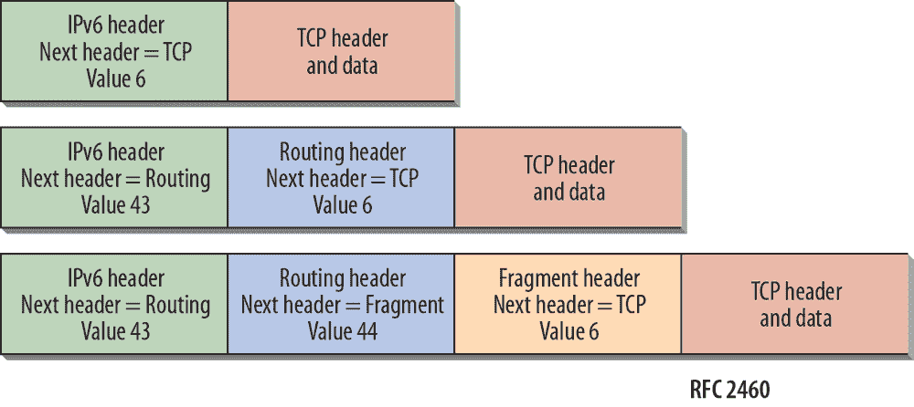图 3-3. 扩展头的使用

每个扩展头的长度是八个字节的倍数，以确保后续头可以始终对齐。如果一个节点需要处理下一个头部，但无法识别“下一个头部”字段中的值，则该节点必须丢弃数据包，并向数据包的源发送一个 ICMPv6 参数问题消息。

### 注释

有关 ICMPv6 消息的详细信息，请参见第四章。

如果在一个数据包中使用了多个扩展头，则应使用以下头部顺序（RFC 2460）：

1.  IPv6 头

1.  路由逐跳选项头

1.  目的地选项头（用于由 IPv6 目的地地址字段中的第一个目的地以及路由头中列出的后续目的地处理的选项）

1.  路由头

1.  分段头

1.  认证头

1.  封装安全有效载荷头

1.  目的地选项头（仅用于由数据包最终目的地处理的选项）

1.  上层头

RFC 2460 为解释留出了一些空间。尽管这是推荐的顺序，但 IPv6 节点必须尝试以任何顺序处理扩展头。但仍强烈建议，除非有新的规范修订，否则 IPv6 数据包的源应使用推荐的顺序。

在 IPv6 封装在 IPv4 中的情况下，上层头可以是另一个 IPv6 头，并且可以包含必须遵循相同规则的扩展头。

### 路由逐跳选项头

路由逐跳选项头携带必须由沿途每个节点检查的可选信息。它必须紧跟在 IPv6 头之后，并由“下一个头部”值为 0 表示。例如，路由器警报（RFC 2711）使用路由逐跳选项头处理像资源预留协议（RSVP）、组播监听器发现（MLD）消息或 Jumbo 数据报选项等协议。对于 IPv4，路由器判断是否需要检查数据报的唯一方法是至少部分解析所有数据报的上层数据。这一过程会显著减缓路由过程。而在 IPv6 中，在没有路由逐跳选项头的情况下，路由器知道不需要处理特定于路由器的信息，可以立即将数据包路由到最终目的地。如果存在路由逐跳选项头，路由器只需检查该头，而无需进一步查看数据包的其他部分。

逐跳选项头的格式见图 3-4。

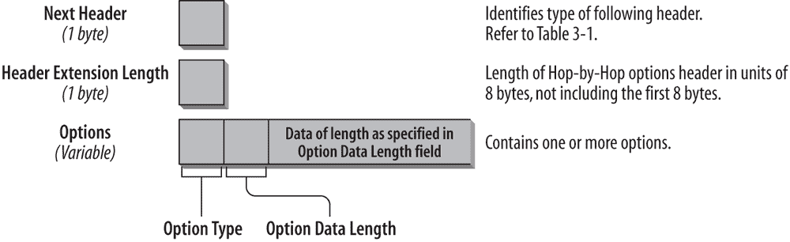图 3-4. 逐跳选项头的格式

以下列表描述了每个字段：

*下一个头（1 字节）*

下一个头字段标识逐跳选项头之后的头类型。下一个头字段使用表 3-1 中列出的值，如本章前面所示。

*扩展头长度（1 字节）*

此字段标识逐跳选项头的长度，以八字节为单位。长度计算不包括前八个字节。因此，如果头部小于八字节，则该字段的值为 0。

*选项（可变大小）*

可以有一个或多个选项。选项的长度是可变的，并由头扩展长度字段决定。

选项类型字段，即选项字段的第一个字节，包含有关在处理节点无法识别选项时应如何处理该选项的信息。前两位的值指定应采取的操作：

+   00: 跳过并继续处理。

+   01: 丢弃数据包。

+   10: 丢弃数据包并向数据包的源地址发送 ICMP 参数问题消息，指向未识别的选项类型。

+   11: 丢弃数据包并仅向数据包的源地址发送 ICMP 参数问题消息，代码为 2，前提是目标地址不是多播地址。

选项类型字段的第三位指定选项信息是否可以在路由过程中更改（值为 1）或不会更改（值为 0）。

#### 选项类型 Jumbogram

此逐跳选项类型支持 IPv6 Jumbogram 的发送。IPv6 负载长度字段支持最大 65,535 字节的数据包大小。Jumbo Payload 选项（RFC 2675）允许发送更大的数据包。

在带有 Jumbo Payload 选项的数据包的 IPv6 头中，负载长度字段设置为 0。下一个头字段包含值 0，表示这是一个逐跳选项头。选项类型值 194 表示 Jumbo Payload 选项。Jumbo Payload 长度字段有 32 位，因此支持传输大小在 65,536 到 4,294,967,295 字节之间的数据包。RFC 2675 还定义了 UDP 和 TCP 的扩展，这些扩展必须在需要支持发送 Jumbogram 的数据包的主机上实现。路径上的所有设备必须支持此选项。

#### 选项路由器警报

此选项类型指示路由器数据包包含在转发时需要处理的重要信息。该选项目前主要用于 MLD（多播监听发现）和 RSVP（资源预留协议）。它在 RFC 2711 中进行了说明，并已被 RFC 6398 更新。

RSVP 使用控制数据包，包含需要路由器沿路径进行解读或更新的信息。这些控制数据包使用逐跳选项头，因此只有路由器会处理该数据包。常规数据包没有这个扩展头，因此会立即被转发，无需路由器进一步检查。

选项类型字段的前三位设置为 0。一个不认识该选项的路由器会忽略它并转发数据包。在第一个字节的剩余五位中，指定了选项类型 5。选项数据长度字段包含值 2，表示接下来的值字段的长度为两字节（参见图 3-4）。

### 注意

路由器警告值的列表可以在以下链接找到：[`www.iana.org/assignments/ipv6-routeralert-values`](http://www.iana.org/assignments/ipv6-routeralert-values)。

图 3-5 展示了跟踪文件中的逐跳选项头。

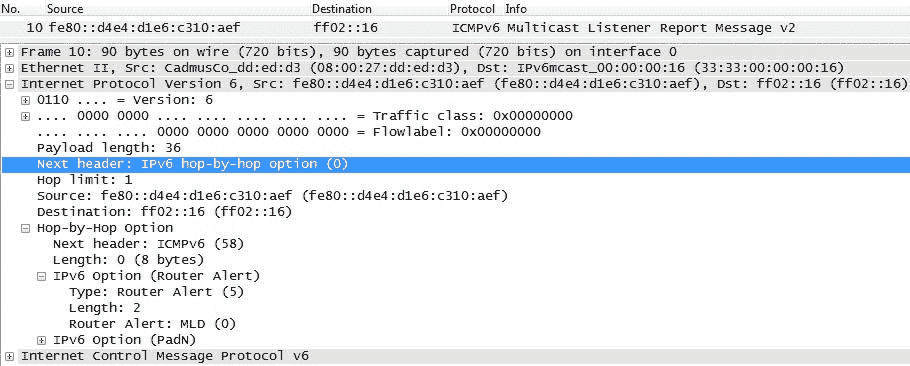图 3-5。逐跳选项头在跟踪文件中的展示

截图展示了数据包编号 10 的详细信息。它是一个 MLDv2 多播监听报告消息。如前所述，这些多播注册消息始终具有逐跳选项头（下一头部值为零），因为这是一个路由器不需要转发，但必须处理的信息包。你可以看到 MLD 消息的跳数限制被设置为 1；`ff02::16`是 MLDv2 路由器的多播地址；逐跳选项头包含下一头部字段，值为 58，表示 ICMPv6；长度字段和路由器警告选项类型为 5，值字段为零，表示 MLD。

### 路由头

*路由头*用于提供一个或多个中间节点的列表，这些节点应在数据包到达目标的路径上依次访问。在 IPv4 中，这称为*松散源路由*选项。路由头通过前一头部中的下一头部值 43 来标识。图 3-6 展示了路由头的格式。

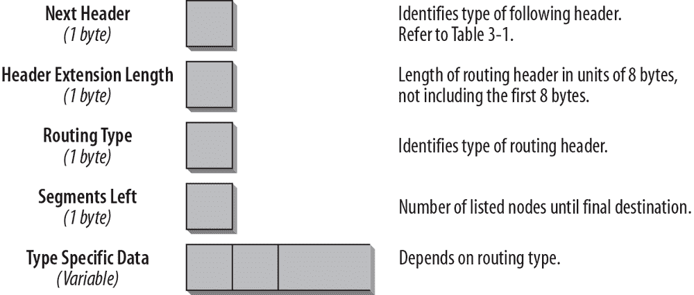图 3-6。路由头格式

以下列表描述了每个字段：

*下一头部（1 字节）*

下一头部字段标识紧随路由头之后的头部类型。它使用与 IPv4 协议类型字段相同的值（请参见本章前面的表 3-1）。

*扩展头长度（1 字节）*

该字段标识路由头的长度，单位为 8 字节。长度计算不包括前 8 字节。

*路由类型（1 字节）*

该字段标识路由头的类型。RFC 2460 描述了路由类型 0，但由于安全原因，该类型已被 RFC 5095 弃用。移动 IPv6 规范定义了路由类型 2。（此规范在第八章中讨论。）在撰写本文时，已有一些草案正在进行中，定义了一种新的段路由架构和一种新的路由头类型，称为段路由头。可以在本章末尾的草案部分找到这些草案的链接。你阅读这些文字时，可能已经知道这个规范是否会被采纳。

*剩余段数（1 字节）*

该字段标识在数据包到达最终目的地之前，还有多少节点需要访问。

*类型特定数据（可变长度）*

该字段的长度取决于路由类型。完整的头部总是 8 字节的倍数。

如果处理路由头的节点无法识别路由类型值，则采取的操作取决于“剩余段数”字段的内容。如果“剩余段数”字段不包含任何需要访问的节点，则该节点必须忽略路由头并处理数据包中的下一个头部，该头部由“下一个头部”字段的值决定。如果“剩余段数”字段不为零，则该节点必须丢弃数据包，并向数据包的源地址发送一个 ICMP 参数问题代码 0 消息，指向未识别的路由类型。如果转发节点由于下一个链路的最大传输单元（MTU）大小过小而无法处理数据包，它会丢弃数据包并向数据包源发送 ICMP 数据包过大消息。

图 3-7 显示了跟踪文件中的类型 2 路由头。

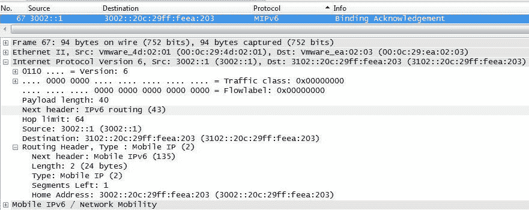图 3-7. 路由头类型 2 在跟踪文件中的显示

要显示类型 2 路由头，我们必须获取一个移动 IPv6 跟踪文件，这是定义该路由头类型的规范。IPv6 头中的“下一个头部”字段显示路由头的值为 43。路由头包含本节前面讨论的字段。下一个头部是一个移动性头部，路由头中的“下一个头部”值为 135。头部长度包含两个 8 字节单元，总长度为 16 字节（一个地址）。剩余段数字段包含值 1，因为在选项字段中有一个地址条目。最后，选项字段列出了家庭地址选项和家庭地址。

### 注意

请参阅第八章了解路由头如何用于移动性。

有关新的路由头选项的示例，请参阅 RFC 6554，《用于低功耗和低丢包网络（RPL）的源路由 IPv6 路由头》。在低功耗和低丢包网络（LLNs）中，路由器通常内存非常有限，只允许少量默认路由，没有其他目标。该 RFC 定义了*源路由头*（SRH），严格用于 RPL 路由器之间。

### 片段头

一个希望发送数据包到 IPv6 目标的 IPv6 主机使用路径 MTU 发现来确定到该目标路径上可以使用的最大数据包大小。如果要发送的数据包大于支持的 MTU，源主机会对数据包进行分片。与 IPv4 不同，在 IPv6 中，路径上的路由器不会对数据包进行分片。分片只发生在发送数据包的源主机处。目标主机负责重组。片段头通过前一个头部中的下一个头部值 44 来识别。片段头的格式如图 3-8 所示。

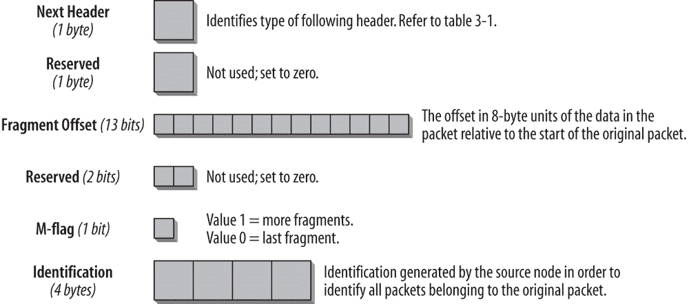图 3-8. 片段头格式

以下列表描述了每个字段：

*下一个头部 (1 字节)*

下一个头部字段标识紧跟在片段头之后的头部类型。它使用与 IPv4 协议类型字段相同的值。（参见表 3-1。）

*保留字段 (1 字节)*

未使用；设置为 0。

*片段偏移量 (13 位)*

该数据包中的数据相对于原始数据包数据起始位置的 8 字节单位偏移量。

*保留字段 (2 位)*

未使用；设置为 0。

*M 标志 (1 位)*

值 1 表示更多片段；值 0 表示最后一个片段。

*标识符 (4 字节)*

由源主机生成，用以识别属于原始数据包的所有数据包。该字段通常实现为一个计数器，每个需要源主机分片的数据包计数增加 1。

### 注意

片段头不包含像 IPv4 中的“不分片”字段。因为路由器在 IPv6 中不再进行分片，所以不再需要该字段。只有源主机可以对数据包进行分片。

初始未分片的数据包称为*原始数据包*。它具有一个不可分片部分，包括 IPv6 头部及任何必须由沿路径到目标节点的节点处理的扩展头（即逐跳选项头）。原始数据包的可分片部分包括任何只需要由最终目标处理的扩展头，以及上层头部和任何数据。图 3-9（RFC 2460）说明了分片过程。

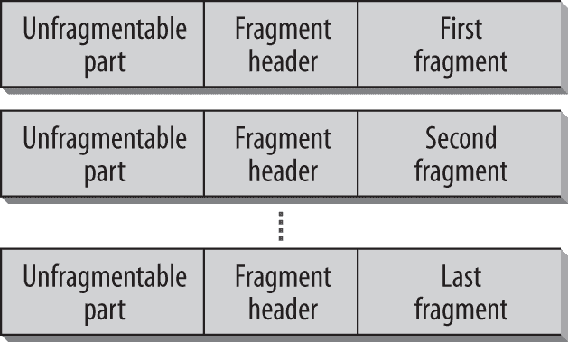图 3-9. IPv6 片段化

原始数据包的不可分段部分出现在每个片段中，接着是片段头部，然后是可分段数据。原始数据包的 IPv6 头部必须稍作修改。长度字段反映的是片段的长度（不包括 IPv6 头部），而不是原始数据包的长度。

目标节点收集所有片段并重新组装它们。片段必须具有相同的源地址和目标地址，并且相同的标识值才能重新组装。如果所有片段在第一个片段之后的 60 秒内没有到达目标，目标将丢弃所有数据包。如果目标已经收到第一个片段（偏移量 = 0），它会向源发送一个 ICMPv6 片段重组超时消息。

图 3-10 显示了一个片段头部。

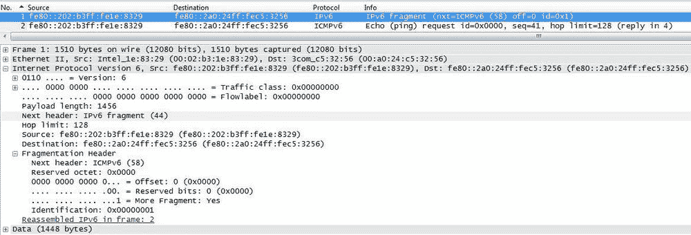图 3-10. 跟踪文件中的片段头部

整个片段集由两个数据包组成，第一个数据包如图 3-10 所示。在 IPv6 头部，负载长度字段的值为 1,456，这是片段头部和该单个片段的长度，而不是整个原始数据包的长度。下一个头部字段指定值 44，这是片段头部的值。该字段后面是跳数限制字段、源地址和目标地址。片段头部的第一个字段是下一个头部字段。因为这是一个 ping 请求，它包含 ICMPv6 的值 58。由于这是片段集中的第一个数据包，偏移量字段的值为 0，M 标志设置为 1，表示还有更多片段将到来。标识字段设置为 1，并且在属于该片段集的所有数据包中必须相同。图 3-11 显示了片段集中的第二个数据包。

图 3-11. 片段集中的最后一个数据包

该片段集中的第二个和最后一个数据包的偏移量值为 `0x00b5`，转换为十进制为 181，即第一个片段的长度。M 标志设置为 0，表示这是最后一个数据包，并通知接收主机开始重组片段。标识字段在两个数据包中都设置为 1。

RFC 2460 中的规范允许重叠片段，这会造成安全问题。RFC 5722《IPv6 重叠片段的处理》解释了这一安全问题，并更新了 RFC 2460，禁止重叠片段。RFC 6980 描述了 IPv6 片段化如何成为安全问题，通过消除 RA Guard 等安全机制的有效性，禁止在传统邻居发现消息中使用 IPv6 片段化。

### 注意

参见第四章了解邻居发现的描述，参见第六章讨论 RA Guard 及其对片段头部的安全影响。

### 目的地选项头部

*目的地选项*头部携带仅由目的地节点（IPv6 头部中的目的地地址）检查的可选信息。一个值为 60 的下一头部标识这种类型的头部。如前所述，目的地选项头部可以在 IPv6 数据包中出现两次。当它插入在路由头部之前时，它包含供路由器处理的信息，这些路由器在路由头部中列出。当它插入在上层协议头部之前时，它包含供数据包最终目的地处理的信息。图 3-12 显示了目的地选项头部的格式。

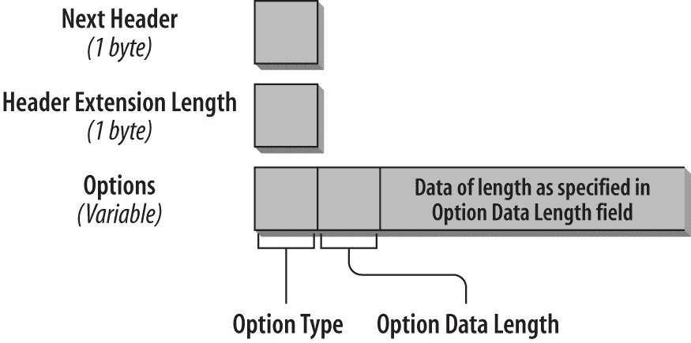图 3-12. 目的地选项头部的格式

如您所见，格式类似于“跳跃选项”头部的格式。以下列表描述了每个字段：

*下一头部（1 字节）*

下一头部字段标识紧随目的地选项头部的头部类型。它使用表 3-1 中列出的相同值，该表在本章前面已经展示过。

*扩展头部长度（1 字节）*

该字段标识目的地选项头部的长度，单位为 8 字节。长度计算不包括前 8 个字节。

*选项（可变大小）*

可以有一个或多个选项。选项的长度是可变的，并由头部扩展长度字段确定。

选项字段的使用方式与“跳跃选项”头部相似，我在本章之前讨论过这个头部。目的地选项头部的一个使用示例是移动 IPv6。您可以在第八章找到有关移动 IPv6 的详细描述。另一个定义的目的地选项头部选项是 RFC 2473 中的*隧道封装限制选项*，该选项用于限制数据包被进一步封装的次数。

### 注意

在[`www.iana.org/assignments/ipv6-parameters/`](http://www.iana.org/assignments/ipv6-parameters/)查找最新的路由和目标选项头的定义选项列表。

图 3-13 显示了跟踪文件中的目标选项头。

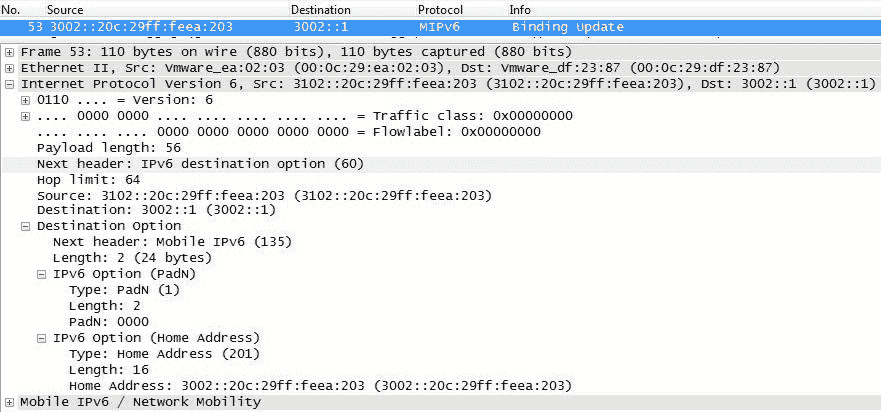图 3-13. 跟踪文件中的目标选项头

为了展示目标选项头，我们再次参考移动 IPv6 跟踪。这是一个绑定更新消息。它在 IP 头的下一个头字段中使用值 60 的目标选项头。目标选项头的下一个头字段值为 135，表示移动 IPv6 消息，并包含家庭地址选项和移动节点的家庭地址。

### 注意

请参阅第八章，了解目标选项头如何用于移动性。

### 新扩展头格式

除了逐跳和路由头外，扩展头通常仅由数据包的最终目的地处理。实际上，数据包路径中的设备，如路由器和防火墙，能够以线速解析或忽略扩展头。为了适应现实世界中的实现并优化扩展头的处理和检查，RFC 6564 中定义了一种新的扩展头格式，标题为《IPv6 扩展头的统一格式》。图 3-14 显示了新的格式。

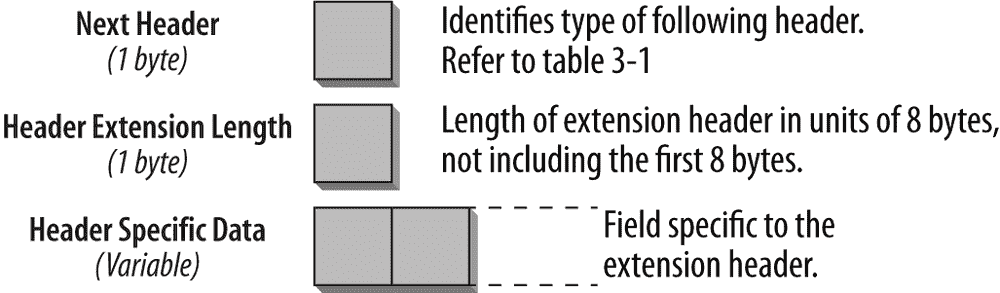图 3-14. 新的扩展头格式

以下列表描述了每个字段：

*下一个头（1 字节）*

下一个头字段标识扩展头之后的头类型。它使用表 3-1 中列出的相同值，表 3-1 在本章前面已经展示。

*扩展头长度（1 字节）*

该字段标识扩展头的长度，单位为 8 字节。长度计算不包括前 8 个字节。

*选项（可变大小）*

选项的长度是可变的，并在扩展头长度字段中确定。

本章描述的基本扩展头格式不会改变。但是，如果未来定义新的扩展头，它们必须遵循此格式。这意味着任何处理扩展头的设备，如防火墙，必须能够正确处理基本扩展头，同时也能处理使用新格式的扩展头。

RFC 6564 中定义了几条规则，并在下面总结：

+   如果可能，应该避免定义新的扩展头，而是为目标选项头定义新的选项。只有在无法做到这一点时，才能定义新的扩展头。

+   不得创建新的逐跳行为头，并且只有在有限情况下，才应为现有的逐跳选项头创建新选项。

### 扩展头与头链长度的处理

RFC 2460 中的基础规范规定，扩展头仅由终端节点处理（逐跳选项头除外）。该架构的目标是，新的扩展头可以被引入，并且只有终端节点需要更新。这个过程对路径中的转发节点是透明的。实践表明，这并非总是适用。一些路由器和多种中间设备，如防火墙、负载均衡器和数据包分类器，也被称为中间件，可能会检查超出 IPv6 基础头的 IP 头的其他部分。通常，如果它们不识别某个扩展头，它们会直接丢弃包，这会导致连接失败。此外，逐跳扩展头通常不会被高速路由器处理，或者是在慢路径上处理。

RFC 7045《扩展头的传输与处理》讨论了这些问题。根据基础规范，终端节点应丢弃它们不识别的扩展头，但路径中的转发设备不应这样做。否则，这些转发设备可能会丢弃那些它们尚未识别的带有新定义扩展头的包。RFC 规定，这些设备应该有一个可以单独配置的策略。默认配置应允许所有标准扩展头。对于防火墙，RFC 规定，特别是含有标准扩展头的包，只有在经过故意配置的策略下才会被丢弃。对于逐跳扩展头，要求所有转发设备都应处理它，但实现者需要意识到，这通常发生在慢路径上。

另一个问题是，没有一个单一的地方可以找到所有的扩展头，而且随着新规范的发布，扩展头的数量可能会定期增加。因此，厂商很难确定他们在实现中需要支持哪些扩展头。因此，RFC 定义必须在 IANA（互联网号码分配局）IPv6 参数部分新增一个区域，以列出所有 IPv6 扩展头类型。

### 注意

新的 IANA 注册表部分可以在 IPv6 扩展头 中找到，链接地址为 [`bit.ly/1na7H1Q`](http://bit.ly/1na7H1Q)。

关于头链（包括 IPv6 头、任何扩展头和上层协议头），请注意以下事项：在 IPv4 中，我们对 IPv4 数据包中所有 IPv4 选项的大小有固定的上限。在 IPv6 基础规范中，数据包中扩展头的数量没有限制。因此，当数据包被分段时，头链可能会跨越多个片段。这会导致问题，特别是当防火墙无法对片段应用规则时，因为它们需要的信息在第一个片段中缺失。RFC 7112, “超大 IPv6 头链的影响”，描述了这个问题，并更新了 RFC 2460，要求分段数据报的第一个片段必须包含完整的 IPv6 头链。

现在，您已经熟悉了 IPv6 头和扩展头，下一章将介绍 ICMPv6 的高级功能，这些功能提供了 ICMPv4 中没有的管理功能。

## 参考文献

以下是本章中提到的最重要的 RFC 和草案列表。有时我还会包括一些附加的与主题相关的 RFC，供您个人进一步学习。

### RFCs

+   RFC 791, “互联网协议”，1981

+   RFC 1812, “IP 版本 4 路由器要求”，1995

+   RFC 1819, “互联网流协议版本 2”，1995

+   RFC 1981, “IP 版本 6 的路径 MTU 发现”，1996

+   RFC 2460, “互联网协议，第 6 版（IPv6）规范”，1998

+   RFC 2473, “IPv6 中通用数据包隧道化规范”，1998

+   RFC 2474, “区分服务字段（DS 字段）的定义”，1998

+   RFC 2475, “区分服务架构”，1998

+   RFC 2507, “IP 头压缩”，1999

+   RFC 2675, “IPv6 大数据包”，1999

+   RFC 2711, “IPv6 路由器警报选项”，1999

+   RFC 3168, “显式拥塞通知（ECN）添加到 IP 中”，2001

+   RFC 3175, “IPv4 和 IPv6 预留的 RSVP 聚合”，2001

+   RFC 3514, “IPv4 头中的安全标志”，2003 年 4 月 1 日

+   RFC 4301, “互联网协议的安全架构”，2005

+   RFC 4302, “IP 认证头”，2005

+   RFC 4303, “IP 封装安全负载（ESP）”，2005

+   RFC 4305, “封装安全负载（ESP）和认证头（AH）的加密算法实现要求”，2005

+   RFC 4727, “IPv4、IPv6、ICMPv4、ICMPv6、UDP 和 TCP 头中的实验值”，2006

+   RFC 5095, “IPv6 中类型 0 路由头的废弃”，2007

+   RFC 5350, “IPv4 和 IPv6 路由器警报选项的 IANA 考虑”，2008

+   RFC 5722, “重叠 IPv6 片段的处理”，2009

+   RFC 5871, “IPv6 路由头的 IANA 分配指南”，2010

+   RFC 6105, “IPv6 路由器广告保护”，2011

+   RFC 6275, “IPv6 中的移动性支持”，2011

+   RFC 6398, “IP 路由器警报的考虑和使用”，2011

+   RFC 6434, “IPv6 节点要求”，2011

+   RFC 6437, “IPv6 流标签规范”，2011

+   RFC 6553, “低功耗和丢包网络（RPL）协议中用于承载 RPL 信息的数据平面数据报选项”，2012

+   RFC 6554, “用于源路由的 IPv6 路由头，结合低功耗和丢包网络（RPL）协议”，2012

+   RFC 6564, “IPv6 扩展头的统一格式”，2012

+   RFC 6621, “简化的多播转发”，2012

+   RFC 6946, “IPv6 ‘原子’分片的处理”，2013

+   RFC 6980, “IPv6 分片与 IPv6 邻居发现的安全影响”，2013

+   RFC 7045, “IPv6 扩展头的传输和处理”，2014

+   RFC 7112, “超大 IPv6 头链的影响”，2014

+   RFC 7113, “IPv6 路由器广告保护（RA Guard）实施建议”，2014

+   RFC 7136, “IPv6 接口标识符的重要性”，2014

### 草案

草案可以在 [`www.ietf.org/ID.html`](http://www.ietf.org/ID.html) 上找到。要查找草案的最新版本，请参考 [`datatracker.ietf.org/public/pidtracker.cgi`](https://datatracker.ietf.org/public/pidtracker.cgi)。您可以输入草案名称，不带版本号，最新版本会自动显示。如果草案未显示，可能已经被删除。如果它已发布为 RFC，则会显示 RFC 编号。[`tools.ietf.org/wg`](http://tools.ietf.org/wg) 也是一个非常有用的网站。关于标准化过程、RFC 和草案的更多信息可以在 附录 A 中找到。

这是我在本章中参考的草案列表，以及与本章主题相关的一些有趣草案：

“分段路由架构”

*draft-filsfils-spring-segment-routing-02*

“分段路由使用案例”

*draft-filsfils-spring-segment-routing-use-cases-00*

“IPv6 分段路由头（SRH）”

*draft-previdi-6man-segment-routing-header-00*
