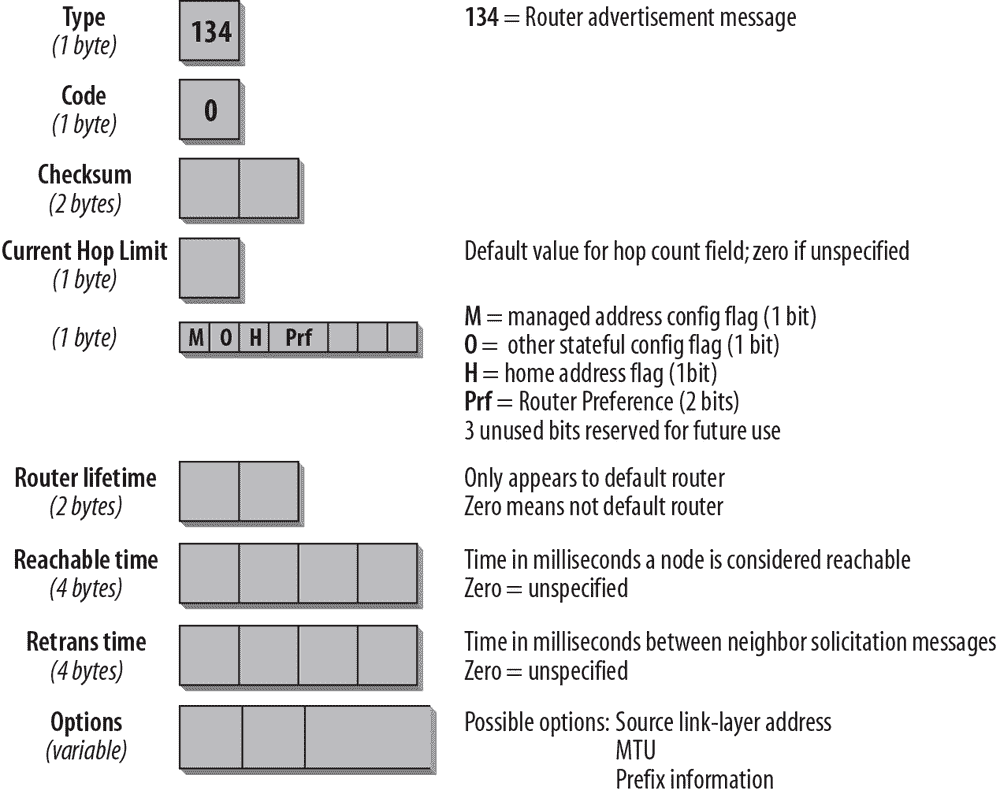
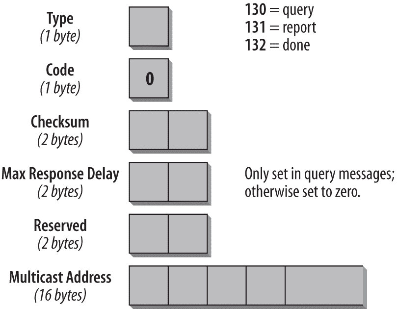

## 第四章：ICMPv6

如果你熟悉 IPv4，互联网控制消息协议（ICMP）对于 IPv4 可能是你的好朋友：它提供有关网络健康的重要信息。ICMPv6 是与 IPv6 配合使用的版本。如果数据包无法正确处理，ICMPv6 会报告错误，并发送有关网络状态的信息消息。例如，如果路由器无法转发数据包，因为数据包太大无法通过另一网络发送，它会发送 ICMP 消息回源主机。源主机可以使用这个 ICMP 消息来确定更好的数据包大小，然后重新发送数据。ICMP 还执行诊断功能，例如著名的 ping，它使用 ICMP 回显请求和回显应答消息来测试节点的可用性。

ICMPv6 比 ICMPv4 更强大，包含新的功能，如本章所述。例如，管理 IPv4 多播组成员的互联网组管理协议（IGMP）功能已被纳入 ICMPv6。同样，IPv4 中用于将链路层地址映射到 IP 地址（反之亦然）的 ARP/RARP（地址解析协议/反向地址解析协议）功能也被纳入其中。引入了邻居发现（ND），它使用 ICMPv6 消息来确定附加到同一链路的邻居的链路层地址，查找路由器，跟踪哪些邻居是可达的，并检测链路层地址的变化。定义了新的消息类型，简化了网络重新编号和主机与路由器之间地址信息更新。ICMPv6 还支持移动 IPv6，详见第八章。ICMPv6 是 IPv6 的一部分，必须由每个 IPv6 节点完全实现。该协议在 RFC 4443 中定义。邻居发现定义在 RFC 4861 中。

## 一般消息格式

所有 ICMPv6 消息都有相同的一般头部结构，如图 4-1 所示。

图 4-1. 一般 ICMPv6 头部格式

类型（1 字节）

该字段指定消息的类型，决定了消息其余部分的格式。表 4-1 和 4-2 列出了 ICMPv6 的消息类型和编号。

代码（1 字节）

代码字段依赖于消息类型，并在某些情况下提供更详细的信息。有关详细列表，请参考表 4-1 和 4-2。

校验和（2 字节）

校验和字段用于检测 ICMPv6 头部和部分 IPv6 头部中的数据损坏。为了计算校验和，节点必须确定 IPv6 头部中的源地址和目标地址。校验和计算中包括一个伪头部，这是 ICMPv6 新增的内容。第五章讨论了校验和和伪头部。

消息体（可变大小）

根据类型和代码，消息体将包含不同的数据。对于错误消息，为了帮助故障排除，它将尽可能包含触发该消息的数据包。ICMPv6 数据包的总大小不应超过最小 IPv6 MTU，即 1280 字节。表 4-1 和表 4-2 提供了不同消息类型的概述，以及取决于消息类型的附加代码信息。

ICMP 消息分为两类：

ICMP 错误消息

错误消息在其消息类型字段的高阶位上有一个 0。因此，ICMP 错误消息类型的范围为 0 到 127。

ICMP 信息性消息

信息性消息在其消息类型字段的高阶位上有一个 1。因此，ICMP 信息性消息类型的范围为 128 到 255。

每个 ICMPv6 消息前面都有一个 IPv6 头部和零个或多个扩展头部。紧接 ICMP 头部之前的头部的“下一个头部”值为 58。这个值与 ICMPv4 的值不同（ICMPv4 的值为 1）。

### 注意

下一个头部字段的值在第三章中有讨论。

以下消息类型在 RFC 4443 中有描述：

ICMPv6 错误消息

+   目标不可达（消息类型 1）

+   数据包过大（消息类型 2）

+   时间超限（消息类型 3）

+   参数问题（消息类型 4）

ICMPv6 信息性消息

+   回显请求（消息类型 128）

+   回显应答（消息类型 129）

### 注意

对于最新的 ICMPv6 消息类型列表，请参考互联网分配号码管理局（IANA）网站：[`www.iana.org/assignments/icmpv6-parameters`](http://www.iana.org/assignments/icmpv6-parameters)。所有 IPv4 ICMP 参数可在[`www.iana.org/assignments/icmp-parameters`](http://www.iana.org/assignments/icmp-parameters)找到。

表 4-1. ICMPv6 错误消息和代码类型

| 消息编号 | 消息类型 | 代码字段 |
| --- | --- | --- |
| 1 | 目标不可达 | `0` = 无路由到目标`1` = 与目标的通信被管理禁止`2` = 超出源地址范围`3` = 地址不可达`4` = 端口不可达`5` = 源地址未通过入口/出口策略`6` = 拒绝路由到目标`7` = 源路由头部出错 |
| 2 | 数据包过大 | 代码字段由发送方设置为 `0`，接收方忽略 |
| 3 | 超时 | `0` = 路由跳数限制超出`1` = 分片重组时间超出 |
| 4 | 参数问题 | `0` = 遇到错误的头字段`1` = 遇到无法识别的下一个头类型`2` = 遇到无法识别的 IPv6 选项。指针字段标识调用数据包中发现错误的字节偏移位置。如果错误字段超出了 ICMPv6 错误消息最大大小的范围，指针将指向超出 ICMPv6 包末尾的位置。 |
| 100 和 101 | 私有实验 | RFC 4443 |
| 127 | 保留用于扩展 ICMPv6 错误消息 | RFC 4443 |

请注意，消息编号和类型相比于 ICMPv4 有了显著变化。ICMP for IPv6 是一个不同的协议，两个版本的 ICMP 不兼容。您的分析工具，如 Wireshark，应该能够正确解码所有这些信息，因此您不必担心记住它们。

表 4-2。ICMPv6 信息消息

| 消息编号 | 消息类型 | 描述 |
| --- | --- | --- |
| 128 | 回显请求 | RFC 4443。用于 ping 命令。 |
| 129 | 回显回复 |   |
| 130 | 多播监听器查询 | RFC 2710。用于多播组管理。 |
| 131 | 多播监听器报告 |   |
| 132 | 多播监听器完成 |   |
| 133 | 路由器请求 | RFC 4861。用于邻居发现和自动配置。 |
| 134 | 路由器通告 |   |
| 135 | 邻居请求 |   |
| 136 | 邻居通告 |   |
| 137 | 重定向消息 |   |
| 138 | 路由器重编号 | RFC 2894。代码：`0` = 路由器重编号命令`1` = 路由器重编号结果`255` = 序列号重置 |
| 139 | ICMP 节点信息查询 | RFC 4620 |
| 140 | ICMP 节点信息响应 |   |
| 141 | 反向 ND 请求 | RFC 3122 |
| 142 | 反向 ND 通告消息 | RFC 3122 |
| 143 | 版本 2 多播监听器报告 | RFC 3810 |
| 144 | ICMP 主机代理地址发现请求消息 | RFC 6275，“移动 IPv6 的 ICMPv6 消息” |
| 145 | ICMP 主机代理地址发现回复消息 |   |
| 146 | ICMP 移动前缀请求消息 |   |
| 147 | ICMP 移动前缀通告消息 |   |
| 148 | 认证路径请求消息 | RFC 3971 “安全邻居发现的 ICMPv6 消息” |
| 149 | 认证路径通告消息 |   |
| 151 | 多播路由器通告 | RFC 4286 |
| 152 | 多播路由器请求 |   |
| 153 | 多播路由器终止 |   |
| 154 | 快速移动 IPv6 消息 | RFC 5568 |
| 155 | 低功耗网络消息的路由协议 | RFC 6550 |
| 156 | ILNPv6 定位器更新消息 | RFC 6743 |
| 157 | 重复地址请求 | RFC 6775（6LoWPANs） |
| 158 | 重复地址确认 |   |
| 200 和 201 | 私有实验 | RFC 4443 |
| 255 | 保留用于扩展 ICMPv6 信息消息 | RFC 4443 |

除了路由器重新编号消息（138）外，ICMPv6 信息消息不使用 Code 字段。因此，该字段被设置为零。

正如你将在接下来的段落中学习到的，ICMPv6 非常强大，广泛应用于许多对于 IPv6 正常工作至关重要的过程，例如路径 MTU 发现。因此，像许多 IPv4 网络中那样完全过滤所有 ICMP 消息的做法并不明智。在 ICMPv6 中，你必须仔细评估哪些 ICMPv6 消息是重要的。RFC 4890《防火墙中 ICMPv6 消息过滤的建议》讨论了这一点，并提出了建议。

## ICMP 错误消息

每个 ICMP 消息的头部可能略有不同，具体取决于它所携带的错误报告或信息类型。以下部分概述了每种 ICMPv6 消息类型的结构。

### 目标不可达

如果 IP 数据报无法送达，将生成一个*目标不可达*消息。Type 字段的值为 1，用于标识此消息。ICMP 消息会发送到发起数据包的源地址。*目标不可达*消息的格式如图 4-2 所示。

图 4-2. 目标不可达消息的格式

Type 字段被设置为 1，这是目标不可达消息的值。Code 字段提供了更多有关数据报未送达原因的信息。可能的代码列在表 4-3 中。ICMP 消息的数据部分包含尽可能多的原始消息内容，以适应 ICMP 消息的大小。

表 4-3. 目标不可达消息（类型 1）的代码值

| Code | 描述 |
| --- | --- |
| 0 | “没有到目的地的路由。”如果路由器无法转发数据包，因为它的路由表中没有目标网络的路由，则使用此代码。这种情况只有在路由器没有默认路由条目时才会发生。 |
| 1 | “与目标的通信被管理员禁止。”例如，如果防火墙无法将数据包转发到防火墙内部的主机，因为有数据包过滤器，则可能会发送此类型的消息。如果某个节点配置为不接受未经认证的 Echo 请求，也可能会发送此消息。 |
| 2 | “超出源地址的范围。”如果目标地址超出了源地址的范围，例如，数据包的源地址是链路本地地址，目标地址是全局地址，则使用此代码。 |
| 3 | “地址不可达。”如果目标地址无法解析为相应的网络地址，或者由于数据链路层问题导致节点无法到达目标网络，则使用此代码。 |
| 4 | “端口不可达。”如果传输协议（例如 UDP）没有监听器，并且没有其他方式通知发送方，则使用此代码。例如，如果向主机发送域名系统（DNS）查询，而 DNS 服务器未运行，则会生成此类型的消息。 |
| 5 | “源地址未通过入口/出口策略。”如果由于入口或出口过滤策略，某个数据包的源地址不被允许，则使用此代码。 |
| 6 | “拒绝到目标的路由。”如果到目标的路由是拒绝路由，则使用此代码。 |

如果由于拥塞导致目标不可达，则不会生成 ICMP 消息。收到 Destination Unreachable 消息的主机必须通知上层进程。

### Packet Too Big

如果路由器无法转发数据包，因为它大于出站链路的 MTU，它将生成一个 Packet Too Big 消息（如图 4-3 所示）。此 ICMPv6 消息类型作为路径 MTU 发现过程的一部分，我将在本章后续部分中讨论。ICMP 消息将发送到发起数据包的源地址。

图 4-3. Packet Too Big 消息的格式

Type 字段的值为 2，表示 Packet Too Big 消息。在这种情况下，Code 字段不被使用，设置为 0\。该类型消息的重要信息是 MTU 字段，它包含下一跳链路的 MTU 大小。

RFC 4443 规定，对于具有 IPv6 多播目的地址、链路层多播地址或链路层广播地址的数据包，不应生成 ICMPv6 消息作为响应。Packet Too Big 消息是这一规则的例外。因为 ICMP 消息包含下一跳链路的支持 MTU，源主机可以确定它应该用于进一步通信的 MTU。接收到 Packet Too Big 消息的主机必须通知上层进程。

### Time Exceeded

当路由器转发数据包时，它会将跳数限制减 1。跳数限制确保数据包不会在网络中无休止地传播。如果路由器收到一个跳数限制为 1 的数据包，并将跳数限制减至 0，它会丢弃该数据包，生成一个代码值为 0 的 Time Exceeded 消息，并将该消息发送回源主机。此错误可能表明存在路由环路，或者发送方的初始跳数限制过低。它还可以告诉你某人使用了*traceroute*工具，该工具将在本章后续部分中描述。图 4-4 展示了 Time Exceeded 消息的格式。

图 4-4. Time Exceeded 消息的格式

Type 字段的值为 3，指定 Time Exceeded 消息。Code 字段可以设置为 0，表示跃限在传输过程中超出，或者设置为 1，表示片段重组超时。ICMP 消息的数据部分包含尽可能多的原始消息内容，具体取决于使用的 MTU。

一个传入的 Time Exceeded 消息必须传递给上层进程。表 4-4 显示了 Time Exceeded 消息的 Code 字段。

表 4-4. Time Exceeded 消息（类型 3）的代码值

| 代码 | 描述 |
| --- | --- |
| 0 | “跃限超出传输。”可能的原因：初始跃限值过低；存在路由循环；或使用了 traceroute 工具。 |
| 1 | “片段重组超时。”如果使用片段头发送了一个分片数据包（更多细节参见 第二章），且接收主机未能在规定时间内完成重组所有数据包，它会通过发出此 ICMP 消息通知发送方。 |

“跃限超出传输”消息类型通常用于执行 traceroute 功能。*Traceroute* 有助于确定数据包在网络中传输的路径。为了实现这一点，首先发送一个跃限为 1 的数据包。路径中的第一个路由器将跃限减至 0，丢弃数据包，并返回 ICMP 类型 3，代码 0 的消息。源主机现在知道了第一个跃点路由器的地址。接下来，它发送第二个跃限为 2 的数据包。该数据包由第一个路由器转发，路由器将跃限减至 1。路径中的第二个路由器将跃限减至 0，丢弃数据包，并返回 ICMP 类型 3，代码 0 的消息。现在源主机知道了路径中的第二个路由器。通过增加跃限（每发送一个数据包直到到达最终目的地），继续这一过程。每个到达最终目的地的路由器都会向源主机发送 ICMP 消息，提供其 IP 地址。需要注意的是，如果存在冗余的路径到达目的地，*traceroute* 不一定会为所有测试显示相同的路径，因为它可能会选择不同的路径。

### 参数问题

如果 IPv6 节点因无法识别 IPv6 头或扩展头中的某个字段而无法完成数据包处理，它必须丢弃该数据包，并应向问题数据包的源发送 ICMP 参数问题消息。这种类型的消息通常在遇到无法归类为其他类型的错误时使用。此 ICMP 消息的格式如 图 4-5 所示。

图 4-5. 参数问题消息格式

Type 字段的值为 4，指定为参数问题消息。Code 字段可以包含 表 4-5 中描述的三种值中的任何一种。Pointer 字段标识在原始数据包中检测到错误的字节位置。ICMP 消息包括尽可能多的原始数据，直到最小的 IPv6 MTU。指针可能指向 ICMPv6 消息之外的地方。如果发生这种情况，说明错误字段超出了 ICMPv6 错误消息的最大大小能够容纳的范围。

表 4-5 显示了参数问题消息的代码字段。

表 4-5. 参数问题的代码值（类型 4）

| 代码 | 描述 |
| --- | --- |
| 0 | 遇到错误的头部字段 |
| 1 | 遇到无法识别的下一个头部类型 |
| 2 | 遇到无法识别的 IPv6 选项 |

例如，一个类型为 4、代码值为 1、指针设置为 40 的 ICMPv6 消息表示在 IPv6 头部后的头部中的下一个头部类型未被识别。

一个传入的参数问题消息必须传递给上层进程。

## ICMP 信息性消息

在 RFC 4443 中，定义了两种类型的信息性消息：回显请求和回显应答消息。其他 ICMP 信息性消息用于路径 MTU 探测和邻居发现。这些消息将在本章末尾讨论，并在 RFC 4861《IPv6 邻居发现》和 RFC 1981《IPv6 路径 MTU 探测》中定义。

回显请求和回显应答消息用于最常见的 TCP/IP 工具之一：网络探测器（*ping*）。Ping 用于确定指定的主机是否在网络上可用，并准备好进行通信。源主机向指定的目的地发送回显请求消息。如果目标主机可用，它将以回显应答消息进行响应。图 4-8 和 4-9（在本章后面）展示了 ping 在跟踪文件中的表现。

### 回显请求消息

回显请求消息的格式显示在 图 4-6 中。

图 4-6. 回显请求消息格式

Type 字段被设置为 128，这是 Echo Request 的值。Code 字段在此消息中未使用，因此设置为 0。Identifier 和 Sequence Number 字段用于匹配请求和回复。回复必须始终包含与请求相同的数字。是否使用标识符和序列号，以及 Echo Request 中包含何种任意数据，取决于你使用的 TCP/IP 栈。当你分析包含 Echo Request 和 Echo Reply 消息的跟踪文件，并且熟悉某些栈时，你可以通过查看任意数据来确定发送方的 TCP/IP 栈。

### Echo Reply

Echo Reply 消息的格式与 Echo Request 非常相似，如 图 4-7 所示。

图 4-7. Echo Reply 消息的格式

Type 字段包含 129 的值，表示 Echo Reply。Code 字段未使用，设置为 0。Identifier 和 Sequence Number 字段必须与请求中的字段匹配。Echo Request 消息的数据必须完全且未修改地复制到回复中。如果是上层进程发起了 Echo Request，则回复必须传递给该进程。如果 Echo Request 消息发送到了单播地址，则 Echo Reply 消息的 Source 地址必须与 Echo Request 消息的 Destination 地址相同。如果 Echo Request 是发送到 IPv6 多播地址，则 Echo Reply 的 Source 地址必须是接收到多播 Echo Request 的接口的单播地址。

根据规范，ICMPv6 Echo Request 和 Reply 消息可以通过 IPv6 认证头进行认证。这意味着节点可以配置为忽略未认证的 ICMPv6 Ping，并提供保护以防范各种 ICMPv6 攻击。不过，我并不知道有哪个实现支持这个功能。

## 处理规则

有若干规则规范 ICMP 数据包的处理。这些规则可以在 RFC 4443 中找到，概要如下：

+   如果节点收到类型未知的 ICMPv6 错误消息，则必须将其传递给上层。

+   如果节点收到类型未知的 ICMPv6 信息消息，则必须静默丢弃。

+   尽可能多的导致 ICMP 错误消息的数据将包含在 ICMP 消息体中。ICMP 数据包不应超过最小的 IPv6 MTU。

+   如果错误消息必须传递给上层协议，则协议类型通过从原始数据包中提取（位于 ICMPv6 错误消息的正文中）来确定。如果无法在 ICMPv6 消息的正文中找到协议类型（因为原始数据包中存在太多扩展头，并且包含上层协议类型的部分头被截断），则 ICMPv6 消息会被静默丢弃。

在以下情况下不得发送 ICMPv6 错误消息：

+   由于收到 ICMPv6 错误消息。

+   由于收到 ICMPv6 重定向消息。

+   由于发送到 IPv6 多播地址的数据包。此规则有两个例外：用于路径 MTU 探测的“数据包过大”消息，以及具有代码值 2 的未识别 IPv6 选项的参数问题。

+   由于作为链路层组播发送的数据包（前面描述的例外情况适用）。

+   由于作为链路层广播发送的数据包（前面描述的例外情况适用）。

+   由于源地址不能唯一标识单个节点的数据包。这可能是一个 IPv6 未指定地址、IPv6 多播地址或已知为单播地址的 IPv6 地址。

每个 IPv6 节点必须实现速率限制功能，限制其发送 ICMPv6 消息的速率，并且应该是可配置的。如果该功能得当实施，可以防止拒绝服务攻击。

## 跟踪文件中的 ICMPv6 头部

阅读完所有这些枯燥的信息后，你值得看到一些不同的内容。以下屏幕截图（图 4-8）展示了 ping 在跟踪文件中的样子，并提供了迄今为止讨论的许多字段的详细信息。

图 4-8. 跟踪文件中的 Echo Request

如第三章所示，IPv6 头部提供以下信息：版本字段设置为 6，表示这是一个 IPv6 数据包。优先级和流标签未配置，设置为零。有效负载长度字段设置为 40 字节。下一个头部字段的值为 58，表示 ICMPv6 的值。跳数限制设置为 64。我们还可以看到源和目的地 IP 地址。前缀 `fe80:` 表示这两个地址是链路本地地址。

请注意 ICMPv6 头部的前三个字段。它们是每个 ICMPv6 消息共有的字段：类型、代码和校验和字段。类型字段的值为 128，表示 Echo Request。标识符和序列号字段是 Echo Request 和 Echo Reply 消息特有的。标识符在此情况下未使用，发送方将序列号设置为 38。在以下屏幕截图中，匹配的回复中的序列号必须相同。数据字段包含任意数据，不需要对任何人有意义。

哦，我差点忘了，我之前承诺在 Echo Request 消息中显示供应商堆栈相关数据。你在这里看到的——字母表直到字母“w”——是微软使用的内容。每当你在跟踪文件中看到这一点时，表示是微软的堆栈在发送请求。图 4-9 详细展示了 Echo Reply。

图 4-9. 跟踪文件中的回显回复

同样，IPv6 头部显示 IP 版本值为 6，ICMPv6 的下一个头部值为 58。前一帧的目标地址现在是源地址，前源地址现在是目标地址。ICMPv6 头部中的类型字段显示值 129，这是回显回复的值。标识符和序列号字段，以及数据字段，与回显请求中的值相匹配。

## 邻居发现

邻居发现（ND）在 RFC 4861 中进行了规范。该 RFC 中的规范与 IPv4 中已知的不同协议和过程相关，这些协议和过程已被修改和改进。还增加了新功能。它将地址解析协议（ARP）和 ICMP 路由器发现与重定向结合在一起。IPv4 中没有办法检测邻居是否可达。通过邻居发现协议，定义了邻居不可达检测（NUD）机制。重复 IP 地址检测（DAD）也已实现。IPv6 节点使用邻居发现进行以下操作：

+   用于 IPv6 地址的无状态自动配置

+   用于确定网络前缀、路由和其他配置信息

+   用于重复 IP 地址检测（DAD）

+   用于确定同一链路上节点的二层地址

+   查找能够转发其数据包的邻近路由器

+   跟踪哪些邻居可达，哪些不可达（NUD）

+   检测链路层地址的变化

可以注意到，IPv4 协议集相比有以下改进：

+   路由器发现现在是基础协议集的一部分。使用 IPv4 时，机制需要从路由表或 DHCP 获取信息。

+   路由器广告包包含路由器的链路层地址。接收路由器广告的节点无需像 IPv4 节点那样发送额外的 ARP 请求来获取路由器接口的链路层地址。ICMPv6 重定向消息也是如此；它们包含新下一跳路由器接口的链路层地址。

+   路由器广告包包含链路的前缀（子网信息）。不再需要配置子网掩码；可以从路由器广告中学习这些信息。

+   邻居发现（ND）提供了更轻松重新编号网络的机制。可以引入新的前缀和地址，同时旧的前缀和地址仍在使用，旧的可以逐步弃用和移除。

+   路由器广告启用无状态地址自动配置，并能告知主机何时使用有状态地址配置（例如，DHCP）。

+   路由器可以广告链路上要使用的最大传输单元（MTU）。

+   一个链路可以分配多个前缀。默认情况下，主机从路由器学习所有前缀，但路由器可以配置为不通告某些或所有前缀。在这种情况下，主机会假设未通告的前缀目标是远程的，并将数据包发送到路由器。路由器随后可以根据需要发送 ICMP 重定向消息。

+   邻居不可达检测（NUD）是基础协议的一部分。在路由器故障或链路接口更改其链路层地址的情况下，它显著提高了数据包传递的可靠性。它解决了过时的 ARP 缓存问题。NUD 能够检测到连接失败，数据流量不会发送到不可达的邻居。邻居不可达检测还可以检测到故障的路由器，并切换到正常工作的路由器。

+   路由器通告和 ICMP 重定向使用链路本地地址来标识路由器。这使得主机即使在重新编号或使用新的全局前缀的情况下，仍能保持与路由器的关联。

+   邻居发现消息的跃点限制值为 255，跃点限制较低的请求将不会得到响应。这使得邻居发现能够抵御试图潜入链路的远程主机，因为它们的数据包跃点限制已被递减，从而被忽略。

+   标准的 IP 认证和安全机制可以应用于邻居发现。

本总结概述了该部分规范的预期内容。接下来，我们将详细讨论不同的过程。邻居发现协议包括五种 ICMP 消息：一对路由器请求/路由器通告消息、一对邻居请求/邻居通告消息，以及一条 ICMP 重定向消息（有关 ICMP 信息性消息类型的摘要，请参考本章前面的表 4-2）。

总结来说，邻居发现协议（NDP）规范同时由主机和路由器使用。其功能包括邻居发现（ND）、路由器发现（RD）、无状态地址自动配置（SLAAC）、地址解析、邻居不可达检测（NUD）、重复地址检测（DAD）和重定向。

邻居发现存在操作性问题，在网络扫描时可能导致漏洞。RFC 6583《操作性邻居发现问题》描述了这些问题，并提出了可能的缓解技术。

### 路由器请求和路由器通告

路由器定期发送路由器通告消息。主机可以通过发送路由器请求消息来请求路由器通告。这会触发路由器立即发送路由器通告，跳过常规的时间间隔。格式如图 4-10 所示。

图 4-10. 路由器请求消息

在路由器请求消息的 IP 头中，你通常会看到`ff02::2`的所有路由器多播地址作为目的地址。跳数限制设置为 255。ICMP 类型字段设置为 133，这是路由器请求消息的值。代码字段未使用，设置为 0。接下来的两个字节用于校验和。接下来的四个字节未使用，并且保留以供将来使用。发送方将它们设置为 0，接收方忽略这些字段。对于路由器请求消息，一个有效的选项是发送主机的链路层地址，如果已知发送主机的地址。如果 IP 层的源地址是未指定（全零）地址，则此字段不使用。未来版本的 ND 可能会定义更多选项。如果主机无法识别某个选项，它应忽略该选项并处理数据包。

接收到此请求消息的路由器会回复路由器广告消息。路由器还会定期发送这些消息。路由器广告消息的格式如图 4-11 所示。

图 4-11. 路由器广告消息

通过检查路由器广告消息的 IP 头，你可以判断此路由器广告是周期性发送的，还是作为对请求消息的回复。周期性广告的目的地址将是所有节点的多播地址`ff02::1`。请求广告的目的地址将是发起请求消息的接口地址。再次说明，跳数限制设置为 255。

ICMP 类型字段设置为 134，这是路由器广告消息的值；代码字段未使用，设置为 0。当前跳数限制字段可用于为链路上的所有节点配置默认跳数限制。此字段中输入的值将作为所有链路上节点在传出数据包中的默认跳数限制值。如果此字段中的值为 0，则表示此路由器未指定此选项——在这种情况下，源主机的默认跳数限制值将被使用。

接下来的 1 位字段，M 标志，指定是否使用*有状态配置*。有状态配置指的是 DHCPv6。如果此位为 0，则链路上的节点使用无状态地址自动配置（SLAAC）。如果该位设置为 1，则指定使用有状态自动配置（DHCPv6）。O 标志配置链路上的节点是否使用 DHCPv6 来获取 IP 地址以外的信息。值为 1 表示链路上的节点使用 DHCPv6 来获取与地址无关的信息。在这种情况下，DHCPv6 客户端会发送 DHCPv6 信息请求消息，以获取额外的配置选项。移动 IPv6 规范（RFC 6275）定义了第三个位，即主地址标志（H-Flag）。当路由器将 H 标志设置为 1 时，表示它是该链路的主机代理。

请注意，DHCPv6 RFC 留有解释空间。不同操作系统可能会对这两个标志作出稍有不同的响应行为。有一份名为“DHCPv6/SLAAC 地址配置交互问题陈述”的草案，描述了这些问题，并讨论了在实验室中对多个桌面操作系统进行测试的结果。

### 注释

有关移动 IPv6 和主机代理的讨论，请参考第八章。

接下来的两个比特由路由器通告消息的可选扩展使用，该扩展允许路由器通告偏好和更具体的路由。这样，主机就可以在接收到多个路由器通告时选择最佳路由器。这对于多宿主路由器尤为重要，随着 IPv6 网络的发展，多宿主路由器将变得越来越重要。该扩展使用路由器通告中的 H-Flag 后面的两个比特作为*偏好标志*，并定义了*路由信息选项*。该扩展在 RFC 4191 中有详细说明。本字节的剩余三个比特保留供将来使用，必须设置为 0。

Router Lifetime 字段仅在此路由器作为链路上节点的默认路由器时才重要。值为 0 表示该路由器不是默认路由器，因此不会出现在接收节点的默认路由器列表中。该字段的其他任何值表示此路由器作为默认路由器的生存时间（以秒为单位）。最大值为 18.2 小时。

Reachable Time 字段表示主机在接收到可达性确认后，认为邻居可达的时间。值为 0 表示未指定。邻居不可达性检测算法使用此字段。

Retrans Timer 字段由地址解析和邻居不可达性检测机制使用；它表示重传邻居请求消息之间的时间（以毫秒为单位）。值为 0 表示此路由器未配置重传定时器。

对于选项字段，目前有三种可能的值：

+   源链路层地址。

+   用于具有可变 MTU 大小的链路（例如令牌环）的 MTU 大小。

+   前缀信息，对于无状态地址自动配置至关重要。路由器插入它在链路上需要通知节点的所有前缀。

在 ND 的未来版本中，可能会定义更多选项。本章稍后的跟踪文件显示了这些选项的样子。

### 注释

路由器通告欺骗是一种安全隐患，也称为恶意 RA。相关问题和缓解技术在邻居发现问题部分以及第六章中的安全内容中进行了讨论。

### 邻居请求和邻居通告

这对消息履行了两个功能：链路层地址解析，这是 IPv4 中 ARP 处理的内容，以及邻居不可达性检测机制。如果目标地址是多播地址（通常是请求节点多播地址），则源正在解析链路层地址。如果源正在验证邻居的可达性，则目标地址是单播地址。此消息类型也用于重复 IP 地址检测（DAD）。

邻居请求消息的格式如 图 4-12 所示。

图 4-12. 邻居请求消息的格式

在此消息类型的 IP 头中，源地址可以是发起主机的接口地址，或者在 SLAAC 和 DAD 的情况下，未指定的（全零）地址。跳数限制设置为 255。ICMP 头中的 Type 字段设置为 135，Code 字段未使用，设置为 0。两个校验和字节之后，保留了四个未使用的字节，必须设置为 0。目标地址用于邻居广告和重定向消息。它不能是多播地址。

Options 字段可以包含链路层源地址，但只有当它不是从全零地址发送时才会如此。在无状态地址自动配置过程中，如果消息使用未指定地址作为源地址，则 Options 字段设置为 0。链路层选项必须在多播请求（链路层地址检测）中使用，也可以在单播请求（不可达性检测）中使用。

邻居广告消息作为对邻居请求消息的回复发送，或快速传播新信息。消息的格式如 图 4-13 所示。

图 4-13. 邻居广告消息的格式

IP 头中的地址类型指示该消息是对请求的回答还是非请求消息。对于请求的广告，目标 IP 地址是发送请求的接口的源地址。如果消息是对来自未指定源地址的 DAD 消息的回复，则回复将发送到 `ff02::1` 的所有节点多播地址。所有非请求的周期性广告也是如此。

ICMP 头中的 Type 字段被设置为 136，这是邻居广告消息的值。Code 字段未使用，设置为 0。当 Router 标志被设置时，发送者是路由器。

当设置了“请求标志”（Solicited flag）时，消息是响应邻居请求（Neighbor Solicitation）发送的。例如，如果主机确认其可达性以响应不可达性检测消息，则设置 S 位。在多播广告中，S 位不会被设置。Override 标志表示广告消息中的信息应覆盖现有的邻居缓存条目，并更新任何缓存的链路层地址。如果未设置 O 位，广告将不会更新缓存的链路层地址，但会更新没有链路层地址的现有邻居缓存条目。O 位不应在任何播地址的广告中设置。稍后我会在本章中讨论缓存条目。剩余的 29 位保留供将来使用，设置为 0。

在请求广告中，目标地址包含发送请求的接口的地址。在无请求广告中，该字段包含链路层地址已更改的接口的地址。选项字段的一个可能选项是目标链路层地址。

表 4-6 帮助你识别所看到的内容，并总结了不同的处理过程。

表 4-6. ND 消息识别

| 源地址 | 目标地址 | 消息类型 |
| --- | --- | --- |
| 全零（`::`） | 全路由器多播 Solicited 节点多播 | SLAACDAD |
| 单播 | 请求节点多播单播 | 解析链路层地址不可达性检测 |

### ICMP 重定向消息

路由器发送 ICMP 重定向消息，告知节点更好的第一跳节点以到达给定目标。重定向消息还可以告知节点，所用目标实际上是同一链路上的邻居，而不是远程子网中的节点。ICMPv6 重定向消息的格式见图 4-14。

图 4-14. ICMP 重定向消息的格式

IP 头中的源地址必须是发送消息的接口的链路本地地址。IP 头中的目标地址是触发重定向消息的数据包的源地址。跳数限制设置为 255。

目标地址字段包含该接口的链路本地地址，该接口是为给定目标地址选择的更好的下一跳。目标地址字段包含被重定向的目的地址。如果目标地址字段中的地址与目的地址字段中的地址相同，则目标是邻居而非远程节点。选项字段包含目标（最佳下一跳路由器）的链路层地址（如果已知）。这是对 IPv4 版本的改进，在 IPv4 中，主机需要发出单独的 ARP 请求以确定下一跳路由器的链路层地址。选项字段中的其余位包含尽可能多的重定向头部，直到适应最小的 IPv6 MTU（1,280 字节）。

### 逆邻居发现

*逆邻居发现*（IND）是对邻居发现（ND）的扩展。它最初为帧中继网络设计，但也可以用于具有类似需求的其他网络。IND 在 RFC 3122 中进行了规范。它由两条消息组成：IND 请求消息和 IND 广告消息。这些消息用于确定已知链路层地址的主机的 IPv6 地址。IND 对应于 IPv4 中使用的反向地址解析协议（RARP）。这些消息的格式与 ND 消息相同。IND 请求消息的消息类型为 141，IND 广告消息的消息类型为 142。代码字段始终设置为 0。

选项字段的格式与 ND 消息中的格式相同，并包含相同的选项。定义了两个新的 IND 特定选项。选项类型 9 定义了源地址列表；选项类型 10 定义了目标地址列表（参见表 4-7 中的概述）。

*源地址列表——选项类型 9*

一个或多个接口的 IPv6 地址列表，该列表在源链路层地址选项中指定。

*目标地址列表——选项类型 10*

接口的所有 IPv6 地址列表，该列表在目标链路层地址列表中指定。

当主机想要确定已知链路层地址的接口的 IPv6 地址时，它会向全节点组播地址发送 IND 请求消息。在链路层，该消息会直接发送到相关接口。目标接口会回复一条 IND 广告消息，包含目标地址列表。如果接口具有比单个广告消息能容纳更多的 IPv6 地址，则必须发送多个 IND 广告消息。与所有其他 ND 消息一样，跳数限制被设置为 255，跳数限制低于 255 的消息必须被忽略。

### 邻居发现选项

邻居发现消息包含一个可变大小的选项字段，其格式如图 4-15 所示。

图 4-15. 选项字段格式

类型字段表示后续的选项类型。表 4-7 显示了不同选项的概览以及它们使用的消息类型。

长度字段表示选项的长度。此字段的值为 0 时无效，带有此值的数据包必须被丢弃。长度的计算包括类型字段和长度字段。

表 4-7. ND 选项概览

| 选项类型 | RFC | 使用场景 |
| --- | --- | --- |
| 类型 1 源链路层地址 | RFC 4861 | 邻居请求路由器请求路由器广告 IND 请求/广告 |
| 类型 2 目标链路层地址 | RFC 4861 | 邻居广告 重定向 IND 请求/广告 |
| 类型 3 前缀 | RFC 4861 | 路由器广告 |
| 类型 4 重定向头 | RFC 4861 | 重定向 |
| 类型 5 MTU | RFC 4861 | 路由器广告 IND 请求/广告 |
| 类型 7 广告间隔 | RFC 6275 | 路由器广告（移动 IPv6） |
| 类型 8 主机代理信息 | RFC 6275 | 路由器广告（移动 IPv6） |
| 类型 9 源地址列表 | RFC 3122 | IND 请求 |
| 类型 10 目标地址列表 | RFC 3122 | IND 广告 |

其他规格中定义了更多选项，例如用于安全邻居发现（见下文）的 CGA 选项。

### 注意

欲了解所有可用选项的完整列表，请参见[`bit.ly/1na84cG`](http://bit.ly/1na84cG)。

### 安全邻居发现

ND 可以用于多种攻击，因此应当加以保护。拒绝服务攻击的一个例子是，当链路上的一个节点既能将自己作为默认路由器进行广告，又能发送“伪造”的路由器广告消息，立即使所有其他默认路由器和链路上的前缀超时。

第一种保护是，来自链路外的数据包（跳数限制小于 255）必须被忽略。此外，原始的 ND 规范建议使用 IPsec 来保护 ND 消息。然而，这需要手动设置安全关联或使用密钥管理协议。为了保护 ND 所需配置的安全关联数可能非常大，因此这种方法可能不切实际。

安全邻居发现（SEND）工作组的任务是定义保护 ND 所需的协议支持。概述了三种不同的信任模型，大致对应于受保护的企业内网、公共无线接入网络和纯粹的临时网络。讨论了与这些信任模型相关的若干潜在威胁。更多细节请参见 RFC 3756。

SEND 协议在 RFC 3971 中定义（由 RFC 6494、RFC 6495、RFC 6980 更新），旨在应对 ND 的威胁。SEND 可用于物理安全性不保证的链路环境（例如无线网络），并且对 ND 攻击构成担忧。RFC 3971 中指定了以下组件：

+   路由器的权限必须经过认证，才能作为默认路由器使用。主机必须配置信任锚点，路由器有一个认证路径。*认证路径请求和广告*消息用于发现到信任锚点的认证路径。

+   *加密生成地址*（Cryptographically Generated Addresses，CGA）用于确保邻居发现消息的发送者是声明地址的所有者。在所有节点能够声明地址之前，必须生成公私密钥对。新的 ND 选项——CGA 选项，用于携带公钥和相关参数。

+   另一种新的 ND 选项是*RSA 签名*选项，用于保护所有与邻居和路由器发现相关的消息。

+   引入了两个新的 ND 选项，*时间戳*和*随机数*选项，以防止重放攻击。

SEND 协议使用加密生成地址（Cryptographically Generated Addresses）。目前，SEND 不支持保护为静态地址或通过 IPv6 无状态地址自动配置机制配置的节点的 ND 消息。所有新的选项类型和消息在 RFC 3971 中进行了说明。

加密生成地址（Cryptographically Generated Addresses，CGA）在 RFC 3972 中进行了说明（由 RFC 4581 和 RFC 4982 更新），它定义了一种方法，通过公共签名密钥将其绑定到 SEND 协议中的 IPv6 地址。CGA 是生成的 IPv6 地址，其中接口标识符是通过从公共密钥和辅助参数计算加密单向哈希函数得到的。

由于供应商缺乏实现，我们预计 SEND 不会被广泛使用。在双栈环境下没有意义，因为 IPv4 本身也没有安全性。SEND 只有在 IPv6-only 网络中才有意义。

### 跟踪文件中的路由器广告

现在，你们都值得休息一下。以下的跟踪文件展示了实际环境中的 ND，并说明了我们一直在讨论的内容。

图 4-16 中的截图展示了一个带有三个选项字段的路由器广告的详细信息。除了初始化 IPv6 栈并为前缀进行配置外，我们没有更改路由器上的任何默认配置参数。此时使用的选项是选项 1（源链路层地址）、选项 5（MTU 大小）和选项 3（前缀信息）。

Type 字段设置为 134，这是路由器广告的值。当前跳数限制为 64。此链路上的所有节点将使用该值作为它们的跳数字段。M-Flag 设置为 0，表示该接口不会使用 DHCPv6 服务器来接收 IPv6 地址。O-Flag 也设置为 0，表示该接口不会发送 DHCP 信息请求以查找其他 DHCP 信息（如 DNS 或 NTP 服务器）。路由器生命周期设置为 1,800，表示该路由器是默认路由器。列出的第一个选项是类型 1。详细屏幕中的链路层地址包含路由器接口的链路层地址。第二个选项是类型 5，可以用于将 MTU 大小从默认的 1,500 字节更改（在某些隧道场景中可以防止隧道数据包的分片）。第三个选项是类型 3，表示前缀信息。注意前缀可以提供的所有附加信息。前缀长度字段指定前缀的有效位数（即子网掩码的长度）。L-Bit 是链路标志。如果设置，表示该前缀可以用于链路判断。如果未设置，则广告没有声明，该前缀可以用于链上和链下配置。A-Bit 是自动地址配置标志。如果设置，表示该前缀可以用于自动地址配置。在这种情况下，主机会通过将接口标识符添加到前缀中生成一个地址，或者如果使用隐私选项，则通过添加一个随机数作为接口 ID。有效生命周期字段指定该前缀的有效时长（以毫秒为单位）。优选生命周期字段指定使用此前缀配置的地址可以保持在优选状态的时间（以毫秒为单位）。最后一个字段显示由该路由器广告的前缀 `2001:db8:` `cafe:b0::`。

图 4-16. 跟踪文件中的路由器广告

*Draft-ietf-v6ops-dhcpv6-slaac-problem-00* 描述了不同操作系统对 M-、O- 和 A- 标志的略微不同的解释。这种模糊性的原因在于，规范并没有将这些标志定义为强制性要求，而是作为建议。因此，不同的操作系统采用不同的方法来解释这些标志。该 RFC 回顾了这些标志的标准定义，并提供了几个主要桌面操作系统行为的测试结果。

### 链路层地址解析

链路层地址解析是当节点想要确定一个已知 IP 地址的接口的链路层地址时发生的过程。在 IPv4 中，这是 ARP 的功能。链路层地址解析仅在已知与节点处于同一链路上的邻居之间进行，从不为多播地址执行。

在 IPv6 中，这是通过 ND 消息实现的功能。一个节点如果需要解析链路层地址，会向邻居的目标多播地址发送邻居请求消息。该请求消息在 ND 选项字段中包含发送方的链路层地址。如果目标可达，邻居会回复一条邻居通告消息，包含其链路层地址。如果解析节点在预设的尝试次数内没有收到回复，地址解析失败。

### 邻居不可达性检测

如果节点最近收到确认消息，表明发送到邻居的数据包已被其 IP 层接收，那么该邻居被认为是可达的。这个确认可以通过两种方式得到：可以是对邻居请求的邻居通告，或者是一个上层进程指示成功连接（例如，活跃的 TCP 连接）。在这种情况下，收到的 TCP 确认意味着邻居可达。

为了跟踪活动和可达的连接，IPv6 节点使用不同的表格。与 ND 相关的两个重要表格是邻居缓存和目标缓存，我将在下一节中讨论这两个表格。

### 邻居缓存和目标缓存

IPv6 节点需要维护不同的信息表格。在这些表格中，邻居缓存和目标缓存尤为重要。根据你使用的 IPv6 协议栈，具体实现和故障排除工具会有所不同。但这些信息必须在每个 IPv6 节点上可用。

*邻居缓存*

邻居缓存维护了最近发送过流量的邻居列表。它们按单播 IP 地址列出，每个条目包含关于邻居链路层地址的信息，以及一个标志，指示该邻居是路由器还是主机。这可以与 IPv4 节点中的 ARP 缓存进行对比。条目中还包含关于是否有数据包排队等待发送到该目标的信息，邻居的可达性信息，以及下次邻居不可达性检测事件的预定时间。

*目标缓存*

该表格维护了关于最近发送流量的目的地信息，包括本地和远程目的地。邻居缓存可以看作是目的地缓存信息的一个子集。在远程目的地的情况下，条目列出了下一跳路由器的链路层地址。目的地缓存会随着通过 ICMP 重定向消息接收到的信息而更新。它还可能包含关于 MTU 大小和往返时延的额外信息。

已提到邻居缓存和目的地缓存，它们涉及在邻居广告消息中可以设置的覆盖标志。如果设置了覆盖标志，广告消息中的信息应覆盖现有的邻居缓存条目，并更新接收广告的主机缓存中的任何链路层地址。如果未设置 O 位，广告将不会更新缓存的链路层地址，但会更新现有的没有链路层地址的邻居缓存条目。

图 4-17 中的屏幕截图显示了我们路由器的邻居缓存条目。截图拍摄时，链路上有两台主机。

图 4-17. 路由器上的邻居缓存条目

根据 RFC 4861，邻居缓存条目可以处于五种状态之一。这五种状态在表 4-8 中进行了说明。

表 4-8. 邻居缓存条目的状态

| 状态 | 描述 |
| --- | --- |
| 不完整 | 地址解析正在进行中，等待响应或超时。具体来说，已经向目标的请求节点组播地址发送了邻居请求，但尚未收到相应的邻居广告。 |
| 可达 | 该邻居当前是可达的，这意味着在过去的`ReachableTime`毫秒内已收到确认，表明该邻居正常工作。 |
| 陈旧 | 自从收到最后一次确认正向路径正常工作以来，已经过去了超过`ReachableTime`毫秒的时间。直到发送数据包之前，关于此邻居不会采取任何操作。 |
| 延迟 | 该邻居的可达时间已过期，并且在过去的`DelayFirstProbeTime`秒内发送了数据包。如果在`DelayFirstProbeTime`秒内未收到确认，则发送邻居请求并将邻居状态更改为探测状态。使用`Delay`为上层协议提供了额外的时间来确认可达性。没有这个额外时间，可能会生成冗余流量。 |
| 探测 | 正在通过每`RetransTimer`毫秒发送邻居请求来主动尝试确认可达性，直到确认邻居可达。 |

如果你对定时器、默认值和配置选项的详细信息感兴趣，请参考 RFC 4861。

### 邻居发现与分片

如第六章中关于安全性部分所讨论的，通过实施*RA Guard*可以减轻基于邻居发现（ND）的攻击。通过 RA Guard，你可以基于第二层源地址和过滤规则过滤 ND 消息。已发现邻居发现消息的分片可能带来安全风险，因为分片头可能导致第二层设备无法正确过滤 ND 消息。RFC 6980《IPv6 邻居发现的 IPv6 分片的安全性影响》解释了这个问题，并规定所有 ND 和 SEND 消息不得使用分片。

### 注意

有关 RA Guard 和*首跳安全性*的更多信息，请参见第六章。

## 无状态地址自动配置（SLAAC）

IPv6 的自动配置能力为网络管理员节省了大量工作。它的设计确保了在将主机连接到网络之前无需手动配置主机。即使是拥有多个网络和路由器的大型站点，也不需要 DHCP 服务器来配置主机。IPv6 的自动配置特性将成为协议的一个关键功能，尤其是在各种设备（如电视、冰箱、DVD 播放器和手机）都需要使用 IP 地址的情况下。你不希望依赖 DHCP 服务器来使用家庭设备。在公共临时网络中，它也有助于减少管理工作。在企业场景中，我们更倾向于使用 DHCPv6，主要出于可追溯性的考虑。

### 注意

DHCPv6 在第五章中讨论。

IPv6 支持无状态和有状态地址自动配置。有状态地址自动配置是 DHCPv6。IPv6 的真正新颖之处在于，主机可以在没有任何手动配置的情况下自动配置其 IPv6 地址。某些配置可能会在路由器上完成，但这一配置机制不需要 DHCP 服务器。为了生成其 IP 地址，主机会结合本地信息（如基于 MAC 地址的接口 ID 或随机选择的接口 ID）以及从路由器接收到的信息。路由器可以通告一个或多个前缀，主机根据这些通告来确定前缀信息。这也使得站点重新编号变得更加简单：只需要更改路由器上的前缀信息。例如，如果你更换了 ISP，并且新 ISP 分配了新的 IPv6 前缀，你可以配置路由器来通告这个新前缀，同时保留使用旧前缀时的子网 ID。所有连接到这些路由器的主机将通过自动配置机制自行重新编号。关于网络重新编号的更多信息，你可以在本章后面找到。如果没有路由器存在，主机只能生成一个具有 `fe80` 前缀的链路本地地址。只有在链路上的节点才能通过此地址进行通信。

无状态和有状态地址自动配置也可以结合使用。例如，主机可以使用无状态地址自动配置生成一个 IPv6 地址，然后使用 DHCPv6 来获取额外的参数。为了配置使用 SLAAC 的主机以获取附加信息（例如，DNS 服务器），已指定无状态 DHCP 服务器。

IPv6 地址会被分配给节点，并具有一定的生命周期。当生命周期到期时，地址将变得无效。为了确保地址在链路上是唯一的，节点会执行重复地址检测（DAD）过程。DAD 算法在 RFC 4862 中定义。IPv6 地址可以有不同的状态：

*临时地址*

这是一个尚未分配的地址。在分配之前的状态，就是在进行唯一性验证（即 DAD 过程）时的状态。节点不能使用临时地址在网络中进行通信。只有与自动配置过程相关的 ND 消息可以使用临时地址进行处理。

*首选地址*

这是一个已经分配给接口的地址，并且可以在分配的生命周期内无任何限制地使用。

*弃用地址*

这种地址的使用虽然不被鼓励，但并不被禁止。一个被弃用的地址可能是即将过期的地址。它仍然可以用来继续一个如果地址变化将中断服务的通信，但不再用于新建立的通信的源地址。

*有效地址*

该术语用于表示首选地址和弃用地址。

*无效地址*

无效地址不会分配给接口。有效地址在其生命周期到期后变为无效。

*乐观地址*

在 DAD 过程尚未完成时，分配给接口并可供使用的地址，受某些限制。这种地址状态在 RFC 4429 中引入，标题为“Optimistic Duplicate Address Detection (DAD) for IPv6”。乐观重复地址检测（Optimistic DAD）是现有的 ND 和 SLAAC 过程的修改，目的是在成功的情况下最小化地址配置延迟，并尽可能减少失败情况下的中断。

### 注意

RFC 4862 中定义的自动配置仅适用于主机，而不适用于路由器。路由器应以不同的方式进行配置。路由器可以使用无状态自动配置（Stateless Autoconfiguration）来生成其链路本地地址，并且必须对每个地址使用 DAD 过程。

当节点进行自动配置时，将执行以下步骤：

1.  链路本地地址是通过使用`fe80`链路本地前缀并附加接口标识符生成的。此地址为*暂定*地址。

1.  节点加入以下多播组：所有节点多播组（`ff02::1`）以及暂定地址的请求节点多播组（来自步骤 1）。

1.  发送邻居请求（Neighbor Solicitation）消息，目标地址为暂定地址。该消息的 IP 源地址为全零地址；IP 目的地址为请求节点多播地址。这是 DAD（重复地址检测）过程，用于检测链路上是否已经有其他节点使用该地址。如果存在这样的节点，它将以邻居广告（Neighbor Advertisement）消息进行回复。如果接口 ID 是 EUI-64 标识符，自动配置机制将停止。如果接口 ID 是随机数，则会测试新的组合。具体实现方式取决于所使用的操作系统。如果过程停止，则需要手动重新配置主机。如果没有收到邻居请求的回复，则可以安全地使用该地址；该地址将被分配给接口，并且地址状态变更为*首选*。此时，本地链路上的 IP 连接已建立。到目前为止，该过程对于主机和路由器是相同的，但只有主机会执行下一步。

1.  为了确定是否存在 IPv6 路由器、查找默认网关，以及是否有前缀可用于 SLAAC，主机将向`ff02::2`的所有路由器多播组发送路由器请求（Router Solicitation）消息。

1.  所有链路上的路由器都将以路由器广告（Router Advertisement）作出回应。对于每个在路由器广告中设置了自配置标志（Autonomous Configuration flag）的前缀，节点将生成一个地址，将前缀与接口标识符结合起来。这些地址会被添加到接口的分配地址列表中。

所有地址在分配之前必须通过邻居请求消息（DAD）进行验证。如果链路本地地址是通过自动配置机制使用接口标识符生成的，则在第 3 步中已经验证了其唯一性，对于使用相同接口标识符的其他地址可能不需要重复验证。所有其他手动配置或通过有状态配置的地址需要单独验证。多宿主主机需要为每个接口执行自动配置。

因此，我们根据接口 ID 的生成方式，有两种类型的地址：

*永久 IPv6 地址*

这是一个全局单播或 ULA 地址，分配给接口，可能是通过自动配置（SLAAC 或 DHCPv6）或手动配置的。只要接口启用并处于活动状态，它就不会变化。

*临时 IPv6 地址*

这是一个全局单播或 ULA 地址，分配给接口，使用一个随机的接口 ID，该 ID 具有有限的生命周期，并在定期且可配置的间隔内发生变化。

### 注意

所有在这些描述中提到的不同地址类型，都在第二章中进行了讨论。

在图 4-18 的截图中显示的跟踪是在我们 Windows 8 主机的自动配置过程中获取的。该图显示了之前讨论的一些过程和消息类型，跟踪的讨论总结了本节的概念。

图 4-18. 跟踪文件中的自动配置

只要启动主机没有有效的 IPv6 地址，它将从其未指定的全零地址发送所有数据包，该地址在跟踪文件中表示为`::`。

*数据包 1*

在这个第一个数据包中，启动主机（接口）从全零地址向请求节点地址发送邻居请求（Neighbor Solicitation），以执行 DAD。ICMPv6 头部的目标地址字段包含`fe80::d4e4:d1e6:c310:aef`的链路本地地址。如果链路上的另一个节点已经使用了该地址，它将回复一个邻居通告（Neighbor Advertisement）消息。

*数据包 2*

使用第二个数据包，它向所有路由器多播地址`ff02::2`发送路由器请求消息（消息类型 133）。

*数据包 3*

在这个数据包中，主机为`ff02::1:ff10:aef`的请求节点多播地址进行注册。该数据包包含一个带有类型 5 选项的跳逐跳选项头（Hop-by-Hop Options header），用于 MLD 消息。跳数限制设置为 1。

*数据包 4*

路由器将路由器通告（RA）发送到所有节点的多播地址`ff02::1`，因为主机尚未拥有有效的首选 IPv6 地址。通过此 RA，路由器将自己通告为默认网关（路由器生命周期设置为 1800 秒）。此 RA 的 M 位和 O 位被设置为零（无 DHCPv6），并且自动地址配置标志设置为 1。前缀选项包含前缀`2001:db8:cafe:b0::/64`。此 RA 的详细信息可以在图 4-16 中看到。

*数据包 5*

通过此数据包，主机为请求节点多播地址`ff02::1:ff1c:4c99`注册。数据包包含一个 Hop-by-Hop 选项头部，其中选项类型为 5，用于 MLD 消息。跳数限制设置为 1。

*数据包 6 和 7*

主机对通过将路由器通告（数据包四）中接收到的全局前缀与两个接口 ID 组合形成的地址执行 DAD 测试。接口 ID 以`aef`结尾的地址是永久地址。接口 ID 以`4c99`结尾的地址是使用隐私选项的地址，或者微软所称的临时地址。数据包从全零地址发送到相应的请求节点多播地址。IPv6 地址可以在数据包 6 和 7 的汇总行中看到。

*数据包 8*

通过此数据包，主机为其两个请求节点多播地址注册。数据包包含 Hop-by-Hop 选项头部，其中选项类型为 5，用于 MLD 消息。

*数据包 9、10 和 11*

通过这三个数据包，主机在链路上为以下地址发布自己：链路本地地址`fe80::d4e4:d1e6:c310:aef`，全局地址`2001:db8:cafe:b0:d4e4:d1e6:c310:aef`，以及具有临时 IID 的全局地址`2001:db8:cafe:b0:a43d:d55b:d1c:4c99`。所有三个数据包都设置了覆盖标志，这告诉接收方更新其邻居缓存。对于向互联网发出的通信，该节点应使用以`4c99`结尾的临时全局地址。

当你获取自己的跟踪数据来分析启动过程，并使用不同的操作系统时，你也会在跟踪文件中发现该过程的不同之处。这些差异来源于 RFC 中为标准的解释留下了余地，不同厂商可能会略有不同地实现这些标准。只要遵循 RFC 中的“必须”（MUST）规则，合规性就不成问题。请注意“应当”（should）；这就是当发生故障时，你的跟踪文件分析技能能发挥作用的地方。差异的另一个原因是，实施行为取决于标准化的实施程度和状态。如果某个操作系统实现了隐私选项，那么该堆栈显然会与未实现隐私选项的堆栈有所不同。因此，在分析特定操作系统的过程时，要从厂商那里获得足够的信息，了解哪些 RFC 已被实施。如果厂商声明它实现了某些功能，你可以利用你的跟踪文件来验证该堆栈是否按预期工作。

例如，关于 DAD 和微软如何实现它，Windows 会跳过临时地址的 DAD 过程，因为接口 ID 是随机生成的。它会立即开始使用临时地址，并在稍后执行 DAD 过程以确认该地址未被使用。这就是前面提到的*机会性 DAD*过程。还要注意，在微软操作系统中，客户端操作系统（如 Windows 7 或 8）和服务器操作系统（如 Windows 2008 或更高版本）默认行为不同。服务器操作系统默认不会启用临时地址。有关更多信息，请参考微软的文档。

直到最近，SLAAC 的接口 ID 选择要么是基于硬件（EUI-64），要么是随机的临时地址（隐私地址）。RFC 7217《生成语义上不透明的接口标识符的 IPv6 无状态地址自动配置（SLAAC）方法》定义了稳定的随机接口 ID。顾名思义，它们是稳定的，但不基于 Layer 2 地址。

### 注意

对于那些使用和管理微软操作系统的朋友们，我强烈推荐一本书。它是由 Ed Horley 编写的，能为你节省许多失眠的夜晚和故障排除的时间。书名是*《Windows 管理员实用 IPv6》*（Apress）。

## 网络重编号

重编号网络意味着用新的前缀替换旧的前缀。这可能由于多种原因变得必要，常见的原因之一是更换服务提供商，这通常意味着需要更换前缀。从 IPv4 世界过渡到 IPv6 世界，前缀和地址变得越来越灵活，且不再唯一标识网络或主机。IPv6 地址架构引入了接口可以拥有多个地址的概念。这促使我们开发新的寻址概念。

在 ICMPv6 提供的机制下，未来在 IPv6 环境中重新编号网络可能会变得更加容易。这是一个在创建 IPv6 地址计划时应考虑的过程。目前，相关的操作经验不多。

重新编号网络可能包括以下步骤：

1.  在开始此过程之前，网络中的每个链路必须从新前缀分配一个子前缀。这对于整体过程非常重要，以确保所有相关设备和服务（如路由器、交换机、接口、DNS、DHCP 等）能够正确配置。

1.  必须更新 DNS 数据库，以包含新前缀接口的地址，并删除旧前缀接口的地址。显然，DNS 的更改必须与分配给接口的地址更改进行协调。此新信息的传播可以通过如 DNS 记录的生存时间（TTL）和主从 DNS 服务器之间的更新间隔等参数进行控制。

1.  开关和路由器为新前缀做好准备。新前缀的所有必要路由基础设施更改与旧前缀并行添加，而旧前缀仍用于数据报服务。这不仅包括路由器和交换机，还包括防火墙、入口和出口过滤器以及所有其他过滤功能。为了将子网前缀信息传播到路由器，可以使用 DHCPv6 的 IPv6 前缀选项（RFC 3633）。在主机使用无状态地址自动配置的情况下，路由器尚未配置为通告自动配置前缀（这意味着未设置自主地址配置标志）。一旦新前缀的稳定路由得到验证，便会进行此操作。

1.  所有访问控制列表、路由映射和其他使用 IP 地址的网络配置选项（例如，除了 DNS 以外的名称服务）应进行检查，确保使用新前缀的主机和服务能够像使用旧前缀时一样正常工作。

1.  测试和验证新前缀的网络基础设施和路由。

1.  将新前缀通告到公司网络之外。相应地配置所有边界防御系统，以保护新前缀免受外部攻击。

1.  为主机上的接口分配新前缀的地址，同时仍保留旧前缀的地址。如果使用无状态自动配置，则会为新前缀设置*自主* *地址配置*标志，因此主机会为新前缀配置地址，并保留旧地址。如果使用 DHCP，则会从两个前缀中分配地址。新信息可以通过使用 DHCP 重新配置消息来传播，这将导致每个 DHCP 客户端联系 DHCP 服务器。直到新前缀的地址插入到 DNS 中之前，它们不会被使用。

1.  当新前缀已完全集成到网络基础设施中并经过稳定性测试后，主机、交换机和路由器可以开始使用新前缀。过渡完成后，旧前缀将不再在网络中使用，并可以逐步从 DNS 中移除。

必须特别注意那些没有从 DHCP 或 DNS 获取 IP 地址，或缓存或本地存储 IP 地址信息的应用程序和设备。

这是一个高层次的重新编号过程视图，显然——正如所有网络管理员都清楚的那样——有许多细节和可能的陷阱需要考虑。对这个过程的全面和仔细规划是必须的。RFC 4192 描述了这个过程。RFC 7010《IPv6 站点重新编号差距分析》提供了对 RFC 4192 的良好概述和更新，讨论了当前可用的支持重新编号的机制和组件，并分析了应该开发的差距和机制，以使重新编号过程更加简便。

有一个 IPv6 到 IPv6 网络前缀转换（NPTv6，RFC 6296）的规范，也可以用于因 ISP 更改而导致前缀更改的场景。这种方式引入了 IPv6 的 NAT，尽管没有端口转换的问题，因为在 IPv6 中，这将是一个从地址角度的一对一映射。

### 注意

请参考第七章了解关于 NPTv6 的讨论。

## 路径 MTU 发现

在 IPv4 中，每个路由器都可以根据需要对数据包进行分片。如果路由器无法转发数据包，因为下一链路的 MTU 小于它必须发送的数据包，路由器会对数据包进行分片。它将数据包切割成适应较小 MTU 的片段，并作为一组片段发送出去。数据包随后在最终目的地重新组装。根据网络设计，IPv4 数据包在穿越网络时可能会被分片多次。

在 IPv6 中，路由器不再进行分片；发送方负责处理分片。路径 MTU 发现试图确保数据包在某一特定路径上使用最大可能的支持大小。路径 MTU 是源和目的地之间所有链路中最小的链路 MTU。路径 MTU 的发现过程在 RFC 1981 中有描述。

发现过程是这样的。首先，主机假定路径 MTU 与第一跳链路的 MTU 相同，并使用该大小。如果数据包对路径中某个路由器来说太大，无法将数据包传递到下一个链路，该路由器会丢弃数据包并发送一个 ICMPv6 “数据包过大”消息。请回想一下，这种消息类型包含了下一跳链路的 MTU 大小。此时，主机将使用该 MTU 来发送进一步的数据包到同一目的地。然而，主机永远不会使用低于 IPv6 最小 MTU 大小 1280 字节的值。接收“数据包过大”消息并减少数据包大小的过程可能会发生多次，直到数据包到达目的地。该发现过程在数据包到达最终目的地时结束。

### 注意

请注意，不应阻塞 ICMPv6 “数据包过大”消息，因为这会导致分片失败。

从给定源到给定目的地的路径可能会发生变化，路径 MTU 也会随之变化。通过获取“数据包过大”消息，发现较小的 MTU 大小。IPv6 主机会不时尝试增大 MTU 大小，以便能够检测到更大的路径 MTU。路径 MTU 发现也支持多播目的地。如果目的地是多播地址，则数据包的副本可能通过多条路径传输，每条路径可能具有不同的路径 MTU。就像单播目的地一样，将会生成“数据包过大”消息，发送方使用的数据包大小是所有目的地中最小的路径 MTU。

## 多播监听者发现

自 1988 年以来，多播一直在 IPv4 中可用，并用于同时向一组特定的主机发送数据包。与广播（不可路由且必须由子网内的每个节点处理）不同，多播数据包被定向到 Class D 地址范围内的多播组地址。只有该多播组成员的主机才会处理该数据包。多播消息可以通过路由器转发。为了使这种路由高效，多播组管理协议确保路由器仅通过接口将多播数据包转发到包含多播组成员的链路上。

在 IPv6 中，多播是协议的一个重要组成部分，并且在所有 IPv6 节点上都可用。一个新的多播地址格式已被定义，其前缀为`ff`，并通过使用作用域（除了组地址外）增加了功能。例如，一个多播组地址可以位于链路本地作用域（`ff02`）、站点本地作用域（`ff05`）或全局作用域（`ff0e`）中。

### 注意

有关多播地址格式的解释及作用域标识符的列表，请参考第二章。

IPv4 中的多播组管理是通过互联网组管理协议（IGMP）完成的。IGMP 版本 2 在 RFC 2236 中定义。IPv6 使用 ICMPv6 消息来实现相同的功能；最初的开发基于 IGMPv2 规范。现在称为 *多播接收者发现*（MLD）。MLD 的版本 1 在 RFC 2710 中定义（由 RFC 3590 和 RFC 3810 更新）。2004 年，定义了 MLD 版本 2。它扩展了 MLD 版本 1，以支持源特定多播（SSM）的使用。它基于 IGMPv3（RFC 3376），并在 RFC 3810 和 RFC 4604 中进行了规范。MLDv2 与 MLD 版本 1 兼容。

MLD 是一种协议，允许多播接收者注册他们希望使用的多播地址，以确保高效的路由。因此，需要一个路由机制来管理多播消息的转发。PIM（协议独立多播，RFC 4601）可以与 IPv6 一起使用，且只需做最小的更改。

### 注意

要查找有关 PIM 状态的信息，请访问 IETF 工作组的 [`www.ietf.org/html.charters/pim-charter.html`](http://www.ietf.org/html.charters/pim-charter.html)。

MLD 是一种非对称协议。*接收者*（即希望接收发送到特定多播组的消息的节点）的行为与路由器的行为不同。对于路由器是接收者的多播地址，它使用协议的两个部分。路由器使用 MLD 来发现哪些多播地址在它们的每个链路上有接收者。对于每个附加的链路，路由器会保留一个接收者地址列表。它不会跟踪有多少成员在监听某个地址。只要链路上至少有一个成员，某个多播地址就会被列出。接收者会为其多播地址发送成员报告。通过这些消息，它会在链路上向路由器注册，以接收发送到相应多播组的消息。如果该多播地址不在路由器的链路列表中，路由器会将该地址添加到需要通过该接口转发的多播地址列表中。接收者通过发送“Done”消息注销某个多播地址。当某个组的最后一个成员注销某个多播地址时，路由器会从该链路的地址列表中移除该地址。

所有 MLD 消息都使用链路本地 IPv6 源地址并设置跳数限制为 1，以确保它们保持在本地链路上。数据包具有带有路由器警告标志的跳逐跳选项头。因此，即使路由器没有监听相关的多播组地址，它也不会忽略该数据包。有关扩展头的更多信息，请参见 第二章。

### MLDv1

以下是为 MLDv1（RFC 2710）指定的消息类型：

*多播接收者查询—类型 130*

用于 IPv6 路由器查询链路上的多播地址。查询有两种类型：用于确定链路上是否有监听器的多播地址的通用查询（在通用查询中，多播地址字段设置为零），以及用于查找链路上是否有特定多播地址成员的地址特定查询（多播地址字段设置为进行查询的多播地址）。

*多播监听器报告——类型 131*

用于监听器注册多播组。这可以是一个无请求的注册，或者是对路由器发送的多播监听器查询的回答。

*多播监听器完成——类型 132*

由监听器发送以注销多播地址。当路由器收到来自多播地址最后一个成员的多播监听器完成消息时，它会将该多播地址从其需要通过此接口转发的多播地址列表中删除。

MLDv1 的三种消息类型具有相同的格式，如图 4-19 所示。

图 4-19. MLDv1 消息格式

类型字段对于多播监听器查询为 130，对于多播监听器报告为 131，对于多播监听器完成消息为 132。代码字段由发送方设置为 0，接收方忽略该字段。最大响应延迟字段仅在查询消息中使用。此字段表示如果节点有监听器，则必须在此最大延迟（以毫秒为单位）内发送报告。在所有其他消息中，该字段设置为 0。通用查询中的多播地址字段设置为 0。在地址特定查询中，它包含要查询的多播组地址。在报告和完成消息中，该字段包含监听成员的多播组（报告消息）或它正在离开的组（完成消息）。

路由器将通用查询发送到链路本地范围的所有节点多播地址`ff02::1`。任何希望响应查询并发送报告的站点，在接收到查询后都会启动一个定时器，并在发送报告之前等待一段随机延迟。最大延迟是查询中“最大响应延迟”字段所指定的值。如果站点在此延迟内看到另一个站点发送报告，它将停止该过程。因此，可以避免为同一地址发送多个报告。组成员加入报告和终止报告将发送到相关地址。

链路本地范围的所有节点地址（`ff02::1`）是一个特殊地址。它从不发送成员报告或完成消息。如果一个地址的范围是 1（接口本地），则不会发送 MLD 消息。表 4-9 总结了消息类型及其目标地址。

表 4-9. 消息类型及其目标地址

| 消息类型 | IPv6 目的地址 |
| --- | --- |
| 一般查询 | 链路本地范围的所有节点（`ff02::1`） |
| 多播地址特定查询 | 正在查询的多播地址 |
| 报告 | 正在报告的多播地址 |
| 完成 | 链路本地范围的所有路由器（`ff02::2`） |

RFC 2710 包含了许多有趣且详细的信息，讨论了节点可能经历的各种状态，并包括状态转换图。还详细介绍了定时器：它们是如何使用的，默认值是什么，以及如何配置它们。

### MLDv2

MLD 版本 2 已在 RFC 3810 和 RFC 4604 中规范化。它基于 IGMPv3（RFC 3376）。MLDv2 增加了节点进行 *源过滤* 的能力，即仅从特定源地址或从除特定源地址外的所有源地址接收具有特定多播地址的包。这也被称为源特定多播（SSM），与基于 IGMPv2（MLDv1）的任何源多播（ASM）相对。

支持 SSM 的过滤模式可以是 *INCLUDE* 或 *EXCLUDE*。在 INCLUDE 模式下，仅启用从源地址列表中列出的源地址接收发送到指定多播地址的包。在 EXCLUDE 模式下，启用从除源地址列表中列出的源地址外的所有源地址接收发送到指定多播地址的包。

MLDv2 有两种消息类型：

+   多播监听查询—类型 130

+   版本 2 多播监听报告—类型 143（RFC 3810）

为了与 MLDv1 兼容，MLDv2 实现也需要支持版本 1 多播监听报告（类型 131）和版本 1 多播监听完成（类型 132）消息。

对于 MLDv2 查询消息，MLD 头部通过以下字段进行扩展，这些字段在多播地址字段之后附加，如 图 4-19 所示：

*保留字段—4 位*

必须设置为零。

*S-标志（抑制路由器端处理）—1 位*

当设置为 1 时，S-标志指示任何接收的多播路由器，它们必须抑制在接收到查询时执行的正常定时器更新。

*QRV（查询者的鲁棒性变量）—3 位*

如果非零，QRV 字段包含查询者使用的鲁棒性变量值。该值会影响定时器和重试次数。包含在查询中，以便同步所有连接到相同链路的 MLDv2 路由器。

*QQIC（查询者的查询间隔代码）—8 位*

查询者的查询间隔代码字段指定查询者使用的查询间隔。包含在查询中，以便同步所有连接到相同链路的 MLDv2 路由器。

*源数量—16 位*

源数量（N）字段指定查询中存在多少个源地址。在通用查询或多播地址特定查询中，此数字为零，而在多播地址和源特定查询中，此数字为非零。

*源地址—可变长度*

包含源地址。长度由 N 字段中指定的地址数量定义。

可以发送三种不同类型的查询：

*通用查询*

由查询者发送，用于了解哪些多播地址在附加的链路上有监听者。在通用查询中，多播地址字段和源数量字段都设置为零。

*多播地址特定查询*

由查询者发送，用于了解特定多播地址是否在附加链路上有监听者。在多播地址特定查询中，多播地址字段包含感兴趣的多播地址，而源数量字段设置为零。

*多播地址和源特定查询*

由查询者发送，用于了解是否有任何来自指定列表中的源对于特定的多播地址，在附加链路上有监听者。在多播地址和源特定查询中，多播地址字段包含感兴趣的多播地址，而源地址字段包含感兴趣的源地址。

并且图 4-20 显示了这些字段在追踪文件中的样子。

 图 4-20. MLDv2 查询

这是一个多播地址特定查询，因为它在多播地址字段中包含要检查的多播地址（`ff02::1:3`）。源数量字段设置为零。你在这张截图中看不见的是，消息有一个跳跃选项头部，并包含路由器警告选项。

MLDv2 监听者报告消息具有以下格式：

+   类型字段—1 字节，设置为 143

+   保留—1 字节

+   校验和—2 字节

+   保留—2 字节

+   M-字段（多播地址记录数量）—2 字节

+   多播地址记录—可变长度，取决于地址数量

图 4-21 显示了追踪文件中的 MLDv2 监听者报告。

 图 4-21. 追踪文件中的 MLDv2 监听者报告

在这种情况下，只有一个多播地址记录，因此值设置为 1。每个多播地址记录是一个字段块，包含有关 MLD 发送者在发送报告的接口上监听单个多播地址的信息。它包括一个字段，指定源的数量以及该多播地址的源列表。*记录类型字段*指定接下来描述的多播地址记录的类型。

一个接收到接口查询的节点，会通过一个*当前状态记录（Current State Record）*来报告接口关于特定组播地址的状态。当前状态记录可以有两种值：

*值 1—模式为包含（MODE_IS_INCLUDE）*

表示该接口对于指定的组播地址采用包含（INCLUDE）过滤模式。

*值 2—模式为排除（MODE_IS_EXCLUDE）*

表示该接口对于指定的组播地址采用排除（EXCLUDE）过滤模式。

如果过滤模式发生变化，节点会发送一个*过滤模式变化记录（Filter Mode Change Record）*。该记录会包含在从发生变化的接口发送的报告中。过滤模式变化记录可以有两种值：

*值 3—更改为包含模式（CHANGE_TO_INCLUDE_MODE）*

表示接口已经更改为指定组播地址的包含过滤模式。此组播地址记录中的源地址字段包含接口的新源列表（如果它非空）。

*值 4—更改为排除模式（CHANGE_TO_EXCLUDE_MODE）*

表示接口已经更改为指定组播地址的排除过滤模式。此组播地址记录中的源地址字段包含接口的新源列表（如果它非空）。

如果源列表发生变化，节点会在从发生变化的接口发送的报告中包含一个*源列表变化记录（Source List Change Record）*。源列表变化记录可以有两种值：

*值 5—允许新源（ALLOW_NEW_SOURCES）*

表示此组播地址记录中的源地址字段包含一列节点希望接收的附加源地址，这些地址是发送到指定组播地址的数据包的源地址。如果更改的是包含源列表，这些地址是添加到列表中的；如果更改的是排除源列表，这些地址是从列表中删除的。

*值 6—阻止旧源（BLOCK_OLD_SOURCES）*

表示此组播地址记录中的源地址字段包含一列节点不再希望接收的源地址，这些地址是发送到指定组播地址的数据包的源地址。如果更改的是包含源列表，这些地址是从列表中删除的；如果更改的是排除源列表，这些地址是添加到列表中的。

版本 2 的组播监听报告（MLDv2）会发送到 IP 目标地址`ff02::16`。所有支持 MLDv2 的组播路由器都会监听此地址。

### 注意

有关组播和任播组成员资格的更多信息，请参考 IETF Magma 小组的[`bit.ly/1rIgD3q`](http://bit.ly/1rIgD3q)。

## 组播路由器发现（Multicast Router Discovery）

组播路由器发现（Multicast Router Discovery，MRD）是一种通用机制，允许发现组播路由器。它不依赖于特定的组播路由协议。它在 RFC 4286 中被指定，并引入了三种新的消息类型：

*组播路由器广告（Multicast Router Advertisement，消息类型 151）*

该消息由路由器发送，用于宣布启用 IP 多播转发功能。它是从链路本地源地址发送到所有监听器的多播地址（`ff02::6a`）。

*多播路由器请求（消息类型 152）*

该消息由设备发送，用于向多播路由器请求广告消息。它是从链路本地源地址发送到所有路由器的多播地址（`ff02::2`）。

*多播路由器终止（消息类型 153）*

该消息由路由器发送，用于宣布它在某接口上停止 IP 多播路由功能。它是从链路本地源地址发送到所有监听器的多播地址（`ff02::6a`）。

所有 MRD 消息都是以 IPv6 跳数限制为 1 且包含路由器警告选项发送的。

现在你已经了解了 IPv6 所有酷炫功能的工作原理，下一章将讨论网络方面的内容，例如第 2 层、路由、多播、QoS、DHCPv6 和 DNS。接着阅读吧。

## 参考文献

下面是本章中提到的最重要的 RFC 和草案列表。有时，我还会为你个人进一步学习包含一些额外的相关 RFC。

### RFC 文档

+   RFC 1191, “路径 MTU 发现,” 1991

+   RFC 1981, “IP 版本 6 的路径 MTU 发现,” 1996

+   RFC 2236, “互联网组管理协议，第 2 版,” 1997

+   RFC 2362, “协议独立多播—稀疏模式（PIM-SM）：协议规范,” 1998

+   RFC 2365, “管理范围的 IP 多播,” 1998

+   RFC 2463, “互联网控制消息协议（ICMPv6）,” 1998

+   RFC 2710, “IPv6 的多播监听器发现（MLD）,” 1999

+   RFC 2715, “多播路由协议的互操作性规则,” 1999

+   RFC 2894, “IPv6 路由器重编号,” 2000

+   RFC 3041, “IPv6 无状态地址自动配置的隐私扩展,” 2001

+   RFC 3122, “IPv6 邻居发现的反向发现扩展规范,” 2001

+   RFC 3168, “显式拥塞通知（ECN）添加到 IP 中,” 2001

+   RFC 3306, “基于单播前缀的 IPv6 多播地址,” 2002

+   RFC 3353, “MPLS 环境中 IP 多播概述,” 2002

+   RFC 3376, “互联网组管理协议，第 3 版,” 2002

+   RFC 3569, “源特定多播（SSM）概述,” 2003

+   RFC 3590, “多播监听器发现（MLD）协议的源地址选择,” 2003

+   RFC 3756, “IPv6 邻居发现（ND）信任模型与威胁,” 2004

+   RFC 3810, “IPv6 的多播监听器发现版本 2（MLDv2）,” 2004

+   RFC 3971, “安全邻居发现,” 2005

+   RFC 3972, “密码生成地址（CGA）,” 2005

+   RFC 3973, “协议独立多播—密集模式（PIM-DM）：协议规范（修订版）, ” 2005

+   RFC 4065, “Seamoby 和实验性移动协议 IANA 分配的指令,” 2005

+   RFC 4191, “默认路由器优先级和更具体的路由,” 2005

+   RFC 4192, “无停机日的 IPv6 网络重编号程序,” 2005

+   RFC 4213, “IPv6 主机和路由器的基本过渡机制,” 2005

+   RFC 4286，“组播路由器发现（MRD）”，2005 年

+   RFC 4429，“IPv6 的乐观重复地址检测（DAD）”，2006 年

+   RFC 4443，“互联网控制消息协议（ICMPv6）用于互联网协议第 6 版（IPv6）规范”，2006 年

+   RFC 4581，“加密生成地址（CGA）扩展字段格式”，2006 年

+   RFC 4604，“使用 MLDv2 进行特定源组播”，2006 年

+   RFC 4620，“IPv6 节点信息查询”，2006 年

+   RFC 4861，“IPv6 版本的邻居发现”，2007 年

+   RFC 4862，“IPv6 无状态地址自动配置”，2007 年

+   RFC 4884，“扩展 ICMP 以支持多部分消息”，2007 年

+   RFC 4890，“防火墙中过滤 ICMPv6 消息的建议”，2007 年

+   RFC 4982，“支持在加密生成地址（CGA）中使用多种哈希算法”，2007 年

+   RFC 5059，“协议独立组播（PIM）引导路由器（BSR）机制”，2008 年

+   RFC 5722，“IPv6 碎片重叠处理”，2009 年

+   RFC 5796，“PIM-SM 链路本地消息中的身份验证和保密性”，2010 年

+   RFC 5871，“IPv6 路由头的 IANA 分配指南”，2010 年

+   RFC 5887，“重新编号仍需改进”，2010 年

+   RFC 5942，“IPv6 子网模型：链接与子网前缀之间的关系”，2012 年

+   RFC 6104，“恶意 IPv6 路由器广告问题陈述”，2011 年

+   RFC 6105，“IPv6 路由器广告保护”，2011 年

+   RFC 6226，“PIM 组到汇聚点映射”，2011 年

+   RFC 6275，“IPv6 中的移动性支持”，2011 年

+   RFC 6434，“IPv6 节点要求”，2011 年

+   RFC 6494，“SEcure 邻居发现（SEND）证书简介和证书管理”，2012 年

+   RFC 6495，“主体密钥标识符（SKI）SEcure 邻居发现（SEND）名称类型字段”，2012 年

+   RFC 6553，“低功耗和丢包网络路由协议（RPL）用于在数据平面数据报中携带 RPL 信息的选项”，2012 年

+   RFC 6554，“低功耗和丢包网络路由协议（RPL）源路由 IPv6 路由头”，2012 年

+   RFC 6564，“IPv6 扩展头的统一格式”，2012 年

+   RFC 6583，“操作性邻居发现问题”，2012 年

+   RFC 6603，“基于 DHCPv6 的前缀委派的前缀排除选项”，2012 年

+   RFC 6724，“IPv6（互联网协议第 6 版）默认地址选择”，2012 年

+   RFC 6775，“针对低功耗无线个人区域网络（6LoWPANs）的 IPv6 邻居发现优化”，2012 年

+   RFC 6791，“ICMPv6 数据包的无状态源地址映射”，2012 年

+   RFC 6866，“在企业网络中重新编号具有静态地址的 IPv6 主机的问题陈述”，2013 年

+   RFC 6946，“处理 IPv6‘原子’碎片”，2013 年

+   RFC 6980，“IPv6 碎片化对 IPv6 邻居发现的安全影响”，2013 年

+   RFC 7048，“邻居不可达检测过于急躁”，2014 年

+   RFC 7010，“IPv6 站点重新编号间隙分析”，2013 年

+   RFC 7113，“IPv6 路由器广告保护（RA 保护）实施建议”，2014 年

+   RFC 7136，“IPv6 接口标识符的重要性”，2014 年

+   RFC 7217，《通过 IPv6 无状态地址自动配置（SLAAC）生成语义模糊的接口标识符方法》，2014 年

+   RFC 7279，《新 ICMP 类型和代码的可接受使用政策》，2014 年

### 草案

草案可以在[`www.ietf.org/ID.html`](http://www.ietf.org/ID.html)找到。要查找草案的最新版本，请参考[`datatracker.ietf.org/public/pidtracker.cgi`](https://datatracker.ietf.org/public/pidtracker.cgi)。你可以输入草案名称（无需版本号），系统将显示最新版本。如果草案没有显示，可能是已删除。如果它已发布为 RFC，RFC 编号将会显示。[`tools.ietf.org/wg`](http://tools.ietf.org/wg)也是一个非常有用的网站。关于标准化过程、RFC 和草案的更多信息可以在附录 A 找到。

这是我在本章中引用的草案列表，以及与本章主题相关的一些有趣草案：

《DHCPv6/SLAAC 地址配置交互问题声明》

*draft-ietf-v6ops-dhcpv6-slaac-problem-00*

《减少 IPv6 邻居发现中的组播》

*draft-yourtchenko-colitti-nd-reduce-multicast-00*

《基于 DHCPv6 和 RA 的主机配置比较》

*draft-yourtchenko-ra-dhcpv6-comparison-00*
