## 第五章：网络

如果你已经阅读了前几章，你现在应该了解了 IPv6 的基础知识、新的地址架构、头部格式和扩展头部架构，以及基于 ICMPv6 的新过程，如邻居发现（ND）、无状态地址自动配置（SLAAC）、路径 MTU 发现和多播监听器发现（MLD）。

在我们深入探讨 IPv6 的过渡机制及其与 IPv4 网络的集成之前，本章涵盖了一些在网络中非常重要的主题，例如 IPv6 的第二层支持、校验和、多播以及它如何扩展到 IPv6、可用的路由协议和服务质量。最后但同样重要的是，我还讨论了 DHCPv6 和 DNS。尽管 IPv6 支持 SLAAC，我们预期 DHCPv6 会在企业网络中得到应用，主要是因为组织希望能够记录地址使用情况，而如果使用 SLAAC，这一点很难做到。随着 IPv6 地址空间的引入，并且仍然使用 IPv4，DNS 变得比以前更加重要。

## IPv6 的第二层支持

IP 位于数据链路层和传输层之间。IPv6 开发的目标之一是能够支持尽可能多的不同物理网络，并且不需要在传输层进行更改。这种方法被称为“IP over Everything”。为了使 IP 尽可能独立于数据链路层，它需要与该层的接口，这可以是以太网、ATM、令牌环或任何其他媒介。该接口需要具有灵活性，必须能够适应不同的要求。为此，路径 MTU 发现和分片等特性已被优化。对于 UDP 和 TCP，是否使用 IPv4 或 IPv6 应该没有区别。显然，由于地址格式的不同，每当使用 IP 地址时，都会需要更改。所有这些需求导致了 IP 层本身的变化。本节讨论了与数据链路层的接口。

在讨论数据链路层时，使用了不同的术语。TCP/IP 模型有四层，其中第一层被称为链路层。OSI 模型有七层，它将 TCP/IP 模型的链路层细分为两层：物理层和数据链路层。因此，术语 *IPv6 的第二层支持* 指的是 OSI 模型中的第二层。

IPv6 独立于物理网络介质是非常重要的。当数据包从一个网络发送到另一个网络时，我们通常无法预先知道数据包将通过哪些物理网络。IP 只关心目标地址，并寻找到达该地址的方式，而不管所使用的网络硬件是什么。然后，IP 将数据包传递给数据链路层。在 802 网络中，数据链路层的接口驱动程序会给数据报添加一个媒体访问控制（MAC）头，并将其发送到物理网络。接口驱动程序需要了解传输的物理要求。每种网络的硬件技术定义了特定的寻址机制。邻居发现（如第四章所述）用于映射 IPv6 地址和 MAC 地址之间的关系。

IPv6 数据报文的传输规则和数据包大小因链路层技术的不同而有所区别。每种技术都有相应的 RFC 文档详细说明。本章总结了需要考虑的主要事项；RFC 文档的清单可以在附录 B 中找到。

在前一版中，我们对一些 RFC 进行了更详细的讲解，包括一些今天已经不太常用的技术，例如令牌环。我已更改本章的格式。仍然会详细介绍以太网，因为它可能是最常用的技术，并且可以作为一个例子。其他技术我会简要总结，以便你可以作为参考。

### 以太网（RFC 2464）

以太网是一种广泛使用的局域网技术，最早由施乐公司于 1970 年代初期开发。有很多不同的变种在使用：在早期，常用的有双绞线以太网（也称为 10Base-T，速率为 10 Mbps）和快速以太网（也称为 100Base-T，速率为 100 Mbps）；如今，千兆以太网（也称为 1,000Base-T，速率为 1 Gbps）和 10 千兆以太网（也称为 10GE，速率为 10 Gbps）已经很常见。现在，甚至出现了 40 千兆和即将出现的 100 千兆以太网。这个竞争还在继续。电气和电子工程师协会（IEEE）与一些 IT 和电信公司一起定义了一个新的标准，称为“千米以太网”（EFM，IEEE 802.3ah），它可以将以太网标准应用于到家庭和公司之间的“第一英里”连接。

RFC 2464 描述了通过以太网传输 IPv6 数据报的格式以及链路本地和无状态自动配置地址的形成方式。它废除了 RFC 1972，并支持所有以太网变种和 VLAN 技术，如 802.1Q 和思科的交换机链路（ISL）。WiFi 在较高层次看起来与以太网非常相似，因此并没有专门的 RFC 来覆盖它。

以太网硬件地址使用 48 位寻址方案。以太网硬件制造商被分配一块以太网地址块，称为*OUI*或*公司 ID*。没有两个以太网硬件接口的地址是相同的，因为每个厂商在其地址块内按顺序分配地址。以太网帧的大小是可变的，但不得小于 64 字节，且不得大于 1,518 字节（包括头部、数据和 CRC）。以太网的数据包的默认最大传输单元（MTU）是 1,500 字节，尽管许多设备支持更大的帧，最大可达 9,000 字节。可以通过包含 MTU 选项的路由器广告或通过手动配置每个设备来配置较小的 MTU。如果路由器广告的 MTU 大于 1,500 字节或大于手动配置的 MTU，则该路由器广告必须被忽略。

以太网头部包含源地址和目标地址以及以太网类型代码。IPv6 的以太网类型代码是`0x86DD`。图 5-1 显示了 IPv6 数据报的以太网头部。

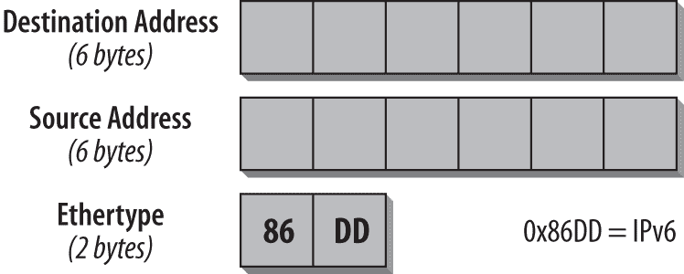图 5-1. IPv6 数据报的以太网头部

目标地址和源地址字段各自有六个字节，以太网类型字段占两个字节，包含 IPv6 的值`0x86DD`。

对于无状态地址自动配置（SLAAC），可以使用 MAC 地址来构建 IPv6 接口 ID。第二章解释了这一过程是如何工作的。如果 IPv6 头部中的目标地址是多播地址，则 MAC 地址的前两个字节设置为`3333`，最后四个字节为 IPv6 目标多播地址的最后四个字节。图 5-2 显示了该格式。

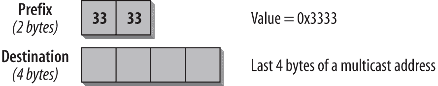图 5-2. IPv6 多播地址与以太网 MAC 地址的关系

图 5-3 展示了在跟踪文件中该如何显示。

图 5-3. IPv6 多播目标地址的 MAC 头部

在图形顶部的摘要行中，您可以看到 IPv6 源地址，它是我的路由器的地址。目标地址是所有节点的组播地址。以太网目标前缀显示`3333`，这表明该 MAC 地址是一个组播地址，剩余的四个字节包含 IPv6 目标地址的最后四个字节——在本例中是`00-00-00-01`。以太网源地址包含路由器的 MAC 地址，Ethertype 的值为 IPv6，即`0x86DD`。

RFC 2464 有一个更新版本，是我读过的最短的 RFC 之一；它是 RFC 6085，标题为“以太网上 IPv6 组播数据包的地址映射”。它允许在明确只有一个地址相关时，将组播地址映射到以太网链路层单播地址。

### 注意

关于以太网的有用信息，请参考[Charles E. Spurgeon 的站点](http://www.ethermanage.com/ethernet/ethernet.html)。他也是*Ethernet: The Definitive Guide*（O'Reilly）的作者。

### 点对点协议（RFC 5072）

*点对点协议*（PPP）是一种通过串行链路运行 IP 及其他网络协议的机制。它支持同步和异步线路。RFC 5072 描述了如何通过 PPP 传输 IPv6 数据包以及 IPv6 链路本地地址如何在 PPP 链路上形成。RFC 5172 定义了用于 IPv6 数据报压缩的压缩参数。

PPP 的 IPv6 控制协议 IPV6CP 负责在 PPP 上建立和配置 IPv6 通信。一个 IPv6 数据包可以被封装在 PPP 数据链路层帧中，协议字段被设置为`0x0057`，表示 IPv6。如果 PPP 链路要支持 IPv6，MTU 大小必须配置为 IPv6 的最小 MTU 大小，即 1,280 字节。推荐使用更高的值（1,500 字节）。

IPV6CP 有一组独特的选项用于协商 IPv6 参数。目前，IPV6CP 唯一定义的选项是接口标识符（Interface-Identifier）和 IPv6 压缩协议（IPv6-Compression Protocol）。PPP 接口没有 MAC 地址。接口标识符选项提供了一种协商 64 位接口标识符的方法，该标识符在 PPP 链路中必须唯一。IPv6 压缩选项用于协商一个特定的数据包压缩协议，仅适用于通过 PPP 链路传输的 IPv6 数据包。此选项默认情况下是禁用的。

IPv6 地址协商与 IPv4 不同。它是通过 ICMPv6 邻居发现协议完成的，而不是像 IPv4 那样通过 PPP 来进行。对于互联网服务提供商（ISP）来说，PPP 与 IPv6 结合提供了许多优势。例如，分配静态地址给客户不再是问题，因为 IPv6 地址空间足够大。而在 IPv4 中，由于地址紧缺，ISP 通常需要使用动态地址。IPv6 的地址自动配置功能支持低成本、简便的管理和客户配置。可以通过路由器发现（Router Discovery）或通过 DHCPv6 的 IPv6 前缀选项（RFC 3633）来为客户站点分配前缀。为了在 ADSL 上使用 IPv6，ISP 需要选择符合其需求的封装方式，例如基于 ATM 的 PPP（PPPoA）或基于以太网的 PPP（PPPoE）。IPv6 也影响身份验证、授权和计费（AAA）过程。使用 IPV6CP 时，地址分配发生在身份验证之后。ISP 应注意，Radius 必须支持 IPv6 属性。

### IEEE 802.15.4（RFC 4944）

该标准定义了*低速无线个人局域网*（LR-WPANs）的物理层和媒体访问控制。它旨在提供低成本、低速率的通信支持，以便不同类型的设备之间进行通信。该标准不定义更高层次的协议。诸如 6LoWPAN、ZigBee 等规范是基于此标准的。

*6LoWPAN* 是 *IPv6 在低功耗无线个人局域网* 上的缩写。有一个 IEEE 工作组，RFC 6282 定义了 IPv6 数据报在 IEEE 802.15.4 网络上传输的压缩格式。RFC 6775 定义了对邻居发现协议的优化（参见 第四章），以便在低功耗和丢包网络中工作。

*ZigBee* 是一种用于小型、低功耗无线电的通信协议规范。ZigBee 允许形成自组网。其应用包括灯光开关、电表、交通管理系统以及任何需要低速率短程无线数据传输的系统。与 6LoWPAN 不同，ZigBee 并未专门为 IPv6 进行优化。

这种技术将成为许多未来服务的基础，主要是基于传感器的通信类型。它们可以应用于任何领域：工业、安全（地震检测）、健康、娱乐等。通常这些设备的资源非常有限；这就是为什么它们需要精简且优化的技术栈。

### ATM（RFC 2492）

*异步传输模式*（ATM）是一种面向连接的高速网络技术，广泛应用于局域网（LAN）和广域网（WAN）。它通过光纤传输，利用专用的硬件和软件机制，能够达到千兆位的传输速度。

RFC 2492 描述了通过 ATM 网络传输 IPv6 数据包的规范，这是 RFC 2491 文档“IPv6 在非广播多址接入（NBMA）网络中的应用”中的补充文档。

### 帧中继（RFC 2590）

*帧中继*是一种面向连接的高速网络技术，广泛用于广域网（WAN）。它是在 1980 年代末由贝尔实验室作为 ISDN 规范的一部分开发的。该标准在 1990 年代初期得到了改进。通过使用一个简短的两字节头，帧中继在转发数据包时非常高效。

RFC 2590 规定了 IPv6 数据包如何通过帧中继链路传输，IPv6 链路本地地址如何形成，以及 IPv6 地址如何映射到帧中继地址。

下一章概述了路由和路由协议。你将需要做出若干选择，我们将讨论可用的选项。

## 上层协议

IPv6 对上层协议的影响是最小的，因为数据报服务没有发生实质性变化。本章讨论了 IPv6 上的 UDP 和 TCP，并描述了上层协议（如 DNS、DHCP、SLP、FTP、Telnet 和 HTTP）在使用 IPv6 时的变化。最重要的变化通常发生在使用 IP 地址的地方。任何使用 IP 地址的进程或应用程序都需要更新，以能够处理扩展的 128 位地址格式。使用硬编码 32 位 IPv4 地址的应用程序应该更新为使用 DNS 名称，这样 DNS 可以返回 IPv4 或 IPv6 地址，使 IP 协议完全透明。

### UDP/TCP 和校验和

校验和在不同层上计算。记住在第三章中提到，IPv6 头部没有校验和。但在传输层上校验和是非常重要的，它有助于确定数据包的传递问题。其他上层协议也可能使用校验和。所有在计算中包含 IP 地址的校验和计算必须进行修改，以适应新的 128 位地址。

传输协议如 UDP 和 TCP 会将校验和附加到它们的数据包中。校验和是通过使用*伪头部*生成的。IPv6 的 TCP 和 UDP 伪头部包含源地址、目标地址、负载长度和下一个头部值（RFC 2460）等字段。如果 IPv6 数据包包含路由头部，伪头部中使用的目标地址将是最终目标的地址。如果源地址或目标地址在传输过程中发生了变化，那么目的地的伪头部值将与初始数据包的值不匹配，这会导致校验和计算失败并产生错误报告。

由于 IPv6 地址比 IPv4 地址长得多，IPv6 规范中包含了伪头部的新版本。IPv6 伪头部规范考虑到可能在 UDP 或 TCP 层之前存在不确定数量的扩展头部，这在计算伪头部的负载长度时至关重要。接收到校验和字段值为 0 的 UDP 数据包的 IPv6 节点应该丢弃该数据包并记录错误。

### 注意

在 IPv4 中，UDP 头部中的校验和是可选的。而在 IPv6 中，UDP 的校验和计算是强制性的。

源节点计算并存储校验和，目的节点则进行验证。图 5-4 展示了用于计算 TCP 和 UDP 校验和的伪头部的格式。

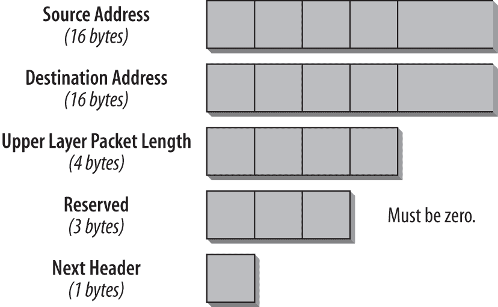图 5-4. 伪头部的格式

以下列表描述了每个字段：

*源地址（16 字节）*

IPv6 数据包的源地址。

*目的地址（16 字节）*

IPv6 数据包的目的地址。如果数据包中包含路由头，则使用最终目的地的地址进行校验和计算。在第一个节点中，该地址是路由头列表中的最后一个地址。在最终目的地，这个地址是 IPv6 头部中的目的地址。

*上层协议数据长度（4 字节）*

该字段包含上层协议头部加数据的长度。

*下一头部（1 字节）*

下一头部字段通过使用表 3-1 中列出的值来标识头部的类型，该表在第三章中介绍。

与 IPv4 使用相同的算法来计算 IPv6 的校验和。16 位的校验和是在整个伪头部上计算的。通过将源地址和目的地址包含在校验和计算中，可以检测到在传输过程中地址的任何更改。

## 多播

多播在本书的不同章节中有讨论。多播地址在第二章中有所描述，而所有基于多播的邻居发现功能则在第四章中进行了讨论。本节旨在将这些内容整合，并强调多播在 IPv6 网络中的重要性。

多播是一种高效的数据传输方式，适用于单个源将相同数据分发给多个接收者的情况。这可以是视频或音频流、会议、金融信息的分发、体育赛事、软件更新、电子学习等。通过多播，数据包不必单独发送给每个接收者。一个多播数据包可以到达所有接收者，因此大大减少了数据包的数量，尤其是在接收者数量众多的情况下。每个多播数据流由其源地址（IPv6 单播地址）和其组或多播 IPv6 地址唯一标识。多播路由确保数据包从发送者传递到所有接收者。在发送者和接收者之间的所有路由器上必须启用多播功能。路由器在接收接口接收到多播数据包后，将通过所有其他接口转发到已注册的接收者。

IPv4 多播最初并不是 IPv4 规范的一部分。它是在后期引入的，并根据经验和操作实践进行了优化。IPv6 多播规范建立在这些经验基础上，并具有一些先进的功能，使其更加高效和可扩展。多播在 IPv6 中广泛应用，执行基本功能，例如邻居发现。

### 注意

查找有关多播如何用于邻居发现的信息，请参见第四章。

### 多播寻址

多播地址的格式利用了更大的寻址空间。多播地址的官方前缀是`ff00::/8`。与 IPv4 多播最重要的区别在于，IPv6 多播地址有 4 个位用于标识作用域。作用域决定了多播的传播范围。作用域为 2（`ff02`）是链路本地作用域，仅在链路上分发。作用域为 5（`ff05`）是站点本地作用域，会被路由到站点边界。全局多播作用域是 E（`ff0e`）。其他作用域可以由网络管理员定义和配置。

### 注意

查找关于多播地址、标志和作用域字段的所有详细信息，请参见第二章。

### 组成员管理

为了接收定向到多播组的数据，节点必须为该多播组注册。这是通过使用多播管理协议来实现的。在 IPv4 中，这是 IGMP（互联网组管理协议）。在 IPv6 中，它称为*MLD*（*多播监听发现*），基于 ICMP 消息。MLDv1（对应 IGMPv2 的功能）和 MLDv2（对应 IGMPv3 的功能）。在大多数情况下，使用的是 MLDv2。MLDv2 的主要区别在于，它支持源特定的多播。在源特定的多播中，节点不仅可以为一个组注册，还可以指定其希望接收数据的来源（或指定不希望接收数据的特定来源）。

定义的 ICMPv6 消息包括：

+   多播监听查询

+   多播监听报告

+   多播监听完毕

### 注意

您可以在第四章中找到 MLDv1 和 MLDv2 消息的详细描述。

注册或注销多播组的多播消息仅与下一个跳路由器相关，因此它们具有链路本地作用域（`ff02`）。路由器需要知道每个接口上正在监听的多播组。为此，路由器保持每个多播组的注册接收者列表，或者在更精细的注册情况下，保持每个数据流（发送者/组）的列表。只有当组在其多播列表中时，路由器才会通过接口转发多播数据。一旦该组的最后一个成员离开该组，路由器将停止通过该接口转发该组的数据。

### 多播链路层协议

使用第二层多播管理协议时，交换机可以具备多播意识，这样就不需要向所有接口泛洪多播消息。*MLD 嗅探*，即 IGMP 嗅探的 IPv6 版本，可用。通过 MLD 嗅探，交换机会仅将多播消息转发到具有该多播组接收者的端口，因为 IPv6 多播数据会有选择地转发到需要接收数据的端口列表，而不是向 VLAN 中的所有端口泛洪。这个列表通过嗅探 IPv6 多播控制数据包动态构建。需要注意的是，多播对于 IPv6 的基本功能至关重要。因此，请确保交换机能够识别节点需要监听的所有组。

### 多播路由

使用 MLD 时，路由器会了解直接连接到其接口的接收者。为了为源到接收者的多播流量构建最佳路径，路由器必须相互交换关于接收者的信息。

为此目的，使用*MDT*（*多播分发树*）。树的分支通向接收者。随着接收者的加入和退出，分支会被添加或删除。树的根位于流量源，称为*SPT*（*最短路径树*）。SPT 由源地址和多播组地址标识。所有参与该树的路由器必须为其维护状态。当多个源共享同一组地址时，*ST*（*共享树*）的根位于一个管理员选择的路由器上，称为*汇聚点*。一个汇聚点可以处理多个组。

控制消息总是从接收端向树的根发送。找到上游邻居的过程称为*RPF*（*反向路径转发*）计算。因此，单播路由关注数据包的去向，而多播路由关注数据包的来源。对于每个多播数据流，每个路由器上只能有一个接收接口。如果通过多个接口接收数据流，将会发生数据包复制。

### 协议无关多播

多播路由是构建 MDT 的过程。拓扑信息保存在*TIB*（*树信息库*）中。为支持这一过程，开发了多种协议。根据部署经验，选择了几种*PIM*（*协议无关多播*）的变种。对于 IPv6，已采用三种多播路由协议：

*PIM-SM（PIM 稀疏模式）*

当多个源向同一组发送时使用（如视频会议、对等游戏）。

*PIM-SSM（PIM 源特定多播）*

PIM-SM 的子集。在单一源向多个组传输时使用（如视频或音频等内容传输）。

*PIM-Bidir（双向 PIM）*

当组中的所有成员既可以是接收者也可以是源时使用。

### 注意

关于多播和多播路由的更多信息，请参阅*Ciprian Popoviciu*、*Patrick Grossetete* 和 *Eric Levy-Abegnoli* 合著的《*Deploying IPv6 Networks*》 (Cisco Press)。

## 路由协议

要将一个 IPv6 数据报转发到一个直接连接的子网之外，需要使用路由器。路由器查看数据报的目标 IPv6 地址，并在其本地路由表中查找匹配的前缀。对于路由器来说，确保路由表中包含所有相关的目标非常重要。那么这些目标是如何进入路由表的呢？我们可以手动将其输入到所有路由器中，这叫做*静态路由*，但这并不经济。通过部署路由协议，可以实现更高效的自动化方法。*路由协议*定义了同步路由表的交换程序，使路由器之间能够动态更新（这叫做*动态路由*）。因此，使用路由协议的显著优势在于，它们能在不需要管理员干预的情况下，自动调整路由表以应对网络中的变化。

路由信息需要在*自治系统*（*AS*）内或自治系统之间进行分发。自治系统被定义为由单一管理机构控制的一组网络。将信息分发到 AS 内的路由协议被称为*内部网关协议*（*IGP*）。IPv6 的 OSPF 版本 3、RIPng、IS-IS 集成的 IPv6 支持和 EIGRP for IPv6 都属于这一类别。将信息分发到自治系统之间的路由协议被称为*外部网关协议*（*EGP*）。BGP-4 及其针对 IPv6 的扩展就属于这种协议。

本节简要概述了常见的路由协议，如 RIPng、IPv6 的 OSPF、IS-IS、EIGRPv6 和 IPv6 的 BGP-4 支持。它们是当前使用的最重要的路由协议。我不会详细描述这些协议，而是简单提及提供 IPv6 支持的最重要特性。接着，最后总结一下你在未来的 IPv6 网络环境中需要做出的路由协议选择。

本书前几版的这一章节详细讨论了 OSPFv3 和 IS-IS。写作第三版时，市场上已经有许多优秀的书籍专注于路由协议（而在 2005 年时并非如此）。因此，我决定缩短这一章节，因为我认为路由已经不再是*IPv6 基础*的一部分。

这里提到的大多数路由协议仅用于交换 IPv6 路由信息。如果 IPv4 和 IPv6 在同一网络中部署，则必须实现独立的路由协议：一个用于 IPv4，一个用于 IPv6——例如，IPv4 路由使用 OSPFv2，IPv6 路由使用 OSPFv3。目前，例外的是路由协议 BGP-4 和 IS-IS。它们可以在同一实例中交换两个 IP 协议的路由信息。未来，OSPFv3 也将支持在一个进程中同时处理两个地址族（RFC 5838，“OSPFv3 的地址族支持”）。

### 注意

本书中的*路由器*一词指的是任何能够进行 IPv6 数据包转发和/或处理相关路由协议的设备。

### 路由表

每个路由器都为其配置的每个协议维护一个路由表（也称为转发表）。因此，双栈路由器通常会有两个路由表，一个是 IPv4 路由表，一个是 IPv6 路由表。IPv6 路由表与 IPv4 路由表没有太大区别。IPv6 地址的结构较为简单，前 64 位是网络信息，后 64 位是接口 ID。

在本节中，当我们提到路由表时，通常指的是 IPv6 路由表。IPv6 路由表中的每个条目表示一个 IPv6 目标地址，从现在开始称为 IPv6 路由。表中的每个 IPv6 路由都以 IPv6 地址前缀及其长度的形式存储。对于每个 IPv6 路由，路由表中还会存储附加信息。例如，下一跳信息告诉路由器将数据包转发到该特定 IPv6 路由的哪个位置。另一种信息可能是 IPv6 路由的度量值，允许路由器在有多个条目的情况下选择最佳路径（最小度量值）以到达每个 IPv6 路由。

#### 路由表查找和内容

对于每个进入的 IPv6 数据包，路由器会检查目标地址，并在路由表中查找该地址。对于路由表中的每个 IPv6 路由，路由器将前缀长度应用于目标地址，以计算目标地址前缀。如果计算出的前缀与 IPv6 路由的前缀匹配，则表示找到了匹配项。为了优化查找，搜索算法会根据前缀长度按从最长前缀开始的顺序查找条目。如果找到了匹配项，剩余的路由表可以被忽略，因为最长匹配的前缀总是首选的 IPv6 路由。当然，这是查找过程的简化表示。实际的算法背后非常复杂，并且经过高度优化。

一旦路由器找到匹配条目，数据报将根据与此条目关联的下一跳信息转发。此外，数据报 IPv6 头部中的跳数限制值会减少 1。如果在路由表中未找到匹配项，可能会有默认路由（见下文），或者如果没有默认路由或者跳数限制值已达到零，则数据报将被丢弃。图 5-5 展示了这样的路由表示例。

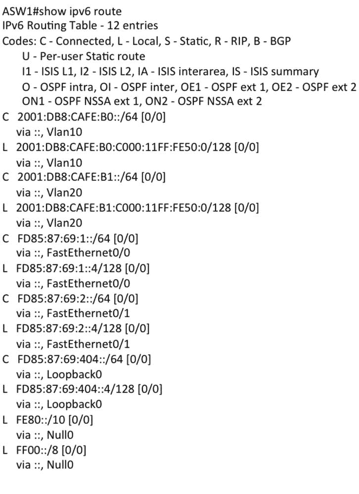图 5-5. 一个 IPv6 路由表

对于每条路由，路由器会在路由表中保留以下条目：

*IPv6 前缀和前缀长度*

前缀长度定义了 IPv6 前缀的相关位数。通常在路由表中，非相关位被设置为零。前缀长度还用于确定传入数据报的目标地址是否与此路由匹配。

*下一跳地址*

路径中第一个路由器的 IPv6 地址（通常是链路本地地址）。如果该路由直接通过本地接口连接到路由器，则无需提供下一跳地址。

*下一跳接口*

路由器用于到达下一跳地址的本地接口。

*度量*

一个表示到目标的总距离的数字。此度量值取决于将此条目放入路由表的路由协议。不同路由协议的度量计算不能互相比较。如果相同的路由被不同的路由协议知晓，路由器必须优先选择其中一个路由协议。这是通过为每个路由协议分配一个优先级值来完成的（例如，Cisco 系统将此优先级称为*管理距离*）。直接连接的路由总是具有最佳优先级，并且分配给下一跳接口的度量值（通常设置为零）。

*定时器*

距离路由信息最后更新时间的时长。

*路由源，也称为协议*

提供此条目信息的实体。例如，这可以是静态条目、直接连接的路由，或由路由协议提供的路由，如 RIPng、OSPF for IPv6、BGP 等。

#### 默认路由

*默认路由*表示所有未在路由表中明确列出的目标地址的路由。当路由器不需要了解所有目标地址时，可以使用默认路由——例如，连接远程分支办公室到主站点的路由器。它不需要了解整个自治系统的所有路由，只需知道远程办公室的本地路由；所有其他路由只能通过连接到主站点的路由访问，因此使用默认路由。

默认路由必须像其他路由一样被输入到路由表中。默认路由的下一跳地址也称为*默认路由器*或*默认网关*。所有未知路由的数据流量都将发送到默认路由器。假定默认路由器知道所有路由或本身有一个默认路由器。是否以及如何实现这种默认路由器链条，由网络设计师自行决定。此类链条的顶端路由器通常是通向另一个网络区域或自治系统的边界路由器。正是在这里，默认路由静态地输入并通过路由协议分发到相应的网络区域。分发默认路由的优势在于减少需要分发到整个网络区域的路由更新数量。默认路由不应传播得超过预期的范围——即不应离开网络区域或自治系统。默认路由在其源处分配一个度量值，以在多个默认路由器之间建立优先级。默认路由和分发必须谨慎规划和实施，以避免路由不一致。

任何长度为零的前缀都被视为默认路由，但通常会使用 IPv6 前缀`0:0:0:0:0:0:0:0`（或简写为`::`）且前缀长度为零。传入数据报的目的地址将始终匹配默认路由，因为进行比较的相关位数为零。然而，默认路由始终是路由表中的最后一条路由，因此只有在路由表中的其他路由无法匹配时，才会找到匹配项。

### 注意

默认路由最常见的用途是在附加到网络的终端系统上，如 PC、服务器、打印机等。每个系统必须有一个*默认网关*，以将流量发送到本地子网以外的目的地。与 IPv4 不同，IPv6 中没有针对默认网关的 DHCPv6 选项。IPv6 节点通过路由器公告来学习默认路由。

### RIPng

历史正在重演。就像在 IPv4 中一样，第一个进入生产环境的动态路由协议是 RIP，在这里它被称为*RIPng*。RIPng 是一个基于距离矢量算法的路由协议，这种算法被称为 Bellman-Ford 算法。RIPng 的大多数概念来自于 RIPv1 和 RIPv2，这两个协议已经为 IPv4 实现了相当长一段时间。RIPv1 在 RFC 1058 中定义；RIPv2 在 RFC 2453 中定义。RIPng 在 RFC 2080（1997 年 1 月）中定义。由于下面将解释的原因，它很少被使用。

#### RIPng 的距离矢量算法

RIPng 使用一种简单的机制来确定路由的度量值（成本）。它基本上计算到目的地的路由器数目（跳数）。每个路由器算作一个跳数。度量值大于或等于 16 的路由被认为是无法到达的。路由器定期通过 RIPng 响应消息将其路由信息分发给直接连接的邻居。收到邻居的 RIPng 响应消息后，路由器将邻居与自己之间的距离（通常是 1，即一个跳数）加到每个接收到的路由的度量值上。然后，路由器使用贝尔曼-福特算法处理新接收到的路由条目。

当路由器第一次初始化时，它们只知道直接连接的路由。这些信息会传递给所有邻居，经过处理后再分发给他们的邻居。最终，所有 IPv6 路由都被所有路由器知晓。路由器定期发送响应消息，以防止有效路由过期。所有路由器学习新路由所需的时间被称为*收敛时间*。

#### 协议的限制

RIPng，像早期版本的 RIP 一样，主要设计用于中等规模网络中的 IGP。RIP 版本 1 和 2 的限制同样适用于 RIPng。这些限制在下面的列表中描述：

*RIPng 的直径是有限制的*。

通过 RIPng 传播的任何 IPv6 路由的最长路径的度量值被限制为 15。通常，这意味着路径上最多有 15 个跳数。该协议允许为任何链路分配更大的成本，从而进一步限制跳数。度量值为 16 或更大的路由被认为是不可达的。

*路由环路可能导致较高的收敛时间*。

当 IPv6 路由在环路环境中不再有效时，RIPng 会持续将度量值增加 1。这些路由将被无限传播（“计数到无穷大”）。限制度量值为 16 的机制可以防止这种情况发生。路由将循环，直到达到最大度量值，并最终被淘汰。

*度量值不反映线路速度*。

RIPng 使用一个固定的度量值，通常设置为每跨越一个链路就为 1。路由不能根据带宽或实时参数（如测量的延迟、负载或可靠性）来选择。

#### 拓扑变化和防止不稳定性

当拓扑发生变化时，路由被新添加或下线。新添加的路由将在与该路由有直接连接的路由器发送的下一条响应消息中进行通告。它的邻居处理该路由并将其传递给他们的邻居。最终，所有路由器都知道新添加的路由。

如果一条路由下线或路由器崩溃会发生什么？这些路由最终会超时，因为它们不再被通告。问题是这个过程需要多长时间，以及这个时间对网络是否可接受。

在某些场景下，RIP 存在严重的限制。为克服这些限制，定义了两个过程：通过*分割地平线*，路由器从不通过其下一跳接口广告路由。另一种选项是*分割地平线与毒性反转*。使用该选项时，路由器总是通过其下一跳接口广告路由，且度量为 16。尽管 RIPng 支持 IPv6，但我们不推荐使用它。

### OSPF for IPv6（OSPFv3）

OSPF for IPv6 修改了现有的 OSPF for IPv4，以支持 IPv6。OSPF for IPv4 的基本原理保持不变。为了适应 IPv6 地址大小的增加和 IPv4 与 IPv6 之间协议语义的变化，做出了一些必要的修改。OSPF for IPv6 定义在 RFC 5340 中，强调了 OSPF for IPv4 和 OSPF for IPv6 之间的差异。它包含大量对 OSPF for IPv4 文档的引用，这使得它难以阅读。

#### OSPF for IPv6 概述

OSPF for IPv4（OSPFv2）在 RFC 2328 中进行了标准化。除了该文档外，还定义了若干 OSPF 扩展。RFC 1584 描述了 OSPF 的 IPv4 多播扩展。RFC 3101 为 OSPF 添加了“非完全骨干区域”（NSSA）。RFC 5340 修改了 OSPF 以支持 IPv6 的路由信息交换。OSPF for IPv6 有一个新的版本号：版本 3。

OSPF 被分类为内部网关协议（IGP），用于自治系统内部。它的设计旨在克服 RIP 引入的一些限制，例如小直径、长收敛时间和无法反映网络特征的度量。此外，OSPF 能够处理更大的路由表，以适应大量的路由。

#### OSPF for IPv4 和 OSPF for IPv6 的区别

大部分 OSPF for IPv4 的概念被保留；以下是一些变化的简要概述：

*协议处理按链路进行，而非按子网进行*

IPv6 将接口连接到链路。可以将多个 IP 子网分配到单个链路上，即使两个节点不共享相同的 IP 子网，它们也可以通过单个链路直接通信。OSPF for IPv6 按链路进行，而非按子网进行。在 OSPF for IPv4 中使用的术语*网络*和*子网*应替换为*链路*，即 OSPF 接口现在连接到链路而非 IP 子网。

*移除地址语义*

IPv6 地址不再出现在 OSPF 数据包头部。它们仅允许作为有效载荷信息存在。

路由器-LSA 和网络-LSA 不包含 IPv6 地址。OSPF 路由器 ID、区域 ID 和链路状态 ID 仍为 32 位，因此不能取 IPv6 地址的值。指定路由器（DR）和备份指定路由器（BDR）现在总是通过其路由器 ID 进行标识，而不是其 IP 地址。

*泛洪范围*

每种 LSA 类型都包含一个明确的代码，用于指定其泛洪范围。该代码嵌入在 LS 类型字段中。已引入三种泛洪范围：链路-local、区域和自治系统（AS）。

*明确支持每个链路的多个实例*

现在多个 OSPF 协议实例可以在单一链路上运行。这允许不同的自治系统（每个系统都运行 OSPF）共享同一链路。该功能的另一个用途是使单一链路属于多个区域。

*链路本地地址的使用*

OSPF 假定每个接口都已分配链路本地单播地址。所有 OSPF 数据包都使用链路本地地址作为源地址。路由器学习到所有邻居的链路本地地址，并将这些地址用作下一跳地址。然而，在虚拟链路上发送的数据包必须使用全局或本地 IP 地址作为 OSPF 数据包的源地址。

*身份验证*

由于 OSPF for IPv6 运行在 IPv6 上，它依赖于 IP 身份验证头（IP Authentication Header）和 IP 封装安全有效负载（IP Encapsulating Security Payload）来确保路由交换的完整性和身份验证。IPv4 版本的 OSPF 身份验证已被移除。唯一的完整性检查仍然存在，形式为对整个 OSPF 数据包进行计算的校验和。

*OSPF 数据包格式变更*

参见章节 IP 数据报中的封装。

*LSA 格式变更*

类型 3（汇总链路）已更名为区域间前缀 LSA（Inter-Area-Prefix-LSA）。

类型 4（AS 汇总链路）已更名为区域间路由器 LSA（Inter-Area-Router-LSA）。

两种新的 LSA 承载 IPv6 前缀信息。链路 LSA（类型 8）承载本地链路的 IPv6 地址信息，区域内前缀 LSA（类型 9）承载路由器和网络链路的 IPv6 前缀。

有关其他变化，例如链路状态 ID 和选项字段，请参见章节 “链路状态数据库”。

*处理未知 LSA 类型*

OSPF for IPv6 引入了一种更灵活的方式来处理未知 LSA 类型，而不是简单地丢弃它们。新的 LSA 处理位已被添加到 LS 类型字段中，以允许洪泛未知的 LSA 类型。

*Stub 区域支持*

OSPF 在 IPv6 中保留了 Stub 区域的概念。新增的规则指定了在 Stub 区域内洪泛未知 LSA。

#### IP 数据报中的封装

路由器使用 OSPF 数据包交换 LSA 信息，并建立和维护邻居关系（邻接）。OSPF 数据包直接封装在 IPv6 中，通过 IPv6 头部的 Next Header 字段中的协议号 89 指定。这意味着 OSPF 并不通过 TCP 或 UDP 运行。

OSPF 不使用分片，因此当发送大于 MTU 的数据包时，完全依赖 IP 分片。应尽量避免分片。潜在的大型 OSPF 数据包，如数据库描述包或链路状态更新包，可以轻松由 OSPF 自身拆分成多个数据包。

OSPF 消息通常使用出接口的链路本地 IPv6 地址作为源地址。例外情况是通过虚拟链路发送的消息，它们使用虚拟链路的本地或全局单播地址作为源地址。根据情况，OSPF 消息可以作为单播发送到特定邻居，也可以作为组播发送到多个邻居。以下两个组播地址专门用于此目的：

*AllSPFRouters*（`ff02::5`）

所有运行 OSPF 的路由器必须监听此组播地址。Hello 数据包总是发送到该地址，除非是不可广播的网络。此地址在 LSA 泛洪过程中也用于一些数据包。

*AllDRouters*（`ff02::6`）

在多访问介质上，DR 和 BDR 必须监听这个组播地址。此地址在 LSA 泛洪过程中用于一些数据包。

发送到组播地址的 OSPF 数据包具有链路本地作用域，并且它们的 IPv6 跳数限制设置为 1。它们永远不会跨越多个跳数发送。

#### 支持多个地址族

在原始的 OSPFv3 规范中，不支持 IPv4。这意味着在双栈网络中，你必须为 IPv4 运行 OSPFv2，为 IPv6 运行 OSPFv3。OSPFv2 存在一些限制，特别是对于移动操作。OSPFv3 可以克服其中的一些限制。RFC 5838，“OSPFv3 中的地址族支持”，为 OSPFv3 增加了多协议支持。实现该 RFC 后，你可以运行两个 OSPFv3 实例，一个用于 IPv4，一个用于 IPv6。每个 OSPFv3 实例维护自己的邻接关系、链路状态数据库和最短路径计算。通过在数据包头中使用实例 ID 字段来区分这些协议。启用地址族的路由器可以基于 IPv6 链路本地地址建立对等关系，并通告 IPv4 路由。通过这种方式，位于不同子网的 IPv4 路由器可以通过 IPv6 网络与彼此建立对等关系。

这一选择的替代方案是使用 IS-IS（接下来会描述），它也支持多地址族。一些大型组织选择将他们的 OSPFv2 环境迁移到 IS-IS，原因是希望使用一种协议来管理他们的过渡双栈网络。

### 使用 IS-IS 路由 IPv6

IPv6 支持与 IS-IS 在 RFC 5308 中定义。本文档基于 RFC 1195 中定义的集成 IS-IS 规范。没有深入了解集成 IS-IS 的知识，无法理解 IPv6 扩展。

IS-IS 最初定义了 *中间系统*（IS，亦称为路由器）之间交换路由信息，适用于 OSI 网络层协议 *CLNP*（*无连接网络协议*）和 *CONP*（*面向连接网络协议*）。其他协议使用不同的路由协议。每个网络层有独立的路由协议，有时被称为“夜空中的船只”。每个路由协议使用自己的资源，如 CPU 和内存，因此它们是相互独立的。

集成 IS-IS 是一种基于链路状态更新的内部路由协议。OSPF 和 IS-IS 有许多相似之处：如果你掌握了其中一个，另一个也容易理解。OSPF 在 AS 内部运行，而 IS-IS 在路由域内部运行。

集成 IS-IS 支持在所有 IS-IS 数据包（Hello、LSP 和 SNP）中包含可变长度字段（类型、长度、值字段，或 TLV）。相关的寻址信息存储在 TLV 字段中。Hello 数据包和 LSP 数据包携带一个字段，指定网络层协议。每个支持的网络层协议通过其 NLPID 来指定，NLPID 由 ISO 分配。IPv6 的 NLPID 值为 142（`0x8E`）。

RFC 定义了两个新的 IPv6 TLV。它们在下面的列表中描述。

*IPv6 可达性 TLV（类型 236）*

定义在 L1-LSP 和 L2-LSP 中广告的 IPv6 前缀。在 L2-LSP 中，它还可以通过在控制字段中设置外部位来用于广告路由域外的 IPv6 前缀。以下字段构成该 TLV：前缀长度、IPv6 前缀、度量（4 字节）和控制字段。

*IPv6 接口地址 TLV（类型 232）*

定义路由器一个或多个接口的 IPv6 地址。它在 Hello 数据包、L1-LSP 和 L2-LSP 中进行广告。在 Hello 数据包中，必须包含分配给发送 Hello 数据包的接口的链路本地 IPv6 地址。在 LSP 中，必须包含分配给路由器的全局/唯一本地地址。

### EIGRP for IPv6

增强型内部网关协议（EIGRP）是思科系统公司开发的内部路由协议（IGP）。它在一个自治系统中运行，称为 EIGRP 域。EIGRP 的主要目标是消除距离矢量路由协议的局限性（参见本节前面关于 RIP 的讨论），而不需要开发另一个基于链路状态的协议。链路状态协议由于其复杂性和数据库需求，要求路由器更高的 CPU 性能和更多的内存。因此，EIGRP 作为一种混合协议开发，结合了两者的优点。它使用所谓的*扩散更新算法（DUAL）*来计算路由。它允许快速收敛，并确保在每一时刻的路由计算中保持无环操作。只有受变化影响的路由器参与其中。

EIGRP 一直支持不同的网络层协议。对于每个网络层协议，EIGRP 以“夜间航行”的方式运行一个独立的实例。它有 IPv4、IPX、Appletalk 模块，现在也支持 IPv6。所有协议的基本功能是相同的。不同协议的语义通过协议相关的 TLV（类型、长度、值）字段实现。

思科正在开放 EIGRP 作为一个开放栈。本文撰写时它处于草案状态。是否会标准化，以及是否有其他厂商支持，仍有待观察。

### BGP-4 对 IPv6 的支持

对 IPv6 来说没有实际的 BGP。IPv6 的支持来源于 BGP-4 能够交换除 IPv4 之外的其他网络层协议的信息。BGP-4 的这些多协议扩展定义在 RFC 4760 中。定义 BGP-4 的基础 RFC 是 RFC 4271。BGP-4 是互联网中使用的主要域间路由协议。

#### BGP-4 概述

每个自治系统（AS）运行其内部路由协议（RIP、OSPF 等），以分发所有的路由信息。BGP 是一种外部路由协议，其主要功能是交换自治系统之间关于网络可达性的信息。每个自治系统都会收到由编号管理机构（如 IANA 和 RIRs，例如 ARIN、RIPE NCC 等）分配的唯一 AS 编号。

BGP 消息通过 TCP 连接传输，TCP 连接可以通过 IPv4 或 IPv6 建立。数据报文的源地址和目的地址取决于对等方配置，它们始终是单播的。BGP 连接使用著名的 TCP 端口 179。请记住，两个对等路由器之间只会建立一个 TCP 连接。

#### BGP 多协议扩展用于 IPv6

BGP-4 仅携带三项真正与 IPv4 特定相关的信息：

+   `UPDATE` 消息中的 `NLRI`（可达和撤销）包含一个 IPv4 前缀。

+   `UPDATE` 消息中的 `NEXT_HOP` 路径属性包含一个 IPv4 地址。

+   BGP 标识符位于 `OPEN` 消息和 `AGGREGATOR` 属性中。

为了使 BGP-4 能支持其他网络层协议，必须添加多协议 NLRI 及其下一跳信息。RFC 4760 扩展了 BGP，支持多种网络层协议。IPv6 是其中一个受支持的协议，这一点在单独的文档中有强调（RFC 2545）。为了适应多协议支持的新需求，BGP-4 添加了两个新属性，用于广告和撤销多协议 NLRI。BGP 标识符保持不变。因此，具有 IPv6 扩展的 BGP-4 路由器仍然需要一个本地的 IPv4 地址。为了建立交换 IPv6 前缀的 BGP 连接，对等路由器需要广告可选参数 BGP 能力以指示对 IPv6 的支持。BGP 连接和路由选择保持不变。每个实现者需要扩展 RIB 以适应 IPv6 路由。策略需要考虑 IPv6 NLRI 和下一跳信息以进行路由选择。

一个只广告 IPv6 NLRI 的 `UPDATE` 消息将不可达路由长度字段设置为 0，并且不携带任何 IPv4 NLRI。所有广告或撤销的 IPv6 路由都通过 `MP_REACH_NLRI` 和 `MP_UNREACH_NLRI` 承载。`UPDATE` 必须携带路径属性 `ORIGIN` 和 `AS_PATH`；在 IBGP 连接中，它还必须携带 `LOCAL_PREF`。`NEXT_HOP` 属性不应被携带。如果 `UPDATE` 消息包含 `NEXT_HOP` 属性，接收方必须忽略它。所有其他属性可以携带并且是可识别的。

`UPDATE` 消息可以同时通告 IPv6 NLRI 和 IPv4 NLRI，它们具有相同的路径属性。在这种情况下，所有字段都可以使用。然而，对于 IPv6 NLRI，`NEXT_HOP` 属性应被忽略。IPv4 和 IPv6 NLRI 在相应的 RIB 中是分开的。

### IPv6 网络设计的路由协议选择

在为未来的网络设计包括 IPv6 时，你需要做出许多选择。花时间分析并理解 IPv6 的新特性，因为只有这样你才能发掘它的潜力。如果你仅仅试图将 IPv4 设计镜像到 IPv6 世界中，你将失去创造不仅能够支持类似网络服务，而且能够扩展以支持未来应用和服务的网络的机会。

一般来说，IPv6 网络中的路由原则并没有不同。我们有一些特性应当优化路由效率，例如固定长度的 IPv6 头部、仅在需要选项时才插入的扩展头部，以及 IPv6 路由器不再进行分片的事实。我们最终可以使用流标签来优化数据流（当社区就共同实践达成一致时）。

IPv6 的最初计划是不会分配提供者独立（PI）地址。IPv6 的早期设计目标不仅要解决地址问题，还要解决互联网路由表溢出的难题。因此，IPv6 地址空间根据地理位置分配给 RIR（区域互联网注册机构），以保持根路由表尽可能小。然而，事实证明，零 PI 空间在现实世界中并不是一个可持续的政策。所以我们回到了有 PI 地址空间的状态，这在一定程度上打破了基于地理的分层模型，从而导致全球路由表中条目的增加。此外，IPv6 路由表不包含 32 位地址条目，而是 128 位地址条目。在双栈网络的过渡期间，路由器将维护两个路由表，一个用于 IPv4，另一个用于 IPv6。厂商必须确保转发是高效的，且在硬件中完成，同时路由器能够高效利用资源，以便路由表使用最小的内存。

为了总结不同路由协议的信息，我们提供了以下概述。

对于 IPv6 网络，以下是可用的 IGP（内部网关协议）：

*RIPng（RFC 2080）*

RIP 是一种距离矢量协议。它使用贝尔曼-福特算法。它是一个易于使用的协议，但效率远不如 OSPF 和 IS-IS。它具有 RIPv4 一直存在的所有限制，比如有限的直径、路由环路可能导致长时间的收敛，以及度量值并不代表线路速度，因为它们是基于跳数的。它不是企业网络推荐的路由协议。

*OSPFv3（RFC 5340）*

OSPFv3 是一种基于链路状态的协议。它使用 Dijkstra 算法计算最短路径树（SPF）。它使用链路本地地址交换路由信息（在重新编号时非常有帮助），并且 OSPFv2 身份验证已被移除，因为现在使用标准的 IPv6 身份验证。按照 RFC 5340 的定义，OSPFv3 作为一个独立的进程运行。你仍然需要 OSPFv2 来管理 IPv4 网络，每个版本都维护独立的路由表。RFC 5838 定义了支持 OSPFv3 多地址族的扩展。撰写时，供应商支持有限。请咨询供应商的路线图。

*IS-IS (RFC 5308)*

IS（中间系统）是 OSI 对路由器的术语。IS-IS 是一种链路状态协议，同样使用 Dijkstra 算法。它是 ISO 协议，不依赖 IP 来交换路由信息。它与 OSPF 相似，但许多管理员认为它更容易配置和管理。IPv6 已完全集成，并不像当前版本的 OSPF 那样作为独立进程运行。多年来，它主要用于服务提供商网络，在美国不太常见。近几年，它变得越来越常见，并且在企业领域的使用也越来越多。

*EIGRP for IPv6*

EIGRP 是由思科系统公司开发的。它是一种混合协议，结合了距离向量和链路状态两种协议的优点，基于扩散更新算法（DUAL）。它作为独立进程运行，因此要管理 IPv4 和 IPv6，必须使用两个实例。对于较大的环境，我们建议使用 OSPF 或 IS-IS。除了更具可扩展性，EIGRPv6 目前仅在思科设备上受支持，这会造成供应商锁定，并且在需要更新时可能会造成延迟，而在竞争激烈的多供应商支持的标准中，更新通常更快。思科正在开放 EIGRP，并且它处于标准化草案状态。是否会被其他供应商采纳还有待观察。

对于未来的双栈网络，选择最有可能的是 OSPFv2 和 OSPFv3 与 IS-IS 相比。RIPng 在企业网络中无法扩展，而 EIGRP 目前是一个专有解决方案，带有供应商锁定。

OSPF 与 IS-IS 之间可能没有明显的技术优缺点。一些公司决定同时运行两种 OSPF 版本，并且没有遇到问题。随着 OSPFv3 对多家庭支持的到来，这可能成为另一种选择。其他公司则倾向于将 OSPFv2 迁移到 IS-IS，以便未来只使用一个实例。我们预计 IS-IS 在企业多协议环境中将越来越受欢迎。拥有单一实例也意味着 IPv4 和 IPv6 的命运将紧密相连。如果你有明确的需求，要求 IPv4 和 IPv6 的路由相互独立，那么使用两个 OSPF 实例可能是你的选择。路由协议的决策还会受到其他因素的影响，比如如果你希望整合 IS-IS 而且之前使用的是 OSPF，那么你需要学习新的技术。你还需要了解 OSPFv3，但与 OSPFv2 的差别并不大。决定还取决于公司文化和市场因素，比如市场上可用的技术和资源。

## 服务质量

一开始，互联网被设计为一个简单的通信平台，主要用于支持文件传输和电子邮件。在过去的 25 年里，它发展成了一个极其复杂的全球通信基础设施，拥有众多的应用和服务。IPv4 基于一个简单的分组交换模型，以最佳努力的方式传递数据包，并没有交付保证。TCP 提供了可靠的交付，但没有控制延迟、抖动等参数的选项，也没有带宽分配的功能。

多媒体服务（如 VoIP 和视频会议）可能会有显著的带宽需求，并且通常对及时交付非常敏感。IPv4 头部中的服务类型字节（ToS）旨在为某些流量提供优先处理。然而，它从未得到广泛实施，原因之一是它的使用会延迟路由器转发数据包。由于当时几乎没有实时服务，因此没有太大的压力去寻找更好的解决方案。

IPv6 的发展，加上对实时服务日益增长的需求——因此，也包括对服务质量（QoS）特性的需求——为寻找其他解决方案提供了机会。尽管已经有了几种不同的方法，QoS 话题仍然是一个研究领域，许多新的思路正在开发中。

让我先说，使用 IPv6 实现 QoS 并不比使用 IPv4 实现 QoS 更为复杂。本节旨在为不熟悉概念的读者简要介绍 QoS，并讨论支持 QoS 的 IPv6 特性。

### QoS 基础

默认的 IP 模型对所有数据包一视同仁。它们都按照 *先到先得* 的原则，以最佳努力的方式转发。数据包在网络中选择的路径取决于可用的路由器、路由表以及整个网络的负载情况。

QoS 协议的任务是为不同的数据流提供优先级，并保证诸如带宽和延迟时间等质量。目前有两种主要架构：集成服务（IntServ）和区分服务（DiffServ）。这两种架构都使用流量策略，并可以结合使用，以在局域网（LAN）和广域网（WAN）中实现 QoS。

流量策略可用于根据特定标准使数据传输成为可能——例如，是否有足够的资源来根据数据的 QoS 要求转发数据。流量策略还可以监控数据流，并在必要时进行调整或限制。除了确保延迟敏感流量的 QoS 要求外，它们还可以用于商业目的，如根据不同服务级别控制成本。

#### 集成服务

集成服务架构（IntServ）基于每个流在端到端的基础上预留带宽和所有相关资源的范式。这要求路由器存储关于流的信息，并分析每个数据包以确定其是否属于特定流，从而根据该特定流的标准转发数据包。

RSVP（资源预留协议，RFC 2205）是 IntServ 架构的一部分。RFC 2210，“RSVP 与 IETF 集成服务的使用”，描述了 RSVP 与 IntServ 的结合使用。RSVP 是一个信令协议，用于在 IP 网络中预留带宽和其他 QoS 资源。IntServ 结合 RSVP 的实现可能较为复杂，且由于其有限的可扩展性，不足以为全球互联网提供通用的 QoS 解决方案。

### 注意

若要查看更新的 IntServ 服务和参数名称及其关联值，请访问[`bit.ly/1na8Lmh`](http://bit.ly/1na8Lmh)。

如果您有兴趣进一步阅读关于 RSVP 和其他 QoS 信令协议的内容，请参阅信息性 RFC 4094，“现有服务质量信令协议分析”。

#### 区分服务

尽管 IntServ 提供了为不同流分配带宽的能力，但区分服务（DiffServ）架构的设计目标是实现较不精细的类别区分，以增加其在大型网络和互联网中的可扩展性和可用性。

区分服务在 RFC 2474 和 2475 中进行了规范。RFC 2474，“IPv4 和 IPv6 头部中区分服务字段（DS 字段）的定义”，规范了 DS 字段。这在 IPv4 头部的 ToS 字段和 IPv6 头部的流量类别字段中得以实现。DiffServ 路由器使用 DS 字段来确定数据包的 QoS 转发要求。通信节点可以通过所谓的*每跳行为*（*PHB*）来分类其通信。基于 PHB，数据包在 DiffServ 路由器上将获得特定的处理。

一个*DiffServ (DS)域*是一个连续的 DS 路由器组，它们在所有路由器上实现了相同的服务策略。DS 域由 DS 边界路由器定义。边界路由器对传入的数据流进行分类，并确保所有经过该域的包都被适当地标记，并使用该域可用的 Per-Hop Behavior (PHB)集合中的一个行为。域内的路由器根据包中的 DiffServ 值选择转发规则，将其映射到相应的 PHB。区分服务代码点（*DSCP*；参见后文的图 5-6）值可以使用默认映射（`DSCP=0`）或为该域单独配置的映射。一个 DS 域通常由一个网络或一组网络组成，这些网络构成了一个管理单元。

一个*DS 区域*是由一组连续的 DS 域组成。DS 区域可以确保跨域路径的 DS 服务。单个域内部可以使用各自的 PHB 定义和 PHB 代码点映射。在区域内的域之间，流量调节器负责提供不同 PHB 和映射的正确转换。如果区域内所有域中的策略、PHB 组和代码点映射都相同，则不需要流量调节器。

*包分类器*根据包头中的信息和预定义规则从数据流中选择包。分类器有两种类型：行为聚合分类器（BA）根据 DS 字段对包进行分类，多个字段分类器（MF）根据不同的头字段或头字段的组合（如源地址、目的地址、DS 字段、协议号、源或目的端口，或如入接口等信息）对包进行分类。

### IPv6 协议中的 QoS

IPv6 的设计者们并未专注于要求特定的 QoS 机制，而是尽可能提供更多的灵活性以支持不同的 QoS 机制。本节描述了 IPv6 头部和扩展头部中可用于 QoS 服务的元素。

#### IPv6 头部

IPv6 头部中有两个字段可以用于 QoS：流量类和流标签字段。

##### 流量类

1 字节流量类字段的使用在 RFC 2474 中进行了规定。如前所述，该 RFC 为流量类字段引入了*DS 字段*的术语。该规范的目标是，DiffServ 路由器拥有一套已知的 DS 例程，这些例程由 DS 字段中的值决定。这些 DSCP 值映射到 Per-Hop Behaviors (PHB)，并且可以是基于性能的或基于类别的。图 5-6 展示了 DS 字段。

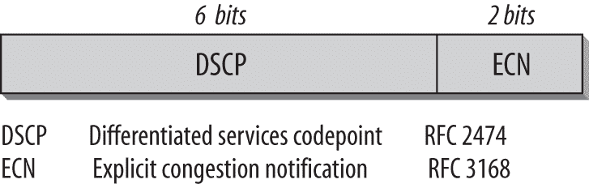图 5-6。DS 字段的格式

DS 字段中的 DSCP 字段（DS 字段的六个最重要的位）用于代码点，指定 PHB。通过这个字段，可以指定 64 个不同的代码点。这个代码点池已被分为三部分，以控制 PHB 的分配。表 5-1 显示了 DSCP 池的划分。

表 5-1. 代码点池

| 池 | 代码点空间 | 分配政策 |
| --- | --- | --- |
| 1 | xxxxx0 | 标准使用 |
| 2 | xxxx11 | 实验/本地使用 |
| 3 | xxxx01 | 实验/本地使用；未来可能用于标准化 |

通过正式标准化分配了 32 个推荐的代码点池（池 1）；另外 16 个代码点池（池 2）保留用于实验或本地使用；最后的 16 个代码点池（池 3）最初用于实验或本地使用，但如果池 1 用完，应作为溢出池使用。

PHB 指定了数据包应该如何被转发。任何 DS 路由器必须提供一个由全零 DS 代码点表示的默认 PHB。默认 PHB 描述了现有路由器中可用的普通最优转发行为。这类数据包在转发时不遵循任何优先级策略；换句话说，网络将尽可能尽快地交付这些数据包，基于现有资源，如内存或处理能力。收到未定义代码点的数据包也应按照默认行为转发。

DS 字段不指定 PHB；它指定的是代码点。代码点的数量限制为 64 个，而 PHB 的数量没有限制。已经推荐了代码点到 PHB 的映射。这些映射可以在管理域内单独定义，从而使得 PHB 的数量没有限制。PHB ID 的编码规则在 RFC 3140《每跳行为标识码》规范中进行了说明。

RFC 2597 定义了一个名为*Assured Forwarding (AF)*的 PHB 组。Assured Forwarding PHB 组是提供商 DS 域为来自客户 DS 域的 IP 数据包提供不同级别的转发保证的一种方式。定义了四个 AF 类，每个 AF 类在每个 DS 节点中分配了一定数量的转发资源（缓冲空间和带宽）。希望使用 AF PHB 组提供的服务的 IP 数据包，按客户或提供商 DS 域将其分配到这些 AF 类中的一个或多个，具体取决于客户订阅的服务。RFC 3246 定义了一个名为*Expedited Forwarding (EF)*的 PHB。EF PHB 的目的是为低丢包、低延迟和低抖动服务提供构建模块。

### 注意

推荐的代码点和 PHB ID 由 IANA 分配。代码点的列表可以在 [`www.iana.org/assignments/dscp-registry`](http://www.iana.org/assignments/dscp-registry) 找到，PHB ID 的列表可以在 [`www.iana.org/assignments/phbid-codes`](http://www.iana.org/assignments/phbid-codes) 找到。

图 5-7 显示了跟踪文件中的 DS 字段。

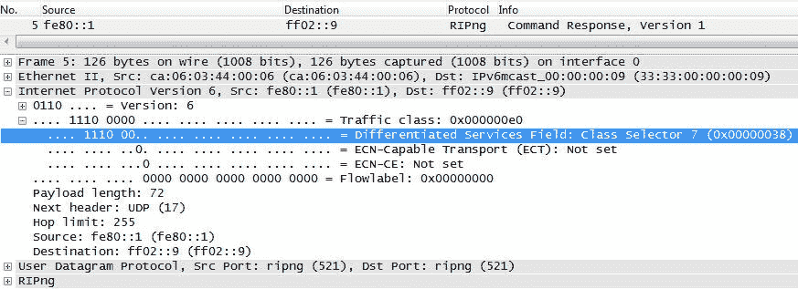图 5-7. 跟踪文件中的 DS 字段

这是来自我们路由器的 RIPng（RIP 下一代）响应。它被发送到 RIP 路由器组播地址 `ff02::9`。DS 字段被设置为 `0xE0`（十进制表示为 `224`，二进制表示为 `1110 0000`）。

DS 字段的其余两个比特（见 图 5-6）根据 RFC 2474 没有被使用，并且在 RFC 3168 中进行了说明，“将显式拥塞通知（ECN）添加到 IP 中”。它们提供了四个可能的代码点（`00` 到 `11`），用于拥塞通知。传统上，路由器的过载只能通过数据包丢失来确定。使用这些拥塞通知代码点后，路由器可以在数据包丢失之前就发出过载信号。这种方法类似于帧中继使用的 BECN 和 FECN（分别为向后和向前显式拥塞通知）。

这两个比特的使用方式如下：

+   00：数据包未使用 ECN。

+   01/10：发送方和接收方启用了 ECN。

+   11：路由器信号表示拥塞。

应该提到的是，越来越多的廉价交换机也能够解释 DSCP 值，并因此将数据包放入不同的队列。

##### 流标签

IPv6 头中的 20 位流标签字段可以由源节点用来标记数据包，要求 IPv6 路由器进行特殊处理，例如非默认 QoS 或实时服务。流标签由流的源节点分配。在发送方和接收方之间，可以并行存在多个流，同时交换没有 QoS 要求的数据包。新的流标签必须在 `00001` 到 `FFFFF` 范围内随机选择。随机分配的目的是使流标签字段中的任意比特组合都适合作为哈希键，由路由器查找与该流相关联的状态。

不支持流标签字段功能的主机或路由器（今天大多数应用程序不会修改以使用流标签，或不需要 QoS 处理）在发送数据包时需要将该字段设置为全零，在转发数据包时将字段内容保持不变，接收数据包时忽略该字段内容。

所有属于同一流的包必须使用相同的 IP 源地址、IP 目标地址、相同的源端口和目标端口，以及非零的流标签。如果这些包中有任何一个包含了“逐跳选项头”（Hop-By-Hop Options header），它们必须都具有相同的逐跳选项头内容（不包括逐跳选项头中的下一头字段，该字段可以不同）。如果任何包中包含路由扩展头（Routing Extension header），那么它们必须在所有扩展头中，直到包括路由扩展头，都具有相同的内容（同样，不包括路由扩展头中的下一头字段）。路由器或接收方可以验证这些条件是否得到满足。如果发现这些一致性规则被违反，将返回相应的错误消息，指出规则违反的确切位置。

路由器上对流标签的处理是高效的，且当使用 IPsec 时，它始终可用，因为 IPv6 头部不会被 ESP 加密或通过 AH 进行身份验证（在传输模式下）。这意味着 IPsec 无法保证 DS 字段中信息的完整性。

RFC 6437《IPv6 流标签规范》是对流标签的新规范。*流*被定义为从发送方到特定的单播、任何播或多播地址的包序列，这些包由发送方标记为一个流。流不一定与传输连接相关联。运行多个会话的主机应能够为每个会话分配不同的流标签。原始规范基于五个标准定义了流，而新规范则基于三个标准（源和目标地址以及流标签）定义流。原因是这三个字段始终可以被路由器检查，而源端口和目标端口号则可能被 ESP 隐藏。

##### 流标签的使用

流标签是 IPv6 头部中唯一的新增字段。保留了 20 位，但实际上并未使用。在 IETF 中，关于如何最佳使用此标签曾有过很多争论，部分原因是这些不确定性以及其他更为紧迫的优先事项，导致大多数厂商忽视了它。RFC 6294《IPv6 流标签提案使用案例调查》讨论了已发布的各种提案，以及它们是否与现有标准兼容。

与此同时，发布了两项规范，提供了替代用途。RFC 7098《使用 IPv6 流标签进行服务器集群的负载均衡》描述了如何使用流标签进行负载均衡，以及它如何增强第 3 层/第 4 层负载均衡器。RFC 6438《在隧道中使用 IPv6 流标签进行等成本多路径路由和链路聚合》描述了如何通过等成本多路径路由和链路聚合来使用流标签进行负载均衡，特别是针对 IPv6 隧道流量的 IP-in-IPv6。 |

#### IPv6 扩展头部 |

Hop-By-Hop Options 头部可用于每个 IP 数据包传输最多一个路由器警告信号消息（RFC 2711），发送给 QoS 敏感流量路径上的每个路由器，指示每个路由器应特别处理该 IP 数据包。使用 Hop-By-Hop Options 头部使得路由器能够快速处理数据包，因为不需要分析更高层的协议头。无法识别路由器警告选项类型的路由器应忽略该选项并继续处理头部。此外，路由器在数据包传输过程中不得更改该选项。至今已定义的路由器警告类型列在表 5-2 中。 |

表 5-2：当前已定义的路由器类型 |

| 值 | 描述 |
| --- | --- |
| 0 | IP 数据包包含多播监听器发现消息。 |
| 1 | IP 数据包包含 RSVP 消息。 |
| 2 | IP 数据包包含活动网络消息——发送方正在尝试将程序加载到路由器中，以执行定制的功能。 |
| 3–35 | IP 数据包包含聚合预留嵌套级别（RFC 3175，RSVP）。 |
| 36–65,535 | 保留给 IANA 用于未来使用。 |

### 注意 |

这些头部的详细描述可以在第三章中找到。有关路由器警告类型的最新列表，可以在[`www.iana.org/assignments/ipv6-routeralert-values`](http://www.iana.org/assignments/ipv6-routeralert-values)查看。 |

## 配置 |

在操作 IP 网络时，有两项主要的网络服务是必不可少的，分别是用于系统地址分配的 DHCPv6 和用于定位服务的 DNS。我预计 DHCPv6 将在 IPv6 企业网络中得到广泛应用，尽管 IPv6 提供了 SLAAC。原因在于，大多数组织希望能够记录和计算地址的使用情况，而使用 SLAAC 时这一点并不容易实现。而且，在运行具有长地址的 IPv6 网络，尤其是在操作双栈网络并期望跨两个协议版本运行的应用能够供所有用户访问时，DNS 的重要性比以往任何时候都更为突出。 |

### DHCP |

DHCP 被广泛用于为主机配置其 IPv4 地址和附加信息。如果你拥有一个 IPv6 网络，则无需 DHCP 来配置主机的地址信息。无状态地址自动配置机制（SLAAC）将自动为主机配置其 IPv6 地址，而无需设置 DHCP 服务器。你所需要做的只是为启用 IPv6 的路由器配置与其附加链接的前缀信息。但在许多情况下，你仍然可能选择使用 DHCP 服务器。通过 DHCP 分配 IPv6 地址的主机配置称为*有状态地址自动配置*或*有状态 DHCPv6*。也许你有一个特定的 IPv6 地址分配方案；或者你需要动态分配 DNS 服务器；或者你希望实现 DNS 动态更新（RFC 2136）；或者你需要为使用的 IP 地址提供可追溯性报告功能。在这些情况下，你可以使用 DHCP 进行地址配置。你还可以通过使用 SLAAC 配置 IPv6 地址，并使用 DHCP 服务器提供附加的配置信息（包括 DNS 服务器 IP 地址、DNS 域名或其他 DHCPv6 选项）来结合使用 SLAAC 和 DHCPv6 配置。

RFC 3736 提供了一个额外的配置选项。它定义了一个无状态 DHCP 服务用于 IPv6。无状态 DHCP 服务器可以为已经拥有 IP 地址的主机配置附加信息，如 DNS 或 SIP 服务器，但无法进行地址分配。无状态 DHCP 在本章稍后会解释，紧接着有状态 DHCPv6 部分之后。

DHCPv6 和 DHCPv4 是独立的。如果你想在双栈网络中使用 DHCP 配置主机，目前需要运行两个独立的 DHCP 服务，每个协议一个。在这种情况下，你还必须注意配置冲突。在 DHCPv4 环境中，客户端被配置为知道是否使用 DHCP。在 DHCPv6 环境中，路由器广告有选项通知客户端是否使用 DHCP。来自不同来源的配置信息可能会到达客户端，或者一个节点可能有多个接口，例如一个仅为 IPv4，另一个为双栈。DHCPv6 使用唯一标识符（DUID），而 DHCPv4 中没有该标识符。在 DHCPv4 中，MAC 地址和客户端 ID 类似于 DHCPv6 中的 DUID，但并不完全相同。RFC 4361 提供了一个使 DUID 在 DHCPv4 中可用的方案。

在 RFC 4477 中，DHCP 工作组进一步评估了需求并评估了解决方案，这将允许双栈主机通过一个或多个 DHCP 服务器为两种协议进行配置。该 RFC 描述了双 IP 版本 DHCP 交互中识别到的问题。最重要的方面是如何处理客户端处理从 DHCPv4 和 DHCPv6 服务器接收到的配置信息时可能出现的问题。它包括一个可能的解决方案，即为 DHCPv6 服务器指定 IPv4 选项，以便在双栈环境中运行 DHCPv6 服务器，并让它也为双栈客户端配置 IPv4 选项。在这种情况下，拥有 DHCPv4 的 DUID 会很有帮助。

DHCPv6 在 RFC 3315 中进行了规范。本章中的所有引用都与 DHCPv6 相关。为了开发 DHCPv6，最初定义了以下指南：

+   必须能够结合使用 DHCP 和 SLAAC。

+   DHCP 的配置及其与其他机制（例如 SLAAC）的交互是管理员的责任。

+   客户端不需要手动配置。

+   DHCP 必须能够为每个接口配置多个地址。

+   在每个子网中并不需要一个 DHCP 服务器。中继代理必须能够转发 DHCP 数据包。

+   客户端必须能够处理来自不同 DHCP 服务器的多个 DHCP 回复。

+   必须能够拥有仅部分客户端通过 DHCP 配置的子网。

+   DHCP 必须能够进行动态 DNS 更新，以便将分配的地址注册到 DNS 中。管理员可以决定手动更新 DNS。

+   DHCP 必须支持并简化网络的重新编号。

DHCPv6 规范包括对 DHCPv6 消息的认证，必须在 DHCPv6 客户端和服务器上支持。请参阅本章中关于 DHCPv6 认证的相关章节。

#### DHCP 术语

让我们定义一些用于 DHCPv6 的常见术语：

*DHCP 客户端*

DHCP 客户端向 DHCP 服务器发送请求以获取配置信息。

*DHCP 服务器*

DHCP 服务器预先配置以响应客户端请求。它知道每个客户端的配置。当它接收到客户端请求时，它将信息发送回客户端。DHCP 服务器可能位于与客户端相同的链路上，也可能不在。

*DHCP 中继代理*

如果客户端链路上没有 DHCP 服务器，则必须在客户端链路上配置中继代理。中继代理接收客户端请求并将其转发到另一个子网中的一个或多个 DHCP 服务器。当中继代理从 DHCP 服务器收到回答时，它会将其转发给客户端。

*DHCP 唯一标识符 (DUID)*

每个 DHCP 客户端和服务器都有一个 DUID。DHCP 服务器使用 DUID 来识别客户端，以便选择配置参数并将 IA（见下文）与客户端关联。DHCP 客户端在需要识别服务器的消息中使用 DUID 来标识服务器。

*身份关联 (IA)*

分配给客户端的一组地址。每个 IA 有一个与之关联的身份关联标识符（IAID），由客户端分配。客户端可以有多个 IA——例如，每个接口一个 IA。

*身份关联标识符（IAID）*

客户端选择的 IA 标识符。每个 IA 都有一个 IAID，IAID 被选择为在该客户端的所有 IA 中唯一。

*事务 ID*

用于匹配请求和回复的值。

DHCP 使用以下多播地址：

*所有 _DHCP_ 中继代理和服务器* (`ff02::1:2`)

所有 DHCP 代理（服务器和中继）都是该多播组的成员。DHCP 客户端使用这个链接范围的多播地址来联系它们的链接上的 DHCP 代理。因此，客户端不需要知道代理的链路本地地址。

*所有 _DHCP_ 服务器地址* (`ff05::1:3`)

站点内的所有 DHCP 服务器都是该多播组的成员。这个站点范围的地址由 DHCP 中继用来联系站点内的所有 DHCP 服务器。它们要么不知道服务器的单播地址，要么希望联系站点内的所有 DHCP 服务器。

以下 UDP 端口用于 DHCPv6：

*UDP 端口 546—客户端端口*

客户端监听端口 546 以接收 DHCP 消息。DHCP 服务器和中继使用该端口作为目标端口来联系 DHCP 客户端。

*UDP 端口 547—服务器/代理端口*

DHCP 服务器和中继监听端口 547 以接收 DHCP 消息。DHCP 客户端使用该端口作为目标端口来联系 DHCP 服务器和中继代理。DHCP 中继使用该端口作为目标端口来联系 DHCP 服务器。

如表 5-3 所示的消息类型已经在 RFC 3315 中定义。

表 5-3. DHCPv6 消息类型

| 消息类型 | 描述 |
| --- | --- |
| SOLICIT (1) | 客户端用来查找 DHCP 服务器。 |
| ADVERTISE (2) | 服务器对 Solicit 消息的响应。 |
| REQUEST (3) | 客户端用来从服务器获取信息。 |
| CONFIRM (4) | 客户端用来验证其地址和配置参数是否仍然有效。 |
| RENEW (5) | 客户端用来延长其 IP 地址的有效期并与原 DHCP 服务器续订其配置参数，尤其是在租约即将到期时。 |
| REBIND (6) | 客户端用来在租约即将到期且未收到 Renew 消息回复时，延长地址的有效期并与任何 DHCP 服务器续订其配置参数。 |
| REPLY (7) | DHCP 服务器用来回应 Solicit 消息（带有快速提交选项），以及回应 Request、Renew 和 Rebind 消息。回应信息请求消息时仅包含配置参数，但不包括 IP 地址。回应确认消息时，包含客户端 IP 地址是否仍然有效的确认信息（或拒绝信息）。服务器向 Release 或 Decline 消息发送回应以确认。 |
| RELEASE (8) | 由客户端用于释放其 IP 地址。该消息发送到客户端接收地址的服务器。 |
| DECLINE (9) | 由客户端用于向服务器指示其分配的一个或多个地址在链路上已被占用。客户端通过重复地址检测（DAD）来确定这一点。 |
| RECONFIGURE (10) | 由 DHCP 服务器用于通知客户端服务器有新的或更新的配置信息。客户端必须启动续租或信息请求消息，以获取更新的信息。 |
| INFORMATION REQUEST (11) | 由客户端发送，要求额外的配置参数（不包括 IP 地址信息）。 |
| RELAY-FORW (12) | 由 DHCP 中继用于将客户端消息转发到服务器。中继将客户端消息封装在中继转发消息的一个选项中。该消息可以直接发送到 DHCP 服务器，或者通过其他中继代理发送。如果 DHCP 消息被多次中继，则会多次封装。 |
| RELAY-REPL (13) | 由 DHCP 服务器通过中继向客户端发送消息。客户端消息作为选项封装在中继回复消息中。中继解封装消息并将其转发给客户端。中继回复消息沿着中继转发消息的路径返回，因此，如果路径上有多个中继代理，它也可能被多次封装。 |

由 DHCP 服务器发起的配置交换是一个非常好的新特性。例如，当 DHCP 域中的链路需要重新编号，或当新增服务或应用程序需要在客户端配置时，可以使用该功能。当服务或应用程序需要在客户端配置时，DHCP 服务器会向每个客户端的单播地址发送一个重新配置消息（类型 10）。接收到该消息的客户端必须发起续租或信息请求消息交换，以获取更新的信息。我们不是一直在等待这个吗？这是 IPv6 的实现特性，解决了我们在 DHCPv4 中遇到的一个长期存在的问题。尽管在 DHCPv4 中也可以做到这一点，但它很少被实现。IPv4 实现方式在 RFC 3203 中有定义。DHCPv4 服务器发送一个 DHCPforcerenew 消息，触发客户端进入续租状态，在该状态下客户端尝试续租其租约。

#### DHCPv6 头部格式

一般的 DHCPv6 头部格式比 DHCPv4 使用的格式简单得多。接下来我将描述它。

##### 客户端-服务器消息

所有客户端与服务器之间交换的 DHCP 消息都具有固定头部，选项部分则是可变的。

图 5-8 显示了头部格式。

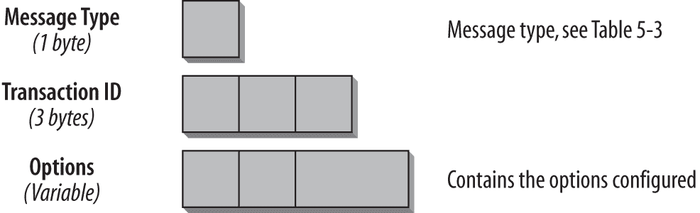图 5-8. DHCP 头部格式

消息类型字段定义了消息的类型。你可以在表 5-3 中看到消息类型的列表。对于每个请求，客户端会生成一个新的事务 ID，并将其写入事务 ID 字段。它用于与该特定请求相关的所有消息。在排查 DHCP 问题时，检查事务 ID 并确保将对应的请求和回复关联起来是非常重要的。

选项用于提供配置信息和参数。选项字段具有相同的基础格式，如图 5-9 所示。

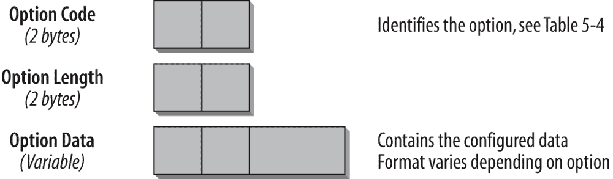图 5-9. DHCP 选项字段

*选项代码字段*定义了选项的类型。可以在表 5-4 中找到可用选项类型的概览。*选项长度字段*指示选项的字节长度。*选项数据字段*最终包含为该选项配置的信息。其格式和长度根据选项类型的不同而变化。

RFC 3315 中定义的选项是一个基础选项集。未来将定义并在单独的 RFC 中指定额外的选项。表 5-4 显示了一个概览。

表 5-4. DHCP 选项

| 选项 | 值 | 描述 |
| --- | --- | --- |
| 客户端标识符 | 1 | 用于客户端的 DUID。DUID 是一个唯一标识符（在本章稍后描述）。 |
| 服务器标识符 | 2 | 用于服务器的 DUID。 |
| 非临时地址身份关联（IA_NA） | 3 | 用于指示 IA_NA、其参数及与之关联的非临时地址。 |
| 临时地址身份关联（IA_TA） | 4 | 用于指示 IA_TA、其相关参数及临时地址。此选项中包含的所有地址都被客户端用作临时地址（根据 RFC 3041《无状态地址自动配置的隐私扩展》）。 |
| IA 地址 | 5 | 用于指示与 IA_NA 或 IA_TA 关联的地址。 |
| 选项请求 | 6 | 用于客户端与服务器之间的消息，以标识一组选项列表。可以包含在请求、续约、重绑定、确认或信息请求消息中。服务器可以在重配置消息中使用此选项来指示哪些选项已更改或添加。 |
| 优先级 | 7 | 由服务器发送，用于影响客户端选择 DHCP 服务器。 |
| 经过时间 | 8 | 包含客户端启动 DHCP 事务的时间。以百分之一秒为单位。在客户端发送的第一条消息中，设置为 `0`。可以被第二级 DHCP 服务器用于检测主服务器是否及时响应。 |
| 中继消息 | 9 | 包含中继转发或中继回复消息中的原始消息（请记住，原始消息已封装在中继转发或回复消息中）。 |
| 认证 | 11 | 包含用于验证 DHCP 消息的身份和内容的信息。 |
| 服务器单播 | 12 | 服务器向客户端发送此选项，以指示可以使用单播进行通信。该选项包含 DHCP 服务器的 IP 地址，客户端将使用该地址。 |

### 注意

你可以在[`bit.ly/1na92Wj`](http://bit.ly/1na92Wj)找到所有已定义的 DHCPv6 选项的更新列表。有关一般的 DHCP 信息，请参考 DHCP 工作组的页面：[`www.ietf.org/html.charters/dhc-charter.html`](http://www.ietf.org/html.charters/dhc-charter.html)。

#### 中继代理—服务器消息格式

如果客户端和服务器不在同一链路上，中继代理将转发客户端和服务器消息。一个 DHCP 消息可以被多个中继代理转发给一个或多个服务器。服务器的回复必须遵循原始请求的返回路径，并且必须由相同的中继代理转发。图 5-10 显示了中继代理和服务器消息中的头字段。

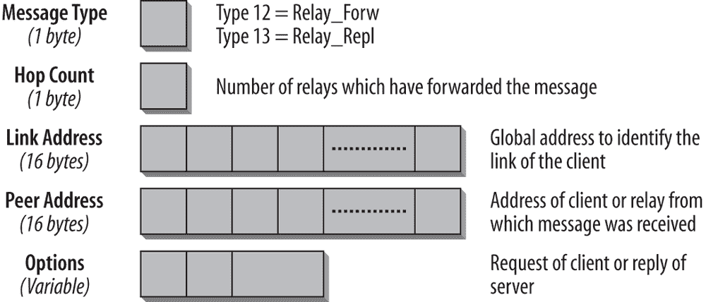图 5-10. 中继代理和服务器消息中的头字段

中继转发和中继回复消息具有相同的格式，并通过*消息类型字段*中的值来标识。类型 12 是中继转发消息，类型 13 是中继回复消息。

中继转发消息中的*跳数字段*显示消息已被多少个中继转发。每个转发的中继都会将值增加 1。中继可以预配置跳数限制，以限制转发消息的中继数量。当中继收到的消息中跳数已经达到配置的跳数限制时，它会丢弃该消息。跳数限制的默认值为 32。在中继回复消息中，跳数字段的值取自相应的中继转发消息中的跳数字段。

*链路地址字段*包含一个全局 IPv6 地址。基于中继转发消息中的这个字段，服务器可以识别请求客户端所在的链路。RFC 还提到，站点本地地址作为该字段的可能值，因为 DHCPv6 RFC 在站点本地地址被弃用之前就已发布。在中继回复消息中，该字段的值取自相应的中继转发消息。

*对端地址字段*包含接收消息的客户端或中继的地址。该字段从中继转发消息复制到中继回复消息中的相应字段。

可变大小的*选项字段*包含一个中继消息选项（选项类型 9）。在中继转发消息中，它包含客户端请求；在中继回复消息中，它包含服务器回复。

该字段还可以包含中继代理上预先配置的附加信息，且它们在转发消息时插入这些信息。这在 RFC 6422 中有说明，“中继提供的 DHCP 选项”。此内容在中继代理通信部分进行了描述。

#### DHCP 唯一标识符（DUID）

每个 DHCP 客户端和服务器都有一个 DHCP 唯一标识符（DUID），用于彼此识别。服务器使用客户端的 DUID 选择要发送的相应客户端配置。DUID 必须在所有服务器和客户端中是唯一的，且在初始分配后不应更改。RFC 3315 定义了三种不同类型的 DUID，未来可能会定义其他类型。DUID 包含一个 2 字节类型代码，后跟一个可变长度的字节序列，表示标识符。目前指定的三种类型如下：

+   链路层地址加时间（DUID-LLT）

+   基于企业编号的供应商唯一 ID（DUID-EN）

+   链路层地址（DUID-LL）

#### 身份关联

*身份关联*（IA）是客户端和服务器用于标识和管理一组地址的对象。每个 IA 都有一个相应的 IAID 并包含单独的配置信息。每个客户端在每个接口上至少有一个 IA，由 DHCP 服务器进行配置。客户端通过 IA 从服务器获取适合该接口的配置。每个 IA 只能与一个接口关联。IAID 由客户端选择，并且在该客户端的所有 IA 中必须是唯一的。IA 的配置信息包含一个或多个 IPv6 地址以及 T1/T2 定时器（续租和重新绑定定时器，详见续租/重新绑定）。

DHCP 服务器根据管理员定义的地址分配策略选择 IA 的配置信息。它根据以下标准选择配置：

+   客户端连接的链路

+   客户端的 DUID

+   客户端提供的其他信息来自选项

+   其他信息来自选项，这些选项已由中继代理添加

#### DHCP 通信

DHCP 通信中有不同的过程。包括客户端-服务器交互和通过中继代理转发消息。以下各节将更详细地描述这些过程。许多过程与 DHCPv4 相似，仅在 IPv6 相关的适配上有所不同。其他过程是新的，例如消息通过中继代理转发的方式。

##### 客户端与服务器的通信

客户端使用多播 Solicit 消息来查找 DHCP 服务器。如果客户端希望联系特定的 DHCP 服务器，它使用服务器 DUID 在 Server Identifier 选项（选项类型 2）中指定。所有 DHCP 服务器都会接收到该消息，但只有由 DUID 指定的服务器会作出回复。在某些情况下，客户端可以使用单播地址与特定服务器建立联系。只有当服务器被配置为发送 Server Unicast 选项（选项类型 12），并指示可以进行单播通信及要使用的 IP 地址时，这才可能。在这种情况下，必须注意，这些单播消息不会通过中继代理转发，因此在中继代理上进行的任何额外配置都不会插入到单播 DHCP 消息中。如果 DHCP 服务器收到来自客户端的单播消息，而该客户端未收到单播选项，它将回复一个包含状态码“使用多播”（选项 13，代码 5）的 Reply 消息。

客户端收到一个或多个 Advertise 消息作为对其 Solicit 消息的答复。如果收到多个，它会应用以下标准来选择 DHCP 服务器：

+   首选具有最高服务器首选值的消息。

+   如果有多个具有相同服务器首选值的消息，它将选择具有优选配置的消息。

+   如果包含更合适的配置参数，客户端也可能选择首选服务器偏好值较低的消息。

服务器列表及其对应的首选项值存储在客户端。如果客户端没有从其首选的 DHCP 服务器收到回复，它将选择列表中的下一个服务器。如果客户端在一定时间内没有收到 DHCP 服务器的答复，它要么通过发送另一个 Solicit 消息来启动新的发现过程，要么结束配置并生成错误消息。

在回复 Advertise 消息时，客户端向其中一个 DHCP 服务器发送 Request 消息，包括其 IA 选项、客户端 DUID 和 Option Request 选项，其中包含所需的 DHCP 选项。服务器以包含请求选项的 Reply 消息作出回复。如果服务器收到通过中继代理转发的 Request 消息（在 Relay Forward 消息中），它将通过与传入 Request 消息相同的中继代理转发一个 Relay Reply 消息。服务器会将 Reply 消息中分配的地址标记为已分配。如果客户端收到多个 Reply，它会选择最合适的一个，并使用这些地址。其他服务器通过其 Advertise 消息分配的地址仍然保持分配状态，但不会被使用。当这些地址的有效期过期后，它们将由 DHCP 服务器重新使用。

客户端必须对每个由 DHCP 服务器分配的地址执行重复地址检测（DAD）。

### 注意

有关 DAD 的解释，请参阅邻居发现（Neighbor Discovery）部分，见第四章。

执行状态地址自动配置的客户端进行的典型 DHCP 通信如下所示：

1.  客户端发送请求（Solicit）消息。

1.  服务器(s)以广告（Advertise）消息回复。

1.  客户端向一个服务器发送请求（Request）消息。

1.  服务器以回复（Reply）消息进行回应。

通过*快速提交（Rapid Commit）选项*，该通信可以缩短为仅包含两条消息。在这种情况下，客户端发送一条包含快速提交选项的请求消息。服务器回复一条包含快速提交选项的回复消息。如果客户端发送了一条包含快速提交选项的请求消息，它将忽略任何不包含快速提交选项的回复。如果客户端没有收到包含快速提交选项的回复，它可以接受传入的广告消息并继续常规配置过程。如果服务器收到一条包含快速提交选项的请求消息，并且没有配置使用该选项，它将以常规的广告消息回复。虽然快速提交通过仅使用两条消息提供了更高效的地址分配方法，但根据配置和 DHCP 服务器的数量，它可能导致地址空间浪费或多个 DHCPv6 服务器认为自己为请求的客户端分配了地址。一旦 DHCP 服务器在带有快速提交选项的回复消息中分配了一个地址，它必须将该 IP 地址提交给客户端。显然，由于/64 的广阔地址空间，这可能不是一个大问题。

客户端根据需要使用请求（Request）、续租（Renew）、重新绑定（Rebind）、释放（Release）和拒绝（Decline）消息，来管理其由服务器分配的地址的生命周期。如果客户端切换链路或子网（例如，在无线网络中或从睡眠模式中唤醒后），它必须启动确认/回复交换。它通过发送其 IA（接口标识符）以及相应的地址和选项来完成此操作。如果客户端没有收到确认消息的答复，它应该继续使用先前分配的地址。

为了释放一个或多个地址，客户端发送释放（Release）消息，该消息包含 IA 及相应的地址和选项。服务器以回复消息进行回应。如果客户端没有收到回复，它会发送另一条释放消息。这并非在所有情况下都可能发生——例如，当客户端关闭时。如果 DHCP 服务器未收到释放消息，它将在地址的生命周期过期后重新使用这些地址。

如果客户端注意到一个分配的地址已经在使用（例如，通过 DAD 检测），它会向服务器发送拒绝（Decline）消息。此消息包含事务 ID、客户端标识符、服务器标识符以及地址。

##### 续租/重新绑定

如果客户端想要刷新其有效和首选地址的生存时间，它会发送一个续租（Renew，类型 5）消息，消息中包含 IA 地址选项以及与此 IA 相对应的地址。服务器会识别相应的生存时间并向客户端发送一个应答消息。这样做也可能通过将旧地址的生存时间设置为 0 来添加新地址或删除旧地址。

如果服务器收到一个续租消息，但该 IA 没有对应的条目，它会回复一个应答消息，并将状态码设置为“无绑定”（option 13，code 3）。如果客户端想续租一个不再有效的地址，服务器会发送一个应答消息，将地址的生存时间设置为 0。

服务器通过预配置的定时器 T1 和 T2 来控制客户端续租地址的间隔，这些定时器与每个 IA 相关联。当客户端达到 T1 所指示的时间时，它必须开始续租过程。当客户端达到 T2 所指示的时间时，表示其续租消息未得到应答。在这种情况下，它会向所有 DHCP 服务器发送重绑定（Rebind）消息。重绑定消息包含一个 IA 选项，包含当前分配的地址，以及一个选项请求（Option Request）选项，包含所有所需的 DHCP 选项。

当服务器接收到重绑定（Rebind）消息并找到相应的 IA（接口地址）时，它会回复一个应答（Reply）消息。如果这些地址不再对该链路有效，服务器会将生存时间（lifetime）设置为 0。如果客户端没有收到重绑定消息的应答，它将无法继续使用该地址。在这种情况下，客户端有两个选项：

+   通过发送一个请求消息来重新启动地址配置，以寻找一个 DHCP 服务器。

+   如果客户端有其他有效的 IA，它可以忽略过期的 IA 并使用其他地址。

##### 信息请求（Information Request）

如果客户端已经拥有 IP 地址，但希望获取其他 DHCP 信息，它会发送一个信息请求消息。此消息包含一个选项请求（Option Request）选项，以指示所需的 DHCP 选项。例如，如果客户端通过无状态地址自动配置（Stateless Address Autoconfiguration）进行配置，并且路由器配置为在路由器通告中设置（“O-Flag”）O-Flag（其他有状态配置），这将导致客户端发送信息请求消息以获取附加信息，如 DNS、NTP 或 SIP 服务器配置。客户端还会在收到服务器的重新配置（Reconfigure）消息时发送信息请求消息。

##### 重新配置过程

服务器发送一个重新配置（Reconfigure）消息，触发客户端发送一个续约（Renew）或信息请求（Information Request）消息。当服务器更新了新的或修改过的信息时，这非常有用，确保新信息能够尽快传播。在重新配置消息中，事务 ID（Transaction ID）被设置为 0，并包含一个服务器标识符（Server Identifier）选项，其中包括服务器的 DUID 和一个客户端标识符（Client Identifier）选项，包含客户端的 DUID。此外，还可以发送一个选项请求（Option Request）选项，以指示客户端哪些选项已被更改或添加。如果客户端需要重新配置其 IP 地址，选项请求中将包含 IA 地址（IA Address）选项（类型 5）。通过重新配置消息选项（类型 19），服务器指示客户端是否需要发送续约或信息请求消息。

由于存在 DoS 攻击的风险，重新配置消息中必须使用安全机制，这意味着服务器必须使用 DHCP 认证。服务器将重新配置消息发送到每个客户端的单播 IPv6 地址。如果它不知道客户端的单播地址，它会将消息作为中继回复（Relay Reply）消息发送给中继代理（Relay Agent）。当客户端处于重新配置过程中时，不接受进一步的重新配置消息。只有在初始过程完成后，才能启动新的过程。

##### 中继代理通信

中继代理通过 DHCPv6 转发 DHCP 消息的方式与 DHCPv4 有很大不同。以下部分将详细描述中继代理通信。

中继代理使用 All_DHCP_Servers 组播地址（`ff05::1:3`）将消息转发给 DHCP 服务器。它也可以配置为使用单播地址。中继代理接收来自客户端的消息，并构建一个中继转发（Relay Forward）消息。图 5-10 显示了此消息的头部。在链接地址（Link Address）字段中，它设置了其全局 IPv6 地址，该地址具有客户端所在链接的前缀。通过这个地址，DHCP 服务器可以确定它需要为哪个前缀分配地址。跳数（Hop Count）被设置为 1。来自原始地址（即客户端 IP 地址）的源地址被复制到中继转发消息的对等地址（Peer Address）字段中。原始的 DHCP 消息被复制到中继消息选项（Relay Message Option）字段中。中继代理现在可以添加管理员预配置的其他信息。

当一个中继代理从另一个中继代理接收到转发消息，且跳数字段的值达到预配置的跳数限制时，它会忽略该消息。通过跳数限制，可以限制转发 DHCP 消息的中继代理数目。如果跳数小于跳数限制，消息将被转发。它将数据包封装到另一个转发消息头中，将跳数加 1，并将上一个中继代理的源地址复制到对等地址字段。链路地址字段设置为 0。接收到的消息会被复制到转发消息选项中。

如前所述，转发回复消息必须通过与转发消息相同的中继代理进行转发。通过刚才描述的过程，每个中继代理将接收到的消息封装到一个新的转发消息头中，这使得 DHCP 服务器能够追踪回程。在最后一个转发消息选项中，服务器找到了来自客户端的原始请求。它对此作出回复，并将答案复制到转发回复消息的转发消息选项中。它将此回复封装为与转发消息收到的中继代理数目相同的转发回复头。因此，转发回复将沿着相同的路径通过相同的中继代理返回。路径上的每个中继代理都会去掉外部头并将消息转发给下一个中继代理。路径上的最后一个中继代理收到一个转发回复消息，其中包含了服务器回复的转发消息选项字段。它移除转发回复头，并将服务器的回复转发给客户端。

表 5-5 展示了一个经过两个中继（中继 A 和中继 B）转发的数据包头部字段条目。

表 5-5. 转发和回复消息中的头部

| 头部字段 | 数据包 2 | 数据包 3 | 数据包 4 | 数据包 5 |
| --- | --- | --- | --- | --- |
|   | 中继 A 到中继 B | 中继 B 到服务器 | 服务器到中继 B | 中继 B 到中继 A |
| 消息类型 | 转发消息（类型 12） | 转发消息（类型 12） | 回复消息（类型 13） | 回复消息（类型 13） |
| 跳数 | 1 | 2 | 2 | 1 |
| 链路地址 | 中继 A | 0 | 0 | 中继 A |
| 对等地址 | 客户端 C | 中继 A | 中继 A | 客户端 C |
| 转发消息选项 | 客户端请求 | 数据包 2 | 数据包 5 | DHCP 回复 |

通信过程如下所示：

1.  客户端 C 发送了一个 DHCP 请求（数据包 1，在表 5-5 中未显示）。

1.  中继代理 A 将客户端请求（类型 12 的转发消息）转发给中继代理 B（数据包 2）。它将自己的地址复制到链路地址字段。客户端请求被复制到转发消息选项中。

1.  中继代理 B 将消息转发给 DHCP 服务器（数据包 3）。它将链路地址字段设置为 0，并将中继代理 A 的地址复制到对等地址字段。中继代理 A 收到的数据包 2 被复制到中继消息选项中。

1.  DHCP 服务器向中继代理 B 发送中继回复（类型 13）（数据包 4）。跳数、链路地址和对等地址字段从中继转发消息中复制。中继消息选项包含数据包，该数据包需要从中继代理 B 发送到中继代理 A（数据包 5）。

1.  中继代理 B 解封装数据包 5，并将其转发给中继代理 A。

1.  中继代理 A 从中继消息选项中获取服务器回复并将其转发给客户端 C。

如前所述，中继代理可能拥有客户端的信息，但它无法将这些信息发送给客户端。RFC 6422 规定了*中继提供的选项选项*（*RSOO*，选项代码 66）。中继将这些附加选项封装在 RSOO 中。然后，DHCP 服务器可以将这些选项添加到发送给客户端的 DHCP 回复中。这些选项必须被特别定义为启用了 RSOO 的选项，并参照 RFC 6422。RFC 6422 发布之前定义的选项不是启用了 RSOO 的选项。

### 注意

启用 RSOO 的选项列表可以在 [`bit.ly/1na9bZQ`](http://bit.ly/1na9bZQ)（滚动到页面底部）找到。

##### 跟踪文件中的 DHCPv6 通信

在这一部分，我想向你展示一个 DHCPv6 跟踪文件，该文件是在课堂上捕获的。

如 第四章 所述，客户端通过路由广告（RA）得知它需要使用 DHCPv6 以获取 IPv6 地址。图 5-11 显示了路由广告的样子。

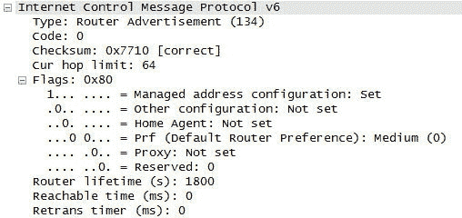图 5-11. 路由广告中的 DHCPv6 标志

在启动过程中，客户端发送路由请求。如果存在一个 IPv6 路由器并且已正确配置（“O-Flag”），客户端将收到一个路由广告，其中一个或两个 DHCPv6 标志被设置为 1，*管理配置标志*（*M-Flag*）和*其他状态配置标志*（*O-Flag*）。当客户端收到此消息时，它将启动 DHCP 请求。

图 5-12 显示了通信。

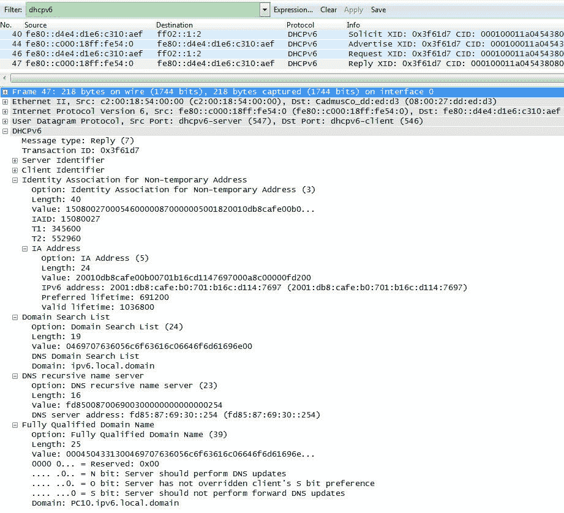图 5-12. 跟踪文件中的 DHCPv6 通信

如图最上方所示，我在 Wireshark 中设置了一个过滤器，只显示 DHCPv6 通信。因此，汇总行显示了之前描述的四个 DHCPv6 数据包：Solicit、Advertise、Request 和 Reply。数据包编号 47 被标记，并在图的下方显示了该回复数据包的详细信息。

让我简要描述一下在截图中看不到详细信息的三个数据包：

+   在数据包编号 40 中，我们看到了 Solicit 消息。源地址是客户端的链路本地地址，目的地址是 All_DHCP_Relay_Agents_and_Servers 的著名多播地址（`ff02::1:2`）。UDP 源端口是 546，UDP 目标端口是 547。

+   数据包编号 44 是 DHCP 服务器的 Advertise 消息。源地址是 DHCP 服务器的地址，数据包发送到客户端的链路本地地址。

+   在数据包 46 中，客户端将其 DHCPv6 请求发送到多播地址`ff02::1:2`。

数据包编号 47 是 DHCP 服务器的 Reply 消息，这是截图中可以看到详细信息的数据包。它从 DHCP 服务器的地址发送到客户端的链路本地地址。UDP 源端口是 547（服务器端口），UDP 目标端口是 546（客户端端口）。DHCPv6 头部的第一个字段显示消息类型（Reply 为 7，参考表 5-4 获取所有选项类型编号）。下一个字段包含事务 ID。对于给定的 DHCP 通信，事务 ID 必须相同（在故障排除时非常重要）。Reply 消息包含服务器标识符（选项 2）、客户端标识符（选项类型 1）、身份关联（选项类型 3），包括两个定时器 T1 和 T2，IA 地址选项（选项类型 5），包括 IPv6 地址和生命周期参数，域名搜索列表（选项类型 24），DNS 递归名称服务器（选项类型 23）以及完全限定域名（FQDN，选项类型 39）。

#### 无状态 DHCP

在使用无状态地址自动配置来获取 IP 地址信息的环境中，客户端无法配置额外的信息，如 DNS 信息或其他选项。讨论了几种解决方案，其中一种是将此类选项添加到路由器广告中。最终，RFC 3736 指定了一种新的服务，称为 IPv6 的无状态 DHCP 服务。无状态 DHCP 服务器仅实现 DHCPv6 规范的一个子集。其使用要求主机已配置 IPv6 地址。

无状态 DHCP 服务器对包含选项请求选项（选项类型 6）的信息请求消息（消息类型 11）做出回复，并发送 Reply 消息（消息类型 7）。无状态 DHCP 服务器还可以充当中继代理。这使得通过 SLAAC 配置链路上一部分客户端时，可以从无状态 DHCP 服务器获取额外信息。同时，其他客户端使用有状态地址自动配置，它们的 DHCP 消息由充当中继代理的无状态 DHCP 服务器转发。

最后，这两个选项都已实现。无状态 DHCPv6 被开发出来，RFC 6106 定义了“用于递归 DNS 服务器和 DNS 搜索列表的路由器广告选项”。为了使其生效，必须在路由器和客户端侧都实现。目前，微软在 Windows 上不支持该功能。对于临时网络等场景，这可以作为一个不需要有状态或无状态 DHCPv6 服务器的客户端配置的良好选项。在企业环境中，大多数情况下会选择 DHCPv6 服务器，因为它能够提供可追溯性，并且可以配置其他附加选项。

#### 前缀委派

RFC 3633《IPv6 前缀选项》定义了可以用来从委派路由器或 DHCPv6 服务器向具有 DHCPv6 客户端功能的请求路由器发送前缀信息的选项。这在委派路由器无法了解与请求路由器相连网络拓扑的环境中非常有用。ISP 网络中的委派路由器或 DHCPv6 服务器使用此选项为客户网络中的路由器配置其前缀。例如，委派路由器可以为客户网络中的边界路由器分配一个 /48 前缀。边界路由器可以将 /48 前缀划分为 /64 子网，并通过路由器广告广播这些前缀。DHCP 前缀委派（DHCP-PD）独立于 DHCP 地址分配，但这两者可以结合使用。

RFC 6603《基于 DHCPv6 的前缀委派的前缀排除选项》更新了 RFC 3633。前缀排除机制适用于使用基于 DHCPv6 的前缀委派的部署场景，其中单一的汇总路由/前缀必须代表一个客户，而不是使用一个前缀来连接委派路由器和请求路由器之间的链路，另一个前缀用于客户网络。该机制允许委派路由器在与请求路由器交换 DHCPv6 消息的链路上，使用委派前缀集中的一个前缀。此机制适用于每个请求路由器都处于其自身的第二层域的网络。

#### 安全性考虑

基于 DHCP 功能的攻击在 IPv4 世界和 IPv6 世界中都可能发生。需要关注的攻击点是相同的：

+   外部未知的 DHCP 服务器向 DHCP 客户端分配虚假的地址

+   内网中存在故障或恶意的 DHCP 服务器，它们向 DHCP 客户端分配虚假的地址或其他虚假的配置信息。

+   连接到公司网络的未知外部客户端并获得内部地址

+   恶意客户端故意耗尽 IP 地址，导致有效客户端无法获取有效的 IP 地址和/或配置信息

+   恶意客户端通过发送大量请求使 DHCP 服务器无法响应有效请求

为了防止来自公司外部的 DHCP 服务器攻击网络，可以通过防火墙关闭 DHCP 端口来提供有效的保护。保护内网免受内部 DHCP 服务器的攻击同样重要。甚至不需要是恶意攻击，很多问题都来自于配置不当的测试服务器。恶意的 DHCP 服务器可能会通过伪造信息攻击客户端。例如，可能配置错误的 DNS 或 NTP 服务器，或者可能配置为无法再与本地网络通信。为了防范此类攻击，应使用认证机制（见下文）。另一种保护方式是使用 DHCP Guard，详细内容可参见 第六章中 首次跳跃安全 部分的描述。

对于 DHCPv4，防止此类攻击的方式有限。防火墙仅能防御外部攻击。除了 DHCPv4 外，只有通过厂商解决方案的形式才能使用 DHCP 通信的认证功能。

DHCPv6 的规范包括一个认证机制，该机制基于 DHCPv4 的认证（RFC 3118）。新的主机必须在接收来自 DHCP 服务器的配置信息之前获得授权和认证，消息的发送者必须经过认证，并且消息的内容必须得到保护。

以下部分概述了 RFC 3315 中指定的认证机制。如果你不熟悉安全概念和术语，请首先参考 第六章。

##### 中继代理与 DHCP 服务器之间消息的安全

为了确保中继代理与 DHCP 服务器之间的安全消息交换，使用 IPsec（传输模式和 ESP）。在每个中继代理与其通信对等方之间，必须建立独立的双向信任关系。如果消息内容不被认为是机密的，则不需要加密（无加密）。由于中继代理和 DHCP 服务器位于企业内部网络中，因此可以使用私钥。

除此之外，DHCP 服务器和中继代理会配置可信通信对等方的地址。因此，未知的 DHCP 服务器或中继代理无法侵入通信。

##### DHCP 认证

DHCP 消息的认证可以通过使用认证选项（选项 11）来实现。认证选项中携带的认证信息可以用来可靠地识别 DHCP 消息的来源，并确认 DHCP 消息的内容没有被篡改。

图 5-13 显示了认证选项的格式。

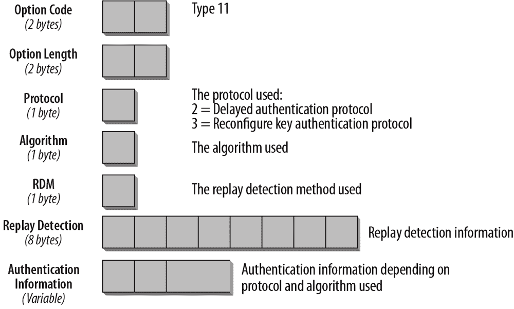图 5-13。认证选项的格式

可以使用多种认证协议与认证选项一起使用。RFC 3315 中规定了两种此类协议：延迟认证协议和重新配置密钥认证协议（RFC 3315 第二十一部分）。如果选择延迟认证协议，则使用协议号 2。如果选择重新配置密钥认证协议，则使用协议号 3。未来可能会通过独立的 RFC 指定其他协议。

不幸的是，DHCPv6 认证的支持有限。具体来说，Microsoft 在 Windows 上不支持此功能。

#### 进一步发展

IP 地址管理是高效网络管理的重要方面。IETF DHCP 工作组正在进行大量工作，以优化 DHCP。DHCP 工作组是获取关于 DHCP（IPv4 和 IPv6）当前状态以及可能的未来发展信息的最佳场所。

### 注意

DHCP 工作组可以在[`datatracker.ietf.org/wg/dhc`](http://datatracker.ietf.org/wg/dhc)找到。

特别关注的是如何管理双栈网络或仅 IPv6 网络。目前，IPv4 接口的配置使用 DHCPv4，而 IPv6 接口的配置使用 DHCPv6。因此，在双栈网络中，我们需要同时配置 DHCPv4 和 DHCPv6 服务器。需要特别注意，避免两个 DHCP 服务器之间出现重叠和矛盾的配置。RFC 4477《动态主机配置协议（DHCP）：IPv4 和 IPv6 双栈问题》讨论了这些挑战。另一个越来越重要的场景是仅 IPv6 网络。即使在这些情况下，IPv4 可能作为 IPv6-only 网络中的一种服务，主机仍然可能需要一些 IPv4 配置的信息。

当前，工作组正在研究草案，这些草案将提供通过 IPv6 传输或封装在 DHCPv6 消息中的 DHCPv4 信息。一份草案描述了为 DHCPv6 服务器定义 IPv4 选项。这份名为《通过仅 IPv6 网络配置 IPv4 信息》的草案提供了使用案例的概述，并对可能的解决方案进行了总结和讨论。有关当前草案的详细信息，请参阅本章末尾的草案参考列表。

#### 动态更新 DNS

随着 DHCP 和自动配置在动态 IP 地址配置中的广泛应用，DNS 动态更新的需求也随之产生，用于记录的添加和删除。RFC 2136 引入了名为动态 DNS（DDNS）机制。BIND 8 和 9 版本以及许多流行的 DNS 实现均支持此机制。更新功能通常由 DHCP 等应用程序使用，但也可以在主机上实现。对于 IPv6，动态地址通常通过无状态地址自动配置（SLAAC）进行分配，这意味着网络中可能没有 DHCP 服务器。因此，每个主机上都需要一个 DNS 更新机制来更新其 DNS 记录。进行 DDNS 更新时，需要考虑重要的安全方面。必须控制哪些节点被授权修改 DNS 记录。必须实现更新策略，并应使用事务签名（TSIG；参见 RFC 2845）或域名系统安全扩展（DNSSEC；参见 RFC 3007、4033、4034 和 4035）机制。RFC 4339《IPv6 主机配置 DNS 服务器信息方法》讨论了 IPv6 主机的一些通用 DNS 方面。

对于通过 DHCPv6 配置的主机，RFC 4704 定义了一种客户端 FQDN（完全限定域名）选项，可以将其添加到 Solicit、Request、Renew 或 Rebind 消息中。这允许 DHCPv6 客户端或服务器相应地更新 DNS。

对于使用 SLAAC 配置的主机，即将定义一种类似的机制。目前正在进行一项草案，名为“使用 DHCPv6 在 DNS 中注册自生成的 IPv6 地址”。该草案定义了一种新的 DHCPv6 消息类型，客户端可以使用该类型请求 DHCPv6 服务器动态地将 FQDN 选项添加到 DNS 中。

### DNS

在 IPv4 世界中，DNS 用于进行名称到地址的映射，反之亦然。IPv6 世界中这一点没有变化。实际上，由于 IPv6 地址的长度，DNS 的需求更大。混合 IPv4/IPv6 环境需要在 DNS 中有多个主机条目。与两种 TCP/IP 协议版本通信的主机需要至少两个 DNS 条目——一个是其 IPv4 地址，另一个是其 IPv6 地址。为 IPv6 主机定义了一种新的 DNS 记录类型。RFC 3596 定义了 AAAA 类型记录（称为 *Quad-A*）。RFC 2874 定义了 A6 类型记录，该记录旨在使网络重新编号和前缀变更的管理更加简便。A6 已被移至实验状态，并且不再使用。其他 DNS 记录类型（NS 和 PTR 记录）保持不变，仅调整以支持 IPv6 地址格式。

#### AAAA 记录和 IP6.ARPA

RFC 3596 描述了基于 AAAA 记录的 IPv6 实现的 DNS 扩展。该记录类型可以存储 128 位的 IPv6 地址，且此类型记录的 DNS 值为 28（十进制表示）。一个具有多个 IPv6 地址的主机会为每个地址创建一个 AAAA 记录。相应的反向查找域是 `IP6.ARPA`。反向查找记录是类型为 12 的 PTR 记录。

一个 AAAA 类型的记录可以如下所示：

```
moon.universe.com.   IN   AAAA   2001:db8:1:2:3:4:567:89ab
```

对于反向查询，每个 `IP6.ARPA` 下的子域级别表示 128 位地址的 4 位。最低有效位出现在域名的最左侧。在这种情况下，不允许省略前导零，因此前面示例的 PTR 记录如下所示：

```
b.a.9.8.7.6.5.0.4.0.0.0.3.0.0.0.2.0.0.0.1.0.0.0.8.b.d.0.1.0.0.2.IP6.ARPA.
IN  PTR   moon.universe.com.
```

请注意，在 DNS 中表示反向 IPv6 地址的方式有多种。这取决于具体的实现，因此请参考您的供应商文档以了解预期的格式。

### 注意

最初，反向域名被称为 IP6.INT。它已经被弃用（RFC 4159），并由 IP6.ARPA 替代。

#### DNS 服务器

BIND 在版本 8.4 及更高版本和版本 9 中实现了 IPv6 DNS。

基于这些版本的 BIND 实现支持 IPv6。一个好的 BIND 参考网站是[互联网系统联盟主页](http://www.isc.org/products/BIND)。该网站还列出了基于 BIND 的供应商实现，并提供了适用于不同版本微软操作系统的 BIND 版本的链接。

在 Unix 上配置名称服务器最重要的文件是*/etc/named.conf*。该文件本身包含了如何配置的详细信息。为了使名称解析在 IPv6 上工作，您需要添加一个重要的条目：`listen-on-v6 { any }`。此条目告诉名称服务器监听 IPv6 查询。然后，使用所有 IPv6 主机的条目更新 */var/named*。

我们的区域记录文件中的条目如图 5-14 所示。

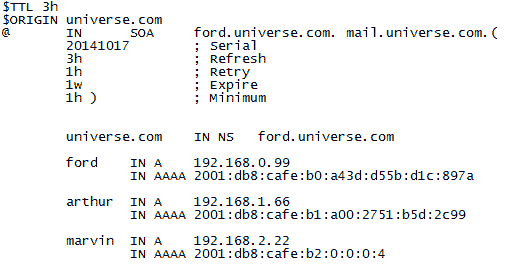图 5-14. 区域记录文件

### 注意

有关 BIND 和 DNS 配置的详细解释，请参考 Cricket Liu 的《*DNS 和 BIND 在 IPv6 上*》（O'Reilly）。

#### DNS 解析器和 DNS 设计

解析器是 DNS 通信中的客户端部分。解析器向 DNS 服务器发送关于 IP 地址的 DNS 请求。它可以是操作系统的一部分，也可以是一个应用程序。DNS 服务器也实现了一个解析器，用于向其他 DNS 服务器发送 DNS 请求。

当一个双栈主机向 DNS 服务器查询服务名称时，例如在浏览器中输入 URL，客户端将发送两个 DNS 请求，一个用于 A 记录，另一个用于 AAAA 记录。DNS 服务器可以根据其配置返回 A 记录、AAAA 记录或两者都返回。如果客户端接收到两个地址，它将根据默认地址选择规则（RFC 6724），优先选择原生 IPv6 地址而非 IPv4 地址。

### 注意

默认地址选择在第二章中讨论。

解析 DNS 名称时使用的传输协议与实际使用的连接是独立的。例如，Windows XP 无法通过 IPv6 解析 DNS 名称。Windows XP 客户端始终需要一个可以通过 IPv4 访问的 DNS 服务器。但当客户端支持双栈并且 DNS 服务器返回 AAAA 记录时，Windows XP 客户端可以通过 IPv6 发起会话。

如果客户端获取到 AAAA 记录，但没有 IPv6 连接或仅有非常差的连接，就会出现问题。IPv6 协议栈通常默认配置为优先使用 IPv6 而不是 IPv4，因此客户端会尝试通过 IPv6 进行连接。但是，由于它没有连接，客户端会长时间等待，直到最终切换回使用 IPv4（如果它为同一服务获取到了 A 记录）。在大多数情况下，用户无法理解为什么访问该网站如此缓慢，并且可能会把责任归咎于网站所有者。

这就是为什么在早期（在 2012 年 6 月 6 日的 IPv6 世界发布日之前），像 Google 和 Facebook 这样的大型双栈网站没有为其主域名提供 AAAA 记录的原因。如果你想在那个时期通过 IPv6 访问 Google 或 Facebook，你必须使用一个特定于 IPv6 的域名，例如 [`ipv6.google.com`](http://ipv6.google.com)。这些大型网站不希望因用户从 IPv6 网络连接质量差的网络中访问而导致性能下降。如果用户在访问 Google 时遇到长时间的超时，用户会认为 Google 性能差，但实际上超时是由于无法通过 IPv6 连接，并且正在等待通过 IPv4 连接。这些网站通常会为具有良好 IPv6 性能的 ISP 使用 DNS 白名单，在这种情况下，它们可以确定来自该 ISP 的用户能够无问题地通过 IPv6 访问网站。因此，只有当你连接到这样的提供商时，才会为 [`www.google.com`](http://www.google.com) 获取到 AAAA 记录。2012 年 6 月 6 日的世界 IPv6 发布日表明，只有极少数用户遇到了问题。从那时起，许多这些网站已经永久启用了主域名的 AAAA 记录。欲了解更多关于世界 IPv6 发布日的信息，请访问 [`www.worldipv6launch.org`](http://www.worldipv6launch.org)。该网站展示了参与者和测量的相关信息。

### 注意

如果你想了解当前全球 IPv6 部署的最新情况，有两个网站可以参考：[Google 统计数据](http://www.google.com/ipv6/statistics.html) 和 [Cisco 统计数据](http://6lab.cisco.com/stats)。

##### Happy Eyeballs

为了改善双栈互联网中的用户体验，定义了一项规范，称为 Happy Eyeballs。它在 RFC 6555 中进行了定义。

当客户端获取到两个地址用于某个服务时，一个是 IPv4 地址，一个是本地 IPv6 地址，默认情况下，它会通过发起 TCP 握手连接到 IPv6 地址。如果请求没有得到响应，客户端将在长时间超时后，改为使用 IPv4。若客户端到服务的 IPv6 路径中断或非常慢，就可能发生这种情况。通过实现 Happy Eyeballs 机制，客户端将同时尝试两种协议，并选择较快的协议进行连接。实现这一功能有几种方法。图 5-15 展示了这种算法。

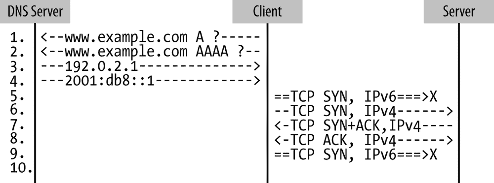图 5-15. IPv6 连接中断的 Happy Eyeballs

在这种情况下，客户端向 DNS 服务器发送两个请求，分别是*http://www.example.com*的 A 请求和 AAAA 请求。该服务是双栈的，因此 DNS 返回了两个地址，一个 IPv4 地址和一个 IPv6 地址。接下来，客户端发出了两个 TCP 同步请求（TCP 握手中的第一个数据包），一个通过 IPv6，一个通过 IPv4。在这种情况下，IPv6 连接中断，因此客户端仅收到来自 IPv4 的响应（SYN+ACK）。在下一个数据包中，客户端通过 TCP 确认握手，现在与服务的通信将通过 IPv4 进行。

不同的操作系统和浏览器对 Happy Eyeballs 有不同的实现方式。RFC 6555 描述了 Google Chrome 和 Firefox 的实现方式，如下所示：

1.  调用`getaddrinfo()`，该函数返回一个按主机地址优先级排序的 IP 地址列表。

1.  用列表中的第一个地址（例如 IPv6）发起连接尝试。

1.  如果该连接在短时间内未完成（Firefox 和 Chrome 使用 300 毫秒），则使用属于另一个地址族的第一个地址（例如 IPv4）发起连接尝试。

1.  首个建立的连接将被使用，其他连接会被丢弃。

微软在 Internet Explorer 中未实现 Happy Eyeballs，但它有一个类似的机制，根据协议性能优化连接建立。苹果也有一个与 Happy Eyeballs 类似的操作系统特定实现。

##### 名称空间分割

关于 DNS 设计，有一个重要的点需要注意：*名称空间分割*。当解析器尝试解析一个名称时，它将从根开始，并跟随转发信息，直到到达该名称的权威名称服务器。如果解析器恰好到达一个只能通过解析器无法使用的协议访问的名称服务器，则该名称无法被解析，DNS 查询失败。

因此，当 IPv6 在互联网中得到越来越多部署时，名称空间可能会被碎片化，因为可能会有只能通过 IPv4 到达的名称服务器，同时会有越来越多只能通过 IPv6 到达的名称服务器。因此，我们必须找到机制，以避免解析过程中有两个名称服务器使用不同的协议（IP 版本），从而导致解析链断裂的情况。

下面是为避免这种情况而推荐的 DNS 指导方针（引用自 RFC 3901）。为了保持名称空间的连续性，建议采取以下管理策略：

+   每个递归名称服务器**应**仅支持 IPv4 或双栈。

    这排除了仅支持 IPv6 的递归服务器。然而，可能会设计配置，让一串仅支持 IPv6 的名称服务器将查询转发给一组执行递归查询的双栈递归名称服务器。

+   每个 DNS 区域**应**至少由一个可通过 IPv4 到达的权威名称服务器提供服务。

    这排除了仅由 IPv6-only 权威名称服务器提供服务的 DNS 区域。

注意：区域验证过程**应**确保每个子委托区域的名称服务器至少有一个 IPv4 地址记录。

对于 IPv6 的集成，规划双栈 DNS 服务可能是一个好主意，因为这是防止碎片化的最佳且最灵活的方式。使用 BIND9，您还可以配置一个双栈服务器。当一个递归名称服务器需要查找仅由不支持相同协议的名称服务器提供服务的区域的数据时，它可以将递归查询转发到双栈服务器。

确保仅在服务完全通过 IPv6 可达时配置 AAAA 记录，否则您的客户端可能会经历长时间的超时，甚至完全无法访问服务。我们还必须避免仅在 DNS 中输入主机名。一台主机可能是双栈的（并且有两个 DNS 条目），而该主机上运行的某些服务可能是 IPv4 服务或 IPv6 服务。在大型企业中，出于管理原因，可能建议不要在双栈主机上混合 IPv4 和 IPv6 服务，而是将 IPv4 服务放在 IPv4 主机上，将 IPv6 服务放在 IPv6 主机上。同时，您必须确保所有获取 AAAA 记录的客户端能够通过 IPv6 连接到该服务所在的网络。如果服务在两种协议上都可用，请确保 IPv6 服务优先于 IPv4 服务，这样您的流量就可以随着时间的推移逐步转向更多地使用 IPv6，只要它可用。

#### 跟踪文件中的 DNS 通信

图 5-16 显示了跟踪文件中的 DNS 查询和应答。

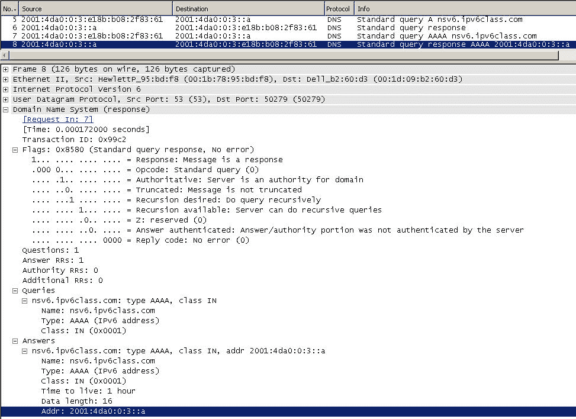图 5-16. 跟踪文件中的 DNS 通信

客户端向 DNS 服务器发出对 [`nsv6.ipv6class.com`](http://nsv6.ipv6class.com) 的 DNS 请求。在第 5 包中，客户端请求一个 A 记录，并在第 6 包中收到没有答案记录的回复。请求的服务是仅支持 IPv6 的服务，因此没有 A 记录。在第 7 包中，客户端请求一个 AAAA 记录，并在第 8 包中收到答案记录。第 8 包的详细信息显示在图的下半部分。DNS 事务 ID 是 `099c2`（在请求和回复中均相同）。标志位被设置为响应、权威服务器、期望递归和可用递归。在其下方，你可以看到查询和对应的答案记录，包含生存时间和 IPv6 地址。

在这种情况下，整个 DNS 通信都通过 IPv6 进行。如前所述，也可以先通过 IPv4 进行 DNS 解析，然后通过 IPv6 连接到仅支持 IPv6 的服务。

下一章讨论了 IPv6 的安全性。

## 参考文献

以下是本章中提到的最重要的 RFC 和草案的列表。有时，我会列出一些额外的与主题相关的 RFC 供你个人进一步学习。

### RFC 文档

+   RFC 1195，“在 TCP/IP 和双重环境中使用 OSI IS-IS 路由”，1990 年

+   RFC 1321，“MD5 消息摘要算法”，1992 年

+   RFC 2080，“IPv6 的 RIPng”，1997 年

+   RFC 2104，“HMAC：消息认证的密钥散列”，1997 年

+   RFC 2136，“域名系统中的动态更新”，1997 年

+   RFC 2149，“基于 MARS 的 ATM 组播的多播服务器架构”，1997 年

+   RFC 2205，“资源保留协议（RSVP）——版本 1 功能规范”，1997 年

+   RFC 2210，“RSVP 在 IETF 综合服务中的应用”，1997 年

+   RFC 2324，“超文本咖啡壶控制协议（HTCPCP/1.0）”，1998 年

+   RFC 2328，“OSPF 第 2 版”，1998 年

+   RFC 2362，“协议无关组播——稀疏模式（PIM-SM）：协议规范”，1998 年

+   RFC 2365，“管理作用域的 IP 组播”，1998 年

+   RFC 2430，“差异化服务和流量工程（PASTE）的提供者架构”，1998 年

+   RFC 2453，“RIP 第 2 版”，1998 年

+   RFC 2464，“IPv6 数据包在以太网网络上传输”，1998 年

+   RFC 2467，“IPv6 数据包在 FDDI 网络上传输”，1998 年

+   RFC 2474，“IPv4 和 IPv6 头部中的差异化服务字段（DS 字段）定义”，1998 年

+   RFC 2475，“差异化服务架构”，1998 年

+   RFC 2491，“IPv6 在非广播多址接入（NBMA）网络上的应用”，1999 年

+   RFC 2492，“IPv6 在 ATM 网络上的应用”，1999 年

+   RFC 2597，“有保证转发 PHB 组”，1999 年

+   RFC 2590，“IPv6 数据包在帧中继网络上传输规范”，1999 年

+   RFC 2710，“IPv6 的多播监听发现（MLD）”，1999 年

+   RFC 2715，“多播路由协议的互操作性规则”，1999 年

+   RFC 2845，“DNS 的密钥事务认证（TSIG）”，2000 年

+   RFC 2884，“IP 网络中显式拥塞通知（ECN）的性能评估”，2000 年

+   RFC 2894，“IPv6 路由器重新编号”，2000 年

+   RFC 2914，“拥塞控制原则”，2000 年

+   RFC 2963, “区分服务的速率自适应整形器”，2000

+   RFC 2983, “区分服务与隧道”，2000

+   RFC 2998, “基于区分服务网络的集成服务操作框架”，2000

+   RFC 3006, “在可压缩流的存在下集成服务”，2000

+   RFC 3007, “安全域名系统（DNS）动态更新”，2000

+   RFC 3008, “域名系统安全（DNSSEC）签名授权”，2000

+   RFC 3086, “每域区分服务行为定义及其规范规则”，2001

+   RFC 3118, “DHCP 消息的认证”，2001

+   RFC 3124, “拥塞管理器”，2001

+   RFC 3140, “每跳行为标识码”，2001

+   RFC 3162, “Radius 与 IPv6”，2001

+   RFC 3168, “IP 中显式拥塞通知（ECN）的加入”，2001

+   RFC 3246, “加速转发 PHB”，2002

+   RFC 3247, “新的 EF PHB（加速转发每跳行为）定义的补充信息”，2002

+   RFC 3260, “区分服务的新术语和澄清”，2002

+   RFC 3289, “区分服务架构的管理信息库”，2002

+   RFC 3290, “区分服务路由器的非正式管理模型”，2002

+   RFC 3306, “基于单播前缀的 IPv6 组播地址”，2002

+   RFC 3307, “IPv6 组播地址分配指南”，2002

+   RFC 3315, “IPv6 动态主机配置协议（DHCPv6）”，2003

+   RFC 3317, “区分服务服务质量政策信息库”，2003

+   RFC 3353, “多协议标签交换（MPLS）环境下的 IP 组播概述”，2002

+   RFC 3569, “源特定组播（SSM）概述”，2003

+   RFC 3590, “组播监听发现（MLD）协议的源地址选择”，2003

+   RFC 3596, “支持 IP 版本 6 的 DNS 扩展”，2003

+   RFC 3633, “IPv6 前缀选项用于动态主机配置协议（DHCP）版本 6”，2003

+   RFC 3646, “IPv6（DHCPv6）动态主机配置协议的 DNS 配置选项”，2003

+   RFC 3717, “光网络上的 IP：框架”，2004

+   RFC 3736, “无状态动态主机配置协议（DHCP）服务用于 IPv6”，2004

+   RFC 3810, “IPv6 的组播监听发现版本 2（MLDv2）”，2004

+   RFC 3901, “DNS IPv6 传输操作指南”，2004

+   RFC 3956, “在 IPv6 组播地址中嵌入会面点（RP）地址”，2004

+   RFC 3971, “安全邻居发现（SEND）”，2005

+   RFC 3972, “加密生成地址（CGA）”，2005

+   RFC 3973, “协议独立的组播—密集模式（PIM-DM）：协议规范（修订版）”，2005

+   RFC 4033, “DNS 安全简介和要求”，2005

+   RFC 4034, “DNS 安全扩展的资源记录”，2005

+   RFC 4035, “DNS 安全扩展的协议修改”，2005

+   RFC 4074, “针对 IPv6 地址的 DNS 查询常见不当行为”，2005

+   RFC 4076, “IPv6 无状态动态主机配置协议（DHCPv6）重新编号要求”，2005

+   RFC 4094, “现有服务质量信令协议的分析”，2005

+   RFC 4135, “检测 IPv6 网络附加的目标”，2005

+   RFC 4159, “废弃 “ip6.int””，2005

+   RFC 4192, “没有标志日的 IPv6 网络重新编号程序”，2005

+   RFC 4243, “动态主机配置协议（DHCP）中继代理选项的供应商特定信息子选项”，2005

+   RFC 4271, “边界网关协议 4（BGP-4）”，2006

+   RFC 4282, “网络接入标识符”，2005

+   RFC 4286, “多播路由器发现（MRD）”，2005

+   RFC 4338, “通过光纤通道传输 IPv6、IPv4 和地址解析协议（ARP）数据包”，2006

+   RFC 4339, “IPv6 主机配置 DNS 服务器信息的方法”，2006

+   RFC 4361, “DHCPv4 的节点特定客户端标识符”，2006

+   RFC 4472, “IPv6 DNS 的操作考虑与问题”，2006

+   RFC 4477, “动态主机配置协议（DHCP）：IPv4 和 IPv6 双栈问题”，2006

+   RFC 4489, “生成链路范围 IPv6 多播地址的方法”，2006

+   RFC 4601, “协议独立多播—稀疏模式（PIM-SM）：协议规范（修订版）”，2006

+   RFC 4604, “使用 MLDv2 进行源特定多播”，2006

+   RFC 4703, “解决动态主机配置协议（DHCP）客户端之间的完全限定域名（FQDN）冲突”，2006

+   RFC 4704, “IPv6 动态主机配置协议（DHCPv6）客户端完全限定域名（FQDN）选项”，2006

+   RFC 4760, “BGP-4 的多协议扩展”，2007

+   RFC 4944, “在 IEEE 802.15.4 网络上传输 IPv6 数据包”，2007

+   RFC 4957, “用于检测网络附加的链路层事件通知”，2007

+   RFC 5015, “双向协议独立多播（BIDIR-PIM）”，2007

+   RFC 5072, “通过 PPP 的 IPv6”，2007

+   RFC 5172, “使用 IPv6 控制协议的 IPv6 数据报压缩协商”，2008

+   RFC 5308, “使用 IS-IS 路由 IPv6”，2008

+   RFC 5340, “OSPF 用于 IPv6”，2008

+   RFC 5796, “PIM-SM 链路本地消息的认证与机密性”，2010

+   RFC 5838, “OSPFv3 中的地址族支持”，2010

+   RFC 5887, “重新编号仍需改进”，2010

+   RFC 5942, “IPv6 子网模型：链路与子网前缀之间的关系”，2012

+   RFC 6085, “以太网中 IPv6 多播数据包的地址映射”，2011

+   RFC 6104, “IPv6 路由器广告问题陈述”，2011

+   RFC 6105, “IPv6 路由器广告保护”，2011

+   RFC 6106, “IPv6 路由器广告 DNS 配置选项”，2010

+   RFC 6119, “IS-IS 中的 IPv6 流量工程”，2011

+   RFC 6221, “轻量级 DHCPv6 中继代理”，2011

+   RFC 6226, “PIM 组到 rendezvous 点映射”，2011

+   RFC 6282, “基于 IEEE 802.15.4 网络的 IPv6 数据报压缩格式”，2011

+   RFC 6294, “IPv6 流标签提议的使用案例调查”，2011

+   RFC 6308, “互联网多播地址分配架构”，2011

+   RFC 6326, “大量链路的透明互联（TRILL）使用 IS-IS”，2011

+   RFC 6334, “IPv6 动态主机配置协议（DHCPv6）双栈精简版选项”，2011

+   RFC 6398, “IP 路由器警报考虑事项和使用”，2011

+   RFC 6422, “中继提供的 DHCP 选项”，2011

+   RFC 6434, “IPv6 节点要求”，2011

+   RFC 6436, “更新 IPv6 流标签规范的理由”，2011

+   RFC 6437, “IPv6 流标签规范”，2011

+   RFC 6438, “在隧道中使用 IPv6 流标签进行等成本多路径路由和链路聚合”，2011

+   RFC 6553, “低功耗和丢包网络（RPL）中携带 RPL 信息的数据平面数据报的 RPL 选项”，2012

+   RFC 6554, “低功耗和丢包网络（RPL）中的源路由的 IPv6 路由头”，2012

+   RFC 6555, “快乐眼球：双栈主机的成功经验”，2012

+   RFC 6556, “测试眼球幸福度”，2012

+   RFC 6603, “基于 DHCPv6 的前缀委派的前缀排除选项”，2012

+   RFC 6724, “互联网协议版本 6（IPv6）的默认地址选择”，2012

+   RFC 6775, “面向低功耗无线个人区域网络（6LoWPANs）优化的 IPv6 邻居发现”，2012

+   RFC 6822, “IS-IS 多实例”，2012

+   RFC 6845, “OSPF 混合广播和点对多点接口类型”，2013

+   RFC 6853, “DHCPv6 冗余部署考虑事项”，2013

+   RFC 6895, “域名系统（DNS）IANA 考虑事项”，2013

+   RFC 6939, “DHCPv6 中的客户端链路层地址选项”，2013

+   RFC 6977, “触发 DHCPv6 中继代理重新配置”，2013

+   RFC 6992, “IPv4 嵌入式 IPv6 数据包的路由”，2013

+   RFC 7031, “DHCPv6 故障转移要求”，2013

+   RFC 7037, “DHCPv6 中继代理的 Radius 选项”，2013

+   RFC 7078, “使用 DHCPv6 分发地址选择策略”，2014

+   RFC 7084, “IPv6 客户端边缘路由器的基本要求”，2013

+   RFC 7098, “在服务器群集中的负载均衡中使用 IPv6 流标签”，2013

### 草案

草案可以在 [`www.ietf.org/ID.html`](http://www.ietf.org/ID.html) 找到。要定位草案的最新版本，请参考 [`datatracker.ietf.org/public/pidtracker.cgi`](https://datatracker.ietf.org/public/pidtracker.cgi)。你可以输入草案名称而不加版本号，系统将显示最新版本。如果草案未显示，可能已被删除。如果它已作为 RFC 发布，RFC 编号将显示。[`tools.ietf.org/wg`](http://tools.ietf.org/wg) 也是一个非常有用的站点。关于标准化过程、RFC 和草案的更多信息可以在 附录 A 中找到。

这是我在本章中引用的一些草案列表，以及与本章主题相关的一些有趣草案：

“通过蓝牙低能耗（BLUETOOTH Low Energy）传输 IPv6 数据包”

*draft-ietf-6lo-btle-01*

“通过 IEEE 802.11p 网络传输 IPv6 数据包”

*draft-petrescu-ipv6-over-80211p-01*

“通过 DHCPv6 在 DNS 中注册自生成的 IPv6 地址”

*draft-ietf-dhc-addr-registration-04*

“在仅有 IPv6 网络上提供 IPv4 配置”

*draft-ietf-dhc-v4configuration-05*

“通过 DHCPv6 传输的 DHCPv4”

*draft-ietf-dhc-dhcpv4-over-dhcpv6-08*

“通过 IPv6 传输的 DHCPv4”

*draft-ietf-dhc-dhcpv4-over-ipv6-09*

“DHCPv6 故障转移设计”

*draft-ietf-dhc-dhcpv6-failover-design-04*

“DHCPv6 的 DHC 负载均衡算法”

*draft-ietf-dhc-dhcpv6-load-balancing-01*

“为 DHCP 委托前缀填充 DNS 反向树”

*draft-ietf-dhc-dns-pd-01*

“DHCPv6/SLAAC 地址配置交互问题陈述”

*draft-ietf-v6ops-dhcpv6-slaac-problem-00*

“DHCPv6/SLAAC 交互操作指导”

*draft-liu-v6ops-dhcpv6-slaac-guidance-01*

“减少 IPv6 邻居发现中的组播”

*draft-yourtchenko-colitti-nd-reduce-multicast-00*

“DHCPv6 与基于 RA 的主机配置比较”

*draft-yourtchenko-ra-dhcpv6-comparison-00*
