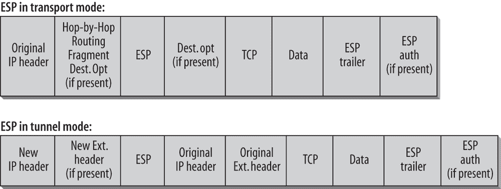

## 第六章：IPv6 的安全性

IPv4 的开发者并没有过多考虑安全性。早期的“互联网”仅连接了一些可信的网络，这些网络由一些有远见的研究人员控制。这些网络的控制者以及被允许使用网络资源的个人，默认被信任不会进行恶意或破坏性的行为。这也是原始 IP 架构没有包含一个可以供所有应用程序使用的安全框架的原因。如果需要安全性，通常只包括初步的身份验证/授权，并且这些安全功能是嵌入在应用程序代码中的（例如，Telnet 和 FTP 的密码）。许多年后，IPsec 在 IPv4 已经广泛部署后才被引入。因此，IPsec 需要被后期集成到现有的部署中。由于互操作性和性能问题，以及它是后期开发的，IPsec 并不像它在许多 IPv4 场景中应该有的那样广泛部署。与此不同的是，IPv6 从一开始就意识到，必须将基本的安全功能纳入基础协议中，以便在任何互联网平台上使用。在 IPv6 的早期，符合标准的 IPv6 实现必须包括 IPsec，以便在适当配置后实现更加安全的通信。这个严格的规定最近有所放宽，但稍后我们会详细讨论。在深入技术细节之前，我想先谈一些通用的安全概念和实践。

## 一般安全概念

为了保护数据，必须意识到可能的威胁。人们通常仅关注来自外部网络的恶意攻击。一个全面的安全概念需要考虑许多其他方面。以下是一些可能的弱点：

+   不足或不存在的 IT 安全概念及相应的规定

+   不遵守或不足够控制 IT 安全规定

+   权限篡夺（密码盗窃，特权升级）

+   错误使用或故障管理 IT 系统

+   权限滥用

+   软件中的弱点（例如，运行在超级用户权限下的应用程序中的缓冲区/堆溢出，跨站脚本攻击）

+   IT 设备、软件或数据的篡改、盗窃或破坏（物理安全）

+   网络窃听（监听有线或无线网络）或消息重放

+   木马、病毒和蠕虫

+   安全攻击，如伪装、IP 欺骗、拒绝服务（DoS）攻击、中间人攻击或 DNS 中毒

+   路由滥用

许多统计数据显示，外部的恶意攻击仅占所有可能风险的一小部分。许多威胁来自内部网络，而且在很多情况下与人为失误或管理不当有关。这些风险中的许多无法通过技术机制控制。本章不是一个整体安全概念的指南；它讨论的是与 IPv6 安全相关的技术方面。

## 一般安全实践

标准的安全实践包括两个“思维三元组”，即 CIA 和 AAA。CIA 三元组包括：

*机密性*

存储或传输的信息不能被未授权方读取或篡改。

*完整性*

任何对传输或存储信息的篡改都可以被检测到。

*可用性*

相关信息随时可以供授权用户访问。

AAA 三元组包括：

*身份验证*

确保某个人或群体确实是他们所声称的身份。明确声明身份的行为。常见的身份验证方式包括用户名和密码或 ATM 卡/密码组合。

*授权*

确保经过身份验证的用户或群体拥有访问其尝试访问的信息的适当权限。常见的实现方式包括访问控制列表（ACL）。

*审计*

收集资源使用信息的行为。HTTP 服务器的日志是常见的审计形式。

*不可否认性* 不包括在 CIA/AAA 三元组中。不可否认性意味着任何涉及的方都不能否认特定的行为，如发送、接收或删除信息。

这些安全要求需要由两个基本的安全元素提供：加密（提供机密性）和安全校验和或哈希（提供完整性）。这两种元素的适当组合可以用于提供更复杂的服务，如真实性和不可否认性。

常用的加密方式有两种。第一种称为 *秘密密钥密码学*，也叫 *对称密钥加密*，它要求发送者和接收者达成一致，使用共享的秘密（即密钥或密码）来加密和解密交换的信息。常见的对称密钥算法有 AES、DES、3DES、IDEA 和 RC-4。

第二种叫做*公钥密码学*，也称为*非对称加密*。非对称加密算法使用一对密钥，包括已知并分发的公钥和个人私钥。当消息使用公钥加密后，接收方使用相应的私钥解密时，只有预定的接收者才能看到加密的消息。这种加密形式可以用于建立机密数据交换。如果此外，消息还使用发送者的私钥加密，并由接收者用相应的公钥解密，则增加了数据源认证和不可否认性安全服务。常见的非对称密钥算法有 RSA、ElGamal 和椭圆曲线密码学（ECC）。

安全的校验和或哈希函数通常提供数据完整性。哈希函数接受任意长度的输入并输出固定长度的代码。该固定长度输出称为*信息摘要*，或*哈希*，即原始输入消息的摘要。这些哈希是唯一的，从而提供了消息的完整性。常见的单向哈希函数有 SHA-1 和 MD-5。

IPsec 标准结合了基于对称加密和非对称加密的算法选择，以及单向哈希函数。本章描述了 IPsec 框架和 IPv6 中的安全元素，并讨论了在保护 IPv6 网络时需要注意的特殊问题。

## IPsec 基础知识

IPsec，描述于 RFC 4301，定义了 IPv4 和 IPv6 两个版本的 IP 的安全架构。

以下元素是 IPsec 框架的一部分：

+   网络层的安全要求和机制的一般描述

+   用于加密的协议（封装安全负载，或 ESP）

+   用于身份验证的协议（身份验证头，或 AH）

+   用于加密和身份验证的密码学算法的定义

+   定义通信对等体之间的安全策略和安全关联

+   密钥管理

IPsec 的配置在受保护区域和非受保护区域之间创建了一个边界。这个边界可以围绕单个主机或一个网络。管理员指定的访问控制规则决定了跨越边界的数据包的处理方式。安全要求由*安全策略数据库*（SPD）定义。通常，根据*选择器*确定的适用 SPD 策略，每个数据包要么通过 IPsec 安全服务保护，要么被丢弃，或者允许绕过 IPsec 保护。选择器是管理员定义的特定流量匹配标准——例如，从子网传输到特定终端主机的特定应用程序。

### 安全关联

*安全关联*（SA）是通信对等体之间的协议。协议包含三个元素：一个密钥、一个加密或认证机制以及算法的其他参数。SA 是单向的，每个单独的安全服务都需要一个 SA。这意味着，两个希望加密和认证双向通信的通信对等体需要四个 SA（一个加密对和一个认证对）。双向应用流量——例如，双向 Telnet 连接——也需要在每个通信对等体上配置四个 SA。对等体 A 必须保护其发起的流量和来自对等体 B 的回传流量。它还需要两个额外的 SA，以确保如果对等体 B 发起 Telnet 会话，则该会话及其回传流量也能得到保护。

IPsec 区分了两种传输模式：

*传输模式*

SA 是在两个端节点之间建立的，并定义了该连接所有 IP 数据包有效载荷的加密或认证方式。IP 头部不会被加密。

*隧道模式*

SA 通常在两个安全网关（通常是防火墙）之间建立。整个数据包，包括原始 IP 头部，都会通过封装在新头部中进行加密或认证。这是虚拟私人网络（VPN）的基础。

### 密钥管理

IPsec 提供的大多数安全机制都要求使用加密密钥。为将密钥放置到位，已经定义了一组单独的机制。必须支持手动和自动密钥分发。RFC 4301 指定了 IKEv2（稍后会在本节中描述）作为一种自动化的密钥分发机制。也可以使用其他机制。实际上，IKEv1 已被官方弃用，并将由 IKEv2 替代，但由于 IKEv1 目前仍被广泛使用，因此本书中同时描述了这两个版本。

为了建立安全关联（SA），通信对等体必须就加密算法达成一致并协商密钥。SA 的协商通常通过不安全的路径进行。互联网密钥交换（IKE）定义了一种协议，用于交换和协商 SA 参数。

#### IKEv1

IKEv1 在 RFC 2409 中定义，并在 RFC 4109 中更新。它由来自三种不同协议的选定功能组成：

*ISAKMP（互联网安全关联与密钥管理协议）*

ISAKMP 定义了一个用于管理 SA 和密钥交换的框架，但没有详细描述具体过程。因此，它支持不同的密钥交换机制。它在 RFC 5996 中有详细规范。

*Oakley 密钥确定协议*

Oakley 密钥确定协议用于密钥交换，并在 RFC 2412 中进行了规范。它是 Diffie-Hellman 算法的扩展，仅使用 Oakley 协议的一部分功能。

*SKEME（适用于互联网的多功能安全密钥交换机制）*

SKEME 是一种快速的密钥交换技术，描述于 *IEEE 1996 年网络与分布式系统安全研讨会论文集* 中的《SKEME: A Versatile Secure Key Exchange Mechanism for the Internet》，作者 H. Krawczyk。IKE 只使用了 SKEME 协议中定义的一个子集功能。

IKEv1 使用 UDP 端口 500 或 4500，并经历两个阶段。

在第一阶段，ISAKMP 通信对等体协商一个安全的、经过认证的通信通道，称为 ISAKMP 安全关联。请注意，一些实现使用术语 “IKE SA”，该术语与 ISAKMP SA 同义。第一阶段的交换基于 Diffie-Hellman 算法和加密的身份令牌。认证可以通过预共享密钥、使用发送者私钥加密的 RSA 校验和，或使用接收者公钥和其 X.509 证书进行认证提供。

在第二阶段，其他协议（例如 ESP 和/或 AH）的加密算法和密钥可以通过第一阶段建立的安全通信通道进行交换。IKE 第二阶段的结果是生成一个 IPsec SA。这些 IPsec SA 定义了用于保护传输中的流量的安全服务。可以通过第一阶段建立的安全通道协商多个 IPsec SA。这允许协商更细粒度且更灵活的安全服务。IPsec SA 和 ISAKMP SA 都会定期生成新的加密密钥，以提供更高的安全性。通常，IPsec SA 的密钥更新速率高于 ISAKMP SA。

RFC 4109 更新了原始规范。更改旨在确保建议和要求的算法能够反映当前的市场情况。这些更改计划应用于所有 IKEv1 实现。

### 注意

你可以在 [`www.iana.org/assignments/ipsec-registry`](http://www.iana.org/assignments/ipsec-registry) 查找所有 IKEv1 相关和更新的数字及代码。

#### IKEv2

IKEv2 在 RFC 5996 中进行了规范，合并并因此废弃了以下 RFC：RFC 4306，“Internet Key Exchange (IKEv2) 协议”，RFC 2407，“Internet IP 安全域解释 ISAKMP”，RFC 2408，“Internet 安全关联与密钥管理协议 (ISAKMP)”，以及 RFC 2409，“Internet 密钥交换协议 (IKE)”。IKEv2 带来了诸多改进，尤其是在结合 NAT 穿越使用 IPsec、可扩展认证以及远程地址获取方面。

IKEv2 在 UDP 端口 500 和 4500 上运行，运行 IKEv2 的主机必须接受来自任何端口的数据包并响应这些相同的端口。

初始交换（在 IKEv1 术语中称为*第一阶段*）通常由两对消息组成。第一对消息协商加密算法，交换一次性密钥（防止重放攻击的数字），并进行 Diffie-Hellman 交换。第二对消息对前面的消息进行认证，交换身份和证书，并建立第一个`CHILD_SA`。

在 IKEv1 中，SA 生命周期是通过协商的。在 IKEv2 中，SA 的每一端负责执行自己的生命周期策略，并在必要时重新协商 SA。生命周期较短的一端将在生命周期策略不同的情况下请求重新协商。IKE 版本之间的另一个不同之处在于，IKEv2 允许在相同的流量选择器之间使用并行的 SA。这种差异以及其他因素支持在 SAs 之间具有不同服务质量（QoS）要求的流量。因此，与 IKEv1 不同，端点和流量选择器的组合可能无法唯一标识这两个端点之间的 SA。因此，在 IKEv2 中，不能仅通过重复的流量选择器来删除 SA。

通过 NAT 打开 IPsec 连接会带来一些特殊问题。IP 地址的变化会改变校验和，因此它们会失败，且无法被 NAT 修正，因为它们是经过加密保护的。IKEv2 通过协商 UDP 封装 IKE 和 ESP 包来改进对此类情况的支持。端口 4500 保留用于 UDP 封装的 ESP 和 IKE。由于 NAT 通常会转换 TCP 和 UDP 端口号，IPsec 包必须接受来自任何端口的流量，并将其发送回相同的端口。好消息是，我们在 IPv6 网络中不再构建 NAT，因此这个问题不再存在。

### 注意

你可以在[`www.iana.org/assignments/ikev2-parameters`](http://www.iana.org/assignments/ikev2-parameters)找到所有相关的、更新的 IKEv2 编号和代码。

IKEv2 的变更摘要可以参考 RFC 5996。以下是一些主要内容（完整列表请参考 RFC）：

+   在单个文档中定义整个 IKE 协议，取代 RFC 2407、2408 和 2409，并整合后续的变更以支持 NAT 穿越、可扩展认证和远程地址获取。

+   通过将八种不同的初始交换替换为一个四消息交换，简化 IKE。

+   通过将初始交换限制为两轮往返（四条消息），并允许在该交换中附带`CHILD_SA`的设置，从而减少 IKE 的延迟。它还增加了初始交换的拒绝服务抗性。

+   通过使协议可靠，减少可能的错误状态。这是通过要求所有消息都被确认并按顺序排列来实现的。这使得`CREATE_CHILD_SA`交换从三条消息缩短为两条消息。

+   尽可能保持现有语法和魔法数字，以使得 IKEv1 的实现能够通过最小的努力增强以支持 IKEv2。

要求在 RFC 4307《用于互联网密钥交换版本 2（IKEv2）的加密算法》中实施的一组算法被指定为必需。这是为了确保不同实现之间的互操作性。

### 注意

有关相关安全 RFC 和草案的详细概述，请访问 IETF 安全工作组的[页面](http://www.ietf.org/html.charters/wg-dir.html)。

## IPv6 安全元素

IPsec 描述了可以与 IPv6 和 IPv4 协议一起使用的一般安全机制。这意味着 IPv6 并不比 IPv4 更加安全。

在 IPv6 早期，要求每个 IPv6 堆栈都必须实现 IPsec，并推荐使用 IKE 进行密钥管理。随着 RFC 6434《IPv6 节点要求》的发布，这一严格要求已被降级为“SHOULD”。现在，由厂商决定是否要求他们的 IPv6 产品支持 IPsec（或者由客户要求）。这样做的主要原因是，要求所有类型的特殊设备（例如资源非常有限的传感器，或者具有特殊应用的设备，可能有基于应用的安全方法）都实现完整的 IPsec 实现，似乎不切实际。

另一方面，同一 RFC 声明，实施 IPsec 的节点比以前有更严格的要求。现在，支持 RFC 4301《互联网协议安全架构》是强制性的，其中包括使用 IKEv2 进行自动密钥管理，并要求支持最小集的加密算法，从而使得 IPsec 在不同厂商的实现之间具有更好的互操作性。

IPsec 规范定义了身份验证头（AH）和封装安全负载头（ESP）的协议。在 IPv6 中，这些头部被作为扩展头部包含。IPsec 实现必须支持 ESP，并可以支持 AH。在较早的规范中，要求同时支持这两个协议。现在，由于 ESP 可以提供完整性保护，而在大多数情况下已证明其足够，因此不再强制要求支持 AH。

### 注意

要了解扩展头部和下一个头部值，请参见第三章。

### 身份验证头

身份验证头（AH）为在 IP 数据包中传输的所有端到端数据提供完整性和认证（无机密性）。它支持不同的认证机制。它在 RFC 4302 中进行了规范，并通过前导头中的下一个头部值 51 来标识。

AH 位于 IPv6 头部和上层头部之间（例如，TCP、UDP、ICMP）。如果存在扩展头部，它必须放置在逐跳、路由和分片扩展头部之后。

AH 的格式如图 6-1 所示。

图 6-1. 身份验证头格式

每个字段的说明如下：

*下一个头部 (1 字节)*

下一个头部字段标识紧随身份验证头后的头部类型。它使用表 3-1 中列出的值。

*有效载荷长度 (1 字节)*

描述头部的长度，单位为四字节，不包括前八个字节的计算。此长度指示是必要的，因为 AH 中的身份验证数据的长度可能会根据使用的算法不同而有所不同。

*保留 (2 字节)*

未使用；设为 0。

*安全参数索引 (SPI) (4 字节)*

任意 32 位值。接收方使用该值来标识传入数据包所属的安全关联 (SA)。SPI 字段是必需的，并且所有 AH 实现都必须支持将传入流量映射到单播 SA 的机制。如果 IPsec 实现支持多播，则必须额外支持使用为此目的指定的去复用算法将传入的 IPsec 数据报映射到多播 SA。范围为 1 到 255 的 SPI 值由互联网号码分配局 (IANA) 保留以供将来使用。SPI 值为 0 保留供本地实现特定用途，且不得在网络上传输。

*序列号 (4 字节)*

这个 32 位的序列号是单调递增的计数器值。它必须由发送方设置，但是否使用该值由接收方决定。它确保相同数据的包不会被重复发送，从而防止在单播或单发送方的 SA 中发生重放攻击。对于多发送方 SA，AH 不支持反重放功能，因为 AH 没有机制在多个发送方之间同步数据包计数器。在建立 SA 时，发送方和接收方的值都设置为 0。第一个数据包的值总是 1，每发送一个连续的数据包，值增加 1。当值达到 232 时，计数器会重置为 0。

*完整性检查值 (可变长度)*

此字段包含数据包的校验和（完整性检查值，或 ICV）。长度取决于在建立 SA 时选择的算法。其长度总是四字节的倍数。

RFC 4302 中的 AH 规范定义了一个新的扩展（64 位）序列号（ESN）。由于只有扩展序列号的低 32 位被传输，因此在图 6-1 中看不到。扩展序列号的高 32 位由发送方和接收方共同维护，作为序列号计数器的一部分，并包含在 ICV 计算中。64 位序列号是一项旨在支持高速 IPsec 实现的新选项。扩展序列号的使用在 SA 建立时协商。IKEv2 的默认值是 ESN，除非显式协商为 32 位。

校验和是根据以下字段计算的：

+   所有不在传输过程中改变或在到达目标时可以预测其值的 IP 头或扩展头字段。例如，如果存在路由扩展头，则会使用路由扩展头中的最后一个地址进行计算。流量类字段、流标签和跳数限制不包含在计算中。

+   认证头的所有字段。

+   其他存在的扩展头和有效载荷。

+   如果使用了 ESN，则计算 ESN 的高位部分（如果使用了）以及完整性算法要求的任何隐式填充。

以下算法被认为适用于 IPsec：

+   基于对称加密算法的消息认证码（MACs）。

+   单向哈希函数（例如，MD5、SHA-1、SHA-256）。

可以协商其他算法。RFC 4305《封装安全有效载荷（ESP）和认证头（AH）的加密算法实现要求》列出了以下认证头的实现规则：

+   必须使用 HMAC-SHA1-96（RFC 2404）

+   应该使用 AES-XCBC-MAC-96（RFC 3566）

+   可以使用 HMAC-MD5-96（RFC 2403）

MD5 中已经显现出一些弱点；然而，这些弱点不应影响 MD5 与 HMAC 的使用。

认证头可以在传输模式和隧道模式下使用，如图 6-2 所示。

图 6-2. 传输模式和隧道模式中的认证头

在传输模式下，整个有效载荷，包括在传输过程中不变的 IPv6 头字段，都会被保护。在隧道模式下，内部数据包包含发送者和接收者的 IP 地址，外部 IP 头包含隧道端点的 IP 地址。在这种情况下，整个原始数据包，包括在传输过程中不变的外部头字段，都将被保护。

### 封装安全有效载荷头

封装安全载荷（ESP）头部提供完整性、机密性、数据源认证、反重放服务和有限的流量流动机密性，适用于通过 IP 数据包传输的所有端到端数据。这些服务的集合在建立 SA 时协商。ESP 定义在 RFC 4303 中，并通过前面的头部中的 Next Header 值 50 来指示。

ESP 头部位于传输（例如 UDP 或 TCP）、网络控制（例如 ICMP）或路由（例如 OSPF）协议头部之前。

ESP 的格式如图 6-3 所示。

图 6-3. 封装安全载荷头部格式

*安全参数索引（SPI）（4 字节）*

任意的 32 位值。接收方用它来识别一个传入数据包所属的 SA。SPI 字段是强制性的，所有 ESP 实现必须支持该机制，以便将传入流量映射到单播 SA。如果 IPsec 实现支持多播，它还必须支持使用为此目的指定的解复用算法来映射传入的 IPsec 数据报到多播 SA。IANA 为未来使用保留了 1 到 255 范围内的 SPI 值。SPI 值 0 保留供本地实现特定使用，且不得在网络上传输。

*序列号（4 字节）*

这个 32 位序列号是一个单调递增的计数器值。它必须由发送方设置，但是否根据该值采取行动由接收方决定。它确保相同数据的分组不会被重复发送，从而防止在单播或单发送方 SA 中的重放攻击。在多发送方 SA 中，由于 ESP 没有机制在多个发送方之间同步分组计数器，因此无法使用反重放功能。在建立 SA 时，该值在发送方和接收方均设置为 0。第一个分组的序列号始终为 1，之后每个连续的分组序列号加 1。当达到 2³²时，计数器会重新初始化为 0。

*有效载荷数据（可变长度）*

包含加密数据以及加密初始化向量（IV），如果加密机制需要的话。

*填充（0 到 255 字节）*

用于将数据包对齐到 4 字节的倍数，并在加密机制要求最小数据包大小时达到最小数据包尺寸。

*填充长度（1 字节）*

指示前面填充的*字节*数。

*下一个头部（1 字节）*

标识紧随 ESP 头之后的头的类型。它使用表 3-1 中列出的值。为了促进快速生成和丢弃填充流量以支持流量保密性，协议值 59（无下一个头）表示*虚拟*数据包。虚拟数据包的接收方必须丢弃它，而不生成错误消息。

*完整性检查值（可变长度）*

完整性检查值（ICV）是一个可变长度的字段，包含对 ESP 头、负载和 ESP 尾字段进行校验和计算后的值。ICV 字段是可选的，只有在选择完整性服务时才会出现，它由单独的完整性算法或使用 ICV 的组合模式算法提供。该字段的长度由所选的完整性算法和与 SA 关联的算法指定。

填充、填充长度和下一个头字段是 ESP 尾的一部分。加密算法要么手动指定并包含在数据包流的 SA 中，要么通过密钥交换协议动态协商。

RFC 4303 中的 ESP 规范定义了扩展（64 位）序列号（ESN）。在图 5-3 中无法看到它，因为只有扩展序列号的低 32 位被传输。高 32 位由发送方和接收方作为序列号计数器的一部分维护，并包含在 ICV 的计算中。64 位序列号是为支持高速 IPsec 实现而设计的新选项。扩展序列号的使用在 SA 建立时协商。IKEv2 的默认值是 ESN，除非明确协商为 32 位。

RFC 4835，“封装安全负载（ESP）和认证头（AH）的密码算法实现要求”，列出了 ESP 的实现规则。

组合模式算法同时提供机密性和认证服务。预计它们将在吞吐量和效率上提供显著的优势。AES-CM（高级加密标准计数模式），已被采纳为 IEEE 802.11i 中的首选安全模式，定义在 RFC 5084 和 RFC 6655 中。

由于 ESP 认证和加密都是可选的，因此必须为两者都提供对 NULL 算法的支持。请注意，每次只能将其中一个设置为 NULL。

ESP 可以在传输模式和隧道模式中使用，如图 6-4 所示。

图 6-4. 传输模式和隧道模式中的封装安全负载头

在传输模式中，IP 头部及其后续的扩展头部不会被加密；否则数据包将无法转发。如果必须对完整数据包进行加密，则应使用隧道模式。与隧道模式中的 AH 一样，内部数据包包含发送方和接收方的 IP 地址，而外部 IP 头部则包含隧道端点的 IP 地址。

ESP 头部可以与 NULL 加密选项一起使用，该选项在 RFC 2410 中进行了定义。使用 NULL 加密时，仅使用 ESP 的认证选项，并且数据包不进行加密。

### AH 和 ESP 的组合

这两个头部也可以结合使用。在这种情况下，AH 必须先于 ESP 头部，以便在数据包解密之前验证其真实性和完整性。ESP 头部中已包含认证选项，以便仅通过一个头部对加密数据包进行认证。

如果在隧道模式中使用 AH 头部，则第一个 IP 头部会包含在认证中。如果使用 ESP 头部，则仅对 ESP 头部之后的部分数据包进行认证。如果需要对 IP 地址进行加密和完整性保护，则必须同时使用这两个头部。如果同时使用这两个头部，显然不需要在 ESP 头部中使用认证。另一方面，如果给定的认证足够，可以使用 NULL 加密的 ESP 头部。

## IPsec 与 IPv6 元素的交互

在 IPv6 中使用 IPsec 提供的安全性与在 IPv4 中使用 IPsec 的安全性相同。但在某些领域，IPsec 很难与其他服务结合使用：

+   *隧道技术*是 IPsec 和多种过渡机制的基础元素，它为位于内部网络边缘的现有防火墙和安全网关带来了困难。通过防火墙建立的加密 IPsec 隧道为两端主机提供端到端安全，防止防火墙检测到危险或未授权的内容。解决此问题的一种方式是定义安全网关之间的安全关联，而不是定义端节点之间的安全关联。另一个问题是，内部数据包可能包含对内部网络构成威胁的信息。这些信息可能是路由信息或网络控制消息（例如，ICMP 重定向）。

+   具有不断变化 IP 地址的扩展移动性选项可能导致在 IPsec 环境中难以管理和控制的情况。动态地址，例如隐私地址（RFC 4941），如果用于 IKE 身份验证检查，可能会造成困难。

## IPv6 安全“陷阱”

IPv6 网络中的安全性与 IPv4 网络中的安全性没有本质区别。许多现有的 IPv4 攻击也可以在 IPv6 中进行，因此我们保护数据的方式是相似的。

就像在 IPv4 世界中一样，总会有不道德的黑客找到新的方法来突破我们的网络。安全设计师和整个计算机安全社区必须保持警觉，持续寻找机制以跟上黑客的步伐，并找到保护网络免受新攻击的方法。

### 注意

如果网络中同时使用 IPv4 和 IPv6 协议，每个协议都需要有自己独立的安全概念和措施，并且这些措施需要进行协调。

在双栈网络中拥有一个强大且经过深思熟虑的安全设计是必须的。但即使在部署 IPv6 之前，你也必须迈出第一步来保护网络。IPv6 已经包含在大多数操作系统中，通常配置相对简单，且常常默认启用。甚至隧道机制通常也是默认启用的。IPv4 网络管理员可能认为自己不需要担心 IPv6，但他们没有意识到，网络中可能已经存在 IPv6 流量。IPv6 黑客正是利用这一点侵入 IPv4 网络。

### 注意

通过过滤你的追踪文件中的`0x86DD` MAC 头部或 IPv4 协议类型字段中的协议 41 来查找你网络中的 IPv6 流量。你可能会发现大量的邻居发现消息——这是你网络中存在活跃 IPv6 节点的良好指示。

作为保护的第一步，在尚未部署 IPv6 时，请确保过滤所有进出你网络的 IPv6 流量。这包括原生 IPv6 流量和隧道流量。除此之外，监控和审计 IPv6 流量，特别是如路由器或邻居广告等 ND 消息，这些消息可能被用来错误配置你的客户端，可能是明智的做法。

### 注意

RFC 7123，《IPv6 对 IPv4 网络的安全影响》，提供了有关如何保护这种“未管理”IPv6 企业网络的有用建议。

虽然 IPsec 是一个很好的安全机制，但它并不是安全的万能解。大多数安全专家都同意，没有*银弹*可以防止网络受到内部或外部攻击。最佳实践和用户培训的结合可以最大限度地减少风险。如果你打算在不久的将来部署 IPv6，以下是一些需要解决的安全问题。请注意，这不是一个完整的清单，因为关于这个主题可以写出大量的资料。

### 原生 IPv6

当本地连接到 IPv6 时，以下章节将讨论一些需要考虑的安全问题。

#### 公钥基础设施（PKI）

虽然 RFC 4301 指定了 IPv6 协议中对 IPSec 的要求，但它并未涵盖密钥如何交换。你可以手动设置预共享密钥，但在大型企业中，这项任务会变得繁琐且耗时。在这种环境下，使用集中式证书服务器是理想的选择。对于 IPv6，直到最近才有这样的集中式证书服务器。在 IKEv2 协议的基础上，服务器已经改变，这一协议在 RFC 5996 中进行了规范。IKEv2 的优势在于它可以同时支持 IPv4 和 IPv6，并且实现更为简便。它与 IKE 的第一个版本不兼容，但两个版本的报文头格式相似，可以通过相同的 UDP 端口无歧义地运行。

#### 防火墙和入侵检测/防御系统

尽管端到端 IPsec 被认为是 IPv6 的主要优势之一，但如果在启用加密的情况下使用 ESP，它也会引入现有防火墙和 IDS/IPsec 的新问题。如果数据包从端到端加密，中间的设备如何在不解密数据包的情况下进行检查？将所有加密密钥存储在中央位置既是单点故障的风险，也是黑客攻击的目标，黑客可以入侵并窃取网络中的所有加密密钥。目前 IPv4 IDS/IPS 系统的问题包括无法检测隧道化的 IPv6 协议，以及缺乏针对基于 IPv6 的攻击的攻击特征，尽管随着 IPv6 在更多网络中的普及，这些问题最终应该会得到解决。

支持 IPv6 的防火墙已包含在大多数主要操作系统中，但在旧版实现中，保持连接状态的防火墙（*stateful firewalls*）并不可用。思科、CheckPoint 和 Netscreen（Juniper）等公司提供对 IPv6 数据包的状态检查。防火墙产品必须经过仔细评估，并根据特定的 RFC 要求进行测试。有关更多信息，请参见第九章。尽管大多数实现都提供了一些基本功能，但在 IPv6 网络中仍然缺少许多关键功能。

草案《IPv6 企业防火墙的要求》（*draft-gont-opsec-ipv6-firewall-reqs-01*）规定了一套 IPv6 防火墙的要求，以便在 RFP（请求提案）中确定可以预期和应要求的功能。

#### 实现问题

许多 IPv6 实现相对较新，这带来了另外两个可能的安全问题。第一个问题是缺乏 IPv6 评估工具。在信息安全领域，通常做法是使用知名的安全审计工具审计自己的网络，然后通过这些工具修补发现的漏洞。这些流行的工具中的许多正在移植以审计 IPv6 网络，因此你需要检查你最喜欢的工具的成熟度。第二个问题是 IPv6 实现中未经测试的代码（这也与缺乏测试这些实现的工具有关）。未经充分测试的代码可能会比那些在生产环境中运行已久的代码存在更多的安全漏洞。厂商必须等待市场反馈和事件报告才能修复他们的实现。在规划中，你需要为测试协议栈和安全实现留出足够的时间，在进入生产环境之前，并且要建立一个流程来快速解决出现的安全实现风险和漏洞。

### 注意

另一方面，我们必须理解，在许多情况下，传输层安全性被过度强调，而诸如网络钓鱼、特洛伊木马等更有效的措施却被低估。

#### 邻居发现问题

IPv4 中的 ARP 已经被 IPv6 中的 ICMP 消息取代。然而，如果没有使用 IPsec AH 或 SEND，NDP（邻居发现协议）就会存在许多 IPv4 中 ARP 所面临的安全问题，例如重定向攻击（恶意节点将数据包重定向至非合法接收者）、拒绝服务（DoS）攻击，以及泛洪攻击（将其他主机的流量重定向到受害节点，制造大量伪造流量）。重复地址检测和路由器通告也可能遭到滥用。这些攻击类似于 IPv4 中的 ARP/DHCP 攻击。RFC 4862（IPv6 无状态自动配置）中的一段话指出：

> 如果一个节点确定其临时的链路本地地址不是唯一的，自动配置将停止，需要手动配置该接口。

这可能会导致拒绝服务攻击（Denial of Service），因为多个 IPv6 地址可以分配给单个接口。恶意工作站可能会分配几千个地址，从而使其他工作站无法获取链路本地地址。甚至更简单的，可能会构建一个软件响应器，总是回应“地址正在使用”之类的信息，像黑客选择（The Hacker’s Choice）发布的新 IPv6 工具。

另一个问题是，链路本地地址可以在没有预配置的情况下获取。攻击者可以在没有进一步了解网络的情况下访问该链路。这一特性使得恶意节点有机会对任何连接到该链路的其他节点发起攻击。保护此类攻击的可能方法包括链路层认证（网络访问控制）或使用加密生成地址（见下文）。

#### 第一跳安全性

路由器广告欺骗是另一个安全问题，也被称为*恶意 RA*。由于单个接口上允许多个地址，因此也允许多个路由。一个启动节点向所有路由器的链路本地多播地址（`ff02::2`）发送路由器请求。链路上的每个路由器都会回复一个路由器广告，其中包含客户端的配置信息。这就为通过不应发送流量的路由器发送流量提供了可能性（允许在恶意路由器上嗅探流量，进而可能发起中间人攻击）。攻击者可以利用 RA 中的其他选项误导客户端，例如配置错误的 DNS 服务器信息（如果客户端堆栈支持），为链路上的所有节点配置非常小的 MTU 值，或者为所有节点设置跳数限制为 1。显然，这种类型的攻击在 IPv4 环境中也会发生；其区别仅在于所使用的机制。使用 IPsec 的 AH 组件、安全邻居发现（SEND）或 RA Guard 等方法可以缓解这一风险。

*RA Guard*（路由器广告保护）在 RFC 6105 中定义。RA Guard 的目的是在 Layer 2 层过滤路由器广告，基于一组标准，在它们到达目标之前进行过滤。标准可以是允许来自一组定义源的 RA，在给定接口上禁止 RA，允许来自认证源的 RA 等。它可以在有状态或无状态模式下运行。该规范还定义了一个路由器授权代理的概念，代理会根据定义的标准代表客户端检查 RA。然后只发送来自已被批准为合法源的链路的 RA。

RA Guard 的效率取决于 Layer 2 设备检测路由器广告消息的能力。实践表明，在某些实现中，可以通过扩展头部，特别是分段头部，绕过该能力。当数据包被分段成多个片段时，Layer 2 设备可能无法找到执行数据包过滤所需的所有信息。RFC 6980，“IPv6 分段与 IPv6 邻居发现的安全隐患”，更新了 RFC 4861，禁止在传统邻居发现中使用 IPv6 分段头。RFC 7113，“IPv6 路由器广告保护（RA Guard）实施建议”描述了相关问题，并提出了过滤规则。它是 RFC 6105 关于 RA Guard 的更新。

NDP 规范建议使用 IPsec 来防范攻击，但没有提供如何做到这一点的详细信息。在许多情况下，特别是在公共和无线网络中，IPsec 使用的密钥管理过于复杂且不切实际。

### 注意

概述 NDP 可能面临的威胁并提供指导的参考文献是 RFC 3756，“IPv6 邻居发现（ND）信任模型与威胁”。

RFC 6946 讨论了 *原子分片* 问题。原子分片是一个包含分片头部，但实际上没有分片的包。如果主机收到一个 ICMPv6 “数据包太大”消息，并且下一跳的 MTU 小于 1280 字节，就可能发生这种情况。分片头部包含“分片偏移”和“M 位”设置为零。这样可以导致主机对数据包进行分片，然后发起基于分片的攻击。许多实现将这些原子分片视为普通分片，这可能被用来发起攻击。最好将它们当作普通数据包处理，无需排队等待更多分片。

### 注意

分片头部在第三章中进行了描述，邻居发现则在第四章中进行了描述。

*SEcure Neighbor Discovery* (SEND) 在 RFC 3971 中定义，目的是在不使用 IPsec 的情况下保护 NDP。此方法使用新的 NDP 选项来承载基于公钥的签名。通过零配置机制，显示各个节点的地址所有权；路由器通过信任锚认证。SEND 是 IPv6 第二层相邻节点之间的协议建立信任，但它在 Windows 或 Mac OS X 等通用主机中缺乏实现，且仅有少数路由器实现了该功能。这使得 SEND 成为一种普遍不可用的解决方案。

### 注意

你可以在第四章中找到关于 SEND 和加密生成地址（CGA）的描述。

作为 *首跳安全* 策略的一部分，你还将配置 *ICMP 嗅探*、*DHCPv6 防护* 和 *IPv6 目的地防护* 等机制。请参考供应商的配置指南，了解如何配置这些功能。

#### 分片

正如 ND 和首跳安全部分所示，有几个情况表明扩展头部，特别是分片头部，可能会引发安全问题。RFC 6980《IPv6 分片与 IPv6 邻居发现的安全影响》描述了这些问题，并禁止在邻居发现中使用分片。该 RFC 指定节点不得使用 IPv6 分片发送以下任何邻居发现和安全邻居发现消息：

+   邻居请求

+   邻居广告

+   路由器请求

+   路由器广告

+   重定向

+   认证路径请求

### 注意

如果一个 IPv6 主机收到带有分片的 ND 消息，应该将该消息静默丢弃。所以这是对原始 ND 规范 RFC 4861 的更新。如果你注意到 ND 消息被丢弃，请验证分片是否是原因，并查找它的来源。

#### 地址和端口扫描

地址扫描变得更加复杂，甚至可以说不再实际。IPv6 中的接口标识符有 64 位。RFC 4846《IPv6 本地网络保护》指出，“攻击者必须发送一个几乎不可能实现的 ping 数量来映射网络，而且病毒/蠕虫传播将在过程中被阻止。在 40 Gbps 的满速率下（是典型 100 Mbps 局域网的 400 倍，是典型 DSL/电缆接入链接的 13,000 倍），扫描单个 64 位地址空间需要超过 5,000 年。”这很难想象！如果使用自动配置而没有隐私选项，某些部分的地址（例如，厂商 ID）可能被猜测到，但它仍然是一个庞大的地址空间。一种简单有效的保护方法是避免使用容易猜测的地址方案，例如不使用`BEEF`、`F00D`、`CAFE`、`1234`、`ABCD`等词作为 IPv6 地址的一部分，也不要为关键基础设施设备（如路由器）使用顺序编号或容易猜测的地址（例如`x::1`）。

另一方面，获取一个容易记住的地址，如`x::1`作为路由器地址，可以使网络操作更简便，从而提高可靠性，也增强了安全性。因此，网络运营商需要平衡使用可预测地址的风险与收益。

### 注意

RFC 5157《IPv6 对网络扫描的影响》讨论了这个话题，并解释了攻击者可能使用的替代方法。它还提出了在设计中如何解决这些问题的建议。

由于 IPv6 网络无法进行扫描，这也使得网络清单管理变得更加复杂，了解谁在使用你的网络，当然也是一个重要的安全因素。Netflow 或 SNMP 定期扫描 NDP 缓存可以帮助管理网络清单。你还可以使用 IPAM（IP 地址管理）或 DDI（DNS、DHCP、IP 地址管理）工具来获取关于网络的信息。

另一方面，端口扫描通常指的是扫描特定 IP 地址上的 TCP 和 UDP 端口空间，以确定哪些服务正在运行。由于 IPv6 没有改变其现有的 16 位 TCP 或 UDP 端口空间，因此端口扫描依然构成威胁。

#### 多播问题

IPv6 支持站点范围的多播地址，如果使用不当，可能会使攻击者识别出站点上的某些重要资源。特定的例子包括所有路由器（`ff05::2`）和所有 DHCP 服务器（`ff05::1:3`）地址。能够将目标为这些地址的消息渗透到站点的攻击者，可能会收到返回的信息，识别站点上的关键资源。这些信息可以被用来进行定向攻击，从简单的洪水攻击到更具体的旨在颠覆设备的机制。通过确保所有防火墙和站点边界路由器配置为丢弃具有站点范围目标地址的数据包，可以将风险最小化。此外，节点不应加入站点上没有合法用途的多播组，站点路由器应配置为丢弃定向到这些未使用地址的数据包。

### 过渡与隧道机制

IPv4 预计不会很快消失。很可能在未来的很多年里，网络上会有 IPv4 节点。IPv4 主机在没有某种过渡或隧道机制的情况下，无法与 IPv6 主机进行通信，这可能会增加现有网络拓扑结构和网络协议栈底层代码的复杂性。过渡和隧道机制还可以作为进入通常仅支持 IPv4 的网络的后门。

使用 IPv6 作为进入 IPv4 网络的后门从 2002 年开始就已经是一种已知的做法。2002 年 12 月 17 日，HoneyNet 项目的一个 Solaris 8 服务器（[`www.honeynet.org`](http://www.honeynet.org)）遭到入侵。这次攻击与之前的不同之处在于，攻击者设置了一个 IPv6 隧道连接到另一个国家，并通过该隧道窃取数据。这绕过了当时的许多入侵检测系统，今天可能依然有效。随着基于 UDP 的隧道机制的出现，这种做法变得更加容易，这些机制旨在允许 IPv6 通过 NAT（在这些机制出现之前，这几乎是不可能的）。Teredo 和隧道设置协议（TSP）就是这样的两种机制。

通常，使用隧道时，必须确保通过隧道进入网络的数据包无法绕过进入的数据包过滤器。例如，来自互联网的攻击者可能会向隧道端点（即网络的入口点）发送一个 IPv4 数据包，该数据包包含一个 IPv6 数据包，并且 IPv6 源地址来自你内部网络的地址范围。隧道端点解封装数据包后，将 IPv6 数据包转发到内部网络。接收方会认为这个数据包来自内部网络中的一台主机。在这方面，自动隧道更危险，因为它们必须接受来自任何来源的数据包。因此，部分保护措施可以是配置隧道端点只接受来自配置的隧道入口点的数据包，或仅使用手动配置的隧道。但是，攻击者仍然可以伪造该地址。必须在隧道端点实现额外的过滤机制。它必须像其他任何进入你网络的入口点一样进行处理。RFC 4891《使用 IPsec 保护 IPv6-in-IPv4 隧道》详细说明了如何使用 IPsec 保护手动配置的 IPv6-in-IPv4 隧道。

*6to4 隧道*是一个广为人知的过渡机制，用于当前没有本地 IPv6 连接的网络。它通过使用一个具有可路由 IPv4 地址的双栈边界路由器来实现。

### 注意

请参考第七章，了解 6to4 的详细讨论。

在 6to4 场景中，有一些特殊的考虑事项，在 RFC 3964 中进行了讨论，“6to4 的安全考虑”。这里的问题是：a) 所有 6to4 路由器必须接收并解封装来自其他 6to4 路由器和 6to4 中继的 IPv4 数据包；b) 所有 6to4 中继路由器必须接受来自任何本地 IPv6 节点的流量。需要分析的路由场景如下：

+   从 6to4 到 6to4

+   从本地 IPv6 到 6to4

+   从 6to4 到本地 IPv6

请参阅 RFC 以获取有关场景和最佳实践的详细讨论，以保护您的网络。如果遵循我们的通用设计指南，您无论如何都不会在生产网络中部署 6to4。

6to4 路由器可以用于通过一个名为*4to6DDoS*的工具发起分布式拒绝服务（DDoS）攻击。4to6DDoS 工具不要求在攻击主机或受害主机上安装 IPv6 协议栈。它直接从 v4 到 v4 发送 IPv6 封装在 IPv4 数据包中的流量。用于 6to4 隧道的路由器也可以通过简单地使用私有 IPv4 地址多次连接到路由器进行 DoS 攻击。这些路由器必须接收并解封装 IPv4 数据包，即使它们是伪造的。它们还必须接受来自任何本地 IPv6 节点的流量。6to4 还不保证对称路由，这意味着流量在前往目的地时可能走一条路由路径，而返回时则走完全不同的路径。从安全性和性能的角度来看，这种情况可能并不理想。

*自动隧道*可能会创建另一种漏洞。如果一个数据包通过隧道进入，而目标 IPv6 地址与 IPv6 网络中的有效接口不匹配，它可能会在隧道中反复进出，直到跳数限制被超越。这适用于所有自动隧道，如 6to4、ISATAP 和 6rd（所有协议 41 隧道）。它可以被滥用作为流量放大的工具，促使 DoS 攻击。RFC 6324 描述了这些问题以及缓解措施，例如端点存在验证、目标和源地址检查，以及操作性措施。

### 注意

一个关于安全问题的很好的参考是 RFC 4942，“IPv6 过渡/共存安全考虑事项”。

## 企业 IPv6 安全模型

由于 IPv4 地址短缺，需要引入 NAT（网络地址转换），许多 IPv4 网络已经失去了端到端的透明性和安全性。IPv6 可以恢复这种透明性。然而，一些人已经习惯通过使用 NAT 和私有地址方案来隐藏网络拓扑，从而为企业网络提供安全性。这些人可能会将 IPv6 的透明性视为对其网络的威胁，甚至可能仅仅因为这个原因就计划部署使用私有本地地址方案和转换器的 IPv6 网络。

IPv6 的目标是通过利用丰富的地址空间恢复端到端连接。为了保障 IPv6 网络的安全，必须创建一个安全概念，并实施安全机制。IPv6 不应再使用 NAT。如果需要隐藏外部网络拓扑，应使用其他机制，如无状态地址自动配置（RFC 4941）的隐私扩展、唯一本地地址（ULAs，RFC 4193）或 RFC 4864 中描述的不可追踪的 IPv6 地址，即“IPv6 本地网络保护”。

### 新模型

在 IPv4 网络中，常见的安全模型是使用外围防火墙并集成 NAT。将这种相同的策略应用于 IPv6 网络可能是一个好的起点，但从长远来看是有限的。在 IPv6 网络中，应该致力于设计一个改进的安全模型，不仅能提高网络的整体安全性，还能促进端到端通信。IPv6 在每个节点上提供了 IPsec 功能。仅依赖一个外围防火墙是危险的。攻击者如果突破了防火墙，通常会发现一个开放且不安全的区域。IPv6 网络的最佳安全概念可能是“深度防御”，即集中的安全策略仓库与分发机制相结合，通过与可信主机配合使用，允许网络管理员更多依赖端点的安全机制，并允许端点影响外围防火墙的行为。外围防火墙将负责保护网络免受常规攻击，而终端节点将负责保护自己免受节点相关的攻击。IPv6/IPsec 网络的新安全政策模型必须是基于身份的模型，以便将安全政策与网络 ID 分离。这对于希望实现自动化、自动配置和移动性而不妥协安全性的网络至关重要。这种新的分布式安全模型正在逐步形成，一些所需的技术仍在开发中，包括允许端节点控制和通知防火墙的协议。初期的 IPv6 部署可能会使用与当前 IPv4 网络相似的防火墙和入侵检测技术（除 NAT 外，IPv6 网络中不应使用 NAT）。但引入一种新型的分布式安全概念的最终目标应始终铭记，并应密切关注这些技术的发展。

### 使用目录服务来控制访问

在 IPv6 的地址架构下，我们必须学会将身份与 IP 地址分离。一个 IPv6 接口通常有多个 IPv6 地址，并且可能会频繁变化（取决于地址规划）。因此，基于 IPv6 地址的安全规则和访问控制列表（ACL）可能不容易管理。而且，用户（身份）通常会通过不同的设备访问系统。解决这个问题的一种方法是使用两个不同的前缀，一个用于访问外部网络，我们希望接口 ID 能变化，这样就不能轻易地在互联网上被追踪；另一个用于访问内部系统，我们使用固定的接口 ID，这样可以追踪用户身份。这个内部前缀可以是 ULA 前缀，或者是专门为内部使用划分的公共前缀的一部分。

一种新的方法是将规则定义基于目录服务中的身份。毕竟，我们希望根据特定的群体、特定的机器，或者根据用户所在的机器来控制访问。使用基于 IP 的访问规则，在双栈或 IPv6 环境中会变得非常复杂。因此，如果我们改为基于身份分配规则，控制访问会更加简便，而且安全设备可以通过查询目录服务来解析规则。

市场似乎正在朝这个方向发展。领先的防火墙供应商，包括 Checkpoint 和 Cisco，正在开发目前称为*基于身份的防火墙*。这将防火墙与目录服务（通常是 Active Directory）连接，并匹配用户和机器身份。它可以显示与用户或机器名称相关的 IP 地址，并让你基于这些属性定义规则。你可以为特定用户定义防火墙规则，当他们从特定的机器发送流量时，或者为特定用户定义防火墙规则，无论他们从哪台机器发送流量。

所以，在设计未来的网络时，允许自己从新的角度思考。目录服务是一个很好的例子，利用现有的强大工具可以改变环境的操作范式。特别是随着 IPv6 的引入，连接方式变得更加多样。例如，使用目录服务和精心设计的身份管理实现，你可以集中管理 DMZ 的访问控制，让合作伙伴、客户和员工根据身份访问某些服务并显示内容。

### IPv6 防火墙过滤规则

当你处于一个双栈网络中时，你将拥有两个安全概念：一个是 IPv4 网络的，另一个是 IPv6 网络的。这两个概念应该是相互一致的，但需要遵循各自协议的要求。因此，例如，在 IPv4 网络中管理员通常选择完全阻止 ICMP 流量，但在 IPv6 中这样做是不可能的，因为这可能会破坏一些 IPv6 特性，如路径 MTU 发现。

虽然不能提供一份完整的安全和防火墙指南，但以下是一些应考虑的 IPv6 安全措施和防火墙过滤建议：

+   在外围防火墙上为内部使用的地址配置入口过滤，以防止欺骗攻击。

+   在外围防火墙上过滤不需要的服务。

+   部署主机级防火墙以实现深度防御。

+   关键系统应具有静态且不易猜测的（随机生成的）IPv6 地址，即使这意味着更复杂的操作。考虑为关键系统使用静态邻居条目（而不是让它们参与 ND）。

+   用于移动 IPv6 操作的主机应是独立的系统（通过不同的规则进行保护）。

+   确保终端节点不转发带有路由扩展类型 0 头部的数据包。

+   第 3 层防火墙绝不应转发链路本地地址的数据包。

+   防火墙应支持基于源地址和目标地址、IPv6 扩展头部以及上层协议信息的过滤。

+   检查网络中未通过主要外围防火墙进入的外部数据包，以此作为后门连接或隐蔽隧道的迹象。

在 IPv6 网络中，ICMPv6 发挥着基础性作用并提供了强大的功能。ICMP 消息的无控制转发也会带来安全风险。RFC 4890《防火墙中 ICMPv6 消息过滤的建议》提供了 ICMPv6 防火墙过滤规则配置的建议（特别是允许转发对网络运行至关重要的消息，并丢弃可能存在安全风险的消息）。

另一份草案正在制定中，名为“IPv6 企业防火墙的要求”（*draft-gont-opsec-ipv6-firewall-reqs-01*）。在撰写时，它仍处于早期阶段。其目标是启动关于 IPv6 防火墙需求的更深入讨论。这个草案不仅针对需要编写提案请求的网络运营商，还针对防火墙厂商，帮助他们识别需要实现的重要选项。如果你是防火墙的运营、购买、部署或管理人员，或者是防火墙厂商，我强烈建议你仔细查看该草案中的需求列表。我猜测它将在不久的将来成为 RFC 标准。

对于从事安全工作的人员，你将希望深入了解比一般 IPv6 书籍中的安全章节更多的内容。我能给出的最佳建议是，花时间规划你的 IPv6 安全概念，并通过实验室进行深入探讨并测试所有内容。到今天为止（2014 年），大多数厂商已有某种形式的安全实现，但由于现实世界的实现仍处于早期阶段，目前市场反馈不足。因此，大多数实现尚未成熟。

### 注意事项

一本关于 IPv6 安全的好书是由两位著名行业专家 Scott Hogg 和 Eric Vyncke（思科出版社）编写的《*IPv6 安全*》。这本书已经出版一段时间了，我期待着它的第二版，但我认为它是 IPv6 安全人员必读的书籍。  

下一章描述了集成和过渡机制以及允许 IPv6 平稳、逐步引入网络的场景。它还涵盖了规划和设计过程中的重要方面，以及那些已经进行过规划的组织的经验教训。  

## 参考文献  

下面是本章中提到的最重要的 RFC 和草案列表。有时我会包括一些额外的与主题相关的 RFC 供你个人进一步学习。  

### RFC  

+   RFC 1828, “使用键控 MD5 的 IP 身份验证”，1995 年  

+   RFC 1829, “ESP DES-CBC 变换”，1995 年  

+   RFC 1918, “私有互联网地址分配”，1996 年  

+   RFC 2085, “HMAC-MD5 IP 身份验证与重放防止”，1997 年  

+   RFC 2403, “在 ESP 和 AH 中使用 HMAC-MD5-96”，1998 年  

+   RFC 2404, “在 ESP 和 AH 中使用 HMAC-SHA-1-96”，1998 年  

+   RFC 2405, “带显式 IV 的 ESP DES-CBC 加密算法”，1998 年  

+   RFC 2407, “ISAKMP 的互联网 IP 安全域解释”，1998 年  

+   RFC 2408, “互联网安全关联和密钥管理协议（ISAKMP）”，1998 年  

+   RFC 2409, “互联网密钥交换（IKE）”，1998 年  

+   RFC 2410, “NULL 加密算法及其在 IPsec 中的使用”，1998 年  

+   RFC 2412, “OAKLEY 密钥确定协议”，1998 年  

+   RFC 2451, “ESP CBC 模式加密算法”，1998 年  

+   RFC 2474, “IPv4 和 IPv6 标头中区分服务字段（DS 字段）的定义”，1998 年  

+   RFC 3056, “通过 IPv4 云连接 IPv6 域”，2001 年  

+   RFC 3068, “用于 6to4 中继路由器的任播前缀”，2001 年  

+   RFC 3168, “向 IP 添加显式拥塞通知（ECN）”，2001 年  

+   RFC 3260, “DiffServ 新术语和澄清”，2002 年  

+   RFC 3493, “IPv6 的基本套接字接口扩展”，2003 年  

+   RFC 3526, “用于互联网密钥交换（IKE）的更多模块化指数（MODP）Diffie-Hellman 组”，2003 年  

+   RFC 3602, “AES-CBC 加密算法及其在 IPsec 中的使用”，2003 年  

+   RFC 3631, “互联网的安全机制”，2003 年  

+   RFC 3715, “IPsec-网络地址转换（NAT）兼容性要求”，2004 年

+   RFC 3739, “互联网 X.509 公共密钥基础设施：合格证书配置文件”，2004 年  

+   RFC 3740, “多播组安全架构”，2004 年  

+   RFC 3748, “可扩展认证协议（EAP）”，2004 年  

+   RFC 3754, “区分服务（DS）网络中的 IP 多播”，2004 年  

+   RFC 3756, “IPv6 邻居发现（ND）信任模型与威胁”，2004 年  

+   RFC 3765, “边界网关协议（BGP）路由范围控制的 NOPEER 社区”，2004 年  

+   RFC 3947, “IKE 中 NAT 穿越协商”，2005 年  

+   RFC 3948, “IPsec ESP 数据包的 UDP 封装”，2005 年  

+   RFC 3964, “6to4 的安全考虑”，2004 年  

+   RFC 3971, “安全邻居发现”，2005 年  

+   RFC 3972, “加密生成地址（CGA），”2005  

+   RFC 4033, “DNS 安全性介绍和要求，”2005  

+   RFC 4035, “DNS 安全扩展的协议修改，”2005  

+   RFC 4106, “在 IPsec 封装安全负载（ESP）中使用 Galois/计数模式（GCM），”2005  

+   RFC 4107, “加密密钥管理指南，”2005  

+   RFC 4109, “互联网密钥交换版本 1（IKEv1）的算法，”2005  

+   RFC 4285, “移动 IPv6 的认证协议，”2005  

+   RFC 4301, “互联网协议的安全架构，”2005  

+   RFC 4302, “IP 认证头，”2005  

+   RFC 4303, “IP 封装安全负载（ESP），”2005  

+   RFC 4307, “在互联网密钥交换版本 2（IKEv2）中使用的加密算法，”2005  

+   RFC 4308, “IPsec 的加密套件，”2005  

+   RFC 4309, “在 IPsec 封装安全负载（ESP）中使用高级加密标准（AES）CCM 模式，”2005  

+   RFC 4359, “在封装安全负载（ESP）和认证头（AH）中使用 RSA/SHA-1 签名，”2006  

+   RFC 4380, “Teredo：通过网络地址转换（NAT）隧道化 IPv6 至 UDP，”2006  

+   RFC 4581, “加密生成地址（CGA）扩展字段格式，”2006  

+   RFC 4835, “封装安全负载（ESP）和认证头（AH）中的加密算法实现要求，”2007  

+   RFC 4862, “IPv6 无状态地址自动配置，”2007  

+   RFC 4864, “IPv6 的本地网络保护，”2007  

+   RFC 4890, “防火墙中过滤 ICMPv6 消息的建议，”2007  

+   RFC 4891, “使用 IPsec 保护 IPv6 内 IPv4 隧道，”2007  

+   RFC 4941, “IPv6 无状态地址自动配置的隐私扩展，”2007  

+   RFC 4942, “IPv6 过渡/共存的安全性考虑，”2007

+   RFC 4982, “在加密生成地址（CGAs）中支持多种哈希算法，”2007  

+   RFC 5084, “在加密消息语法（CMS）中使用 AES-CCM 和 AES-GCM 认证加密，”2007  

+   RFC 5095, “IPv6 中类型 0 路由头的弃用，”2007  

+   RFC 5157, “IPv6 对网络扫描的影响，”2008  

+   RFC 5247, “可扩展认证协议（EAP）密钥管理框架，”2008  

+   RFC 5722, “重叠 IPv6 分片的处理，”2009  

+   RFC 5739, “互联网密钥交换协议版本 2（IKEv2）中的 IPv6 配置，”2010  

+   RFC 5909, “邻居发现代理安全性：问题陈述，”2010  

+   RFC 5991, “Teredo 安全更新，”2010  

+   RFC 5996, “互联网密钥交换协议版本 2（IKEv2），”2010  

+   RFC 6014, “DNSSEC 的加密算法标识符分配，”2010  

+   RFC 6040, “显式拥塞通知的隧道化，”2010  

+   RFC 6071, “IP 安全（IPsec）和互联网密钥交换（IKE）文档路线图，”2011  

+   RFC 6081, “Teredo 扩展，”2011  

+   RFC 6092, “为提供住宅 IPv6 互联网服务的客户前设备（CPE）推荐的简单安全功能，”2011  

+   RFC 6104, “恶意 IPv6 路由器广告问题陈述，”2011  

+   RFC 6105，《IPv6 路由器广告防护》，2011 年

+   RFC 6151，《MD5 消息摘要和 HMAC-MD5 算法的更新安全考虑》，2011 年

+   RFC 6169，《IP 隧道的安全问题》，2011 年

+   RFC 6273，《安全邻居发现（SEND）哈希威胁分析》，2011 年

+   RFC 6324，《利用 IPv6 自动隧道的路由环攻击》，2011 年

+   RFC 6434，《IPv6 节点要求》，2011 年

+   RFC 6494，《安全邻居发现（SEND）的证书配置文件与证书管理》，2012 年

+   RFC 6495，《主题密钥标识符（SKI）安全邻居发现（SEND）名称类型字段》，2012 年

+   RFC 6620，《FCFS SAVI：针对本地分配 IPv6 地址的先进先出源地址验证改进》，2012 年

+   RFC 6655，《用于传输层安全（TLS）的 AES-CCM 密码套件》，2012 年

+   RFC 6946，《处理 IPv6“原子”片段》，2013 年

+   RFC 6959，《源地址验证改进（SAVI）威胁范围》，2013 年

+   RFC 6980，《IPv6 片段化与 IPv6 邻居发现的安全影响》，2013 年

+   RFC 7039，《源地址验证改进（SAVI）框架》，2013 年

+   RFC 7112，《超大 IPv6 头部链的影响》，2014 年

+   RFC 7113，《IPv6 路由器广告防护（RA-Guard）的实施建议》，2014 年

+   RFC 7123，《IPv6 对 IPv4 网络的安全影响》，2014 年

+   RFC 7219，《安全邻居发现（SEND）源地址验证改进（SAVI）》，2014 年

### 草案

草案可以在[`www.ietf.org/ID.html`](http://www.ietf.org/ID.html)找到。要查找草案的最新版本，请参阅[`datatracker.ietf.org/public/pidtracker.cgi`](https://datatracker.ietf.org/public/pidtracker.cgi)。您可以输入草案名称而不带版本号，系统将显示最新版本。如果草案没有显示，可能是已被删除。如果已发布为 RFC，则会显示 RFC 编号。[`tools.ietf.org/wg`](http://tools.ietf.org/wg)也是一个非常有用的网站。有关标准化过程、RFC 和草案的更多信息，请参阅附录 A。

这是我在本章中引用的草案列表，以及与本章主题相关的有趣草案：

《DHCP 的 SAVI 解决方案》

*draft-ietf-savi-dhcp-25*，用于 DHCP 分配地址的绑定表

《混合地址分配方法场景的 SAVI》

*draft-ietf-savi-mix-06*，用于共存的 ND、DHCP 和 SEND 地址的绑定表

《IPv6 企业防火墙的要求》

*draft-gont-opsec-ipv6-firewall-reqs-01*
