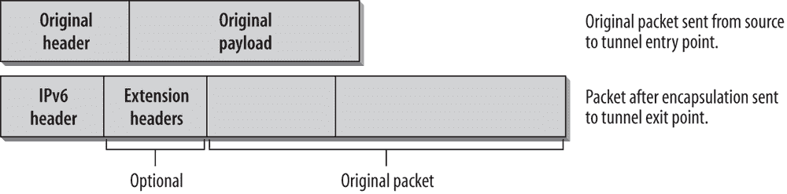
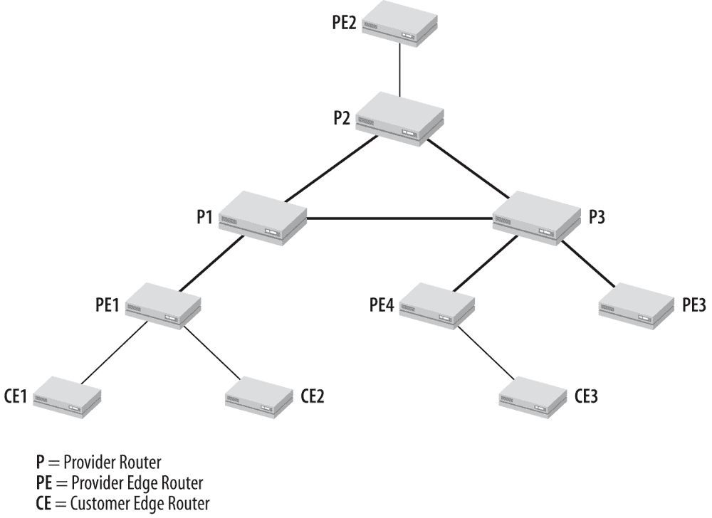
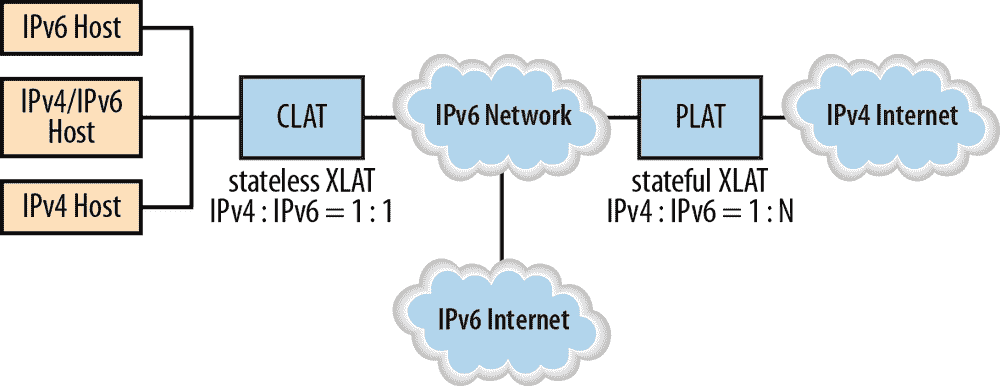

## 第七章：过渡技术

本章概述了各种可用的过渡机制。IPv6 和 IPv4 将在未来多年共存，并且有多种技术使得共存成为可能，并提供了一个简单的过渡过程。选择正确的方案并找到最佳的迁移路径非常重要。没有一种“一刀切”的简单策略。迁移路径必须根据每个组织和网络的个别需求进行调整。

支持过渡的可用技术被分为三大类：

*双栈技术*

允许 IPv4 和 IPv6 在相同的设备和网络中共存

*隧道技术*

允许在现有的 IPv4 基础设施上传输 IPv6 流量

*转换技术*

允许仅支持 IPv6 的节点与仅支持 IPv4 的节点进行通信

这些技术可以并且很可能会相互结合使用。IPv6 的迁移可以一步步进行，从单个主机或子网开始。你可以在 ISP 仍然只运行 IPv4 的情况下迁移你的企业网络或其部分网络，或者在 ISP 升级到 IPv6 的同时，企业网络仍然运行 IPv4。本节描述了当前每一类技术的可用方案。RFC 4213，《IPv6 主机和路由器的基本过渡机制》描述了双栈技术和配置隧道。这个领域发生了很大的变化；曾经是关键技术的过渡机制（如 6to4）已被更新的机制所替代，例如在 6to4 的情况下，6rd 就是一种替代方案。新的技术不断被定义，并且更多的新技术即将到来。这实现了 IETF 承诺的目标，即在需求变得明显时，为企业开发新的和调整过的过渡机制，提供解决方案。

## 双栈

一个*双栈节点*完全支持两个协议版本。此类节点通常被称为*IPv6/IPv4 节点*。在与 IPv6 节点通信时，这种节点表现得像一个仅支持 IPv6 的节点；在与 IPv4 节点通信时，它表现得像一个仅支持 IPv4 的节点。实现中可能允许你启用或禁用其中一个栈，因此这种节点类型有三种操作模式。当启用 IPv4 栈而禁用 IPv6 栈时，该节点表现得像一个仅支持 IPv4 的节点。当启用 IPv6 栈而禁用 IPv4 栈时，它表现得像一个仅支持 IPv6 的节点。当 IPv4 和 IPv6 栈都启用时，节点可以使用这两种协议。一个 IPv6/IPv4 节点为每个启用的协议版本至少有一个地址。它使用 IPv4 机制配置 IPv4 地址（静态配置或 DHCP），并使用 IPv6 机制配置 IPv6 地址（静态配置、SLAAC 或 DHCPv6）。

DNS 在两个协议版本中都用于解析名称和 IP 地址。一个 IPv6/IPv4 节点需要一个能够解析两种类型 DNS 地址记录的 DNS 解析器。DNS A 记录表示 IPv4 地址，DNS AAAA（称为四 A 记录）表示 IPv6 地址。

根据服务的可达方式（通过 IPv4、IPv6 或两者），DNS 可能仅返回 IPv4 地址或仅返回 IPv6 地址，或者同时返回两者。默认地址选择机制和配置文件必须确保在任何情况下都能有效地建立连接。希望客户端上的 DNS 解析器和使用 DNS 的应用程序都能够提供配置选项，让我们指定如何使用地址的顺序或过滤器（即首选协议设置）。*Happy Eyeballs*是一项旨在优化双栈世界中连接设置的规范。请注意，DNS 解析器可能通过 IPv4 或 IPv6 网络运行，以解析任何类型的地址记录。

### 注意

有关 IPv6 DNS 和*Happy Eyeballs*的详细讨论，请参见第五章.

*双栈网络*是一种基础设施，其中路由器启用了 IPv4 和 IPv6 转发。双栈的优势在于你可以原生运行这两种协议。一旦基础设施支持双栈，你就可以开始将应用程序从 IPv4 迁移到 IPv6，并且流量会平稳地从 IPv4 切换到 IPv6。整个过程中不涉及隧道和转换。这是性能、可扩展性和效率的最佳选择。同时也不需要设计、测试和部署临时的过渡机制，这些机制以后还需要移除。

对于这种技术，你必须进行全面的网络升级，以运行两个独立的协议栈。所有表格（例如路由表）都需要同时保留，并为两个协议配置路由协议。出于安全考虑，你需要两个概念，一个用于 IPv4，另一个用于 IPv6，因为你有两条通向网络的入口。对于网络管理，在某些操作系统中，可能仍然需要根据协议使用不同的命令（例如，*ping*用于 IPv4，*ping6*用于 IPv6），这会占用更多的内存和 CPU 资源。但在现代硬件上，这应该不会成为问题，双栈的优势远远大于其劣势。

### 注意

双栈是 IPv6 部署的一个好方法。但它要求所有主机都有 IPv4 地址。如果没有 IPv4 地址，则必须使用 IPv6 单一方案，如 NAT64、DS-Lite、MAP 或 464XLAT。这些方法将边缘网络的增长与 IPv4 的可用性解耦。它们将在本章后面讨论。

另一个需要记住的方面是，双栈使故障排除变得更加复杂。例如，出现 IPv6 问题的应用程序是否尝试通过 IPv4 而不是 IPv6 进行连接并失败？你需要如何调整故障排除方法来测试并找出原因？你的帮助台和 IT 支持人员也需要理解如何使用特定的工具来处理 IPv4 和 IPv6，以便能够排除其中一个协议的问题。因此，从操作和支持的角度来看，运行双栈网络可能需要更多成本。这也是越来越多企业考虑尽快迁移到 IPv6-only 基础设施的主要原因之一。有关更多信息，请参见第九章。

## 隧道技术

隧道机制可以用于部署 IPv6 转发基础设施，而整体 IPv4 基础设施仍然是基础，并且不应或不能被修改或升级。

隧道也称为*封装*。通过封装，一个协议（在我们的例子中是 IPv6）被封装在另一个协议（在我们的例子中是 IPv4）的头部，并通过第二个协议（IPv4）的基础设施转发。封装过程有三个组成部分：

+   隧道入口点的封装

+   隧道出口点的解封装

+   隧道管理

所以，隧道技术可以通过将 IPv6 流量封装在 IPv4 数据包中，并通过 IPv4 路由基础设施传输来承载 IPv6 流量。例如，如果你的服务提供商仍然只有 IPv4 基础设施，隧道可以让你拥有一个企业 IPv6 网络，并通过 ISP 的 IPv4 网络隧道传输到其他 IPv6 主机或网络。或者，你可以在企业网络中部署 IPv6 岛屿，而主干网络仍然是 IPv4。IPv6 数据包从一个 IPv6 岛屿到另一个 IPv6 岛屿可以通过主干网络以 IPv4 数据包封装的方式传输。通用的隧道技术和 IPv6 数据包在 IPv4 数据包中的封装已在多个 RFC 中定义，例如 RFC 2473《IPv6 中的通用数据包隧道规范》和 RFC 4213《IPv6 主机和路由器的基本过渡机制》。我们区分两种常见的隧道类型：

*手动配置的 IPv6-over-IPv4 隧道*

IPv6 数据包被封装在 IPv4 数据包中，通过 IPv4 路由基础设施传输。这些是点对点隧道，需要手动配置。

*自动的 IPv6-over-IPv4 隧道*

IPv6 节点可以使用不同类型的地址，例如 6to4、6rd 或 ISATAP 地址，来动态地通过 IPv4 路由基础设施隧道 IPv6 数据包。这些特殊的 IPv6 单播地址在 IPv6 地址字段的某些部分携带 IPv4 地址，可用于确定目标或隧道端点的 IPv4 地址。

### 隧道是如何工作的

本节讨论的概念适用于隧道技术的一般情况。接下来的两段将讨论配置隧道和自动隧道之间的区别。图 7-1 展示了通过一个仅支持 IPv4 的网络连接的两个 IPv6 网络。

图 7-1. 封装与隧道

主机 Marvin 在一个 IPv6 网络中，并希望将 IPv6 数据包发送到另一个 IPv6 网络中的主机 Ford。路由器 R1 和路由器 R2 之间的网络是一个仅支持 IPv4 的网络。路由器 R1 是 *隧道入口点*。Marvin 将 IPv6 数据包发送到路由器 R1（如图 7-1 中的步骤 1）。当路由器 R1 接收到发送给 Ford 的数据包时，它将数据包封装在 IPv4 头部中并转发到路由器 R2（如图 7-1 中的步骤 2），后者是 *隧道出口点*。路由器 R2 解封装数据包并将其转发到最终目的地（如图 7-1 中的步骤 3）。在 R1 和 R2 之间，可能会有任意数量的 IPv4 路由器。

隧道有两个端点：隧道入口点和隧道出口点。在图 7-1 的场景中，隧道端点是两台路由器，但隧道可以以不同方式配置。它可以设置为路由器到路由器、主机到路由器、主机到主机，或路由器到主机。根据所使用的场景，隧道的入口点和出口点可以是主机或路由器。

IPv6 数据包封装的步骤如下：

1.  隧道的入口点将 IPv6 跳数限制减一，将数据包封装在 IPv4 头部中，并通过隧道传输封装后的数据包。如果需要，IPv4 数据包会被分片。

1.  隧道的出口点接收封装后的数据包。它会检查数据包的源（隧道入口点）是否是可接受的源（根据其配置）。如果数据包被分片，出口点会重新组装它。然后，出口点移除 IPv4 头部，并将 IPv6 数据包处理到原始目的地。

图 7-2 展示了一个 IPv6 数据包在 IPv4 数据包中的封装过程。

图 7-2. 封装

IPv4 头中的以下字段值得注意：IPv4 头中的总长度字段包含 IPv4 头的长度加上 IPv6 数据包的长度，而 IPv6 数据包被视为有效负载。如果封装的数据包需要被分段，则标志和分段偏移字段将包含相应的值。生存时间（TTL）字段的值取决于使用的实现。协议号设置为 41，这是分配给 IPv6 的值。因此，如果你想分析隧道中的 IPv6 流量，可以在分析器中设置过滤器，以显示协议号字段中包含值 41 的数据包。IPv4 源地址是隧道入口点的出接口地址。在自动地址选择可能随时间变化产生不同结果（多个地址/接口）的情况下，应该能够进行配置。IPv4 目标地址是隧道出口点的 IPv4 地址。IPv6-over-IPv4 隧道被视为单跳。因此，IPv6 头中的跳数限制（Hop Limit）字段将减少 1。这隐藏了隧道的存在，最终用户无法检测到，且无法通过诸如*traceroute*之类的常见工具检测到。图 7-3 显示了跟踪文件中的一个封装的 IPv6 数据包。

图 7-3. 封装在跟踪文件中

Ethertype 设置为 0800，这是 IPv4 的值。IPv4 头中的 TTL 设置为 128。协议字段显示值 41，表示该数据包是一个封装的数据包。源地址`62.2.84.115`是隧道入口点的 IPv4 地址。目标地址是 Internet 中一个 6to4 中继路由器的 IPv4 地址（本章稍后将解释），即隧道出口点。该路由器可以将 IPv6 数据包转发到 IPv6 网络。将这些 IPv4 地址与 IPv6 源和目标地址进行比较（可以在详细屏幕上方的高亮汇总行中看到）。使用 Windows 计算器可以发现 IPv6 源和目标地址具有`2002`的 6to4 前缀，并且低 32 位包含 IPv4 地址的十六进制表示。这是一个主机到主机的自动隧道示例，因为我们实际上是在 ping 6to4 路由器。

如果隧道内的一个 IPv4 路由器生成了一个 ICMPv4 错误消息，该路由器会将消息发送到隧道入口点，因为该主机是该数据包的源。如果数据包包含足够的关于原始封装的 IPv6 数据包的信息，隧道入口点可能会向数据包的原始源发送一个 ICMPv6 消息。

当隧道出口点接收到协议值为 41 的 IPv4 数据报时，它知道该数据包已经被封装。在转发解封装后的 IPv6 数据包之前，隧道终点必须验证隧道源地址是否可接受。这样可以避免网络中的不合法入口。如果隧道是双向配置的，则通过将封装数据包的源地址与隧道另一端配置的地址进行比较来进行此检查。对于单向配置的隧道，隧道必须配置一份可接受的源 IPv4 地址前缀列表。默认情况下，这个列表是空的，这意味着隧道终点必须明确配置，才能允许转发解封装后的数据包。在分片的情况下，隧道出口点会重新组装数据包并移除 IPv4 头。在将 IPv6 数据包交付给最终目的地之前，它会检查 IPv6 源地址是否有效。以下源地址被认为是无效的：

+   所有多播地址（`ff00::/8`）

+   回环地址（`::1`）

+   所有 IPv4 兼容的 IPv6 地址（`::/96`），不包括用于重复地址检测的未指定地址（`::/128`）

+   所有 IPv4 映射的 IPv6 地址（`::ffff:0:0/96`）

两个隧道终点都需要具有链路本地 IPv6 地址。该接口的 IPv4 地址可以作为 IPv6 地址的接口标识符。例如，一个 IPv4 地址为`192.168.0.2`的主机可能具有`fe80::192.168.0.2/64`的链路本地地址。

该规范包含了一些规则，这些规则在隧道源地址验证和入口过滤（RFC 2827 和 3704）应用到数据包之前，通常适用于数据包的解封装。如果需要进一步的安全机制，可以使用带身份验证的隧道方案——例如，IPsec（更为推荐）或带预配置密钥的通用路由封装（GRE）（RFC 2890）。由于配置的隧道是手动设置的，因此设置密钥材料不是问题。

### 自动隧道

自动隧道允许 IPv6/IPv4 节点通过 IPv4 基础设施进行通信，而无需预先配置隧道目标。隧道配置信息从嵌入在 IPv6 地址中的 IPv4 地址中提取。在之前的规范（RFC 2893，已被 RFC 4213 废弃）中，隧道终端地址由 IPv4 兼容的目标地址决定。RFC 4213 去除了自动隧道和 IPv4 兼容地址的描述，并转向 6to4（本章稍后讨论），它不使用 IPv4 兼容的 IPv6 地址。6to4 有自己的 IPv6 地址格式，包含了隧道终点的 IPv4 地址作为前缀，从而实现自动隧道。如今，6to4 已经不再推荐作为隧道机制，它被 6rd 所替代。但关于这点将在本章后面的 6to4 和 6rd 部分进一步讨论。

### 配置隧道（RFC 4213）

配置隧道是指 IPv6-over-IPv4 隧道，其中 IPv4 隧道端点地址由隧道端点的配置信息决定。所有隧道假定是双向的。隧道通过使用配置的 IPv4 地址作为下层端点地址，为 IPv6 层提供一个虚拟的点对点链接。管理配置隧道的工作比自动隧道更复杂，但出于安全原因，这可能是可取的，因为它提供了更多控制 IPv6 数据包转发路径的可能性。

RFC 4213 讨论了配置和需要注意的问题，例如有效隧道端点地址的确定（入口过滤）、如何处理 ICMPv4 或 ICMPv6 消息、如何优化隧道 MTU 大小、分片、头部字段、隧道中的邻居发现（ND）以及安全考虑事项。

连接到没有 IPv6 路由器的网络段的 IPv6/IPv4 主机，可以配置静态路由到 Internet 中位于 IPv4 隧道另一端的 IPv6 路由器；这使得与远程 IPv6 网络的通信成为可能。在这种情况下，隧道另一端 IPv6/IPv4 路由器的 IPv6 地址会作为默认路由添加到路由表中。现在，所有 IPv6 目标地址都匹配该路由，并可以通过 IPv4 基础设施进行隧道传输。此默认路由的掩码为零，只有在没有更具体匹配掩码的其他路由时才会使用。

### IPv6 封装（RFC 2473）

RFC 2473 指定了 IPv6 封装的模型和通用机制。关于 IPv4 隧道的本章大部分规则同样适用于 IPv6 隧道。主要的区别在于，在 IPv6 隧道中，数据包被封装在 IPv6 头部中，并通过 IPv6 网络发送。被封装的数据包可以是 IPv4 数据包、IPv6 数据包或任何其他协议。隧道入口点会在原始数据包头部前面加上 IPv6 头部，并在需要时，可能会加上一组扩展头部。无论隧道入口点添加的内容叫什么，都被称为*隧道 IPv6 头部*。图 7-4 展示了数据包视图中的隧道 IPv6 头部。

图 7-4. 从数据包视图看隧道 IPv6 头部

在隧道入口点应用的 IPv6 头部中，源地址是隧道入口点节点的地址，目标地址是隧道出口点节点的地址。原始数据包的源节点可以与隧道入口点相同。原始数据包（包括其头部）成为封装数据包的有效载荷。原始数据包的头部将根据标准转发规则进行处理。如果头部是 IPv4 头部，则 TTL 字段减一。如果是 IPv6 头部，则 Hop Limit 字段减一。隧道入口点和隧道出口点之间的网络因此实际上只算作一次跳跃，无论中间有多少实际跳跃。

隧道 IPv6 头部根据 IPv6 协议规则进行处理。如果添加了扩展头部，则按标准 IPv6 数据包的处理方式进行处理。例如，Hop-by-Hop 选项头将由列在 Hop-by-Hop 选项字段中的每个节点处理。目的地选项头将由目标主机处理，即隧道出口点。所有这些选项都在隧道入口点进行配置。一个使用目的地选项头的例子是隧道封装限制选项的配置（RFC 2473）。当隧道嵌套时，可以使用此选项。隧道的一跳可以是另一个隧道的入口点。在这种情况下，我们有*嵌套隧道*。第一个隧道称为*外部隧道*，第二个隧道称为*内部隧道*。内部隧道入口点将从外部隧道接收到的整个数据包视为原始数据包，并按照图 7-6 中所示的规则进行处理。嵌套隧道的自然限制是最大 IPv6 数据包大小。每次封装都会增加隧道 IPv6 头部的大小。这将允许大约 1,600 层嵌套隧道，但这并不现实。此外，考虑到数据包必须分片的情况。如果由于额外的隧道 IPv6 头部增加了数据包大小而需要再次分片，则分片的数量会加倍。因此，需要一种机制来限制嵌套隧道的数量。它在 RFC 2473 中有所规定，称为隧道封装限制选项。此选项通过目的地选项头进行传输，格式如图 7-5 所示。

图 7-5. 隧道封装限制选项的格式

Option Type 字段占 1 字节，十进制值为 4，指定了隧道封装限制选项（Tunnel Encapsulation Limit Option）。Option Data Length 字段的十进制值为 1，指定了后续 Option 字段的长度。在这种情况下，Option 字段的大小为 1 字节，包含隧道封装限制选项的实际值。该字段中的值指定了允许的进一步封装级别数量。如果值为零，则数据包会被丢弃，并返回 ICMP 参数问题消息给源节点（即之前隧道的入口点）。如果值为非零，数据包会被封装并转发。在这种情况下，必须应用一个新的隧道封装限制选项，且其值应比接收到的数据包中的限制小 1。如果接收到的数据包没有隧道封装限制，但该隧道入口点已配置了一个限制，隧道入口点必须应用目标选项头，并包含配置的值。

*回环封装*应当避免。回环封装发生在一个节点将来自自身且目标为自身的数据包进行封装时。IPv6 实现应该通过检查并拒绝配置两端都属于同一主机的隧道配置来防止这种情况。另一个不希望出现的情况是*路由环路嵌套封装*。这种情况发生在来自内层隧道的数据包重新进入外层隧道，而该数据包还未从外层隧道退出。这种情况只能通过原始数据包的跳数限制和隧道封装限制的配置相结合来控制。

我们来更仔细地看看图 7-6 中的隧道 IPv6 头部。

图 7-6. 隧道 IPv6 头部

标准 IPv6 头部的各字段在第三章中进行了讨论。这里有一些有趣的值：流量类别、流标签和跳数限制的值可以在隧道入口点预配置。有效负载长度的值为原始数据包的包长加上隧道入口点前置的任何扩展头部的大小。隧道 IPv6 头部的源地址和目的地址分别包含隧道入口和出口点的 IPv6 地址。请注意，配置为隧道入口点的主机必须支持它封装的数据包的分段。如果封装的数据包超过了隧道的路径 MTU，隧道入口点作为封装数据包的源，必须在需要时对其进行分段。隧道出口点节点将重新组装数据包。如果原始数据包是带有不分段位的 IPv4 数据包，隧道入口点会丢弃该数据包，并向数据包的源发送一个 ICMP 目标不可达消息，代码为“需要分段且 DF 设置”。

### 隧道机制

接下来的章节描述了目前可用的一系列隧道机制。它们应被视为你 IPv6 工具箱中的一组工具。分析你的环境和需求，以找到最适合你的目标的工具或工具组合。

#### 6to4

RFC 3056《通过 IPv4 云连接 IPv6 域》指定了一种机制，使 IPv6 站点能够通过 IPv4 网络彼此通信，而无需显式设置隧道。这个机制叫做*6to4*，是自动隧道机制之一。广域 IPv4 网络被视为单播点对点链路层，原生 IPv6 域通过 6to4 路由器通信，也称为 6to4 网关。请注意，只有 6to4 路由器需要支持 6to4。6to4 网络中的主机无需做任何更改。

这本来是作为 IPv4 和 IPv6 共存期间使用的过渡机制。它不会作为永久解决方案使用。6to4 也不会成为战略性隧道机制之一。设计中有一些缺点将在本节后面讨论。我们仍然讨论这个机制，因为它没有被弃用，因为有一种基于 6to4 的新机制叫做*6rd*，并且已经在生产网络中实现。6rd 解决了 6to4 的一些缺点，后面章节也会讨论。所以回到 6to4。

IPv6 数据包在 6to4 网关处被封装到 IPv4 中。此配置至少需要一个全球唯一的 IPv4 单播地址。IANA 为 6to4 方案分配了一个特殊的前缀：`2002::/16`。图 7-7 详细显示了 6to4 前缀的格式。

图 7-7. 6to4 前缀格式

前缀 `2002::/16` 后的 32 位是网关的 IPv4 地址的十六进制表示。这为你的内部网络提供了 80 位的地址空间。16 位用于本地网络寻址，因此你可以创建 65,536 个网络！剩余的 64 位用于网络上节点的接口标识符；也就是说，每个子网可以有 2⁶⁴ 个节点。看起来，熟悉扩展地址空间有一些优势。现在，网络中的所有主机都可以与互联网上的其他 6to4 主机进行通信。

### 注意

在图 7-7 中，有一些术语，比如 FP（格式前缀）、TLA（顶级聚合器）和 SLA（站点级聚合器）。它们来自较早的 IPv6 地址架构规范（RFC 2374）。在指定 6to4 时，RFC 2374 仍然有效。

当 6to4 网络中的节点想要与另一个 6to4 网络中的节点通信时，不需要配置隧道（自动隧道）。隧道入口点通过目标 IPv6 地址中的 IPv4 地址来确定隧道出口点。要与远程 IPv6 网络中的 IPv6 节点（该节点不是 6to4 网络的一部分）进行通信，你需要一个*6to4 中继路由器*。中继路由器是配置了 6to4 和 IPv6 的路由器，它将你的 6to4 网络与原生 IPv6 网络连接起来，并将 `2002::/16` 的 6to4 前缀广播到原生 IPv6 网络中。

图 7-8 展示了 6to4 组件以及它们如何协同工作。

图 7-8. 6to4 组件

图中展示了不同的通信路径。在站点 1 内，主机 A 和 B 可以使用 IPv6 进行通信。要与站点 2 中的主机 C（另一个 6to4 网络）通信，数据包会被发送到站点 1 的路由器 R1。路由器 R1 将其封装在 IPv4 中并转发给站点 2 的路由器 R2。路由器 R1 从目标 IPv6 地址中学习到路由器 R2 的 IPv4 地址。路由器 R2 解封装数据包并将原始的 IPv6 数据包转发给主机 C。要与互联网上的 IPv6-only 主机通信，主机 A 或 B 会将其 IPv6 数据包发送到路由器 R1。路由器 R1 将其封装在 IPv4 中并转发给中继路由器 R3。路由器 R3 解封装数据包，并通过 IPv6 路由基础设施将原始的 IPv6 数据包转发给主机 D。

路由器 R1 会在其路由器通告中内部广播 6to4 前缀（如果已配置）。站点 1 中的 IPv6 主机可以利用路由器通告（RA）进行无状态地址自动配置（Stateless Address Autoconfiguration），以获取其 IPv6 地址。广播的前缀格式为 `2002:IPv4-address-R1:subnet-ID::/64`。

要将 6to4 网络与 IPv6 互联网连接，可以评估并手动配置一个便捷的 6to4 中继。手动配置的优点是能够控制使用的中继，但会增加更多的管理工作。如果预配置的中继不可用，则需要配置另一个中继。

RFC 3068 定义了一个 6to4 中继路由器的任何播送地址，以简化需要默认路由来查找 6to4 中继路由器的 6to4 网关的配置。IANA 为 IPv4 6to4 中继分配了一个任何播送前缀`192.88.99.0/24`。分配的任何播送地址对应于该前缀中的第一个节点，例如`192.88.99.1`。6to4 路由器必须配置默认路由，指向此任何播送地址。使用该地址意味着 6to4 数据包会自动路由到最近的可用 6to4 中继路由器。如果一个 6to4 中继出现故障，你无需重新配置 6to4 网关；数据包会自动重新路由到下一个可用的中继。

如前所述，6to4 存在一些问题。部署实践表明，在某些情况下，通信可能会失败。这些故障可能导致用户在尝试访问服务时出现长时间的重试延迟，或完全无法通信。用户通常并不意识到他们正在使用 6to4，而是将故障归咎于应用程序和服务。曾有人讨论将 6to4 置于历史状态，但这并不能消除市场上大量的实现方式。作为早期主要的过渡技术之一，6to4 已被广泛实施。RFC 6343《6to4 部署建议指南》描述了观察到的问题，并提供了 6to4 部署的建议。实际上，许多主机和消费级路由器上的实现现在会降低或消除 6to4 的优先级，以至于启用原生 IPv6 的网站在实际中几乎看不到 6to4 流量。你可以在[Google 统计](http://www.google.com/intl/en/ipv6/statistics.html)中看到这一点，其中 6to4 和 Teredo 流量显示在红色曲线中，自 2011 年以来几乎已经降到零。不断上升的绿色曲线则代表了原生 IPv6 流量。

#### IPv6 快速部署——6rd

在我们深入探讨 6rd 的工作原理之前，先给你介绍一下 6rd 背后的背景。我一直在强调，提供商和供应商不应等到客户要求 IPv6 时才行动，因为客户通常不会关注传输协议，而是关注服务。那么，为什么他们会要求 IPv6 呢？然而，法国发生了一个例外。早在 2007 年，Free（属于 Iliad 集团的法国 ISP）的客户在 Remi Despres 的推动下向 Free 提出了请求。超过 20,000 人签署了一份请愿书，表示愿意每月多支付一欧元，以获得 IPv6 服务。在短短的五周时间内，Free 为 150 万用户提供了 IPv6 互联网接入。他们从零开始，并做了以下工作：

1.  从其区域互联网注册机构（RIR）获得了一个/32 的 IPv6 前缀

1.  向他们的 Freebox 家庭网关软件添加了 6rd 支持（基于广泛使用的 6to4 代码）

1.  为 PC 兼容平台提供了 6to4 网关软件

1.  将其修改为支持 6rd

1.  使用多个操作系统和应用程序测试了 IPv6 的操作

1.  通过提供可下载的软件到 Freebox，实现了操作部署

1.  宣布为所有希望激活 IPv6 的客户提供 IPv6 互联网连接，且不收取额外费用

2007 年 12 月，IPv6 的可用性仅限于每个客户站点一个 IPv6 链路（/64 站点前缀分配）。几个月后，在 Free 向其区域互联网注册机构（RIR）详细介绍了其成就和计划后，并从其获得了/26 前缀，每个客户最多可拥有 16 个 IPv6 链路（/60 站点前缀分配）。在 2011 年 IPv6 世界大会上，Free 宣布他们将为所有新用户启用 IPv6，随后为所有用户启用 IPv6。这是一个非常重要的宣布，因为它是首批不仅为请求 IPv6 的用户提供 IPv6，而且为所有用户无条件提供 IPv6 的 ISP 之一。

长期以来，法国在 IPv6 启用的互联网用户比例上处于领先地位，这要归功于此。2013 年，瑞士跃升为第一，成为第一个 IPv6 启用用户渗透率达到两位数（超过 10%）的国家。这主要得益于瑞士电信公司 Swisscom，该公司也部署了 6rd。但我们还是先继续讲 Free 的故事。

那么为什么 Free 不直接使用 6to4 呢？如前面 6to4 部分所提到的，6to4 存在一些限制，阻止了 ISP 使用它。第一个原因是通信问题。来自 6to4 网络的包可以轻松到达其他 6to4 网络或 IPv6 互联网中的节点。但来自 IPv6 网络的包并不总是能够到达 6to4 站点。原因在于，这些数据包在其路径中的某些地方必须经过一个 6to4 中继路由器。而且并没有保证或控制，从任何地方到这些中继路由器的路由都存在，并且所有这些中继都会将数据包转发到完整的 IPv4 互联网。另外，即使 ISP 运营一个或多个 6to4 中继，并让它们向 IPv6 互联网宣布 6to4 前缀`2002::/16`，它也可能接收到目标为未知数量的其他 6to4 ISP 的数据包。此外，ISP 更愿意从其公共 ISP 范围内为客户分配地址，而不是使用 6to4 前缀。因此，Free 对 6to4 进行了略微修改，并做出了以下改动，以改善这种情况：

1.  用属于 ISP 分配地址空间的 IPv6 前缀替换了标准的 6to4 前缀

1.  他们选择将 6to4 任播地址替换为 ISP 选择的另一个任播地址

1.  ISP 在其 IPv4 基础设施与 IPv6 互联网之间的边界上运营一个或多个 6rd 网关（这些是升级版的 6to4 路由器）。

1.  CPE（客户驻地设备）在客户侧支持 IPv6，在提供商侧支持 6rd（即升级版的 6to4 功能）。

这一创新高效的部署已经在 RFC 5569 中有所描述，如果您有兴趣了解更多细节。不过，正如您可以猜到的，这并不是故事的结尾。

IETF 关注到了这一快速部署，今天 6rd 已成为 RFC 5969 中定义的官方协议规范。它已经得到快速采用，现有许多实现，并且越来越多的服务提供商开始在生产环境中使用它（例如瑞士的 Swisscom），或者正在考虑采用它。需要明确的是，这是一种自动隧道机制，服务提供商可以在其骨干网尚未原生支持 IPv6 时使用它。如果 ISP 不想等待骨干网升级，可以选择使用 6rd 来通过其基于 IPv4 的骨干网隧道化客户的 IPv6 流量。但这应当是一个临时解决方案，最终目标是实现端到端的原生 IPv6。

让我们仔细看看 6rd 的设计工作原理。请记住，许多过程与 6to4 类似，因此我们在这里描述了变化之处。

首先让我们定义 RFC 中以及本节中使用的术语：

*6rd 前缀*

由服务提供商选择的 IPv6 前缀。每个 6rd 域仅有一个 6rd 前缀。一个服务提供商可以使用一个或多个 6rd 域来部署 6rd。

*6rd 客户边缘（CE）*

在 6rd 部署中的客户边缘路由器。有时也被称为客户驻地设备（CPE）。通常有一个 WAN 侧接口，一个或多个 LAN 侧接口，以及一个 6rd 虚拟接口。

*6rd 委托前缀*

由 CE 计算出的用于客户网络中的 IPv6 前缀。它通过将 6rd 前缀与 CE 收到的 IPv4 地址（通过 IPv4 配置方法获取）结合来构建。这等同于 RFC 3633 中描述的 DHCPv6 委托前缀，也可以在 第五章中找到。

*6rd 域*

一组连接到相同虚拟 6rd 链接的 6rd CE 和 BR。每个 6rd 域需要一个独立的 6rd 前缀。

*CE LAN 侧*

该接口服务于 CE 的面向客户的侧，并且完全支持 IPv6。

*CE WAN 侧*

该接口服务于 CE 的 WAN 侧，并且仅支持 IPv4。

*6rd 边界中继（BR）*

一个由服务提供商管理的 6rd 启用路由器，位于服务提供商的 IPv4 网络与原生 IPv6 互联网（或其他 IPv6 网络）之间的边界。它至少有一个面向服务提供商网络的 IPv4 启用接口，一个充当 6rd 隧道终端的 6rd 虚拟接口，以及一个连接到原生 IPv6 网络的 IPv6 接口。

*6rd 虚拟接口*

一个内部隧道接口，用于封装和解封装 IPv6 数据包。典型的 CE 或 BR 仅需要一个 6rd 虚拟接口，但每个 6rd 域最多只需要一个。

最显著的变化之一是，6rd 不使用 6to4 前缀（`2002::/16`）。它使用服务提供商的 IPv6 前缀。这样，操作域就限制在 SP 的网络内，并且 SP 可以直接控制该网络。RFC 指出，从客户角度和 IPv6 互联网的角度来看，6rd 可以视为等同于原生 IPv6。6rd 委托的前缀分配的地址在默认地址选择规则（RFC 6724）中被视为原生 IPv6。

图 7-9 显示了 6rd 网络的布局。

图 7-9. 6rd 网络

一个 6rd 域由 6rd 客户边缘路由器（CE）和一个或多个 6rd 边界中继（BR）组成。6rd 数据包被封装在 IPv4 头中，因此它们在 SP 的 IPv4 网络中遵循 IPv4 路由。当数据包的目标是来自 SP 网络外部的网络时，必须经过 BR。6rd 是无状态工作的，因此，类似于 6to4，BR 可以使用任播进行故障转移。在这种情况下，BR 的 IPv4 地址可以是 6rd 域内共享的任播地址。BR 将在转发到 CE 的数据包中使用该地址作为源地址。由于 6rd 使用服务提供商地址空间，因此不需要为 6rd 的运行在外部宣传特定的路由。

让我们来看看前缀委托是如何工作的。

6rd 前缀是通过将 SP 定义的 IPv6 前缀与 CE 的 IPv4 地址的全部或部分组合来创建的。通过这两个元素，CE 自动配置 6rd 委托的前缀，并像通过 DHCPv6 前缀委托获取的前缀一样使用。

### 注意

有关 DHCPv6 和前缀委托的详细信息，请参阅第五章.

在 6to4 中，我们有一个众所周知的/16 前缀（`2002::/16`），后面跟着一个位于前缀固定位置的 32 位 IPv4 地址。6to4 的前缀是/48 前缀。而在 6rd 中，IPv6 前缀以及 IPv4 地址的位置和位数可以变化。使用 6rd 时，服务提供商（SP）可以调整 6rd 前缀的大小。他可以选择 6rd 机制使用多少位，以及有多少位留给客户站点。为了支持无状态地址自动配置，分配给客户站点的前缀应该至少是/64。为了使客户能够进一步对子网进行划分，最好分配一个更短的前缀，如/60，甚至是/56。

图 7-10 显示了 6rd 地址的格式。

图 7-10. 6rd 地址格式

委派的 6rd 前缀长度是 6rd 前缀位数（n）与 IPv4 地址位数（o）之和。如果服务提供商使用他的 /32 提供商前缀和 CE 的完整 IPv4 地址（32 位），客户将获得一个 /64 前缀。如果服务提供商希望委派较短的前缀，例如 /60 或 /56，他可以调整前缀的位数。如果可以为 6rd 域提供一块可聚合的 IPv4 地址块（取决于 ISP 的 IPv4 地址计划），则可以使用少于 32 位的 IPv4 地址。因此，举个例子，如果 IPv4 地址可以聚合为 10.1.0.0/8，那么 6rd 的前缀将是 /56（32 + 24 = 56）。在这种情况下，客户网络有 8 位可供子网划分（64 − 56 = 8）。

### 注意

由于 6rd 委派的前缀是从 IPv4 地址通过算法选择的，改变 IPv4 地址也会改变 IPv6 前缀，这可能会对客户网络产生干扰。因此，建议在 CE 上使用静态 IPv4 地址或分配长期有效的 IPv4 地址。

尽管 6rd 协议机制允许在较小的地址分配中使用，但从操作上来说，支持将完整的 32 位 IPv4 地址映射到 6rd 前缀中要简单得多。这也是运营商通常更倾向于使用的方法。担心的是，运营商可能会使用 /32 地址并只为客户分配 /64 前缀，这对于任何具有多个子网的家庭网络来说是非常有问题的。我们预计未来家庭网络需要多个子网，例如，为客用和家庭 Wi-Fi 提供支持，并管理智能建筑组件和多媒体设备。

这就是开发人员投入大量精力更改分配策略的原因。在 RIPE 区域，作为 ISP，您目前可以获得一个 /29 地址，这允许您为 6rd 客户分配一个 /30 地址。ARIN 当前有一项特殊政策，允许进行 /24 的“单独分配”，并附带一些特别规定。其他区域可能有不同的规则。这项工作和讨论仍在进行中，因此请与当地注册机构核实当前规则。

6rd CEs 和 BRs 必须配置以下元素：

*IPv4 子网掩码长度*

在 6rd 域内，所有 CE IPv4 地址中相同的高阶位的数量。例如，如果没有相同的位，则 IPv4 子网掩码长度为零，整个 CE IPv4 地址都用于 6rd 前缀（32 位）。如果有 8 个相同的位，则 IPv4 子网掩码长度为 8，并且在构建 6rd 委派前缀之前会去掉 IPv4 地址中的 8 个高阶位。

*6rd 前缀*

给定 6rd 域的 6rd 前缀。

*6rd 前缀长度*

给定 6rd 域的 6rd IPv6 前缀长度。

*6rd BR IPv4 地址*

给定 6rd 域的 6rd BR 的 IPv4 地址。

有一个 6rd DHCPv4 选项，选项代码为 212，格式如 图 7-11 所示。

图 7-11. 6rd DHCPv4 选项格式

6rd 选项代码设置为 212。选项长度字段显示 DHCP 选项的长度（以八位字节为单位，22 字节，其中包含一个 BR IPv4 地址）。IPv4 掩码长度字段显示在给定的 6rd 域内所有 CE IPv4 地址相同的高位比特数。该值可以在 0 和 32 之间。6rd 前缀长度字段显示 SP 的 6rd 前缀的 IPv6 前缀长度（以比特为单位）。6rd BR IPv4 地址字段包含给定 6rd 域的一个或多个 6rd 边界中继的 IPv4 地址。最后，6rd 前缀字段包含 6rd 前缀，作为一个 16 字节的 IPv6 地址。在 6rd 前缀长度字段指定的比特数之后，前缀中的比特必须由发送方设置为零，并由接收方忽略。

当启用 6rd 时，典型的 CE 路由器将创建一个默认路由指向 BR，一个针对 6rd 委派前缀的黑洞路由，以及用于任何 LAN 侧分配和通告前缀的路由。

#### ISATAP

*站点内自动隧道地址协议*（ISATAP）旨在通过基于 IPv4 的网络为双栈节点提供 IPv6 连接。它将 IPv4 网络视为一个大的链路层网络，允许这些双栈节点之间自动建立隧道。无论您是否拥有全球或私有 IPv4 地址，都可以使用这一自动隧道机制。ISATAP 地址在 EUI-64 接口标识符中嵌入了一个 IPv4 地址。请注意，ISATAP 网络中的所有节点都需要支持 ISATAP。ISATAP 在 RFC 5214 中进行了规定。

图 7-12 显示了 ISATAP 地址的格式。

图 7-12. ISATAP 地址格式

ISATAP 地址具有一个标准的 64 位前缀，可以是链路本地、站点本地、6to4 前缀，或者属于全局单播范围。接口标识符是使用 IANA OUI `00-00-5E` 构建的，紧跟前缀。接下来的字节是类型字段，值 `fe` 表示该地址包含一个嵌入的 IPv4 地址。最后四个字节包含 IPv4 地址，可以用点分十进制表示。因此，地址的格式可以总结为 `64bitPrefix:5efe:IPv4address`。例如，如果您分配的前缀是 `2001:db8:510::/64`，而 IPv4 地址是 `62.2.84.115`，那么您的 ISATAP 地址为 `2001:db8:510::200:5efe:3e02:5473`。或者，您可以写成 `2001:db8:510::200:5efe:62.2.84.115`。对应的链路本地地址将是 `fe80::200:5efe:62.2.84.115`。

ISATAP 接口通过其 IPv4 地址形成 ISATAP 接口标识符，并使用这些标识符来创建链路本地 ISATAP 地址。使用 RFC 4861 中指定的邻居发现机制（路由器和前缀发现）。

ISATAP 路由器是一个 IPv6 路由器，同时也可以通过 IPv4 访问，并执行以下操作：

+   广播地址前缀以标识 ISATAP 主机所在的逻辑 ISATAP 子网。

+   在逻辑 ISATAP 子网中的 ISATAP 主机与其他子网（IPv4 子网或 IPv6 子网）中的 IPv6 主机之间转发数据包。

+   作为 ISATAP 主机的默认路由器。

+   配置逻辑子网中的主机，通过路由器广告进行配置。

使用 ISATAP，IPv4 内部网络中的 IPv6 主机可以相互通信。如果它们想与互联网中的 IPv6 主机通信，则必须配置边界路由器；该路由器可以是 ISATAP 路由器或 6to4 网关。内部网络中主机的 IPv4 地址不需要是公共的，它们被嵌入到标准前缀的地址中，因此是唯一且可路由的。大量的 ISATAP 主机可以分配到一个 ISATAP 前缀下。如果你在公司网络的某个段上部署 IPv6，你可以将一个本地 IPv6 节点配置为 ISATAP 接口，它将充当本地 IPv6 段和 IPv4 段中 ISATAP 主机之间的路由器。

ISATAP 是一种易于部署的机制，如果你想快速测试和使用并且仅有一个 IPv4 路由的网络，它会非常方便。它也可以轻松为 IPv4 网络中的多个 IPv6 用户提供 IPv6 互联网访问。但不建议在生产网络中使用。

### 注意

在一个无管理的 IPv6 网络中，出于安全原因，你应确保在所有主机上禁用 ISATAP，并在边界上阻止 IPv6 流量。

#### Teredo

6to4 使得 IPv6 可以通过 IPv4 基础设施使用公共 IPv4 地址进行通信。ISATAP 使得在 IPv4 网络中可以部署 IPv6 主机，无论是否使用公共或私有 IPv4 地址。Teredo 旨在通过在一个或多个 NAT 层级之间隧道传输数据包，利用 UDP 使 IPv6 可用。它在 RFC 4380 中有所规定。RFC 6081 中定义了支持更多类型 NAT 的扩展，RFC 5991 则包含了针对 Teredo 的安全扩展。

许多互联网用户，特别是许多家庭用户，只能通过 NAT（网络地址转换）访问互联网。NAT 在通过 IPv4 基础设施隧道 IPv6 时会产生问题，主要有两个原因：首先，NAT 用户使用私有 IPv4 地址；其次，许多 NAT 配置了入口过滤，不允许许多类型的载荷通过。使用隧道时，IPv6 数据包是 IPv4 的载荷。像 6to4 这样的机制在这些环境中通常会失败，因为它们需要公共 IPv4 地址。如果 6to4 路由器与 NAT 在同一设备上运行，则可以在 NAT 环境中使用 6to4。在所有其他情况下，必须选择其他机制。在我们未来的 IPv6 世界中，我们将不再需要 NAT，但在过渡时期，我们必须处理它们。因此，IPv6 开发人员正在研究允许位于 NAT 后面的用户通过 UDP 隧道 IPv6 数据包访问 IPv6 世界的机制。其中一种机制就是 Teredo。

以下术语与 Teredo 一起使用：

*Teredo 服务*

通过 UDP 传输 IPv6 数据包。

*Teredo 客户端*

一个可以访问 IPv4 互联网并需要访问 IPv6 互联网的节点。

*Teredo 服务器*

一个可以通过公共 IPv4 地址访问 IPv4 互联网的节点，用于为 Teredo 客户端提供 IPv6 连接。

*Teredo 中继*

一个 IPv6 路由器，可以接收目标为 Teredo 客户端的流量，并使用 Teredo 服务将其转发。

*Teredo IPv6 服务前缀*

用于构造 Teredo 客户端 IPv6 地址的 IPv6 地址前缀。IANA 分配的全局 Teredo 前缀是`2001:0000::/32`。

*Teredo UDP 端口*

Teredo 服务器等待数据包的 UDP 端口号。该端口的默认值是 3544。

*Teredo 气泡*

一个最小的 IPv6 数据包，由 IPv6 头部和空载荷组成（载荷类型设置为 59，即无下一个头部）。Teredo 客户端和中继使用气泡在 NAT 中创建映射。

*Teredo 服务端口*

Teredo 客户端发送 Teredo 数据包的端口。此端口附加在客户端的 IPv4 地址之一上。

*Teredo 服务器地址*

Teredo 服务器的 IPv4 地址。

*Teredo 映射地址和 Teredo 映射端口*

由一个或多个 NAT 转换的客户端 Teredo 服务端口的 IPv4 地址和 UDP 端口构成的全局 IPv4 地址和 UDP 端口。客户端通过 Teredo 协议学习这些值。

*Teredo IPv6 客户端前缀*

由 Teredo IPv6 服务前缀和 Teredo 服务器地址组成的全局 IPv6 前缀。

*Teredo 节点标识符*

一个 64 位标识符，包含客户端可以通过 Teredo 服务访问的 UDP 端口和 IPv4 地址。一个标志指示客户端通过哪个类型的 NAT 访问 IPv4 互联网。

*Teredo IPv6 地址*

通过将 Teredo IPv6 客户端前缀和 Teredo 节点标识符结合获得的 Teredo IPv6 地址。

*Teredo 刷新间隔*

在没有“刷新”流量的情况下，Teredo IPv6 地址预期保持有效的时间间隔。该时间间隔取决于到达 Teredo 服务器路径中本地 NAT 配置的参数。默认情况下，客户端假定该时间间隔为 30 秒。

*Teredo 第二端口*

用于发送或接收数据包以确定刷新间隔的适当值的 UDP 端口，但不用于承载任何 Teredo 流量。

*Teredo IPv6 发现地址*

用于在 IPv4 子网中发现其他 Teredo 客户端的 IPv4 多播地址。多播地址是 `224.0.0.253`。

Teredo 服务将 IPv6 数据包作为 UDP 的有效负载进行传输。

Teredo 设计旨在为 IPv6 网络提供可靠的访问。此设计带来了一些开销。只有在没有其他更直接访问方式的情况下，才应使用 Teredo。例如，如果可以在 NAT 上实现 6to4 或甚至 6rd 网关，这是更优的解决方案。

Teredo 地址的格式如 图 7-13 所示。

图 7-13. Teredo 地址格式

Teredo 服务前缀有 32 位，值为 `2001:0000::/32`。服务器 IPv4 字段长度为 32 位，包含 Teredo 服务器的 IPv4 地址。标志字段有 16 位，定义了地址和使用的 NAT 类型。16 位的端口字段包含客户端 Teredo 服务的映射 UDP 端口；客户端 IPv4 字段包含客户端的映射 IPv4 地址。端口和客户端地址字段中的所有位都被混淆。地址和端口号中的每一位都被反转。

图 7-14 显示了 Teredo 通信。

图 7-14. Teredo 通信

Teredo 客户端必须预先配置其 Teredo 服务器的 IPv4 地址。启动时，它从其链路本地 IPv6 地址向所有路由器多播地址发送路由器请求。路由器请求通过 UDP 发送到 Teredo 服务器的 IPv4 地址。来自 Teredo 服务器的路由器广告包含 Teredo IPv6 服务前缀。客户端通过将前缀与地址和端口的反转值组合，构建其 Teredo IPv6 地址。

当 Teredo 服务器转发来自 Teredo 客户端的数据包时，它将 IPv6 数据包封装在 UDP 数据包中。它根据目标 IPv6 地址构建 IPv4 地址和 UDP 端口。它使用自身的 IPv4 地址作为源地址，并使用 Teredo UDP 端口（3544）作为源端口。Teredo 服务器的任务是通过 UDP 将来自 Teredo 客户端的数据包转发到正确的目标地址，并将来自外部的数据包转发给内部的正确客户端。

Teredo 中继是一个 IPv6 路由器，使用常规 IPv6 路由机制向外界广播 Teredo 服务前缀。

Teredo 是早期的过渡机制之一，像 6to4 一样被广泛实现。不推荐在生产网络中使用 Teredo。你的 Microsoft Windows 客户端通常默认启用 Teredo（具体取决于操作系统版本和补丁级别）。无论你使用什么操作系统，请确保确认 Teredo 已被关闭。

### 注意

在一个未管理的 IPv6 网络中，出于安全考虑，你应该确保在所有主机上禁用 Teredo，并在边界处阻止 IPv6 流量。

#### 隧道代理

隧道代理可以被视为虚拟的 IPv6 提供商，为已经通过 IPv4 连接到互联网的用户提供 IPv6 互联网连接。隧道代理在 RFC 3053 中有所规定。

图 7-15 展示了隧道代理的工作原理。

图 7-15. 隧道代理如何工作

需要 IPv6 连接的用户向隧道代理注册。隧道代理代表用户管理隧道的建立、维护和删除。隧道代理可以将数据负载分摊到多个*隧道服务器*。隧道代理在需要建立、变更或删除隧道时，会将配置信息发送给隧道服务器。隧道代理还会在配置了该功能的情况下，在 DNS 中注册地址。隧道代理必须能够通过 IPv4 地址访问。它也可以拥有一个 IPv6 地址，但这不是必须的。隧道代理与隧道服务器之间的通信可以通过 IPv4 或 IPv6 进行。

隧道服务器是一个双栈路由器，连接到全球互联网。当它接收到隧道代理的配置信息时，它会建立、变更或删除隧道的服务器部分。

客户端是一个双栈主机或路由器，通过 IPv4 连接到互联网。当它希望向隧道代理注册 IPv6 连接时，应该使用标准程序（例如，RADIUS）进行身份验证。通过这种方式，可以避免隧道服务的未授权使用。因此，隧道代理提供隧道服务的访问控制。一旦客户端获得授权，它将提供其 IPv4 地址、一个用于在 DNS 中注册其 IPv6 地址的名称，以及一个指示其是主机还是路由器的信息。如果客户端是路由器，它还应发送关于其希望获取的 IPv6 地址数量的额外信息。隧道代理需要这些信息以便为客户端分配合适的前缀。

隧道代理履行以下任务：

+   选择隧道服务器作为隧道出口点。如果有多个选项，它会根据预配置的负载共享标准来选择。

+   为客户端选择一个前缀。前缀可以是任意长度。最常见的值是/48（站点前缀）、/64（子网前缀）或/128（单一主机）。

+   为隧道定义生命周期。

+   在 DNS 中注册它分配的全局 IPv6 地址。

+   配置隧道服务器。

+   将配置信息发送回客户端。此信息包括隧道参数和 DNS 名称。

这就完成了隧道配置。客户端现在可以访问隧道服务器可以访问的所有 IPv6 网络。

有很多互联网服务提供商（ISP）提供隧道代理服务。通常，用户可以通过浏览器注册，填写表单并接收显示或通过电子邮件发送的配置信息。客户端现在可以手动配置其隧道入口点，或者使用提供商的脚本文件自动化配置过程。

### 注意

在互联网上有不同的列表可以找到合适的隧道代理。两个著名的提供商是[Hurricane Electrics](http://www.tunnelbroker.net)和[SixXS](https://www.sixxs.net)。维基百科有一个[隧道代理列表](http://en.wikipedia.org/wiki/List_of_IPv6_tunnel_brokers)。

隧道代理模型适用于较小且隔离的 IPv6 网络，尤其是单个、孤立的 IPv6 主机。它仅适用于公共 IPv4 地址。如果使用私有地址，则必须使用其他机制，例如协议 41 转发。

#### 通过使用 VLAN 实现 IPv4/IPv6 共存

VLAN（虚拟局域网）在企业网络中非常常见，可用于在尚未具备 IPv6 路由器和交换机设备的情况下部署 IPv6。VLAN 标准允许将多个局域网部署在同一个桥接的局域网中。它使用虚拟局域网标记或成员信息，并将其插入以太网帧中。因此，要在这种环境中引入 IPv6，可以部署一个并行的 IPv6 路由基础设施，并通过 VLAN 技术将 IPv6 链路叠加到 IPv4 基础设施上。此设置不需要对 IPv4 环境进行任何更改。有关该场景的详细描述和可能的配置，请参阅 RFC 4554《在企业网络中使用 VLAN 实现 IPv4 和 IPv6 共存》。

#### IPv6 在 MPLS 网络中的应用

MPLS（多协议标签交换）技术最初是为了提升服务提供商网络核心的转发性能。它本质上是一种隧道机制，数据转发是基于附加到 IP 数据包上的本地相关标签逐跳进行的。这意味着更短的查找时间和更简单的硬件实现。然而，自从 MPLS 问世以来，路由平台在以线速转发 IP 数据包方面的能力已经大大增强。此时，MPLS 的价值不再仅仅体现在转发性能的提升上，更在于它在网络核心中实现流量的分段（基于 MPLS 的 VPN）和组织（流量工程）的能力。这些能力也使得 MPLS 对部署自有网络骨干的大型企业具有吸引力。

MPLS 的操作依赖于存在一个 IGP（内部网关协议），确保 IP 路由在骨干网中正确设置，并且依赖标签交换协议。标签交换协议使 P（提供商）路由器和 PE（提供商边缘）路由器能够为每个数据包从 MPLS 核心的一端到另一端的每个跳点定义一个标签。当 IP 数据包进入 MPLS 核心时，它会被赋予一个本地相关的标签，告知下一个跳点数据包的去向。下一个跳点路由器（有时也称为 MPLS 交换机）会将标签交换为与下一个跳点相关的标签，依此类推，直到目标 PE。目标 PE 前的 P 路由器将去掉标签，并将进入 MPLS 核心的 IP 数据包交给 PE 路由器。PE 路由器则会将数据包进一步进行 IP 路由，直到其最终目的地。

MPLS 是一种通用的隧道机制。因此，无论控制平面实现（IGP 加标签交换）如何，它都可以像转发 IPv4 数据包一样轻松转发 IPv6 数据包。然而，当 MPLS 标签与特定于 MPLS 核心边缘功能的标签相结合时，IPv4 MPLS 核心上承载 IPv6 的选项变得特别容易扩展。换句话说，附加标签可以告知目标 PE 此数据包是什么类型的 IP 数据包，或者数据包应放置在哪种路由上下文中。

目前大多数 MPLS 部署利用 MP-iBGP（多协议内部 BGP；RFC 3107）来增强功能。与各种协议（如 IPv4 和 IPv6）以及不同功能（如 VPN、组播等）相关的地址族可以在 PE 路由器上定义，并将相关流量标记上特定标签。MP-iBGP 在 PE 路由器之间交换这些标签，使它们能够识别并正确处理这些标记的数据包。这些协议或功能标签堆叠在 MPLS 标签之上。将这一功能扩展到 IPv6 非常容易。必须识别 IPv6 地址族，并将类似于 IPv4 的功能（VPN、组播等）与 IPv6 地址族关联。例如：

+   IPv6 的地址族标识符（AFI）= 2

+   用于在 MPLS 上传输 IPv6 流量的后续地址族标识符 = 4

+   用于在 MPLS 上传输 VPN IPv6 流量的后续地址族标识符 = 128

因此，IPv6 可以轻松且高效地通过现有的 MPLS 骨干网传输。一般来说，IPv6 通过 MPLS 基础设施的传输可以通过三种方式完成：

*IPv6 通过 IPv6/MPLS 核心*

MPLS 核心可以直接启用 IPv6，这意味着它原生支持 IPv6。它使用 IPv6 IGP，并在 IPv6 上交换标签。在这种情况下，IPv6 通过 IPv6 MPLS 核心的方式与 IPv4 通过 IPv4 MPLS 核心的方式相同。IPv4 也可以通过这种基于 IPv6 的基础设施进行隧道传输。

*通过 MPLS 进行第二层隧道传输*

可以在 MPLS 核心上建立第二层隧道。这些隧道简化了使用 MPLS 骨干网进行连接的组织的网络架构。它们将承载任何第 3 层协议，包括 PE 端点之间的 IPv6。

*IPv6 通过 IPv4/MPLS 核心*

这种方法基于使用 MP-iBGP4 通过 IPv4 在边缘标签交换路由器之间分发 IPv6 前缀（以及相应的标签）。下一跳由 IPv4 地址标识，数据包根据目标 PE 路由器的 IPv4 地址的标签在 MPLS 核心上传输（RFC 4798）。Cisco 将其实现该机制的方式称为 6PE（IPv6 提供商边缘路由器）。相同的概念用于在 IPv4 MPLS 核心上启用 IPv6 VPN（RFC 4659）。

需要特别注意的是，通过 IPv4 MPLS 核心传输 IPv6 是一种非常有效的过渡机制。所需的变化仅仅是 PE 路由器的配置调整（假设功能已得到支持）。在这种部署类型中，IPv6 可以充分利用 MPLS 基础设施提供的所有价值，从线路速率转发到流量工程。

##### 6PE

6PE 的概念基于 MPLS 的层次路由结构，如图 7-16 所示。这里我并不打算讨论一般的 MPLS 技术，目的是展示 MPLS 如何支持 IPv6 的简便引入。

图 7-16. MPLS 路由层次结构

在 MPLS 网络的核心是提供商路由器（P）。它们转发 MPLS 数据包，这意味着它们不会处理第 3 层的头部。在核心网络的边缘是提供商边缘路由器（PE）。它们从客户边缘路由器（CE）接收常规的 IP 数据包，应用 MPLS 标签，并将其转发给提供商路由器。MPLS 数据包仅在提供商边缘路由器和提供商路由器之间传输，具体参见图 7-16。

在此环境中，路由工作方式如下：

+   PE 和 CE 路由器使用常见的路由协议（RIP、OSPF、BGP 或静态路由）。PE 路由器通过这些路由协议学习它能够通过 CE 路由器到达的前缀。

+   每个 PE 路由器通过 MP-iBGP 将从其 CE 路由器学到的前缀通告给其他 PE 路由器，并将其自己作为这些前缀的下一跳。如果在 MPLS 核心中为 IPv6（6PE）建立了全局路由域，那么 MP-iBGP 将使用 SAFI 4 来交换前缀。与前缀一起，PE 还会通告应该在发送到这些前缀的数据包上使用的标签。

+   MPLS 核心使用 IGP，通常是 IS-IS 或 OSPF，来建立 PE 之间的可达性。结合标签交换协议，PE 之间可以建立标签交换路径（LSP）。

IPv6 流量的转发过程如下：

+   在入口和出口 PE 之间已经存在一个 LSP（标签交换路径；可以理解为隧道），该路径由 MPLS 核心中的基于 IPv4 的控制平面建立。

+   MP-iBGP 已经通知了入口 PE（PE1）下一个跳的 PE 是哪个（通过 IPv4 地址标识的 PE4），并且告诉它应该使用哪个标签来标记 IPv6 目标前缀。

+   目标地址前缀（CE3）的标签首先由 PE1 附加到从 CE1 接收到的进入 IPv6 流量上。入口 PE1 还会在前面附加出口 PE4 的 IPv4 地址的标签，并将数据包发送到下一跳 P 路由器。

+   P1 路由器交换掉顶部标签（即与出口 PE4 的 IPv4 地址相关的标签），并将数据包转发到下一个 P 路由器。

+   该过程会继续进行，直到数据包到达与出口路由器相连的 P 路由器。P 路由器移除顶部标签，并将数据包转发到 PE 路由器。

+   出口 PE4 接收到的数据包只有一个标签；然而，基于该标签，它将知道该如何处理这个数据包。如果这是一个 6PE 部署，它会丢弃该标签，并将 IPv6 数据包交给全局 IPv6 转发过程。

+   然后，IPv6 数据包会被原生转发到 CE3，再继续转发到目标。

如果你熟悉 MPLS-VPN 的概念，可以将 6PE 视为一个全球性的 VPN，专门用于在所有启用了 IPv6 的 PE 之间传输 IPv6。

##### 6VPE

一旦我们理解了 6PE 的工作原理，并且熟悉 MPLS-VPN，那么 6VPE 将显得是一个非常自然的扩展。对于那些不熟悉 MPLS-VPN 的人，关键概念是虚拟路由与转发（VRF）实例。在 MPLS 骨干网中，如果我们定义了不应该共享或看到彼此流量的域，我们就定义了虚拟私人网络（VPN）。PE 路由器必须维持这种分离，以便每个 VPN 流量在 PE 上被路由和转发时使用的是专门的表，这些表由各自的 VRF（虚拟路由与转发）维护。

在 6VPE 的情况下，我们为 IPv6 专门创建 MPLS-VPN，或者对现有的 VPN 进行双栈配置。控制平面与 6PE 非常相似。MP-iBGP 将交换标签（使用 SAFI 128），这些标签不仅与 IPv6 前缀相关，还与该 IPv6 前缀所属的 VRF 相关。在 PE 设备上，IPv6 接口与 VRF 绑定，因此 IPv6 流量被保持在定义的 VPN 内。转发方式也类似于 6PE，IPv6 数据包会被添加一个顶级标签（通过标签交换协议交换），用于在 MPLS 核心内部进行切换，以及第二个标签（通过 MP-iBGP 交换），用来指示接收 PE 数据包应当进入哪个 VRF。

参考图 7-12，与 6PE 场景中所有 CE 都属于同一全局路由域的情况不同，CE1 和 CE3 属于红色 VRF，而 CE2 属于蓝色 VRF。PE1 将为 CE1 和 CE2 分别维护独立的路由和转发实例。此外，PE1 会为每个 VRF 中的 IPv6 前缀交换标签。转发方式类似于 6PE：

+   当 CE1 将数据包发送到 CE3 时，数据包通过与红色 VRF 关联的接口进入 PE1。

+   数据包被添加了用于 CE3 目标 IPv6 前缀的标签（也位于红色 VRF 中），并且附加了用于 MPLS 转发的标签。

+   PE1 将带标签的数据包发送给 P1，P1 交换顶层标签，然后将数据包转发给 P2。

+   P2 去掉顶层标签并将数据包发送给 PE4。

+   PE4 接收带标签的数据包，并根据标签，PE4 知道该数据包属于哪个 VRF，甚至知道该将数据包发送到 VRF 中的哪个位置。

+   PE4 去掉最后的标签，让典型的 IP 路由和转发功能在红色 VRF 内执行，将数据包传送至 CE3。

使用 6PE 或 6VPE 取决于 IPv6 流量支持的服务。如果你只是想为所有 CE 提供访问互联网的 IPv6 连接，那么 6PE 将是一个快速而简便的解决方案。如果你在 MPLS 骨干网络上有多个客户或组织，并且它们被分隔在不同的 VPN 中，那么 6VPE 是 IPv6 使能这些 VPN 的正确解决方案。

MPLS 可以用于通过 IPv4 传输 IPv6 数据包并不意味着你应该为此目的实现 MPLS。如果你没有现成的 MPLS 基础设施，其他隧道机制可能更适合实现你的目标。但如果你已经拥有 MPLS，那么它是一个很好的基础。

### 注意

如果你想深入了解这一点，可以参考 Ciprian Popoviciu、Patrick Grossetete 和 Eric Levy-Abegnoli（Cisco Press）合著的《*部署 IPv6 网络*》一书。它是一本关于 IPv6 概念、服务实现及与 IPv4 互操作性的实用指南。

#### 定位符 ID 分离协议（LISP）

LISP（定位符标识符分离协议）是一种新颖的架构，虽然它并非完全为了支持 IPv6 而设计，但它具备了注册 IPv6 地址并使用 IPv4 作为传输工具的能力，使得 LISP 成为 IPv4 上运输 IPv6、连接 IPv6 岛屿或将 IPv6 网络元素直接连接到 IPv6 互联网的非常有用的工具。

当前 IP 地址结构的许多挑战源于这样一个事实：一个 IP 地址（IPv4 和 IPv6）包含了两种不同类型的信息。一种是关于设备位置的信息（在子网信息中，前缀部分），另一种是关于设备身份的信息（主机 ID 和接口 ID）。每次启动笔记本时，你可能会得到不同的 IP 地址；前缀会根据你所在的网络而变化，主机 ID 也可能会发生变化（取决于配置）。LISP 通过将 IP 地址分为两个命名空间来实现这种“间接性”——*端点标识符*（EID）和*路由定位符*（RLOCs），这些标识符被分配给路由器，称为*隧道路由器*。

LISP 创建了一个覆盖网络，带来了以下好处：

+   多宿主与入口流量工程

+   地址族独立性（IPv4 和 IPv6；MAC 地址注册在规划中）

+   高规模虚拟化和多租户支持

+   数据中心的移动性，包括在移动事件中的会话持久性

LISP 是一个由 IETF 定义的标准，规定在 RFC 6830 至 6836 以及 RFC 7052 中。LISP 仍在持续开发中，相关文档已记录在多个草案中。

图 7-17 展示了 LISP 的基本架构元素。

EID（端点标识符）空间是主机/服务器标识符的 IP 地址空间。它可以是 IPv4 或 IPv6。对于主机/服务器，或者分支、校园或数据中心网络，没有特殊的变化。EID 是主机的身份标识。

RLOC（路由定位符）空间是传输的 IP 地址空间（标识位置）。它可以是 IPv4 或 IPv6。传输网络没有特殊变化，可以是互联网、服务提供商网络或私有 WAN。

由于 LISP 是一个纯网络基础的解决方案，唯一了解 LISP 的设备是隧道路由器（xTR），它有两种类型：入口隧道路由器（iTR）和出口隧道路由器（eTR）。iTR 从分支、校园或数据中心接收一个 IP 数据包，并将原始数据包封装成一个 IPv4/IPv6 UDP 数据包，其中包含两个目标端口（UDP 4341 用于数据，UDP 4342 用于控制）。这个封装数据包的源地址和目标地址由 iTR 和 eTR 的 RLOC（xTR 的传输 IP 地址）定义。eTR 会接收到封装的数据包并进行解封装。xTR 的基本配置是最小的，LISP 对控制平面的负担非常轻（LISP 是数据驱动的，并遵循拉取模型）。

图 7-17. LISP 架构网络元素

*映射数据库*由两个功能组成：*映射解析器*（MR）和*映射服务器*（MS）。eTR 将通过 map-register 消息，将 EID（可以是 IPv4 或 IPv6）和其 RLOC 地址（可以是 IPv4 或 IPv6）注册到映射服务器。iTR 在处理任何 EID 流量时会询问 MR，哪个目的地 RLOC 应当用于目标 EID（map-request 消息）。MR 将 map-request 转发给 MS，MS 检查其数据库并将 map-request 转发给 eTR，后者将向 iTR 提供更为详细的回答（map-reply 消息）。MR/MS 可以配置在 xTR 上，也可以是独立的路由器或服务器（例如 BGP 路由反射器）。映射数据库具有很高的可扩展性，可以与 DNS 在可扩展性和性能方面进行比较。

为了使 LISP 能够逐步部署，存在一种特殊的 xTR，称为*代理隧道路由器*（PxTR）。代理入口隧道路由器（PiTR）将 EID 空间宣布到互联网或非 LISP 的 WAN 和校园网络中，而代理出口隧道路由器（PeTR）则用于将封装流量发送到非 LISP 世界。使用 PeTR 的触发条件是来自 MR 的负 map-reply 消息。

LISP 带来了许多优势：

+   将路由优化从推送转换为拉取

+   作为一种覆盖技术工作

+   使用无状态 UDP 封装进行优化传输

+   计算源 UDP LISP 端口来自原始 IP 数据包，并帮助实现 RLOC 空间中的 ECMP（等成本多路径）负载均衡

+   使得部署变得非常简便，因为它只涉及网络边缘的设备

这些优势除了在入口处进行真实负载均衡的多宿主使用场景外，还支持 VRF 传输的虚拟化和独特的移动性特性。

但在此背景下，最重要的部分是能够使用 IPv4 作为 IPv6 的传输。LISP 可以用来通过 IPv4 网络连接 IPv6 岛屿，或提供一种可扩展且轻量的解决方案来连接 IPv6 互联网。

图 7-18 展示了 IPv6 通过 IPv4 传输的概念。

图 7-18. LISP IPv6 通过 IPv4

左侧的 LISP 路由器将向 LISP 映射数据库（此处未显示）发送 map-register。它将使用 LISP 路由器的 IPv4 RLOC（互联网 IP 地址）注册 IPv6 服务的 IPv6 地址（IPv6 EID）。

代理隧道路由器（PxTR；右侧的 LISP 路由器）连接到 IPv4 和 IPv6 Internet。PiTR 会将 IPv6 EID 宣布到 IPv6 Internet，以吸引 IPv6 服务的流量。当 IPv6 服务的数据包到达 PiTR 时，它会为该 IPv6 EID 发出映射请求。左侧的 LISP 路由器（eTR）会从 MR/MS 接收到映射请求，并会返回其 IPv4 RLOC。PiTR 现在会创建一个包含 IPv6 EID 和下一跳 IPv4 RLOC 的映射缓存。现在，从 IPv6 Internet 来的包会被封装为 IPv4，并通过 IPv4 Internet 转发。eTR 然后会解封装该数据包，并将其作为原生 IPv6 数据包传递给 IPv6 服务。

从 IPv6 EID 返回到 IPv6 Internet 的流量处理方式类似。iTR 获取 IPv6 数据包，根据配置，它会发出映射请求，或者直接将数据包发送到 PeTR（静态映射缓存）。如果是映射请求，它会从 MR 接收到带有 PeTR IPv4 RLOC 的负面映射回复消息。iTR 现在可以使用其源 IPv4 RLOC 和 PeTR 的 IPv4 RLOC 将 IPv6 数据包封装为 IPv4 数据包。PeTR 获取封装的 LISP 数据包，剥去 IPv4 传输头部，并原生地转发 IPv6 数据包。

这些示例展示了 LISP 在 IPv4 传输上实现 IPv6 的简便性。你可以使用 LISP 控制平面，或者将其配置为静态映射缓存。因此，如果你想通过 LISP 启用 IPv6 over IPv4，只需执行以下步骤：为 xTR 打开 LISP，配置你的控制平面信息（MR 和 MS），并定义需要通过 IPv4 传输的 IPv6 前缀。此外，你还可以向 iTR 添加静态映射条目。

LISP 可在所有 Cisco 路由器上使用，包括 Catalyst 6500/6800 和 Nexus7000。德国 CPE 厂商 AVM 在其 Fritz!Box 中实现了 LISP 用于 IPv6 传输，此外，还有一些开源版本（OpenLISP 或 LISPmob）。其他厂商也计划很快采用 LISP。

图 7-18 中的解决方案可以与其他 LISP 使用案例结合，创建一个实际的网络架构，例如为传输不同 VRF 添加虚拟化，或者通过多宿主提高可用性和负载均衡。

### 注意

欲了解更多关于 LISP 的信息，请访问 [`www.lisp4.net`](http://www.lisp4.net) 或 [`www.lisp6.net`](http://www.lisp6.net)（此链接仅在您的 IPv6 连接正常时有效）。

LISP 工作组可以在 [`www.tools.ietf.org/wg/lisp`](http://www.tools.ietf.org/wg/lisp) 查找。

#### 通用路由封装

另一个可用的隧道机制是通用路由封装（GRE）。GRE 在 RFC 2784 中进行了规范，旨在将任何协议封装在另一个协议中。被封装的协议——在我们的例子中是 IPv6——被称为乘客协议。用于封装的协议——在我们的例子中是 IPv4——被称为承载协议。

GRE 隧道的配置是手动的。在两个隧道端点（GRE 路由器）上，隧道对端的 IPv4 地址是预配置的。因此，对于每条需要隧道传输 IPv6 的路由，必须单独配置一个隧道。在更复杂的网络中，这可能会导致较高的初始配置工作量。GRE 隧道不能穿越 NAT。它在需要通过同一隧道传输多种协议时非常有用。

#### 软件隧道集线器与辐射部署框架

该框架使用第二层隧道协议版本 2（L2TPv2），本质上是 L2TP 隧道技术。这在已经部署 PPP 的 ISP 中效果良好。在“集线器与辐射”解决方案中，建立了一个软件隧道，通过仅支持 IPv6 的接入网络为家庭网络提供 IPv4 连接，或者通过仅支持 IPv4 的接入网络提供 IPv6 连接。软件隧道是在软件隧道端点之间通过控制协议设置建立的隧道，这些端点具有共享的点对点或多点到点状态。

就像任何隧道机制一样，它可以一直使用，直到其他基础设施能够更新以支持原生 IPv6。许多 ISP 已经部署了它，因为它允许他们利用大量现有的基础设施。它在 RFC 5571 中有所定义。

#### 协议 41 转发

一些 NAT 实现允许从私有局域网内部配置 IPv6 隧道到互联网中的路由器或隧道服务器。这是一种简单且有帮助的方式，可以为位于 NAT 后的 IPv6 节点和 IPv6 网络提供访问 IPv6 互联网的能力。只有在无法使用其他机制（如 6to4 或原生 IPv6）时，才应使用此方法。

具有私有 IPv4 地址并通过仅支持 IPv4 的 NAT 设备连接到互联网的隧道客户端（主机或路由器）可以使用隧道代理或 IPv6 路由器创建 IPv6 隧道。许多 NAT 设备可以配置为根据 IPv4 头部中的协议值 41（用于 IPv6）转发数据包。这为快速部署大量 IPv6 节点和网络提供了机会。

目前，大多数过渡到 IPv6 的解决方案依赖于隧道，假设客户端端点是支持 IPv6 的路由器。然而，现在仅支持 IPv4 的 NAT 设备/路由器的安装基础仍然相当庞大，而大多数客户端操作系统已经支持 IPv6。

#### SSH（安全外壳）隧道

你不会发现 SSH 隧道作为官方的 IPv6 过渡机制，但它们在不同情况下非常实用，并能提供有效的解决方案。本节将描述它们是什么，以及如何在 IPv6 环境中使用它们。

两个项目的目标，[商业版 OpenSSH](http://www.openssh.com) 和 [闭源版 SSH](http://www.ssh.com)，是为了消除使用 Telnet、rlogin 和 rsh 等未加密协议。 本节并不是 SSH 的完整概述，而是展示了如何将 SSH 隧道作为 IPv4 到 IPv6 及其反向过渡的简易机制。

### 注意

如果想要更深入了解 SSH，我们推荐阅读*《SSH——安全外壳，权威指南》，第二版*，由 Daniel J. Barrett 等人编写（O'Reilly 出版）。

这两个项目都支持一种叫做*端口转发*的实践，它本质上允许在机器之间转发 TCP 端口。它也被称为穷人的 VPN。在图 7-19 所示的场景中，我们有一个仅支持 IPv4 的客户端连接到运行双栈主机的 SSH 版本（这两个版本的 SSH 都支持 IPv6）。

图 7-19。IPv4 客户端通过双栈 SSH 主机连接到仅支持 IPv6 的服务器

IPv4 客户端希望通过仅支持 IPv6 的服务器发送邮件。通过 SSH 的灵活性，可以通过两种方式实现这一目标，接下来将进行描述。以下示例展示了如何使用两个厂商提供的命令行 SSH 客户端来实现这一点，但也可以使用 GUI 工具轻松实现（请查阅您厂商的文档了解 GUI 工具的使用）。

*将 TCP 端口 25 转发回客户端*

在 SSH 服务器上输入以下命令允许单一 IPv4 客户端访问 IPv6 邮件服务器：`ssh -L 25:[2001:db8::11]:25 user@192.168.1.101`。输入密码后，该命令将从 IPv6 服务器将 TCP 端口 25 转发回仅支持 IPv4 的客户端。在客户端，输入简单的`telnet 127.0.0.1 25`命令可以看到数据实际上是在本地主机上发起的，然后通过 SSH 服务器转发到仅支持 IPv6 的 SMTP 服务器。这可能听起来有点复杂，但它运行得非常好。

*将 TCP 端口 25 转发到 SSH 服务器并允许客户端连接到 SSH 服务器上的端口 25*

尽管这种方法在初始设置时稍显复杂，但可以简化管理问题；连接只需要初始化一次，然后每个客户端都可以连接到 SSH 服务器。以下命令需要在 SSH 服务器上输入：`ssh -g -L 25:[2001:db8::11]:25 user@127.0.0.1`。在服务器上输入并登录后，你应该能够输入`telnet 127.0.0.1 25`并得到 IPv6-only SMTP 服务器的 SMTP 提示符。这里的区别在于 SSH 命令中的`-g`选项，它允许启用网关模式。在网关模式下，除本地主机外的客户端也可以连接到该端口。在 IPv4-only 工作站上输入命令`telnet 192.168.1.101 25`，允许该客户端连接到双栈 SSH 服务器的 IPv4 端，并将数据转发到仅支持 IPv6 的 SMTP 服务器。

SSH 隧道的灵活性允许多种其他组合，包括客户端能够转发端口并使用预生成的密钥以简化管理（无需登录）。使用 SSH 作为过渡机制的缺点包括仅能转发 TCP 连接，并且在使用同一台机器转发多个端口时可能会产生较高的处理开销。

#### 通过 IPv6 实现 IPv4 残余部署（4rd）

4rd 是一种无状态的自动隧道机制，用于在 IPv6 网络上透明地隧道传输 IPv4 数据包。它是 6rd 的逆向机制。由于 IPv6 头部过长，无法映射到 IPv4 头部，因此 6rd 需要将完整的 IPv6 数据包封装到 IPv4 数据包中，而 IPv4 头部可以反向转换为 IPv6 头部，确保在 IPv6 域中传输时，具有校验和的 UDP 数据包和 TCP 数据包是有效的 IPv6 数据包。

4rd 在撰写时处于草案状态。该草案名为“通过 IPv6 实现 IPv4 残余部署——无状态解决方案（4rd）”(*draft-ietf-softwire-4rd-08*)。

## 网络地址和协议转换

NAT（网络地址转换）和协议转换是 IPv6 部署场景中争议最多的领域。本节讨论了为了解决 IPv4 地址枯竭问题而提供的不同形式的 NAT，以及 IPv6 的整合。

网络地址和协议转换技术提供了除双栈和隧道技术之外的过渡机制。其目标是为 IPv6 网络中的节点与 IPv4 网络中的节点之间的通信提供透明的路由，并支持双向通信。

### 注意

与隧道技术不同，原始的 IPv6 数据包保持不变，仅被封装在 IPv4 头部中，然后在隧道端点解封装；而翻译数据包则在翻译器处根据所定义的规则进行修改，这些规则被称为无状态 IP/ICMP 转换算法（SIIT；RFC 6145）。

在 IPv4 环境中，网络地址和端口转换（NAPT，通常简称为 NAT）早在许多年前就被定义，用于将网络内部的私有地址映射到面向外部世界的公共地址，以解决公共 IPv4 地址池的持续枯竭问题。这是一种有状态的技术，因为网关需要维护状态以正确地路由返回数据包。在我们当前的双栈环境中，这种类型的 NAT 通常被称为*NAT44*。为了为众多设备提供始终在线的连接，NAT 不仅仅是映射设备和地址，还为每个地址使用端口，将多个私有地址映射到一个公共地址上。UDP 和 TCP 每种协议都有 65,636 个端口号可用，其中许多端口未被使用。因此，NAT 实际上是将内部的私有地址和端口号映射到外部的公共地址和端口号上。这样，它就可以为每个公共地址映射大量的会话。这个 NAT 通常位于客户边缘，并运行在 CPE（客户驻地设备）上。

我们已经拖延了 IPv6 的部署，并且现在 IPv4 地址空间即将耗尽，这将迫使我们使用这种过渡技术来应对互联网的指数级增长。问题在于，如果新的互联网用户仅获得 IPv6 地址，他们将无法访问目前仍以 IPv4 为主的网络内容。因此，IETF 工作组决定定义标准的翻译方法，以防止行业开发出不可控的非标准方法。

在我们讨论今天可用的不同类型的 NAT 之前，先来看看 IP 和 ICMP 翻译的规范。

### 无状态 IP/ICMP 翻译

在 IPv4-only 主机希望与 IPv6-only 主机通信，或反之的情况下，RFC 6145 定义了协议翻译器如何翻译 IP 和 ICMP 头，以使双方能够理解对方。例如，你可能有一个新的网络段，并希望推出本地 IPv6 主机。通过实现协议翻译器，可以内部设置新的 IPv6-only 网络，并让这些 IPv6-only 客户端访问标准的 IPv4 互联网或任何其他 IPv4-only 节点。

在讨论中，我们需要引入一些术语。它们在 RFC 6052《IPv4/IPv6 翻译器的 IPv6 地址分配》中有所定义，这是关于 IPv4/IPv6 翻译系列文档的一部分。该文档规定了在使用算法映射时，如何将单个 IPv6 地址转换为 IPv4 地址，反之亦然。

*地址翻译器*

一种从 IPv6 地址派生 IPv4 地址或反向操作的设备。这适用于进行 IPv4/IPv6 翻译的设备，也适用于其他操作地址的设备，如名称解析代理（例如稍后描述的 DNS64）以及其他类型的应用层网关（ALG）。

*IPv4 转换 IPv6 地址*

用于表示 IPv6 网络中 IPv4 节点的 IPv6 地址。它是 IPv4 嵌入式 IPv6 地址的一种变体。

*IPv4 嵌入式 IPv6 地址*

一种 IPv6 地址，其中 32 位表示一个 IPv4 地址。

*IPv4/IPv6 翻译器*

一种将 IPv4 数据包转换为 IPv6 数据包，反之亦然的设备。翻译可以是*无状态*（不需要每个流的状态）或*有状态*（当接收到流中的第一个数据包时，会创建每个流的状态）。

*IPv4 可转换 IPv6 地址*

分配给 IPv6 节点用于无状态翻译的 IPv6 地址。它是 IPv4 嵌入式 IPv6 地址的一种变体。

*网络特定前缀*

由组织分配的用于算法映射的 IPv6 前缀。

*著名前缀*

用于算法映射的著名前缀是`64:ff9b::/96`。

所有嵌入 IPv4 的地址都遵循 RFC 6052 中表格描述的相同格式。该表格包含一个可变长度的前缀、嵌入的 IPv4 地址和一个可变长度的后缀（后缀的长度取决于前缀的总长度，前缀的长度可以从 32 位到 96 位不等）。RFC 中的表格列出了所有可能的选项。

前缀可以是网络特定的前缀或是著名的翻译前缀。对于无状态翻译，应使用网络特定前缀。对于有状态翻译，组织可以在网络特定前缀和著名前缀之间选择。著名前缀应在大多数情况下使用，除非出于管理和操作原因，或在 IPv6 网络连接到 IPv4 网络的场景中，认为使用其他前缀更合适。

伴随的 RFC 6144 《IPv4/IPv6 翻译框架》描述了八种不同的场景，并概述了有状态和无状态翻译的要求和规则。它们列在 NAT64 场景一节中。

TCP 和 UDP 头部通常不需要由翻译器修改。一个例外是需要为 IPv6 提供校验和的 UDP 头部，因为 IPv6 需要 UDP 校验和。ICMPv4 消息同样需要为 ICMPv6 提供校验和。此外，ICMP 错误消息的有效负载中包含原始数据包的 IP 头部，需要由翻译器修改；否则，接收节点无法理解该数据包。IPv4 选项、IPv6 路由头、逐跳选项头和目的选项头不进行翻译。此外，翻译技术不能用于多播流量，因为 IPv4 多播地址无法映射到 IPv6 多播地址，反之亦然。

就像在双栈节点中一样，运行 IP/ICMP 翻译的节点上的应用程序需要一种机制来确定与对等节点通信时使用哪个协议版本。

#### 将 IPv4 翻译为 IPv6

一个 IPv4 到 IPv6 的翻译器接收到一个 IPv4 数据报。因为它已经配置为知道代表内部 IPv6 节点的 IPv4 地址池，翻译器知道该数据包需要翻译。它移除 IPv4 头部，并通过将 IPv4 头部的所有信息翻译到 IPv6 头部，来替换为 IPv6 头部。

路径 MTU 探测在 IPv4 中是可选的，但在 IPv6 中是强制性的。如果 IPv4 主机通过在头部设置不分片位来进行路径 MTU 探测，那么即使通过翻译器，路径 MTU 探测也能正常工作。发送方可能会从 IPv4 和 IPv6 路由器接收到“数据包过大”消息。如果在 IPv4 数据包中未设置不分片位，则 IPv6 翻译器必须确保该数据包可以安全地通过 IPv6 网络。它通过必要时对 IPv4 数据包进行分片来实现这一点，使用 IPv6 的最小 MTU 1,280 字节。IPv6 保证 1,280 字节的数据包可以顺利传输，无需进一步分片。在这种情况下，翻译器始终包括一个分片头，以表明发送方允许分片。如果该数据包通过 IPv6 到 IPv4 的翻译器，翻译器知道它可以对该数据包进行分片。

对于一个校验和为零的 UDP 数据包，翻译器必须计算一个有效的 IPv6 校验和。如果翻译器接收到一个分片的 UDP 数据包的第一个分片，且其校验和为零，它应丢弃该数据包并生成一个系统消息，指定 IP 地址和端口号。后续分片应被静默丢弃。

#### 将 ICMPv4 转换为 ICMPv6 及反向转换

对于所有 ICMPv4 消息，翻译器必须计算一个有效的校验和，因为 ICMPv6 要求校验和。此外，还需要转换类型值，对于错误消息，还需要转换其中包含的 IP 头。互联网组管理协议（IGMP）消息是单跳消息，不应通过路由器转发。因此，它们不需要转换，并会被静默丢弃。

同样的翻译规则适用于 ICMPv6 消息到 ICMPv4 消息的转换，只是顺序相反。

#### 将 IPv6 转换为 IPv4

这个过程与之前讨论的翻译过程没有太大区别。在这种情况下，翻译器知道它必须根据 IPv4 映射的目标地址将 IPv6 转换为 IPv4。它移除 IPv6 头并用 IPv4 头替换。IPv4 的最小 MTU 为 576 字节，IPv6 的最小 MTU 为 1,280 字节。如果翻译器收到一个用于 IPv4 网络的较小 MTU 的数据包，它将在翻译后创建 1,280 字节的数据包并进行分片。

### 使用 NAT 扩展 IPv4 地址空间

本节实际上并不是关于 IPv6 过渡的内容。它解释了 NAT 如何被用于扩展 IPv4 地址空间（这也是 NAT 最初的设计目的）。这些机制将被全球的 ISP 使用，因为我们等待得太久，IPv4 地址空间已经耗尽。这些机制对用户访问 IPv4 网站的方式产生了重大影响。

#### 运营商级 NAT

随着提供商用完 IPv4 地址且无法用 IPv4 满足互联网增长的需求，他们必须部署 IPv6。但用户希望实现双栈（dual-stack），因为他们希望能够访问互联网上的 IPv4 内容。那么，为什么不对互联网连接的 IPv4 部分进行 NAT 转换呢？这样用户可以通过 IPv6 访问 IPv6 内容，但仍能通过其 NAT 转换的 IPv4 连接访问 IPv4 内容。

这可以通过我们所称的运营商级 NAT（CGN，也叫大规模 NAT（LSN））来实现，或者称为*NAT444*。这意味着我们通过在 ISP 网络内增加一个 NAT44 层，将 NAT44 与运营商级 NAT（CGN）相结合。传统的 NAT44 位于客户网络和 ISP 网络之间。而 CGN 则位于客户网络和 ISP 网络之间，允许 ISP 为客户分配私有 IPv4 地址，而不是公共地址。换句话说，传统的客户端 NAT 现在将私有 IPv4 地址从内部转换为私有 IPv4 地址到外部。图 7-20 以图示方式展示了这一点。

图 7-20. 运营商级 NAT

在底部，我们看到传统的 NAT 通过 NAT 将客户的私有地址网络连接到提供商网络。在这个 NAT444 场景中，地址转换是从私有 IPv4 到私有 IPv4。这允许 ISP 通过外部的单一公共 IPv4 地址连接多个客户。

让我们跟踪一个数据包。它从客户站点内部发起，地址从私有内部地址转换为 CGN 内部的私有地址。当离开 ISP 网络时，它会获得分配给 CGN 外部接口的公共地址。该数据包经过两次地址转换和端口映射。这个机制被称为 NAT444，因为它只将 IPv4 转换为 IPv4，目的是扩展地址空间。其优点是大多数情况下可以通过现有设备和实现来完成。

经验将显示这一方案在大量用户中如何扩展。对于大量用户的所有翻译和映射所需的处理能力将有其极限，而这些极限尚未确定。如果一个组织在内部使用与提供商在 CGN 中相同的地址范围，可能还会出现重叠私有空间的问题。如果连接到同一 CGN 的客户想要互相发送流量，可能也会出现问题。它们的数据包可能必须路由到外部，再返回时使用公共 IPv4 源地址；否则，可能会被基于其私有源地址的传统访问控制列表（ACL）过滤掉。

与传统的 NAT 不同，在传统的 NAT 中，一个站点的用户共享一个公共 IPv4 地址，而在 CGN 中，多个客户共享一个公共 IPv4 地址。这可能会引发一些关键问题。例如，如果有人成功攻击了该公共 IPv4 地址，不仅是一个客户，所有使用该 CGN IPv4 地址的客户都可能受到影响。如果其中一个客户是恶意用户并被列入黑名单，那么所有共享相同地址的客户都将受到影响。

另一个问题是，所有这些客户共享一个固定的端口池，因此每个客户可用的端口数量有限，而客户的数量可能会增加。当用户运行需要大量多个同时会话的应用程序时，比如 Google Maps 或 iTunes 等，CGN 网关可能会耗尽端口号和会话。事实上，今天的应用程序对并行会话的需求不断增加。这导致应用程序或服务可能无法正常运行，甚至失败。对于一个位于 CGN 后面的用户来说，这通常是无法追踪的。用户会认为该网站没有运行或存在问题。

### 注释

从内容提供者的角度来看，你希望提供双栈公共服务，以绕过 CGN，并确保客户在访问你的网站时有良好的体验。如果你的内容是双栈的，那么使用 IPv4 CGN 访问的互联网用户可以通过原生 IPv6 访问你的网站（前提是他们的服务提供商提供 IPv6 互联网接入）。

有一篇有趣的 RFC，RFC 7021《评估运营商级 NAT 对网络应用的影响》，它总结了 CableLabs、时代华纳有线电视公司和罗杰斯通信公司对 CGN 的测试。他们独立测试了 NAT444 对许多流行互联网服务的影响，使用了多种测试场景、网络拓扑和供应商设备。该 RFC 指出，增加第二层 NAT 会破坏常见互联网应用的通信通道。

#### NAT464

解决这个问题的另一种方式是，在客户边缘和服务提供商网络之间部署仅 IPv6。这需要在客户边缘进行 IPv4 到 IPv6 的转换，并在 CGN 处进行 IPv6 到 IPv4 的转换。这减少了服务提供商端对 IPv4 地址的需求。因为跨协议的转换（从 IPv4 到 IPv6）比同一协议族内的地址转换更为复杂，转换变得更加困难。另外，NAT444 被广泛实现并可用，而 NAT464 的实现目前还没有那么普及。图 7-21 展示了 NAT464 网络。

图 7-21. NAT464

在这种情况下，服务提供商通过使用仅 IPv6 的网络，并通过 NAT46 将客户的 IPv4 流量转换为 IPv6，再通过 CGN 使用 NAT64 将其转换回 IPv4，从而节省了 IPv4 地址空间，而不是为客户的 CPE 分配私有 IPv4 地址。在这两种情况下，通过 CGN 和 NAT464，多个客户共享一个公共 IPv4 地址。

这种类型的转换的一大缺点是，除了 NAT 设备始终是瓶颈之外，当你必须将 IPv6 转换为 IPv4 时，你会失去 IPv6 的所有高级功能，因为它们无法转换为 IPv4。例如，如果数据包具有扩展头部，并非所有信息都能转换为 IPv4 选项。但是，在这个场景中，由于应用程序是 IPv4 并且隧道用于从一个 IPv4 网络到另一个 IPv4 网络，可能不会丢失任何高级的 IPv6 功能。

#### DS-Lite

DS-Lite 是另一种机制，允许客户站点与 CGN 之间仅使用 IPv6 连接。与 NAT464 中的 IPv4 到 IPv6 和 IPv6 到 IPv4 的双向转换不同，IPv4 数据包被封装在 IPv6 中传输到 CGN。也就是说，去除了一个从 IPv4 到 IPv6 和 IPv6 到 IPv4 的转换层，如同 NAT464 中那样。DS-Lite 在 RFC 6333 中进行了规范。该规范中的新术语包括：

*DS-Lite 基本桥接宽带元素 (B4)*

B4 是在支持双栈的节点上实现的一个功能。该节点可以是直接连接的节点，也可以是创建到 AFTR（下文定义）的隧道的 CPE（客户驻地设备）。

*DS-Lite 地址族过渡路由器 (AFTR)*

AFTR 是 IPv4-in-IPv6 隧道端点和同一节点上实现的 IPv4-IPv4 NAT 的组合。AFTR 可以配置不同的 NAT 池，并为不同的客户群提供不同的地址池。

DS-Lite 如图 7-22 所示。

图 7-22. DS-Lite

该图显示，私有客户网络通过 IPv6 隧道连接到 ISP 私有网络。NAT 将 IPv6 源地址、IPv4 源地址加端口的组合映射到外部 IPv4 地址加端口。多个客户共享一个公共 IPv4 地址。所有在 IPv6 隧道中的 IPv4 数据流都在 AFTR 结束。当客户使用 IPv6 通信时，不需要隧道，AFTR 被绕过，流量直接出去。这里的关键是确保源地址是唯一的。如果多个客户使用私有 RFC 1918 地址连接，其源地址将不再可区分。DS-Lite 通过将 IPv4 源地址与用于隧道的唯一 IPv6 地址关联，解决了这个问题。

通常，CPE 具有 DHCPv4 功能，向家庭网络中的主机分配私有 IPv4 地址空间。它还会自我广播为 DNS 服务器，并应运行 DNS 代理，将来自 IPv4 主机的 DNS 查询通过 IPv6 网络转发至服务提供商的 DNS 服务器。为了建立与 AFTR 的隧道，B4 元件通过手动配置或 DHCPv6 配置 AFTR 的 IPv6 地址。RFC 6334 定义了一个 DHCPv6 DS-Lite 选项。IANA 已定义了一个众所周知的 IPv4 子网地址来表示 B4 元件。该范围为 `192.0.0.0/29`。`192.0.0.1` 被保留给 AFTR 元件，`192.0.0.2` 被保留给 B4 元件。

相比于 NAT444 或 NAT464，DS-Lite 移除了一个 NAT 层级。其缺点是单个用户不再能通过 IP 地址来识别。目前，DS-Lite 仅在 IPv6 隧道中指定 IPv4。未来可能会定义其他类型的封装。例如，RFC 6619《具有每接口绑定的地址转换器的可扩展操作》定义了一种解决方案，允许在向 IPv6 迁移的过程中使用协议转换，以一种支持大规模用户基础的方式部署这些机制，而无需相应的大 IPv4 地址块。

RFC 6908《DS-Lite 部署考虑事项》提到了 RFC 6333 附录中提到的 DS-Lite 场景，并描述了在部署 DS-Lite 时可能出现的问题以及如何缓解这些问题。该 RFC 中的信息和建议基于现实世界的经验，对运营商具有参考价值。

DS-Lite 正在进行扩展（在写作时为草稿状态），称为 *Lightweight 4over6*（LW46）。它将网络地址和端口转换（NAPT）功能从集中式的 DS-Lite 隧道集中器移至位于 CPE 的隧道客户端。这消除了隧道集中器中对运营商级 NAT 功能的需求，并将必须保持的集中式状态减少到每个用户级别。

### NAT 作为 IPv6 翻译机制

在早期的 IPv6 发展中，RFC 2766《NAT-PT，网络地址转换—协议转换》中定义了一个主要的翻译机制。由于其过于复杂，它在 RFC 4966 中被移至历史性标准。SIIT（无状态 IP/ICMP 翻译）RFC 仍然有效，并且该规范在新型的翻译器中得到了使用，例如在 NAT64 中。

以下章节描述了多种不同的翻译技术，其中一些仍处于草稿状态。根据您阅读本书的时间，它们可能会作为 RFC 发布。

### 注意

预计将会出现更多种类和形式的翻译机制。但请注意，主要的建议是，如果可能的话，不要使用这些机制，而是尽量使用原生 IPv6，尤其是在企业网络中。服务提供商可能需要使用翻译机制，主要是由于 IPv4 地址短缺。作为互联网用户，你需要了解你的服务提供商从 IPv4 和 IPv6 角度提供的接入类型。

#### 无状态 NAT64

无状态 NAT64 提供了一种翻译机制，它将 IPv6 头部翻译为 IPv4 头部，反之亦然。它基于 RFC 6144，该 RFC 定义了 IPv4/IPv6 翻译的框架，并提供了所有可能场景的概述和讨论。由于其无状态特性，该机制非常高效。它支持端到端透明性，并且具有比有状态翻译更好的可扩展性。多个翻译器可以并行部署，而无需在它们之间同步状态。

对于无状态机制，翻译信息携带在地址本身中。要执行无状态翻译，必须有一个规则来定义如何将 IPv6 地址翻译为相应的 IPv4 地址，反之亦然。一个特定的 IPv6 地址范围代表了 IPv6 世界中的 IPv4 系统。这个范围在 NAT 设备上手动配置。在 IPv4 世界中，所有的 IPv6 系统都拥有直接关联的 IPv4 地址，可以映射到服务提供商的 IPv4 地址子集。IPv6 主机通过手动配置或 DHCPv6 分配 IPv6 地址。嵌入 IPv4 的 IPv6 地址格式在 RFC 6052 的第 2.2 节中进行了描述。用于算法映射的知名前缀是`64:ff9b::/96`。常见的实现通常允许你从你的 IPv6 地址范围中配置自己的前缀。

使用无状态 NAT64，能够从双方发起会话，即从 IPv4 到 IPv6，反之亦然。其缺点是每个需要翻译的 IPv6 设备都会消耗一个 IPv4 地址。因此，它不是解决 IPv4 地址枯竭问题的方案。它可以用于为公共服务器提供支持两种协议的 IP 地址。但为了将多个 IPv6 用户聚合到一个 IPv4 地址上，必须使用有状态 NAT64。无状态 NAT64 的另一个限制是，只有 IPv4 选项中在 IPv6 中有直接对应项的才会被翻译，并且它不翻译 IPv6 扩展头部，除了分片头部。无状态 NAT64 的最佳使用案例可能是为 IPv4 客户端提供访问 IPv6 服务器的功能。

#### 有状态 NAT64 和 DNS64

该场景用于仅拥有 IPv6 地址的用户需要连接到 IPv4 网络及 IPv4 互联网的情况。一个或多个公共 IPv4 地址被分配给翻译器，由 IPv6 客户端共享。当使用 DNS64 配合有状态 NAT64 时，通常不需要在 IPv6 客户端或 IPv4 服务器中做出任何更改。要支持 DNS64，请使用 BIND 9.8.0。RFC 6146 规定了有状态 NAT64，RFC 6147 规定了 DNS64。

图 7-23 显示了这一工作原理。

图 7-23. 有状态 NAT64 和 DNS64

IPv6 客户端向 DNS64 服务器发送 DNS AAAA 请求以查询某个域名。如果该域名服务器有 AAAA 记录，它会传递相关信息，客户端将通过 IPv6 连接。如果 DNS64 服务器没有 AAAA 记录，因为它是仅支持 IPv4 的服务，它会找到相应的 A 记录并创建合成记录。域名服务器使用 `64:ff9b::/96` 的知名前缀，或为此目的选择并配置的特定前缀，将从 A 记录中获取的 IPv4 地址插入到 IPv6 地址的低 32 位。因此，如果 A 记录是 `203.10.100.2`，IPv6 地址将是 `64:ff9b::203.10.100.2`。

当客户端初始化连接到此地址时，它将通过 NAT64 网关进行路由，NAT64 网关将使用其池中的一个 IPv4 地址及相关端口号，创建这两个地址的映射条目。然后，它将使用 RFC 6145 中描述的翻译机制，将 IPv6 头部翻译为 IPv4 头部，并将其发送到从 IPv6 地址中获取的目标 IPv4 地址。

有状态 NAT64 仅支持由 IPv6 发起的连接，因此适用于提供 IPv4 主机访问的 IPv6 单栈主机。其优势在于，许多 IPv6 单栈主机可以通过一个公共 IPv4 地址连接到 IPv4 互联网。如果 IPv4 设备需要与 IPv6 单栈设备通信，必须手动配置翻译。

经过测试，这种方法在一般的互联网访问中运行良好。但当 IPv4 地址嵌入应用程序中或使用 IPv4 字面量时，会出现问题。RFC 7050 定义了一种方法，说明客户端如果无法查询 DNS64 服务器时，如何发现 NAT64 前缀。应用程序开发人员应坚持在应用程序中使用 FQDN（完全限定域名）而非 IP 地址。一些厂商已实现有状态 NAT64，许多大型移动提供商正在进行试验。在移动世界中，这种机制可能更受欢迎，因为它比双栈客户端消耗更少的移动客户端电池。

#### NAT64 场景

如 RFC 6144 中所列，NAT64 可以翻译八种不同的场景。下列清单显示了哪些类型的 NAT64 支持翻译：

*IPv6 网络到 IPv4 互联网*

无状态和有状态 NAT64 都可以支持此场景。

*IPv4 互联网到 IPv6 网络*

要使该场景与有状态 NAT64 配合工作，必须使用 DNS 应用层网关（ALG）。此功能已在 RFC 4966 中弃用。可以使用无状态 NAT64 来支持该场景，因为它支持由 IPv4 节点发起的连接。

*IPv6 互联网到 IPv4 网络*

无状态 NAT64 不适用于此场景，因为无状态 NAT64 仅支持 1:1 地址转换。IPv4 地址空间只能支持 IPv6 地址空间的一小部分。但通过有状态 NAT64，可以支持 IPv6 发起的连接。一个网络特定的前缀将分配给转换器，用于为主机分配已转换为 IPv6 的 IPv4 地址。可以将静态 AAAA 记录放入 DNS 中，表示这些仅支持 IPv4 的主机。

*IPv4 网络到 IPv6 互联网*

为了使该场景与有状态 NAT64 配合工作，必须使用 DNS 应用层网关（ALG）。此功能已在 RFC 4966 中弃用。此场景被认为不可行，因为这些需求只会出现在 IPv6 互联网的后期部署阶段。对于该场景，应考虑其他技术。

*IPv6 网络到 IPv4 网络*

对于此场景，两个网络位于同一组织内。从转换的角度来看，该场景与场景一相同。因此，可以使用无状态和有状态转换。

*IPv4 网络到 IPv6 网络*

对于此场景，两个网络位于同一组织内。从转换的角度来看，该场景与场景二相同。因此，适用相同的规则。

*IPv6 互联网到 IPv4 互联网，反之亦然*

由于两个地址空间之间存在巨大的大小差异，目前没有可行的转换技术可以处理无限制的 IPv6 地址转换。

如果您对 NAT64 与 CGN 或作为服务器前端（FE）机制的操作经验感兴趣，请参阅 RFC xxxx（*draft-ietf-v6ops-nat64-experience-10.txt*）。该报告记录了在 IPv6 仅移动网络与更大的 IPv4 互联网之间部署和测试 NAT64 服务的操作经验，以及在 IDC 环境中部署的 NAT64 服务。此测试包括 NAT64 CGN 和 NAT64 FE 的使用；它与更传统的 NAT44 的共存；可靠性、可用性和可维护性问题；源地址的透明性或缺失；体验质量；MTU 问题；以及与 ULA 相关的问题。

RFC 6889《有状态 64 翻译分析》分析了有状态 NAT64 如何解决导致 NAT-PT（RFC 2766）被弃用的问题。

#### 464XLAT

464XLAT 不是一个独立的过渡机制。RFC 6877 描述了一个架构，该架构将核心网络中的有状态转换与网络边缘的无状态转换相结合。这为 IPv4 仅应用程序提供了跨 IPv6 仅网络的 IPv4 连接。

为了讨论 464XLAT，我们必须引入两个术语：

*PLAT*

PLAT 是一种提供者端翻译器（XLAT），遵循 RFC 6146 中关于有状态 NAT64 的规范。它将 N:1 的全局 IPv6 地址转换为全局 IPv4 地址，反之亦然。

*CLAT*

CLAT 是客户侧翻译器（XLAT）。它遵循 RFC 6145 中关于 IP/ICMP 翻译算法的规范。它将 1:1 的私有 IPv4 地址转换为全局 IPv6 地址，反之亦然。CLAT 可以运行在路由器上或终端设备上，例如手机。它执行 IP 路由，转发数据包通过无状态翻译。

464XLAT 提供易于使用的过渡服务，因为它不需要新的协议。它鼓励部署 IPv6-only 网络，这些网络比双栈网络的运营成本更低。当 IPv4 地址不再可用，但 IPv6-only 主机仍需访问 IPv4 应用程序时，它也非常必要。因此，它将网络边缘的增长与 IPv4 地址的可用性解耦。

图 7-24 展示了 464XLAT 架构。

 图 7-24. 464XLAT 架构

在图的左侧，您可以看到三种不同类型的客户端：一个 IPv6-only 主机，一个具有私有 IPv4 地址的双栈主机，以及一个 IPv4-only 主机，也具有私有 IPv4 地址。IPv6 主机可以直接访问 IPv6 网络，而无需翻译。IPv6 主机可以通过 PLAT（NAT64）访问全球 IPv4 主机。IPv4 主机可以通过 CLAT 上的无状态翻译和 PLAT 上的有状态翻译访问全球 IPv4 主机。

464XLAT 地址格式遵循 RFC 6052 中第 2.2 节表格所描述的 IPv4 嵌入式 IPv6 地址格式，标题为“IPv4/IPv6 翻译器的 IPv6 地址分配”。CLAT 需要一个用于上行接口的 /64 IPv6 前缀，一个用于每个下行接口的 /64 前缀，以及一个专用的 /64 前缀，用于发送和接收无状态翻译的数据包。

想要发现 NAT64 前缀的 IPv6-only 主机会向其 DNS 服务器发送一个查询请求，查询域名 `ipv4only.arpa` 的 AAAA 记录（RFC 7050）。如果存在 NAT64 前缀，主机会收到一个 DNS 响应，其中包含合成的 AAAA 记录。这个 AAAA 记录包含了 IPv6 前缀和 `ipv4only.arpa` 的 32 位 IPv4 地址。CLAT 使用该前缀将数据包发送给翻译器。

该架构支持客户端-服务器模型中的 IPv4。它并不设计用于 IPv4 点对点通信或入站 IPv4 连接。它基于 IPv6 传输，并支持原生的 IPv6 通信。其优点在于，它同样适用于包含字面值的 IPv4 应用程序，因为仅 IP 头部会被翻译，数据包的有效负载则被封装在翻译后的头部中。

#### MAP

开发了一种新机制，称为*MAP*。它有两种版本，都指定了将 IPv4 映射到 IPv6 的机制。草案*“draft-ietf-softwire-map”*，即 MAP-E，指定了 IPv4 数据包在 IPv6 中的封装，包括 IPv6 和 IPv4 地址之间的地址映射，且两者之间相互独立。另一个草案*“draft-ietf-softwire-map-t”*指定了 MAP-T 机制，它使用相同的地址和端口映射算法，并提供与 MAP-E 相同的功能，但采用的是转换而不是封装。两种机制的目的是在仅支持 IPv6 的基础设施中提供 IPv4 服务，这种情况和需求在未来将会变得越来越普遍。

与 CGN、NAT464 和 DS-Lite 相比，MAP 的最大优势在于它不需要在服务提供商网络中部署中央有状态转换器。这使得提供商可以部署原生 IPv6，并以更少的开销共享稀缺的 IPv4 地址资源。

MAP 如图 7-25 所示。

图 7-25. MAP

如图所示，转换被移到了 CPE 端。通过服务提供商网络的所有流量现在都是 IPv6-only。这消除了对有状态 CGN 的需求；IPv6 流量由边界路由器（BR）转发。BR 处理来自特定 MAP 域的流量，并且可以通过 Anycast 访问。

MAP 使用 IPv6 地址到 IPv4 地址的映射以及端口映射算法。IPv6 地址空间中的特定位被用于表示 IPv4 地址和端口。在 MAP-T 中，IP 头部被转换；在 MAP-E 中，IPv4 数据报被封装在 IPv6 头部中。与传统 NAT44 相比，MAP 所使用的 NAT44 略有不同，它允许为每个共享相同公共 IPv4 地址的 CPE 分配一个端口范围。然后，将该地址和端口组合转换为 MAP CPE 上的 IPv6 地址空间。这种 IPv4 和 IPv6 地址之间的无状态映射消除了在服务提供商网络中使用大型有状态转换器的需求。

MAP 域中的所有节点必须配置一组参数，用于实现 MAP 功能。这些参数可以手动配置或通过 DHCP 进行配置。这里有三条规则，分别是*基本映射规则*（BMR）、*默认映射规则*（DMR）和*转发映射规则*（FMR）。这些映射规则定义了 MAP 域的转发行为，并组成了*映射规则表*（MRT），它作为 BR 和 CE 的路由表。

MAP-E 将成为标准化的 RFC，而 MAP-T 将成为信息性或实验性的 RFC。还有一个草案指定了用于地址映射的 DHCPv6 选项，以便 DHCP 服务器可以提供地址映射算法所需的信息（*draft-ietf-softwire-map-dhcp-07*）。

### NPTv6 和 NAT66

一个常见的问题是，IPv6 是否存在或将来是否会出现类似于 NAT（在这种情况下，通常指的是我们所称的 NAT44）的方法。鉴于 NAT 最初是作为 IPv4 地址耗尽问题的临时解决方案设计的，你可能会期待一个简单的答案：不会，因为 IPv6 是解决地址耗尽问题的长期解决方案。而且，IPv6 的开发者在设计时考虑的正是没有 NAT 的端到端 IPv6 网络。

然而，不幸的是，人们普遍已经习惯了 NAT，并且在某些使用场景中，一些形式的 IPv6 NAT 可能是有用的。所以我们不得不讨论 IPv6 的 NAT。让我们更仔细地看看 NPTv6。

#### IPv6 到 IPv6 前缀转换（NPTv6）

在 RFC 6296《IPv6 到 IPv6 网络前缀转换》的引言中，IETF 明确表示他们不推荐在 IPv6 中使用 NAT 技术。那么，为什么他们还要发布一个规范呢？其中一个原因是他们从 IPv4 NAT 的经验中吸取了教训。他们没有发布 NAT44 规范，原因也是一样：他们认为这不是一个好主意。这导致厂商开始实现他们各自版本的 NAT44，这又导致了今天我们面临的情况，即出现了多种不同版本的 NAT44。这大大增加了复杂性。因此，IETF 决定，尽管他们不想在 IPv6 网络中鼓励使用 NAT，但最好还是有一个规范，以便至少所有使用它的人都采用相同的机制。

NPTv6 是一种无状态的 IPv6 到 IPv6 网络前缀转换机制。它为网络提供了地址独立性。地址独立性意味着，如果全局前缀发生变化（例如，由于服务提供商更换），本地网络内部使用的地址无需重新编号。会话可以从两端发起（内部或外部）。你还可以连接多个 NPTv6 转换器，并在多宿主场景中使用它们。RFC 6296 第二部分描述了一些使用案例。

NPTv6 和 NAT44 之间存在一个主要区别，源于 NPTv6 并不是为了节省地址而设计的。因此，地址映射是 1:1 映射，不需要修改端口号或重写传输层头部。在这方面，NPTv6 比传统的 NAT44 更简单，但仍然存在一些问题。例如，它无法与 IPsec 身份验证头（Authentication Header）一起工作，该头部为 IP 头部提供保护。传输 IP 地址的应用程序也可能会遇到问题。部署 NPTv6 可能还需要配置拆分 DNS，因为内部主机希望将内部服务的名称解析为内部地址，而外部节点需要获取服务的外部地址。由于 NAT44 允许隐藏内部拓扑，一些人认为它是一种安全功能。NPTv6 并不隐藏你的拓扑，因为地址映射是 1:1。只有前缀被翻译，并且它必须是相同大小的前缀。所以，如果你想在内部翻译一个 /48 的地址，你也需要一个外部的 /48 地址。但你可以选择只翻译前缀的一个子集，比如从 /48 中的一个或几个 /64（例如，需要访问互联网的客户端子网）。

另一个使地址空间独立的选择是申请提供商独立（PI）地址空间。但并不是所有组织都符合资格接收 PI 分配。如果你符合资格，你必须确保你的 ISP(s) 愿意为你的前缀安装特定的路由。如果你在不同的地理区域有多个位置，这可能会特别困难或麻烦。如果你获得了 RIPE（欧洲地区）分配的 PI 前缀，无法保证你会得到美国 ISP 的路由支持。

#### NAT66

NAT66 相当于 NAT44。与 NPTv6 的区别在于，NAT66 是有状态的翻译器。一个接口上的 IPv6 地址被翻译为路由器或防火墙的另一个接口上的新 IPv6 地址。返回流量必须沿相同路径返回，因为设备会保持所有翻译的状态表。在 NAT66 中，内部和外部前缀不需要大小相同。是否这样做是你的选择。大多数人可能会选择处理相同大小的前缀，出于简化的考虑。市场上有来自不同供应商的实现。NAT66 与 NAT44 存在相同的问题，许多应用程序仍然需要通过各种解决方法才能正常工作。回到我们的设计建议，这意味着需要仔细评估你是否真的需要并希望这样做，只有在没有更简单的解决方案时才采取此措施。

### 其他翻译技术

这里我将描述一些额外的翻译机制。

#### 主机中的碰撞（Bump-in-the-Host）

主机内翻译（BIH）是一种基于主机的 IPv4 到 IPv6 协议翻译机制，它允许通过 NAT 工作的 IPv4-only 应用程序与 IPv6-only 对等体通信。它在 RFC 6535 中定义。应用程序运行的主机可能连接到 IPv6-only 或双栈接入网络。BIH 隐藏了 IPv6，使 IPv4-only 应用程序通过本地合成 IPv4 地址认为它们正在与 IPv4 对等体通信。本文件废除了 RFC 2767（Bump-in-the-Stack）和 RFC 3338（Bump-in-the-API）。

#### 传输中继翻译器

传输中继翻译器（TRT；参见 RFC 3142）是一种在 IPv6-only 网络中用于传输层的翻译机制。它位于 IPv6 网络中，允许 IPv6 节点和 IPv4 节点之间进行通信。每次 IPv6 客户端与 IPv4 应用程序通信时，都需要通过中继翻译器。如果是 TCP 连接，中继器会终止与客户端的连接，并在另一端与 IPv4 应用程序建立新的 TCP 连接。在内部，翻译器在这两个会话之间进行转换。如果是 UDP 连接，中继器只需翻译并转发数据包。

所有翻译技术应仅在没有其他选择时使用。本章的概述旨在展示各种机制，以便实现共存和顺利过渡。开发人员最重要的目标是提供机制，使客户能够尽快过渡到 IPv6 网络。网络越早转向 IPv6 越好，因为维护单一协议总是比维护两个协议更具成本效益。

### 负载均衡

如果你有 IPv4 服务器和应用程序，并且希望为 IPv6 用户提供访问，或者反过来，有两种潜在的选项可以涵盖这种情况：

+   使用无状态 NAT64（或 NAT46）

+   使用负载均衡器

无状态 NAT 易于实现，且不需要太多资源。负载均衡器选择是常见的且是一个很好的短期解决方案，因为负载均衡器在数据中心的前端几乎是必需的设备。不同的负载均衡器供应商提供高性能负载均衡器，支持多种机制，且可以用于大多数场景。但请确保在负载和双栈模式下测试你具体的计划场景的性能，如果需要使用双栈模式的话。

## 比较

现在你已经了解了可用的技术概述，我将通过列出优缺点来总结它们。这一总结应该能帮助你确定选择哪种方案以及哪些组合适合使用。

### 双栈

这种技术易于使用且灵活，是你最佳的选择。主机可以使用 IPv4 与 IPv4 主机通信，或者使用 IPv6 与 IPv6 主机通信。当一切都升级为 IPv6 时，IPv4 栈可以简单地禁用或移除。只要条件允许，部署双栈主机和路由器可以提供最大的灵活性，以应对仅有 IPv4 的应用、设备和网络孤岛。双栈也是其他过渡机制的基础。隧道需要双栈端点，转换器需要双栈网关。

这种技术的缺点包括以下几点：你需要运行两个独立的协议栈，因此主机需要额外的 CPU 能力和内存。所有的表格都会被保留两次：每个协议栈一个。通常，所有运行在双栈主机上的应用程序必须能够确定该主机是在与 IPv4 还是 IPv6 对等体通信。在双栈网络中，你需要为每个版本的 IP 配置路由协议。如果你使用双栈技术，请确保你有防火墙来保护不仅是你的 IPv4 网络，还有你的 IPv6 网络，并且记住你需要为每个协议制定独立的安全策略和防火墙规则。

它也让故障排除变得更加复杂。例如，某个与 IPv6 相关的问题的应用程序是否尝试通过 IPv4 而非 IPv6 连接并失败？你需要如何调整你的故障排除方法来测试并找出原因？你的帮助台和 IT 支持人员还需要了解如何使用特定工具来处理 IPv4 和 IPv6，以便能够区分这两种协议。所以从运维和支持的角度来看，运行双栈网络可能会花费更多。这也是许多企业考虑尽快迁移到仅支持 IPv6 的基础设施的主要原因之一。

### 隧道技术

隧道技术允许你按照自己的方式迁移到 IPv6。没有必须遵循的特定升级顺序。你甚至可以升级公司网络中的单一主机或子网，通过隧道连接分离的 IPv6 云。你不需要你的 ISP 支持 IPv6 来访问远程的 IPv6 网络，因为你可以通过他们的 IPv4 基础设施建立隧道。而且你不需要首先升级你的骨干网络。只要你的骨干网络是 IPv4 的，你就可以通过隧道将 IPv6 数据包传输到骨干网络上。如果你有 MPLS 基础设施，只要不打算将骨干路由器升级为原生支持 IPv6，你就有最好的基础来使用它进行 IPv6 数据包的隧道传输。

缺点来自过去使用的其他隧道技术。路由器承受额外负担。一般来说，推荐使用无状态隧道而不是有状态隧道。隧道的入口和出口点需要时间和 CPU 资源来进行数据包的封装和解封装。它们也代表着单点故障。故障排除变得更加复杂，因为可能会遇到跳数或 MTU 大小问题，以及碎片化问题。由于封装，封装流量的管理（例如，每协议的计费）也变得更加困难。隧道还提供了安全攻击的点。有关安全问题的更多信息，请参见第六章。

### 注意

RFC 7059，《IPv6-over-IPv4 隧道机制比较》，提供了当前可用隧道机制的简要概述，包括选择合适隧道机制时需要考虑的因素。

### 翻译

翻译只应在没有其他技术可用时使用，并应视为临时解决方案，直到可以实施其他技术之一。其缺点是 IPv4 与 IPv6 之间的翻译不支持 IPv6 的高级特性，如扩展头和端到端安全性。它对设计拓扑结构提出了限制，因为回复必须通过相同的 NAT 路由器返回。NAT 路由器是单点故障，并且不能使用灵活的路由机制。所有在数据包有效载荷中包含 IP 地址的应用都会遇到问题。这种方法的优点是，它允许 IPv6 主机直接与 IPv4 主机通信，反之亦然。在某些情况下，NAT 可能有助于在早期阶段部署仅 IPv6 的网络。需要考虑利弊，但这可能是一个可行的解决方案。

现在你已经掌握了 IPv6 的基础知识和集成选项，是时候将它们付诸实践，开始规划你的过渡过程。请参考第九章，了解如何将所有要素结合起来并理解规划过程。该章节还包含一些有关 IPv6 地址概念的指导原则。

### 注意

你还可以参考我的伴侣书籍，《IPv6 规划》（O'Reilly），以获取有关规划和设计考虑因素的更多细节。

## 参考文献

下面是本章中提到的最重要的 RFC 和草案列表。有时我还会包含一些额外的相关 RFC，供你个人进一步学习。

### RFCs

+   RFC 2185，《IPv6 过渡的路由方面》，1997 年

+   RFC 2473，《IPv6 中通用数据包隧道规范》，1998 年

+   RFC 2529，《在没有显式隧道的 IPv4 域上传输 IPv6》，1999 年

+   RFC 2553，《IPv6 的基本套接字接口扩展》，1999 年 3 月

+   RFC 2663，《IP 网络地址转换器（NAT）术语和注意事项》，1999 年

+   RFC 2784，《通用路由封装（GRE）》，2000 年

+   RFC 3022, “传统 IP 网络地址转换器（传统 NAT）”，2001

+   RFC 3053, “IPv6 隧道代理”，2001

+   RFC 3056, “通过 IPv4 云连接 IPv6 域”，2001

+   RFC 3068, “用于 6to4 中继路由器的 Anycast 前缀”，2001

+   RFC 3107, “在 BGP-4 中携带标签信息”，2001

+   RFC 3142, “IPv6 到 IPv4 传输中继翻译器”，2001

+   RFC 3162, “RADIUS 与 IPv6”，2001

+   RFC 3484, “IPv6（互联网协议版本 6）默认地址选择”，2003

+   RFC 3489, “STUN—用户数据报协议（UDP）通过网络地址转换（NAT）穿越的简单方法”，2003

+   RFC 3493, “IPv6 基本套接字接口扩展”，2003

+   RFC 3542, “IPv6 的高级套接字应用程序接口（API）”，2003

+   RFC 3582, “IPv6 站点多宿架构的目标”，2003

+   RFC 3715, “IPsec-网络地址转换（NAT）兼容性要求”，2004

+   RFC 3901, “DNS IPv6 传输操作指南”，2004

+   RFC 3964, “6to4 安全性考虑”，2004

+   RFC 3971, “安全邻居发现”，2005

+   RFC 3972, “密码生成地址（CGA）”，2005

+   RFC 4007, “IPv6 范围地址架构”，2005

+   RFC 4029, “将 IPv6 引入 ISP 网络的场景与分析”，2005

+   RFC 4038, “IPv6 过渡的应用方面”，2005

+   RFC 4057, “IPv6 企业网络场景”，2005

+   RFC 4159, “‘ip6.int’的弃用”，2005

+   RFC 4177, “IPv6 多宿的架构方法”，2005

+   RFC 4191, “默认路由器偏好和更具体的路由”，2005

+   RFC 4192, “无需标志日的 IPv6 网络重新编号程序”，2005

+   RFC 4213, “IPv6 主机和路由器的基本过渡机制”，2005

+   RFC 4215, “第三代合作伙伴计划（3GPP）网络中 IPv6 过渡的分析”，2005

+   RFC 4218, “与 IPv6 多宿解决方案相关的威胁”，2005

+   RFC 4219, “IPv6 中的多宿（MULTI6）开发人员应该考虑的事项”，2005

+   RFC 4241, “IPv6/IPv4 双栈互联网接入服务模型”，2005

+   RFC 4282, “网络接入标识符”，2005

+   RFC 4380, “Teredo：通过网络地址转换（NAT）使用 UDP 隧道 IPv6”，2006

+   RFC 4554, “企业网络中 IPv4-IPv6 共存的 VLAN 使用”，2006

+   RFC 4659, “IPv6 VPN 的 BGP-MPLS IP 虚拟专用网络（VPN）扩展”，2006

+   RFC 4779, “宽带接入网络中的 ISP IPv6 部署场景”，2007

+   RFC 4787, “单播 UDP 的网络地址转换（NAT）行为要求”，2007

+   RFC 4798, “通过 IPv4 MPLS 使用 IPv6 提供者边缘路由器（6PE）连接 IPv6 域”，2007

+   RFC 4852, “IPv6 企业网络分析—IP 层 3 重点”，2007

+   RFC 4966, “将网络地址转换器—协议转换器（NAT-PT）移至历史状态的原因”，2007

+   RFC 5157, “IPv6 对网络扫描的影响”，2008

+   RFC 5181, “802.16 网络中的 IPv6 部署场景”，2008

+   RFC 5214, “站点内自动隧道地址协议（ISATAP）”，2008

+   RFC 5220, “多前缀环境中默认地址选择的问题陈述，” 2008  

+   RFC 5375, “IPv6 单播地址分配注意事项，” 2008  

+   RFC 5569, “IPv6 在 IPv4 基础设施上的快速部署（6rd），” 2010  

+   RFC 5571, “带 L2 隧道协议版本 2（L2TPv2）的软线中心和辐射部署框架，” 2009  

+   RFC 5572, “带隧道设置协议的 IPv6 隧道代理，” 2010  

+   RFC 5902, “IAB 对 IPv6 网络地址转换的看法，” 2010  

+   RFC 5969, “IPv6 在 IPv4 基础设施上的快速部署（6rd）—协议规范，” 2010  

+   RFC 5991, “Teredo 安全更新，” 2010  

+   RFC 6036, “IPv6 部署的服务提供商新兴场景，” 2010  

+   RFC 6052, “IPv6 对 IPv4/IPv6 转换器的地址分配，” 2010  

+   RFC 6081, “Teredo 扩展，” 2011  

+   RFC 6144, “IPv4/IPv6 转换框架，” 2011  

+   RFC 6145, “无状态 IP/ICMP 转换，” 2011  

+   RFC 6146, “有状态 NAT64：从 IPv6 客户端到 IPv4 服务器的网络地址与协议转换，” 2011  

+   RFC 6147, “DNS64：从 IPv6 客户端到 IPv4 服务器的网络地址转换的 DNS 扩展，” 2011  

+   RFC 6164, “在路由器之间的链路上使用 127 位 IPv6 前缀，” 2011  

+   RFC 6177, “IPv6 地址分配给最终站点，” 2011  

+   RFC 6180, “在 IPv6 部署过程中使用 IPv6 过渡机制的指南，” 2011  

+   RFC 6250, “IP 模型的演进，” 2011  

+   RFC 6269, “IP 地址共享问题，” 2011  

+   RFC 6296, “IPv6 到 IPv6 网络前缀转换，” 2011  

+   RFC 6302, “面向互联网的服务器日志记录建议，” 2011  

+   RFC 6333, “IPv4 耗尽后的双栈 Lite 宽带部署，” 2011  

+   RFC 6334, “IPv6 的动态主机配置协议（DHCPv6）选项，用于双栈 Lite，” 2011  

+   RFC 6343, “6to4 部署的建议指南，” 2011  

+   RFC 6434, “IPv6 节点要求，” 2011  

+   RFC 6459, “IPv6 在 3GPP 演进分组系统（EPS）中的应用，” 2012  

+   RFC 6535, “使用‘Bump-in-the-Host’（BIH）的双栈主机，” 2012  

+   RFC 6540, “所有支持 IP 的节点必须支持 IPv6，” 2012  

+   RFC 6586, “来自 IPv6-only 网络的经验，” 2012  

+   RFC 6619, “具有每接口绑定的地址转换器的可扩展操作，” 2012  

+   RFC 6791, “ICMPv6 数据包的无状态源地址映射，” 2012  

+   RFC 6830, “定位符/标识符分离协议（LISP），” 2013  

+   RFC 6831, “定位符/标识符分离协议（LISP）在多播环境中的应用，” 2013  

+   RFC 6832, “定位符/标识符分离协议（LISP）与非 LISP 站点之间的互联互通，” 2013  

+   RFC 6833, “定位符/标识符分离协议（LISP）映射服务器接口，” 2013  

+   RFC 6834, “定位符/标识符分离协议（LISP）映射版本控制，” 2013  

+   RFC 6835, “定位符/标识符分离协议互联网探测器（LIG），” 2013  

+   RFC 6836, “定位符/标识符分离协议替代逻辑拓扑（LISP+ALT），” 2013  

+   RFC 6866, “企业网络中带静态地址的 IPv6 主机重编号问题陈述，” 2013

+   RFC 6877, “464XLAT：有状态与无状态转换的结合，” 2013  

+   RFC 6879, “IPv6 企业网络重新编号场景、考虑事项和方法，”2013 年

+   RFC 6883, “面向互联网内容提供商和应用服务提供商的 IPv6 指南，”2013 年

+   RFC 6886, “NAT 端口映射协议（NAT-PMP），”2013 年

+   RFC 6888, “运营商级 NAT（CGN）的常见要求，”2013 年

+   RFC 6889, “有状态 64 翻译分析，”2013 年

+   RFC 6908, “双栈 Lite 部署考虑，”2013 年

+   RFC 6911, “IPv6 访问网络的 RADIUS 属性，”2013 年

+   RFC 6921, “超光速（FTL）通信的设计考虑，”2013 年 4 月 1 日

+   RFC 7021, “评估运营商级 NAT 对网络应用程序的影响，”2013 年

+   RFC 7040, “IPv4-over-IPv6 公共接入网络，”2013 年

+   RFC 7050, “用于 IPv6 地址合成的 IPv6 前缀发现，”2013 年

+   RFC 7051, “主机学习 NAT64 前缀的解决方案提案分析，”2013 年

+   RFC 7059, “IPv6-over-IPv4 隧道机制比较，”2013 年

+   RFC 7084, “IPv6 客户端边缘路由器的基本要求，”2013 年

+   RFC 7157, “无网络地址转换的 IPv6 多宿主（Multihoming），”2014 年

+   RFC 7225, “通过端口控制协议（PCP）发现 NAT64 IPv6 前缀，”2014 年

### 草案

草案可以在[`www.ietf.org/ID.html`](http://www.ietf.org/ID.html)找到。要查找草案的最新版本，请参考[`datatracker.ietf.org/public/pidtracker.cgi`](https://datatracker.ietf.org/public/pidtracker.cgi)。您可以输入草案名称而不带版本号，最新版本将会显示。如果草案未显示，可能已被删除。如果已发布为 RFC，将显示 RFC 编号。[`tools.ietf.org/wg`](http://tools.ietf.org/wg)也是一个非常有用的网站。有关标准化过程、RFC 和草案的更多信息，请参见附录 A。

这里列出了我在本章中参考的草案，以及与本章主题相关的有趣草案：

“地址和端口的映射与封装（MAP）”

*draft-ietf-softwire-map-10*

“使用翻译的地址和端口映射（MAP-T）”

*draft-ietf-softwire-map-t-05*

“用于配置软线地址和端口映射客户端的 DHCPv6 选项”

*draft-ietf-softwire-map-dhcp-07*

“轻量级 4over6：对 DS-Lite 架构的扩展”

*draft-ietf-softwire-lw4over6-08*

“通过 IPv6 进行 IPv4 残留部署 - 一种无状态解决方案（4rd）”

*draft-ietf-softwire-4rd-08*

“NAT64 部署选项和经验”

*draft-ietf-v6ops-nat64-experience-10*
