# 第一章：安装 Linux

新 Linux 用户面临的障碍之一是安装 Linux。Linux 是最容易安装的计算机操作系统：插入安装光盘，回答几个问题，然后做其他事情，直到安装完成。在本章中，你将学习如何单独安装 Linux，如何运行 Live Linux，如何在一台计算机上多重引导多个 Linux 发行版，以及如何与 Microsoft Windows 双引导。

# 尝试 Linux

你需要自由地犯错误，所以如果可能的话，使用第二台计算机来熟悉 Linux。如果这不可能，确保你的数据有新鲜的备份。你可以随时恢复损坏的 Linux 安装，但你的数据是无法替代的。如果要设置与 Windows 的双引导，请确保有 Windows 的安装和恢复介质。

大多数 Linux 发行版提供双重用途的安装镜像：你可以从 USB 硬盘启动并从同一镜像安装到硬盘。Live Linux 不会对你的计算机进行任何更改——只需启动它，查看一下，然后重新启动到你的主机系统。一些 Live Linux，如 Ubuntu，支持将数据存储在 USB 硬盘上，因此你拥有一个完全便携的 Linux，可以在任何计算机上运行。

多重引导是在一台计算机上安装多个操作系统，然后从启动菜单中选择要使用的操作系统。你可以多重引导任何 Linux 系统，任何自由的 Unix 系统（如 FreeBSD、NetBSD、OpenBSD），也可以多重引导 Linux 和 Microsoft Windows。Linux 和 Windows 的双引导是 Windows 用户熟悉 Linux 的常见方式，也适用于需要两者的用户。

你问道：那么苹果的 macOS 呢？抱歉，但是在一台计算机上双引导 Linux 和 macOS 是一种不可靠的尝试，而且随着每个 macOS 版本的发布，变得越来越困难。在同一台机器上运行两者的一个替代方法是在 Parallels 中运行 Linux，这是 macOS 的虚拟机主机。

与其自己安装 Linux，你可以购买已经预装了 Linux 的个人电脑。有许多出售 Linux 笔记本电脑、台式机和服务器的优秀 Linux 专家。System76、ZaReason、Linux Certified、Think Penguin、Entroware 和 Tuxedo Computers 都是 Linux 专家。戴尔一直在扩展其 Linux 产品线，企业 Linux 供应商 Red Hat、SUSE 和 Ubuntu 都与硬件供应商合作，包括戴尔、惠普和 IBM。

但是，了解如何安装 Linux 也是值得的。这将开启一整个实验、定制和灾难恢复的世界。*Distro-hopping* 是一种历史悠久的消遣，你可以下载和尝试不同的 Linux 发行版。

尽管安装 Linux 只需几个步骤，但在您想要自定义安装时（如以特定方式设置磁盘分区或与其他 Linux 发行版或 Microsoft Windows 多重引导），您需要一定的知识。您需要知道如何进入系统的基本输入输出系统（BIOS）或统一可扩展固件接口（UEFI）设置。您需要良好的互联网访问。所有 Linux 发行版都可以免费下载，即使是商业企业发行版如 Red Hat、SUSE 和 Ubuntu。下载大小从 12 MB 的超小型 Linux 发行版（如 Tiny Core Linux，将完整操作系统和图形桌面捆绑在一起）到 SUSE Linux Enterprise Server 的 10+ GB 不等。大多数 Linux 发行版提供 2-4 GB 的安装镜像，非常适合 DVD 或小型 USB 存储设备。

大多数 Linux 发行版提供网络安装镜像；例如，Debian 的镜像大小约为 200 兆字节。这样安装足以启动 Debian 系统，连接到互联网，然后仅下载你想要的软件包，而不是下载完整的安装镜像。

您可以自由分享任何下载的 Linux 发行版。

你还可以选择购买 DVD 和 USB 媒体上的 Linux 发行版。访问[在线 Linux 商店](https://shoplinuxonline.com)和[Linux 光盘在线](https://linuxdisconline.com)以找到各种 Linux 发行版的物理安装介质。

# 从安装媒体引导

你必须能够从 USB 或 DVD 安装盘启动系统。你可能需要进入系统的 BIOS 或 UEFI 设置以启用从可移动设备启动。有些设备在不进入 BIOS/UEFI 的情况下可以选择备用启动设备；例如，我的笔记本电脑的 UEFI 在启动时显示一个屏幕，列出所有相关的按键操作：按 F2 或 Delete 进入设置，按 F11 进入备用启动设备菜单。戴尔系统使用 F12 打开一次性启动菜单。每个设备都是特殊且独特的，因此请查阅您的主板手册以了解详情。

您可能需要在 UEFI 设置中禁用安全启动以启用从可移动媒体引导。Fedora、openSUSE 和 Ubuntu 都有自己的签名密钥，并且可以在启用安全启动的情况下引导。其他 Linux 发行版，如 SystemRescue（第十九章），则没有。

# 安全启动

安全启动是 UEFI 设置的一项安全功能。启用安全启动时，只允许启动提供特殊签名密钥的操作系统。其目的是防止恶意代码控制您的引导加载程序。

大多数 Linux 发行版不提供签名密钥，因此必须禁用安全启动才能运行它们。

# Linux 下载位置

有数百种 Linux 发行版，了解它们的好地方是[DistroWatch.com](https://distrowatch.com)，这是最全面的 Linux 发行版资源。DistroWatch 发布评论、详细信息和新闻，并列出了前 100 名最受欢迎的发行版。

# 新手最佳 Linux 系统

Linux 提供了相当多的好东西，也许有点过多。本书中的配方在 openSUSE、Fedora Linux 和 Ubuntu Linux 上进行了测试。这三者是成熟、流行且得到良好维护的，它们代表了三个不同的 Linux 家族（参见附录）。根据我的经验，Ubuntu 非常适合 Linux 新手，因为它拥有最简单的安装程序、良好的文档和庞大支持的用户社区。

每个 Linux 都有其不同之处：不同的软件安装程序、不同的默认设置、不同的文件位置……但基本原理都是相似的。您在任何特定发行版上学到的大部分内容都适用于所有发行版。

# 硬件架构

如何作者曾经可以想当然地认为读者在使用 x86 硬件。随着 ARM 处理器的普及，这种情况不再成立了。Linux 支持多种硬件架构，配方 10.11 展示了如何检测您所拥有的硬件。您不能意外安装错误的 Linux 版本，因为安装将在开始时失败，并显示错误消息告知原因。

Linux 安装映像以 ISO 9660 格式打包，并带有**.iso*扩展名，例如，对于 x86-64 机器，是*ubuntu-20.04.1-desktop-amd64.iso*，对于 ARM 机器是*ubuntu-20.04.1-live-server-arm64.iso*。这是一个压缩的存档，包含整个文件系统和安装程序。当您将此存档复制到安装介质时，它将被解压缩，您可以看到所有文件。

**.iso*格式最初是用于 CD 和 DVD。曾经，Linux 适合单张 CD 上。（曾经，它适合几个 3.5 英寸软盘！）现在大多数 Linux 发行版都太大了，不适合 CD。USB 存储设备非常适合 Linux 安装，它们价格便宜、可重复使用，比光盘媒体快得多。

# 1.1 进入系统的 BIOS/UEFI 设置

## 问题

您希望进入系统的 BIOS/UEFI 设置。

## 解决方案

通过在启动时按适当的 F*n*键进入您的 BIO/UEFI 设置。在戴尔、华硕和宏碁系统上，通常是 F2，而联想则使用 F1\. 不过，这会有所不同；例如，某些系统使用 Delete 键，请查看您的机器文档。一些系统在启动屏幕上显示要按哪个键。按对时间有点棘手，所以在按电源按钮后立即开始按键，就像猛按电梯按钮以加快到达速度一样。

每个 UEFI 看起来都不同；例如，联想的亮度和良好的组织结构（参见图 1-1）。

我的测试系统上的 ASRock UEFI 界面深色而戏剧化（图 1-2）。这款特定的主板面向游戏玩家，具有许多 CPU 超频和其他性能增强的设置。此屏幕显示主板浏览器；将光标悬停在任何项目上，它会提供有关该项目的信息。

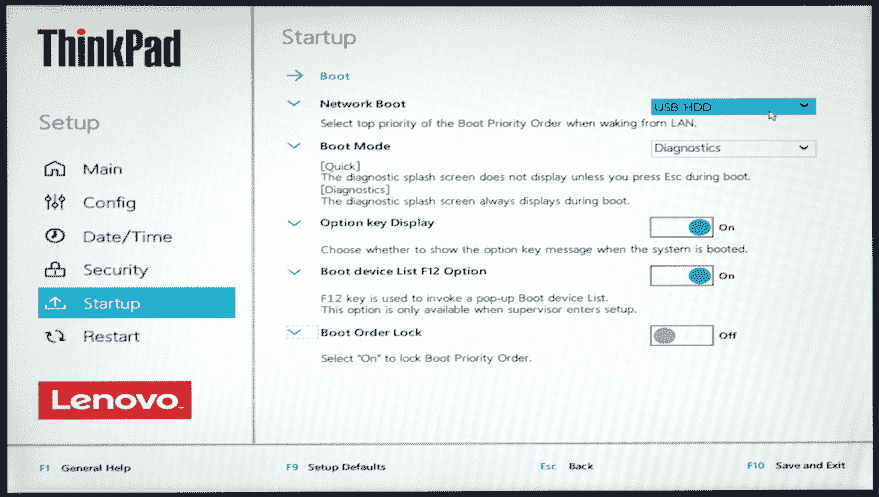

###### 图 1-1\. 联想新 ThinkPad 上的 Lenovo UEFI

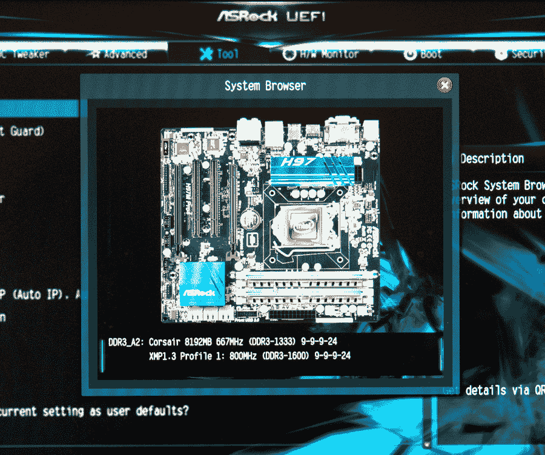

###### 图 1-2\. ASRock UEFI 具有主板浏览器

## 讨论

当你启动计算机时，第一次启动指令来自存储在计算机主板上的 BIOS 或 UEFI 固件。BIOS 是自 1980 年以来一直存在的旧传统系统。UEFI 是它的现代替代品。UEFI 包括对传统 BIOS 的支持。2000 年代中期后几乎所有的计算机都配备了 UEFI。

UEFI 比旧 BIOS 具有更多功能，类似于一个小型操作系统。UEFI 设置界面控制启动顺序、启动设备、安全选项、安全启动、超频、显示硬件健康状况、网络等许多功能。

## 参见

+   主板的文档

+   [统一可扩展固件接口论坛](https://uefi.org)

# 1.2 下载 Linux 安装镜像

## 问题

你需要找到并下载一个 Linux 安装镜像。

## 解决方案

首先，你需要选择想尝试的 Linux 版本。如果不知道从哪里开始，我推荐[Ubuntu Linux](https://ubuntu.com)。[Fedora Linux](https://getfedora.org)和[openSUSE Linux](https://opensuse.org)对于 Linux 新手也是很好的选择。

下载完成后，请验证你下载了一个良好的镜像。这是一个重要的步骤，可以确保你下载的镜像在下载过程中没有损坏或以其他方式被修改。

每个 Linux 发行版都提供签名密钥和下载镜像的校验和。Ubuntu 提供了复制粘贴的验证指令。打开终端并切换到你下载 Ubuntu 的目录。对于 Ubuntu 21.04，验证安装镜像看起来是这样的：

```
$ echo "fa95fb748b34d470a7cfa5e3c1c8fa1163e2dc340cd5a60f7ece9dc963ecdf88 \
*ubuntu-21.04-desktop-amd64.iso" | shasum -a 256 --check

ubuntu-21.04-desktop-amd64.iso: OK
```

如果看到“shasum: WARNING: 1 computed checksum did NOT match”，那么你的下载可能有问题，假设你复制了正确的校验和。在大多数情况下，镜像在下载过程中损坏了，因此请尝试重新下载。

其他 Linux 发行版提供略有不同的验证方法，请按照它们的说明进行操作。

## 讨论

了解数百种 Linux 发行版的一个好网站是[Distrowatch.com](https://distrowatch.com)。Distrowatch 提供关于比任何其他网站更多 Linux 发行版的新闻和信息。

## 参见

+   *man 1 sha256sum*

+   [Ubuntu Linux](https://ubuntu.com)

+   [Fedora Linux](https://getfedora.org)

+   [openSUSE Linux](https://opensuse.org)

# 1.3 使用 UNetbootin 创建 Linux 安装 USB 驱动器

## 问题

你已经下载了一个 Linux 安装**.iso*镜像，并希望将其传输到 USB 存储设备以创建自己的安装介质。你更喜欢使用图形化工具来创建安装介质。

## 解决方案

尝试使用[UNetbootin](https://oreil.ly/8CXp9)，通用网络引导安装程序。它可以在 Linux、macOS 和 Windows 上运行，因此你可以在这些操作系统中下载并创建 Linux 安装盘。UNetbootin 可以根据你下载的**.iso*文件创建安装 USB 驱动器，或者下载一个新的**.iso*文件（图 1-3）。

你可以使用任何大于你的**.iso*文件的 USB 存储设备，当然了。**.iso*文件会覆盖整个设备，因此你不能再用它进行其他用途，并且每个**.iso*文件必须使用单独的 USB 存储设备。

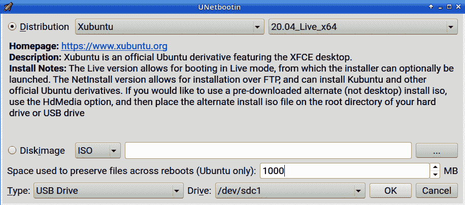

###### 图 1-3\. 使用 UNetbootin 创建可安装的 Linux USB 存储设备

UNetbootin 官网提供下载和说明。一些 Linux 发行版提供 UNetbootin 软件包，但从[UNetbootin 官网](https://unetbootin.github.io)下载更为简单和始终更新。

## 讨论

其他优秀的图形化应用包括 USB Creator、ISO Image Writer 和 GNOME MultiWriter，后者可以同时复制到多个 USB 驱动器。

在创建了安装 USB 驱动器后，你可以查看其中的文件。单个**.iso*文件会展开为一个完整的文件系统，包含类似 Ubuntu 示例中的文件和目录：

```
$  ls -C1 /media/duchess/'Ubuntu 21.04.1 amd64'/
boot
casper
dists
EFI
install
isolinux
md5sum.txt
pics
pool
preseed
README.diskdefines
ubuntu
```

每个 Linux 发行版都以自己的方式设置其安装程序。这个示例展示了 Fedora 的安装文件：

```
$  ls -C1 /media/duchess/Fedora-WS-Live-34-1-6/
EFI
images
isolinux
LiveOS

```

拥有一个 USB 存储设备，并载入一群 Linux 安装文件会很不错，而有些程序正是这么做的。我最喜欢的是[Ventoy](https://ventoy.net)。Ventoy 支持大量 Linux 发行版，可以在 Linux 和 Windows 上运行，你可以使用它创建一个充满 Linux 安装程序的 USB 存储设备，用于运行 Live Linux 和永久安装到硬盘。

## 参见

+   [UNetbootin](https://oreil.ly/8CXp9)

+   第九章

+   [Ventoy](https://ventoy.net)

# 1.4 使用 K3b 创建 Linux 安装 DVD

## 问题

你想要使用图形工具创建 Linux DVD 安装光盘。

## 解决方案

使用 K3b（KDE 刻录专家）。K3b 是 Linux 下最好的图形化 CD/DVD 写入应用程序。

如果你没有 Linux 系统，可以使用任何能够写入 ISO 9660 镜像的 CD/DVD 写入程序。你选择的 CD/DVD 写入器可能会显示类似“将现有镜像刻录到光盘”的选项。

在 K3b 上你会看到类似图 1-4 的内容。点击“刻录镜像”，并注意左下角的确认信息显示“将 ISO 9660…镜像写入光盘”。

在下一个屏幕（图 1-5）中，在左上角的下拉选择器中选择你的 **.iso** 镜像。然后在右上角选择 “ISO 9660 文件系统映像”。在底部的设置中，选中 “验证写入数据”。这将在写入图像后计算校验和，并将其与原始 **.iso** 的校验和进行比较。这是一个重要的步骤，因为如果校验和不匹配，说明你有一个损坏的磁盘，无法使用。

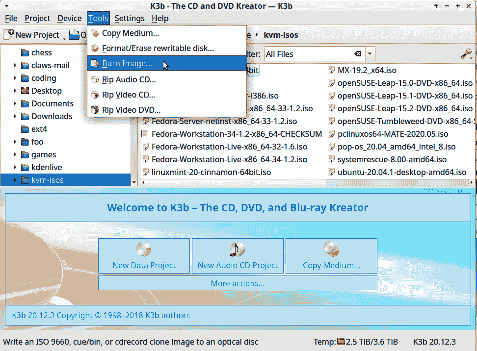

###### 图 1-4\. 使用 K3b 创建安装 DVD

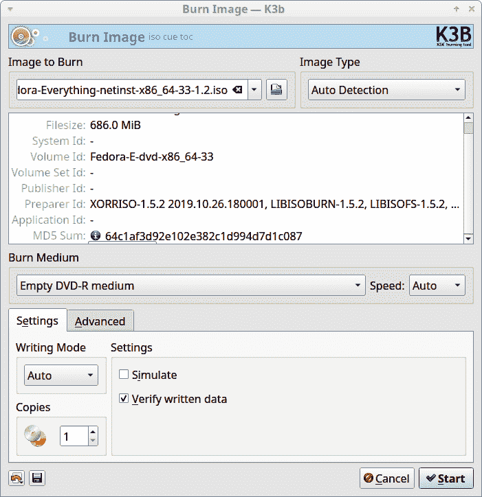

###### 图 1-5\. 配置刻录

当磁盘成功写入时，您将看到一个成功消息，如 图 1-6 中所示。如果有任何错误，该屏幕将显示一些有用的错误消息。

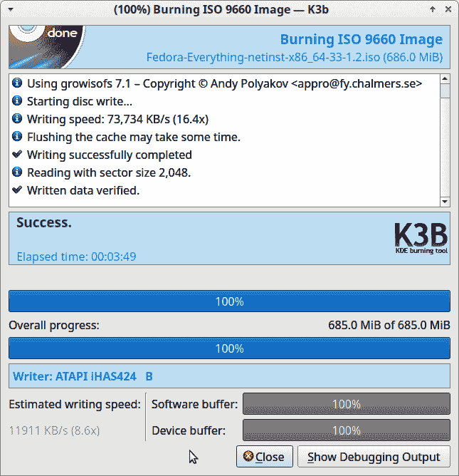

###### 图 1-6\. 成功！

## 讨论

Brasero 和 XFBurn 也是 Linux 上出色的 CD/DVD 刻录应用程序，比 K3b 更简单的界面，但功能仍然很多。

技术世界变化迅速。就在几年前，我还为一切事情刻录 CD 和 DVD。然后 USB 设备席卷市场，多年来我再也没有刻录过光盘，直到我开始写这一章节。

请放心，尽管计算机制造商不再在其机器中包含 CD/DVD 驱动器，但 CD 和 DVD 并未过时。这不是问题，因为你可以购买一个外置 USB CD/DVD 驱动器。您甚至可以找到总线供电的驱动器，因此您只需要一个 USB 线，无需使用电源线。CD/DVD 空白仍然是高质量的，因此如果您喜欢光盘，它们是一个可靠的选择。

## 另请参阅

+   [K3b](https://oreil.ly/MJmXF)

+   [Brasero](https://oreil.ly/a9Dxx)

# 1.5 使用 **wodim** 命令创建可引导的 CD/DVD

## 问题

您需要一个命令行工具来创建可引导的 CD/DVD。

## 解决方案

尝试 *wodim* 命令。你的光学驱动器很可能是 */dev/cdrom*，链接到 */dev/sr0*。使用符号链接是因为它具有正确的权限：

```
$ ls -l /dev | grep cdr
lrwxrwxrwx  1 root root           3 Mar  7 12:38 cdrom -> sr0
lrwxrwxrwx  1 root root           3 Mar  7 12:38 cdrw -> sr0
crw-rw----+ 1 root cdrom    21,   2 Mar  7 08:34 sg2
brw-rw----+ 1 root cdrom    11,   0 Mar  7 12:57 sr0
```

然后将您的安装镜像复制到磁盘：

```
$ wodim dev=/dev/cdrom -v *ubuntu-21.04-desktop-amd64.iso*
```

## 讨论

在 *ls -l* 示例中，有 *sg2* 和 *sr0* 设备。*sg2* 是一个字符设备，*sr0* 是一个块设备。字符设备使用原始内核驱动程序提供对硬件设备的原始访问。块设备通过各种软件程序提供对硬件设备的缓冲访问。用户通过内核的块设备驱动程序与存储设备（如 DVD 和硬盘）进行交互。您可以在 */boot/config-** 文件中看到列出的原始和块内核模块。

## 另请参阅

+   *man 1 wodim*

# 1.6 使用 *dd* 命令创建 Linux 安装 USB 闪存驱动器

## 问题

您希望从命令行而不是使用图形工具创建您的安装 USB 驱动器。

## 解决方案

使用 *dd* 命令。*dd* 在每个 Linux 上都适用，并且使用方法相同。

首先用 *lsblk* 命令验证你的 USB 硬盘的设备名称，以便将映像复制到正确的设备。在下面的示例中，设备名称为 */dev/sdb*：

```
$ lsblk -o NAME,FSTYPE,LABEL,MOUNTPOINT

NAME   FSTYPE  LABEL       MOUNTPOINT
sda
├─sda1 vfat                /boot/efi
├─sda2 xfs     osuse15-2   /boot
├─sda3 xfs                 /
├─sda4 xfs                 /home
└─sda5 swap                [SWAP]
sdb
└─sdb1 xfs     32gbusb
sr0
```

下面的示例创建了一个 USB 安装盘并显示了其进度：

```
$ sudo dd status=progress if=ubuntu-20.04.1-LTS-desktop-amd64.iso of=/dev/sdb
211509760 bytes (212 MB, 202 MiB) copied, 63 s, 3.4 MB/s

```

这个过程需要几分钟时间。当完成时，看起来像这样：

```
2782257664 bytes (2.8 GB, 2.6 GiB) copied, 484 s, 5.7 MB/s
5439488+0 records in
5439488+0 records out
2785017856 bytes (2.8 GB, 2.6 GiB) copied, 484.144 s, 5.8 MB/s

```

拔出驱动器，然后重新插入并快速查看文件。图 1-7 在 Thunar 文件管理器中显示了 Ubuntu Linux 的安装文件。

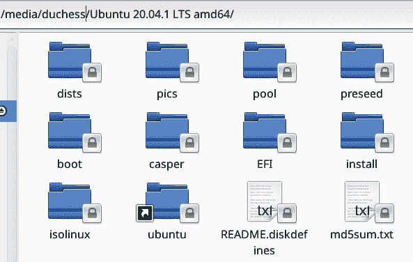

###### 图 1-7\. Thunar 中的 Ubuntu Linux 安装文件

文件被标记为带有挂锁，因为 Ubuntu 安装程序使用 SquashFS 只读文件系统。你可以读取它们，但无法删除或编辑。

准备好使用安装 USB 硬盘。

## 讨论

识别正确的设备以复制你的安装非常重要。在 *lsblk* 的示例中，只有两个存储设备。请注意 LABEL 列；你可以在文件系统上创建标签，以便知道它们是什么（参见 Recipe 9.2 和第十一章的文件系统创建配方 Chapter 11 学习如何创建文件系统标签）。

图形化安装媒体创建工具不错，但我更喜欢 *dd* 命令，因为它简单且可靠。*dd* 是 Disk Duplicator 的缩写。这是一个古老而实用的 GNU 命令，在 GNU 的 *coreutils* 包中存在已久。

## 参见

+   *man 1 dd*

# 1.7 尝试简单的 Ubuntu 安装

## 问题

你想尝试一个简单的 Ubuntu 安装。你的安装介质已经准备好，并且你知道如何引导到你的安装介质。计算机上没有你想保留的任何东西，所以 Ubuntu 可以接管硬盘。

## 解决方案

下面的示例演示了 Ubuntu Linux 21.04 Hirsute Hippo 的快速简单安装。所有的 Ubuntu 版本都有带有谐音动物名称。

插入你的安装设备，启动机器，并打开系统的一次性启动菜单。选择安装设备并启动（参见 图 1-8）。

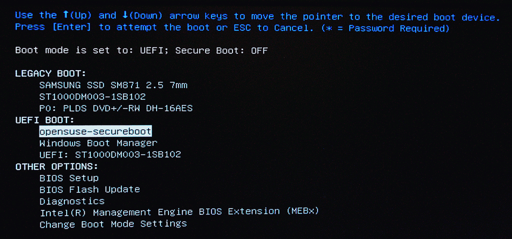

###### 图 1-8\. 启动到安装 USB 硬盘

# 所有 UEFI 屏幕看起来都不同

每个厂商的 UEFI 界面看起来都不同，每个版本的外观也会有变化。上面的例子是 Dell UEFI 的一次性启动屏幕。

当 GRUB 菜单出现时，选择默认选项。对于 Ubuntu 21.04，默认为 *Ubuntu*，如果没有选择则默认启动（参见 图 1-9）。

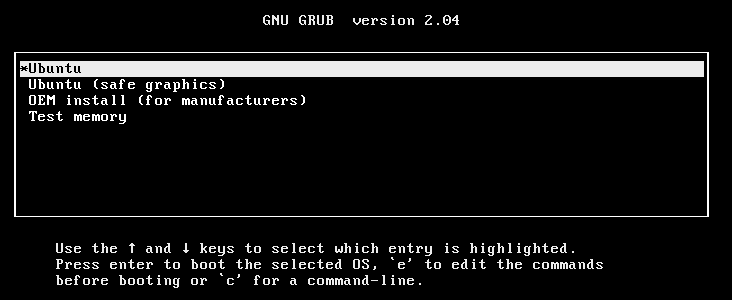

###### 图 1-9\. Ubuntu 安装程序的 GRUB 启动菜单

然后你将可以选择尝试 Ubuntu 和安装 Ubuntu。尝试 Ubuntu 启动 live 版本，安装 Ubuntu 打开安装程序（参见 图 1-10）。无论选择哪个，因为 live 桌面上有一个大的安装按钮。

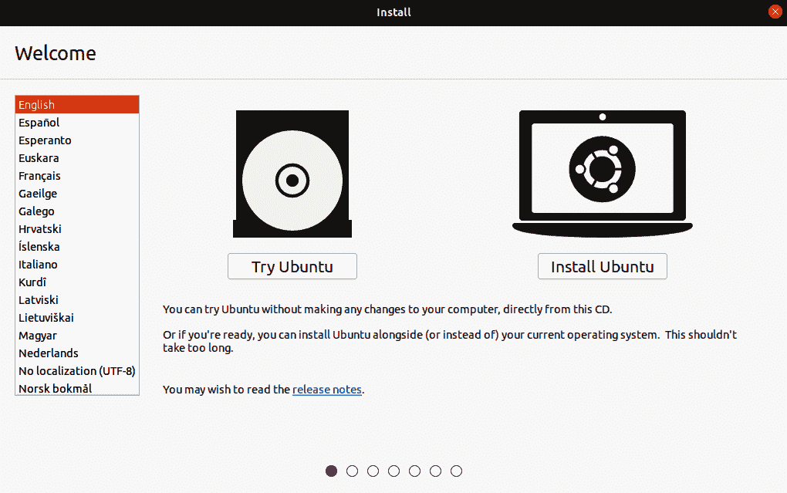

###### 图 1-10\. 选择实时映像或安装程序

当你启动安装程序时，它会引导你完成几个步骤。首先是选择语言和键盘布局。

然后，如果你有无线网络接口，你可以选择设置或等到安装完成后再进行设置。

然后配置你的安装。在“更新和其他软件”屏幕上，选择“正常安装”（图 1-11）。

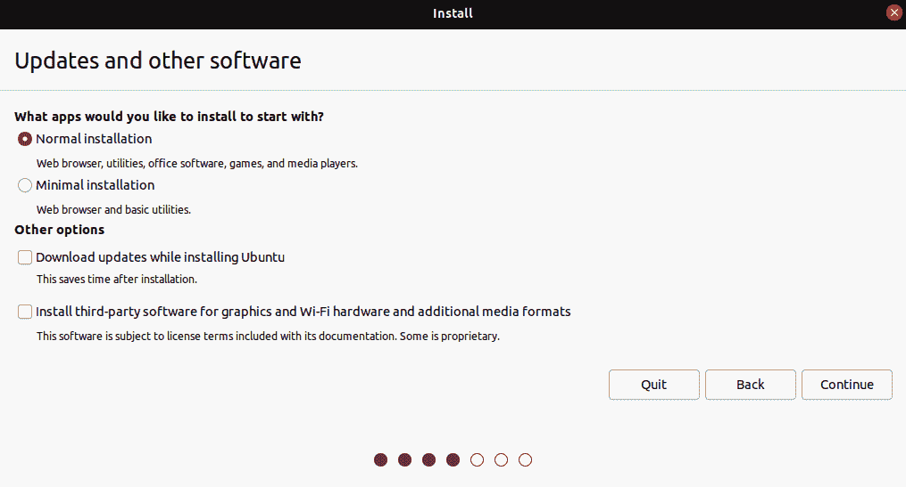

###### 图 1-11\. 选择正常安装

在下一个屏幕上，选择“擦除磁盘并安装 Ubuntu”，然后点击“立即安装”（图 1-12）。

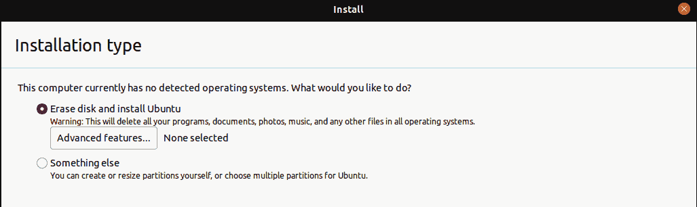

###### 图 1-12\. 选择擦除磁盘并安装 Ubuntu

下一个屏幕会询问“写入更改到磁盘？” 点击“继续”。接下来还有几个屏幕：设置时区，创建用户名、密码和主机名，然后安装开始。安装过程中你无需操作，安装完成后重新启动计算机，按提示移除安装设备，然后按 Enter 键。重新启动后，会有几个设置屏幕，然后你就可以使用全新的 Ubuntu Linux 了。

## 讨论

大多数 Linux 发行版都有类似的安装过程：启动安装介质，然后选择默认的简单安装或选择可定制的安装。有些在开始时就会询问所有问题，如用户名和密码；其他则在重新启动后完成最终设置。

Linux 安装程序通常有返回按钮可以返回并进行更改。你可以随时退出，尽管这可能会使你的系统处于不可用状态。这并不致命；重新开始并进行完整安装即可。

你可以在任意数量的机器上重新安装多次，无需担心许可密钥，除了需要注册密钥的企业发行版（如 Red Hat、SUSE 或带付费支持的 Ubuntu）。

## 参见

+   [Ubuntu 文档](https://help.ubuntu.com)

# 1.8 自定义分区

## 问题

你可以设置自己的分区方案。

## 解决方案

在这个方案中，我们将重新做一个例子，安装 Ubuntu 在 1.7 节，并设置我们自己的分区方案。

# 整个磁盘将被擦除

在这个方案中，创建了一个新的分区表，擦除了整个磁盘。

你可以按照任意方式设置分区。表 1-1 展示了我喜欢在 Linux 工作站上设置的方式。

表 1-1\. 示例分区方案

| 分区名称 | 文件系统类型 | 挂载点 |
| --- | --- | --- |
| /dev/sda1 | ext4 | /boot |
| /dev/sda2 | ext4 | / |
| /dev/sda3 | ext4 | /home |
| /dev/sda4 | ext4 | /tmp |
| /dev/sda5 | ext4 | /var |
| /dev/sda6 | 交换 |  |

当你到达“安装类型”屏幕时，选择“其他选项”以开始你的自定义安装（图 1-13）。

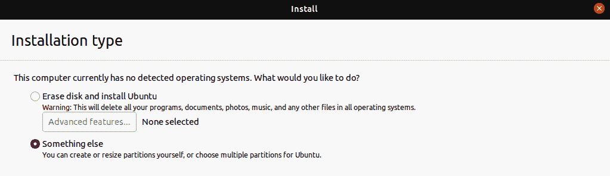

###### 图 1-13\. 选择安装类型

到达分区屏幕后，通过点击新分区表来擦除整个磁盘。然后您将看到类似图 1-14 的东西。

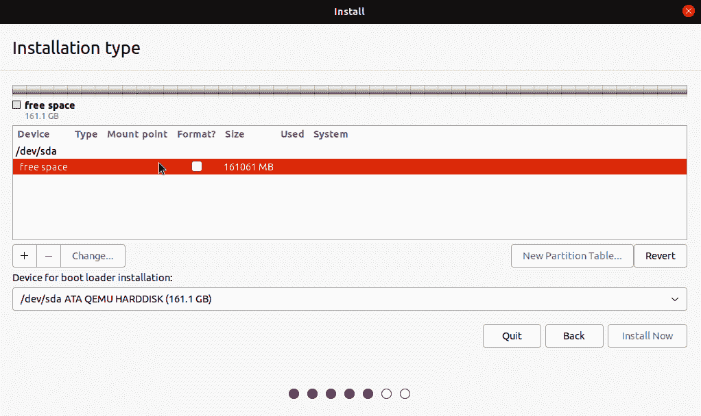

###### 图 1-14\. 创建新的分区表

要创建新分区，请点击“空闲空间”行以选中它，然后点击加号+添加新分区。设置大小、文件系统和挂载点。图 1-15 创建了一个 500 MB 的*/boot*分区。

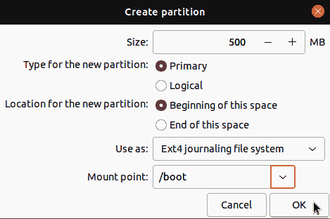

###### 图 1-15\. 创建引导分区

再次点击“空闲空间”，点击加号，一直进行下去，直到创建所有分区。图 1-16 显示的结果：*/boot*、*/home*、*/var*、*/tmp* 和交换文件都位于各自的分区上。

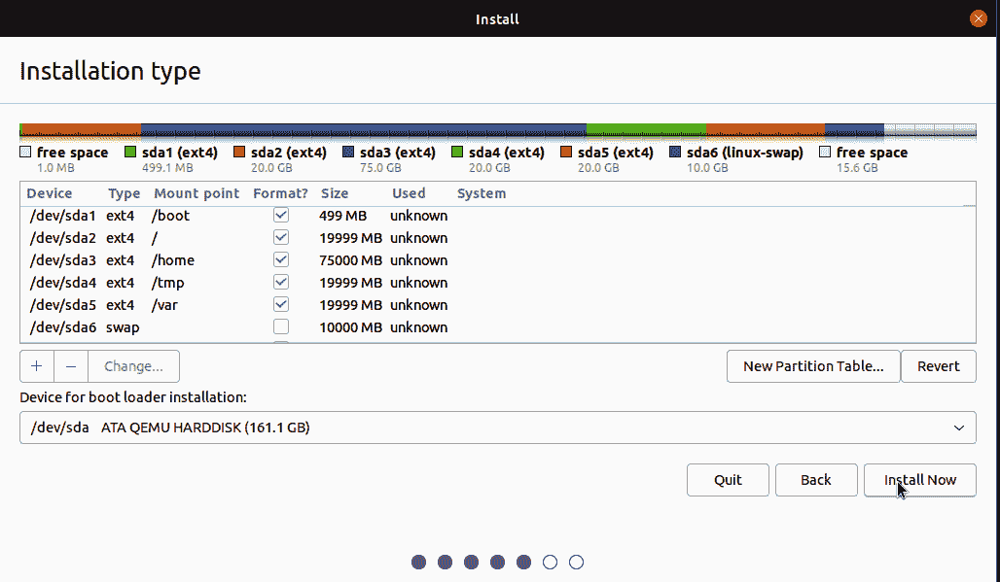

###### 图 1-16\. 分区设置完毕，准备继续安装

# 选择要格式化的分区

注意分区屏幕上的“格式化？”复选框。所有新分区必须使用文件系统进行格式化。

## 讨论

示例来自虚拟机，因此硬盘为*vda*而不是*sda*。

本示例在所有分区上使用 Ext4 文件系统。您可以使用任何文件系统，请参阅第十一章了解更多信息。

磁盘分区就像有一堆独立的物理磁盘一样。每个都是硬盘的独立部分，每个分区可以有不同的文件系统。您选择的文件系统及其大小都取决于您如何使用系统。如果需要大量数据存储，则*/home*需要更大。它甚至可以是单独的磁盘。

将*/boot*放在独立分区中可以更轻松地管理多启动系统，因为这使得引导文件与您安装或删除的任何操作系统无关。500 MB 足够了。

将*/*根目录放在独立分区中可以轻松恢复或替换为不同的 Linux。对于大多数发行版来说，30 GB 足够了，但如果使用 Btrfs 文件系统，则应将其增加到 60 GB 以便存储快照。

将*/home*放在独立的分区中以隔离它免受根文件系统的影响，这样您可以更换 Linux 安装而不触及*/home*。*/home*甚至可以在单独的磁盘上。

*/var* 和 */tmp* 可能因为运行中的进程而填满。将它们放在独立的分区中可以防止它们崩溃其他文件系统。我的通常每个都是 20 GB，并且对于繁忙的服务器，它们需要更大的空间。

将交换文件设置为内存大小的分区，以便支持挂起到磁盘。

## 参见

+   在第 3.9 节的讨论中了解挂起和睡眠状态

+   第八章

+   第九章

# 1.9 保留现有分区

## 问题

你的 */home* 单独存在于一个分区，并希望将其保留用于新的 Linux 安装。

## 解决方案

在 1.7 节 和 1.8 节 中，我们通过创建新的分区表来删除现有安装。当你有想要保留的分区，如 */home* 或任何共享目录时，请勿创建新的分区表。而是编辑现有分区。你可以删除现有分区，创建新的分区，或重用现有分区。

在 Ubuntu 安装程序的以下示例中，*/dev/sda3* 是一个单独的 */home* 分区。右键点击它，然后点击“更改…” 然后你可以将其挂载点设置为 */home*，并确保“格式化？”框未被选中（图 1-17）。如果你格式化它或更改文件系统类型，分区上的所有数据将被删除。

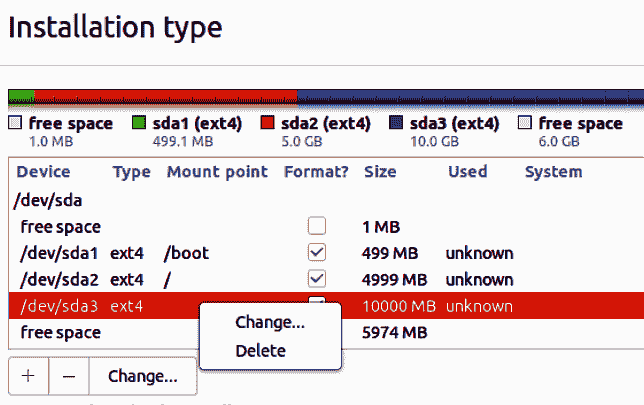

###### 图 1-17\. 保存 /dev/sda3，而不是覆盖它

## 讨论

在 1.8 节 中的讨论详细介绍了定制分区方案以及哪些文件系统适合在单独的分区上隔离。

## 参见

+   第八章

+   第九章

# 1.10 自定义软件包选择

## 问题

你不想要默认的软件包安装，而是更喜欢选择自己要安装的软件。例如，你可能想设置一个开发工作站、web 服务器、中央备份服务器、多媒体制作工作站、桌面发布工作站，或选择自己的办公生产力应用程序。

## 解决方案

每个 Linux 发行版管理安装选项的方式都有所不同。在本示例中，你将看到 openSUSE 和 Fedora Linux 的示例。openSUSE 支持从单个安装镜像安装多个安装类型，而 Fedora Linux 则有几个不同的安装镜像。

这两个示例代表了通用的 Linux 发行版。

请记住，你可以在安装后随意安装和删除软件。

### openSUSE

openSUSE 安装程序支持从默认设置的简单安装和广泛的定制选项。它有两个屏幕来控制软件包选择。第一个屏幕 (图 1-18) 提供了多个系统角色选择，例如带有 KDE 或 GNOME 图形环境的桌面系统，带有 IceWM 窗口管理器的通用桌面，无图形环境的服务器，或者无图形环境的事务服务器。每个角色都有一组预设的软件包。你可以选择按原样安装其中之一，或选择要安装或删除的软件包。

每个角色都是可定制的，稍后你将看到几个屏幕 (图 1-19)。

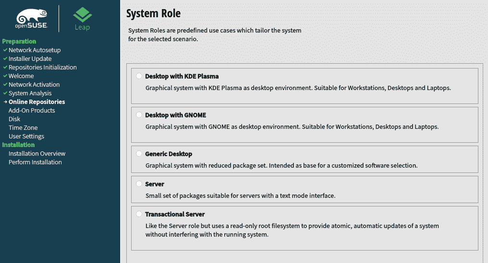

###### 图 1-18\. openSUSE 安装角色

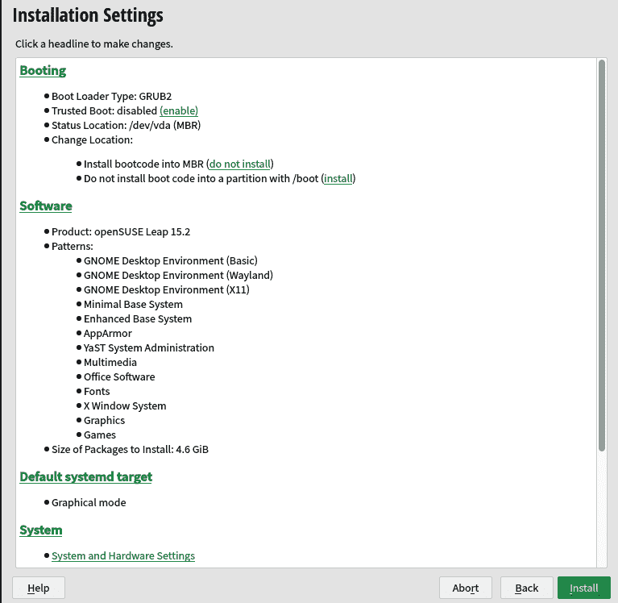

###### 图 1-19\. openSUSE 安装设置

点击“软件”以打开软件包选择屏幕。该屏幕显示了 openSUSE *模式*，这些是相关的软件包组，您可以使用单个命令安装。我喜欢 Xfce 桌面环境，所以我将其添加到我的安装中（图 1-20）。

注意左下角的“详细信息”按钮。点击它将打开一个屏幕，具有多个选项卡，用于更精细的软件包选择（图 1-21）。在此屏幕上，您将找到大量信息：每个模式中的单独软件包、软件包组、下载仓库、安装摘要、依赖关系以及每个软件包的信息。在右侧窗口中选择或取消选择每个模式中的软件包后，安装程序将自动解决依赖关系。

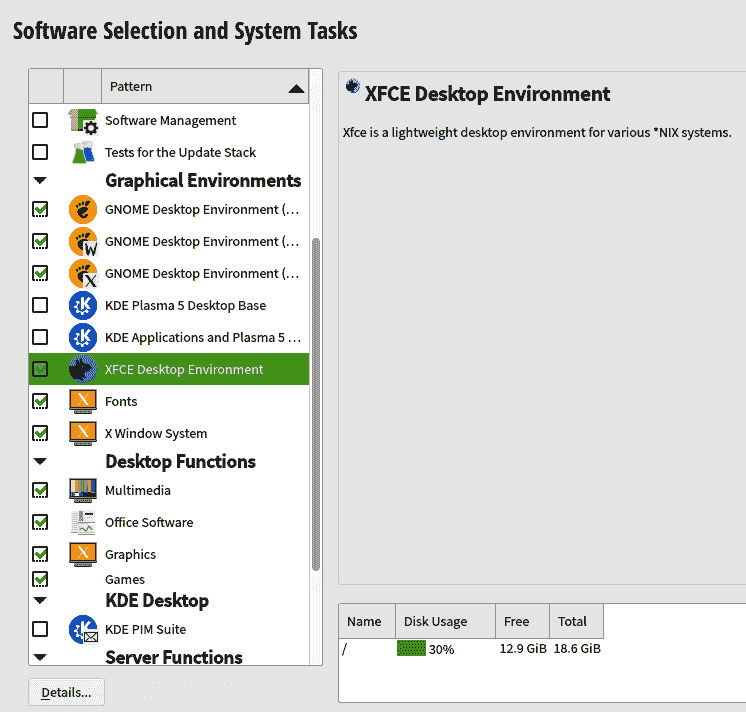

###### 图 1-20\. openSUSE 软件模式

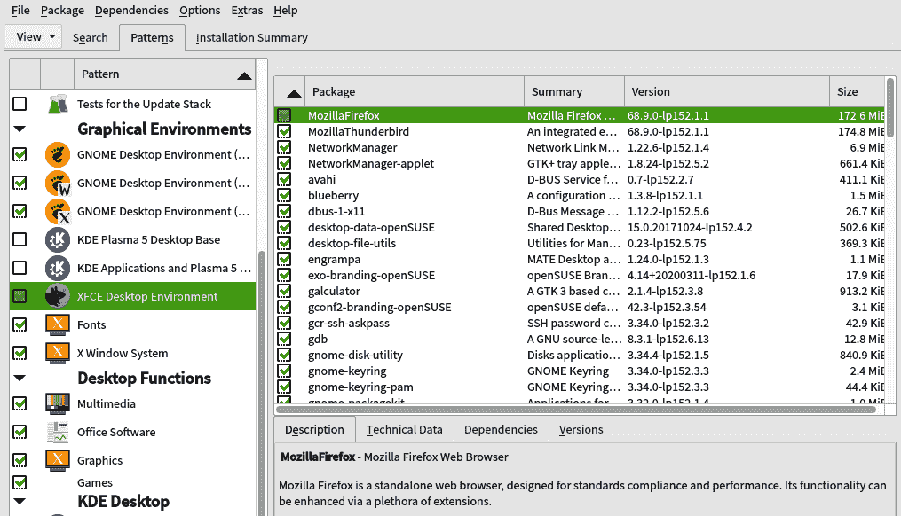

###### 图 1-21\. openSUSE 单独软件包选择

当您完成软件选择后，将返回到安装摘要屏幕，再次有机会更改安装设置。点击绿色的“下一步”按钮以完成安装。

### Fedora Linux

Fedora Linux 工作站和服务器安装程序仅提供分区选项，没有软件包定制功能。您需要下载 600 MB 的网络安装镜像进行可定制的安装，从[Fedora 备选下载](https://oreil.ly/JW9J8)获取。它被标记为 Fedora 服务器，但它为任何类型的 Fedora 安装提供完整的软件包选择。从安装摘要屏幕设置所有安装选项（图 1-22）。

请注意安装摘要屏幕上的所有选项：软件选择、用户创建、分区、键盘和语言、时区、网络和主机名。点击“软件选择”以打开选择要安装的软件包的屏幕（图 1-23）。

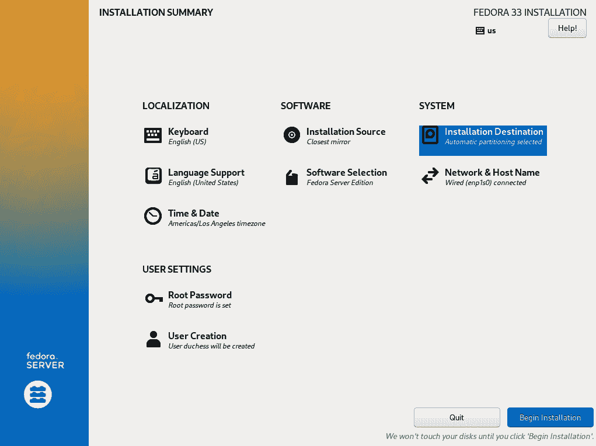

###### 图 1-22\. Fedora Linux 网络安装程序

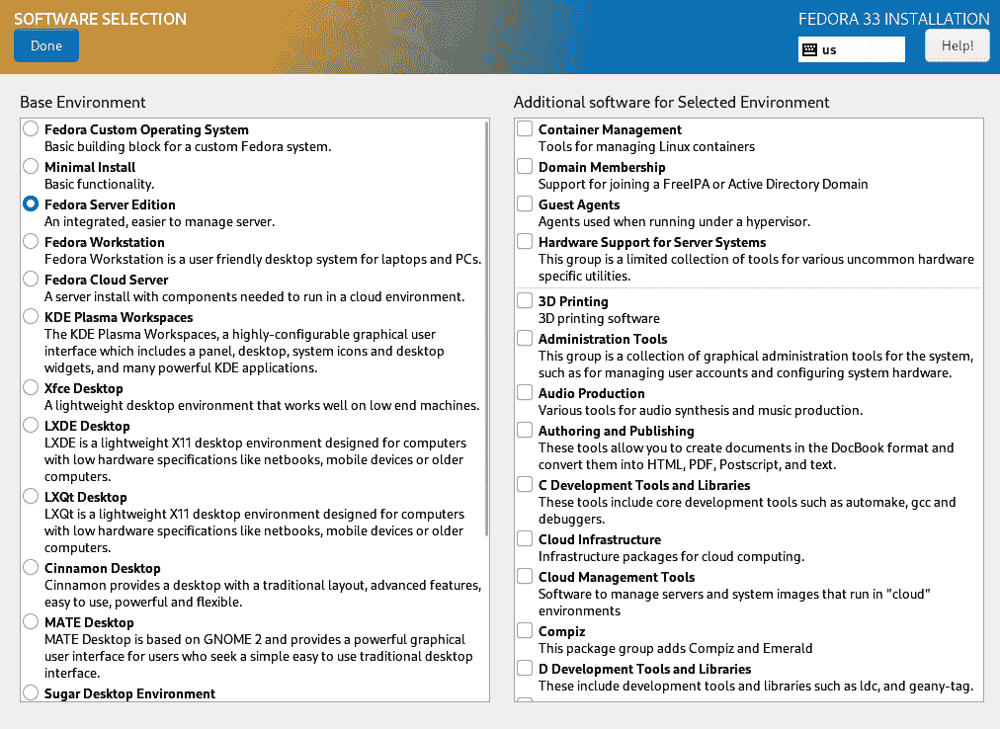

###### 图 1-23\. Fedora Linux 软件包选择

当完成后，请点击“完成”；您将返回到安装摘要屏幕。设置完成后，请点击“开始安装”，其余安装将无人值守运行。

## 讨论

无论您想尝试哪种 Linux 版本，请阅读其文档和发布说明。这是重要的信息，可以节省很多麻烦。还要寻找论坛、邮件列表和维基以寻找帮助。

您可以安装任意多个桌面环境，然后在登录时选择要使用的环境。选择桌面环境的按钮通常很小并不明显；例如，默认的 Ubuntu 登录界面（图 1-24）在您点击用户名之前会隐藏桌面选择按钮。Xfce、Lxde、GNOME 和 KDE 是一些流行的图形桌面环境。GNOME 是 Ubuntu、openSUSE 和 Fedora 的默认桌面环境。

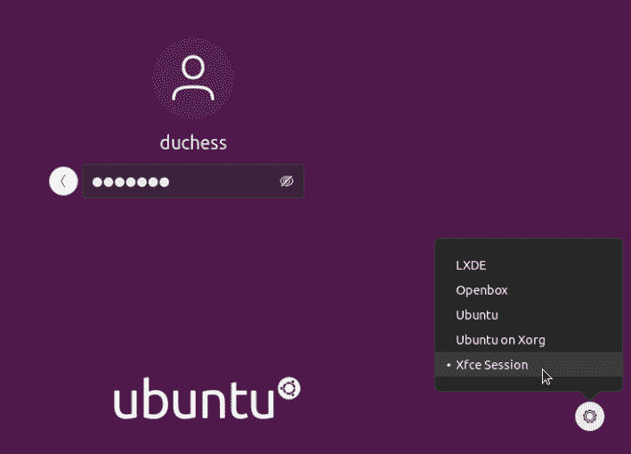

###### 图 1-24\. 选择不同的图形环境

## 另请参阅

+   [openSUSE 文档](https://oreil.ly/AupNr)

+   [SUSE 事务更新](https://oreil.ly/mTyuV)

# 1.11 多启动 Linux 发行版

## 问题

如果您想在计算机上设置多个 Linux 发行版的多引导系统，请从启动菜单中选择要运行的发行版。

## 解决方案

不用担心，因为您可以安装尽可能多的 Linux，只要硬盘（或硬盘）有容量。您必须已经安装了一个 Linux，并且必须有一个单独的 */boot* 分区。然后按照以下步骤进行操作：

1.  为新的 Linux 提供足够的免费磁盘空间，可以与您现有的 Linux 放在同一硬盘上，也可以放在另一个硬盘上，无论是内置的还是外置的。

1.  仔细记录属于您首次安装的 Linux 的分区，以免意外覆盖或删除任何您想保留的分区。

1.  在每个新安装的 Linux 中挂载 */boot* 分区，而不要格式化它。

1.  启动到安装介质，然后配置新安装以安装在空闲的磁盘空间上。

安装程序会自动找到您现有的 Linux 安装，并将新的 Linux 添加到启动菜单中。安装完成后，您将看到一个启动菜单，例如 图 1-25，其中有选项可以启动 Linux Mint 或 Ubuntu。

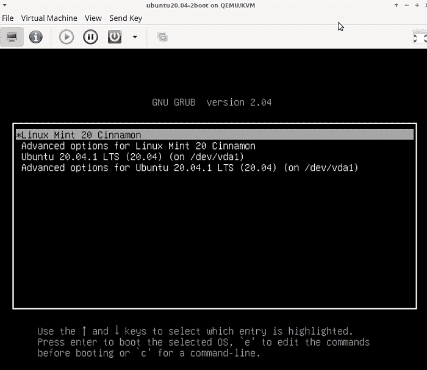

###### 图 1-25\. 新的启动菜单，带有 Linux Mint 和 Ubuntu

## 讨论

如果您需要在硬盘上释放空间，可以安全地缩小现有分区（参见 第 9.7 节）。最安全的方法是在未挂载的分区上进行此操作，并且某些文件系统在挂载状态下无法缩小。使用 SystemRescue 缩小分区，参见 第 19.12 节。

大多数 Linux 安装程序足够智能，可以识别现有的 Linux 安装，并提供保留其选项。在 图 1-26 中，您可以看到 Linux Mint 安装程序，提供了选项，可以占用整个硬盘或在不删除 Ubuntu 的情况下安装在其旁边。

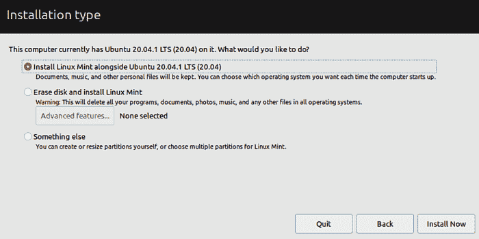

###### 图 1-26\. 在 Ubuntu 旁边安装 Linux Mint

## 另请参阅

+   第 8.9 节

+   第 9.7 节

+   第 19.12 节

+   你的 Linux 发行版的安装文档

# 1.12 使用 Microsoft Windows 双启动

## 问题

你希望在计算机上双启动 Linux 和 Windows。

## 解决方案

双启动 Linux 和 Windows 会在一台计算机上安装两个系统，然后在启动时从引导菜单中选择要使用的系统。

如果尚未安装 Windows，最好先安装 Windows，然后再安装 Linux。Windows 喜欢控制引导加载程序，因此先安装 Linux 可以让 Linux 控制引导加载程序。

请务必备份重要数据并准备好 Windows 恢复媒体。

安装完 Windows 后，开始 Linux 的安装。你可以按照自己的方式安装 Linux：简单安装或者自定义安装，在这里设置分区和软件包选择。对于多重引导有一个重要的选项：

1.  如果只有一个硬盘，则“引导加载程序安装设备”是 */dev/sda*。

1.  如果你在一块硬盘上有 Windows，而在第二块硬盘上安装 Linux，则“引导加载程序安装设备”是 Linux 硬盘。使用设备名称，例如 */dev/sdb*，而不是分区名称，比如 */dev/sdb1*。

在 图 1-27 中，有两块硬盘，Windows 安装在 */dev/sda*，Linux 安装在 */dev/sdb*。

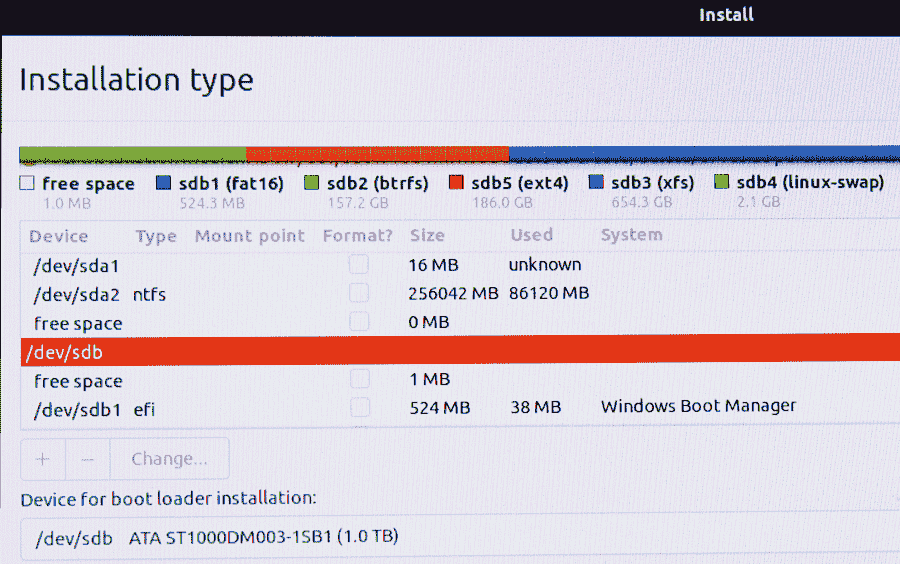

###### 图 1-27\. 在 Windows 旁边安装 Ubuntu

请务必确认你正在正确的位置安装 Linux，而不是覆盖 Windows。如果要为 Linux 分区，就像单独安装一样，并且要小心更改哪些分区。

当你设置好分区并满意你的安装配置后，继续完成 Linux 的安装。安装完成并重新启动后，你的 GRUB 菜单将包含两个系统的条目（见 图 1-28）。

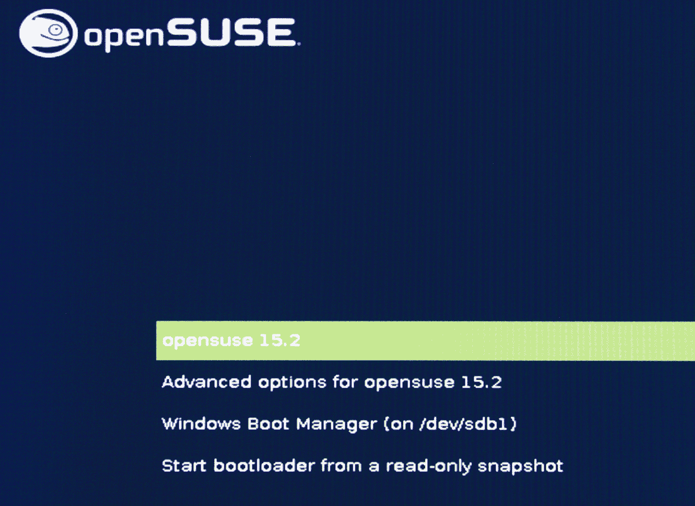

###### 图 1-28\. openSUSE 和 Windows 在 GRUB 启动菜单中

## 讨论

你可以在硬盘上为 Linux 和 Windows 安装多个系统，只要硬盘空间足够。

在同一台机器上运行 Linux 和 Windows 还有其他方法。Windows 10 包含了 Windows Subsystem for Linux 2（WSL 2），可以在虚拟环境中运行支持的 Linux 发行版。如果你有 Windows 安装媒体，你可以在 Linux 上运行 Windows 虚拟机。虚拟机非常好用，因为你可以同时运行多个操作系统，尽管这需要高端 CPU 和大量内存。

VirtualBox 和 QEMU/KVM/Virtual Machine Manager 是运行在 Linux 上的优秀的免费虚拟机主机。

## 参见

+   [Windows Subsystem for Linux 文档](https://oreil.ly/4cbnk)

+   [VirtualBox](https://oreil.ly/pI6J6)

+   [KVM](https://oreil.ly/gNdi9e)

+   [Virtual Machine Manager](https://oreil.ly/5vj6m)

+   [QEMU](https://oreil.ly/VKBkf)

# 1.13 恢复 OEM Windows 8 或 10 产品密钥

## 问题

您购买了预装有 Windows 8 或 10 的计算机，但找不到您的产品密钥。

## 解决方案

让 Linux 为您找到它。从安装有 Windows 的同一台计算机上的 Linux 系统或从 SystemRescue 运行以下命令：

```
$ sudo cat /sys/firmware/acpi/tables/MSDM
MSDMU
DELL  CBX3
AMI
*FAKEP-RODUC-TKEY1-22222-33333*
```

并且在最后一行就是它。

如果您可以登录 Windows，请在 Windows 中运行以下命令以检索您的产品密钥：

```
C:\Users\Duchess> wmic path softwarelicensingservice get OA3xOriginalProductKey
OA3xOriginalProductKey
*FAKEP-RODUC-TKEY1-22222-33333*

```

## 讨论

如果您没有恢复媒体，Windows 10 是免费下载的。您将需要您的 25 位 OEM 产品密钥进行全新安装。

## 参见

+   [下载 Windows 10](https://oreil.ly/rz157)

# 1.14 在 Linux 上挂载您的 ISO 镜像

## 问题

你已经下载了一个 Linux **.iso*文件，并且很想知道它在解压后的样子。你可以继续创建一个可启动的 DVD 或 USB 驱动器，然后检查文件，但你真的想要在不复制到另一个设备的情况下解压它。

## 解决方案

Linux 有一个名为*loop*设备的伪设备。这使得您的**.iso*镜像文件像任何其他文件系统一样可访问。按照以下步骤将您的**.iso*镜像文件挂载到一个循环设备中。

首先，在您的家目录中创建一个挂载点，可以为其指定任何名称。在示例中，它称为*loopiso*：

```
$ mkdir loopiso

```

在这个新目录中挂载您的**.iso*。在示例中，它是一个 Fedora Linux 安装镜像：

```
$ sudo mount -o loop Fedora-Workstation-Live-x86_64-34-1.2.iso loopiso
mount: /home/duchess/loopiso: WARNING: device write-protected, mounted read-only

```

在文件管理器中查看已挂载的文件系统（图 1-29）。

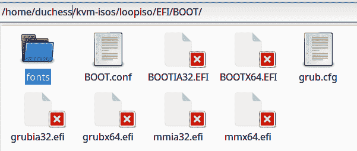

###### 图 1-29\. Fedora Linux 34 中的一个已挂载的*.iso*

您可以进入目录并阅读文件。您将无法编辑任何文件，因为它们是以只读方式挂载的。

完成后，卸载它：

```
$ sudo umount loopiso

```

## 讨论

循环设备将常规文件映射到虚拟分区，并且您可以在此文件中设置虚拟文件系统。如果您想尝试创建自己的文件，可以通过一些网络搜索找到很多方法。从*man 8 losetup*开始。

## 参见

+   *man 8 mount*

+   *man 8 losetup*
