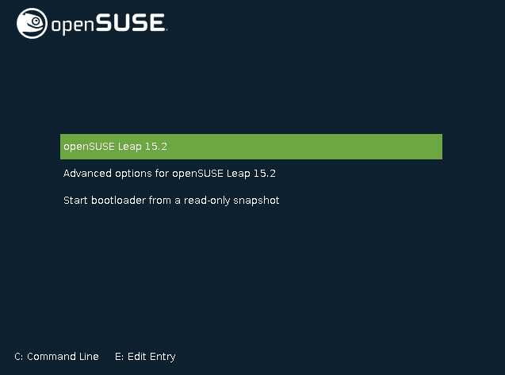
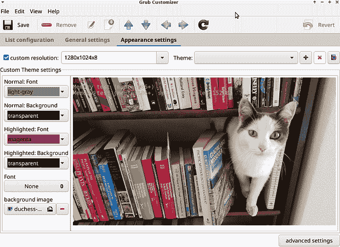
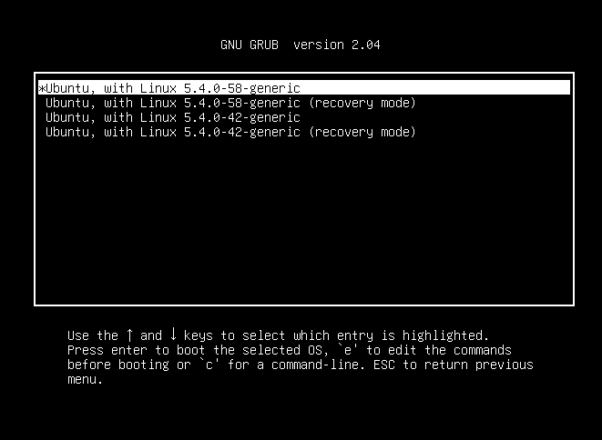
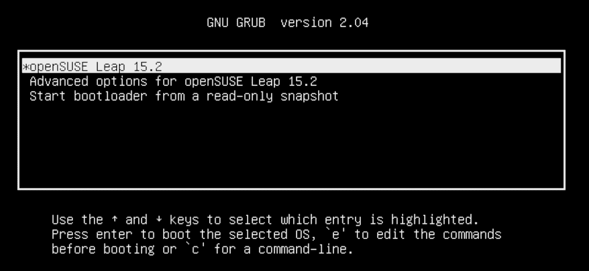
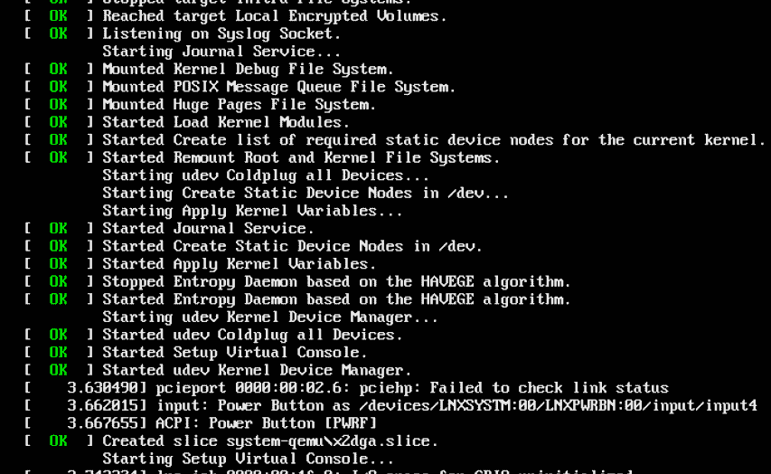
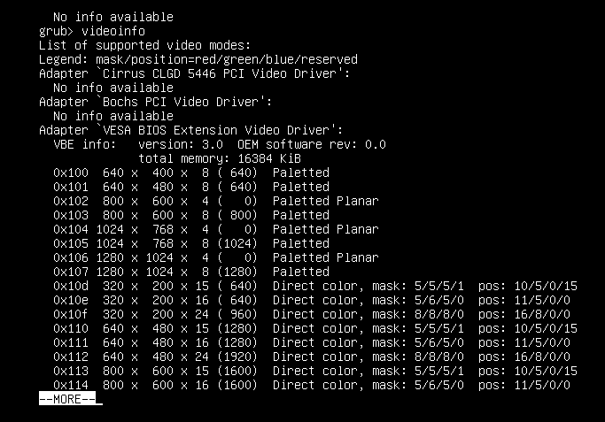
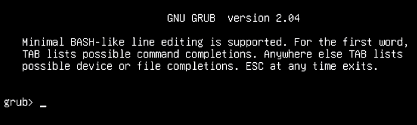
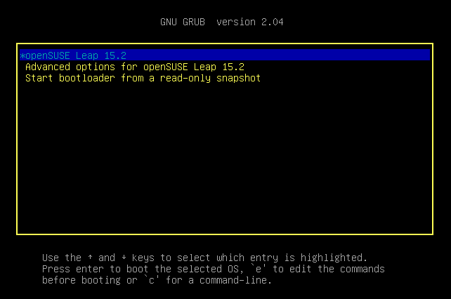
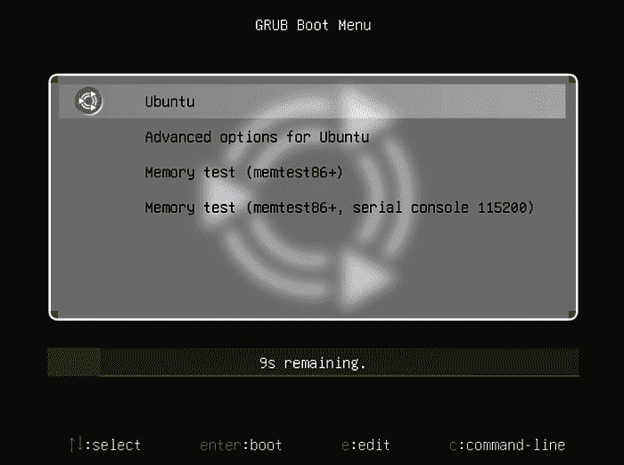
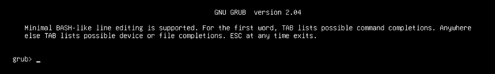

# 第二章：管理 GRUB 引导加载程序

*引导加载程序*是在您打开计算机后加载操作系统的软件。GRUB（GRand Unified Bootloader）引导加载程序是 Linux 上最常用的引导加载程序。

GRUB 支持许多有用的功能：在单个 PC 上引导多个操作系统、实时配置编辑、可主题化界面和救援模式。在本章中，您将了解所有这些内容。

# GRUB 与 GRUB 2

GRUB 有两个主要版本，传统的 GRUB 和 GRUB 2。GRUB 2 的版本是 1.99 及以上。传统的 GRUB 在 2005 年版本 0.97 结束。许多 GRUB 如何文档仍然参考传统的 GRUB 并将其与 GRUB 2 进行比较。在本章中，我不会讨论传统的 GRUB。它已经退役很久了，与使用 GRUB 2 几乎没有关系，因此本章将专门讨论 GRUB 2。

一些 Linux 发行版使用纯 GRUB 命名，一些使用 GRUB 2。例如，Ubuntu 有*/boot/grub/*目录和*grub-mkconfig*命令，而 Fedora 称之为*/boot/grub2/*和*grub2-mkconfig*。请检查您的文件路径和名称。在本章中，我使用 Ubuntu 的命名方案，除了特定于发行版的例子。

自从 UNIVAC 在上个千年 40 年代首次建造以来，计算机的启动方式并没有多大改变。启动计算机被称为*引导*，这是一个“靠自己的靴带拉自己起来”的参考，这是不可能的。可编程计算机的困难在于它需要软件指令来告诉它该做什么，在操作系统加载之前这些指令从哪里来呢？

现代 x86_64 PC 架构的解决方案是将初始启动指令存储在主板上的芯片上，并使用这些指令的地址来编程 CPU。您可以说 CPU 是硬连接接收启动指令的。这个地址在所有 x86_64 机器上都是相同的，这就是为什么您可以混合和匹配主板和 CPU 的原因。（如果您想进行一些研究，这个地址被称为*复位向量*。）

这是关于它们如何运作的简化描述：

第一阶段在系统上电时启动。CPU 从 BIOS/UEFI 固件获取指令，然后初始化 CPU 缓存和系统内存。当系统内存初始化时，会运行自检（POST），测试内存并测试与键盘、鼠标、显示器和磁盘驱动器等其他硬件的连接。您可能已经注意到键盘和鼠标上的 LED 灯亮起，并听到计算机箱内部的声音，因为您的磁盘驱动器正在被探测。

在 POST 之后，BIOS/UEFI 固件启动启动的第二阶段，并在硬盘上查找引导文件。GRUB 引导加载程序加载必要的文件以启动您的操作系统并完成系统启动。

当启动屏幕出现（图 2-1）时，GRUB 会等待预先配置的时间以等待您的输入，通常为 5–10 秒，如果您不进行任何操作，则会启动默认设置。使用箭头键导航启动菜单。按任意键停止倒计时，然后您可以随意探索启动选项。

在 图 2-1 中，第一项启动系统。接下来的两个条目打开带有更多启动选项的子菜单。在探索子菜单时，按 Esc 键返回主菜单。

某些 Linux 发行版（如 Fedora 和 Ubuntu）在计算机上只安装一个操作系统时不会显示启动屏幕。在这种情况下，按下 Shift 键可查看启动屏幕。有一个配置选项可以始终显示启动屏幕。

您可以通过调整 GRUB 配置文件中的几个选项来自定义 GRUB 菜单的外观和行为。

如果您希望使用图形工具自定义 GRUB 菜单，请尝试 GRUB 自定义工具（图 2-2）。这在大多数 Linux 发行版中都作为 *grub-customizer* 软件包提供，但 openSUSE 则在 YaST 系统配置实用程序中有一个标记为“引导加载程序”的 GRUB 模块。



###### 图 2-1\. openSUSE GRUB 启动屏幕



###### 图 2-2\. GRUB 自定义工具

# 2.1 重新构建您的 GRUB 配置文件

## 问题

每当更改 GRUB 配置时，都需要重新构建它。

## 解决方案

重新构建 GRUB 配置的命令因发行版而异。在 Fedora 和 openSUSE 中，使用此命令：

```
$ sudo grub2-mkconfig -o /boot/grub2/grub.cfg
```

一些发行版（如 Ubuntu）使用：

```
$ sudo grub-mkconfig -o /boot/grub/grub.cfg
```

Ubuntu Linux 还有一个脚本可以运行 *grub-mkconfig*，*update-grub*：

```
$ sudo update-grub
```

## 讨论

一些 Linux 发行版贴心地在 */etc/default/grub* 的顶部提供了正确的命令。

在编辑 GRUB 配置文件时，请始终验证正确的文件名和路径，因为它们在不同的 Linux 发行版上可能会有所不同。

## 参见

+   要了解您系统的 BIOS/UEFI，请参阅您的主板文档

+   [GNU GRUB 手册](https://oreil.ly/szAiR)

+   GRUB 有多个单一用途的手册页面；运行 *man -k grub* 可查看所有内容。

+   *info grub* 或 *info grub2*

# 2.2 取消隐藏的 GRUB 菜单

## 问题

当您的 Linux 发行版在计算机上只安装了一个操作系统时，默认会隐藏 GRUB 菜单，如果您希望每次启动时都显示它，请进行如下设置。

## 解决方案

几个 Linux 发行版包括 Ubuntu 和 Fedora 在内的一些发行版会执行此操作。您可以通过在启动时按住 Shift 键来临时取消隐藏 GRUB 菜单。

编辑 */etc/default/grub*，使用以下选项永久取消隐藏：

```
GRUB_TIMEOUT="10"
GRUB_TIMEOUT_STYLE=menu

```

如果您的文件中包含 `GRUB_HIDDEN_TIMEOUT=0` 和 `GRUB_HIDDEN_TIMEOUT_QUIET=true` 这两行，请将其注释掉。

修改 */etc/default/grub* 后，重新构建您的 GRUB 配置（配方 2.1）。

## 讨论

`GRUB_HIDDEN_TIMEOUT=0`表示不显示 GRUB 菜单，而`GRUB_HIDDEN_TIMEOUT_QUIET=true`表示不显示倒计时计时器。

如果在多引导配置中安装另一个操作系统，则 GRUB 菜单应该自动显示。

## 参见

+   Recipe 2.1

+   [GNU GRUB 手册](https://oreil.ly/DqiwS)

+   GRUB 有多个专用于单个功能的手册页；运行*man -k grub*查看所有手册页。

+   *info grub*或*info grub2*

# 2.3 引导到不同的 Linux 内核

## 问题

您可能对 GRUB 菜单中引用特定 Linux 内核版本的额外条目感到困惑，例如图 2-3 中的条目。您想知道它们的用途以及如何处理它们。



###### 图 2-3\. GRUB 内核引导选项

## 解决方案

随着时间的推移，当您更新您的 Linux 系统时，旧的 Linux 内核会保留并添加到您的 GRUB 菜单中。如果新内核出现问题，这为您提供了一个轻松的方法引导到已知良好的旧内核。您不必保留旧内核，可以使用包管理器将它们删除。

## 讨论

在过去，内核更新是一件大事，因为它们通常意味着错误修复，对硬件（如视频、网络和音频接口）的额外支持，以及对软件功能（如专有文件格式和新协议）的支持。变化速度很快，新内核不正常工作并不罕见，因此保留引导到旧内核的选项是常规操作。如今这类问题较少见，内核更新通常不会引起轰动。

## 参见

+   [GNU GRUB 手册](https://oreil.ly/qxk2m)

+   [Linux 内核档案](https://oreil.ly/l5xyK)

# 2.4 理解 GRUB 配置文件

## 问题

您知道与大多数程序不同，配置 GRUB 有些不同，想知道 GRUB 配置文件在哪里以及哪些文件用于管理 GRUB。

## 解决方案

GRUB 配置文件位于*/boot/grub/*、*/etc/default/grub*和*/etc/grub.d/*中。GRUB 配置非常复杂，包含许多脚本和模块。

# GRUB 与 GRUB 2 的区别

请记住，正如本章介绍中所讨论的，一些 Linux 发行版使用普通的 GRUB 命名，而一些在文件名和命令中使用 GRUB2。在本章中，我使用普通的 GRUB 命名，除了特定于发行版的示例。

*/etc/default/grub*用于配置启动时显示的 GRUB 菜单的外观，例如隐藏或显示引导菜单、应用主题和背景图像、菜单超时和内核选项。

*/etc/grub.d/*中的文件支持更复杂的配置，*/boot/grub/*存储用于自定义 GRUB 菜单外观的映像和主题文件。

主要的 GRUB 配置文件是*/boot/grub/grub.cfg*，GRUB 在启动时读取此文件。您不应编辑此文件，因为它是从*/etc/grub.d/*和*/etc/default/grub*构建的；每次进行配置更改时，您必须重新构建 GRUB 配置。

当您安装任何影响引导过程的更新（例如安装更新的内核和删除旧内核）时，GRUB 配置会自动重新构建。

## 讨论

如果您对脚本编写感兴趣，研究 GRUB 文件是组织大量相互依赖脚本的一个极好的课程。

*/etc/grub.d/* 中的文件称为 *drop-in* 文件。与处理一个巨大的单一配置文件不同，每个 drop-in 文件包含特定任务的配置。这些文件按 GRUB 应该读取它们的顺序编号，较低的数字表示较高的优先级。以下示例来自 Fedora 32：

```
$ sudo ls -C1 /etc/grub.d/
00_header
01_users
08_fallback_counting
10_linux
10_reset_boot_success
12_menu_auto_hide
20_linux_xen
20_ppc_terminfo
30_os-prober
30_uefi-firmware
40_custom
41_custom
backup
README
```

这些文件都是脚本，每个都必须设置可执行位。您可以通过清除可执行位来禁用其中任何一个，例如：

```
$ sudo chmod -x 20_linux_xen
```

通过添加可执行位重新启用脚本：

```
$ sudo chmod +x 20_linux_xen
```

## 参见

+   [GNU GRUB 手册](https://oreil.ly/RWh6k)

+   GRUB 有许多 man 手册页；运行 *man -k grub* 可查看所有手册页。

+   *info grub* 或 *info grub2*

+   第六章

# 2.5 编写最小化的 GRUB 配置文件

## 问题

您想编写最小工作的 GRUB 配置。

## 解决方案

这是最基本的 */etc/default/grub* 文件，只包含启动 Linux 系统并显示 GRUB 菜单所需的必要条目。以下示例适用于 openSUSE Leap 15.2：

```
# If you change this file, run 'grub2-mkconfig -o /boot/grub2/grub.cfg'
# afterwards to update /boot/grub2/grub.cfg.

GRUB_DEFAULT=0
GRUB_TIMEOUT=10
GRUB_TIMEOUT_STYLE=menu

```

还记得 图 2-1 吗？图 2-4 是相同系统，但带有最小化的 GRUB 配置。



###### 图 2-4\. 最小化的 GRUB 菜单

您可以尝试更多选项，例如不同的设置默认引导选项的方式，更改背景图像和主题，更改颜色，以及更改屏幕分辨率。请参阅讨论以了解更多信息。

## 讨论

在 */etc/default/grub* 中有许多可以使用的选项，您可以忽略大多数。以下是我认为最有用的选项：

`GRUB_DEFAULT=`

设置默认引导条目。在 *grub.cfg* 中，引导条目从 0 开始计数，但没有编号。如何知道每个引导选项的编号？没有明显的方法来弄清楚这一点；您必须手动计算引导选项。通过计算“menuentry”部分来确定编号。菜单条目看起来像这样：

```
menuentry 'openSUSE Leap 15.2'  --class opensuse --class gnu-linux
  --class gnu --class os
menuentry_id_option 'gnulinux-simple-102a6fce-8985-4896-a5f9-e5980cb21fdb' {
        load_video
        set gfxpayload=keep
        insmod gzio
        [...]
```

或者使用 *awk* 命令为您列出它们，例如适用于 Ubuntu 20.04 的以下示例：

```
$ sudo awk -F\' '/menuentry / {print i++,$2}' /boot/grub/grub.cfg
0 Ubuntu
1 Ubuntu, with Linux 5.8.0-53-generic
2 Ubuntu, with Linux 5.8.0-53-generic (recovery mode)
3 Ubuntu, with Linux 5.8.0-50-generic
4 Ubuntu, with Linux 5.8.0-50-generic (recovery mode)
5 UEFI Firmware Settings

```

您可能不希望将恢复模式条目作为默认条目，或者内存测试条目，尽管如果您这样做也不会有任何问题。UEFI 固件设置是到您系统的 BIOS/UEFI 的快捷方式。

`GRUB_TIMEOUT=10`

设置 GRUB 菜单等待启动默认条目的秒数，`GRUB_TIMEOUT_STYLE=menu` 在倒计时期间显示菜单。`GRUB_TIMEOUT=0` 立即启动而不显示菜单，`GRUB_TIMEOUT=-1` 禁用自动启动并等待用户选择引导条目。

`GRUB_DEFAULT=saved`

与 `GRUB_SAVEDEFAULT=true` 配合使用，`GRUB_DEFAULT=saved` 将上次引导的菜单项设为下次引导的默认项。

`GRUB_CMDLINE_LINUX=`

为所有菜单项添加 Linux 内核选项。

`GRUB_CMDLINE_LINUX_DEFAULT=`

仅将内核选项传递给默认的菜单项。`GRUB_CMDLINE_LINUX_DEFAULT="quiet splash"` 是一个常见的默认选项，它在启动时禁用详细输出并显示一个图形启动画面。Figure 2-5 展示了详细输出的外观。如果已配置 `GRUB_CMDLINE_LINUX_DEFAULT="quiet splash"`，你可以通过在启动时按 Esc 键来查看此输出，而不需要更改配置。

`GRUB_TERMINAL=gfxterm`

将你的 GRUB 屏幕设置为支持颜色和图像的图形模式。`GRUB_TERMINAL=console` 禁用了图形模式。

`GRUB_GFXMODE=`

设置图形模式的屏幕分辨率，例如，`GRUB_GFXMODE=1024x768`。运行 *set pager=1* 命令，然后从你的 GRUB 命令行运行 *videoinfo*，查看支持的模式（Figure 2-6）。*set pager=1* 允许你使用箭头键上下翻页查看长命令输出。`GRUB_GFXMODE=auto` 会计算一个合理的默认值。



###### 图 2-5 启动消息



###### 图 2-6 支持的视频模式

`GRUB_BACKGROUND=`

设置 GRUB 菜单的背景图片，使用你选择的图像（参见 Recipe 2.6）。

`GRUB_THEME=`

用一个完整的主题装饰你的 GRUB 菜单（参见 Recipe 2.8）。

## 参见

+   Recipe 2.6

+   Recipe 2.8

+   [GNU GRUB 手册](https://oreil.ly/zIbDg)

+   GRUB 有多个单一用途的手册页；运行 *man -k grub* 查看所有内容。

+   *info grub* 或 *info grub2*

# 2.6 设置自定义背景图片作为你的 GRUB 菜单背景

## 问题

你不喜欢你的 GRUB 菜单的外观，想要美化它。

## 解决方案

你需要一个 PNG、8 位 JPG 或 TFA 格式的图像。它可以是任何大小，GRUB 会按比例缩放。在以下示例中，我们在 GRUB 菜单上展示了梅奇斯享受书架的照片。

将你的图像复制到 */boot/grub/*，并将你的图像的完整文件路径添加到 */etc/default/grub*。梅奇斯的照片是 */boot/grub/duchess-books.jpg*：

```
GRUB_BACKGROUND="/boot/grub/duchess-books.jpg"
```

如果有 `GRUB_THEME=` 行，请确保已注释掉，然后重新构建你的 GRUB 配置（Recipe 2.1）。

在重建命令的输出中应该看到类似“找到背景：/boot/grub/duchess-books.jpg”的行。如果没有看到这个，那么你的配置有错误。

当看起来正确时，重新构建、重新启动，享受你的新的 GRUB 菜单背景（Figure 2-7）。


###### 图 2-7 梅奇斯读物猫装饰的 GRUB 菜单

示例中的字体几乎无法阅读，因此请跳转至配方 2.7 以了解如何更改它们的颜色。

## 讨论

您可以使用系统上的任何图像；它不必位于*/boot/grub/*中。将图像文件放在*/boot/grub/*中可以将所有 GRUB 自定义集中在一个地方，并使它们在多重引导设置上对所有安装的 Linux 系统可用。

## 参见

+   [GNU GRUB 手册](https://oreil.ly/xv9AE)

+   GRUB 有多个单用途手册页；运行*man -k grub*查看所有手册页。

+   *info grub*或*info grub2*

# 2.7 更改 GRUB 菜单中的字体颜色

## 问题

您的新背景很漂亮（图 2-7），但您的字体几乎不可见，因此您需要更改颜色以便读取您的 GRUB 菜单。

## 解决方案

这很有趣，因为您可以快速从 GRUB 命令行预览颜色。然后，当您知道您想要的颜色时，编辑*/etc/default/grub*并在*/etc/grub.d/*中创建一个新文件以加载您的颜色，然后重建*/boot/grub/grub/cfg*。重新启动以享受带有漂亮彩色字体的背景图像。

启动计算机，当 GRUB 菜单出现时，按 C 打开 GRUB 命令行（图 2-8）。



###### 图 2-8\. GRUB 命令行

以下两个命令设置了图 2-9 中的颜色：

```
grub> menu_color_highlight=cyan/blue
grub> menu_color_normal=yellow/black
```



###### 图 2-9\. 从 GRUB 命令行设置 GRUB 菜单颜色

您可以逐对设置和测试每个颜色对。从 GRUB 菜单中，按 C 打开 GRUB 命令行。输入您的命令（抱歉，无法复制粘贴），按 Enter，然后按 Esc 返回菜单以查看其效果。您可以使用上下箭头键列出之前的命令，并编辑和重复使用它们，而不是重新键入所有内容。

您必须按照以下顺序指定两种颜色：前景/背景。所有颜色均为实心，没有透明度，只有一种例外：当您选择*黑色*作为背景颜色时，它是透明的。这就是为什么在具有背景图像时`menu_color_normal=`必须将黑色作为背景颜色的原因。如果使用其他任何颜色，则您的图像将被背景颜色覆盖。`menu_color_highlight=`背景颜色仅适用于当前选择的行。

当您确定了您的颜色后，使它们保持永久。启动并在*/etc/grub.d/*中创建一个新的脚本。在以下示例中，它称为*07_font_colors*。精确复制如下内容：

```
#!/bin/sh

        if [ "x${GRUB_BACKGROUND}" != "x" ] ; then
                if [ "x${GRUB_COLOR_NORMAL}" != "x" ] ; then
                echo "set color_normal=${GRUB_COLOR_NORMAL}"
                fi

                if [ "x${GRUB_COLOR_HIGHLIGHT}" != "x" ] ; then
                echo "set color_highlight=${GRUB_COLOR_HIGHLIGHT}"
                fi
        fi
```

然后使其可执行：

```
$ sudo chown +x 07_font_colors
```

现在将以下行添加到您的*/etc/default/grub*文件中，使用您的颜色：

```
export GRUB_COLOR_NORMAL="yellow/black"
export GRUB_COLOR_HIGHLIGHT="cyan/blue"
```

重建您的 GRUB 配置（配方 2.1），然后重新启动以查看是否有效。

## 讨论

参见配方 2.4 了解*/etc/grub.d/*中文件及其必须以数字开头的原因。根据我的经验，如果你的字体脚本起得早晚并不重要，但如果它对你不起作用，请尝试更改优先级。确保它是可执行的。选项如下：

+   *menu_color_highlight*控制菜单框内高亮行的颜色。

+   *menu_color_normal*控制未高亮行的颜色。

请确保按照表格 2-1 中写的方式使用这些颜色，全部小写且拼写一致。

表格 2-1\. GRUB 颜色选项

| 颜色选项 |
| --- |
| 黑色 | 深灰色 | 浅绿色 | 品红色 |
| 蓝色 | 绿色 | 浅灰色 | 红色 |
| 棕色 | 浅青色 | 浅品红色 | 白色 |
| 青色 | 浅蓝色 | 浅红色 | 黄色 |

## 参见

+   [GNU GRUB 手册](https://oreil.ly/BZHWt)

+   GRUB 有多个单一用途的手册页面；运行*man -k grub*来查看所有页面。

+   *info grub*或*info grub2*

+   配方 2.4

# 2.8 将主题应用于你的 GRUB 菜单

## 问题

你喜欢美化你的 GRUB 菜单，并且想知道是否有适用于 GRUB 菜单的主题以及如何安装它们。

## 解决方案

你很幸运，因为 GRUB 有很多主题可用。首先使用你的软件包管理器和**`grep`**命令来搜索包名。这是 Ubuntu Linux 的一个例子：

```
$ apt search theme | grep grub
```

使用*theme | grep grub*来过滤你的结果，将找到所有相关的包，如*grub-theme-breeze*、*grub2-themes-ubuntu-mate*和*grub-breeze-theme*。安装主题的方法与安装任何包一样。

## 讨论

你的新主题应该安装在*/boot/grub/themes*中。找到你的新主题，例如*/boot/grub/themes/ubuntu-mate*，并查找*theme.txt*文件。在*/etc/default/grub*中输入完整路径，就像这个*ubuntu-mate*主题的示例一样：

```
GRUB_THEME=/boot/grub/themes/ubuntu-mate/theme.txt
```

请务必注释掉任何其他与外观相关的配置行，例如`GRUB_BACKGROUND=`、任何自定义字体颜色和其他主题。然后重建你的 GRUB 配置（配方 2.1）。你应该会在命令输出中看到类似“Found theme: /boot/grub/themes/ubuntu-mate/theme.txt”的行。

如果一切顺利，重新启动，你将看到像图 2-10 一样的屏幕。如果显示不正确，请重新检查你的配置和命令。



###### 图 2-10\. Ubuntu MATE GRUB 主题

## 参见

+   [GNOME 主题](https://oreil.ly/oLJtx)

+   [KDE 主题](https://oreil.ly/SLdkp)

+   [GNU GRUB 手册](https://oreil.ly/LeIHu)

# 2.9 从 grub>提示符中救援无法启动的系统

## 问题

当你启动系统时，它停在 GRUB 提示符`grub>`处，不能启动。你需要知道如何启动你的系统，然后修复你的配置。

## 解决方案

当引导过程停在`grub>`提示符时（图 2-11），这意味着它找到了*/boot/grub/*但找不到根文件系统。



###### 图 2-11\. GRUB 命令 shell

你需要找到根文件系统、Linux 内核及其匹配的 *initrd* 文件。当你在 GRUB 命令 shell 中时，整个文件系统对你是开放的。

第一个命令应该运行的是调用分页器，这样你就可以向上和向下翻页长输出：

```
grub> set pager=1
```

列出你的磁盘和分区。GRUB 有自己的方法来标识硬盘和分区。它从 0 开始编号硬盘，从 1 开始编号分区，并将所有硬盘标记为 *hd*。在运行中的 Linux 系统中，硬盘被标识为 */dev/sda*、*/dev/sdb* 等等。

在下面的例子中，GRUB 列出了两个硬盘 *hd0* 和 *hd1*，它们与 */dev/sda* 和 */dev/sdb* 相同。*hd0,gpt5* 相当于 */dev/sda5*，而 *hd1,msdos1* 相当于 */dev/sdb1*：

```
grub> ls
(hd,0) (hd0,gpt5) (hd0,gpt4) (hd0,gpt3) (hd0,gpt2) (hd0,gpt1)
(hd1) (hd1,msdos1)
```

此输出显示 *hd0* 有一个 *gpt* 分区表，而 *hd1* 有一个老式的 *msdos* 分区表。在列出分区和文件时，不必使用 *gpt* 和 *msdos* 标签。

GRUB 告诉你关于分区的文件系统类型、通用唯一标识符 (UUID) 和其他信息：

```
grub> ls (hd0,3)
  Partition hd0,3: filesystem type ext* - Last modification time 2021-12-29
  01:17:58 Tuesday, UUID 5c44d8b2-e34a-4464-8fa8-222363cd1aff - Partition start
  at 526336KiB -
Total size 20444160KiB
```

你需要找到 */boot*。假设你记得它在第二个分区的根文件系统中；从那里开始查找。在分区名称后面的斜杠表示列出该分区上的所有文件和目录：

```
grub> ls (hd0,2)/
bin   dev  home  lib64   media  opt   root  sbin  sys  usr
boot  etc  lib   lost+found  mnt    proc  run   srv   tmp  var
```

所有启动文件都在 */boot* 目录中：

```
grub> ls (hd0,2)/boot
efi/ grub/ System.map-5.3.18-lp152.57-default config-5.3.18-lp152.57-default
initrd-5.3.18-lp152.57-default vmlinuz vmlinuz-5.3.18-lp152.57-default
sysctl.conf-5.3.18-lp152.57-default vmlinux-5.3.18-lp152.57-default.gz
```

你需要的一切来启动你的系统都在那里。设置根文件系统分区、内核和 initrd 镜像：

```
grub> set root=(hd0,2)
grub> linux /boot/vmlinuz-5.3.18-lp152.57-default root=/dev/sda2
grub> initrd /boot/initrd-5.3.18-lp152.57-default
grub> boot
```

# 制表符自动补全

就像 Bash shell 一样，GRUB 命令 shell 支持制表符自动补全。这意味着你可以开始输入 */boot/vml*，然后按 Tab 键来自动完成该行，或者显示可能的选项列表。

如果有多个 *vmlinuz* 和 *initrd* 文件，请使用版本号匹配最新的两个。如果所有命令都正确，系统将启动，你可以修复你的 GRUB 配置 (Recipe 2.11)。

## 讨论

当 */boot* 在自己的分区中时，你将看不到任何其他目录，因为它不在根文件系统中。

*vmlinuz-5.3.18-lp152.57-default* 是压缩的 Linux 内核。

*initrd-5.3.18-lp152.57-default* 是初始 RAM 磁盘，仅用于启动系统的临时根文件系统。

引导失败是由于文件损坏、添加、删除或移动硬盘、安装或卸载操作系统或重新分区。如果你无法进入 GRUB 提示符，请参阅 第十九章 以学习如何使用 SystemRescue 来拯救你的系统。

你可以在 GRUB 菜单出现时按下 C 键来练习使用 `grub>` shell。这是安全的，因为你所做的更改不会在重新启动后生效。

## 参见

+   [GNU GRUB 手册](https://oreil.ly/8SdwS)

# 2.10 从 grub rescue> 提示符中抢救无法引导的系统

## 问题

当你启动系统时，它停在一个 GRUB 提示符 `grub rescue>` 处，并且无法启动。你需要知道如何引导系统，然后修复配置。

## 解决方案

`grub rescue>` 提示符（图 2-12）是救援 shell，意味着 GRUB 找不到 */boot*。别担心，你可以从 GRUB 提示符找到它，引导系统，然后进行永久修复。


###### 图 2-12\. GRUB 恢复 shell

列出你的分区：

```
grub rescue> ls
(hd0) (hd0,gpt5) (hd0,gpt4) (hd0,gpt3) (hd0,gpt2) (hd0,gpt1)
(hd1) (hd1, msdos1)
```

在这一点上，没有制表符补全或分页功能，所以你必须输入所有内容。

GRUB 告诉你分区的文件系统类型、UUID 和其他信息：

```
grub rescue> ls (hd0,3)
    Partition hd0,3: filesystem type ext* - Last modification time 2021-12-29
    01:17:58
Tuesday, UUID 5c44d8b2-e34a-4464-8fa8-222363cd1aff - Partition start at
526336KiB -
Total size 20444160KiB
```

如果你不知道哪个分区包含 */boot*，你将不得不列出每个分区中的文件和目录，直到找到它。你不必使用 *gpt* 和 *msdos* 标签。设备名后面跟着一个斜杠表示列出所有文件和目录：

```
grub rescue> ls (hd0,2)/
bin   dev  home  lib64   media  opt   root  sbin  sys  usr
boot  etc  lib   lost+found  mnt    proc  run   srv   tmp  var
```

哇，它就在根文件系统中。列出 */boot* 中的文件：

```
grub rescue> ls (hd0,2)/boot
efi/ grub/ System.map-5.3.18-lp152.57-default config-5.3.18-lp152.57-default
initrd-5.3.18-lp152.57-default vmlinuz vmlinuz-5.3.18-lp152.57-default
sysctl.conf-5.3.18-lp152.57-default vmlinux-5.3.18-lp152.57-default.gz
```

`grub rescue>` 还有一些额外的命令。你必须告诉它 */boot/grub* 的位置，然后加载 *normal* 和 *linux* 内核模块，它们位于 */boot/grub/i386-pc* 中（以及 GRUB 启动时使用的许多其他内核模块）。*normal* 将引导模式从救援切换到正常，*linux* 启动系统加载器：

```
grub rescue> set prefix=(hd0,2)/boot/grub
grub rescue> set root=(hd0,2)
grub rescue> insmod normal
grub rescue> insmod linux
```

加载 *normal* 和 *linux* 后，你可以使用制表符补全。你也可以打开分页功能，*set pager=1*，以使用箭头键滚动到以前的命令。现在告诉 GRUB 在哪里找到 *kernel* 和 *initrd* 文件：

```
grub> linux /boot/vmlinuz-5.3.18-lp152.57-default root=/dev/sda2
grub> initrd /boot/initrd-5.3.18-lp152.57-default
grub> boot
```

如果有多个 *vmlinuz* 和 *initrd* 文件，请使用版本号匹配最新的两个。如果所有命令都正确，系统将会启动并可以修复 GRUB 配置（Recipe 2.11）。

## 讨论

当 */boot* 单独存在于一个分区时，你将看不到任何其他目录，因为它位于自己的文件系统中。

## 参见

+   [GNU GRUB 手册](https://oreil.ly/6REHG)

# 2.11 重新安装你的 GRUB 配置

## 问题

你已经能够从 GRUB 提示符引导系统，现在需要知道如何进行永久修复。

## 解决方案

仔细检查你的 GRUB 配置是否有误。当它看起来正确时，重新构建你的 GRUB 配置（Recipe 2.1）。然后你需要重新安装 GRUB。在以下示例中，它重新安装到 */dev/sda*：

```
$ sudo grub-mkconfig -o /boot/grub/grub.cfg
$ sudo grub-install /dev/sda
```

# 使用正确的重建命令

正如 Recipe 2.1 和“GRUB versus GRUB 2”中所讨论的，你必须检查文件路径以确保使用正确的重建命令。

确保将其安装到正确的磁盘上，如果有多个磁盘，请仅使用设备名（例如 */dev/sda* ），而不是分区（例如 */dev/sda1*）。

## 讨论

确保有良好的当前备份。如果你的救援努力失败，尝试从 SystemRescue 重新安装 GRUB（Recipe 19.9）。

## 参见

+   [GNU GRUB 手册](https://oreil.ly/zkwke)

+   第十九章
