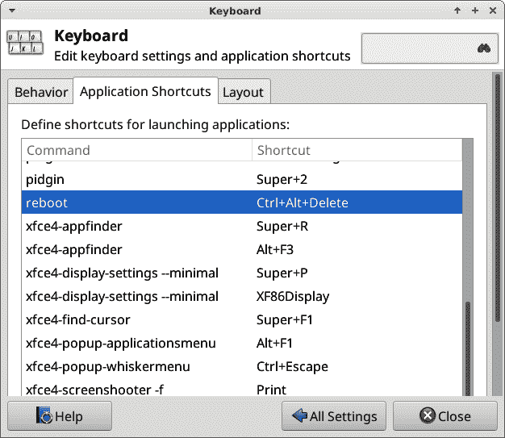
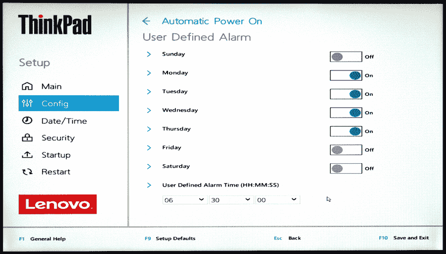

# 第三章：启动、停止、重启和将 Linux 置于睡眠模式中

在本章中，您将学习几种停止、启动和重启 Linux 系统的方法，以及如何管理睡眠模式。您将学习传统命令和新的 systemd 命令。

您还将学习如何设置自动启动和关机。自动关机很好地提醒您停止工作，您不必记得晚上关闭计算机。您可以在远程计算机上设置自动唤醒和关机，这样您可以在工作时间内访问它，而不必一直保持运行状态。如果您的用户浪费电力，不关闭计算机，您可以配置它们在非工作时间关机。

"三键敬礼"，Ctrl-Alt-Delete，在需要中断启动和重启或进程或应用程序行为不端时非常有用。在图形桌面中，您可以将这些键重新映射为更方便的键组合。

几十年来积累了许多传统关机命令，具有大量重叠功能：*shutdown*、*halt*、*poweroff*和*reboot*。*shutdown*命令提供了有用的选项，可以定时关闭，并向所有登录用户发出警告。这些命令在脚本、SSH 会话中非常有用，以及任何时候您从命令行工作时。

# 不一定需要根权限

在旧时代，运行关机命令需要根权限。这种情况正在改变，在许多现代 Linux 发行版中，这些命令不需要根权限。本章的示例适用于普通的非特权用户。如果您的 Linux 发行版需要根权限，它会告诉您。

这些权限由现代 Linux 发行版上的 Polkit（以前是 PolicyKit）控制。查看*man 8 polkit*以了解更多信息。

但这还不是全部，因为在带有 systemd 的 Linux 发行版中（第四章），经典的旧命令没有安装在系统上。相反，它们的名称被符号链接到*systemctl*命令。您可以使用*stat*命令来查看，就像这个*shutdown*的示例一样：

```
$ stat /sbin/shutdown
  File: /sbin/shutdown -> /bin/systemctl
  Size: 14              Blocks: 0          IO Block: 4096   symbolic link
Device: 802h/2050d      Inode: 1177556     Links: 1
Access: (0777/lrwxrwxrwx)  Uid: ( 0/ root)   Gid: ( 0/ root)

```

`File:`行显示了一个指向*/bin/systemctl*的符号链接。所有传统命令名称，*/sbin/shutdown*、*/sbin/halt*、*/sbin/poweroff*和*/sbin/reboot*，都被符号链接到*/bin/systemctl*。这些传统命令名称的符号链接是为了向后兼容而提供的。在没有 systemd 的 Linux 系统上，这些符号链接不存在，这些系统使用传统的可执行文件。

在一些 Linux 发行版中，这些符号链接位于*/usr/sbin*而不是*/sbin*。当您使用传统的命令名称时，在有 systemd 和没有 systemd 的系统上它们的行为是相同的。

您的图形桌面上的电源按钮是可配置的；您应该能够自定义可见的按钮以及它们的位置。

# 3.1 使用 systemctl 关机

## 问题

您想要使用*systemctl*命令来关机和重启您的系统。

## 解决方案

关闭系统并关闭电源：

```
$ systemctl poweroff
```

另一种关闭系统并断电的方法：

```
$ systemctl shutdown
```

重新启动：

```
$ systemctl reboot
```

关闭系统但不断电：

```
$ systemctl halt
```

## 讨论

*systemctl* 关机命令没有传统命令中的许多选项，这并不太重要，因为传统命令中有很多冗余选项。有一个显著的区别：*systemctl shutdown* 不支持 *shutdown* 命令支持的定时关机选项（参见 Recipe 3.2）。

## 参见

+   *man 8 systemd-halt.service*

# 3.2 使用 shutdown 命令进行关机、定时关机和重新启动

## 问题

你想要定时关机，例如在 10 分钟后或在特定时间，同时警告所有登录用户。或者你只想立即关闭而不需要任何修饰。

## 解决方案

*shutdown* 命令无论是链接到 *systemctl* 还是传统的 *shutdown* 可执行文件，工作方式都是相同的。

下面的例子展示了如何立即关闭、在一定分钟后关闭、取消关闭、在特定时间关闭、halt 和 reboot。

立即关闭系统，不通知其他登录用户：

```
$ shutdown -h now
```

10 分钟后关机并通知：

```
$ shutdown -h +10
Shutdown scheduled for Sun 2021-05-23 11:04:43 PDT, use 'shutdown -c' to cancel.

```

其他系统用户可能会看到此消息，具体取决于他们使用的 Linux 版本以及他们是否打开了终端：

```
Broadcast message from *duchess@client4* on pts/4 (Sun 2021-05-24 10:54:43 PDT):

The system is going down for poweroff at Sun 2021-05-24 11:04:43 PDT!
```

取消关机：

```
$ shutdown -c
```

登录用户可能会看到此消息：

```
Broadcast message from *duchess@client4* on pts/4 (Sun 2021-05-24 10:56:00 PDT):

The system shutdown has been cancelled
```

创建你自己的消息：

```
$ shutdown -h +6 "Time to stop working and go outside to play!"
```

而不是指定关机的分钟数，你可以按 24 小时制 hh:mm 格式设置关机时间。以下示例在晚上 10:15 关机：

```
$ shutdown -h 22:15
```

重新启动：

```
$ shutdown -r
```

关闭系统但不断电：

```
$ shutdown -H
```

使用无选项运行 *shutdown* 相当于 *shutdown -h +1*。

## 讨论

*shutdown* 仅在使用 *-h* 选项时发送消息，除非使用 *-h now* 选项或 *-k* 选项。这些称为 *wall* 消息，即“写给所有登录用户”。Linux 发行版在支持此功能方面有所不同，因此你的特定 Linux 上的其他用户可能看不到这些消息。

+   *--help* 显示选项摘要。

+   *-H*、*--halt* 执行干净的关机但不断电；你必须按住电源按钮来断电。

+   *-P*、*--poweroff* 执行干净的关机并断电。

+   *-r*、*-reboot* 执行干净的关机并重新启动机器。

+   *-k* 发送一条消息给所有登录用户而不关机。

+   *--no-wall* 禁用 wall 消息。

## 参见

+   *man 8 shutdown*

+   *man 1 wall*

+   *man 8 systemd-halt.service*

# 3.3 使用 halt、reboot 和 poweroff 进行关机和重新启动

## 问题

你了解 *shutdown* 命令，现在想知道 *halt*、*reboot* 和 *poweroff* 的用途以及如何使用它们。

## 解决方案

这些基本上都是相同的。

*halt* 执行干净的关机，停止所有服务和进程，并卸载文件系统，但不关闭机器。在 *halt* 命令完成后，您必须按住机器的电源按钮来完成关机。

*reboot* 执行干净的关机并重新启动系统。

*poweroff* 执行干净的关机并关闭机器：

```
$ halt
$ reboot
$ poweroff
```

*halt* 和 *poweroff* 命令可以重新启动系统：

```
$ halt --reboot
$ poweroff --reboot
```

## 讨论

如果你觉得这看起来有点奇怪和冗余，你是对的。随着软件的老化，垃圾会积累并永远不会消失。Linux 自 1991 年问世以来，起初是 Unix 的免费克隆，Unix 则诞生于 1969 年。这些年来，各种贡献者修改代码并添加他们喜爱的功能。

*halt* 和 *poweroff* 是相同的命令，并支持相同的选项：

+   *--help* 显示选项摘要。

+   *--halt* 执行干净的关机但不关闭机器（是的，*halt* 和 *halt --halt* 作用相同）。

+   *-p*，*--poweroff* 执行干净的关机并关闭机器（是的，*poweroff* 和 *poweroff --poweroff* 作用相同）。

+   *--reboot* 执行干净的关机并重新启动机器。

+   *-f*，*--force* 强制立即停止或关机。跳过所有运行中的服务关闭，杀死所有进程，并卸载或以只读方式挂载所有文件系统。当正常关机命令失败时，两次运行它来强制非正常关机；例如，*poweroff -f -f*。

+   *-w*，*--wtmp-only* 不执行关机，只在 */var/log/wtmp* 中写入条目。

+   *-d*，*--no-wtmp* 阻止写入 *wtmp* 条目。

## 另请参阅

+   *man 8 halt*

+   *man 8 poweroff*

+   *man 8 systemd-halt.service*

# 3.4 使用 systemctl 将系统置于睡眠模式

## 问题

您的 Linux 系统使用 systemd，您希望使用 *systemctl* 管理系统睡眠模式。

## 解决方案

*systemctl* 提供这些节能模式：*suspend*、*hibernate*、*hybrid-sleep* 和 *suspend-then-hibernate*。

将您的系统置于挂起模式：

```
$ systemctl suspend
```

这会将当前会话存储在内存中，并将所有硬件置于挂起状态。通过按任意键、移动鼠标或打开笔记本盖子来唤醒系统。

将您的系统置于休眠模式：

```
$ systemctl hibernate
```

这会将您的会话存储在磁盘上并关闭机器。按下电源按钮唤醒系统，它可能需要一两分钟来恢复，恢复时会回到您离开的位置。

将您的系统置于混合休眠模式：

```
$ systemctl hybrid-sleep
```

这会将您的系统挂起到内存和磁盘，并关闭除 RAM 外的所有设备。如果系统 RAM 失去电源，系统将从磁盘恢复。按下电源按钮唤醒系统。

将您的系统置于挂起后休眠模式：

```
$ systemctl suspend-then-hibernate
```

*suspend-then-hibernate* 首先进入挂起模式，然后根据 */etc/systemd/sleep.conf* 中的 HibernateDelaySec= 设置的时间间隔进入休眠模式。按下电源按钮唤醒系统。

## 讨论

详细了解不同睡眠状态，请参见 Recipe 3.9 中的讨论。

桌面环境应该有按钮用于进入省电模式，并有一个图形化配置工具，用于控制诸如屏幕空白、屏幕锁定、电源按钮、鼠标以及笔记本盖盖合等事件。

电源管理在笔记本电脑上效果最佳，可能不符合您的 Linux 发行版的预期行为。电源管理受到您的 UEFI、CPU 功能、udev、高级配置与电源接口（ACPI）、内核编译选项以及可能的其他设备和程序影响；这很大程度上取决于您的特定 Linux 如何实现电源管理。请查阅您的 Linux 发行版文档。

## 参见

+   *man 1 systemctl*

+   *man 8 systemd-halt.service*

# 3.5 通过 Ctrl-Alt-Delete 重新启动解决问题

## 问题

您希望一种可靠的重新启动方法，即使在遇到崩溃和运行失控进程等问题时也能正常工作。

## 解决方案

古老的“三键敬礼”，Ctrl-Alt-Delete，就是为此而生的。按顺序按住这三个键，它们将覆盖大多数问题并重新启动系统。在某些 Linux 发行版中，Ctrl-Alt-Delete 被禁用，您可以进行更改。

在 Linux 控制台中，Ctrl-Alt-Delete 由 systemd 控制。请参见 Recipe 3.6 了解如何管理 systemd 中的 Ctrl-Alt-Delete。

对于没有 systemd 的系统，请参阅本章讨论。

图形环境有其独立的 Ctrl-Alt-Delete 配置工具，与 systemd 无关。例如，在 Xfce4 设置管理器中有一个键盘配置模块（Figure 3-1）；在 GNOME 中，请使用 GNOME 设置工具中的键盘设置模块。



###### 图 3-1\. 设置 → 键盘 → 应用程序，在 Xubuntu 中配置键盘快捷键

如果您喜欢其他组合键，请使用您喜欢的任何键。您甚至可以使用单个键，尽管这可能会因意外按键而重新启动。

## 讨论

在不使用 systemd 的 Linux 系统上，Ctrl-Alt-Delete 受 */etc/inittab* 文件控制。以下是来自 MX Linux 的典型配置示例：

```
# What to do when CTRL-ALT-DEL is pressed.
ca:12345:ctrlaltdel:/sbin/shutdown -t1 -a -r now
```

*12345* 使其在运行级别 1、2、3、4 和 5 中生效。*-t1* 表示等待一秒，*-a* 调用 */etc/shutdown.allow*，*-r* 是重新启动。使用 *-h* 选项配置它以关闭系统，就像从命令行运行 *shutdown* 一样（参见 Recipe 3.2）。要禁用 Ctrl-Alt-Delete，请注释掉带有 *shutdown* 命令的行。

注意，*-t1* 和 *-a* 并不是所有 *shutdown* 命令实现中都存在。上述示例来自 MX Linux。MX Linux 支持 Unix System V 初始化系统（SysV init）和 systemd，您可以在引导菜单中选择想要使用的系统。

Ctrl-Alt-Delete 编码到 IBM PC BIOS/UEFI 中，应在启动操作系统之前始终重新启动系统，直到 GRUB 启动操作系统之前。

Ctrl-Alt-Delete 由 IBM 工程师 David Bradley 为 IBM PC BIOS 创建。最初它是开发者工具，不是为用户设计的。它的设计需要用双手操作，以防意外按下。

然后微软采用了它，在第一次按下时弹出任务管理器，并在第二次按下时重启。后来在 Windows NT 中，它用于访问 Windows 登录屏幕。据说这是一种安全措施，防止用户被虚假登录屏幕欺骗，这是一个很久以前的风险，但那时候发生过。在 YouTube 视频中保存了 Bradley 先生和比尔·盖茨关于 Ctrl-Alt-Delete 发明和使用的有趣对话，希望它能永远保留：[“Control-Alt-Delete: David Bradley & Bill Gates”](https://oreil.ly/e83k6)。

## 参见

+   *man 7 systemd.special*

# 3.6 禁用、启用和配置 Linux 控制台中的 Ctrl-Alt-Delete

## 问题

systemd 控制 Linux 控制台中 Ctrl-Alt-Delete 的行为，您想知道如何管理它。

## 解决方案

您可以检查状态，禁用或启用 Ctrl-Alt-Delete，或将其设置为关闭系统。

Ctrl-Alt-Delete 单元文件不是服务，而是一个目标，因此不作为守护程序运行。如果存在*/etc/systemd/system/ctrl-alt-del.target*符号链接，则启用 Ctrl-Alt-Delete。

以下示例禁用和 mask *ctrl-alt-del.target*：

```
$ sudo systemctl disable ctrl-alt-del.target
Removed /etc/systemd/system/ctrl-alt-del.target.

$ sudo systemctl mask ctrl-alt-del.target
Created symlink /etc/systemd/system/ctrl-alt-del.target → /dev/null.
```

取消 mask 并重新启用它：

```
$ sudo systemctl unmask ctrl-alt-del.target
Removed /etc/systemd/system/ctrl-alt-del.target.

$ sudo systemctl enable ctrl-alt-del.target
Created symlink /etc/systemd/system/ctrl-alt-del.target →
/lib/systemd/system/reboot.target.
```

更改立即生效。

将其更改为通过将*ctrl-alt-del.target*单元链接到*poweroff.target*单元而关闭系统。首先禁用它以删除现有的符号链接，然后创建新的符号链接：

```
$ sudo systemctl disable ctrl-alt-del.target
Removed /etc/systemd/system/ctrl-alt-del.target.

$ sudo ln -s /lib/systemd/system/poweroff.target \
  /etc/systemd/system/ctrl-alt-del.target

```

现在它将关闭系统而不是重新启动。

## 讨论

使用*stat*命令查看符号链接：

```
$ stat /lib/systemd/system/ctrl-alt-del.target
  File: /lib/systemd/system/ctrl-alt-del.target -> reboot.target
  Size: 13              Blocks: 0          IO Block: 4096   symbolic link
Device: 802h/2050d      Inode: 136890      Links: 1
Access: (0777/lrwxrwxrwx)  Uid: ( 0/ root)   Gid: ( 0/ root)
```

您不应更改任何*/lib/systemd/system/*中的链接。相反，应在*/etc/systemd/system/*中创建新的符号链接，以便您的更改不会被系统更新覆盖。

## 参见

+   *man 7 systemd.special*

# 3.7 使用 cron 创建定时关机

## 问题

您希望您的机器在夜间自动关闭，这样您就可以离开而不必担心它。或者，您的用户不爱关心节能，拒绝养成晚上关闭电脑的习惯。

## 解决方案

使用*cron*创建定时关机。例如，将以下行添加到*/etc/crontab*，每晚 10:30 关闭系统，并提前 20 分钟警告。编辑*/etc/crontab*需要 root 权限，以下示例使用 nano 文本编辑器：

```
$ sudo nano /etc/crontab
#  m   h   dom mon dow   user    command
 10  22    *   *   *    root    /sbin/shutdown -h +20
```

###### 警告

在您的工作计算机上执行此操作之前，请查看雇主的政策。如果他们在夜间运行更新和备份，则您的计算机可能需要保持开启状态。

此示例仅在工作日晚上 11 点运行，并立即关闭系统：

```
#  m   h   dom mon dow   user    command
 00  23    *   *  1-5   root    /sbin/shutdown -h now
```

另一种方法是以 root 身份或使用*sudo*运行*crontab*命令：

```
$ sudo crontab -e
# m   h     dom mon  dow command
 00  23    *   *    1-5 /sbin/shutdown -h now
```

运行 *crontab* 时没有名称字段，就像 */etc/crontab* 中那样。前面的示例打开了根用户的 crontab 以编辑模式。编辑并保存，然后完成。

不要试图自己命名文件。编辑时，这是一个临时文件，保存时 *crontab* 会自动重命名。它将保存在 */var/spool/cron/crontabs* 中。

## 讨论

*/etc/crontab* 有一个名称字段，因此任何用户都可以在此文件中添加条目，但只有 root 可以编辑 */etc/crontab*。希望控制自己个人 crontab 的用户应该使用 *crontab* 命令，因为个人 crontab 不需要 root 权限。

*/etc/crontab* 中的字段可能需要一点时间来适应 (表 3-1)，这里有更多示例和解释。

表 3-1\. crontab 值表

| 字段 | 允许值 |
| --- | --- |
| 分钟 | 0-59 |
| 小时 | 0-23 |
| 月份 | 1-12 |
| 每月 | 1-31 |
| 星期 | 0-7 |

星号 * 是“全部”的通配符。

仅在周末关闭：

```
# shutdown at 1:05 am Saturdays and Sundays
00 01   * * 7,0   root /sbin/shutdown -h +5
```

*cron* 中有一个怪异之处，即周日为 0 或 7。这可以追溯到很久以前，我不知道为什么会这样持续下去。您必须测试才能确定有效值，因此可能需要使用 *6,7* 来表示星期六和星期日：

```
00 01   * * 6,7   root /sbin/shutdown -h +5
```

使用*sat,sun*会很方便，但你只能输入一个具体的星期日，而不能在列表中使用名称。星期和月份名称使用首三个字母表示：sat, sun, jan, feb。大小写不敏感。

您可以使用范围：1–4 表示 1, 2, 3 和 4。

范围和列表可以混合使用：1, 3, 5, 6-10。

步长值遵循范围：

+   10–23/2 表示范围内每隔两个小时

+   */2 在 dow 字段表示每隔一天

+   2–6/2 等同于 2, 4, 6

下面的字符串是替代前五个字段的好快捷方式：

```
@reboot
@yearly
@annually
@monthly
@weekly
@daily
@midnight
@hourly
```

## 参见

+   *man 8 cron*

+   *man 1 crontab*

+   *man 5 crontab*

# 3.8 使用 UEFI 唤醒安排自动启动

## 问题

定时关机是非常方便的，你也希望有定时唤醒。

## 解决方案

你很幸运，因为 Linux 支持定时唤醒。有三种方法可尝试：网络唤醒（Wake-on-LAN）、实时时钟（RTC）唤醒，或者如果您的计算机具有预定唤醒功能，则可以使用计算机的 UEFI 设置。

UEFI 唤醒是最可靠的。图 3-2 显示了联想 ThinkPad 上预定唤醒的屏幕。



###### 图 3-2\. 在联想 UEFI 中安排唤醒

在启动时按相应的 F*n* 键进入 UEFI 设置。在 Dell、ASUS 和 Acer 系统上通常是 F2；联想使用 F1。然而，这会有所不同。例如，某些系统使用删除键，请查看您设备的文档。某些系统在启动屏幕上显示按键信息。要在正确时间按下键可能有点棘手，所以像按电梯按钮那样，尽早按下电源按钮后开始按键。

如果您的系统没有 UEFI 唤醒功能，请尝试使用醒来局域网 (参见 Recipe 3.10，需要第二个设备发送唤醒信号) 或者 RTC 唤醒 (参见 Recipe 3.9)。

## 讨论

让我们简要讨论一下 BIOS 和 UEFI 的含义。当您启动计算机时，第一批启动指令来自存储在计算机主板上的基本输入输出系统（BIOS）或统一可扩展固件接口（UEFI）固件。BIOS 是自 1980 年以来一直存在的旧系统。UEFI 是其现代替代品。UEFI 包括对传统 BIOS 的支持，尽管有一天这将被移除。几乎所有在 2000 年中期之后制造的计算机都有 UEFI。

UEFI 拥有比旧 BIOS 更多的功能，就像一个小型操作系统。UEFI 设置界面控制启动顺序、启动设备、安全选项、安全启动、超频、显示硬件健康状况、网络以及许多其他功能。

## 参见

+   Recipe 3.9

+   Recipe 3.10

+   Recipe 3.11

# 3.9 使用 RTC 唤醒调度自动启动

## 问题

您希望使用 RTC 设置定时唤醒，因为您的 UEFI 设置没有预定唤醒功能，或者您只是想要这样做。

## 解决方案

使用 *rtcwake* 命令，该命令应该已经存在于您系统中的 *util-linux* 软件包中。*rtcwake* 停止和唤醒您的系统。您可以设置它在指定的时间间隔后唤醒系统，例如从现在开始的 1800 秒，或者在预定的时间和日期唤醒系统。

您系统的实时时钟（RTC）应设置为协调世界时（UTC）。

当 *rtcwake* 停止您的系统时，它会将其送入 ACPI 睡眠状态。查看 */sys/power/state* 以查看您的系统支持哪些睡眠状态。在以下示例中，只支持六个 ACPI 睡眠状态中的三个：

```
$ cat /sys/power/state
freeze mem disk
```

在非 systemd Linux 上，运行 *cat /proc/acpi/info*。

在上面的示例中，我们有三个待机状态可供尝试。根据以下示例测试每一个：

```
$ sudo rtcwake -m freeze -s 60
```

*-m* 指定待机模式，*-s* 是系统重新启动之前的秒数。当成功时，你将看到系统进入睡眠状态，然后唤醒，并且会显示成功或错误信息。

以下示例对明天上午 8 点的唤醒进行了模拟运行：

```
$ sudo rtcwake -n -m disk no -u -t $(date +%s -d "tomorrow 08:00")
rtcwake: wakeup from "disk" using /dev/rtc0 at Mon Nov 23 08:00:00 2021
```

删除 *-n* 以禁用模拟运行，并实际运行它。

以下是一个简单的 */etc/crontab* 示例，用于自动执行关机和唤醒。*rtcwake* 命令在工作日的晚上 11 点将系统挂起到磁盘，并在 8 小时后唤醒：

```
#  m   h   dom mon dow   user    command
 00  23    *   *  1-5   root    /usr/sbin/rtcwake -m disk -s 28800

```

## 讨论

查看您系统的 BIOS/UEFI，以验证您的硬件时钟是否设置为 UTC。如果没有按钮或某种设置来将实时时钟更改为 UTC，手动将时间更改为当前的 UTC 时间。

示例中包含的 *-u -t +$(date +%s -d “tomorrow 08:00”)* 将 Unix 纪元时间转换为人类可读的值。Unix 纪元时间是从 1970 年 1 月 1 日午夜以来经过的秒数（UTC）。*date +%s* 报告当前的 Unix 纪元时间。*-t* 选项将 Unix 纪元时间传递给 *date* 进行转换，*-u* 指定你的硬件时钟设置为 UTC。

*rtcwake* 的 *no* 选项意味着不进入睡眠状态，只设置唤醒时间。去掉 *no* 选项即可立即进入睡眠状态。

实时时钟（RTC）唤醒最不可靠。你的系统必须进入 Linux 支持的 ACPI 睡眠状态。ACPI 是现代电源管理标准，用于管理睡眠状态。它应该是供应商中立和硬件无关的，但标准很复杂，硬件供应商通常仅支持其部分功能。增加乐趣的是，不同的 Linux 发行版以不同的方式实现它。

ACPI 有六个睡眠状态，S0-S5。Linux 内核支持最多四个，不同的发行版在支持哪些以及支持多少方面有所不同：

S0

系统正在运行，显示器可能关闭，大多数外设开启。

S1

启动挂起时，CPU 停止运行，CPU 和 RAM 的电源是打开的。

S2

CPU 关闭电源，脏缓存被刷新到 RAM。

S3

也称为待机、休眠和挂起到 RAM。数据可能不会写入磁盘。

S4

休眠，挂起到磁盘。将所有 RAM 中的数据写入磁盘，然后系统关闭电源。

S5

类似于关闭系统电源，但电源按钮和外设（如键盘、网络接口和 USB 设备）仍然供电。

## 参见

+   *man 8 cron*

+   *man 8 rtcwake*

+   [时间和日期](https://timeanddate.com)

# 3.10 使用有线以太网设置远程唤醒 Wake-on-LAN

## 问题

如果你的 UEFI 设置没有预定的唤醒功能，或者功能过于简单，或者你希望在随机时间发送唤醒信号，你可以设置远程触发唤醒使用 Wake-on-LAN。这个方案是为了在与发送唤醒信号设备相同网络上唤醒一台机器，你的目标机器必须使用有线以太网接口。

## 解决方案

配置你的电脑以监听唤醒请求，然后使用第二个设备，如另一台计算机、智能手机或树莓派发送唤醒信号，称为 *魔术数据包*。它并不是真正的魔术，只是专门为远程唤醒设计的特殊数据包。（是的，我也很遗憾它并非真正的魔术。）

首先启动你的系统的 UEFI 设置，寻找启用 Wake-on-LAN 的设置。

###### 警告

一个重要的预防措施是禁用所有启用 PXE（预启动执行环境）引导的设置。如果启用了 PXE 引导，并且您的网络上有 PXE 服务器（预启动执行环境服务器，用于从网络安装服务器引导），则可能会导致您的机器唤醒以进行 PXE 引导并安装新的映像，覆盖现有安装。

然后退出并完成启动。安装*wakeonlan*和*ethtool*软件包。

获取您的以太网接口的名称，在本例中为*enp0s25*，并使用*ethtool*验证其是否支持 Wake-on-LAN。为了清晰起见，输出进行了缩写：

```
$ ip addr show
2: enp0s25: <BROADCAST,MULTICAST,UP,LOWER_UP> state UP 0
    link/ether 9c:ef:d5:fe:8f:20 brd ff:ff:ff:ff:ff:ff
    inet 192.168.1.97/24 brd 192.168.1.255 scope global dynamic
    [...]

$ sudo ethtool enp0s25 | grep -i wake-on
        Supports Wake-on: pumbg
        Wake-on: g 
```

记录您接口的 MAC 地址。在前面的*ip*示例中，“ether”行列出了 MAC 地址，9c:ef:d5:fe:8f:20。您的地址将不同，因为 MAC 地址是唯一的。

“Supports Wake-on: pumbg”是验证您的接口是否具备必要支持的魔法短语，由*g*开关指示。第二行“Wake-on: g”告诉您已经启用。如果没有启用，请启用它：

```
$ sudo ethtool -s *enp0s25* wol g
```

如果重启后未保持启用状态，请像这样向*/etc/crontab*添加一个条目，以便在每次重启后运行命令：

```
$ @reboot root /usr/bin/ethtool -s *enp0s25* wol g
```

关闭计算机，然后从同一网络上的第二设备发送命令唤醒它，使用目标机器以太网接口的 MAC 地址：

```
$ /usr/bin/wakeonlan *9c:ef:d5:fe:8f:20*
```

如果目标机器和第二设备在同一网络但不同子网中，需指定目标机器的广播地址：

```
$ /usr/bin/wakeonlan -i *192.168.44.255 9c:ef:d5:fe:8f:20*
```

## 讨论

Wake-on-LAN 是一种通过网络发送唤醒信号远程唤醒计算机的以太网标准。*wakeonlan*是大多数 Linux 系统上命令和软件包的名称。

当您的计算机关机时，并非真正关闭，而是处于低功耗模式，可以接收和响应魔术包唤醒信号。

*wakeonlan*通过 UDP 端口 9 发送魔法包。魔法包发送到网络的广播地址，网络上的每台主机都会接收此包。MAC 地址确保只有具有该地址的主机会被唤醒。

目标机器会像按下电源按钮一样唤醒。

## 参见

+   *man 1 wakeonlan*

+   *man 8 ethtool*

+   配方 3.8

+   配方 3.9

+   配方 3.11

# 3.11 设置通过 WiFi 进行远程唤醒（WoWLAN）

## 问题

您希望通过其无线接口（Wake-on-Wireless LAN，或 WoWLAN）唤醒远程计算机。

## 解决方案

此配方适用于在发送唤醒信号的设备与目标机器位于同一网络上时唤醒机器。

您的机器必须具有内置无线接口，可以是主板集成的或者是 PCI（外围组件互连）的。使用 USB 接口将无法工作，因为机器关机时 USB 总线没有供电。

首先，进入要远程唤醒的机器的 UEFI 设置，并启用任何 Wake-on-LAN 设置。

###### 警告

一个重要的预防措施是同时禁用所有启用 PXE 启动的设置。如果启用了 PXE 启动，并且在你的网络上有一个 PXE 服务器，你的机器可能会因为 PXE 启动而唤醒并安装新的镜像，覆盖现有的安装。

然后退出并完成启动。安装 *iw* 命令，并使用它列出所有的无线设备：

```
$ iw dev
phy#0
        Interface *wlxcc3fd5fe014c*
                ifindex 3
                wdev 0x1
                addr *9c:bf:25:fe:0e:7c*
                ssid *accesspointe*
                type managed
                channel 11 (2462 MHz), width: 20 MHz, center1: 2462 MHz
                txpower 20.00 dBm 
```

如果有多个设备，请查询你想要使用的设备。以下示例显示了一个不支持 WoWLAN 的无线接口：

```
$ iw phy0 wowlan show
command failed: Operation not supported (-95)
```

下面的示例适用于支持 WoWLAN 的接口，但未启用：

```
$ iw phy0 wowlan show
WoWLAN is disabled
```

启用 WoWLAN：

```
$ sudo iw phy0 wowlan enable magic-packet
WoWLAN is enabled:
  * wake up on magic packet
```

*iw dev* 提供了 MAC 地址，你的第二台设备需要发送魔术数据包：

```
$ /usr/bin/wakeonlan *9c:bf:25:fe:0e:7c*
```

将魔术数据包发送到同一网络上不同子网中的机器，使用子网的广播地址：

```
$ /usr/bin/wakeonlan -i *192.168.44.255 9c:bf:25:fe:0e:7c*
```

## 讨论

当远程计算机是笔记本时，这种方法效果很好，因为笔记本通常有集成的无线网络接口，通常支持更多功能。台式机通常不配备集成的无线接口，因此你必须仔细挑选支持 WoWLAN 和 Linux 的 PCI/PCIe 无线适配器。

## 参见

+   *man 8 iw*

+   *man 1 wakeonlan*

+   第 3.8 节

+   第 3.9 节

+   第 3.10 节
