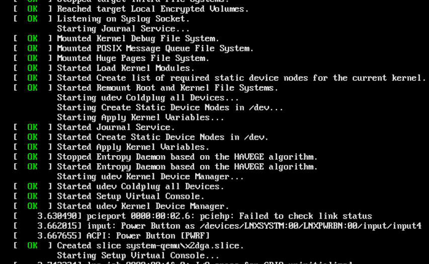
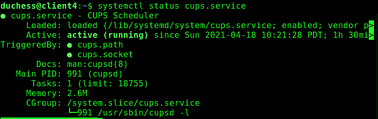

# 第四章：使用 systemd 管理服务

每次启动 Linux 计算机时，它的初始化系统都会启动一批进程，从几十个到数百个不等，具体取决于系统设置。您可以在启动屏幕上看到这一过程（Figure 4-1）。按下 Escape 键隐藏图形启动屏幕，查看启动消息。



###### 图 4-1：Linux 启动消息

在过去，我们有 Unix System V 初始化系统（SysV init）、BSD init 和 Linux Standard Base（LSB）初始化系统来启动进程。SysV init 曾经最为常见。但那些日子已经逐渐过去，现在 systemd 是 Linux 的新光辉初始化系统。它已被所有主要的 Linux 发行版采纳，尽管当然仍有一些发行版仍在使用传统的初始化系统。

在本章中，您将了解您的 Linux 发行版是否使用 systemd。您将学习进程、线程、服务和守护程序是什么，并学习如何使用 systemd 管理服务：启动、停止、启用、禁用和检查状态。您将熟悉 *systemctl* 命令，这是 systemd 系统和服务管理器。

systemd 是为现代复杂的服务器和桌面系统设计的功能性软件，远比传统的初始化系统做得更多。它提供从启动到关闭的完整服务管理，启动进程在启动时、启动后按需启动，并在不需要时关闭服务。它管理诸如系统日志、自动挂载文件系统、自动解决服务依赖关系、名称服务、设备管理、网络连接管理、登录管理等功能。

当你意识到进程在计算机上执行所有操作时，这听起来像是很多事情，而所有这些功能曾由大量其他程序提供。systemd 将所有这些功能集成在一个软件套件中，应在所有 Linux 系统上以相同方式运行，尽管像往常一样，Linux 存在一些细微的例外，如文件位置和服务名称。请注意，你的特定 Linux 可能与本章示例有所不同。

systemd 尝试通过并行启动和仅启动必要的服务来减少启动时间并更有效地分配系统资源，其他服务可以在启动后按需启动。一个依赖于其他服务的服务不再需要等待这些服务可用，因为它所需的只是等待 Unix 套接字可用。Recipe 4.9 展示了如何找到拖慢系统启动的进程。

systemd 的二进制文件使用 C 语言编写，这提供了一些性能增强。传统的初始化系统则是大量的 shell 脚本，而任何编译语言都比 shell 脚本运行得更快。

systemd 兼容 SysV 初始化。大多数 Linux 发行版保留了传统的 SysV 配置文件和脚本，包括 */etc/inittab*，以及 */etc/rc.d/* 和 */etc/init.d/* 目录。当服务没有 systemd 配置文件时，systemd 会寻找 SysV 配置文件。systemd 也与 Linux 标准基础（LSB）初始化兼容。

systemd 服务文件比 SysV 初始化文件更小且更易于理解。比较一下 sshd 的 SysV 初始化文件和其 systemd 服务文件。这是来自 MX Linux 的 sshd 初始化文件片段 */etc/init.d/ssh*：

```
#! /bin/sh

### BEGIN INIT INFO
# Provides:		sshd
# Required-Start:	$remote_fs $syslog
# Required-Stop:	$remote_fs $syslog
# Default-Start:	2 3 4 5
# Default-Stop:
# Short-Description:	OpenBSD Secure Shell server
### END INIT INFO

set -e

# /etc/init.d/ssh: start and stop the OpenBSD "secure shell(tm)" daemon

test -x /usr/sbin/sshd || exit 0

umask 022

if test -f /etc/default/ssh; then
[...]
```

从 Ubuntu 20.04 完整的 systemd 服务文件 */lib/systemd/system/ssh.service* 开始，总共有 162 行内容：

```
[Unit]
Description=OpenBSD Secure Shell server
Documentation=man:sshd(8) man:sshd_config(5)
After=network.target auditd.service
ConditionPathExists=!/etc/ssh/sshd_not_to_be_run

[Service]
EnvironmentFile=-/etc/default/ssh
ExecStartPre=/usr/sbin/sshd -t
ExecStart=/usr/sbin/sshd -D $SSHD_OPTS
ExecReload=/usr/sbin/sshd -t
ExecReload=/bin/kill -HUP $MAINPID
KillMode=process
Restart=on-failure
RestartPreventExitStatus=255
Type=notify
RuntimeDirectory=sshd
RuntimeDirectoryMode=0755

[Install]
WantedBy=multi-user.target
Alias=sshd.service

```

即使没有阅读文档，或者不了解 systemd 的任何信息，您也可以理解此文件应该执行的一些功能。

请查看 [Rethinking PID 1](https://oreil.ly/dFz4K) ，由 systemd 的发明者和维护者之一 Lennart Poettering 提供了对 systemd 的详细介绍。《重新思考 PID 1》详细介绍了构建新的初始化系统的原因、其架构、优势，以及如何利用现有 Linux 内核功能来替代重复现有功能。

# 4.1 查看 Linux 是否使用 systemd

## 问题

您需要知道您的 Linux 发行版是否使用 systemd 或其他系统。

## 解决方案

查找 */run/systemd/system/* 目录。如果存在，则您的初始化系统是 systemd。

## 讨论

如果您的发行版支持多个初始化系统，可能会出现 */run/systemd/* 目录。但是除非您看到 */run/systemd/system/*，否则 systemd 不是当前的初始化系统。

还有其他几种方法可以了解您的系统使用的初始化系统。尝试查询 */sbin/init*。最初这是 SysV 可执行文件，现在大多数 Linux 发行版保留了该名称并将其链接到 systemd 可执行文件。此示例确认初始化是 systemd：

```
$ stat /sbin/init
File: /sbin/init -> /lib/systemd/systemd
[...]
```

在使用 SysV 初始化的系统上，它没有符号链接：

```
$ stat /sbin/init
File: /sbin/init
[...]
```

*/proc* 伪文件系统是您的 Linux 内核的接口，包含正在运行系统的当前状态。它被称为伪文件系统，因为它仅存在于内存中，而不在磁盘上。在此示例中，*/proc/1/exe* 符号链接到 systemd 可执行文件：

```
$ sudo stat /proc/1/exe
File: /proc/1/exe -> /lib/systemd/systemd
[...]
```

在 SysV 系统上，它链接到 *init*：

```
$ sudo stat /proc/1/exe
File: /proc/1/exe -> /sbin/init
[...]
```

*/proc/1/comm* 文件报告您当前的启动初始化系统：

```
$ cat /proc/1/comm
systemd
```

在 SysV 系统上，它报告 *init*：

```
$ cat /proc/1/comm
init
```

附加到进程 ID（PID）1 的命令是您的初始化。PID 1 是在启动时启动的第一个进程，然后启动所有其他进程。您可以使用 *ps* 命令查看这一点：

```
$ ps -p 1
  PID TTY          TIME CMD
    1 ?        00:00:00 systemd
```

当使用 SysV 初始化时，看起来是这样的：

```
$ ps -p 1
  PID TTY          TIME CMD
    1 ?        00:00:00 init
```

查看 Recipe 4.2 以获取有关 PID 1 的更多信息。

Linux 对 systemd 的支持各不相同。大多数主要的 Linux 发行版都采用了 systemd，包括 Fedora、Red Hat、CentOS、openSUSE、SUSE Linux Enterprise、Debian、Ubuntu、Linux Mint、Arch、Manjaro、Elementary 和 Mageia Linux。

一些流行的发行版不支持 systemd，或者包含它但不作为默认的 init 程序，如 Slackware、PCLinuxOS、Gentoo Linux、MX Linux 和 antiX。

## 参见

+   [Distrowatch](https://distrowatch.com) 提供了关于数百种 Linux 发行版的信息

+   *man 5 proc*

+   *man 1 pstree*

+   *man 1 ps*

# 4.2 理解 PID 1，所有进程的母体

## 问题

您想更好地理解 Linux 上的服务和进程。

## 解决方案

PID 1 是 Linux 系统上所有进程的母体。这是第一个启动的进程，然后它启动所有其他进程。

进程是一个或多个程序的运行实例。Linux 系统中的每个任务都由进程执行。进程可以创建独立的副本，即它们可以 *fork*。复制的进程称为 *子进程*，原始进程称为 *父进程*。每个子进程都有自己独特的 PID，以及分配给它的系统资源，如 CPU 和内存。*线程* 是在并行中运行的轻量级进程，并与其父进程共享系统资源。

一些进程在后台运行，不与用户交互。Linux 将这些进程称为 *服务* 或 *守护进程*，它们的名称通常以字母 D 结尾，如 httpd、sshd 和 systemd。

每个 Linux 系统首先启动 PID 1，然后启动所有其他进程。使用 *ps* 命令按 PID 排序列出所有运行中的进程：

```
$ ps -ef
UID        PID  PPID  C STIME TTY          TIME CMD
root         1     0  0 10:06 ?        00:00:01 /sbin/init splash
root         2     0  0 10:06 ?        00:00:00 [kthreadd]
root         3     2  0 10:06 ?        00:00:00 [rcu_gp]
root         4     2  0 10:06 ?        00:00:00 [rcu_par_gp]
[...]
```

*pstree* 命令将这些大量信息组织成树形图。此示例显示所有进程及其子进程、PID 和线程，这些信息被包含在花括号中：

```
$ pstree -p
systemd(1)─┬─ModemManager(925)─┬─{ModemManager}(944)
           │                   └─{ModemManager}(949)
           ├─NetworkManager(950)─┬─dhclient(1981)
           │                     ├─{NetworkManager}(989)
           │                     └─{NetworkManager}(991)
           ├─accounts-daemon(927)─┬─{accounts-daemon}(938)
           │                      └─{accounts-daemon}(948)
           ├─acpid(934)
           ├─agetty(1103)
           ├─avahi-daemon(953)───avahi-daemon(970)
[...]
```

完整的 *pstree* 输出非常庞大。您可以查看单个进程，通过其 PID 标识，并显示其父进程、子进程和线程，例如 Kate 文本编辑器的以下示例：

```
$ pstree -sp 5193
systemd(1)───kate(5193)─┬─bash(5218)
                        ├─{kate}(5195)
                        ├─{kate}(5196)
                        ├─{kate}(5197)
                        ├─{kate}(5198)
                        ├─{kate}(5199)
[...]
```

这显示了 `systemd(1)` 是 Kate 的父进程，`bash(5218)` 是 Kate 的子进程，花括号中的所有进程都是 Kate 的线程。

## 讨论

进程始终处于多种状态之一，并根据系统活动而更改。下面的 *pstree* 示例显示 PID、用户、状态和命令字段：

```
$ ps -eo pid,user,stat,comm
  PID USER       STAT COMMAND
    1 root       Ss   systemd
    2 root       S    kthreadd
   32 root       I<   kworker/3:0H-kb
   68 root       SN   khugepaged
11222 duchess    Rl   konsole
```

+   *R* 表示当前正在运行或在运行队列中等待。

+   *l* 表示进程是多线程的。

+   *S* 是可中断睡眠状态；进程正在等待事件完成。

+   *s* 是一个会话领导者。会话是作为一个单元管理的相关进程。

+   *I* 是空闲的内核线程。

+   *<* 表示高优先级。

+   *N* 表示低优先级。

*man 1 ps* 中还有几种不常用的状态，您可以在其中阅读。

## 参见

+   Recipe 4.7

+   *man 5 proc*

+   *man 1 pstree*

+   *man 1 ps*

# 4.3 使用 systemctl 列出服务及其状态

## 问题

您想要列出系统中安装的所有服务，并了解服务的状态：正在运行、未运行或错误状态。

## 解决方案

*systemctl*，systemd 管理器命令，告诉所有信息。无选项运行它以查看所有加载单元的详细列表。systemd 单元是任何在单元配置文件中定义并由 systemd 管理的相关进程批处理：

```
$ systemctl
```

这将打印出大量信息：在我的测试系统上，共有 177 个活动加载的单元，包括完整的单元名称、状态和长描述。将输出重定向到文本文件以便更轻松地学习：

```
$ systemctl > /tmp/systemctl-units.txt
```

通过列出所有单位（包括活动和非活动状态），使信息超载：

```
$ systemctl --all
```

这导致在我的测试系统上列出了 349 个加载的单元，包括 *not-found* 和 *inactive* 单元。总共有多少个单元文件？以下示例显示了 5 个其中的 322 个：

```
$ systemctl list-unit-files
UNIT FILE                                      STATE
proc-sys-fs-binfmt_misc.automount              static
-.mount                                        generated
mount                                          generated
dev-hugepages.mount                            static
home.mount                                     generated
[...]
322 unit files listed.
```

我们对服务文件感兴趣，因为 Linux 用户和管理员主要与服务文件交互，并且很少需要处理其他类型的单元文件。安装了多少个？让我们来看看：

```
$ systemctl list-unit-files --type=service
UNIT FILE                                  STATE
accounts-daemon.service                    enabled
acpid.service                              disabled
alsa-state.service                         static
alsa-utils.service                         masked
anacron.service                            enabled
[...]
212 unit files listed.
```

前面的示例展示了服务可能处于的四种最常见状态：已启用、已禁用、静态或屏蔽。

只列出已启用的服务：

```
$ systemctl list-unit-files --type=service --state=enabled
UNIT FILE                                  STATE
accounts-daemon.service                    enabled
anacron.service                            enabled
apparmor.service                           enabled
autovt@.service                            enabled
avahi-daemon.service                       enabled
[...]
62 unit files listed.
```

只列出已禁用的服务：

```
$ systemctl list-unit-files --type=service --state=disabled
UNIT FILE                            STATE
acpid.service                        disabled
brltty.service                       disabled
console-getty.service                disabled
mariadb@.service                     disabled
[...]
12 unit files listed.
```

只列出静态服务：

```
$ systemctl list-unit-files --type=service --state=static
UNIT FILE                              STATE
alsa-restore.service                   static
alsa-state.service                     static
apt-daily-upgrade.service              static
apt-daily.service                      static
[...]
106 unit files listed.
```

只列出已屏蔽的服务：

```
$ systemctl list-unit-files --type=service --state=masked
UNIT FILE                    STATE
alsa-utils.service           masked
bootlogd.service             masked
bootlogs.service             masked
checkfs.service              masked
[...]
36 unit files listed.
```

## 讨论

服务单元文件位于 */usr/lib/systemd/system/* 或 */lib/systemd/system/*，具体位置取决于您的 Linux 发行版。这些是您可以阅读的纯文本文件。

已启用

这显示服务已变为可用，并由 systemd 管理。当服务已启用时，systemd 会在 */etc/systemd/system/* 中从 */lib/systemd/system/* 的单元文件创建符号链接。用户可以使用 *systemctl* 命令启动、停止、重新加载和禁用它。

###### 注意

启用服务并不会立即启动它，而禁用服务也不会立即停止它（参见配方 4.6）。

禁用

禁用意味着在 */etc/systemd/system/* 中没有符号链接，它不会在启动时自动启动。您可以手动停止和启动它。

屏蔽

这意味着服务已链接到 */dev/null/*。它完全被禁用，并且无法通过任何方式启动。

静态

这意味着单元文件是其他单元文件的依赖项，用户无法启动或停止它。

您将看到一些不常见的服务状态：

间接

间接状态属于不适合由用户管理的服务，而是由其他服务使用。

生成

生成状态表示服务已从非本地 systemd 初始化配置文件（SysV 或 LSB init）转换而来。

## 参见

+   *man 1 systemctl*

# 4.4 查询所选服务的状态

## 问题

您想知道一个或几个特定服务的状态。

## 解决方案

*systemctl status* 提供了一小段有用的状态信息。以下示例查询了 CUPS 服务。CUPS，即通用 Unix 打印系统，应该在所有 Linux 系统上存在：

```
$ systemctl status cups.service
● cups.service - CUPS Scheduler
     Loaded: loaded (/lib/systemd/system/cups.service; enabled; vendor preset:
             enabled)
     Active: active (running) since Sun 2021-11-22 11:01:48 PST; 4h 17min ago
TriggeredBy: ● cups.path
             ● cups.socket
       Docs: man:cupsd(8)
   Main PID: 1403 (cupsd)
      Tasks: 2 (limit: 18760)
     Memory: 3.8M
     CGroup: /system.slice/cups.service
             ├─1403 /usr/sbin/cupsd -l
             └─1421 /usr/lib/cups/notifier/dbus dbus://

Nov 22 11:01:48 host1 systemd[1]: Started CUPS Scheduler.
```

使用以空格分隔的列表查询多个服务：

```
$ systemctl status mariadb.service bluetooth.service lm-sensors.service
```

## 讨论

这少量输出中有大量有用信息（图 4-2）。



###### 图 4-2\. CUPS 打印机服务的 systemctl 状态输出

服务名字旁边的点是快速状态指示器。它在大多数终端上显示颜色。白色是*非活动*或*正在停用*状态。红色是*失败*或*错误*状态。绿色表示*活动*，*重新加载*或*正在激活*状态。输出中的其余信息如下描述：

已加载

验证单元文件是否已加载到内存中，显示其完整路径，服务是否已启用（参见 4.3 节中关于状态的讨论），`vendor preset: disabled/enabled`指示安装默认是否在启动时启动。当它被禁用时，供应商默认不会在启动时启动。这仅显示供应商的首选项，不表示当前是否启用或禁用。

活动

告诉您服务是活动还是非活动，并且在该状态中已经多长时间。

进程

报告 PID 及其命令和守护程序。

主 PID

这是 cgroup 切片的进程号。

任务

报告服务启动了多少个任务。任务是 PID。

CGroup

显示服务属于哪个单元切片及其 PID。三个默认单元切片是*user.slice*、*system.slice*和*machine.slice*。

Linux 控制组（cgroups）是一组相关进程及其所有未来子进程。在 systemd 中，*slice*是 cgroup 的一个子分区，每个 slice 管理特定组的进程。运行*systemctl status*查看 cgroup 层次结构的图表。

默认情况下，服务和范围单元被分组在*/lib/systemd/system/system.slice*中。

用户会话分组在*/lib/systemd/system/user.slice*中。

与 systemd 注册的虚拟机和容器分组在*/lib/systemd/system/machine.slice*中。

剩余的行是来自*journalctl*，systemd 日志管理器的最新日志条目。

## 参见

+   *man 1 systemctl*

+   *man 5 systemd.slice*

+   *man 1 journalctl*

+   [内核 cgroups 文档](https://oreil.ly/FfUb3)

# 4.5 启动和停止服务

## 问题

您希望使用 systemd 停止和启动服务。

## 解决方案

这是一个 *systemctl* 的任务。以下示例使用 SSH 服务演示服务管理。

启动服务：

```
$ sudo systemctl start sshd.service
```

停止服务：

```
$ sudo systemctl stop sshd.service
```

停止然后重新启动服务：

```
$ sudo systemctl restart sshd.service
```

重新加载服务的配置。例如，您更改了*sshd_config*并希望加载新配置而不重新启动服务：

```
$ sudo systemctl reload sshd.service
```

## 讨论

所有这些命令也适用于多个服务，以空格分隔，例如：

```
$ sudo systemctl start sshd.service mariadb.service firewalld.service
```

如果您对 systemd 在后台运行的命令好奇，以启动、重新加载或停止各个守护程序，查看它们的单元文件。一些服务在其单元文件中具有启动、重新加载、停止和其他指令，例如此 httpd 的示例：

```
ExecStart=/usr/sbin/httpd/ $OPTIONS -DFOREGROUND
ExecReload=/usr/sbin/httpd $OPTIONS -k graceful
ExecStop=/bin/kill -WINCH ${MAINPID}
```

对于这些信息，你不需要特别处理；当你想了解*systemctl*如何管理特定服务时，它会有所帮助。

## 参见

+   配方 4.6

+   *man 1 systemctl*

# 4.6 启用和禁用服务

## 问题

你希望某个服务或多个服务在启动时自动启动，或者你希望阻止某个服务在启动时启动，或者完全禁用它。

## 解决方案

启用服务会配置它在启动时自动启动。

禁用服务会阻止它在启动时启动，但可以手动启动和停止。

屏蔽服务会禁用它，因此根本无法启动。

以下示例启用了*sshd*服务：

```
$ sudo systemctl enable sshd.service
Created symlink /etc/systemd/system/multi-user.target.wants/sshd.service →
/usr/lib/systemd/system/sshd.service
```

输出显示，启用服务意味着在*/lib/systemd/system/*中的服务文件和*/etc/systemd/system/*中创建符号链接。这不会启动服务。你可以使用*systemctl start*启动服务，或者使用*--now*选项一条命令启用并启动服务：

```
$ sudo systemctl enable --now sshd.service
```

此命令禁用*sshd*服务。它不会停止服务，所以你必须在禁用后手动停止它：

```
$ sudo systemctl disable sshd.service
Removed /etc/systemd/system/multi-user.target.wants/sshd.service
$ sudo systemctl stop sshd.service

```

或者，用一条命令禁用并停止它：

```
$ sudo systemctl disable --now sshd.service
```

此命令重新启用*mariadb*服务，先禁用然后再启用它。如果你已经手动为服务创建了符号链接，则可以快速将它们重置为默认状态：

```
$ sudo systemctl reenable mariadb.service
Removed /etc/systemd/system/multi-user.target.wants/mariadb.service.
Removed /etc/systemd/system/mysqld.service.
Removed /etc/systemd/system/mysql.service.
Created symlink /etc/systemd/system/mysql.service →
/lib/systemd/system/mariadb.service.
Created symlink /etc/systemd/system/mysqld.service →
/lib/systemd/system/mariadb.service.
Created symlink /etc/systemd/system/multi-user.target.wants/mariadb.service →
/lib/systemd/system/mariadb.service.
```

以下命令通过屏蔽完全禁用了*bluetooth*服务，因此它无法启动：

```
$ sudo systemctl mask bluetooth.service
Created symlink /etc/systemd/system/bluetooth.service → /dev/null.
```

解除*mariadb*服务的屏蔽并不会启用它，所以必须手动启动它：

```
$ sudo systemctl unmask bluetooth.service
Removed /etc/systemd/system/bluetooth.service.
$ sudo systemctl start bluetooth.service

```

## 讨论

当你启用、禁用、屏蔽或取消屏蔽一个服务时，它会保持当前状态，除非你使用*--now*选项。*--now*选项与*enable*、*disable*和*mask*一起使用，可以立即停止或启动服务，但不适用于*unmask*。

参见配方 4.3 中的讨论，了解更多关于 systemd 如何使用符号链接管理服务的信息。

## 参见

+   *man 1 systemctl*

+   参见配方 4.3 中的讨论，了解 systemd 如何使用符号链接管理服务

# 4.7 停止问题进程

## 问题

你想知道如何停止问题进程。某个服务可能无响应或者在运行中，生成分支并导致系统挂起。你正常的停止命令不起作用。你该怎么办？

## 解决方案

在 Linux 系统中，停止进程称为杀死进程。对于带有 systemd 的 Linux 系统，你应该使用*systemctl kill*。对于没有 systemd 的系统，请使用传统的*kill*命令。

*systemctl kill*更好，因为它停止所有属于服务的进程，并且不会留下孤儿进程，也不会重新启动服务并继续造成麻烦。首先尝试不带除服务名称外的任何选项，然后检查状态：

```
$ sudo systemctl kill mariadb

$ systemctl status mariadb
● mariadb.service - MariaDB 10.1.44 database server
   Loaded: loaded (/lib/systemd/system/mariadb.service; enabled; vendor preset:
enabled)
   Active: inactive (dead) since Sun 2020-06-28 19:57:49 PDT; 6s ago
[...]
```

服务已干净地停止。如果这样做不起作用，那么尝试核心选项：

```
$ sudo systemctl kill -9 mariadb
```

传统的*kill*命令不识别服务或命令名称，而是需要问题进程的 PID：

```
$ sudo kill 1234
```

如果这不能停止它，使用核心选项：

```
$ sudo kill -9 1234
```

## 讨论

使用 *top* 命令识别失控的进程。无选项运行它，使用最多 CPU 资源的进程将显示在顶部。按下 q 键退出 *top*。

```
$ top
top - 20:30:13 up  4:24,  6 users,  load average: 0.00, 0.03, 0.06
Tasks: 246 total,   1 running, 170 sleeping,   0 stopped,   0 zombie
%Cpu(s):  0.4 us,  0.2 sy,  0.0 ni, 99.4 id,  0.0 wa,  0.0 hi,  0.0 si,  0.0 st
KiB Mem : 16071016 total,  7295284 free,  1911276 used,  6864456 buff/cache
KiB Swap:  8928604 total,  8928604 free,        0 used. 13505600 avail Mem

  PID USER       PR  NI    VIRT    RES    SHR S  %CPU %MEM     TIME+ COMMAND
 3504 madmax     20   0 99.844g 177588  88712 S   2.6  1.1   0:08.68 evolution
 2081 madmax     20   0 3818636 517756 177744 S   0.7  3.2   5:07.56 firefox
 1064 root       20   0  567244 148432 125572 S   0.3  0.9  12:54.75 Xorg
 2362 stash      20   0 2997732 230508 145444 S   0.3  1.4   0:40.72 Web Content
[...]
```

*kill* 向进程发送信号，默认信号是 SIGTERM（信号终止）。SIGTERM 是温和的，允许进程清理地关闭。SIGTERM 也可以被忽略，进程不必理会它。信号可以通过名称或数字来标识；对大多数人来说，数字更容易记住，因此默认的拼写方式如下：

```
$ sudo kill -1 1234
```

*kill -9* 是 SIGKILL。SIGKILL 立即且不干净地停止进程，并尝试停止所有子进程。

使用 *systemctl kill* 杀死服务比使用 *kill* 更简单且更可靠。你只需要服务名称，不必寻找 PID。它确保停止属于服务的所有进程，而 *kill* 不能保证这一点。

多年来积累了大量信号，你可以在 *man 7 signal* 中了解全部内容。根据我的经验，最相关的信号是 SIGTERM 和 SIGKILL，但不要因此停止了解其他信号。

如果你对术语如 kill、parent、child 和 orphan 感到不舒服，我也是。也许总有一天会改变。

## 参见

+   *man 5 systemd.kill*

+   *man 1 systemctl*

+   *man 1 kill*

+   *man 7 signal*

# 4.8 使用 systemd 管理运行级别

## 问题

你希望以类似于使用 SysV 运行级别的方式重启到不同的系统状态。

## 解决方案

systemd *targets* 类似于 SysV 运行级别。这些是引导配置文件，根据不同选项启动系统，例如具有图形桌面的多用户模式、无图形桌面的多用户模式以及紧急和救援模式，用于当前目标无法引导时使用（有关运行级别的更多信息，请参见讨论）。

以下命令检查系统是否正在运行并报告其状态：

```
$ systemctl is-system-running
running
```

默认目标是什么？

```
$ systemctl get-default
graphical.target
```

获取当前运行级别：

```
$ runlevel
N 5
```

重启到救援模式：

```
$ sudo systemctl rescue
```

重启到紧急模式：

```
$ sudo systemctl emergency
```

重启到默认模式：

```
$ sudo systemctl reboot
```

在不改变默认设置的情况下重启到不同的目标：

```
$ sudo systemctl isolate multi-user.target
```

设置不同的默认运行级别：

```
$ sudo systemctl set-default multi-user.target
```

列出系统上运行级别目标文件及其符号链接：

```
$ ls -l /lib/systemd/system/runlevel*
```

列出运行级别目标中的依赖项：

```
$ systemctl list-dependencies graphical.target
```

## 讨论

SysV 运行级别是系统可以引导到的不同状态，例如具有图形桌面、无图形桌面以及在默认运行级别出现问题时使用的紧急运行级别。

systemd *targets* 大致对应传统的 SysV 运行级别：

+   *runlevel0.target*，*poweroff.target*，关机

+   *runlevel1.target*，*rescue.target*，单用户文本模式，所有本地文件系统已挂载，仅 root 用户，无网络连接

+   *runlevel3.target*，*multi-user.target*，多用户文本模式（无图形环境）

+   *runlevel5.target*，*graphical.target*，多用户图形模式

+   *runlevel6.target*、*reboot.target*、重新启动

*systemctl emergency* 是一个特殊的目标，比 *rescue* 模式更受限：没有服务、没有挂载点，除了根文件系统外，没有网络，只有 root 用户可以使用。它是用于调试问题的最小运行系统。你可能在 GRUB2 引导加载器屏幕上看到启动到救援或紧急模式的选项。

*systemctl is-system-running* 报告各种系统状态：

+   *initializing* 表示系统尚未完成启动。

+   *starting* 表示系统处于启动的最后阶段。

+   *running* 完全运行，并且所有进程已启动。

+   *degraded* 表示系统正常运行，但一个或多个 systemd 单元失败了。运行 *systemctl | grep failed* 查看哪些单元失败了。

+   *maintenance* 表示要么 *rescue* 要么 *emergency* 目标处于活动状态。

+   *stopping* 表示 systemd 正在关闭。

+   *offline* 表示 systemd 未运行。

+   *unknown* 表示 systemd 无法确定操作状态存在问题。

## 参见

+   *man 1 systemctl*

+   *man 8 systemd-halt.service*

# 4.9 诊断慢启动

## 问题

systemd 承诺更快的启动，但是你的系统启动缓慢，你想找出原因。

## 解决方案

你想要执行 *systemd-analyze blame*。运行它时不加选项，可以看到系统进程列表及其启动所花费的时间：

```
$ systemd-analyze blame
         34.590s apt-daily.service
          6.782s NetworkManager-wait-online.service
          6.181s dev-sda2.device
          4.444s systemd-journal-flush.service
          3.609s udisks2.service
          2.450s snapd.service
          [...]
```

仅分析用户进程：

```
$ systemd-analyze blame --user
          3.991s pulseaudio.service
           553ms at-spi-dbus-bus.service
           380ms evolution-calendar-factory.service
           331ms evolution-addressbook-factory.service
           280ms xfce4-notifyd.service
           [...]
```

## 讨论

审查每次启动时启动的所有内容很有用，也许可以找到不希望在启动时启动的服务。我最喜欢禁用的是蓝牙，因为我在服务器或个人电脑上不使用它，但许多 Linux 发行版默认启用它。

## 参见

+   *man 1 systemd-analyze*
