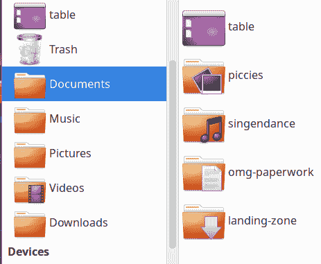

# 第五章：管理用户和组

Linux 有两种类型的用户：人类用户和系统用户。每个用户都有唯一的标识（UID），至少一个组标识（GID）。所有用户都有一个主组，并可能是多个组的成员。

每个人类用户拥有一个用于其个人文件的家目录。用户的家目录位于*/home*中，并以所有者的名字命名，比如我们的示例用户 Duchess 拥有*/home/duchess*。用户可能属于多个组，额外的组成员称为*附加*组。组中的用户拥有该组的所有权限。（要了解权限的所有内容，请参阅第六章。）权限控制对文件和命令的访问是系统安全的基础。

系统用户代表系统服务和进程。系统用户需要用户账户来控制其权限，并且不具有*/home*目录中的登录或目录。

人类用户分为两类：*root*用户，或超级用户，拥有无限权力，可以在系统上执行任何操作。所有其他用户被称为普通用户或非特权用户。普通用户只被赋予足够的权限来管理自己的文件，并运行允许普通用户使用的命令。普通用户可以被赋予有限或完全的 root 权限，关于*su*和*sudo*的相关内容将在后续章节中详细介绍。

您可以在*/etc/passwd*中查看系统中的所有用户，以及在*/etc/group*中查看所有的组。

# 集中式用户管理

*/etc/passwd*和*/etc/group*源自 Unix，并自 1992 年移植到 Linux 以来基本未变化。此后，出现了新的工具用于管理用户和组，例如为整个组织提供服务的集中式数据库。本章不涵盖集中式用户管理工具。

Linux 附带了一些用于管理用户和组的命令：

+   *useradd* 用于创建新用户。

+   *groupadd* 用于创建新组。

+   *userdel* 用于删除用户。

+   *groupdel* 用于删除组。

+   *usermod* 用于对现有用户进行更改。

+   *passwd* 用于创建和更改密码。

这些属于*Shadow Password Suite*，*/etc/login.defs*是其主要配置文件。

*useradd* 在不同系统上的行为不同，根据其配置方式而定。传统上，它将所有新用户归并到同一个主组*users*（100）中。这意味着用户必须小心文件的权限，以避免将其暴露给其他组的用户。Red Hat 通过其*User Private Group*方案改变了这一点，为每个新用户创建了一个个人私有组。大多数 Linux 发行版将其设为默认值，但也有例外，比如 openSUSE。

*Shadow Password Suite*是由 Julianne Frances Haugh 在上世纪 80 年代创建的，早在 Linux 诞生之前，旨在提高 Unix 密码安全性并简化用户账户管理。1992 年，随着 Linux 刚刚一岁，它被移植到 Linux 上。

在影子密码套件出现之前，所有相关文件都必须单独编辑，存在多个密码管理命令，并且哈希密码存储在*/etc/passwd*和*/etc/group*中。这两个文件必须对所有人可读，因此即使密码被哈希，也会引发问题。任何人都可以复制一个全局可读文件，然后随意破解密码。将哈希密码重新定位到只有 root 用户才能访问的影子文件*/etc/shadow*和*/etc/gshadow*中，增加了强大的保护层。影子密码套件的长期存在证明了其设计和编码的优秀。

对于 Debian 来说，新的到来者是*adduser*和*addgroup*。它们是*useradd*和*groupadd*的 Perl 脚本包装器。这些脚本将引导您完成完整的新用户和新组配置。

在本章中，您将学习如何创建和删除人类和系统用户，管理密码，查找 UID 和 GID，设置创建新用户的所需默认值，更改组成员身份，定制新用户需要的公共文件，清理已删除用户的内容，成为 root 用户，并向普通用户授予有限的 root 权限。

# 5.1 查找用户的 UID 和 GID

## 问题

您想要列出用户的 UID 和 GID。

## 解决方案

使用*id*命令而无需选项即可查看自己的 UID 和 GIDs。在以下示例中，用户是 Duchess：

```
duchess@pc:~$ id
uid=1000(duchess) gid=1000(duchess)
groups=1000(duchess),4(adm),24(cdrom),27(sudo),30(dip),46(plugdev),118(lpadmin),
126(sambashare),131(libvirt)
```

通过将其用户名作为参数提供来显示另一个用户的 UID 和 GIDs：

```
duchess@pc:~$ id madmax
uid=1001(madmax) gid=1001(madmax) groups=1001(madmax),1010(composers)
```

显示您的有效 ID。这是您作为另一个用户运行命令时的 ID。您可以使用*sudo*查看这一点：

```
duchess@client4:~$ sudo id -un
root

duchess@client4:~$ sudo -u madmax id -gn
madmax

```

## 讨论

Linux 中有三种类型的用户 ID：

+   真实的 UID/GID

+   有效的 UID/GID

+   保存的 UID/GID

*真实 ID*是在用户创建时分配给用户的 UID 和主要 GID。这些是您运行*id*命令（作为您自己）时看到的内容，无需选项。

*有效 ID*是用于运行需要与启动进程的用户不同权限的进程的 UID，例如*passwd*命令。*passwd*需要 root 权限，但使用特殊权限模式允许用户更改自己的密码。

您可以自己查看这一点。首先，看看*passwd*命令的权限：

```
$ ls -l /usr/bin/passwd
-rwsr-xr-x 1 root root 68208 May 27  2020 /usr/bin/passwd
```

这表明*passwd*的所有者是 root，无论是 UID 还是 GID。现在键入*passwd*命令并按 Enter 键。

打开第二个终端以查找*passwd*进程，然后打印其进程 ID、有效 ID 和真实 ID：

```
$ ps -a|grep passwd
12916 pts/1    00:00:00 passwd

$ ps -eo pid,euser,ruser,rgroup | grep 12916
  12916 root     root     root

```

即使一个非特权用户在运行*passwd*，它也会以 root 权限运行。（有关特殊权限模式的信息，请参见 Recipe 6.11。）

*saved ID* 被需要提升权限的进程使用，通常是 root 权限。当进程需要执行需要较少权限的工作时，它可以临时切换到非特权用户 ID。有效的 UID 被更改为较低的特权值，并且原始的有效 UID 被保存到 SUID，即 saved user ID。当进程再次需要提升权限时，它切换到 SUID。

*id* 命令有几个选项：

+   *-u* 显示有效的 UID 号码。

+   *-g* 显示有效的 GID 号码。

+   *-G* 显示所有组 ID。

+   *-n* 打印名称而不是数字。您可以与 *-u*、*-g* 和 *-G* 一起使用。

+   *-un* 显示有效的 UID 用户名。

+   *-gn* 显示有效的组名。

+   *-Gn* 显示所有有效 GID 名称。

+   *-r* 显示真实的 ID 而不是有效的 ID。您可以与 *-u*、*-g* 和 *-G* 一起使用。

## 参见

+   Recipe 6.11

+   *man 1 id*

+   *man 1 ps*

# 5.2 使用 useradd 创建一个普通用户

## 问题

您想要创建一个新用户，并且希望用户私有组的主目录中包含一组默认文件，例如 *.bashrc*、*.profile*、*.bash_history*，以及您希望他们拥有的其他文件。

## 解决方案

大多数 Linux 发行版都包含 *useradd* 命令，并且可根据您的需求进行配置。不同 Linux 发行版的默认配置不同，因此了解您的系统设置的最快方法是创建一个新的测试用户：

```
$ sudo useradd test1
```

现在运行 *id* 命令，然后查看 *useradd* 是否创建了主目录。以下示例来自 Fedora 34：

```
$ id test1
uid=1011(test1) gid=1011(test1) groups=1011(test1)

$ sudo ls -a /home/test1/
.  ..  .bash_logout  .bash_profile  .bashrc
```

在这个例子中，默认配置满足了问题中列出的所有要求。现在您只需要设置一个密码：

```
$ sudo passwd test1
Changing password for user test1.
New password: *password*
Retype new password: *password*
passwd: all authentication tokens updated successfully.
```

您可以选择在第一次登录后强制用户重置他们的密码，创建用户密码之后：

```
$ sudo passwd -e test1
Expiring password for user test1.
passwd: Success
```

将登录信息提供给您的用户，他们可以开始使用他们的新账户。新用户账户在 */etc/passwd* 中的表示如下：

```
test1:x:1011:1011::/home/test1:/bin/bash
```

例如 openSUSE 等一些 Linux 系统，默认配置 *useradd* 不会创建用户的主目录，并将所有用户放入 *users (100)* 组。如果文件的组权限允许，这可能会暴露文件给其他用户。下面的示例创建了一个用户私有组：

```
$ sudo useradd -mU test2
```

*-m* 创建用户的主目录，*-U* 创建与用户名相同的用户私有组。

## 讨论

所有新用户账户在您设置密码之前都是不活跃的。

对于用户创建的第一个组，无论是用户私有组还是所有用户的通用组，都是他们的 *primary* 组。用户分配的所有其他组都是 *supplementary* 组。

还有一些其他有用的选项：

+   *-G*、*--groups* 用于将用户添加到以逗号分隔的多个补充组中。这些组必须已经存在：

```
$ sudo useradd -G group1,group2,group3 test1
```

+   *-c*、*--comment* 接受任何文本字符串。用于用户的全名，或者任何注释或描述：

```
$ useradd -G group1,group2,group3 -c 'Test 1,,,,' test1
```

四个逗号定义了五个字段：全名、房间号、工作电话、家庭电话和其他信息。很久以前，这被称为 GECOS 数据。GECOS 是 General Electric Comprehensive Operating Supervisor 的缩写，是一个大型机操作系统。您可以在这些字段中输入任何文本字符串，或者什么都不输入，尽管包括用户的全名很有用。查看您的*/etc/passwd*文件，了解其他条目如何使用 GECOS 字段。

*useradd*的默认设置分散在多个配置文件中；查看 Recipe 5.4 以了解如何更改这些默认设置。

## 另请参见

+   *man 8 useradd*

+   *man 5 login.defs*

+   */etc/default/useradd*

+   */etc/skel*

+   */etc/login/defs*

# 5.3 使用 useradd 创建系统用户

## 问题

您想使用*useradd*命令创建系统用户。

## 解决方案

下面的示例创建一个没有主目录、没有登录 shell，并使用正确的系统用户 UID 编号范围的新系统用户：

```
$ sudo useradd -rs /bin/false service1
```

*-r*意味着创建一个具有正确数值范围内真实 ID 的系统用户，*-s*指定登录 shell。*/bin/false*是一个什么都不做的命令，防止用户登录系统。

有关 UID 和 GID 编号的信息，请参见 Recipe 5.6 中的讨论。

## 讨论

在过去，大多数服务都以*nobody*用户身份运行。现在，服务通常会使用自己的唯一用户，这比*nobody*用户拥有多个服务提供了更强的安全性。您很少需要创建系统用户，因为安装服务时应该由服务自行创建其唯一用户。

*nobody*用户始终分配 UID 65534 和 GID 65534。

## 另请参见

+   *man 8 useradd*

+   *man 1 false*

+   Recipe 5.6 中的讨论

# 5.4 修改*useradd*的默认设置

## 问题

默认的*useradd*设置对您不适用，您希望进行更改。

## 解决方案

*useradd*的配置分布在多个配置文件中：*/etc/default/useradd*，*/etc/login.defs*和*/etc/skel*目录中的文件。

下列值出现在*/etc/default/useradd*中。以下示例展示了 openSUSE 的默认设置：

```
$ useradd -D
GROUP=100
HOME=/home
INACTIVE=-1
EXPIRE=
SHELL=/bin/bash
SKEL=/etc/skel
CREATE_MAIL_SPOOL=yes
```

*GROUP=100*将一个单一的共享组设置为所有新用户的默认组，传统上为*100*。该组必须首先存在，并且在*/etc/login.defs*中必须设置*USERGROUPS_ENAB no*。然后在*/etc/default/useradd*中将*GROUP=*设置为用户组的 GID。如果我们的 Duchess 用户在一个共享组中，她的*id*输出将显示*uid=1000(duchess) gid=100(users)*。

通过在*/etc/login.defs*中设置*USERGROUPS_ENAB yes*并注释掉*/etc/default/useradd*中的*GROUP=*，启用私有用户组。这样每个用户都会创建一个非共享的私有组。如果我们的 Duchess 用户拥有自己的私有组，她的*id*输出将显示*uid=1000(duchess) gid=1000(duchess)*。

HOME=

设置所有用户主目录的默认目录。默认为*/home*。

INACTIVE=-1

设置密码过期后多少天锁定帐户。值为 0 表示密码过期后立即禁用帐户，值为 -1 表示不锁定帐户。

EXPIRE=

在 YYYY-MM-DD 格式中设置帐户过期日期。例如，如果设置为 2021-12-31，则帐户将在该日期禁用。将 *EXPIRE=* 留空表示帐户永不过期。

SHELL=/bin/bash

设置默认命令 shell。*/bin/bash* 是最常用的 Linux shell。其他值是用户系统中安装的任何 shell，如 */bin/zsh* 或 */usr/bin/tcsh*。*cat /etc/shells* 列出所有安装的 shell。

SKEL=/etc/skel

设置要自动分发给新用户的文件的位置。大多数 Linux 系统将它们放在 */etc/skel* 中。这些文件如 *.bash_logout*、*.bash_profile* 或 *.profile*、*.bashrc*，以及任何其他您希望新用户拥有的文件。您可以编辑这些文件以满足自己的需求。*SKEL* 是 skeleton 的缩写。

CREATE_MAIL_SPOOL=yes

是旧时代的遗留物，应设置为 *yes*，因为仍可能存在需要它的某些旧进程。

*/etc/login.defs* 中以下值与用户创建默认值相关：

+   *USERGROUPS_ENAB yes* 启用私人用户组。

+   *CREATE_HOME yes* 配置 *useradd* 自动创建私人用户主目录。这不适用于系统用户（参见 5.3 节）。

## 讨论

UID 编号范围在 */etc/login.defs* 中定义。每个 UID 必须是唯一的，因此用户帐户创建命令从此文件中定义的范围分配 UID。通常，人类 UID 从 1000 开始，并由 *useradd* 自动分配。您可以使用 *-u* 选项覆盖此设置，但必须选择未使用的数字，遵循配置的编号方案（参见 5.6 节 中的讨论）。

在第一次登录时强制要求密码更改是防止原始密码可能落入错误手中的简单预防措施，因为它从管理员传递到用户。

## 参见

+   *man 8 useradd*

+   *man 5 login.defs*

+   */etc/default/useradd*

+   */etc/skel*

+   */etc/login/defs*

# 5.5 自定义文档、音乐、视频、图片和下载目录

## 问题

您已按照 5.2 节 的方法创建了新用户，现在您希望为新用户定制文档、音乐、视频、图片和下载目录。

## 解决方案

创建这些目录不是 *useradd* 的功能，而是 X 桌面组（XDG）用户目录工具的功能。文档、音乐、视频等目录称为 *well-known user directories*。这些目录是从 */etc/xdg/user-dirs.defaults* 配置文件设置的，该文件为所有用户建立了默认配置：

```
$ less /etc/xdg/user-dirs.defaults
# Default settings for user directories
#
# The values are relative pathnames from the home directory and
# will be translated on a per-path-element basis into the users locale
DESKTOP=Desktop
DOWNLOAD=Downloads
TEMPLATES=Templates
PUBLICSHARE=Public
DOCUMENTS=Documents
MUSIC=Music
PICTURES=Pictures
VIDEOS=Videos
# Another alternative is:
#MUSIC=Documents/Music
#PICTURES=Documents/Pictures
#VIDEOS=Documents/Videos
```

这些是名称-值对。 名称不能更改。 值是名称映射到的目录，相对于用户的主目录。 例如，DOCUMENTS 映射到*/home/username/Documents*。 当用户第一次启动他们的图形桌面环境时，这些目录会自动为每个新用户创建。 您可以注释掉任何要排除的目录，或更改名称映射到的目录。

用户可以在*~/.config/user-dirs.dirs*中创建自己的个人配置。 在应用更改之前，这些目录必须存在。 以下示例是我们的示例用户公爵夫人创建的，她不喜欢无聊的默认值。 请注意，在*~/.config/user-dirs.dirs*中，名称-值对语法不同：

```
XDG_DESKTOP_DIR="$HOME/table"
XDG_DOWNLOAD_DIR="$HOME/landing-zone"
XDG_DOCUMENTS_DIR="$HOME/omg-paperwork"
XDG_MUSIC_DIR="$HOME/singendance"
XDG_PICTURES_DIR="$HOME/piccies"
```

当您的更改完成并创建了新目录后，请使用*xdg-user-dirs-update*命令应用您的更改：

```
duchess@pc:~$ xdg-user-dirs-update --set DOWNLOAD $HOME/landing-zone
duchess@pc:~$ xdg-user-dirs-update --set DESKTOP  $HOME/table
duchess@pc:~$ xdg-user-dirs-update --set DOCUMENTS  $HOME/omg-paperwork
duchess@pc:~$ xdg-user-dirs-update --set MUSIC  $HOME/singendance
duchess@pc:~$ xdg-user-dirs-update --set PICTURES  $HOME/piccies
```

注销，然后重新登录，您将看到类似于图 5-1 的东西。 XDG 为著名目录应用特殊图标。



###### 图 5-1\. 自定义著名目录

侧栏中的快捷方式不会更改，旧目录也不会更改，除了它们没有特殊图标。 您将需要更改快捷方式并手动迁移旧目录内容。

恢复到*/etc/xdg/user-dirs.defaults*中的默认值，使用以下命令：

```
$ xdg-user-dirs-update --force
```

退出并重新登录以查看更改。 除了标记著名用户目录的特殊图标外，您的任何目录都不会被移除或以任何方式更改。

## 讨论

运行*xdg-user-dirs-update --set*命令时，必须仅使用*man 5 user-dirs.default*中列出的名称：

```
DESKTOP
DOWNLOAD
TEMPLATES
PUBLICSHARE
DOCUMENTS
MUSIC
PICTURES
VIDEOS
```

只有目标目录即可配置的值。 目标目录必须相对于用户的主目录。 如果要使用主目录之外的目录，请创建符号链接。 例如，公爵夫人拥有*/users/stuff/duchess*并在其中存储音乐文件。 以下示例将此目录链接到*/home/duchess/singendance*：

```
duchess@pc:~$ ln -s /users/stuff/duchess /home/duchess/singendance

```

## 参见

+   *man 5 user-dirs.defaults*

+   *man 1 xdg-user-dirs-update*

+   *man 5 user-dirs.conf*

+   [xdg-user-dirs at freedesktop](https://oreil.ly/FFDga)

# 5.6 使用 groupadd 创建用户和系统组

## 问题

您想使用*groupadd*创建组。

## 解决方案

以下示例创建了一个名为*musicians*的新用户组：

```
$ sudo groupadd musicians
```

使用*groupadd*和* -r*选项创建系统组：

```
$ sudo groupadd -r service1
```

## 讨论

系统组与人类用户组在分配给它们的 UID 和 GID 编号范围上有所不同。 这在 Fedora 34 中的*/etc/login.defs*配置为*groupadd*和*useradd*，如下所示：

```
# Min/max values for automatic uid selection in useradd(8)
#
UID_MIN                  1000
UID_MAX                 60000
# System accounts
SYS_UID_MIN               201
SYS_UID_MAX               999
# Extra per user uids
SUB_UID_MIN                100000
SUB_UID_MAX             600100000
SUB_UID_COUNT               65536

#
# Min/max values for automatic gid selection in groupadd(8)
#
GID_MIN                  1000
GID_MAX                 60000
# System accounts
SYS_GID_MIN               201
SYS_GID_MAX               999
# Extra per user group ids
SUB_GID_MIN                100000
SUB_GID_MAX             600100000
SUB_GID_COUNT               65536
```

这些定义了系统管理员可用的数字范围。 所有其他范围均为系统保留和管理。

GID 编号由*groupadd*根据*/etc/login.defs*中定义的数字范围自动管理。您可以使用*-g*选项覆盖此设置，但所选的 GID 必须落在定义的范围内，并且不能已经被使用。

## 参见

+   *man 8 groupadd*

+   */etc/login.defs*

# 5.7 使用 usermod 将用户添加到组中

## 问题

您希望将用户分配到组。

## 解决方案

使用*usermod*命令。以下示例将 Duchess 添加到*musicians*组中：

```
$ sudo usermod -aG musicians duchess
```

此示例将 Duchess 添加到多个组：

```
$ sudo usermod -aG musicians,composers,stagehands duchess
```

或者，您可以编辑*/etc/group*，并在适当的组或组后键入 Duchess 的名称。当列出多个组成员时，列表必须以逗号分隔，名称之间不能有空格。

```
musicians:x:900:stash,madmax,duchess
```

# 小心追加而不是替换

如果忘记了*-a*选项，仅使用*-G*，所有用户现有的组将被移除并替换为新组。如果这将用户从其*sudo*组中移除，尤其具有破坏性。

当您更改登录用户的组成员资格时，用户必须注销然后重新登录以激活更改。有各种解决方法可以在不注销的情况下激活新的组分配，但它们都有限制，比如仅限于当前 shell。组在登录时枚举，因此最可靠的解决方案是注销并重新登录。

## 讨论

*-a*选项表示追加，*-G*是组或组。

## 参见

+   *man 8 usermod*

# 5.8 在 Ubuntu 上使用 adduser 创建用户

## 问题

您正在运行 Debian 或基于 Debian 的 Linux，并且需要知道如何使用*adduser*创建新用户。

## 解决方案

*adduser*会为您完成完整的新用户设置，就像这个 Stash Cat 的示例：

```
$ sudo adduser stash
Adding user 'stash' ...
Adding new group 'stash' (1009) ...
Adding new user 'stash' (1009) with group 'stash' ...
Creating home directory '/home/stash' ...
Copying files from '/etc/skel' ...
Enter new UNIX password:
Retype new UNIX password:
passwd: password updated successfully
Changing the user information for stash
Enter the new value, or press ENTER for the default
        Full Name []: Stash Cat
        Room Number []:
        Work Phone []:
        Home Phone []:
        Other []:
Is the information correct? [Y/n]
```

Stash 在*/etc/passwd*中看起来像这样：

```
stash:x:1009:1009:Stash Cat,,,:/home/stash:/bin/bash
```

## 讨论

*adduser*的默认设置在*/etc/adduser.conf*中管理。这提供了许多有用的默认设置，如：

DSHELL=

设置默认登录 shell。*/bin/bash*是最常用的 Linux shell。其他值是用户系统上安装的任何 shell，例如*/bin/zsh*或*/usr/bin/tcsh*。*cat /etc/shells*列出了所有安装的 shell。

USERGROUPS=yes

创建用户私有组，*no*将所有用户放入同一组中。

USERS_GID=100

当设置*USERGROUPS=no*时需要。

EXTRA_GROUPS=

这是您新用户的补充组列表，例如*EXTRA_GROUPS="audio video plugdev libvirt"*。

ADD_EXTRA_GROUPS=1

将*EXTRA_GROUPS=*中列出的组设置为新用户的默认组。

*/etc/adduser.conf*包含以下用户和组编号方案：

```
FIRST_SYSTEM_UID=100
LAST_SYSTEM_UID=999

FIRST_SYSTEM_GID=100
LAST_SYSTEM_GID=999

FIRST_UID=1000
LAST_UID=59999

FIRST_GID=1000
LAST_GID=59999--
```

Fedora Linux 包含*adduser*，但实际上不是*adduser*，只是一个到*useradd*的符号链接：

```
$ stat /usr/sbin/adduser
  File: /usr/sbin/adduser -> useradd
  Size: 7    Blocks: 0    IO Block: 4096   symbolic link
[...]
```

## 参见

+   *man 5 adduser.conf*

# 5.9 在 Ubuntu 上使用 adduser 创建系统用户

## 问题

您希望在 Ubuntu（或 Debian、Mint 或其他 Debian 衍生版）系统上使用*adduser*创建系统用户。

## 解决方案

以下示例使用*adduser*创建了一个名为*service1*的新系统用户，没有家目录，并拥有独立的主要组：

```
$ sudo adduser --system  --no-create-home --group service
Adding system user 'service1' (UID 124) ...
Adding new group 'service1' (GID 135) ...
Adding new user 'service1' (UID 124) with group 'service1' ...
Not creating home directory '/home/service1'.
```

在*/etc/passwd*中的显示如下：

```
service1:x:124:135::/home/service1:/usr/sbin/nologin
```

## 讨论

系统用户没有家目录。

在古老的时代，服务通常作为*nobody*用户和组运行，除了 Debian 使用*nobody*和*nogroup*。将同一用户用于多个服务是一种安全弱点。您不太可能需要创建系统用户，因为现在的常见做法是在安装新服务时由软件包安装程序创建唯一的用户和组。但是现在您知道了，以防万一您需要。

*nobody*和*nogroup*的真实 ID 始终为 65534。

## 参见

+   *man 8 adduser*

# 5.10 使用 addgroup 创建用户和系统组

## 问题

您想知道如何使用 Debian 的*addgroup*命令创建用户和系统组。

## 解决方案

以下示例创建一个人类用户组：

```
$ sudo addgroup composers
Adding group 'composers' (GID 1010) ...
Done.
```

在*/etc/group*中看起来是这样的：

```
composers:x:1010:
```

此示例创建一个新的系统组：

```
$ sudo addgroup --system service1
Adding group 'service1' (GID 136) ...
Done.
```

## 讨论

用户组和系统组之间的区别在于它们各自具有不同的 UID 和 GID 编号范围，这些范围在*/etc/adduser.conf*中配置。

## 参见

+   *man 8 addgroup*

# 5.11 检查密码文件的完整性

## 问题

所有这些用户文件和组文件中都有很多内容，您想知道是否有某种检查程序来验证这些文件是否被正确写入。

## 解决方案

*pwck*命令检查*/etc/passwd*和*/etc/shadow*的完整性，*grpck*检查*/etc/group*和*/etc/gshadow*。它们查找正确的格式、有效的数据、有效的名称和有效的 GID（请参阅 man 手册以获取完整的列表）。当您不带任何选项运行它们时，它们会报告警告和错误：

```
$ sudo pwck
user 'news': directory '/var/spool/news' does not exist
user 'uucp': directory '/var/spool/uucp' does not exist
user 'www-data': directory '/var/www' does not exist
user 'list': directory '/var/list' does not exist

$ sudo grpck
group mail has an entry in /etc/gshadow, but its password field in /etc/group is
not set to 'x'
grpck: no changes
```

添加**`-q`**选项以仅报告错误：

```
$ sudo pwck -q

$ sudo grpck -q
group mail has an entry in /etc/gshadow, but its password field in /etc/group
is not set to 'x'

```

这显示了*/etc/gshadow*中的错误。这不是一个非常有用的消息，因为它实际上并不是一个错误。将密码放在用户组上不是一个常见的做法，因此将其报告为错误只会令人困惑。其他检查非常有用，例如正确的字段数和唯一的有效组名。

您永远不会编辑*/etc/shadow*或*/etc/gshadow*，而只会编辑*/etc/passwd*和*/etc/group*。

## 讨论

下面的示例显示了必须纠正的错误。当提示时，键入**`n`**以防止删除条目。第一个“删除行”示例来自*/etc/passwd*，第二个示例来自*/etc/shadow*：

```
$ sudo pwck -q
invalid password file entry
delete line 'fakeservice:x:996:996::/home/fakeservice'? n
delete line 'fakeservice:!:18469::::::'? n
pwck: no changes
```

然后修正*/etc/passwd*中的行，这将修复两个错误消息。例如，*fakeservice:x:996:996::/home/fakeservice*缺少最后一个字段，应为*fakeservice:x:996:996::/home/fakeservice:/bin/false*。

“目录不存在”警告通常指的是未使用的默认系统用户。例如：

```
user 'www-data': directory '/var/www' does not exist
```

当您未运行 HTTP 服务器时，*www-data*用户未使用，并且没有*/var/www*目录，直到安装 HTTP 服务器。

“无更改”消息意味着未对密码文件进行任何更改。

请参阅 man 手册以获取完整的检查列表。

## 参见

+   *man 8 pwck*

+   *man 8 grpck*

# 5.12 禁用用户帐户

## 问题

您希望禁用用户帐户而不是删除它。

## 解决方案

若要临时停用帐户，请使用 *passwd* 命令禁用用户的密码：

```
$ sudo passwd -l stash
passwd: password expiry information changed.
```

现在用户无法登录。下面的示例解锁用户的帐户：

```
$ sudo passwd -u stash
passwd: password expiry information changed.
```

这不会阻止用户通过其他认证方法（如 SSH 密钥）登录。要完全禁用用户帐户，请使用 *usermod*：

```
$ sudo usermod --expiredate 1 stash
```

当用户尝试登录时，他们会看到“您的帐户已过期，请联系系统管理员”消息。恢复他们的帐户：

```
$ sudo usermod --expiredate -1 stash
```

## 讨论

禁用用户的另一种方法是在 */etc/passwd* 的密码字段中用星号（*）替换 x：

```
stash:*:1009:1009:Stash Cat,,,:/home/stash:/bin/bash
```

通过将星号替换为 *x* 来重新启用 Stash。

## 参见

+   *man 1 passwd*

# 5.13 使用 userdel 删除用户

## 问题

您需要删除一个用户，可能还包括他们的主目录及其内容。

## 解决方案

下面的示例使用 *userdel* 命令从 */etc/passwd* 删除用户 Stash，Stash 的主要组和所有组成员，以及影子文件：

```
$ sudo userdel stash
```

如果 Stash 属于共享的主用户组（见 Recipe 5.4 讨论），则该组不会被删除。

使用 *-r* 选项删除用户的主目录及其内容，以及其邮件邮筒：

```
$ sudo userdel -r stash
```

如果用户拥有其主目录之外的文件，则必须分别查找并处理它们（参见 Recipe 5.16）。

## 讨论

在删除用户之前和之后，请阅读您的 */etc/passwd* 和 */etc/group* 文件，以查看用户的消失。

删除用户后进行清理是一个良好的做法。

## 参见

+   *man userdel*

# 5.14 在 Ubuntu 上使用 deluser 删除用户

## 问题

您正在运行 Ubuntu（或其他 Debian 派生版），并希望使用 *deluser* 删除用户。

## 解决方案

下面的示例从 */etc/passwd* 删除用户 Stash，从 */etc/group* 删除 Stash 的主要组，以及相应的影子文件：

```
$ sudo deluser stash
Removing user 'stash' ...
Warning: group 'stash' has no more members.
Done.
```

*deluser* 不会删除现有用户的主要组，因此如果 Stash 属于共享的主用户组，则不会被删除。

本示例删除了 Stash 的主目录并备份了所有已删除文件：

```
$ sudo deluser --remove-all-files --backup stash
```

## 讨论

*--backup* 在当前目录创建用户文件的压缩归档。使用 *--backup-to* 选项选择其他目录：

```
$ sudo deluser --remove-all-files --backup-to /user-backups stash

```

如果用户拥有其主目录之外的文件，则必须手动查找并处理它们（参见 Recipe 5.16）。

## 参见

+   *man 8 deluser*

# 5.15 在 Ubuntu 上使用 delgroup 删除组

## 问题

您有一个 Ubuntu 系统，并希望使用 *delgroup* 命令删除组。

## 解决方案

下面的示例移除了 *musicians* 组：

```
$ sudo delgroup musicians
```

*delgroup* 不会删除现有用户的主要组。即使它们有成员，它也会删除附加组。如果不想删除有成员的组，请使用 *--only-if-empty* 选项：

```
$ sudo delgroup --only-if-empty musicians
```

## 讨论

*delgroup*的默认行为已在*/etc/deluser.conf*和*/etc/adduser.conf*中配置。

## 参见

+   *man 8 delgroup*

# 5.16 查找和管理用户的所有文件

## 问题

您想删除一个用户，但不希望留下一堆孤立的文件，并且需要找到它们的所有位置。

## 解决方案

*find*命令将根据 UID 或 GID 在本地系统上定位所有文件。以下示例在整个根目录中搜索用户 UID 所有者的所有文件：

```
$ sudo find / -uid 1007
```

如果要搜索大量文件，可能需要一些时间。如果确定不需要搜索整个文件系统，可以将搜索范围缩小到特定的子目录，如*/etc*、*/home*或*/var*：

```
$ sudo find /etc -uid 1007
$ sudo find /home -uid 1007
$ sudo find /var -uid 1007
```

您还可以按 GID、用户名或组名搜索：

```
$ sudo find / -gid 1007
$ sudo find / -name duchess
$ sudo find / -group duchess
```

现在知道所有文件的位置，该怎么处理呢？一种选择是将它们的所有权更改为另一个用户，让新用户处理它们：

```
$ sudo find /backups -uid 1007 -exec chown -v 1010 {} \;
changed ownership of '/backups/duchess/' from 1007 to 1010
changed ownership of '/backups/duchess/bin' from 1007 to 1010
changed ownership of '/backups/duchess/logs' from 1007 to 1010
```

您可以结合*find*和*cp*来查找并复制所有文件到不同的目录：

```
$ sudo find / -uid 1007 -exec cp -v {} /orphans \;
```

使用*cp -v*会打印进度消息，并仅复制文件而不复制它们的父目录。如果希望复制父目录，请使用*-r*选项：

```
$ sudo find / -uid 1007 -exec cp -rv {} /orphans \;
```

复制会保留原始文件的位置。在安全复制后，您可能希望删除原始文件。一种方法是再次运行*find*并使用*rm*删除原始文件：

```
$ sudo find / -uid 1007 -exec rm -v {} \;
```

这将删除文件但不会删除目录。如果确定这些目录中没有其他想要保留的文件，请使用*-r*选项删除目录：

```
$ sudo find / -uid 1007 -exec rm -rv {} \;
```

另一个选择是使用*find*和*mv*将文件移动到其他位置：

```
$ sudo find / -uid 1007 -exec mv {} /orphans \;
```

如果看到“找不到文件或目录”消息，通常是因为文件或目录已移动，您可以通过查看它们被移动到的目录来进行验证。

查找由不存在的用户或组拥有的文件：

```
$ find / -nouser
$ find / -nogroup
```

## 讨论

要小心使用*mv*和*rm*，因为它们没有撤销功能。如果出错，恢复的最佳希望是从备份中恢复。

清理离开的用户后可能会很麻烦，因为计算机使得创建尽可能多的文件变得太容易。如果发现*find*花费的时间太长，可以考虑让它在后台运行。

## 参见

+   *man 1 find*

+   *man 1 mv*

+   *man 1 cp*

+   *man 1 rm*

# 5.17 使用 su 切换到 root 用户

## 问题

你需要知道如何获取根权限以执行一些管理任务。

## 解决方案

当需要执行系统任务时，请使用*su*命令切换到 root 用户：

```
duchess@pc:~$ su -l
Password:
root@pc:~#
```

如果不知道 root 密码，或者没有 root 密码，请参见 Recipe 5.21 了解如何使用*sudo*设置 root 密码。

完成后，请退出 root 用户并返回到您自己的帐户：

```
root@pc:~# exit
logout
duchess@pc:~$
```

使用*-l*选项调用 root 用户的环境，切换到 root 的主目录并加载 root 的环境变量。省略*-l*以保留您自己的环境：

```
duchess@pc:~$ su
Password:
root@pc:/home/duchess~#
```

## 讨论

您可以切换到任何用户，只要您有他们的密码。

使用 *su* 切换到 root 给予您对系统的绝对控制，您运行的每个命令都是以 root 权限运行的。考虑使用 *sudo*（见 Recipe 5.18），它提供一些安全功能，如保护 root 的密码和留下审计日志。

## 另请参阅

+   *man 1 su*

# 5.18 使用 *sudo* 授予有限的 root 权限

## 问题

您想将一些系统管理任务委派给其他用户，并希望将他们的 root 权限限制在他们特定任务所需的范围内。

## 解决方案

使用 *sudo* 命令。*sudo* 比 *su* 更安全，因为它为特定任务授予特定用户有限的 root 权限，记录活动并缓存用户的密码一段有限的时间，默认为 15 分钟。15 分钟后，用户必须再次向 *sudo* 提供密码。缓存持续时间可配置。*sudo* 保护 root 的密码，因为 *sudo* 用户使用自己的密码。

###### 注意

一些 Linux 发行版（例如 openSUSE）默认要求 *sudo* 输入 root 用户的密码。参见 Recipe 5.22 了解如何更改此设置。

*/etc/sudoers* 是配置文件，您应该使用特殊命令 *visudo* 进行编辑。这将使用您的默认文本编辑器打开 */etc/sudoers*，您可以查看和编辑默认配置。再一次，Duchess 为我们演示：

```
duchess@pc:~$ sudo visudo
[sudo] password for duchess:
[...]
##Allow root to run any commands
root    ALL=(ALL) ALL

# Allow members of group sudo to execute any command
%sudo   ALL=(ALL) ALL
[...]
```

*%sudo ALL=(ALL) ALL* 表示任何加入 *sudo* 组的用户都拥有与 root 相同的完全 *sudo* 权限。百分号表示 *%sudo* 是 */etc/group* 中的一个组，而不是 */etc/sudoers* 中配置的组。

假设您有一位初级管理员 Stash，其工作是安装和删除软件并保持系统更新。您可以为 Stash 创建一个系统组。或者您可以配置 Stash 在 */etc/sudoers* 中执行此任务。以下示例授予 Stash 运行列出命令的 *sudo* 权限。您需要用户名、本地机器的主机名以及允许的命令的逗号分隔列表：

```
stash server1 = /bin/rpm, /usr/bin/yum, /usr/bin/dnf
```

假设您想让 Stash 承担更多管理服务等的管理任务。允许的命令列表将变得很长，因此您可以创建一些命令别名。以下示例将软件管理命令别名为 SOFTWARE，服务管理命令别名为 SYSTEMD：

```
Cmnd_Alias SOFTWARE = /bin/rpm, /usr/bin/yum, /usr/bin/dnf
Cmnd_Alias SYSTEMD = /usr/bin/systemctl start, /usr/bin/systemctl stop,
/usr/bin/systemctl reload, /usr/bin/systemctl restart, /usr/bin/systemctl
status, /usr/bin/systemctl enable, /usr/bin/systemctl disable,
/usr/bin/systemctl mask, /usr/bin/systemctl unmask
```

现在 Stash 的配置看起来像这样：

```
stash server1 = SOFTWARE, SYSTEMD
```

您可以在 */etc/sudoers* 中创建用户组（与 */etc/group* 中的系统组无关），然后为它们分配一些命令别名：

```
User_Alias  JRADMIN = stash, madmax

JRADMIN server1 = SOFTWARE, SYSTEMD
```

您可以创建一个*Host_Alias*来给用户在多台机器上赋予*sudo*权限：

```
Host_Alias SERVERS = server1, server2, server3
```

然后引入 JRADMINs：

```
JRADMIN SERVERS = SOFTWARE, SYSTEMD
```

## 讨论

当您的有限 *sudo* 用户尝试运行不允许的命令时，他们会看到此消息：“对不起，用户 *duchess* 无法在 *server2* 上以 root 身份执行 `*/some/command*`。”

不要对将用户限制在特定命令集合中抱有过多信心。许多日常应用程序通过 shell 脱逃提供特权升级的方法，您的用户可以获得完全的 root 权限。此示例展示了如何使用 *awk* 进行演示：

```
$ sudo awk 'BEGIN {system("/bin/bash")}'
root@client4:/home/duchess# 
```

就这样，公爵夫人就拥有了完整的 root 权限。谦卑的 *less* 命令还提供了一个 shell 转义。使用 *less* 读取足够大需要分页的文件：

```
$ sudo less /etc/systctl.conf
#
# /etc/sysctl.conf - Configuration file for setting system variables
# See /etc/sysctl.d/ for additional system variables.
# See sysctl.conf (5) for information.
/etc/sysctl.conf

```

输入 **`!*sh*`**，然后当提示符更改时，输入 **`whoami`**：

```
duchess@client4:~$ sudo less /etc/systctl.conf
#
# /etc/sysctl.conf - Configuration file for setting system variables
# See /etc/sysctl.d/ for additional system variables.
# See sysctl.conf (5) for information.
!'sh'
duchess@client4:~$ sudo less /etc/sysctl.conf
# whoami
root

```

输入 **`exit`** 返回到您的正常 shell。

根据我的经验，难以跟踪到能够提供 shell 转义的许多应用程序。*journalctl* 记录所有内容，如果您希望监视您的 *sudo* 用户（参见 Recipe 20.1）。

在某些 Linux 发行版（如 Fedora）中，*wheel* 组是默认的 *sudo* 组。检查您的 */etc/sudoers* 文件以了解您的发行版如何配置。您还可以创建自己的 *sudo* 组，并将其命名为任何您想要的名称。

*/etc/sudoers* 文件仅控制本地机器上的用户。包括其他机器，如 SERVERS 别名，允许您在多台机器上共享单个配置文件。*sudo* 会忽略任何在本地机器上不存在的项，比如主机或用户。

让我们解析 *root ALL=(ALL) ALL*，以了解所有这些 ALL 意味着什么。

root

在用户字段中，*(ALL)* 表示该用户或用户可以作为任何其他用户运行命令，或者您可以指定特定用户。

ALL=

是主机字段中的内容。ALL 表示任何主机的任何位置，或者您可以使用主机别名，或命名单个主机。

*(ALL)*

是可选用户字段中的内容。*(ALL)* 表示用户或用户可以作为任何其他用户运行命令，或者您可以指定某些用户。

ALL

在命令字段中。*ALL* 表示无限制，或者您可以指定允许的命令列表。

## 参见

+   *man 8 sudo*

+   *man 5 sudoers*

# 5.19 延长 sudo 密码超时时间

## 问题

在大多数 Linux 发行版上，*sudo* 缓存密码的默认间隔是 15 分钟。15 分钟后，您需要再次输入密码。在您有很多工作要做时，您厌倦了频繁输入密码，并希望增加缓存间隔。

## 解决方案

更改 */etc/sudoers* 中的缓存间隔。使用 *visudo* 打开文件进行编辑：

```
$ sudo visudo
```

然后查找 *Defaults* 行并设置新的缓存间隔。以下示例将其设置为 60 分钟：

```
$ Defaults timestamp_timeout=60
```

如果将其设置为 0，*sudo* 每次使用时都会要求输入密码。

如果将 *timestamp_timeout* 设置为负数，如 *-1*，则您的密码永不过期。

## 讨论

*sudo* 密码缓存是一种有用的保护措施，可以防止意外事件，例如忘记以 root 身份运行或者离开时让其他人玩弄您的计算机。

## 参见

+   *man 8 sudo*

+   *man 5 sudoers*

# 5.20 创建个别 sudoers 配置

## 问题

您想为用户设置一些不同的 *sudo* 配置；例如，您希望您的初级管理员有一个不同的密码超时设置。您的设置很长，而您希望他们的设置很短。

## 解决方案

您可以在 */etc/sudoers.d* 中创建个别配置。以下示例为 Stash 创建了一个 30 分钟的密码超时：

```
$ cd /etc/sudoers.d/
$ sudo visudo -f stash
```

输入**`Defaults timestamp_timeout=30`**，保存文件，完成。您可以查看新文件：

```
$ sudo ls /etc/sudoers.d/
README stash
```

您只需要输入与*/etc/sudoers*中条目不同的配置项，而不是复制整个文件。

## 讨论

这是一个管理多个用户的好功能。与其管理一个大的配置文件，不如将其分解为更小的每个用户文件。

## 另请参阅

+   *man 8 sudo*

+   *man 5 sudoers*

# 5.21 管理根用户的密码

## 问题

在安装过程中，您的 Linux 发行版将您设置为系统管理员，具有无限制的*sudo*特权，并且未创建根密码。或者，您的根用户有密码但您忘记了。您需要知道如何为根用户设置新密码。

## 解决方案

当您想要作为“真正的”根用户运行时，请使用*sudo*来*su*到根：

```
duchess@pc:~$ sudo su -l
[sudo] password for duchess:
root@pc:~#
```

在这一点上，您可以使用*passwd*命令为根用户设置密码，以便直接以根用户身份登录，或者重置丢失的根密码。

## 讨论

有时您需要根密码而不是*sudo*；例如，当您引导到紧急运行级别时。

## 另请参阅

+   *man 8 sudo*

+   *man 5 sudoers*

+   *man 1 passwd*

# 5.22 将 sudo 设置为不要求根密码

## 问题

您希望您的*sudo*用户使用自己的密码进行身份验证，但您的 Linux 系统要求使用根用户的密码，如下例所示：

```
$ sudo visudo
[sudo] password for root:
```

## 解决方案

这是某些 Linux 发行版（如 openSUSE）上的默认行为。

当您安装 Ubuntu Linux 并在安装过程中将用户设置为管理员时，Ubuntu 会使用您自己的密码为您的用户适当配置完全的*sudo*权限，相当于根用户。而 openSUSE 则不会这样做，而是配置您的用户使用目标用户即根用户的密码。

要设置*sudo*用户始终要求其自己的密码，请编辑*/etc/sudoers*并注释掉以下两行：

```
duchess@pc:~$ sudo visudo

# Defaults targetpw
# ALL   ALL=(ALL) ALL 
```

在 openSUSE 和 Fedora 中，通过将用户添加到*/etc/group*中的*wheel*组来创建具有完整根权限的*sudo*用户。（对于有限用户，请参阅 Recipe 5.18。）

更改将在保存更改并关闭文件后立即生效。

## 讨论

保护根用户的密码是使用*sudo*而不是*su*的主要原因。

## 另请参阅

+   Recipe 5.18
