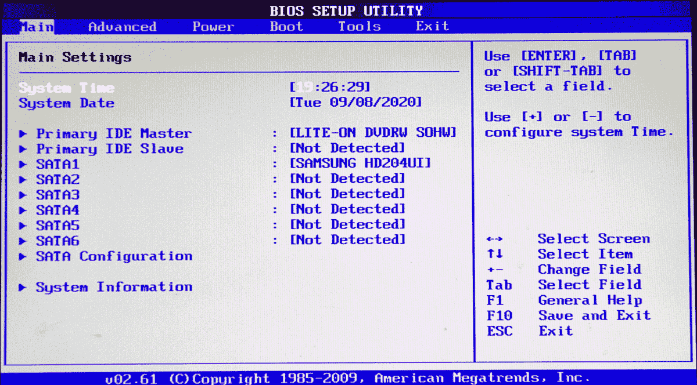
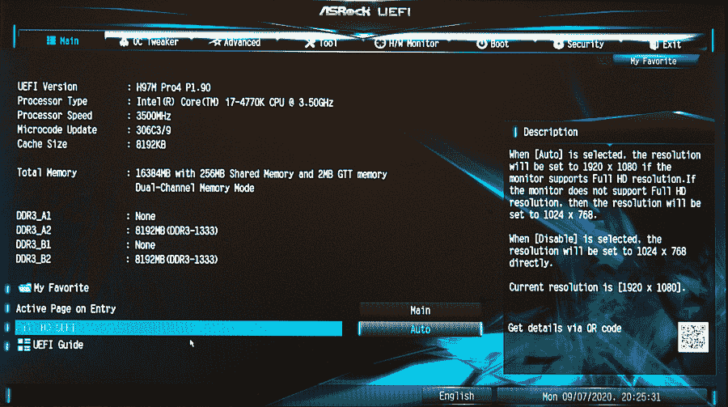

# 第八章：使用 parted 管理磁盘分区

所有的存储驱动器——SATA 硬盘、固态硬盘、USB 驱动器、SD（安全数字）卡、NVMe（非易失性内存表达式）和 CompactFlash 卡——在使用前都必须进行分区和格式化。它们都预装了某种分区和文件系统，可能不符合你的需求。随着需求变化，你可能需要重新分区并使用不同的文件系统。在本章中，你将学习使用 *parted*（分区编辑器）管理分区。

# 概述

*parted* 只管理分区；参见第十一章学习文件系统。第九章介绍了图形前端工具 GParted，它可以同时管理分区和文件系统。

你还将了解到 Master Boot Record（MBR）的现代替代品，即老旧而不足的传统分区表。MBR 已被新的全局唯一标识分区表（GUID Partition Table 或 GPT）取代。

*parted* 显示分区信息，并添加、删除和调整分区大小。*parted* 只有一个需要注意的地方：它会立即将更改写入磁盘，所以你必须小心。GParted 则不会立即应用更改，直到你点击一个按钮。

尽管很多存储设备不再是磁盘而是固态设备，如 USB 闪存，但称它们为“磁盘”仍是一种常见的便利说法。为什么不呢？我们还在用电话拨号，用智能手机录制磁带录音和视频呢？

磁盘分区是存储磁盘的逻辑分割，是将磁盘划分为一个或多个独立区域的方法。一个磁盘必须至少有一个分区。分区的数量取决于你的需求和喜好。分区完成后，你必须在每个分区上创建文件系统，然后才能使用它。一个单独的磁盘可以有多个分区，每个分区可以有不同的文件系统。

在 Linux 上，磁盘名称始终为 */dev* 后跟一些内容，这缩写自 device。例如，硬盘为 */dev/sda*，光驱为 */dev/sr0*。分区是磁盘名称加上一个数字。如果 */dev/sda* 有三个分区，它们分别为 */dev/sda1*、*/dev/sda2* 和 */dev/sda3*。

## 分区方案

一些 Linux 发行版的默认分区方案是将整个安装内容放入单个分区。这样做没问题，但在安装过程中设置几个更多的分区有其优点：

+   将 */boot* 单独分区使得管理多重启动系统更加容易，因为启动文件与安装或移除的操作系统独立。

+   将 */home* 放在单独的分区中可以隔离它与根文件系统，这样你可以在不触及 */home* 的情况下替换 Linux 安装。*/home* 甚至可以在一个独立的驱动器上。

+   */var* 和 */tmp* 可能因为进程失控而填满。将它们放在独立的分区上可以防止它们影响其他文件系统。

+   将交换文件放在独立的分区上可以启用挂起到磁盘的功能。

参见第 1 章了解更多关于设计分区布局的信息。

## 分区表：GPT 和 MBR

GUID 分区表（GPT）于 2010 年首次发布，是古老的 PC-DOS 主引导记录（MBR）的现代替代品。如果您只有 MBR 的使用经验，那么准备好迎接新体验，因为 GPT 是一个重大进步。

MBR 是在上个世纪 80 年代初期 IBM PC 诞生时创建的，当时的硬盘容量为 10 兆字节（MB），是一个激动人心的时代。MBR 放置在磁盘的第一个扇区的前 512 字节之内，在第一个分区之前，包含引导加载程序和分区表。引导加载程序占用 446 字节，分区表使用 64 字节，剩余的 2 字节存储引导签名。

64 字节的存储空间并不多，所以 MBR 限制为四个主分区。一个主分区可以容纳一个扩展分区，扩展分区可以进一步划分为逻辑分区。Linux 理论上支持无限数量的逻辑分区。即使有大量的逻辑分区，MBR 也只能寻址最大 2.2 TiB 的磁盘空间，这在今天勉强能够容纳您的猫咪表情包。为什么会有这个限制？您可以自己算一下：MBR 只能寻址 32 位，可以寻址 2³² 个块（我们稍后会讨论块和扇区），所以对于每个 512 字节块的磁盘，计算公式为 2³² x 512 = 2.199023256×10¹² 字节。

## BIOS 和 UEFI

GPT 是 UEFI（统一可扩展固件接口）规范的一部分。UEFI 取代了您计算机的基本输入输出系统，更为人熟知的是 PC BIOS 或简称 BIOS。图 8-1 是旧的传统 BIOS，图 8-2 是现代的 UEFI，充满了闪亮的先进功能，就像一个小操作系统一样。

GPT 相比于 MBR 有很多优势：

+   Linux 上最多可以有 128 个分区，编号为 1–128，不涉及主分区和扩展分区

+   容错性：分区表的副本存储在多个位置

+   磁盘和分区的唯一标识符

+   传统 BIOS/MBR 启动模式

+   验证自身完整性和分区表

+   安全启动



###### 图 8-1\. 传统 BIOS 设置



###### 图 8-2\. UEFI 设置

MBR 几乎已经过时，你应该使用 GPT。在 GPT 中，磁盘的第一个扇区保留为保护性 MBR，支持 BIOS 计算机上的 GPT，因此我们可以在老式系统上使用 GPT，这些系统使用 BIOS 而非 UEFI。引导加载程序和操作系统都必须支持 GPT，Linux 多年来一直支持这一点。只有在不支持 GPT 的旧计算机和旧操作系统上才需要使用 MBR。

如果你有一台带有 BIOS 的旧系统，无法将其升级为 UEFI，而必须更换主板以获得 UEFI。UEFI 和 BIOS 都集成在主板中。

## 块和扇区

现在我们将讨论块和扇区，以及它们对磁盘、文件和分区的最大大小的影响。*块*是文件系统可以使用的磁盘上最小的存储单元。这些是逻辑上的划分，而非物理上的。最小的物理存储单元是*扇区*。块可以跨越多个扇区，文件可以跨越多个块。

当文件跨越多个块时，会有一定的浪费，因为文件很少与块大小匹配。例如，一个比四个块大一字节的文件将使用五个块。第五个块仅包含一个字节，并且该块专用于该文件。因此，你可能会认为 512 字节的块比较节省空间。但一个块中存储的信息比文件还要多。

每个块除了文件数据外，还存储时间戳、文件名、所有权、权限、块 ID、以及它与其他块的正确顺序、inode 和其他元数据。

4096 字节块使用 512 字节块的八分之一的元数据。在 4 TiB 硬盘上，你需要 8,000,000,000 个 512 字节块。而使用 4096 字节块大小时，只需要 1,000,000,000 个块，这表示了相当大的元数据节省。

扇区大小限制了存储卷的大小。硬盘的标准扇区大小多年来一直是 512 字节，现在则是 4096 字节，因为硬盘已经变得如此之大。

GPT 提供 64 位寻址，支持单个磁盘上的总块数为 2⁶⁴，因此具有 512 字节块的硬盘可以达到多达 9 ZB 的大小。使用 4096 字节块时，最大磁盘大小为 64 ZB，我敢说即使是最狂热的猫视频收藏者也足够用了。这些是理论上的最大限制，受可用硬件、操作系统限制以及文件系统对大容量卷的支持所限制。例如，Ext4 文件系统对单个文件系统的最大容量为 1 EiB，对 4096 字节块大小的文件的最大大小为 16 TiB。XFS 支持最大文件系统和文件大小为 8 EiB 减去 1 字节。

CD 和 DVD 有 2048 字节的扇区。像 USB 闪存、SD 卡、CompactFlash 和固态硬盘（SSD）这样的固态设备也有扇区和块。SSD 上最小的单位称为*页*。常见的页大小有 2 KB、4 KB、8 KB 及更大。块包含 128 到 256 页，块大小通常为 256 KB 到 4 MB。

所有这些庞大的数字都有点让人眼花缭乱。表 8-1 总结了用于测量磁盘容量的十进制和二进制测量。

表 8-1\. 字节的十进制和二进制倍数

| Value | Decimal | Value | Binary |
| --- | --- | --- | --- |
| 1 | B 字节 | 1 | B 字节 |
| 1000 | kB 千字节 | 1024 | KiB 基比字节 |
| 1000² | MB 百万字节 | 1024² | MiB 兆比字节 |
| 1000³ | GB 十亿字节 | 1024³ | GiB 吉比字节 |
| 1000⁴ | TB 兆字节 | 1024⁴ | TiB 提比字节 |
| 1000⁵ | PB 百万亿字节 | 1024⁵ | PiB 皮比字节 |
| 1000⁶ | EB 百亿字节 | 1024⁶ | EiB 伊比字节 |
| 1000⁷ | ZB 十亿亿字节 | 1024⁷ | ZiB 泽比字节 |
| 1000⁸ | YB 十亿亿亿字节 | 1024⁸ | YiB 佑比字节 |

十进制值是 10 的幂；例如，千字节是 1000 字节，即 10³。二进制值是 2 的幂，因此基比字节是 2¹⁰，1024 字节。硬盘制造商喜欢使用十进制格式来使他们的驱动器看起来更大。

谁想出这种奇怪的“bibyte”命名方案几乎保证没有人愿意说这些名字。总之，人们喜欢互换使用它们。无论如何，现在您知道了区别。

# 8.1 使用 parted 前卸载您的分区

## 问题

您知道在使用*parted*之前必须卸载您的分区或分区，您需要知道如何操作。

## 解决方案

从图形文件管理器卸载分区，或使用*umount*命令。以下示例卸载*/dev/sdc2*：

```
$ sudo umount /dev/sdc2
```

如何确定正确的设备名称？参见 Recipe 8.3 学习如何列出您连接的磁盘和分区。

如果您在磁盘上创建新的分区表，应先卸载所有分区。

# 更改运行中的系统

如果您在分离分区上有活动根文件系统（如*/home*、*/var*或*/tmp*），卸载这些文件系统是有风险的。在另一个 Linux 实例中执行分区操作更安全，例如 SystemRescue（第十九章），或同一台机器上的第二个 Linux（第一章）。

## 讨论

从技术上讲，您挂载和卸载文件系统而不是分区。但是，如果您说“分区”，我也不会怪您。

## 另请参阅

+   *man 8 parted*

+   [Parted 用户手册](https://oreil.ly/SNyLL)

# 8.2 选择 parted 的命令模式

## 问题

您知道可以启动*parted*命令以交互模式启动，启动*parted*命令 shell，或者将其作为普通命令运行，您想知道如何做这两件事。

## 解决方案

以无选项运行 *parted* 启动交互式 *parted* shell。您需要 root 权限：

```
$ sudo parted
GNU Parted 3.2
Using /dev/sda
Welcome to GNU Parted! Type 'help' to view a list of commands.
(parted)
```

当您的正常命令提示符更改为 *(parted)* 时，您就处于 *parted* shell 中。输入 **`help`** 查看命令列表及其描述。对于单个 *parted* 命令也有帮助，例如，*help print*。输入 *quit* 退出 *parted*。大多数 *parted* 命令可以缩写为它们的第一个字母，如 *h* 和 *q*。

输入完整的命令以在常规 shell 中运行 *parted*，例如，列出所有磁盘的以下示例：

```
$ sudo parted /dev/sdb print devices
/dev/sdb (2000GB)
/dev/sda (4001GB)
/dev/sdc (4010MB)
/dev/sdd (15.7GB)
/dev/sr0 (425MB)

```

命令运行并退出，然后返回到正常的命令提示符。

## 讨论

无论在哪种模式下都要小心，因为 *parted* 会立即应用您的更改。在使用 *parted* 前务必做好完整的备份。

## 参见

+   *man 8 parted*

+   [Parted 用户手册](https://oreil.ly/SNyLL)

# 8.3 查看现有磁盘和分区

## 问题

您希望查看现有的分区、它们的大小以及它们上面的文件系统。

## 解决方案

如果不知道系统上磁盘的名称，请以无选项运行 *parted*：

```
$ sudo parted
GNU Parted 3.2
Using /dev/sda
Welcome to GNU Parted! Type 'help' to view a list of commands.
(parted)
```

当您未选择设备时，*parted* 会猜测您想要的设备，通常是第一个，并告诉您已选择了哪一个（请参阅前面示例中的 *Using /dev/sda*）。

*print devices* 列出您的磁盘名称和大小：

```
(parted) print devices
/dev/sda (256GB)
/dev/sdb (1000GB)
/dev/sdc (4010MB)
```

选择您要查看的设备，然后显示其信息：

```
(parted) select /dev/sdb
Using /dev/sdb
(parted) print
Model: ATA ST1000DM003-1SB1 (scsi)
Disk /dev/sdb: 1000GB
Sector size (logical/physical): 512B/4096B
Partition Table: gpt
Disk Flags:

Number  Start   End     Size    File system     Name  Flags
 1      1049kB  525MB   524MB   fat16                 boot, esp
 2      525MB   344GB   343GB   btrfs
 3      344GB   998GB   654GB   xfs
 4      998GB   1000GB  2148MB  linux-swap(v1)        swap

(parted)
```

输入 **`quit`** 退出。

您可以打开 *parted* shell 到特定的磁盘：

```
$ sudo parted /dev/sda
GNU Parted 3.2
Using /dev/sdb
Welcome to GNU Parted! Type 'help' to view a list of commands.
```

输入 **`print`** 无选项查看有关此磁盘的信息：

```
(parted) print
 Model: ATA SAMSUNG SSD SM87 (scsi)
Disk /dev/sda: 256GB
Sector size (logical/physical): 512B/512B
Partition Table: gpt
[...]
```

*print all* 列出所有设备上的所有分区：

```
(parted) print all
 Model: ATA SAMSUNG SSD SM87 (scsi)
Disk /dev/sda: 256GB
Sector size (logical/physical): 512B/512B
Partition Table: gpt
Disk Flags:

Number  Start   End    Size    File system  Name                    Flags
 1      1049kB  524MB  523MB   fat16        EFI system              legacy_boot,
                                            partition               msftdata

 2      524MB   659MB  134MB                Microsoft reserved      msftres
                                            partition
 3      659MB   253GB  253GB   ntfs         Basic data partition    msftdata

 4      253GB   256GB  2561MB  ntfs                                 diag

Model: ATA ST1000DM003-1SB1 (scsi)
Disk /dev/sdb: 1000GB
Sector size (logical/physical): 512B/4096B
Partition Table: gpt
Disk Flags:

Number  Start   End     Size    File system     Name  Flags
 1      1049kB  525MB   524MB   fat16                 boot, esp
 2      525MB   344GB   343GB   btrfs
 3      344GB   998GB   654GB   xfs
 4      998GB   1000GB  2148MB  linux-swap(v1)        swap

Model: General USB Flash Disk (scsi)
Disk /dev/sdc: 4010MB
Sector size (logical/physical): 512B/512B
Partition Table: msdos
Disk Flags:

Number  Start   End     Size    Type     File system  Flags
 1      1049kB  4010MB  4009MB  primary  fat32
```

查找任何未分区的空闲空间在任何磁盘上：

```
(parted) print free
Model: ATA ST4000DM000-1F21 (scsi)
Disk /dev/sda: 4001GB
Sector size (logical/physical): 512B/4096B
Partition Table: gpt
Disk Flags:

Number  Start   End     Size    File system     Name  Flags
        17.4kB  1049kB  1031kB  Free Space
 1      1049kB  500MB   499MB   ext4
 2      500MB   60.5GB  60.0GB  ext4
 3      60.5GB  2061GB  2000GB  xfs
 4      2061GB  2069GB  8000MB  linux-swap(v1)
        2069GB  4001GB  1932GB  Free Space
```

## 讨论

让我们看看所有这些输出意味着什么：

+   *Model* 是设备的制造商名称。

+   *Disk* 给出设备名称和大小。

+   *Sector size* 给出逻辑和物理块大小。逻辑块大小为 512B，用于与旧版磁盘控制器和软件的兼容性。

+   *Partition table* 告诉您分区类型，可以是 *msdos* 或 *gpt*。

+   *Flags* 对 Windows 比 Linux 更重要。它们标识分区类型，在某些情况下是必需的，以便 Windows 减少混乱。完整列表在 [*Parted 用户手册*](https://oreil.ly/SNyLL) 中。

这些是示例中的分区标志的含义：

+   *legacy_boot* 将 GPT 分区标记为可引导。

+   *msftdata* 标记包含 Microsoft 文件系统（NTFS 或 FAT）的 GPT 分区。

+   *msftres* 是微软预留分区。这是一个特殊分区，微软在 GPT 分区上要求使用，用于操作系统。在小于 16 GB 的分区上，MSR 为 32 MB，在更大的驱动器上为 128 MB。

+   *diag* 是 Windows 的恢复分区。

+   *boot, esp* 都将分区标记为引导分区。*boot* 是 MBR 标签，*esp* 是 GPT 标签。

+   *swap* 标记交换分区。

## 参见

+   [*Parted 用户手册*](https://oreil.ly/SNyLL)

+   *man 8 parted*

# 8.4 在无法引导的磁盘上创建 GPT 分区

## 问题

你想要重新分区一个磁盘，删除所有数据，并使用新的 GUID 分区表（GPT）重新开始。这不是一个具有操作系统的可引导磁盘，只用于数据存储。

## 解决方案

首先创建新的分区表，然后创建你的分区，最后验证所有的操作是否正确。非常确保你选择了正确的磁盘；参见食谱 8.3 了解如何列出你的磁盘和分区。

在以下示例中，有一个用于数据存储的 USB 存储器位于*/dev/sdc*。它不是一个具有操作系统的可引导磁盘。在运行*parted*之前，你必须卸载你的设备。第一步是卸载它，然后创建一个新的 GPT 分区表：

```
$ sudo umount /dev/sdc
$ sudo parted /dev/sdc
GNU Parted 3.2
Using /dev/sdc
Welcome to GNU Parted! Type 'help' to view a list of commands.
(parted) mklabel gpt
Warning: The existing disk label on /dev/sdc will be destroyed and all data on
this disk will be lost. Do you want to continue?
Yes/No? Yes
(parted) p
Model: General USB Flash Disk (scsi)
Disk /dev/sdc: 4010MB
Sector size (logical/physical): 512B/512B
Partition Table: gpt
Disk Flags:

Number  Start  End  Size  File system  Name  Flags
```

现在你可以创建新的分区了。以下示例创建了大致相同大小的两个分区。你必须为分区指定名称，并指定两个分区的起始和结束位置：

```
(parted) mkpart "images" ext4 1MB 2004MB
(parted) mkpart "audio files" xfs 2005MB 100%
```

然后检查你的工作，并退出：

```
(parted) print
Model: General USB Flash Disk (scsi)
Disk /dev/sdc: 4010MB
Sector size (logical/physical): 512B/512B
Partition Table: gpt
Disk Flags:

Number  Start   End     Size    File system  Name         Flags
 1      1049kB  2005MB  2004MB  ext4         images
 2      2006MB  4009MB  2003MB  xfs          audio files

(parted) q
Information: You may need to update /etc/fstab.
```

如果你的起始或结束点太靠近另一个分区，你将看到一个错误消息。在以下示例中，第二个分区的起始点与第一个分区的结束点相同：

```
(parted) mkpart "images" ext4 2004MB 100%
Warning: You requested a partition from 2004MB to 4010MB (sectors
3914062..7831551).
The closest location we can manage is 2005MB to 4010MB (sectors
3915776..7831518).
Is this still acceptable to you?
Yes/No? Yes
```

将其更改为 200 5MB 可以修复这个错误。

## 讨论

*start* 设置新分区的起始位置。这总是一个数值。例如，示例中的`1MB`表示从磁盘开头算起的一兆字节。你不能从零开始，因为前 33 个扇区用于 EFI 标签，所以第一个分区从第 34 个扇区或更高开始。我从一兆标记开始，因为这样更容易记住。

*end* 可以使用大小值或百分比。例如，第一个分区的结束位置是从第一个分区的起始位置算起的 200 5MB。第二个分区的结束位置是剩余空间的 100%。创建新的分区表会清除磁盘上的所有数据。

在分区可用之前，你必须在新的分区上放置文件系统（参见第十一章）。

警告“您可能需要更新/etc/fstab”仅适用于更改了在*/etc/fstab*文件中的分区。

创建新的 GPT 分区的语法是*mkpart name fs-type start end*。

*name* 是必需的。可以任意选择一个名称，以便记住这个分区的用途。

*fs-type*标签不是必需的，但你应该指定它，以便为分区分配正确的文件系统类型代码。在*parted* shell 中运行*help mkpart*以查看文件系统标签的列表。

即使你创建了文件系统标签，但是磁盘上还没有文件系统。创建文件系统是一个单独的步骤。

文件系统标签有时会消失。在分区上放置文件系统后，它们将保持不变。

*parted* 的帮助和文档在创建 GPT 分区和 MS-DOS 分区之间的差异上有些混乱。当创建 GPT 分区时，必须为其创建一个 *名称*。当创建 MS-DOS 分区时，必须指定一个 *part-type*，它可以是 *primary*、*extended* 或 *logical* 中的一个。关于这一点存在相当多的混淆，结果是管理员为 GPT 分区创建了 *primary*、*extended* 和 *logical* 的名称。这是不正确的，你应该为 GPT 分区创建 *names*。

无论如何，你不应该创建 MS-DOS 分区表，因为它们已过时，除非是旧计算机和不支持 GPT 的旧软件。

## 另请参阅

+   [*Parted 用户手册*](https://oreil.ly/SNyLL)

+   *man 8 parted*

+   第十一章

# 8.5 创建用于安装 Linux 的分区

## 问题

你想在磁盘上安装 Linux 并需要知道如何对其进行分区。

## 解决方案

使用 Linux 安装程序中的分区管理器。你可以在运行安装程序之前设置分区，但使用安装程序的分区管理器可以确保正确操作，并且会显示任何错误的警告。参见 Recipe 1.8 获取建议的分区方案。

## 讨论

大多数 Linux 安装程序提供了关于新安装分区和手动自定义的指导。

## 另请参阅

+   本章的分区建议介绍

+   第一章

# 8.6 删除分区

## 问题

你想删除一些分区。

## 解决方案

在你想要进行更改的磁盘上启动 *parted* 交互模式，然后打印分区表：

```
$ sudo parted /dev/sdc
GNU Parted 3.2
Using /dev/sdc
Welcome to GNU Parted! Type 'help' to view a list of commands.
(parted) p

Model: General USB Flash Disk (scsi)
Disk /dev/sdc: 4010MB
Sector size (logical/physical): 512B/512B
Partition Table: msdos
Disk Flags:

Number  Start   End     Size    Type     File system  Flags
 1      1049kB  2005MB  2004MB  primary
 2      2005MB  4010MB  2005MB  primary
```

在这个例子中，通过输入 *rm 2* 删除第二个分区。该分区将立即被移除，并且不会有确认。然后输入 *p* 进行验证：

```
(parted) rm 2
(parted) p
Model: General USB Flash Disk (scsi)
Disk /dev/sdc: 4010MB
Sector size (logical/physical): 512B/512B
Partition Table: msdos
Disk Flags:

Number  Start   End     Size    Type     File system  Flags
 1      1049kB  2005MB  2004MB  primary
```

## 讨论

在开始之前一定要非常确定你要删除的是正确的分区。可以写下笔记并检查多次。

如果尝试删除已挂载的分区，*parted* 会发出警告：“警告：分区 /dev/sdc2 正在使用。你确定要继续吗？”你可以继续删除它。任何打开的文件会保留在内存中，直到重新启动或关闭它们，这有点有趣，因为你仍然可以读取并将文件保存到另一个分区。

## 另请参阅

+   *man 8 parted*

+   [Parted 用户手册](https://oreil.ly/SNyLL)

# 8.7 恢复已删除的分区

## 问题

你删除了一个分区，现在希望没有这样做，并且想要恢复它。

## 解决方案

如果意外删除了一个新的空分区，不必尝试恢复它，只需重新创建它。如果你的分区中有文件系统和数据，则最好立即尝试恢复。在 *parted* shell 中，使用 *rescue* 命令，并给出分区的起始和结束位置。这些可以是大致的位置：

```
(parted) rescue 2000MB 4010MB
searching for file systems... 40%       (time left 00:01)Information: A ext4
primary partition was found at 2005MB -> 4010MB.  Do you want to add it to the
partition table?
Yes/No/Cancel? Yes
```

*parted* 不会给出任何反馈，因此请打印分区表以查看丢失的分区是否恢复：

```
(parted) p
Model: General USB Flash Disk (scsi)
Disk /dev/sdc: 4010MB
Sector size (logical/physical): 512B/512B
Partition Table: gpt
Disk Flags:

Number  Start   End     Size    File system  Name    Flags
 1      1049kB  2005MB  2004MB  xfs          images
 2      2005MB  4010MB  2005MB  ext4
```

就是这样。稍微有点运气，您所有的文件都是完整的。

## 讨论

等待恢复分区的时间越长，越可能无法恢复，因为可能会意外覆盖。如果需要延迟救援操作，请将其放在安全的地方。

与往常一样，最佳实践是始终保持良好的备份。

## 另请参阅

+   [*Parted 用户手册*](https://oreil.ly/SNyLL)

+   *man 8 parted*

# 8.8 增加分区大小

## 问题

您想要增加具有文件系统的现有分区的大小。

## 解决方案

以下示例增加了带有文件系统的分区的大小。有两个步骤：首先调整分区大小，然后调整文件系统以匹配。每个文件系统都有其自己的工具集，您必须使用正确的工具来增加大小。在本示例中，我们将调整 Ext4、XFS、Btrfs 和 FAT16/32 分区的大小。

Ext4、XFS 和 Btrfs 可以在线或离线扩展。FAT16/32 只能离线调整大小，并且必须先卸载。

您需要在要增加的分区末端有空闲空间。打开 *parted* shell 到您选择的磁盘，并查找空闲空间：

```
$ sudo parted /dev/sdc
GNU Parted 3.2
Using /dev/sdc
Welcome to GNU Parted! Type 'help' to view a list of commands.
(parted) print free
Model: General USB Flash Disk (scsi)
Disk /dev/sdc: 4010MB
Sector size (logical/physical): 512B/512B
Partition Table: gpt
Disk Flags:

Number  Start   End     Size    File system  Name    Flags
[...]
        1024MB  2005MB  981MB   Free Space
 2      2005MB  3500MB  1495MB  ext4         audio
        3500MB  4010MB  510MB   Free Space
```

这显示第二分区之前有 981 MB 的空闲空间，后面有 510 MB 的空闲空间。您只能更改分区的结束点，因此以下示例扩展了第二分区以使用末端的所有 510 MB 空闲空间。

首先，将分区扩展到新的结束点：

```
(parted) resizepart 2 4010MB
```

您不会看到成功消息，但如果出错，您会看到错误消息。键入 **`p`** 查看分区表，并验证 *resizepart* 是否达到您的预期。

现在，您必须使用适合文件系统的适当命令将文件系统扩展到新的分区大小。表 8-2 显示了每个文件系统使用的命令，以扩展到其分区的大小。

表 8-2\. 增加文件系统大小的命令

| 文件系统 | 调整大小命令 |
| --- | --- |
| Ext4 | sudo resize2fs /dev/sd*c2* |
| XFS | sudo xfs_growfs -d /dev/sd*c2* |
| Btrfs | sudo btrfs filesystem resize max /dev/sd*c2* |
| FAT16/32 | sudo fatresize -i /dev/sd*c2* |

请记住，FAT16/32 必须先卸载。

在 *parted* 中打印分区表以检查您的工作。

## 讨论

本章和 配方 8.9 中的示例都很小，使用的是 4 GB 的 USB 闪存。这对测试很好，但在实际应用中，您可能会使用更大的磁盘。命令相同，只是分区大小不同。

在开始之前，请务必备份数据。

你可以将文件系统调整为比分区更小，但这没有意义。查看第十一章以了解创建和管理文件系统的全部内容。

如果您想知道“我的最爱文件系统在哪里？”我选择了 Ext4、Btrfs、XFS 和 FAT16/32，因为它们是最常用的 Linux 文件系统，而且它们都有很好的维护。

## 参见

+   第十一章

+   *man 8 resize2fs*

+   *man 8 parted*

+   *man 8 xfs_growfs*

+   *man 8 btrfs*

+   *man 8 fsck.vfat*

# 8.9 缩小分区

## 问题

您有一个带有文件系统的分区，并且想要缩小它。

## 解决方案

XFS 文件系统无法缩小，只能增加。您可以缩小 Ext4、Btrfs 和 FAT16/32。在缩小 Ext4 和 FAT16/32 之前，必须卸载它们。Btrfs 可以在线缩小，但最好先卸载。

确保要缩小的文件系统的已使用部分小于您要缩小到的大小。使用 *du* 命令查看您的文件占用了多少空间：

```
$ du -sh /media/duchess/shrinkme
922.6M    /media/duchess/shrinkme
```

您应该为元数据、浪费的块空间以及可能出现的情况留出约 40% 的额外空间，因此在此示例中，新大小不应小于 1.4 GB。如果需要空间添加更多文件，则还要考虑这一点。

缩小分区比扩展它们更复杂一些。有更多的步骤，并且文件系统必须离线缩小。如果分区位于外部存储设备（如 USB 棒）上，请卸载它然后再缩小它。如果它是属于您正在运行的系统的分区，则必须从可启动的救援磁盘或多启动系统的第二个 Linux 中运行 *parted*，以便您可以卸载要缩小的文件系统。

在卸载您选择的文件系统后，按照以下步骤操作：

+   运行文件系统检查

+   缩小文件系统

+   缩小分区

运行以下命令以检查 Ext4 文件系统的健康状态：

```
$ sudo e2fsck -f /dev/sdc2
```

检查 Btrfs 文件系统：

```
$ sudo btrfs check /dev/sdc2
```

检查 FAT16/32 文件系统：

```
$ sudo fsck.vfat -v /dev/sdc2
```

当一切都符合要求时，缩小您的文件系统。表 8-3 中的示例将文件系统缩小到 2000 MB。

表 8-3\. 减少文件系统大小的命令

| 文件系统 | 缩小命令 |
| --- | --- |
| Ext4 | sudo resize2fs /dev/sd*c2* 2g |
| Btrfs | sudo btrfs filesystem resize 2g /dev/sd*c2* |
| FAT16/32 | sudo fatresize -s 2G /dev/sd*c2* |

现在，您可以缩小分区以匹配文件系统大小。在您的设备上打开 *parted* shell，然后运行 *resize* 命令。指定分区号和终点：

```
(parted) resizepart 1 2000MB
Warning: Shrinking a partition can cause data loss, are you sure you want to
continue?
Yes/No? y
```

通过在 *parted* 中打印分区表来检查您的工作。

## 讨论

存储介质越来越大且价格便宜。在过去，为了将更多文件塞入磁盘，需要调整分区大小。现在我们可以根据自己的需求定制它们的大小。

## 参见

+   第十一章

+   *man 8 resize2fs*

+   *man 8 parted*

+   *man 8 btrfs*

+   *man 8 fsck.vfat*
