# 第九章：管理分区和文件系统与 GParted

GParted，GNOME 分区管理器，是我在 Linux 上最喜欢的工具之一。GParted 是*parted*分区管理器命令及所有文件系统管理命令的一个优秀图形前端。你可以通过几个点击操作来创建、删除、移动、复制和调整分区和文件系统，并创建新的分区表。其他功能包括数据恢复、管理标签和 UUID。

分区和文件系统上的标签对于以友好的方式识别分区和文件系统，以及为文件系统提供简短易记的名称非常有用。如果没有标签，文件系统将通过其长 UUID 进行识别。例如，当你插入一个没有文件系统标签的 USB 闪存时，它显示为类似*/media/username/1d742b2d-a621-4454-b4d3-469216a6f01e*。给它一个好记的短标签，比如*mystuff*，然后它会挂载为*/media/username/mystuff*。

在 GParted 完成操作后，状态窗口会提供保存操作日志的选项。保存这些信息并仔细研究，因为它显示了所使用的命令。

# 更改正在运行的系统

对于某些操作，例如复制、检查和修复、设置标签和 UUID，需要先卸载文件系统。不能卸载运行系统所需的文件系统。在这种情况下，请使用可引导的 SystemRescue CD/USB（第十九章）。如果你运行的是安装了多个 Linux 发行版的多引导系统，请启动到另一个 Linux，并从那里运行 GParted（参见第一章）。

GParted 需要 root 权限。当你启动 GParted 时，会打开一个对话框要求输入你的 sudo 或 root 密码（图 9-1）。

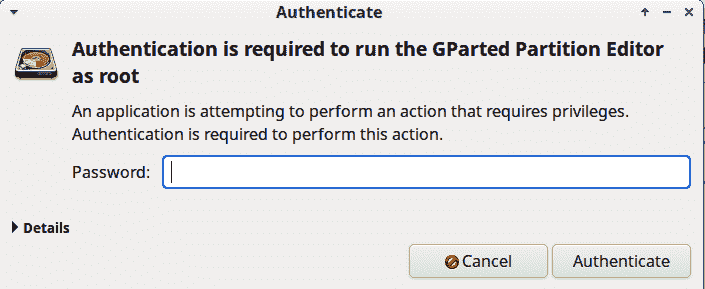

###### 图 9-1. 应用程序启动器要求输入密码

通常将所有存储介质称为“磁盘”，即使是固态介质如 SSD、USB 驱动器、SD（安全数字）、NVMe（非易失性内存表达）和 CompactFlash。GParted 可以管理任何物理连接到您系统的这些磁盘，无论是内部还是外部。

如果您对分区和管理文件系统的基础不熟悉，第八章的介绍提供了详细的概述。

# 小心！

在尝试本章中的任何操作之前，请确保有当前的备份，并非常确定你正在操作正确的磁盘和分区。

创建新的分区表会清除整个磁盘上的所有数据。

删除或损坏分区会丢失该分区上的所有数据。虽然有可能恢复数据，但不保证成功。

USB 闪存驱动器非常适合用于实践和测试。

# 9.1 查看分区、文件系统和空闲空间

## 问题

您希望查看所有连接到系统的磁盘上的所有分区、文件系统和空闲空间。

## 解决方案

启动 GParted，并使用右上角的下拉菜单查看所有已连接的磁盘（图 9-2）。点击“查看” → “设备信息”以打开左侧面板查看磁盘信息，如型号、序列号、大小和分区表类型。

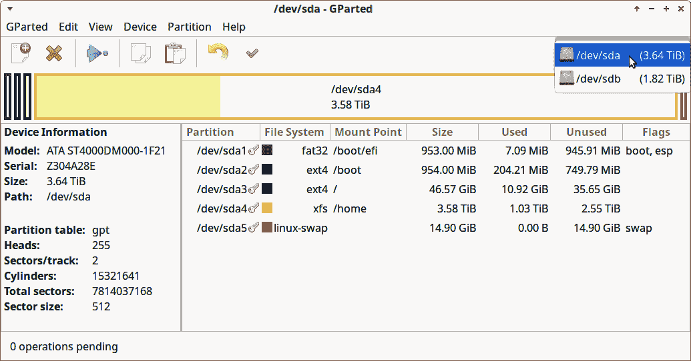

###### 图 9-2\. 在 GParted 上查看磁盘

您将看到大量信息：设备名称、挂载点、文件系统、标签、分区类型和大小、已用空间和总空间以及空闲空间。右键单击任何分区以打开操作菜单，并在菜单底部点击“信息”按钮以查看有关该分区的更多信息（图 9-3）。

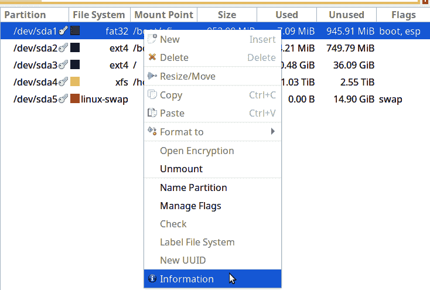

###### 图 9-3\. 在 GParted 上查看分区信息

## 讨论

GParted 在您点击顶部工具栏中的绿色对号之前不会应用更改，因此可以放心探索和浏览。如果您不小心点击了某个命令，请点击对号旁边的小弯曲黄色箭头来撤销。

当您打开右键操作菜单时，一些命令会显示为灰色，因为它们仅适用于未挂载的文件系统。点击“卸载”命令，然后这些命令将变为可用。请注意，任何对运行系统必需的文件系统都无法卸载；在这种情况下，请使用 SystemRescue CD/USB（第十九章）。

## 参见

+   [GNOME Partition Editor](https://gparted.org)

# 9.2 创建新分区表

## 问题

您想要使用新的 GPT 分区表重新格式化磁盘。您现有的分区表是 MS-DOS，您希望用 GPT 替换它，或者这是一个带有旧安装的已用磁盘，您希望用一个干净的磁盘重新开始。

## 解决方案

首先，非常确定您要在哪个磁盘上创建新的分区表，因为这将擦除磁盘上的所有数据。这是 GParted 立即执行的一个操作，在仅有一个警告后，且没有撤销功能，因此请小心操作。

在顶部右侧下拉菜单中选择您的磁盘，然后点击“设备” → “创建分区表”（图 9-4）。

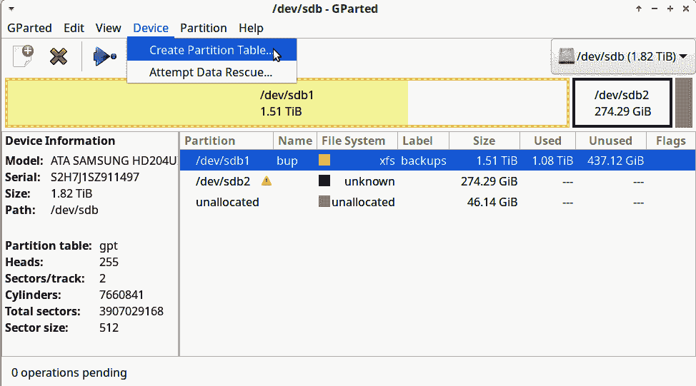

###### 图 9-4\. 创建新分区表

选择 GPT 分区表类型并点击应用（图 9-5）。

这不会花费很长时间，然后您将拥有一个新的、干净的、空白的磁盘，可以准备分区并格式化为新的文件系统。

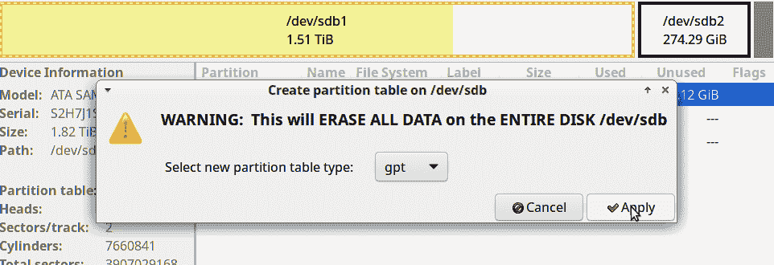

###### 图 9-5\. 选择分区表类型

## 讨论

除非您有使用其他分区表的理由，否则始终创建 GPT 分区表。GParted 支持多种分区表类型，包括 MS-DOS、BSD、Amiga 和 AIX。在 x86 平台上，GPT 和 MS-DOS 最常用。GPT 适用于现代大容量硬盘，比旧的 MS-DOS 分区表更易管理和更具弹性。详细了解分区表，请参阅第八章的介绍。

## 参见

+   [GNOME 分区编辑器](https://gparted.org)

+   第八章

# 9.3 删除分区

## 问题

您需要删除一个或多个分区。

## 解决方案

选择要删除的分区，右键单击以打开操作菜单。如果它上面有挂载的文件系统，您必须先卸载它，方法是点击菜单中的卸载。然后点击删除，点击绿色复选标记，分区就删除了（图 9-6）。

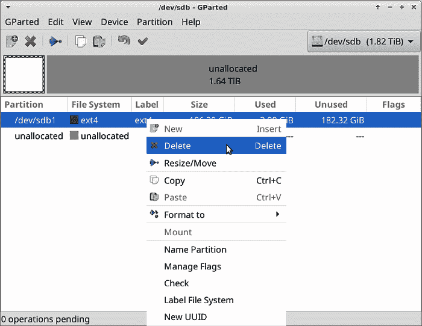

###### 图 9-6\. 删除分区

删除完成后，您将看到状态消息。

## 讨论

删除分区会删除分区内的所有内容，因此如果分区上有文件系统和数据，请务必确定您要删除它。

## 参见

+   [GNOME 分区编辑器](https://gparted.org)

+   配方 8.6

# 9.4 创建新分区

## 问题

您希望创建新分区。

## 解决方案

只需磁盘上有空闲空间。以下示例创建一个新的 400 GB 分区，并使用 Ext4 文件系统格式化它（图 9-7）。

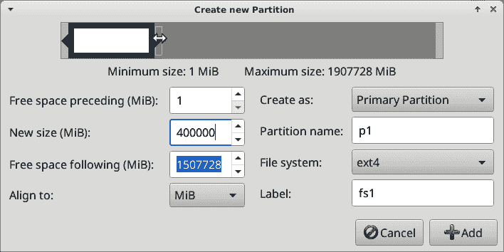

###### 图 9-7\. 创建新分区

点击分区 → 新建在顶部菜单。这将打开一个新窗口，在此窗口中，您输入分区大小，选择文件系统，并创建分区和文件系统标签。使用滑块或“新大小（MiB）”字段设置文件系统大小。新大小字段中的值以 Mibibytes 为单位，因此 400,000 是 400 GiB。然后点击添加，再点击绿色复选标记。

完成后，请参阅第六章，了解如何在新文件系统上设置正确的所有权和权限。

## 讨论

使用 GPT 分区表，您只会创建主文件系统。另外两个选项，逻辑分区和扩展分区，仅适用于 MS-DOS 分区表。如果不确定您的磁盘使用哪种分区表，请点击查看 → 设备信息。这将在左侧打开一个面板，显示关于您的磁盘的信息，包括分区表类型。

在文件系统选择器中，您还可以选择创建一个没有文件系统的空分区。这在最底部，“未格式化”旁边是“清除”，清除现有文件系统并保留分区。

GParted 将创建分区和在其上创建文件系统合并为一个单一且快速的操作。这比只创建分区的 *parted* 更快，后者需要您单独创建文件系统。

## 参见

+   [GNOME 分区编辑器](https://gparted.org)

+   第八章

+   第十一章

# 9.5 删除文件系统而不删除分区

## 问题

您希望删除文件系统而不删除其底层分区，因为您想要使用不同的文件系统格式化分区，或者现有的文件系统损坏，需要重新格式化然后将文件复制回去（图 9-8）。

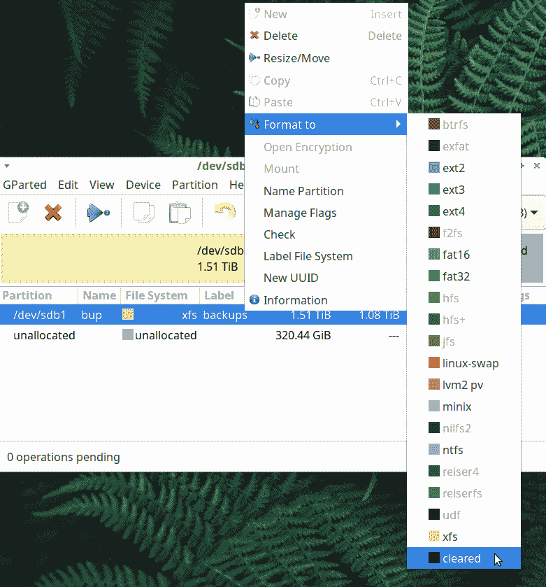

###### 图 9-8\. 删除文件系统而不删除分区

## 解决方案

必须先卸载文件系统。右键单击分区以打开操作菜单，然后点击卸载。完成后，点击格式化为。滚动到列表底部，点击清除。这将删除文件系统但不会删除分区。

## 参见

+   [GNOME 分区编辑器](https://gparted.org)

# 9.6 恢复已删除的分区

## 问题

您删除了一个分区，现在希望还原它。

## 解决方案

如果意外删除了一个新的空分区，请不要试图恢复它，只需重新创建。如果您的分区上有文件系统和数据，则最好立即尝试恢复。点击删除 → 尝试数据救援。

这可能需要很长时间，且无法保证成功。*parted* 似乎更快完成此操作；参见 Recipe 8.7。

## 讨论

通常更快地创建一个新分区和文件系统，然后从备份中替换文件。但首先尝试恢复也无妨。

## 参见

+   [GNOME 分区编辑器](https://gparted.org)

+   Recipe 8.7

# 9.7 调整分区大小

## 问题

您希望调整分区的大小。

## 解决方案

使用 GParted，这只需几次点击即可完成。调整分区大小时，必须同时调整其上的文件系统大小。GParted 可以一次完成这一操作。

要扩大分区，必须在其末尾有空闲空间。Ext4、Btrfs 和 XFS 可以在线扩展。FAT16/32 必须先卸载。

# 始终要备份！

记住，始终要有当前的备份！

图 9-9 显示一个有足够的空闲空间可以扩展的 FAT32 文件系统。

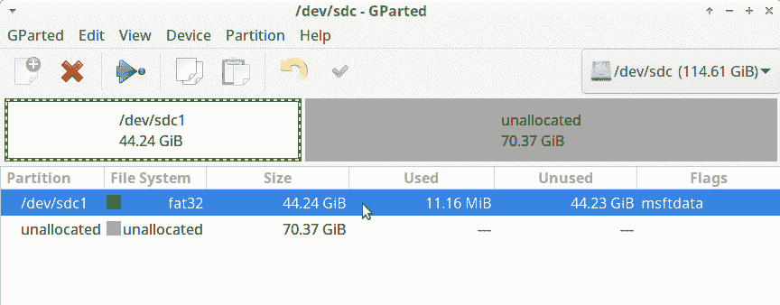

###### 图 9-9\. 选择要调整大小的分区

右键单击所选分区以打开菜单，然后点击调整/移动。这将打开一个对话框，在“新大小”字段中设置新大小，可以通过拖动滑块或输入值（以 Mibibytes 为单位）进行设置（图 9-10）。

单击调整大小/移动，然后单击绿色复选标记。扩展分区只需一两分钟，完成时会显示状态消息。

用于缩小分区的过程相同，但不需要任何结束时的空闲空间。您的新分区大小应至少比文件使用的空间大 10%。即使您不打算向此文件系统添加任何新文件，也必须保留一定量的未使用容量，因为如果文件系统完全填满，您可能无法访问它。缩小分区比扩展分区需要更长的时间。

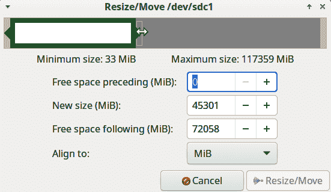

###### 图 9-10\. 配置新分区大小

## 讨论

Ext4 文件系统为根用户保留了一小部分空间。如果文件系统填满了，那么根用户仍然可以访问文件系统并删除文件。FAT16/32、Btrfs 和 XFS 没有预留块。

Ext4 和 Btrfs 可以在线收缩。XFS 只能扩展，不能收缩。在调整大小之前卸载它们是更安全的。

## 参见

+   [GNOME 分区编辑器](https://gparted.org)

+   食谱 8.8

+   食谱 8.9

# 9.8 移动分区

## 问题

您在分区之间有一些空闲空间，例如在 */dev/sda1* 和 */dev/sda2* 之间。您希望将 */dev/sda2* 移入空闲空间中，以便它们之间没有间隙。或者，您希望扩展 */dev/sda1*，但其后没有空闲空间，因此您必须移动 */dev/sda2* 以腾出空间。

## 解决方案

右键单击要移动的分区以打开操作菜单，然后单击调整大小/移动（图 9-11）。

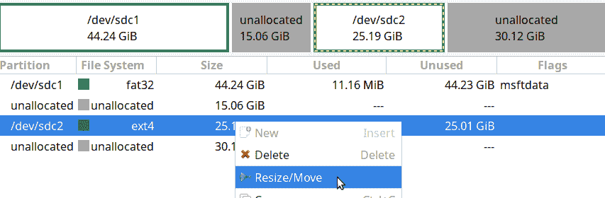

###### 图 9-11\. 选择分区

在调整大小/移动对话框中，您可以向左拖动滑块，或在“前置空闲空间（MiB）”字段中输入 0。然后单击调整大小/移动（图 9-12）。

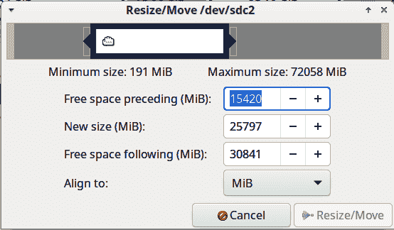

###### 图 9-12\. 移动分区

这将需要一些时间，取决于分区上有多少数据，可能需要几个小时。

## 讨论

移动分区比调整分区更复杂。调整分区时，仅移动其端点，但移动分区还需要更改其起始点，这对操作系统而言是一个重大变化。GParted 通常可以可靠地处理此操作，但是存在风险，因此始终要有良好的备份。

## 参见

+   [GNOME 分区编辑器](https://gparted.org)

+   第 19 章

# 9.9 复制分区

## 问题

您想克隆分区或几个分区，作为备份或将数据移动到新硬盘。

## 解决方案

使用 GParted 的复制命令。例如，您希望将 */dev/sdb2* 复制到连接到系统的 USB 硬盘驱动器中。将其复制到与要复制的分区大小相等或更大的空闲空间。

右键单击要复制的分区（参见 图 9-13）。如果已挂载，请先卸载，然后点击复制。

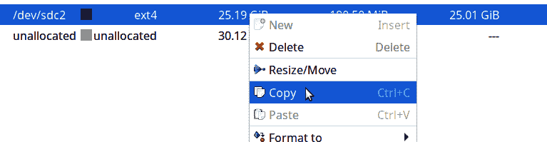

###### 图 9-13\. 复制分区

切换到要复制到的磁盘，并点击粘贴。这将打开配置对话框，提供增加大小和更改新分区位置的选项（参见 图 9-14）。当设置满意后，点击粘贴。

最后一步是点击绿色复选标记开始复制。如果改变主意，点击撤销。复制操作将根据需要复制的数据量而耗费一些时间。

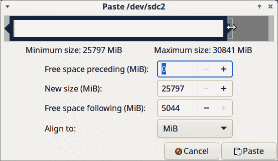

###### 图 9-14\. 新分区的设置

## 讨论

复制的分区必须放入大小相等或更大的新分区中。将分区复制到空闲空间可以省去创建目标分区的麻烦。

根据我的经验，复制分区的实用性有限。分区和文件系统的 UUID 保持不变，因此您无法在与原始系统相同的系统上使用复制的分区而不更改 UUID。 （您可以在 GParted 的右键操作菜单中更改 UUID。）如果更改 */etc/fstab* 中列出的文件系统的 UUID，则必须更新它们的条目。我认为，在大多数情况下，最好创建新的分区和文件系统，然后将文件复制到其中。

## 参见

+   [GNOME 分区编辑器](https://gparted.org)

+   第十一章

+   Recipe 11.6

+   第十九章

# 9.10 使用 GParted 管理文件系统

## 问题

您需要一个用于创建新文件系统的良好图形工具。

## 解决方案

使用 GParted 管理分区和文件系统。找到要格式化为新文件系统的分区，右键单击，选择要使用的文件系统（参见 图 9-15）。

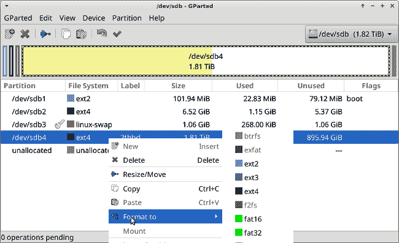

###### 图 9-15\. GParted 显示文件系统类型

点击工具栏中的绿色复选标记来创建新文件系统。创建新文件系统会销毁现有文件系统上的所有内容，因此请确保您操作的位置正确。

## 讨论

GParted 是任何类别中最好的图形应用程序之一。它是一款良好组织的前端工具，用于管理分区和文件系统，使复杂的任务变得简单和快速。

GParted 显示挂载和未挂载卷的文件系统类型，一次显示一个磁盘（参见 图 9-16）。点击右上角的下拉菜单可以查看其他磁盘。

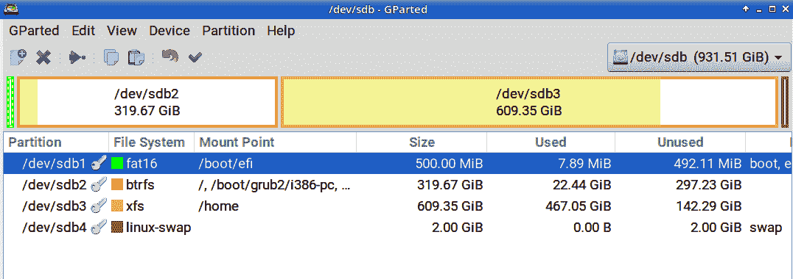

###### 图 9-16\. GParted 显示文件系统类型
