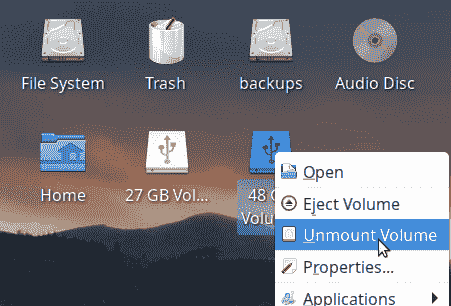
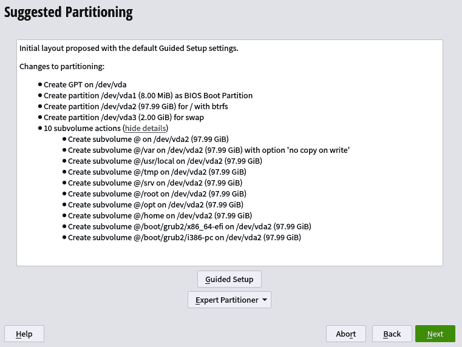
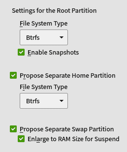
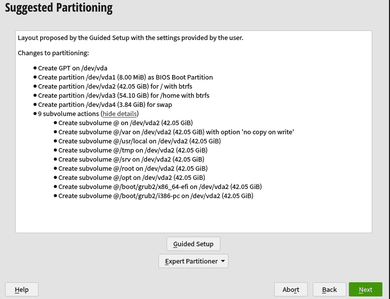

# 第十一章：创建和管理文件系统

Linux 支持许多文件系统，比任何其他操作系统都多。文件系统对计算至关重要，执行了大量的工作。计算机文件系统存储、组织和保护我们的数据，并且由于常年被广泛使用而承受着持续的压力。作为 Linux 用户，我们有幸可以从许多一流的文件系统中进行选择。

本章将介绍用于创建和管理以下通用文件系统的命令行工具，这些文件系统在 Linux 上得到完全支持和良好维护：

+   Ext4，扩展文件系统

+   XFS，X 文件系统；X 只代表 X

+   Btrfs，b 树文件系统，发音为 Butter FS

+   FAT16/32，文件分配表 16 位和 32 位

+   exFAT，扩展文件分配表，Microsoft 最新的 64 位文件系统

本章不包括 Microsoft 的 NTFS 或 Apple 的 HFS/HFS+/APFS。Linux 对 Microsoft 的 NTFS 有很好的支持，包括读写。要尝试，请搜索*ntfs-3g*（NTFS 第三代）软件包。

对于 Apple 的 HFS/HFS+/APFS 的支持不可靠。要试用，请搜索名称中带有*hfs*或*apfs*的软件包，并确保描述中指定它们是为 Apple 文件系统而设计的。

还有许多特殊用途的文件系统，例如用于 CompactFlash 设备的 UBIFS 和 JFFS2；压缩文件系统 SquashFS，用于分布式计算的 HDFS，CephFS 和 GlusterFS；用于网络文件共享的 NFS 等等。这些内容本身就可以轻松填满一本大书，不在此列出。它们可供自由试用和学习。

# 文件系统概述

在您可以使用任何存储设备（例如硬盘、USB 闪存驱动器或 SD 卡）之前，它必须分区并格式化为文件系统。每个文件系统必须有自己的磁盘分区。一个分区可以覆盖整个磁盘，或者一个磁盘可以分成多个分区。每个分区就像一个独立的磁盘，每个分区可以有不同的文件系统。

在文件系统可以访问之前，必须将其挂载或附加到正在运行的文件系统上。文件系统需要一个*挂载点*，这是为该文件系统创建的目录。这个目录可以放在任何地方，尽管传统的位置是*/mnt*和*/media*。

每个挂载点只能挂载一个文件系统。如果挂载第二个文件系统，则会覆盖第一个文件系统。

一个文件系统可以在系统启动时自动挂载，当您连接可移动媒体时动态挂载，通过命令行手动挂载，或者通过桌面上的按钮或文件管理器点击挂载。大多数 Linux 发行版都很好地处理可移动媒体。插入您的 USB 设备或光盘，Linux 会负责设置挂载点并自动挂载，或者设置您点击按钮进行挂载（参见图 11-1）。



###### 图 11-1。Xfce 桌面上的可移动媒体按钮

Ext4、XFS、Btrfs 和 exFAT 是*64 位*文件系统。这意味着它们支持 64 位块寻址空间，可以支持比 32 位和 16 位文件系统更大的文件和文件系统大小。64 位计算至少自上世纪 70 年代以来就存在于超级计算机上，后来又出现在高端商用机器如 IBM Power 和 Sun Microsystems UltraSPARC 上。

我的第一台 Windows 3.1/DOS 个人电脑是在上世纪 90 年代中期，它是一台 16 位系统。Windows 95 以成为第一个 32 位消费者操作系统而自豪。第一个面向 x86 个人电脑的 64 位文件系统开始出现在 Linux 中，大约是在 2001 年。请参见[Ext4 高级设计](https://oreil.ly/kufyJ)，在 Linux 内核文档中查看漂亮的表格，详细比较 32 位和 64 位文件系统。

64 位文件系统向后兼容 32 位应用程序。这些年来，你不太可能遇到 32 位应用程序，但如果遇到的话，它们可以在现代 Linux 上运行，前提是它提供了必要的包来设置 32 位环境。

Ext4 和 XFS 是*日志*文件系统，而 Btrfs 是*写时复制*（CoW）文件系统。日志和 CoW 可以使你的文件系统在断电或系统崩溃后保持一致的状态。文件系统是复杂且繁忙的，中断会影响不仅仅是你正在操作的文件。中断会导致大量带有未完成任务的文件，而在旧时代，这可能意味着可能会丢失整个文件系统。

*Ext4* 是 Linux 上最广泛使用的文件系统，在大多数 Linux 发行版上都是默认的。它并不令人兴奋。它经过充分测试、有良好的支持，并且在没有剧烈波动的情况下完成它的工作。Ext4 日志记录更改，直到它们被写入磁盘，从而在中断事件中提供数据丢失保护。Ext4 文件系统可以调整大小，无论是变大还是变小。

*XFS* 最初是一个高性能 Unix 64 位文件系统，2001 年移植到 Linux。XFS 是一个快速、高效、可靠的日志文件系统，适用于从小型个人机器到多磁盘数据中心设置的系统。XFS 可以调整大小变大，但不能调整大小变小。

*Btrfs* 是一个先进的写时复制（CoW）文件系统，包含一系列在本章其他文件系统中不存在的功能，包括快照；RAID 0、1 和 10；以及子卷。子卷非常灵活，因为它们允许在单个分区上创建多个文件系统根。CoW 是一种通过高效方式创建快照的方式，其中每个快照只包含与前一个快照的更改。当遇到问题时，你可以回滚到一个较旧的已知良好的快照。Btrfs 可以调整大小，无论是变小还是变大。

*FAT16/32*是微软老旧的 16 位和 32 位文件系统。FAT32 是最通用的文件系统，支持 Microsoft Windows、Apple 的 macOS、Linux、Unix 和 DOS 操作系统。在便携媒体上使用 FAT32 进行最简单的文件共享。它有一个限制，某些用途可能会成为瓶颈，即文件大小最大为 4 GB（在具有 4K 块的介质上）。

*exFAT*是微软最新的 64 位文件系统，是 FAT32 的一个很好的升级。exFAT 是 USB 闪存和 SD 媒体的快速轻量级文件系统，支持比 FAT32 更大的文件和卷大小。维基百科引用了 16 EiB 的最大文件大小和 128 PiB 的最大卷大小。它没有日志或写时复制（CoW）功能。

exFAT 对 Linux 用户来说很麻烦，因为它是一种专利的专有文件系统，直到 2020 年才作为本地文件系统出现在 Linux 上。只有当你想要读取和复制使用 exFAT 格式化的 USB 闪存驱动器或 SDXC 卡到你的 Linux 电脑时，你才需要担心 Linux 的兼容性。例如，你想要在你的数码相机或音频录制设备上使用 exFAT 格式化的 SDXC 卡。

要在 Linux 中使用 exFAT，你有两个选择。一个是使用*exfatprogs*、*exfat-fuse*和*exfat-utils*包，这些在大多数发行版上都可以找到。exFAT FUSE 是在美国之外开发和维护的，因此不受美国专利法的影响。exFAT FUSE 利用了用户空间文件系统（FUSE），允许非特权用户在用户空间运行文件系统。它不如完全集成到内核中的文件系统效率高，但它可以读写 exFAT 文件。一些勇敢的人尝试在共享分区中使用 exFAT FUSE 与 Windows 和 macOS 共享文件。理论上这应该可以工作，尽管有时与特定的 Windows 或 macOS 版本实现 exFAT 的程度有关可能会出现一些小问题。

另一个选择是稍等片刻以获得本地支持。微软在 2006 年发布了 exFAT，并主要授权给制造嵌入式系统和嵌入式媒体的公司。但时过境迁。微软已成为开源贡献者，并成为[开放发明网络（OIN）](https://oreil.ly/AJepb)的成员。微软在 2019 年发布了 exFAT 规范。通过发布规范，绕过了现有 exFAT 代码的许可问题，Linux 内核开发人员迅速编写了新代码。这种全新闪亮的代码在 Linux 内核 5.7 中实现了对 exFAT 的本地支持。这应该很快出现在你喜爱的发行版中；运行*uname -r*查看你的内核版本。

# 11.1 列出支持的文件系统

## 问题

你需要知道你的 Linux 系统上安装了哪些文件系统。

## 解决方案

阅读*/proc/filesystems*以查看已安装的文件系统列表：

```
$ cat /proc/filesystems
nodev   sysfs
nodev   tmpfs
nodev   bdev
nodev   proc
nodev   cgroup
nodev   cgroup2
nodev   cpuset
nodev   devtmpfs
nodev   debugfs
nodev   tracefs
nodev   securityfs
nodev   sockfs
nodev   bpf
nodev   pipefs
nodev   ramfs
nodev   hugetlbfs
nodev   devpts
        ext3
        ext2
        ext4
nodev   autofs
nodev   mqueue
nodev   pstore
        btrfs
        vfat
        xfs
        fuseblk
nodev   fuse
nodev   fusectl
        jfs
        nilfs2
```

## 讨论

看到所有这些*nodev*条目了吗？这些都是只存在于内存中并且未连接到像*/dev/sda1*这样的物理设备的虚拟文件系统。Systemd 管理所有这些虚拟文件系统。

其他文件系统，如 Ext4、XFS 等，是我们在存储设备上用来存储、组织和保护数据的文件系统。

## 参见

+   [“sysfs，用于导出内核对象的文件系统”](https://oreil.ly/QCMN7) 是为开发者编写的，但对 Linux 用户和管理员也有有用的信息。

# 11.2 辨识现有文件系统

## 问题

你不知道系统上已有哪些文件系统，或者可移动存储磁盘上有哪些，需要知道如何列出它们。

## 解决方案

使用 *lsblk* 命令。你可以仅列出设备名称和文件系统，使用 *NAME* 和 *FSTYPE* 选项：

```
$ lsblk -o NAME,FSTYPE
NAME   FSTYPE
sda
├─sda1 vfat
├─sda2 btrfs
├─sda3 xfs
└─sda4 swap
sdb
├─sdb1 ext2
├─sdb2 ext4
├─sdb3 swap
└─sdb4 LVM2_member
sdc
└─sdc1 vfat
sr0
```

查询单个磁盘：

```
$ lsblk -o NAME,FSTYPE /dev/sdb
├─sdb1 ext2
├─sdb2 ext4
├─sdb3 swap
└─sdb4 LVM2_member

```

或单个分区：

```
$ lsblk -o NAME,FSTYPE /dev/sda1
NAME FSTYPE
sda1 vfat
```

这是我喜欢的 *lsblk* 咒语。它显示所有设备名称、文件系统类型、文件系统大小、使用百分比、标签和挂载点：

```
$ lsblk -o NAME,FSTYPE,LABEL,FSSIZE,FSUSE%,MOUNTPOINT
NAME   FSTYPE   LABEL     FSSIZE FSUSE% MOUNTPOINT
loop0  squashfs           646.5M   100% /run/archiso/sfs/airootfs
sda
├─sda1
└─sda2 ntfs
sdb
├─sdb1 vfat     BOOT
├─sdb2 btrfs    root
├─sdb3 xfs      home
└─sdb4 swap
sdc    iso9660  RESCUE800
└─sdc1 iso9660  RESCUE800   708M   100% /run/archiso/bootmnt
sr0
```

## 讨论

运行 *lsblk --help* 可以看到列出的信息，如 PATH、LABEL、UUID、HOTPLUG、MODEL、SERIAL 和 SIZE。

在某些发行版上，可能需要 root 权限来查看文件系统类型、UUID 和标签。

*lsblk* 总是打印 *vfat* 作为 FAT16 和 FAT32 文件系统。使用 GParted 或 *parted* 查看文件系统是 FAT16 还是 FAT32。

*vfat* 是虚拟 FAT，内核的 FAT16 和 FAT32 文件系统驱动程序。

## 参见

+   [Linux 内核 SCSI 接口指南](https://oreil.ly/beFOx)

+   [块设备和字符设备的主次编号](https://oreil.ly/NW2S7)

+   *man 8 lsblk*

+   *man 8 parted*

+   第八章

+   第九章

# 11.3 调整文件系统大小

## 问题

你想要扩大或缩小文件系统的大小。

## 解决方案

每种文件系统都有其自己的调整大小命令。查看配方 8.8、8.9 和 9.7 了解调整文件系统大小的方法。

## 讨论

文件系统的分区也必须调整大小以匹配。GParted 在一个操作中完成此操作（参见 配方 9.7）。

配方 8.8 和 8.9 使用 *parted* 和文件系统工具来分两步调整文件系统及其分区大小。

## 参见

+   配方 8.8

+   配方 8.9

+   配方 9.7

+   *man 8 resize2fs*

+   *man 8 parted*

+   *man 8 xfs_growfs*

+   *man 8 btrfs*

+   *man 8 fsck.vfat*

# 11.4 删除文件系统

## 问题

你需要删除一个文件系统及其底层分区。

## 解决方案

要删除文件系统及其分区，使用 *parted*。在此示例中，*/dev/sdb1* 被删除。确认要删除哪个分区和文件系统，然后确保文件系统已卸载。在示例中，挂载点是 */media/duchess/stuff*：

```
$ lsblk -f
sda
├─sdb1 ext4   /media/duchess/stuff
[...]
$ umount /media/duchess/stuff

```

然后使用 *parted* 删除分区：

```
$ sudo parted /dev/sdb
GNU Parted 3.2
Using /dev/sdb
Welcome to GNU Parted! Type 'help' to view a list of commands.
(parted) print 
Model: ATA SAMSUNG HD204UI (scsi)
Disk /dev/sdb: 2000GB
Sector size (logical/physical): 512B/512B
Partition Table: gpt
Disk Flags:

Number  Start   End     Size    File system  Name  Flags
 1      1049kB  1656GB  1656GB  ext4          stor-1
 1      1656GB  2656GB  1000GB  ext4          stor-2
(parted) rm 1

```

如果你偏爱图形工具，可以使用 GParted（第九章）。

## 讨论

是的，命令是*umount*，而不是*unmount*。*umount*来自古老的 Unix 时代，那时标识符的长度限制为六个字符。

删除分区中的所有文件并不会删除文件系统。文件系统结构仍然存在。

## 参见

+   *man 1 dd*

# 11.5 使用新的文件系统

## 问题

您刚刚创建了一个漂亮的新文件系统，并且需要挂载它。

## 解决方案

创建完新文件系统后，您必须创建一个挂载点，并可选择配置自动挂载。如本章介绍的那样，新文件系统必须挂载或附加到正在运行的文件系统才能使用。

Ext4、XFS 和 Btrfs 都有访问控制。如果您希望这些文件系统上的文件对除 root 用户之外的任何人可用，则必须调整所有权和权限。FAT16/32 和 exFAT 没有访问控制，对任何人都是开放的。

首先挂载您的新文件系统。创建一个挂载点，即一个目录，然后像这个疯狂麦克斯的示例一样挂载文件系统：

```
$ sudo mkdir -p */mnt/madmax/newfs*
$ sudo mount */dev/sdb1 /mnt/madmax/newfs* 

```

以下示例将新文件系统的所有权设置为疯狂麦克斯，读写执行权限，组和全局只读权限：

```
$ sudo chown -R *madmax:madmax /mnt/madmax/newfs*
$ sudo chmod -R 0755 */mnt/madmax/newfs*

```

现在，疯狂麦克斯可以访问新的文件系统。这种挂载仅持续到下次系统重启；请参阅配方 11.6 以了解如何配置自动文件系统挂载。

# 仅一个挂载点对应一个文件系统

每个文件系统都需要有自己独特的挂载点；您不能在单个挂载点上放置多个文件系统。

## 讨论

请参阅第六章以获取有关管理所有权和权限的详细配方。

包含挂载点的传统目录为*/mnt*和*/media*。*/mnt*传统上用于静态挂载（在*/etc/fstab*中配置），*/media*用于自动挂载可移动介质。您可以在任何地方创建自己的挂载点。使用传统目录的好处是在有限数量的可预测位置拥有您的挂载点。

一个共享目录，为多个用户提供挂载点，可能如下所示，每个用户有一个目录：

```
$ tree /shared
/shared
├── duchess
├── madmax
└── stash

```

然后，每个文件系统都需要在用户子目录中拥有自己的挂载点。例如，疯狂麦克斯在*madmax1*和*madmax2*上分别挂载了两个文件系统：

```
$ tree -L 2 /mnt
/mnt
├── duchess
├── madmax
│   ├── madmax1
│   └── madmax2
└── stash

```

挂载点可以有任何您想要的名称。例如，疯狂麦克斯的挂载点可以是*fs1*和*fs2*，或者*fred*和*ethel*，或者*max1*和*max2*，任何有助于您记住它们的名称。

使用*stat*命令查看文件系统的权限，例如疯狂麦克斯的新文件系统的示例：

```
$ stat /shared/madmax/madmax1
[...]
Access: (0755/drwxr-xr-x) Uid: ( 0/ madmax) Gid: ( 0/ madmax)

```

使用*mount*列出所有文件系统挂载：

```
$ mount
sysfs on /sys type sysfs (rw,nosuid,nodev,noexec,relatime)
proc on /proc type proc (rw,nosuid,nodev,noexec,relatime)
udev on /dev type devtmpfs
[...]
```

使用*mountpoint*命令来判断一个目录是否为挂载点：

```
$ mountpoint madmax1/
madmax1/ is a mountpoint
```

## 参见

+   *man 1 chown*

+   *man 1 chmod*

+   *man 1 stat*

# 11.6 创建自动文件系统挂载

## 问题

您已经添加了一个新的文件系统，并希望在系统启动时自动挂载它。

## 解决方案

这就是*/etc/fstab*文件的用途。以下示例添加到现有的*/etc/fstab*文件中，以在 Recipe 11.5 中创建文件系统的静态挂载，并将在启动时自动挂载：

```
#<file system>    <mount point>        <type>   <options>       <dump>  <pass>
LABEL=xfs-ehd     /mnt/madmax/newfs    xfs      defaults,user   0       2
```

使用*findmnt*命令测试您的新配置：

```
$ sudo findmnt --verbose --verify 
/
   [ ] target exists
   [ ] UUID=102a6fce-8985-4896-a5f9-e5980cb21fdb translated to /dev/sda2
   [ ] source /dev/sda2 exists
   [ ] FS type is btrfs
   [W] recommended root FS passno is 1 (current is 0)
/mnt/madmax/newfs
   [ ] target exists
   [ ] LABEL=xfs-ehd translated to /dev/sdb1
   [ ] source /dev/sdb1 exists
   [ ] FS type is xfs
[...]
0 parse errors, 0 errors, 1 warning
```

警告“推荐的根文件系统 passno 为 1（当前为 0）”不重要。如果这是唯一的警告，并且没有错误，请重新启动以进行测试，或者运行以下命令以挂载您的新*/etc/fstab*条目：

```
$ sudo mount -a
```

## 讨论

这是六个*fstab*列的用途：

设备

UUID 或文件系统标签。不要使用*/dev*名称，因为它们不唯一，有时会更改。运行*lsblk -o UUID,LABEL*以列出要在*device:*列中使用的 UUID 和文件系统标签。

mountpoint

您为文件系统创建的目录。

类型

文件系统类型，例如*xfs*、*ext4*或*btrfs*。您可以使用*auto*作为文件系统类型，内核将自动检测文件系统类型。

选项

您的挂载选项以逗号分隔的列表（请参阅下文的列表）。

dump

如果您正在使用*dump*命令进行备份，这告诉*dump*备份间隔，单位为天。因此，1 表示每天，2 表示隔天，3 表示每三天，依此类推。您很可能没有使用*dump*，应该输入 0。

pass

这告诉文件系统检查器在启动时首先检查哪个文件系统，如果有必要的话。将根文件系统设置为 1，任何其他 Linux 文件系统设置为 2，非 Linux 文件系统设置为 0。

以下*选项*定义权限：

defaults

默认选项是*rw*, *suid*, *dev*, *exec*, *auto*, *nouser*, 和 *async*。*defaults*的值通过追加额外的选项被覆盖，例如*defaults,user*允许用户有权挂载和卸载文件系统。您可以追加尽可能多的选项，或省略*defaults*并仅列出您想要的选项。

rw

读/写。

ro

只读。

suid

允许设置 uid 和 gid 位操作。

dev

解释块和字符设备。

exec

允许运行二进制文件。

auto

指示哪些文件系统应在启动时启动。

nouser

非根用户不能挂载或卸载文件系统。

async

异步 I/O，这是 Linux 的标准设置。

user

非根用户可以挂载和卸载设备，如果他们已经挂载了它。

users

任何用户都可以挂载和卸载设备。

noauto

不自动在启动时挂载。

ro

将文件系统挂载为只读。

noatime

不更新“访问时间”的文件属性。在过去，*noatime*用于提高性能。如果您使用的是现代计算机，可能不会有太大差异。

gid

限制对组的访问（从*/etc/group*）；例如，*gid=group1*。

## 参见

+   *man 8 mount*

+   *man 5 fstab*

+   [systemd](https://systemd.io)

# 11.7 创建 Ext4 文件系统

## 问题

您想在内部或外部存储磁盘上创建一个新的 Ext4 文件系统。

## 解决方案

从您想要的文件系统大小开始分区。然后使用 *mkfs.ext4* 命令创建新的 Ext4 文件系统。

下面的示例将使用新的 Ext4 文件系统覆盖现有的 XFS 文件系统。当覆盖现有文件系统时，必须首先卸载它。在此示例中，*/dev/sdb1* 上的文件系统挂载在*/media/duchess/stuff*，您可以使用 *df* 命令查看：

```
$ df -Th /media/duchess/stuff/
Filesystem     Type  Size  Used Avail Use% Mounted on
/dev/sdb1      xfs   952M  7.9M  944M   1% /media/duchess/stuff
```

您可能需要 root 权限来卸载：

```
$ sudo umount /media/duchess/stuff
```

创建新的 Ext4 文件系统：

```
$ sudo mkfs.ext4 -L *'mylabel' /dev/sdb1*
mke2fs 1.44.1 (24-Mar-2018)
/dev/sdb1 contains a XFS file system labelled 'stuff'
        created on Sun Sep 20 19:37:43 2020
Proceed anyway? (y,N) y
Creating filesystem with 466432 4k blocks and 116640 inodes
Filesystem UUID: 99da2e5d-f96a-4fb6-990d-599cf56247a2
Superblock backups stored on blocks:
        32768, 98304, 163840, 229376, 294912

Allocating group tables: done
Writing inode tables: done
Creating journal (8192 blocks): done
Writing superblocks and filesystem accounting information: done

```

您还可以创建一个新的分区，并在其中放置新的文件系统；请参阅配方 8.4 和 9.4 中创建新分区的示例。

## 讨论

覆盖文件系统会销毁其中的所有数据。

*-L* 选项用于创建卷标。这可以是您想要的任何内容，最多 16 个字符（FAT32 限制为 11 个字符）。虽然文件系统标签很有用，并且在某些操作中（如*/etc/fstab*中），可以替代长 UUID 使用。

*-n* 选项执行干运行，因此您可以查看实际创建新文件系统时会发生什么。

*mke2fs* 有很多选项，但您可能只会使用其中几个：设备名称、卷标、干运行以及创建外部日志。其默认设置在*/etc/mke2fs.conf*中，建议在彻底研究可用设置之前不要更改它们。

## 参见

+   *man 8 mke2fs*

+   配方 8.4

+   配方 11.5

# 11.8 配置 Ext4 日志模式

## 问题

您知道 ext4 的默认日志模式是 *data=ordered*，它不记录数据，只记录元数据。这是安全性和速度之间的良好平衡，但您希望将其设置为 *data=journal*，这是最安全的选项。

## 解决方案

使用 *tune2fs* 命令。首先使用 *dmesg* 检查您的现有日志模式。文件系统必须被挂载：

```
$ dmesg | grep sdb1
[25023.525279] EXT4-fs (sdb1): mounted filesystem with ordered data mode.

```

这证实了*/dev/sdb1* 格式化为 Ext4，并具有默认的 *data=ordered* 日志模式。现在将其更改为 *data=journal* 模式：

```
$ sudo tune2fs -o journal_data /dev/sdb1
tune2fs 1.44.1 (24-Mar-2018)

```

卸载并重新挂载，然后使用 *dmesg* 再次检查：

```
$ dmesg | grep sdb1
[25023.525279] EXT4-fs (sdb1): mounted filesystem with ordered data mode.

```

如果您看到像这样的多行冲突信息：

```
[  206.076123] EXT4-fs (sdb1): mounted filesystem with journalled data mode.
[  206.076433] EXT4-fs (sdb1): mounted filesystem with ordered data mode.
```

重新启动，然后您应该只看到“以日志数据模式挂载的文件系统”行。

## 讨论

不同文档中命名不同的日志模式命令选项。在 *man 8 tune2fs* 中列出了以下选项：

+   journal_data

+   journal_data_ordered

+   journal_data_writeback

在内核文档中，以及大量的 how-to 中，这些是选项：

+   data=journal

+   data=ordered

+   data=writeback

*data=* 选项应该在启动时传递给内核，要么在您的引导程序配置中，要么在*/etc/fstab*中。我倾向于使用 *tune2fs*，因为它快速简便，并且适用于所有 Ext4 文件系统，无论它们的挂载配置如何。

这些是按数据安全性顺序排列的日志模式：

data=journal

为您的数据提供最大的保护。所有数据和元数据首先写入日志，然后写入文件系统。在发生故障时，这为您提供了恢复数据的最佳机会。这也是资源消耗最大的，因为您的更改会被写入两次。

data=ordered

这不会将您的数据写入日志。数据首先写入文件系统，然后元数据写入日志。元数据逻辑上按顺序组合在单个事务中。当元数据写入磁盘时，其关联的数据块首先被写入。

data=writeback

这是最快但最不安全的方法。数据首先写入文件系统，然后元数据写入日志。不保留数据顺序。我认为这种小的性能增益不值得额外的风险。

## 参见

+   *man 8 tune2fs*

+   [Ext4 文件系统的内核文档](https://oreil.ly/Y4ajq)

# 11.9 查找您的 Ext4 文件系统附加到哪个日志

## 问题

您有几个 Ext4 文件系统，其中一些具有内部日志，一些具有外部日志，您想知道它们使用的是哪些日志。

## 解决方案

遇到一个新命令，*dumpe2fs*。这是 ext2/3/4 工具集*e2fsprogs*的一部分。查询您的 Ext4 文件系统：

```
$ sudo dumpe2fs -h /dev/sda1 | grep -i uuid
dumpe2fs 1.43.8 (1-Jan-2018)
Filesystem UUID:          8593f3b7-4b7b-4da7-bf4a-cc6b0551cff8
Journal UUID:             f8e42703-94eb-49af-a94c-966e5b40e756

```

*Journal UUID*属于日志。运行*lsblk*来验证详细信息：

```
$ lsblk -f | grep  f8e42703-94eb-49af-a94c-966e5b40e756
└─sdb5 ext4    journal1 f8e42703-94eb-49af-a94c-966e5b40e756

```

就是这样。使用内部日志的 Ext4 文件系统如下所示，没有 Journal UUID 行：

```
$ sudo dumpe2fs -h /dev/sda2 | grep UUID
dumpe2fs 1.44.1 (24-Mar-2018)
Filesystem UUID:          64bfb5a8-0ef6-418a-bb44-6c389514ecfc

```

## 讨论

在 Linux 中总是有一种方法可以找出事物的位置。*dumpe2fs*命令显示有关您的 Ext4 文件系统的大量有用信息，包括 UUID、文件系统创建时间、块计数、空闲块、日志大小等等。

## 参见

+   *man 8 dumpe2fs*

# 11.10 使用 Ext4 的外部日志来提高性能

## 问题

您听说将 Ext4 日志放在不同的磁盘上比文件系统可以提高性能，并且您想要这样做。

## 解决方案

当您的日志模式是*data=journal*时，外部日志会提高性能。（有关日志模式的更多信息，请参见讨论。）您可以创建新的 Ext4 文件系统和外部日志，或者将现有文件系统转换为使用外部日志。

两个磁盘必须在同一台机器上，并且具有相似的读写速度。如果日志磁盘比文件系统磁盘慢，您将看不到多少性能提升，如果有的话。您可以使用两个类似的固态硬盘(SSD)，两个类似的机械硬盘(HDD)，或者将小型 SSD 用作日志和大型 HDD 用作文件系统，因为 SSD 比 HDD 快得多。

将 Ext4 日志定位在单独的磁盘上需要几个步骤。在以下示例中，我们将创建两个新分区，一个用于日志，一个用于新的 Ext4 文件系统。然后创建日志，然后文件系统，并将其连接到日志。

第一个分区用于*/dev/sdb5*上的日志，大小为 200 GB，第二个分区用于*/dev/sda1*上的 Ext4 文件系统，大小为 500 GB：

```
$ sudo parted
(parted) select /dev/sdb
Using /dev/sdb
(parted) mkpart "journal1" ext4 1600GB 1800GB
(parted) select /dev/sda
Using /dev/sda
(parted) mkpart "ext4fs" ext4 1MB 500GB

```

外部日志和文件系统必须具有相同的块大小，在以下示例中指定为*-b 4096*。如果您不知道块大小，请使用*tune2fs*找到它。以下命令在 Bash shell 中运行，而不是*parted* shell 中运行：

```
$ sudo tune2fs -l /dev/sda1  | grep -i 'block size'
Block size:               4096
```

现在创建日志，可能需要几分钟时间，然后创建新文件系统：

```
$ sudo mke2fs -b 4096 -O journal_dev /dev/sdb5
mke2fs 1.43.8 (1-Jan-2018)
/dev/sdb2 contains a ext4 file system labelled 'ext4'
        created on Mon Jan  4 18:25:30 2021
Proceed anyway? (y,N) y
Creating filesystem with 48747520 4k blocks and 0 inodes
Filesystem UUID: f8e42703-94eb-49af-a94c-966e5b40e756
Superblock backups stored on blocks:
Zeroing journal device:

$ sudo mkfs.ext4 -b 4096 -J device=/dev/sdb5 /dev/sda1
mke2fs 1.43.8 (1-Jan-2018)
Creating filesystem with 35253504 4k blocks and 8814592 inodes
Filesystem UUID: 8593f3b7-4b7b-4da7-bf4a-cc6b0551cff8
Superblock backups stored on blocks:
        32768, 98304, 163840, 229376, 294912, 819200, 884736, 1605632, 2654208,
        4096000, 7962624, 11239424, 20480000, 23887872

Allocating group tables: done
Writing inode tables: done
Adding journal to device /dev/sdb2: done
Writing superblocks and filesystem accounting information: done

```

您已经完成并可以使用您的新文件系统。

您可以使用*tune2fs*命令将外部日志附加到现有文件系统。首先清除现有文件系统上的日志，然后将文件系统链接到外部日志：

```
$ sudo tune2fs -O ^has_journal /dev/sda1
$ sudo tune2fs -b 4096 -J device=/dev/sdb5 /dev/sda1

```

## 讨论

在磁盘或系统故障时，Ext4 日志通过跟踪尚未写入磁盘的更改来为您的数据提供额外保护。即使它丢失了您最近的更改，它也保护文件系统免受损坏，这样您只会失去一点而不是全部内容。

将日志移动到同一台机器上的单独磁盘可以显著提升性能，当日志模式为*data=journal*时尤为明显。Ext4 有三种日志模式：*journal*、*ordered*和*writeback*。默认是*ordered*。参见 Recipe 11.8 了解这些模式及如何选择您想要使用的模式。

插入符号*^*禁用一个功能。在本配方示例中，它清除现有的内部日志。

Ext4 日志不能共享，并且只能被一个文件系统使用。

## 参见

+   *man 8 mke2fs*

+   *man 8 tune2fs*

+   第八章

+   第九章

# 11.11 在 Ext4 文件系统上释放保留块的空间

## 问题

大多数 Linux 发行版为根用户和系统服务保留了 Ext4 文件系统的 5%。在大型现代硬盘上，这是很多空间，您可能希望释放其中的一些空间。

## 解决方案

使用*tune2fs*命令调整 Ext4 文件系统上空闲空间的大小。您可以按百分比进行配置，例如以下示例将其减少到 1%：

```
$ sudo tune2fs -m 1 /dev/sda1
tune2fs 1.44.1 (24-Mar-2018)
Setting reserved blocks percentage to 1% (820474 blocks)

```

这依然是大约 3 GB，使用 4K 块（820,474 x 4,096 = 3,360,661,504 字节）。找到您的块大小：

```
$ sudo tune2fs -l /dev/sda1  | grep -i 'block size'
Block size:               4096
```

您可以设置一个分数百分比：

```
$ sudo tune2fs -m .25 /dev/sda1
tune2fs 1.44.1 (24-Mar-2018)
Setting reserved blocks percentage to 0.25% (205118 blocks)

```

大约是 800 MB。或者，指定一个块数：

```
$ sudo tune2fs -r 250000 /dev/sda1
tune2fs 1.44.1 (24-Mar-2018)
Setting reserved blocks count to 250000

```

250,000 个 4K 块大约是 1 GB。检查您的工作：

```
$ sudo tune2fs -l /dev/sda1 | grep -i 'reserved block'
Reserved block count:     250000

```

## 讨论

如果您的磁盘空间不足，仍可以以 root 用户身份登录并释放空间，如果不保留这 5%，则无法执行此操作。然而，这 5%是从兆字节硬盘时代遗留下来的。现在硬盘如此之大，您不需要所有这些保留空间。例如，1 TB 磁盘的 5%约为 50 GB。只需要几百兆字节的保留空间即可。我将我的设置为 1 GB。这很容易记住并提供足够的空间。

使用*dumpe2fs*命令检查您的 Ext4 文件系统中保留块的设置：

```
$ sudo dumpe2fs -h /dev/sda1
[...]
Block count:              82047488
Reserved block count:     250000
[...]

```

## 参见

+   *man 8 dumpe2fs*

+   *man 8 tune2fs*

# 11.12 创建新的 XFS 文件系统

## 问题

您喜欢 XFS，并且想要创建一个新的 XFS 文件系统。

## 解决方案

您需要在系统上安装 *xfsprogs* 软件包，并为新文件系统创建一个分区。然后使用 *mkfs.xfs* 创建您的新 XFS 文件系统。以下示例在 Ubuntu 上演示了所有这些步骤。示例新分区为 */dev/sda1*，新文件系统标签为 *xfstest*：

```
$ sudo apt install xfsprogs
$ sudo parted /dev/sda mkpart testxfs xfs 1MB 500GB
$ sudo mkfs.xfs -L xfstest /dev/sda1
meta-data=/dev/sdb5              isize=512    agcount=4, agsize=640000 blks
         =                       sectsz=512   attr=2, projid32bit=1
         =                       crc=1        finobt=1, sparse=0, rmapbt=0,
reflink=0
data     =                       bsize=4096   blocks=2560000, imaxpct=25
         =                       sunit=0      swidth=0 blks
naming   =version 2              bsize=4096   ascii-ci=0 ftype=1
log      =internal log           bsize=4096   blocks=2560, version=2
         =                       sectsz=512   sunit=0 blks, lazy-count=1
realtime =none                   extsz=4096   blocks=0, rtextents=0

```

使用 *lsblk* 检查您的工作：

```
$ lsblk -f | grep -w sda1
├─sda1 xfs    xfstest  bb5dddb3-af74-4bed-9d2a-e79589278e84
```

挂载您的新文件系统，调整所有者和权限，它就可以使用了。以下示例将其挂载到 */mnt/xfstest*，将所有权设置为 Duchess，对 Duchess 为读写，对其他人为只读：

```
$ sudo mkdir /mnt/xfstest
$ sudo mount /dev/sda1 /mnt/xfstest 
$ sudo chown -R duchess:duchess /mnt/xfstest
$ sudo chmod -R -755 /mnt/xfstest

```

## 讨论

创建新的 XFS 文件系统的命令输出包含几个有用的项目，如块大小、块数和扇区大小。

## 参见

+   *man 8 mkfs.xfs*

# 11.13 调整 XFS 文件系统大小

## 问题

您想要调整一个 XFS 文件系统的大小。

## 解决方案

您只能增加 XFS 文件系统的大小。如果您需要缩小它，您必须将数据复制到安全位置，创建较小的分区，格式化为 XFS，然后恢复您的数据。

增加大小工作较少。您需要在 XFS 文件系统所在的分区末尾有空闲空间。在以下示例中，分区的新端点为 2700 GB，并且文件系统挂载在 */media/duchess/xfs*。

启动 *parted*。打印分区信息以验证正确的分区和端点，增加分区大小，然后退出 *parted*：

```
$ sudo parted */dev/sdb*
GNU Parted 3.3
Using /dev/sdb
Welcome to GNU Parted! Type 'help' to view a list of commands.
(parted) p free 
Model: ATA SAMSUNG HD204UI (scsi)
Disk /dev/sdb: 4000GB
Sector size (logical/physical): 512B/512B
Partition Table: gpt
Disk Flags:

Number  Start   End     Size    File system  Name   Flags
        17.4kB  1049kB  1031kB  Free Space
 1      1049kB  1656GB  1656GB  xfs          files
 2      1656GB  1759GB  103GB   xfs          files2
        1759GB  4000GB  242GB   Free Space

(parted) resizepart 2
(parted) Warning: Partition /dev/sdb2 is being used. Are you sure you want to
continue?
Yes/No? Yes
End?  [1759GB]? 1900GB
(parted) q

```

现在，扩展文件系统以匹配新的分区大小：

```
$ sudo xfs_growfs /media/duchess/xfs
```

搞定！享受您的新更大文件系统。

## 讨论

您还可以卸载文件系统并离线调整大小。这样做更安全一些。

使用 GParted 调整文件系统大小快速而简便；参见 配方 9.7。

## 参见

+   配方 8.8

+   配方 9.7

# 11.14 创建 exFAT 文件系统

## 问题

您的数码相机闪存驱动器格式化为 exFAT 文件系统，或者您有其他使用 exFAT 的闪存设备，并且您希望在 Linux 系统上读取、写入和编辑这些设备上的文件。

## 解决方案

有两种可能的解决方案：一种是使用在用户空间运行的 exFAT 实现（FUSE）。另一种解决方案是使用在 Linux 内核中而不是用户空间运行的本地实现。在这个配方中，我们将使用 exFAT FUSE，因为在撰写本文时，本地实现尚未包含在大多数发行版中。查看内核版本 5.7，并检查您的发行版发布说明和新闻。 （运行 *uname -r* 命令查看您的内核版本。）

exFAT 包的名称各不相同。*exfat-fuse* 和 *exfat-utils* 是旧版软件包。*exfatprogs* 是最新的实现，替代了 *exfat-fuse* 和 *exfat-utils*。无论您安装了什么版本，请继续安装。

创建新的 exFAT 文件系统的命令对于两者是相同的。以下示例将 */dev/sdc1* 格式化为 exFAT：

```
$ sudo mkfs.exfat /dev/sdc1
mkexfatfs 1.2.8
Creating... done.
Flushing... done.
File system created successfully.
```

exFAT 被设计得很简单，因此选项不多。您可以为其命名标签：

```
$ sudo exfatlabel /dev/sdc2 exfatfs
```

使用 *lsblk* 验证您的更改：

```
$ lsblk -f
NAME   FSTYPE LABEL   UUID
sdc
├─sdc1
├─sdc2 exfat  exfatfs 8178-51D4
└─sdc3 
```

## 讨论

您不需要专门的 exFAT 分区来读取其他设备上的 exFAT 文件，但只需在您的 Linux 系统上安装 exFAT 即可。

如果您更喜欢图形化分区工具，由于法律原因，GParted 不支持 exFAT。GNOME Disks，在大多数 GNOME 实现中称为 Disks，支持 exFAT。您不必安装 GNOME 即可获得 Disks；请查找 *gnome-disk-utility* 软件包。

Microsoft 在 2019 年发布了 exFAT 规范。Samsung 编写了 *exfatprogs* 并在 2020 年初发布了它。当您阅读本文时，最新版本的 Fedora、Ubuntu 和 openSUSE Tumbleweed 应该具有本地的 exFAT 支持。

## 参见

+   *man 8 exfat*

+   *man 8 exfatlabel*

# 11.15 创建 FAT16 和 FAT32 文件系统

## 问题

您需要知道如何创建 FAT16 和 FAT32 文件系统。

## 解决方案

您需要 *dosfstools* 软件包，在大多数 Linux 上默认安装。以下示例演示了使用 *parted* 创建一个新的 500 MB 分区，然后用 FAT32 格式化该分区。

创建新分区，并注意如何将测量单位更改为 MB，以及如何交互地使用 *mkpart*：

```
$ sudo parted /dev/sdb
GNU Parted 3.2
Using /dev/sdb
Welcome to GNU Parted! Type 'help' to view a list of commands.
(parted) print
Model: ATA SAMSUNG HD204UI (scsi)
Disk /dev/sdb: 2000399MB
Sector size (logical/physical): 512B/512B
Partition Table: gpt
Disk Flags:

Number  Start    End     Size    File system  Name   Flags
1       0.00GB   1656GB  1656GB  xfs          files

(parted) unit mb
mkpart 
Partition name?  []?
File system type?  [ext2]? fat32
Start? 1656331MB
End? 1656831MB
(parted) print
Model: ATA SAMSUNG HD204UI (scsi)
Disk /dev/sdb: 2000399MB
Sector size (logical/physical): 512B/512B
Partition Table: gpt
Disk Flags:

Number  Start      End        Size       File system  Name  Flags
 1      1.05MB     1656331MB  1656330MB  xfs          bup
 2      1656331MB  1656831MB  500MB      fat32

(parted) q

```

*分区* 名称是可选的；在本例中为空。现在创建一个漂亮的新 FAT32 文件系统：

```
$ sudo mkfs.fat -F 32 -n fat32test /dev/sdb2
mkfs.fat 4.1 (2017-01-24)
mkfs.fat: warning - lowercase labels might not work properly with DOS or Windows
```

使用 *lsblk* 进行验证：

```
$ lsblk  -f /dev/sdb
NAME   FSTYPE LABEL       UUID                          FSAVAIL FSUSE% MOUNTPOINT
sdb
├─sdb1 xfs    xfstest     1d742b2d-a621-4454-b4d3-469216a6f01e
└─sdb2 vfat   fat32test   AB39-1808

```

## 讨论

如果您想要 FAT16 文件系统，请使用 *-F 16*。

FAT16 文件和文件系统最多支持 4 GB。

FAT32 支持最大 4 GB 的文件大小，最大 16 TB 的分区大小，使用 4 KB 扇区和 64 KB 簇。

## 参见

+   第八章

+   第九章

+   *man 8 mkfs.fat*

# 11.16 创建 Btrfs 文件系统

## 问题

Btrfs 听起来很酷，您想尝试一下。

## 解决方案

这很酷，也很复杂。SUSE Linux Enterprise Server (SLES) 和 openSUSE 是尝试 Btrfs 的最佳 Linux 发行版。SLES 和 openSUSE 是最大的 Btrfs 支持者和开发者，他们为管理 Btrfs 快照创建了优秀的 Snapper 工具。他们还提供了最详尽的文档。在 openSUSE/SLES 上的默认分区设置了 Btrfs 子卷和自动快照。

开始下载最新的 openSUSE Tumbleweed。启动安装程序，在建议分区屏幕时，查看安装程序的第一个建议（Figure 11-2）。



###### 图 11-2\. openSUSE 的首次分区建议

点击“引导设置”以修改此建议。跳过“启用逻辑卷管理（LVM）/启用磁盘加密”屏幕，并停留在文件系统选项屏幕。选择“建议单独的家目录分区”，并将其格式化为 Btrfs。勾选“建议单独的交换分区”的两个框，然后点击“下一步”（见 图 11-3）。



###### 图 11-3\. 创建一个家目录分区

这将带您返回“建议的分区”屏幕。如果您希望调整分区大小，请点击专家分区程序 → 以当前建议开始（见 图 11-4）。否则，请点击“下一步”继续安装。



###### 图 11-4\. 使用当前建议进行自定义分区

当您完成时，您将拥有一个已设置好良好默认值的可用 Btrfs Linux 系统。

## 讨论

手动设置 Btrfs 稍显繁琐，但当你了解它时，你可能会想尝试手动设置它。我喜欢通过一个可工作的实现来学习新事物。对我来说，提供几个 Btrfs 的实用方法是不可能的。Btrfs 如此灵活和强大，它需要一本专门的书籍。多亏了 SUSE 的热心人，它有了自己的书。请参阅启动指南进行安装，以及 [openSUSE 文档](https://oreil.ly/1Vi9L) 中的“系统恢复和快照管理”部分。Snapper + Btrfs 是 Btrfs 管理和快速故障恢复的绝佳组合。

## 参见

+   [openSUSE 启动和参考指南](https://oreil.ly/1Vi9L)

+   在 [SLES 产品手册](https://oreil.ly/fX5G9) 中的部署和管理指南
