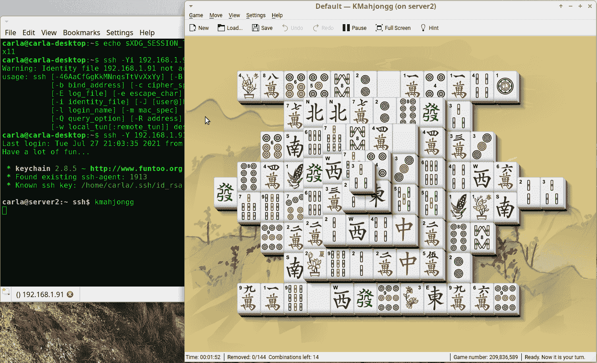
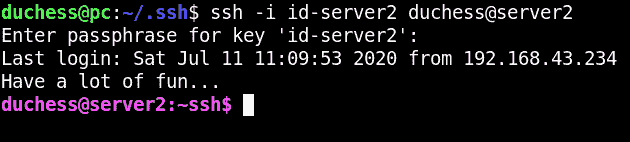

# 第十二章：使用 OpenSSH 进行安全远程访问

OpenSSH 是安全远程管理的首选工具。它在会话期间加密认证和所有流量，并保证数据传输的完整性。如果有什么问题影响了你的数据包，SSH 会告诉你。在本章中，你将学习如何设置 SSH 访问远程主机，管理 SSH 加密密钥，配置登录到多个远程主机，自定义 Bash 提示以显示 SSH 会话等好用的功能。

OpenSSH 支持大量强加密算法。所有这些算法都没有专利限制，因为 OpenSSH 团队已经尽最大努力确保 OpenSSH 内部没有受专利或其他限制的代码。Recipe 12.16 展示了如何打印所有支持算法的列表。

OpenSSH 是一套远程传输实用程序：

+   *sshd*，OpenSSH 服务器守护进程。

+   *ssh*，安全外壳的缩写，虽然它实际上并不包含外壳，但提供了与远程系统上的命令外壳的安全通道。

+   *scp*，加密文件传输的安全副本。

+   *sftp*，安全文件传输协议，提供文件访问。

+   *ssh-copy-id*，一个非常好的小程序，用于将你的公钥安装到远程 SSH 服务器的*authorized_keys*文件中。

+   *ssh-keyscan*，在网络上查找和收集公共主机密钥，免去了手动查找的麻烦。

+   *ssh-keygen*，生成和管理认证密钥。

+   *ssh-add*，将你的身份添加到认证代理*ssh-agent*中。

在本章中，你将了解关于*ssh*、*sshd*、*ssh-copy-id*、*ssh-keygen*以及两个有用的相关实用程序：*sshfs*和*ssh-agent*。

*sshfs*，将远程文件系统挂载到本地 PC 上，而*ssh-agent*则记住了多个 SSH 登录中私有 SSH 密钥的密码。*ssh-agent*绑定到单个登录会话，因此登出或打开另一个终端意味着重新开始。一个更好的用于自动化操作的实用程序是 Keychain，它是*ssh-agent*的前端。Keychain 会重用*ssh-agent*直到你重新启动机器，因此你只需要在启动时输入密码（参见 Recipe 12.10）。

OpenSSH 支持不同类型的身份验证：

密码认证

使用你的 Linux 登录名和密码进行身份验证。这是最简单和最灵活的方式，因为你可以从任何机器登录。但是要注意不要从不可信任的计算机（如图书馆或网吧）打开 SSH 会话，因为如果被键盘记录器感染，它会捕获你的凭据。

公钥认证

使用个人 SSH 公钥进行身份验证，而不是系统登录。这需要更多的设置工作，因为你需要创建和分发你的公钥，并且只能从保存有你私钥的机器上登录。一些商业服务要求客户使用某种形式的公钥认证。

无密码认证

公钥认证无需密码短语。这对于自动化服务如脚本和 cron 作业非常有用。任何成功窃取私钥的人都可以轻松冒充你，因此你需要非常谨慎地保护没有密码短语的私钥。

另一种使用无密码短语的密钥的替代方法是 Keychain，它会为您记住私钥（见 Recipe 12.10）。

认证密钥有两种不同的用途：主机密钥用于认证计算机，公钥用于认证用户。SSH 密钥是成对出现的，私钥和公钥。传输使用公钥加密，私钥解密，这是一个非常简单却精巧的方案。你可以安全地分发你的公钥，而私钥则需要保护，不让任何人获取。

服务器和客户端由事务的方向定义。服务器运行 SSH 守护程序并监听连接请求，客户端是通过 SSH 登录到这台机器的任何人。

# 12.1 安装 OpenSSH 服务器

## 问题

你想要安装一个 OpenSSH 服务器。

## 解决方案

大多数 Linux 发行版默认安装 OpenSSH 客户端，但不总是安装服务器。不同的 Linux 发行版以不同方式打包 OpenSSH，因此请使用你的软件包管理器列出 Linux 的软件包（见附录）。安装服务器后，检查是否已启动：

```
$ systemctl status sshd
● sshd.service - OpenSSH Daemon
   Loaded: loaded (/usr/lib/systemd/system/sshd.service; disabled; vendor preset
   Active: inactive (dead)
   [...]
```

这表明服务器未运行且未启用。在大多数 Linux 上，安装后 OpenSSH 未配置自动启动是件好事，因为在打开接收连接请求之前，你需要正确配置服务器。如果在检查服务器配置之前它已运行，请停止它或使用防火墙阻止其监听端口。

接下来的步骤是设置主机加密密钥并配置你的服务器。参见 12.2 和 12.3。

## 讨论

请记住，服务器和客户端不仅仅是硬件问题，而是由事务的方向定义的。服务器运行 SSH 守护程序并监听连接请求，客户端是通过 SSH 登录到服务器的任何人。任何 Linux PC 都可以是服务器、客户端或两者兼有。

## 参见

+   第十四章

+   [OpenSSH](https://openssh.com)

+   sshd (8)

+   附录

# 12.2 生成新的主机密钥

## 问题

在你的 Linux 发行版安装时未自动创建主机密钥，或者你想替换现有的主机密钥，或者当你克隆一个安装或虚拟机时，克隆需要拥有自己独特的主机密钥。

## 解决方案

使用*ssh-keygen*命令。有四种不同类型的密钥：RSA、DSA、ECDSA 和 ED25519。首先，如果存在旧密钥，请删除：

```
$ sudo rm /etc/ssh/ssh_host*
```

使用以下命令一次性创建所有新密钥：

```
$ sudo ssh-keygen -A
ssh-keygen: generating new host keys: RSA DSA ECDSA ED25519
```

## 讨论

如果您感到无聊并需要做点什么，请尝试研究“我应该使用哪种 SSH 密钥格式？” 论点是无穷无尽的。简短的答案是使用 RSA、ECDSA 和 ED25519，避免使用 DSA。删除您的 DSA 主机密钥并保留其余内容。

RSA 是最古老的。它强大且提供了最广泛的兼容性。

ECDSA 和 ED25519 是更新的，非常强大且计算成本较低。

一些较旧的 SSH 客户端不支持 ECDSA 和 ED25519\. 希望您不使用这样的古老客户端，因为 ECDSA 和 ED25519 是 2014 年 OpenSSH 6.5 发布的。保持安全服务更新并且不允许不安全的旧客户端非常重要。

## 参见

+   [OpenSSH](https://openssh.com)

+   ssh-keygen (1)

# 12.3 配置您的 OpenSSH 服务器

## 问题

您希望尽可能安全地配置您的 OpenSSH 服务器并安全地进行测试。

## 解决方案

首先，请验证您服务器的私有主机密钥是否由 root 拥有，只读：

```
$ ls -l /etc/ssh/
-r-------- 1 root root    227 Jun  4 11:30 ssh_host_ecdsa_key
-r-------- 1 root root    399 Jun  4 11:30 ssh_host_ed25519_key
-r-------- 1 root root   1679 Jun  4 11:30 ssh_host_rsa_key
```

它们应该是这样的。然后检查您的公钥，这些公钥由 root 拥有，对 root 为读写，对其他人为只读：

```
$ ls -l /etc/ssh/
-rw-r--r-- 1 root root    174 Jun  4 11:30 ssh_host_ecdsa_key.pub
-rw-r--r-- 1 root root     94 Jun  4 11:30 ssh_host_ed25519_key.pub
-rw-r--r-- 1 root root    394 Jun  4 11:30 ssh_host_rsa_key.pub
```

这些都是正确的。

现在看一看 */etc/ssh/sshd_config*。当您更改此文件时，请重新加载 *sshd* 以加载您的更改：

```
$ sudo systemctl reload sshd.server
```

取消注释要使用或更改的选项。

配置 *sshd* 以检查用户文件和主目录的文件模式和所有权是否正确，然后才接受其登录：

```
StrictModes yes
```

如果文件权限不正确，此设置将不允许它们登录。

如果您的机器有多个 IP 地址，请定义它监听的地址或地址：

```
ListenAddress *192.168.10.15*
ListenAddress 1*92.168.10.16*
```

您可以为 *sshd* 指定非标准端口进行侦听。仅使用高于 1024 的端口，并检查 */etc/services* 查找未使用的端口，然后将您的新端口添加到 */etc/services* 中：

```
*sshd 2022*
*sshd 2023*
```

然后将它们添加到 */etc/ssh/sshd_config*：

```
Port *2022*
Port *2023*
```

您可以限制访问仅限于指定的组（在 */etc/group* 中创建这些组）：

```
AllowGroups *webadmins backupadmins*
```

或使用 *DenyGroups* 拒绝访问。

不允许 root 登录。作为非特权用户登录然后在登录后使用 *sudo* 更安全：

```
PermitRootLogin no
```

另一种选择是仅允许公钥认证的 root 登录：

```
PermitRootLogin prohibit-password
```

您可以禁用所有用户的密码登录，并仅允许公钥认证（参见 Recipe 12.7）：

```
PasswordAuthentication no
```

您可以拒绝指定的用户，无论是用户名，用户在主机名或 IP 地址：

```
DenyUsers *duchess madmax stash@example.com cagney@192.168.10.25*
```

或允许使用 *AllowUsers*。您可以同时使用 *DenyUsers* 总是首先处理。

限制服务器等待用户登录并完成连接的时间长度。默认为 120 秒：

```
LoginGraceTime 90
```

您可以限制失败的连接尝试次数。默认为 6 次：

```
MaxAuthTries 4
```

## 讨论

任何端口扫描器都会找到你的开放端口，并且攻击者会尝试暴力破解密码。攻击者仍然最频繁地攻击默认的 SSH 端口 22。改变端口不会显著降低这种风险，但它应该会减少日志文件中的条目数。当你使用备用端口号时，首先查看*/etc/services*以找到未使用的端口，然后将你使用的端口记录在该文件中。

公钥认证非常安全，无法像密码登录那样被暴力破解（参见 Recipe 12.7）。但是这样做的代价是不太方便，因为你只能从有你私钥的机器上登录。

## 参见

+   [OpenSSH](https://openssh.com)

+   *man 5 sshd_config*

+   Recipe 12.5

+   Recipe 12.7

# 12.4 检查配置语法

## 问题

每个人都会犯错，你想要一个用于 */etc/ssh/sshd_config* 的语法检查器。

## 解决方案

你应该有一个。在做出更改后，运行以下命令：

```
$ sudo sshd -t
```

如果没有语法错误，它会静默退出。如果发现错误，它会告诉你：

```
$ sudo sshd -t
/etc/ssh/sshd_config: line 9: Bad configuration option: Porotocol
/etc/ssh/sshd_config: terminating, 1 bad configuration options
```

你可以在 SSH 守护进程运行时执行这些操作，因此你可以在发出重新加载或重启命令之前纠正你的错误。

## 讨论

*-t*代表*测试*。它不会影响 SSH 守护进程，只会检查*/etc/ssh/sshd_config*的语法错误，因此你可以随时使用它。

## 参见

+   *man 5 sshd_config*

+   [OpenSSH](https://openssh.com)

# 12.5 设置密码认证

## 问题

你想要设置你的 OpenSSH 客户端，使用它支持的最简单的方法登录远程主机。

## 解决方案

密码认证是设置远程 SSH 访问的最简单方法。你需要：

+   在你想要登录的机器上安装并正确配置了 OpenSSH 服务器（参见 Recipe 12.3）

+   远程机器上运行的 SSH 守护进程，以及端口 22，或者*sshd*使用的任何端口，不受防火墙阻挡

+   客户端机器上安装的 SSH 客户端

+   远程机器上的你自己的用户账户

+   服务器上的主机密钥（参见 Recipe 12.2)

公共主机密钥必须分发给客户端。最简单的方法是从客户端登录，并让 OpenSSH 传输密钥：

```
duchess@pc:~$ ssh *duchess@server1*
  The authenticity of host '*server1 (192.168.43.74)*' can't be established.
  ECDSA key fingerprint is SHA256:8iIg9wwFIzLgwiiQ62WNLF5oOS3SL/aTw6gFrtVJTx8.
  Are you sure you want to continue connecting (yes/no)? *yes*
  Warning: Permanently added '*server1,192.168.43.74*' (ECDSA) to the list of
  known hosts.
  Password: password
  Last login: Wed Jul  8 19:22:39 2021 from *192.168.43.183*
  Have a lot of fun...
```

现在，Duchess 可以在*server1*上工作，就像她坐在*server1*的键盘旁一样。所有的流量和认证都是加密的。

主机密钥交换只会发生一次，第一次登录时。除非密钥被替换为新密钥或从个人的*~/.ssh/known_hosts*文件中删除，否则不应再次询问。

## 讨论

*server1*的公共主机密钥存储在客户端 PC 上的*~/.ssh/known_hosts*文件中。该文件可以包含任意数量的主机密钥。

通过 SSH 以 root 身份登录是不安全的；最好以普通用户身份登录，然后在登录后使用*su*或*sudo*。如果你知道他们的密码，你可以作为任何在远程机器上有账户的用户登录：

```
duchess@pc:~$ ssh *madmax@server1*
```

当你在两台机器上有相同的用户名时，你不需要指定用户，可以像这样登录：

```
duchess@pc:~$ ssh *server1*
```

我习惯于始终指定用户名，以防万一出错。

不要对*client*和*server*太过纠结。这与硬件无关。服务器是您登录的任何机器，客户端是您登录的位置。*sshd*不需要在客户端运行。

有风险主机密钥传输可能被拦截并替换为伪造密钥，这将允许攻击者访问您的系统。您可以在键入**`yes`**之前验证公钥指纹。可以使用老式方法如写下并比较，或新潮方法如用手机拍摄主机密钥进行比较，或使用手机作为实际电话，联系拥有远程机器访问权限的人员读取指纹给您听。

查看配方 12.6 以了解如何检索密钥指纹。

## 另请参阅

+   配方 12.6

+   [OpenSSH](https://openssh.com)

+   *man 1 ssh*

+   *man 1 ssh-keygen*

+   *man 8 sshd*

# 12.6 检索密钥指纹

## 问题

您需要主机密钥的指纹，以便为客户端验证该密钥的合法性。

## 解决方案

在服务器上使用希望查询的主机密钥使用*ssh-keygen*命令：

```
duchess@server1:~$ ssh-keygen -lf /etc/ssh/ssh_host_rsa_key
4096 SHA256:32Pja4+F2+MTdla9cs4ucecThswRQp6a4xZ+5sC+Bf0 *backup server1* (RSA)
```

## 讨论

在这里，像电话和悄悄网这样的老式通信方法非常有用。不要使用电子邮件，除非您已经使用了自己的独立加密和认证的加密电子邮件，因为未加密的电子邮件容易被拦截和阅读。

## 另请参阅

+   [OpenSSH](https://openssh.com)

+   *man 1 ssh-keygen*

# 12.7 使用公钥认证

## 问题

想要使用公钥认证，因为它比密码认证更加安全，而且不使用您的 Linux 密码。您希望能够使用单个公钥访问多个系统，或者为每台远程机器创建一个唯一的公钥。

## 解决方案

是的，Linux 用户，您可以拥有一切。您可以创建任意数量的 SSH 密钥，并根据需要使用它们。这是我创建新 RSA 密钥对的最喜欢的咒语。当然，您会创建自己的评论和密钥名称。（查看讨论了解是否需要在私钥上设置密码。）

```
duchess@pc:~/.ssh $ ssh-keygen -C "*backup server2*" -f *id-server2* -t rsa -b 4096
Generating public/private rsa key pair.
Enter passphrase (empty for no passphrase):
Enter same passphrase again:
Your identification has been saved in *id-server2*.
Your public key has been saved in *id-server2.pub*.
The key fingerprint is:
SHA256:32Pja4+F2+MTdla9cs4ucecThswRQp6a4xZ+5sC+Bf0 *backup server2*
The key's randomart image is:
+---[RSA 4096]----+
|          ..     |
|          ....   |
|           o. . .|
|          +  .  o|
|        S* .o o o|
|        +.+..Bo*+|
|         *.+*EX=o|
|        o *o.Oo+.|
|         o.o=+*+.|
+----[SHA256]-----+
```

下一步是将您的新密钥复制到远程机器，例如本地备份服务器*server1*。您必须已经通过主机密钥认证等方式访问远程机器，然后使用*ssh-copy-id*命令将您的公钥传输到服务器：

```
duchess@pc:~/.ssh $ ssh-copy-id -i *id-server1 duchess@server1*
/usr/bin/ssh-copy-id: INFO: Source of key(s) to be installed: "*.ssh/id-server1*"
/usr/bin/ssh-copy-id: INFO: attempting to log in with the new key(s), to filter
out any that are already installed
/usr/bin/ssh-copy-id: INFO: 1 key(s) remain to be installed -- if you are
prompted now it is to install the new keys

Number of key(s) added: 1

Now try logging into the machine, with:   "ssh '*duchess@server1*'"
and check to make sure that only the key(s) you wanted were added.
```

尝试登录：

```
duchess@pc:~/.ssh $ ssh -i *id-server1 duchess@server1*
Enter passphrase for key '*id-server1*':
Last login: Sat Jul 11 11:09:53 2021 from *192.168.43.234*
Have a lot of fun...
duchess@server1:~$
```

您可以使用此新密钥访问多个远程主机，或为每个远程主机创建唯一的密钥。使用相同的密钥访问多台机器很方便，但在多个主机上更改时会很麻烦。如果唯一密钥被泄露或丢失，您只需要替换一次。

## 讨论

对于为人类用户创建的 SSH 密钥，始终使用密码短语，因为任何获取您私钥的人如果没有密码短语，可以冒充您。

*ssh-copy-id* 是一个非常方便的实用工具，确保您的公钥以正确的格式和权限复制到远程主机的 *~/.ssh/authorized_keys* 中。它还确保您的私钥不会被误复制。

选项如下：

+   *-C* 用于向您的密钥添加注释，这有助于您记住密钥的用途。

+   *-f* 是密钥的名称，可以任意设置。请注意当前工作目录；如果不在 *~/.ssh* 下，请包括路径。

+   *-t* 是密钥类型：*rsa*、*ecdsa* 或 *ed25519*。

+   *-b* 是位强度，只有 *rsa* 可以使用此选项。默认值为 2048，最大为 4096。比特数越多，处理开销就越大，但在除旧硬件或繁忙服务器外，使用 4096 比特可能不会感觉到任何差异。

+   *-i* 告诉您的 SSH 客户端要使用哪个密钥。当您拥有多个密钥时，必须使用此选项。如果不指定任何密钥，当 SSH 尝试使用所有密钥时，您可能会看到“Too many authentication failures”错误消息。

## 参见

+   [OpenSSH](https://openssh.com)

+   *man 1 ssh*

+   *man 1 ssh-keygen*

# 12.8 管理多个公钥

## 问题

您希望为不同的服务器使用不同的密钥。如何管理具有不同名称的密钥？

## 解决方案

创建新密钥对时，请使用 *ssh-keygen* 命令的 *-f* 选项为密钥命名：

```
duchess@pc:~/.ssh $ ssh-keygen -t rsa -f *id-server2*
```

然后，在登录远程主机时使用 *-i* 选项指定要使用的密钥：

```
duchess@pc:~/.ssh $ ssh -i *id-server2 duchess@server2*
```

要更轻松地管理多个公钥，请创建一个新文件，*~/.ssh/config*。此文件配置了您各个远程主机的登录信息，因此您可以使用 *ssh foo* 而不是冗长的命令字符串进行登录。以下示例配置了一个更简单的登录方式，让 Duchess 访问 *server2*：

```
Host server2
  HostName server2
  User duchess
    IdentityFile ~/.ssh/id-server2
    IdentitiesOnly yes
```

现在 Duchess 使用 *Host* 值这样登录：

```
$ ssh *server2*
```

继续向该文件添加其他公钥登录信息，如下所示：

```
Host server3
  HostName server3
  User duchess
    IdentityFile ~/.ssh/id-server3
    IdentitiesOnly yes

Host server3
  HostName server3
  User madmax
    IdentityFile ~/.ssh/id-server3
    IdentitiesOnly yes
```

## 讨论

在上述解决方案片段中：

+   *Host* 行定义了每个配置的开始。这是您用于登录的标签，可以是任何您喜欢的名称。

+   *HostName* 是远程机器的主机名、完全限定域名或 IP 地址。

+   *User* 是远程机器上的用户名。

+   *IdentityFile* 是您公钥的完整路径。

+   *IdentitiesOnly yes* 告诉 *ssh* 使用 *~/.ssh/config* 中的设置或通过命令行传递的设置，而不使用其他提供者（如果有的话）。

默认的 SSH 端口号是 22。当您需要连接到非标准端口（例如 2022）时，请使用 *Port* 指定：

```
Port 2022
```

您可以按任意名称命名您的密钥。我喜欢使用描述性名称，以便知道它们属于哪些机器。

请记得为您个人的私钥始终设置一个密码短语。

## 参见

+   [OpenSSH](https://openssh.com)

+   *man 1 ssh_config*

+   *man 1 ssh*

# 12.9 更改密码短语

## Problem

你想要更改一个私钥的密码短语。

## Solution

使用 *-p* 选项与 *ssh-keygen* 命令：

```
$ ssh-keygen -p -f ~/.ssh/*id-server2*
Enter old passphrase:
Key has comment '*backup server2*'
Enter new passphrase (empty for no *passphrase*):
Enter same passphrase again: *passphrase*
Your identification has been saved with the new passphrase.
```

## Discussion

密码短语无法恢复。如果你丢失了密码短语，你唯一的选择就是用新密码创建一个新的密钥。

## 另请参阅

+   [OpenSSH](https://openssh.com)

+   *man 1 ssh_*

+   *man 1 ssh-keygen*

# 12.10 使用 Keychain 自动管理 Passphrase

## Problem

你希望有些东西能为你记住私钥的密码短语，并在需要时使用它们。

## Solution

Keychain 实用程序专为此而制作。安装 *keychain* 软件包，然后将以下示例中的行复制到你的 *.bashrc* 文件中。

在下面的示例中，你想要在登录时无需每次输入密码短语即可访问 *server1*、*server2* 和 *server3*。复制这些行，但使用你自己的密钥名称：

```
keychain ~/.ssh/*id-server1* ~/.ssh/*id-server2* \
 ~/.ssh/*id-server3* . ~/.keychain/$HOSTNAME-sh
```

Keychain 会保持你的私钥可用，直到你关机，因此每次启动系统时都必须输入你的密码短语。

当你启动到图形环境时，可能不会提示你输入密码短语。尝试打开终端，如果仍然看不到 Keychain 提示输入密码短语，请进入 Linux 控制台。按下 Ctrl-Alt-F2 并登录。登录后，你应该看到类似于以下内容：

```
* keychain 2.8.5 ~ http://www.funtoo.org
 * Found existing ssh-agent: 2016
 * Adding 3 ssh key(s): */home/duchess/.ssh/id-server1
/home/duchess/.ssh/id-server2 /home/duchess/.ssh/id-server3*
Enter passphrase for */home/duchess/.ssh/id-server1*:
Enter passphrase for */home/duchess/.ssh/id-server2*:
Enter passphrase for */home/duchess/.ssh/id-server3*:
 * ssh-add: Identities added: */home/duchess/.ssh/id-server1
/home/duchess/.ssh/id-server2 /home/duchess/.ssh/id-server3*
```

## Discussion

在 *. ~/.keychain/$HOSTNAME-sh* 中的前导点是 *source* 的简写，意味着使用指定的文件。

*$HOSTNAME* 告诉 Keychain 在用户的环境变量中查找他们的主机名。你可以自己看到这一点：

```
$ echo $HOSTNAME
pc
```

Keychain 是 *ssh-agent* 和 *gpg-agent* 的管理器，缓存你的 SSH 和 GPG 密码短语，只要你的计算机开机。你可以注销然后重新登录，只需在重新启动后重新输入密码短语。

一个很好的替代方案是 *gnome-keyring*，它运行在图形环境中。这提供了一个图形界面来查看和管理 SSH 和 GPG 密钥，还包括一个密码管理器。在大多数系统上，它显示为“密码和密钥”。它有两个缺点：不适合在无头系统上使用，并且不会使密码短语对 cron 可用（参见 Recipe 12.11）。

## 另请参阅

+   [Funtoo Keychain](https://oreil.ly/rljaf)

# 12.11 使用 Keychain 使密码短语可用于 Cron

## Problem

你需要使用 cron 自动化任务，例如运行 rsync 备份到远程主机。但无论你尝试什么，都只会得到麻烦的失败备份和身份验证错误。

## Solution

要配置 Keychain 来管理你的私钥用于 cron 作业，请创建一个供 cron 使用的脚本。以下示例是针对一个 rsync 备份，并命名脚本为 *duchess-backup-server1*：

```
#!/bin/bash
source $HOME/.keychain/${HOSTNAME}-sh
/usr/bin/rsync -ae "ssh -i /home/duchess/.ssh/id-server3" /home/duchess/ \
duchess@server1:/backups/
```

使用 *chmod* 使此脚本可执行。

```
$ chmod +x duchess-backup-server1
```

此示例将一行添加到你的 crontab 中，以在每晚 10:15 运行脚本：

```
15 22 * * * /home/duchess/duchess-backup-server1
```

## Discussion

在示例脚本中，以 */usr/bin/rsync* 开头的行必须放在一行上。

Cron 在其自己的特殊限制环境中运行，并且需要 Keychain 提供所需的密钥和环境变量。

## 参见

+   *man 1 crontab*

+   [Funtoo Keychain](https://oreil.ly/rljaf)

# 12.12 安全地通过 SSH 隧道传输 X 会话

## 问题

您想要从远程主机运行图形应用程序。您知道 X 窗口系统具有内置的网络功能，但它发送的所有流量都是明文的，这是不安全的，您希望安全地执行此操作。

## 解决方案

通过 SSH 隧道传输 X 不需要额外的软件。首先，使用这些命令查看您的客户机是否正在运行 X11 或 Wayland 协议。以下示例显示了两种结果：

```
$ echo $XDG_SESSION_TYPE
x11
$ echo $XDG_SESSION_TYPE
wayland
$ loginctl show-session "$XDG_SESSION_ID" -p Type
Type=x11
$ loginctl show-session "$XDG_SESSION_ID" -p Type
Type=wayland
```

*loginctl* 是 systemd 的一部分。

如果您正在使用 Wayland，则无法通过 SSH 隧道传输，因为它不具备网络支持。

如果您的系统使用 X11，则在远程机器的 */etc/ssh/sshd_config* 中配置 X11 转发：

```
X11Forwarding yes
```

以下示例使用 *-Y* 选项通过 SSH 隧道传输 X：

```
duchess@pc:~$ ssh -Yi *id-server1 duchess@server1*
Last login: Thu Jul  9 09:26:09 2021 from 192.168.43.80
Have a lot of fun..
duchess@server1:~$
```

现在您可以运行图形应用程序，尽管一次只能运行一个，例如 图 12-1 中的游戏。

```
duchess@server1:~$ kmahjongg
```



###### 图 12-1\. 在远程服务器上玩 KMahjongg 游戏

## 讨论

X 服务器以 */etc/ssh/sshd.conf* 中指定的偏移量运行，*X11DisplayOffset 10*。这避免了与现有 X 会话的冲突。您的常规本地 X 会话是 :0.0，因此您的第一个远程 X 会话是 :10.0。您可以亲眼看到这一点。在本地机器上运行以下命令。第一个命令在您的本地命令提示符下：

```
duchess@pc:~$ echo $DISPLAY
:0.0
```

第二个示例在您的 SSH 命令提示符下：

```
duchess@server1:~ssh $ echo $DISPLAY
localhost:10.0
```

远程系统只需处于开机状态。您不需要任何本地用户登录，甚至不需要 X 运行。X 仅需要在客户端 PC 上运行。

## 参见

+   *man 1 sshd*

+   *man 1 ssh_config*

# 12.13 在一行中打开 SSH 会话并运行命令

## 问题

您有一个在远程机器上运行的单个命令，您认为直接运行它而不是登录、运行命令，然后退出会更好。毕竟，系统管理员的懒惰难道不是一种美德吗？

## 解决方案

OpenSSH 可以做到这一点。此示例显示如何重新启动 Postfix：

```
$ ssh *mailadmin@server2.example.com* sudo systemctl restart postfix

```

您将被要求输入 *sudo* 密码，但仍然可以省去一个步骤。

这演示了如何在 X 窗口系统中快速打开 GNOME Sudoku 游戏：

```
$ ssh -Y *duchess@laptop* /usr/games/gnome-sudoku
```

## 讨论

另一种方法是为 root 用户使用公钥认证，这样您就不必调用 *sudo* (Recipe 12.7)。

## 参见

+   *man 1 ssh*

# 12.14 使用 sshfs 挂载整个远程文件系统

## 问题

OpenSSH 是快速高效的，即使通过 OpenSSH 隧道传输 X 应用程序也不会太卡顿。但是您希望有一种更快的方式来编辑多个远程文件，而不是通过 SSH 运行图形文件管理器。

## 解决方案

*sshfs* 就是为您准备的工具。*sshfs* 用于挂载整个远程文件系统，然后像本地文件系统一样访问它，而无需设置 NFS 或 Samba 服务器的麻烦。

安装 *sshfs* 软件包，这应该也会安装 FUSE（用户空间文件系统）。您需要一个本地目录，您对其具有写权限作为挂载点：

```
duchess@pc:~$ mkdir *sshfs*
```

然后在本地 *sshfs* 目录中挂载您选择的远程目录。此示例将 *duchess@server2* 的主目录挂载到 *duchess@pc* 的 *sshfs* 目录中：

```
duchess@pc:~$ sshfs *duchess@server2: sshfs/*
```

远程文件系统与本地文件系统一样易于访问：

```
duchess@pc:~$ ls sshfs
Desktop
Documents
Downloads
[...]
```

从命令行或图形文件管理器中访问这些文件，就像访问本地文件一样。

您的命令提示符不会更改为远程提示符。

完成后，卸载远程文件系统：

```
duchess@pc:~$ fusermount -u sshfs/
```

这将挂载 Duchess 的整个主目录。指定一个子目录：

```
duchess@pc:~$ sshfs *duchess@server2:/home/duchess/arias sshfs/*
```

您不能使用波浪号，~，作为 */home/user* 的快捷方式，因为 *sshfs* 不支持它。

如果您的网络连接不可靠，请告诉 *sshfs* 在中断后自动重新连接：

```
duchess@pc:~$ sshfs *duchess@server2:/home/duchess/arias sshfs/ -o reconnect*
```

## 讨论

对于新手用户来说，他们总是会问这些问题：为什么不直接通过 SSH 运行 X，或者为什么不直接使用 NFS？答案是：它比通过 SSH 运行 X 更快，比 NFS 更容易设置，您可以使用 NFS、Samba 或任何您喜欢的东西。

## 参见

+   *man 1 sshfs*

# 12.15 为 SSH 自定义 Bash 提示符

## 问题

当您通过 SSH 登录时，您知道提示符会更改以显示远程主机名。但它只是一个普通的提示符，很容易出错，因此您希望有一个自定义的、彩色的提示符来指示您何时有活动的 SSH 登录。

## 解决方案

在远程机器上自定义 Bash 提示符。此示例将提示符变为紫色并添加“ssh”。

将这些行复制到您想要登录的远程帐户的 *.bashrc* 文件中：

```
if [ -n "$SSH_CLIENT" ]; then text=" ssh"
fi
export PS1='\[\e[0;36m\]\u@\h:\w${text}$\[\e[0m\] '
```

当您登录到这台机器时，提示符将显示为图 12-2 中所示。



###### 图 12-2\. 自定义的 SSH 提示符

只有提示符是紫色的，所有其他文本将是您正常的 shell 颜色。

## 讨论

自定义 Bash 提示符实际上是一个独立的书籍主题。本示例可以根据您的喜好进行编辑。您不必使用术语“ssh”或命名变量为“text”; 这些可以是任何您喜欢的东西。如果愿意，您可以说“超级加密会话”并将变量命名为“sekkret-squirl”。

*[\e[0;31m\]* 是确定文本颜色的代码块。您只需更改数字即可更改颜色。

*[\e[0m\]* 关闭自定义颜色，这样您的命令和命令输出将恢复到正常的 shell 颜色。以下是颜色代码：

+   黑色 0;30

+   蓝色 0;34

+   绿色 0;32

+   青色 0;36

+   红色 0;31

+   紫色 0;35

+   棕色 0;33

+   浅灰色 0;37

+   深灰色 1;30

+   浅蓝色 1;34

+   浅绿色 1;32

+   浅青色 1;36

+   浅红色 1;31

+   浅紫色 1;35

+   黄色 1;33

+   White 1;37

此自定义通过检查*SSH_CLIENT*环境变量的存在来工作，只有在有活动 SSH 连接时才存在。您可以在远程主机上自行查看：

```
$ echo $SSH_CLIENT
192.168.43.234 51414 22
```

然后 Bash 会使用自定义的 SSH 提示而不是默认的提示。当您在没有任何活动的 SSH 会话的机器上运行此命令时，它会返回一个空行。

## 参见

+   *man 1 bash*

+   Bash 提示 HOWTO，[第六章](https://oreil.ly/QXWmT)

# 12.16 列出支持的加密算法

## 问题

您必须遵循合规规定，并且需要知道 OpenSSH 支持哪些加密算法。

## 解决方案

OpenSSH 包括一个命令来查询和列出所有支持的算法，*ssh -Q <query_option>*。使用*help*选项列出它们：

```
$ ssh -Q help
cipher
cipher-auth
compression
kex
kex-gss
key
key-cert
key-plain
key-sig
mac
protocol-version
sig
```

下面的示例列出了*sig*签名算法：

```
$ ssh -Q sig
ssh-ed25519
sk-ssh-ed25519@openssh.com
ssh-rsa
rsa-sha2-256
rsa-sha2-512
ssh-dss
ecdsa-sha2-nistp256
ecdsa-sha2-nistp384
ecdsa-sha2-nistp521
sk-ecdsa-sha2-nistp256@openssh.com

```

## 讨论

下面的列表简要描述了每个选项：

+   *cipher* 列出支持的对称密码。

+   *cipher-auth* 列出支持的对称密码，还支持身份验证加密。

+   *compression* 列出支持的压缩类型。

+   *mac* 列出支持的消息完整性代码。这些保护了您消息的数据完整性和真实性。

+   *kex* 列出密钥交换算法。

+   *kex-gss* 列出 GSSAPI（通用安全服务应用程序接口）密钥交换算法。

+   *key* 列出密钥类型。

+   *key-cert* 列出证书密钥类型。

+   *key-plain* 列出非证书密钥类型。

+   *key-sig* 列出所有密钥类型和签名算法。

+   *protocol-version* 列出支持的 SSH 协议版本，目前只支持版本 2。

+   *sig* 列出支持的签名算法。

## 参见

+   [OpenSSH](https://openssh.com)

+   *《严谨的密码学》* by Jean-Philippe Aumasson（No Starch Press）
