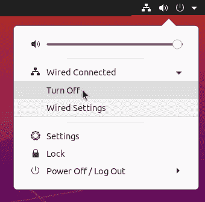

# 第十四章：使用 firewalld 构建 Linux 防火墙

本章介绍使用 firewalld 构建主机防火墙的基础知识。不同的主机有不同的需求。例如，服务器必须允许各种类型的传入连接请求，而不运行服务的个人电脑则不需要接受任何连接请求。连接多个网络的笔记本电脑需要动态防火墙管理。

# firewalld 概述

像所有防火墙一样，firewalld 具有非常多的功能。我们主要学习如何使用 firewalld 的*zones*来控制进入系统的流量。区域是一种信任级别的容器；例如，某些区域允许各种传入连接请求，而某些区域则非常限制。系统上的每个网络接口只能分配一个区域，并且一个区域可以分配给多个接口。

# 需要的网络知识

理解的最重要的网络概念包括端口、服务、TCP、UDP、端口转发、伪装、路由和 IP 地址。当您理解这些概念时，您将了解如何配置防火墙。如果您需要关于计算机网络的指导，请参考 Gordon Davies 的*Networking Fundamentals*（Packt 出版社）或 Doug Lowe 的*Networking All-in-One For Dummies*第 7 版（For Dummies）。如果您有[O’Reilly Learning Platform 订阅](https://oreil.ly/mEsNB)，您将找到大量优质信息。

传统的 Linux 防火墙建立在 Linux 内核的*netfilter*数据包过滤框架和用于创建和管理规则表的*iptables*软件之上，用于过滤传入和传出的网络流量。

时代变迁，**iptables**正逐渐被诸如*ufw*（简易防火墙）、*nftables*（Netfilter 表）、*firewalld*（防火墙守护程序）等新的规则管理器所取代。与 iptables 和 nftables 类似，firewalld 利用规则表来管理流量过滤。它提供了命令行界面和一个漂亮的图形界面*firewall-config*。firewalld 同时是 iptables 和 nftables 的前端。nftables 是对 iptables 的重大改进，并计划成为 firewalld 的默认后端，但在某些 Linux 发行版中，iptables 仍然是默认选项。您可以在*/etc/firewalld/firewalld.conf*中使用*FirewallBackend*选项设置您的首选后端（Recipe 14.4）。

firewalld 附带预定义的一组规则集，称为*zones*，用于不同的用例，例如不运行服务的机器、运行服务的机器，以及同一机器上不同网络接口的不同区域。您可以编辑这些区域以满足自己的需求。

firewalld 区域管理*services*，这些是针对常见服务（如 ssh、imaps 和 rsync）的配置。大多数预定义服务仅包括标准端口分配。您可以根据需要编辑这些服务，并创建自己的自定义区域。

firewalld 与 NetworkManager 集成，因此您无需担心管理动态连接，比如当您随身携带笔记本电脑并连接到不同的网络时。

# NetworkManager 服务

自 2004 年以来，NetworkManager 一直是 Linux 的重要组成部分。NetworkManager 取代了一堆繁琐的网络客户端工具，并管理着你的所有网络接口和网络连接。如果你对 NetworkManager 不熟悉，请参阅[GNOME NetworkManager](https://oreil.ly/hkqaq)。

如果您在商业托管服务上运行公共服务器，则您的防火墙设置取决于您的服务提供商支持的内容。保护公共服务器（例如 Web 服务器和在线商店），无论是远程托管还是位于您自己的数据中心，都需要超出本书范围的大量技能和关注。请进行深入学习和培训，或者聘请专家。

## 防火墙的工作原理

曾几何时，Ubuntu Linux 没有随附防火墙，因为默认安装没有公共服务，因此没有监听的网络端口。其理由是没有监听端口就没有攻击点。幸运的是，这个决定在后来的版本中被改变，因为用户会做出更改，即使是最专业的用户也会犯错误，而攻击者总是在发现新的漏洞。安全是一个多层次的过程。

让我们来看看防火墙的工作原理。基本原则是拒绝一切，只允许必要的。

网络服务，比如 SSH 服务器，需要打开一个网络端口以允许远程用户登录。你在允许其他人进入你的系统。*sshd* 的默认端口是 TCP 端口 22。你可以使用*netstat*命令查看系统上所有监听的端口。以下是显示 SSH 端口的片段：

```
$ sudo netstat -untap | sed '2p;/ssh/!d'
Proto Recv-Q Send-Q Local Address  Foreign Address  State   PID/Program name
tcp        0      0 0.0.0.0:22     0.0.0.0:*        LISTEN  1296/sshd: /usr/sbi
tcp6       0      0 :::22          :::*             LISTEN  1296/sshd: /usr/sbi

```

这个例子显示没有活动连接，因为外部地址字段都是零，并且状态是 LISTEN。*sshd*在所有网络接口和所有 IP 地址上监听传入的 IPv4 和 IPv6 连接，TCP 端口为 22。IP 地址和端口号的组合是一个地址，告诉 Linux 内核将 SSH 数据包发送到哪里。

这个例子显示了一个活动的 SSH 连接，状态为 ESTABLISHED。它列出了远程机器连接的本地地址和端口，以及远程机器的外部地址和端口（为了清晰起见，已删除了 Recv-Q 和 Send-Q 列）：

```
$ sudo netstat -untap | sed '2p;/ssh/!d'
Proto  Local Address     Foreign Address      State       PID/Program name
tcp    0.0.0.0:22        0.0.0.0:*            LISTEN      1296/sshd: /usr/sbi
tcp    192.168.1.97:22   192.168.1.91:56142   ESTABLISHED 13784/sshd: duchess
tcp6   :::22             :::*                 LISTEN      1296/sshd: /usr/sbi
```

有几种方法可以控制哪些 TCP/IP 数据包可以访问特定的 IP 地址和端口。大多数服务器都有配置选项，只监听特定的网络接口或 IP 地址，并接受来自特定地址和地址范围的请求。防火墙添加了额外的控制，同时使用防火墙和服务器配置是最佳实践。

## 网络端口和编号

Linux 系统上有 65536 个可能的网络端口，编号为 0-65535，其中许多端口保留用于特定服务。0 被保留且未使用。您可以在每个 Linux 上的 */etc/services* 文件中看到所有这些信息。请参阅[IANA 服务名称和传输协议端口号注册表](https://oreil.ly/CF0bF)获取完整的官方列表。

端口编号范围的组织方式如下：

+   0-1023 称为*众所周知的端口*。这些是常见服务的系统端口，例如 FTPS（安全文件共享）、SSH（安全远程登录）、NTP（网络时间协议）、POP3（电子邮件）、HTTPS（加密的 Web 服务器）等。

+   1024-49151 是*注册端口*，用于额外的服务。

+   49152-65535 是*临时端口*，也称为私有端口和动态端口。这些由您的系统用于与远程服务完成连接。例如，在您进行网页浏览时，*netstat* 显示如下（已删除 Recv-Q 和 Send-Q 列以增加清晰度）：

```
$ sudo netstat -untap
Proto  Local Address         Foreign Address    State        PID/Program name
[...]
tcp    192.168.43.234:50586  72.21.91.66:443    ESTABLISHED  2798/firefox
tcp    192.168.43.234:38262  52.36.174.147:443  ESTABLISHED  6481/chrome
tcp    192.168.43.234:53232  99.86.33.45:443    ESTABLISHED  2798/firefox
[...]

```

这说明了来自您的计算机的出站请求的响应。当您访问网站时，您发起连接请求，远程 Web 服务器将响应发送到您系统上的临时网络端口。列表中的第一个连接连接到示例本地计算机的 IP 地址 192.168.43.234，端口 50586。外部地址是远程服务器的 IP 地址和端口。状态 ESTABLISHED 表示它已连接到另一台计算机。会话结束后，在关闭 Web 浏览器后，端口 50586 被释放并准备再次使用。

临时端口不是服务的监听端口。与临时端口的连接是临时的，仅作为回复您的计算机发出的出站连接请求（例如访问网站）。防火墙可以阻止临时端口，但这样您将无法访问计算机外的主机或站点。

# 14.1 查询当前运行的防火墙

## 问题

您需要知道您的 Linux 系统正在使用哪种防火墙。

## 解决方案

从您特定的 Linux 发行版文档开始，因为大多数 Linux 发行版都会安装防火墙。最常见的三种是 *iptables*（Internet Protocol tables）、*ufw*（Uncomplicated Firewall）和 *nftables*（Netfilter tables）。这三种都管理 netfilter 框架上的过滤规则，netfilter 是 Linux 内核的一部分。

然后查看 systemd 说了什么。此示例显示 nftables 正在运行：

```
$ systemctl status nftables.service
    ● nftables.service - Netfilter Tables
     Loaded: loaded (/usr/lib/systemd/system/nftables.service; disabled; vendor>
     Active: active (exited) since Sat 2020-10-17 13:15:05 PDT; 4s ago
       Docs: man:nft(8)
    Process: 3276 ExecStart=/sbin/nft -f /etc/sysconfig/nftables.conf (code=exi>
   Main PID: 3276 (code=exited, status=0/SUCCESS)
   [...]

```

这显示 firewalld 正在运行：

```
$ systemctl status firewalld.service
● firewalld.service - firewalld - dynamic firewall daemon
Loaded: loaded (/usr/lib/systemd/system/firewalld.service; enabled; vendor>
     Active: active (running) since Sat 2020-10-17 12:36:20 PDT; 37min ago
       Docs: man:firewalld(1)
   Main PID: 775 (firewalld)
      Tasks: 2 (limit: 4665)
     Memory: 40.9M
     [...]

```

此示例检查 ufw 并显示它已安装但未激活：

```
$ systemctl status ufw.service
● ufw.service - Uncomplicated firewall
     Loaded: loaded (/lib/systemd/system/ufw.service; disabled; vendor preset:
enabled)
     Active: inactive (dead)
       Docs: man:ufw(8)

```

如果其中任何一个未安装，您将看到相关消息。

您可以移除 ufw 和 nftables，或者将它们掩盖，使其无法启动：

```
$ sudo systemctl stop ufw.service
$ sudo systemctl mask ufw.service

```

```
$ sudo systemctl stop nftables.service
$ sudo systemctl mask nftables.service

```

## 讨论

最好只运行一个防火墙，除非您喜欢解决冲突的防火墙规则。

## 参见

+   第四章

+   [*https://firewalld.org*](https://firewalld.org)

# 14.2 安装 firewalld

## 问题

您需要在 Linux 系统上安装 firewalld。

## 解决方案

如果您的系统没有安装 firewalld，请安装 *firewalld* 软件包，并安装 *firewall-config* 以获得良好的图形界面。

## 讨论

到目前为止，主要的 Linux 发行版都幸运地使用相同的软件包名称，*firewalld* 和 *firewall-config*。

firewalld 的启动方式可能会因 Linux 发行版的不同而有所不同。必须运行它才能创建和测试规则。

如果可能，请在完成初始 firewalld 配置之前禁用您的计算机网络连接。通过点击 NetworkManager 小程序来断开网络连接，默认情况下大多数 Linux 发行版都安装了它（图 14-1）。



###### 图 14-1\. 使用 NetworkManager 断开网络连接

或使用 *nmcli* 命令。以下示例查找并断开 WiFi 连接。在您的命令中使用 CONNECTION 名称：

```
$ nmcli device status
DEVICE  TYPE  STATE        CONNECTION
wlan0   wifi  connected    ACCESS_POINTE

$ nmcli connection down ACCESS_POINTE
Connection 'ACCESS_POINTE' successfully deactivated
(D-Bus active path: /org/freedesktop/NetworkManager/ActiveConnection/4)
```

恢复连接：

```
$ nmcli connection up ACCESS_POINTE
Connection successfully activated
(D-Bus active path: /org/freedesktop/NetworkManager/ActiveConnection/7)
```

使用 systemd 正常管理 firewalld。以下是命令：

+   *systemctl status firewalld.service*

+   *sudo systemctl enable firewalld.service*

+   *sudo systemctl start firewalld.service*

+   *sudo systemctl stop firewalld.service*

+   *sudo systemctl restart firewalld.service*

## 参见

+   第四章

+   [*https://firewalld.org*](https://firewalld.org)

+   附录

# 14.3 查找您的 firewalld 版本

## 问题

您需要已安装的 firewalld 版本号。

## 解决方案

使用您的包管理器查询已安装的软件包，或使用 *firewall-cmd*：

```
$ sudo firewall-cmd --version
0.9.3
```

## 讨论

firewalld 必须运行才能使 *firewall-cmd* 命令生效。如果未运行，则会显示“FirewallD is not running”消息。

## 参见

+   [*https://firewalld.org*](https://firewalld.org)

# 14.4 配置 iptables 或 nftables 作为 firewalld 后端

## 问题

您可以选择您自己的 firewalld 后端，可以是 iptables 或 nftables。

## 解决方案

使用您的偏好编辑 */etc/firewalld/firewalld.conf*：

```
FirewallBackend=nftables
```

或：

```
FirewallBackend=iptables
```

然后重新启动 firewalld。

## 讨论

您可能需要安装您首选的后端。

即使您不关心系统使用哪一个，也应该使用 nftables，因为这是 firewalld 开发人员正在积极开发的内容。

## 参见

+   “firewalld 概述”

+   [firewalld 开发者的 nftables 后端博客文章](https://oreil.ly/xO5eS)详细介绍了两个后端和未来的开发。

# 14.5 列出所有区域以及每个区域管理的所有服务

## 问题

您想要查看 firewalld 配置中所有可用的区域以及每个区域管理的服务。

## 解决方案

列出默认区域：

```
$ firewall-cmd --get-default-zone
public

```

列出所有区域：

```
$ firewall-cmd --get-zones
block dmz drop external home internal public trusted work
```

列出所有活动区域，当前正在使用的区域：

```
$ firewall-cmd --get-active-zones
internal
  interfaces: eth1
work
  interfaces: wlan0
```

列出区域的配置：

```
$ sudo firewall-cmd --zone=public --list-all
public
  target: default
  icmp-block-inversion: no
  interfaces:
  sources:
  services: dhcpv6-client ipp ipp-client mdns ssh
  ports:
  protocols:
  masquerade: no
  forward-ports:
  source-ports:
  icmp-blocks:
  rich rules:
```

列出所有区域的配置：

```
$ sudo firewall-cmd --list-all-zones
[...]
```

## 讨论

firewalld 区域定义了网络连接的信任级别。每个区域包含区域描述和其他项目，如上述示例中的*public*区域。区域文件以 XML 格式存在，并且必须具有*.xml*文件扩展名。查看*/usr/lib/firewalld/zones*以查看它们的源文件。

下面的列表定义了区域选项：

+   *target:* 定义不匹配任何规则的数据包的默认操作。它可以取四个值之一：*default*、*ACCEPT*、*DROP*或*REJECT*。例如，在*public*区域中，当连接请求 dhcpv6-client、ipp、ipp-client、mdns 或 ssh 数据包时，这些数据包将被接受。任何不匹配允许服务的数据包将被默认目标拒绝，并发送拒绝消息。

    +   *ACCEPT* 接受所有未明确被规则阻止的数据包。

    +   *DROP* 静默丢弃所有未明确允许的数据包。

    +   *REJECT*类似于*DROP*，但还会发送拒绝消息。

+   *icmp-block-inversion*反转您的 ICMP 请求设置。被阻止的请求被改为未阻止，未阻止的请求被反转为阻止。通常设置为*no*。

+   *interfaces:* 定义应用此区域的网络接口。每个接口可能仅绑定到一个区域，并且您可以在多个接口上使用相同的区域。

+   *source:* 接受 IP 和 MAC 地址以及 IP 地址范围。例如，您可以仅接受来自本地网络的数据包，来自特定主机的数据包，或者阻止主机或网络。

+   *services:* 是由此区域管理的服务列表。

+   *ports:* 列出此区域管理的端口号。

+   *protocols:* 列出由此区域管理的其他 TCP 协议，如*/etc/protocols*中所示。

+   *masquerade:* 可以设置为*yes*或*no*。Masquerade 用于共享 IPv4 互联网连接。除了路由器外，所有主机都应将其设置为*no*。

+   *forward-ports:* 用于将进入一个端口的数据包转发到另一个端口。

+   *source-ports:* 用于列出源端口。

+   *icmp-blocks:* 用于列出要阻止的 ICMP 类型。

+   *rich rules* 是您编写的自定义规则。

## 参见

+   [*https://firewalld.org*](https://firewalld.org)

+   *man 5 firewalld.zone*

+   *man 1 firewall-cmd*

# 14.6 列出和查询服务

## 问题

您想查看 firewalld 支持的服务列表。

## 解决方案

使用*firewall-cmd*命令：

```
$ sudo firewall-cmd --get-services
RH-Satellite-6 amanda-client amanda-k5-client amqp amqps apcupsd audit bacula
bacula-client bb bgp bitcoin bitcoin-rpc bitcoin-testnet bitcoin-testnet-rpc
bittorrent-lsd ceph ceph-mon cfengine cockpit condor-collector ctdb dhcp dhcpv6
[...]

```

那是一个相当大的全局视图。将其转换为整洁的单列：

```
$ sudo firewall-cmd --get-services| xargs -n1
RH-Satellite-6
amanda-client
amanda-k5-client
amqp
amqps
apcupsd
[...]
```

使用*xargs -n2*、*xargs -n3*等命令创建更多列。

firewalld 服务不仅限于简单的端口地址。例如，*bittorrent-lsd*服务包括两个目标 IP 地址：

```
$ sudo firewall-cmd --info-service bittorrent-lsd
bittorrent-lsd
  ports: 6771/udp
  protocols:
  source-ports:
  modules:
  destination: ipv4:239.192.152.143 ipv6:ff15::efc0:988f
  includes:
  helpers:
```

*ceph-mon*服务打开了两个监听端口：

```
$ sudo firewall-cmd --info-service ceph-mon
ceph-mon
  ports: 3300/tcp 6789/tcp
  [...]
```

您可以编辑任何预定义服务以满足您的需求。

## 讨论

当您向区域添加服务时，请确保使用它们在列表中显示的名称。您可以创建自己的自定义服务；请参阅“在[firewalld 文档](https://oreil.ly/kvMYY)中添加服务”。

## 参见

+   [*https://firewalld.org*](https://firewalld.org)

+   在[firewalld 文档](https://oreil.ly/kvMYY)中的“添加服务”

# 14.7 选择和设置区域

## 问题

您想知道如何选择和设置正确的区域。

## 解决方案

您选择的 firewalld 区域取决于您的机器运行哪些服务。如果您的机器未运行任何网络服务且仅需要网络连接，请使用*drop*或*block*区域。*drop*区域最为严格，拒绝所有传入连接请求，并仅允许回复来自计算机发起的连接。*block*类似于*drop*，但它发送拒绝消息。

不同 Linux 发行版上的其他区域配置不同，因此您需要查看系统上如何配置，例如*work*区域的示例：

```
$ sudo firewall-cmd --zone=work --list-all
work
  target: default
  icmp-block-inversion: no
  interfaces:
  sources:
  services: dhcpv6-client ssh
  ports:
  protocols:
  masquerade: no
  forward-ports:
  source-ports:
  icmp-blocks:
  rich rules:
```

您必须将区域绑定到网络接口。以下示例将*work*区域分配给 eth0，然后进行验证：

```
$ sudo firewall-cmd --zone=work --permanent --change-interface=eth0
success

$ sudo firewall-cmd --zone=work --list-interfaces
eth0

```

如果您希望在永久应用更改之前测试更改，请省略*--permanent*选项。这将创建一个*运行时*配置，并立即应用更改。重新启动 firewalld 和运行*firewall-cmd --reload*时，运行时更改将丢失。将运行时更改转换为永久更改：

```
$ sudo firewall-cmd --runtime-to-permanent
```

绑定区域到网络接口或重新启动 firewalld 时，不需要重新加载 firewalld 配置。

## 讨论

如何知道选择哪个区域？这些是 Ubuntu 20.04 上带有 firewalld 的预定义区域，按照从最严格到最不严格的顺序排列。在您的 Linux 上，区域可能会稍有不同；查看 Recipe 14.5 以了解如何查看您的区域配置。

以下列出了默认区域：

*drop*

所有未经请求的传入网络数据包将被丢弃，并且不会有回复。仅允许回复到您的计算机发起的连接的传入数据包。当您连接到不受信任的网络并且不需要允许传入 SSH 连接、共享文件或任何其他外部连接请求时，这是最强的保护措施。

*block*

拒绝所有传入的网络连接请求，对于 IPv4 发送*icmp-host-prohibited*消息，对于 IPv6 发送*icmp6-adm-prohibited*消息。仅允许从您的系统发起的网络连接。

*public*

接受传入的 dhcpv6-client、ipp、ipp-client、mdns 和 ssh 连接，拒绝所有其他连接。

*external*

这是一个简单的互联网网关，结合了防火墙和简单的路由功能。仅接受传入的 SSH 连接，并且启用 IPv4 地址共享以共享互联网连接。

*dmz*

用于公开访问的您的非军事区域中的计算机。仅接受传入的 SSH 连接。（DMZ 是您网络上面向互联网服务器的单独网络段。）

*work*

只接受传入的 ssh 和 dhcpv6-client 连接。

*home*

只接受传入的 ssh、mdns samba-client 和 dhcpv6-client 连接请求。

*internal*

仅接受传入的 ssh、mdns、samba-client 和 dhcpv6-client 连接请求。

*trusted*

所有网络连接请求均被接受。

您可以自定义任何这些区域或创建新区域；参见 第 14.9 节。

## 参见

+   第 14.9 节

+   [*https://firewalld.org*](https://firewalld.org)

# 14.8 更改默认的 firewalld 区域

## 问题

您不喜欢默认的 firewalld 区域，想要更改它。

## 解决方案

验证您当前的默认设置：

```
$ firewall-cmd --get-default-zone
internal

```

假设您希望将 *drop* 作为默认区域，因为它是最严格的。使用 *firewall-cmd* 命令设置新默认值：

```
$ sudo firewall-cmd --set-default-zone drop
success

```

当您使用此命令时，不需要重新加载 firewalld 配置或重新启动 firewalld。

## 讨论

使用 NetworkManager（第 14.11 节）可以分配区域。NetworkManager 会将默认区域分配给所有未显式分配区域的连接。

## 参见

+   参见 第 14.7 节 中的讨论以了解 firewalld 区域

+   第 14.11 节

+   [*https://firewalld.org*](https://firewalld.org)

# 14.9 自定义 firewalld 区域

## 问题

默认区域都不符合您的需求，您想修改预定义区域。

## 解决方案

假设您喜欢 *internal* 区域，但默认配置不完全符合您的要求。当前配置允许 *ssh*、*mdns*、*samba-client* 和 *dhcpv6-client*：

```
$ firewall-cmd --zone=internal --list-all
internal
  target: default
  icmp-block-inversion: no
  interfaces:
  sources:
  services: ssh mdns samba-client dhcpv6-client
[...]
```

下面的示例显示如何删除 *samba-client*，因为您不使用 Samba：

```
$ sudo firewall-cmd --remove-service=samba-client --zone=internal
success

```

您正在运行一个小型本地 389 目录服务器，因此需要添加 LDAPS 服务：

```
$ sudo firewall-cmd --zone=internal --add-service=ldaps
success
```

这些是临时更改，不会在重新启动或重新加载配置后生效。但它们会立即应用，以便您可以测试它们。测试您的更改，如果一切按预期运行，请将更改变为永久：

```
$ sudo firewall-cmd --runtime-to-permanent
success

```

要放弃更改，请不要使用 *--runtime-to-permanent*。而是使用 *--reload* 来丢弃运行时更改，并恢复到原始配置：

```
$ sudo firewall-cmd --reload
success

```

## 讨论

*--reload* 不会中断任何活动连接。

*--complete-reload* 完全重新加载 firewalld，包括重新加载内核模块，并终止活动连接。当您的运行时变更混乱无法解决时，这是一个好选择。

## 参见

+   参见 第 14.7 节 中的讨论以了解 firewalld 区域

+   [*https://firewalld.org*](https://firewalld.org)

+   第 4 章

# 14.10 创建新区域

## 问题

您想创建一个新的自定义区域。

## 解决方案

创建包含您的区域配置的 XML 文件，然后重新加载 firewalld，即可使用。

下面的示例创建了一个用于本地名称服务的区域，具有同一台机器上的 DNS 和 DHCP 服务器以及 SSH 访问权限。示例文件名为 */etc/firewalld/zones/names.xml*：

```
<?xml version="1.0" encoding="utf-8"?>
<zone>
  <short>Name Services</short>
  <description>
    DNS and DHCP servers for the local network, IPv4 only.
  </description>
  <service name="dns"/>
  <service name="dhcp"/>
  <service name="ssh"/>
</zone>
```

运行 *sudo firewall-cmd --get-zones* 命令，您的新区域将不会列出。 添加 *--permanent* 选项以查看尚未被 firewalld 读取的任何新区域，现在新的“names”区域出现了。 区域名称是没有 *.xml* 扩展名的文件名：

```
$ sudo firewall-cmd --permanent --get-zones
block dmz drop external home internal names public trusted work
```

重新加载 firewalld：

```
$ sudo firewall-cmd --reload
success
```

现在 firewalld 可以读取它，并且您可以看到它与其他区域一起：

```
$ sudo firewall-cmd --get-zones
block dmz drop external home internal names public trusted work
```

并列出其配置：

```
$ sudo firewall-cmd --zone=names --list-all
names
  target: default
  icmp-block-inversion: no
  interfaces:
  sources:
  services: dhcp dns ssh
  ports:
  protocols:
  masquerade: no
  forward-ports:
  source-ports:
  icmp-blocks:
  rich rules:
```

您的新区域已准备就绪，您可以像任何其他区域一样修改它。

## 讨论

查看 *man 5 firewalld.zone* 了解配置选项，并查看 */usr/lib/firewalld/zones/* 中预定义区域的源文件作为示例。 唯一放在 */etc/firewalld/zones/* 中的文件是用户自定义文件。

通过删除其 *.xml* 文件来删除区域，然后重新加载 firewalld。

## 另请参阅

+   *man 5 firewalld.zone*

+   [*https://firewalld.org*](https://firewalld.org)

+   Recipe 14.9

# 14.11 集成 NetworkManager 和 firewalld

## 问题

您在多个网络之间旅行，例如多个工作地点、咖啡店、酒店和共享工作场所。 您需要知道如何设置 NetworkManager 来跟上这些变化，并始终确保新连接分配到正确的防火墙区域。

## 解决方案

NetworkManager 包含 firewalld 集成。 当您连接到新网络时，NetworkManager 将其分配给您的默认 firewalld 区域。

您可以使用 NetworkManager 将非默认区域分配给特定连接。 如果您的面板中有 NetworkManager 小程序，请单击它以显示“编辑连接”对话框（Figure 14-2）。


###### Figure 14-2\. 在 NetworkManager 中编辑网络连接

或者，运行 *nm-connection-editor* 命令打开编辑器。 点击“编辑连接”，点击要编辑的连接，然后点击齿轮图标打开编辑器。 这将打开编辑对话框（Figure 14-3）。


###### Figure 14-3\. 更改防火墙区域

转到“常规”选项卡并使用防火墙区域下拉菜单选择您要为该连接选择的区域。 保存更改，完成设置。

## 另请参阅

+   通过 Recipe 14.7 中的讨论了解 firewalld 区域

+   Recipe 14.9

+   [NetworkManager 参考手册](https://oreil.ly/pvrwj)

# 14.12 允许或阻止特定端口

## 问题

您正在使用非标准端口，例如 SSH 服务器的端口 2022。 您希望阻止端口 22 并允许端口 2022。

## 解决方案

任何未明确允许的端口将被所有 firewalld 区域拒绝，除了 *trusted* 区域允许所有内容。 如果您正在使用默认的 SSH 服务，它使用 TCP 端口 22，请先从相关区域中移除端口 22，然后添加端口 2022，然后重新加载 firewalld。 在这个例子中，非标准端口分配给 *work* 区域：

```
$ sudo firewall-cmd --zone=work --remove-port=22/tcp
success
$ sudo firewall-cmd --zone=work --add-port=2022/tcp
success

```

通过列出区域配置来验证：

```
$ sudo firewall-cmd --list-all --zone=work
work
  target: default
  icmp-block-inversion: no
  interfaces:
  sources:
  services: ssh
  ports:2022/tcp
[...]

```

当您满意时，请使您的更改永久化。

```
$ sudo firewall-cmd --runtime-to-permanent

```

## 讨论

如果您尝试删除该端口时看到类似“警告：NOT_ENABLED: 22:tcp”的消息，则表示该端口未在该区域启用，您可以继续添加您的新端口。

当您使用非标准端口时，连接到服务的客户端必须指定该端口号。例如，对于 SSH：

```
$ ssh -p 2022 *server1*
```

如何知道使用哪些端口？每个服务都有其自己的默认端口，在服务的文档和 */etc/services* 文件中可以找到。您可以使用非标准端口，这些端口必须是在 1024 到 49151 之间未使用的端口。请记录您对 */etc/services* 的更改。您还需要在服务器配置中设置您的非标准端口。参见 Recipe 12.3 以查看示例。

## 参见

+   [*https://firewalld.org*](https://firewalld.org)

+   Recipe 12.3

# 14.13 使用丰富规则阻止 IP 地址

## 问题

您想要阻止某些 IP 地址。

## 解决方案

创建一个定义要阻止的地址和目标（例如 *reject*）的 *rich rule*。以下示例阻止了单个地址，并将其添加到内部区域中。

```
$ sudo firewall-cmd --zone=internal \
 --add-rich-rule='rule family="ipv4" source address=192.168.1.91 reject'
success
```

通过从被阻止的主机进行 ping 测试来测试它。被阻止的主机应该看到“目标端口不可达”的消息。

如果您不想保留该规则，请运行 *sudo firewall-cmd --reload* 来删除它。

要使其永久化，使用 *--runtime-to-permanent* 选项：

```
$ sudo firewall-cmd --runtime-to-permanent

```

列出区域中的丰富规则：

```
$ sudo firewall-cmd --zone=internal --list-rich-rules
rule family='ipv4' source address='192.168.1.91' reject

```

要删除永久的丰富规则，请使用 *--remove-rich-rule* 选项：

```
$ sudo firewall-cmd --zone=internal \
        --remove-rich-rule="rule family='ipv4' \
        source address='192.168.1.91' reject"
success

```

您无需完全阻止有问题的主机，但可以将阻止应用于特定服务。以下示例仅为 SSH 服务的源地址阻止：

```
$ sudo firewall-cmd --zone=internal --add-rich-rule='rule family="ipv4" \
 source address=192.168.1.91 service name="ssh" protocol=tcp reject'
success
```

## 讨论

您可以在一个区域中创建多个丰富规则，但请注意避免冲突。

曾经，我曾与一个有幸一起工作的人合作，他觉得在同事身上进行渗透测试很有趣。我们团队在工作站上运行了许多测试服务器，并向团队提供了这些服务器。我们那位想成为渗透测试员的人非常讨厌，我们都在防火墙上封锁了他。

## 参见

+   参见 Recipe 14.7 了解 firewalld 的区域和选项

+   [*https://firewalld.org*](https://firewalld.org)

+   *man 5 firewalld.richlanguage*

# 14.14 更改区域的默认目标

## 问题

您想要更改区域的默认目标。

## 解决方案

列出当前的目标：

```
$ sudo firewall-cmd --zone=internal --list-all
internal
  target: ACCEPT
[...]
```

将其从 *ACCEPT* 更改为 *REJECT*，然后重新加载并验证：

```
$ sudo firewall-cmd --permanent --zone=internal --set-target=REJECT
success

$ sudo firewall-cmd --reload

$ firewall-cmd --zone=names --list-all
names
  target: %%REJECT%%
[...]
```

## 讨论

区域目标定义了不匹配任何规则的数据包的默认操作。它可以是以下四个值之一：*default*、*ACCEPT*、*DROP* 或 *REJECT*。

## 参见

+   [*https://firewalld.org*](https://firewalld.org)

+   参见 Recipe 14.5 了解 firewalld 区域的讨论

+   Recipe 14.11
