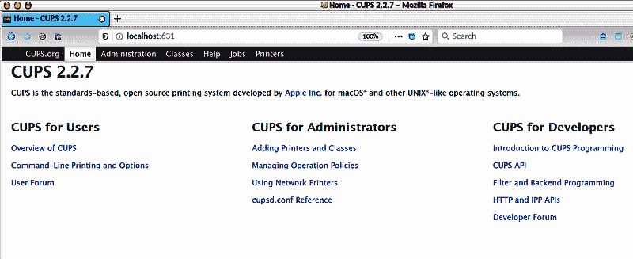
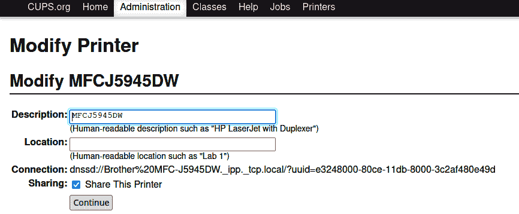

# 第十五章：Linux 上的打印

Linux 依赖于 CUPS（通用 Unix 打印系统）来管理打印机。在本章中，你将学习如何安装和管理打印机，以及如何通过网络共享它们。你将了解到 Linux 打印的 *无驱动* 未来，其中打印机将可以在客户端设备上使用，而无需安装驱动程序。

# 概述

在 Linux 上愉快打印的关键是选择在 Linux 上得到良好支持的高质量打印机和多功能设备（打印机、扫描仪、复印机、传真机）。值得庆幸的是，现在选择受支持设备比过去要容易得多。当你选择一个受支持良好的设备时，驱动程序已经包含在 CUPS 中，你不必费力去寻找和下载制造商的驱动程序。

下一个最佳选择是购买具有供应商提供的 Linux 驱动程序的机器。这不是我喜欢的选项，因为这些驱动程序通常都很老旧且不再维护，你必须手动安装它们。这在多功能设备（MFDs）中更为常见。例如，我的个人机器是 Brother MFC-J5945DW，它没有原生的 CUPS 驱动程序，尽管支持无驱动打印。它是一笔不错的交易，墨盒便宜，尽管事后我真的应该购买一个有原生 Linux 支持的机器。原生支持更可靠，因为一旦设备在 CUPS 中受支持，就始终受支持，你不会受到那些不维护驱动程序或停止驱动下载的制造商的影响。

最不理想的选择是在没有做足功课的情况下购买并希望它能正常工作。在这种情况下，你可能可以使用 macOS 驱动程序（PPD 文件）来驱动 Linux 不支持的打印机，尽管如果 Macintosh 的 PPD 文件包含 macOS 特定条目（例如调用 macOS 可执行文件、库或过滤器），你可能需要进行一些工作来替换为 Linux 的等效物。如果你想尝试这种方法，可以参考 [cupsFilter](https://oreil.ly/w3Oqd) 获取一些有用的信息。

如果你需要一个共享设备，最少麻烦的方法是选择一个具有网络功能和内置控制功能的设备，可以进行复印、设置网络、查看墨水量、清洁打印头以及其他设置和维护任务。这些设备比需要从计算机设置和控制的设备更易于使用和更愉快。

## 查找受支持的打印机和扫描仪

惠普（HP）打印机和多功能设备通过 *hplip*、*hplip-hpijs*、*hplip-sane* 和 *hplip-scan-utils* 软件包拥有优秀的 Linux 支持。当然，每个 Linux 版本都有特别的名称，例如 *hpijs-ppds*、*hplip-data*、*printer-driver-hpcups*、*hplip-common* 和 *libsane-hpaio*。搜索 *hplip* 应该能找到它们。

并非所有 HP 打印机和多功能设备都在 Linux 上得到支持；请查看下面的链接获取 HP 的 Linux 支持数据库。

Brother 有良好的设备、体面的客户支持和良好的墨水价格。他们既有原生 Linux 支持的机器，也有需要 Brother 驱动程序的机器。

佳能、爱普生、霍尼韦尔、富士通、IBM、雷克萨姆、柯达、德科尼克斯、三星、夏普、施乐、东芝等许多品牌都在某种程度上支持 Linux。了解哪些型号得到支持可能很困难。一些供应商在其产品规格中告知您。有几个网站可供查询，尽管它们通常不完整也不时效，但它们是一个很好的起点：

+   [支持的 HP 打印机](https://oreil.ly/y9z4J)

+   [OpenPrinting.org 打印机列表](https://oreil.ly/7JbPH)

+   [H-node 打印机和多功能设备](https://oreil.ly/Hwy0w)

+   [ThinkPenguin 商店](https://oreil.ly/54H5F)

+   [Ubuntu 支持的打印机页面](https://oreil.ly/03SV3)

+   [IPP Everywhere 打印机](https://oreil.ly/l7pFz)

## CUPS 打印机驱动

Linux 打印机驱动由 CUPS（通用 Unix 打印系统）提供。自大约 2000 年以来，CUPS 一直是 Linux 的标准打印子系统。苹果在大约 2002 年开始使用 CUPS，然后雇用了 CUPS 的创始人 Michael Sweet，并在 2007 年购买了源代码。Sweet 在 2019 年离开了苹果，苹果的参与因此停滞不前，详情请见 [apple/cups on GitHub](https://oreil.ly/HgUX8)。Sweet 先生并没有闲着，而是在 OpenPrinting.org 的 CUPS 分支 [OpenPrinting/cups](https://oreil.ly/uP0CJ) 上努力工作。

CUPS 中的打印机驱动程序由一个或多个特定于打印机的过滤器组成，这些过滤器封装在 PPD（PostScript 打印机描述）文件中。即使是非 PostScript 打印机，在 CUPS 中也需要一个 PPD。PPD 包含有关打印机、打印机命令和过滤器的描述。

[打印机工作组](https://oreil.ly/yEMad) 和 [OpenPrinting](https://oreil.ly/caH6b) 是 CUPS 和打印标准开发的中心。

过滤器将打印作业转换为打印机可以理解的格式，如 PDF、HP-PCL、光栅和图像文件，并传递命令以执行操作，如页面选择、纸张大小、颜色、对比度和媒体类型。PPD 是纯文本文件，所有支持的打印机的 PPD 都在 */usr/share/cups/model/* 中。安装的打印机在 */etc/cups/ppd/* 中有 PPD。

## PPDs Are Doomed

CUPS 从创建开始就依赖于 PPD 文件，并且它们运行良好。然而，现在正在开发一种新的方法称为 *无驱动* 打印。打印机不再使用静态的 PPD 文件，而是广播其能力，客户端机器无需安装驱动程序。这个想法就像使用 NetworkManager 连接新网络一样简单，它自动查找可用网络，并且不需要您安装驱动程序或手动配置每个新网络。对于手机和平板电脑等存储空间有限、屏幕尺寸有限的移动设备来说，这尤为有利。

无驱动在 CUPS 2.2.0 中引入。为了可靠性能，您应该至少使用 CUPS 2.2.4（2017 年 6 月发布）。您可以在以下资源中了解更多：

+   [Linux 中打印应用程序：打印的新方式](https://oreil.ly/clNC3)

+   [CUPS 无驱动打印](https://oreil.ly/yaj5q)

# 15.1 使用 CUPS Web 界面

## 问题

您需要找到 CUPS 管理工具。

## 解决方案

在您的网络浏览器中打开 CUPS Web 界面[*http://localhost:631/*](http://localhost:631/)（图 15-1）。



###### 图 15-1\. CUPS Web 控制面板

## 讨论

有许多图形工具可用于管理打印机，例如 *system-config-printer* 和 openSUSE 中的 YaST 打印机模块。CUPS Web 管理页面提供了最完整的管理选项，在所有 Linux 发行版上保持一致。

## 参见

+   [CUPS 文档](https://oreil.ly/OlCzV)

# 15.2 安装本地连接的打印机

## 问题

您需要安装一个连接到您的 PC 的新打印机。您明智地选择了一个原生支持 CUPS 的打印机。

## 解决方案

使用 CUPS Web 控制面板。您的打印机应该已连接并开机。以下示例基于 Linux Mint 系统。

转到管理选项卡，然后点击添加打印机。它会要求您登录（图 15-2）。（如果您的登录不起作用，只有 root 登录成功，请参阅 Recipe 15.7 了解如何配置 CUPS 接受非 root 登录。）选中“保存调试信息以进行故障排除”，并选中“共享直接连接到此计算机的打印机”以直接共享连接到您计算机的打印机。这仅启用共享功能，然后您必须在每台要共享的打印机上启用共享。


###### 图 15-2\. 添加打印机

在接下来的屏幕上，CUPS 在本地打印机部分发现并列出您的打印机（图 15-3）。选择您的打印机并点击继续。

现在您应该看到一个屏幕，类似于图 15-4，具有名称、描述和位置字段。名称和描述字段已自动填写，您可以更改为您想要的内容。名称字段在您打印文档时出现在打印机对话框中。


###### 图 15-3\. CUPS 找到您的本地打印机


###### 图 15-4\. 指定名称、描述和位置

选择您的打印机驱动程序。CUPS 会显示一个巨大的列表供您选择。在图 15-5 中，驱动程序来自*epson-inkjet-printer-escpr*包（在 Ubuntu 上是*printer-driver-escpr*），适用于精工爱普生彩色喷墨打印机。


###### 图 15-5\. 选择打印机驱动程序

最终配置屏幕用于设置默认选项，例如纸张类型、纸张尺寸、彩色或黑白、打印质量以及其他根据打印机和打印机驱动程序支持的选项。完成后，点击设置默认选项（图 15-6）。


###### 图 15-6\. 设置默认打印机选项

完成后，您将看到打印机页面，列出了所有安装的打印机（图 15-7）。


###### 图 15-7\. 所有安装的打印机

点击您的新打印机，并从维护下拉菜单中打印一张测试页。当它正确打印时，您就完成了。

## 讨论

在图 15-2 中，您会看到两个按钮，添加打印机和查找新打印机。它们基本上是一样的，只是已发现的打印机列表组织方式不同。

您可能有多个打印机驱动程序可供选择；例如，对于同一台打印机，常见的是同时看到 CUPS+Gutenprint 和 Foomatic 驱动程序。以前 Gutenprint 是彩色打印机的更好选择；请尝试两种看您喜欢哪种。CUPS+Gutenprint 简化版驱动程序比完整版功能和选项较少。

## 参见

+   [CUPS 文档](https://oreil.ly/OlCzV)

# 15.3 给打印机起有用的名称

## 问题

当您在文档中打开打印机对话框时，有几台打印机可供选择，其中一些看起来相似，您不确定应该使用哪一个。

## 解决方案

安装打印机时，在名称字段中输入一个描述性名称（图 15-8）。您必须在安装时执行此操作，因为安装后无法更改名称。


###### 图 15-8\. 使用打印机名称识别您的打印机

## 讨论

当您首次使用 CUPS Web 控制面板安装打印机时，有描述和位置字段可供使用，并且这些字段显示在 CUPS Web 控制面板中。但许多打印应用程序不读取这些字段，只读取名称字段。一些例外包括 Evolution 邮件客户端以及 Firefox 和 Chromium 网络浏览器，它们会显示名称、位置和状态。

## 另请参阅

+   [CUPS 文档](https://oreil.ly/OlCzV)

# 15.4 安装网络打印机

## 问题

在您的网络上有一个共享网络打印机，并且您想在您的计算机上安装它。

## 解决方案

此过程与安装本地连接的 USB 打印机相同（配方 15.2），只是您选择了发现的网络打印机。打印机必须开启并且与您的计算机处于同一网络段下。您会在 Discovered Network Printers 下看到它列出（图 15-9）。


###### 图 15-9. 安装共享网络打印机

您需要在所有客户端的防火墙中打开 TCP 端口 631。

## 讨论

如果 CUPS 无法发现您的打印机怎么办？请参阅配方 15.11 获取一些故障排除帮助。如果 CUPS 无法看到您的打印机，则无法安装它。

## 另请参阅

+   [CUPS 文档](https://oreil.ly/OlCzV)

# 15.5 使用无驱动打印

## 问题

您的打印机在 CUPS 中不受支持，您想尝试无驱动打印选项。或者，您想将 Android 或 iOS 设备连接到打印机。

## 解决方案

您可能已经在 CUPS 打印机驱动程序选择器中看到了无驱动选项。以下示例适用于我的 Brother MFC-J5945DW，它没有本机 CUPS 支持。

在 CUPS Web 控制面板中，转到管理 → 添加打印机。CUPS 在发现的网络打印机中看到我的 Brother 设备（图 15-10）。有一个*driverless*选项，那是正确的选择。


###### 图 15-10. CUPS 看到我的不受支持的网络打印机

继续安装，并选择正确的驱动程序，在图 15-11 中是“Brother MFC-J5945DW, driverless, cups-filters 1.25.0 (en)”。

打印测试页，如果显示正确，安装就完成了。


###### 图 15-11. 选择无驱动打印机驱动程序

## 讨论

严格来说，这并不是无驱动，因为 CUPS 会为您的“无驱动”打印机在*/etc/cups/ppd*中创建 PPD 文件。然而，您无需维护充满 OpenPrinting.org 和 Gutenprint PPD 的目录。

你的打印机必须支持无驱动打印，这意味着它必须支持 Mopria、AirPrint、IPP Everywhere 或 WiFi Direct Print 标准。这些标准都类似：打印机通过 Avahi 守护进程广播自己、其网络地址和基本功能。Avahi 在你的本地网络上提供服务发现，使用 mDNS/DNS-SD 协议套件。（苹果称此服务为 Bonjour 和 Zeroconf。）

CUPS 中的无驱动打印适用于 Android 和 iOS 设备。你只需要安装一个打印机应用程序。如果你的打印机启用了无驱动功能，特别是如果它是 Mopria 认证的，那么你的移动设备将可以轻松找到它。Mopria 认证意味着你的打印机支持从移动设备发送的无线打印。如果你的打印机文档没有告诉你它是否是 Mopria 认证的，运行以下命令来检查：

```
$ avahi-browse -rt _ipp._tcp
[...]
txt = ["mopria-certified=1.3"
[...]
```

## 参见

+   [Debian Wiki，无驱动打印](https://oreil.ly/d2Qw8)

+   [CUPS 文档](https://oreil.ly/OlCzV)

# 15.6 共享非网络打印机

## 问题

你想要共享一个没有内置网络连接的打印机。

## 解决方案

CUPS 共享那些没有网络连接但连接到网络上的 PC 的打印机。首先，你必须使你的名称服务正常工作，以便你的 LAN 主机可以互相 ping 到彼此。

确保在 Administration 屏幕上通过“Share printers connected to this system”选项启用打印机共享。然后在你想要共享的打印机上启用共享（图 15-12）。



###### 图 15-12\. 启用打印机共享

CUPS 将会在你的网络上广播打印机。任何网络上的 Linux 客户端想要使用这台打印机，都必须像安装网络或本地连接的打印机一样进行安装；从 Administration → Add Printer 开始，然后按照正常的安装过程进行操作。

你也可以与 Windows 和 macOS 客户端共享。macOS 通过 DNS-SD/mDNS 和 IPP 本地支持发现。Linux 上由 Avahi 提供 DNS-SD/mDNS，Macintosh 称为 Bonjour。使用 Macintosh 控制面板找到并安装共享的 CUPS 打印机。

Windows 10 本地支持 DNS-SD/mDNS。旧版本的 Windows 支持通过 Internet 打印协议（IPP）进行共享。使用 Windows 打印机控制面板找到并安装共享的 CUPS 打印机。

## 讨论

在过去，网络打印机尚不普及且价格昂贵之前，管理员使用专用的打印机服务器。这些可以是旧 PC、旧笔记本电脑、小型单板计算机或商用打印机服务器设备。现在你仍然可以购买小型打印机服务器设备，而且价格比过去便宜得多。

现在大多数打印机都内置了网络功能，管理起来更简单。

## 参见

+   [CUPS 文档](https://oreil.ly/OlCzV)

# 15.7 修正“Forbidden”错误信息

## 问题

当您尝试在 CUPS Web 控制面板中执行任何管理任务时（例如添加新打印机），您的登录失败并显示“添加打印机错误 无法添加打印机：Forbidden”消息。

## 解决方案

在一些 Linux 发行版（如 openSUSE）中，默认配置只允许 root 用户执行 CUPS 管理任务。编辑 */etc/cups/cups-files.conf* 以允许非 root 用户执行 CUPS 管理任务。查找以下行：

```
# Administrator user group, used to match @SYSTEM in cupsd.conf policy rules...
# This cannot contain the Group value for security reasons...
SystemGroup root
```

这就是为什么只有 root 登录有效的原因。您可以添加您自己的私有用户组，例如我们的示例用户 Duchess，其私有组是 *duchess*：

```
SystemGroup root duchess
```

在保存对 */etc/cups/cups-files.conf* 的更改后，重新启动 CUPS 服务：

```
$ sudo systemctl restart cups.service
```

现在 Duchess 可以执行 CUPS 管理任务。

另一种方法是使用专门为此目的创建的系统组。在 Ubuntu Linux 发行版中，这是 *lpadmin* 组，而 Fedora 使用 *sys* 和 *wheel* 组。您可以创建自己的用于 CUPS 管理的组，例如创建 *cupsadmin* 组，并将用户 Mad Max 添加到该组中：

```
$ sudo groupadd -r cupsadmin
$ sudo usermod -aG cupsadmin madmax
```

Mad Max 必须注销，然后重新登录以激活新的组成员资格。将 *cupsadmin* 组添加到 */etc/cups/cups-files.conf* 中的 *SystemGroup*：

```
SystemGroup root duchess cupsadmin
```

重新启动 CUPS，Mad Max 就可以开始工作了。

## 讨论

*/etc/cups/cups-files.conf* 中应该还有这样一个部分：

```
# Default user and group for filters/backends/helper programs; this cannot be
# any user or group that resolves to ID 0 for security reasons...
#User lp
#Group lp
```

*SystemGroup* 中列出的任何组都无法与 *Group* 匹配。如果尝试使用前面的示例中的 *lp*，CUPS 将无法启动，并且您会在 */var/log/cups/error_log* 或系统日志中看到错误消息，具体取决于 */etc/cups/cups-files.conf* 中的配置方式。

如果您的 Linux 使用 SysV init 而不是 systemctl，请使用以下命令重新启动：

```
$ sudo /etc/init.d/cups restart
```

## 参见

+   [CUPS 文档](https://oreil.ly/OlCzV)

+   第四章

# 15.8 安装打印机驱动程序

## 问题

您需要知道安装 CUPS 是否也安装了完整的打印机驱动程序集，或者是否还有更多您可能想要但未包含在 CUPS 中的驱动程序。

## 解决方案

大多数 Linux 发行版仅安装了所有可用打印选项的子集。每个 Linux 发行版在可用的打印机驱动程序、默认安装的驱动程序以及包名称的具体使用上都有所不同，特别是在 Ubuntu 与其他发行版之间。

下面的列表包括一组基本的 CUPS 软件包和打印机驱动程序：

+   *cups*（服务器和客户端）

+   *cups-filters*（OpenPrinting CUPS 过滤器和后端）

+   *gutenprint*（Gutenprint 打印机驱动程序）

+   *foomatic*（Foomatic 打印机驱动程序）

+   OpenPrinting.org PPDs；例如，OpenSUSE 提供：

    +   *OpenPrintingPPDs*

    +   *OpenPrintingPPDs-ghostscript*（用 PostScript 语言编写的打印机驱动程序解释器）

    +   *OpenPrintingPPDs-hpijs*（HP 打印机）

    +   *OpenPrintingPPDs-postscript*

+   *cups-client*（用于设置和管理打印机的命令行实用程序）

OpenPrinting.org 包括 Foomatic。Fedora 和 Ubuntu 发行 *foomatic* 软件包，而 OpenSUSE 包括 *OpenPrinting* 软件包。名称可能会变，但功能是相同的。

这些软件包可能提供您所需的一切。以下是您可能会发现有用的其他打印机软件包：

+   *gimp-gutenprint*（为 GIMP 提供更丰富的打印机对话框，GNU 图像处理程序）

+   *bluez-cups*（连接蓝牙打印机）

+   *cups-airprint*（与 iOS 设备共享打印机）

+   *ptouch-driver*（Brother P-touch 标签打印机）

+   *rasterview*（查看 Apple 光栅图像，如 GIF、JPEG 和 PNG，请参见 [MSweet.org/rasterview](https://oreil.ly/zZZAp)）

+   *c2esp*（某些柯达多功能打印机）

Ubuntu 打包了最大的打印机驱动程序集合。许多但不是所有软件包名称以 *printer-driver* 开头：

+   *openprinting-ppds*（OpenPrinting 打印机支持，PostScript PPD 文件）

+   *printer-driver-all*（打印机驱动程序元包）

+   *printer-driver-brlaser*（某些 Brother 激光打印机）

+   *printer-driver-c2050*（Lexmark 2050 Color Jetprinter）

+   *printer-driver-foo2zjs*（基于 ZjStream 的打印机）

+   *printer-driver-c2esp*（柯达 ESP AiO 彩色喷墨系列）

+   *printer-driver-cjet*（佳能 LBP 激光打印机）

+   *printer-driver-cups-pdf*（通过 CUPS 编写 PDF）

+   *printer-driver-dymo*（DYMO 标签打印机）

+   *printer-driver-escpr*（使用 ESC/P-R 的爱普生喷墨打印机）

+   *printer-driver-foo2zjs*（基于 ZjStream 的打印机）

+   *printer-driver-fujixerox*（富士施乐打印机）

+   *printer-driver-gutenprint*（CUPS 打印机驱动程序）

+   *printer-driver-hpcups*（HP Linux 打印与影像，CUPS 栅格驱动程序（hpcups））

+   *printer-driver-hpijs*（HP Linux 打印与影像，打印机驱动程序（hpijs））

+   *printer-driver-indexbraille*（用于 Index Braille 打印机的 CUPS 打印）

+   *printer-driver-m2300w*（Minolta magicolor 2300W/2400W 彩色激光打印机）

+   *printer-driver-min12xxw*（KonicaMinolta PagePro 1[234]xxW）

+   *printer-driver-oki*（OKI Data 打印机）

+   *printer-driver-pnm2ppa*（HP-GDI 打印机）

+   *printer-driver-postscript-hp*（HP 打印机 PostScript 描述）

+   *printer-driver-ptouch*（Brother P-touch 标签打印机驱动程序）

+   *printer-driver-pxljr*（HP Color LaserJet 35xx/36xx）

+   *printer-driver-sag-gdi*（理光 Aficio SP 1000s/SP 1100s）

+   *printer-driver-splix*（三星和施乐 SPL2 和 SPLc）

## 讨论

如果您在 CUPS 网页界面的驱动程序选择器中找不到您的打印机，请尝试在软件包管理器中搜索您的打印机品牌名称。这可能看起来有些混乱，但在所有计算平台上（不仅仅是在 Linux 上），设置打印机都是一团糟。

## 另请参阅

+   [CUPS 文档](https://oreil.ly/OlCzV)

+   [Ghostscript 文档](https://oreil.ly/CHZpP)

+   [OpenPrinting](https://oreil.ly/jpYIW)

+   [打印机工作组](https://oreil.ly/Q5BUh)

# 15.9 修改已安装的打印机

## 问题

您想要更改已安装的打印机的配置。例如，您想要共享它。

## 解决方案

在 CUPS Web 控制面板中打开打印机，然后点击管理 → 修改打印机。这与安装新打印机类似，不同之处在于它显示当前打印机的设置。图 15-13 可以启用打印机共享。（请注意，首先必须在管理 → 高级页面上启用共享。）


###### 图 15-13\. 修改已安装的打印机

## 讨论

除了打印机名称外，您可以更改一切。

## 参见

+   [CUPS 文档](https://oreil.ly/OlCzV)

# 15.10 通过打印保存文档为 PDF 文件

## 问题

您想将网页或任何文档保存为 PDF 文件，而不是发送到打印机。

## 解决方案

查看任何应用程序中的文件 → 打印对话框，您将看到打印到 PDF 文件的选项（图 15-14）。


###### 图 15-14\. 打印到 PDF 文件

您可以更改常规选项，如文件名和位置、页边距、打印质量、彩色或单色以及页面方向。打印对话框在不同的应用程序中看起来不同；例如，Firefox Web 浏览器的打印对话框包括文档预览。在其他应用程序中，预览通常是单独的按钮。

## 讨论

打印到文件对于保存网页确认表单和收据，并从任何类型的文档创建 PDF 非常有用。

## 参见

+   [CUPS 文档](https://oreil.ly/OlCzV)

# 15.11 故障排除

## 问题

打印不工作！如何解决？

## 解决方案

这些是 Linux 上打印机最常见的问题：

+   对于共享打印机，请确保正确设置了网络并且防火墙允许 TCP 端口 631\. 如果您有多个网络，请验证打印机是否与计算机处于同一网络中。

+   对于连接 USB 的打印机，请尝试更换不同的 USB 端口或使用不同的电缆。

+   确保您正在使用正确的打印机驱动程序，或尝试无驱动。

+   CUPS 守护进程由 systemd 管理。尝试重新启动守护进程：

    ```
    $ sudo systemctl restart cups.service
    ```

    或重新启动，并同时对打印机进行电源循环。

+   在 CUPS Web 管理页面上检查日志文件；您可以查看错误日志和访问日志。将日志级别提升至 Debug 以获取更多信息。（点击编辑配置文件，然后设置 *LogLevel debug*。）

## 讨论

最重要的因素是使用支持良好的 Linux 打印机。这可以避免大多数问题。

## 参见

+   [CUPS 文档](https://oreil.ly/OlCzV)
