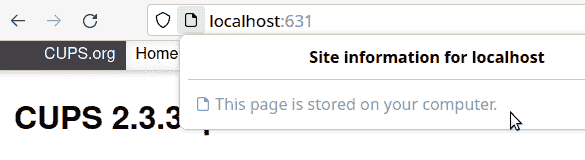

# 第十六章：使用 Dnsmasq 和 hosts 文件管理本地名称服务

[Dnsmasq](https://oreil.ly/MUa4U)是 LAN 名称服务的优秀服务器，包括域名系统（DNS）和动态主机配置协议（DHCP）。Dnsmasq 还提供 BOOTP、PXE 和 TFTP，用于从网络服务器引导和安装操作系统。Dnsmasq 支持 IPv4 和 IPv6，提供本地 DNS 缓存，并充当存根解析器。

本章介绍如何使用 Dnsmasq 和*/etc/hosts*文件设置本地 DNS 和 DHCP。*/etc/hosts*是设置 DNS 的非常古老的方式，它在静态文件中将主机名映射到 IP 地址。对于非常小的网络来说，*/etc/hosts*本身已经足够了。

Dnsmasq 专为 LAN 名称服务而设计。它轻巧且配置简单，特别是与权威 DNS 服务器 BIND 相比，后者功能强大且学习曲线较陡。

Dnsmasq 和*/etc/hosts*很好地配合在一起。Dnsmasq 会将*/etc/hosts*中的条目读入 DNS 中。

Dnsmasq 中的 DHCP 服务器会自动与 DNS 集成。您只需配置 DHCP 客户端将其主机名发送到 DHCP 服务器即可，这在大多数 Linux 发行版中是默认设置。

有四种类型的 DNS 服务器：递归解析器、根名称服务器、顶级域（TLD）名称服务器和权威名称服务器。

递归解析器响应 DNS 请求。像 Dnsmasq 和 systemd-resolved 这样的存根解析器会将其无法从缓存中回答的任何请求转发到上游解析器。当您访问一个网站时，递归解析器通过查询其他三种类型的 DNS 服务器来查找该站点的 DNS 信息。递归解析器会缓存这些信息以加快访问速度。您的 ISP 的名称服务器以及像[OpenDNS](https://oreil.ly/oCRsV)，[Cloudflare](https://oreil.ly/9Fgqc)，和[Google Public DNS](https://oreil.ly/lc9ep)这样的服务都是递归解析器。

有 13 种类型的根名称服务器，分布在全球各地，目前有数百个根名称服务器。根服务器接受来自递归解析器的查询，然后根据顶级域名（.com，.net，.org，.me，.biz，.int，.biz，.gov，.edu 等）将请求转发给适当的顶级域服务器。互联网名称与数字地址分配机构（[ICANN](https://icann.org)）监管所有这些服务器和域名。

权威名称服务器是域的源记录，由域所有者控制。虽然 Dnsmasq 可以作为您的权威名称服务器，但我建议使用 BIND。请参阅*man 8 dnsmasq*中的权威配置部分以了解更多信息。

# 太多的名称服务工具。

Linux 发行版仍在从传统的*resolvconf*转向 NetworkManager 和*systemd-resolved*，后者长期以来一直是 Linux 系统上的默认 DNS 解析器。这对 Linux 用户来说有些混乱，各个发行版的过渡速度不同。请密切关注您特定 Linux 版本的文档、论坛和发行说明。

可以使用 Dnsmasq 作为 NetworkManager 的 DNS 后端，因为 NetworkManager 有一个针对此功能的插件。但在某些 Linux 发行版上，这还不能正常工作（配方 16.5）。

您不需要在您的 Dnsmasq 服务器上运行 systemd-resolved，因为它会与 Dnsmasq 竞争系统的 stub DNS 解析器的控制权。

当您阅读此文时，所有这些可能已经不同，但目前这些配方旨在可靠而非尖端。

# 16.1 使用*/etc/hosts*进行简单名称解析

## 问题

您希望有一种简单快捷的方式设置名称解析，而无需运行 DNS 服务器。

## 解决方案

这就是*/etc/hosts*文件的用途。您的 LAN 计算机必须具有静态 IP 地址。以下是三台计算机的示例：

```
127.0.0.1 localhost
::1 localhost ip6-localhost ip6-loopback
192.168.43.81 host1
192.168.43.82 host2
192.168.43.83 host3
```

将这些条目复制到所有三个主机，然后尝试通过主机名进行 ping，例如从*host3*ping *host2*的示例：

```
host3:~$ ping -c2 host2
PING host2 (192.168.43.82) 56(84) bytes of data.
64 bytes from host2 (192.168.43.82): icmp_seq=1 ttl=64 time=3.00 ms
64 bytes from host2 (192.168.43.82): icmp_seq=2 ttl=64 time=3.81 ms

--- host2 ping statistics ---
2 packets transmitted, 2 received, 0% packet loss, time 1001ms
rtt min/avg/max/mdev = 3.001/3.403/3.806/0.402 ms

```

*/etc/hosts* 还管理域名，因此您可以为您的 LAN 提供一个酷炫的域名。在以下示例中，这是*sqr3l.nut*。首先输入 IP 地址，然后是完全限定域名（FQDN），然后是主机名：

```
127.0.0.1 localhost
::1 localhost ip6-localhost ip6-loopback
192.168.43.81 host1.sqr3l.nut host1
192.168.43.82 host2.sqr3l.nut host2
192.168.43.83 host3.sqr3l.nut host3
```

现在您的主机可以使用它们的主机名连接到彼此，例如*host1*，或者它们的 FQDN，例如*host1.sqr3l.nut*。

# 共享和个体主机条目

您可以在*/etc/hosts*中同时拥有共享和私有条目。您希望共享的内容必须复制到所有相关的主机。否则，您主机文件中的其他内容仅对您有效。参见配方 16.2 以了解更多信息。

## 讨论

*127.0.0.1 localhost* 和 *::1 localhost ip6-localhost ip6-loopback* 是必需的。您的可能看起来略有不同，但无论如何，请不要删除它们。它们分配给回环设备，这是您的 Linux 系统用于与自身通信的特殊虚拟网络接口。

您可以通过 ping 它们并使用它们连接到本地服务器。例如，当您使用 CUPS Web 管理页面时，您正在使用回环设备。输入*127.0.0.1:631*或*localhost:631*来打开它（图 16-1）。



###### 图 16-1\. 使用回环设备打开本地网页

回环设备的虚拟网络接口是*lo*。使用*ip*命令查看它：

```
$ ip addr show dev lo
1: lo: <LOOPBACK,UP,LOWER_UP> mtu 65536 qdisc noqueue state UNKNOWN group
  default qlen 1000
    link/loopback 00:00:00:00:00:00 brd 00:00:00:00:00:00
    inet 127.0.0.1/8 scope host lo
       valid_lft forever preferred_lft forever
    inet6 ::1/128 scope host
       valid_lft forever preferred_lft forever
```

您的系统不需要回环设备的物理网络接口才能工作。

使用*hostname*命令确认您的配置是否正确。检查计算机的主机名：

```
$ hostname
host1

```

检查完全限定域名：

```
$ hostname -f
host1.sqr3l.nut

```

检查域名：

```
$ hostname -d
sqr3l.nut

```

*/etc/hosts* 不适合大规模使用，但对于小型网络可能是您的本地 DNS 所需的一切。

## 参见

+   *man 5 hosts*

+   *man 8 ping*

+   Recipe 16.2

# 16.2 使用*/etc/hosts*进行测试和阻止烦人的事物

## 问题

您正在处理开发服务器，并且希望轻松管理它们的 DNS。或者，您希望通过简单的方式阻止烦人的网站。

## 解决方案

假设您正在使用的开发服务器的名称是*dev.stashcat.com*。在您的*/etc/hosts*文件中为它添加一个条目：

```
*192.168.10.15 dev.stashcat.com*
```

您不必打扰网络管理员或修改 DNS 服务器，只需根据需要在*/etc/hosts*中创建和删除条目。

另一个有趣的技巧是将烦人的网站映射到虚假的 IP 地址：

```
*12.34.56.78  badsite.com*
*12.34.56.78  www.badsite.com*
```

这使得从您的计算机无法访问该站点。大多数操作指南使用回环地址 127.0.0.1，它可以工作，但我更喜欢将烦人的站点保持单独。您可以为多个烦人的站点使用相同的虚假 IP 地址。

如果将其添加到*/etc/hosts*后，您的 Web 浏览器仍然能访问该站点，请清除浏览器缓存并重试。

## 讨论

在运行 LAN Dnsmasq 服务器时，请记住 Dnsmasq 服务器上*/etc/hosts*中的所有条目将应用于所有 Dnsmasq 客户端，因此不要在开发计算机上放置您的名称服务器。

Linux 有多个 DNS 管理器，*/etc/hosts*首先读取。顺序在*/etc/nsswitch.conf*文件的*hosts*行中设置。以下示例来自 Ubuntu 20.04：

```
hosts: files mdns4_minimal [NOTFOUND=return] dns mymachines
```

*files* 是*/etc/hosts*。

*mdns4_minimal* 使用 Avahi 自动发现服务来定位网络服务。

*[NOTFOUND=return]* 表示如果*mdns4_minimal*正在工作但未找到请求的主机，则 DNS 查找应停止并返回错误。如果未找到*mdns4_minimal*服务，则继续查找。

*dns* 使用任何可用的 DNS 服务器。

*mymachines* 指的是*systemd-machined*服务，用于跟踪本地虚拟机和容器。

您应该在您的 Dnsmasq 服务器上首先放置*files dns*。

## 参见

+   *man 5 hosts*

+   *man 5 nsswitch.conf*

+   *man 8 systemd-machined.service*

# 16.3 查找您网络上的所有 DNS 和 DHCP 服务器

## 问题

您想知道您的 LAN 上是否有任何 DNS 和 DHCP 服务器，除了您的 Dnsmasq 服务器。

## 解决方案

使用*nmap*探测您的 LAN。以下示例在本地网络中搜索所有开放的 TCP 端口，并找到一个开放的 TCP 端口 53，这是 DNS 使用的端口。这由“53/tcp open domain”指示：

```
$ sudo nmap --open *192.168.1.0/24*
Starting Nmap 7.70 ( https://nmap.org ) at 2021-05-23 13:25 PDT
[...]
Nmap scan report for dns-server.sqr3l.nut (192.168.1.10)
Host is up (0.12s latency).
Not shown: 998 filtered ports
Some closed ports may be reported as filtered due to --defeat-rst-ratelimit
PORT   STATE SERVICE
22/tcp open  ssh
53/tcp open  domain
[...]

Nmap done: 256 IP addresses (3 hosts up) scanned in 81.38 seconds
```

默认情况下，*nmap* 只查找 TCP 端口。DNS 服务器监听 TCP 和 UDP 53 端口，而 DHCP 监听 UDP 67 端口。以下示例仅查找 UDP 53 和 67 端口：

```
$ sudo nmap -sU -p 53,67 *192.168.1.0/24*
Starting Nmap 7.80 ( https://nmap.org ) at 2021-05-27 18:05 PDT

Nmap scan report for dns-server.sqr3l.nut (192.168.1.10)
Host is up (0.085s latency).

PORT   STATE         SERVICE
53/udp open          domain
67/udp open|filtered dhcps

Nmap done: 256 IP addresses (3 hosts up) scanned in 13.85 seconds

```

*nmap* 发现了一个 DNS/DHCP 服务器，位于 dns-server.sqr3l.nut 上。

以下命令在网络上搜索所有开放的 TCP 和 UDP 端口：

```
$ sudo nmap -sU -sT *192.168.1.0/24*
```

这需要几分钟的时间来完成，然后您将得到网络中所有活动主机的活动服务列表，包括在非标准端口上运行的任何服务。

## 讨论

在进行端口扫描时要非常小心，并且只在你有权限的网络上使用。在其他网络上进行端口扫描通常被视为敌对行为，就像你在探测漏洞以利用一样。

多个名称服务器可能会导致冲突，在任何情况下，了解用户是否运行任何服务器都是很好的。

在大多数 Linux 系统上，安装包是*nmap*。

## 另请参阅

+   *man 1 nmap*

# 16.4 安装 Dnsmasq

## 问题

你希望安装 Dnsmasq 并处理任何先决条件。

## 解决方案

安装*dnsmasq*包。在本示例中，Dnsmasq 服务器命名为*dns-server*。你将同时使用 Dnsmasq 和*/etc/hosts*文件配置你的 DNS 服务器。

安装后，如果运行了 Dnsmasq，请停止它：

```
$ systemctl status dnsmasq.service
● dnsmasq.service - dnsmasq - A lightweight DHCP and caching DNS server
     Loaded: loaded (/lib/systemd/system/dnsmasq.service; enabled; vendor
     preset: enabled)
     Active: active (running) since Mon 2021-05-24 05:49:36 PDT; 6h ago
[...]
$ sudo systemctl stop dnsmasq.service

```

如果你的 Dnsmasq 服务器还没有静态 IP 地址，请给它分配一个。可以使用 NetworkManager 的图形控制面板（*nm-connection-editor*）或*nmcli*命令来完成。

以下示例使用*nmcli*来查找你的活动连接：

```
$ nmcli connection show --active
NAME       UUID                     TYPE      DEVICE
*1local*     3e348c97-4c5f-4bbf-967e  wifi      *wlan1*
*1wired*     0460d735-e14d-3c3f-92c0  ethernet  *eth1*
```

然后使用名称来分配你希望你的 DNS 服务器使用的静态 IP 地址，使用 NAME 来识别正确的连接：

```
$ nmcli con mod "*1wired*" \
  ipv4.addresses "*192.168.1.30/24*" \
  ipv4.gateway "*192.168.1.1*" \
  ipv4.method "manual"
```

然后重新启动 NetworkManager：

```
$ sudo systemctl restart NetworkManager.service

```

接下来，检查你的 Linux 是否运行*systemd-resolved.service*：

```
$ systemctl status systemd-resolved.service
```

如果是这样，请在配置 Dnsmasq 之前查看 Recipe 16.5，还要了解如何在你的 Dnsmasq 服务器上配置 NetworkManager。

## 讨论

systemd 在各种 Linux 发行版中实现方式不同。例如，openSUSE Leap 15.2 不使用*systemd-resolved.service*，因此不需要对 systemd 进行任何更改来启用 Dnsmasq 以控制你的 LAN DNS。Fedora 33 及更高版本，以及 Ubuntu 17.04 及更高版本，运行*systemd-resolved.service*，你应该在 Dnsmasq 服务器上禁用它。

## 另请参阅

+   Recipe 16.5（玩得和谐）

+   [Dnsmasq](https://oreil.ly/vvfHg)

# 16.5 让 systemd-resolved 和 NetworkManager 与 Dnsmasq 协调工作

## 问题

*systemd-resolved*和 NetworkManager 与 Dnsmasq 冲突，你希望它们不再干扰。

## 解决方案

检查是否运行*systemd-resolved.service*：

```
$ systemctl status systemd-resolved.service

● systemd-resolved.service - Network Name Resolution
     Loaded: loaded (/usr/lib/systemd/system/systemd-resolved.service; enabled;
     vendor preset: enabled)
     Active: active (running) since Sat 2021-05-22 12:57:34 PDT; 1min 21s ago
[...]
```

这表明它正在运行。*systemd-resolved.service*非常适合为客户机提供桩 DNS 解析器，但不适合 DNS 服务器。禁用它：

```
$ sudo systemctl stop systemd-resolved.service
$ sudo systemctl disable systemd-resolved.service
```

然后查看*/etc/resolv.conf*，它应该是一个符号链接：

```
$ ls -l /etc/resolv.conf
lrwxrwxrwx 1 root root 39 May 21 20:38 /etc/resolv.conf ->
   ../run/systemd/resolve/stub-resolv.conf

```

当它是一个符号链接时，它由*systemd-resolved.service*管理。要从*systemd-resolved.service*中删除控制权，请删除符号链接，并创建一个同名的纯文本文件：

```
$ sudo rm /etc/resolv.conf
$ sudo touch /etc/resolv.conf

```

现在*/etc/resolv.conf*是一个文件而不是一个符号链接，由 NetworkManager 管理。打开你的 NetworkManager 配置文件，查找*[main]*部分，然后添加或更改*dns=*值为*none*：

```
$ sudo nano /etc/NetworkManager/NetworkManager.conf

[main]
dns=none
```

在*/etc/resolv.conf*中输入你的 Dnsmasq 服务器的 IPv4 和 IPv6 本地主机地址，以及你的本地域（如果有）：

```
search *sqr3l.nut*
nameserver 127.0.0.1
nameserver ::1
```

然后重新启动并配置你的新 Dnsmasq 安装。

## 讨论

NetworkManager 和 *systemd-resolved* 在客户端机器上很棒。在您的 Dnsmasq 服务器上，您必须控制 */etc/resolv.conf*，并且 Dnsmasq 应该是唯一的存根解析器。

## 参见

+   *man 8 systemd-resolved.service*

+   *man 8 networkmanager*

# 16.6 配置 LAN DNS 的 Dnsmasq

## 问题

您希望将 Dnsmasq 设置为 LAN DNS 服务器。

## 解决方案

您在 */etc/hosts* 中输入的任何主机都需要静态 IP 地址，Dnsmasq 将自动将它们输入到 DNS 中。至少输入您的 Dnsmasq 服务器。以下示例包括 Dnsmasq 服务器、备用服务器和内部 Web 服务器：

```
127.0.0.1 localhost
::1 localhost ip6-localhost ip6-loopback
192.168.43.81 dns-server
192.168.43.82 backups
192.168.43.83 https

```

# 从 DHCP 配置静态主机

参见 Recipe 16.12 以了解如何从 DHCP 管理静态 IP 地址分配，而不是 */etc/hosts*。

现在是配置 Dnsmasq 的时候了。重命名默认配置文件，这样您可以从新的空文件开始，并将原始文件用作参考：

```
$ sudo mv /etc/dnsmasq.conf /etc/dnsmasq.conf-old
$ sudo nano /etc/dnsmasq.conf

```

复制以下配置，用您自己服务器的 IP 地址替换第二个 *listen-address*，并使用您自己的域名。上游名称服务器是 OpenDNS，您可以使用任何上游名称服务器。Dnsmasq 默认查找 */etc/resolv.conf*，但明确指定也无妨：

```
# global options
resolv-file=/etc/resolv.conf
domain-needed
bogus-priv
expand-hosts
domain=*sqr3l.nut*
local=/*sqr3l.nut*/
listen-address=127.0.0.1
listen-address=*192.168.43.81*

# upstream name servers
server=*208.67.222.222*
server=*208.67.220.220*

```

运行 Dnsmasq 的语法检查器：

```
$ dnsmasq --test
dnsmasq: syntax check OK.

```

语法检查器不会找到配置错误，但只会找到打字错误。启动 Dnsmasq，如果有错误它将无法启动。以下示例显示了一个成功启动的情况：

```
$ sudo systemctl start dnsmasq.service
$ systemctl status dnsmasq.service
● dnsmasq.service - dnsmasq - A lightweight DHCP and caching DNS server
     Loaded: loaded (/lib/systemd/system/dnsmasq.service; enabled; vendor preset:
     enabled)
     Active: active (running) since Mon 2021-05-24 17:13:48 PDT; 1min 0s ago
    Process: 11023 ExecStartPre=/usr/sbin/dnsmasq --test (code=exited,
     status=0/SUCCESS)
    Process: 11024 ExecStart=/etc/init.d/dnsmasq systemd-exec (code=exited,
     status=0/SUCCESS)
    Process: 11033 ExecStartPost=/etc/init.d/dnsmasq systemd-start-resolvconf
     (code=exited, status=0/SUCCESS)
   Main PID: 11032 (dnsmasq)
      Tasks: 1 (limit: 18759)
     Memory: 2.5M
     CGroup: /system.slice/dnsmasq.service
             └─11032 /usr/sbin/dnsmasq -x /run/dnsmasq/dnsmasq.pid -u dnsmasq -7
              /etc/dnsmasq.d,.dpkg-dist,.dpkg-old,.dpkg-new --local->

May 24 17:13:48 dns-server systemd[1]: Starting dnsmasq - A lightweight DHCP and
 caching DNS server...
May 24 17:13:48 dns-server dnsmasq[11023]: dnsmasq: syntax check OK.
May 24 17:13:48 dns-server systemd[1]: Started dnsmasq - A lightweight DHCP and
 caching DNS server.

```

在您的 Dnsmasq 服务器上使用 *nslookup* 运行一些测试，使用您服务器的主机名和 FQDN：

```
$ nslookup *dns-server*
Server:         127.0.0.1
Address:        127.0.0.1#53

Name:   *dns-server*
Address: *192.168.43.81*

$ nslookup *dns-server.sqr3l.nut*
Server:         127.0.0.1
Address:        127.0.0.1#53

Name:   *dns-server.sqr3l.nut*
Address: *192.168.43.81*

$ nslookup *192.168.43.81*
*18.43.168.192*.in-addr.arpa       name = *host1.sqr3l.nut.*

```

使用 *ss* 命令验证监听端口。在以下示例中，为了清晰起见，已删除了 Recv-Q、Send-Q 和 Peer Address:Port 列：

```
$ sudo ss -lp "sport = :domain"
Netid  State   Local Address:Port    Process
udp    UNCONN     127.0.0.1:domain   users:(("dnsmasq",pid=1531,fd=8))
udp    UNCONN  *192.168.1.10*:domain   users:(("dnsmasq",pid=1531,fd=6))
tcp    LISTEN     127.0.0.1:domain   users:(("dnsmasq",pid=1531,fd=9))
tcp    LISTEN  *192.168.1.10*:domain   users:(("dnsmasq",pid=1531,fd=7))

```

您应该看到您的服务器地址、本地主机地址，并且在进程列中只有 *dnsmasq*。添加 *-r* 选项以查看主机名而不是 IP 地址。

当所有这些命令成功执行时，您的配置就是正确的。

## 讨论

如果 Dnsmasq 启动失败，请运行 *journalctl -ru dnsmasq* 查看原因。（如果您的 Dnsmasq 日志发送到其他地方，请查看那里；参见 Recipe 16.14。）

*nslookup* 包含在 *bindutils* 包中。

*ss*，套接字统计，包含在 *iproute2* 包中。

如果您的 *nslookup* 命令失败，请尝试重新启动网络，然后重新启动 Dnsmasq。如果它们仍然失败，请重启。如果这不能解决问题，请重新检查所有配置。

*domain-needed* 防止 Dnsmasq 转发对您的纯主机名的查询到上游名称服务器。如果名称在 */etc/hosts* 或 DHCP 中未知，则返回“未找到”答案。这可以防止您 LAN 地址的请求泄漏到全球，并且如果您的 LAN 域名与公共域名相同，可能会被错误地回答。

*bogus-priv* 阻止虚假的私有反向查找。对于未在 */etc/hosts* 或 DHCP 租约文件中找到的私有 IP 范围的所有反向查找，都将返回“无此域”而不是转发到上游。

*expand-hosts* 自动将您的私有域名添加到*/etc/hosts* 中的纯主机名。

*domain=* 是您的本地域名。

*local=/[domain]/* 告诉 Dnsmasq 直接解析本地域的查询，而不将其转发到上游。

## 另请参阅

+   *man 5 hosts*

+   [Dnsmasq](https://oreil.ly/vvfHg)

# 16.7 配置 firewalld 允许 DNS 和 DHCP

## 问题

您需要打开您的 Dnsmasq 服务器防火墙，以允许您的 LAN 客户端访问它。

## 解决方案

开放 TCP 和 UDP 端口 53 用于 DNS，以及 UDP 端口 67 用于 DHCP。如果您正在运行*firewalld*，请使用以下命令：

```
$ sudo firewall-cmd --permanent --add-service=\{dns,dhcp\}

```

## 讨论

在您遇到连接问题时，首先要检查的是防火墙设置。

## 另请参阅

+   第十四章

# 16.8 从客户端机器测试您的 Dnsmasq 服务器

## 问题

您希望从客户端计算机测试您全新的 Dnsmasq DNS 服务器。

## 解决方案

使用*dig* 命令从网络中的任何主机查询任何网站，通过您的 Dnsmasq 服务器的 IP 地址：

```
$ dig @*192.168.1.10* oreilly.com

; <<>> DiG 9.16.6 <<>> @*192.168.1.10* oreilly.com
; (1 server found)
;; global options: +cmd
;; Got answer:
;; ->>HEADER<<- opcode: QUERY, status: NOERROR, id: 29387
;; flags: qr rd ra; QUERY: 1, ANSWER: 2, AUTHORITY: 0, ADDITIONAL: 1

;; OPT PSEUDOSECTION:
; EDNS: version: 0, flags:; udp: 4096
;; QUESTION SECTION:
;oreilly.com.                   IN      A

;; ANSWER SECTION:
oreilly.com.            240     IN      A       199.27.145.65
oreilly.com.            240     IN      A       199.27.145.64

;; Query time: 108 msec
;; SERVER: *192.168.1.10*#53(*192.168.1.10*)
;; WHEN: Mon May 24 17:49:32 PDT 2021
;; MSG SIZE  rcvd: 72
```

这是一次成功的测试，确认为“status: NOERROR”，并显示了您的 Dnsmasq 服务器的 IP 地址的 SERVER 行。

## 讨论

您还可以使用您服务器的主机名和完全限定域名（FQDN）进行测试：

```
$ dig @*dns-server* oreilly.com
$ dig @*dns-server.sqr3l.nut* oreilly.com
```

## 另请参阅

+   *man 1 dig*

# 16.9 使用 Dnsmasq 管理 DHCP

## 问题

您的 DNS 已经工作正常，现在您想设置 DHCP。

## 解决方案

没问题。将以下行添加到您的*/etc/dnsmasq.conf* 文件中，定义一个地址池，替换为您自己想要的地址：

```
# DHCP range
dhcp-range=*192.168.1.25,192.168.1.75,12h*
dhcp-lease-max=*25*

```

重新启动 Dnsmasq：

```
$ sudo systemctl restart dnsmasq.service

```

尝试在 LAN 计算机上获取地址。首先确保它配置为通过 DHCP 获取其 IP 地址：

```
$ nmcli con show --active
NAME    UUID                     TYPE     DEVICE
*1net*    de7c00e7-8e4d-45e6-acaf  ethernet eth0

$ nmcli con show *1net* | grep ipv..method
ipv4.method:           auto
ipv6.method:           auto

```

*auto* 确认它是一个 DHCP 客户端。（如果显示*manual* 则不是。）将接口关闭然后再次打开：

```
$ sudo nmcli con down *1net*
Connection '1net' successfully deactivated (D-Bus active path: /org/freedesktop/
NetworkManager/ActiveConnection/11

$ sudo nmcli con up *1net*
Connection successfully activated (D-Bus active path: /org/freedesktop/NetworkMan
ager/ActiveConnection/15)
```

检查您的 Dnsmasq 服务器日志：

```
$ journalctl -ru dnsmasq
-- Logs begin at Sun 2021-02-28 14:35:01 PST, end at Mon 2021-05-31 17:36:04
 PDT. --
May 31 17:34:56 dns-server dnsmasq-dhcp[8080]: DHCPACK(eth0) 192.168.1.45
 9c:ef:d5:fe:01:7c client2
May 31 17:34:56 dns-server dnsmasq-dhcp[8080]: DHCPREQUEST(eth0) 192.168.1.45
9c:ef:d5:fe:01:7c
```

这显示了从*dns-server* 成功向*client2* 分配 IP 地址。

## 讨论

您可以使用 NetworkManager 面板小程序而不是*nmcli*，或运行*nm-connection-editor* 命令打开 NetworkManager 的图形配置程序，然后通过鼠标点击断开连接并重新连接（图 16-2）。

大多数 Linux 发行版使用 NetworkManager 控制客户端的 DHCP。如果您的发行版没有使用，可能使用*dhclient*。查找一个*dhclient.conf* 配置文件，如果存在，则使用*dhclient* 命令请求一个新的租约：

```
$ sudo dhclient -v
Internet Systems Consortium DHCP Client 4.3.6-P1
Copyright 2004-2018 Internet Systems Consortium.
All rights reserved.
For info, please visit https://www.isc.org/software/dhcp/

Listening on LPF/*eth0/9c:ef:d5:fe:01:7c*
Sending on   LPF/*eth0/9c:ef:d5:fe:01:7c*
Sending on   Socket/fallback
DHCPREQUEST on *eth0* to 255.255.255.255 port 67 (xid=0xec8923)
DHCPACK from *192.168.1.10* (xid=0xec8923)
bound to *192.168.1.27* -- renewal in 1415 seconds.

```

您可以通过 DHCP 发送一些客户机器需要的信息以访问网络服务。参见食谱 16.10 了解更多信息。


###### 图 16-2\. 使用 nm-connection-editor 管理网络连接

*dhcp-range=192.168.1.25,192.168.10.75,24h* 定义了一个包含 50 个可用地址租约的范围，租约时间为 24 小时。此范围不得包括您的 Dnsmasq 服务器或任何具有静态 IP 地址的主机。定义租约时间的单位可以是秒、分钟或小时。默认为一小时，最小为两分钟。如果希望租约永不过期，请不要指定租约时间。

*dhcp-lease-max=25*定义同时活动的租约数量。您可以拥有一个大的地址池，并限制活动租约的数量。

## 参见

+   Recipe 16.10

+   [Dnsmasq](https://oreil.ly/vvfHg)

+   *man 8 dhclient*

# 16.10 在 DHCP 上宣传重要服务

## 问题

您希望向 LAN 客户端通过 DHCP 宣传各种服务器。

## 解决方案

一些服务（如默认的网关、DNS 服务器和 NTP 服务器）可以向您的 LAN 客户自动宣传，使其自动使用它们。以下示例显示如何配置*/etc/dnsmasq.conf*以宣传一些服务。

设置默认路由器：

```
dhcp-option=3,*192.168.1.1*
```

宣传您的 DNS 服务器：

```
dhcp-option=6,*192.168.1.10*
```

此示例指向您的本地 NTP 服务器的方法：

```
dhcp-option=42,*192.168.1.11*
```

您如何知道要使用哪些数字？使用此命令列出所有这些数字：

```
$ dnsmasq --help dhcp
Known DHCP options:
  1 netmask
  2 time-offset
  3 router
  6 dns-server
  7 log-server
  9 lpr-server
  [...]

```

## 讨论

*dnsmasq --help dhcp* 显示已知的 DHCPv4 配置选项。有关 DHCPv4 配置选项的更多信息，请参见 Recipe 16.11 中的讨论。

## 参见

+   [Dnsmasq](https://oreil.ly/vvfHg)

# 16.11 为子网创建 DHCP 区域

## 问题

您有两个子网，希望配置 Dnsmasq 为它们应用不同的选项，如不同的默认路由器和服务器。

## 解决方案

定义您想要给它们的任何名称的区域，比如 *zone1* 和 *zone2*，并设置它们的地址范围：

```
dhcp-range=*zone1,192.168.50.20,192.168.50.120*
dhcp-range=*zone2,192.168.60.20,192.168.60.50,24h*

```

两个区域有不同的路由器：

```
dhcp-option=*zone1,3,192.168.50.1*
dhcp-option=*zone2,3,192.168.60.2*

```

他们使用相同的 DNS 服务器：

```
dhcp-option=*zone1,6,192.168.1.10*
dhcp-option=*zone2,6,192.168.1.10*
```

*zone2* 获取一个 NTP 服务器：

```
dhcp-option=*zone2,42,192.168.60.15*

```

## 讨论

只有少数 DHCP 选项是有用的。它们非常古老，有些神秘，例如：

> 选项 default-url string;
> 
> 此选项的格式和含义未在任何标准文档中描述，但据称被苹果电脑使用。不知道客户端如果提供此选项可能会做出什么合理的反应。使用需谨慎。
> 
> man 5 DHCP 选项

对许多客户端支持不一致。我只使用 NTP、路由器和 DNS 服务器。

## 参见

+   *man 5 dhcp*

+   [Dnsmasq](https://oreil.ly/vvfHg)

# 16.12 从 DHCP 分配静态 IP 地址

## 问题

您希望尽可能集中 IP 地址分配，包括分配静态 IP 地址。

## 解决方案

在 */etc/dnsmasq.conf* 中使用 *dhcp-host* 选项。通过主机名标识客户机，并从您的 LAN 地址块中分配一个未使用的地址。（对于静态地址，不必使用您在 */etc/dnsmasq.conf* 中使用 *_dhcp-range=* 选项定义的 DHCP 地址范围。）以下示例将一个地址分配给位于 192.168.3.0/24 网络中的*server2*：

```
dhcp-host=*server2,192.168.3.45*
```

重新启动 Dnsmasq，那么下次*server2*请求地址时，将收到*dhcp-host=*选项指定的地址。

使用多个 *dhcp-host=* 行来配置多个客户端，每行一个。

您可以使用客户端的 MAC 地址代替主机名。

## 讨论

一般来说，集中管理行政事务可以节省时间和麻烦。

## 参见

+   [Dnsmasq](https://oreil.ly/vvfHg)

# 16.13 配置 DHCP 客户端以自动输入 DNS 条目

## 问题

您希望您的 DHCP 客户端由 Dnsmasq 自动输入 DNS。

## 解决方案

客户端唯一需要做的事情是将其主机名发送到 Dnsmasq 的 DHCP 服务器，这在大多数 Linux 系统中是默认的。

假设本地*sqr3l.nut*域上的 DHCP 客户端使用主机名*client4*。*client4*启动，并从 Dnsmasq 接收其 IP 地址和其他网络信息。Dnsmasq 接收*client4*的主机名并将其输入 DNS。现在网络上的其他主机可以访问*client4*和*client4.sqr3l.nut*。

*/etc/hosts*中不能有*client4*的重复条目。

有三种不同的方法可以检查您的 DHCP 客户端配置：在*dhclient.conf*中，使用 NetworkManager 的图形配置工具*nm-connection-editor*，以及使用*nmcli*命令。

首先检查*dhclient*，它多年来一直是 Linux 上的默认 DHCP 客户端。在大多数 Linux 系统中，其配置文件位于*/etc/dhcp/dhclient.conf*。查找此行，自动找到系统的主机名并将其发送到 DHCP 服务器：

```
send host-name = gethostname();
```

Or a line like this, specifying the system’s hostname:

```
send host-name = *myhostname*
```

如果没有*dhclient.conf*文件，那么 NetworkManager 是您的 DHCP 客户端管理器。您可以在图形的*nm-connection-editor*中检查此设置（图 16-3）。


###### 图 16-3\. NetworkManager 将客户端主机名发送到 DHCP 服务器

当连接方式为“自动（DHCP）”时，NetworkManager 会将主机名发送到 DHCP 服务器。“仅自动（仅地址）”不会将主机名发送到 DHCP 服务器，但仅为客户端提供 DNS。

您也可以使用*nmcli*命令。首先找到您的活动网络连接：

```
$ nmcli connection show --active
NAME    UUID                                  TYPE      DEVICE
*wifi1   3e348c97-4c5f-4bbf-967e-7624f3e1e4f0*  wifi      *wlan1*
```

然后验证它是否将主机名发送到您的 DHCP 服务器。以下示例确认它确实这样做：

```
$ nmcli connection show *wifi1* | grep send-hostname
ipv4.dhcp-send-hostname:                yes
ipv6.dhcp-send-hostname:                yes
```

如果它显示*no*，则运行以下命令将其设置为*yes*。之后重新加载配置：

```
$ sudo nmcli con mod *wifi1* ipv4.dhcp-send-hostname yes
$ sudo nmcli con mod *wifi1* ipv6.dhcp-send-hostname yes
$ sudo nmcli con reload
```

## 讨论

如果您更喜欢使用 NetworkManager 的图形工具来管理 NetworkManager，则最好使用 NetworkManager 的图形配置实用程序*nm-connection-editor*，而不是其他图形工具，例如 GNOME 控制面板中的网络模块。*nm-connection-editor*提供了最完整的配置选项，并且在所有 Linux 发行版上都是相同的。

## 参见

+   *man 1 nmcli*

+   *man 1 nmcli-examples*

+   *man 5 nm-settings*

# 16.14 管理 Dnsmasq 日志记录

## 问题

Dnsmasq 有选项使用传统的*syslog*守护程序将其消息发送到您选择的文件，而不是*journalctl*，您想知道哪种是最佳选项。

## 解决方案

无论您使用哪种方法，都会记录相同的信息。默认行为是记录到 systemd 日志中。

将 Dnsmasq 的日志独立放在自己的目录中会更方便，比如 */var/log/dnsmasq/dnsmasq.log*。在 */etc/dnsmasq.conf* 中使用 *log-facility=* 选项指定你想要使用的日志文件，然后重新启动 Dnsmasq。文件必须已经存在，否则 Dnsmasq 将无法启动。

如果不设置日志轮换，你的日志文件会变得非常大。下面是一个简单的每周轮换的例子配置，*/etc/logrotate.d/dnsmasq*：

```
/var/log/dnsmasq/dnsmasq.log {
    missingok
    compress
    notifempty
    rotate 4
    weekly
    create
    }
```

使用 *logrotate* 命令进行测试：

```
$ sudo /etc/logrotate.conf --debug
[...]
rotating pattern: /var/log/dnsmasq/dnssmasq.log  weekly (4 rotations)
empty log files are not rotated, old logs are removed
switching euid to 0 and egid to 4
considering log /var/log/dnsmasq/dnssmasq.log
Creating new state
  Now: 2021-06-01 13:08
  Last rotated at 2021-06-01 13:00
  log does not need rotating (log has been already rotated)
switching euid to 0 and egid to 0
[...]
```

没有显示错误，一切正常工作。

## 讨论

systemd 同时支持 *journalctl* 和 *syslog* 守护程序。它们可能长期共存，因此你可以按照你喜欢的方式设置日志记录。

## 参见

+   *man 8 rsyslog*

+   [Dnsmasq](https://oreil.ly/vvfHg)

+   *man 1 journalctl*

+   第二十章

# 16.15 配置通配符域名

## 问题

你想在 Dnsmasq 中创建一个通配符域名，这样请求该域的子域将无需手动添加即可解析到你的 DNS。

## 解决方案

在 */etc/dnsmasq.conf* 中使用 *address* 选项创建顶级域名（TLD）：

```
address=/*wildcard.net/192.168.1.35*
```

重新启动 Dnsmasq，然后运行 *nslookup* 进行测试：

```
$ sudo systemctl restart dnsmasq.service
$ nslookup *foo.wildcard.net*
Server:         127.0.0.1
Address:        127.0.0.1#53

Name:   *foo.wildcard.net*
Address: 192.168.1.35
```

*foo.wildcard.net* 被解析，证明工作正常。

## 讨论

谨慎使用 DNS 通配符。在处理像 Kubernetes 这样复杂服务的开发工作时，通配符非常有用。确保使用的地址范围不同于你 LAN 上的名称服务器范围，并且仅对 LAN 客户端可用。

## 参见

+   [Dnsmasq](https://oreil.ly/vvfHg)
