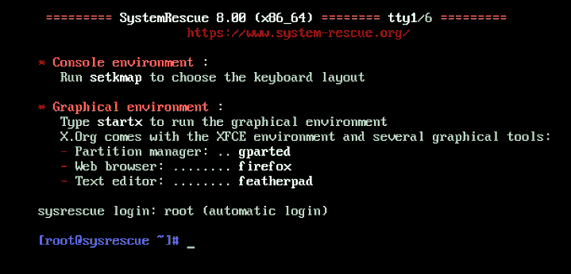
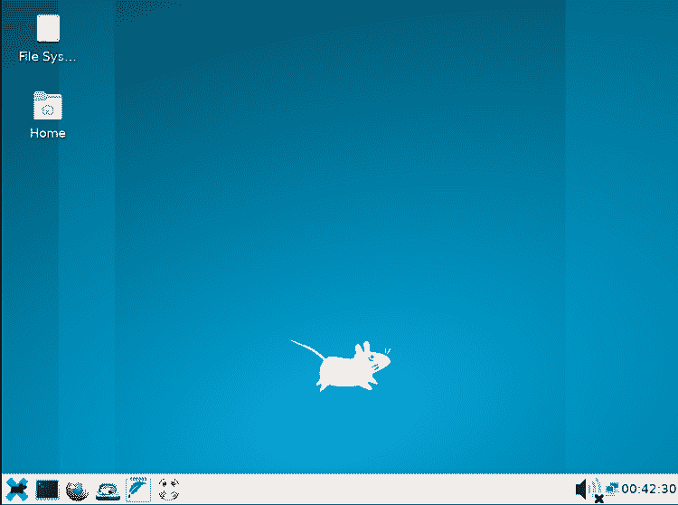
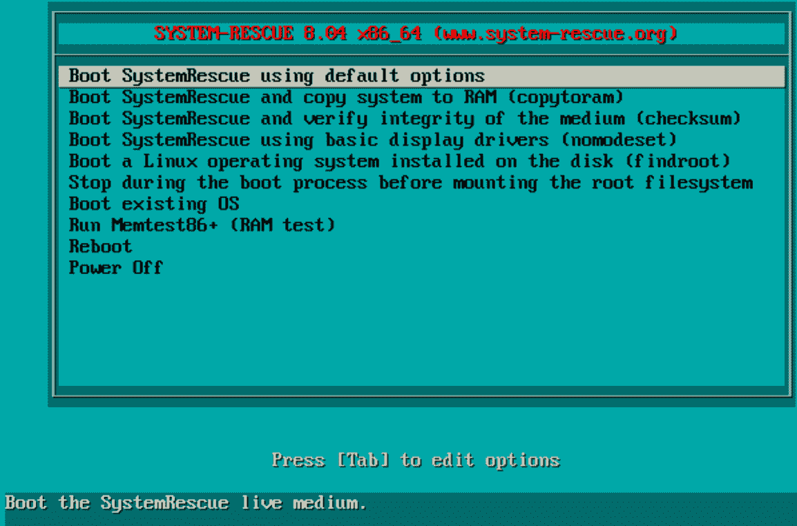
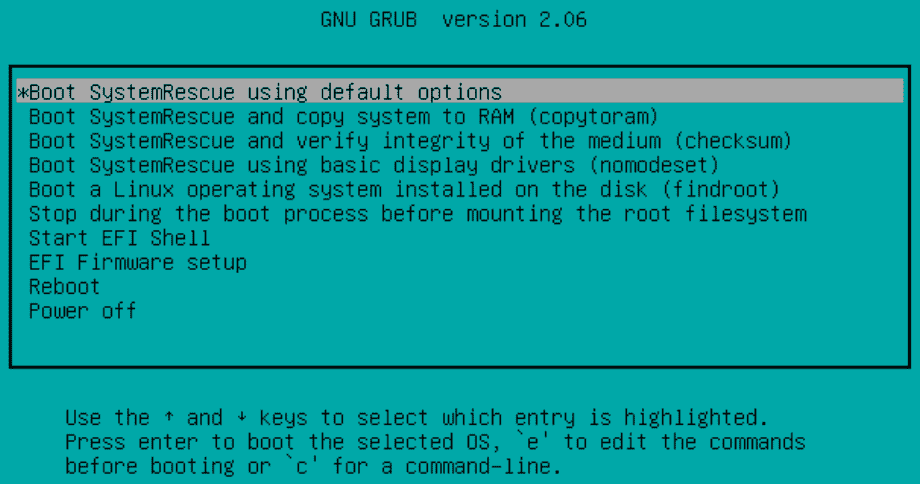
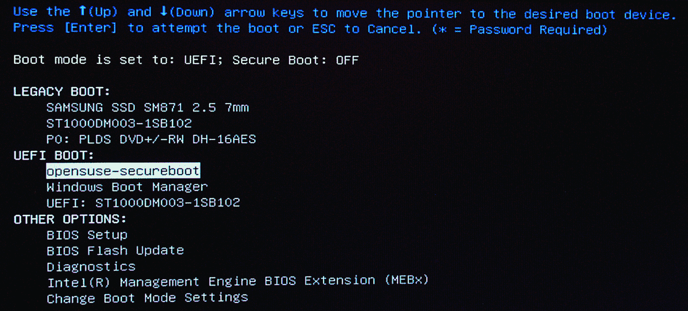
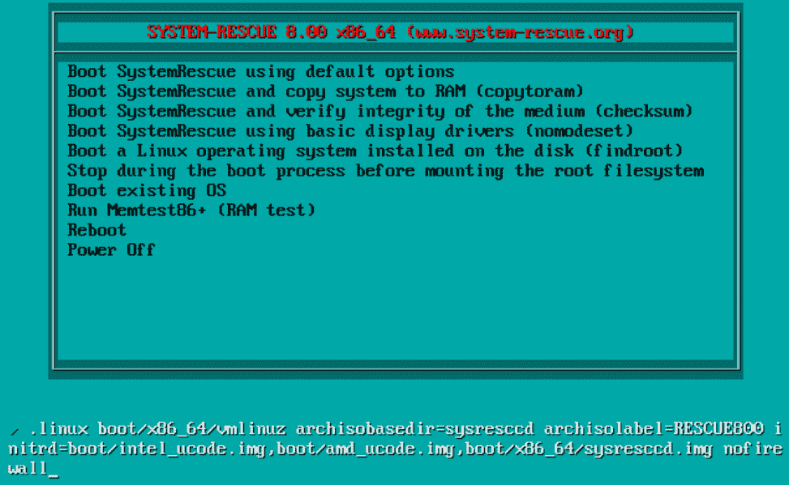
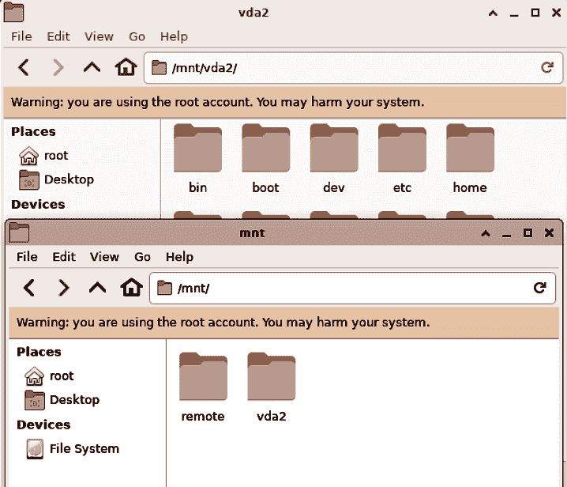
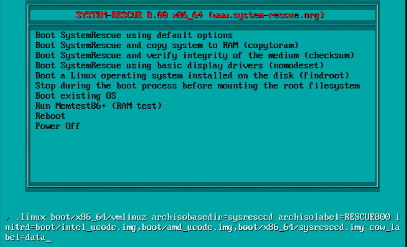

# 第十九章：SystemRescue 与 SystemRescue 的系统恢复

SystemRescue DVD 或 USB 驱动器是一个必备工具，您可以使用它来救援非启动的 Linux 和 Windows 系统。在本章中，您将学习如何创建 SystemRescue 引导介质，如何在 SystemRescue 中找到您所需的内容，自定义引导选项，修复 GRUB，从故障磁盘中恢复文件，重置 Linux 和 Windows 密码，以及将 SystemRescue 从只读文件系统转换为带有数据分区的读写文件系统。

任何 Live Linux 都可以用作救援系统。SystemRescue 的优势在于其小巧的体积，专为救援操作而设计。

root 用户的 SystemRescue 文件系统是只读的，因此关闭后会丢失所有更改。您将学习如何设置以保留更改，如配置、外观和添加软件。

SystemRescue 最初基于 Gentoo Linux，自 6.0 版本起改为基于 Arch Linux 构建。Arch Linux 以其可靠和高效的特性而闻名，拥有一流的文档。请访问[*https://archlinux.org*](https://archlinux.org)获取文档和论坛。

我更喜欢使用 USB 设备进行 SystemRescue，包括 U 盘和 USB 硬盘。它们速度快，而且容量足够大，可以满足你复制文件的需求。

# 19.1 创建您的 SystemRescue 可引导设备

## 问题

您希望制作一个 SystemRescue DVD 或 USB 驱动器。

## 解决方案

从[*https://system-rescue.org*](https://system-rescue.org)下载最新的 SystemRescue *.iso*文件。

创建可引导 SystemRescue USB 存储设备的最可靠方法是使用*dd*命令（参见 Recipe 1.6）。参见 1.4 和 1.5 中的 Recipes，了解创建可引导 DVD 的说明。第一章还描述了如何引导到新介质以及如何禁用安全启动。SystemRescue 不包括签名密钥，因此您必须禁用安全启动。

当您从 USB 存储设备引导时，请将其插入计算机的 USB 端口，而不是 USB 集线器，因为在集线器上可能无法识别。

## 讨论

使用 SystemRescue 完成后，请记得重新启用安全启动。

## 参见

+   [*https://system-rescue.org*](https://system-rescue.org)

+   第一章

# 19.2 开始使用 SystemRescue

## 问题

您已启动 SystemRescue，并停留在简单的控制台提示符处，需要知道接下来该做什么。

## 解决方案

SystemRescue 在初始登录屏幕上为您提供说明（图 19-1）。您会自动以 root 用户登录，无需输入 root 密码。

您可以在控制台工作，也可以输入**`startx`**来启动 Xfce4 桌面环境（参见图 19-2）。



###### 图 19-1\. SystemRescue 登录屏幕



###### 图 19-2\. SystemRescue Xfce4 桌面环境

探索应用程序菜单，调整 Xfce 的外观，使用 NetworkManager 连接网络，并像任何 Linux 系统一样关闭或重新启动。

## 讨论

使用存储在压缩只读 SquashFS 文件系统中的系统救援镜像，唯一不能做到的是对其自身配置进行持久更改。因此，任何更改都不会在重启后保存。然而，你可以设置以保留你的更改；参见第 19.14 节。

SquashFS 是许多 Live Linux 发行版的基础，如 Ubuntu、Debian、Mint、Fedora 和 Arch。它还被开源路由器固件项目 DD-WRT 和 OpenWRT 使用。SquashFS 轻量且快速。

我喜欢使用 Xfce4，因为它提供了轻量级的图形环境和应用程序，以及用于命令行操作的 X 终端。

## 参见

+   [*https://system-rescue.org*](https://system-rescue.org)

+   [*https://xfce.org*](https://xfce.org)

# 19.3 理解 SystemRescue 的两个引导屏幕

## 问题

在测试 SystemRescue 时，你注意到有两个不同的引导屏幕，想知道它们的作用是什么。

## 解决方案

根据启动 SystemRescue 的方式，有两个不同的引导屏幕。你将看到一个传统 BIOS 引导屏幕（见图 19-3）和一个 UEFI 引导屏幕（见图 19-4）。

当我戴尔系统上的 UEFI 设置允许启动传统设备时，一次性引导菜单（启动时按 F12）将显示所有可能的启动选项（见图 19-5）。SystemRescue 支持 UEFI，因此不需要启用传统引导。（请记住，要启动 SystemRescue，必须禁用安全启动。）

你的系统的 BIOS/UEFI 可能与我的不同，因为它们各不相同。



###### 图 19-3\. SystemRescue 传统 BIOS 引导屏幕



###### 图 19-4\. SystemRescue 的 UEFI 引导屏幕



###### 图 19-5\. 戴尔一次性引导菜单显示所有可能的启动选项

两个引导屏幕的主要区别在于 SystemRescue 的 UEFI 引导屏幕具有“启动 EFI Shell”和“EFI 固件设置”选项，这些选项不适用于传统 BIOS 引导。

传统 BIOS 引导屏幕没有两个 EFI 选项，但包括 Memtest86+用于测试系统内存。

参见第 19.4 节了解不同的 SystemRescue 引导选项。

## 讨论

你可以将可移动介质配置为默认启动设备。然后，你无需麻烦地进入 BIOS/UEFI 以启用不同的启动设备或等待合适的时机调用一次性启动菜单；只需在需要时插入可移动启动介质即可。

如果你正在使用没有 UEFI 的旧系统，你不必选择或麻烦于安全启动。

## 参见

+   [*https://system-rescue.org*](https://system-rescue.org)

+   第一章

+   第 19.4 节

# 19.4 理解 SystemRescue 的引导选项

## 问题

您想知道所有这些 SystemRescue 引导选项是用来做什么的（第 19.3 节）。

## 解决方案

引导菜单选项是最常用的引导选项的快捷方式，省去了打开编辑表单和输入它们的麻烦。在大多数情况下，您将使用第一个引导选项，“使用默认选项启动 SystemRescue”。

第二个选项，“启动 SystemRescue 并将其复制到 RAM 中 (copytoram)” 通过将 SystemRescue 完全加载到内存中来加快性能。当您从 DVD 运行 SystemRescue 时，这尤其有用。它大约使用 2GB RAM。

第三个选项，“引导 SystemRescue 并验证介质的完整性 (checksum)” 检测自身是否损坏。使用此选项验证您的 SystemRescue 是否健康。

第四个选项，“使用基本显示驱动程序启动 SystemRescue (nomodeset)” 使用低分辨率的基本视频驱动程序。如果您的视频显示不正确，因为 SystemRescue 没有正确的图形驱动程序，请使用此选项。

第五个选项，“引导已安装在磁盘上的 Linux 操作系统 (findroot)” 是检查非引导 Linux 安装问题的良好方法。它将找到可引导的分区，如果有多个分区，它会列出所有分区，您可以选择要使用的分区。

第六个选项，“在挂载根文件系统之前停止根过程” 是 SystemRescue 无法启动时的修复模式。我认为准备一些额外的 SystemRescue 驱动比尝试修复损坏的 SystemRescue 更容易。

UEFI 启动屏幕有两个额外选项：“启动 EFI Shell” 和 “EFI 固件设置”。 “启动 EFI Shell” 可访问多个 EFI 实用工具，“EFI 固件设置” 可进入系统的 UEFI 设置。

然后重新启动和关机。

BIOS 启动屏幕有两个额外选项：“启动现有操作系统” 和 “运行 Memtest86+”。 “启动现有操作系统” 通过绕过系统的引导加载程序来帮助诊断引导加载程序问题，“Memtest86+” 测试系统内存。

两个屏幕都包括“重新启动”和“关机”，用于重新启动或关闭 SystemRescue 而不是启动它。

## 讨论

我认为使用 EFI Shell 并没有太大的价值，因为它支持远远超出您需要用于救援非引导系统的高级操作。参见 Intel 的[使用可扩展固件接口的基本说明](https://oreil.ly/dktzy)以了解更多信息。

所有这些菜单选项都是 SystemRescue 的一些引导选项的快捷方式，这些选项在[*https://system-rescue.org*](https://system-rescue.org)中有文档记录。您可以在本章的几个示例中看到，可以在任何 SystemRescue 引导菜单项中附加引导选项。

您可以在启动 SystemRescue 后执行这些任务，或传入启动选项。在传统 BIOS 屏幕上，选择您的启动条目，然后按 Tab 键打开编辑字段。输入**`rootpass=*yourpassword* nofirewall**，然后按 Enter 键继续启动。

在 UEFI 启动屏幕上，按 E 键以传递您自己的启动选项。

## 参见

+   [*https://system-rescue.org*](https://system-rescue.org)

# 19.5 识别文件系统

## 问题

您需要知道如何识别硬盘上的文件系统，以确保在救援操作中使用正确的文件系统。

## 解决方案

使用经典的*lsblk*命令：

```
# lsblk -f
NAME   FSTYPE   FSVER LABEL     UUID                SAVAIL FSUSE% MOUNTPOINT
loop0  squashfs 4.0                                      0   100% /run/archiso/sf
s/airootfs
sda
├─sda1
└─sda2 ntfs                     5E363
sdb
├─sdb1 vfat     FAT16 BOOT      5E2F-1E75
├─sdb2 btrfs          root      02bfdc9a-b8bb-45ac-95a8
├─sdb3 xfs            home      cc8acf0b-529e-473c-b484
└─sdb4 swap     1               7a5519ae-efe6-45e6-b147
sdc    iso9660        RESCUE800 2021-03-06-08-53-50-00
└─sdc1 iso9660        RESCUE800 2021-03-06-08-53-50-00    0   100% /run/archiso/
bootmnt

```

## 讨论

使用文件系统标签可以更轻松地找到正确的文件系统。例如，在*/etc/fstab*中，您也可以使用标签代替 UUID。有关管理文件系统标签的信息，请参阅第 9.4 节和第十一章。

*lsblk*不需要 root 权限，并且可以以几乎任何您想要查看的方式显示有关块设备的信息。

## 参见

+   第 9.4 节

+   第 11.2 节

+   第十一章

# 19.6 重置 Linux 根密码

## 问题

您忘记了 Linux 的根密码，需要重置它。

## 解决方案

启动 SystemRescue，然后挂载正确的根文件系统。在以下示例中，根文件系统位于*/dev/sdb2*。在*/mnt*中创建一个挂载点，然后挂载您的文件系统：

```
# mkdir /mnt/*sdb2*
# mount /dev/*sdb2* /mnt/*sdb2*
```

从 SystemRescue 的根文件系统切换到您挂载的文件系统：

```
# chroot /mnt/sdb2/ /bin/bash
:/ #
```

重置根密码：

```
:/ # passwd root
New password:
Retype new password:
passwd: password updated successfully
:/ #
```

输入**`exit`**返回到 SystemRescue 的根文件系统。

重新启动，登录，然后尝试您的新密码。

## 讨论

您无法恢复忘记的密码，只能创建一个新密码。

这适用于任何用户的密码。

切换到主机系统的根文件系统后，您可以运行一些命令，但不是所有命令，因为这不是完整的文件系统。它缺少所有仅存在于内存中的伪文件系统，如*sysfs*和*proc*。参见第 19.9 节了解如何设置更完整的*chroot*环境。

曾经，您可以通过删除*/etc/shadow*中的密码哈希来重置根密码。那时候是这样，现在*pam*子系统更复杂并控制授权。如果您感兴趣，请研究 SystemRescue 的*pam*配置，了解如何设置允许空根密码。

## 参见

+   [*https://system-rescue.org*](https://system-rescue.org)

+   第五章

+   *man 7 pam*

# 19.7 在 SystemRescue 中启用 SSH

## 问题

您希望访问 SystemRescue 的 SSH。

## 解决方案

SSH 默认启用，防火墙也是如此。禁用防火墙以允许传入的 SSH 会话。

启动 SystemRescue 后，使用*systemctl*禁用防火墙：

```
[root@systemrescue ~]# systemctl stop iptables.service
```

在 SystemRescue 上，默认情况下，root 没有密码。您必须创建一个密码才能启用 SSH 会话：

```
[root@systemrescue ~]# passwd root
New password:
Retype new password:
passwd: password updated successfully
```

现在您可以从另一台计算机登录到 SystemRescue：

```
$ ssh root@*192.168.10.101*
ssh root@192.168.1.91
The authenticity of host '192.168.1.91 (192.168.1.91)' can't be established.
ECDSA key fingerprint is SHA256:LlUCEngz5NHg98xv.
Are you sure you want to continue connecting (yes/no/[fingerprint])? yes
Warning: Permanently added '192.168.1.91' (ECDSA) to the list of known hosts.
root@192.168.1.91's password:
[root@sysrescue ~]# 
```

## 讨论

每次启动 SystemRescue，它都像一个全新的系统，具有不同的 SSH 主机密钥。如果重新启动 SystemRescue，然后从同一台计算机向 SystemRescue 打开第二个 SSH 系统，您将看到此警告：

```
@@@@@@@@@@@@@@@@@@@@@@@@@@@@@@@@@@@@@@@@@@@@@@@@@@@@@@@@@@@
@    WARNING: REMOTE HOST IDENTIFICATION HAS CHANGED!     @
@@@@@@@@@@@@@@@@@@@@@@@@@@@@@@@@@@@@@@@@@@@@@@@@@@@@@@@@@@@
IT IS POSSIBLE THAT SOMEONE IS DOING SOMETHING NASTY!
```

这还要继续几行，并告诉您补救方法：

```
Offending ECDSA key in /home/duchess/.ssh/known_hosts:12
  remove with:
  ssh-keygen -f "/home/duchess/.ssh/known_hosts" -R "192.168.10.101"
```

按照它说的做，然后您可以通过 SSH 连接到 SystemRescue。

您可以从引导菜单禁用防火墙。按 Tab 键（传统引导）或 E 键（UEFI 引导）添加*nofirewall*引导选项（请参见屏幕底部的引导参数行，图 19-6）。



###### 图 19-6\. 在引导时禁用防火墙

## 另请参阅

+   [*https://system-rescue.org*](https://system-rescue.org)

+   第 19.4 节

+   第十二章

# 19.8 通过 scp 和 sshfs 在网络上复制文件

## 问题

您已经在要救援的系统上运行 SystemRescue，并希望通过网络复制文件来救援它们。

## 解决方案

没问题，就像在任何 Linux 上一样操作。首先启用 SSH（第 19.7 节）。然后使用*scp*或*sshfs*移动您想要保存的文件。本配方中的所有命令都是从 SystemRescue 运行的。

使用*lsblk*找到要从中复制文件的文件系统。如果您不记得要复制哪个分区，请挂载每个分区以查看文件，直到找到正确的分区：

```
# lsblk -f
NAME   FSTYPE   FSVER LABEL     UUID                SAVAIL FSUSE% MOUNTPOINT
loop0  squashfs 4.0                                      0   100% /run/archiso/sf
s/airootfs
sda
├─sda1
└─sda2 ntfs                     5E363E30363E0993
sdb
├─sdb1 vfat     FAT16 BOOT      5E2F-1E75
├─sdb2 btrfs          root      02bfdc9a-b8bb-45ac-95a8
├─sdb3 xfs            home      cc8acf0b-529e-473c-b484
└─sdb4 swap     1               7a5519ae-efe6-45e6-b147
sdc    iso9660        RESCUE800 2021-03-06-08-53-50-00
└─sdc1 iso9660        RESCUE800 2021-03-06-08-53-50-00    0   100% /run/archiso/b
ootmnt
sr0 
```

以下示例将在 SystemRescue 上将包含*/home*的分区挂载到*/mnt*，列出挂载点中的文件，然后使用*scp*将整个*/home*目录复制到 Duchess 的 PC 上：

```
# mkdir /mnt/*sdb3*
# mount /dev/*sdb3* /mnt/*sda3*
# ls /mnt/*sdb3*
bin   dev  home  lib64       media  opt   root  sbin  sys  usr
boot  etc  lib   lost+found  mnt    proc  run   srv   tmp  var
# scp -r /mnt/sdb3/home/ duchess@pc:

```

结果是*/home/duchess/home*。

# 永远在/mnt 中创建子目录

永远不要在*/mnt*中挂载任何文件系统；这会使 SystemRescue 冻结。始终为您的挂载点创建子目录。

您可以复制一个以空格分隔的文件和目录列表，并将它们混合复制到*duchess@pc*上的*rescue*目录。远程目录必须已经存在：

```
# cd /mnt/sdb3/home/
# scp -r *file1.txt directory1 file2.txt* duchess@pc:rescue/
```

*sshfs*很方便，因为它挂载远程文件系统，使其看起来像本地文件系统一样，并且您可以像操作本地文件一样复制文件。在 SystemRescue 上创建一个挂载点，然后在其上挂载远程目录（该目录必须已经存在）。您将从 SystemRescue 复制文件到远程系统：

```
# mkdir /mnt/*remote*
# sshfs duchess@pc:rescue/ /mnt/*remote*/
# ls /mnt/*remote*
rescue
```

现在您可以在 SystemRescue 上使用*cp*命令，或使用图形文件管理器复制文件（图 19-7）。



###### 图 19-7\. 使用图形文件管理器在 SystemRescue 上复制文件

完成后，运行**`fusermount -u *remote*`**以安全卸载*sshfs*文件系统。

## 讨论

如果您已在要将文件复制到的系统上禁用了 SSH 密码身份验证，请通过在*/etc/ssh/sshd_config*中注释掉*PermitRootLogin no*来临时重新启用它。

连接到远程目录的语法与您登录的用户帐户相关。*duchess@pc:* 等同于 *duchess@pc:/home/duchess*。*duchess@pc:/* 访问根文件系统。当您需要编辑系统配置文件时，请使用*duchess@pc:/etc*；对于引导文件，请使用*duchess@pc:/boot*等等。

您可以使用*ssh*从 SystemRescue 创建远程目录：

```
# ssh *duchess@pc*
duchess@pc's password:
duchess@pc:~$ mkdir remote
```

## 参见

+   Recipe 6.5

+   第十二章

# 19.9 从 SystemRescue 修复 GRUB

## 问题

您的 GRUB 引导加载程序损坏，系统无法启动。

## 解决方案

启动 SystemRescue，创建*chroot*环境，并重新安装 GRUB。

在启动 SystemRescue 后，为主机上的根文件系统创建*chroot*环境：

```
# mkdir /mnt/linux
# mount /dev/*sda2* /mnt/linux
# mount -o bind /proc /mnt/linux/proc
# mount -o bind /dev /mnt/linux/dev
# mount -o bind /sys /mnt/linux/dev
```

进入*chroot*环境：

```
# chroot /mnt/linux /bin/bash
:/ #
```

如果*/boot*位于单独的分区上，请将其挂载：

```
:/ # mount /dev/sda1 /boot/
```

现在重新安装 GRUB：

```
:/ # grub-install /dev/sda
```

完成后，键入**`exit`**退出*chroot*环境，然后卸载所有文件系统。重新启动您的系统，GRUB 应该正常工作。

## 讨论

创建*chroot*环境时一定要非常小心，并确保使用正确的分区和文件系统。*chroot*，即 change root，是一个在不重启的情况下切换到不同根文件系统的强大工具。

您必须卸载所有*chroot*文件系统，以便它们能够干净卸载。简单重启应该没问题，但手动卸载它们是一种廉价的保险措施。

## 参见

+   *man 1 chroot*

# 19.10 重置 Windows 密码

## 问题

您忘记了 Windows 密码，并且不想按照通常的 Windows 步骤重置密码。

## 解决方案

不用担心，SystemRescue 将使您迅速恢复正常。在 Windows 机器上启动 SystemRescue，然后挂载您的 Windows 系统目录：

```
# mkdir /mnt/windows
# mount /dev/*sda2*
```

导航到*/mnt/windows/Windows/System32/config*目录，然后使用*chntpw*（更改 NT 密码）命令列出用户：

```
# cd /mnt/windows/Windows/System32/config
# chntpw -l SAM
chntpw version 1.00 140201, (c) Petter N Hagen
Hive <SAM> name (from header): <\SystemRoot\System32\Config\SAM>
ROOT KEY at offset: 0x001020 * Subkey indexing type is: 686c <lh>
File size 65536 [10000] bytes, containing 7 pages (+ 1 headerpage)
Used for data: 318/31864 blocks/bytes, unused: 29/12968 blocks/bytes.

| RID -|---------- Username ------------| Admin? |- Lock? --|
| 01f4 | Administrator                  | ADMIN  |          |
| 03e9 | duchess                        | ADMIN  |          |
| 01f7 | DefaultAccount                 |        | dis/lock |
| 01f5 | Guest                          |        | dis/lock |
| 01f8 | WDAGUtilityAccount             |        | dis/lock |

```

检查您要更改的用户信息：

```
# chntpw -u Administrator SAM
chntpw version 1.00 140201, (c) Petter N Hagen
Hive <SAM> name (from header): <\SystemRoot\System32\Config\SAM>
ROOT KEY at offset: 0x001020 * Subkey indexing type is: 686c <lh>
File size 65536 [10000] bytes, containing 9 pages (+ 1 headerpage)
Used for data: 321/33816 blocks/bytes, unused: 34/27336 blocks/bytes.

================= USER EDIT ====================

RID     : 0500 [01f4]
Username: Administrator
fullname:
comment : Built-in account for administering the computer/domain
homedir :

00000220 = Administrators (which has 2 members)

Account bits: 0x0210 =
[ ] Disabled        | [ ] Homedir req.    | [ ] Passwd not req. |
[ ] Temp. duplicate | [X] Normal account  | [ ] NMS account     |
[ ] Domain trust ac | [ ] Wks trust act.  | [ ] Srv trust act   |
[X] Pwd don't expir | [ ] Auto lockout    | [ ] (unknown 0x08)  |
[ ] (unknown 0x10)  | [ ] (unknown 0x20)  | [ ] (unknown 0x40)  |

Failed login count: 0, while max tries is: 0
Total  login count: 5

- - - - User Edit Menu:
 1 - Clear (blank) user password
 2 - Unlock and enable user account [probably locked now]
 3 - Promote user (make user an administrator)
 4 - Add user to a group
 5 - Remove user from a group
 q - Quit editing user, back to user select
Select: [q] ^
```

输入**`1`**以删除现有密码：

```
Select: [q] ^ 1
Password cleared!
[...]
```

按**`q`**退出，按**`y`**“写入 hive 文件”，保存您的更改。

现在管理员或您选择的用户必须登录并设置新密码。

## 讨论

您无法使用*chntpw*创建新密码或恢复旧密码，只能删除密码。然后您可以无密码登录并创建新密码，或者如果您的用户存在，让他们完成。

## 参见

+   [*https://system-rescue.org*](https://system-rescue.org)

+   *man 8 chntpw*

# 19.11 使用 GNU ddrescue 拯救失败的硬盘

## 问题

您怀疑您的硬盘即将损坏，并希望在其失效之前将数据从中复制出来。

## 解决方案

您需要优秀的 GNU *ddrescue*实用工具。*ddrescue*首先尝试复制所有良好的数据块，尽可能保存更多数据，并跳过坏块，将其位置记录在日志文件中。您可以进行多次尝试以获取更多数据。

你正在尝试救援的磁盘必须卸载。你需要另一个也卸载的磁盘，比如 USB 存储设备或者内部硬盘，来复制已救援的数据。你的目标分区必须已经存在，并且比你尝试救援的分区大至少 50%。

以下示例将*/dev/sdb1*复制到*/dev/sdc1*：

```
# ddrescue -f -n /dev/sdb1 /dev/sdc1 ddlogfile
GNU ddrescue 1.25
Press Ctrl-C to interrupt
     ipos:   100177 MB, non-trimmed: 0 B    current rate:   207 MB/s
     opos:   100177 MB, non-scraped: 0 B    average rate: 83686 kB/s
non-tried:    47868 MB,  bad-sector: 0 B,     error rate:      0 B/s
  rescued:   100177 MB,   bad areas: 0,         run time:    23m 56s
pct rescued:    66.77%, read errors: 0,   remaining time:      6m 4s
                         time since last successful read:         0s
Copying non-tried blocks... Pass 1 (forwards)

```

这将花费一些时间。当完成时，最后一行会显示“Finished.”。

这个示例进行了一次复制，尽快地复制最容易读取的块。在有很多错误的驱动器上，这是一个很好的策略，因为*ddrescue*不会花费大量时间来恢复最受损块。在进行第一次复制后，再运行三次，尝试恢复更多数据：

```
# ddrescue -d -f -r3 /dev/sdb1 /dev/sdc1 ddlogfile
```

当完成时，在恢复磁盘上运行文件系统检查，该磁盘应保持未挂载状态。此示例检查并自动修复 Ext4 文件系统：

```
# e2fsck -vfp /dev/sdc1
```

*-f* 强制检查，以防*e2fsck*认为文件系统是干净的。*-p* 是 preen（修复）的简写，*-v* 是详细模式。如果它发现需要你干预的问题，它会打印问题的描述并退出。

*e2fsck -vf [device]* 启动交互式检查和修复。

*fsck.vfat -vfp [device]* 适用于 FAT16/32。

*xfs_repair [device]* 适用于 XFS 文件系统。

如果你恢复的文件系统通过了文件系统检查，那么可以将文件复制到最终位置。如果仍然存在问题，请以只读方式挂载它：

```
# mkdir /mnt/sdc1-copy
# mount -o ro /dev/sdc1 /mnt/sdc1-copy
```

然后尽可能多地复制文件到另一个磁盘。

## 讨论

确保你安装的是 GNU *ddrescue*，作者是 Antonio Diaz Diaz，而不是 Kurt Garloff 的*dd-rescue*。*dd-rescue* 是一个很棒的工具，但使用起来更复杂。

*ddrescue* 在块级别复制，所以你尝试救援的文件系统是什么并不重要。*ddrescue*会无论你的 Linux 支持哪些文件系统，都会做一个精确的复制。

如果*ddrescue*在最后一刻空间不足，它将失败，所以确保你的恢复驱动器有足够的空间。

你可以在 USB 存储设备，CompactFlash 和 SD 卡上使用*ddrescue*。

## 另请参阅

+   [GNU ddrescue](https://oreil.ly/mMxQf)

+   *man 8 fsck（e2fsprogs）*

# 19.12 从 SystemRescue 管理分区和文件系统

## 问题

你想要对硬盘进行分区或者对文件系统进行更改，并且你需要从一个外部 Linux 系统来完成。

## 解决方案

使用 SystemRescue。SystemRescue 包括 GParted 和*parted*。你不需要挂载任何文件系统，SystemRescue 会直接在你的主机系统的块设备上操作。使用*lsblk*来查看你的主机块设备：

```
[root@systemrescue ~]# lsblk -p -o NAME,FSTYPE,LABEL
NAME          FSTYPE     LABEL
/dev/loop/0   squashfs
/dev/sr0
/dev/sr1      iso9660    RESCUE800
/dev/sda
├─/dev/sda1   vfat
├─/dev/sda2   xfs        osuse15-2
├─/dev/sda3   xfs        home
├─/dev/sda4   xfs
└─/dev/sda5   swap
/dev/sdb
└─/dev/sdb1   xfs        backups
/dev/sr0
```

按照第 8，9 和 11 章的说明来管理分区和文件系统。

## 另请参阅

+   第八章

+   第九章

+   第十一章

# 19.13 在你的 SystemRescue USB 驱动器上创建一个数据分区

## 问题

USB 驱动器上的 SystemRescue 对你很有效，但你想知道如何将设备分区，使得 SystemRescue 根文件系统在第一个分区上，第二个分区上有可写文件系统。然后你只需一个设备来复制文件。

## 解决方案

你只需几个步骤就可以完成这个操作。

标准的 SystemRescue 镜像无法从分区引导。它使用的空间不到 1 GB，因此任何 USB 闪存都会有大量的空间浪费。使 SystemRescue 从分区引导的技巧是使你的 SystemRescue ISO 能够从分区引导，添加主引导记录（MBR），然后安装引导代码 *mbr.bin*。

你需要 *isohybrid* 和 *mbr.bin*，它们由 *syslinux* 提供。在 Fedora 和 openSUSE 上由 *syslinux* 包提供，在 Ubuntu 上由 *syslinux-utils* 和 *install-mbr* 提供。

在下面的示例中，将 */dev/sdc* 替换为你自己的设备。

首先，使 SystemRescue 镜像可以从分区引导：

```
$ isohybrid --partok *systemrescuecd-8.01-amd64.iso*
```

在你的 USB 驱动器上创建一个 *msdos* 分区表。使用 GParted（Recipe 9.2）或 *parted*：

```
$ sudo parted /dev/*sdc*
(parted) mklabel msdos

```

在你的 USB 驱动器上创建两个分区。将第一个分区的文件系统类型设置为 FAT32，并设置 *boot* 标志。下面的示例创建了一个大约 2 GB 的引导分区：

```
(parted) mkpart "sysrec" fat32 1MB 2000MB
(parted) set 1 boot

```

为数据存储添加第二个分区，使用你喜欢的任何文件系统类型。下面的示例创建了一个 2 GB 的分区，然后退出 *parted*：

```
(parted) mkpart "data" xfs 2001MB 4000MB
(parted) q

```

创建你的文件系统。第一个分区是带有标签 *SYSRESCUE* 的 FAT32，第二个分区是带有标签 *data* 的 XFS：

```
$ sudo mkfs.fat -F 32 -n *SYSRESCUE /dev/sdc1*
$ sudo mkfs.xfs -L *data /dev/sdc2*
```

将 SystemRescue 安装到第一个分区：

```
$ sudo dd status=progress if=*systemrescuecd-8.01-amd64.iso* of=/dev/*sdc1*

```

在 Ubuntu 上，将 MBR 安装到 USB 驱动器上：

```
$ sudo install-mbr /dev/*sdc*
```

在其他 Linux 上，使用 *dd*：

```
$ sudo if=*/usr/share/syslinux/mbr.bin* of=/dev/*sdc*
```

*mbr.bin* 可能位于不同目录，具体取决于你使用的 Linux 发行版。

启动你的 SystemRescue 驱动器，它应该正常启动。

## 讨论

你的文件系统不需要标签；它们是方便帮助你记住它们的用途。

你可以在第一个分区上使用任何文件系统。FAT32 是通用的，因此你可以在 Linux、macOS 和 Windows 上引导 SystemRescue。对于从 macOS 和 Windows 复制文件，将数据分区格式化为 FAT32 或 exFAT。

你必须手动挂载第二个分区，然后你可以按照你的意愿使用它。它方便地用于从主机系统复制文件，拥有这个可写分区的最酷的事情是你可以将其用作存储 SystemRescue 中所做更改的后备存储，例如配置更改和安装软件。查看 Recipe 19.14 详细了解。

## 参见

+   第八章

+   第十一章

+   [*https://system-rescue.org*](https://system-rescue.org)

+   *man 1 isohybrid*

+   *man 1 dd*

# 19.14 在 SystemRescue 中保留更改

## 问题

SystemRescue 对你很有效，但你希望能保留一些更改，而不必每次启动 SystemRescue 时重新开始。

## 解决方案

参见 Recipe 19.13，学习如何在你的 SystemRescue USB 驱动器上创建一个可写分区。给这个分区取一个文件系统标签，比如*data*。设置好后，启动 SystemRescue，选择你的启动菜单选项，按 Tab 键，并在你的启动选择中添加**`cow_label=*data*`**（见图 19-8）。



###### 图 19-8\. 添加引导选项

SystemRescue 挂载你的两个分区到*/run/archiso/*：

```
# lsblk -p
lsblk
NAME   MAJ:MIN RM   SIZE RO TYPE MOUNTPOINT
[...]
sdc      8:32   1   3.7G  0 disk
├─sdc1   8:33   1     2G  0 part /run/archiso/bootmnt
└─sdc2   8:34   1   152G  0 part /run/archiso/cowspace

```

你对 SystemRescue 所做的所有更改都存储在*/run/archiso/cowspace/persistent_RESCUE800*中，而根文件系统保持不变。*RESCUE800*对于每个 SystemRescue 发布版本都是不同的，根据发布编号而定。

你可以像配置任何 Linux 系统一样配置 SystemRescue：启用和禁用服务，设置 root 密码，更改外观，安装新软件，更改网络配置或编写新文档。

## 讨论

大容量 USB 驱动器价格便宜，只需要一个救援设备非常方便。你可以使用 USB 闪存驱动器或 USB 硬盘驱动器。

## 参见

+   [*https://system-rescue.org*](https://system-rescue.org)
