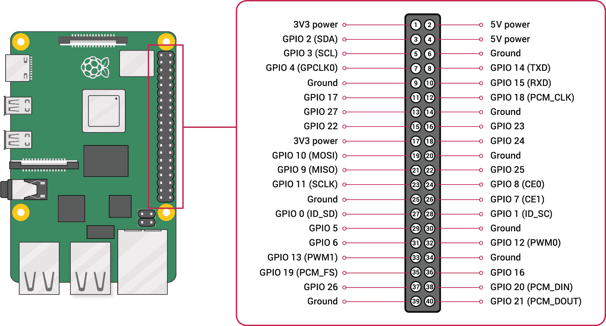
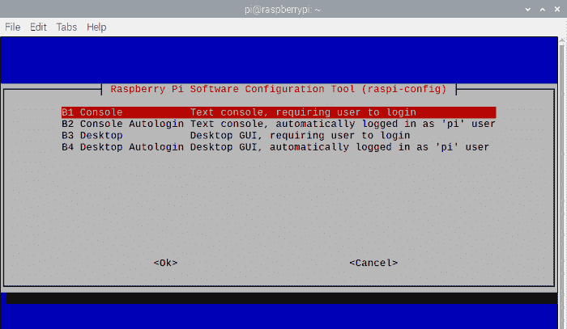

# 第十八章：在 Raspberry Pi 上构建 Internet 防火墙/路由器

Raspberry Pi（RPi）非常适合小型网络的 Internet 防火墙/路由器，成本不高。您可以使用任何 Raspberry Pi，但我推荐 Raspberry Pi 4B，因为它比旧版 Pi 更强大，并且是第一个配备专用千兆以太网端口的 Pi。

# 概述

在本章中，您将学习如何安装 Raspberry Pi OS，将您的 Pi 连接到计算机显示器或电视，使用 Raspberry Pi OS 恢复模式，无头运行您的 Pi，添加第二个以太网口，共享 Internet 连接，并使用 Pi 进行 LAN 名称服务。

###### 注意

本章的示例均基于 Raspberry Pi 4 Model B，在 Raspberry Pi OS 上运行。Raspberry Pi OS 以前称为 Raspbian。其底层是 Debian Linux，因此如果您习惯于 Debian、Ubuntu、Mint 或其他任何 Debian 变体，它都是相同的 Linux。

## Raspberry Pi 防火墙/路由器的优缺点

Raspberry Pi 是通用计算机，而不是专用防火墙/路由器。它具有 WiFi、以太网和蓝牙，并运行 Linux。相比之下，小型网络的常见选择是类似 Linksys AC1900 或 TP-Link Archer AX20 的小型组合防火墙/路由器/无线接入点/以太网交换机，它们具有 WiFi、千兆以太网、多个天线，并支持像 Alexa 和智能手机管理应用程序等“智能”服务。

这些设备的缺点在于其不灵活性，特别是存储和操作系统支持有限。如果您想替换供应商软件，必须使用像 OpenWRT、DD-WRT、pfSense 或 OPNsense 这样的专门的路由器发行版，这些都非常出色，但并不容易，并且您必须找到受支持的设备。

Raspberry Pi 相比于一体化设备具有以下优势：

+   灵活性，就像任何通用 Linux 计算机一样

+   更多的内存和存储

+   连接到计算机显示器或电视、键盘和鼠标

+   运行多种 Linux 发行版，因此您可以利用现有的知识，无需学习一些奇怪的新界面或命令集

+   运行多种*bsd 操作系统、Windows 10、Android、Chromium 和其他操作系统

+   连接到移动热点

+   支持 64 位

您可以像任何 Linux 系统一样，通过图形桌面、无图形桌面和 SSH 无头运行 Raspberry Pi。

Raspberry Pi 的缺点：

+   不能像一体化设备那样作为以太网交换机运行

+   WiFi 不如一体化设备强

+   Raspberry Pi 模型 3 及更早版本的以太网性能较差，因为以太网端口共享 USB 总线；RPi 4 通过专用千兆以太网端口解决了这个问题

树莓派有许多定制的 Linux 操作系统。官方操作系统是基于 Debian Linux 的树莓派 OS。SUSE、Ubuntu、Fedora、Arch Linux ARM 和 MX Linux 都有树莓派变种。此处我们将专注于树莓派 OS，因为它针对树莓派进行了优化，在旧款树莓派上也能提供良好的图形桌面性能。树莓派 OS 就像其他任何 Linux 一样，您可以在树莓派上做任何您在大型 Linux 机器上可以做的事情。

## 硬件架构

树莓派由 Broadcom SoC 提供动力。CPU、GPU 和 I/O 都集成在一颗芯片上。在树莓派 4 Model B 上尤为引人注目，支持同时运行两个屏幕，并能轻松处理高清电影。

Broadcom SoC 是一款 ARM 芯片，而不是主导 PC 市场的 x86_64 架构。ARM 处理器较少复杂，采用精简指令集（RISC）。x86_64 处理器是 CISC，复杂指令集计算机。x86_64 处理器工作更加艰苦，复杂度更高，耗电量更大。

## 树莓派产品盛宴

每款曾发布的树莓派型号仍然可供购买，包括树莓派 1 的更新版本，A 和 B 型号。A 型号是每个发布的低成本版本，而 B 型号则因具备更多功能而稍贵。

您可以选择许多其他的树莓派产品，例如：

+   树莓派 Zero，价格仅为 $5，是最小的树莓派

+   树莓派 Zero W 集成了 WiFi 功能，售价 $10

+   树莓派 400 个人电脑套件，集成在一个紧凑的键盘内（您需要添加的只是显示器），售价 $100

自第一款树莓派发布以来，其价格保持稳定，尽管当然可能会发生变化。

有大量的配件可供选择：外壳、触摸屏、散热器、风扇、扩展板（HATs）、各种电缆和适配器、电机、摄像头、音频板、带触摸板的小型无线键盘、游戏模拟器、RGB 矩阵、带电源的 USB 集线器、实时时钟、小尺寸显示器……这是一个绝佳的玩乐场。

## 历史与目的

树莓派是一个真正的现象。其创始人 Eben Upton 最初的目的是生产一台小巧廉价的计算机，以鼓励年轻学生学习计算机，特别是那些买不起 PC 的学生。第一款树莓派，版本 1 Model B，约售价 $35。添加键盘和鼠标，连接至电视或显示器，价格不到 PC 的十分之一，您就拥有了一台可以工作的 Linux 计算机，具备音频、视频、以太网和 USB 接口。开放的硬件设计和开源软件鼓励了黑客和学习活动。

###### 注意

驱动 Pi 的 Broadcom 芯片组并非开源。自第一代 Pi 发布以来，这一点一直存在争议。电路图是公开的，可以在[RaspberryPi.org](https://raspberrypi.org)找到，操作系统和 BIOS 是开源的。以我适度谦虚的看法，一个完全开源的平台更可取，目前可用的东西总比没有可用的东西好。

第一代 Raspberry Pi 立即取得了成功，在 2012 年 2 月发布后的首 6 个月内销售了超过 50 万台。此后大约销售了 3000 万台 Raspberry Pi。当前版本，Version 4 Model B，是一个重大升级，是迄今为止性能最强大的型号，具有以下特点：

+   2 个 USB 2 端口

+   2 个 USB 3 端口

+   2 个 Micro HDMI 端口，支持 2 个 4K 显示器

+   1 个专用千兆以太网端口

+   支持 2 GB 至 8 GB 的 RAM

+   Broadcom BCM2711，1.5 GHz 四核 Cortex-A72（ARM v8）64 位 SoC

+   支持 2.4 GHz 和 5.0 GHz IEEE 802.11ac WiFi

+   蓝牙

+   40 针 GPIO 引脚头

与现代的 Intel 和 AMD CPU 相比，这些规格远不能称为令人自豪的，但足以运行 Linux 图形桌面，播放音乐、电影，浏览网页，撰写文档……它在尺寸和价格上非常有能力。

Raspberry Pi 由 Raspberry Pi 基金会开发和生产，这是一个注册的非营利慈善组织。该基金会支持多个教育项目，供教师和学生使用；访问[*https://raspberrypi.org*](https://raspberrypi.org)获取当前的教育资料和信息。

# 18.1 启动和关闭 Raspberry Pi

## 问题

在你的 Raspberry Pi（RPi）上看不到电源开关，你想要打开和关闭它。

## 解决方案

通过插入电源连接器来启动它。从操作系统菜单中关闭它，然后拔掉电源插头。

## 讨论

当你关闭你的 RPi 时，你必须断开然后重新连接电源才能重新启动它。

如果有为 RPi 设计的电源开关，我一点也不会感到惊讶，尽管我没见过。一个替代方案是将其插入一个带开关的电源插排。

## 参见

+   [*https://raspberrypi.org*](https://raspberrypi.org)

# 18.2 查找硬件和操作指南

## 问题

你购买了一台 Raspberry Pi 4 Model B，并想知道你需要哪些其他硬件设备才能使用它。

## 解决方案

据推测，你已经有了一台计算机显示器或电视、鼠标和键盘。你还需要：

+   Raspberry Pi 电源适配器

+   HDMI 至 Micro HDMI 电缆

+   至少 16 GB 的 Micro SD 卡

+   冷却风扇，或者在 CPU、RAM 模块和 USB 控制器上安装散热片

+   机箱

+   Micro SD 卡读卡器

首先，在另一台计算机上将 Raspberry Pi OS 安装到你的 Micro SD 卡上。当这个过程运行时，组装你的硬件。当一切准备就绪时，连接电源，看着你的新系统启动。（查看 18.4 和 18.5 章节，了解如何安装 Raspberry Pi OS 的方法。）

要全面了解 RPi，有很多源提供电路图、规格、操作指南和巧妙点子。本篇的“参见”部分列出了一个不错的选择，可以帮助你入门。

## 讨论

如果你的显示器没有 HDMI 接口，请参见 Recipe 18.6。

你可以使用至少 16 GB 大小的任何 micro SD 卡。高速卡可以显著提高性能。16 GB 相当小，你可以使用任意大的卡。

RPi 4B 有三种内存选项，2 GB、4 GB 和 8 GB。它不可升级，所以你购买的就是你会拥有的。2 GB 对于作为互联网网关和轻量级 Linux 桌面的 Pi 已经足够了。更多内存适合多媒体处理、编译代码、游戏和其他内存密集型任务。

RPi 4B 比旧版 RPi 强大得多，运行时也更热。参见 Recipe 18.3 了解如何保持其冷却。

RPi 4B 有 4 个 USB 端口，非常灵活。你可以使用标准 USB 键盘和鼠标，带有触控板的键盘，以及 USB 到 PS/2 转接器用于旧键盘和鼠标。你可以连接 USB 硬盘进行更多存储或备份，以及像在大型计算机上一样连接任何其他 USB 设备。40 针 GPIO 头支持连接几乎任何扩展板。

有许多很棒的套件捆绑了你开始所需的一切。我最喜欢的商店是[Adafruit.com](https://adafruit.com)，你还可以在[*https://raspberrypi.org*](https://raspberrypi.org)上找到更多。

## 参见

这些网站发布了优秀的树莓派教程：

+   [Raspberry Pi 基金会](https://oreil.ly/Ji4j2)

+   [Adafruit](https://oreil.ly/5qwn5)

+   [MagPi](https://oreil.ly/EuMY7)

+   [Hackspace](https://oreil.ly/5KY5B)

+   [Maker Pro](https://oreil.ly/NQcB0)

+   [Makezine](https://oreil.ly/foZqS)

# 18.3 冷却树莓派

## 问题

你的树莓派摸起来很热，你想为它安装一些冷却设备。

## 解决方案

在机箱内安装冷却风扇，或在 CPU、RAM 模块和 USB 控制器上安装散热片。在比旧版 RPi 更热的 RPi 4 上安装风扇和散热片。

使用内置的*vcgencmd*命令，在安装冷却装置之前和之后，以及编译代码或播放视频等计算密集任务之前和之后，来测量 CPU 温度。以下示例是在无风扇板载状态下，打开机箱盖后的空闲状态，以及在播放 1080p 电影 5 分钟后的状态：

```
$ vcgencmd measure_temp
temp=48.3'C

$ vcgencmd measure_temp
temp=61.9'C
```

这个示例展示了在播放同一部电影时，使用冷却风扇的效果：

```
$ vcgencmd measure_temp
temp=52.1'C
```

温度不应超过 70°C。40°C 到 60°C 是一个良好的操作范围。

## 参见

+   [Raspberry Pi 基金会](https://oreil.ly/Ji4j2)

+   [Adafruit](https://oreil.ly/5qwn5)

+   [MagPi](https://oreil.ly/EuMY7)

# 18.4 使用 Imager 和 dd 安装树莓派 OS

## 问题

你已经准备好硬件，想要安装操作系统。

## 解决方案

您将在另一台计算机上创建一个可启动的微型 SD 卡，然后将 SD 卡插入树莓派并启动。

有四种方法可以获得可启动的 SD 卡：

+   使用树莓派 Imager（目前仅适用于 *.deb* 系统，如 Debian、Ubuntu 或 Mint）

+   使用 NOOBS 安装程序（Recipe 18.5）

+   使用 *dd* 命令将安装镜像复制到微型 SD 卡

+   购买已加载安装程序的微型 SD 卡

我喜欢 NOOBS，因为它适用于所有的 Linux 发行版，并创建了一个救援引导模式。

要从 *.deb* 包安装树莓派 Imager，请从 [*https://raspberrypi.org*](https://raspberrypi.org) 下载它。然后安装该软件包：

```
$ sudo dpkg -i *imager_1.5_amd64.deb*
```

另外，Ubuntu 用户可以使用 *apt* 安装树莓派 Imager：

```
$ sudo apt install rpi-imager
```

将您的 SD 卡插入计算机。使用 *lsblk -p* 定位它（参见 Recipe 10.9）。

从系统菜单启动树莓派 Imager，并享受其可爱的树莓 Logo。点击操作系统选择您想要安装的操作系统，Imager 将下载并复制到您的 SD 卡。如果您已经下载了映像，请在选择菜单中向下滚动到使用自定义以选择您下载的映像。您将看到类似 图 18-1 的屏幕。


###### 图 18-1\. 使用树莓派 Imager 创建可启动微型 SD 卡

点击 SD 卡选择设备，然后点击写入以安装操作系统。

如果您没有 Ubuntu 系统，请从 [*https://raspberrypi.org*](https://raspberrypi.org) 下载您选择的操作系统映像，并使用 *dd* 命令将其复制到 SD 卡。以下示例解压并将 *2021-03-24-raspios-buster-armhf.zip* 复制到 SD 卡：

```
$ sudo unzip -p 2021-03-24-raspios-buster-armhf.zip | \
  sudo dd of=/dev/*foo* bs=4M conv=fsync status=progress
```

当 SD 卡准备就绪后，将其插入树莓派并开机。开机后，您将完成简短的设置，然后可以开始使用。

默认用户为 *pi*。在 */home/pi/Bookshelf* 中可以找到 Gareth Halfacree（Raspberry Pi Press）撰写的《官方树莓派初学者指南》的 PDF 版本。

## 讨论

在使用树莓派 Imager 之前，您不必格式化 SD 卡。

Imager 创建两个分区：一个 256 MB 的 FAT32 */boot* 分区，一个刚好足够容纳文件系统的 Ext4 *rootfs* 分区。在我的测试系统上为 3.4 GB，卡片的其余空间未分配。

当您首次启动新系统时，根文件系统将被扩展以填充所有未分配空间。您可以使用 GParted（第九章）或 *parted*（第八章）缩小根文件系统并创建更多分区。

## 参见

+   [树莓派基金会](https://oreil.ly/Ji4j2)

# 18.5 使用 NOOBS 安装树莓派

## 问题

您想要使用 NOOBS 安装树莓派。

## 解决方案

NOOBS（New Out Of the Box Software）是一个较旧的安装程序。它适用于所有 Linux 发行版，并创建了一个恢复引导模式，而 Raspberry Pi Imager 则不会这样做。

在另一台计算机上下载 NOOBS，解压下载的存档文件，将所有文件复制到 micro SD 卡上，然后将 SD 卡插入您的 Raspberry Pi 并启动它。

从 [*https://raspberrypi.org*](https://raspberrypi.org) 下载 NOOBS。有两个版本：NOOBS 和 NOOBS Lite。NOOBS 包括 Raspberry Pi OS 和其他操作系统的网络安装程序。NOOBS Lite 仅包括网络安装程序。

在下载后解压缩 NOOBS：

```
$ unzip *NOOBS_lite_v3_5.zip*
```

将您的 SD 卡插入计算机中。使用 *lsblk -p* 查找它（参见 配方 10.9）。

将您的 micro SD 卡格式化为单个 FAT32 分区。

将所有 NOOBS 文件复制到您的 SD 卡，然后使用它启动您的 Raspberry Pi。首先，您会看到一个酷炫的彩虹色屏幕，然后 NOOBS 启动安装菜单（图 18-2）。设置网络以使用网络安装程序或在安装后获取更新。选择您的操作系统，然后找些事情做，直到安装完成。


###### 图 18-2\. NOOBS 安装屏幕

安装完成后，您将进行简短的设置过程，然后您的 Raspberry Pi 就可以使用了。

默认用户是 *pi*。在 */home/pi/Bookshelf* 中查找由 Gareth Halfacree（Raspberry Pi Press）编写的 *The Official Raspberry Pi Beginner’s Guide* 的 PDF 版本。

## 讨论

NOOBS 是一个简单的解压和复制过程，因此适用于任何计算机。

将 NOOBS 文件复制到您的 SD 卡可能需要很长时间。通常情况下，将 ZIP 文件复制到 SD 卡上，然后在卡上解压缩会更快。安装完成后，您可以删除 ZIP 文件。

## 参见

+   第九章

+   [Raspberry Pi Foundation](https://oreil.ly/Ji4j2)

# 18.6 连接到没有 HDMI 的视频显示器

## 问题

您有一台没有 HDMI 端口的电视或计算机显示器，并且想要将您的 Raspberry Pi 连接到它。

## 解决方案

有四种方法可以将屏幕连接到 RPi 4B。您可以使用以下方法之一：

+   为 Raspberry Pi 制造的小屏幕

+   DVI 到 HDMI 适配器

+   VGA 到 HDMI 适配器

+   RCA 复合视频（使用专为 Raspberry Pi 制作的电缆）

有多种适用于 RPi 的屏幕类型：触摸屏、LED、LCD、OLED、电子墨水等等，应有尽有。遵循随屏幕附带的安装说明进行安装。

DVI 到 HDMI 和 VGA 到 HDMI 适配器连接到您的屏幕，然后您的 HDMI 到 micro-HDMI 电缆连接到适配器。当您连接到 RPi 4B 上的单个 HDMI 显示器时，请插入 HDMI 0 端口，即靠近电源端口的端口。

由于默认情况下在 RPi 4B 上禁用复合视频，因此复合视频需要额外的步骤。简便的方法是在首次启动 Pi 并完成安装时找到一个 HDMI 屏幕。安装完成后，打开配置工具以启用复合视频：

```
$ sudo raspi-config
```

向下箭头键到 6 高级选项，然后选择 A8 HDMI/Composite。选择 V2 启用复合。退出 *raspi-config*，关闭您的 Pi，连接您的 Pi 到复合视频屏幕，然后再次启动。它应该默认显示在您的复合视频屏幕上。

## 讨论

较老的平板显示器通常具有 VGA 和复合视频连接器，因此您可以使用复合视频或 VGA 到 HDMI 适配器。从技术上讲，HDMI 提供比复合视频更高质量的图像，但大多数人分辨不出区别。

图 18-3 显示了 Rocketfish DVI 到 HDMI 适配器，一个复合电缆捆绑包，一个带有拆下顶部的 CanaKit 外壳的 Rasberry Pi 4B 和一个 micro SD 卡。


###### 图 18-3\. 带有配件的 Raspberry Pi 4B

RCA 复合音频/视频电缆套件，带有黄色、红色和白色连接器，插入 RPi 上的巧妙小型 3.5 mm TRRS 端口。您需要为 RPi 制作一个，因为 TRRS 插头的排列方式没有标准。您可能会发现一些不起作用的电缆，因为它们的黄色用于视频，红色和白色用于音频。避免为摄像机和 MP3 播放器制作的复合电缆，它们具有自己的奇怪排列顺序，将地面环放在错误的位置。TRRS（尖端-环-环-套筒）插头应该配置如下：

```
Tip          Ring 1        Ring 2   Sleeve
Left audio   Right audio   Ground   Video
```

在 */boot/config.txt* 中有几个调整复合视频设置的选项。如果打算使用复合视频，请使用 NOOBS 安装程序。然后，如果需要更正设置，可以启动到恢复模式（配方 18.7）并访问 */boot/config.txt*。

*sdtv_mode=* 设置了电视标准。*sdtv_mode=0* 是北美的默认设置。大部分世界使用 PAL；请参阅 表 18-1 中的设置。

表 18-1\. sdtv_mode 设置

| 值 | 模式 |
| --- | --- |
| 0 | 普通 NTSC（默认） |
| 1 | NTSC 的日文版 |
| 2 | 普通 PAL |
| 3 | PAL 的巴西版 |
| 16 | 逐行扫描 NTSC |
| 18 | 逐行扫描 PAL |

*sdtv_aspect=* 命令定义了显示比例（参见 表 18-2）。

表 18-2\. sdtv_aspect 屏幕比例设置

| 值 | 比例 |
| --- | --- |
| 1 | 4:3（默认） |
| 2 | 14:9 |
| 3 | 16:9 |

## 另请参阅

+   [配置文件中的视频选项](https://oreil.ly/yp7Mu)

# 18.7 进入恢复模式

## 问题

您希望了解如何进入恢复模式以防有问题时。

## 解决方案

您必须使用 NOOBS 安装操作系统，因为这是唯一可以设置恢复模式的安装程序。打开您的 Pi 并观看启动屏幕。屏幕会短暂显示树莓派标志和“要进入恢复模式，请按住 Shift 键”的消息。按住 Shift 键直到出现恢复屏幕（图 18-2; 恢复屏幕与 NOOBS 安装屏幕相同）。

恢复屏幕是一个很好的图形实用程序，用于执行一些基本操作。您可以连接到互联网，浏览在线帮助，编辑*/boot/cinfig.txt*，或者彻底清除您的安装并安装其他内容。

## 讨论

恢复屏幕与 NOOBS 安装屏幕相同。只有在使用 NOOBS 安装树莓派时才有此恢复选项，尽管在您阅读此文时可能已有所不同。

## 参见

+   [树莓派基金会](https://oreil.ly/Ji4j2)

# 18.8 添加第二个以太网接口

## 问题

您想要将树莓派用作互联网防火墙/路由器，但它只有一个以太网口，您确实希望有两个以太网口。

## 解决方案

获取第二个以太网口有两种方法：使用 USB 转以太网适配器或安装连接到 GPIO 引脚的以太网口。

USB 转以太网很简单；只需插入即可。

有线以太网端口需要更多工作。您需要一个由 ENC28J60 以太网控制器模块驱动的以太网适配器（图 18-4）。


###### 图 18-4\. ENC28J60 以太网适配器

照片中的 HanRun HR911105A 适配器需要七根母对母跳线连接到 GPIO 引脚。您可以购买提供各种颜色线束的多色捆绑包，价格便宜。

在连接电线之前，通过在您的树莓派上运行*pinout*命令生成您自己的便捷引脚布局图（图 18-5）。

图 18-6 显示了来自 RaspberryPi.org 的图表，标记了 GPIO 引脚排列。


###### 图 18-5\. 由 pinout 命令生成的引脚布局图



###### 图 18-6\. 来自 RaspberryPi.org 的引脚布局图

编辑*/boot/config.txt*以启用新的以太网口并加载驱动程序：

```
dtparam=spi=on
dtoverlay=enc28j60
```

保留引脚布局图的副本，并关闭您的树莓派电源。在您的 RPi 和 ENC28J60 模块上以下位置连接跳线线：

```
RPi           ENC28J60
----------------------------
+3V3          VCC
GPIO10        SI
GPIO9         SO
GPIO11        SCK
GND           GND

GPIO25        INT
CE0#/GPIO8    CS
```

注意 GPIO 引脚的方向：引脚＃1 位于 RPi 板的 SD 卡插槽同一端。从 3V3 引脚 17 开始，然后所有电线都在同一区域，另一个 3V3 引脚可用于机箱风扇。

当所有电线都就位后，启动您的 RPi。运行*ifconfig*命令查看您的新以太网接口。它应该是*eth1*：

```
$ ip link show dev eth1
2: eth1: <NO-CARRIER,BROADCAST,MULTICAST,UP> mtu 1500 qdisc fq_codel
state DOWN mode DEFAULT group default qlen 1000
    link/ether d0:50:99:82:e7:2b brd ff:ff:ff:ff:ff:ff
```

这就是，所有配置都已准备好。

## 讨论

ENC28J60 以太网控制器仅支持 10 MBps。如果您的互联网速度不超过 10 MBps，则这没问题。在树莓派 4 上，使用 USB 3.0 以太网适配器可以获得高达 900 MBps 的速度。

较旧的树莓派因通过 USB 2.0 总线运行而具有较慢的以太网速度。树莓派 4B 是第一台具有专用以太网总线的树莓派。

密切关注双千兆以太网选项的新产品发布，很可能很快会有一些产品。

*pinout*命令由*python3-gpiozero*包提供。这在树莓派 OS 桌面镜像中默认安装，但在树莓派 OS Lite 上没有安装。您可以使用*apt install python3-gpiozero*进行安装。

## 参见

+   [GPIO 图表](https://oreil.ly/0pgXZ)

+   [ENC28J60 控制器的技术信息和数据表](https://oreil.ly/HjlAM)

# 18.9 使用 firewalld 设置互联网连接共享防火墙

## 问题

您希望在您的树莓派上配置一个简单的防火墙，共享您的互联网连接，并阻止不良信息。

## 解决方案

我们将使用*firewalld*来过滤传入的数据包，只允许 LAN 内部起始的流量响应，并禁止外部连接请求。

您的互联网网关设置类似于图 18-7。


###### 图 18-7\. 树莓派防火墙/路由器

互联网通过连接您与 ISP 的任何设备进入，然后连接到您的树莓派，树莓派通过以太网交换机将流量过滤和路由到您的 LAN。

您的 RPi 需要两个网络接口，一个连接从互联网盒子到 RPi，第二个接口连接从 RPi 到 LAN。在这个步骤中，我们将使用两个以太网接口。

安装*firewalld*，以及可选的*firewall-config*和*firewall-applet*。*firewall-config*提供了一个图形化配置工具，*firewall-applet*位于面板上，提供了一些命令的快速访问，如紧急按钮和锁定：

```
$ sudo apt install firewalld firewall-config firewall-applet
```

找到你的默认路由器/网关：

```
$ ip r show
default via 192.168.1.1 dev eth0 proto dhcp src 192.168.1.43 metric 303 mtu 1500
192.168.1.0/24 dev eth0 proto dhcp scope link src 192.168.1.43 metric 303 mtu
1500cat
```

*default via 192.168.1.1*是您的默认网关。

将*eth1*设置为外部接口，连接到您的互联网盒子。*eth0*是您的内部接口，连接到 LAN 交换机。这两个接口应该位于不同的子网上。*eth1*应该位于与您的互联网盒子相同的子网上。假设您的互联网盒子的 LAN 接口是 192.168.1.1，则*eth1*可以是 192.168.1.2。

*eth0*位于您的 LAN 子网上，例如 192.168.2.1。

在*/etc/dhcpcd.conf*中配置两个接口：

```
# external interface
interface eth1
static ip_address=192.168.1.2/24
static routers=192.168.1.1

# internal interface
interface eth0
static ip_address=192.168.2.1/24
static routers=192.168.1.1

```

重新启动以应用更改。

下一步是设置*firewalld*。这两个接口必须位于两个不同的防火墙区域。*eth1*放在*external*区域，*eth0*放在*internal*区域，然后验证您的更改：

```
$ sudo firewall-cmd --zone=external --change-interface=eth1
success
pi@raspberrypi:~ $ sudo firewall-cmd --zone=internal --change-interface=eth0
success
pi@raspberrypi:~ $ sudo firewall-cmd --get-active-zones
external
  interfaces: eth1
internal
  interfaces: eth0
```

列出每个区域的配置：

```
$ sudo firewall-cmd --zone=external --list-all
external (active)
  target: default
  icmp-block-inversion: no
  interfaces: eth1
  sources:
  services: ssh
  ports:
  protocols:
  masquerade: yes
  forward-ports:
  source-ports:
  icmp-blocks:
  rich rules:

$ sudo firewall-cmd --zone=internal --list-all
internal (active)
  target: default
  icmp-block-inversion: no
  interfaces: eth0 wlan0
  sources:
  services: dhcpv6-client mdns samba-client ssh
  ports:
  protocols:
  masquerade: no
  forward-ports:
  source-ports:
  icmp-blocks:
  rich rules:
```

注意*ssh*访问是外部区域的默认设置。您可以添加或删除任何希望的服务。您必须保持*masquerade*启用，因为这是实现互联网访问的方法。

使您的更改永久化：

```
$ sudo firewall-cmd --runtime-to-permanent
success

```

IPv4 转发在*external*区域也是默认启用的，您可以通过读取*/proc*来验证。IPv4 转发启用后，才能进行路由；否则，进入您的 RPi 的所有数据包将无法路由到网络中的其他主机。

```
$ cat /proc/sys/net/ipv4/ip_forward
1
```

1 表示启用，0 表示未启用。

## 讨论

IPv4 伪装是网络地址转换（NAT）。NAT 的创建是为了扩展有限的 IPv4 地址池（正式耗尽）。NAT 允许我们在内部网络上自由使用私有 IPv4 地址空间，而无需购买公共 IPv4 地址。您的互联网供应商提供至少一个公共 IPv4 地址。您的私有地址被转换为显示为您的一个公共 IPv4 地址；否则，您的内部主机将无法访问互联网。

您可以在各个区域中添加和删除服务；详见第十四章。

## 参见

+   第十四章

+   [Debian 错误报告日志 - #914694](https://oreil.ly/SuHLL)

# 18.10 在您的树莓派上运行无头模式

## 问题

您将您的树莓派用作互联网防火墙/路由器、LAN 路由器或某种轻量级 LAN 服务器，并希望通过无图形桌面运行来减少负载。

## 解决方案

按照以下步骤操作：

1.  在您的 RPi 上设置 SSH 访问（参见第十二章）。

1.  运行*raspi-config*来禁用图形桌面。

1.  重新启动。

1.  启动*sudo raspi-config*，然后导航至 1. 系统选项 → S5. 启动/自动登录（参见图 18-8）。

1.  设置下次启动为控制台，而不是 GUI，然后重新启动。

只要您能够通过 SSH 会话访问您的 RPi，即使没有屏幕，也能访问它。

您可以通过输入**`startx`**命令从文本控制台启动图形环境。



###### 图 18-8\. 设置下次启动为控制台，而不是 GUI。

## 讨论

*rpi-config*使用*ncurses*界面。*ncurses*是一个看起来像简单 GUI 的控制台界面。

当您将树莓派设置为无头模式时，它只需要电源和网络连接，因为您可以从另一台计算机上的 SSH 会话中控制它。

## 参见

+   第十二章

+   [树莓派基金会](https://oreil.ly/Ji4j2)

# 18.11 使用树莓派构建 DNS/DHCP 服务器

## 问题

您的互联网路由器在管理功能方面提供的功能不多，您希望控制本地名称服务 DNS 和 DHCP。

## 解决方案

在你的互联网盒子上禁用命名服务，并设置第二台树莓派来使用 Dnsmasq 提供你的局域网命名服务（第十六章）。使用 DHCP 为所有局域网主机提供所有服务和地址，包括静态地址，但不包括你的互联网网关，它应独立于任何内部服务。

## 讨论

你可以将你的域名服务器安装在你的互联网防火墙/网关上，但是把内部服务放在直接连接到互联网的主机上并不是一个良好的安全实践。你的树莓派 DNS/DHCP 服务器只需要一个单独的网络接口，就像任何其他局域网服务器一样。

## 另请参阅

+   第十六章
