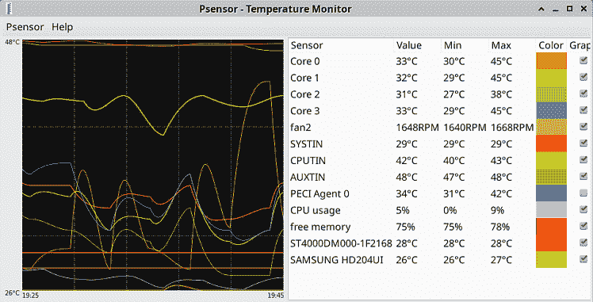
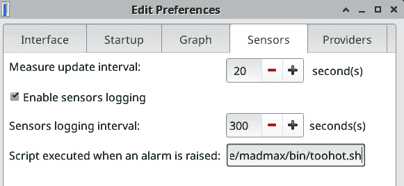
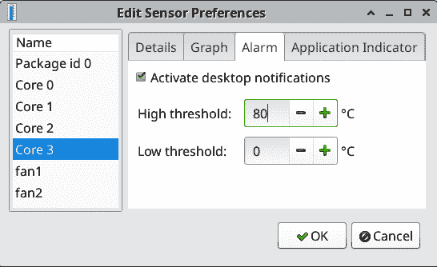
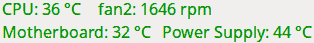
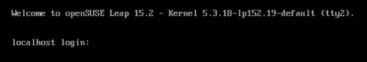

# 第二十章：故障排除 Linux PC

Linux 包含许多实用程序来帮助诊断和修复问题，足以填满几本厚厚的书。本章重点介绍使用系统日志来查找问题的原因，建立一个集中的 systemd 日志服务器，监控硬件健康状况，查找和停止问题进程，以及获得硬件最佳性能的技巧和窍门，以及诊断硬件问题。

# 概述

熟悉你的系统日志，你将找到问题的根本原因。如果找到问题的原因没有指向解决方案，你就有了寻求帮助所需的信息，无论是产品文档、发行版文档、付费支持还是社区支持。

深入了解你所使用的 Linux 发行版的文档，特别是变更日志和发布说明，以及你使用的服务器和应用程序的文档。Ubuntu、Fedora 和 openSUSE 都擅长维护他们的文档和详细的发布说明。还要熟悉你的发行版、服务器和应用程序的论坛、维基和聊天室。对于你遇到的每个问题，很可能其他许多用户也曾经遇到过相同的问题。

## 预防措施

大多数错误是由软件引起的。即使是消费者级别的硬件也相当坚固，但它最常由于滥用和老化而失效。最常见的硬件故障是带有运动部件的组件：

+   SATA 和 SCSI 磁盘驱动器

+   CPU 冷却器

+   电源供应器

+   机箱风扇

+   CD/DVD 驱动器

有一些简单的措施可以延长硬件的使用寿命。过热和不可靠的电源会损坏电子设备。良好的冷却对于保持计算机的健康至关重要。良好的冷却来自设计良好的机箱，提供适当的空气流动、散热器和 CPU 冷却器，以及正确定向的机箱风扇，使空气能够正确地进入和排出。这可能会有些噪音，你可以购买运行更安静的机箱、电源和风扇。定期用非静电吸尘器吸尘，并清洁机箱过滤器。如果你喜欢用压缩空气吹灰尘，要小心风扇。如果旋转得太快，会损坏它们的轴承。

电源调节器提供持续的电压波动和尖峰保护，以及来自无线电和电磁干扰的保护。避雷器成本较低，但只提供过载保护。电压下降和尖峰一样有害。电源调节器通过更长的使用寿命和稳定的运行方式来回报自己的成本。

## 耐心

当调试问题时，耐心是你最好的朋友。最好是缓慢而系统地进行：

+   审查说明并确保没有漏掉任何步骤或出错。

+   是否有可用的更新？很多时候这就是解决方案。

+   复制错误消息和日志文件条目，并在网上搜索和故障工单中使用它们。

+   错误发生前最后发生了什么？造成错误的确切步骤是什么？是否可以复现？

+   最近发生的事情是否可逆？如果是，逐个撤销并测试。一次性进行多个更改意味着您可能无法发现导致错误的原因。

+   作为最后的手段，请重新启动。真的！这个方法奇迹般地解决了许多问题，尽管您可能不知道问题的根源。

一些图形应用程序，如出色的 digiKam 照片管理和编辑器，在从终端启动时会发出各种细节，就像此片段显示的那样，当 digiKam 启动失败后：

```
$ digikam
Object::connect: No such signal org::freedesktop::UPower::DeviceAdded(QString)
Object::connect: No such signal org::freedesktop::UPower::DeviceRemoved(QString)
digikam: symbol lookup error: digikam: undefined symbol:
_ZNK11KExiv2Iface14AltLangStrEdit8textEditEv

```

我不知道这意味着什么，但有人知道，所以我可以在网络搜索中引用这个，或者在 digiKam 论坛上寻求帮助。

当您请求帮助时，请记住耐心和礼貌。当您被要求提供额外信息时，请准确提供所需的内容。解决问题后，请分享解决方案，并感谢帮助您的人。

# 20.1 在日志文件中查找有用信息

## 问题

发生奇怪的事情，您需要知道从何处开始解决问题。

## 解决方案

记录所有内容，然后阅读您的日志文件。*/var/log*包含日志文件，*dmesg*和*journalctl*命令显示日志消息。systemd 通过*journald*管理所有日志，因此您会在*dmesg*和*/var/log*中看到很多重复信息。

*dmesg*读取内核环形缓冲区，这是一个特殊的内存位置，用于记录内核活动。查看*dmesg*以查看启动时发生的所有事情；启动后的硬件活动，如连接和移除 USB 设备；以及网络接口活动。内核环形缓冲区是固定大小的，因此新条目会覆盖最旧的条目。没有数据会丢失，因为内核日志存储在*/var/log/messages*、*/var/log/dmesg*和*journalctl*中。

以这种方式阅读*dmesg*：

```
$ dmesg | less
[    0.000000] microcode: microcode updated early to revision 0x28,
date = 2019-11-12
[    0.000000] Linux version 5.8.0-45-generic (buildd@lcy01-amd64-024) (gcc
(Ubuntu 9.3.0-17ubuntu1~20.04) 9.3.0, GNU ld (GNU Binutils for Ubuntu) 2.34)
#51~20.04.1-Ubuntu SMP Tue Feb 23 13:46:31 UTC 2021
(Ubuntu 5.8.0-45.51~20.04.1-generic 5.8.18)
[...]
```

当您寻找特定内容时，请使用*grep*，比如当您在处理存储驱动器的问题时：

```
$ dmesg | grep -w sd
[11236.888910] sd 7:0:0:0: [sdd] Attached SCSI removable disk
[11245.095341] FAT-fs (sdd1): Volume was not properly unmounted. Some data may
be corrupt. Please run fsck.
```

# 使用 grep 查找完整单词

当您想要使用*grep*查找单词时，请使用*-w*开关。例如，当您 grep *ping*时，您会得到类似 piping、escaping、sleeping 的结果。*-w*只返回完整的单词匹配项。

运行*dmesg -T*以查看可读的时间戳：

```
$ dmesg -T | less
[Tue Mar 23 15:25:17 2021] PCI: CLS 64 bytes, default 64
[Tue Mar 23 15:25:17 2021] Trying to unpack rootfs image as initramfs...
[Tue Mar 23 15:25:17 2021] Freeing initrd memory: 56008K
[...]
```

默认是启动后的秒数和纳秒数。运行*dmesg --follow*以监视新事件的发生，如插入和拔出 USB 设备。按 Ctrl-C 停止。

查找特定的日志级别，如错误和警告：

```
$ dmesg -l err,warn
```

运行*dmesg -h*以查看命令和选项。

*/var/log*是日志文件的传统位置，根据您的 Linux 发行版管理方式，您仍然会在那里找到日志。*/var/log*易于搜索，因为大多数文件都是纯文本。当您不确定从哪里开始搜索时，请在整个目录中*grep*。

例如，假设您认为已安装*graphicsmagick*，但找不到它。快速查看*/var/log*，您会找到它的安装记录：

```
$ sudo grep -ir graphicsmagick /var/log
apt/history.log:Install: libgraphicsmagick-q16-3:amd64 (1.4+really1.3.35-1,
automatic), graphicsmagick:amd64 (1.4+really1.3.35-1)
[...]
/var/log/dpkg.log:2021-03-11 17:00:57 install libgraphicsmagick-q16-3:amd64
1.4+really1.3.35-1
[...]

```

systemd 把所有日志都装进 *journalctl*，因此你可以专门使用它，不必再麻烦 *dmesg* 和 */var/log*：

```
$ journalctl
```

使用 *sudo* 调用它，看看是否增加了更多信息。通常不会。

*journalctl* 默认按照最老的条目显示。按空格键或 PageUp/Down 键以逐屏导航，或使用箭头键逐行滚动。Ctrl-End 到达最新，Ctrl-Home 返回最老。按 Q 键退出。

首先查看最新的条目：

```
$ journalctl -r
```

默认情况下它不换行长行，因此你必须使用箭头键来阅读长行。通过将其输出导入 *less* 来实现换行：

```
$ journalctl -r | less
```

查看最近的条目，并显示解释消息（如果有的话）。这展示了一个解释消息的例子：

```
$ journalctl -ex | less

-- The unit grub-initrd-fallback.service has successfully entered the 'dead'
state.
Mar 27 10:14:29 client4 systemd[1]: Finished GRUB failed boot detection.
-- Subject: A start job for unit grub-initrd-fallback.service has finished
successfully
-- Defined-By: systemd
```

搜索特定服务，比如 MariaDB：

```
$ sudo journalctl -u mariadb.service
Mar 19 16:07:27 client4 /etc/mysql/debian-start[7927]: Looking for 'mysql' as:
/usr/bin/mysql
Mar 19 16:07:27 client4 /etc/mysql/debian-start[7927]: Looking for 'mysqlcheck'
as: /usr/bin/mysqlcheck
[...]
```

选择日期范围，你可以用几种方式定义：

```
$ journalctl -u mariadb.service -S today
$ journalctl -u ssh.service -S '1 week ago'
$ journalctl -u libvirtd.service -S '2021-03-05'
$ journalctl -u httpd.service -S '2021-03-05' -u '2021-03-09'
$ journalctl -u nginx.service -S '2 hours ago'

```

当未指定时间时，默认为 00:00:00，即午夜。以 HH:MM:SS 格式指定时间：

```
$ journalctl -u httpd.service -S '2021-03-05 13:15:00' -U now

```

查看从一小时前到五分钟前的活动，并显示单位文件名：

```
$ journalctl -S '1h ago' -U '5 min ago' -o with-unit

```

*journalctl* 按系统启动时间排序日志。查看自最近启动以来的 HTTP 服务器活动，并将显示的行数限制为最近的 50 行：

```
$ journalctl -b -n 50 -u httpd.service
```

查看三次启动前发生了什么：

```
$ journalctl -b -2 -u httpd.service
```

列出所有记录的启动会话，并带有时间戳：

```
$ journalctl --list-boots
```

你可以筛选特定的严重级别。当你指定单个级别时，在这个例子中是 *crit*，它显示从 *crit* 到最严重级别 *emerg* 的所有消息：

```
$ journalctl -b -1 -p "crit" -u nginx.service
```

自定义你的范围，例如从 *crit* 到 *warning*：

```
$ journalctl -b -3 -p "crit".."warning"
```

跟随记录的新事件，从最近的 10 个条目开始记录：

```
$ journalctl -n 10 -u mariadb.service -f
```

Ctrl-C 停止它。

当然，使用好老式的 *grep* 来查找东西，比如用户名或任何你希望搜索的术语：

```
$ journalctl -b -1 | grep madmax
```

## 讨论

严重级别遵循标准的 syslog 级别，从 0 到 7，其中 0 最严重，7 最不严重：

```
emerg      (0)
alert      (1)
crit       (2)
err        (3)
warning    (4)
notice     (5)
info       (6)
debug      (7)
```

*journalctl* 提供了数十种过滤和解析输出的方法，你可以在 *man 1 journalctl* 中了解更多。

## 参见

+   *man 3 syslog*

+   *man 1 journalctl*

+   *man 1 dmesg*

+   [*https://systemd.io*](https://systemd.io)

# 20.2 配置 journald

## 问题

不确定 *journald* 的默认配置是什么，需要知道如何查看当前配置和如何更改它。

## 解决方案

*journald* 的配置在 */etc/systemd/journald.conf* 中。一些默认选项被注释掉，所有编译时默认值在 *man 5 journald.conf* 中有文档。我们将查看最常用的选项。

*Storage=auto* 在不同的发行版上有不同的含义。Ubuntu 和 Fedora 使用 */run/log/journal/* 作为易失性存储，持久性存储在 */var/log/journal* 中。使用 *systemctl* 查看日志文件的位置，已用空间和空闲空间：

```
$ systemctl status systemd-journald.services
● systemd-journald.service - Journal Service
   Loaded: loaded (/usr/lib/systemd/system/systemd-journald.service; static;
   vendor preset: disabled)
   Active: active (running)
   [...]
Mar 27 15:04:40 server2 systemd-journald[508]: Runtime journal (/run/log/journal/
1181e27c52294e97a8ca5c5af5c92e20) is 8.0M, max 2.3G, 2.3G free.
Mar 27 15:04:55 server2 systemd-journald[508]: Time spent on flushing to /var is
381.408ms for 1176 entries.
Mar 27 15:04:55 server2 systemd-journald[508]: System journal (/var/log/journal/
1181e27c52294e97a8ca5c5af5c92e20) is 16.0M, max 4.0G, 3.9G free.
```

openSUSE 将易失性存储放在 */run/log/journal/* 中，并将持久性存储放在 */var/log/messages* 中。如果你喜欢使用 */var/log/journal*，请创建它并将组所有者更改为 *systemd-journal*：

```
$ sudo mkdir /var/log/journal
$ sudo chgrp /var/log/journal/ systemd-journal
```

您不必更改其他任何内容，存储在重启后会发生变化。其他选项为 *volatile*、*persistent* 和 *none*。

*volatile* 只在内存中的 */run/log/journal/* 中存储日志。

*persistent* 在磁盘上存储日志，并在磁盘不可用时（例如系统启动早期）使用 */run/log/journal/*。

*none* 禁用所有本地日志记录，并可选择将日志消息发送到中央日志服务器。

*SystemMaxUse=* 控制磁盘上日志存储的大小，*RuntimeMaxUse=* 控制易失性存储的大小。默认值为文件系统中可用空间的 10%，最多为 4 GB。

*SystemKeepFree=* 和 *RuntimeKeepFree=* 控制留给其他用途的磁盘空间量。默认值为 15% 和 4 GB。您可以通过指定字节数量进行更改，或使用 K、M、G、T、P 和 E；例如，25 G（千兆字节）。

*MaxRetentionSec=* 控制文件保留时间。默认值为 0（禁用），文件的保留时间由其他设置（如可用磁盘空间）决定。您可以配置一个时间值，例如 `6 month` 使用 `year`、`month`、`week`、`day`、`h` 或 `m`。

## 讨论

*journald* 自动处理日志轮换。活动文件会被轮换为存档文件，并根据您的配置删除存档文件。

## 参见

+   *man 5 journald.conf*

# 20.3 使用 systemd 构建日志服务器

## 问题

您希望设置一个中央日志服务器，以便在系统崩溃时保留日志，并进行集中管理。

## 解决方案

systemd 提供了一个远程日志守护进程 *journald*。客户端机器将其日志消息发送到 *journald* 服务器。前提条件如下：

+   用于托管日志文件的机器

+   客户端访问日志服务器的网络访问权限

+   在日志服务器和所有客户端上安装 *systemd-journal-remote* 包

+   您的公钥基础设施（PKI）已经就位（Recipe 13.5），密钥和证书已分发到服务器和客户端

安装 *systemd-journal-remote* 后，在服务器上编辑 */etc/systemd/journal-remote.conf*。我喜欢将加密密钥和证书存储在 */etc/pki/journald/* 中：

```
[Remote]
Seal=false
SplitMode=host
ServerKeyFile=/etc/pki/journald/*log-server.key*
ServerCertificateFile=/etc/pki/journald/*log-server.crt*
TrustedCertificateFile=/etc/pki/journald/*ca.crt*
```

设置服务器密钥和证书的权限：

```
$ sudo chmod -R 0755 /etc/pki/journald
$ sudo chmod 0440 /etc/pki/journald/*log-server.key*
```

将服务器私钥的组所有者更改为 *systemd-journal-remote*：

```
$ sudo chgrp systemd-journal-remote /etc/pki/journald/*log-
server.key*
```

启用并启动 *systemd-journal-remote* 服务，首先启动 *systemd-journal-remote.socket*：

```
$ sudo systemctl enable --now systemd-journal-remote.socket
$ sudo systemctl enable --now systemd-journal-remote.service
```

检查两者的状态，确保它们已正确启动。在服务器防火墙中打开必要的端口：

```
$ sudo firewall-cmd --zone=*internal* --add-port=19532/tcp
$ sudo firewall-cmd --zone=*internal* --add-port=80/tcp
$ sudo firewall-cmd --runtime-to-permanent
$ sudo firewall-cmd --reload
```

在每个客户端上创建一个新用户 *systemd-journal-upload*。这是 *systemd-journal-upload* 进程用来将日志消息传输到中央服务器的用户：

```
$ sudo useradd -r -d /run/systemd -M -s /usr/sbin/nologin -U \
systemd-journal-upload
```

设置客户端密钥和证书的权限：

```
$ sudo chmod -R 0755 /etc/pki/journald
$ sudo chmod 0440 /etc/pki/journald/*client.key*
```

编辑 */etc/systemd/journal-upload.conf*，填写日志服务器的 URL 和 TCP 端口，以及客户端密钥和证书的位置：

```
[Upload]
URL=https://*logserver.example.com:19532*
ServerKeyFile=/etc/pki/journald/*client1.key*
ServerCertificateFile=/etc/pki/journald/*client1.crt*
TrustedCertificateFile=/etc/pki/journald/*ca.crt*
```

重新启动 *systemd-journal-upload.service*：

```
$ sudo systemctl restart systemd-journal-upload.service
```

如果成功重启且无错误，运行以下步骤来测试客户端是否将日志条目发送到服务器。检查服务器上的日志目录：

```
$ sudo ls -la /var/log/journal/remote/
total 7204
drwxr-xr-x  2 systemd-journal-remote systemd-journal-remote  6 Mar 26 16:41 .
drwxr-sr-x+ 4 root                   systemd-journal        60 Mar 26 16:41 ..
rw-r-----  1 systemd-journal-remote systemd-journal-remote 8388608 Mar 26  1
10:46 'remote-CN=client1.example.com'
```

看起来不错。现在，从客户端向服务器发送一条消息：

```
$ sudo logger -p syslog.debug "Hello, I am client1! Do you hear me?"
```

在服务器上运行您喜欢的 *journalctl* 命令，调用最近的条目。如果看到客户端消息，说明您已正确设置：

```
Mar 27 18:30:11 client1 madmax[15228]: Hello, I am client1! Do you hear me?
```

## 讨论

中央日志服务器保存客户端日志，并集中日志存储，便于维护和分析。每个客户端在服务器上有自己的目录。

*Seal=false* 禁用日志条目的加密签名。要尝试，请参阅 *man 1 journalctl* 中的 *--setup-keys* 选项。我找不到是否提供实质性好处的明确答案，但了解它也不会有坏处。

*SplitMode=host* 将每个客户端的日志存储在其自己的文件中。将其设置为 *false* 可以将所有内容转储到单个文件中。

*ServerKeyFile=*、*ServerCertificateFile=* 和 *TrustedCertificateFile=* 是存储加密密钥和证书的位置。

## 另请参阅

+   *man 5 journal-remote.conf*

+   *man 5 journald.conf*

+   *man 1 journalctl*

# 20.4 使用 lm-sensors 监控温度、风扇和电压

## 问题

您想要测量计算机机箱内部的温度、风扇转速和电压。

## 解决方案

使用 *lm-sensors* 持续监控 CPU、硬盘和机箱温度。这由 openSUSE 上的 *sensors* 包、Fedora 上的 *lm_sensors* 和 Ubuntu 上的 *lm-sensors* 提供。

安装完 *lm-sensors* 后，运行 *sensors-detect* 命令来校准 *lm-sensors* 到您的硬件：

```
$ sudo sensors-detect
# sensors-detect version 3.6.0
# Board: ASRock H97M Pro4
# Kernel: 5.8.0-45-generic x86_64
# Processor: Intel(R) Core(TM) i7-4770K CPU @ 3.50GHz (6/60/3)

This program will help you determine which kernel modules you need
to load to use lm_sensors most effectively. It is generally safe
and recommended to accept the default answers to all questions,
unless you know what you're doing.

Some south bridges, CPUs or memory controllers contain embedded sensors.
Do you want to scan for them? This is totally safe. (YES/no):
[...]
```

按 Enter 接受所有默认设置。当完成时，您会看到类似于这样的内容：

```
To load everything that is needed, add this to /etc/modules:
#----cut here----
# Chip drivers
coretemp
nct6775
#----cut here----
If you have some drivers built into your kernel, the list above will
contain too many modules. Skip the appropriate ones!

Do you want to add these lines automatically to /etc/modules? (yes/NO) yes
Successful!
```

模块将在重新启动后加载，或者您可以立即加载它们：

```
$ sudo systemctl restart systemd-modules-load.service
```

现在运行 *sensors* 命令并查看结果：

```
$ sensors
coretemp-isa-0000
Adapter: ISA adapter
Package id 0:  +42.0°C  (high = +86.0°C, crit = +96.0°C)
Core 0:        +34.0°C  (high = +86.0°C, crit = +96.0°C)
Core 1:        +35.0°C  (high = +86.0°C, crit = +96.0°C)
Core 2:        +32.0°C  (high = +86.0°C, crit = +96.0°C)
Core 3:        +31.0°C  (high = +86.0°C, crit = +96.0°C)

nouveau-pci-0300
Adapter: PCI adapter
GPU core:     +1.01 V  (min =  +0.70 V, max =  +1.20 V)
fan1:        2850 RPM
temp1:        +51.0°C  (high = +95.0°C, hyst =  +3.0°C)
                       (crit = +105.0°C, hyst =  +5.0°C)
                       (emerg = +135.0°C, hyst =  +5.0°C)

dell_smm-virtual-0
Adapter: Virtual device
Processor Fan: 1070 RPM
Other Fan:        0 RPM
Other Fan:      603 RPM
CPU:            +41.0°C
SODIMM:         +25.0°C
SODIMM:         +35.0°C
SODIMM:         +34.0°C
```

这显示了 CPU 核心、显卡适配器、风扇和内存模块的信息。您可以看到当前温度以及高、临界和紧急温度范围。CPU 有内置的自我保护机制，当温度过高时会自动关闭。

使用 *watch* 命令每两秒查看更新的状态，并突出显示任何差异：

```
$ watch -d sensors
```

设置不同的更新间隔，如 10 秒：

```
$ watch -d -n 10 sensors
Every 10.0s: sensors
[...]
```

按 Ctrl-C 停止。

## 讨论

*lm_sensors* 并非魔法，它只读取带有温度传感器和 Linux 驱动程序的设备。大多数温度传感器精度不高，因此不必担心小的波动。

监控温度、电压和风扇转速可以提前预警问题。更换风扇比重建过热的计算机便宜。电压下降可能表示电源供应器故障或连接不良。

在修改 */etc/modules* 文件之前，请检查你的内核配置，看看 *sensors-detect* 建议的模块是否已经加载或静态编译。你的内核配置文件位于 */boot* 目录中，命名为 *config-kernel-version*，例如 *config-5.8.0-45-generic*。例如，搜索 *nct6775* 模块：

```
$ grep -i nct6775 config-5.8.0-45-generic
CONFIG_SENSORS_NCT6775=m
```

*m* 表示可加载的内核模块。检查是否已加载：

```
$ lsmod | grep nct6775
```

如果返回空白，请将其添加到 */etc/modules*。如果是静态编译的，它会像这样在 *config-** 中显示：

```
CONFIG_SENSORS_NCT6775=y
```

*y* 表示它内建于内核中，因此不要将其添加到 */etc/modules*。

## 参见

+   *man 1 watch*

+   *man 1 sensors*

+   *man 8 lsmod*

+   [*https://kernel.org*](https://kernel.org)

# 20.5 添加一个图形界面到 lm-sensors

## 问题

你需要一个可配置的图形显示界面来显示 *lm-sensors* 并自动更新。

## 解决方案

你有几个很好的选择。图形界面的 *lm-sensors* 也支持其他监视器，比如 *smartmontools* 和 *hddtemp*。Psensor 提供了大屏显示、彩色图表和简单配置，可以重命名标签并显示你想看到的内容（图 20-1）。

Psensor 支持警报。通过点击每个监视器以显示首选项菜单，分别启用 CPU 核心和风扇的警报（图 20-2）。



###### 图 20-1\. Psensor 追踪多个硬件监视器



###### 图 20-2\. 启用警报和警报阈值

你需要编写一个简单的脚本来设置警报，就像以下示例：

```
#!/bin/bash
# toohot.sh, plays a mad klavichord riff when a sensor monitor
# exceeds its upper limit

play /home/madmax/Music/klavichord-4.wav
```

安装 *sox* 以获取 *play* 命令。将你的脚本设为可执行：

```
$ chmod +x *toohot.sh*
```

测试它：

```
$ play *toohot.sh*
```

当满意时，配置 Psensor 使用它。打开 Psensor → 首选项 → 传感器（图 20-3）。



###### 图 20-3\. 设置一个警报

在 Psensors 中测试它的一个简单方法是将一些最大温度设置得太低。

许多桌面环境，如 Xfce4、GNOME 和 KDE，都有漂亮的小任务栏插件，例如 Xfce4 中显示的内容（图 20-4）。



###### 图 20-4\. Xfce 任务栏插件适用于 lm-sensors

它们的包名都含有 *sensor*，除了 *gnome-shell-extension-freon*。

## 讨论

你可以编写脚本，在触发警报时自动关闭系统，就像下面这个简单的例子：

```
#!/bin/bash
echo "Help, too hot, I am shutting down right now!" && shutdown -h now
```

## 参见

+   *man 1 play*

+   *man 1 sensors*

+   [Psensor](https://oreil.ly/IcRok)

# 20.6 使用 smartmontools 监控硬盘健康

## 问题

你需要知道硬盘何时出现故障，或更好的是，何时可能出现故障，以便在丢失数据之前替换它。

## 解决方案

大多数硬盘和固态硬盘都配备了 S.M.A.R.T.（自我监控分析与报告技术）。S.M.A.R.T. 跟踪并记录某些性能属性，您可以监视这些属性来（希望）预测即将发生的故障。Linux 用户可以使用 *smartmontools* 读取这些信息并提供警告。

*smartmontools* 是由 *smartmontools* 包提供的。它应该会自动安装并启动一个 systemd 服务，您可以用 *systemctl* 来检查：

```
$ systemctl status smartd.service
```

使用 *smartctl* 命令查看您的磁盘是否支持 S.M.A.R.T.。查找 *SMART* 支持行：

```
$ sudo smartctl -i /dev/*sda*
smartctl 7.1 2019-12-30 r5022 [x86_64-linux-5.8.0-45-generic] (local build)
Copyright (C) 2002-19, Bruce Allen, Christian Franke, www.smartmontools.org

=== START OF INFORMATION SECTION ===
Model Family:     Seagate Desktop HDD.15
Device Model:     ST4000DM000-1F2168
[...]
SMART support is: Available - device has SMART capability.
SMART support is: Enabled
```

为要监视的每个磁盘启用和禁用 *smartctl*：

```
$ sudo smartctl -s on /dev/*sda*
$ sudo smartctl -s off /dev/*sda*
```

使用 *-x* 标志进行完整数据转储：

```
$ sudo smartctl -x /dev/*sda*
```

运行短健康检查：

```
$ sudo smartctl -H /dev/*sda*
smartctl 7.1 2019-12-30 r5022 [x86_64-linux-5.8.0-45-generic] (local build)
Copyright (C) 2002-19, Bruce Allen, Christian Franke, www.smartmontools.org

=== START OF READ SMART DATA SECTION ===
SMART overall-health self-assessment test result: PASSED
```

使用 *-Hc* 标志查看完整报告。

检查日志文件：

```
$ sudo smartctl -l error /dev/*sda*
smartctl 7.0 2019-05-21 r4917 [x86_64-linux-5.3.18-lp152.66-preempt] (SUSE RPM)
Copyright (C) 2002-18, Bruce Allen, Christian Franke, www.smartmontools.org

=== START OF READ SMART DATA SECTION ===
SMART Error Log Version: 1
No Errors Logged
```

有一个短自检和一个长自检。它们告诉您启动它们时每个测试将花费多长时间：

```
$ sudo smartctl -t long /dev/*sda*
[...]
=== START OF OFFLINE IMMEDIATE AND SELF-TEST SECTION ===
Sending command: "Execute SMART Extended self-test routine immediately in
off-line mode".
Drive command "Execute SMART Extended self-test routine immediately in off-line
mode" successful.
Testing has begun.
Please wait 109 minutes for test to complete.
Test will complete after Thu Mar 25 17:06:33 2021

Use smartctl -X to abort test.
```

当其完成时不会通知您，您可以随时检查日志文件：

```
$ sudo smartctl -l selftest /dev/*sda*

[sudo] password for carla:
[...]
=== START OF READ SMART DATA SECTION ===
SMART Self-test log structure revision number 1
Num  Test_Description    Status                  Remaining  LifeTime(hours)
 # 1  Extended offline    Self-test routine in progress 70%      7961
 # 2  Short offline       Completed without error       00%      7960
 # 3  Short offline       Completed without error       00%      7952
 [...]
```

记得定期更新硬盘数据库：

```
$ sudo update-smart-drivedb
/usr/share/smartmontools/drivedb.h updated from branches/RELEASE_7_0_DRIVEDB
```

## 讨论

S.M.A.R.T. 大约有 60% 的可靠性。它可能会更好，但是 S.M.A.R.T. 标准对解释留有很大余地，每个驱动器制造商都以不同方式实施它。制造商文档稀缺，我找到的最佳资源是维基百科和 [*https://smartmontools.org*](https://smartmontools.org)。像往常一样，您最好的保险是定期备份。

即便如此，它是免费的，易于使用，并且通常很有用。注意 *Pre-fail* 属性（如下面的片段所示），并查看本章介绍如何提高系统性能和可靠性。

运行 *sudo smartctl -a /dev/sda* 来转储所有 S.M.A.R.T. 数据。这部分通常会引起警报：

```
SMART Attributes Data Structure revision number: 10
Vendor Specific SMART Attributes with Thresholds:
ID# ATTRIBUTE_NAME          FLAG     VALUE WORST THRESH TYPE      UPDATED
  1 Raw_Read_Error_Rate     0x000f   119   099   006    Pre-fail  Always
  3 Spin_Up_Time            0x0003   092   091   000    Pre-fail  Always
  4 Start_Stop_Count        0x0032   099   099   020    Old_age   Always
  5 Reallocated_Sector_Ct   0x0033   100   100   010    Pre-fail  Always
  7 Seek_Error_Rate         0x000f   059   057   030    Pre-fail  Always
  9 Power_On_Hours          0x0032   089   089   000    Old_age   Always
 10 Spin_Retry_Count        0x0013   100   100   097    Pre-fail  Always
 12 Power_Cycle_Count       0x0032   099   099   020    Old_age   Always
183 Runtime_Bad_Block       0x0032   100   100   000    Old_age   Always
184 End-to-End_Error        0x0032   100   100   099    Old_age   Always
187 Reported_Uncorrect      0x0032   100   100   000    Old_age   Always
188 Command_Timeout         0x0032   100   099   000    Old_age   Always
189 High_Fly_Writes         0x003a   100   100   000    Old_age   Always
190 Airflow_Temperature_Cel 0x0022   072   059   045    Old_age   Always
191 G-Sense_Error_Rate      0x0032   100   100   000    Old_age   Always
192 Power-Off_Retract_Count 0x0032   100   100   000    Old_age   Always
193 Load_Cycle_Count        0x0032   096   096   000    Old_age   Always
194 Temperature_Celsius     0x0022   028   041   000    Old_age   Always
197 Current_Pending_Sector  0x0012   100   100   000    Old_age   Always
198 Offline_Uncorrectable   0x0010   100   100   000    Old_age   Offline
199 UDMA_CRC_Error_Count    0x003e   200   200   000    Old_age   Always
240 Head_Flying_Hours       0x0000   100   253   000    Old_age   Offline
241 Total_LBAs_Written      0x0000   100   253   000    Old_age   Offline
242 Total_LBAs_Read         0x0000   100   253   000    Old_age   Offline

```

`TYPE` 列告诉属性的类型，可以是 `Pre-fail` 或 `Old_age`。当您看到所有这些 `Pre-fail` 和 `Old_age` 标签时，并不意味着您的磁盘注定要失败，那只是该行的属性类型。

`Pre-fail` 是一个关键属性，可能表明即将发生的故障，并且始终包含在健康评估中。

`Old_age` 是一个非关键属性；它不包含在磁盘健康报告中。

`ID#` 和 `ATTRIBUTE_NAME` 标识每个属性。这些因制造商而异。

`FLAG` 是属性处理标志，与磁盘健康无关。

`VALUE` 列显示属性的当前值。这些值范围从 0 到 255，除了 0、254 和 255。253 表示“未使用”，例如当你有一块新的硬盘时。`VALUE` 是一个从好到坏的评分，数字越高表示越好，数字越低表示越差，除了温度属性，它们表示摄氏温度。

`WORST` 是记录该属性的最低值。

`THRESH` 是每个属性的最低阈值，当 `Pre-fail` 属性低于 `THRESH` 时，磁盘可能会即将故障。

`UPDATED` 应该指示属性何时被更新。始终在线和离线，离线通常只意味着在运行离线测试时。通常这不准确，而且在任何情况下都不是特别有帮助。

如果某个属性进入故障状态，失败时间会记录在*WHEN_FAILED*中。

*RAW_VALUE*是特定于每个制造商的。忽略它。

## 另请参见

+   *man 8 smartctl*

+   *man 8 smartd*

+   *man 8 update-smart-drivedb*

+   *man 5 smartd.conf*

# 20.7 配置 smartmontools 发送电子邮件报告

## 问题

你希望收到由*smartd*通过电子邮件发送给你的任何问题的电子邮件通知。

## 解决方案

首先，通过向系统上的另一个用户（如 root）发送测试消息，检查系统邮件是否已经设置并正常工作：

```
$ echo "Hello, this is my message" | mail -s "Message subject" root@localhost

```

```
[root@localhost ~]# mail
"/var/mail/root": 1 message 1 unread
>U "/var/mail/root": 1 message 1 new
>N   1 stash    Mon Mar 29 15:26  13/429   Message subject
?
```

按 1 阅读消息，按 q 退出。这表明系统邮件已经设置。如果没有，请安装*mailx*和*postfix*。*mailx*是一个邮件用户代理（MUA），类似于 Evolution、Thunderbird、KMail、Mutt 等邮件客户端。*postfix*是一个邮件传输代理（MTA）。你需要这两个。安装后，使用*systemctl*检查它们是否正在运行：

```
$ systemctl status smartd.service
$ systemctl status postfix.service
```

如果它们没有运行，启用并启动它们，然后再次尝试测试消息。

```
$ sudo systemctl enable --now smartd.service
$ sudo systemctl enable --now postfix.service
```

*smartd* 在*/etc/smartd.conf*或*/etc/smartmontools/smartd.conf*中进行配置。默认情况下是扫描所有可能的设备，并将错误报告通过电子邮件发送给 root 用户。最好配置你想要监控的设备。每个 Linux 系统都有其特殊的配置。以下配置应该适用于所有系统，当然你必须指定自己的磁盘和电子邮件地址：

```
DEFAULT -a -o on -S on -s (S/../.././02|L/../../5/01):
/dev/*sda*
/dev/*sdb*
/dev/*sdc*
DEFAULT -H -m root -M test
```

保存您的配置更改并重新加载*smartd.service*：

```
$ sudo systemctl reload smartd.service
```

## 讨论

*smartd.conf*中的默认行为是扫描所有可用的驱动器。指定要监控的驱动器会更有效。

*-a*选项与所有这些选项组合在一起：

+   *-H*，检查 S.M.A.R.T. 健康状态

+   *-f*，报告使用属性（*VALUE*和*WORST*）故障

+   *-t*，报告前故障和使用属性的变化

+   *-l*，报告 ATA 错误的增加

+   *-l selftest*，报告自检日志错误的增加

+   *-l selfteststs*，报告自检执行状态的变化

+   *-C 197*，报告当前待处理扇区计数的非零值

+   *-U 198*，报告离线待处理扇区计数的非零值

这涵盖了所有重要内容，当然你可以调整它以报告你喜欢的任何属性。

*-M test*在每次启动时向指定用户发送测试消息（在前面的示例中，*-m root@localhost*）。当你确信它按照你想要的方式工作时，可以删除此选项。

有几个软件包提供*mail*二进制文件：*mailutils*、*mailx*、*bsd-mailx*和*s-nail*，其中一些而已。对于系统守护进程使用的简单本地邮件发送器，任何一个都可以完成任务，*mail*二进制文件在所有这些中使用相同的选项。

你不必使用*postfix*，也可以使用你喜欢的任何 MTA，如 Exim 或 Sendmail。

## 另请参见

+   *man 8 smartd*

+   *man 5 smartdconf*

# 20.8 使用 top 诊断系统变慢问题

## 问题

你的系统通常运行良好，但现在一切都变得缓慢且耗时很长。应用程序启动或关闭时花费大量时间，或者对用户输入响应缓慢。你需要找出原因，然后解决它。

## 解决方案

执行 *top* 命令以查看哪些进程正在使用过多的系统资源。CPU 和内存消耗大的进程会让你强大的系统感觉像老旧的：

```
$ top
Tasks: 284 total,   1 running, 283 sleeping,   0 stopped,   0 zombie
%Cpu(s):  6.4 us,  4.8 sy,  0.0 ni, 88.9 id,  0.0 wa,  0.0 hi,  0.0 si,  0.0 st
MiB Mem :  15691.4 total,   6758.9 free,   4913.0 used,   4019.6 buff/cache
MiB Swap:  15258.0 total,  15258.0 free,      0.0 used.  10016.5 avail Mem

    PID USER      PR  NI   VIRT    RES    SHR S    %CPU  %MEM   TIME+ COMMAND
   1299 duchess      9  0 2803912  22296  17904 S  80.5   0.1  172:25 Web Content
   1685 duchess     20  0 3756840 543124 241296 S   7.6   3.4   27:53 firefox
  15926 libvirt+    20  0 5151504   2.3g  25024 S   1.7  15.3    1:39 qemu
  [...]
```

*top* 运行直到你停止它，每隔几秒刷新一次，并按活动程度从最高到最低显示进程。按 q 键退出。

这显示了大量的信息。相关部分是 `Web Content` 正在使用 80.5% 的 CPU 时间。构造不良的网站是导致系统停滞的常见原因。快速修复的方法是终止那些有问题的进程。

进程 ID 在左列显示。按下 k 键打开终止对话框。如果默认的要终止的 PID 是正确的，请按 Enter 键。按 Enter 接受默认的 *15/sigterm* 终止进程：

```
PID to signal/kill [default pid = 1299]
Send pid 1299 signal [15/sigterm]
```

如果这不能终止进程，使用核心选项 *9*，即 *sigkill*：

```
PID to signal/kill [default pid = 1299]
Send pid 1299 signal [15/sigterm] 9
```

如果你没有足够的权限来终止进程，请使用 *sudo* 启动 *top*。或者，在另一个终端运行 *sudo kill <pid>*。

## 讨论

终止进程并不总是最好的解决方案。如果进程由 systemd 控制，systemd 可能会立即重新启动它，或者其他进程可能依赖于它，那么你可能会引发混乱。如果可能，请使用 *systemctl stop <service name>* 将其关闭。如果问题进程不受 systemd 控制，则可以终止它。

默认要终止的 PID 总是顶部的 PID，即使用最多系统资源的 PID。如果这不是你想要停止的 PID，你可以输入一个不同的 PID。

"这个 *sigterm* 是什么东西？" 你会问。*信号* 是从 Unix 继承而来的，非常陈旧，多年来添加了许多变种，你可以在 *man 2 signal* 中详细了解，例如 *SIGHUP*、*SIGINT*、*SIGQUIT* 和许多其他信号。

对用户和系统管理员来说，最相关的两个是 *SIGKILL* 和 *SIGTERM*。始终首先尝试 *SIGTERM*，因为它可以优雅地停止进程，确保任何子进程都被移交给 *INIT* 而不是变为孤儿，并且通知父进程。*SIGTERM* 的唯一缺点是进程可以选择忽略它。

仅当 *SIGTERM* 无效时才使用 *SIGKILL*。*SIGKILL* 不能被忽略，并且会终止子进程，这可能会影响其他进程。由于父进程没有通知，一个进程可能被留在僵尸状态。僵尸进程本身并不是什么大问题，它们只是无所作为地存在着。你可以在 *top* 的标题中看到是否有这样的进程，在 Tasks 行的右侧。以下示例显示了两个僵尸进程：

```
Tasks: 249 total, 1 running, 248 sleeping, 0 stopped, 2 zombie
```

您不需要做任何事情，因为父应用程序应该会自动清理它们。如果没有清理，这也不是什么大问题，除非它产生了一大堆僵尸进程。这告诉您应用程序存在问题。您无法杀死僵尸进程，因为它们已经死了。它们只使用微小的系统资源，但如果您想尝试清除它们，请尝试发送*SIGCHLD*信号：

```
$ sudo kill -s SIGCHLD *1299*
```

如果同一个进程继续使用过多的系统资源，请检查其程序的配置文件或设置，看看是否存在错误，或者您是否可以调整其以提高效率。检查您的日志文件（配方 20.1）以获取线索。

## 参见

+   *man 1 top*

+   *man 1 kill*

# 20.9 在 top 中查看选定的进程

## 问题

您只想跟踪一个或少量进程。

## 解决方案

用逗号分隔的进程列表启动*top*以跟踪进程：

```
$ top -p *4548, 8685, 9348*
top - 10:57:39 up 44 min,  2 users,  load average: 0.10, 0.11, 0.21
Tasks:   3 total,   0 running,   3 sleeping,   0 stopped,   0 zombie
%Cpu(s):  0.2 us,  0.2 sy,  0.0 ni, 99.6 id,  0.0 wa,  0.0 hi,  0.0 si,  0.0 st
MiB Mem :  15691.4 total,  12989.5 free,   1467.4 used,   1234.4 buff/cache
MiB Swap:  15258.0 total,  15258.0 free,      0.0 used.  13601.1 avail Mem

    PID USER      PR  NI    VIRT    RES    SHR S  %CPU  %MEM     TIME+ COMMAND
   2907 mysql     20   0 1775688  78584  18396 S   0.0   0.5   0:00.22 mysqld
    927 root      20   0 1569764  39072  29320 S   0.0   0.2   0:00.16 libvirtd
    822 root      20   0   11040   6384   4732 S   0.0   0.0   0:00.02 smartd
```

现在您可以专注于想要查看的内容，而无需浏览其余的进程群。按等号键（=）返回完整的进程列表。

## 参见

+   *man 1 top*

+   *man 1 kill*

# 20.10 从冻结的图形桌面中恢复

## 问题

在您开心工作时，图形桌面却冻结了。光标移动，但非常缓慢，或根本不动。

## 解决方案

这是我最喜欢的 Linux 功能之一：从图形会话切换到控制台。按下 Ctrl-Alt-F2，您应该会发现自己在图形会话下方的纯文本控制台（图 20-5）。



###### 图 20-5. Linux 控制台

登录，现在您可以运行一些故障排除命令。从*top*开始，找到阻塞系统的流浪进程并将其终止，检查日志文件，运行其他诊断，无论您需要做什么。解决问题后，按下 Alt-F7 返回到图形桌面。最坏的情况是您将不得不关闭或重新启动，这比从按电源按钮强制关闭要好。

各种 Linux 系统以不同方式映射这些键组合。Alt-F7 是图形会话的传统方式。Fedora 使用 Alt-F1。尝试它们都不会有任何损害。

## 讨论

另一个选择是从另一台计算机打开 SSH 会话，尝试解冻您的图形桌面。

对我来说，同时拥有控制台和图形环境是最好的选择。

强制关闭不一定像以前那样是灾难，特别是当您使用日志文件系统如 Ext4、XFS 或 Btrfs 时。

标准配置是七个控制台，从 F1 到 F7。每个都是独立的登录会话。

使用 Ctrl-Alt-F*n*离开图形会话并进入控制台，在控制台中使用 Alt-F*n*。

# 20.11 硬件故障排除

## 问题

您认为硬件出现故障，并且需要知道如何进行测试。

## 解决方案

当您怀疑有硬件问题时，首先尝试本章关于硬件监控的建议。一些系统的 UEFI 固件包括硬件健康监视器。

如果监视器没有明确指出问题的方向，请关闭计算机，打开机箱，清除灰尘，清洁过滤器（如果有），然后移除并重新插入所有可拔插并重新连接的部件：电源电缆、SATA 电缆、显卡和其他 PCI 扩展卡、内存模块和风扇连接器。仔细重新连接所有部件，并特别注意正确重新插入内存模块。

# 如何不毁坏您的硬件或自己

谨慎！接地后触摸其他物体以释放静电。戴上防静电腕带，将组件放在防静电垫上。拔掉电源插头，在插入的情况下绝对不要触碰机箱内任何东西。

如果您知道如何使用万用表，请使用它测试电源供应器，或者尝试更换不同的电源供应器。使用万用表测试相对容易，并且有许多操作指南。如果有备用零件，更换疑似组件并尝试不同的组件可以准确定位故障硬件。

在完成所有操作并重新组装后，请检查问题是否已解决。在我的电脑冒险中，许多问题通过重新插拔内存模块或将其移至不同插槽来解决。请注意，在大多数主板上，您必须在特定插槽中安装 RAM 对。与 RAM 相关的一些问题包括数据损坏、不完整引导以及奇怪的行为，例如当您按下电源开关启动系统时，电源波动似乎像是电源供应器故障一样，无法启动。

确保您的机箱风扇朝向正确。空气通常从前面和侧面吸入机箱，然后从后面排出。

Linux 中有相当多的硬件测试工具。一些供应商提供他们自己的硬件和系统测试工具；例如，联想 ThinkPad 配备了全面的测试工具，可以测试系统中的每个组件。

[GtkStressTesting](https://oreil.ly/7gEST) 是一个用于压力测试 CPU、内存和其他组件的实用工具，并提取详细的主板信息。请按照设置指南中的说明将其安装在您的系统上。它包括类似于*lm-sensors*的监视器。

它没有的一个功能是 I/O 监控，您需要用*iotop*来检测性能瓶颈。*iotop*可以在类似于*top*的界面中监视磁盘性能。

## 讨论

确定问题是软件问题还是硬件问题可能很困难。要有条不紊地进行彻底检查，因为赶忙会花费更多时间。利用您 Linux 发行版的可用帮助，因为每个发行版都有其特定的问题。始终阅读发布说明。

## 参见

+   *man 8 iotop*

+   [GtkStressTesting](https://oreil.ly/7gEST)

+   您的硬件组件的文档

+   您的 Linux 发行版文档、论坛、维基和发布说明

+   第十章

+   食谱 20.6
