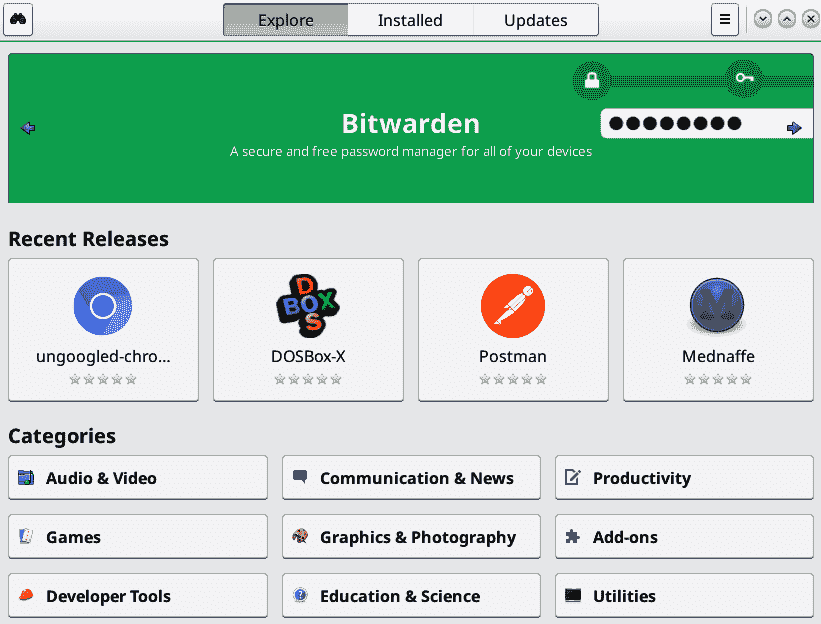

# 附录：软件管理备忘单

Linux 上的软件以 *软件包* 形式存在。这些软件包包含属于特定应用程序的所有文件，如网页浏览器、文字处理器和游戏。Linux 系统使用共享库，这些库被多个应用程序共享使用。大多数 Linux 上的软件包都不是自包含的，而是依赖于共享文件。

大多数 Linux 发行版上的图形软件管理器是 GNOME-软件，也称为 Software（见图 A-1）。软件组织良好，具有分类和良好的搜索功能。



###### 图 A-1\. GNOME-软件

# 软件包管理命令

每个 Linux 发行版都使用三种类型的软件管理命令：

+   软件包管理器，仅管理单个软件包。Fedora 和 openSUSE 使用 *rpm* 软件包管理器，Ubuntu 使用 *dpkg*。

+   一个解决依赖关系的软件包管理器。Fedora 使用 *dnf*，openSUSE 使用 *zypper*，Ubuntu 使用 *apt*。依赖解决的软件包管理器会自动解析特定软件包的所有依赖关系。例如，gedit 文本编辑器有一长串依赖项，如 *apt* 的这个例子所示：

    ```
    $  apt depends gedit
    gedit
      Depends: gedit-common (<< 3.37)
      Depends: gedit-common (>= 3.36)
      Depends: gir1.2-glib-2.0
      Depends: gir1.2-gtk-3.0 (>= 3.21.3)
      Depends: gir1.2-gtksource-4
      Depends: gir1.2-pango-1.0
      Depends: gir1.2-peas-1.0
      Depends: gsettings-desktop-schemas
      Depends: iso-codes
    [...]
    ```

    手动管理依赖关系很困难；解决依赖关系的软件包管理器大大简化了 Linux 用户的生活。

+   用于管理相关软件包组的命令，例如图形桌面、音频和视频，或服务器堆栈。openSUSE 称其为 *patterns*。Fedora 称其为软件包组。Ubuntu 称其为 *tasks*。以下示例显示了一些 openSUSE 的 patterns：

```
$ zypper search --type pattern
S  | Name                 | Summary                        | Type
---+----------------------+--------------------------------+--
[...]
   | mail_server          | Mail and News Server           | pattern
   | mate                 | MATE Desktop Environment       | pattern
i+ | multimedia           | Multimedia                     | pattern
   | network_admin        | Network Administration         | pattern
   | non_oss              | Misc. Proprietary Packages     | pattern
   | office               | Office Software                | pattern
   | print_server         | Print Server                   | pattern
[...]
```

软件包是从 *仓库* 分发的，这些是公共服务器，我们从中下载软件包。您可以在线浏览它们：

+   [Fedora 仓库](https://oreil.ly/nLDaM)

+   [openSUSE 仓库](https://oreil.ly/H8clz)

+   [Ubuntu 软件包搜索](https://oreil.ly/BZw5d)

每个 Linux 发行版都有官方仓库，还有一整个世界的第三方仓库。本附录介绍了在 Linux 系统上管理软件和仓库的基本命令。

# 在 Ubuntu 上管理软件

在本书中，Ubuntu Linux 代表了整个基于 Debian 的发行版系列。Debian 最早，然后出现了数百个衍生版。主要的 Debian 衍生版使用相同的软件包管理系统，本附录中的命令应在所有这些系统上同样有效。

本附录中的三个软件管理命令是 *dpkg*、*apt* 和 *tasksel*。

## 使用 add-apt 安装和删除仓库

添加软件仓库时，您需要知道您的 Ubuntu 版本的代号。使用以下命令获取它：

```
$ lsb_release -sc
*focal*

```

您需要仓库的确切 URL，这应由仓库维护者提供：

```
$ sudo add-apt-repository *"deb http://us.archive.ubuntu.com/ubuntu/ focal \
universe multiverse"*

```

删除仓库：

```
$ sudo add-apt-repository -r *"deb http://us.archive.ubuntu.com/ubuntu/ focal \
universe multiverse"*
```

当您安装或删除仓库时，请更新您的软件包缓存：

```
$ sudo apt update
```

定期运行此命令以下载仓库更新，然后安装更新：

```
$ sudo apt upgrade
```

## 使用 dpkg 安装、删除和检查软件包

从“软件包管理命令”中记得 *dpkg* 只能操作单个软件包，不能解决依赖关系。

安装一个软件包：

```
$ sudo dpkg -i *packagename*
```

移除一个软件包（不移除配置文件）：

```
$ sudo dpkg -r *packagename*
```

移除一个软件包及其配置文件：

```
$ sudo dpkg --purge *packagename*
```

列出软件包的内容：

```
$ dpkg -L *packagename*
```

列出所有已安装的软件包：

```
$ dpkg-query --listdpkg
```

## 使用 apt 搜索、查看、安装和移除软件包

*apt* 是一个解决依赖关系的软件包管理器，是你日常的软件管理命令。

搜索软件包：

```
$ apt search *packagename*
```

限制搜索结果只包含指定搜索词的软件包名称：

```
$ apt search *packagename* --names-only
```

获取软件包的详细信息：

```
$ apt show *packagename*
```

安装一个软件包：

```
$ sudo apt install *packagename*
```

移除一个软件包（不移除配置文件）：

```
$ sudo apt remove *packagename*
```

移除一个软件包及其配置文件：

```
$ sudo apt remove purge *packagename*
```

## 使用 tasksel

*tasksel* 管理 *任务*，这些是软件包组。

列出可用的任务：

```
$ tasksel --list-tasks
```

安装一个任务：

```
$ sudo tasksel install *task*
```

移除一个任务：

```
$ sudo tasksel remove *task*
```

# 在 Fedora 上管理软件

在本书中，Fedora Linux 代表基于 Red Hat Linux 的一系列发行版。Red Hat、CentOS、Scientific Linux、Oracle Linux 等都使用相同的软件包管理系统，这些命令应该在所有这些系统上都可以使用。

本章中的两个软件管理命令是 *rpm* 和 *dnf*。

## 使用 dnf 管理软件源

列出所有已安装的软件源，包括已启用和已禁用的：

```
$ dnf repolist --all
```

列出已启用的软件源：

```
$ dnf repolist --enabled
```

显示已启用的软件源的详细信息：

```
$ dnf repolist --enabled
```

添加一个软件源：

```
$ sudo dnf config-manager --add-repo */etc/yum.repos.d/fedora_extras.repo*
```

启用软件源：

```
$ sudo dnf config-manager --set-enabled *fedora-extras*
```

禁用软件源：

```
$ sudo dnf config-manager --set-disabled *fedora-extras*
```

## 使用 dnf 管理软件

搜索软件包：

```
$ dnf search *packagename*
```

安装一个软件包：

```
$ sudo dnf install *packagename*
```

移除一个软件包：

```
$ sudo dnf remove *packagename*
```

获取软件包的信息：

```
$ dnf info *packagename*
```

安装更新：

```
$ sudo dnf upgrade
```

获取软件包组的列表：

```
$ dnf grouplist
```

安装一个软件包组：

```
$ sudo dnf groupinstall *"package-group"*
```

移除一个软件包组：

```
$ sudo dnf groupremove *"package-group"*
```

### 使用 rpm 安装和移除软件包

安装一个软件包：

```
$ sudo rpm -i *package*
```

升级一个软件包：

```
$ sudo rpm -U *package*
```

移除一个软件包：

```
$ sudo rpm -e *package*
```

### 使用 rpm 获取关于软件包的信息

列出已安装的 *rpm* 中的所有文件：

```
$ rpm -ql *package*
```

获取已安装软件包的完整信息：

```
$ rpm -qi *package*
```

查看软件包的变更日志：

```
$ rpm -q --changes *package*
```

# 在 openSUSE 上管理软件

openSUSE 使用 RPM 软件包格式，类似于 Fedora，但有不同的依赖关系解决软件包管理器 *zypper*。

## 使用 zypper 管理软件源

列出所有已安装的软件源：

```
$ zypper repos
```

列出已安装的软件源并显示它们的 URL：

```
$ zypper repos -d
```

启用一个软件源：

```
$ sudo zypper modifyrepo -e *repo*
```

禁用一个软件源：

```
$ sudo zypper modifyrepo -d *repo*
```

添加一个新的软件源：

```
$ sudo zypper adderepo -name "*MyNewRepoName" \
http://download.opensuse.org/distribution/leap/15.3/repo/oss/*
```

移除一个软件源：

```
$ sudo zypper removerepo *MyNewRepoName*
```

下载软件源更新：

```
$ sudo zypper refresh
```

## 使用 zypper 管理软件

更新系统（首先运行 *sudo zypper refresh*）：

```
$ sudo zypper update
```

搜索软件包（不精确搜索）：

```
$ zypper search *packagename*
```

搜索软件包（精确搜索）：

```
$ zypper search -x *packagename*
```

安装一个软件包：

```
$ sudo zypper install *packagename*
```

移除一个软件包：

```
$ sudo zypper remove *packagename*
```

列出所有软件模式：

```
$ sudo zypper -t patterns
```

安装一个模式：

```
$ sudo zypper -t pattern *pattern-name*
```
