## 第六章\. 紧急工具：构建系统恢复设备

*本章涵盖*

+   恢复损坏的 Linux 系统

+   使用 Linux live-boot 驱动控制资源

+   从损坏的存储介质恢复数据

+   操作无法访问的文件系统

不要试图说服自己否则：除了所有的好东西，你还会在 Linux 中遇到坏日子。有时你会忘记命令的语法（这就是为什么你应该总是把这本书放在手边）。你（或你支持的用户）会误打命令并永久性地破坏文档。或者，当你意识到某些重要的硬件或软件已经失败时，你会感到一种沉沦的感觉。（那是在你为它做了所有那些年后的感激。）正如最后几章所展示的，正确备份意味着你可以离开一个无法工作的操作系统（OS）或计算机，并在其他地方重建它。但那始终将是 B 计划。A 计划是恢复。

本章我将向你介绍 Linux 恢复套件中的关键工具。你将了解如何使用 live-boot 设备加载 Linux 的新副本，挂载给你带来麻烦的驱动器，或者更新损坏的配置文件以便你可以正常启动，或者在你重新使用或销毁损坏的驱动器之前恢复任何可以恢复的数据。你还将看到如何使非功能系统的文件“复活”并在它们自己的虚拟环境中运行，这样你就可以做一些事情，比如更改用户忘记的密码。

当你试图将硬件和软件放入一个盒子中并期望它们和睦相处时，可能会出很多问题。我将专注于这些灾难性事件：

+   你的计算机启动了，硬盘工作正常，但 Linux 没有加载。

+   你的计算机启动了（至少就你所知是这样），但你并不确定硬盘是否完全正常工作。

+   一切都正常工作，但软件问题或丢失的密码阻止你登录到 Linux。

你面临的具体问题将决定你采取的行动计划以恢复业务。展示了某些诊断和恢复选项，其中大部分我将在本章后面讨论。

##### 图 6.1\. 本章我们将探讨的常见系统问题以及诊断和解决方案考虑因素

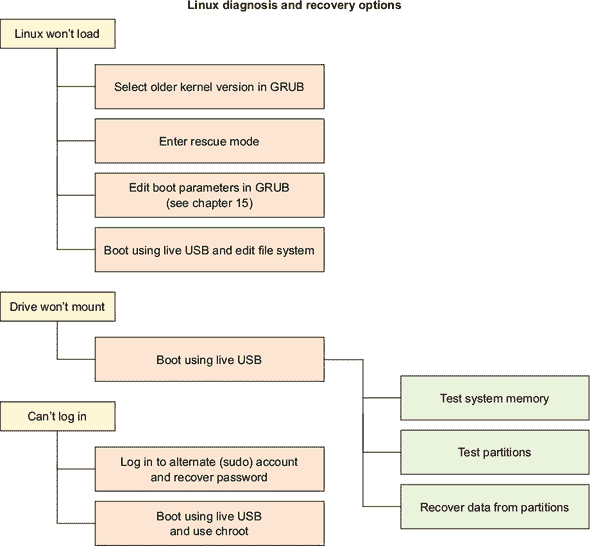

### 6.1\. 在恢复/救援模式下工作

Linux 不让你正常登录？也许启动过程在显示登录屏幕之前意外停止。你可能需要一些基本的系统管理工具。

但等等：如果 Linux 无法加载，你将如何启动这些工具？好吧，即使 Linux 无法完全加载到正常命令提示符，它通常也会带你到 GRUB 菜单。从那里（如图 6.2 所示），你可以使用上箭头键和下箭头键，然后按 Enter 键来选择在恢复模式下运行的 Linux 内核。正如你很快就会看到的，这将打开一整套技巧。

##### 图 6.2\. Ubuntu 安装的 GRUB 高级选项菜单，显示指向当前和较旧内核版本的链接，以及启动恢复模式的选项

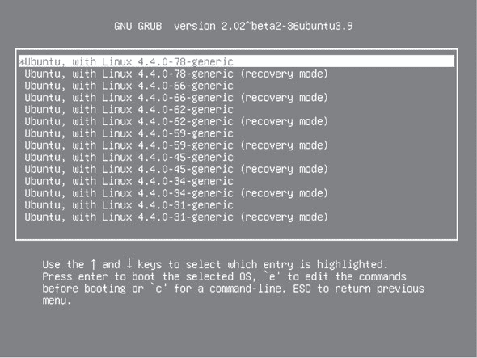

在你能够充分利用这些工具之前，然而，你首先需要了解 GRUB 是什么以及它是如何工作的。在接下来的几个部分中，我将解释 GRUB 的功能，它是如何被用来访问恢复工具的，以及你如何使用这些工具来摆脱一些棘手的困境。

#### 6.1.1\. GRUB 引导加载程序

什么是*GRUB*？它是 GNU GRand Unified Bootloader。好吧，什么是*引导加载程序*？它是操作系统在开机时用来唤醒自己的代码。图 6.3 说明了这个过程。

##### 图 6.3\. Linux 计算机启动过程中的关键步骤

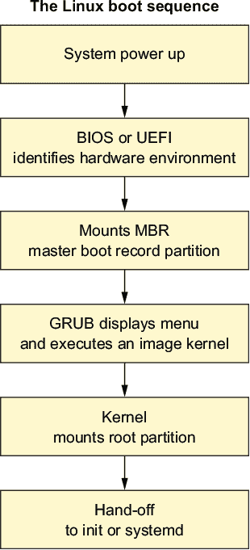

当计算机开机时，嵌入在基本系统硬件中的固件指令会识别可用的网络、存储和内存资源。这通过较老计算机上的 BIOS 系统完成，以及最近使用 UEFI（两者你都在第四章中简要了解过）。

一旦系统找到一个包含主引导记录（MBR）的硬盘分区，它就会将内容加载到活动内存中。在 Linux 系统中，MBR 分区包含一些文件，当运行时，会提供一到多个可加载的内核映像启动配置。你可以从 GRUB 引导加载程序菜单中选择加载这些配置中的任何一个。

| |
| --- |

##### 注意

通常，GRUB 会自动加载其默认映像，而不会询问你的意见，除非之前的会话加载失败。如果你想强制 GRUB 菜单出现，请在计算机启动时按下右 Shift 键。

| |
| --- |

#### 6.1.2\. 在 Ubuntu 上使用恢复模式

如图 6.4 所示，一旦 Ubuntu 在恢复模式下加载，你会看到一个工具菜单，这些工具可以解决一些常见的启动时问题。逐一尝试它们是值得的，以防其中之一解决了你的根本问题。例如，清洁选项会在你怀疑问题源于磁盘已满时删除未使用的文件。而 dpkg 选项则尝试修复任何可能使事情变得混乱的基于 APT 的软件包（dpkg 工具可能需要你首先启用网络）。

##### 图 6.4\. Ubuntu 恢复菜单，包含指向一些基本诊断和修复工具的链接，以及以 root 用户打开 shell 会话的选项


根选项为你打开一个根命令行 shell 会话，在那里你可以使用 Bash。一般来说，使用简单的 shell 会话进行恢复而不是完整的 GUI 桌面是有很多道理的。这是因为你运行的服务越少，你至少能够启动系统的可能性就越大。

一旦你成功获得一个可用的命令提示符，你就可以开始探索以确定是否可以识别和修复问题。至少，这样做会让你看起来非常酷。

#### 6.1.3\. 在 CentOS 上使用救援模式

CentOS 的 GRUB 菜单在启动时提供救援内核而不是恢复模式。这个内核不包含像 Ubuntu 那样的工具菜单，但它将以类似的方式将你放入一个作为 root 的单用户 shell 会话。图 6.5 显示了 CentOS GRUB 中的救援启动选项。

##### 图 6.5\. CentOS Linux 提供了一个救援内核，可以直接启动到单用户 shell 会话，用于排除系统损坏的故障。

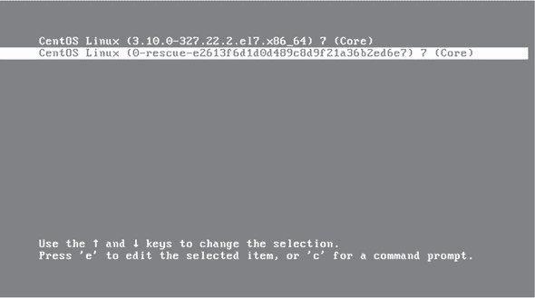

一旦你在 CentOS 机器上选择了救援选项，接下来是什么？你将通过本章的其余部分遇到一些有用的工具。但首先，为什么不从 Ubuntu 操场手册中取一页，手动应用自动化恢复菜单中的某些工具？“说起来容易做起来难，”我听到你说。“但那些工具是如何工作的？”在接下来的几页中，我将向你展示如何运用你的 Bash 和脚本技能来找出一些答案。

#### 6.1.4\. 查找命令行救援工具

拥有正在运行的 Ubuntu 机器（这个脚本在 Debian 上无法工作）？如果代码正在运行菜单，它必须已经存在于 Ubuntu 文件系统的某个地方。自己去看看吧。使用 `locate` 来查找它：

```
$ locate recovery-mode
/lib/recovery-mode
/lib/recovery-mode/l10n.sh                      *1*
/lib/recovery-mode/options
/lib/recovery-mode/recovery-menu                *2*
/lib/recovery-mode/options/apt-snapshots
/lib/recovery-mode/options/clean                *3*
/lib/recovery-mode/options/dpkg
/lib/recovery-mode/options/failsafeX
/lib/recovery-mode/options/fsck
/lib/recovery-mode/options/grub
/lib/recovery-mode/options/network
/lib/recovery-mode/options/root
/lib/recovery-mode/options/system-summary
```

+   ***1* 110n.sh 脚本为菜单设置适当的环境变量。**

+   ***2* 恢复菜单脚本文件**

+   ***3* 减少磁盘使用量的脚本**

如果你导航到 /lib/recovery-mode/ 目录，你会看到 recovery-menu 文件是显示你在图 6.3 中看到的菜单界面的脚本。options/ 目录包含执行每个菜单项的文件。例如，fsck 将检查并修复（如果可能的话）任何损坏的文件系统。

因为现在你是一位熟练的 Bash 脚本专家，为什么不查看 options/ 目录中的每个脚本，看看你是否能弄清楚它们是如何工作的？以下是为你提供的 fsck 脚本内容。注意脚本是如何很好地使用 `#` 字符进行文档化，以帮助你理解正在发生的事情：

```
$ cat /lib/recovery-mode/options/fsck
#!/bin/sh

. /lib/recovery-mode/l10n.sh                     *1*

if [ "$1" = "test" ]; then
  echo $(eval_gettext "Check all file systems")
  exit 0
fi

# Actual code is in recovery-menu itself         *2*
exit 0
```

+   ***1* 调用 110n.sh 脚本以设置环境。**

+   ***2* 这条注释告诉你在哪里发生真正的操作。**

这里有一些您可以自己尝试的事情。在 Ubuntu 机器上手动运行 clean 脚本。发生了什么？然后尝试仔细编辑/lib/recovery-mode/recovery-menu 脚本（首先创建备份副本）。更改一些简单的内容，比如菜单标题或脚本描述之一。然后重启您的机器，从 GRUB 菜单进入恢复模式，看看恢复环境的样子。通过一些变化和例外，您应该能够在其他地方很好地使用这些脚本，包括在 CentOS 上。

### 6.2\. 构建实时启动恢复驱动器

如您可能已经知道，您在第二章中为您的 VirtualBox 虚拟机使用的那些.ISO 操作系统镜像也可以写入 CD 或 USB 驱动器，并用于启动 OS 的*实时*会话。这种实时启动设备允许您加载完全功能的 Linux 会话，而无需将任何内容安装到硬盘上。许多人使用这样的驱动器来确认特定的 Linux 发行版是否能在他们的硬件上顺利运行，然后再尝试安装。其他人则会运行实时会话，作为一种在参与敏感活动（如在线银行）时维护隐私的安全方式。

结果表明，这些实时启动驱动器也是系统救援和恢复的绝佳工具。还记得本章前面提到的第二个灾难场景吗？

> *您的计算机启动了（至少您是这样认为的），但您并不完全确定硬盘是否完全正常工作。*

将实时启动驱动器插入故障计算机，并使用所有管理工具启动 Linux，可以帮助您弄清楚真正发生的事情——并为您提供解决问题的工具。我将向您展示如何创建实时启动 USB 驱动器，然后如何使用它。但首先，让我们快速看一下目前可用的最有用的发行版镜像。

#### 6.2.1\. 系统救援镜像

如果您碰巧已经有一个包含完整 Linux 系统（如 Ubuntu）的 DVD 或 USB 驱动器，那么这将是您最简单的解决方案，因为您需要的软件中的大部分都将预先安装。假设您有一个网络连接，您可以在实时会话期间安装其他包。否则，以下几节将描述一些特殊镜像。

##### Boot-Repair

如果您正在尝试救援的是 Ubuntu 系统，那么您将想要尝试 Boot-Repair。一个小巧快速的 Boot-Repair 实时启动会检查您的 GRUB 设置，并在必要时重新构建它们。如图 6.6 所示，它还可以执行其他有用的管理任务。这个工具在我需要的时候救了我很多次。

##### 图 6.6\. Boot-Repair 桌面，系统工具菜单可见

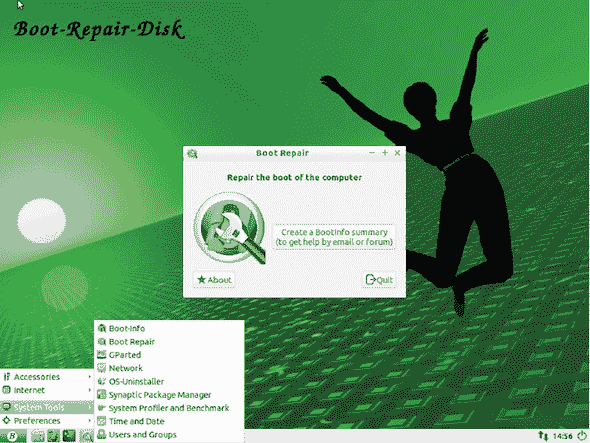

Boot-Repair 也可以安装在已经启动的实时会话上。网站([`help.ubuntu.com/community/Boot-Repair`](https://help.ubuntu.com/community/Boot-Repair))提供了很好的说明。

##### GParted Live

如果你的问题与可能损坏你的数据或阻止你成功启动的损坏分区有关，GParted Live 镜像将全功能的强大 GParted 分区编辑器带到实时 CD 或 USB 上。像 Boot-Repair 一样，GParted 也可以从任何正常的 Linux 会话中安装和使用。如果你知道你的问题是与分区相关的，那么完整的实时启动版本可能是最快和最直接解决问题的方法。与 Boot-Repair 不同，GParted 是为了在几乎所有 Linux 发行版上使用而构建的，而不仅仅是 Ubuntu。

##### SystemRescueCd

另一个替代方案，SystemRescueCd，是基于 Gentoo Linux 发行版的轻量级镜像。由于它包含大量有用的系统恢复工具，SystemRescueCd 成为随身携带的出色 USB 驱动器。（CD 也很棒，尽管它不太容易放入后口袋，而且安全地坐着可能是一个挑战。）

#### 6.2.2\. 将实时启动镜像写入 USB 驱动器

在你可以写入任何.ISO 镜像之前，你需要下载它。我认为我可以安全地假设你能够找到你想要的发行版的网站上的正确页面来完成这项工作。但你可能不知道，大型下载有时在跨越互联网的过程中可能会损坏。更糟糕的是，它们可能会被入侵者或中间人攻击者用恶意软件替换。这发生在一些人在一段时间前下载 Mint Linux 时。1

> ¹
> 
> 参考凯利·菲瓦什的文章，“Linux Mint 网站和论坛在遭受黑客攻击后感染恶意软件，” *Ars Technica*，2016 年 2 月 22 日，[`mng.bz/irPi`](http://mng.bz/irPi)。

除了检查你所在的网站是否已正确加密（你的浏览器应该在 URL 栏中显示某种锁形图标），你的最佳防御措施是生成下载文件的哈希值，并将其与网站提供的哈希值进行比较。（哈希值在第二章中已有讨论。）

有时哈希值会直接显示在镜像下载页面上，但某些发行版使它们变得有点难以找到。Canonical（为我们提供 Ubuntu 的杰出人士）在这方面并没有完全赢得荣誉。有一个单独的页面([`help.ubuntu.com/community/UbuntuHashes`](https://help.ubuntu.com/community/UbuntuHashes))，其中包含所有哈希值的链接。从下载站点找到该页面并不简单。通常，使用可靠的互联网搜索引擎会更好。图 6.7 显示了 Ubuntu 17.04 的哈希值将看起来是什么样子。

##### 图 6.7\. 可下载的 Ubuntu 17.04 各种镜像的 SHA256 哈希值

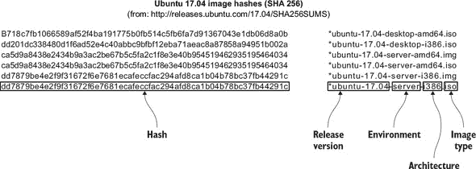

一旦找到你镜像的已发布哈希值，你将计算下载文件的哈希值，并将两个值进行比较。以下示例从下载到同一目录的 SystemRescueCd 镜像生成 SHA256 哈希值：

```
$ cd Downloads
$ ls | grep systemrescue
systemrescuecd-x86-5.0.2.iso
$ sha256sum systemrescuecd-x86-5.0.2.iso
a2abdaf5750b09886cedcc5233d91ad3d1083e10380e555c7ca508
   49befbf487  systemrescuecd-x86-5.0.2.iso
```

在安全下载了某种可靠的镜像之后，是时候创建恢复工具的 live-boot 驱动器了。如果您当前计算机和您正在创建的 live-boot USB 都将运行 Debian、Ubuntu 或其衍生版本，最简单的方法是使用 Ubuntu 启动磁盘创建器。

创建者工具可以从常规 GUI 菜单中访问，正如您从图 6.8 中可以看到，它是直接的。从您的硬盘上的某个位置选择一个.ISO 文件，以及您希望写入图像的目标 USB（或 CD）驱动器。创建者将处理其余部分。

##### 图 6.8\. Ubuntu 启动磁盘创建器，已选择 Ubuntu Server 16.04 图像和目标 USB 驱动器

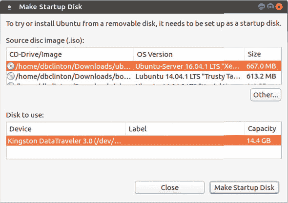

另一方面，如果您需要从不同的发行版构建 live-boot 设备（您正在尝试恢复 CentOS 机器，并希望使用 CentOS 工具来完成它），那么您需要重新启用您的好友`dd`。如果您需要一个基于 CD 或 DVD 的 live 可引导设备，任何 Linux 主机上的`dd`都可以完成这项工作。但如果图像将被写入 USB 驱动器，并且您正在 Ubuntu 主机上工作，您首先需要通过向.ISO 存档中添加 MBR 来修改图像，这样 BIOS 和 UEFI 固件就会知道如何处理它。图 6.9 展示了这个过程的外观。

##### 图 6.9\. 编写可工作的 live-boot USB 镜像所需的步骤

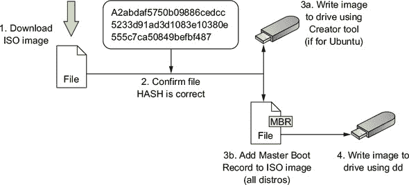

在 Ubuntu 主机上，您使用`isohybrid`进行图像修改。包含`isohybrid`的 apt 包被称为 syslinux-utils。一旦安装，转到包含下载的图像的目录，并使用图像文件名作为唯一参数运行`isohybrid`：

```
# apt update
# apt install syslinux-utils
$ cd ~/Downloads
$ isohybrid systemrescuecd-x86-5.0.2.iso
```

下一步应该适用于您使用的任何发行版。仔细识别目标设备的系统标识。如您所记得，`df`列出了所有当前识别的文件系统及其标识：

```
$ df -h
Filesystem Size Used Avail Use% Mounted on
udev      3.5G    0 3.5G  0% /dev
tmpfs     724M 1.5M 722M  1% /run
/dev/sda2 910G 183G 681G 22% /                          *1*
tmpfs     3.6G 214M 3.4G  6% /dev/shm
tmpfs     5.0M 4.0K 5.0M  1% /run/lock
tmpfs     3.6G    0 3.6G  0% /sys/fs/cgroup
/dev/sda1 511M 3.4M 508M  1% /boot/efi
tmpfs     724M  92K 724M  1% /run/user/1000
/dev/sdb1 15G  16K  15G   1% /media/myname/KINGSTON     *2*
```

+   ***1* 这是我的根文件系统。我绝对不希望覆盖它！**

+   ***2* 我的可移动 USB 驱动器上的文件系统**

在这个例子中，我的金士顿 USB 设备上挂载了一个名为/dev/sdb1 的文件系统。这告诉我该设备本身被称为/dev/sdb。

如果您计划将图像写入 CD 或 DVD 等光驱，那么您可以通过`lsblk`获取其标识，它代表*列出块设备*。驱动器本身必须是可写的。在这里，我的 DVD 驱动器被称为 sr0：

```
$ lsblk
NAME   MAJ:MIN RM   SIZE RO TYPE MOUNTPOINT
sda      8:0    0 931.5G  0 disk
sda1   8:1    0   512M  0 part /boot/efi
sda2   8:2    0 923.8G  0 part /
sda3   8:3    0   7.2G  0 part [SWAP]
sdb      8:16   1  14.4G  0 disk
sdb1   8:17   1  14.4G  0 part /media/clinton/KINGSTON
sr0     11:0    1  1024M  0 rom                            *1*
```

+   ***1* 可写的 DVD 驱动器**

真正的时刻。不再推迟。是时候将`dd`释放到您可怜的、毫无防备的文件系统上，并将您的图像写入 USB 驱动器了。

首先，卸载驱动器本身，以便`dd`可以完全访问。然后写入存档。在这个例子中，我使用了 systemrescuecd-x86-5.0.2.iso 图像，并将其写入到/dev/sdb 的驱动器上。

小心！在特定情况下，将`sda`而不是`sdb`（在这种情况下）输入将不可恢复地覆盖您的宿主文件系统，并毁掉您的一天，更不用说您的生命了。当然，您还应该确保 USB 驱动器上没有重要内容，因为那肯定会消失：

```
# umount /dev/sdb
# dd bs=4M if=systemrescuecd-x86-5.0.2.iso \
    of=/dev/sdb && sync                        *1*
```

+   ***1* 添加的同步命令确保所有缓存的数据立即写入目标磁盘。**

`dd`将镜像写入 USB 设备可能需要一些时间，但完成时，您应该能够将驱动器插入计算机，打开电源，并进入 live 会话。这是假设您的计算机已配置为从 USB 驱动器启动。如果不是，您可以在启动过程中进入 Boot 菜单，强制将计算机引导到选定的设备这一次。每个 PC 制造商都为其指定了自己的键（通常在启动过程中显示按键选项列表）。但通常在启动序列的早期按下 F1、F9 或 F12 中的一个键会起作用。

您也可以进入设置实用程序（无论是 BIOS 还是 UEFI）以永久设置用于启动设备的顺序。访问设置实用程序也可能通过一系列键来完成：我见过 F2、F10、Del 和 Enter。

### 6.3. 使用您的 live-boot 驱动器

您可以使用您创建的口袋 Linux 驱动器做很多事情。以下几节描述了一些常见场景及其解决方法。

#### 6.3.1. 测试系统内存

如果您经历过突然和意外的系统崩溃，一个可能的原因是您的物理内存（RAM）。像所有硬件一样，RAM 最终会失效。问题是，当操作系统正在使用时，您无法正确测试 RAM 的错误。相反，您必须在操作系统加载之前捕捉到它。幸运的是，作为 Linux live-boot 驱动器的自豪拥有者，您已经拥有了完成这项工作所需的一切。如图 6.10 所示，在启动到 Ubuntu 驱动器后，将显示的一个菜单项是测试内存。

##### 图 6.10. Ubuntu 安装过程中的主菜单显示测试内存

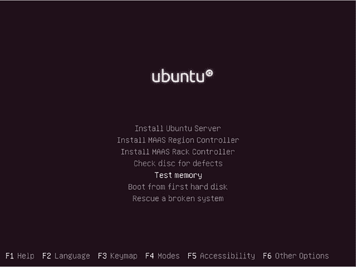

选择测试内存（使用上箭头和下箭头键并按 Enter 键）将您带到 Memtest86+程序（如图 6.11 所示）。该程序对您的 RAM 进行多次扫描，显示它发现的任何错误。老实说，我不确定这个工具是否会自己停止；我肯定从未达到那个点。但如果它运行了至少几轮完整的扫描后没有返回错误，那么您的内存可能不是麻烦的原因。这可能是好消息也可能是坏消息……毕竟，您仍然不知道是什么导致了您的崩溃。

| |
| --- |

##### 注意

除了测试内存外，Ubuntu 安装过程中的主菜单中的“修复损坏的系统”选项将为您提供工作的 Bash shell。

| |
| --- |

##### 图 6.11. Memtest86+工具显示了 RAM 内存中任何错误的位置和类型。这个系统是干净的（到目前为止）。

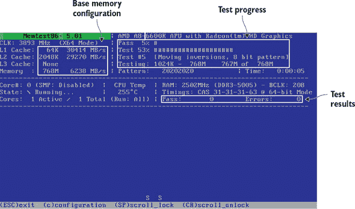

CentOS 安装盘在故障排除菜单中包含了对 Memtest86+的链接（如图 6.12 所示）。

##### 图 6.12。从 CentOS 安装盘主菜单链接的故障排除菜单

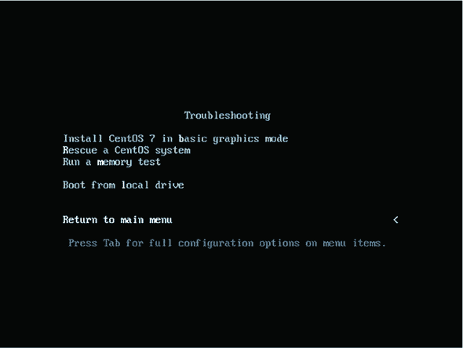

#### 6.3.2。损坏的分区

一个*分区*实际上是指向物理磁盘上文件系统位置的元数据。这些分区很脆弱，它们似乎很容易被破坏。如果磁盘数据以某种方式损坏，并且分区的起始和结束地址被更改或丢失，那么分区上的文件系统将变得无法访问。如果一个文件系统无法访问，那么该文件系统上的数据就相当于丢失了。

无法访问你的分区？是时候启动你的新 SystemRescue 驱动了。SystemRescue 是一个轻量级的包，所以不要期待一个功能齐全的发行版的所有 GUI 奇迹。像笔记本电脑触摸板和自动 WiFi 连接这样的功能可能不会按你期望的方式工作。但这是快速获取一些强大救援工具的方法。如图 6.13 所示，默认的启动选项将打开一个特殊的命令行 shell。

##### 图 6.13。SystemRescue 启动期间显示的启动选项菜单。注意页面底部的每个选项的详细说明。

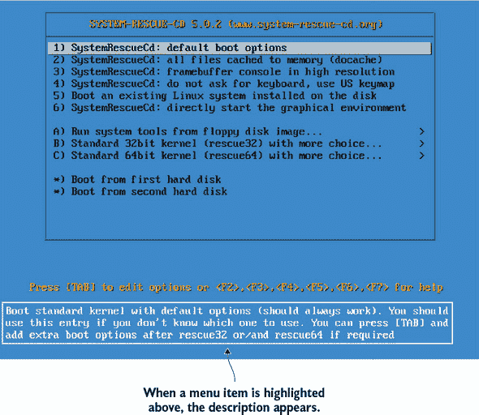

当你准备恢复你的受损分区（或其数据）时，SystemRescue 提供了有关命令行（包括网络和文本编辑基础）的一些有用的方向信息（如图 6.14 所示）。不用担心：Vim 和 Nano 都可以从命令行访问。输入`startx`将加载一个快速轻量的 GUI 桌面。

##### 图 6.14。SystemRescue shell。注意默认可用的文本编辑器（包括 Nano），以及输入`startx`将启动图形桌面。

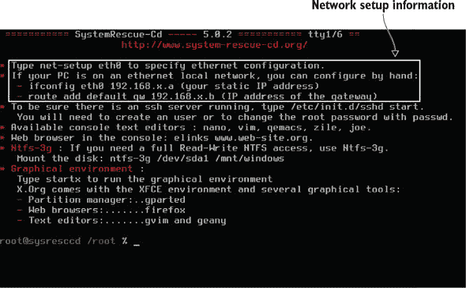

如果你需要网络访问来下载或安装更多工具，或许，或者传输数据，你将在命令提示符下输入`net-setup`，选择正确的接口，并指明你的网络是有线还是无线。如果是无线，你需要输入你的 WiFi 路由器的 SSID 及其加密密钥（这可能会使用 ASCII 字符而不是十六进制字符）。在大多数情况下，你希望让 DHCP 自动检测你的网络。

当你需要担心损坏的分区时，你现在的首要任务是恢复。如果物理磁盘本身可能正在损坏，那么你的首要任务必须是确保其数据的安全。为此，我会在 SystemRescue 命令提示符下使用`dd`创建分区当前状态的完美副本，并将其保存到容量相等或更大的健康磁盘上。在运行`lsblk`以确认两个分区的指定后，复制操作可能看起来像这样，其中损坏的磁盘是`/dev/sda`，而你目标驱动器上的空分区是`/dev/sdc1`。

```
# dd if=/dev/sda of=/dev/sdc1
```

完成这些后，你可以自由地看看是否可以保存原始副本。输入`testdisk`。你会被询问你希望如何记录会话事件，你想恢复哪个磁盘，以及你期望找到哪种分区类型。通常情况下，TestDisk 会猜对正确的类型并将其突出显示为默认选项。

你会发现你面对的屏幕看起来像图 6.15，在那里你可以要求 TestDisk 分析你的磁盘，寻找现有的分区。当你已经发现并适当地标记了损坏的分区后，你可以将更改写入磁盘，你应该能够再次成功启动。

##### 图 6.15\. TestDisk 分区修复页面，在这里可以通过分析发现的分区然后使用其他工具进行编辑和恢复

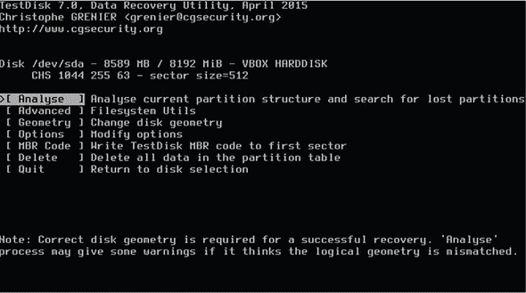

等等...这就结束了？所有那些细节呢？“发现并适当地标记了损坏的分区”是否以某种有用的方式涵盖了复杂的过程？不，没有。但是，那么，你为什么还要读这一章呢？我会说，要么是因为你正在为未来的灾难做准备，要么是因为未来已经到来，你正在查看你损坏的分区。

如果你对未来感到担忧，那么跟随我处理一个或两个假设解决方案的狭窄细节并不会帮到你太多。此外，我不会建议你故意损坏一个真实的分区以便你可以真正尝试 TestDisk。如果你有自己的实际问题要处理，那么我随机选择的任何例子很可能对你都没有用。实际上，我能做的最好的事情就是让你知道这样的软件存在，并教你如何运行它。哦，还有，[`cgsecurity.org/testdisk.pdf`](https://cgsecurity.org/testdisk.pdf)上有一些相当不错的文档。

#### 6.3.3\. 从损坏的文件系统中恢复文件

如果最终发现你无法完全恢复你的磁盘，也许你只是设法复活了分区，足以允许访问文件，但不足以从磁盘可靠地启动。那么你的新优先级就是尽可能多地保存重要的文件。

最简单的方法是使用任何类型的实时启动会话中的常规 Linux 文件系统管理工具。如果你不确定分区的指定，运行`lsblk`将像往常一样让你了解情况。

可能您的分区还无法作为文件系统访问，因为它尚未挂载。如果实际上它没有出现在 `df` 命令的结果中，那么您将不得不 *挂载* 它，这意味着将其分配到文件系统中的一个位置，以便可以访问。您可以通过创建一个新目录来快速解决这个问题，其中您的分区将被挂载，然后使用 `mount` 命令。我选择在 /run/ 中创建我的临时挂载点目录，但任何您找到的未使用位置（如 /media/ 或 /mnt/）也可以。假设，像之前一样，分区是 /dev/sdc1：

```
# mkdir /run/temp-directory
# mount /dev/sdc1 /run/temp-directory
```

从现在开始，任何来自受损害文件系统的健康文件都可以在 temp-directory 内进行复制或编辑。它们也可能自动出现在您可能想要使用的任何 GUI 桌面文件管理工具中。

##### 使用 ddrescue 进行恢复

如果不起作用？是时候拿出重型武器了。数据恢复工具 ddrescue 在文件系统之间复制文件。但它在同时还做了一件能让您笑的事情：它分析您的文件并尝试修复任何损坏的文件。没有工具能保证修复所有变坏的东西，但据传闻，ddrescue 是您能得到的最好的选择。

如果您使用的实时启动中没有安装 ddrescue，那么它默认是 SystemRescue 的一部分。从您的仓库中获取它。然后确定有问题的分区（在这个例子中是 /dev/sdc1），您想要保存镜像的分区以及记录操作事件的日志文件的名字和位置。拥有日志文件允许 ddrescue 继续停止的操作而不是从头开始。我的例子使用了一个外部驱动器（容量大于源驱动器）挂载到一个名为 /run/usb-mount 的目录：

```
# apt install gddrescue                                       *1*
# ddrescue -d /dev/sdc1 /run/usb-mount/sdc1-backup.img \
 /run/usb-mount/sdc1-backup.logfile                           *2*
```

+   ***1* 注意：对于 CentOS，命令将是 yum install ddrescue。**

+   ***2* 告诉 ddrescue 忽略内核缓存并直接访问磁盘**

您可以通过使用 `dd` 将备份镜像写入新的空驱动器（在我的例子中称为 /dev/sdd/）并从新驱动器启动系统来测试恢复：

```
# dd if=backup.img of=/dev/sdd
```

即使您发现您仍然无法启动分区，现在可能可以使用它来可靠地访问重要的单个文件。无论如何，您都比之前的情况要好。

##### 使用 PhotoRec 进行文件恢复

另一个可以帮助您从损坏的驱动器中提取文件的工具是 PhotoRec。一眼看去，您就会知道它必须来自与 TestDisk 相同的地方。事实上，这两个工具都是由 CGSecurity 的 Christophe Grenier 创建和维护的。要加载程序，请输入

```
# photorec
```

一旦您确定了需要恢复的文件系统、您想要包含的文件类型以及您想要保存文件的位置，文件将使用 `recup_dir.?` 前缀保存到编号目录中：

```
$ ls recup_dir.12
f1092680.elf
f0668624.png
f0853304.xml
f0859464.xml
f0867192.txt
f0977016.gz
f0982184.xml
[...]
```

关于 PhotoRec 有一点需要注意，文件都被赋予了新的编号文件名，同时保留了它们的原始文件扩展名。这有时会使得寻找单个文件变得困难，但总比完全丢失要好。

### 6.4. 密码恢复：使用 chroot 挂载文件系统

你知道你支持的人选择的密码可能不足以保护你的基础设施免受严重攻击。即使是规则的少数例外，可能也在多个服务器和账户上重复使用。你恳求和唠叨，但似乎是一场输不起的战斗。但并非一切都已失去。

通过使用像 KeePass2 或 LastPass 这样的良好密码保险库，可以很大程度上解决跟踪足够复杂的密码的问题。而过度使用密码的问题至少可以通过实施像 Kerberos 这样的单一登录解决方案来减轻。然而，不幸的事情总是会发生。

对于那些足够关心并为每个访问的服务器想出好、强密码的用户来说，会发生什么？他们时不时地会忘记密码。如果有另一个拥有 `sudo` 权限的管理员可以登录到服务器并运行 `passwd` 为用户创建一个新的密码，那么这不会是问题：

```
# passwd username
[sudo] password for yourname:
Enter new UNIX password:
Retype new UNIX password:
passwd: password updated successfully
```

但如果你的不幸且健忘的用户是唯一一个在该机器上有账户的管理员，那你就有麻烦了。除了这个之外，你没有。Linux 虚拟化的鼻祖 `chroot` 将会拯救你的日子。这里有一种可能的工作方式。

使用 live-boot 驱动为被锁定的服务器供电，运行 `lsblk` 确定服务器硬盘上根分区的指定，并将根分区挂载到一个临时目录：

```
# mkdir /run/mountdir/
# mount /dev/sdb1 /run/mountdir/
```

然后低声说出魔法词语，你就进来了：

```
# chroot /run/mountdir/
root@ubuntu:/#
```

这就是全部。到了这一点，你可以像在运行物理硬盘的版本上工作一样运行命令。使用 `passwd` 为你的管理员提供一个新密码来替换丢失的密码。然后，在输入 `exit` 关闭你的 `chroot` 会话后，重新启动机器（不要使用 live-boot USB）。现在一切应该都正常了。


**加密还是不加密？**

使用 ecryptfs 或 dm-crypt 等工具加密存储驱动器上的数据，将大大降低你的数据被泄露的风险。但另一方面，本章中讨论的许多救援和恢复操作在加密卷上都不会工作。


在安全性和易用性之间取得平衡并不是一门精确的科学。许多管理员没有对本地服务器和桌面工作站进行加密，因为至少它们可以通过锁着的办公室门得到保护，但他们坚持要求移动设备必须加密。

### 摘要

+   Linux 恢复模式提供了访问用于修复无法正常启动的系统管理工具的权限。

+   Live-boot 驱动允许您独立于计算机物理驱动器上的文件系统，独立启动您选择的 Linux 发行版。

+   定制构建的发行版，如 SystemRescueCd，是 Linux 的轻量级版本，预装了完整的救援工具。

+   有时可以使用 TestDisk 等工具恢复损坏的分区。

+   有时可以使用 ddrescue 和 PhotoRec 等工具从损坏的分区中恢复数据。

+   可以使用名为`chroot`的虚拟进程挂载和管理文件系统。

### 关键术语

+   *GRUB* 是一个引导加载程序，它管理 Linux 引导过程中使用的镜像。

+   一个 *哈希*（校验和）是一个通过密码学生成的值，可以与主副本进行比较以确认镜像的真实性。

+   CD/DVD 的分区 *主引导记录*（MBR）将不同于 USB，创建 live-boot USB 时需要特别注意。

+   工具`chroot`在挂载的文件系统中打开虚拟根 shell。

### 安全最佳实践

+   总是确认下载的镜像是否真实，通过检查它们的哈希值。并且避免从未加密的网站（HTTP 而不是 HTTPS）下载。

+   仔细考虑是否在系统驱动器上加密静态数据，在可访问性和安全性之间取得平衡。

+   强制使用密码保险库和单点登录服务来保护你的基础设施用户。

### 命令行审查

+   `sha256sum systemrescuecd-x86-5.0.2.iso` 计算一个.ISO 文件的 SHA256 校验和。

+   `isohybrid systemrescuecd-x86-5.0.2.iso` 向 live-boot 镜像添加一个 USB 友好的 MBR。

+   `dd bs=4M if=systemrescuecd-x86-5.0.2.iso of=/dev/sdb && sync` 将 live-boot 镜像写入一个空驱动器。

+   `mount /dev/sdc1 /run/temp-directory` 将分区挂载到 live 文件系统上的一个目录。

+   `ddrescue -d /dev/sdc1 /run/usb-mount/sdc1-backup.img /run/usb-mount/ sdc1-backup.logfile` 将损坏分区上的文件保存到名为 sdc1-backup.img 的镜像，并将事件写入日志文件。

+   `chroot /run/mountdir/` 在文件系统上打开一个根 shell。

### 测试自己

> **1**
> 
> 以下哪个选项可以让你访问损坏的 Linux 机器的自己的恢复模式？
> 
> 1.  SystemRecovery
> 1.  
> 1.  GRUB
> 1.  
> 1.  启动时按 CRTL+右 Shift
> 1.  
> 1.  chkdsk
> 1.  
> **2**
> 
> 默认情况下，Linux 恢复模式 shell 会话使用哪个用户账户？
> 
> 1.  root
> 1.  
> 1.  安装过程中创建的初始账户
> 1.  
> 1.  admin
> 1.  
> 1.  guest
> 1.  
> **3**
> 
> Ubuntu 恢复模式菜单中的“清洁”选项的目标是什么？
> 
> 1.  查找并删除病毒
> 1.  
> 1.  删除未使用的程序文件
> 1.  
> 1.  删除未使用的用户账户
> 1.  
> 1.  清理会话并关闭
> 1.  
> **4**
> 
> 引导 Linux live-boot 设备将执行以下哪项操作？
> 
> 1.  启动系统恢复环境
> 1.  
> 1.  启动文件恢复环境
> 1.  
> 1.  使用宿主机的分区启动 Linux 会话
> 1.  
> 1.  仅使用 live-boot 分区启动 Linux 会话
> 1.  
> **5**
> 
> 你需要什么工具来创建一个可以从 USB 设备引导的 live-boot 镜像？
> 
> 1.  ddrescue
> 1.  
> 1.  GRUB
> 1.  
> 1.  isohybrid
> 1.  
> 1.  ecryptfs
> 1.  
> **6**
> 
> sha256sum 程序用于什么目的？
> 
> 1.  在挂载的文件系统上打开虚拟 shell 会话
> 1.  
> 1.  管理系统启动时的 Linux 镜像
> 1.  
> 1.  生成散列以验证文件完整性
> 1.  
> 1.  管理从损坏的驱动器中恢复文件
> 1.  
> **7**
> 
> 以下哪个选项会将 SystemRescue 镜像写入系统上的第二个块设备？
> 
> 1.  `dd if=systemrescuecd-x86-5.0.2.iso of=/dev/sdb`
> 1.  
> 1.  `dd if=/dev/sdb of=systemrescuecd-x86-5.0.2.iso`
> 1.  
> 1.  `dd if=/dev/sdc of=systemrescuecd-x86-5.0.2.iso`
> 1.  
> 1.  `dd if=systemrescuecd-x86-5.0.2.iso of=/dev/sdb2`
> 1.  
> **8**
> 
> `chroot`命令的作用是什么？
> 
> 1.  创建一个可用于从 USB 设备启动的实时引导镜像
> 1.  
> 1.  在挂载的文件系统上打开虚拟 shell 会话
> 1.  
> 1.  生成散列以验证文件完整性
> 1.  
> 1.  删除未使用的程序文件

#### 答案键

> **1.**
> 
> b
> 
> **2.**
> 
> a
> 
> **3.**
> 
> b
> 
> **4.**
> 
> d
> 
> **5.**
> 
> c
> 
> **6.**
> 
> c
> 
> **7.**
> 
> a
> 
> **8.**
> 
> b
