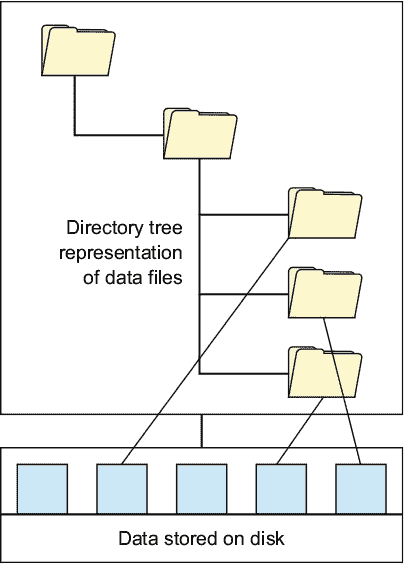
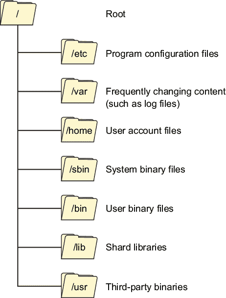
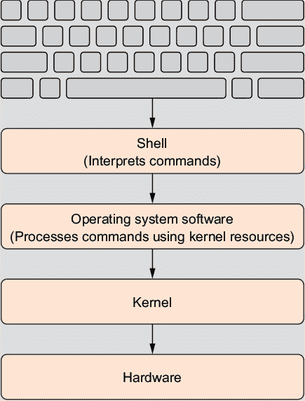
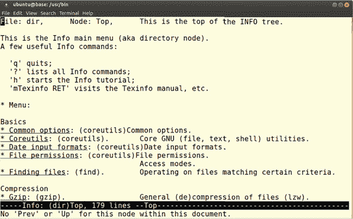

## 第一章. 欢迎来到 Linux

*本章涵盖*

+   Linux 的不同之处

+   基本生存技能

+   获取帮助

这本书将技术培训颠倒过来。尽管其他书籍、课程和在线资源围绕*技能*组织内容，但我将使用现实世界的*项目*作为教学工具。每个核心技能和 Linux 系统的功能都将被涵盖，并且覆盖得很好，但只有在项目需要时才会涉及。当你完成时，你将学到从传统来源学到的一切，但你还将知道如何执行十几个关键和复杂的行政任务，并且能够轻松应对更多。

前两到三章将快速引导你了解 Linux 服务器世界的初步介绍。之后，你将进行实际的手动项目，并且只有实际的手动项目。通过这些项目，你将学到不仅仅是命令和技能。准备好深入探索，并最终为你的商业问题创造解决方案。

没有一本书能够预测你整个职业生涯中可能遇到的所有挑战。但是，通过展示如何使用现实世界的工具解决现实世界的问题，这本书将使你通过内联文档和互联网使用大量资源变得更加容易。如果你的 Linux 经验有限，本章介绍了基本的命令行生存技能，并指出当事情不工作时你可以去哪里寻求帮助。


##### 注意

正如你将看到的，*命令行*是操作系统（OS）提供的一个界面，允许你输入文本命令来控制操作系统或查询它管理的数据。


我应该指出，在本章以及每一章中，我们都强烈鼓励你自己尝试所有内容。没有比实际操作更好的方式来真正掌握 IT 技能，意识到它没有按你预期的方向发展，然后玩弄它直到它永远属于你。祝你好运，玩得开心！

### 1.1. Linux 与其他操作系统的不同之处

Linux 是免费的，这意味着它比其他操作系统更容易安装到任何需要的位置和时间，用于任何你能想象到的用途。不必担心购买站点许可证和跳过数字版权管理障碍，这使得测试各种硬件组合和服务器配置变得更加直接。

Linux 使得做各种真正有用和有创意的事情成为可能。例如，你可以在 U 盘上加载 Linux *live boot* 镜像，启动一个自身硬盘已损坏的 PC，然后进行故障排除和修复问题。（你将在第六章中学习如何做这件事。）或者，因为 Linux 是一个真正的多用户操作系统，整个团队可以同时登录本地或远程工作，对系统的隐私和稳定性充满信心。

Linux 是使用与深度成熟的 UNIX 操作系统相同的技术构建的，并配备了大多数相同的工具。这增加了极大的稳定性和安全性。Linux 发行版还提供了复杂的软件包管理系统，可以可靠地安装和维护通过在线精选仓库提供的成千上万免费软件应用程序。

但除了免费之外，Linux 还是 *开源* 的，这意味着任何人都可以取用代码库并将其重塑成他们想要的任何东西。实际上，这催生了一个庞大的专业 Linux 发行版生态系统。*发行版*（有时简称为 *distro*）是一组定制的软件栈，它与 Linux 内核一起打包，并附带安装用户计算机上工作版本 Linux 的工具。表 1.1 提供了一个非常不完整的发行版列表，以说明可用的各种事物。

##### 表 1.1\. 许多可用的 Linux 发行版

| 目的 | 发行版 |
| --- | --- |
| 安全/反黑客 | Kali Linux |
|   | Parrot |
| 消费者桌面 | Mint |
|   | Elementary OS |
| 轻量级（旧硬件；诊断） | Puppy Linux |
|   | LXLE |
| 物联网管理 | Snappy Ubuntu Core |
| 企业服务器室 | CentOS（Red Hat Enterprise Linux 的社区版本） |
|   | OpenSUSE（SUSE 的社区版本） |
| 云计算 | Amazon Linux（AWS AMI） |
|   | Ubuntu Server（AWS AMI） |
| 多用途（除轻量级外） | Ubuntu |

找不到你想要的东西？自己创建一个。需要帮助？在线上有一个庞大且活跃的社区，如果有人还没有解决你的问题，他们知道去哪里找到解决方案。我认为最重要的是，基于社区的资源让 Linux 变得如此强大。

### 1.2\. 基本生存技能

在开始本书中其余部分的企业级项目之前，确保我们站在同一起跑线上是值得的。这一章涵盖了 Linux 基础：UNIX 文件系统层次标准（包括伪文件系统），导航（`ls`，`pwd` 和 `cd`），文件管理工具（`cat`，`less`，`touch`，`mkdir`，`rmdir`，`rm`，`cp` 和 `mv`），一些技巧（如自动补全和文件通配符），`sudo`，以及寻求帮助的地方（`man`，`info` 和 `journalctl`）。

可能你已经拥有了足够多的经验，以至于你不需要任何那些材料。你可以自由地跳过这一章。不用担心我们其他人。我们会赶上的。

|   |
| --- |

**安装 Linux**

我不会花时间讨论如何在你的 PC 上安装 Linux。这并不是因为安装过程如此荒谬地简单；有时它可能会相当复杂。相反，这是因为你选择的方法取决于你的具体情况。描述一种可能性，甚至六种可能性，对于其中 75% 的人来说这些场景不起作用，只会让他们感到烦恼。

需要一些帮助开始安装吗？请查看*《一个月午餐时间学 Linux》*（Manning，2016）。遇到特定的安装问题？花一分钟时间写一个简短但详细的描述，然后使用它在网上搜索帮助。在寻找预装 Linux 的笔记本电脑或台式机？在网上搜索“预装 Linux 的电脑”。有一些未使用的硬件和一个 USB 闪存盘？搜索“从 USB 安装 Linux”。更喜欢将 Linux 作为虚拟机安装？这是一个明智的选择。请留在第二章。

| |
| --- |

#### 1.2.1\. Linux 文件系统

人们常说 Linux 中的所有东西都是通过纯文本文件工作的，因此，从理解 Linux 文件系统开始可能最有意义。但在我们能够进入 Linux 之前，什么是*文件系统*呢？你可以将其视为一个数据表（或*索引*），它创建了个别文件和具有可识别磁盘位置的文件组之间的明显联系。图 1.1 可以帮助你可视化数据如何在磁盘分区中分布，并在目录结构中向系统用户展示。

##### 图 1.1\. 存储设备上的原始数据可以通过操作系统以组织良好的目录层次结构进行可视化表示。



为什么你需要索引呢？像硬盘或 USB 这样的数字存储设备并没有划分为可以用来组织*文件夹*（或 Linux 圈中称之为*目录*）的物理分区。一个特定的文件可以位于实际媒体上的一个位置，这个位置与几分钟或几秒钟前创建的几乎相同的文件相距甚远，而单个文件的所有部分可能并不连续。不仅如此，文件在磁盘上的地理位置也不一定随时间保持静态。

如果你想可靠地检索你的数据，你需要某种索引，它可以始终如一地指向你想要获取的资源。文件系统使用这种索引来提供一个有序的目录和文件集合的表象，这些目录和文件位于称为*分区*的单个磁盘分区中。

| |
| --- |

##### 备注

如果你在某个时候需要自己深入研究，了解这些信息将很有用：如今，最常用的 Linux 文件系统是 ext4。但 Linux 也可以与使用 FAT32 和 NTFS 等平台文件系统格式化的存储驱动器一起工作。

| |
| --- |

磁盘分区中的所有文件都保存在根目录下的目录中，根目录由*/*（正斜杠）字符表示。这些目录的排列方式在很大程度上受 UNIX 文件系统层次结构标准（FHS）的约束。无论你使用的是 Linux 发行版、UNIX 还是甚至 macOS，你都会看到几乎相同的基本布局。图 1.2 显示了一些最常用的顶级目录。

##### 图 1.2\. UNIX FHS 定义的常见顶级目录



顶级目录——位于根目录直接下方的目录——包括 /etc/，其中包含定义个别程序和服务功能的配置文件，以及 /var/，其中包含系统或个别应用程序的 *可变* 文件，其内容在正常系统活动过程中经常发生变化。你还需要了解 /home 目录，其中为个别用户提供用于其私有文件的目录。

#### 1.2.2\. 导航：Linux 导航工具

在这里，你将学习五个最基本、必备的 Linux 导航命令 (`ls`、`pwd`、`cd`、`cat` 和 `less`）。由于命令行环境并不是一个特别直观的环境，无论你试图做什么，你都将大量依赖这五个工具来定位自己。


##### 注意

我希望很明显，你应该在自己的计算机上尝试这些工具。这是你学习的唯一方法。


本书其余部分需要某种命令行终端。不幸的是，没有一种打开终端窗口的方法可以在所有 Linux 发行版中工作。例如，在 Ubuntu 菜单系统中终端的位置不一定与 Fedora 或 Mint 相匹配。至于 Ubuntu 本身？那取决于你运行的是哪个版本。

Ctrl-Alt-t 键盘组合至少在大多数环境中应该可以工作，同样，通过在应用程序菜单中搜索带有 *终端* 的项目也可以实现。默认情况下，一旦你的终端打开，你的主目录 (/home/yourname/) 将处于活动状态。

##### ls (列出)

如果你看不到终端中的内容，就没有必要在终端中逗留。你可以使用 `ls` 命令列出当前目录中文件和子目录的名称。带有 `l` 标志的 `ls` 命令（*l* 代表 *长*）不仅列出对象名称，还包括文件权限、所有者、组、文件大小和时间戳。添加目录指定符如 /var/ 将显示该目录的内容：

```
$ ls -l /var
total 40
drwxr-xr-x  2 root root   4096 May  3 06:25 backups
drwxr-xr-x 11 root root   4096 Jan 17 21:16 cache
drwxr-xr-x 39 root root   4096 Jan 17 21:16 lib
drwxrwsr-x  2 root staff  4096 Apr 12  2016 local
lrwxrwxrwx  1 root root      9 Aug 12  2016 lock -> /run/lock
drwxrwxr-x  7 root syslog 4096 May  3 06:25 log
drwxrwsr-x  2 root mail   4096 Aug 12  2016 mail
drwxr-xr-x  2 root root   4096 Aug 12  2016 opt
lrwxrwxrwx  1 root root      4 Aug 12  2016 run -> /run
drwxr-xr-x  5 root root   4096 Jan 17 21:16 spool
drwxrwxrwt  2 root root   4096 Nov  7  2016 tmp
drwxr-xr-x  3 root root   4096 Sep 11  2016 www
```

当将 `h` 参数添加到 `ls -l` 时，会以人类可读的格式显示文件大小——千字节、兆字节和吉字节，而不是字节，字节往往涉及大量难以计算的数字：

```
$ ls -lh /var/log
total 18M                                                      *1*
-rw-r--r-- 1 root   root    0 May  3 06:25 alternatives.log
drwxr-xr-x 2 root   root 4.0K May  3 06:25 apt
-rw-r----- 1 syslog adm  265K Jun  9 00:25 auth.log
-rw-r--r-- 1 root   root 312K Aug 12  2016 bootstrap.log
-rw------- 1 root   utmp    0 May  3 06:25 btmp
-rw-r----- 1 root   adm    31 Aug 12  2016 dmesg
-rw-r--r-- 1 root   root  836 May 21 14:15 dpkg.log
-rw-r--r-- 1 root   root  32K Nov  7  2016 faillog
drwxr-xr-x 2 root   root 4.0K Aug 12  2016 fsck
-rw-r----- 1 syslog adm  128K Jun  8 20:49 kern.log
-rw-rw-r-- 1 root   utmp 287K Jun  9 00:25 lastlog
-rw-r----- 1 syslog adm  1.7M Jun  9 00:17 syslog
-rw-rw-r-- 1 root   utmp 243K Jun  9 00:25 wtmp
```

+   ***1* 该目录中文件占用的总磁盘空间（以 MB 计）**


##### 注意

通常情况下，你可以在两种方式中添加参数到 Linux 命令：一个连字符后跟一个单个字母（例如修改 `ls` 的 `h`），或者两个连字符引入相同参数的更详细版本。在示例中，`ls --human-readable` 生成的输出与 `ls -h` 完全相同。几乎所有的 Linux 命令都附带完整的文档，我们将在本章后面进行探讨。


想要知道你的当前目录下面有什么吗？将大写 `R` 作为参数添加到 `ls` 命令中会显示子目录以及它们包含的文件和子目录，无论目录嵌套层级有多少。为了了解这可能会变得多么复杂，以及因此如何有助于正确可视化，运行 `ls -R` 对 /etc/ 目录树进行操作：

```
$ ls -R /etc
```

##### pwd (当前工作目录)

在许多情况下，你的文件系统中的当前位置会显示在命令提示符的左侧。在这个例子中，我位于 /etc/ 下的网络目录中：

```
ubuntu@base:/etc/network$
```

由于你可能会在那些没有该提示符的系统上工作，你有时可能需要快速了解你的位置。为此，输入 `pwd` 将会打印出你的当前工作目录：

```
$ pwd
/etc/network
```

##### cd (更改目录)

一旦你对你的位置以及当前目录中立即可用的内容有了大致的了解，你需要知道如何更改位置。输入 `cd` 告诉命令行解释器（通常将是 Bash）移动到你指定的目录。当你第一次打开终端会话（通常被称为 *shell*）时，默认情况下，你会在自己的账户的 home 目录中。如果你运行 `pwd`，你可能会看到类似以下的内容：

```
$ pwd
/home/yourname
```


**什么是 Bash？**

Bash 可能是使用最广泛的 UNIX Shell。太好了！但什么是 Shell？*Shell* 是任何解释用户命令的用户界面，无论是通过命令行界面 (CLI) 还是图形用户界面 (GUI)。你可以将 Shell（如图所示）想象为一个软件层，旨在使用底层内核和硬件系统资源执行所有适当格式的命令。换句话说，它是你与计算机交流的方式。



Shell 解释用户输入的命令。


现在，让我们通过输入 `cd` 和一个正斜杠来返回根目录：

```
cd /
```

再次运行 `ls` 命令来看看有哪些内容。（你会看到之前在图 1.2 中展示的目录。）注意你可以访问的 *yourname* 目录的 home 目录。要移动到那里列出的任何子目录，请输入 `cd` 然后你想要访问的目录名。因为这里指定的路径是相对于你当前位置的 *相对路径*，所以你不需要在目录名前加上正斜杠字符。命令 `cd ..` 会将你向上移动一个目录层级，例如从 /home/*yourname*/ 移动到 /home/。

然而，如果你有更雄心勃勃的旅行计划，并且想看到远在你当前目录之外的世界的一部分，你需要使用一个**绝对**路径。这意味着你将始终使用以根目录（用正斜杠表示）开始的路径。要从系统上的其他位置返回到你的主目录，你将输入正斜杠，然后输入`home`（记住，它存在于根目录中），然后是你的用户名。试试看：

```
$ cd /home/yourname
```

也就是说，不带任何参数输入`cd`将带你回到当前登录用户的家目录。

##### cat（将文件内容打印到输出）

在终端中访问文本文件的内容有时可能有点棘手。`cat`工具会将文件打印到屏幕上，以便阅读，但不能编辑。这对于像`/etc/`中的`fstab`文件这样的较短的文档来说效果很好。下一个示例使用绝对路径，这样无论你在文件系统中的哪个位置，都可以找到该文件：

```
$ cat /etc/fstab
```


##### 注意

“cat”这个名字实际上是“concatenate”的简称，这反映了该工具在将多个字符串或文件合并成一个文本流中的价值。


假设你想要阅读的文件包含的行数超过了单屏可以显示的行数。尝试查看`/etc/group`文件：

```
cat /etc/group
```

很可能，第一行滚得太快，以至于你无法阅读。如果你无法阅读，纯文本文件有什么用呢？当然，正如你很快就会看到的，Linux 有很多文本编辑器可以用来积极管理内容，但能够一次阅读较长的文件，一次一屏，可能也很不错。

##### less（显示文件内容）

欢迎使用`less`——这个名字可能是由于它能够快速读取和显示比完整文件内容更少的文本（或者可能是为了与较老的`more`命令区分开来）。你可以通过运行它来启动`less`，针对一个现有的文件名：

```
less /etc/services
```

使用`less`，你可以使用箭头键、PgUp、PgDn 和空格键上下滚动文件。当你完成时，按 q 键退出。

#### 1.2.3\. 完成任务：Linux 文件管理工具

如果你拥有文件和目录，你需要知道如何创建、销毁、移动和复制它们。文件通常由某些外部过程自动创建，例如软件安装或自动日志生成，或者，比如，在 LibreOffice 这样的办公生产力软件包中保存你的工作。在这里讨论所有这些内容并不是很有必要。然而，我要指出的是，你可以使用`touch`命令快速创建一个空文件，然后输入你想要给它的名字：

```
$ touch myfile
```

然后，你可以通过`ls`命令在你的当前目录中看到该文件的列表。当然，使用`cat`显示其内容将不会显示任何内容，因为你刚刚创建了该文件：

```
$ ls
myfile
$ cat myfile
```

使用`touch`命令“触摸”现有文件会更新其时间戳，而不会进行任何更改。如果出于某种原因，你想改变`ls`等命令如何列出或显示文件，这可能很有用。（如果你想让你的老板认为你一直在努力工作在一个数据文件上，而这个文件实际上你已经几周没有打开过，这也有帮助。）

当然，仅通过创建满是空文件的目录，你在这个快节奏、弱肉强食的世界中不会走得太远。最终，你需要填充它们，并编辑已经存在的文件。为此，你需要熟悉一个可靠的文本编辑器。

在我一头扎进一个非常危险的地方之前，我应该提到，很多人对他们的文本编辑器有着强烈的感情。你有没有礼貌地暗示过 Vim 用户，他们尊贵的编辑器可能不像以前那样有用和重要？当然没有。如果你做了类似的事情，你就不可能读到这本书。

我绝对不会告诉你必须使用哪个文本编辑器。然而，我会告诉你，功能齐全的文本处理器，如 LibreOffice 和 MS Word，*永远*不应该用于你的 Linux 管理工作。这些应用程序会在你的文档中添加各种隐藏的格式，这会破坏系统级文件。我可以说的是，粗略地说，有三种编辑器可能适合你：

+   如果你更喜欢在 GUI 环境中处理文档，那么一个简单的*纯文本编辑器*，如 gedit（Ubuntu 将其称为*文本编辑器*）就非常不错。还有各种语法高亮工具可供使用，使编码和脚本编写更加高效，你可以放心，这样的工具只会保存你看到的文本。

+   当你需要从终端会话中编辑文件时，一个具有直观界面的*命令行编辑器*，如 nano（或 Pico）可以完成这项工作。

+   最后，还有*Vim*（或其原始版本：vi）。啊，Vim。如果你愿意投入几个月的时间来学习这个在很大程度上是非直观的界面，那么你将获得一生大幅提高的生产力。就这么简单。

| |
| --- |

##### 注意

我所有的书籍、文章和课程相关文档都是用 gedit 编写的。为什么？因为我喜欢它。

| |
| --- |

为什么不现在花一两分钟时间，使用前面提到的三个文本编辑器之一编辑你刚刚创建的 myfile 文档呢？例如：

```
$ nano myfile
$ vi myfile
```

对于 Vim，通过按 i 键进入插入模式，然后输入你的文本。如果你不想余生都困在 Vim 中，你可以通过按 Esc 键，然后输入`:w`来保存你的工作，然后通过输入`:q`来退出。

##### 创建和删除目录

Linux 文件系统中的每个对象都由一个唯一的元数据集合表示，称为 inode。我想你可以这样说，之前讨论的文件系统索引是由驱动器上所有许多 inode 的元数据构建的。要显示使用 `touch` 创建的文件（包括 inode 信息）的更多信息，你可以使用 `stat` 命令：

```
$ stat myfile
  File: 'myfile'
  Size: 0             Blocks: 0          IO Block: 4096   regular empty file
Device: 802h/2050d    Inode: 55185258    Links: 1                          *1*
Access: (0664/-rw-rw-r--)  Uid: ( 1000/  ubuntu)                           *2*
                           Gid: ( 1000/  ubuntu)
Access: 2017-06-09 13:21:00.191819194 +0000
Modify: 2017-06-09 13:21:00.191819194 +0000
Change: 2017-06-09 13:21:00.191819194 +0000
 Birth: -
```

+   ***1* 文件的 inode ID**

+   ***2* 文件的权限和所有权状态**

正如你所见，输出包括描述文件名称、属性和时间戳的数据。但它还告诉你它的 inode ID 号。重要的是要意识到，当你移动、复制或删除文件或目录时，你实际上只是在编辑它的 inode 属性，而不是它的 ID。顺便说一句，inode 是 UNIX 系统用来识别文件系统中文件磁盘位置和属性的对象（如图 1.2 所示）。通常，每个文件或目录将有一个 inode。

假设你处于你的主目录中，为什么不创建一个新的目录，你可以用它来进行实验？为此，你将使用 `mkdir`：

```
$ mkdir myplace
```

现在移动到你的新目录并在那里创建一个文件：

```
$ cd myplace
$ touch newfile
$ ls
newfile
```

所以你可以看到删除对象是如何工作的，向上移动到父目录（使用 `cd ..`）并删除你刚刚创建的目录。奇怪的是，预定义的删除目录命令 `rmdir` 在这种情况下不起作用。试试看：

```
$ cd ..
$ rmdir myplace
rmdir: failed to remove 'myplace': Directory not empty
```

“目录不为空？”那又怎样？这是一个内置的检查，以防止你意外删除包含重要文件和子目录的目录，你可能已经忘记了。为了解决这个问题，你可以做几件事情。

一种方法是在 `rmdir` 命令中添加 `--ignore-fail-on-non-empty` 参数，但这需要大量的输入。另一种方法是手动逐个处理每个子目录，并逐个删除你找到的每个对象。但有时这可能会更糟。当你 100%确信目录下绝对没有任何你需要的东西时，最快的方法是向 `rm` 命令中添加 `-r` 标志（表示递归）：

```
$ rm -r myplace
```

现在可能是告诉你关于使用图形用户界面桌面界面和命令行之间一个非常重要区别的好时机：命令行没有回收站。如果你使用 `rm`（或 `rmdir`）删除了某个东西，然后又后悔了，总的来说，你将无法恢复它。但嘿；想想看，你将释放出多少磁盘空间。

##### 复制和移动文件

对于下一步，创建一些更多的文件和一个新的目录：

```
$ touch file1 file2 file3
$ mkdir newdir
```

你可以使用 `cp` 命令创建对象的相同副本。以下示例在目录 newdir 中创建了文件 file1 的副本：

```
$ cp file1 newdir
```

顺便说一句，`cp` 命令知道如何处理这个命令行，因为它足够聪明，能够识别 *newdir* 作为一个目录而不是文件。如果当前位置没有名为 newdir 的目录，`cp` 将会创建一个名为 newdir 的新文件副本。如果你像我一样，某个时候你可能会不小心拼错命令，最终得到一个奇怪的新文件而不是你想要的目录。无论如何，检查一切以确保一切按预期工作。

与 `cp` 命令不同，`mv` 命令会将对象永久地从一处移动到另一处。因此，如果你要将文件从你的主目录移动到 newdir 子目录，原始文件将不再可用：

```
$ mv file2 newdir
```

再次，亲自检查结果。你可以使用与文件相同的命令复制、移动或删除目录，在必要时添加 `-r` 标志。记住，你可能移动的不仅仅是可见的目录：任何现有的未见的嵌套层也将被拖动。

##### 文件通配符

如果我在他们提出 *globbing* 这个名字的时候在场，我肯定会建议他们重新考虑。也许它是指一条蒸腾的沼泽生物？或者是从高速公路上的化工厂意外排放的？实际上，globbing（源自单词 *global*）描述的是将通配符字符应用于你的命令所处理的文件名。

如果你需要移动或复制多个文件，并且不想逐个输入文件名，你通常可以通过使用星号 (`*`) 通配符全局应用操作。要将当前目录的所有内容移动到其他位置，你可能做如下操作：

```
$ mv * /some/other/directory/
```

要移动只与特定序列部分匹配的文件名，尝试这个：

```
$ mv file* /some/other/directory/
```

这个命令会将所有以字母 *file* 开头的文件移动，但会保留其他所有文件不变。如果你有名为 file1, file2...file15 的文件，并且只想移动 file1 和 file9 之间的文件，你应该使用问号 (`?`) 而不是星号 (*)：

```
$ mv file? /some/other/directory/
```

问号 (`?`) 只对那些文件名包含字母 *file* 和另一个字符的文件应用操作。它会在当前目录中留下 file10 到 file15。

##### 删除文件

如你之前所学，可以使用 `rm` 删除对象。但请记住，这些操作实际上是不可逆的。如果你想从目录中删除 file1，你应该输入：

```
$ rm file1
```

文件通配符可以像对 `cp` 或 `mv` 一样应用于 `rm`，并且具有相同的效率。例如，这个命令

```
$ rm file*
```

删除当前目录中以字母 *file* 开头的所有文件。在删除操作中添加 `-r` 参数会使操作递归，并删除指定路径中任何子目录的内容：

```
$ rm -r *
```

实际上，这是一个非常危险的组合，尤其是当你以 root 权限工作，拥有对所有系统文件的控制权时。在投入太多到`rm`命令之前，请务必非常仔细地思考。

#### 1.2.4\. 键盘技巧

我怀疑没有多少人只是为了纯粹的乐趣而打字。而且我猜大多数人都会非常感激得知他们可以用，比如说，40%的更少的按键来完成打字。好吧，我即将为你节省一些相当显著的键盘时间。

##### 剪切和粘贴

首先，尽管你可能看到了相反的情况，你可以在终端中复制和粘贴文本。确实，熟悉的 Ctrl-c（复制）和 Ctrl-v（粘贴）键组合在 Bash 会话中不起作用，但 Shift-Ctrl-c 和 Shift-Ctrl-v 会。你还可以通过右键单击鼠标并从菜单中选择适当的操作来剪切和粘贴。相信我，那可以带来很大的不同。只需想象你从一个可靠的在线来源找到了一个非常长的命令序列，看起来像这样：

```
$ find ./ -name \*.html -printf '%CD\t%p\n' | grep "09/10/17"
 | awk '{print $2}' | xargs -t -i mv {} temp/
```

你想要输入全部内容吗？我也不想。这就是剪切和粘贴大显身手的地方。

##### Tab 补全

你真的需要了解这一点。Bash 会跟踪你的位置和环境，并监视你编写新命令的过程。如果你输入的字符，基于你当前环境中的文件和目录，包含任何关于你最终目标的提示，按 Tab 键会告诉 Bash 在命令行上显示其最佳猜测。如果你对建议满意，按 Enter 键，你就可以继续了。

这里有一个例子。假设你下载了一个软件存档文件，细心地命名为类似于 foo-matic-plus_0.9.1-3_amd64.deb 的东西。你希望将其复制到一个工作目录中，以便提取它。通常，你不得不输入

```
$ sudo cp foo-matic-plus_0.9.1-3_amd64.deb /usr/bin/foo-matic/
```

但是，如果文件位于你的当前目录中，假设它是该目录中唯一以*foo*开头的文件，那么你只需要输入`cp foo`并按 Tab 键。Bash 会为你填写剩余的文件名。当然，由于 Bash 无法读取你的思想，你仍然至少需要输入足够的目的地地址，以便 Tab 补全有东西可以工作。

试试看。使用`touch`创建一个具有非常长的文件名，然后尝试使用 Tab 补全删除或复制它。这是我想到的：

```
$ touch my-very-silly-filename_66-b.txt
$ rm my-<tab>
```

#### 1.2.5\. 伪文件系统

一个普通文件是一组数据，可以在系统重启后反复可靠地访问。相比之下，Linux 伪文件（或虚拟文件）的内容，例如可能存在于/sys/和/proc/目录中的内容，在正常意义上并不真正存在。伪文件的内容是由操作系统本身动态生成的，以表示特定的值。

例如，你可能想知道你的硬盘上总共有多少空间。让我向你保证，Linux 会非常乐意告诉你。让我们使用一个名为`cat`的命令行程序来读取一个包含磁盘字节数的文件，该文件由系统指定为 sda：

```
$ cat /sys/block/sda/size
1937389568
```


##### 注意

如果系统上的第一个存储设备被称为/dev/sda，那么，正如你可能猜到的，第二个将被称为/dev/sdb，第三个将被称为/dev/sdc。最初，*sda*可能代表 SCSI Device A，但我发现将其视为 Storage Device A 更有意义。你也可能会遇到像/dev/hda（硬盘）、/dev/sr0（DVD 驱动器）、/dev/cdrom（没错，是 CD-ROM 驱动器）或甚至/dev/fd0（软盘驱动器）这样的设备标识符。


要获取这类信息，有更简单的方法。例如，你可以在 GUI 文件管理器中右键单击驱动器的图标，但/sys/中的伪文件是所有系统进程依赖的常见来源。

你不知道你的驱动器标识符？没问题。知道 Linux 将附加存储组织为*块设备*，你可以移动到/sys/block/目录并列出其内容。在其内容中，将有一个名为 sda/的目录。（记住，sda 代表 Storage Drive A。）这是系统启动时使用的第一个驱动器：

```
$ cd /sys/block
$ ls
loop0  loop1  loop2 sda  sr0            *1*
```

+   ***1* 所有当前可用的块设备。*循环设备*是一种伪设备，它允许文件像实际物理设备一样被使用。**

切换到 sda/目录并运行`ls`。在其内容中，你可能会看到名为 sda1、sda2 和 sda5 等的文件。这些中的每一个都代表 Linux 为更好地组织你的驱动器上的数据而创建的一个分区：

```
$ cd sda
$ ls
alignment_offset  discard_alignment  holders    range      sda3       trace
bdi               events             inflight   removable  size       uevent
capability        events_async       integrity  ro         slaves
dev               events_poll_msecs  power      sda1       stat
device            ext_range          queue      sda2       subsystem
```

#### 1.2.6. 显示谁才是老板：sudo

由于实际原因，使用享有完全管理权限的操作系统账户进行日常计算活动是不必要的风险。另一方面，完全限制自己使用非管理账户几乎无法完成任何事情。

许多 Linux 版本通过为选定的账户提供管理权限来解决此问题，在大多数情况下，这些权限纯粹是理论上的，但在必要时可以通过在命令前加上单词`sudo`来调用。一旦你通过提供密码来确认你的身份，你的命令将被视为由 root 用户发出的：

```
$ cat /etc/shadow
cat: /etc/shadow: Permission denied         *1*
$ sudo cat /etc/shadow
[sudo] password for ubuntu:
```

+   ***1* 没有 sudo 权限无法显示/etc/shadow 文件。**


##### 注意

默认情况下，在初始 Linux 安装过程中创建的用户将拥有`sudo`权限。


在本书中展示命令行示例时，我使用 `$` 作为不需要管理员权限的命令的命令提示符，而对于需要使用 `$ sudo` 的命令，我则使用 `#`。因此，非管理员命令将看起来像这样：

```
$ ls
```

一个`sudo`命令将看起来像这样：

```
# nano /etc/group
```

### 1.3. 获取帮助

不论如何，IT 项目总会给您带来麻烦。这可能是因为您在尝试复杂的问题解决时遇到了困难，或者可能是因为您已经很久没有面对这个任务，以至于忘记了确切的语法。您将需要帮助。以下是一些可靠的查找地点。

#### 1.3.1\. Man 文件

根据公认惯例，创建和维护 Linux 命令背后软件的人们也会编写一份高度结构化的文档手册，称为*man 文件*。当 Linux 程序安装时，其 man 文件几乎总是与之一起安装，并且可以通过在命令行中输入`man`后跟命令名称来查看。信不信由你，man 系统本身也有一个 man 文件，所以我们将从这里开始：

```
$ man man
```

当您在自己的计算机上运行此操作时，您会看到 NAME 部分，即第一个部分，包括简短介绍，SYNOPSIS 提供详细的语法概述，DESCRIPTION 提供对程序的更深入解释，通常包括命令行参数和标志列表。如果您幸运的话，您还会找到一些有用的示例。

Man 文件有时可能相当大，因此浏览文档寻找特定细节并不总是实用的。由于各种历史原因，在像网络浏览器和文字处理程序这样的现代应用程序中启动本地搜索操作的 Ctrl-f 组合键不可用。相反，按`/`键以在屏幕底部获得一个文本输入字段，您可以在其中输入您的搜索模式。如果第一个高亮显示的结果不是您想要的，按 n 键（根据需要多次）在文档中向前搜索相同的字符串，直到找到您要找的内容。

#### 1.3.2\. Info

如果您恰好知道您要找的命令或程序的名称，man 系统就非常棒。但假设命令名称是您缺失的部分。在命令提示符下输入`info`，您将被带到 Bash 标准下，一个直接交互的环境：

```
$ info
```

如您从图 1.3 中可以看到，内容按主题字母顺序排列，标题如基础和压缩。您可以使用上下箭头键在行之间滚动；并且，当您到达感兴趣的某个主题时，您可以按 Enter 键跳转到该主题的页面。

##### 图 1.3\. Info 主菜单的第一屏。Info 链接在您的系统上可能因您安装的软件而异。



假设您想了解更多关于文件权限的信息。在基础部分向下滚动，直到到达文件权限，然后按 Enter 键。此页面的菜单部分表明，以下行是链接到下一级更多页面的链接。按 u 键将您带回到上一级，按 q 键将完全退出 Info。

我有一种感觉，Info 在社区中的使用并没有像它应该的那样广泛。事实上，我自己也有一个关于 Info 的秘密要分享——在我甚至注意到它之前，我已经与 Linux 合作了十年多！

默认情况下，Info 系统可能没有安装在一些 Linux 服务器发行版上。如果你在命令提示符下输入 `info` 没有给你带来你寻求的满足感，你可以在 Ubuntu/Debian 系统上使用 `sudo apt install info` 来安装它。

#### 1.3.3\. 互联网

无论你认为自己有多笨，我都可以向你保证，成千上万的 Linux 管理员，无论经验水平如何，都面临过相同类型的问题并解决了它们。许多解决方案都是通过在线社区论坛（如 link:serverfault.com 或 link:linuxquestions.org/questions）寻求帮助的结果。

当然，你可以在那些网站上发布自己的问题，但为什么要麻烦呢？互联网搜索引擎已经很好地索引了已经提出并回答的问题。一个良好的搜索查询通常可以让你更快地找到你需要的东西，而不是从头开始整个过程。

小技巧在于知道如何智能地搜索。在搜索框中输入`我的服务器崩溃了`并寄希望于最好的结果可能不会很有用。显然，你需要更多的细节。好吧。这是什么类型的服务器：Apache 网络服务器？你的浏览器中是否出现了任何错误消息？崩溃是否生成了任何日志条目？弄清楚这些可能是个不错的想法。

##### 从系统日志获取错误信息

在几乎所有现代 Linux 发行版（Ubuntu 14.04 是一个值得注意的例外），你都可以通过 `journalctl` 访问所有系统日志：

```
# journalctl
```

很快你就会看到，不使用任何参数运行 `journalctl` 会使你淹没在数据洪流中。你需要找到一种方法来过滤你想要的信息。让我向你介绍 `grep`：

```
# journalctl | grep filename.php            *1*
```

+   ***1* 管道（|）字符使用一个命令（例如 journalctl）的输出作为下一个命令（grep）的输入。**

在这个例子中，我使用的是通过美国键盘布局中的 Shift-\ 组合实现的垂直线（|）。这会将 `journalctl` 的输出传递到 `grep` 过滤器，只打印包含字符串 `filename.php` 的那些行。当然，我假设你的网络服务器正在运行 PHP 内容，并且有一个名为 filename.php 的文件。当然，我永远不会这样做。我通常给我的文件起更描述性和有用的名字，比如 stuff.php。

你可以使用 `grep` 连续使用来进一步缩小结果。假设 filename.php 的日志条目太多，你意识到你只需要包含单词 *error* 的那些。你可以将第一个操作的输出传递到第二个 `grep` 命令，过滤 *error*：

```
# journalctl | grep filename.php | grep error
```

如果你只想看到不包含单词 *error* 的那些行，你可以添加 `-v`（用于反转结果）：

```
# journalctl | grep filename.php | grep -v error
```

##### 在互联网上搜索

现在想象一下，您从 `journalctl` 获取的输出包括以下文本：

```
[Fri Oct 12 02:19:44 2017] [error] [client 54.208.59.72]
  Client sent malformed Host header
```

这可能很有用。在互联网上搜索日期戳或特定 IP 地址毫无意义，但我敢打赌其他人也遇到过 `Client sent malformed Host header`。

为了减少误报，您可能希望将单词用引号括起来，以便您的搜索引擎只返回匹配该确切短语的搜索结果。减少误报的另一种方法是告诉搜索引擎忽略包含特定字符串的页面。

在这个相当愚蠢的例子中，您正在互联网上搜索关于编写 Linux 脚本的优秀介绍。您发现，根据您搜索引擎显示的大多数编写脚本的结果，似乎有人认为您更愿意住在好莱坞。您可以通过排除包含单词 *movie* 的页面来解决这个问题：

```
writing scripts -movie
```

### 概述

+   几乎任何 Linux 命令行操作都会使用五个基本工具中的某些或全部：`ls`、`pwd`、`cd`、`cat` 和 `less`。

+   Linux 使用伪文件系统将硬件环境上的数据暴露给进程和用户。

+   授权用户可以通过调用 `sudo` 来为单个命令获取管理权限。

+   通过 man 系统、Info 和在线，有大量的文档和其他帮助信息可用。

### 关键术语

+   *文件系统* 由按目录组织方式索引的数据文件组成。

+   *进程* 是运行软件程序的活动实例。

+   *磁盘分区* 是物理存储设备的逻辑划分，可以使其像独立设备一样工作。分区是所有现代操作系统的常见组织工具。

+   *Bash* 是一个用于执行系统操作的命令行用户界面。

+   可用于管理的 *纯文本* 是由有限字符集组成的文本，不包含任何多余的格式化代码。

+   *文件通配符* 涉及使用通配符来通过单个命令引用多个文件。

+   *Tab 补全* 使用 Tab 键来建议部分输入命令的可能完成。

+   *伪文件系统* 是包含具有动态数据（在系统启动时或之后自动生成）的目录。

### 安全最佳实践

避免以 root 用户身份在 Linux 机器上工作。使用普通用户账户，并在需要执行管理任务时使用 `sudo`。

### 命令行审查

+   `ls -lh /var/log` 列出 /var/log/ 目录的内容和完整、人性化的详细信息。

+   `cd` 单独使用时，会返回到您的家目录。

+   `cp file1 newdir` 将名为 file1 的文件复制到名为 newdir 的目录中。

+   `mv file? /some/other/directory/` 将包含字母 *file* 和一个额外字符的所有文件移动到目标位置。

+   `rm -r *` 删除当前位置下的所有文件和目录。请谨慎使用。

+   `man sudo` 打开使用 `sudo` 的 man 文档文件。

### 测试自己

> **1**
> 
> 以下哪个 Linux 发行版最适合安全操作？
> 
> 1.  OpenSUSE
> 1.  
> 1.  CentOS
> 1.  
> 1.  Kali Linux
> 1.  
> 1.  LXLE
> 1.  
> **2**
> 
> 以下哪个工具允许你在终端会话中编辑文本？
> 
> 1.  nano
> 1.  
> 1.  gedit
> 1.  
> 1.  touch
> 1.  
> 1.  LibreOffice
> 1.  
> **3**
> 
> 向 `ls` 命令添加 `-l` 参数的作用是什么？
> 
> 1.  列出文件详细信息
> 1.  
> 1.  以人类可读的格式列出信息
> 1.  
> 1.  仅显示文件名
> 1.  
> 1.  递归显示子目录
> 1.  
> **4**
> 
> 以下哪个命令会显示你在文件系统中的当前位置？
> 
> 1.  `touch`
> 1.  
> 1.  `pwd`
> 1.  
> 1.  `ls -c`
> 1.  
> 1.  `cd`
> 1.  
> **5**
> 
> 命令 `cat /etc/group` 的作用是什么？
> 
> 1.  在可导航界面中显示 /etc/group 文件的内容
> 1.  
> 1.  将 /etc/group 文件复制到新的指定位置
> 1.  
> 1.  更新 /etc/group 文件的最后访问值
> 1.  
> 1.  将 /etc/group 文件的内容打印到输出（在屏幕上滚动内容）
> 1.  
> **6**
> 
> 以下哪个命令会删除包含文件和子目录的目录？
> 
> 1.  `rmdir myfulldirectory`
> 1.  
> 1.  `sudo rmdir myfulldirectory`
> 1.  
> 1.  `rm -r myfulldirectory`
> 1.  
> 1.  `rm myfulldirectory`
> 1.  
> **7**
> 
> 假设没有名为 mynewfile 的目录，`mv myfile mynewfile` 命令会做什么？
> 
> 1.  创建一个名为 mynewfile 的文件名为 myfile 的文件副本
> 1.  
> 1.  创建一个名为 mynewfile 的空目录
> 1.  
> 1.  创建一个名为 mynewfile 的空目录并将 myfile 文件移动到新目录中
> 1.  
> 1.  将 myfile 的名称更改为 mynewfile
> 1.  
> **8**
> 
> 以下哪个命令会删除所有包含单词 *file* 以及其名称中任意数量的字符的文件？
> 
> 1.  `rm file*`
> 1.  
> 1.  `rm file?`
> 1.  
> 1.  `rm file.`
> 1.  
> 1.  `rm file??`

#### 答案键

> **1.**
> 
> c
> 
> **2.**
> 
> a
> 
> **3.**
> 
> a
> 
> **4.**
> 
> b
> 
> **5.**
> 
> d
> 
> **6.**
> 
> c
> 
> **7.**
> 
> d
> 
> **8.**
> 
> a
