## 第二章\. Linux 虚拟化：构建 Linux 工作环境

*本章涵盖*

+   寻找合适的虚拟化技术

+   使用 Linux 仓库管理器

+   使用 VirtualBox 构建有效的环境

+   使用 LXC 构建容器

+   如何以及何时密切管理虚拟机

虚拟化是几乎所有最近在服务和服务产品交付方式改进背后的单一最重要的技术。它使从云计算到自动驾驶汽车等整个行业不仅成为可能，而且变得引人入胜。好奇吗？以下是您从一开始就需要了解的两个虚拟化事实：

+   Linux 在虚拟空间中绝对占据主导地位。

+   虚拟化使学习任何技术都变得更容易。

本章介绍了目前广泛使用的占主导地位的企业虚拟化技术。但更重要的是，它还使您能够在虚拟环境中安全地学习 Linux 管理技能。为什么这种相当复杂的技术会在书中出现得这么早？因为它会使您处理剩余章节的内容变得容易得多。

需要一个全新的、干净的操作系统（OS）来尝试新事物？只需几秒钟就可以创建一个。配置错误导致您无法访问您的机器？没问题。终止它并启动一个新的。在这个过程中，您将学习如何使用 Linux 软件包管理器下载、安装和管理所有需要的软件（如 VirtualBox 和 LXC）。

### 2.1\. 什么是虚拟化？

以前，当您想为您的公司或其客户提供新的服务器以提供一些网络服务器或文档共享时，您需要研究、申请预算批准、协商、订购、安全存放、配置和最后启动一台全新的机器。整个过程可能需要数月时间（请相信我——我经历过）。当对该服务的需求增加威胁到服务器容量时，您将重新开始整个过程，希望最终能够平衡容量/需求。

一个常见的场景是，一家公司提供多个但相互依赖的服务，每个服务都运行在自己的硬件上。想象一下，一个前端网络服务器与后端数据库一起部署。然而，当尘埃落定后，您通常会发现自己有一台服务器深度未使用，而另一台（通常就在机架旁边）无法跟上。但想象一下，您能否在多个服务之间安全地共享单个高容量服务器的计算、内存、存储和网络资源。想象一下，您能否通过仅分配它们所需的资源级别，从物理服务器中切割出虚拟服务器实例，然后立即调整容量以满足不断变化的需求。

现在想象一下，能够高效地将运行多个操作系统的数十个虚拟计算机打包到单个裸机服务器上，这样就不会有任何浪费。想象一下，当第一个服务器填满时，那些虚拟机（VM）能够自动溢出到其他物理服务器上。再想象一下，能够迅速杀死一个失败的 VM 或需要更新的 VM，并且替换得如此之快，以至于用户可能永远不会意识到有任何变化。在你的脑海中形成了那个图像（希望它类似于图 2.1）吗？你正在想象*虚拟化*。

##### 图 2.1\. 具有相互连接以及通过外部路由器连接到更大网络的硬件主机 VM 客户端

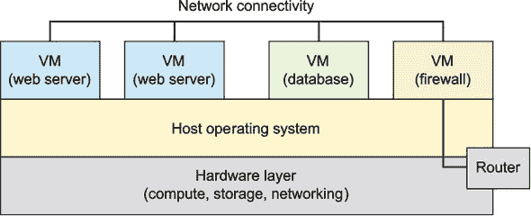

那张图片如此吸引人，现在它已经主导了企业计算领域。此时，我怀疑还有许多本地或基于云的服务器负载没有运行在某种虚拟化技术上。而运行这些大量虚拟工作负载的操作系统是 Linux。

顺便说一句，亚马逊网络服务（AWS）允许客户租用（Linux）服务器上的容量，这些服务器托管着数百万个虚拟机（VM），这些虚拟机反过来运行着无数的工作负载，包括许多最受欢迎的在线服务。图 2.2 展示了 AWS 弹性计算云（EC2）虚拟机实例如何作为一个全面存储、数据库和网络工具的中心。

##### 图 2.2\. 以亚马逊网络服务（AWS）的弹性云计算（EC2）虚拟机实例为中心的典型云计算工作负载

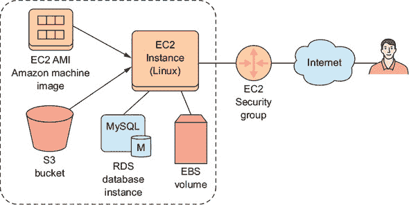

如果你对那些 AWS 细节感到有些晦涩，不要担心——无论如何，它们都不是这本书的主题。但如果你发现自己想了解更多关于亚马逊网络服务的信息，你总是可以阅读我的书《一个月午餐时间学习亚马逊网络服务》（Manning，2017 年）。至于虚拟化？这是我的《自学 Linux 虚拟化和高可用性》（LULU Press，2017 年）。 

下一个简短的部分可能会感觉有点沉重，但它将帮助那些对了解内部工作原理感兴趣的人提供一些背景信息。成功的虚拟化使用物理计算机上的某种隔离空间，其中可以安装客户操作系统，然后欺骗它认为它独自在自己的计算机上。客户操作系统可以共享网络连接，以便管理员可以远程登录（我将在第三章中讨论这一点）并像在传统机器上一样完成他们的工作。这些相同的共享网络连接允许您使用虚拟机提供像网站这样的公共服务。广义而言，目前有两种虚拟化方法：

+   *虚拟机管理程序*—在一定程度上控制宿主系统硬件，为每个客户操作系统提供所需的资源（图 2.3）。客户机作为系统进程运行，但具有虚拟化访问硬件资源的权限。例如，AWS 服务器长期以来一直基于开源的 Xen 虚拟机管理程序技术（尽管他们最近开始将一些服务器切换到同样开源的 KVM 平台）。其他重要的虚拟机管理程序平台包括 VMware ESXi、KVM 和微软的 Hyper-V。

    ##### 图 2.3\. 类型 2 虚拟机管理程序架构图，显示了每个客户机安装了完整的操作系统，并将一些特殊管理任务委托给 Guest1

    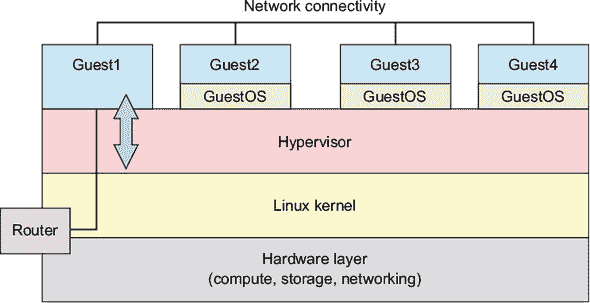

+   *容器*—极其轻量级的虚拟服务器，它们不是作为完整的操作系统运行，而是共享宿主操作系统的底层内核（见图 2.4）。容器可以从纯文本脚本构建，几秒钟内创建和启动，并且可以轻松可靠地在网络上共享。目前最知名的容器技术可能是 Docker。在本章中我们将要使用的 Linux 容器（LXC）项目是 Docker 的原始灵感来源。

##### 图 2.4\. LXC 架构图，显示了 LXC 环境与 Linux 内核及其下硬件层之间的访问

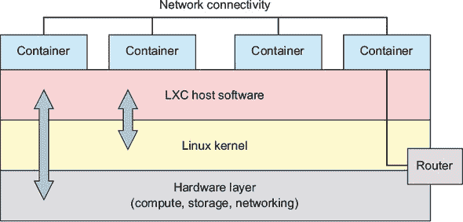

没有任何一种技术适合每个项目。但如果你决定继续阅读本章的其余部分，你将学习如何以及为什么使用两种虚拟化技术：VirtualBox（类型 2 虚拟机管理程序）和之前提到的 LXC（容器管理器）。

| |
| --- |

**设计考虑因素**

我不希望你在离开这本书时没有至少一些基本指南来选择虚拟化技术，所以这里有一些想法：

+   完整大小的虚拟机管理程序，如 Xen 和 KVM（通过如 Libvirt 这样的管理前端），通常用于涉及大量 Linux 虚拟机的大型企业级部署。

+   VirtualBox（以及 VMware 的 Player）非常适合测试和实验实时操作系统，一次一个或两个，无需在真实 PC 上安装。它们相对较高的开销使它们不适合大多数生产环境。

+   类似于 LXC 和 Docker 的容器技术轻量级，可以在几秒钟内配置和启动。LXC 容器特别适合于尝试新技术和构建操作系统软件栈。Docker 目前是运行无数动态、集成容器编队的核心技术，这些编队是庞大微服务架构的一部分。（我将在第九章中详细谈谈微服务。）

| |
| --- |

### 2.2\. 使用 VirtualBox

使用 Oracle 的开源 VirtualBox，你可以将它安装在运行在任何桌面或笔记本电脑上的任何操作系统（包括 Windows）上，或者用它来托管几乎所有主要操作系统的虚拟机实例。

| |
| --- |

**在 Windows PC 上安装 VirtualBox**

想要从 Windows PC 尝试所有这些？请访问 VirtualBox 网站([`www.virtualbox.org/wiki/Downloads`](https://www.virtualbox.org/wiki/Downloads))并下载可执行存档。点击你下载的文件，然后完成几个设置步骤（默认值应该都适用）。最后，你会被问及是否可以重置你的网络接口，然后是否要安装 VirtualBox。你当然会安装。


VirtualBox 提供了一个环境，在这个环境中，你可以启动尽可能多的虚拟计算机，数量取决于你的物理系统资源。它尤其适用于安全测试和学习新的管理技能，这是我们现在的首要目标。但在那之前，你需要了解在 Linux 上下载和安装软件的工作原理。

#### 2.2.1\. 使用 Linux 包管理器

在 Ubuntu 机器上顺利安装 VirtualBox 很简单。只需要两个命令：

```
# apt update
# apt install virtualbox
```


##### 注意

记住，`#` 提示符表示此命令需要管理员权限，通常通过在命令前加上 `sudo` 来访问。


但在我们的例子中发生了什么？一切都围绕着名为高级包工具（Advanced Package Tool，简称 APT，更常被称为*apt*）的软件包管理器。在 Linux 世界中，包管理器将计算机连接到成千上万软件应用的庞大在线仓库，其中大多数是免费和开源的。默认情况下随 Linux 安装的管理器有几个任务：

+   维护本地索引以跟踪仓库及其内容

+   跟踪你本地机器上安装的所有软件的状态

+   确保将所有可用的更新应用到已安装的软件

+   在安装新应用程序之前确保软件依赖项（你安装的包所需的其它软件包或配置参数）得到满足

+   处理软件包的安装和卸载

图 2.5 展示了在线软件仓库与运行在 Linux 计算机上的包管理器之间持续关系的一些要素。

##### 图 2.5\. 主软件仓库、镜像下载服务器和终端用户机上运行的 Linux 之间的关系

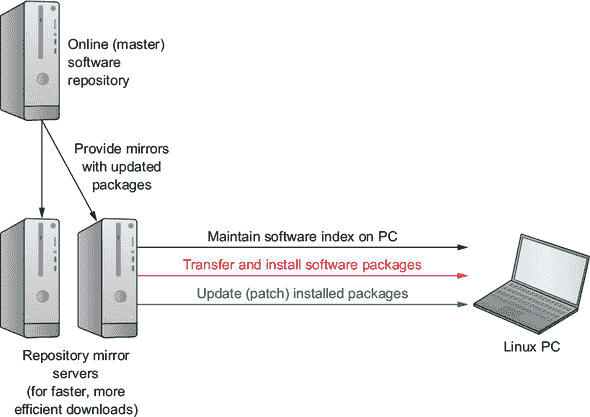

该系统工作得非常好，并且由于历史和经济原因，在 Linux 世界之外几乎没有与之相当的东西。但是，你要知道，你所使用的管理器将取决于你的特定 Linux 发行版。总的来说，如果你的发行版属于 Debian/Ubuntu 家族，那么你会使用 APT。Red Hat 家族的成员将使用 RPM 管理器和 Yum（或其新的 DNF 替代品）。表 2.1 显示了部分发行版列表。

##### 表 2.1\. 包管理器和发行版

| 包管理器 | 发行版 |
| --- | --- |
| APT | Debian |
|   | Ubuntu |
|   | Mint |
|   | Kali Linux |
| RPM | Red Hat Enterprise Linux |
|   | CentOS |
|   | Fedora |
| YaST | SUSE Linux |
|   | OpenSUSE |

除了使用包管理器从远程仓库安装软件外，您可能还需要从网站下载软件。通常，您会发现一些软件包，它们的开发者已经格式化以与 APT 或 Yum 兼容，一旦从命令行使用后端工具安装，您就可以使用它们。比如说，您想使用 Skype。访问其下载页面(图 2.6)可以让您下载 Skype Linux 包的 DEB 或 RPM 文件。如果您使用的是基于 Debian 的发行版和 APT，则选择 DEB；如果您属于喜欢 Yum 的 Red Hat 家族，则选择 RPM。

##### 图 2.6\. Skype for Linux 的下载页面。注意 Debian (APT)和 RPM (Yum)包管理器的单独链接。

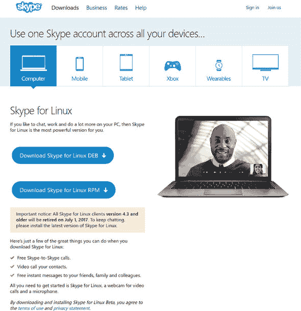

##### 使用 Debian 包管理器

下载文件后，您可以使用 `dpkg` 从命令行安装它。使用 `-i` 标志（表示安装）。您需要确保您从包含 skypeforlinux-64 文件的目录中运行 `dpkg` 命令。此示例假设您将包保存到用户账户的下载目录中：

```
$ cd /home/<username>/Downloads
# dpkg -i skypeforlinux-64.deb
```

`dpkg`命令应该会为您处理依赖项。但如果它没有这样做，它的输出通常会提供足够的信息，让您知道发生了什么。


**“-64”是什么意思？**

Linux，像其他基于 x86 的操作系统的版本一样，有 64 位和 32 位版本。过去十年中制造和销售的绝大多数计算机使用的是更快的 64 位架构。因为仍然有较旧的或面向开发的硬件存在，您有时需要运行 32 位，并且您希望安装的软件能够与它兼容。

您可以通过在命令行中运行 `arch` 来自行检查。除非您知道您正在使用较旧的硬件（顺便说一句，Linux 在这方面做得特别出色），否则您安全地假设您是一个 64 位用户。


##### 为 RPM 包管理器安装 VirtualBox

之前，我介绍了 `apt update` 和 `apt install virtualbox`。这些简短的命令做了什么？为了解释，我将在运行 Fedora Linux 发行版的机器上安装相同的 VirtualBox 软件。因为我将使用 Red Hat 的 DNF 包管理器，所以需要额外的几个步骤——这很好，因为运行这些步骤将说明这个过程是如何工作的。这个过程有点复杂，所以表 2.2 列出了步骤。

##### 表 2.2\. 在 Fedora 上安装 VirtualBox 的步骤

| 任务 | 命令 |
| --- | --- |
| 添加仓库 | wget http://download.virtualbox.org/virtualbox/rpm/fedora/  virtualbox.repo |
| 更新索引 | dnf update |
| 安装依赖项 | dnf install patch kernel-devel dkms |
| 安装包 | dnf install VirtualBox-5.1 |
|  |

##### 注意

这些步骤是为 Fedora 版本 25 设计并测试的，并且很好地说明了软件包管理过程。尽管如此，在更近期的 Fedora 版本上，这一切可能会运行得更顺畅。


回到 Ubuntu，当我将其添加到 `install` 命令时，APT 知道我所说的 *virtualbox* 是什么。这是因为 VirtualBox 软件包是 APT 已经熟悉的在线仓库的一部分。然而，结果是，Red Hat 及其子产品（如 CentOS 和 Fedora）并不那么社交，至少不是默认情况下，所以我需要将 virtualbox 仓库添加到 Yum。

从上一章，你会记得第三方软件配置文件通常保存在 `/etc/` 目录结构中，在这方面，yum/DNF 并无不同。仓库信息保存在 `/etc/yum.repos.d/` 中，因此你应该切换到该目录。从那里，你将使用 wget 程序（通常默认安装）下载 `.repo` 文件。以下是完成所有这些步骤的方法：

```
$ cd /etc/yum.repos.d/
# wget http://download.virtualbox.org/virtualbox/rpm/fedora/
   virtualbox.repo
```


**在 Linux 上安装软件**

安装 Linux 软件的特定说明，包括我之前使用的精确 URL 等细节，几乎总是可以在网上找到。你可以在软件开发商的网站上找到这些信息，或者通过免费可用的指南。互联网是你的朋友。

确保你在搜索引擎短语中指定 Linux 发行版、版本和架构， wherever necessary。我发现有关此项目所需特定软件包的详细信息是通过我最喜欢的搜索引擎找到的——你也应该这样做。


在正确的目录中拥有 `.repo` 文件，直到你告诉 RPM 发生了什么变化之前，它并不会做什么。你可以通过运行 `update` 命令来做到这一点。`update` 命令还会将本地仓库索引与其在线对应项进行比较，以查看是否有任何新信息你需要了解。无论你使用什么管理器，在安装新软件之前更新仓库信息总是一个好主意：

```
# dnf update
Importing GPG key 0x98AB5139:                                        *1*
 Userid     : "Oracle Corporation (VirtualBox archive signing key)
    <info@virtualbox.org>"
 Fingerprint: 7B0F AB3A 13B9 0743 5925 D9C9 5442 2A4B 98AB 5139
 From       : https://www.virtualbox.org/download/
     oracle_vbox.asc                                               *2*
Is this ok [y/N]: y
Fedora 25 - x86_64 - VirtualBox         120 kB/s |  33 kB     00:00
Dependencies resolved.
Nothing to do.
Complete!
```

+   ***1* 所有与仓库的交易都使用 GPG 密钥加密。**

+   ***2* VirtualBox 引用指的是我将这个 Fedora 主机作为 VirtualBox 中的 VM 运行的事实。**

下一步涉及安装 VirtualBox 正确运行所需的所有软件依赖项。*依赖项* 是指必须已经安装在你的计算机上，以便新软件包可以正常工作。回到 Ubuntu，APT 无形中处理了这些重要的细节；Yum 也经常处理许多后台细节。但是当它不这样做时，迫使你手动处理，这些细节可以从之前讨论的相同在线来源中轻松获得。以下是这将看起来像的截断版本：

```
# dnf install patch kernel-devel dkms
Last metadata expiration check: 0:43:23 ago on Tue Jun 13 12:56:16 2017.
[...]
Dependencies resolved.

==========================================================================
 Package         Arch    Version                         Repository  Size
==========================================================================
Installing:
dkms            noarch  2.3-5.20170523git8c3065c.fc25    updates     81 k
 kernel-devel    x86_64  4.11.3-202.fc25                 updates     11 M
 patch           x86_64  2.7.5-3.fc24                    fedora     125 k
Transaction Summary
==========================================================================
Install  3 Packages
Total download size: 12 M
Installed size: 43 M
Is this ok [y/N]: y                                                        *1*
Downloading Packages:
(1/3): dkms-2.3-5.20170523git8c3065c.fc25.noarc 382 kB/s |  81 kB     00:00
(2/3): patch-2.7.5-3.fc24.x86_64.rpm            341 kB/s | 125 kB     00:00
(3/3): kernel-devel-4.11.3-202.fc25.x86_64.rpm  2.4 MB/s |  11 MB     00:04
---------------------------------------------------------------------------
Total                                           1.8 MB/s |  12 MB     00:06
[...]
Running transaction
  Installing  : kernel-devel-4.11.3-202.fc25.x86_64                    1/3
  Installing  : dkms-2.3-5.20170523git8c3065c.fc25.noarch              2/3
  Installing  : patch-2.7.5-3.fc24.x86_64                              3/3
  Verifying   : patch-2.7.5-3.fc24.x86_64                              1/3
  Verifying   : kernel-devel-4.11.3-202.fc25.x86_64                    2/3
  Verifying   : dkms-2.3-5.20170523git8c3065c.fc25.noarch              3/3
Installed:                                                                 *2*
  dkms.noarch 2.3-5.20170523git8c.fc25 kernel-devel.x86_64 4.11.3-202.fc25
  patch.x86_64 2.7.5-3.fc24
Complete!
```

+   ***1* 在它运行之前，通过输入 y 来批准操作。**

+   ***2* 快速回顾成功操作**

经过一段时间的旅程，你终于准备好在你的 Red Hat、CentOS 或 Fedora 机器上安装 VirtualBox 本身了。我在这个例子中使用的版本号来自之前使用的在线指南。当然，当你尝试这个时，它可能不再是 5.1。

```
# dnf install VirtualBox-5.1
Last metadata expiration check: 0:00:31 ago on Tue Jun 13 13:43:31 2017.
Dependencies resolved.                                                     *1*
==========================================================================
 Package            Arch    Version                   Repository     Size
==========================================================================
Installing:                                                                *2*
 SDL                x86_64  1.2.15-21.fc24            fedora        213 k
 VirtualBox-5.1     x86_64  5.1.22_115126_fedora25-1  virtualbox     68 M
 python-libs        x86_64  2.7.13-2.fc25             updates       6.2 M
 qt5-qtx11extras    x86_64  5.7.1-2.fc25              updates        30 k
Transaction Summary
==========================================================================
Install  4 Packages
[...]
Is this ok [y/N]: y
[...]
Creating group 'vboxusers'. VM users must be member
     of that group!                                                      *3*
[...]
Installed:
  SDL.x86_64 1.2.15-21.fc24
  VirtualBox-5.1.x86_64 5.1.22_115126_fedora25-1
  python-libs.x86_64 2.7.13-2.fc25
  qt5-qtx11extras.x86_64 5.7.1-2.fc25
Complete!
```

+   ***1* DNF 显然对之前安装的依赖项感到满意。**

+   ***2* 返回此操作中将安装的所有包的列表**

+   ***3* 注意，该过程创建了一个新的系统组。我将在第九章中讨论组。**

| |
| --- |

**VirtualBox 附加组件**

你应该知道，Oracle 为 VirtualBox 提供了一个扩展包，它增加了 USB 支持、磁盘加密以及一些现有的引导选项的替代方案。如果你在运行标准包时遇到死胡同，请考虑这些工具。

你还可以通过 VBox Guest Additions CD-ROM 镜像在 VirtualBox 虚拟机（VM）和其宿主机之间添加额外的文件系统和设备集成。这为你提供了共享剪贴板和拖放等特性。如果 Vbox 附加组件尚未通过你的宿主机提供，请使用以下命令在 Ubuntu 上安装扩展包：

```
sudo apt install virtualbox-guest-additions-iso
```

然后将它作为虚拟光驱添加到正在运行的虚拟机中。搜索在线文档，了解可能需要的任何额外包，以便在宿主机上运行。

| |
| --- |

在实际使用虚拟化工具如 VirtualBox 之前，我应该至少给你一两个追踪其他可能需要的仓库包的提示。APT 系统允许你直接使用`apt search`搜索可用的包。以下示例搜索可能帮助你监控系统健康的包，然后使用`apt show`显示完整的包信息：

```
$ apt search sensors
$ apt show lm-sensors
```

当 aptitude 程序安装后，它是一个半图形化的 shell 环境，你可以在这里探索和管理可用的和已安装的包。如果你不能没有鼠标，Synaptic 是桌面环境的全 GUI 包管理器。Yum 世界也是完全可搜索的：

```
$ yum search sensors
$ yum info lm_sensors
```

#### 2.2.2. 定义虚拟机（VM）

我不确定你是否曾经从组件中组装过一台物理计算机，但这可能相当复杂。在 VirtualBox 中定义一个新的虚拟机基本上是以相同的方式进行的。唯一的显著区别是，你不需要弯腰低头，用牙齿咬着手电筒手动添加 RAM 和存储驱动器到你的机器中，VirtualBox 允许你通过点击鼠标来定义虚拟机的“硬件”规格。

在 VirtualBox 界面中点击“新建”后，你需要给你的虚拟机起一个描述性的名字。正如你在图 2.7 中看到的，软件应该能够自动正确填充类型和版本字段。在这里你选择的类型和版本不会安装实际的操作系统，而是用于应用适当的硬件仿真设置。

##### 图 2.7. 创建虚拟机对话框：VirtualBox 将尝试近似你的操作系统和操作系统版本，以便稍后提供智能默认选择。

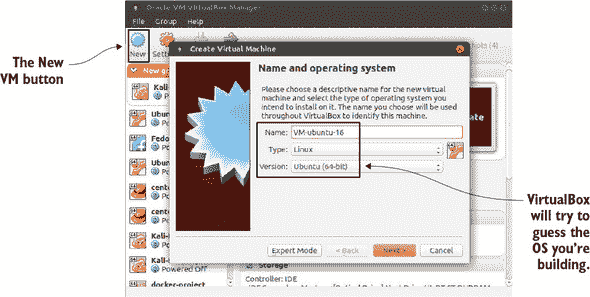

在下一屏，你将为你的虚拟机分配 RAM。除非你计划做一些特别要求高的任务，比如托管容器集群或运行繁忙的 Web 服务器，否则默认的（768 MB）应该足够了。如果你需要，当然可以给它更多的 RAM，但别忘了为主机机器和可能已经存在于其上的任何其他虚拟机留出足够的空间。如果你的主机只有 4 GB 的物理 RAM，你可能不会想将其中一半分配给虚拟机。

如果你最终决定同时运行多个虚拟机，请记住这些限制，这在书中稍后尝试的一些项目中将很有用。即使每个虚拟机只使用默认的内存量，两三个虚拟机也可能开始消耗正常主机操作所需的 RAM。

VirtualBox 的设置过程现在会询问你是否想要为你的虚拟机创建一个新的虚拟磁盘或使用一个已经存在的磁盘（图 2.8）。没有硬盘的计算机是什么？可能有时你想要在两个虚拟机之间共享单个磁盘，但在这个练习中，我猜你可能会想从头开始。选择现在创建虚拟硬盘。

##### 图 2.8. 硬盘屏幕。注意，在这种情况下，非默认的“使用现有虚拟硬盘文件”单选按钮被选中。

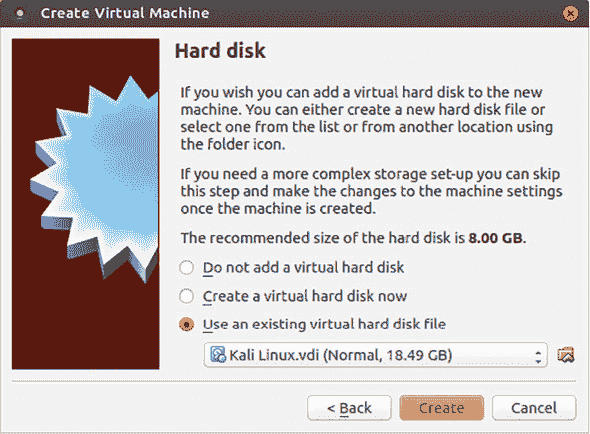

下一屏（图 2.9）允许你为即将创建的磁盘选择硬盘文件格式。除非你计划最终将磁盘导出以用于其他虚拟化环境，否则默认的 VirtualBox 磁盘镜像（VDI）格式应该足够好。

##### 图 2.9. 虚拟硬盘可以使用多种格式创建。VDI 格式适合仅用于 VirtualBox 的虚拟机。

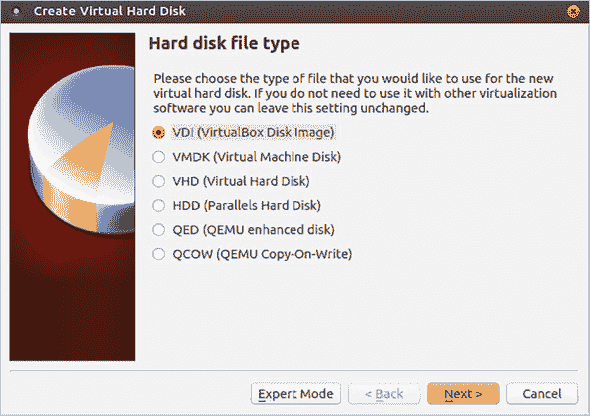

我也从未后悔过选择默认的动态分配选项（图 2.10）来确定虚拟驱动器如何在宿主上消耗空间。这里的“动态”意味着宿主存储磁盘上的空间将根据需要分配给虚拟机。如果虚拟机磁盘使用量保持较低，分配的宿主空间将更少。

##### 图 2.10. 动态分配的虚拟磁盘将只在其宿主设备上占用它们所需的空间。

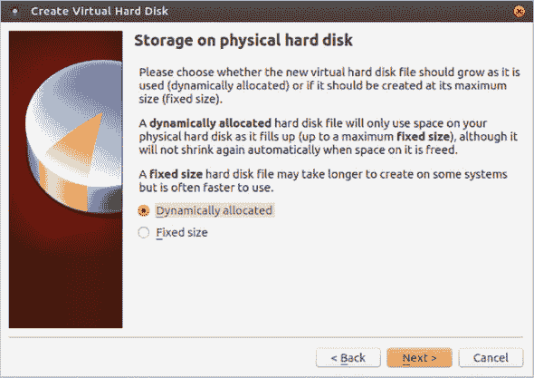

另一方面，固定大小的磁盘将立即分配其最大空间，无论其实际使用量如何。固定大小磁盘的唯一优势是应用性能。因为我通常只使用 VirtualBox 虚拟机进行测试和实验，所以我可以避免这种权衡。

因为它知道您想要的是 Linux，并且因为 Linux 对存储空间的利用非常高效，VirtualBox 在下一次屏幕上可能会只为您提供 8 GB 的总磁盘大小（图 2.11）。除非您对虚拟机有非同寻常的大计划（比如，您将要进行一些严肃的数据库操作），否则这可能会是合适的。另一方面，如果您选择了 Windows 作为操作系统，默认选择将是 25 GB——这是有充分理由的：Windows 并不羞于要求大量的资源。这是一个很好的例子，说明了 Linux 非常适合虚拟环境的一种方式。

##### 图 2.11. 如果需要，您的虚拟磁盘可以大至 2 TB 或主机设备上的最大可用空间。

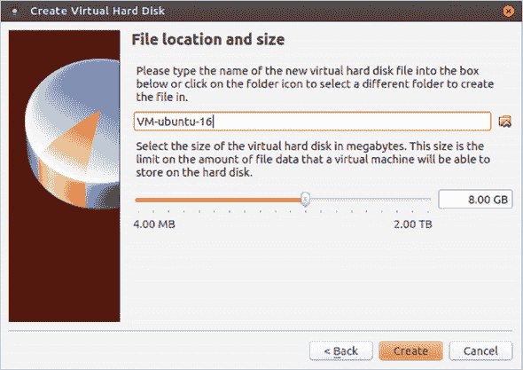


##### 注意

如果您愿意，您还可以在“文件位置和大小”屏幕上编辑 VirtualBox 将用于您的磁盘的名称和位置。


完成后，点击创建，新的虚拟机将出现在 VirtualBox 管理器左侧的虚拟机列表中。但您还没有完成：那只是机器。现在您还需要一个操作系统来激活它。

#### 2.2.3. 安装操作系统（OS）

现在您已经定义了新虚拟机的虚拟硬件配置文件，以下是你还需要做的事情：

1.  下载一个包含您想要使用的 Linux 发行版镜像的文件（ISO 格式）。

1.  使用包含您下载的 ISO 的虚拟 DVD 驱动器启动新的虚拟机。

1.  按照标准的操作系统安装流程进行操作。

1.  启动虚拟机并运行您之前安装的操作系统。

一旦您确定了一个发行版，您将需要下载一个包含操作系统文件和安装程序的.ISO 文件。找到正确的文件通常只是在网上搜索发行版名称和“下载”一词。对于 Ubuntu，您也可以访问[`ubuntu.com`](https://ubuntu.com)页面，并点击您在图 2.12 中看到的“下载”标签。注意可用的各种 Ubuntu 版本。如果您打算使用这个虚拟机进行管理任务，那么小巧快速的 Server 版本可能比桌面版本更好选择。

##### 图 2.12. Ubuntu.com 首页上的“下载”下拉菜单。注意 Ubuntu 提供的版本范围。

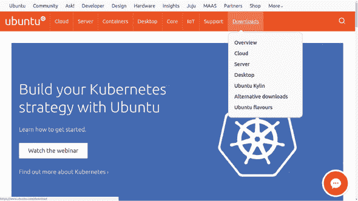

大文件有时在下载过程中可能会损坏。如果您的.ISO 文件中的任何一个字节被更改，安装可能无法正常工作。由于您不希望投入时间和精力，最后却发现下载存在问题，因此立即计算您下载的.ISO 文件的校验和（或*哈希值*）以确认一切正常总是一个好主意。为此，您需要获取适当的 SHA 或 MD5 校验和，它是一个看起来像这样的长字符串：

```
4375b73e3a1aa305a36320ffd7484682922262b3
```

你应该能够从获取 .ISO 文件的地方获取这个字符串。以 Ubuntu 为例，这意味着你要访问 [`releases.ubuntu.com/`](http://releases.ubuntu.com/) 上的网页，点击与下载版本匹配的目录，然后点击一个校验和链接（例如，SHA1SUMS）。你应该将页面上的相应字符串与从下载 .ISO 的同一目录运行命令的结果进行比较，这可能看起来像这样：

```
$ shasum ubuntu-16.04.2-server-amd64.iso
```

如果它们匹配，你就可以开始了。如果不匹配（并且你已经仔细检查过确保你查看的是正确的版本），那么你可能需要再次下载 .ISO。

| |
| --- |

##### 注意

你应该知道，存在多种哈希类型。多年来，MD5SUM 算法一直占主导地位，但 SHA256（其具有更长的 256 位哈希）越来越受欢迎。实际上，对于大型操作系统镜像文件，一种方法可能并不比另一种方法差。

| |
| --- |

一旦你的 .ISO 文件已经就绪，回到 VirtualBox。在左侧面板中高亮显示你刚刚创建的虚拟机，点击应用顶部的绿色启动按钮。系统会提示你从文件系统中选择一个 .ISO 文件作为虚拟 DVD 驱动器使用。当然，你会选择你下载的那个。新的虚拟机会读取这个 DVD 并启动操作系统安装。

大多数情况下，安装过程会顺利进行；然而，包括解决可能出错的各种小问题，可能需要几章完整的章节。如果你遇到麻烦，可以查阅每个 Linux 发行版的文档和指南，或者在你所在的 Manning 网站上的 *Linux in Action* 论坛上发帖提问，让我们其他人帮助你。

当一切安装得很好时，在你成功引导到虚拟机之前，可能还有一些其他事情需要处理。在你的虚拟机高亮显示时，点击黄色的设置图标。这里你可以调整虚拟机的环境和硬件设置。例如，点击网络，你可以定义网络连接。如果你想通过主机机的网络接口为虚拟机提供完整的互联网访问，那么，如 图 2.13 所示，你可以在“连接到”下拉菜单中选择桥接适配器，然后选择你主机适配器的名称。

##### 图 2.13. 设置对话框的网络选项卡，你可以在这里确定为你的虚拟机使用哪种网络接口（或接口）

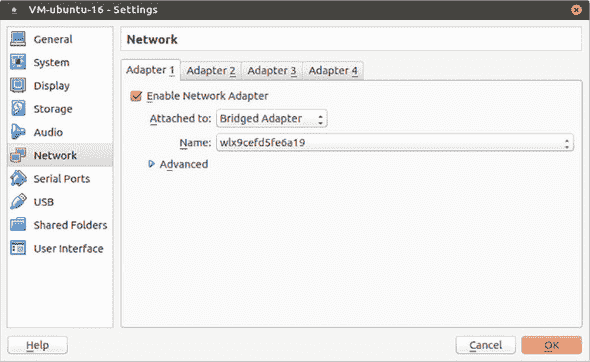

| |
| --- |

##### 注意

使用桥接适配器可能不是你的首选，有时它可能带来安全风险。实际上，选择 NAT 网络是一种更常见的为虚拟机提供互联网访问的方式。因为这本书中的许多练习都需要多个虚拟机之间的网络连接（使用 NAT 是复杂的事情），所以我目前选择使用桥接。

| |
| --- |

你可能永远不需要这条信息，但如果需要，你会感激知道它。在某些情况下，为了使虚拟机能够正确启动，你可能还需要从驱动器中移除 DVD，就像为“真实”的物理安装一样。你可以通过点击存储来实现。点击列出的第一个磁盘，然后点击底部的移除磁盘图标（图 2.14）。确保你不会意外地移除你的硬盘！

##### 图 2.14. 通过右键单击其链接并选择移除来移除虚拟磁盘。你可能需要这样做以确保虚拟机能够启动到正确的驱动器。

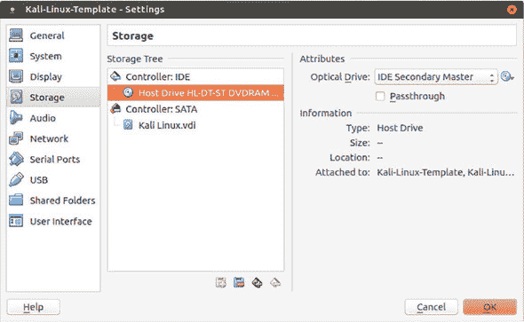

也可能有时你需要挂载 DVD（或.ISO 文件）以使 VirtualBox 能够识别它。点击带有控制器：IDE 行的+图标，你可以选择一个文件作为虚拟光驱。

#### 2.2.4. 克隆和共享 VirtualBox 虚拟机

这一部分有点像额外奖励，但谁不喜欢免费的东西呢？我将告诉你两个相关的技巧：如何组织你的 VirtualBox 虚拟机，以便快速启动新的虚拟机，以及如何使用命令行在网络上共享虚拟机。

##### 快速启动虚拟机的克隆

与虚拟机一起工作的最明显优点之一是能够快速访问一个新鲜、干净的操作系统环境。但如果访问该环境需要通过完整的安装过程，那么在你将克隆加入其中之前，我不认为有多少是“快速”的。为什么不保持你的原始虚拟机在干净的后安装状态下，每次你想做一些实际工作时就创建一个相同的克隆呢？

这很简单。再次查看 VirtualBox 应用程序。选择你想要用作主副本的（*停止*）虚拟机，点击机器菜单链接，然后点击克隆。你将确认你想要给你的克隆起的名字，然后点击下一步，选择是否创建完整克隆（这意味着将为新的虚拟机创建全新的文件副本）或链接克隆（这意味着新的虚拟机将与主虚拟机共享所有基础文件，同时保持你的新工作独立）。

| |
| --- |

##### 注意

选择链接选项将更快，并且占用你硬盘上的空间更少。唯一的缺点是，你将无法稍后将其克隆移动到不同的计算机上。这是你的选择。

| |
| --- |

现在点击克隆，新的虚拟机就会出现在虚拟机面板中。按照你通常的方式启动它，然后使用你在主虚拟机上设置的相同凭据登录。

##### 从命令行管理虚拟机

VirtualBox 自带一个命令行 shell，使用`vboxmanage`来调用。为什么要使用命令行呢？因为，除了其他好处之外，它允许你在远程服务器上工作，这可以大大增加可能项目的范围。要了解`vboxmanage`是如何工作的，使用`list vms`来列出你系统上当前可用的所有虚拟机：

```
$ vboxmanage list vms
"Ubuntu-16.04-template" {c00d3b2b-6c77–4919–85e2–6f6f28c63d56}
"centos-7-template" {e2613f6d-1d0d-489c-8d9f-21a36b2ed6e7}
"Kali-Linux-template" {b7a3aea2–0cfb-4763–9ca9–096f587b2b20}
"website-project" {2387a5ab-a65e-4a1d-8e2c-25ee81bc7203}
"Ubuntu-16-lxd" {62bb89f8–7b45–4df6-a8ea-3d4265dfcc2f}
```

`vboxmanage clonevm` 命令将执行与我之前使用图形界面描述的相同类型的克隆操作。在这里，我正在克隆 Kali Linux 模板虚拟机，并将副本命名为 newkali：

```
$ vboxmanage clonevm --register Kali-Linux-template --name newkali
```

你可以通过再次运行 `vboxmanage list vms` 来验证它是否成功。

这将在我本地计算机上使用新虚拟机时工作得很好。但假设我想让团队成员能够运行该虚拟机的确切副本，也许他们可以测试我一直在工作的东西。为此，我需要将虚拟机转换为某种标准化的文件格式。以下是如何使用 Open Virtualization Format 导出本地虚拟机到文件的示例：

```
$ vboxmanage export website-project -o website.ova        *1*
0%...10%...20%...30%...40%...50%...60%...70%...80%...90%...100%
Successfully exported 1 machine(s).
```

+   ***1* The -o flag specifies the output filename: website.ova, in this case.**

接下来，你需要将 .OVA 文件复制到同事的计算机上。请注意，根据任何标准，该文件都不会被认为是小而精致的。如果你没有足够的网络带宽进行多 GB 的传输，那么考虑通过 USB 设备移动它。但如果你选择网络路径，最适合这项工作的工具是 Secure Copy (`scp`)。以下是它可能的工作方式：

```
$ scp website.ova username@192.168.0.34:/home/username
```

如果整个 `scp` 事情看起来有些出乎意料，不要担心：帮助即将到来。`scp` 命令将在第三章（作为 OpenSSH 内容的一部分）中全面介绍。同时，那个 `scp` 命令只有在两台计算机上都安装了 OpenSSH、你已授权远程计算机上的用户账户访问，并且可以从你的本地机器访问时才会工作。

一旦传输完成，剩下的就是在远程计算机上，将虚拟机导入到该机器的 VirtualBox 中。命令很简单：

```
$ vboxmanage import website.ova
```

使用 `list vms` 验证导入操作是否成功，并尝试从桌面启动虚拟机：

```
$ vboxmanage list vms
"website" {30ec7f7d-912b-40a9–8cc1-f9283f4edc61}
```

如果你不需要复杂的远程访问，你也可以从图形界面共享虚拟机。在 VirtualBox 中，选择你想要共享的机器，然后点击文件菜单，接着导出虚拟机。

### 2.3\. 使用 Linux 容器 (LXC)

VirtualBox 对于运行需要 Linux 内核访问的操作（就像你使用 SELinux 等安全功能时那样，你将在第九章（kindle_split_017.xhtml#ch09）中看到），需要 GUI 桌面会话，或测试像 Windows 这样的操作系统来说非常出色。但如果你需要快速访问一个干净的 Linux 环境，并且你不需要任何特殊的发布版本，那么你很难打败 LXC。


##### 注意

就像任何复杂的系统一样，LXC 可能不会与所有硬件架构很好地工作。如果你在启动容器时遇到麻烦，考虑一下可能存在兼容性问题。互联网，一如既往地，应该是一个提供更深入信息的有帮助的资源。


LXC 容器的速度有多快？你很快就会自己看到。但因为他们巧妙地与主机和其他容器共享许多系统资源，它们就像全速运行的独立服务器一样工作，只使用最小的存储空间和内存。

#### 2.3.1\. 使用 LXC 入门

在你的 Ubuntu 工作站上安装 LXC？小菜一碟：

```
# apt update
# apt install lxc
```

现在在 CentOS 上呢？嗯，蛋糕还在那里，但吃蛋糕需要做更多的工作。这主要是因为 Ubuntu 是为 Ubuntu 和 Debian 构建的。无论如何，在 CentOS 上试一试吧，但我不能保证成功。你首先需要添加一个新的仓库，企业 Linux 的额外包（EPEL），然后安装 LXC 以及一些依赖项：

```
# yum install epel-release
# yum install lxc lxc-templates libcap-devel \                *1*
 libcgroup busybox wget bridge-utils lxc-extra libvirt
```

+   ***1*** 反斜杠字符（\）可以方便地将长命令拆分成多个行在命令行上。**

就这样。你已经准备好开始工作了。基本的 LXC 技能集实际上非常简单。我将向你展示你需要的三四个命令来让它全部工作，然后一个内部提示，一旦你理解了 LXC 是如何组织自己的，它将让你大吃一惊。

#### 2.3.2\. 创建你的第一个容器

为什么不直接跳进去创建你的第一个容器呢？`-n`参数设置的值将是你将用于容器的名称，而`-t`告诉 LXC 使用 Ubuntu 模板来构建容器：

```
# lxc-create -n myContainer -t ubuntu          *1*
```

+   ***1*** 创建过程可能需要几分钟才能完成，但你将看到详细的输出，最终在终端显示成功通知。**


##### 注意

你可能会开始看到与相对较新的 LXD 容器管理器相关联的另一个`lxc`命令集。LXD 仍然在底层使用 LXC 工具，但通过一个稍微不同的界面。例如，使用 LXD，之前的命令将看起来像这样：`lxc launch ubuntu:16.04 myContainer`。这两个命令集将继续广泛可用。


实际上有很多模板可供选择，正如你可以从`/usr/share/lxc/templates/`目录的列表中看到的那样：

```
$ ls /usr/share/lxc/templates/
lxc-alpine     lxc-centos    lxc-fedora        lxc-oracle      lxc-sshd
lxc-altlinux   lxc-cirros    lxc-gentoo        lxc-plamo       lxc-ubuntu
lxc-archlinux  lxc-debian    lxc-openmandriva  lxc-slackware   lxc-ubuntu-cloud
lxc-busybox    lxc-download  lxc-opensuse      lxc-sparclinux
```


##### 警告

并非所有这些模板都能保证直接使用时就能正常工作。一些是作为实验或*正在进行的工作*提供的。在 Ubuntu 主机上坚持使用 Ubuntu 模板可能是一个安全的选择。正如我提到的，从历史上看，LXC 在 Ubuntu 主机上总是表现最好。在其他发行版上，你的体验可能会有所不同。


如果你决定创建，比如说，一个 CentOS 容器，那么你应该注意输出中的最后几行，因为它包含了你用于登录的信息：

```
# lxc-create -n centos_lxc -t centos                  *1*
[...]
The temporary root password is stored in:
        '/var/lib/lxc/centos_lxc/tmp_root_pass'       *2*
```

+   ***1*** 在这个例子中，我称容器为 centos_lxc 并使用了 centos 模板。**

+   ***2*** 容器的根密码位于以容器命名的目录中。**

你将使用用户名*root*和 tmp_root_pass 文件中包含的密码进行登录。另一方面，如果你的容器使用的是 Ubuntu 模板，那么你将使用*ubuntu*作为用户名和密码。当然，如果你打算将这个容器用于任何严肃的事情，你将立即更改密码：

```
$ passwd
Changing password for ubuntu.
(current) UNIX password:
Enter new UNIX password:
Retype new UNIX password:
passwd: password updated successfully
```

顺便说一下，那个命令实际上是 `passwd` 而不是 `password`。我的猜测是 passwd 程序的创建者不喜欢打字。现在使用 `lxc-ls --fancy` 来检查你的容器状态：

```
# lxc-ls --fancy
NAME    STATE   AUTOSTART GROUPS IPV4    IPV6
myContainer  STOPPED 0         -      -       -
```

嗯，它确实存在，但显然需要启动。与之前一样，`-n` 通过名称指定你想要启动的容器。`-d` 代表分离，意味着你不想在容器启动时自动进入交互式会话。交互式会话没有问题：事实上，我的许多好朋友都是交互式会话。但在这个情况下，不使用 `-d` 运行 `lxc-start` 命令意味着唯一的退出方式是关闭容器，这可能不是你想要的：

```
# lxc-start -d -n myContainer
```

列出你的容器应该会显示类似以下内容：

```
# lxc-ls --fancy
NAME    STATE   AUTOSTART GROUPS IPV4        IPV6
myContainer  RUNNING 0      -    10.0.3.142   -         *1*
```

+   ***1* 容器状态现在是正在运行。**

这次，容器正在运行，并已被分配了一个 IP 地址（10.0.3.142）。你可以使用这个地址通过安全的 shell 会话登录，但在阅读 第三章 之前不要这样做。现在，你可以使用 `lxc-attach` 在运行中的容器内启动一个 root shell 会话：

```
# lxc-attach -n myContainer
root@myContainer:/#                    *1*
```

+   ***1* 注意新命令提示符中的信息。**

你可能想花几分钟检查一下周围的环境。例如，`ip addr` 会列出容器的网络接口。在这种情况下，`eth0` 接口已被分配了一个 IP 地址 10.0.3.142，这与之前通过 `lxc-ls --fancy` 收到的 IPV4 值相匹配：

```
root@myContainer:/# ip addr
1: lo: <LOOPBACK,UP,LOWER_UP> mtu 65536 qdisc noqueue
        state UNKNOWN group default qlen 1
    link/loopback 00:00:00:00:00:00 brd 00:00:00:00:00:00
    inet 127.0.0.1/8 scope host lo
       valid_lft forever preferred_lft forever
    inet6 ::1/128 scope host
       valid_lft forever preferred_lft forever
10: eth0@if11: <BROADCAST,MULTICAST,UP,LOWER_UP> mtu 1500 qdisc noqueue
       state UP group default qlen 1000                                *1*
    link/ether 00:16:3e:ab:11:a5 brd ff:ff:ff:ff:ff:ff link-netnsid 0
    inet 10.0.3.142/24 brd 10.0.3.255 scope global eth0                  *2*
       valid_lft forever preferred_lft forever
    inet6 fe80::216:3eff:feab:11a5/64 scope link
       valid_lft forever preferred_lft forever
```

+   ***1* 在这个例子中，eth0 是容器的主要网络接口的指定名称。**

+   ***2* 容器的 IP 地址（10.0.3.142）和 CIDR 子网掩码（/24）**

当你完成对新容器的探索后，你可以运行 `exit` 登出，同时保持容器运行

```
root@myContainer:/# exit
exit
```

或者使用 `shutdown -h now` 关闭容器。但在你这样做之前，让我们了解一下 LXC 容器有多快。我在 `shutdown` 前添加的 `-h` 标志代表 *停止*。如果我用 `r` 代替，那么容器不会完全关闭，而是会重新启动。让我们运行 `reboot` 并立即尝试再次登录，看看容器恢复需要多长时间：

```
root@myContainer:/# shutdown -r now
# lxc-attach -n myContainer
```

那个过程怎么样？我敢打赌，在你设法重新输入 `lxc-attach` 命令的时候，myContainer 已经醒来并准备好行动了。你知道在 Bash 中按上箭头键会将上一条命令填充到命令行中吗？使用这个方法会让请求登录更快。在我的情况下，没有明显的延迟。容器关闭并完全重启不到 2 秒！


##### 注意

LXC 容器对系统资源也很友好。与我在 VirtualBox 虚拟机上的经验不同，那里同时运行三个虚拟机就已经开始严重影响我的 8 GB 主机工作站性能，而我可以启动各种 LXC 容器而不会出现任何减速。


你说什么？那个我承诺给你的内部小贴士？太好了。我看得出你在认真听。好吧，回到主机机器上的终端（与容器相对），您需要使用 `sudo su` 打开管理员 shell。从现在开始，直到您输入 `exit`，您将一直处于 *sudo* 状态：

```
$ sudo su
[sudo] password for username:
#
```

现在切换到 /var/lib/lxc/ 目录，并列出其内容。您应该会看到一个以您的容器命名的目录。如果您在系统上还有其他容器，它们也会有它们自己的目录：

```
# cd /var/lib/lxc
# ls
myContainer
```

移动到您的容器目录，并列出其内容。您会看到一个名为 config 的文件和一个名为 rootfs 的目录（*fs* 代表文件系统）：

```
# cd myContainer
# ls
config rootfs
```

随意查看 config：这是设置容器基本环境值的地方。一旦您对 LXC 的工作方式更加熟悉，您可能会想使用这个文件来调整容器的行为。但真正想展示给您的是 rootfs 目录：

```
# cd rootfs
# ls
bin   dev  home  lib64  mnt  proc  run   srv  tmp  var
boot  etc  lib   media  opt  root  sbin  sys  usr
```

那些填充 rootfs 的所有子目录，您看起来熟悉吗？它们都是 Linux 文件系统层次结构标准（FHS）的一部分。这是容器的根 (/) 目录，但位于主机文件系统中。只要您在主机上有管理员权限，您就可以浏览这些目录并编辑您想要的任何文件——即使容器没有运行。

您将能够使用这个访问权限做各种事情，但这里有一个可能有一天能救您（职业）一命的事情。假设您在容器上锁定了自己。现在没有任何东西阻止您在文件系统中导航，修复您搞砸的配置文件，并回到工作中。说吧，告诉我这不是很酷。但还有更好的。

的确，自从几年前的技术从 LXC 的阴影下走出来后，Docker 生态系统已经获得了许多层级的特性和复杂性。然而，在底层，它仍然建立在 LXC 熟悉者会立即认出的基本结构范式之上。这意味着，如果您倾向于测试本十年增长最快的虚拟化技术，您已经有所准备了。

### 摘要

+   虚拟机管理程序如 VirtualBox 提供了一个环境，虚拟操作系统可以安全地访问硬件资源，而轻量级容器则共享主机的软件内核。

+   Linux 软件包管理器如 APT 和 RPM（Yum）通过定期更新的索引来监督从精选的在线仓库安装和管理软件，该索引反映了远程仓库的状态。

+   在 VirtualBox 中启动虚拟机需要定义其虚拟硬件环境，下载操作系统镜像，并在虚拟机上安装操作系统。

+   您可以从命令行轻松克隆、共享和管理 VirtualBox 虚拟机。

+   LXC 容器是基于预定义的、基于发行版的模板构建的。

+   LXC 数据存储在宿主文件系统中，这使得管理容器变得容易。

### 关键术语

+   *虚拟化* 是在多个进程之间逻辑共享计算、存储和网络资源，使每个进程都能像独立物理计算机一样运行。

+   *虚拟化程序* 是在宿主机器上运行的软件，它将系统资源暴露给客户层，允许启动和管理全栈客户虚拟机。

+   *容器* 是一种虚拟机，它不是全栈，而是位于（并共享）宿主机的核心操作系统内核之上。根据短期需求，容器非常容易启动和终止。

+   VirtualBox 中的动态分配虚拟驱动器只占用物理驱动器上与虚拟机实际使用量相当的空间。相比之下，固定大小的磁盘无论数据量如何，都会占用最大空间。

+   *软件仓库* 是可以存储数字资源的位置。仓库对于软件包的协作和分发特别有用。

### 安全最佳实践

+   与手动安装和维护相比，允许官方软件包管理器在您的 Linux 系统上安装和维护软件是首选。在线仓库更加安全，下载是正确加密的。

+   总是扫描下载文件的校验和哈希值与正确的哈希字符串进行对比，这不仅因为软件包在下载过程中可能会被损坏，还因为它们有时也可能被中间人攻击者替换。

### 命令行回顾

+   `apt install virtualbox` 使用 APT 从远程仓库安装软件包。

+   `dpkg -i skypeforlinux-64.deb` 直接在 Ubuntu 机器上安装下载的 Debian 软件包。

+   `wget https://example.com/document-to-download` 使用 wget 命令行程序下载文件。

+   `dnf update`、`yum update` 或 `apt update` 将本地软件索引与在线仓库中可用的内容同步。

+   `shasum ubuntu-16.04.2-server-amd64.iso` 计算下载文件的校验和以确认其与提供的值匹配。这意味着内容在传输过程中没有被损坏。

+   `vboxmanage clonevm Kali-Linux-template --name newkali` 使用 vboxmanage 工具克隆现有的虚拟机。

+   `lxc-start -d -n myContainer` 启动现有的 LXC 容器。

+   `ip addr` 显示系统每个网络接口的信息（包括它们的 IP 地址）。

+   `exit` 命令离开 shell 会话而不会关闭机器。

### 测试自己

> **1**
> 
> 以下哪项是容器和虚拟化共同拥有的特性？
> 
> 1.  它们都允许虚拟机独立于宿主操作系统运行。
> 1.  
> 1.  它们都依赖于宿主机的内核进行基本操作。
> 1.  
> 1.  它们都允许极其轻量级的虚拟机。
> 1.  
> 1.  它们都允许极其高效地使用硬件资源。
> 1.  
> **2**
> 
> 以下哪项不是 Linux 软件包管理器的责任？
> 
> 1.  将本地索引与远程仓库同步。
> 1.  
> 1.  扫描已安装的软件以查找恶意软件。
> 1.  
> 1.  应用已安装软件的更新。
> 1.  
> 1.  确保所有软件包依赖都已安装。
> 1.  
> **3**
> 
> 你会使用以下哪个命令直接在 Ubuntu 系统上安装下载的软件包？
> 
> 1.  `dpkg -i`
> 1.  
> 1.  `dnf --install`
> 1.  
> 1.  `apt install`
> 1.  
> 1.  `yum -i`
> 1.  
> **4**
> 
> 在 VirtualBox 上创建虚拟机时，以下哪个步骤是第一步？
> 
> 1.  选择硬盘文件类型。
> 1.  
> 1.  在动态分配和固定大小之间进行选择。
> 1.  
> 1.  从驱动器中移除虚拟 DVD。
> 1.  
> 1.  配置网络接口。
> 1.  
> **5**
> 
> 以下哪种格式可以用于操作系统镜像？
> 
> 1.  VDI
> 1.  
> 1.  VMI
> 1.  
> 1.  ISO
> 1.  
> 1.  VMDK
> 1.  
> **6**
> 
> 你会使用以下哪个命令将虚拟机保存为 .OVA 格式的文件？
> 
> 1.  `vboxmanage export`
> 1.  
> 1.  `vboxmanage clonevm`
> 1.  
> 1.  `vboxmanage import`
> 1.  
> 1.  `vboxmanage clone-ova`
> 1.  
> **7**
> 
> 以下哪个 LXC 命令行标志可以在不自动打开新 shell 会话的情况下启动容器？
> 
> 1.  `lxc-start -t`
> 1.  
> 1.  `lxc-start -a`
> 1.  
> 1.  `lxc-start -d`
> 1.  
> 1.  `lxc-start -n`
> 1.  
> **8**
> 
> 默认情况下，你将在以下哪个目录中找到容器的文件系统？
> 
> 1.  /usr/share/lxc/
> 1.  
> 1.  /etc/share/lxc/
> 1.  
> 1.  /usr/lib/lxc/
> 1.  
> 1.  /var/lib/lxc/

#### 答案键

> **1.**
> 
> d
> 
> **2.**
> 
> b
> 
> **3.**
> 
> a
> 
> **4.**
> 
> a
> 
> **5.**
> 
> c
> 
> **6.**
> 
> a
> 
> **7.**
> 
> c
> 
> **8.**
> 
> d
