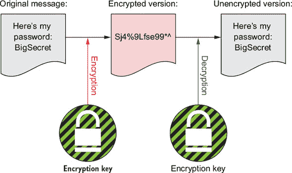
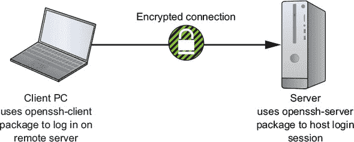
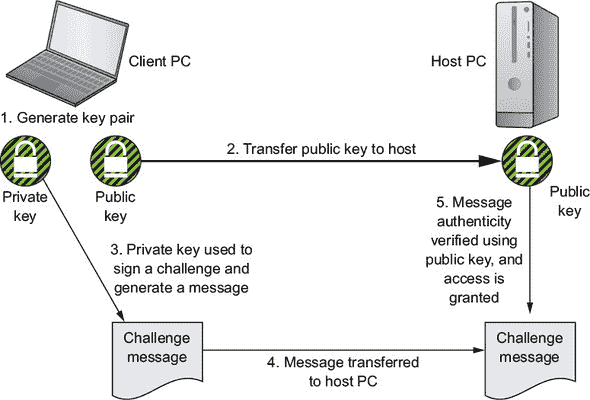
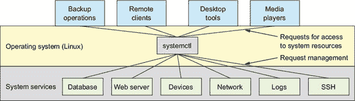

## 第三章. 远程连接：安全访问网络机器

*本章涵盖*

+   加密和安全的远程连接

+   使用 systemd 进行 Linux 系统进程管理

+   额外安全和方便的无密码 SSH 访问

+   使用 SCP 在远程位置之间安全地复制文件

+   通过 SSH 连接使用远程图形程序

他们说，一半的乐趣在于到达那里。好吧，当谈到在分布式计算世界中工作时，无法访问你的服务器和远程资源几乎是一个拦路虎。由于当今的大部分工作量都是由你在上一章中看到的虚拟机承担的，而且你不能只是走到虚拟服务器前，按下电源按钮，然后登录，你需要其他访问途径。欢迎来到安全壳（SSH）的世界。

### 3.1. 加密的重要性

在最初，无论如何，网络登录连接都是通过 Telnet 实现的。Telnet 协议速度快且可靠，在一个由较小、较简单的网络组成的纯真世界中，它完全能够满足需求。当时，Telnet 会话发送数据包不加密的事实并不是什么大问题。

然而，我听说，在过去的几十年里，事情已经有所变化。如今所有酷孩子都在玩的这个互联网事物比以前要大得多，网络管理员也不再都互相认识。显然，安全已经成为一些热烈讨论的主题。换句话说，如果你使用 Telnet 在不受保护的网络中传输包含密码和个人信息的私有数据，那么你应该假设它已经不再私密。事实上，任何使用免费可用的数据包嗅探软件（如 Wireshark）的人都可以轻松读取你发送和接收的所有内容。

由于每个人都在公共网络上定期传输敏感数据，管理员该怎么办呢？解决方案是加密传输的数据。但加密究竟是什么呢？

为了保护数据隐私，即使数据落入错误的手中，安全软件可以使用所谓的*加密密钥*，这是一个包含随机字符序列的小文件。如图 3.1 所示，该密钥可以作为加密算法的一部分应用，将可读的纯文本数据转换为几乎无法辨认的乱码。至少在应用密钥之前是这样的。在加密文件的版本上使用密钥将乱码转换回原始形式。只要你和你的信任朋友是唯一拥有密钥的人，其他人就不应该能够理解数据，即使它被截获。

##### 图 3.1. 用于加密和解密纯文本消息内容的私有/公开密钥对。此图说明了对称加密设计。



当你登录到远程服务器时，你做的只是让包含会话信息的数据包在两台计算机之间来回发送。*安全*通信的技巧是在传输之前快速加密每个数据包，然后在另一端快速解密它们。SSH 网络协议做得如此之快、如此之隐蔽，以至于已经习惯通过 Telnet 会话连接的人不会看到任何区别。

SSH 是在 1990 年代设计的一种简单方式，用于 UNIX 类似操作系统中安全地加密远程登录过程中传输的数据。现在，OpenSSH 协议的实现非常流行，以至于微软最近将其原生地提供给 Windows。

### 3.2\. 开始使用 OpenSSH

在本节中，你将检查 OpenSSH 是否已安装并激活在你的机器上。然后，如果需要，你将安装它。因为测试包的激活状态需要了解现代 Linux 发行版如何管理进程，你还将进入 systemd 的世界。所有这些都完成后，你将使用 OpenSSH 在远程服务器上打开登录会话。

如果尚未安装，从 Ubuntu 或 Debian 机器上运行 `apt install openssh-server` 将会为你提供所需的所有软件。但许多 Linux 发行版的版本默认至少包含最小化的 SSH 功能。为了找出你机器下（至少在基于 Debian/Ubuntu 的机器上）有什么，你可以使用包管理器 dpkg。

dpkg 命令行工具管理并查询属于高级包工具 (APT) 系统的软件包。使用 `-s` 标志和包名称运行 `dpkg` 会返回当前已安装和更新状态。如果包已经安装（如这个 `gedit` 示例所示），输出将类似于以下内容：

```
$ dpkg -s gedit                                   *1*
Package: gedit
Status: install ok installed                      *2*
Priority: optional
Section: gnome
Installed-Size: 1732
Maintainer: Ubuntu Desktop Team <ubuntu-desktop@
  lists.ubuntu.com>
Architecture: amd64
Version: 3.18.3-0ubuntu4
Replaces: gedit-common (<< 3.18.1-1ubuntu1)
Depends: python3:any (>= 3.3.2-2~), libatk1.0-0
    (>= 1.12.4)                                 *3*
[...]
```

+   ***1* gedit 包的 dpkg -s 输出示例**

+   ***2* 包状态**

+   ***3* 许多依赖包中的两个**


##### 注意

在 第二章 中，你看到可以使用 `apt search packagename` 搜索尚未安装的可用包。


如 图 3.2 所示，当你登录到远程计算机时，你的本地 PC 正在充当远程服务器的客户端，因此你会使用 openssh-client 包。然而，你登录到的远程服务器上的操作系统正在充当 shell 会话的主机，因此它必须运行 openssh-server 包。

##### 图 3.2\. 通过加密的 SSH 连接登录到远程服务器



你可以运行 `dpkg -s openssh-client` 或 `dpkg -s openssh-server` 来确认你的机器上安装了正确的包。因为它们被构建来托管远程 shell 会话，Linux 容器默认总是安装完整的套件。

服务器版本还包括客户端包中包含的所有工具。这意味着在安装了 openssh-server 包的机器上工作的某人也将能够通过 SSH 登录到其他服务器。因此，如果客户端包尚未安装到您的机器上，安装服务器包将覆盖您可能需要的任何内容。

另一方面，安全最佳实践教导我们只将进入我们基础设施的访问路径限制在绝对必要的内容。如果您认为您不需要登录到您的台式机或笔记本电脑，那么只需安装 openssh-client：

```
# apt install openssh-client
```

虽然软件包已经正确安装，但这并不意味着您可以立即使用它。有时配置文件默认设置为不活动。您将在阅读本书的过程中看到大量的设置配置示例，您将在本章稍后查看 OpenSSH 配置文件。但还有另一个常见的理由，Linux 程序可能无法为您工作——它没有运行。您可以使用 `systemctl status` 来找出 SSH 是否在您的机器上运行：

```
$ systemctl status ssh
? ssh.service - OpenBSD Secure Shell server
   Loaded: loaded (/lib/systemd/system/ssh.service;
       enabled; vendor preset: enabled)
   Active: active (running) since Mon 2017-05-15 12:37:18
       UTC; 4h 47min ago                                    *1*
 Main PID: 280 (sshd)                                       *2*
    Tasks: 8
   Memory: 10.1M
      CPU: 1.322s
   CGroup: /system.slice/ssh.service
            280 /usr/sbin/sshd -D
            894 sshd: ubuntu [priv]
            903 sshd: ubuntu@pts/4
            904 -bash
           1612 bash
           1628 sudo systemctl status ssh
           1629 systemctl status ssh
[...]
```

+   ***1* SSH 目前处于活动状态。**

+   ***2* 分配给 SSH 的进程 ID（PID）（在本例中为 280）**

如您从输出中的“Active”行所看到的那样，一切正常。如果您确实需要自己启动它，那么您将再次使用 `systemctl`，但这次用 `start` 代替 `status`。

对您的新玩具感到无聊？使用 `systemctl stop` 可以整洁地将其收起来：

```
# systemctl stop ssh
```

您可以使用 `systemctl enable ssh` 命令强制一个进程（如 SSH）在系统启动时自动加载，或者使用 `systemctl disable ssh` 命令使其在启动时不加载。此代码片段启用了 SSH：

```
# systemctl enable ssh
```

`systemctl` 这个家伙看起来很友好，但你几乎还没有机会认识他。现在 OpenSSH 正在等待我们，但我会在本章末尾更深入地解释进程管理。

### 3.3. 使用 SSH 登录远程服务器

启动远程会话比你想象的要简单得多。确保你有一台运行着 openssh-server 并可以网络访问的第二台计算机。例如，你可以像上一章那样启动一个 LXC 容器。

现在找到该计算机的 IP 地址。如果您使用的是 LXC 容器，它可以通过 `lxc-ls --fancy` 命令提供您所需的一切。以下是一个示例，显示一个名为 test 的未运行容器和一个名为 base 的运行容器，使用 IP 地址 10.0.3.144：

```
# lxc-ls --fancy                                     *1*
[sudo] password for ubuntu:
NAME    STATE   AUTOSTART GROUPS IPV4        IPV6    *2*
test    STOPPED 0         -      -           -
base    RUNNING 1         -      10.0.3.144  -
```

+   ***1* 列出 LXC 容器和其状态详情的命令**

+   ***2* 列表头**

或者，如果您恰好登录到您的服务器，您可以使用 `ip addr` 命令获取其公网 IP 地址，这将输出一个相当糟糕的字符杂乱列表，列出所有本地网络接口。它看起来像这样：

```
$ ip addr
1: lo: <LOOPBACK,UP,LOWER_UP> mtu 65536 qdisc noqueue
    state UNKNOWN group default qlen 1
    link/loopback 00:00:00:00:00 brd 00:00:00:00:00
    inet 127.0.0.1/8 scope host lo
       valid_lft forever preferred_lft forever
    inet6 ::1/128 scope host
       valid_lft forever preferred_lft forever
8: eth0@if9: <BROADCAST,MULTICAST,UP,LOWER_UP>          *1*
         mtu 1500
    qdisc noqueue state UP group default qlen 1000
    link/ether 00:16:3e:ab:11:a5 brd
         ff:ff:ff:ff:ff:ff link-netnsid 0
    inet 10.0.3.144/24 brd 10.0.3.255 scope             *2*
         global eth0
       valid_lft forever preferred_lft forever
    inet6 fe80::216:3eff:feab:11a5/64 scope link
       valid_lft forever preferred_lft forever
```

+   ***1* 公共网络接口（在本例中，为 eth0）**

+   ***2* 显示接口公网 IP 地址的 inet 行**

在这种情况下，接口中编号为 8 的 inet 行是我们主要关注的。它显示了一个 IP 地址为 10.0.3.144。

拿到这些信息后，为了连接，你需要使用`ssh`命令，并指定你将用于登录的服务器上的账户名称和 IP 地址。如果你是第一次从你的 PC 访问服务器，那么你将需要通过输入`yes`来确认服务器 OpenSSH 程序发送回的信息的真实性。（顺便说一句，是`yes`，而不是仅仅字母`y`。）最后，你将输入你指定的服务器账户的密码（在我的例子中是`ubuntu`），然后你就可以登录了：

```
$ ssh ubuntu@10.0.3.144
The authenticity of host '10.0.3.144 (10.0.3.144)' can't be established.
ECDSA key fingerprint is SHA256:BPwiWLii7e+wPhFeLxJbYDjW53SgiBvZermGT9Hqck.
Are you sure you want to continue
   connecting (yes/no)? yes                                              *1*
Warning: Permanently added '10.0.3.144' (ECDSA) to the list of known hosts.
ubuntu@10.0.3.144's password:                                              *2*
```

+   ***1. 确认请求***

+   ***2. 输入你在远程服务器上的账户密码。***

没有达到你预期的效果？看起来你将有一个极好的学习体验！你很可能会遇到的最常见问题是网络连接问题，所以为什么不偷偷看看第十四章呢？不过，现在，使用`ping`来测试你的两台计算机是否能够相互看到并通信。假设你从你的本地 PC 运行这个命令，并使用 IP 10.0.3.144 测试与远程服务器的连接性，成功的 ping 将看起来像这样：

```
$ ping 10.0.3.144
PING 10.0.3.144 (10.0.3.144) 56(84) bytes of data.
64 bytes from 10.0.3.144: icmp_seq=1
     ttl=64 time=0.063 ms                                   *1*
64 bytes from 10.0.3.144: icmp_seq=2 ttl=64 time=0.068 ms
64 bytes from 10.0.3.144: icmp_seq=3 ttl=64 time=0.072 ms
64 bytes from 10.0.3.144: icmp_seq=4
     ttl=64 time=0.070 ms                                   *2*
```

+   ***1. 对 ping 请求成功响应的记录***

+   ***2. 你可以通过按 Ctrl-c 来停止 ping 请求并重新控制命令行。***

失败将看起来像以下这样。为了说明，我 ping 了一个未使用的 IP 地址：

```
$ ping 10.0.3.145
PING 10.0.3.145 (10.0.3.145) 56(84) bytes of data.
From 10.0.3.1 icmp_seq=1
   Destination Host Unreachable                          *1*
From 10.0.3.1 icmp_seq=1 Destination Host Unreachable
```

+   ***1. 对 ping 请求未成功响应的记录***

### 3.4. 无密码 SSH 访问

关于密码，有些令人沮丧的事情。它们几乎从未被正确使用。要么太短，要么容易被猜到，或者只是因为多个账户而过度使用。而且人们似乎会以惊人的频率忘记它们。如果保护你的数据唯一的东西是密码，那么它可能并没有得到很好的保护。

这就是为什么在安全性方面最具信誉的行业参与者——如亚马逊网络服务（AWS）——默认情况下会在他们的云实例上完全禁用密码认证。如果你担心未经授权访问你的服务器，你可能想考虑效仿他们的做法。以下是在 EC2 服务上的 Amazon Linux 实例的`/etc/ssh/sshd_config`文件中该设置的示例：

```
# EC2 uses keys for remote access
PasswordAuthentication no
```


**OpenSSH 配置文件**

就像 Linux 中的任何其他东西一样，OpenSSH 在机器上的行为很大程度上取决于其纯文本配置文件中的设置。而且，就像大多数其他程序一样，这些配置文件可以在`/etc`目录层次结构中找到。在这种情况下，它们位于`/etc/ssh/`目录中。

控制远程客户端如何登录到您的机器的配置文件是 /etc/ssh/sshd_config。另一方面，/etc/ssh/ssh_config 文件控制本机上的用户作为客户端登录到远程主机的方式。除了限制人们通过 SSH 登录到您的系统的方式外，这些文件中的设置还可以用来控制各种行为，包括您将在本章稍后看到，是否允许远程 GUI 访问本地程序。

| |
| --- |

SSH 密码认证的替代方法是创建一个特殊的密钥对，然后将密钥对的一半（公钥）复制到远程主机，即您最终想要登录的计算机。在连接的两端都有加密密钥的情况下，运行在主机上的 OpenSSH 现在将有一种方式知道你是谁，而无需要求密码。但这并不是说密码在基础设施安全中没有积极作用。实际上，您很快就会看到。理想情况下，您应该创建一个所谓的密码短语，并在使用密钥对之前用它来本地验证自己。

| |
| --- |

##### 注意

密码短语，就像密码一样，是你选择的一个秘密文本字符串。但密码短语通常会包含空格，并由一系列真实单词组成。像 3Kjsi&*cn@PO 这样的密码相当不错，但像“fully tired cares mound”这样的密码短语可能更好，因为它长度更长，而且相对容易记住。

| |
| --- |

#### 3.4.1\. 生成新的密钥对

一定有不止一种方法可以解决这个问题。但既然所有优秀的系统管理员在训练中都是懒惰的，我会选择需要最少按键的方法。这个选择的一个意外但令人高兴的结果是，我将有机会向您介绍管道字符（|）的更复杂用法。

您将首先使用 ssh-keygen 程序在客户端计算机上创建一个新的公钥/私钥对。您将被要求输入密钥对名称，但除非您已经有一个名为 id_rsa 的密钥对，否则我会按 Enter 键并保留默认设置。正如您之前所看到的，在提示时创建密码短语通常更好，尤其是如果您与他人共享计算机。记住，如果您选择添加密码短语，每次使用密钥时都会提示您输入它。下面是整个过程：

```
ubuntu@base:~$ ssh-keygen                                       *1*
Generating public/private rsa key pair.
Enter file in which to save the key (/home/ubuntu/.ssh/id_rsa):
Enter passphrase (empty for no passphrase):
Enter same passphrase again:
Your identification has been saved in
    /home/ubuntu/.ssh/id_rsa.
Your public key has been saved in
    /home/ubuntu/.ssh/id_rsa.pub.                               *2*
The key fingerprint is:                                         *3*
SHA256:1wQzEnybUSOFpYEvmbxVPZjy1uGAV6Tnn5m1w0qD5T8 ubuntu@base
The key's randomart image is:                                   *4*
+---[RSA 2048]----+
|       .oo**=*o  |
|        o.*B*o+  |
|       . =.Oo+.o |
|        = =oooo  |
|        S+..... .|
|        ..  + ..*|
|           . + B.|
|            . +E.|
|             . ..|
+----[SHA256]-----+
```

+   ***1* 显示我的本地客户端名称，base**

+   ***2* 新密钥对的位置和名称**

+   ***3* 有助于防止中间人攻击**

+   ***4* 密钥的随机艺术（randomart），一种视觉提示，也有助于防止中间人攻击**。

好吧，现在你已经是拥有一对闪亮的新 RSA 加密密钥的所有者了。继续使用`ls -l`来显示.ssh/目录的长列表。注意，有两个文件名为 id_rsa，但只有一个具有.pub 文件扩展名。这个文件是这对密钥的公共部分，是你最终需要复制到将成为会话主机的远程机器上的文件：

```
ubuntu@base:~$ ls -l .ssh
total 12
-rw------- 1 ubuntu ubuntu 1675 Jun  5 22:47 id_rsa
-rw-r--r-- 1 ubuntu ubuntu  393 Jun  5 22:47 id_rsa.pub
```

| |
| --- |

**你应该使用哪种算法？**

除了 RSA（由首先描述它的三位研究者的姓氏缩写而成：Ron Rivest, Adi Shamir, 和 Leonard Adleman）之外，OpenSSH 还支持 ECDSA 和 ED25519 签名算法。你会在默认的 RSA 和 ECDSA 以及 ED25519 之间发现一些相当晦涩的技术差异，它们的优势在于基于椭圆曲线。但所有这些都被认为是相当安全的。关于 ECDSA 和 ED25519 需要注意的一点是，它们可能还没有被一些较旧的实现完全支持。

你不应再假设所有 OpenSSH 的实现都支持 DSA。由于对其起源的怀疑，DSA 在任何情况下都被广泛避免。

| |
| --- |

#### 3.4.2\. 通过网络复制公钥

无密码 SSH 访问直到你将公钥复制到主机上才会生效。正如你在图 3.3 中看到的，密钥对通常是在客户端计算机上创建的。这是因为私钥应该是这样的：私有的。尽可能避免不必要地移动它，并使其暴露在不友好的目光之下。

##### 图 3.3\. 密钥对的公钥必须移动到主机 PC 上，而私钥则保持在客户端。



一旦创建，你可以将公钥移动到主机计算机上的.ssh/authorized_keys 文件中。这样，运行在主机上的 OpenSSH 软件将能够验证由客户端上的私钥创建的加密消息的真实性。一旦消息被验证，SSH 会话将被允许开始。

你首先需要做的是确定你将登录到主机上的哪个用户账户。在我的情况下，它将是名为 ubuntu 的账户。密钥需要复制到名为.ssh/的目录中，该目录位于/home/ubuntu/下。如果它还没有在那里，你应该现在使用`mkdir`来创建它。

首先，我将向你介绍一个酷的快捷方式：要运行单个命令，你实际上不需要在远程主机上打开完整的 SSH 会话。相反，你可以将你的命令附加到常规的`ssh`语法中，如下所示：

```
ubuntu@base:~$ ssh ubuntu@10.0.3.142 mkdir -p .ssh
ubuntu@10.0.3.142's password:
```

你仍然需要为远程主机提供密码。但一旦完成，你将在主机上的/home/ubuntu/目录下拥有一个.ssh/目录。

为了让你更容易阅读，我使用反斜杠字符（\）将下一个命令拆分为三行，这告诉 Bash 将下一行作为当前行的一部分读取。确保反斜杠后面没有字符（包括空格）。这肯定会给你带来麻烦：

```
ubuntu@base:~$ cat .ssh/id_rsa.pub \        *1*
 | ssh ubuntu@10.0.3.142 \                  *2*
"cat >> .ssh/authorized_keys"               *3*
ubuntu@10.0.3.142's password:
```

+   ***1* cat 命令读取 id_rsa.pub 文件的内容。**

+   ***2* 文本被传递到 ssh 命令中。**

+   ***3* 文本被追加到名为 authorized_keys 的文件中。**

那个单一的多行命令将使用 `cat` 来读取 id_rsa.pub 文件中的所有文本，并将其存储在内存中。然后，它将通过远程主机计算机上的 SSH 登录将文本传递过去。最后，它再次读取文本，这次是在主机计算机上，并将其追加到名为 authorized_keys 的文件中。如果该文件尚不存在，`>>`（追加工具）将创建它。如果已存在同名文件，文本将被添加到文件中的任何内容。

就这些。你已经准备好了。这次，当你运行相同的旧 `ssh` 命令时，不需要输入密码：

```
ubuntu@base:~$ ssh ubuntu@10.0.3.142                               *1*
Welcome to Ubuntu 16.04.1 LTS (GNU/Linux 4.4.0-78-generic x86_64)

 * Documentation:  https://help.ubuntu.com
 * Management:     https://landscape.canonical.com
 * Support:        https://ubuntu.com/advantage
Last login: Tue May 16 15:14:37 2017 from 10.0.3.1
ubuntu@tester:~$                                                   *2*
```

+   ***1* 登录过程不需要密码请求。**

+   ***2* 新的命令提示符表明你在一台不同的计算机上。**

#### 3.4.3\. 使用多个加密密钥

在某些情况下（比如需要登录到在亚马逊 EC2 服务上运行的虚拟机实例），你需要指定为给定会话使用哪个密钥对。一旦你开始收集用于不同主机的密钥，这肯定会发生。为了告诉 OpenSSH 你想要哪个密钥，你添加 `-i` 标志，后跟私钥文件的完整名称和位置：

```
ssh -i .ssh/mykey.pem ubuntu@10.0.3.142
```

注意那个例子中的 .pem 文件扩展名吗？这意味着密钥是以一种常用于访问各种虚拟机（包括亚马逊 EC2 实例）的格式保存的。

### 3.5\. 使用 SCP 安全地复制文件

我确信你记得 `cp` 命令是如何在文件系统中从一个地方复制文件和目录到另一个地方的。好吧，至少在理论上，没有理由说这不能同样适用于跨网络复制文件。除非那将是完全疯狂的——文件内容将暴露给那天偶然在网络周围的人，或者任何后来偶然浏览网络日志数据的人。

忘掉那个想法，除非你在那个 `cp` 命令前加上一个 *s* 表示 *secure*。SCP 程序使用 SSH 协议进行文件传输，依靠所有相同的密钥、密码和口令短语，来复制各种类型的文件。假设你知道你之前工作的远程主机上已经有一个 .ssh/ 目录，以下是你可以如何将公钥（id_rsa.pub）传输到远程主机，并将其重命名为 authorized_keys：

```
ubuntu@base:~$ scp .ssh/id_rsa.pub \
  ubuntu@10.0.3.142:/home/ubuntu/.ssh/authorized_keys
```


##### 警告

如果在那个目录中已经存在一个 authorized_keys 文件，这个操作将会覆盖它，破坏任何现有的内容。此外，你只能复制或保存文件，如果使用的用户账户具有适当的权限。因此，如果你的用户没有 root 权限，不要尝试将文件保存到远程机器上的，例如，/etc/目录。在你问之前，以 root 用户登录 SSH 会话通常是一个很大的安全禁忌。


你顺便可以把远程文件复制到你的本地机器上。以下示例展示了如何从一个 AWS EC2 实例（用虚构的 IP 地址表示）复制文件到指定的本地目录：

```
$ scp -i mykey.pem mylogin@54.7.61.201:/home/mylogin/backup-file.tar.gz \
  ./backups/january/                                                       *1*
```

+   ***1* 将文件保存到相对于当前工作目录的目录位置**

你到目前为止使用的命令已经展示了几个重要的工具。但我应该提到，还有第三种（也是官方的）安全地将你的密钥复制到远程主机的方法——专门为此目的编写的程序叫做 ssh-copy-id：

```
$ ssh-copy-id -i .ssh/id_rsa.pub ubuntu@10.0.3.142         *1*
```

+   ***1* 自动将公钥复制到远程主机上的适当位置**

SSH 会话的好处是，不受 GUI 层级的负担，它们速度快且效率高。但如果需要在远程主机上运行的程序是图形化的，这可能会成为一个问题。下一节将为你解决这个问题。

### 3.6. 使用 SSH 连接远程图形程序

假设你正在尝试支持一个在远程位置的用户新报告了一个桌面软件（如 LibreOffice）的问题。如果你觉得能够启动并运行程序有助于诊断和解决问题，那么可以使用图形会话（通过 Linux X 窗口管理器）在 SSH 上完成。

说了这么多，不要期望出现奇迹。使用带有`-X`标志的`ssh`，使用所谓的*X11 转发*，将允许你在客户端的桌面上加载基于主机机器的程序。根据许多因素，包括你的网络连接质量，你的结果可能不会达到你的期望。这对于资源密集型程序（如 LibreOffice）尤其如此。尽管如此，它总是值得一试。忍受一点低带宽的痛苦可能仍然比开车两小时去客户办公室要好。

还有一件事：不要在服务器上尝试这个。在大多数情况下，服务器或虚拟机（如 LXC 或 Docker 容器）上安装的操作系统版本带有很少或没有图形功能。如果你绝对必须这样做，你可以安装桌面包来升级它。在 Ubuntu 机器上，它看起来像这样：

```
# apt update
# apt install ubuntu-desktop
```

在所有免责声明都讲完之后，我认为是时候看看这到底是如何工作的了。首先，打开主机机器上的 sshd_config 文件（你想要运行程序的那个机器）。你需要确保 X11Forwarding 行具有值`yes`（尽管，出于安全考虑，可能没有必要让它保持这种方式太长时间）：

```
# nano /etc/ssh/sshd_config
    X11Forwarding yes         *1*
```

+   ***1* 将行编辑成这个样子。**

在客户端机器上的 ssh_config 文件中也有类似的行，也需要正确设置：

```
# nano /etc/ssh/ssh_config
    ForwardX11 yes            *1*
```

+   ***1* 修改这一行，使其看起来完全像这样。**

由于你编辑了配置文件，你需要在两台机器上重新启动 SSH 以确保你的更改生效：

```
# systemctl restart ssh
```

你现在可以开始了。要启动一个图形化的会话，将`-X`标志添加到你的`ssh`命令中：

```
$ ssh -X ubuntu@10.0.3.142
```

你将看到常规的命令提示符，但现在你可以运行一个命令来启动一个图形程序。尝试做一些小事情。这应该在 Ubuntu 系统上工作：

```
$ gnome-mines
```

太棒了！你成功地在本地桌面的窗口中运行了一个远程程序。

OpenSSH 比你已经看到的核心理念提供了更多的价值。一旦你建立了 SSH 连接，你就可以施展各种技巧。尝试在远程机器上挂载本地文件系统或目录，允许远程用户无缝访问你的文件。或者，通过 SSH 隧道技术的魔力，使用端口转发来允许远程 HTTP 服务的安全、私有使用。

### 3.7\. Linux 进程管理

正如承诺的那样，现在我将重新审视 Linux 进程管理，这样你就可以正确理解像 OpenSSH 这样的程序是如何处理的。了解这些是如何工作的可以使长期的一般管理和故障排除更加有效。但如果你现在不想深入研究这样一个复杂的话题，你可以安全地跳过本章的其余部分。你应该没有问题跟随本书的其余部分。

systemctl 究竟是什么，它实际上在做什么？要正确回答这些问题，你需要稍微思考一下 Linux 是如何管理系统进程的。而且，因为结识新朋友总是很愉快，你还将了解一些进程跟踪工具，使理解事物的工作方式更加容易。

*软件*，正如你肯定已经知道的，是包含控制计算机硬件指令的编程代码，代表人类用户。*进程*是运行软件程序的一个实例。*操作系统*是组织和管理工作这些实例/进程的工具，以有效地使用计算机的硬件资源。

在一个复杂的、多进程、多用户的操作环境中组织和管理工作并不简单。为了使其工作，你需要某种交通警察来紧密控制许多移动部件（图 3.4）。让我向你介绍 systemctl。

##### 图 3.4\. 许多系统服务的可用性和响应性由 systemd 的 systemctl 进程管理器管理。



#### 3.7.1\. 使用 ps 命令查看进程

让我们拿出一个电子显微镜，看看我们是否能在其自然栖息地中找到一个进程。在终端中输入以下命令。它将在后台（`sleep`）运行 10 秒钟然后停止。然而，当它在运行时，输入`ps`：

```
$ for i in {1..10}; do sleep 1; done &
[1] 19829                                *1*
$ ps
  PID TTY          TIME CMD
19522 pts/17   00:00:00 bash
19829 pts/17   00:00:00 bash
19832 pts/17   00:00:00 sleep            *2*
19833 pts/17   00:00:00 ps               *3*
```

+   ***1* 背景运行命令的 PID***

+   ***2* 由原始命令启动的 sleep 进程***

+   ***3* 列出运行进程的 ps 命令***

你会看到由该命令产生的两个正在运行进程的记录，以及它们的 PID：在我的例子中是 19829 和 19832。如果你等待 10 秒后再次运行 `ps` 命令，你会看到这两个进程不再运行。你也应该看到 `sleep` 命令成功完成的报告：

```
$ ps
  PID TTY          TIME CMD
19522 pts/17   00:00:00 bash
20549 pts/17   00:00:00 ps
[1]+  Done                    for i in {1..10};
do
    sleep 1;
done
```

通常，如果你只输入 `ps` 并运行它，你可能会只得到两个结果。第一个是一个名为 *bash* 的进程，代表你的当前 shell 会话使用的 Bash 命令解释器，以及最近的命令（当然是 `ps`）。但通过查看分配给 bash 的 PID（以下示例中的 7447），你知道在你的系统上已经有成千上万的进程正在努力工作。这些进程是由从 init 进程本身回溯的所有父 shell 生成的：

```
$ ps
 PID TTY          TIME CMD
7447 pts/3    00:00:00 bash
8041 pts/3    00:00:00 ps
```

在 Ubuntu 机器上，当 Linux 计算机启动时，第一个唤醒并启动其他所有进程的进程被称为 *init*。很快你就会发现，这个名字可能会误导，这就是为什么在 CentOS 上第一个进程有不同的名字。你可以通过运行以下 `ps` 命令（就像这里打印的那样）亲自看到 init 是第一个进程。我将在一分钟内解释细节：

```
$ ps -ef | grep init
root         1     0  0 12:36 ?        00:00:00 /sbin/init                *1*
ubuntu    1406   904  0 16:26 pts/4    00:00:00 grep --color=auto init
```

+   ***1* 负责进程 1 的文件***

输出的最右边一列（第一行显示 `/sbin/init`）表示进程背后的文件的位置和名称。在这种情况下，它是一个位于 `/sbin/` 目录下的名为 init 的文件。这一行的最左边一列包含单词 `root`，告诉你这个进程的所有者是 root 用户。目前唯一其他值得关注的信息是数字 1，这是 init 进程的 PID。你获得 PID 1 的唯一方法是在其他人之前到达那里。

在继续之前，花更多的时间与 `ps` 命令打交道是值得的。正如你所看到的，`ps` 命令显示有关活动进程的信息。通常，访问与进程相关的信息对于正确规划和排除系统行为故障非常重要。你可以预期会经常且早期使用 `ps` 命令。

将 `-e` 参数添加到 `ps` 命令中，就像你之前做的那样，不仅会返回你当前子 shell 中正在运行的所有进程，还会返回从所有父 shell 回溯到 init 的所有进程。


##### 注意

*父 shell* 是一个可以从中启动新的（子）shell 并通过它运行程序的环境。你可以把你的 GUI 桌面会话看作是一个 shell，你打开以获取命令行的终端是其子 shell。顶级 shell（外祖父？）是在 Linux 启动时首先运行的 shell。


如果您想可视化父 shell/进程和子 shell/进程，可以使用`pstree`命令（添加`-p`参数以显示每个进程的 PID）。注意第一个进程（分配 PID 1）是 systemd。在较旧的 Linux 版本（例如 Ubuntu 14.04 及之前）中，这将被称为 init：

```
$ pstree -p                                  *1*
systemd(1)agetty(264)                    *2*
            agetty(266)
            agetty(267)
            agetty(268)
            agetty(269)
            apache2(320)apache2(351)
                            apache2(352)
                            apache2(353)
                            apache2(354)
                            apache2(355)
            cron(118)
            dbus-daemon(109)
            dhclient(204)
            dockerd(236)docker-containe(390){docker-containe}(392)
                                                    {docker-containe}(404)
                            {dockerd}(306)
                            {dockerd}(409)
            mysqld(280){mysqld}(325)
                           {mysqld}(326)
                           {mysqld}(399)
            nmbd(294)
            rsyslogd(116){in:imklog}(166)
                             {in:imuxsock}(165)
                             {rs:main Q:Reg}(167)
            smbd(174)smbd(203)
                         smbd(313)
            sshd(239)sshd(840)sshd(849)bash(850)pstree(15328)
            systemd-journal(42)
            systemd-logind(108)
```

+   ***1* CentOS 用户可能需要安装 psmisc 包才能运行 pstree。**

+   ***2* systemd，顶级父进程**

在您的机器上尝试所有这些命令。即使在安静的系统上，您也可能看到成百上千的进程；繁忙的桌面 PC 或服务器可以轻松地有数百甚至数千个。

#### 3.7.2\. 与 systemd 一起工作

您刚才看到的那个/sbin/init 文件有些有趣：`file`是一个古老的 UNIX 程序，它提供了关于文件的内幕信息。如果您用`/sbin/init`作为参数运行`file`，您会看到 init 文件实际上不是一个程序，而是指向名为 systemd 的程序的一个符号链接。我们将在第十二章中更详细地讨论符号链接，但在这里您将有机会认识 systemd：

```
$ file /sbin/init
/sbin/init: symbolic link to /lib/systemd/systemd
```

经过多年的碎片化和一些激烈的政斗，现在几乎所有 Linux 发行版都使用相同的进程管理器：systemd。它是名为*init*的进程的替代品，这个进程长期以来一直是所有基于 UNIX 操作系统的启动过程中启动的第一个进程。通过*drop-in replacement*，我的意思是，即使它完成任务的方式可能相当不同，但对普通观察者来说，systemd 的功能始终如 init。这就是为什么/sbin/init 文件现在只是一个指向 systemd 程序的链接。

这一切都是理论性的，因为您可能永远不会直接通过其/sbin/init 前端以名称调用 systemd 程序。这是因为，如您所见，关键管理任务是由 systemd 代表`systemctl`处理的。

从技术上讲，systemd 的主要任务是控制单个进程的诞生、生活以及死亡的方式。您之前使用的`systemctl`命令是执行这些任务的首选工具。但是，有些有争议的是，systemd 开发者将功能扩展得远远超出了传统进程管理的角色，以控制各种系统服务。在新 systemd 的范围内包括日志管理器（journald）、网络管理器（networkd）和设备管理器（正如您所猜想的：udevd）。好奇吗？其中的*d*代表*daemon*，即后台系统进程。

您在阅读本书的过程中会遇到至少一些 systemd 工具。我们的下一个目的地将是学习如何管理和，最重要的是，备份文件系统和存档。

### 摘要

+   加密连接是所有网络通信的关键部分，而 SSH 几乎是行业标准。

+   您可以通过共享密钥对中的公钥来启用无密码 SSH 访问。

+   OpenSSH 软件包还允许安全地复制文件和远程图形会话。

+   在大多数现代 Linux 发行版中，进程通过 systemctl 工具由 systemd 管理。

+   你可以使用 `|`（管道）字符在命令之间传递数据，并使用 `grep` 过滤流数据。

### 关键术语

+   *密码* 是一串常规字符，而 *口令短语* 可以包含空格和标点符号。

+   *RSA* 是一种流行的加密算法。

+   *X11 转发* 允许在远程连接上运行图形程序。

+   Linux 的 *进程* 是与单个运行程序相关的所有持续活动。

+   *shell* 是一个提供命令行解释器（如 Bash）的终端环境，允许用户执行命令。当你从 Linux 桌面 PC 或笔记本电脑工作的时候，你通常会通过打开一个终端程序（如 GNOME 终端）来访问 shell。

+   *父 shell* 是一个初始环境，从中可以启动新的子 shell，并通过它运行程序。从所有目的来看，shell 也是一个进程。

### 安全最佳实践

+   总是在公共网络上运行的远程登录会话中加密。

+   不要仅依赖密码；就像人一样，它们是会出错的。

+   基于密钥、无密码的 SSH 会话比简单的密码登录更可取。

+   不要在公共网络上以纯文本形式传输文件。

### 命令行回顾

+   `dpkg -s openssh-client` 检查基于 APT 的软件包的状态。

+   `systemctl status ssh` 检查系统进程（systemd）的状态。

+   `systemctl start ssh` 启动一个服务。

+   `ip addr` 列出计算机上的所有网络接口。

+   `ssh-keygen` 生成一个新的 SSH 密钥对。

+   `$ cat .ssh/id_rsa.pub | ssh ubuntu@10.0.3.142 "cat >> .ssh/authorized_keys"` 将本地密钥复制并粘贴到远程机器上。

+   `ssh-copy-id -i .ssh/id_rsa.pub ubuntu@10.0.3.142` 安全地复制加密密钥（推荐和标准）。

+   `ssh -i .ssh/mykey.pem ubuntu@10.0.3.142` 指定特定的密钥对。

+   `scp myfile ubuntu@10.0.3.142:/home/ubuntu/myfile` 安全地将本地文件复制到远程计算机。

+   `ssh -X ubuntu@10.0.3.142` 允许你登录到具有图形功能的远程主机。

+   `ps -ef | grep init` 显示所有当前运行的系统进程，并使用字符串 `init` 过滤结果。

+   `pstree -p` 以可视树格式显示所有当前运行的系统进程。

### 测试自己

> **1**
> 
> 加密密钥的目的是：
> 
> 1.  建立安全网络连接
> 1.  
> 1.  加密和解密数据包
> 1.  
> 1.  在传输过程中隐藏敏感数据
> 1.  
> 1.  确保数据传输的可靠性
> 1.  
> **2**
> 
> 你可以使用以下哪个命令来检查服务的状态？
> 
> 1.  `dpkg -s <servicename>`
> 1.  
> 1.  `systemd status <servicename>`
> 1.  
> 1.  `systemctl status <servicename>`
> 1.  
> 1.  `systemctl <servicename> status`
> 1.  
> **3**
> 
> 在主机服务器可以接受远程 SSH 登录之前，必须安装以下哪些软件包？
> 
> 1.  openssh-server
> 1.  
> 1.  ssh-server
> 1.  
> 1.  openssh-client
> 1.  
> 1.  ssh-client
> 1.  
> **4**
> 
> 在使用 systemd 的 Linux 发行版中，init 的任务由以下哪个程序执行？
> 
> 1.  /lib/systemd/systemd
> 1.  
> 1.  /bin/systemd
> 1.  
> 1.  /sbin/init
> 1.  
> 1.  /bin/init
> 1.  
> **5**
> 
> 以下哪个服务不是 systemd 服务？
> 
> 1.  networkd
> 1.  
> 1.  journald
> 1.  
> 1.  processd
> 1.  
> 1.  udevd
> 1.  
> **6**
> 
> 对于无密码 SSH 连接，密钥必须放在哪里？
> 
> 1.  主机上的公钥和私钥，客户端上的私钥
> 1.  
> 1.  主机上的公钥和私钥，客户端上的公钥
> 1.  
> 1.  主机上的私钥，客户端上的公钥
> 1.  
> 1.  主机上的公钥，客户端上的私钥
> 1.  
> **7**
> 
> SSH 会话中密码的作用是什么？
> 
> 1.  为了验证您的身份给远程的 OpenSSH 程序
> 1.  
> 1.  为了验证您的身份给本地的 OpenSSH 程序
> 1.  
> 1.  为了确定您想使用哪个密钥对
> 1.  
> 1.  为了验证密钥对的状态
> 1.  
> **8**
> 
> 以下哪个操作会将远程文件复制到您的本地机器的当前目录（假设远程目录和文件都存在）？
> 
> 1.  `scp mylogin@10.0.3.142:/home/mylogin/filename .`
> 1.  
> 1.  `scp mylogin@10.0.3.142/home/mylogin/filename .`
> 1.  
> 1.  `scp mylogin@10.0.3.142:/home/mylogin/filename`
> 1.  
> 1.  ```
>     scp mylogin@10.0.3.142:/home/mylogin/filename
>      ./home/myname/Documents
>     ```

#### 答案键

> **1.**
> 
> b
> 
> **2.**
> 
> c
> 
> **3.**
> 
> a
> 
> **4.**
> 
> a
> 
> **5.**
> 
> c
> 
> **6.**
> 
> d
> 
> **7.**
> 
> b
> 
> **8.**
> 
> a
