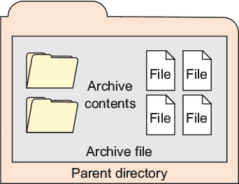
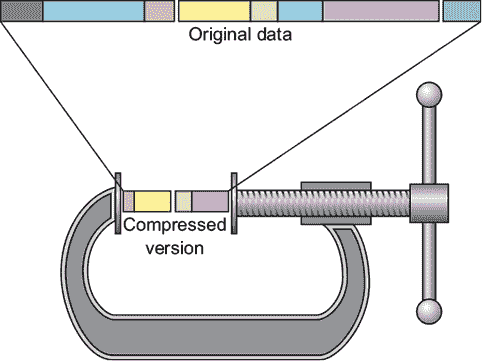
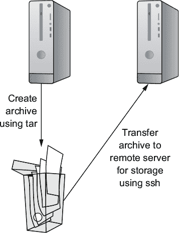
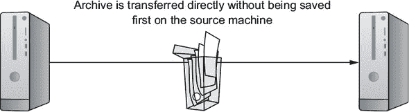
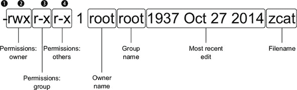
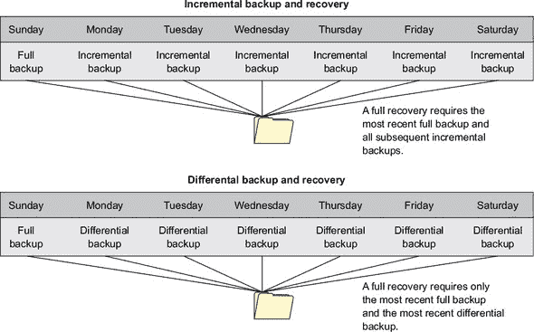

## 第四章\. 归档管理：备份或复制整个文件系统

*本章涵盖*

+   为什么、是什么以及在哪里归档

+   使用 `tar` 归档文件和文件系统

+   搜索系统文件

+   使用对象权限和所有权来保护文件

+   使用 `dd` 归档整个分区

+   使用 `rsync` 同步远程归档

在本书的前几章中，你学习了如何在 Linux 环境中既安全又高效地操作。你还学会了利用虚拟化的奇妙之处来生成基础工作环境。从现在开始，我将专注于构建和维护你完成实际工作所需的基础设施元素。

在没有良好的备份协议的情况下构建 IT 基础设施，就像抵押你的房子来投资你妹夫的、不会失败的超导聚变发明一样。你知道这种做法不太可能有好结果。但在你能够正确备份文件系统和分区之前，你需要确切了解文件系统和分区是如何工作的。之后呢？有哪些工具可用？何时应该使用每个工具，如果发生灾难，你将如何重新组装一切？请保持关注。

### 4.1\. 为什么需要归档？

在我们讨论为什么之前，先来了解一下什么是 *归档*？它不过是一个包含一组对象的单个文件：文件、目录，或者两者的组合。将对象捆绑在单个文件中（如图 4.1 所示）有时可以更容易地移动、共享或存储那些可能难以管理和组织的大量对象。

##### 图 4.1\. 文件和目录可以捆绑成一个归档文件并保存到文件系统中。



想象一下尝试复制散布在十几个目录和子目录中的几千个文件，以便你的网络另一端的同事也能看到它们。当然，使用正确的命令行语法参数，任何事都可以做到。（还记得第一章（kindle_split_009.xhtml#ch01）中的 `cp` 吗？还有 `-r`？）但确保只复制你需要的文件，并且没有意外遗漏任何文件，这可能是一个挑战。当然，你至少需要一次计算所有这些文件，以便构建归档。但一旦你将所有内容都封装在一个归档文件中，跟踪起来就简单多了。所以，归档就是归档。

但归档有归档，哪种归档适合你？这取决于你想要组织哪些类型的文件以及你计划如何使用它们。你可能需要创建目录及其内容的副本，以便你可以轻松地共享或备份它们。为此，`tar` 可能将成为你的首选冠军。然而，如果你需要一个分区的精确副本，甚至是一个整个硬盘的副本，那么你需要了解 `dd`。如果你正在寻找一个用于常规系统备份的持续解决方案，那么尝试 `rsync` 吧。

学习如何使用这三个工具，更重要的是，学习这三个工具可以为你解决哪些实际问题，将是本章剩余部分的重点。在这个过程中，我们将稍微偏离一下，看看如何保护存档中文件在存档生命周期中的权限和所有权属性。最后，我们将窥视一下为什么 Linux 首先使用文件权限和文件所有权。

#### 4.1.1\. 压缩

在我们开始之前还有一个注意事项。尽管这两个经常一起使用，但不要将存档与压缩混淆。*压缩*，如图 4.2 所示，是一种软件工具，它将一种巧妙的算法应用于文件或存档以减少其占用的磁盘空间。当然，当文件被压缩后，它们是不可读的，这就是为什么算法也可以逆向应用以解压缩它们。

##### 图 4.2\. 通过消除统计冗余和/或删除文件中不太重要的部分来实现对象压缩



你很快就会看到，将压缩应用于 tar 存档非常简单，如果你计划通过网络传输大型存档，这样做尤其是个好主意。压缩可以显著减少传输时间。

#### 4.1.2\. 存档：一些重要考虑事项

你想要创建存档的两个主要原因是为了构建可靠的文件系统镜像和创建高效的数据备份。本节将描述这些目标。

##### 镜像

什么是镜像？还记得你在第二章中用来在虚拟机上安装 Linux 的那些 .ISO 文件吗？这些文件是完整操作系统的镜像，特别组织以便于将包含的文件复制到目标计算机上。

你也可以从活动的工作操作系统（OS）的所有或部分创建镜像，这样你就可以将内容复制粘贴到第二台计算机上。这实际上使得第二台（复制）计算机在其当前状态下成为第一系统的精确克隆。我经常这样做，从失败的硬盘上恢复复杂的安装，而不想在新硬盘上从头开始重建整个系统。当你想要快速向多个用户（如教室中的学生工作站）提供相同的系统设置时，这也非常棒。

| |
| --- |

##### 注意

根本不要考虑在 Windows 上尝试这些操作。从所有目的和用途来看，Windows 注册表架构使得将安装的操作系统与其原始硬件分离变得不可能。

| |
| --- |

虽然我们将在本章的剩余部分讨论备份而不是镜像，但请放心。我们用于创建和恢复镜像的工具基本上是相同的，所以无论哪种方式你都会没事的。

##### 数据备份

备份应该是你生活中的一部分。实际上，如果你从不担心你数据的安全，那么要么你是一位禅宗大师，要么你只是没有正确地完成你的工作。可能会有很多可怕的事情发生：

+   硬件会失败——而且通常会在你计划进行大备份之前发生。真的。

+   大拇指笨拙（我指的是笨拙的人）和键盘可能会串通起来破坏配置文件，让你完全无法访问加密系统。拥有一个备用副本可以保住你的工作，甚至可能保住你的生命。

+   存储在像亚马逊网络服务（AWS）这样的云基础设施提供商上的数据可能突然且不可预测地丢失。2014 年，这种情况发生在一个名为 Code Spaces 的公司身上。该公司的 AWS 账户控制台配置不当，被攻击者入侵，他们删除了大部分数据。Code Spaces 是如何恢复的？好吧，你最后一次听说 Code Spaces 是什么时候？

+   可能最可怕的是，你可能会成为勒索软件攻击的受害者，除非你支付一大笔赎金，否则你的所有文件都会被加密或禁用。你有一个可靠且最近的备份吗？你可以自由地告诉攻击者你的想法。

在继续之前，我应该提到，未经测试的数据备份可能实际上不起作用。事实上，有证据表明，几乎一半的时间它们都不会起作用。问题是什么？有很多可能出错的地方：你的备份设备可能有缺陷，存档文件可能已损坏，或者初始备份本身可能无法正确处理你所有的文件。

生成和监控日志消息可以帮助你发现问题，但唯一能够对备份有合理信心的方式是将试验性恢复到匹配的硬件上。这将需要能量、时间和金钱。但确实比替代方案好。我所认识的最好的系统管理员似乎都持有相同的观点：“偏执狂只是开始。”

### 4.2\. 要存档的内容

如果你想要备份的文件不多，而且它们不是很大，你不妨直接将它们传输到它们的存储目的地。使用你在第三章中看到的类似 SCP 程序。以下示例使用 SCP 将我的公钥内容复制到远程机器上的名为 authorized_keys 的文件中：

```
ubuntu@base:~$ scp .ssh/id_rsa.pub \
  ubuntu@10.0.3.142:/home/ubuntu/.ssh/authorized_keys        *1*
```

+   ***1* 覆盖远程授权 _keys 文件当前内容**

但如果你想要备份分布在多个目录中的许多文件（例如，一个包含源代码的复杂项目）或甚至整个分区（如你现在运行的操作系统），你需要一个更有力的工具。

虽然我们在第一章中讨论了磁盘分区和伪文件，但如果你想制定某种智能备份策略，你将想要了解它们的外观。假设你正在计划备份包含你公司大型会计数据库的分区；如果你不知道该分区占用了多少空间以及如何找到它，你可能不会走得太远。

让我们从 `df` 命令开始，它显示 Linux 系统上当前挂载的每个分区，以及其磁盘使用量和在文件系统中的位置。添加 `-h` 标志将分区大小转换为人类可读的格式，如 GB 或 MB，而不是字节：

```
$ df -h
Filesystem      Size  Used Avail Use% Mounted on
/dev/sda2       910G  178G  686G  21% /                  *1*
none            492K     0  492K   0% /dev
tmpfs           3.6G     0  3.6G   0% /dev/shm           *2*
tmpfs           3.6G  8.4M  3.6G   1% /run               *3*
tmpfs           5.0M     0  5.0M   0% /run/lock
tmpfs           3.6G     0  3.6G   0% /sys/fs/cgroup
```

+   ***1* 根分区：本系统上唯一的正常分区**

+   ***2* 注意磁盘使用量为 0 字节。这（通常）表示一个伪文件系统。**

+   ***3* /run 目录包含在启动期间生成的运行时数据文件。**

列出的第一个分区被指定为 /dev/sda2，这意味着它是存储设备 A 的第二个分区，并且它通过伪文件系统目录 /dev/ 表示为一个系统资源。在这种情况下，这恰好是主要的操作系统分区。与系统关联的所有设备都将由 /dev/ 目录中的一个文件表示。（你的会计软件所使用的分区可能会出现在这个列表中，可能使用类似 /dev/sdb1 的方式指定。）


##### 注意

在 LXC 容器上运行 `df` 命令会显示与 LXC 主机关联的分区。


重要的是要区分真实和 *伪* 文件系统（文件系统中的文件实际上并没有保存到磁盘上，而是存在于易失性内存中，并在机器关闭时消失）。毕竟，备份代表短暂硬件配置的文件没有意义，而且无论如何，操作系统都会在启动时自动替换真实文件系统。 

很容易判断哪些分区用于伪文件：如果文件指定为 tmpfs 并且在“已用”列中报告的字节数为 0，那么你很可能在查看一个临时文件系统而不是正常文件系统。

顺便说一下，那个 `df` 命令是在 LXC 容器上运行的，这就是为什么只有一个真实分区，即 `/`。让我们看看它在物理计算机上运行时显示什么：

```
df -h
Filesystem      Size  Used Avail Use% Mounted on
udev            3.5G     0  3.5G   0% /dev
tmpfs           724M  1.5M  722M   1% /run
/dev/sda2       910G  178G  686G  21% /
tmpfs           3.6G  549M  3.0G  16% /dev/shm
tmpfs           5.0M  4.0K  5.0M   1% /run/lock
tmpfs           3.6G     0  3.6G   0% /sys/fs/cgroup
/dev/sda1       511M  3.4M  508M   1% /boot/efi            *1*
tmpfs           724M   92K  724M   1% /run/user/1000
/dev/sdb1       1.5G  1.5G     0 100% /mnt/UB-16           *2*
```

+   ***1* 这个分区是在安装期间创建的，以启用 UEFI 启动。**

+   ***2* sdb1 是一个包含 Ubuntu live 启动镜像的 USB 指示棒驱动器。**

注意到 /dev/sda1 分区挂载在 /boot/efi 上。这个分区是在原始 Linux 安装期间创建的，以便允许由 UEFI 固件控制的系统启动。UEFI 现在已经很大程度上取代了在系统启动期间用于硬件初始化的旧 BIOS 接口。安装在这个分区上的软件允许 UEFI 与 Linux 系统集成。而 /dev/sdb1 是一个恰好插在我机器后面的 USB 指示棒。

当你处理生产服务器时，你经常会看到像/var/和/usr/这样的目录有单独的分区。这通常是为了更容易地维护敏感数据的完整性和安全性，或者为了保护系统免受来自如/var/log/日志文件的文件膨胀的影响。无论原因如何，对于任何特定的磁盘设计，你都会想要就哪些需要备份以及哪些不需要备份做出明智的决定。

你有时会看到/boot/目录被分配了自己的分区。我个人认为这是一个坏主意，我有伤痕可以证明。问题是新的内核镜像被写入/boot/，随着你的系统升级到新的 Linux 内核版本，存储所有这些镜像所需的磁盘空间会增加。如果你像标准做法那样只分配 500 MB 给引导分区，你将有大约六个月的时间来填满它——到那时更新将失败。在手动删除一些较旧的文件并更新 GRUB 菜单之前，你可能无法完全引导到 Linux。如果你觉得这不是一件有趣的事情，那么请确保你的/boot/目录位于最大的分区中。

### 4.3. 备份的位置

从操作系统的角度来看，你将存档发送到何处并没有区别。你可以自由选择使用传统的磁带驱动器、USB 挂载的 SATA 存储驱动器、网络附加存储（NAS）、存储区域网络（SAN）或云存储解决方案。更多关于这一点，请参阅我的书籍《一个月午餐时间学会亚马逊网络服务》（Manning，2017 年）。

无论你选择哪种方式，都要确保仔细遵循最佳实践。不分先后，你的所有备份都应该：

+   *可靠*—只使用在预期使用时间内合理可能保持其完整性的存储介质。

+   *测试过*—在模拟的生产环境中尽可能测试尽可能多的存档运行。

+   *轮换*—保持至少几个比当前备份更早的历史存档，以防最新的存档以某种方式失败。

+   *分布式*—确保至少一些存档存储在物理上远程的位置。在发生火灾或其他灾难的情况下，你不想让数据随着办公室一起消失。

+   *安全*—在任何时候都不要将你的数据暴露在不安全的网络或存储站点上。

+   *合规*—始终遵守所有相关的法规和行业标准。

+   *最新*—保留与当前实时版本相差数周或数月的存档有什么意义？

+   *脚本化*—永远不要依赖人类记住执行持续的任务。自动化它（阅读第五章）。

### 4.4. 使用 tar 存档文件和文件系统

要成功创建你的存档，必须发生以下三件事：

1.  查找并确定你想要包含的文件。

1.  确定你想要你的存档使用的存储驱动器上的位置。

1.  将你的文件添加到存档中，并将其保存到其存储位置。

想一次性完成这三个步骤？使用`tar`。叫我一个无可救药的浪漫主义者吧，但我看到精心制作的`tar`命令中充满了诗意：一行精心平衡的代码就能完成这么多事情，可以是一件美丽的事物。

#### 4.4.1\. 简单归档和压缩示例

这个例子会复制当前工作目录及其下所有的文件和目录，并构建一个我巧妙命名的 archivename.tar 的归档文件。在这里，我在`tar`命令后面使用了三个参数：`c`告诉 tar 创建一个新的归档，`v`设置屏幕输出为详细模式，这样我会收到更新，而`f`指向我想要归档的文件名：

```
$ tar cvf archivename.tar *
file1                          *1*
file2
file3
```

+   ***1* 详细参数（v）会列出添加到归档中的所有文件名。**

| |
| --- |

##### 注意

`tar`命令永远不会移动或删除你提供给它的原始目录和文件；它只制作归档副本。你还应该注意，在之前的命令中使用点（`.`）而不是星号（`*`）将包括归档中的隐藏文件（文件名以点开头）。

| |
| --- |

如果你在自己的电脑上跟着做（你绝对应该这样做），那么你会看到一个名为 archivename.tar 的新文件。`.tar`文件名扩展名不是必需的，但尽可能清楚地传达文件的目的总是一个好主意。

你并不总是想要将目录树中的所有文件包含在归档中。假设你已经制作了一些视频，但原始文件目前保存在包含各种图形、音频和文本文件（包含你的笔记）的目录中。你唯一需要备份的文件是使用`.mp4`文件扩展名的最终视频剪辑。下面是如何做到这一点：

```
$ tar cvf archivename.tar *.mp4
```

那太棒了。但那些视频文件非常大。难道不好吗，通过压缩使那个归档文件变得更小？说吧！只需运行带有`z`（zip）参数的先前命令。这将告诉 gzip 程序压缩归档。如果你想遵循惯例，你还可以在已有的`.tar`扩展名之外添加`.gz`扩展名。记住：清晰。下面是如何实现这一点：

```
$ tar czvf archivename.tar.gz *.mp4
```

如果你尝试使用自己的`.mp4`文件并然后在包含新归档的目录上运行`ls -l`，你可能注意到`.tar.gz`文件并没有比`.tar`文件小很多，可能只有 10%左右。这是怎么回事？嗯，`.mp4`文件格式本身已经是压缩的，所以 gzip 压缩的空间就很小了。

由于 tar 完全了解其 Linux 环境，你可以使用它来选择存在于当前工作目录之外的文件和目录。这个例子添加了`/home/myuser/Videos/`目录中的所有`.mp4`文件：

```
$ tar czvf archivename.tar.gz /home/myuser/Videos/*.mp4
```

由于归档文件可能会变得很大，有时将它们分解成多个较小的文件，将它们传输到新家，然后在另一端重新创建原始文件是有意义的。split 工具就是为了这个目的而设计的。

在这个例子中，`-b` 告诉 Linux 将 archivename.tar.gz 文件分割成 1 GB 大小的部分；*archivename* 是你希望给文件起的任何名字。然后操作会给每个部分命名——archivename.tar.gz.partaa、archivename.tar.gz.partab、archivename.tar.gz.partac 等等：

```
$ split -b 1G archivename.tar.gz "archivename.tar.gz.part"
```

在另一边，你通过按顺序读取每个部分（`cat archivename.tar.gz.part*`），然后将输出重定向到一个名为 archivename.tar.gz 的新文件来重新创建存档：

```
$ cat archivename.tar.gz.part* > archivename.tar.gz
```

#### 4.4.2\. 流式传输文件系统存档

这里诗歌开始了。我将向你展示如何创建一个工作 Linux 安装程序的存档镜像并将其流式传输到远程存储位置——所有这些都在一个命令中完成 (图 4.3)。

##### 图 4.3\. 存档是一个可以使用正常 Bash 工具复制或移动的文件。



这是命令：

```
# tar czvf - --one-file-system / /usr /var \
  --exclude=/home/andy/ | ssh username@10.0.3.141 \
  "cat > /home/username/workstation-backup-Apr-10.tar.gz"
```

而不是立即解释所有这些，我将使用更小的例子来逐步探索。让我们创建一个名为 importantstuff 的目录内容的存档，这个目录里装满了，嗯，真正重要的东西：

```
$ tar czvf - importantstuff/ | ssh username@10.0.3.141 \
<linearrow />   "cat > /home/username/myfiles.tar.gz"
importantstuff/filename1
importantstuff/filename2
[...]
username@10.0.3.141's password:            *1*
```

+   ***1* 你需要输入远程主机上你账户的密码。**

让我解释一下这个例子。与之前的方式不同，我并没有在命令参数（你一直这样做）之后立即输入存档名称，而是使用了破折号（`czvf -`）。破折号将数据输出到标准输出。它让你将存档文件名细节推回到命令的末尾，并告诉 tar 期望存档的源内容。然后我将未命名的、压缩的存档通过管道（`|`）传输到一个远程服务器上的 `ssh` 登录，我在那里被要求输入密码。然后，引号内的命令对存档数据流执行了 `cat` 操作，将流内容写入远程主机上我主目录中的 myfiles.tar.gz 文件。

如 图 4.4 所示，以这种方式生成存档的一个优点是避免了中间步骤的开销。甚至不需要在本地机器上临时保存存档的副本。想象一下备份一个占用 110 GB 可用空间的 128 GB 安装程序。存档将去哪里？

##### 图 4.4\. 在创建存档的同时进行流式传输，避免了首先将其保存到本地驱动器的需要。



那只是一个文件目录。假设你需要将一个活动的 Linux 操作系统备份到 USB 驱动器，以便你可以将其移动到另一台机器并放入该机器的主驱动器中。假设第二台机器上已经安装了相同的 Linux 版本的新安装，接下来的复制/粘贴操作将生成第一台机器的精确副本。


##### 注意

这在尚未安装 Linux 文件系统的目标驱动器上不会工作。为了处理这种情况，正如你很快就会看到的，你需要使用 `dd`。


下一个示例在名为 /dev/sdc1 的 USB 驱动器上创建一个压缩存档。`--one-file-system` 参数排除了除当前文件系统之外的所有文件系统的数据。这意味着像 /sys/ 和 /dev/ 这样的伪分区不会被添加到存档中。如果你还想包含其他分区（如本例中的 /usr/ 和 /var/），则应明确添加它们。最后，你可以使用 `--exclude` 参数排除当前文件系统的数据：

```
# tar czvf /dev/sdc1/workstation-backup-Apr-10.tar.gz \
 --one-file-system \                                     *1*
 / /usr /var \                                           *2*
 --exclude=/home/andy/                                   *3*
```

+   ***1* 在构建存档时排除其他分区的数据**

+   ***2* 明确引用 /usr 和 /var 分区**

+   ***3* 在必要时排除所选文件系统中的目录或文件（可怜的老 Andy）**

现在让我们回到那个完整的命令示例。使用你已经学到的知识，归档文件系统的所有重要目录，并将存档文件复制到 USB 驱动器上。现在这应该对你来说是有意义的：

```
# tar czvf - --one-file-system / /usr /var \
  --exclude=/home/andy/ | ssh username@10.0.3.141 \
  "cat > /home/username/workstation-backup-Apr-10.tar.gz"
```

如果你需要归档的文件（仅限这些文件）都愉快地呆在单个目录层次结构中，那就没问题。但如果混合了其他你不想包含的文件呢？有没有一种方法可以聚合特定的文件，而无需修改源文件本身？是时候学习 `find` 命令了。

#### 4.4.3\. 使用 `find` 命令聚合文件

`find` 命令在文件系统中搜索匹配你提供的规则的对象。搜索输出它发现的文件名称和位置到所谓的 *标准输出*（stdout），通常打印到屏幕。但这个输出也可以很容易地重定向到另一个命令，如 `tar`，然后它会将这些文件复制到存档中。

下面是故事。你的服务器托管了一个提供大量 .mp4 视频文件的网站。这些文件散布在 /var/www/html/ 树中的许多目录中，因此逐个识别它们会非常痛苦。这里有一个单独的命令，它将在 /var/www/html/ 层次结构中搜索包含文件扩展名 .mp4 的文件。当找到文件时，`tar` 将使用参数 `-r` 来追加（而不是覆盖）视频文件到名为 videos.tar 的文件中：

```
# find /var/www/html/ -iname <1> "*.mp4" -exec tar \       *1*
 -rvf videos.tar {} \;                                     *2*
```

+   ***1* `-iname` 标志返回大小写不敏感的结果；另一方面，`-name` 搜索大小写敏感的匹配。**

+   ***2* 大括号 `{ }` 字符告诉 `find` 命令对其找到的每个文件应用 `tar` 命令。**

在这种情况下，运行 `find` 命令作为 `sudo` 是一个好主意。因为你正在系统目录中查找文件，所以其中一些文件可能有限制性权限，这可能会阻止 `find` 读取并因此报告它们。

此外，因为我们正在讨论`find`，我应该也告诉你一个类似的工具`locate`，当你非常匆忙时，它通常会是你的首选。默认情况下，`locate`会在整个系统中搜索与您指定的字符串匹配的文件。在这种情况下，`locate`将查找以字符串*video.mp4*结尾的文件（即使它们有任何前缀）：

```
$ locate *video.mp4
```

如果你将`locate`与`find`直接比较，`locate`几乎总是会返回更快的结果。秘诀是什么？`locate`实际上并不是在搜索文件系统本身，而是在对现有索引中的条目运行你的搜索字符串。问题是，如果索引允许过时，搜索就会变得越来越不准确。通常索引会在系统启动时更新，但你也可以通过运行`updatedb`手动完成这项工作：

```
# updatedb
```

#### 4.4.4. 保留权限和所有权...以及提取归档

我遗漏了什么吗？实际上，如何从 tar 归档中提取文件和目录以便再次使用。但在到达那里之前，还有另一项我承诺要处理的业务——确保你的归档操作不会损坏文件权限和文件所有权属性。

##### 权限

正如你所见，运行`ls -l`以长格式列出目录内容，从右到左显示文件名、年龄和大小。但它也重复了一个名称（在这个例子中是 root）并提供了一些由字母*r*、*w*和*x*组成的相当晦涩的字符串：

```
$ ls -l /bin | grep zcat
-rwxr-xr-x 1 root root 1937 Oct 27 2014 zcat
```

这里是我解读那两个最左侧部分的地方（如图 4.5 所示）。左侧的 10 个字符由四个独立的部分组成。第一个破折号（图中的**1**）表示所列出的对象是一个文件。如果是目录，则会被替换为*d*。接下来的三个字符**2**表示文件权限，这些权限适用于文件的所有者，接下来的三个字符**3**表示权限适用于文件所属的组，最后的三个字符**4**表示所有其他用户对此文件的权限。

##### 图 4.5. `ls -l`命令显示的数据分解



在这个例子中，文件所有者拥有完全权限——包括读取（`r`）、写入（`w`）和执行（`x`）权限。组内成员和其他用户可以读取和执行，但不能写入。

但这一切究竟意味着什么呢？在这里，文件 zcat 是一个命令行程序的脚本，该程序读取压缩文件。权限告诉你每个人都有权读取脚本本身并执行它（通过类似`zcat myfile .zip`的方式），但只有所有者可以编辑（*w*）文件。如果某个登录到不同用户账户的人试图编辑文件，他们会收到无写入权限警告。

如果你想更改文件的权限，请使用更改模式（`chmod`）工具：

```
# chmod o-r /bin/zcat
# chmod g+w /bin/zcat
```

此示例移除了其他人（`o`）读取文件的能力，并为组（`g`）添加了写权限。文件的所有者将由字母 *u*（代表用户）表示。

| |
| --- |

**什么是组？**

你可以将组想象成与常规用户账户相似的方式：两者都可以和不能做或访问的事情由文件权限定义。不同之处在于，没有人可以以组身份登录 Linux 系统。那么为什么创建组，它们有什么作用呢？下面是详细解释。

组是组织资源的一种强大且超级高效的方式。这里有一个简单的例子。考虑一家有几十名员工的公司，他们需要某种服务器访问权限，但不一定是相同的资源。例如，你可以创建几个组，称为 dev 和 IT。当用户最初获得他们的账户时，所有开发者都会被添加到 dev 组，所有系统管理员都会被添加到 IT 组。现在，假设一个系统配置文件开始使用：而不是逐个为 10 或 15 个管理员添加文件权限，你只需给 IT 组提供访问权限。所有 IT 组成员将自动添加，而所有开发者将保持被排除在外。

每个系统用户以及许多应用程序都将自动分配给他们自己的组。这就解释了为什么你创建的文件通常将由 *yourname* 拥有，并成为 *yourname* 组的一部分。如果你决定留下来，你将看到更多关于第九章（chapter 9）中组的实现。

| |
| --- |

你会发现 Linux 中还有两种描述权限的系统：数字和掩码。在这里讨论掩码可能会有些分散注意力，而且无论如何，掩码并不常用。但你需要了解数字系统，其中每个可能的权限组合都可以用一个介于 0 和 7 之间的数字表示。

如何指南和命令文档通常会告诉你为了使操作成功运行，需要给文件设置 644 权限（或类似设置）。例如，调用加密密钥对的私有部分通常不会工作，除非它有 400 或 600 的权限。你将想知道这是如何工作的。

读取权限始终被赋予数字 4；写权限，数字 2；执行权限，数字 1。拥有所有三种权限的用户用数字 7（4+2+1=7）表示。读取和写权限，但没有执行权限，是 6；读取和执行，但没有写权限，是 5，没有任何权限是 0。

要更改一个对象权限，你需要输入每个用户类别（即所有者、组和其他人）的最终总分。例如，使用 `chmod` 更新 zcat 文件的原有状态，就像你之前使用 `g+w` 和 `o-r` 那样，需要 755（所有者 7 分，然后是组和其他人各 5 分）。从其他人那里移除读取权限将使其变为 751，而向组添加写入权限又将使其变为 771。以下是使用 `chmod` 应用该值的方法：

```
# chmod 771 /bin/zcat
```

这里有一个快速图表，帮助你记住所有这些细节：

| 权限 | 字符 | 数字 |
| --- | --- | --- |
| 读取 | r | 4 |
| 写入 | w | 2 |
| 执行 | x | 1 |

##### 所有权

那些文件所有权值又是怎么回事呢？这个很简单：这些值定义了文件的所有者（*u*）和组（*g*）。你自己检查一下。从你的家目录中创建一个新文件，然后以长格式列出目录内容。你会发现所有者和组的值都匹配你的用户名。在这个例子中，是 `username`：

```
$ cd
$ touch newfile
$ ls -l
-rw-rw-r-- 1 username username 0 Jun 20 20:14 newfile
```

我很少连续几天不用担心文件所有权问题。假设我的一个用户请求一个文件。文件可能太大无法通过电子邮件发送，或者可能包含不应该通过电子邮件发送的敏感数据。显然的解决方案是，如果我在同一台服务器上，就复制它。如果我在不同的服务器上，我总是可以使用 `scp` 来传输文件，然后将文件复制到用户的家目录。但无论如何，我需要使用 `sudo` 来将文件复制到用户的目录，这意味着它的所有者将是 root。

你不相信我？试着使用 `sudo` 创建一个文件：

```
$ sudo touch newerfile
[sudo] password for username:
$ ls -l
-rw-r--r-- 1 root root 0 Jun 20 20:37 newerfile        *1*
```

+   ***1* 注意这个文件的所有者和组是 root。**

好吧，如果我的用户需要编辑我慷慨发送的文件，那可真是个大问题。结果证明，我并没有那么有帮助——除非我正确地完成工作，并使用 `chown` 命令更改文件的所有权，这个命令和您之前看到的 `chmod` 命令非常相似。这个例子假设那个其他用户账户的名字是 otheruser。现在就使用 `sudo useradd otheruser` 创建这样一个账户吧：

```
$ sudo chown otheruser:otheruser newerfile
$ ls -l
-rw-r--r-- 1 otheruser otheruser 0 Jun 20 20:37 newerfile      *1*
```

+   ***1* 注意新的文件所有者和组。**

这就是权限和所有权。但是这与提取你的存档有什么关系呢？好吧，如果你听说在灾难性系统崩溃后恢复的所有文件和目录都有错误的权限，你会感到沮丧吗？我想你会的。想想看：你重建了系统，并邀请所有用户再次登录，但他们立即开始抱怨他们无法编辑自己的文件！

我认为让你亲自看到这些内容会有所帮助。所以你可以自己完成这些例子，创建一个新的目录，并用几个空文件填充它，然后，如果你的系统上还没有其他用户账户，就创建一个：

```
$ mkdir tempdir && cd tempdir          *1*
$ touch file1
$ touch file2
$ touch file3
# useradd newuser
```

+   ***1* 只有当第一个命令成功执行时，&& 字符才会执行第二个命令。**

目前，所有三个文件都将归你所有。使用 `chown` 将其中一个文件的拥有权更改为新用户，然后使用 `ls -l` 来确认其中一个文件现在属于新用户：

```
# chown newuser:newuser file3
$ ls -l
-rw-rw-r-- 1 username username 0 Jun 20 11:31 file1
-rw-rw-r-- 1 username username 0 Jun 20 11:31 file2
-rw-rw-r-- 1 newuser  newuser  0 Jun 20 11:31 file3
```

现在创建一个包含当前目录中所有文件的 tar 存档，就像你之前做的那样：

```
$ tar cvf stuff.tar *
file1
file2
file3
```

要提取存档，运行 `tar` 命令针对存档的名称，但这次使用参数 `x`（表示提取）而不是 `c`：

```
$ tar xvf stuff.tar
```


##### 警告

在当前目录中提取存档会覆盖同名文件，而不会发出警告。在这里，这没问题，但通常不会是这样。


再次运行 `ls -l` 将会显示一些你不希望看到的内容。现在所有三个文件都归你所有...甚至包括 file3:

```
$ ls -l
-rw-rw-r-- 1 username username 0 Jun 20 11:31 file1
-rw-rw-r-- 1 username username 0 Jun 20 11:31 file2
-rw-rw-r-- 1 username username 0 Jun 20 11:31 file3
```

这并不好，我相信我们的朋友 newuser 也不会对此感到高兴。解决方案是什么？首先，让我们尝试找出确切的问题是什么。

通常，只有具有管理员权限的用户才能在其他用户的账户中操作资源。如果我想，比如说，将我其中一个文件的拥有权转让给同事，因为这需要更改他人的账户，我无法做到。慷慨是有极限的。因此，当我尝试从存档中恢复文件，并将它们保存到其他用户的拥有权下时，这是不可能的。以原始权限恢复文件会带来类似（尽管不是完全相同）的问题。解决方案是以管理员身份执行这些操作，使用 `sudo`。现在你明白了。

### 4.5. 使用 dd 存档分区

如果你足够努力地研究，你可以用 `dd` 做很多事情，但它最擅长的是让你玩转分区。之前，你使用 `tar` 通过从一台计算机复制文件并直接粘贴到另一台计算机的新 Linux 安装上，来复制整个文件系统。但由于那些文件系统存档并不完整，它们需要一个运行的宿主操作系统作为基础。

另一方面，使用 `dd` 可以完美地创建几乎任何数字内容的字节数据镜像。但在你开始将分区从一个地球端传送到另一个地球端之前，我应该提到，那个古老的 UNIX 管理员笑话确实有些真实性：*dd* 代表 *Disk Destroyer*。如果你在 `dd` 命令中输入哪怕一个错误的字符，你都可以瞬间永久地擦除整个驱动器上宝贵的所有数据。而且，拼写很重要。


##### 注意

就像 `dd` 一样，在按下 Enter 键之前，请务必暂停并仔细思考！


#### 4.5.1. dd 操作

现在你已经被适当地警告了，我们将从一些简单的事情开始。假设你想要创建一个指定为 /dev/sda 的整个数据磁盘的精确镜像。你已经插入了一个空驱动器（理想情况下，容量与你的 /dev/sdb 系统相同）。语法很简单：`if=` 定义源驱动器，而 `of=` 定义你想要保存数据的文件或位置：

```
# dd if=/dev/sda of=/dev/sdb
```

下一个示例将创建`/dev/sda`驱动器的`.img`存档并将其保存到您的用户账户的主目录中：

```
# dd if=/dev/sda of=/home/username/sdadisk.img
```

这些命令创建了整个驱动器的图像。您也可以专注于驱动器中的一个单独分区。下一个示例就做了这件事，并且还使用了`bs`来设置每次复制时的字节数（在这个例子中是 4,096）。调整`bs`值可能会影响`dd`操作的整体速度，尽管理想的设置将取决于硬件和其他考虑因素：

```
# dd if=/dev/sda2 of=/home/username/partition2.img bs=4096
```

恢复很简单：实际上，您只需反转`if`和`of`的值。在这种情况下，`if=`接受您想要恢复的镜像，而`of=`接受您想要写入镜像的目标驱动器：

```
# dd if=sdadisk.img of=/dev/sdb
```

您应该始终测试您的存档以确认它们是否正常工作。如果您创建的是启动驱动器，将其插入计算机并查看是否按预期启动。如果是一个普通的数据分区，将其挂载以确保文件存在且可适当访问。

#### 4.5.2. 使用 dd 擦除磁盘

多年前，我有一个朋友负责他政府海外大使馆的安全。他曾经告诉我，在他监管下的每个大使馆都配备了一根官方政府颁发的锤子。为什么？以防设施有被不友好势力占领的风险，锤子是用来摧毁所有硬盘的。

那是什么？为什么不直接删除数据呢？你在开玩笑吧？众所周知，从存储设备中删除包含敏感数据的文件实际上并没有真正删除它们。只要有足够的时间和动机，几乎可以从任何数字媒体中恢复几乎所有内容，可能唯一的例外是那些经过良好且适当破坏的。

然而，您可以使用`dd`使坏人更难获取您旧数据。这个命令将花费一些时间，在`/dev/sda1`分区的每个角落和缝隙中写入数百万个零：

```
# dd if=/dev/zero of=/dev/sda1
```

但还有更好的。使用`/dev/urandom`文件作为源，您可以写入随机字符覆盖磁盘：

```
# dd if=/dev/urandom of=/dev/sda1
```

### 4.6. 使用 rsync 同步存档

您已经知道关于正确备份的一件事是，为了有效，它们绝对必须定期进行。其中一个问题是，大量存档的每日传输会给您的网络资源带来很大压力。如果只需传输自上次以来创建或更新的少量文件，而不是整个文件系统，那岂不是很好？做到了。向您介绍`rsync`。

我将向你展示如何创建一个包含文件的远程副本，并确保即使本地文件发生变化，副本的准确性也能得到保持。（你首先需要确保你将要使用的客户端和主机机器上都安装了 rsync 软件包。）为了说明这个过程发生在你的本地机器和远程服务器之间（可能是一个你正在运行的 LXC 容器），创建一个目录并用一些空文件填充它：

```
$ mkdir mynewdir && cd mynewdir
$ touch file{1..10}                *1*
```

+   ***1* 创建了 10 个名为 file1 到 file10 的文件**

现在用 `ssh` 在你的远程服务器上创建一个新的目录，复制文件将放入其中，然后使用 `-av` 参数运行 `rsync`。`v` 参数告诉 `rsync` 显示它所做的一切的详细列表。`a` 参数稍微复杂一些，但也很重要。指定 `-a` 超级参数将使 `rsync` 递归同步（这意味着子目录及其内容也将包括在内）并保留特殊文件、修改时间以及（至关重要）所有权和权限属性。我敢打赌你们都会选择 `-a`。以下是一个例子：

```
$ ssh username@10.0.3.141 "mkdir syncdirectory"
$ rsync -av * username@10.0.3.141:syncdirectory       *1*
username@10.0.3.141's password:
sending incremental file list
file1                                                 *2*
file10
file2
file3
file4
file5
file6
file7
file8
file9

sent 567 bytes  received 206 bytes  1,546.00 bytes/sec
total size is 0  speedup is 0.00
```

+   ***1* 在冒号(:)后指定远程目标目录。**

+   ***2* verbose 参数会显示已复制的文件。**

如果一切如预期进行，前往你的远程服务器并列出 /syncdirectory/ 的内容。应该有 10 个空文件。

为了给 `rsync` 一个适当的测试运行，你可以在本地的 mynewdir 目录中添加一个新文件，并使用 `nano` 添加一些文字到现有的某个文件中。然后运行之前完全相同的 `rsync` 命令。完成后，看看新文件和旧文件的更新版本是否已经传到了远程服务器上：

```
$ touch newfile
$ nano file3
$ rsync -av * username@10.0.3.141:syncdirectory
username@10.0.3.141's password:
sending incremental file list
file3                             *1*
newfile
```

+   ***1* 只有新/更新的文件会在输出中列出。**

有很多关于 `rsync` 备份的精彩功能等待你去发现。但是，就像我在这本书中讨论的所有其他工具一样，你现在已经掌握了基础知识。接下来你要走的方向取决于你自己。然而，在下一章中，你将学习如何使用系统调度器来自动化备份。现在，我还有一个关于备份的最终想法想要分享。

### 4.7\. 计划考虑因素

仔细考虑将大大有助于确定你在备份上投入多少金钱和精力。你的数据对你越有价值，它应该越可靠。目标是衡量你的数据价值与以下问题：

+   应该多久创建一次新的存档，以及你将保留旧副本多长时间？

+   你将在备份过程中构建多少层验证？

+   你将维护多少个数据副本？

+   维护地理位置上远程存档有多重要？

另一个同样重要的问题：你应该考虑增量备份还是差异备份？尽管你可能无论如何都会想使用 `rsync`，但你备份的顺序可能会影响它们消耗的资源以及产生的存档的可用性。

使用 *差异* 系统，您可能每周运行一次完整备份（周一），然后在接下来的六天中运行较小且较快的差异备份。周二的备份将仅包括自周一备份以来更改的文件。周三、周四和周五的备份将各自包括自周一以来更改的所有文件。周五的备份显然将比周二占用更多的时间和空间。优点是，恢复差异存档只需要最后一个完整备份和最近的差异备份。

一个 *增量* 系统也可能只在周一进行完整备份，也可以在周二运行仅覆盖已更改文件的备份。周三的备份，与差异方法不同，将仅包括自周二以来添加或更改的文件，周四的备份将仅包括自周三以来更改的文件。增量备份将快速高效；但是，由于更新的数据分布在更多文件中，恢复增量存档可能既耗时又复杂。这如图 4.6 所示。

##### 图 4.6\. 增量备份和差异备份系统之间的差异



### 摘要

+   没有良好的备份可能会毁掉你的早晨。

+   `tar` 命令通常用于存档完整或部分文件系统，而 `dd` 更适合于分区镜像。

+   在存档中添加压缩不仅可以节省存储驱动器上的空间，还可以在网络传输期间节省带宽。

+   包含伪文件系统的目录通常不需要备份。

+   您可以将存档的传输集成到生成它的命令中，可选地避免需要本地保存存档。

+   保留从存档中恢复的对象的所有权和权限属性是可能的——也是首选的。

+   您可以使用 `dd` （相当）安全地擦除旧磁盘。

+   您可以使用 `rsync` 逐步同步存档，大大减少持续备份所需的时间和网络资源。

### 关键术语

+   一个 *存档* 是一个特殊格式的文件，其中包含文件系统对象。

+   *压缩* 是通过应用压缩算法来减少文件占用的磁盘空间的过程。

+   一个 *图像* 是一个包含文件和目录结构，用于在新位置重新创建源文件系统的存档。

+   *权限* 是分配给对象的属性，它决定了谁可以使用它以及如何使用。

+   *所有权* 是拥有对象和组的所有者和组。

+   一个 *组* 是一个用于管理多个用户权限的账户。

### 安全最佳实践

+   为备份所有重要数据创建一个自动的、可靠的、经过测试的、安全的定期过程。

+   在适当的情况下，通过将它们放置在各自的分区并将它们在启动时挂载到文件系统上来分离包含敏感数据的文件系统。

+   总是确保文件权限准确无误，并仅允许必要的最低访问权限。

+   不要假设旧存储驱动器上的数据真正被删除。

### 命令行审查

+   `df -h` 显示所有当前活动分区，大小以人类可读的格式显示。

+   `tar czvf archivename.tar.gz /home/myuser/Videos/*.mp4` 从指定目录树中的视频文件创建一个压缩归档。

+   `split -b 1G archivename.tar.gz archivename.tar.gz.part` 将大文件拆分为最大大小为 1G 的较小文件。

+   `find /var/www/ -iname "*.mp4" -exec tar -rvf videos.tar {} \;` 查找满足特定标准的文件并将它们的名称流式传输到 `tar` 以包含在归档中。

+   `chmod o-r /bin/zcat` 移除其他人的读权限。

+   `dd if=/dev/sda2 of=/home/username/partition2.img` 创建 sda2 分区的镜像并将其保存到您的家目录中。

+   `dd if=/dev/urandom of=/dev/sda1` 用随机字符覆盖分区以隐藏旧数据。

### 测试自己

> **1**
> 
> 以下哪个参数告诉 `tar` 压缩归档？
> 
> 1.  `-a`
> 1.  
> 1.  `-v`
> 1.  
> 1.  `-z`
> 1.  
> 1.  `-c`
> 1.  
> **2**
> 
> 以下哪个分区你最不可能想要包含在备份归档中？
> 
> 1.  /var
> 1.  
> 1.  /run
> 1.  
> 1.  /
> 1.  
> 1.  /home
> 1.  
> **3**
> 
> 系统上第一个存储驱动器的第二个分区通常由以下哪个指定？
> 
> 1.  /dev/sdb2
> 1.  
> 1.  /dev/srb0
> 1.  
> 1.  /dev/sda2
> 1.  
> 1.  /dev/sdb1
> 1.  
> **4**
> 
> 以下哪个命令会在目录中创建所有 .mp4 文件的压缩归档？
> 
> 1.  `tar cvf archivename.tar.gz *.mp4`
> 1.  
> 1.  `tar cvf *.mp4 archivename.tar.gz`
> 1.  
> 1.  `tar czvf archivename.tar.gz *.mp4`
> 1.  
> 1.  `tar *.mp4 czvf archivename.tar`
> 1.  
> **5**
> 
> 以下哪个工具可以帮助你将多个文件部分重新组合在一起？
> 
> 1.  `cat`
> 1.  
> 1.  `split`
> 1.  
> 1.  `|`
> 1.  
> 1.  `part`
> 1.  
> **6**
> 
> 以下哪个命令会在指定的目录中查找所有 .mp4 文件并将它们添加到 `tar` 归档中？
> 
> 1.  `find /var/www/ -iname "*" -exec tar -rvf videos.tar {} \;`
> 1.  
> 1.  `find /var/www/ -iname "*.mp4" -exec tar -vf videos.tar {} \;`
> 1.  
> 1.  `find /var/www/ -iname "*.mp4" | tar -rvf videos.tar {} \;`
> 1.  
> 1.  `find /var/www/ -iname "*.mp4" -exec tar -rvf videos.tar {} \;`
> 1.  
> **7**
> 
> 以下哪个命令会给文件的所有者完全权限，组读执行权限，其他人只有执行权限？
> 
> 1.  `chmod 752`
> 1.  
> 1.  `chmod 751`
> 1.  
> 1.  `chmod 651`
> 1.  
> 1.  `chmod 744`
> 1.  
> **8**
> 
> 命令 `dd if=sdadisk.img of=/dev/sdb` 会做什么？
> 
> 1.  将 /dev/sdb 驱动的所有内容复制到名为 sdadisk.img 的文件中
> 1.  
> 1.  毁灭网络上的所有数据
> 1.  
> 1.  将名为 sdadisk.img 的镜像复制到 /dev/sdb 驱动器
> 1.  
> 1.  格式化 /dev/sdb 驱动器并将 sdadisk.img 移动到其中

#### 答案键

> **1.**
> 
> c
> 
> **2.**
> 
> b
> 
> **3.**
> 
> c
> 
> **4.**
> 
> c
> 
> **5.**
> 
> a
> 
> **6.**
> 
> d
> 
> **7.**
> 
> b
> 
> **8.**
> 
> c
