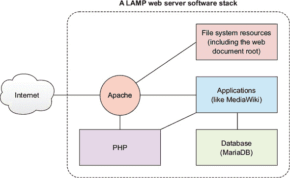
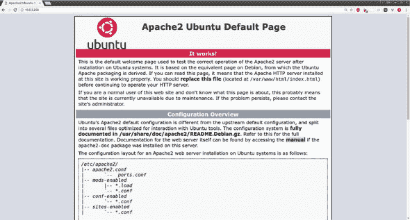
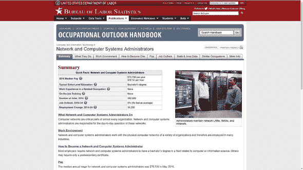
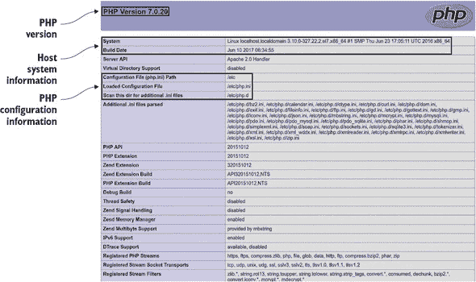
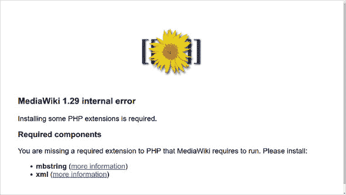
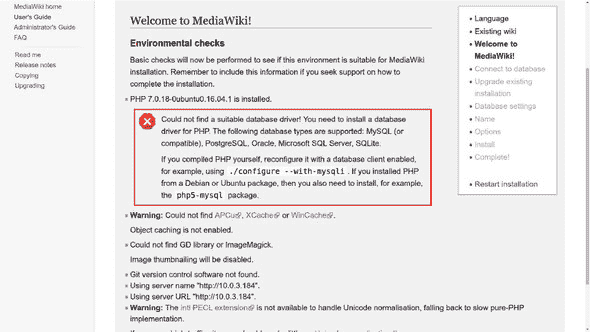
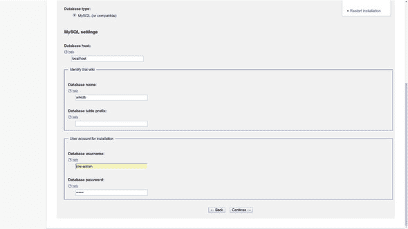
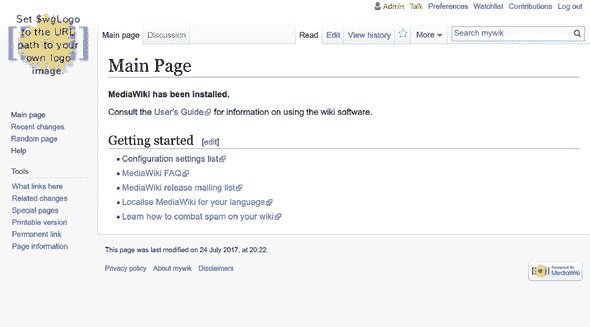
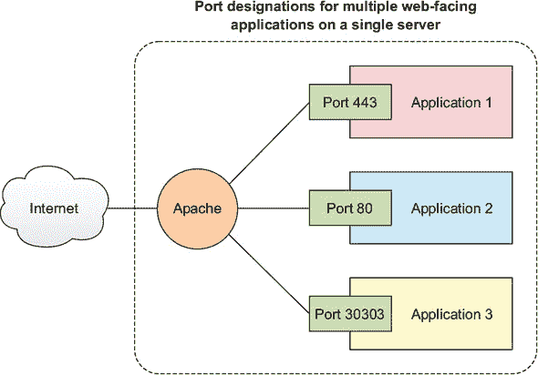
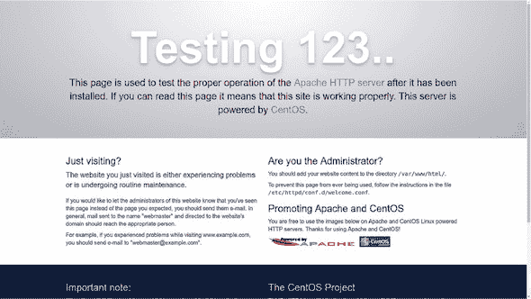

## 第七章\. 网络服务器：构建 MediaWiki 服务器

*本章涵盖*

+   使用 Apache 构建动态网络服务器

+   使用 SQL 数据库管理后端应用程序数据

+   识别和解决应用程序包依赖关系

+   安装和配置 MediaWiki CMS

你有一个小型公司博客要发布，或者有跨越 30 年、100,000 页的技术和公司数据？你需要某种内容管理系统（CMS）。如果你在好奇，*CMS*是一种设计为创建和管理数字内容框架的应用程序。你可能遇到的一些流行的 CMS 应用程序包括 WordPress 和 Joomla。

*维基*可以是一种特别有效的管理大量贡献者社区的方式。它是一种其架构有意地分散化的 CMS，允许用户不仅自由地协作于内容本身，还可以协作于整个数据集的更大结构。*维基引擎*是构建维基的平台，通常使用某种简单直观的标记语言。MediaWiki 是一个流行的开源维基引擎的例子，但 Atlassian Confluence 是一个成熟的商业替代品。

目前 MediaWiki 对我们来说可能并不那么重要。我之所以选择专注于安装 MediaWiki，是因为它是一个很好的说明在 Linux 上构建网络服务器（通常称为*LAMP 服务器*）的过程的方法。考虑到今天互联网上超过三分之二的网络服务器都在 Linux 上运行，这意义重大。

请不要误解：MediaWiki 并不缺乏魅力。毕竟，它是最初为支持构成维基百科和其他维基媒体基金会项目的数千万篇文章而创建的 CMS。如果你在寻找一种强大且可靠的方式来管理大量媒体内容，无论是记录你公司流程的私人收藏还是面向公众的帮助页面，MediaWiki 可能是一个不错的选择。但那些特定用例并不常见，不足以证明在像这本书这样的核心技能书中包含它们的合理性。

然而，通过 MediaWiki 的部署过程可以让你了解组成 Linux 网络服务器的软件包，以及它们如何组合起来使那些两到三个网站成为可能。作为一个 Linux 管理员，你很可能会被要求构建支持各种应用程序的网络服务器，因此你对学习如何做这些事情很感兴趣，对吧？

### 7.1\. 构建 LAMP 服务器

如果你或你的业务有信息、应用程序或服务，那么你很可能希望让它们可以通过网络浏览器进行访问。*网络服务器*是运行在计算机上的软件，它允许本地托管资源被网站访客查看和消费。为了明确，*网络服务器*这个术语也经常用来描述托管网络服务器软件的计算机。

| |
| --- |

**静态还是动态网站？**

本节将指导您构建一个**动态**网站的过程。这是一个通过服务器端操作生成页面的网站。也可以创建**静态**网站，这类网站大部分只提供纯 HTML 文件，并将所有工作委托给客户端的网页浏览器。

对于更简单的网站，静态网站可以是一个快速且经济的选择。但鉴于这与 Linux 无关，我在这里就不再多说了。另一方面，我的《一个月午餐时间学习亚马逊网络服务》（Manning，2017）的第六章（Chapter 6）中，有一个很好的使用 AWS 的 S3 来托管静态网站的演示。

| |
| --- |

如图 7.1 所示，大多数 Linux 网络服务器都是建立在所谓的 LAMP 服务器的基础之上。*LAMP*代表 Linux、Apache 网络服务器管理软件、MySQL 或 MariaDB 数据库引擎，以及 PHP 服务器端脚本语言（或者，也可以是 Perl 或 Python）。除了 Linux（希望您已经熟悉）之外，这些内容将是本章的重点。

##### 图 7.1. Apache 网络服务器软件向外部客户端暴露基于 HTTP 的资源，并协调内部服务。



LAMP 服务器是一种常见的 Linux 配置，至少 Ubuntu 有它自己的安装元包。这个例子末尾的撇号（`^`）标识目标为一个特殊包，捆绑在一起以简化常见软件堆栈的安装：

```
# apt install lamp-server^
```

那条命令会在您创建数据库密码后，自动在您的系统上创建一个工作的网络服务器，除了创建一些网站内容外，您无需做任何事情。将您的网页浏览器指向服务器的 IP 地址应该会显示 Apache 安装时创建的欢迎页面。

但自动化并不总是最佳解决方案。有时您可能需要通过指定特定的发布版本来自定义软件堆栈，以确保应用程序兼容性，或者通过替换一个包来替代另一个（例如，您很快就会看到，MariaDB 替代 MySQL）。在这种情况下，手动设置将特别有用，因为它会迫使您更好地理解每个部分是如何工作的。这就是我在本章中采取的方法。以下是需要完成的任务列表，以帮助您达到目标：

1.  安装 Apache

1.  在网页文档根目录中添加一个或两个网页

1.  安装一个 SQL 引擎（在本例中为 MariaDB）

1.  安装 PHP 服务器端脚本语言

1.  安装和配置 MediaWiki

### 7.2. 手动设置 Apache 网络服务器

网络服务器软件的主要任务是指引网站访客访问服务器主机上的正确目录和文件，因此应提供适当的网站资源。从实际角度来说，在浏览器地址栏中输入统一资源定位符（URL）地址实际上是对运行在远程网站主机上的网络服务器软件的请求，以从主机文件系统中检索网页、视频或其他资源并将其加载到您的浏览器中。网络服务器软件通常会与主机服务器上的其他系统紧密集成，如网络、安全和文件系统工具，以确保对本地资源的良好管理。

尽管这是一个波动很大的市场，但开源的 Apache HTTP 服务器通常在所有平台上主导着网络服务器市场。由于它非常受欢迎，尽管 Apache 有包括 Nginx（也是跨平台）和微软的 IIS（仅在 Windows 服务器上运行）在内的严重竞争对手，我仍然会坚持使用 Apache。（拜托。你真的认为我会用整整一章来介绍 IIS 吗？）

#### 7.2.1。在 Ubuntu 上安装 Apache 网络服务器

安装 Apache 本身很简单。在 Debian/Ubuntu 上，使用`apt install apache2`。如果您正在 Ubuntu 机器上操作，一旦安装了 Apache，就没有什么阻止您立即打开浏览器并访问您的实时网站了。您将看到图 7.2 中显示的介绍页面。

| |
| --- |

##### 注意

您将使用的 URL 来访问在您的工作站上运行的 Apache 网站是*localhost*。如果您选择在 LXC 容器或 VirtualBox 虚拟机（VM）上工作，那么您将使用机器的 IP 地址作为 URL。为了确保您将能够访问在 VirtualBox VM 上运行的网络站点，请确保它配置为使用桥接适配器（就像您在第二章中做的那样）。

| |
| --- |

##### 图 7.2。当浏览器指向您的服务器 URL 或 IP 地址时，显示的 Apache 默认页面包括一些重要的基本配置和导航信息。



Ubuntu 让事情变得简单。但那样有什么乐趣呢？再次强调，学习如何在 CentOS 上工作将帮助您理解底层发生了什么。即使您现在没有运行 CentOS、Fedora 或 Red Hat 的虚拟机（VM）或容器，我也建议您至少熟悉 CentOS 的工作方式。

本章中您将看到的 CentOS 进程与 Ubuntu 的不同。为了清晰起见，我决定将它们分开，将所有 CentOS 说明放在自己的部分：7.6。如果您打算在 CentOS 上安装 Apache，请前往那里获取详细信息。

#### 7.2.2。填充您的网站文档根目录

太棒了！您已经拥有了一个运行中的网站。考虑到网站上除了 Apache 欢迎页面外没有其他内容，不要期望赢得任何奖项（或产生太多收入）。您将需要添加一些内容。为此，您需要知道内容放在哪里。

内容的位置由 Apache 配置文件中的 DocumentRoot 设置控制。在 CentOS 系统上，配置设置在 /etc/httpd/conf/ 目录下的 httpd.conf 文件中。Ubuntu 用户将在 /etc/apache2/sites-available/ 目录下的一个名为 000-default.conf 的文件中找到它。无论如何，在配置文件中搜索 DocumentRoot 可能会显示类似这样的值：

```
DocumentRoot "/var/www/html"
```

这意味着 Apache 将将所有传入的浏览器请求都指向 /var/www/html/ 目录下的文件。你可以更改这个值，使其指向你文件系统上的任何位置。实际上，尽管这不是本书的主题，如果你计划在服务器上托管多个网站，你可以将多个文件系统位置指向这些网站。

如果你以前从未这样做过，为什么不现在花几分钟时间构建一个简单的个人网站呢？在你的文档根目录中创建一个名为 index.html 的文本文件。（此文件将使用相同名称覆盖 Apache 的欢迎页面。）你可以在文件中输入自己的欢迎文本，并添加一个指向第二个 HTML 文件和图形图像的链接。确保创建那个第二个文件以及图像。index.html 文件可能看起来像这样：

```
<h2>Welcome!</h2>
Take a look at our <a href="info.html">company history</a>.
<br>
And how about a look at our new company logo: 
```

### 7.3\. 安装 SQL 数据库

快速浏览一下美国政府的劳工统计局（BLS）职业展望手册页面，针对网络和计算机系统管理员（[`mng.bz/kHN3`](http://mng.bz/kHN3)），如图 7.3 所示。[#ch07fig03]。考虑到每个页面的九个标签页上显示的所有内容，文本量相当大。但我怀疑其中非常少的内容是由人类手动添加到这个页面的。

##### 图 7.3\. 劳动力统计局的一页。网络和计算机系统管理员做什么的标题可能是由类似这样的内容扩展而来：$selected_occupation 做什么。



更可能的情况是，BLS 服务器上的数据库包含数以兆字节的数据，其中包含与所包含的成千上万种职业相关的结构化信息。这些数据可能随后按信息类别（摘要、工作环境等）进行组织。当我从 BLS 菜单（或通过互联网搜索引擎）请求这个页面时，BLS 网络服务器可能已从数据库中请求相关原始数据，并按你在 图 7.3 中看到的方式动态组织在页面上。

网站可以利用动态访问后端安装的数据库引擎的许多其他方式，但这只是一个很好的示例。在类似 BLS 的项目（或我们的 MediaWiki 网站）中可能使用的数据库引擎类型被称为 *关系数据库*，这是一种将数据组织成由列和行组成的表格的工具。单个行中的数据称为 *记录*。记录通过一个称为 *键* 的 ID 值来识别，它可以用来在表之间引用记录。

*结构化查询语言*（SQL）是管理关系数据库中数据的标准语法。*数据库引擎*是用于管理关系数据库数据并将其通过 SQL 语法暴露给管理员和自动化过程的软件。

我将很快向你展示如何创建和显示一个简单的数据库表。但首先，你必须安装自己的数据库引擎，这样你才能亲自跟随操作。因为我们的长期目标是完整的 LAMP 服务器，所以将它安装在你构建 Apache 网络服务器相同的计算机/VM/容器上是有意义的。（CentOS 的方法可以在本章末尾找到。）

```
# apt update
# apt install mariadb-server            *1*
```

+   ***1* 在你的服务器上安装 MariaDB。**

为什么我选择 MariaDB 而不是 MySQL？它们都遵循完全相同的 MySQL 标准。事实上，它们最初都是由同一群人创建的。两者都很好，但至少目前，MariaDB 似乎得到了更活跃的开发和支持。除了这两个之外，还有其他重要的 SQL 数据库引擎在 IT 世界中广泛使用，包括 Oracle、PostgreSQL 和专为 AWS 工作负载构建的 Amazon Aurora。

为什么不检查你刚刚安装的数据库（DB）的状态？你可以使用`systemctl`来确认数据库正在运行：

```
# systemctl status mysql                                      *1*
? mysql.service - MySQL Community Server
   Loaded: loaded (/lib/systemd/system/mysql.service;
       enabled; vendor preset: enabled)
   Active: active (running) since Wed 2018-05-02 12:26:47 UTC; 6h ago
  Process: 396 ExecStartPost=/usr/share/mysql/mysql-systemd-start post
       (code=exited, status=0/SUCCESS)
  Process: 318 ExecStartPre=/usr/share/mysql/mysql-systemd-start pre
       (code=exited, status=0/SUCCESS)
 Main PID: 395 (mysqld)
    Tasks: 28
   Memory: 126.3M
      CPU: 20.413s
   CGroup: /system.slice/mysql.service
           ??395 /usr/sbin/mysqld

May 02 12:26:29 base systemd[1]: Starting MySQL Community Server...
May 02 12:26:47 base systemd[1]: Started MySQL Community Server.
```

+   ***1* 无论你安装了 MySQL 还是 MariaDB，Linux 都使用 mysql 命令来引用数据库。**

#### 7.3.1\. 强化 SQL

一旦安装了 MariaDB，强化数据库安全性总是一个好主意，因此你将需要运行 mysql_secure_installation 工具。如果你在安装过程中没有被提示创建 root MariaDB 密码（这种情况相当常见），那么你需要运行 mysql_secure_installation，因为这也是你设置认证的方式。运行此工具将显示以下交互式对话框：

```
# mysql_secure_installation                                            *1*

NOTE: RUNNING ALL PARTS OF THIS SCRIPT IS RECOMMENDED FOR ALL MariaDB
      SERVERS IN PRODUCTION USE!  PLEASE READ EACH STEP CAREFULLY!

In order to log into MariaDB to secure it, we'll need the current
password for the root user.  If you've just installed MariaDB, and
you haven't set the root password yet, the password will be blank,
so you should just press enter here.

Enter current password for root (enter for none):                      *2*
OK, successfully used password, moving on...

Setting the root password ensures that nobody can log into the MariaDB
root user without the proper authorisation.

Set root password? [Y/n]
```

+   ***1* 注意，此命令可能需要 sudo 权限，这可能会在以后造成麻烦。请保持关注。**

+   ***2* 输入数据库 root 用户的密码，而不是 Linux root 用户的密码。**

mysql_secure_installation 推荐的价值旨在防止匿名和远程用户访问你的数据。除非你计划仅为此数据库进行测试，并且它不会包含重要或敏感数据，否则你将希望接受默认设置。


##### 注意

如果 mysql_secure_installation 仅在以 sudo 运行时才起作用，那么请以此方式创建你的密码。但请记住，这将导致一个以后需要解决的问题。你将在下一节中看到如何解决这个问题。


#### 7.3.2\. SQL 管理

现在，如承诺的那样，我将向你展示一些简单的数据库管理命令。实际上，你可能永远不需要直接运行这些命令，因为大多数数据库都是从应用程序代码中访问的，而不是从命令行。考虑到手动管理 SQL 数据库中常见的数千甚至数百万条数据记录是多么不方便，这很有道理。你将在本章稍后安装和配置 MediaWiki 时看到这个自动化的应用程序/数据库关系的完美示例。

仍然，有时你可能需要手动创建自己的数据库。也许当你组装一个新应用程序时，你需要一些测试数据来工作。或者，也许你的新业务起步缓慢，与其投资新应用程序，不如现在手动管理客户更有意义。至少你应该知道如何操作。

如果你觉得自己现在还不足以深入数据库，可以自由跳转到第 7.4 节。但在你离开之前，还有一件更重要的事情我应该谈谈。

默认情况下，你将使用 root 用户访问和管理你的 MariaDB 或 MySQL 安装中的数据库。这可不是什么好主意。出于安全原因，应该由只有完成特定工作所需权限的常规数据库用户拥有和管理各个数据库。然而，为了演示的简便，我将冒险使用 root 用户。稍后，当我向你展示如何设置 MediaWiki 数据库时，我会正确地创建一个非 root 用户。

##### 访问数据库

无论你安装了 MariaDB 还是 MySQL，你都应该使用`mysql`登录到你的 shell，后面跟着`-u root`。这告诉数据库你想要以 root 用户身份进行身份验证。`-p`表示你将被提示输入你的 MariaDB 密码：

```
$ mysql -u root -p                                            *1*
Enter password:
Welcome to the MariaDB monitor.  Commands end with ; or \g.
Your MariaDB connection id is 10
Server version: 5.5.52-MariaDB MariaDB Server

Copyright (c) 2000, 2016, Oracle, MariaDB Corporation Ab and others.

Type 'help;' or '\h' for help. Type \c to clear the current input statement

MariaDB [(none)]>                                             *2*
```

+   ***1* 通过指定用户登录，并提示输入用户的密码。**

+   ***2* [(none)]的值将更改为活动数据库的名称。**

这里就是之前暗示的麻烦可能浮现的地方。MariaDB 可能不会让你登录，除非你以`sudo`运行`mysql`命令。如果发生这种情况，使用`sudo`登录并提供你创建的 MariaDB 密码。然后在这些 MySQL 提示符下运行这三个命令（用`your-password`替换你的密码）：

```
> SET PASSWORD = PASSWORD('your-password');
> update mysql.user set plugin = 'mysql_native_password' where User='root';
> FLUSH PRIVILEGES;
```

下次你登录时，你应该不再需要`sudo`，更重要的是，MediaWiki 应该能够正确地完成其工作。解决了这个小麻烦后，看看你的 SQL 环境。这是创建新数据库的方法：

```
MariaDB> CREATE DATABASE companydb;          *1*
```

+   ***1* 大多数 MySQL 命令必须以分号 (;) 结尾。忘记这一点将阻止命令的执行。**

假设你的公司需要存储客户联系信息。你可以在数据库中创建一个新的联系人表，如下所示：

```
MariaDB> use companydb
MariaDB> CREATE TABLE Contacts (
    ID int,
    LastName varchar(255),
    FirstName varchar(255),
    Address varchar(255),
    City varchar(255)
);                              *1*
```

+   ***1* 这是单个命令的最后部分，为了清晰起见，被扩展到七行。**

刚刚获得第一个客户？恭喜！以下是输入新信息的方法：

```
MariaDB> INSERT INTO Contacts (ID, LastName, FirstName, Address, City)    *1*
VALUES ('001', 'Torvalds', 'Linus', '123 Any St.', 'Newtown');
```

+   ***1* 这行定义了表格中哪些列将添加新值。**

想看看你做了什么？要显示你新创建的 `Contacts` 表中的所有数据，请输入 `select *`：

```
MariaDB> select * from Contacts;
+------+----------+-----------+-------------+---------+
| ID   | LastName | FirstName | Address     | City    |
+------+----------+-----------+-------------+---------+
|    1 | Torvalds | Linus     | 123 Any St. | Newtown |
+------+----------+-----------+-------------+---------+
1 row in set (0.00 sec)
```

注意你表中的 ID 值，它可以作为你记录的关键值。当你完成所有操作后，你可以通过输入 `exit` 命令关闭 MariaDB shell。

如果，如我之前提到的，你可能永远不需要手动执行任何这些任务，为什么还要在这里阅读它呢？因为，为了将自动化操作与你的数据库集成，你几乎肯定需要在脚本和应用程序代码中包含 MySQL 语法的变体。即使是简单的网络购物门户也依赖于外部数据。你可能不是编写代码的人，但几乎可以肯定的是，你认识或爱的人会，他们可能需要你的帮助来建立数据库连接。这对于不知疲倦的 Linux 系统管理员来说，是日常工作中的一部分。

##### 创建 MediaWiki 数据库用户

还有另一项数据库管理任务。正如你所看到的，MariaDB 默认附带一个活跃的 root 用户。但由于该用户拥有对系统所有表的完全管理权限，因此使用 root 进行日常操作并不是一个好主意。从安全角度考虑，你最好为每个数据库消费者创建唯一的用户，并只授予他们所需的访问权限。

让我们再次登录到 MariaDB，并为 MediaWiki 创建一个名为 `wikidb` 的新数据库，以便稍后使用。然后，你将创建一个名为 mw-admin 的用户。`FLUSH PRIVILEGES` 命令启用新设置，并授予 mw-admin 用户对 `wikidb` 数据库的完全控制权：

```
mysql> CREATE DATABASE wikidb;
Query OK, 1 row affected (0.01 sec)
mysql> CREATE USER 'mw-admin'@'localhost' IDENTIFIED BY 'mypassword';
Query OK, 0 rows affected (0.00 sec)
mysql> GRANT ALL PRIVILEGES ON wikidb.* TO 'mw-admin'@'localhost'
   IDENTIFIED BY 'mypassword';
mysql> FLUSH PRIVILEGES;
Query OK, 0 rows affected (0.00 sec)
mysql> exit
```

### 7.4\. 安装 PHP

LAMP 的最后一个组成部分是 PHP 脚本语言。*PHP* 是一个可以用来编写你自己的网络应用程序的工具。预构建的 PHP 应用程序通常被第三方应用程序（如 MediaWiki）用来访问和处理系统资源。因此，可以安全地假设，你将需要在你的 LAMP 服务器中用到 *P*。

#### 7.4.1\. 在 Ubuntu 上安装 PHP

尽管你迄今为止看到的示例可能表明，Ubuntu 安装并不总是比 CentOS 简单。但这里有一个任务，使用 Ubuntu 方式会更快完成。想要最新的 PHP 吗？在 Ubuntu 上只需执行 `apt install php` 命令，它就能满足你的需求。因为你希望它与 Apache 顺利协作，所以你还需要一个扩展：

```
# apt install php
# apt install libapache2-mod-php
```

你应该养成在更改网络服务器系统配置时重启 Apache 的习惯。以下是方法：

```
# systemctl restart apache2
```

就这些。PHP 现在应该已经启动了。

#### 7.4.2\. 测试 PHP 安装

为了确保您的 PHP 安装是活跃的（并且了解 PHP 的本地环境和资源集成），在 Apache 网络文档根目录下创建一个新的文件，使用 .php 文件扩展名。然后按照以下所示填充文件的剩余行文本：

```
# nano /var/www/html/testmyphp.php
<?php
phpinfo();
?>
```

现在转到浏览器，输入运行 PHP 的机器的 IP 地址（或者如果您正在工作的桌面，则为 localhost）以及您创建的文件名：

```
10.0.3.184/testmyphp.php
```

您将看到一个长网页（就像您在 图 7.4 中看到的那样），分为多个部分，描述了您的计算机以及 PHP 与其通信的方式。

| |
| --- |

##### 注意

完成后，请确保删除或限制对 testmyphp.php 文件的访问。将此类有关您系统的信息公之于众是一种严重的安全漏洞。

| |
| --- |

##### 图 7.4. `phpinfo` 显示的配置和环境数据的小样本



与之前一样，在 CentOS 上完成所有这些操作将在以后进行。现在，让我们为 MediaWiki 创建一个专用的数据库。

### 7.5. 安装和配置 MediaWiki

有文档和媒体要共享（就像我们在本章开头讨论的那样）？您来对地方了。以下是该过程的分解：

1.  下载并解压 MediaWiki 存档包

1.  识别和安装必要的软件扩展

1.  将 MediaWiki 连接到您的 MariaDB 数据库

1.  运行并测试安装。

转到 MediaWiki 下载页面 ([www.mediawiki.org/wiki/Download](http://www.mediawiki.org/wiki/Download))，点击下载 MediaWiki 以获取最新包。如果您更愿意通过命令行直接将文件拉入您的服务器，可以右键单击下载链接，选择复制链接地址，并将地址粘贴到终端窗口中，包括 wget 程序：

```
$ wget https://releases.wikimedia.org/mediawiki/1.30/\
    mediawiki-1.30.0.tar.gz                               *1*
```

+   ***1* 当您阅读此内容时，确切的地址（和版本）可能已经更改。**

| |
| --- |

##### 注意

如果在运行上一条命令时遇到 `-bash: wget: Command Not Found` 错误，那么您需要安装 wget。

| |
| --- |

使用 `tar` 对下载的存档进行操作将创建一个包含所有提取的文件和目录的新目录。您需要将整个目录层次结构复制到文件系统中的工作位置。如果 MediaWiki 将是您服务器上唯一的网络应用程序，那么这很可能意味着您的网络根目录：

```
$ tar xzvf mediawiki-1.30.0.tar.gz
$ ls
mediawiki-1.30.0  mediawiki-1.30.0.tar.gz
# cp -r mediawiki-1.30.0/* /var/www/html/
```

如果 MediaWiki 只是一系列应用程序中的一个，那么您可能希望在文档根目录内创建一个子目录，以便以实用和可预测的方式公开服务。例如，将文件放入名为 /var/www/html/mediawiki/ 的目录中，这意味着您的用户将在 www.example.com/mediawiki 找到 MediaWiki，假设您正在使用 example.com 作为您的公共域名。

从这个点开始，MediaWiki 的浏览器界面接管了。将你的浏览器指向服务器 IP 地址上 MediaWiki 目录中的 index.php 文件（如果你在桌面上运行所有这些，则是 localhost）。如果你将文件复制到了/var/www/html/根目录，那么它看起来可能像这样：

```
10.0.3.184/index.php
```

如果，相反，你为 MediaWiki 创建了一个子目录，它可能看起来像这样：

```
10.0.3.184/mediawiki/index.php
```

通常，当我第一次安装应用程序时，我会遵循一个优秀的在线指南的指示，最好是项目开发者自己创建和维护的。很多时候，这样的指南会给我提供一个长长的包依赖列表，我会快速阅读（通常读得太快）然后复制粘贴到`apt install`命令中。

然而，这次，我倒转了整个过程，只安装了 Apache、MariaDB 和 PHP 包的基础部分。我知道这不会给 MediaWiki 提供足够的工作环境，这正是我想要的。还有什么更好的方法来了解所有复杂的部分应该如何组合在一起呢？

#### 7.5.1\. 解决缺失扩展的问题

设计 MediaWiki 设置过程的人们明智地理解到事情并不总是顺利。如果发现你的配置中缺少某些东西，而不是默默失败，你会得到一个包含有用信息的错误页面。在这个例子中，如图 7.5 所示，我似乎缺少几个 PHP 扩展：mbstring 和 xml。

##### 图 7.5\. 一个有用的错误页面告诉我我的系统缺少两个扩展，并提供适当的 PHP 文档页面链接



我将使用`apt search`来查看哪些包与 mbstring 相关。由于我运行的是 PHP 7，php7.0-mbstring 包似乎是最有可能让 MediaWiki 的华丽面容重现笑容的：

```
$ apt search mbstring
Sorting... Done
Full Text Search... Done
php-mbstring/xenial 1:7.0+35ubuntu6 all
  MBSTRING module for PHP [default]

php-patchwork-utf8/xenial 1.3.0-1build1 all
  UTF-8 strings handling for PHP

php7.0-mbstring/xenial-updates 7.0.18-0ubuntu0.16.04.1 amd64
  MBSTRING module for PHP                                      *1*
```

+   ***1* 为 PHP 7 提供多字节字符串编码**

对 xml 和 php（`apt search xml | grep php`）的类似搜索告诉我有一个名为 php7.0-xml 的包似乎可以满足 MediaWiki 的 XML 需求。我将安装这两个包，然后使用`systemctl`重新启动 Apache：

```
# apt install php7.0-mbstring php7.0-xml
# systemctl restart apache2
```

所有这一切工作方式的美好之处在于，你（和我）不需要理解多字节字符串编码或甚至 XML 是什么，以及为什么 MediaWiki 没有它们会感到如此完全迷失。只要我们能信任应用程序的开发者，遵循他们的指示就没有什么问题。这假设我们能信任应用程序的开发者，而这往往很难评估。整个 Linux 软件包管理系统背后的哲学建立在这样一个前提上：官方仓库的管理者已经为我们完成了审查工作。这取决于我们希望他们是正确的。

回到我们的例子，如果一切按计划进行，刷新浏览器页面应该会带你回到最初的 MediaWiki 简介页面。当页面加载时，你会看到一个关于缺少 LocalSettings.php 文件的警告和一个设置维基的链接。当你点击链接时，你可以选择语言偏好，然后是 MediaWiki 环境检查页面和...更多麻烦！

最大的问题是缺少一个*数据库驱动程序*。这将是用于在 PHP 和我们的案例中 MariaDB 之间协商的软件。没有安装它确实是一个杀手。尽管图 7.6 中显示的建议包是 php5-mysql，但`apt search`告诉我们，我们更有可能使用 php-mysql 包成功。

##### 图 7.6。明亮的*x*表示我们配置中的一个阻止性的漏洞；其他注释提供了不那么严重的警告。



还应包括为 APCu（缓存和优化 PHP 中间代码的框架的一部分）和 ImageMagick（一个图像处理工具）建议的 PHP 扩展。重新启动 Apache 并刷新浏览器窗口，你应该就绪了：

```
# apt install php-mysql php-apcu php-imagick
# systemctl restart apache2
```

你会在页面底部看到一个继续按钮。使用它。

#### 7.5.2. 将 MediaWiki 连接到数据库

你通过“连接到数据库”页面提供的信息告诉 MediaWiki：

+   你在系统上安装了什么类型的数据库（在这个例子中是 MySQL 或兼容的）

+   数据库所在的位置（它可以是远程的，甚至是基于云的，但这是在本地服务器上，所以`localhost`是正确的值）

+   你希望给 MediaWiki 将使用的数据库取的名字（我将使用我之前创建的 wikidb 数据库）

+   现有的数据库用户账户的名称（在这个例子中是 mw-admin）

+   当前数据库账户的密码（这允许 MediaWiki 访问 MariaDB 并创建和管理其数据库；参见图 7.7)

    ##### 图 7.7。MySQL 设置页面的一部分，其中你告诉 MediaWiki 如何连接到数据库

    


##### 注意

如果不起作用？如果 MediaWiki 无法连接到你的数据库，请确认你使用的是正确的密码，但也请确保你能够从命令行登录到 MariaDB shell。


如果一切顺利，你将进入一系列屏幕，在那里你可以输入配置细节，如数据库设置、你的维基的名称（例如，在这个例子中是公司文档）以及一个用户名、密码和维基管理员账户的联系方式。此账户与你在 Linux 主机或 MariaDB 上已有的账户无关。

一些可选的设置问题让你可以设置用户权限的偏好、维基内容的版权、发送通知邮件的邮件服务器以及添加诸如浏览器内 WikiEditor 或反垃圾邮件软件等附加软件扩展。除了可能的返回电子邮件地址外，默认值应该可以工作。

当你完成时，MediaWiki 将开始其安装过程。当安装完成时，它会提示你下载一个名为 LocalSettings.php 的文件，并将其保存到 MediaWiki 根目录（在这个例子中是 /var/www/html/）。你可以使用 `scp` 将你保存的文件复制到你的用户主目录：

```
$ scp LocalSettings.php ubuntu@10.0.3.184:/home/ubuntu/
```

然后，从服务器上的命令行中，将其移动到文档根目录：

```
# cp /home/ubuntu/LocalSettings.php /var/www/html/
```

一切准备就绪后，回到之前使用的浏览器页面（例如 10.0.3.184/index.php）。这次，正如你在 图 7.8 中可以看到的，你将发现自己在新创建的维基百科的主页上。从现在开始，你的任务就是开始用你智慧和经验的丰富果实来充实你的维基百科。

##### 图 7.8\. 你可以通过点击顶部的“编辑”标签来添加和编辑页面内容以及链接。



随意花些时间阅读 MediaWiki 用户指南 ([www.mediawiki.org/wiki/Help:Contents](http://www.mediawiki.org/wiki/Help:Contents))。在这里，你将学习如何处理文件以及如何使用简单的标记语言进行编写。

### 7.6\. 在 CentOS 上安装 Apache 网络服务器

如果你想要避免我们在 Ubuntu 安装过程中遇到的一些麻烦，考虑做一些预防性的研究，以找出 LAMP 拼图每个部分所需的精确版本。快速访问 MediaWiki 安装要求页面 ([`mng.bz/4Bp1`](http://mng.bz/4Bp1)) 应该会给你安装 Apache 网络服务器（或 CentOS 上的 httpd）所需的所有信息。一旦完成，获取软件就很简单了：

```
# yum install httpd
```

默认情况下，Apache 不会运行。你还记得如何在 systemd 中修复这个问题吗？不要偷看！我希望你已经猜到了：

```
# systemctl start httpd
# systemctl enable httpd
```

命令 `systemctl start` 启动服务，而 `enable` 则会在计算机启动时启动它。要确认 Apache 是否正在运行，你可以使用 `curl` 将网页打印到终端，指定 `localhost` 来告诉 `curl` 你想要的是本地正在提供的服务器默认页面。你可能需要安装 `curl`...我相信你现在应该没问题了。如果 `curl` 输出以这种方式开始的内容，那么 Apache 显然正在正常工作：

```
$ curl localhost
<!DOCTYPE html PUBLIC "-//W3C//DTD XHTML 1.1//EN"
  "http://www.w3.org/TR/xhtml11/DTD/xhtml11.dtd"><html><head>
<meta http-equiv="content-type" content="text/html; charset=UTF-8">
     <title>Apache HTTP Server Test Page
         powered by CentOS</title>                                        *1*
     <meta http-equiv="Content-Type" content="text/html; charset=UTF-8">
[...]
```

+   ***1* 这个 Apache 测试 index.html 页面的标题属性**

但这里有一个奇怪的现象：那个成功的 `curl` 命令意味着 Apache 正在运行，并且，希望你能知道，通过桥接适配器，你的计算机和 CentOS 虚拟机之间有网络连接。(第十四章 如果你在处理这个问题上有困难，将会很有帮助。)但你可能仍然无法从 GUI 浏览器中加载页面。你可能会遇到“无法访问此网站”的错误，而不是其他问题。问题出在哪里？

这个错误说明了 Ubuntu 哲学与 CentOS 的不同之处还有另一种有趣的方式。默认情况下，Ubuntu 没有安装任何类型的防火墙。（因为除了基本基础设施之外没有开放的网络服务，所以这并不像听起来那么疯狂。）Apache 一旦安装完毕，就准备好接受外部传入的流量。当然，有很多方法可以关闭网络访问以满足您的需求，但出厂时，您对全世界都是开放的。另一方面，CentOS 默认将所有端口都安全关闭。如果您想使您的 Web 服务器接收传入的 HTTP 请求，您首先需要打开 HTTP 端口（按照惯例，是端口 80）。

#### 7.6.1. 理解网络端口

顺便问一下，什么是*网络端口*？它不过是一种识别特定服务器资源给网络用户的方式。想象一下，您的服务器正在托管两个不同的应用程序。访客可以使用其公共 IP 地址或相应的 DNS 域名（如 google.com 的 172.217.1.174）来访问您的服务器。但浏览器如何知道您想加载哪个应用程序呢？

当指定一个预定的端口时，可以指示应用程序监听传入服务器的流量。因此，一个应用程序可以使用端口 50501，另一个应用程序使用端口 50502。如图 7.9 所示，第一个应用程序将使用 192.168.2.10:50501 响应传入请求（假设 192.168.2.10 是您的服务器 IP 地址），第二个应用程序将期望使用 192.168.2.10:50502 的流量。

##### 图 7.9.配置在单独网络端口上监听的应用程序（80 = 不安全的 HTTP；443 = 安全的 HTTPS；30303 = 自定义应用程序）



我们将在本书的后续章节中回到端口的问题，例如在第九章（kindle_split_017.xhtml#ch09）和第十四章（kindle_split_022.xhtml#ch14）。但您的 Web 服务器软件（如 Apache）将为您托管多个网站的服务器做大部分繁重的工作，自动将端口转换为本地文件系统位置。如果您考虑将您的 Web 服务器向多个网站开放，软件配置指南（如[`mng.bz/w6h4`](http://mng.bz/w6h4)）是您开始的地方。

#### 7.6.2. 控制网络流量

您如何控制对您网络的访问？一种方法是通过*防火墙规则*。在 CentOS 上，这通过 firewalld 服务和 firewall-cmd 工具来处理。在这种情况下，您需要添加`http`服务，并通过`--permanent`标志确保每次您重新启动服务或启动计算机时，规则都将生效。（我将在第九章（kindle_split_017.xhtml#ch09）中详细介绍防火墙。）要应用更改，请重新启动服务：

```
# firewall-cmd --add-service=http --permanent
success
# systemctl restart firewalld
```

完成这些后，您应该能够成功加载 CentOS 版本的 Apache 测试页面（图 7.10）。

##### 图 7.10. CentOS Apache Web 服务器的默认网页



#### 7.6.3\. 在 CentOS 上安装 MariaDB

再次强调，安装本身很简单。但是，您需要手动启动 MariaDB，然后使用 `enable` 命令来配置它在系统启动时加载：

```
# yum install mariadb-server
# systemctl start mariadb
# systemctl enable mariadb
```

从这里，您可以遵循之前作为 Ubuntu 安装过程一部分概述的 MariaDB 设置步骤。

#### 7.6.4\. 在 CentOS 上安装 PHP

在撰写本文时，通过 CentOS 仓库提供的 PHP 默认版本仍然是 5.4，这远远落后于 Ubuntu 仓库中可用的最新版本。问题是当前的 MediaWiki 版本（1.30）无法与低于 PHP 5.5.9 的任何版本兼容。到您阅读本文时，问题可能已经自行解决。如果没有，您将需要使用网络搜索来查找包含更新版本 PHP 的仓库以进行安装。

我不是提到这一点是因为 CentOS 目前恰好落后一个或两个版本，而是因为类似的事情经常发生；有许多重要的教训要学习。第一个教训是在安装之前始终检查软件包版本。所有 Linux 软件包管理器在您跳入之前都会提供各种信息。养成阅读的习惯。以下是 PHP 安装软件包的软件摘要信息：

```
# dnf install php
Using metadata from Sun Jul 23 10:37:40 2017
Dependencies resolved.
======================================================================
 Package        Arch         Version                Repository    Size
======================================================================
Installing:                                                              *1*
 libzip         x86_64       0.10.1-8.el7           base          48 k
 php            x86_64       5.4.16-42.el7          base         1.4 M   *2*
 php-cli        x86_64       5.4.16-42.el7          base         2.7 M
 php-common     x86_64       5.4.16-42.el7          base         564 k

Transaction Summary
======================================================================
Install  4 Packages

Total download size: 4.7 M
Installed size: 17 M
Is this ok [y/N]:                                                        *3*
```

+   ***1* dnf 在启动操作之前会显示安装摘要。**

+   ***2* 注意 dnf 默认将安装的 PHP 版本。**

+   ***3* 安装将在您明确授权之前不会开始。**

还需要记住的是，软件包的新版本和旧版本可以在仓库系统中同时存在。记住，您有选择权。同样，也要记住，最新的版本并不总是您想要的版本。这可能是因为您正在使用的另一个应用程序可能与该软件包的最新版本不兼容，或者因为新版本可能对您的项目来说不够稳定或安全。

| |
| --- |

##### 注意

有很大可能性您将来可能需要安装不属于官方 Linux 仓库的软件包。这既不是犯罪也不是不道德的行为，因此您没有必要感到内疚。但您应该意识到您将完全负责确保与其他服务和应用程序的兼容性得到维护，以及您的非仓库软件包和配置在系统更新中能够生存。当然，您还必须格外小心，确保该软件包本身不包含恶意软件。

| |
| --- |

无论您是否使用官方的 CentOS PHP 仓库版本，您可能都需要手动添加单个模块以支持您预期的操作。遵循在线指南来设置这些设置将非常有用。但您可以使用 `yum search php-` 来检查可用的模块，然后使用 `yum info` 和一个有趣的选项名称来了解更多关于特定软件包的信息：

```
# yum search php- | grep mysql                                      *1*
php-mysql.x86_64 : A module for PHP applications that use
   MySQL databases                                                  *2*
php-mysqlnd.x86_64 : A module for PHP applications that use
   MySQL databases
php-pear-MDB2-Driver-mysql.noarch : MySQL MDB2 driver
php-pear-MDB2-Driver-mysqli.noarch : MySQL Improved MDB2 driver
[...]
# yum info php-mysql.x86_64                                         *3*
Available Packages
Name        : php-mysql                                             *4*
Arch        : x86_64
Version     : 5.4.16
Release     : 42.el7
Size        : 101 k
Repo        : base/7/x86_64
Summary     : A module for PHP applications that use MySQL databases
URL         : http://www.php.net/
License     : PHP
Description : The php-mysql package contains a dynamic shared object
            : that will add MySQL database support to PHP. MySQL is
            : an object-relational databasemanagement system. PHP is
            : an HTML-embeddable scripting language. Ifyou need MySQL
            : support for PHP applications, you will need to install
        : this package and the php package.
```

+   ***1* 因为已经安装了类似 MySQL 的数据库，所以查找相关模块是有意义的。**

+   ***2* 64 位架构的 php-mysql 软件包**

+   ***3* 使用 yum info 了解有关有趣软件包的更多信息。**

+   ***4* 这是您将使用 yum 安装模块的软件包名称。**

安装 PHP 和任何额外的 PHP 模块后，重新启动 Apache 以确保 Apache 能够将新模块纳入其服务：

```
# systemctl restart httpd.service
```

如本章前面所述的 Ubuntu 设置过程中所描述的，使用 `phpinfo` 确认 PHP 是否正确安装。

### 摘要

+   Web 服务器软件包，如 Apache，协调系统资源（如数据库和文件）之间的连接，并将网站资源暴露给客户端。

+   可用的软件包版本在不同 Linux 发行版之间可能会有所不同，您需要的发布版本可能取决于您的特定项目。

+   软件包依赖关系可以通过包管理系统（如 APT 和 Yum）提供的搜索工具和元数据来满足。

+   应用程序通常需要访问数据库引擎，因此需要提供有效的身份验证信息。

### 关键术语

+   *Wiki* 是一种用于创建和管理分布式、协作项目的工具。

+   *内容管理系统*（CMS）是一种应用程序，旨在使创建、共享和编辑数字内容变得容易。

+   *Web 服务器* 是一种软件，旨在安全可靠地将服务器资源暴露给远程客户端。

+   *DocumentRoot* 是 Apache 设置，它确定 Web 服务器在文件系统中查找网站文件的位置。

+   *结构化查询语言*（SQL）是用于管理关系数据库中数据的语法。

+   *软件包依赖关系* 是安装的应用程序正常功能所需的程序或扩展。

### 安全最佳实践

+   确保您的系统防火墙设置允许适当的客户端访问系统资源，但阻止所有其他请求。

+   在大多数情况下，允许远程 root 访问数据库不是一个好主意。

+   永远不要在面向公众的网站上暴露运行 `phpinfo` 的文件。

### 命令行审查

+   `apt install lamp-server^`（单个 Ubuntu 命令）安装 LAMP 服务器的所有元素。

+   `systemctl enable httpd` 在 CentOS 机器上每次系统启动时启动 Apache。

+   `firewall-cmd --add-service=http --permanent` 允许 HTTP 浏览器流量进入 CentOS 系统。

+   `mysql_secure_installation` 重置您的 root 密码并加强数据库安全性。

+   `mysql -u root -p` 以 root 用户登录 MySQL（或 MariaDB）。

+   `CREATE DATABASE newdbname;` 在 MySQL（或 MariaDB）中创建一个新的数据库。

+   `yum search php- | grep mysql` 在 CentOS 机器上搜索与 PHP 相关的可用软件包。

+   `apt search mbstring` 在系统中搜索与多字节字符串编码相关的可用软件包。

### 测试自己

> **1**
> 
> 您需要安装以下哪个软件包来为 LAMP Web 服务器提供数据库？
> 
> 1.  mariadb
> 1.  
> 1.  httpd
> 1.  
> 1.  mariadb-client
> 1.  
> 1.  mariadb-server
> 1.  
> **2**
> 
> 哪个平台允许在浏览器客户端和服务器上的数据资源之间建立网络连接？
> 
> 1.  Apache
> 1.  
> 1.  Perl
> 1.  
> 1.  PHP
> 1.  
> 1.  systemctl
> 1.  
> **3**
> 
> `localhost` 是一个用于调用的标识
> 
> 1.  远程客户端的 DocumentRoot
> 1.  
> 1.  运行命令的服务器上的 DocumentRoot
> 1.  
> 1.  网络服务器上的 .conf 文件
> 1.  
> 1.  主服务器上的默认 HTTP 端口
> 1.  
> **4**
> 
> 默认情况下，Apache 网络服务器的 DocumentRoot 在哪里？
> 
> 1.  /var/www/html/
> 1.  
> 1.  /var/html/www/
> 1.  
> 1.  /etc/apache2/
> 1.  
> 1.  /home/username/www/html/
> 1.  
> **5**
> 
> 以下哪个命令允许通过端口 80 将网络浏览器流量引入 CentOS 网络服务器？
> 
> 1.  `firewalld --add-service=http`
> 1.  
> 1.  `firewall-cmd --add-service=https`
> 1.  
> 1.  `firewall --add-service=https`
> 1.  
> 1.  `firewall-cmd --add-service=http`
> 1.  
> **6**
> 
> 以下哪个命令可以让你成功登录到你的 MariaDB 命令行界面？
> 
> 1.  `mariadb -u root`
> 1.  
> 1.  `mysql root -p`
> 1.  
> 1.  `mariadb -r -p`
> 1.  
> 1.  `mysql -u root -p`
> 1.  
> **7**
> 
> 以下哪个 `yum` 命令可以显示指定软件包的上下文数据？
> 
> 1.  `yum search php-mysql.x86_64`
> 1.  
> 1.  `yum describe php-mysql.x86_64`
> 1.  
> 1.  `yum info php-mysql.x86_64`
> 1.  
> 1.  `yum data php-mysql.x86_64`
> 1.  
> **8**
> 
> 以下哪个工具是运行 MediaWiki 在 LAMP 服务器上的可选工具？
> 
> 1.  php-mysql
> 1.  
> 1.  mbstring
> 1.  
> 1.  php-imagick
> 1.  
> 1.  php7.0-xml

#### 答案键

> **1.**
> 
> d
> 
> **2.**
> 
> a
> 
> **3.**
> 
> b
> 
> **4.**
> 
> a
> 
> **5.**
> 
> d
> 
> **6.**
> 
> d
> 
> **7.**
> 
> c
> 
> **8.**
> 
> c
