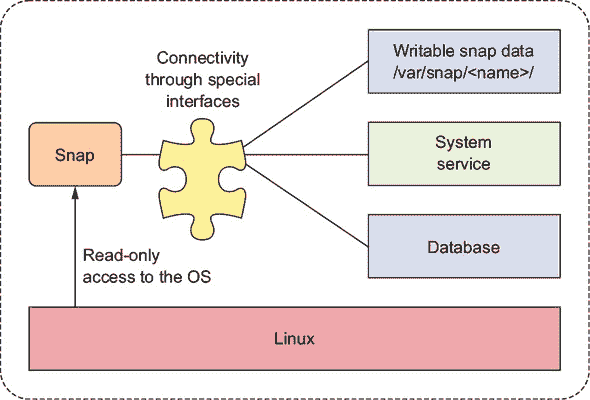
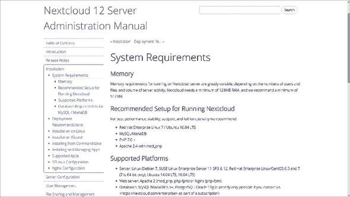
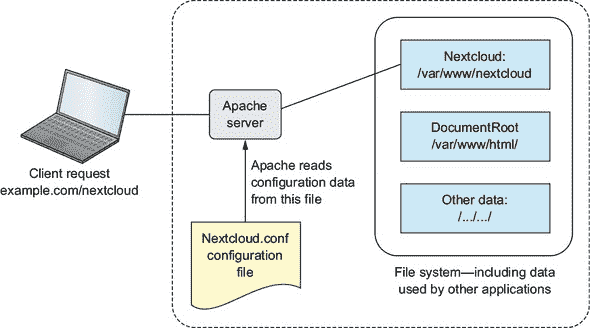
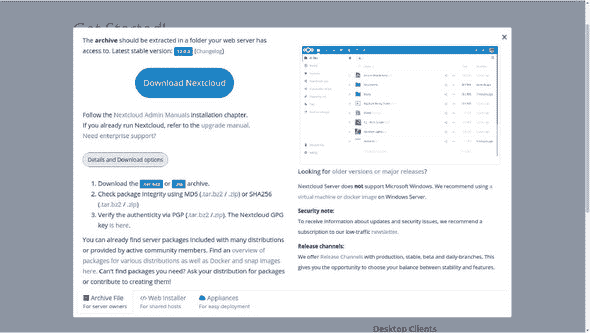
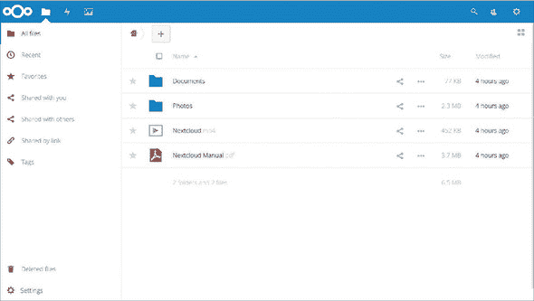
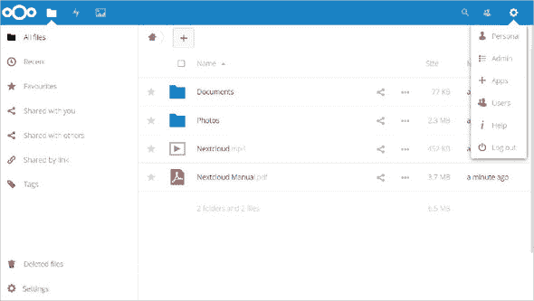
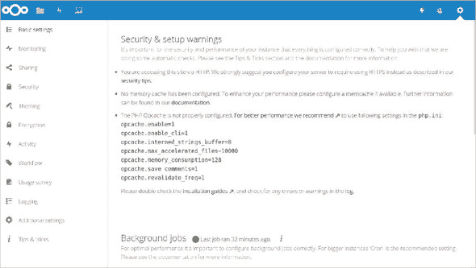
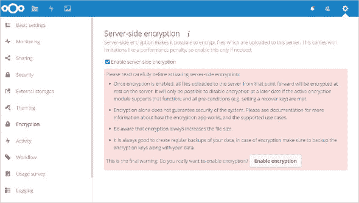
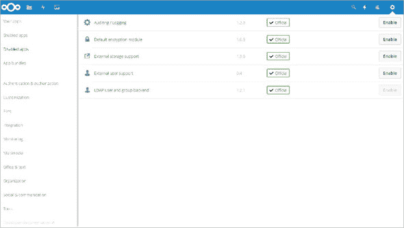
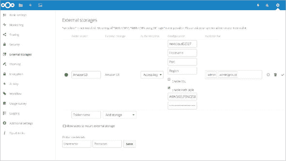

## 第八章. 网络文件共享：构建 Nextcloud 文件共享服务器

*本章涵盖*

+   使用 snaps 安装和管理软件包

+   配置 Apache 以在单个服务器上管理多个网站

+   配置和管理企业级文件共享站点

+   配置 Nextcloud 以使用云存储（AWS S3）

在上一章介绍了 LAMP 网络服务器和基于文本的内容管理协作之后，我相信您已经开始思考其他可以使用的技术堆栈。也许您的思绪并没有立即转向企业级文件共享的问题，但那并不是一个学习 Linux 提供网络服务方式的坏地方。

我所谈论的文件共享与人们非法交换受版权保护的电影和书籍无关。我也没有提到像 BitTorrent 这样的对等共享协议，尽管它们可以用于完全合法的目的。相反，我是在谈论那些拥有大量文档和其他媒体文件的公司，这些文件必须可访问，但同时也必须安全且安全地维护。

想象一个涉及数十名开发者的项目，他们被分成几个团队，分布在三个或四个物理位置。除了可能存放在私有仓库中的代码外，每个团队还会产生大量的设计文档、视频演示、项目资金提案和视频聊天的录音，更不用说 PDF 格式的合同和工作说明书了。对于这种系统要正常工作，您需要确保所有内容都能在不受保护的网络中安全可用，同时还要仔细控制访问权限，以确保只有正确的人能看到正确的资源。

我们将设置一个 Nextcloud 服务器来展示如何使用一些重要的 Linux 管理技能来完成这项工作。您将看到 Ubuntu 的新 snapd 包管理器，了解如何扩展 Apache 配置的限制，理解应用程序如何管理它们的配置，以及看到数据存储如何跨越多个设备。

### 8.1. 企业级文件共享与 Nextcloud

*Nextcloud*是一个开源软件套件，可以使用存储容量来保存、编辑和消费各种文档类型，包括音频/视频通话托管等服务。Nextcloud 还提供了客户端应用程序，允许 Linux、Windows、MacOS 和智能手机平台上的用户参与媒体资源。

使用 Nextcloud，您可以创建自己的 Dropbox 或 Google Drive 的私有版本，但这是根据您的条款，而且无需担心可用性或服务/隐私协议的意外变化。

| |
| --- |

##### 注意

Nextcloud 是较老 ownCloud 项目的分支。虽然两者都还在运行，但 Nextcloud 似乎拥有一个更强大、活跃的开发者团队和更丰富的功能集。

| |
| --- |

太好了。Nextcloud 有一些真正的优势。但是，如果你可以从 Dropbox 和 Google Drive 等服务以极低或零成本获得大量存储空间，那么 Nextcloud 值得所有这些麻烦和开销吗？

好消息是——你可以两者兼得。对于特别敏感的数据，你可以将其全部保留在内部。但是，正如你很快就会看到的，你还可以构建一个 Nextcloud 服务器作为你的前端，精细控制用户如何与你的媒体交互，并将数据本身自动且安全地保存到更便宜、更可靠的第三方服务中，包括 Dropbox、Google Drive 和亚马逊的 S3。如果你最终发现你需要将数据迁移出 Dropbox 等服务，你可以在用户完全没有察觉到变化的情况下完成迁移。

但是，这一切 Linux 的特性是否足以证明在本书中用整整一章来介绍它是合理的？我认为是的。当然，Nextcloud 是一种第三方技术，它只位于 Linux 栈的顶部，但它仍然与 Linux 操作系统紧密相连。更重要的是：通过部署过程，你会接触到之前列出的那些 Linux 管理技能。

### 8.2\. 使用 snaps 安装 Nextcloud

到这本书的这一部分，我敢打赌你对 Linux 发行版使用的包管理器之间的冲突已经有些沮丧了。正如我提到的，这不仅仅是 APT 与 Yum 的对决；还有像 Arch Linux 和 SUSE 这样的个别发行版使用的管理器。

如果能够使用单个工具在所有发行版上统一安装和管理一组 Linux 应用程序，那岂不是很好？当我们谈论这个问题时，为什么人们不能和平相处，而不必参与这样昂贵的战争？还有我们一直在经历的那些雨天：你把那叫做夏天吗？

我至少有一个问题的解决方案：Ubuntu 的 snaps。我应该提到的是，这本书中的所有项目都不依赖于 snaps，所以如果你对这个话题不感兴趣，你可以跳过这一节，在几页之后再次加入我们，在第 8.3 节中。没有坏心情。

现在我又在哪里？哦，是的。*Snaps* 是一种设计上完全自包含的软件包。你所需要的就是一个符合 snap 标准的 Linux 发行版和包的名称。（截至本书写作时，包括 CentOS 和 OpenSUSE 在内的大多数发行版要么已经实现，要么正在接近实现。）如果你从 Linux 终端运行此命令

```
# snap install blender
```

它会自动安装完整的 Blender 3D 创作套件，以及它需要的所有环境依赖项和扩展。更新和补丁也将由你背后处理。

Blender 只是一个例子。作为一个高度图形化的程序，它只适合安装在 Linux 桌面版本上；在服务器上你不会得到很好的效果。

Snap 仍在开发中。由于许多应用程序还没有 Snap 版本，APT 及其相关工具在短期内不会消失。但这项技术具有显著优势，越来越多的主要行业参与者正在加入。自我介绍会让你受益。


##### 注意

Ubuntu *Core* 是一个特殊的轻量级发行版，主要用于与物联网（IoT）设备如智能家电和联网汽车以及 Docker 容器集群一起工作。按照设计，Core 仅使用 Snap 进行软件包管理。


Snap 系统不仅仅是一个软件包管理器。如您在图 8.1 中看到的那样，Snap 本身是隔离的沙箱，对其他系统资源的访问有限。

##### 图 8.1\. Snap 架构：注意 Snap 与系统资源之间交换数据是如何仔细控制以保持安全隔离的。



如此图所示，与其他 Snap 的通信是通过一套接口系统实现的，这些接口仅在适当的位置连接。Snap 被赋予了访问文件系统中的特殊位置（在/var/snap/<snapname>/内）的权限，它们可以在那里写入数据。如果您的机器上尚未安装 Snap，您将需要 snapd 软件包：

```
# apt install snapd            *1*
```

+   ***1* snapd 软件包可能尚未适用于 CentOS 7，但`dnf install snapd`命令将在 Fedora 25 上工作。**

应用程序开发者已经构建了数百个 Snap，这些 Snap 通过包括 Ubuntu Store ([`snapcraft.io`](https://snapcraft.io))在内的多个来源进行管理。您可以使用`snap find`命令和描述您要查找内容的关键词在命令行中搜索可用的 Snap。以下是从包含关键词`server`的 Snap 搜索结果中的一些示例：

```
$ snap find server
Name                       Version  Developer    Summary
minecraft-server-jdstrand  16.04.10 jdstrand     Minecraft server packaging
                         for Ubuntu Core
thinger-maker-server       1.3.0    thinger      Thinger.io Internet Of
                         Things Server
rocketchat-server          0.57.2   rocketchat   Group chat server for 100s,
                         installed in seconds.
tika-server                1.16     magicaltrout Tika Server for metadata
                         discovery and extraction
kurento-media-server       6.6.1    surjohn      kurento-media-server on
                         snappy
nats-server                0.9.4    nats-io      High-Performance server
                         for NATS
kms-serverproxy-demo       6.6.0    surjohn      kurento service server
                         side proxy demo
lxd-demo-server            git      stgraber     Online software demo
                         sessions using LXD
[...]
```

结果表明，Nextcloud 是首批将软件包作为 Snap 添加的主要应用程序项目之一。在全新的、干净的 Ubuntu 17.04 VirtualBox 虚拟机上运行`snap install nextcloud`将为您提供一个完全功能的 Nextcloud 服务器，而无需先手动安装所有 LAMP 组件：

```
# snap install nextcloud
2017-07-25T21:07:41-04:00 INFO cannot auto connect core:core-support-plug
  to core:core-support: (slot auto-connection), existing connection state
  "core:core-support-plug core:core-support" in the
  way                                                                     *1*
nextcloud 11.0.3snap7 from 'nextcloud' installed
```

+   ***1* 此错误信息不会影响安装；在安装前注销并重新登录可以完全避免它。**

当 Snap 安装完成后，使用浏览器导航到您的虚拟机（VM）的 Web 根目录（使用虚拟机的 IP 地址，如您所记得，可以使用`ip addr`检索）。页面加载后，您将被要求创建一个管理员账户，然后就可以开始使用了。


**为什么是 Ubuntu 17.04，为什么是 VirtualBox？**

看起来将 Snap 集成到 LXC 环境中比预期的要慢一些，并且在 Ubuntu 16.10 之前，它还没有适用于 LXC 容器。由于我目前在我的工作站上运行 Ubuntu 16.04，因此使用基于 Ubuntu 17.04 ISO 镜像构建的 VirtualBox 虚拟机是最快、最简单的解决方案。

这又是学习使用多种虚拟化技术的价值的另一个例证：当一种技术失败时，另一种技术可能会工作。

| |
| --- |

### 8.3\. 手动安装 Nextcloud

如果安装 Nextcloud snap 如此简单，为什么还要选择老式的、手动的方式呢？这里有几个原因。一个是 snaps 可能过于简单，不允许在设计和配置上有太多灵活性。另一个原因是，至少在我写这篇文章的时候，您将无法使用 snap 版本添加和完全管理应用程序。您很快就会看到这有多么有价值。而且手工制作应用程序安装意味着更多地了解您 Linux 系统的内部工作原理，以及识别和克服问题。这有什么不好呢？

#### 8.3.1\. 硬件要求

总是检查应用程序的文档是个好主意，以确保您有足够的硬件和软件资源来处理负载。图 8.2 显示了 Nextcloud 的系统要求网页。如果您计划托管一个简单、轻度使用的服务器，为几十个用户提供服务，那么您会发现 Nextcloud 相当容易使用，不会对现成的容器提出任何无法处理的要求。

##### 图 8.2\. 推荐和最小 Nextcloud 安装的硬件和软件要求



对于我们的技术测试，任何旧的最低硬件配置都可以正常工作，但我不想依赖一个运行旧 PC 的单个 LXC 容器来服务成千上万的用户和 TB 级的数据。

计划企业级部署？Nextcloud 提供了一个有用的、多层次的部署建议指南，用于配置全功能平台([`mng.bz/8ZAO`](http://mng.bz/8ZAO))。例如，Nextcloud 为拥有最多 150 个用户且数据量高达 10 TB 的小型工作组推荐以下配置：

+   一台拥有两个 CPU 核心的服务器

+   16 GB 的 RAM

+   通过轻量级目录访问协议（LDAP，一种广泛使用的分布式信息协议）进行身份验证

+   Red Hat Enterprise Linux 或 Ubuntu 16.04 带有厂商支持

+   配备 TLS/SSL 加密证书的 Apache

+   MySQL 或 MariaDB 数据库

+   使用`nodatacow`挂载的 Btrfs 文件系统为 Nextcloud 数据分区提供*零*停机备份

+   使用 memcache 进行缓存以加快访问性能

| |
| --- |

##### 注意

*Btrfs* 是一种文件系统类型，尽管不如 ext4（在第一章中简要提及）普及，但旨在在大规模上提供卓越的性能和数据可靠性。但是，截至发布 7.4（2017 年 8 月），Red Hat Enterprise Linux 已经废弃了对 Btrfs 的支持。

| |
| --- |

#### 8.3.2\. 构建 LAMP 服务器

到目前为止，下一步应该足够简单。我建议启动一个全新的容器或虚拟机，而不是使用你 MediaWiki 项目留下的那个，至少这样做是良好的实践。以下是在单个命令中你需要为你的服务器安装的所有包。我添加了 wget 和 nano，以防它们尚未安装：

```
# apt install apache2 mariadb-server libapache2-mod-php7.0 \
  php7.0-gd php7.0-json php7.0-mysql php7.0-curl php7.0-mbstring \
  php7.0-intl php7.0-mcrypt php-imagick php7.0-xml php7.0-zip \
  wget nano                                                         *1*
```

+   ***1* 为了尽可能保持基本镜像的大小，像 nano 这样的包通常在新 LXC 容器中默认不安装。**

如果你不是特别挑剔，想要使用 MySQL 而不是 MariaDB，并且你在一个 Ubuntu 服务器上，那么你可以轻松地节省很多输入，并使用我在上一章中提到的 LAMP 服务器元包。再次提醒，不要忘记在包名末尾的撇号（`^`）：

```
# apt install lamp-server^
```

安装完成后，请记住运行 MySQL 安全安装工具：

```
# mysql_secure_installation
```

如果你选择了 MariaDB 路径并发现自己必须使用`sudo`执行该命令，这里就是我在第七章中向你展示的快速修复方法：第七章：

```
MariaDB [(none)]> SET PASSWORD = PASSWORD('your-password');
MariaDB [(none)]> update mysql.user set plugin = 'mysql_native_password'
   where User='root';
MariaDB [(none)]> FLUSH PRIVILEGES;
```

在安装了 LAMP 软件并启动数据库后，你现在可以告诉 Apache 如何与你的应用程序一起工作了。

#### 8.3.3\. 配置 Apache

为了确保 Apache 能够与 Nextcloud 通信，你需要做一些相对简单的调整。首先，你应该通过 a2enmod 工具启用几个 Apache 模块。*rewrite*模块用于在客户端和服务器之间实时重写 URL。*headers*模块对 HTTP 头执行类似的功能。

```
# a2enmod rewrite
# a2enmod headers
```

如果你没有计划将此服务器用于其他任何目的，将 Nextcloud 应用程序文件放在 Apache 文档根目录中是可以的。因为你的/etc/apache2/sites-available/目录中 000-default.conf 文件中的`DocumentRoot`条目的值已经指向/var/www/html/，所以没有其他事情要做。但是，将 Nextcloud 的数据文件放在默认文档根目录中可能会带来潜在的安全风险。你可能希望 Nextcloud 位于你的文件系统的其他部分。

有两种方法可以告诉 Apache 如何找到不在文档根目录中的站点文件。Ubuntu 方法涉及在你的现有 000-default.conf 文件中添加一个新部分，其中包含所有必要的信息。大多数人似乎更喜欢在/etc/apache2/sites-available/目录中为每个新服务创建一个新的.conf 文件。两者都可以正常工作，但这里是一个单独文件应该看起来像什么，假设你将应用程序放置在/var/www/而不是文档根目录中。

##### 列表 8.1\. /etc/apache2/sites-available/nextcloud.conf 文件的内容

```
Alias /nextcloud "/var/www/nextcloud/"       *1*

<Directory /var/www/nextcloud/>
  Options +FollowSymlinks
  AllowOverride All

 <IfModule mod_dav.c>
  Dav off
 </IfModule>

 SetEnv HOME /var/www/nextcloud              *2*
 SetEnv HTTP_HOME /var/www/nextcloud

</Directory>
```

+   ***1* 将/var/www/nextcloud/目录的内容与 Nextcloud 主机（或站点）关联**

+   ***2* 分配环境变量，定义 Nextcloud 应用程序的工作方式**

使用 Ubuntu 方法的一个类似指令将涉及在你的 000-default.conf 文件中添加一个部分。它可能看起来像这样。

##### 列表 8.2。在 000-default.conf Apache 配置文件中的 Nextcloud 示例指令

```
<VirtualHost *:443>                              *1*
    ServerName bootstrap-it.com
    DocumentRoot /var/www/nextcloud
    ServerAlias bootstrap-it.com/nextcloud       *2*
</VirtualHost>
```

+   ***1* 注意这个例子使用了 443 HTTP 安全端口。**

+   ***2* 将针对 bootstrap-it.com/nextcloud 地址的流量重定向到自定义文档根**

正如你在图 8.3 中可以看到的，当 Apache 读取这个配置文件时，它会将所有指向 example.com/nextcloud 的传入流量重定向到`/var/www/`中的应用程序文件，假设你的域名是 example.com。和之前一样，IP 地址也可以工作。

##### 图 8.3。Apache 读取`/etc/apache2/sites-enabled/`中的配置文件，并使用它们的设置来重定向请求。



最后，你需要在`/etc/apache2/sites-enabled/`目录中创建一个指向你在`/etc/apache2/sites-available/`中创建的 nextcloud.conf 文件的符号链接：

```
# ln -s /etc/apache2/sites-available/nextcloud.conf \
 /etc/apache2/sites-enabled/nextcloud.conf
```

但为什么？什么是符号链接？当 Apache 启动时，它会读取`/etc/apache2/sites-enabled/`目录的内容，寻找要加载的站点配置。这些配置实际上不会存在于`/etc/apache2/sites-enabled/`中，但会有指向`/etc/apache2/sites-available/`中实际文件的符号链接。

为什么不一开始就让 Apache 读取`/etc/apache2/sites-available/`并去掉中间人？因为所有这些都依赖于符号链接，这使得快速禁用站点并在编辑一轮后再次启用它变得容易和方便。你不需要删除和重写实际文件，你只需要玩一个容易管理的链接。

*符号链接*？它们是代表文件或目录在文件系统其他位置的对象。它们允许用户在一个地方执行或查看资源，即使资源本身在其他地方。当你到达第十二章时，你会了解更多关于符号链接的内容。链接到第十二章。

#### 8.3.4。下载和解压 Nextcloud

你可以从 Nextcloud 安装页面([`nextcloud.com/install`](https://nextcloud.com/install))下载最新的 Nextcloud 包。如果你是在容器或 VM 中安装，或者从没有安装桌面 GUI 的服务器安装，那么最方便的方法是获取包的下载 URL，并在命令行中获取包。

从 Nextcloud 网站获取 URL 的一个快速方法是在你的 PC 上使用常规会话，点击“获取 Nextcloud 服务器”下的“下载”标签，然后，如图 8.4 所示，点击“详细信息”和“下载”选项按钮。右键单击.tar.bz2 链接，并从菜单中选择“复制链接地址”。

##### 图 8.4。指向 Nextcloud 下载存档的链接：无论是.tar.bz2 还是.zip 格式都可以工作。



你可以通过在终端中右键单击并选择粘贴，或者按 Shift-Ctrl-v 来将.tar.bz2 URL 复制到`wget`命令中。命令看起来是这样的：

```
$ wget https://download.nextcloud.com/server/releases/nextcloud-12.0.0.tar.bz2
```

不要忘记点击在点击“详细信息”和“下载选项”按钮时显示的 MD5 或 SHA256 哈希链接。然后确认这些值与从下载的存档中生成的哈希值相同。

你会注意到你下载的文件具有 .tar.bz2 扩展名，而不是在 第四章 中看到的 .tar.gz。.gz 存档使用与 .bz2 存档不同的压缩算法创建。哪一个更好？似乎 gzip 存档压缩所需时间（和资源）更少，但产生的存档比 BZ2 大。因此，你的选择将取决于你的操作更重视速度还是存储空间。

解包 .tar.bz2 存档需要 `xjf` 参数，而不是用于 .gz 的 `xzf`：

```
$ tar xjf nextcloud-12.0.0.tar.bz2         *1*
```

+   ***1* j 参数用于解压缩 BZ2 压缩的存档。**

下一步涉及将解包的文件和目录复制到它们的新家，根据我之前提到的最佳实践，这将位于 /var/www/。这是一个位于文档根目录之外的位置。

在复制命令中添加 `-r` 将递归地复制文件到包括子目录及其内容的目录中：

```
# cp -r nextcloud /var/www/
```

再进行两个小步骤，你就可以开始了。Apache 需要完全访问 Nextcloud 目录中的所有文件才能完成其工作。你可以让 root 用户拥有这些文件，但这意味着你必须给访问用户赋予 root 权限来访问这些文件。正如你可能想象的那样，给互联网上每个人提供这种文件访问权限会带来一些问题。

许多网络服务器使用一个名为 *www-data* 的特殊系统用户。下一个命令使用 `chown`（你已经在 第四章 中见过）将所有这些文件的用户和组所有权转移到网络服务器用户 www-data。使用大写 `-R` 将（就像你使用小写 `-r` 与 `cp` 一起使用时那样）递归地应用于目录层次结构中的所有文件和目录：

```
# chown -R www-data:www-data /var/www/nextcloud/
```

当 Apache 没有注意到我们在忙些什么时，它对所发生的事情一无所知。你最好通过重新启动服务让它加入乐趣：

```
# systemctl restart apache2
```

如果重新启动不成功，请记下任何错误消息，并查看是否有可以修复的内容。您还可以通过使用 `tail` 命令显示日志的最后 10 条条目来深入了解日志。例如，可能有一个对 nextcloud.conf 文件中特定行的引用：

```
# journalctl | tail
```

但如果一切顺利，请将您的浏览器指向您的容器 IP 地址，然后输入 `nextcloud`。您将被带到要求创建新管理员账户并提供 MariaDB 数据库有效登录凭证的页面。除非您为此目的创建了不同的数据库用户账户，否则您将使用 root 和您之前提供的密码：

```
10.0.3.36/nextcloud
```


##### 注意

将数据库资源与非 root 数据库用户关联具有安全和物流方面的优势。当你有多个应用程序使用单个数据库的资源时，建议通过创建多个隔离的账户来保持应用程序的分离。


一旦你的信息被处理，你将看到指向 Nextcloud 客户端应用程序的链接，然后被带到你在图 8.5 中看到的行政控制台。那里你可以上传、查看和共享文档和媒体文件。

##### 图 8.5\. 主要的 Nextcloud 控制台，包括示例文件夹和文件。你可以在这里像使用操作系统文件管理器一样处理对象。



作为网站管理员，你还可以创建组用户，分配权限和配额，并管理网站的功能。现在，让我们看看如何管理 Nextcloud。

### 8.4\. Nextcloud 管理

随着 Nextcloud 网站复杂性的增加和你的需求的变化（例如，可能使用脚本管理不断增长的资源会更有效率），你有时需要以命令行级别与行政资源进行交互。了解事物的位置和它们的外观将会很有帮助。

与许多 Linux 应用程序使用 /etc/ 的方式不同，Nextcloud 将其主要配置文件（命名为 config.php）保存在 /var/www/nextcloud/config/ 目录中。该文件包含认证和环境信息，以及关键的数据库连接细节。以下是该文件的快速预览：

```
<?php
$CONFIG = array (
  'instanceid' => 'ociu535bqczx',
  'passwordsalt' => '',
  'secret' => '',                                      *1*
  'trusted_domains' =>
  array (
    0 => '10.0.3.36',                                  *2*
  ),
  'datadirectory' => '/var/www/nextcloud/data',        *3*
  'overwrite.cli.url' => 'http://10.0.3.36/nextcloud',
  'dbtype' => 'mysql',
  'version' => '12.0.0.29',
  'dbname' => 'nextcloud',
  'dbhost' => 'localhost',
  'dbport' => '',
  'dbtableprefix' => 'oc_',
  'dbuser' => 'oc_admin',
  'dbpassword' => '',
  'installed' => true,
);
```

+   ***1* 为了安全原因，所有加密的认证码都已删除。**

+   ***2* 服务器的公共域名或，在这种情况下，IP 地址**

+   ***3* 文件系统中账户和文档数据的位置**

就像任何优秀的 Linux 应用程序一样，Nextcloud 有一个功能齐全的命令行 shell，称为*occ 命令*。要使用它，你需要使用 PHP 以 www-data 用户身份运行命令时，在命令前加上一个令人惊讶的详细字符串。输入`sudo -u www-data php occ -h`会显示基本的语法帮助，而`list`会打印出所有可用命令的完整列表：

```
$ cd /var/www/nextcloud
$ sudo -u www-data php occ -h
$ sudo -u www-data php occ list
```

目前，让我们忽略那些命令行工具，回到浏览器控制台。正如你在图 8.6 中可以看到的，点击右上角的齿轮图标会显示到用户页面（在这里你可以管理用户和组）、应用程序页面（包含可以启用的应用程序菜单）和管理页面（在这里你可以管理安全设置、服务和应用程序）的链接。

##### 图 8.6\. 点击齿轮图标会显示一个下拉菜单，包含适合你的账户权限的资源链接。



如果您点击到管理页面，您可能会看到一些安全和设置警告。如图 8.7 所示，我的网站没有配置为使用加密的 HTTPS 协议进行数据传输是一个值得关注的问题。Nextcloud 在这一点上确实有理，我计划在第九章中解决这个问题。

##### 图 8.7\. 管理页面，左侧面板中有各种管理应用程序的链接，中间有警告和状态信息



HTTPS 的核心是加密数据，在服务器（例如现在为您运行 Nextcloud 的服务器）和您访客的电脑上的浏览器之间传输数据。这一点至关重要，您不希望将数据在传输过程中暴露给任何位于您和用户之间的网络上的任何人。但您也应该关注数据在静止状态时的安全。

加密您服务器上的文件将防止任何以某种方式获得对您的存储驱动器访问权限的人挂载它们并读取其内容。那会是谁呢？想象一下有人黑入您的网络。或者有人带着您的物理服务器离开。如果文件被加密，它们对窃贼几乎没有或没有价值。

要启用加密，请点击左侧面板上的加密链接，然后选择启用服务器端加密复选框。如图 8.8 所示，您将看到一些您应该考虑的后果列表。阅读完毕后，点击启用加密按钮。

##### 图 8.8\. 在 Nextcloud 中启用服务器端加密是一个简单的一键过程，但您应该意识到其后果。



现在无法回头了。只有向前...

### 8.5\. 使用 AWS S3 作为主要 Nextcloud 存储

关于存储，您必须找到空间来存放所有这些数据。而且，由于所有存储设备最终都会无预警地失败，您将需要每个设备的多个副本。弄清楚如何配置、连接和维护这样的存储阵列是耗时的，而且保持其运行相对昂贵。但还有希望。

云存储相对便宜，并且正如您可以在我的《一个月午餐时间学习亚马逊网络服务》一书中所读到的（Manning，2017），设置简单。由于大型云服务提供商在数据安全和弹性方面投入了大量资金，他们的服务几乎可以保证比您能组合起来的任何东西都更可靠。因此，使用基于云的数据作为您本地托管 Nextcloud 网站的后端是一个值得探索的严肃选项。以下是它是如何工作的。

您首先需要启用外部存储支持应用程序包。从右上角的齿轮图标开始，点击应用程序项，然后点击左侧面板中的禁用应用程序链接。如图 8.9 所示，外部存储支持选项出现在列表中。点击启用。

##### 图 8.9\. 当前可用的应用程序列表，包括外部存储支持



在安装并配置了 AWS CLI 的任何计算机的命令行上（就像您在第五章中做的那样），创建一个具有全局唯一名称的新存储桶：

```
$ aws s3 mb s3://nextcloud32327
```

再次，就像您在第五章中做的那样，从 AWS 控制台的“您的安全凭证”页面检索一组账户访问密钥。如果您已有可用的密钥集，您也可以使用它。

现在，返回您的 Nextcloud 控制台，点击齿轮下拉菜单中的“管理”，然后点击左侧面板中可见的“外部存储”链接。这会打开外部存储页面，您可以在其中点击“添加存储”下拉菜单并从列表中选择 Amazon S3。（列表还包括 Dropbox 和 Google Drive。）

您将被提示输入您想要使用的 S3 存储桶以及您的访问密钥和秘密密钥。所有其他字段，允许您使用非标准端口或 SSL 加密等来定制配置，都是可选的。完成设置后，点击右侧的勾号保存您的设置，并使 Nextcloud 尝试与 AWS 进行身份验证。

如果您成功，您将看到左侧的愉快绿色圆圈，如图 8.10 所示。图 8.10。如果它不起作用，最可能的原因是您以某种方式使用了无效的认证密钥。确认网络连接到互联网，特别是 AWS，不会有任何坏处。

##### 图 8.10。Amazon S3 的外部存储设置页面显示了我 S3 存储桶的成功连接。



您可以通过将文件从您的计算机复制粘贴到 Nextcloud 控制台中的文件夹来测试您的新存储配置。然后，从您的 AWS CLI 中列出您的存储桶内容：

```
$ aws s3 ls s3://nextcloud32327
testfile.pdf
```

当然，您还需要以相反的方式测试它。从您的命令行将本地文件复制到存储桶中：

```
$ aws s3 cp test.txt s3://nextcloud32327
```

test.txt 文件应出现在您的控制台中。令人赞叹的多平台存储集成。

### 摘要

+   制定数据存储策略需要在一侧平衡成本和易用性，在另一侧平衡安全性和控制。

+   Ubuntu 的 snaps 是一个与发行版无关的包管理系统，同时也提供了安全、只读的隔离运行环境。

+   为了知道如何路由传入的 HTTP 流量，Apache 读取单个.conf 文件中的多个主机定义或多个主机定义文件。

+   网络服务器通常使用特殊的网络服务器用户账户为访客提供资源，以平衡访问和系统安全。

+   Nextcloud 将其配置文件存储在/<DocumentRoot>/nextcloud/config 目录中，特别是 config.php 文件中。

+   将 Nextcloud 验证到 AWS S3 存储桶的问题在于提供存储桶名称和访问密钥。

### 关键术语

+   *snap*是一个打包的应用程序，可以使用`snapd`在大多数现代 Linux 发行版上自主安装。

+   *符号链接*是表示不同位置中的文件或目录的文件系统对象。/etc/apache2/sites-enabled/目录中的符号链接指向在 Apache 启动时由 Apache 读取的/etc/apache2/sites-available/目录中的文件。

+   *归档*可以使用 BZ2 算法进行压缩，作为 gzip 或 zip 的替代方案。

### 安全最佳实践

+   避免将 Nextcloud 数据文件保存在文档根目录中。

+   确保您网站的所有面向公众的文件的所有权属于 www-data 用户，而不是 root 用户。

+   通过创建单独的用户账户，将不同应用程序使用的数据库资源隔离开来。

### 命令行审查

+   `a2enmod rewrite`启用重写模块，以便 Apache 可以在客户端和服务器之间移动 URL 时编辑它们。

+   `nano /etc/apache2/sites-available/nextcloud.conf`创建或编辑 Nextcloud 的 Apache 主机配置文件。

+   `chown -R www-data:www-data /var/www/nextcloud/`将所有网站文件的用户和组所有权更改为 www-data 用户。

+   `sudo -u www-data php occ list`使用 Nextcloud CLI 列出可用的命令。

+   `aws s3 ls s3://nextcloud32327`列出 S3 存储桶的内容。

### 自我测试

> **1**
> 
> Snap 是以下哪个？
> 
> 1.  用于管理设备的物联网驱动程序
> 1.  
> 1.  用于安全运行应用程序的隔离环境
> 1.  
> 1.  以 Ubuntu 为中心的包管理器
> 1.  
> 1.  用于作为独立资源使用的应用程序包
> 1.  
> **2**
> 
> 以下哪个命令将列出系统上当前安装的所有包？
> 
> 1.  `snap list`
> 1.  
> 1.  `snap find`
> 1.  
> 1.  `snap ls`
> 1.  
> 1.  `snapd ls`
> 1.  
> **3**
> 
> 以下哪个不是将 Nextcloud 文件安装到文档根目录的理由？
> 
> 1.  默认情况下，文档根目录中的文件对公众是开放的。
> 1.  
> 1.  如果 Apache 正在为其他主机提供服务，则会导致冲突。
> 1.  
> 1.  Nextcloud 配置将只识别/var/www/nextcloud/目录中的文件。
> 1.  
> 1.  文档根目录中的文件不能赋予与 Nextcloud 兼容的所有权和组属性。
> 1.  
> **4**
> 
> 以下哪个命令将创建一个指向 Apache 读取的 nextcloud.conf 文件的符号链接？
> 
> 1.  `ln -s /etc/apache2/sites-enabled/nextcloud.conf /etc/apache2/sites-available/nextcloud.conf`
> 1.  
> 1.  `ln -s /etc/apache2/sites-available/nextcloud.conf /etc/apache2/sites-enabled/nextcloud.conf`
> 1.  
> 1.  `ln /etc/apache2/sites-enabled/nextcloud.conf /etc/apache2/sites-available/nextcloud.conf`
> 1.  
> 1.  `ln -h /etc/apache2/sites-enabled/nextcloud.conf /etc/apache2/sites-available/nextcloud.conf`
> 1.  
> **5**
> 
> 以下哪个命令将解压缩 nextcloud-12.0.0.tar.bz2 存档？
> 
> 1.  `tar xcf nextcloud-12.0.0.tar.bz2`
> 1.  
> 1.  `tar xzf nextcloud-12.0.0.tar.bz2`
> 1.  
> 1.  `tar jf nextcloud-12.0.0.tar.bz2`
> 1.  
> 1.  `tar xjf nextcloud-12.0.0.tar.bz2`

#### 答案键

> **1.**
> 
> d
> 
> **2.**
> 
> a
> 
> **3.**
> 
> a
> 
> **4.**
> 
> b
> 
> **5.**
> 
> d
