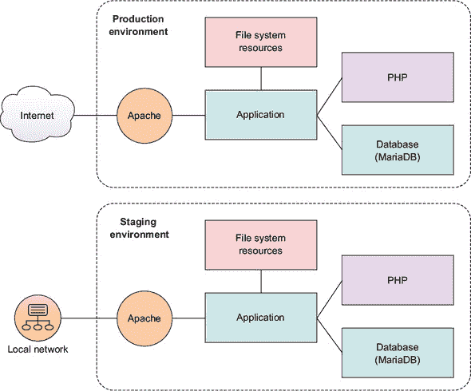
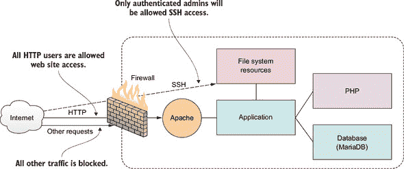
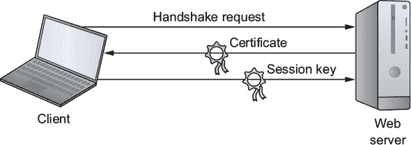
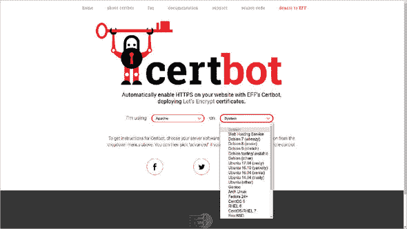
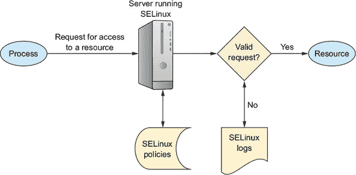
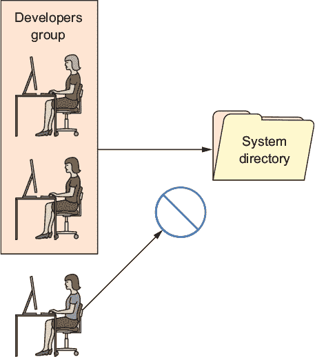

## 第九章\. 保护你的 Web 服务器

*本章涵盖*

+   保护你的基础设施

+   使用防火墙控制对服务器的访问

+   使用加密来保护你的数据

+   紧缩认证过程

+   控制软件和进程

*Web 服务器*中的*Web*部分有点误导。毕竟，我在本章中将要讨论的大多数安全工具无论你运行什么类型的服务器都是重要的。实际上，*服务器*这个词也有点多余，因为所有计算机都需要保护。然而，由于它们按定义暴露于大量的外部流量，因此你的 Web 服务器的安全性应该是一个特别高的优先级。所以，测试本章中将要学习的内容的最佳方式是运行一个 Apache Web 服务器。考虑现在就把它组装起来：`apt install apache2`。

在 IT 环境中，*安全*是指保护硬件、软件、数据和数字服务免受未经授权的访问和破坏。鉴于网络计算机资源被设计成要向各种客户端用户暴露，确保只有正确的客户端能够执行正确的操作是一个挑战。

你可以将安全性视为权衡价值与风险的精细艺术。当你考虑到已经存在多少种安全威胁，以及新的威胁出现得有多频繁时，你可能会理解到这种平衡永远不会完美。它肯定需要经常重新评估。

没有任何单一的工具或实践可以涵盖安全性的各个方面。虽然为自己制定一个关键安全待办事项清单并不是一个坏主意，但这还远远不够。我所知道的最为成功的管理员都是技艺精湛且知识渊博的，而且他们似乎还共享一种特定的态度：没有任何软件、供应商、政府机构、同事，甚至亲密的朋友可以完全信赖。他们可能对你并无恶意，但犯错误并留下一个容易被攻击的重要漏洞实在太容易了。每一件事和每一个人都可以使用一双额外的眼睛和一些双重检查。

你能做些什么来保护你的服务器？这实际上关乎许多小事。事实上，有很多小事，其中一些可能会溢出到下一章。然而，在这一章中，我们将在深入探讨如何使用防火墙来控制网络访问、使用 SSL/TLS 加密保护网站数据传输以及通过战略性地使用像安全增强 Linux (SELinux) 和系统组这样的工具来限制对服务器资源的使用之前，先从一些基础知识开始。

### 9.1\. 显而易见的事情

让我们从选择一些容易解决的问题开始。考虑到你在本书中已经看到了许多安全最佳实践，许多安全都是常识。但是，尽管它可能很简单，你也不能忽视这些基础知识：

+   今天就备份你的数据。无论坏人对你服务器做了什么，如果你能从可靠的备份中重建它，那么你仍然在游戏中。再次查看第四章和第五章，然后为自己编写一个定期、自动化、全面且可验证的备份计划，涵盖你拥有的任何有价值的东西。确保始终有多个存档版本可用，并且至少有一个存档存储在异地。

+   将所有软件更新应用到你的系统上。没有借口。哦，总是有借口：你害怕更新可能会破坏你的应用程序所依赖的东西，或者它可能需要重启，这可能会造成中断。但无论如何都要做。不要误会我。我理解那些是真实的问题。问题是替代方案更糟糕。这是你友好的系统更新提醒：

    ```
    # yum update
    ```

    或者（在 Ubuntu 上）：

    ```
    # apt update
    # apt upgrade
    ```

| |
| --- |

##### 注意

不要忘记，包管理器只更新通过管理仓库安装的软件包。任何你手动添加的应用程序将保持*未修补*（并且可能不安全），直到你手动应用补丁或禁用它们。

| |
| --- |

通过构建测试（或*预发布*）环境（图 9.1），其中运行着你的应用程序的镜像，并且安全地保护免受公共网络的影响，你可以避免大多数中断的风险。对你的预发布基础设施应用更新和补丁应该能给你一个很好的想法，了解它在现实世界中的工作情况。

##### 图 9.1。你可以在受保护的预发布环境中复制服务器基础设施，以安全地进行维护。



更好的是，你可以使用第十六章中提到的代码配置管理软件作为基础设施来自动化你的整个部署流程。这样，一旦你确认你修补的预发布环境运行正常，它就可以成为你的生产基础设施。但这是一个我们稍后再讨论的话题。

### 9.2. 控制网络访问

将你的服务器连接到网络以及外面的广阔、危险的互联网视为你的第一道防线。网络协议被设计成灵活的，以帮助你严格控制哪些流量能够通过。关键是理解这些协议是如何工作的，然后正确地使用这些知识来设置正确的事情。

#### 9.2.1. 配置防火墙

*防火墙*是一组规则。当数据包进入或离开受保护的网络空间时，其内容（特别是关于其来源、目标以及它计划使用的协议的信息）将根据防火墙规则进行测试，以确定是否允许通过。以下是一个简单示例，如图 9.2 所示。

##### 图 9.2。防火墙可以根据协议或基于目标的规则过滤请求。



假设你的公司的网络服务器需要对外开放，接受来自地球上任何地方的 HTTP 或 HTTPS 协议的 Web 流量。因为你的开发人员和管理员有时需要进入后端进行工作，你也会希望允许 SSH 流量，但仅限于那些需要它的人。对任何其他服务的请求应自动拒绝。让我们看看如何实现这一点。

可以通过名为*iptables*的程序在内核级别配置 Linux 机器以应用防火墙规则。创建 iptables 规则并不困难；语法可以在不太麻烦的情况下学习。但是，为了简化你的生活，许多 Linux 发行版已经添加了自己的高级工具来抽象化这项工作。在本节中，你将看到 CentOS 的 firewalld 和 Ubuntu 的 UncomplicatedFirewall（ufw）。

防火墙功能也通过 Juniper 和 Cisco 等公司制造的硬件设备提供。这些专有设备运行在自己的操作系统上，具有独特的语法和设计。对于涉及数百台服务器的大型企业部署，这些工具通常非常有意义，但你可以用任何旧的 Linux 机器以极小的成本完成大量工作。话虽如此，本节将仅介绍 Linux 防火墙功能的一小部分。当然，如果你想了解更多，请稍作停留，以便在第十章中了解更多深度内容，并咨询 Linux 智慧的常规来源，如 man 文件和在线指南。

##### firewalld

如你所猜测的，firewalld 是 systemd 家族的一部分。firewalld 可以安装在 Debian/Ubuntu 机器上，但在 Red Hat 和 CentOS 上默认存在。如果你对 firewalld 的热情如此之高，以至于甚至不考虑尝试其他任何东西，这里是如何在 Ubuntu 上安装它并使其运行的方法：

```
# apt update
# apt install firewalld
```

要确认防火墙是否正常工作，尝试浏览到服务器的 Web 根目录。如果网站无法访问，那么 firewalld 正在执行其工作。

你将使用`firewall-cmd`工具从命令行管理 firewalld 设置。添加`--state`参数会返回当前的防火墙状态：

```
# firewall-cmd --state
running
```


**一些重要术语**

为了确保没有人被遗漏，让我们定义一些重要的术语。*超文本传输协议*（HTTP）在网络中协调客户端和服务器之间资源的交换。例如，浏览器可能会请求一个用*超文本标记语言*（HTML）编写的网页，服务器可以通过传输页面内容来响应。每个数据传输事件都会生成包含有关会话状态信息的*元数据*（附加到数据包上的上下文信息），随后由管理员在试图找出问题所在时使用。HTTPS 协议的变体确保使用*传输层安全性*（TLS）协议安全地加密数据传输。

*数据包*是可能从较大的数据文件或存档中分离出来的一小部分数据。传输后，数据包可以被重新组装成其原始形式。当使用*传输控制协议*（TCP）进行网络数据传输时，接收到的数据包会在接收时进行检查，并在必要时重新发送。使用*用户数据报协议*（UDP）的传输将比 TCP 更快完成，但由于它们不包含错误纠正，因此仅适用于对错误高度容忍的操作。


默认情况下，firewalld 将处于活动状态，并将拒绝除 SSH 之外的所有传入流量。这意味着你的网站不会吸引太多访客，这无疑会为你节省大量的数据传输成本。既然这很可能不是你为你的 Web 服务器所设想的情况，你将想要打开 HTTP 和 HTTPS 端口，按照惯例，分别被指定为 80 和 443。firewalld 提供了两种方法来实现这一点。一种是通过`--add-port`参数直接引用端口号以及它将使用的网络协议（在这种情况下是 TCP）。`--permanent`参数告诉 firewalld 在服务器启动时加载此规则：

```
# firewall-cmd --permanent --add-port=80/tcp
# firewall-cmd --permanent --add-port=443/tcp
```

`--reload` 参数将应用这些规则到当前会话：

```
# firewall-cmd --reload
```

这种方法适用于你所能想到的任何复杂或定制配置。但如果你有更简单的需求，你可以使用 firewalld 为许多常用服务预定义的值。这些值是从`/etc/services`文件中保留的数据中提取的。

`--add-service`参数，当它指的是你的 HTTP 和 HTTPS 服务时，将打开 80 和 443 端口。在这种情况下，这看起来可能不是什么大问题，但当紧急情况发生且时间紧迫时，你确定你会记得默认 MySQL 端口号恰好是 3306 吗？直接输入`mysql`不是更容易吗？

```
# firewall-cmd --permanent --add-service=http
# firewall-cmd --permanent --add-service=https
```

对你防火墙上的当前设置感到好奇吗？运行 `--list-services`：

```
# firewall-cmd --list-services
dhcpv6-client http https ssh
```

假设你已经按照前面描述的方式添加了浏览器访问，HTTP、HTTPS 和 SSH 端口都是开放的，还有`dhcpv6-client`，它允许 Linux 从本地 DHCP 服务器请求 IPv6 IP 地址。你将在第十四章中了解更多关于这个内容。

你当然不希望任何人都能访问你的服务器 SSH，所以让我们让 firewalld 来保护它。你将限制 SSH 访问，只允许来自特定 IP 地址的会话。为此，我将向你展示如何切断所有 SSH 访问，然后只为单个 IP 地址开放。


##### 注意

我应该警告你，在 SSH 会话中玩弄防火墙是有点危险的。你可能会被锁在自己的服务器外面。如果发生这种情况，有一些技巧（在本章后面介绍）可以帮助你重新进入。无论如何，如果你使用的是可丢弃的 LXC 容器或 VM，你不必太担心：如果出了问题，销毁它并启动一个干净的。


要关闭现有的 SSH 访问，使用`--remove-service`然后重新加载 firewalld（如果你指的是端口号，`--remove-port`将起到相同的作用）：

```
# firewall-cmd --permanent --remove-service=ssh
success
# firewall-cmd --reload
```

测试你的新配置以确保它已经生效。在任何其他有网络访问的机器上打开一个新的终端，并尝试使用 SSH 登录到你的服务器。你的尝试应该失败：

```
$ ssh root@192.168.1.22                                          *1*
ssh: connect to host 192.168.1.22 port 22: No route to host
```

+   ***1* 通过 SSH 允许 root 登录不是一个好主意，可以在`/etc/ssh/sshd.conf`文件中通过 PermitRootLogin 设置禁止，设置为 no。**

现在，回到你的 firewalld 机器上，添加一个新规则，该规则将接受来自使用 IP 地址 192.168.1.5（或你的客户端机器的 IP 地址）的客户端的 22 端口（默认 SSH 端口）的 TCP 流量。`--add-rich-rule`参数告诉`firewall-cmd`这个命令使用的是*Rich Language*集，这是一种高级语法，旨在简化复杂防火墙规则的创建（有关更多详细信息，请参阅[`mng.bz/872B`](http://mng.bz/872B)）：

```
# firewall-cmd --add-rich-rule='rule family="ipv4" \
 source address="192.168.1.5" port protocol="tcp" port="22" accept'
success
```

现在尝试从指定 IP 地址的终端再次登录。应该可以登录。因为你没有使这个规则永久化，下次启动时一切应该恢复正常。

##### UncomplicatedFirewall (ufw)

让我们看看如何使用 ufw 在 Ubuntu 机器上以类似的方式控制 SSH 访问。ufw 程序可能不会在新安装的 Ubuntu 上安装，并且在任何情况下，默认情况下都会被禁用，所以你需要让它运行：

```
# apt install ufw
```

因为 ufw 默认所有端口都是关闭的，启用它会阻止你打开新的 SSH 会话。现有的会话不应该受到影响，但仍然，添加一个允许 SSH 的规则在启用 ufw 之前可能是个好主意：

```
# ufw allow ssh                                  *1*
Rules updated
# ufw enable                                     *2*
Command may disrupt existing ssh connections.    *3*
Proceed with operation (y|n)?
```

+   ***1* 使用 ufw deny ssh 命令来禁用 SSH。**

+   ***2* 启动防火墙。当需要时，使用 ufw disable 命令来关闭 ufw。**

+   ***3* 警告：现有或新的远程连接可能会受到影响** 

如果您在 LXC 容器上运行 ufw，那些命令可能没有起作用。相反，您可能看到了以下相当令人恐惧的错误信息：

```
ERROR: initcaps
[Errno 2] modprobe: ERROR: ../libkmod/libkmod.c:586 kmod_search_moddep()
 could not open moddep file '/lib/modules/4.4.0-87-generic/modules.dep.bin'
modprobe: FATAL: Module ip6_tables not found in directory
  /lib/modules/4.4.0-87-generic
ip6tables v1.6.0: can't initialize ip6tables table `filter':
  Table does not exist (do you need to insmod?)
Perhaps ip6tables or your kernel needs to be upgraded.           *1*
```

+   ***1* 在主机系统上禁用了 IPv6 支持，您可能会遇到此错误信息。**

这与 LXC 容器可能默认未启用 IPv6 支持的事实有关。考虑到容器无法完全访问其宿主机的内核，解决这个问题可能很复杂。如果您不打算将 IPv6 包含在网络配置中（无论如何，这符合绝大多数用例），那么最简单的方法是在您的/etc/default/ufw 配置文件中将`IPV6=yes`行编辑为`IPV6=no`。

##### 列表 9.1\. /etc/default/ufw 配置文件的一部分

```
# /etc/default/ufw
#

# Set to yes to apply rules to support IPv6 (no means only IPv6 on loopback
# accepted). You will need to 'disable' and then 'enable' the firewall for
# the changes to take affect.
IPV6=no                                                                   *1*

# Set the default input policy to ACCEPT, DROP, or REJECT. Please note that
# if you change this you'll most likely want to adjust your rules.
DEFAULT_INPUT_POLICY="DROP"

# Set the default output policy to ACCEPT, DROP, or REJECT. Please note that
# if you change this you'll most likely want to adjust your rules.
DEFAULT_OUTPUT_POLICY="ACCEPT"
[...]
```

+   ***1* 将 IPV6 的值从 yes 更改为 no 以禁用 IPv6 支持并避免 ufw 错误。**

启用 ufw、添加 SSH 规则并运行`ufw enable`现在应该可以正常工作：

```
# ufw enable
Command may disrupt existing ssh connections.
Proceed with operation (y|n)? y
Firewall is active and enabled on system startup
# ufw allow ssh
Rules updated
```

与 firewalld 类似，ufw 允许您使用端口号或服务名称（如您刚刚使用的`ufw allow ssh`）来创建规则。以下两个命令将为您的 Web 服务器打开 HTTP 和 HTTPS 访问：

```
# ufw allow 80
# ufw allow 443
```

`ufw status`命令显示服务正在运行，并且您需要的三个规则现在都是活动的。请继续测试您的 Web 服务器：

```
# ufw status
Status: active
To                         Action      From
--                         ------      ----
80                         ALLOW       Anywhere
22                         ALLOW       Anywhere
443                        ALLOW       Anywhere
```


##### 注意

要正确测试通过防火墙访问 Web 服务器，别忘了您的浏览器缓存页面数据。这意味着即使现在有防火墙规则应该阻止这种情况，浏览器仍然可能加载它之前访问过的页面。为了确保您正在测试网站当前的状态，请清除浏览器缓存或刷新浏览器页面。


再进行一项微调将限制 SSH 访问仅限于坐在特定 IP 地址后的团队成员。如果现在安全（意味着您的 Web 服务器目前没有暴露在互联网流量中），在做出这些更改之前禁用 ufw 是一个好主意。然后使用`delete 2`（这指的是 ufw 列表中的第二个规则）删除您的允许 SSH 规则，并且只为来自 10.0.3.1 的流量重新打开它。（在我这个例子中，因为我从我的 LXC 主机登录到 LXC 容器，所以这个 IP 地址是我将使用的；您的结果可能会有所不同。）最后，重新启动 ufw 并检查其新状态：

```
# ufw disable
Firewall stopped and disabled on system startup
#
# ufw delete 2                                       *1*
Rules updated
#
# ufw allow from 10.0.3.1 to any port 22             *2*
Rules updated
#
# ufw enable
Command may disrupt existing ssh connections.
Proceed with operation (y|n)? y
Firewall is active and enabled on system startup
#
# ufw status
Status: active
To                         Action      From
--                         ------      ----
80                         ALLOW       Anywhere
443                        ALLOW       Anywhere
22                         ALLOW       10.0.3.1       *3*
```

+   ***1* 删除 ufw 状态显示的第二个防火墙规则**

+   ***2* 仅允许从指定的 IP 地址进行 SSH 流量，而不允许其他任何地方**

+   ***3* 一个新的规则，仅允许从指定的 IP 进行 SSH 流量**

您可以通过从允许的 IP 地址的机器和任何其他机器登录来测试您的配置。第一个应该可以工作，但第二个最好不要工作！

通过这样，你现在已经看到了如何使用 firewalld 和 ufw 来安全地配置对简单 Web 服务器的访问。尽管防火墙可以使用任何协议或端口来控制流量，但我们只介绍了 HTTP、HTTPS 和 SSH。也值得提到的是，正如你将在本章稍后看到的那样，你可以为你的应用程序使用非标准网络端口。

##### 恢复被锁定的虚拟机

如果你真的把自己锁在了 LXC 容器外面，你可以使用`chroot`（就像你在第六章中做的那样）来禁用或重新配置你的防火墙。首先，停止容器，然后对 LXC 容器使用的目录层次结构中的 rootfs 目录（/var/lib/lxc/your-container-name/）运行`chroot`。你将得到的命令提示符让你可以像容器实际运行时一样执行命令。现在禁用 ufw，或者如果你更喜欢，运行必要的命令来解决问题，然后退出`chroot`外壳。当你再次启动容器时，你应该有 SSH 访问：

```
# lxc-stop -n your-container-name                      *1*
# chroot /var/lib/lxc/your-container-name/rootfs/      *2*
# ufw disable
# exit                                                 *3*
# lxc-start -d -n your-container-name
```

+   ***1* 停止运行的 LXC 容器**

+   ***2* 将你的容器文件系统挂载为 chroot**

+   ***3* 关闭 chroot 外壳会话**

如果是一个 VirtualBox 虚拟机锁住了你呢？这很简单：通过最初启动 VM 时打开的原始终端登录。这相当于坐在连接到物理服务器的键盘上，不需要任何网络连接即可访问。

#### 9.2.2\. 使用非标准端口

能够通过数字设置网络端口的一个优点是，它让你可以配置应用程序使用非标准端口。例如，你可以将 SSH 设置为端口 53987 而不是 22。非标准端口的优势在于，它们让你能够实现*通过隐蔽性来提高安全性*。

让我来解释一下。本身来说，端口 53987 并不比端口 22 更安全：利用它只是更新 SSH 客户端的新设置的问题。但无论如何，它还是可以增加一层保护。

想象一下，有一个黑客正在对你的基础设施进行攻击，试图找到进入的方法。也许那个人发现你的管理员有一个坏习惯，就是为多个账户重复使用相同的密码——其中一个账户已经被攻破。黑客从那次入侵中获得了大量有价值的信息：你的服务器的 IP 地址（通常与你的网站使用的相同）以及你的管理员的用户名和密码。假设你允许通过密码登录你的 SSH 账户（正如你在第三章中知道的，这并不是一个好主意），那么黑客登录并给你的生活带来混乱就没有什么阻碍。除非没有人告诉黑客端口 22 已经关闭，SSH 访问只能通过一些神秘的较高端口号（如 53987）进行。因为你重置了默认端口，这使得突破你的防御变得更加困难，而这小小的困难可能会在未来的某一天产生重大影响。

它是如何工作的？首先，你需要在服务器上编辑`/etc/ssh/sshd_conf`配置文件（将托管你的 SSH 会话的计算机）。该文件将包含一个默认情况下读取为`Port 22`的行。你需要将其编辑为使用你计划使用的任何端口。

##### 列表 9.2\. 来自 SSH 主机 ssh_d.conf 文件的端口号设置行

```
# What ports, IPs, and protocols we listen for
Port 22                                            *1*
```

+   ***1* 将此值更改为你想要使用的端口号。**

完成后，并且你确信即使当前的 SSH 会话中断，你也能重新进入你的服务器，请重新启动 SSH 服务。如果你有一个防火墙，你需要告诉它允许在新端口上进行访问……这即将到来：

```
# systemctl restart ssh
```

现在，当你想从远程机器登录时，请添加`-p`后跟新的端口号。然后，你的 SSH 客户端将能够通过新端口请求会话：

```
$ ssh -p53987 username@remote_IP_or_domain
```

如果你正在使用不同的 SSH 客户端（如 PuTTY），你也需要同样告诉客户端关于非标准端口号的信息。让我们接下来看看这一点。

##### 配置 ufw 防火墙以允许通过非标准端口传输流量

通过数字打开端口相对简单，但你需要明确指定你将使用的协议（TCP 或 UDP）。此示例使用 TCP 协议：

```
# ufw allow 53987/tcp
```

你也可以使用单个命令通过冒号（:）字符打开一系列端口。这在基础设施规划中可能很有用，比如当你知道你的开发人员将推出新的应用程序并需要访问多个端口时。现在给他们一个可以玩耍的范围可以节省时间和挫折。这个特定的示例打开了 52900 和 53000 之间的所有端口：

```
# ufw allow 52900:53000/tcp
```

| |
| --- |

**网络端口**

65,535 个可用的网络端口分为三类：

+   介于 1 和 1023 之间的端口被指定为知名端口，并已留出供已识别服务使用，如 SSH（22）和 HTTP（80）。你不应该为你的应用程序使用知名端口号，因为你可能会引起冲突。

+   介于 1024 和 49151 之间的端口是*已注册*的，这意味着公司和组织已经请求在这个范围内的特定端口被留出供他们的应用程序使用，即使它们还没有被普遍采用。例如，1812 端口用于 RADIUS 身份验证协议，3306 端口是 MySQL 的专用端口。

+   介于 49152 和 65535 之间的端口是*未注册*的，被认为是动态的（或私有的）。这些端口可用于任何临时或即兴使用，尤其是在私有网络上。你可以确信它们不会与已知的应用程序或服务冲突。

| |
| --- |

##### 选择非标准端口号

你应该选择哪个端口号呢？首先，让我们明确一点：你绝对不应该让外人（像我这样的人）影响这样的决定！但是，为了避免与正在运行的网络安全应用发生冲突，你将希望坚持使用 49152 和 65535 之间的未注册范围内的值。这应该会给你足够的工作空间。

当然，使用非标准端口不仅限于 SSH。你应该考虑为任何你自己编写的或可以通过配置文件控制的程序使用这个技巧。记住：就像本章中的大多数工具一样，仅靠它本身可能不会非常有效，但作为更大安全协议集的一部分，它是一个强大的元素。

### 9.3. 传输中的数据加密

由于两个原因，网站加密非常重要：

+   未加密的网站危险地暴露了它们的数据，并将用户置于重大风险之中。

+   未加密的网站产生的商业价值显著较低。

第一个问题源于未加密网站以纯文本形式显示和处理所有内容的事实。这意味着涉及密码、个人和财务信息（如信用卡）的所有传输都对任何有权访问网络的好奇观察者可见。这显然是一个糟糕的想法。

第二个问题源于谷歌在 2017 年 1 月做出的一个决定。谷歌决定通过在互联网搜索结果中将未加密的网站排名降低来惩罚它们。这使得用户很难找到不安全的内容。

为什么谷歌（以及其他强大的互联网公司）会关心？你为什么应该关心？因为如果我们不能信任互联网的内容以及网站处理我们私人信息的方式，互联网的稳定性和我们所有人用它所做的一切都无法生存。即使你的网站不处理信用卡购买，它未加密的事实意味着它更有可能被入侵，其资源被劫持用于对其他网站的僵尸攻击。任何一个薄弱的网站都会使整个互联网变得更弱。

如果你想要保护你的网站（毕竟，这是本章的主题），那么加密是这个过程的重要组成部分。请注意，不要认为加密*保证*你的数据是安全的。它只是让错误的人更难接触到它。为了使这起作用，你需要一个*证书*，这是一个包含有关域名、所有者、密钥和可靠数字签名的信息的文件。

一旦你有了证书，浏览器就可以验证你站点的安全性，并在整个会话中仅交换加密数据。所有广泛使用的现代浏览器都预装了公共根证书，因此它们可以使用私有证书颁发机构（CA）证书验证与任何站点的连接。以下是工作原理：

1.  客户端浏览器请求服务器身份，以便两者可以执行*握手*。

1.  服务器通过发送从 CA 接收到的证书副本进行响应。

1.  浏览器将证书与其根证书列表进行比较，并确认你的证书尚未过期或被撤销。

1.  如果浏览器满意，它将使用服务器发送的公钥加密对称会话密钥，并将密钥传输到服务器。

1.  所有传输都将使用会话密钥进行加密。

该过程在图 9.3 中进行了说明。

##### 图 9.3. TLS 加密浏览器会话中标识数据、证书和会话密钥的交换



直到 2016 年，使用 SSL/TLS 标准从受信任的 CA 生成和安装加密证书需要时间和金钱。在 Linux 上，你会使用 OpenSSL 命令行界面工具生成密钥对，然后组装一个包含对的一半以及站点配置信息的特殊格式证书签名请求（CSR）包。

然后将 CSR 发送给 CA。如果请求被批准，CA 会发送一个证书供你在文件系统中安装。你还需要更新 Web 服务器配置文件（例如，在 Ubuntu 上的 Apache，为/etc/apache2/sites-available/default-ssl.conf），以便软件知道证书存储在文件系统的哪个位置。那已经是过去了。

自 2016 年以来，Let’s Encrypt 作为一个免费 CA 一直在发放证书。Let’s Encrypt ([`letsencrypt.org`](https://letsencrypt.org))由电子前沿基金会赞助，同时还有包括思科、Chrome、Shopify 和 Digital Ocean 在内的众多企业合作伙伴。其使命是通过降低成本和，同样重要的是，简化流程来推广网站加密。

忘记配置文件和使用 OpenSSL 生成 CSRs 吧：Let’s Encrypt 的 Certbot ACME 客户端会为你完成大部分工作。Let’s Encrypt 证书有效期为 90 天，并可以设置为自动续订。

#### 9.3.1. 准备你的网站域名

在你能够安装证书以加密你的网站域名之前，你需要拥有一个域名。这涉及到从像 GoDaddy 或 Amazon 的 Route 53 这样的域名注册商那里购买一个名称。关于如何操作的更多信息，你可以阅读我书中关于“在一个月的午餐时间学习 Amazon Web Services”的第五章（Manning，2017 年）。

由于你希望 Apache 处理来自外部客户端的特定域名请求，你还需要在`/etc/apache2/sites-available/000-default.conf`文件中添加一个部分（在 CentOS 机器上，你将编辑`/etc/httpd/conf/httpd.conf`文件中的设置）。以下是我 bootstrap-it.com 服务器上的示例。注意，在这个阶段，它仅配置为接受不安全的 HTTP 端口 80 的流量。

##### 列表 9.3\. 来自 Apache 配置文件的可能的域名部分

```
<VirtualHost *:80>                       *1*
    ServerName bootstrap-it.com          *2*
    DocumentRoot /var/www/html
    ServerAlias www.bootstrap-it.com     *3*
</VirtualHost>
```

+   ***1* 此配置只监听 80 端口的流量。**

+   ***2* 你的域名用作 ServerName 的值。**

+   ***3* 这条 ServerAlias 行将 www 添加为有效的域名前缀。**

#### 9.3.2\. 使用 Let’s Encrypt 生成证书

从这个点开始，操作非常简单。浏览到电子前沿基金会 Certbot 网站的“入门”页面（[`certbot.eff.org`](https://certbot.eff.org)），正如你在图 9.4 中看到的，指定你正在使用的 Web 服务器软件和操作系统。

##### 图 9.4\. 一旦你在 Certbot 主页上选择了你的 Web 服务器软件和操作系统，你将看到安装说明。



从 Certbot 主页，你将被重定向到一个包含一些简要说明的页面。对于 Ubuntu 16.04 上的 Apache，它包括安装软件属性管理工具的命令，将 Certbot 存储库添加到你的 APT 列表中，然后安装 Apache 的基于 Python 的 Certbot 软件：

```
# apt update
# apt install software-properties-common
# add-apt-repository ppa:certbot/certbot
# apt update
# apt install python-certbot-apache
```

最后，你将以管理员身份启动 Certbot 程序（在我的情况下，使用`--apache`作为参数）。Certbot 将读取你的 Web 服务器配置文件，以了解你可能会想要注册的域名：

```
# certbot --apache
```

在回答有关联系信息和 Let’s Encrypt 服务条款的一些问题后，你将看到一个可能看起来像这样的可能域名列表：

```
Which names would you like to activate HTTPS for?
--------------------------
1: bootstrap-it.com
2: www.bootstrap-it.com
--------------------------
Select the appropriate numbers separated by commas and/or spaces,
  or leave input blank to select all options shown (Enter 'c' to cancel):
```

一旦你做出回应，机器人将尝试确认你选择的域名存在并且已注册在公开可访问的 DNS 服务器上。证书服务器最终将尝试连接到你的网站。如果成功，Let’s Encrypt 证书将被自动安装，并在配置文件中添加任何必要的附加部分。

如果在过程中出现问题，Certbot 将显示有用的错误信息，你可以使用这些信息来寻找解决方案。此外，Let’s Encrypt 还提供了一个活跃的社区帮助论坛，所有技能水平的用户都可以在这里安全地寻求帮助：[`community.letsencrypt.org`](https://community.letsencrypt.org)。

到目前为止，在这章繁忙的内容中，你已经学会了如何通过保持应用程序修补和更新来增强网站安全性，使用防火墙规则来控制对网络的访问，将隐蔽性添加到你的组合中，以及加密在网站和访客之间传输的数据。我们的安全工作还没有结束。

接下来：加强登录协议，使用 SELinux 内核模块和组来更紧密地控制用户可能陷入的麻烦，以及跟踪你的运行进程以确保在没有人注意时后台没有发生不适当的事情。

### 9.4. 强化认证过程

使用安全的连接解决方案，特别是 SSH，是很好的。但也要注意你的团队成员如何使用 SSH。这里有一些建议来提高你的远程访问安全性。在每种环境中强制执行它们可能并不实用（尤其是在你设置事情的过程中），但至少你应该熟悉它们。

避免以 root 用户登录服务器。在需要管理员权限时，始终使用`sudo`更好。实际上，你可以通过编辑`/etc/ssh/sshd_conf`文件中的`PermitRootLogin`行来完全防止 root 登录：

```
PermitRootLogin no               *1*
```

+   ***1* /etc/ssh/sshd_conf 中的 root 登录控制行**

你还可以鼓励你的管理员只通过密钥对（就像你在第三章中看到的那样）使用无密码 SSH 访问。这也可以从`sshd_conf`文件中强制执行，这次是在`PasswordAuthentication`行上。没有密码认证，用户将被迫使用密钥对：

```
PasswordAuthentication no        *1*
```

+   ***1* /etc/ssh/sshd_conf 中的密码认证控制行**

在每次编辑后，确保重新加载 SSH；否则，新设置将不会在下次启动前生效：

```
# systemctl restart sshd
```

这些是在任何环境中都非常重要的步骤。但如果你的部署需要一些工业级的隔离，考虑启用 SELinux。

#### 9.4.1. 使用 SELinux 控制文件系统对象

记得我们之前在第四章讨论对象权限吗？当时的背景是需要确保用户可以访问和编辑自己的文件。但硬币的另一面是确保错误用户无法染指他人的文件。

你会记得，一个对象常见的权限配置可能给所有者提供完全的读写执行权限，但只给对象组和其他人读取权限。在我们的数字表示法中，这将是 744，或者说是`rwx r-- r--`。

给你的用户完全控制他们自己的资源的做法有时被称为*自主访问控制*（DAC）系统。如果你希望用户能够高效工作，DAC 将非常有意义，但它也有代价：完全控制的风险是他们可能会在不完全了解后果的情况下使用它。

这里有一个我所说的实际例子。假设有几位开发者辛勤地为你的公司工作，遇到了一个问题：在本地测试软件时，尝试写入数据文件总是失败。调试发现，这是由于应用程序由一个用户运行，但数据文件属于另一个用户导致的权限问题。

因为这种情况已经发生不止一次，而且涉及多个数据文件（或者说是 SSH 密钥文件），开发者选择了快捷而懒惰的方法：他们打开了数据文件以及那些目录下所有文件的权限，设置为 777——对整个世界完全开放。这确实是一个重大的安全问题。还有很大的可能性，他们正在开发的应用程序最终会以相同的系统设置移至生产环境。这种错误正是导致你时不时听到的一些重大数据泄露事件的原因。

SELinux 是那些复杂主题之一，虽然对于许多 Linux 工作负载至关重要，但在这个书的工程项目中不必扮演主要角色。再次提醒，如果你喜欢，可以直接跳过它，进入系统组的讨论。

当安装并激活时，SELinux 内核模块会对文件系统对象应用*强制访问控制*（MAC），无论特定对象的拥有者是谁。实际上，如图 9.5 所示，它对用户可以做什么设定了仔细定义的、系统范围内的限制，使得设置固有的危险配置变得不可能。

##### 图 9.5。通过 SELinux 策略过滤器请求资源访问后的流程



如果 SELinux 是激活的，那两位开发者可能会不断地将 777 权限应用于他们的数据文件，直到他们的手指累得酸痛，但这并不能解决问题。相反，他们被迫寻找更合适和有效的解决方案。例如，他们可能会考虑创建一个拥有数据权限的系统组，然后将适当的用户账户添加到该组中。你将在本章稍后了解更多关于这方面的内容。听起来很棒。关于安全性，有什么不喜欢的呢？

嗯，这里有个问题。SELinux 与应用兼容性有着黑暗而可怕的关系。如此黑暗和可怕，以至于许多管理员宁愿禁用它，也不愿尝试让它工作。问题是许多应用程序，无论是现成的还是本地构建的定制应用程序，都需要访问和编辑系统资源。因此，在未经修改的 SELinux 环境中运行此类应用程序通常会失败。

我有可靠的消息说，所有这些冲突都有解决方案，并且它们并非不可能实施。但同样经常的是，通过更好地理解文件系统设计和安全原则，可以完全避免冲突。特别是，您应该记住*最小权限原则*，该原则旨在仅允许所有用户和进程访问他们需要的权限，而不需要更多。在任何情况下，您都需要了解 SELinux，因此以下章节介绍了基础知识。

#### 9.4.2\. 安装和激活 SELinux

也许是因为 SELinux 是由 Red Hat Linux（和 CentOS）开发和为它们设计的，所以默认情况下，这些系统上已经安装并激活了 SELinux。在其他发行版上运行它，包括 Ubuntu，绝对可能（尽管 AppArmor 在 Ubuntu 上是一个更常见的选择），但我不能保证它总是能顺利运行。（甚至不要考虑在 LXC 容器上尝试；相反，使用 VirtualBox 进行测试。）在 Ubuntu 上，您需要三个软件包：selinux、setools 和 policycoreutils。以下是它的样子：

```
# apt install setools policycoreutils selinux
```

一旦妥善设置，重启 Ubuntu，并运行`sestatus`以获取当前 SELinux 状态的快照，包括重要的文件系统位置和政策。如果有幸，您应该看到类似以下内容：

```
# sestatus
SELinux status:                 enabled              *1*
SELinuxfs mount:                /sys/fs/selinux
SELinux root directory:         /etc/selinux
Loaded policy name:             targeted             *2*
Current mode:                   permissive
Mode from config file:          permissive
Policy MLS status:              enabled
Policy deny_unknown status:     allowed
Max kernel policy version:      30
```

+   ***1* 当前 SELinux 状态是启用的。**

+   ***2* 正在使用的默认策略是目标型。**

您有时可能需要运行`selinux-activate`命令，以便将 SELinux 设置纳入启动过程：

```
# selinux-activate
Activating SE Linux                                            *1*
Generating grub configuration file ...
Warning: Setting GRUB_TIMEOUT to a non-zero value when GRUB_HIDDEN_TIMEOUT
   is set is no longer supported.
Found linux image: /boot/vmlinuz-4.4.0-89-generic              *2*
Found initrd image: /boot/initrd.img-4.4.0-89-generic
Found linux image: /boot/vmlinuz-4.4.0-87-generic
Found initrd image: /boot/initrd.img-4.4.0-87-generic
Found linux image: /boot/vmlinuz-4.4.0-83-generic
Found initrd image: /boot/initrd.img-4.4.0-83-generic
Found memtest86+ image: /boot/memtest86+.elf
Found memtest86+ image: /boot/memtest86+.bin
done
SE Linux is activated. You may need to reboot now.             *3*
```

+   ***1* 如其名所示，selinux-activate 在下次启动后会将 SELinux 设置为活动状态。**

+   ***2* 为 GRUB 控制的每个映像的启动命令添加了 SELinux 友好标志。**

+   ***3* 因为 SELinux 依赖于内核级设置，更改通常需要重启。**

就像那个人说的，你可能需要重启才能使更改生效。

您可以通过位于/etc/selinux/的配置文件来控制 SELinux 的行为。该文件包含两个设置，SELinux 状态和 SELinux 类型。表 9.1 提供了可能值的简要概述。

##### 表 9.1\. /etc/selinux/config 中 SELinux 的配置设置

| 类别 | 值 | 描述 | 使用 |
| --- | --- | --- | --- |
| 状态 | disabled | SELinux 已关闭。 |   |
|   | enforcing | 安全策略正在执行。 |   |
|   | permissive | 策略违规只会触发记录警告。 | 适用于测试配置 |
| 策略类型 | targeted | 启用了一个由 SELinux 限制“不受限制”的域的进程。 | 适用于不是所有进程都需要限制的混合使用系统 |
|   | minimum | 只有最小进程受到 SELinux 的限制。 | 可以允许对实验系统进行更精细的调整 |
|   | mls | 根据敏感级别和能力应用策略。 |   |

除了配置文件外，您还可以使用 `setenforce` 命令从命令行设置 SELinux 状态，其中 `setenforce 1` 启用强制状态，而 `setenforce 0` 将 SELinux 设置为宽容状态。在宽容状态下，规则违规是被允许的，但会被记录下来。这是一种在不完全打乱过程中调试或测试配置的好方法：

```
# setenforce 1
```

以下是一个 SELinux 示例，说明您如何控制对单个文件的访问？任务完成。您绝对应该尝试下一节中的示例（或类似的内容）。

#### 9.4.3\. 应用 SELinux 策略

假设你是负责那些之前遇到的两个懒惰开发者的系统管理员。根据以往的经验，你怀疑他们可能会被诱惑过于广泛地开放对数据文件的访问。以下是无论开发者尝试什么，你都可以如何保护你的数据的方法。

您可以使用 SELinux 来控制任何文件或进程的访问方式，但为了使这个例子简单，让我们以安装了 Apache（或 httpd）并包含在文档根目录 /var/www/html/ 中的 index.html 文件的服务器为例。默认情况下，该文件至少对本地请求（通过从服务器命令行运行 `wget localhost`）是可访问的。以下是它通常看起来是怎样的：

```
$ wget locahost
--2017-08-02 10:24:25--  http://localhost/
Resolving localhost (localhost)... ::1, 127.0.0.1
Connecting to localhost (localhost)|::1|:80... connected.
HTTP request sent, awaiting response... 200 OK
Length: 11 [text/html]
Saving to: 'index.html'                                            *1*

100%[======================================>] 11          --.-K/s   in 0s
```

+   ***1* wget 成功将 index.html 文件保存到本地目录。**

现在，使用 `ls -Z`（`-Z` 将显示文件的安全上下文）检查 index.html 文件的权限状态：

```
# ls -Z /var/www/html/
-rw-r--r--. root root unconfined_u:object_r:httpd_sys_content_t:s0 index.html
```

首先，注意使文件可读（`r`）的常规权限（`-rw-r--r--`）。这对于网站资源来说是标准的。文件的 SELinux 状态显示为 `unconfined_u:object_r:httpd_sys_content_t:s0`。您可以使用 `chcon -t` 来更改文件上下文类型。此命令将 Apache 的 `httpd_sys_content_t` 类型替换为与 Samba 相关的 `samba_share_t` 类型。我不确定你真的想在现实生活中这样做，但这应该很好地演示了您可以如何平衡您授予用户的权限与他们的潜在破坏能力：

```
# chcon -t samba_share_t /var/www/html/index.html
```

第二次运行 `ls -Z` 显示文件现在与 `samba_share_t` 类型相关联：

```
# ls -Z /var/www/html/
-rw-r--r--. root root unconfined_u:object_r:samba_share_t:s0
 /var/www/html/index.html
```

下一次运行 `wget localhost` 将如何处理新的 SELinux 上下文？

```
$ wget localhost
--2017-08-02 10:27:30--  http://localhost/
Resolving localhost (localhost)... ::1, 127.0.0.1
Connecting to localhost (localhost)|::1|:80... connected.
HTTP request sent, awaiting response... 403 Forbidden
2017-08-02 10:27:30 ERROR 403: Forbidden.                   *1*
```

+   ***1* Apache 以 403：禁止访问的失败消息响应请求。**

这是不行的。Apache 被迫让你（或者更确切地说，开发者）失望，因为在这个上下文中，Apache 本身对文件没有控制权。尽管文件属性包括所有用户的读取权限，但这仍然是正确的。无论你的开发者多么渴望打开对受保护文件的访问，他们都会徒劳无功。

#### 9.4.4\. 系统组和最小权限原则

那两个开发者终于明白了。他们明白自己被阻止了，不能过于广泛地开放访问权限。但现在他们正在请求你的帮助来解决原始问题：如何在不对所有人开放的情况下，使包含敏感数据的文件可供多个账户访问。

简短的回答是组。（而长一点的回答是 g—r—o—u—p—s。）一个 *组* 是一个系统对象，与用户非常相似，只是没有人会以组的形式登录到系统中。组的强大之处在于，它们像用户一样可以被分配给文件或目录，允许任何组成员共享组权限。这可以在图 9.6 中看到。

##### 图 9.6\. 开发者组成员可以访问特定的目录，而那些不是组成员的个人则不行。



尝试自己操作：使用 nano 创建一个新文件。添加一些 Hello World 文本，这样你就可以轻松地判断你是否能够成功访问它。现在使用`chmod 770`编辑其权限，这样文件的所有者和组对文件拥有完全权限，但其他人不能读取它：

```
$ nano datafile.txt
$ chmod 770 datafile.txt
```

如果你的系统除了你的账户外还没有其他额外用户，你可以使用`adduser`（Debian/Ubuntu 的方式）或`useradd`（如果你在 CentOS 上）来创建一个。请注意，`useradd`在 Ubuntu 上也可以使用：

```
# useradd otheruser                       *1*
# passwd otheruser
Enter new UNIX password:
Retype new UNIX password:
passwd: password updated successfully
```

+   ***1* 用户添加命令（与 Debian 的 adduser 命令相反）要求你单独生成用户密码。**

使用`su`切换到你的新用户。一旦你输入了用户的密码，你执行的所有命令都将以该用户身份运行。你将只使用该用户的权限：不多也不少。如果你尝试读取 datafile.txt 文件（使用`cat`），你将不会成功，因为你记得，其他人被拒绝读取权限。完成操作后，输入`exit`离开新用户 shell 并返回到原始 shell：

```
$ su otheruser
Password:
$ cat /home/ubuntu/datafile.txt
cat: /home/ubuntu/datafile.txt: Permission denied
$ exit
```

所有这些都是预期之中且容易理解的。而且，正如你所看到的，无法读取属于不同读者的文件有时可能是一个问题。让我们看看通过将文件与组关联并正确配置文件权限，你能做些什么。

创建一个你可以用来管理你的应用程序数据的新组，然后使用`chown`编辑你的数据文件属性。`ubuntu:app-data-group`参数将文件所有权留给了 ubuntu 用户，但将其组更改为你的新 app-data-group：

```
# groupadd app-data-group
# chown ubuntu:app-data-group datafile.txt
```

使用带有长输出（`-l`）的`ls`命令针对文件查看其新的权限和状态。请注意，正如预期的那样，ubuntu 是文件的所有者，app-data-group 是其所属组：

```
$ ls -l | grep datafile.txt
-rwxrwx--- 1 ubuntu app-data-group        6 Aug  9 22:43 datafile.txt
```

你可以使用`usermod`将你的用户添加到 app-data-group，然后再次使用`su`切换到另一个用户的 shell。这次，尽管文件的权限阻止了其他人，而且你现在确实是以“其他”的身份行事，但你应该能够读取它...多亏了你的组成员资格：

```
# usermod -aG app-data-group otheruser
$ su otheruser                          *1*
$ cat datafile.txt
Hello World                             *2*
```

+   ***1* 使用 su 命令在用户账户之间切换。**

+   ***2* 这正是我的 datafile.txt 文件的内容。**

这种组织方式是正确且有效处理多用户系统上出现的许多复杂权限问题的方法。实际上，它不仅用于给个别用户提供他们需要的访问权限，而且许多系统进程没有特殊的组成员资格就无法完成工作。快速浏览一下`/etc/group`文件，注意有多少系统进程有自己的组：

##### 列表 9.4\. `/etc/group`文件内容的部分列表

```
$ cat /etc/group
root:x:0:
daemon:x:1:
bin:x:2:
sys:x:3:
adm:x:4:syslog
tty:x:5:
disk:x:6:
lp:x:7:
mail:x:8:
news:x:9:
uucp:x:10:
man:x:12:
proxy:x:13:
[...]
```

我将以几个快速但至关重要的协议结束本章，您可以将这些协议融入您的安全实践中。

#### 9.4.5\. 在容器内隔离进程

担心您在单个服务器上运行的多个服务，如果其中一个服务被入侵，所有服务都会处于风险之中？限制粗心或恶意用户可能造成的损害的一种方法是通过隔离系统资源和进程。这样，即使有人可能想要超出设定的限制范围，他们也不会有物理访问权限。

以前处理这个问题的方法是为每个服务分配一个单独的物理机器。但虚拟化可以使构建**隔离**的基础设施变得更加容易和更经济。这种架构通常被称为**微服务**，您将启动多个容器，其中可能只有一个运行数据库，另一个运行 Apache，第三个包含可能嵌入到您的网页中的媒体文件。除了与微服务架构相关的许多性能和效率优势外，这还可以大大降低每个单独组件的风险暴露。


##### 注意

当我提到**容器**时，并不一定是指 LXC 类型的容器。如今，对于这种部署，Docker 容器要更为流行。如果您想了解更多信息，可以查看 Manning 出版的《*Microservices in Action*》（Morgan Bruce 和 Paulo A. Pereira，2018 年），《*Microservice Patterns*》（Chris Richardson，2018 年），或者《*Docker in Practice, 2nd ed.*》（Ian Miell 和 Aidan Hobson Sayers，2018 年）。


#### 9.4.6\. 检查危险的用户 ID 值

虽然任何管理员用户都可以使用`sudo`临时假定 root 权限，但只有**root**才是真正的 root。如您所见，以 root 身份执行常规操作并不安全。但这种情况可能发生，无论是由于无辜的意外还是恶意的篡改，普通用户可以有效地获得全职的管理权限。

好消息是，很容易发现冒名顶替者：它们的用户和/或组 ID 号，就像 root 一样，将是零（0）。看看`/etc/`中的 passwd 文件。此文件包含每个当前存在的普通和系统用户账户的记录。第一个字段包含账户名称（在这个例子中是 root 和 ubuntu），第二个字段可能包含一个*x*代替密码（如果存在，它将在`/etc/shadow`文件中加密显示）。但接下来的两个字段包含用户和组 ID。在这个例子中，ubuntu 的这两个 ID 都是 1000。而且，正如你所看到的，root 是零：

```
$ cat /etc/passwd
root:x:0:0:root:/root:/bin/bash
[...]
ubuntu:x:1000:1000::/home/ubuntu:/bin/bash
```

如果你看到任何普通用户具有用户或组 ID 为 0，那么你就知道有些事情很糟糕，你应该开始修复它。快速简单地发现问题的方式是运行这个`awk`命令针对 passwd 文件，它打印出任何第三个字段只包含 0 的行。在这种情况下，让我非常欣慰的是，唯一的结果是 root。你可以再次运行它，用`$4`替换`$3`以获取组 ID 字段：

```
$ awk -F: '($3 == "0") {print}' /etc/passwd              *1*
root:x:0:0:root:/root:/bin/bash
```

+   ***1* awk 命令将在第十一章中更详细地讨论。**

### 9.5. 审计系统资源

你运行的东西越多，出现问题的可能性就越大，所以你想要跟踪正在运行的内容是有道理的。这适用于网络端口（如果它们是开放的，那么根据定义，必须有进入的方法），服务（如果它们是活跃的，那么人们可以运行它们），以及安装的软件（如果它已安装，则可以执行）。

为了使审计有用，你必须记得偶尔运行它们。因为你知道你会忘记，所以将你的审计工具集成到一个脚本中会更好，这个脚本不仅定期执行，而且理想情况下还会解析结果以使其更易于阅读。在本节中，我将重点介绍三个关键的审计工具，以帮助您扫描开放端口、活跃服务和不必要的软件包。实现这一切将是你的工作。

#### 9.5.1. 扫描开放端口

如果主机上有一个进程正在监听该端口的请求，则该端口被认为是*开放的*。关注你的开放端口可以帮助你了解服务器上正在发生的事情。

你已经知道，一个普通的 Web 服务器可能会有 HTTP（80）和 SSH（22）端口开放，所以发现这些端口并不令人惊讶。但你需要关注其他意外结果。`netstat`命令显示了开放端口以及有关这些端口如何使用的丰富信息。

在这个例子中，针对一个相当典型的多功能服务器，`-n`告诉`netstat`包括数字端口和地址，`-l`仅包括监听套接字，而`-p`添加监听程序的进程 ID。自然地，如果你看到什么，就要采取行动：

```
# netstat -npl
Active Internet connections (only servers)
Proto Local Address     Foreign Address   State       PID/Program name
tcp   127.0.0.1:3306    0.0.0.0:*         LISTEN      403/mysqld        *1*
tcp   0.0.0.0:139       0.0.0.0:*         LISTEN      270/smbd
tcp   0.0.0.0:22        0.0.0.0:*         LISTEN      333/sshd          *2*
tcp   0.0.0.0:445       0.0.0.0:*         LISTEN      270/smbd
tcp6  :::80             :::*              LISTEN      417/apache2
[...]
```

+   ***1* MySQL 进程正在 3306 端口上运行。**

+   ***2* SSH 进程的进程 ID 为 333。**

近年来，`ss`已经开始取代`netstat`用于许多用途。如果您有一天在聚会上有人问您关于`ss`的问题，这个例子（列出所有建立的 SSH 连接）应该会为您提供足够的信息，让您免受真正的尴尬：

```
$ ss -o state established
   '( dport = :ssh or sport = :ssh )'                             *1*
Netid  Recv-Q Send-Q    Local Address:Port   Peer Address:Port
tcp    0      0         10.0.3.1:39874       10.0.3.96:ssh
timer:(keepalive,18min,0)
```

+   ***1* 显示所有 TCP 套接字**

#### 9.5.2\. 扫描活动服务

快速查看当前系统上启用的 systemd 管理的服务也可以帮助您发现不属于那里的活动。`systemctl`可以列出所有现有服务，然后可以缩小到仅包含`enabled`描述的结果。以下代码仅返回活动服务：

```
# systemctl list-unit-files --type=service --state=enabled
autovt@.service                            enabled
bind9.service                              enabled
cron.service                               enabled
dbus-org.freedesktop.thermald.service      enabled
docker.service                             enabled
getty@.service                             enabled
haveged.service                            enabled
mysql.service                              enabled
networking.service                         enabled
resolvconf.service                         enabled
rsyslog.service                            enabled
ssh.service                                enabled
sshd.service                               enabled        *1*
syslog.service                             enabled
systemd-timesyncd.service                  enabled
thermald.service                           enabled
unattended-upgrades.service                enabled
ureadahead.service                         enabled
```

+   ***1* sshd 是 SSH 服务器；ssh 是客户端软件。**

如果您确实发现了一些不应该存在的东西，您可以使用`systemctl`来停止服务并确保它不会在下次启动时启动：

```
# systemctl stop haveged
# systemctl disable haveged
```

实际上，我在这个例子中停止的 haveged 服务并没有什么黑暗和邪恶。这是一个我经常安装的小工具，用于在创建加密密钥时生成随机的后台系统活动。

#### 9.5.3\. 搜索已安装的软件

是否有人或某物在您不知情的情况下安装了软件？好吧，如果您不查看，您怎么知道？要获取完整简报，请使用`yum list installed`或 Debian/Ubuntu 上的`dpkg --list`。要删除任何不属于的包，请使用`remove <packagename>`：

```
# yum list installed
# yum remove packageName
```

下面是如何在 Ubuntu 上操作的：

```
# dpkg --list                    *1*
# apt-get remove packageName
```

+   ***1* 输出长长的包列表，您需要尽可能快地视觉扫描。我不了解任何快捷方式。**

也要注意您的系统配置文件的变化。这是您将在第十一章中学到的东西。

### 摘要

+   使用防火墙，您可以通过协议、端口、源或目的地来控制网络流量。

+   配置应用程序监听非标准网络端口，以向您的基础设施添加*隐蔽性安全*。

+   使用从 CA 接收到的证书，客户端主机浏览器会话被加密，大大减少了传输数据被泄露的风险。

+   在多用户文件系统中使用 SELinux 强制执行全局控制。

+   使用组来严格控制对资源的访问，以允许用户和进程获得他们需要的精确访问权限。

+   定期（脚本）审计运行进程、已安装软件和开放端口对于持续的服务器安全至关重要。

### 关键术语

+   您可以使用*iptables*或更简单的高级工具在 Linux 上管理防火墙规则。

+   **超文本传输协议**（HTTP）管理通过网络进行的基于浏览器的数据传输。

+   **传输层安全性**（TLS）协议强制执行主机-客户端网络数据传输的数据加密。

+   **自主访问控制系统**（DACs）允许用户控制文件系统资源。

+   在*强制访问控制系统*（MACs）上的资源控制最终由系统级策略管理。

+   *微服务* 是作为跨越多个容器的单个大型应用程序基础设施的一部分，从单个容器中运行的独立计算机服务。

### 命令行审查

+   `firewall-cmd --permanent --add-port=80/tcp` 打开 80 端口以允许传入 HTTP 流量，并配置它在启动时重新加载。

+   `firewall-cmd --list-services` 列出 firewalld 系统上的当前活动规则。

+   `ufw allow ssh` 使用 Ubuntu 上的 UncomplicatedFirewall (ufw) 打开 22 端口以允许 SSH 流量。

+   `ufw delete 2` 根据由 `ufw status` 命令列出的第二个 ufw 规则来删除。

+   `ssh -p53987 username@remote_IP_or_domain` 使用非默认端口登录 SSH 会话。

+   `certbot --apache` 配置 Apache Web 服务器使用 Let’s Encrypt 加密证书。

+   `selinux-activate` 在 Ubuntu 机器上激活 SELinux。

+   `setenforce 1` 在 SELinux 配置中切换强制模式。

+   `ls -Z /var/www/html/` 显示指定目录中文件的网络安全上下文。

+   `usermod -aG app-data-group otheruser` 将 otheruser 用户添加到 app-data-group 系统组。

+   `netstat -npl` 在服务器上扫描打开（监听）的网络端口。

### 测试自己

> **1**
> 
> 你担心黑客可能已经访问了你的服务器，并想确保他们无法将权限提升到 root 权限。以下哪个命令可能有所帮助？
> 
> 1.  `firewall-cmd --list-services`
> 1.  
> 1.  `netstat -npl`
> 1.  
> 1.  `certbot --apache`
> 1.  
> 1.  `awk -F: '($3 == "0") {print}' /etc/passwd`
> 1.  
> **2**
> 
> 你注意到你的服务器上有一些你无法解释的网络端口是开放的。以下哪个工具可以用来关闭它们？
> 
> 1.  firewalld
> 1.  
> 1.  netstat
> 1.  
> 1.  certbot --apache
> 1.  
> 1.  awk
> 1.  
> **3**
> 
> 在多个容器中分割单个应用程序的服务有什么安全优势？
> 
> 1.  一个失败不会必然影响其他人的性能。
> 1.  
> 1.  一个漏洞不会必然传播到其他。
> 1.  
> 1.  这种设计将身份验证进一步推离服务器。
> 1.  
> 1.  这种设计增加了进程可见性。
> 1.  
> **4**
> 
> 以下哪个命令将允许从单个 IP 地址访问服务器的 SSH？
> 
> 1.  `firewall-cmd allow from 10.0.3.1 to any port 22`
> 1.  
> 1.  `ufw allow from 10.0.3.1 to port 22`
> 1.  
> 1.  `ufw allow from 10.0.3.1 to any port 22`
> 1.  
> 1.  `firewall-cmd --allow from 10.0.3.1 to any port 22`
> 1.  
> **5**
> 
> 从 CA 请求 TLS 证书允许你
> 
> 1.  防止未经授权的用户访问你的 Web 服务器后端
> 1.  
> 1.  在 Web 服务器上确保静态数据的安全
> 1.  
> 1.  在 Web 服务器和客户端之间传输数据时确保数据安全
> 1.  
> 1.  允许无密码 SSH 访问你的 Web 服务器后端
> 1.  
> **6**
> 
> 以下哪个/etc/ssh/sshd_conf 文件中的设置将强制 SSH 客户端使用密钥对？
> 
> 1.  PermitRootLogin no
> 1.  
> 1.  PermitRootLogin yes
> 1.  
> 1.  #PasswordAuthentication no
> 1.  
> 1.  PasswordAuthentication no
> 1.  
> **7**
> 
> 以下哪个命令将设置 SELinux 为宽容模式？
> 
> 1.  `setenforce 0`
> 1.  
> 1.  `chcon -t samba_share_t /var/www/html/index.html`
> 1.  
> 1.  `setenforce 1`
> 1.  
> 1.  `selinux-activate`
> 1.  
> **8**
> 
> 以下哪个命令将使 app-data-group 成为 datafile.txt 文件的组？
> 
> 1.  `chown app-data-group,ubuntu datafile.txt`
> 1.  
> 1.  `chown app-data-group datafile.txt`
> 1.  
> 1.  `chown app-data-group:ubuntu datafile.txt`
> 1.  
> 1.  `chown ubuntu:app-data-group datafile.txt`

#### 答案键

> **1.**
> 
> d
> 
> **2.**
> 
> a
> 
> **3.**
> 
> b
> 
> **4.**
> 
> c
> 
> **5.**
> 
> c
> 
> **6.**
> 
> d
> 
> **7.**
> 
> a
> 
> **8.**
> 
> d
