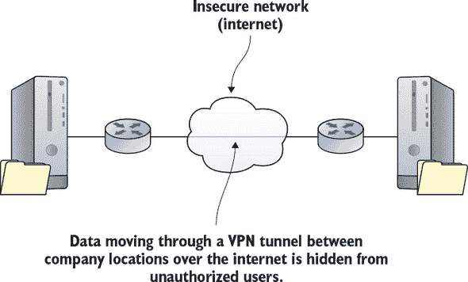
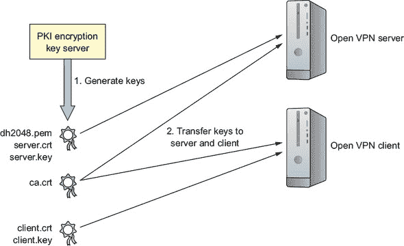
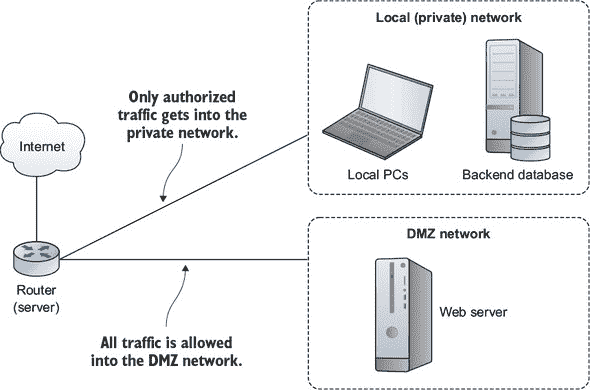
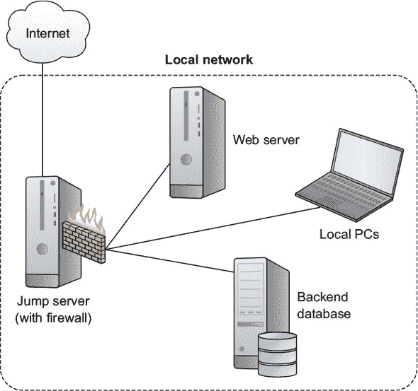
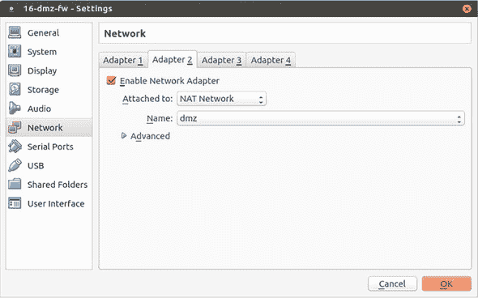

## 第十章\. 保护网络连接：创建 VPN 或 DMZ

*本章涵盖*

+   实施服务器安全配置

+   部署 OpenVPN 隧道以保护远程连接

+   使用防火墙控制段之间的访问

+   使用 iptables 和 Shorewall 创建基于 DMZ 的网络

+   使用虚拟环境测试网络连接解决方案

他们告诉我们我们生活在一个高度移动的世界。不过，我不知道：我很少离开我的家庭办公室。我能享受到家庭办公室的舒适，因为所有我可能需要的服务器资源都可以远程访问。显然，我并不孤单。

几乎所有与 IT 工作相关的人都会时不时地从远程位置访问他们的专业工具。鉴于你通过这些远程位置访问的公共网络本质上是不可靠的，你将想要仔细控制这些连接。

上一章主要关注确保远程客户端使用的数据能够可靠地传输，并且对可能潜伏在连接网络上的任何人都不可见。而本章，与上一章形成鲜明对比，将专注于确保远程客户端使用的数据能够可靠地传输，并且对可能潜伏在连接网络上的任何人都不可见。你看到了区别吗？我也没看到。

事实上，有各种各样的技术致力于保护网络通信，深度防御的原则教导我们永远不要依赖单一技术。这就是你将学习为你的远程活动添加新层保护的地方。

在本章中，你将重温几位老朋友。你将使用 VirtualBox 虚拟机加密来构建一个虚拟专用网络（VPN）隧道，以允许安全的、不可见的远程连接。在另一个项目中，你将设计更复杂的防火墙架构，以战略性地将你的网络划分为隔离的段。最后，你将在 VirtualBox 中构建一个虚拟网络环境，以便你可以测试你的配置。

### 10.1\. 构建 OpenVPN 隧道

在这本书中，我已经详细讨论了加密。SSH 和 SCP 可以保护通过远程连接传输的数据（第三章），文件加密可以保护静态数据（第八章），而 TLS/SSL 证书可以保护网站和客户端浏览器之间传输的数据（第九章）。但有时你的需求需要保护更广泛的连接，因为偶尔你可能需要做不同类型的工作。例如，也许你的团队中的一些成员需要使用公共 WiFi 热点在路上工作。假设随机的 WiFi 接入点是安全的肯定是不明智的，但你的员工确实需要一种方式来连接公司资源——VPN 来拯救。

一个设计得当的 VPN 隧道以隐藏数据在跨越不安全网络传输的方式，为远程客户端和服务器之间提供直接连接。但这又如何呢？您已经看到了很多使用加密来完成这一点的工具。VPN 的真实价值在于一旦您打开了一个隧道，就可以将远程网络连接起来，就像它们都在本地一样。从某种意义上说，您是在绕过那些可疑的咖啡店热点。

使用这样的扩展网络，管理员无论身在何处都可以在其服务器上完成工作。但更重要的是，正如您在图 10.1 中可以看到的，一个资源分散在多个分支办公室的公司可以使所有这些资源对所有需要它们的团队都可见且可访问，无论它们身在何处。

##### 图 10.1\. 通过公共网络连接远程私有连接的隧道



仅凭隧道的存在并不能保证安全。但可以将多种加密标准之一纳入设计之中，从而使事情变得好得多。使用开源 OpenVPN 软件包构建的隧道使用了您在其他地方已经见过的相同 TLS/SSL 加密。OpenVPN 并非隧道连接的唯一选择，但它是最为人所知的之一。而且普遍认为它比使用 IPsec 加密的替代性第二层隧道协议要快一些，也更安全。

您希望您的团队能够在公路上或多个校园之间安全地相互连接。为此，您需要构建一个 OpenVPN 服务器，以允许共享应用程序并访问服务器的本地网络环境。为了使其工作，启动两个虚拟机或容器应该足够了：一个扮演服务器/主机的角色，另一个扮演客户端的角色。构建 VPN 涉及许多步骤，因此花几分钟时间思考这个系统将如何运作可能是值得的。

#### 10.1.1\. 配置 OpenVPN 服务器

在开始之前，这里有一个有用的提示。如果您打算自己跟随这个过程，我强烈推荐这样做，您可能会发现自己需要在桌面上打开多个终端窗口，每个窗口登录到不同的机器。相信我，您会在某个时候将命令输入到错误的窗口中，完全破坏您的环境。为了避免这种情况，您可以使用`hostname`命令将命令行上显示的机器名称更改为一个能视觉上提醒您所在位置的名字。一旦完成，您需要退出服务器并重新登录，以便新设置生效。以下是它的样子：

```
ubuntu@ubuntu:~# hostname OpenVPN-Server
ubuntu@ubuntu:~$ exit                         *1*
<Host Workstation>$ ssh ubuntu@10.0.3.134
ubuntu@OpenVPN-Server:~#
```

+   ***1* 通过退出 shell 并重新登录来激活您的新主机名。**

按照这种方法为每个您正在使用的机器分配适当的名称可以帮助您跟踪您的位置。


##### 注意

在使用 `hostname` 之后，当你运行后续命令时可能会遇到令人烦恼的无法解析主机 OpenVPN-Server 消息。更新 /etc/hosts 文件以匹配新的主机名应该可以解决这个问题。


##### 为 OpenVPN 准备你的服务器

在你的服务器上安装 OpenVPN 需要两个软件包：openvpn 和用于管理加密密钥生成过程的 easy-rsa。CentOS 用户如果需要，应首先以你在第二章中做的方式安装 epel-release 仓库。为了提供一个简单的方法来测试对服务器应用程序的访问，你也可以安装 Apache 网络服务器（Ubuntu 上的 apache2 和 CentOS 上的 httpd）。

当你在设置服务器时，不妨做得正确并激活一个防火墙，该防火墙除了 22（SSH）和 1194（默认 OpenVPN 端口）之外的所有端口都被阻止。以下示例说明了在 Ubuntu 的 ufw 上如何工作，但我相信你仍然记得第九章中的 CentOS 的 firewalld：

```
# ufw enable
# ufw allow 22
# ufw allow 1194
```

要允许服务器上网络接口之间的内部路由，你需要在 /etc/sysctl.conf 文件中取消注释一行(`net.ipv4.ip_forward=1`)。这允许远程客户端在连接后按需进行重定向。要加载新设置，运行 `sysctl -p`：

```
# nano /etc/sysctl.conf
# sysctl -p
```

服务器环境现在已经全部设置好了，但在你准备好切换之前还有一段路要走。接下来几页我们将介绍以下步骤：

1.  使用 easy-rsa 软件包提供的脚本在服务器上生成一套公共密钥基础设施（PKI）加密密钥。实际上，OpenVPN 服务器也充当自己的证书颁发机构（CA）。

1.  准备客户端的匹配密钥。

1.  为服务器配置 server.conf 文件。

1.  配置你的 OpenVPN 客户端。

1.  测试你的 VPN。

##### 生成加密密钥

为了简单起见，你将在运行 OpenVPN 服务器的同一台机器上设置密钥基础设施。然而，安全最佳实践通常建议在生产部署中使用单独的 CA 服务器。在任何情况下，图 10.2 说明了为 OpenVPN 使用生成和分发加密密钥资源的过程。

##### 图 10.2\. 你的 PKI 服务器将创建的文件及其分发目标



当你安装了 OpenVPN 后，一个 /etc/openvpn/ 目录会自动创建，但里面目前还没有太多内容。openvpn 和 easy-rsa 软件包都包含了一些样本模板文件，你可以将这些文件作为配置的基础。为了快速启动认证过程，将 easy-rsa 模板目录从 /usr/share/ 复制到 /etc/openvpn/，然后切换到 easy-rsa/目录：

```
# cp -r /usr/share/easy-rsa/ /etc/openvpn
$ cd /etc/openvpn/easy-rsa
```

因为 easy-rsa 目录现在将包含相当多的脚本，表 10.1 给出了你将使用以创建密钥的工具的快速预览。

##### 表 10.1\. 关键的 easy-rsa 脚本及其功能

| 脚本名称 | 功能 |
| --- | --- |
| clean-all | 清除旧密钥文件，为生成新密钥做准备 |
| pkitool | OpenSSL 的前端（执行大部分密钥生成繁重工作） |
| build-ca | 使用 pkitool 脚本生成根证书 |
| build-key-server server | 使用 pkitool 脚本生成密钥对和证书 |
| build-dh | 设置 Diffie-Hellman 认证参数 |
|  |

##### 注意事项

这些操作需要 root 权限，因此通过`sudo su`，你需要成为 root 用户。

你将要处理的第一份文件名为 vars，其中包含了 easy-rsa 生成密钥时使用的环境变量。你需要编辑该文件，用你自己的值替换掉已经存在的示例默认值。以下是我的文件看起来会是什么样子。

##### 列表 10.1\. 来自 /etc/openvpn/easy-rsa/vars 文件的要点摘录

```
export KEY_COUNTRY="CA"
export KEY_PROVINCE="ON"
export KEY_CITY="Toronto"
export KEY_ORG="Bootstrap IT"
export KEY_EMAIL="info@bootstrap-it.com"
export KEY_OU="IT"
```

运行 vars 文件会将它的值传递到 shell 环境中，这些值将随后被整合到您新键的内容中。为什么仅使用 `sudo` 就不起作用呢？因为第一步是编辑一个名为 vars 的脚本，然后执行它。*执行* 意味着 vars 文件将它的值传递到 shell 环境中，这些值将随后被整合到您新键的内容中。

确保使用新的 shell 再次运行文件，如果你需要完成未完成的进程。当这完成后，脚本将鼓励你运行 clean-all 脚本以删除/etc/openvpn/easy-rsa/keys/目录中存在的任何内容：

```
$ cd /etc/openvpn/easy-rsa/
# . ./vars                              *1*
NOTE: If you run ./clean-all,
  I will be doing a rm -rf on /etc/openvpn/easy-rsa/keys
```

+   ***1* 此命令需要 sudo 权限。**

自然地，你的下一步将是运行那个清理所有内容的脚本，然后是 build-ca 脚本，该脚本使用 pkitool 脚本来创建你的根证书。你将需要确认由 `vars` 提供的识别设置：

```
# ./clean-all
# ./build-ca
Generating a 2048 bit RSA private key
```

接下来是构建密钥服务器脚本。因为它使用了与新的根证书相同的 pkitool 脚本，所以你将需要回答相同的问题来生成密钥对。密钥的名称将基于你传递的参数，除非你在这台机器上运行多个 VPN，否则通常会是`server`，就像这个例子中一样：

```
# ./build-key-server server
[...]
Certificate is to be certified until Aug 15 23:52:34 2027 GMT (3650 days)
Sign the certificate? [y/n]:y
1 out of 1 certificate requests certified, commit? [y/n]y
Write out database with 1 new entries
Data Base Updated
```

OpenVPN 使用通过运行 `build-dh` 生成的 Diffie-Hellman 算法参数来协商新连接的认证。在此处创建的文件不需要保持机密，但它必须使用当前有效的 RSA 密钥通过 build-dh 脚本生成。如果在未来的某个时间点创建了新的 RSA 密钥，也需要更新 Diffie-Hellman 文件：

```
# ./build-dh
```

您的服务器端密钥现在已经被写入到 /etc/openvpn/easy-rsa/keys/ 目录中，但 OpenVPN 并不知道这一点。默认情况下，OpenVPN 将在 /etc/openvpn/ 中查找它们，因此请将它们复制过去：

```
# cp /etc/openvpn/easy-rsa/keys/server* /etc/openvpn
# cp /etc/openvpn/easy-rsa/keys/dh2048.pem /etc/openvpn
# cp /etc/openvpn/easy-rsa/keys/ca.crt /etc/openvpn
```

##### 准备客户端加密密钥

正如您已经看到的，TLS 加密使用匹配的密钥对：一个安装在服务器上，另一个安装在远程客户端上。这意味着您将需要客户端密钥。我们那位老朋友 pkitool 正是制作这些密钥的好工具。此示例在仍位于/etc/openvpn/easy-rsa/目录下运行，将`client`作为参数传递以生成名为 client.crt 和 client.key 的文件：

```
# ./pkitool client
```

两个客户端文件，以及仍然位于 keys/目录中的原始 ca.crt 文件，现在必须安全地传输到您的客户端。由于它们的所有权和权限，这可能有点复杂。最简单的方法是在您的 PC 桌面上运行的终端中手动复制源文件的内容（仅限于这些内容），通过突出显示文本，右键单击并从菜单中选择复制，然后将其粘贴到在客户端登录的第二个终端中创建的同名新文件中。

但任何人都可以剪切和粘贴。相反，要像管理员一样思考，因为您并不总是能够访问到可以进行剪切和粘贴的 GUI。相反，将文件复制到您的用户主目录中（以便远程`scp`操作可以访问它们），然后使用`chown`将文件的所有权从 root 更改为您的常规非 root 用户，以便远程 scp 操作可以工作。确保您的文件现在都已就绪并舒适。您稍后会将它们移动到客户端：

```
# cp /etc/openvpn/easy-rsa/keys/client.key /home/ubuntu/
# cp /etc/openvpn/easy-rsa/keys/ca.crt /home/ubuntu/
# cp /etc/openvpn/easy-rsa/keys/client.crt /home/ubuntu/
# chown ubuntu:ubuntu /home/ubuntu/client.key
# chown ubuntu:ubuntu /home/ubuntu/client.crt
# chown ubuntu:ubuntu /home/ubuntu/ca.crt
```

准备好一套完整的加密密钥后，您需要告诉服务器您想要如何构建 VPN。这是通过使用 server.conf 文件来完成的。


**节省按键**

对于您那双可怜、疲惫的手指来说，输入太多？展开式可以帮您将这六个命令减少到两个。我相信您能够研究这两个示例并弄清楚发生了什么。更重要的是，您将能够弄清楚如何将这些原则应用到涉及数十个甚至数百个元素的操作中：

```
# cp /etc/openvpn/easy-rsa/keys/{ca.crt,client.{key,crt}} /home/ubuntu/
# chown ubuntu:ubuntu /home/ubuntu/{ca.crt,client.{key,crt}}
```


##### 配置 server.conf 文件

您应该如何知道 server.conf 文件应该是什么样子呢？好吧，记得您从/usr/share/中复制的 easy-rsa 目录模板吗？那里还有更多好东西。OpenVPN 安装留下了一个压缩的模板配置文件，您可以将其复制到/etc/openvpn/。我会利用模板是压缩的这个事实来向您介绍一个有用的工具：`zcat`。

您已经知道如何使用`cat`将文件的文本内容打印到屏幕上，但如果文件是用 gzip 压缩的呢？您始终可以解压缩文件，然后`cat`会乐意将其打印出来，但这多了一步或两步。相反，正如您可能已经猜到的，您可以使用`zcat`在一步中将解压缩的文本加载到内存中。在这种情况下，您不会将其打印到屏幕上，而是将文本重定向到名为 server.conf 的新文件中：

```
# zcat \
 /usr/share/doc/openvpn/examples/sample-config-files/server.conf.gz \
 > /etc/openvpn/server.conf
$ cd /etc/openvpn
```

忽略文件附带的大量有用文档，编辑完成后可能看起来是这样的。注意，分号（;）告诉 OpenVPN 不要读取和执行其后的行。

##### 列表 10.2\. 来自`/etc/openvpn/server.conf`文件的活跃设置

```
port 1194
# TCP or UDP server?
proto tcp
;proto udp
;dev tap
dev tun
ca ca.crt
cert server.crt
key server.key  # This file should be kept secret
dh dh2048.pem
server 10.8.0.0 255.255.255.0
ifconfig-pool-persist ipp.txt
push "route 10.0.3.0 255.255.255.0"
keepalive 10 120
comp-lzo
port-share localhost 80
user nobody                      *1*
group nogroup
persist-key
persist-tun
status openvpn-status.log
log openvpn.log                  *2*
;log-append  openvpn.log
verb 3                           *3*
```

+   ***1* 最小化系统权限暴露**

+   ***2* 将会话日志写入到`/etc/openvpn/openvpn.log`**

+   ***3* 输出详细程度，可以高达 9**

让我们逐个分析这些设置：

+   默认情况下，OpenVPN 通过端口号 1194 工作。你可以更改它，可能是为了进一步隐藏你的活动或避免与其他活动隧道冲突。因为它需要客户端之间最少的协调，所以 1194 通常是你的最佳选择。

+   OpenVPN 使用传输控制协议（TCP）或用户数据报协议（UDP）进行数据传输。TCP 可能稍微慢一点，但更可靠，并且更有可能与隧道两端运行的应用程序兼容。

+   当你想创建一个更简单、更有效的 IP 隧道，仅传输数据内容而不传输其他内容时，可以指定`dev tun`。另一方面，如果你需要通过创建以太网桥接连接多个网络接口（以及它们所代表的网络），那么你必须选择`dev tap`。如果你对这一切都不懂，就选择`tun`。

+   接下来的四行将 OpenVPN 传递之前创建的三个服务器认证文件和 dh2048 参数文件的名称。

+   `server`行设置用于在客户端登录时分配 IP 地址的子网范围和子网掩码。

+   可选的`push "route 10.0.3.0 255.255.255.0"`设置允许远程客户端访问服务器后面的私有子网。使此设置生效还需要在服务器本身上进行网络配置，以确保私有子网知道 OpenVPN 子网（10.8.0.0）。

+   `port-share localhost 80`这一行允许进入端口号 1194 的客户端流量被重定向到监听端口号 80 的本地 Web 服务器。（这在当前情况下将很有用，因为你将使用 Web 服务器来测试你的 VPN。）这仅在`proto`设置为`tcp`时才有效。

+   应该通过删除分号（;）来启用`user nobody`和`group nogroup`行。强制远程客户端以 nobody 和 nogroup 身份工作确保了它们在服务器上的会话将不具备特权。

+   `log`设置每次 OpenVPN 启动时覆盖旧日志条目，而`log-append`则将新条目追加到现有日志文件中。openvpn.log 本身将被写入到`/etc/openvpn/`目录。

此外，通常还会在配置文件中添加`client-to-client`，这样多个客户端除了能看到 OpenVPN 服务器外，还能相互看到。一旦你对配置满意，就可以启动 OpenVPN 服务器了：

```
# systemctl start openvpn
```


##### 注意

由于 OpenVPN 和 systemd 之间关系的发展性，启动服务有时可能需要这样的语法：`systemctl start openvpn@server`。


运行 `ip addr` 列出您服务器的网络接口时，现在应该包括一个名为 tun0 的新接口的引用。这将是由 OpenVPN 为 incoming clients 创建的：

```
$ ip addr
[...]
4: tun0: <POINTOPOINT,MULTICAST,NOARP,UP,LOWER_UP> mtu 1500 qdisc [...]
    link/none
    inet 10.8.0.1 peer 10.8.0.2/32 scope global tun0
       valid_lft forever preferred_lft forever
```

可能您需要在一切完全正常工作之前重新启动服务器。下一个步骤：客户端计算机。

#### 10.1.2\. 配置 OpenVPN 客户端

传统上，隧道至少有两个端点（否则我们将它们称为洞穴）。在服务器端正确配置 OpenVPN 将引导流量进入和离开该端的隧道。但您还需要在客户端侧运行某种软件。

在本节中，我将专注于手动配置某种 Linux 计算机作为 OpenVPN 客户端。但这不是您可能想要使用该服务的唯一方式。OpenVPN 本身维护着可以在 Windows 或 Mac 桌面和笔记本电脑、Android 和 iOS 智能手机和平板电脑上安装和使用的客户端应用程序。有关详细信息，请参阅 [`openvpn.net`](https://openvpn.net) 网站。

OpenVPN 软件包需要在客户端计算机上安装，就像在服务器上一样，尽管这里不需要 easy-rsa，因为您将使用的密钥已经存在。您需要将客户端.conf 模板文件复制到刚刚创建的 /etc/openvpn/ 目录。这次，由于某种原因，文件不会被压缩，所以普通的 `cp` 就可以完成工作：

```
# apt install openvpn
# cp /usr/share/doc/openvpn/examples/sample-config-files/client.conf \
 /etc/openvpn/
```

您客户端.conf 文件中的大多数设置都将相当明显：它们需要与服务器使用的值匹配。正如您可以从下一个示例文件中看到的那样，一个独特的设置是 `remote 192.168.1.23 1194`，它将客户端指向服务器的 IP 地址。再次强调，请确保您使用您服务器的地址。您还应该强制客户端验证服务器证书的真实性，以防止可能的中间人攻击。这样做的一种方法是通过添加 `remote-cert-tls server` 行。

##### 列表 10.3\. VPN 客户端的 /etc/openvpn/client.conf 文件中的活动设置

```
client                          *1*
;dev tap
dev tun
proto tcp
remote 192.168.1.23 1194        *2*
resolv-retry infinite
nobind
user nobody
group nogroup
persist-key
persist-tun
ca ca.crt
cert client.crt
key client.key
comp-lzo
verb 3
remote-cert-tls server          *3*
```

+   ***1* 识别计算机为 VPN 客户端，其配置将基于远程服务器**

+   ***2* 用于访问 VPN 服务器的地址和网络端口**

+   ***3* 强制服务器证书验证**

现在您可以移动到 /etc/openvpn/ 目录并从服务器拉取那些证书密钥。用您服务器的 IP 地址或域名替换示例中的地址：

```
$ cd /etc/openvpn
# scp ubuntu@192.168.1.23:/home/ubuntu/ca.crt .            *1*
# scp ubuntu@192.168.1.23:/home/ubuntu/client.crt .
# scp ubuntu@192.168.1.23:/home/ubuntu/client.key .
```

+   ***1* 句点 (.) 在末尾告诉 scp 将文件保存到当前目录。**

直到你在客户端启动 OpenVPN 之前，不太可能发生任何激动人心的事情。因为你需要传递几个参数，所以你会从命令行触发。参数`--tls-client`告诉 OpenVPN 你将作为客户端并通过 TLS 加密连接，而`--config`指向你的配置文件：

```
# openvpn --tls-client --config /etc/openvpn/client.conf
```

仔细阅读命令输出以确保你已正确连接。如果第一次出现错误，可能是由于服务器和客户端配置文件之间的设置不匹配，或者可能是网络连接/防火墙问题。以下是一些故障排除步骤：

+   仔细阅读客户端上 OpenVPN 操作的输出。它通常会包含关于它无法做什么以及为什么的宝贵提示。

+   在服务器上/etc/openvpn/目录中的 openvpn.log 和 openvpn-status.log 文件中检查错误相关的消息。

+   检查服务器和客户端系统日志中的 OpenVPN 相关和及时消息。（`journalctl -ce`将打印出满屏的最新条目。）

+   确认服务器和客户端之间有一个活跃的网络连接（详情请见第十四章）。

#### 10.1.3\. 测试你的 VPN

如果客户端加载时 OpenVPN 输出的所有内容看起来都正常，那么你应该继续测试你的隧道以确认它正在工作并保护你的连接。从客户端使用 OpenVPN 端口针对服务器地址运行`curl`应该返回你的 Web 根目录中的 index.html 文件（/var/www/html/）：

```
curl 192.168.1.23:1194
```

通过移除端口号及其前面的冒号来测试你的设置。假设你的防火墙以之前的设置运行，`curl`不应该工作。

事实上，这本身并不是一个有用的测试。毕竟，VPN 的目标是防止你的会话活动对网络上其他人可见，所以能够加载页面并不能证明什么。不深入细节，以下几节建议了一些方法（不分先后顺序）来确认你的 VPN 是否正常工作。

##### 网络嗅探

将一台常规的 GUI 桌面 PC 设置为客户端，并使用浏览器打开需要某种数据输入的服务器端应用程序。对于应用程序，你可以使用以下简单的 HTML 表单。

##### 列表 10.4\. 提供浏览器数据输入表单的简单 HTML 页面

```
<!DOCTYPE html>
<html>
<body>
<form action="/action_page.php">
  First name:<br>
  <input type="text" name="firstname" value="Your">
  <br>
  Last name:<br>
  <input type="text" name="lastname" value="Name">
  <br><br>
  <input type="submit" value="Submit">
</form>
</body>
</html>
```

你可以将文件保存到服务器的 Web 文档根目录，例如 form.html。然后，你将使用 192.168.1.23/form.html URL（替换你的服务器 IP 地址）访问该页面。

为了找出你输入到表单中的信息是否会被未经授权的眼睛看到，你可以使用 Wireshark 等网络数据包嗅探软件来捕获和分析数据。如果隧道成功加密了会话，那么包含你输入的名称的数据包将无法理解。

不幸的是，一本关于如何设置和使用 Wireshark 进行此目的的有用指南将需要自己的完整章节。由于这将远离我们钟爱的 Linux，那个章节将不得不在另一本书中找到位置。

##### 网络基础设施

测试 VPN 的另一种方法是在服务器的本地网络内设置资源（服务器、路由器等），这是从你的 server.conf 文件中将客户端推送到的地方。构建一种基础设施以使其工作可能相当复杂。但如果你能成功做到这一点，并且你的客户端可以访问这些资源，那么你就知道一切正常。我在本章末尾添加了一个使用 VirtualBox 构建此类基础设施的指南。

### 10.2. 构建防入侵网络

通过加密的魔力，VPN 非常适合保护会话数据。防火墙可以通过端口、协议或路由信息很好地控制进出流量。从理论上讲，这应该足以保护你的服务器网络。毕竟，如果你已经将除了几个方法之外的所有方法都锁定在你的网络中，并加强了剩余几个门的锁（例如，使用无密码密钥对认证 SSH），那么你应该很安全，对吧？如果事情真的这么简单就好了。

无论你多么优秀，在 IT 安全方面，100%的保证是不存在的。你尽你所能了解新的威胁类型，修补你的软件，审计你的流程，并微调你的防火墙，但总有人会找到一种方法穿过墙壁。除了人为错误和有缺陷或故意被破坏的软件的风险之外，量子计算机器能够破解加密算法并变得广泛可用只是时间问题。

实际上，解决方案是通过尽可能多地添加安全配置文件中的层级来过度配置，这样即使坏人通过了第一个关卡，仍然还有两三个关卡在你和深渊之间。 (之前我们称之为深度防御。) 经过深思熟虑，你可能会决定其中一层涉及将资源分成多个隔离的网络，希望如果其中一个被攻破，其他网络可能仍然得到保护。

当所有事情都讨论完毕后，主要目标是安全地暴露所有应该暴露的服务，并严格保护其他一切。假设你正在运行一个托管公开应用的 Web 服务器。用户的浏览器将从 Web 服务器加载页面，而用户信息和应用程序数据则由运行数据库的第二个服务器处理。你希望地球上每个人（以及可能在大气层低轨道欣赏风景的任何人）都能访问你的 Web 服务器，但关闭对数据库服务器的所有公开访问。让我们讨论一下如何完成这个特别的魔术表演。

#### 10.2.1. 非军事化区域（DMZ）

一种流行的隔离架构被称为*DMZ*（这是描述两个不信任国家之间地理缓冲区的短语的缩写：非军事区）。其想法是将你的服务器、工作站、WiFi 路由器和其他资源划分为单独的网络。为了使其工作，你的每个设备都需要物理连接到单独的网络接口。

DMZ 的一个简单实现，如图 10.3[figure 10.3]所示，是使用单个服务器作为路由器，在互联网和两个内部网络之间重定向流量。其中一个网络可能包含后端数据库或你在办公室中使用的工作站和笔记本电脑。这个网络将通过严格的访问规则得到高度保护。另一个网络将享有相当直接和容易的外部世界访问，可能包括像 Web 服务器这样的公共资源。

##### 图 10.3. 一个简单的三接口 DMZ 架构



在继续构建自己的 DMZ 环境之前，你应该至少了解一些 DMZ 模型的替代方案。我将在接下来的章节中提到一些。

##### 抵抗性网络：设计考虑因素

除了 DMZ 之外，它们足够可靠和灵活，可以成为各种用例的候选者，还有其他你可能考虑的网络安全配置模型。

一个*跳转服务器*（有时被称为跳转盒或，也许，堡垒主机）是一个对互联网开放的轻量级服务器，它只赋予一个功能：允许远程 SSH 客户端登录，然后“跳转”到跳转服务器私有网络上运行的其他服务器。如图 10.4figure 10.4 所示，网络上的私有服务器将配置某种访问控制，仅允许来自跳转服务器的远程登录访问。

##### 图 10.4. 一个典型的跳转服务器架构



跳转服务器（按照定义，代表一个可能的单点故障和额外的复杂性层）不像以前那样受欢迎。如第九章 chapter 9 中提到的，像 Juniper 和 Cisco 这样的公司提供的专有硬件解决方案可以用来管理大型企业部署的连接性和安全性。但这类硬件的成本以及你需要克服的显著的学习曲线有时可能会超过其带来的好处。

在混合云解决方案中，公司基础设施既托管在本地，又托管在远程云平台上，这些系统中的任何一个都不一定对混合云解决方案有很大意义。但底层工具和设计概念始终会很有用。

##### 为什么使用 DMZ？

接下来，我将讨论使用两个广泛使用的软件防火墙包创建 DMZ：iptables 和 Shorewall。在我这样做之前，我应该告诉你，从所有目的和意义上讲，它们基本上是同一件事。Shorewall 是一个更用户友好的工具，它所做的只是在不让你看到的情况下操作 iptables 规则。这里有两条原因，为什么我想让你看到这两种方法：

+   通常情况下，会有一些狭窄、实用的考虑因素来指导你选择这些工具，因此拥有多个选项可以让你有一个良好的起点。

+   即使你最终选择使用像 Shorewall 这样更简单的解决方案，了解 iptables 在其自然环境中也是有益的。这将有助于加深你对 Linux 防火墙的一般理解。

好了，让我们开始吧。警告：接下来的内容是复杂且深入的。如果你觉得不感兴趣，可以直接跳到本章的结尾。记住，下次有人要求你构建这类基础设施时，一定要回到这里。

#### 10.2.2\. 使用 iptables

iptables 是用于管理 Linux 机器上防火墙规则的工具。iptables？那么你之前章节中学到的 ufw 和 firewalld 命令集怎么办？所以，你不喜欢选择吗？如果告诉你还有一个名为 nftables 的第四个工具，会不会破坏你的心情？

好吧，我承认整个事情确实有点奇怪，所以让我来解释一下。一切始于 *netfilter*，它在 Linux 内核模块级别控制对网络堆栈的访问。几十年来，管理 netfilter 钩子的主要命令行工具是 iptables 规则集。

因为调用这些规则所需的语法可能显得有些晦涩，因此引入了各种用户友好的实现，如 ufw 和 firewalld，作为更高级的 netfilter 解释器。然而，ufw 和 firewalld 主要设计用来解决独立计算机面临的问题。构建完整的网络解决方案通常需要 iptables 的额外力量，或者从 2014 年起，它的替代品 nftables（通过 nft 命令行工具）。

iptables 并没有消失，仍然被广泛使用。实际上，你应该预期在接下来的许多年里，作为管理员，你可能会遇到被 iptables 保护的网络。但是，通过扩展经典的 netfilter 工具集，nftables 增加了一些重要的新功能。然而，为了简单起见，我将使用 iptables 来快速展示如何从命令行手工构建一个 DMZ。完成这个任务后，我们将转向稍微更直观的 Shorewall 实现。

#### 10.2.3\. 使用 iptables 创建 DMZ

iptables 应该默认安装。要确认这一点，你可以运行`iptables -L`来列出所有当前规则。如果你还没有玩过它，你应该看到一个完全开放的（`ACCEPT`）防火墙。请注意，`INPUT`、`FORWARD`和`OUTPUT`链都是默认`Filter`表的一部分。默认存在的 NAT 表可以用来更改（或转换）数据包的路由信息，以便它可以在网络之间成功移动。我们稍后会再次讨论 NAT：

```
# iptables -L
Chain INPUT (policy ACCEPT)                                  *1*
target     prot opt source     destination
ACCEPT     tcp  --  anywhere   anywhere     tcp dpt:domain
ACCEPT     udp  --  anywhere   anywhere     udp dpt:domain
ACCEPT     tcp  --  anywhere   anywhere     tcp dpt:bootps
ACCEPT     udp  --  anywhere   anywhere     udp dpt:bootps

Chain FORWARD (policy ACCEPT)
target     prot opt source     destination
ACCEPT     all  --  anywhere   anywhere
ACCEPT     all  --  anywhere   anywhere

Chain OUTPUT (policy ACCEPT)
target     prot opt source     destination
```

+   ***1* 输出（在这种情况下是过滤表的一部分）通过链来标识规则：在这个第一个例子中是 INPUT。**

一旦你有了整体计划，在这个例子中是通过 DMZ 设置来区分你运行的服务器类型，你应该设置一个严格的默认策略。


##### 小贴士

防火墙管理员规则#1：在开始之前，始终知道它应该如何结束。


这些规则构成了防火墙的基础，通过阻止（`DROP`）所有接口的所有传入和转发流量，但允许传出：

```
# iptables -P INPUT DROP
# iptables -P FORWARD DROP
# iptables -P OUTPUT ACCEPT
```

因为他们的互联网连接是通过路由服务器（可能通过网络交换机）进行的，所以你网络上的所有设备都会自动绑定到这些规则。亲自测试一下。再次提醒，你可以自由使用以下描述的虚拟网络基础设施。我们将假设连接到你的防火墙服务器的三个网络接口的名称如表 10.2 中所述。

##### 表 10.2\. 用于后续示例的网络接口标识

| 标识 | 目的 |
| --- | --- |
| eth0 | 连接到互联网 |
| eth1 | 连接到 DMZ |
| eth2 | 连接到本地私有网络 |
|  |

**Linux 网络接口命名约定**

从前，你可以安全地假设你的 Linux 发行版会为连接到你的计算机的物理网络接口分配简单直接的名字。第一个识别的以太网接口将是 eth0，第二个是 eth1，以此类推；无线接口将是 wlan0 和 wlan1 等等。（如你在第九章中看到的，虚拟设备如隧道和桥接可以使用不同的约定来命名。）关键是，即使你不知道接口的确切名称，你通常也能很快猜出来。但在你的现代 systemd 机器上运行`ip addr`，你可能会遇到类似 enp1s0 这样的东西。或者，这个令人厌恶的东西：wlx9cefd5fe4a18。当你重复它时，听起来怎么样？

这里发生的事情是这样的。出于许多合理的理由，使用可预测接口名称的系统更容易管理，即使有一些便利性的权衡。一个以太网接口可能由*en*表示以太网，*p1*表示总线 1，*s0*表示第一个物理插槽。而不同的设备可能得到*wl*（无线局域网）和*x9cefd5fe4a18*，其中*x*表示随后的十六进制数是设备的 MAC 地址。

只要您知道设备连接在哪里以及/或它的 MAC 地址是什么，您就可以安全地预测其接口名称。然而，为了简单起见，我将在本章的示例中使用较旧的约定。


您希望本地网络内的设备能够与 DMZ 中的公共服务器通信，包括路由器本身。这两条规则被添加到 `Filter` 表中的 `FORWARD` 链，将允许数据包在 eth1 和 eth2 接口背后的网络之间移动（`FORWARD`）。`-A` 表示以下内容应作为新规则添加。这允许 DMZ 中的您的 Web 服务器与私有网络中的数据库服务器交换数据：

```
iptables -A FORWARD -i eth1 -o eth2 -m state \
 --state NEW,ESTABLISHED,RELATED -j ACCEPT
iptables -A FORWARD -i eth2 -o eth1 -m state \
 --state ESTABLISHED,RELATED -j ACCEPT
```

下一条规则将被添加到 NAT 表（`-t nat`）。它使用 TCP 协议处理通过 eth0 接口到达您应用程序（虚构的）公共 IP 地址（54.4.32.10）的所有流量，并指定它想要使用 HTTP 端口 80。任何满足所有这些条件的流量都将被重定向到 DMZ 中您的 Web 服务器的互联网 IP 地址（192.168.1.20）：

```
iptables -t nat -A PREROUTING -p tcp -i eth0 -d 54.4.32.10 \
 --dport 80 -j DNAT --to-destination 192.168.1.20
```

因为您还没有通过 eth0 接口从互联网打开任何访问权限到 DMZ 或私有网络，所以外部来的任何东西都无法到达任何本地服务器。

您可能认为您已经完成了，但实际上您还没有。等上半个小时左右，您应该开始收到来自您团队开发者的愤怒邮件，他们想知道为什么他们无法下载关键的软件更新或可爱的猫咪视频。准备好自定义您的防火墙设置以适应意外的特殊需求（例如访问远程软件仓库或云资源）。理想情况下，您应该在构建防火墙之前预测您将需要的东西，但老式的“扣动扳机看看什么会坏”的方法也有效。

如我之前提到的，iptables 已经不再是防火墙技术的先锋了，这个例子非常基础，但我认为它确实有助于说明这类事物是如何工作的。如果您对大人物和女士如何在新的部署中完成这类事情感兴趣，可以使用 nftables 组装类似内容的官方指南可在 [`mng.bz/b0DM`](http://mng.bz/b0DM) 获取。

#### 10.2.4\. 使用 Shorewall 创建 DMZ

我确信您已经知道了流程：第一步是获取软件。Ubuntu 用户可以使用 APT 安装 shorewall 软件包，而 CentOS 用户则需要通过 epel-release 仓库来获取：

```
# yum install epel-release
# yum install shorewall
```

与基于命令行的 iptables 不同，Shorewall 通过配置文件进行管理。我个人发现，配置文件提供的复杂设置的稳固视觉表示令人安心。一旦您理解了 Shorewall 设置是如何分布在五六份文件中的，您可能会发现使用 Shorewall 语法比使用 iptables 更不令人畏惧。

Shorewall 启动选项由 /etc/default/shorewall 文件控制，但防火墙配置通常由 /etc/shorewall/ 目录中的多个文件处理。/etc/shorewall/shorewall.conf 设置 Shorewall 将在其中运行的 shell 环境。对于简单的项目，您甚至可能不需要修改该文件或您也会在那里找到的 params 和 conntrack 文件。但是，您将需要创建一些其他文件，这些文件在 /usr/share/doc/shorewall/examples/（或在 CentOS 上的 /usr/share/doc/shorewall-5.0.14.1/Samples，其中 5.0.x 是版本号）中存在模板。如果您列出 examples/ 目录的内容，您将看到四个子目录，这些子目录反过来又包含覆盖许多常见场景的示例配置文件：

```
# ls /usr/share/doc/shorewall/examples/
LICENSE.gz     README.txt        two-interfaces
one-interface  three-interfaces  Universal
```

尽管三个接口选项看起来非常适合我们在这里的计划，但我们将从零开始构建所需的内容，以便您可以清楚地看到整个过程是如何工作的。表 10.3 展示了您可能会使用到的 /etc/shorewall/ 文件的一个快速概述。

##### 表 10.3\. 保存于 /etc/shorewall/ 的 Shorewall 配置文件

| Filename | 目的 | 必需 |
| --- | --- | --- |
| zones | 声明您想要创建的网络区域 | 是 |
| interfaces | 定义用于指定区域的网络接口 | 是 |
| policy | 定义控制区域间流量的高级规则 | 是 |
| rules | 定义策略文件中的规则例外 | 否 |
| masq | 定义动态 NAT 设置 | 否 |
| stoppedrules | 定义 Shorewall 停止时的流量流向 | 否 |
| params | 为 Shorewall 设置 shell 变量 | 否 |
| conntrack | 允许指定的流量从 Netfilter 连接跟踪中豁免 | 否 |

通过调用 `man shorewall-` 并提供你正在寻找的特定文件名称，可以通过 `man` 命令找到大量良好的文档：

```
$ man shorewall-rules
```

##### 区域文件

让我们开始使用文本编辑器创建一个区域文件。第一行定义了 Shorewall 服务器为类型 `firewall`。您将创建的每个三个活动区域都将使用 `ipv4` 地址（与 `IPv6` 相反）。`net` 区域代表公共网络（所有酷孩子都称之为互联网），`dmz` 将是您基础设施中的公共面向区域，而 `loc` 将是您后端服务器的私有、本地网络。

##### 列表 10.5\. /etc/shorewall/zones

```
fw firewall
net ipv4
dmz ipv4
loc ipv4
```

##### 接口文件

现在，您需要创建一个名为 interfaces 的文件，在该文件中，您将把每个新区域与连接到 Shorewall 服务器的三个网络接口之一关联起来。`detect` 告诉 Shorewall 您希望网络设置自动检测；`dhcp` 表示您希望 DHCP 服务器自动分配 IP 地址给您的接口。并且 `nosmurfs,routefilter,logmartians` 在面向互联网的接口上会过滤可疑的包和源域，并记录相关事件。

##### 列表 10.6\. /etc/shorewall/interfaces

```
net eth0 detect dhcp,nosmurfs,routefilter,logmartians           *1*
dmz eth1 detect dhcp
loc eth2 detect dhcp
```

+   ***1* 将 eth0 接口映射到互联网（net）区域并建立行为协议**

##### 策略文件

策略文件建立了你想要的默认、基准行为。在这个示例中，第一行将静默删除来自互联网（`net`）的所有流量，指向任何目的地。从私有区域（`loc`）到互联网的出站流量是允许的，使本地计算机能够接收软件更新。第三行说明来自防火墙的流量应在任何地方被接受。最后一行拒绝其他规则未涵盖的所有数据包。

##### 列表 10.7\. /etc/shorewall/policy

```
net all DROP              *1*
loc net ACCEPT
fw all ACCEPT
all all    REJECT         *2*
```

+   ***1* DROP 将删除过滤后的数据包，但 REJECT 将删除并还会向发送者发送通知。**

+   ***2* 此策略必须放在最后，因为它涵盖了所有前一条规则未涵盖的流量。**

##### 规则文件

除了这个简单配置外，你还需要创建的另一个文件是规则文件。随着你的需求变化，规则文件可能会变得相当长且复杂。然而，对于这个练习，你只需要几行。规则文件的主要目标是微调策略文件的粗略排除。

例如，因为你在 DMZ 区域运行 Web 服务器，你希望允许所有使用 TCP 协议的流量通过端口 80（不安全的 HTTP）或端口 443（安全的 HTTP）访问。你还希望从你的本地服务器到 DMZ 中的机器（包括 Shorewall 防火墙服务器本身）开放 SSH 访问。没有 SSH，本地网络上的管理员工作站如何能够管理防火墙？

如果需要远程 SSH 访问，你可能还需要从 net 网络到防火墙开放端口 22。`Web(DNAT)` 规则允许从互联网到 DMZ 中你的 Web 服务器的端口转发访问。尽管这不是本章示例的一部分，如果你最终在你的防火墙机器上运行 DNS 服务器，你也将从你的本地网络到防火墙机器开放端口 53 的访问。

##### 列表 10.8\. /etc/shorewall/rules

```
ACCEPT all dmz tcp 80,443
ACCEPT net dmz tcp 22
ACCEPT loc dmz tcp 22
ACCEPT loc fw udp 53
Web(DNAT) net dmz:10.0.1.4
```

剩下的就是启动防火墙机器上的 Shorewall：

```
# systemctl start shorewall
```


##### 注意

不要忘记在修改配置文件后重新启动 Shorewall。而且不要以为你不会修改配置文件，因为你努力让一切按预期工作。


### 10.3\. 为基础设施测试构建虚拟网络

你和我都知道，在理解一个工具的工作原理之前，你必须亲自尝试它。但尝试本章讨论的部署将需要不止一个或两个虚拟服务器进行测试。要做好这项工作，你需要设置多个网络，其 I/O 访问可以完全控制。

如果你有一些闲置的机器、一些电缆和几个交换机，那么，太好了，卷起袖子开始吧。我本人非常怀念玩服务器和网络硬件。但我能做什么呢？我的世界几乎完全是虚拟的：我甚至记不起上一次打开自己的工作站是什么时候了。

如果像我一样，你只能通过命令行构建自己的网络，以下是它的工作方式。你将使用 VirtualBox 创建几个虚拟 NAT 网络，为你要启动的每个虚拟机提供网络接口，并手动将这些接口与适当的网络关联起来。

请记住，你能在 VirtualBox 主机机器上启动的虚拟机数量受限于你主机机器上的空闲物理内存和 CPU 能力。在一个运行在 8GB RAM 上的 Linux 主机上，你可能能够挤出三个并发虚拟机。除非你至少有 16GB 的 RAM，否则不要在 Windows 主机上尝试这样做。考虑将一个或两个虚拟机卸载到网络内的另一台单独的 PC 上。

你将使用 vboxmanage 命令行工具进行第一步（为 DMZ 配置创建网络）。据我所知，从 VirtualBox GUI 内部无法完成这项操作。命令`natnetwork add`告诉 VirtualBox 你想要添加一个新的 NAT 网络。在第一个例子中，netname 将是 dmz，子网将是 10.0.1.0/24。第二个网络将被称为 loc（代表本地），其子网将是 10.0.2.0/24。当网络创建完成后，你将使用`natnetwork start`启动它们：

```
$ vboxmanage natnetwork add --netname dmz \
 --network "10.0.1.0/24" --enable --dhcp on         *1*
$ vboxmanage natnetwork add --netname loc \
 --network "10.0.2.0/24" --enable --dhcp on
$ vboxmanage natnetwork start --netname dmz
$ vboxmanage natnetwork start --netname loc
```

+   ***1* 因为这些只是虚拟网络，创建它们不需要管理员权限。**

| |
| --- |

##### 注意

由于一个已知的错误，可能无法在 5.1 版本之前的 VirtualBox 版本上创建和运行 NAT 网络。

| |
| --- |

下一步是创建（或者更好，克隆）你需要的虚拟机。（确保你的主机机器有足够的系统内存和 CPU 处理你计划启动的所有虚拟机。）在启动虚拟机之前，点击 VirtualBox 列表中第一个虚拟机的名称一次，然后点击设置按钮，然后点击左侧的“网络”项。如果这个虚拟机将是一个 Shorewall 服务器，那么将其第一个网络适配器连接到通常用于给你的虚拟机提供完全互联网访问的接口。

现在点击适配器 2 标签，然后点击“附加到”下拉菜单，选择 NAT 网络设置。因为你已经创建了一些 NAT 网络，两者都应作为选项可用（图 10.5）。为适配器 2 选择其中一个，然后为适配器 3 选择另一个。

##### 图 10.5\. 将连接到 NAT 网络的网络适配器与 VirtualBox 虚拟机关联



要完成 Shorewall 测试环境，请处理其他两个虚拟机的设置 | 网络部分，并将一个与 dmz NAT 网络关联，另一个与 loc 关联。这两个虚拟机将各自只有一个接口。

完成所有这些后，您可以启动您的三个虚拟机并登录。在每个虚拟机上运行`ip addr`以确认接口已被识别并连接到其网络。如果您在 inet 行上看到正确的 IP 地址（如 10.0.1.5/24），那么一切正常：

```
$ ip addr
2: enp0s3:: <BROADCAST,MULTICAST,UP,LOWER_UP> mtu 1500 qdisc [...]
    inet 10.0.1.5/24 brd 10.0.1.255/ scope global enp0s3              *1*
       valid_lft forever preferred_lft forever
```

+   ***1* 此接口已正确连接到您的 dmz NAT 网络。**

但如果没有 inet 地址，那么您需要手动启动它。以示例中的接口名称（enp0s3）为例，将其用作`ifconfig up`的参数。这告诉接口最好醒来并开始工作。然后运行`dhclient`将从 DHCP 服务器请求 dmz 网络上的 IP 地址。（还记得您在创建 NAT 网络时设置`--dhcp on`的原因吗？那是有原因的。）

```
# ifconfig enp0s3 up
# dhclient enp0s3            *1*
```

+   ***1* 如果此操作失败，可能是您的网络硬件或配置有问题。**

最后，再次运行`ip addr`以确保一切正常。您已经拥有了一个测试环境。如果您对子网划分和 NAT 网络不是很清楚，一切都没有失去：耐心等待第十四章。

### 摘要

+   VPN 隧道可以用来保护远程连接，也可以在远程位置之间安全地暴露网络基础设施。

+   Easy RSA 软件包包含可以用于为 TLS 加密应用程序生成完整公共密钥基础设施（PKI）的脚本。

+   防火墙和网络架构可以一起使用，为不应暴露给公共网络的资源创建受保护的子网环境。

+   Shorewall 防火墙工具通过纯文本文件配置，而 iptables 防火墙实现则通过命令行进行控制。

+   DMZ 网络结构使用防火墙配置将易受攻击的资源放置在受保护的私有子网中，并将面向公众的服务器放置在子网中，从而允许更方便的远程访问。

+   iptables 和 nftables 是 netfilters Linux 内核防火墙工具的深度和灵活的命令行实现。

### 关键术语

+   *虚拟专用网络*（VPN）是一种连接远程网络并在它们之间安全暴露资源的方法。

+   *VPN 隧道*描述了网络协议如何被用来在跨越不安全网络时隐藏 VPN 流量。

+   *VPN 客户端*是登录到或通过 VPN 服务器的设备。在 OpenVPN 的情况下，客户端可以是运行 OpenVPN GUI 客户端应用程序的手机或 PC，或者配置了 OpenVPN 的 Linux 机器。

+   类似于 WireShark 的*数据包嗅探器*可以捕获并分析在网络中移动的数据包，揭示它们的内容、来源和目的地细节。

+   一个 *NAT 网络* 向公共网络呈现单个外部 IP 地址，同时管理其后私有设备之间的流量。这将在第十四章中详细讨论。

### 命令行审查

+   `hostname OpenVPN-Server` 设置命令提示符描述，以便更容易跟踪您登录的服务器。

+   `cp -r /usr/share/easy-rsa/ /etc/openvpn` 将 Easy RSA 脚本和环境配置文件复制到工作 OpenVPN 目录。

+   `./build-key-server server` 生成一个名为 server 的 RSA 密钥对。

+   `./pkitool client` 从现有的 RSA 密钥基础设施生成客户端密钥集。

+   `openvpn --tls-client --config /etc/openvpn/client.conf` 使用 client.conf 文件中的设置在 Linux 客户端启动 OpenVPN。

+   `iptables -A FORWARD -i eth1 -o eth2 -m state --state NEW,ESTABLISHED,RELATED -j ACCEPT` 允许 eth1 和 eth2 网络接口之间的数据传输。

+   `man shorewall-rules` 显示 Shorewall 所使用的规则文件的文档。

+   `systemctl start shorewall` 启动 Shorewall 防火墙工具。

+   `vboxmanage natnetwork add --netname dmz --network "10.0.1.0/24" --enable --dhcp on` 使用 VirtualBox CLI 创建和配置一个带有 DHCP 的虚拟 NAT 网络，用于 VirtualBox 虚拟机。

+   `vboxmanage natnetwork start --netname dmz` 启动一个虚拟 NAT 网络。

+   `dhclient enp0s3` 从 DHCP 服务器请求 enp0s3 接口的 IP 地址。

### 自我测试

> **1**
> 
> 正确配置的 OpenVPN 隧道可以通过以下方式提高安全性：
> 
> 1.  将防火墙规则应用于控制网络之间的访问
> 1.  
> 1.  通过子网划分隔离网络连接设备
> 1.  
> 1.  向网络连接添加加密
> 1.  
> 1.  隐藏通过公共网络移动的流量
> 1.  
> **2**
> 
> 要在服务器上启用内部路由，您需要在 /etc/sysctl.conf 文件中取消注释一行。哪一行？
> 
> 1.  `net.ipv4.ip_forward=1`
> 1.  
> 1.  `net.ipv4.tcp_syncookies=1`
> 1.  
> 1.  `net.ipv6.conf.all.accept_redirects = 0`
> 1.  
> 1.  `net.ipv4.conf.all.accept_source_route = 0`
> 1.  
> **3**
> 
> 安装 easy-rsa 后，您将在哪里找到用于生成密钥的脚本？
> 
> 1.  /usr/share/easy-rsa/
> 1.  
> 1.  /usr/share/easy-rsa/scripts/
> 1.  
> 1.  /usr/share/easy-rsa/examples/
> 1.  
> 1.  /usr/share/docs/easy-rsa/
> 1.  
> **4**
> 
> 以下哪个脚本将在生成 RSA 脚本方面做大部分工作？
> 
> 1.  变量
> 1.  
> 1.  build-key-server
> 1.  
> 1.  build.ca
> 1.  
> 1.  pkitool
> 1.  
> **5**
> 
> 安装 OpenVPN 后，您将在哪里找到配置文件模板？
> 
> 1.  /usr/share/doc/openvpn/examples/sample-config-files/server.conf/
> 1.  
> 1.  /usr/share/doc/openvpn/sample-config-files/server.conf.gz
> 1.  
> 1.  /usr/share/doc/openvpn/examples/sample-config-files/server.conf.gz
> 1.  
> 1.  /usr/share/openvpn/examples/sample-config-files/server/
> 1.  
> **6**
> 
> 以下哪个值可以添加到 /etc/openvpn/server.conf 文件中，以将客户端端口转发到 Web 服务器？
> 
> 1.  `port-share localhost 80`
> 1.  
> 1.  `proto tcp`
> 1.  
> 1.  `client-to-client`
> 1.  
> 1.  `push "route 10.0.3.0 255.255.255.0"`
> 1.  
> **7**
> 
> 以下哪个 iptables 命令会静默地阻止发送到接口的所有流量？
> 
> 1.  `iptables -P OUTPUT DROP`
> 1.  
> 1.  `iptables -P INPUT DROP`
> 1.  
> 1.  `iptables -P INPUT REJECT`
> 1.  
> 1.  `iptables -P FORWARD DROP`
> 1.  
> **8**
> 
> 以下哪个 Shorewall 文件用于为您的防火墙设置默认访问配置文件？
> 
> 1.  params
> 1.  
> 1.  接口
> 1.  
> 1.  规则
> 1.  
> 1.  策略

#### 答案键

> **1.**
> 
> c
> 
> **2.**
> 
> a
> 
> **3.**
> 
> a
> 
> **4.**
> 
> d
> 
> **5.**
> 
> c
> 
> **6.**
> 
> a
> 
> **7.**
> 
> b
> 
> **8.**
> 
> d
