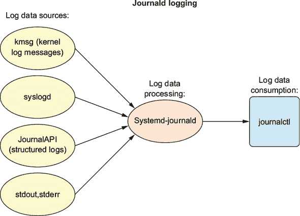
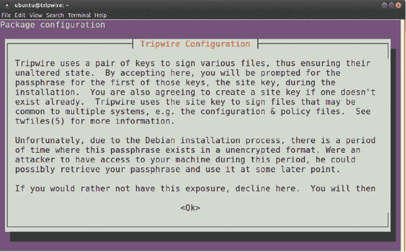
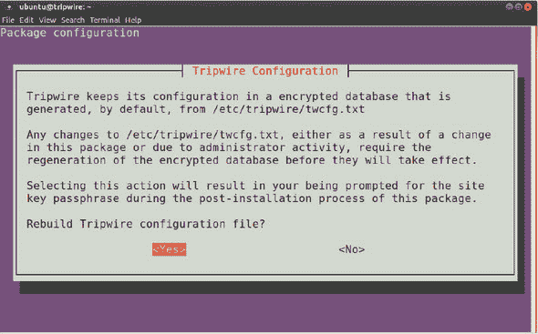
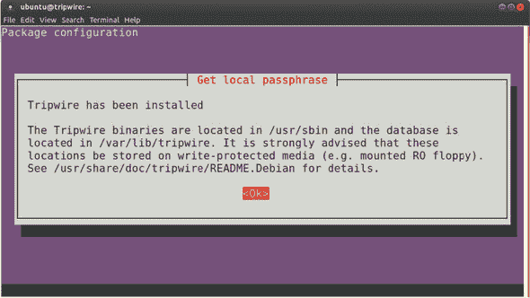

## 第十一章. 系统监控：与日志文件一起工作

*本章涵盖*

+   过滤日志条目以维护系统健康

+   关心并培养你的 Linux 日志系统

+   使用 grep、awk 和 sed 过滤文本流

+   部署入侵检测系统

如果你只能使用这本书中到目前为止学到的东西，我会说你已经准备好构建一个相当令人尊重的服务器。它将连接、自动化、备份，对远程客户端请求数据和其它服务开放，并且至少是合理安全的。所有家的舒适。 

是时候放下脚休息并享受风景了吗？还不行。你的服务器可能已经正确配置，但你还需要关注它在进入生产环境后如何处理道路。这是怎么工作的？正如你很快就会看到的，大多数 Linux 系统监控都包括读取日志文件。

*日志条目*是某些系统事件的基于文本的记录。当用户输入身份验证凭据、远程客户端从 Web 服务器请求数据、应用程序崩溃或连接了新的硬件设备时，描述性注释会被附加到一个或多个日志文件中。

即使是轻度使用的系统，在启动和关闭之间也可能生成数千行日志文件，繁忙的应用程序每天可以轻松生成数百万行。由于日志文件通常很长且无聊，你可能希望将它们的阅读外包给能够智能地过滤仅包含紧急条目（如即将发生的故障警告）的软件，并且仅在绝对必要时才通知你。你越擅长配置你系统的日志行为和管理不断增长的日志文件，你就越能了解你系统的优势和劣势——你的系统也将变得更加可靠。

对于能够阅读它们的人来说，日志文件是一个充满宝贵见解的宝库。它们可以告诉你关于你安全防御中的弱点以及过去的未授权入侵。日志条目可以帮助你预测系统安全和性能问题，并在一切都已经失控后诊断它们。

你可以说，本章是关于为你提供可用的日志资源的清单，并描述配置、消费和管理日志的最佳实践方法。你还将了解可以设置为定期扫描你的服务器和网络环境以寻找可疑活动迹象的入侵检测工具。

但本章实际上专注于使你的系统免受安全漏洞和性能中断的影响。如果你是一个负责关键公开服务器的管理员，那么这种加固措施就是为你准备的。

### 11.1. 与系统日志一起工作

几十年来，Linux 日志记录一直由*syslogd*守护进程管理。Syslogd 会收集系统进程和应用程序发送到/dev/log 虚拟设备上的日志消息。然后它会将这些消息定向到/var/log 目录中适当的纯文本日志文件。Syslogd（图 11.1）会知道将消息发送到何处，因为每个消息都包含包含元数据字段的标题（包括时间戳、消息来源和优先级）。

##### 图 11.1\. 来自样本源通过 syslogd 守护进程的日志数据流


在 systemd 不屈不挠、征服世界的巨轮之后，Linux 日志记录现在也由 journald 处理。我说*也*是因为 syslogd 并没有消失，你仍然可以在/var/log/中找到大部分传统的日志文件。但你需要意识到，镇上来了一个新的警长，他的（命令行）名字是*journalctl*。

与 systemd 相关的所有事物一样，转向 journald 的举措引起了争议。没有人会否认 journald 新功能的价值（如图 11.2 所示）。你很快就会亲自看到它如何引入一些强大的过滤和搜索功能。但 journald 将日志数据存储在二进制文件而不是纯文本文件中，这确实是一个问题。

##### 图 11.2\. 使用 journalctl 命令行工具消费 journald 日志（包括由 syslogd 生成的日志）。



实际上，由于它们是二进制文件，有时可能很难甚至无法访问你的日志。想想看：当你最需要它的时候（可能在努力从系统崩溃中恢复时），journalctl 可能无法提供服务。另一方面，只要你能挂载它们的驱动器，syslogd 日志总是会对你可用。当你试图找出是什么导致了系统崩溃以及需要做什么来恢复系统时，这可以非常有帮助。好消息是，在可预见的未来，这两个系统将继续共存。

#### 11.1.1\. 使用 journald 进行日志记录

这里有一个上周发生在我身上的例子。一位担忧的开发者带来了他的运行 Ubuntu 的笔记本电脑，抱怨它要死了。实际上，引导已经停滞，留下一个黑色屏幕，显示一条类似以下的消息：

```
/dev/sda1: clean, 127663/900212 files, 709879/3619856 blocks
```

我得到一个指向/dev/sda1 的引用，这告诉我硬盘是活着的，引导过程已经通过了 GRUB，Linux 至少部分加载了。实际上，那个特定的屏幕信息最终证明是误导性的，因为它代表了引导过程在停滞之前清除的最后成功阶段，这与问题本身无关。

经过一番尝试和错误，包括将笔记本电脑引导到可启动 USB 驱动器并挂载笔记本电脑的驱动器（就像你在第六章中看到的那样），结果发现 Linux 已经完全加载，但未能启动 GUI 桌面。我是如何发现这个宝贝的？在失败的引导过程中（屏幕上显示/dev/sda1:...），我按了 Alt-F1，被带到了虚拟控制台的登录界面。从那里，我有了完整的命令行 shell 访问权限。

| |
| --- |

##### 小贴士

结果表明，你可以使用 Alt-F2、Alt-F3 等组合键打开多个虚拟控制台。你还可以通过 Alt-<相应的 F 键>在它们之间切换。请记住，你可以使用 Alt-F7 返回到主 shell（通常是你的 GUI 会话）。

| |
| --- |

为什么桌面 GUI 没有加载？我为什么会首先告诉你这整个事情？这两个问题的答案，你猜对了，可以在笔记本电脑的日志中找到。

为了弄清楚这一切，让我们稍微偏离一下，先了解一下 journalctl，然后再回到那台可怜的笔记本电脑。单独输入`journalctl`会返回系统上当前最旧的日志条目的一整屏。然而，第一行显示了可用条目的开始和结束日期。接下来，有近九个月的日志条目，需要很多屏幕才能显示：

```
# journalctl
-- Logs begin at Thu 2016-12-15 08:46:17 EST,
 end at Mon 2017-09-04 21:14:54 EDT. --
```

由于你很可能对最近的活动更感兴趣，`-n 20`参数将只显示最后 20 条条目：

```
# journalctl -n 20
```

时不时地检查你的日志总是一个好主意。我在自己的工作站上运行了那个命令来确认它按预期工作，并发现了一个孤立的 OpenVPN 客户端。愿它的心得到祝福。每 5 秒钟，客户端都会忠诚地尝试连接到一个 VPN 服务器，不幸的是，这个服务器已经不存在了，然后发送新的条目告诉我这一点。为了解决这个问题，我使用 systemctl 首先停止然后禁用了 OpenVPN 服务。

如我之前所写，你越能准确地缩小结果范围，你就能越快地得到你想要的信息。过滤日志的一个有用方法是按优先级显示结果。例如，添加`-p emerg`会显示仅被归类为紧急情况的日志条目。如果你知道你的系统上出了问题，但无法隔离问题，`emerg`会是一个好的起点：

```
# journalctl -p emerg
```

除了`emerg`之外，你还可以过滤调试、信息、通知、警告、错误、严重和警报消息（参见下一节中 syslogd 的优先级）。添加`-f`标志（表示跟随）会显示最近的 10 条条目以及随后创建的任何条目。这允许你实时观察事件的发生：

```
# journalctl -f
```

你还可以通过日期和时间过滤日志。而且，我们回到了没有 GUI 的笔记本电脑。如果你对引导过程何时停止有相当的了解，你可以缩小搜索范围，只返回该时间框架的事件。幸运的是，`--since`和`--until`参数接受日期和时间。如果你没有指定日期，你将获得满足这些条件的最近期时间。

在我的情况下，我可以在 2 分钟的时间段内指定失败发生。在系统引导期间，2 分钟仍然可以产生大量的日志条目——但与 20 分钟的日志相比，浏览起来会容易得多：

```
# journalctl --since 15:50:00 --until 15:52:00
```

如果我在笔记本电脑上运行那个命令，我可能已经节省了一些时间。然而，实际上，我选择了较旧的 syslog 日志文件。让我们看看这些是如何工作的。

#### 11.1.2\. 使用 syslogd 进行日志记录

由 syslogd 系统上事件生成的一切日志都被添加到/var/log/syslog 文件中。但是，根据它们的标识特征，它们也可能被发送到同一目录中的一个或多个其他文件中。

使用 syslogd，消息的分配方式由位于/etc/rsyslog.d/目录中的 50-default.conf 文件的内容决定。以下是从 50-default.conf 文件中摘取的示例，展示了如何将标记为 cron 相关的日志消息写入 cron.log 文件。在这种情况下，星号（`*`）告诉 syslogd 发送任何优先级级别的条目（与单个级别如`emerg`或`err`相反）：

```
cron.*    /var/log/cron.log
```

与 syslogd 日志文件一起工作不需要任何特殊工具，如 journalctl。但如果你想精通这项技能，你需要知道每个标准日志文件中保存了什么类型的信息。表 11.1 列出了最常见的 syslogd 日志文件及其用途。（要了解其他信息，请查看它们的 man 页面。`man lastlog`是一个例子。）

##### 表 11.1\. 常用 syslogd 设施

| Filename | 目的 |
| --- | --- |
| auth.log | 系统身份验证和安全事件 |
| boot.log | 与引导相关事件的记录 |
| dmesg | 与设备驱动程序相关的内核环形缓冲区事件 |
| dpkg.log | 软件包管理事件 |
| kern.log | Linux 内核事件 |
| syslog | 所有日志的集合 |
| wtmp | 跟踪用户会话（通过 who 和 last 命令访问） |

此外，某些应用程序有时会写入它们自己的日志文件。你通常也会看到像/var/log/apache2/或/var/log/mysql/这样的整个目录被创建来接收应用程序数据。日志重定向也可以通过之前看到的任何八个优先级级别来控制。 表 11.2 列出了 syslogd 的优先级级别。

##### 表 11.2\. Syslogd 优先级级别

| Level | 描述 |
| --- | --- |
| debug | 有助于调试 |
| info | 信息 |
| notice | 正常条件 |
| warn | 需要警告的条件 |
| err | 错误条件 |
| crit | 临界条件 |
| 警报 | 立即采取行动 |
| 紧急 | 系统不可用 |

现在，好奇我在那台笔记本电脑上发现了什么？好吧，这章内容并不真正相关，但因为你是如此好的读者，我还是会告诉你。这个信息出现在 syslog 日志文件本身：

```
xinit: unable to connect to X server: connection refused
```

X 服务器是处理桌面图形界面的 Linux 系统。如果用户无法连接，可能是因为以下两种情况之一：

+   X 服务器系统已经损坏。

+   存在某种身份验证问题。

这不是前者，因为到那时，我已经成功使用不同的用户账户登录到桌面会话。但是，很难想象笔记本电脑的所有者如何在命令行 shell 中进行身份验证，却仍然被拒绝访问桌面。尽管如此，这似乎值得进一步探索，所以我打开了 auth.log 文件，下面是我看到的内容（这里用*用户名*代替开发者的名字）：

```
lightdm: pam_succeed_if(lightdm:auth): requirement
   "user ingroup nopasswdlogin" not met by user "username"
```

我知道 lightdm 是 Ubuntu 计算机使用的桌面管理器，pam 是一个处理 Linux 用户身份验证的模块。但是，我必须承认，直到我将它输入我最喜欢的搜索引擎，我才没有完全理解这条消息的重要性。

在那里，我了解到其他遇到这条消息的人将其追溯到用户主目录中保存的.Xauthority 文件的错误所有权。显然，X 服务器只能加载 GUI 会话，如果.Xauthority 文件属于用户。我检查了一下，这个用户的.Xauthority 文件实际上属于 root。修复这个问题只需要运行`chown`将所有权改回`username`：

```
$ ls -al | grep Xauthority
-rw-------  1 root root  56 Sep  4 08:44 .Xauthority
# chown username:username .Xauthority
```

最初所有权是如何混乱的？谁知道。但事情确实发生了。而智能地使用日志文件帮助我解决了问题。

### 11.2. 管理日志文件

在数百个系统进程每小时产生数千条日志消息的情况下，未管理的日志系统很快就会填满它可用的所有存储空间。到那时，日志记录将崩溃，以及任何依赖该空间的系统进程。那该怎么办？继续阅读。

#### 11.2.1. journald 方式

Journald 通过自动限制 journald 系统允许使用的最大磁盘空间来处理这个问题。一旦达到限制，较旧的日志将被删除。这个设置由/etc/systemd/journal.conf 文件中的`SystemMaxUse=`和`RuntimeMaxUse=`设置控制。

这些设置之间的区别是什么？默认情况下，journald 在/run/log/journal 文件中构建和维护其日志，这是一个在系统关闭时被销毁的易失性文件。然而，你可以指导 journald 在/var/log/journal 目录中维护一个持久的日志文件。你会根据你的系统设置使用这两个 journal.conf 设置之一。将日志转换为持久日志文件只需要创建一个/var/log/journal/目录，并使用`systemd-tmpfiles`来适当地引导日志流量：

```
# mkdir -p /var/log/journal
# systemd-tmpfiles --create --prefix /var/log/journal
```

#### 11.2.2\. syslogd 方法

默认情况下，syslogd 在幕后处理日志轮换、压缩和删除，无需您的任何帮助。但您应该知道它是如何操作的，以防您有需要特殊处理的日志。

简单的日志可能需要什么样的特殊处理呢？好吧，假设贵公司必须遵守与萨班斯-奥克斯利法案或 PCI-DSS 等监管或行业标准相关的交易报告规则。如果您的 IT 基础设施记录必须保留更长的时间，那么您肯定想知道如何找到关键文件的方法。

要查看 logrotate 系统的实际操作，列出 /var/log/ 目录的一些内容。例如，auth.log 文件以三种不同的格式出现：

+   *auth.log*—当前活跃的版本，新的认证消息将被写入其中。

+   *auth.log.1*—最近被轮换出服务的文件。它以未压缩格式维护，以便在必要时可以快速将其重新投入使用。

+   *auth.log.2.gz*—一个较旧的集合（如以下列表中所示 .gz 文件扩展名所示），因为它不太可能被需要，所以被压缩以节省空间。

##### 列表 11.1\. /var/log/ 目录的内容

```
$ ls /var/log | grep auth
auth.log                     *1*
auth.log.1                   *2*
auth.log.2.gz                *3*
auth.log.3.gz
auth.log.4.gz
```

+   ***1* 当前活跃的 auth.log 版本**

+   ***2* 最近退役的版本**

+   ***3* 后续版本将使用 gzip 进行压缩。**

当经过七天，下一个轮换日期到来时，auth.log.2.gz 将被重命名为 auth.log.3.gz，auth.log.1 将被压缩并重命名为 auth.log.2.gz，auth.log 将成为 auth.log.1，并将创建一个新的文件并命名为 auth.log。默认的日志轮换周期由 /etc/logrotate.conf 文件控制。本列表中所示值在单周活跃后轮换文件，并在四周后删除旧文件。

##### 列表 11.2\. 来自 /etc/logrotate.conf 文件的常见设置

```
# rotate log files weekly
weekly
# keep 4 weeks worth of backlogs
rotate 4
# create new (empty) log files after rotating old ones
create
# packages drop log rotation information into this directory
include /etc/logrotate.d
```

/etc/logrotate.d/ 目录还包含用于管理单个服务或应用程序日志轮换的自定义配置文件。列出该目录的内容，你会看到这些配置文件：

```
$ ls /etc/logrotate.d/
apache2  apt  dpkg  mysql-server  rsyslog  samba  unattended-upgrade
```

这是我系统上的 apt 配置文件的样子。

##### 列表 11.3\. /etc/logrotate.d/apt 日志轮换配置文件的内容

```
/var/log/apt/term.log {
  rotate 12                   *1*
  monthly                     *2*
  compress                    *3*
  missingok
  notifempty
}
/var/log/apt/history.log {
  rotate 12
  monthly
  compress
  missingok
  notifempty
}
```

+   ***1* 文件在被删除之前将被轮换 12 次。**

+   ***2* 轮换将每月进行一次。**

+   ***3* 轮换的文件将被立即压缩。**


##### 小贴士

许多管理员选择将日志条目重定向到专门构建的远程日志服务器，这样数据就能得到应有的专业关注。这可以释放应用服务器执行其即时任务，并将日志数据集中在一个易于访问的中心位置。


### 11.3\. 消耗大文件

你知道你有比阅读数百万行日志条目更好的事情要做。以下几节描述了三种可以为你完成这项工作的文本处理工具——更快、更好。

#### 11.3.1\. 使用 grep

根据我的经验，至少，最灵活且直接的工具是 grep 这个老朋友。以下是一个明显的例子，它将在 auth.log 文件中搜索失败的登录尝试的证据。搜索单词 *failure* 将返回任何包含短语 *authentication failure* 的行。偶尔检查一下可以帮助你发现通过猜测正确密码来尝试破坏账户的行为：

```
$ cat /var/log/auth.log | grep 'Authentication failure'
Sep  6 09:22:21 workstation su[21153]: pam_authenticate: Authentication failure
```

如果你是一位从不犯错的管理员，那么这次搜索可能一无所获。你可以通过使用名为 logger 的程序手动生成日志条目来确保至少有一个结果。试着这样做：

```
logger "Authentication failure"
```

您也可以通过登录用户账户并输入错误的密码来预先设置一个真实的错误。

如你所见，grep 为你完成了这项工作，但你从结果中只能看到发生了认证失败。知道涉及的是哪个账户不是很有用吗？你可以通过告诉 grep 包含匹配前后立即的行来扩展 grep 返回的结果。这个例子打印了匹配项及其周围的行。它告诉你，有人使用账户 david（我想那应该是我）尝试使用 `su`（切换用户）登录到工作室账户，但未能成功：

```
$ cat /var/log/auth.log | grep -B 1 -A 1 failure
Sep  6 09:22:19 workstation su[21153]: pam_unix(su:auth): authentication
   failure; logname= uid=1000 euid=0 tty=/dev/pts/4 ruser=david rhost=
   user=studio
Sep  6 09:22:21 workstation su[21153]: pam_authenticate:
   Authentication failure
Sep  6 09:22:21 workstation su[21153]: FAILED su for studio by david
```

顺便说一句，你还可以使用 grep 在多个文件中进行搜索，我在写这本书的时候发现这非常有用。我的问题是每个章节都保存在它自己的目录中作为一个单独的文件，所以搜索每个对单词 *daemon* 的引用可能会变得很繁琐。因为纯文本章节文件的副本也保存在一个单独的手稿目录中，我可以移动到那个目录并使用 `grep -nr` 进行搜索。就在 第三章：

```
$ grep -nr daemon                    *1*
linux-admin-chapter3.adoc:505:       *2*
[...]
```

+   ***1* n 参数告诉 grep 包含行信息；r 参数返回递归结果。**

+   ***2* 结果中的数字 505 告诉我匹配出现在指定文件的第 505 行。**

#### 11.3.2\. 使用 awk

grep 可以做很多事情，但它并非万能。让我们以 /var/log/mysql/error.log 文件中的这些条目为例。

##### 列表 11.4\. 来自 /var/log/mysql/error.log 文件的一些条目

```
2017-09-05T04:42:52.293846Z 0 [Note] Shutting down plugin 'sha256_password'
2017-09-05T04:42:52.293852Z 0 [Note]
 Shutting down plugin 'mysql_native_password'
2017-09-05T04:42:52.294032Z 0 [Note] Shutting down plugin 'binlog'
2017-09-05T04:42:52.294647Z 0 [Note] /usr/sbin/mysqld: Shutdown complete

2017-09-05T12:24:23.819058Z 0 [Warning] Changed limits:
 max_open_files: 1024 (requested 5000)
2017-09-05T12:24:23.819193Z 0 [Warning] Changed limits:
 table_open_cache: 431 (requested 2000)
```

如你所见，条目是根据括号中包含的优先级进行分类的（例如 `[Warning]`）。假设你想知道自日志上次轮换以来有多少条警告信息。也许你经常将数字与一个接受的基线频率进行比较，以知道何时可能有一个需要调查的问题。你可以使用 `grep` 搜索 `[Warning]` 出现的每一次，然后将结果通过管道传递给 `wc`，它将计算输出中的行数、单词数和字符数：

```
# cat error.log | grep [Warning] | wc
   4219   37292  360409
```

看起来 `[Warning]` 出现了 4,219 次。有人在这里试图引起你的注意。但尝试使用 awk 工具做同样的事情。`wc` 将只返回 204 行！这是怎么回事？

```
# cat error.log | awk '$3 ~/[Warning]/' | wc
    204    3213   27846
```

看起来 grep 使用括号来包含一个字符列表，并在文本流中搜索这些字符中的任何一个。因为 *Warning* 中有六个独特的字母，所以几乎日志文件中的每一行都是匹配项。你总是可以移除括号并搜索 *Warning*，但可能会有一些情况，这会导致太多的误报。

只要搜索字符串被包含在向前斜杠中（`/[Warning]/`），awk 就不会在括号上遇到麻烦。awk 的复杂语法也带来了它自己的独特优势。以之前的例子中的 `$3` 为例。默认情况下，awk 将一行文本分割成单独的字段，每个字段由一个或多个空格分隔。例如，这个日志条目有七个字段：

```
2017-09-05T04:42:52.294032Z 0 [Note] Shutting down plugin binlog
```

grep 将最后的四个单词（`Shutting down plugin binlog`）解释为四个不同的数据字段，因此很难找到一种方法来有效地搜索这些字段。但第三个字段代表了条目的优先级，因此你可以运行 `awk` 并使用 `$3` 来只返回该字段的匹配结果。

#### 11.3.3\. 使用 sed

如果你不喜欢使用 `wc` 来返回流中的行数，你总是可以用 sed 做同样的事情，在 sed 的世界里 `=` 会打印当前行号（`-n` 告诉 sed 不要打印文本本身）：

```
# cat error.log | awk '$3 ~/[Warning]/' | sed -n '$='
204
```

好吧，但你可能永远不会需要拖出一个工业级的流编辑器 sed 来做像计数行这样简单的事情。我之所以提到它，只是为了向你介绍 sed，特别是它在文本流上执行复杂替换的能力。

这里有一个简单的例子，sed 被给定了文本 *hello world* 并被指示用单词 *fishtank* 替换（`s`）第一个出现的单词 *world*：

```
$ echo "hello world" | sed "s/world/fishtank/"
hello fishtank
```

在最后的引号前加上 `g` 会告诉 sed 替换所有出现的 *world*，假设有多个的话。

这很好，但不是很实用。sed 在清理文本作为更大过程中的一个部分时表现得很好。也许你正在工作的 Bash 脚本的下一步需要只操作它接收到的输入的一部分。或者，也许你正在准备文本，以便它对最终用户来说更容易阅读。

假设你有一个名为 numbers.txt 的文件，其中包含带有行号的代码。你需要删除行号，同时不修改代码本身，包括代码中的行。以下是一些你可以使用的文本（将它们粘贴到你的电脑上的文件中以便跟随）：

##### 列表 11.5. 包含不需要行号的示例代码片段

```
4 <menuitem action='Item 1'/>
5 <menuitem action='Item 2'/>
6 <menuitem action='Item 3'/>
7 <menuitem action='Exit'/>
8   <separator/><
```

现在将 numbers.txt 文件传递给 sed：使用插入符字符（`^`）指向 sed 到每一行的开始。指定任何数字，并删除该位置上任何数字的实例。注意行号已经消失，但`Item`数字仍然存在：

```
$ sed "s/^ *[0-9]* //g" numbers.txt
<menuitem action='Item 1'/>
<menuitem action='Item 2'/>
<menuitem action='Item 3'/>
<menuitem action='Exit'/>
  <separator/><
```

或者，你也可以将输出重定向到新文件：

```
$ sed "s/^ *[0-9]* //" numbers.txt > new-numbers.txt
```

最后，sed 可以选择性地仅打印目录列表中的子目录（而不是单个文件）。以下是一个未过滤的列表看起来会是什么样子：

```
$ ls -l
total 28
drwxrwxr-x 2 dbclinton dbclinton 4096 Sep  7 14:15 code
-rw-rw-r-- 1 dbclinton dbclinton   55 Sep  6 11:53 file
-rw-rw-r-- 1 dbclinton dbclinton   76 Sep  6 11:54 file2
-rw-rw-r-- 1 dbclinton dbclinton 4163 Sep  6 00:02 mysql.log
-rw-rw-r-- 1 dbclinton dbclinton  137 Sep  7 13:58 numbers
drwxrwxr-x 2 dbclinton dbclinton 4096 Sep  7 14:15 old-files
```

使用 sed 和`^d`来打印（`p`）仅以*d*（正如你所知，表示目录）开头的那些行，以下是这样做的方法：

```
$ ls -l | sed -n '/^d/ p'
drwxrwxr-x 2 dbclinton dbclinton 4096 Sep  7 14:15 code
drwxrwxr-x 2 dbclinton dbclinton 4096 Sep  7 14:15 old-files
```

### 11.4. 使用入侵检测进行监控

除了日志之外，还有另一种方法来监控你系统的健康和福利：入侵检测。想法是创建一个系统状态的基线配置文件，即它应该看起来是什么样子，然后定期扫描系统，寻找表明有恶意行为的变化。

处理这个问题的一种方法是通过实现基于网络的入侵检测系统（NIDS），它依赖于软件（如 Snort、Nmap 和 Wireshark）定期“嗅探”网络邻居，寻找不应该存在的设备、开放端口和主机。我们在这里不会花费时间在 NIDS 上（尽管我的“Linux 网络安全”课程在 Pluralsight 上有所涉及）。

更接近家庭的是，你也可以构建一个基于主机的入侵检测系统（HIDS），以持续关注你的服务器。这正是我们将学习如何使用一个名为 Tripwire 的开源软件包来做的。

Tripwire 会扫描你的服务器，并将重要系统文件（如文件大小）的关键属性添加到其自己的数据库中。如果这些文件中的任何一个被编辑或删除，或者如果被监控的目录中添加了新文件，这些属性将会改变。当你后来告诉 Tripwire 检查系统时，它会将当前值与数据库中存储的值进行比较，并报告任何差异。

| |
| --- |

##### 注意

Tripwire 公司还提供了一种商业版本，为多个安装提供集中式管理、策略合规性、支持和与 Windows 的兼容性（尽管我们可能不需要那个）。它并不便宜，但对于企业规模的部署，它可能是值得的。

| |
| --- |

要启动 Tripwire，你首先需要安装一个普通的邮件服务器，以便将电子邮件报告发送到任何指定的管理员。然后，你将安装和配置 Tripwire 本身，并编辑和加密其策略和配置文件（分别是 tw.cfg 和 tw.pol）。最后，你将模拟系统更改，以查看电子邮件报告中的外观。

#### 11.4.1\. 设置邮件服务器

创建基本的 Linux 邮件服务器比你想象的要容易得多。安装 postfix（对于 Ubuntu，还需要 mailutils）软件包。在安装过程中（至少对于 Ubuntu），当被提示选择邮件配置类型时，选择 Internet Site，并为你的系统邮件名称选择 localhost.localdomain。你还需要确保 /etc/postfix/main.cf 文件中的 inet_interfaces 设置为 localhost。剩下的只是确保在运行中的任何防火墙上都打开 SMTP 的 25 端口，并重新启动 postfix：

```
# systemctl restart postfix
```

这并不难，对吧？你现在应该有一个可以发送电子邮件到远程收件人的活动邮件服务器。它还没有准备好处理传入的邮件，但在这个项目中你不需要这个功能。


**如何知道你的邮件服务器是否运行正常？**

使用 `sendmail steve` 向本地地址（例如，命名为 Steve）发送邮件。你将面对一个空白行，你需要在上面输入你的消息，然后是硬回车，一个点，再是硬回车。Steve 可以通过在命令行中输入 `mail` 来收集他的电子邮件。


#### 11.4.2\. 安装 Tripwire

安装过程很简单，尽管 Ubuntu 和 CentOS 之间有一些细微的差异。我将在各自的章节中介绍每个差异。

##### Ubuntu

当 apt 安装 Tripwire 软件包时，你将被提示为两套签名密钥创建新的密码短语。这个过程将暂时使你的密码短语未加密且暴露给任何可能登录到你的系统的人 (图 11.3)。

##### 图 11.3\. Debian/Ubuntu 安装过程中 Tripwire 的警告屏幕



在从两套密钥中创建密码短语后，你将被询问是否要重建加密的 Tripwire 配置文件 (图 11.4)。在编辑其源文本文件后，需要重建配置和政策文件。你将在稍后了解如何手动完成，但这次 Tripwire 安装会为你完成。

##### 图 11.4\. 在 Tripwire 重建加密配置文件之前的最终屏幕



安装完成后，你将看到一个包含关键 Tripwire 文件位置的屏幕 (图 11.5)。记下这些信息，特别是注意 /usr/share/ 中的文档位置。正如你所期望的，/etc/tripwire/ 目录中也有配置文件。

##### 图 11.5\. 安装完成后，Tripwire 显示重要文件的位置。



##### CentOS

CentOS 的安装缺少 Ubuntu 向导所伴随的复杂、前沿、复古 1980 年代的图形界面。实际上，假设你已经安装了 epel-release 仓库（`install epel-release`），那么只需安装 Tripwire 软件包并观察文本行飞快地滚动即可。

在 CentOS 中，在主要安装完成后，通过运行名为 tripwire-setup-keyfiles 的程序来创建签名密钥。在那里，你会被提示创建两个密码短语。一旦安装完成（对于 Ubuntu 和 CentOS 都适用），你需要运行`tripwire --init`来初始化数据库：

```
[...]
Wrote database file: /var/lib/tripwire/tripwire.twd
The database was successfully generated.
```

如果你在一个 LXC 容器上设置 Tripwire，请注意你可能会看到很多这样的错误：

```
The object: "/proc/cpuinfo" is on a different file system...ignoring.
The object: "/proc/diskstats" is on a different file system...ignoring.
The object: "/proc/meminfo" is on a different file system...ignoring.
```

这是因为一些通常由 Tripwire 监控的系统文件正在与容器的宿主机共享。这意味着在容器中运行的过程可能不会始终拥有完全访问权限。不过，不用担心。除了产生大量难看的错误消息外，这不会对 Tripwire 的工作方式产生影响。

#### 11.4.3\. 配置 Tripwire

你通过在`/etc/tripwire/`目录中保留的两个文件来控制 Tripwire 的行为：tw.cfg 和 tw.pol。问题是，这些文件是加密的，不仅无法编辑，而且除非你有特殊超级英雄技能，否则也无法阅读。这些文件是从两个纯文本文件中的信息构建的：twcfg.txt 和 twpol.txt。

twcfg.txt 文件包含一些基本的环境变量，你都可以根据需要更改。大多数变量将直接正常工作。但更改一些文件位置可以通过隐蔽性增加一层安全性，特别是如果你担心坏人可能会在开始工作之前识别并禁用警报系统。如果你决定移动某些内容，twcfg.txt 是你要编辑的文件。

##### 列表 11.6\. twcfg.txt 文件的默认内容

```
ROOT                   =/usr/sbin
POLFILE                =/etc/tripwire/tw.pol
DBFILE                 =/var/lib/tripwire/$(HOSTNAME).twd
REPORTFILE             =/var/lib/tripwire/report/$(HOSTNAME)-$(DATE).twr  *1*
SITEKEYFILE            =/etc/tripwire/site.key
LOCALKEYFILE           =/etc/tripwire/$(HOSTNAME)-local.key
EDITOR                 =/bin/vi                                           *2*
LATEPROMPTING          =false
LOOSEDIRECTORYCHECKING =false
MAILNOVIOLATIONS       =true
EMAILREPORTLEVEL       =3                                                 *3*
REPORTLEVEL            =3
MAILMETHOD             =SENDMAIL
SYSLOGREPORTING        =false
MAILPROGRAM            =/usr/sbin/sendmail -oi -t
```

+   ***1* 注意报告文件名如何反映了服务器的主机名，以便于识别。**

+   ***2* 如果你更习惯使用 Nano 文本编辑器，你可以将其设置为默认文本编辑器。**

+   ***3* 你可能会发现将详细程度设置改为 1 会使报告更容易阅读。**

你需要添加到这个文件中的一个是你希望报告发送到的电子邮件地址（或地址）。你可以通过添加一个指向你地址的`GLOBALEMAIL`行来实现：

```
GLOBALEMAIL   =info@bootstrap-it.com
```

twpol.txt 文件设置了 Tripwire 将用于分类和扫描文件系统的策略。该文件提供了一个工作通用的策略，但你几乎肯定需要至少进行一些定制以适应你特定的服务器配置。你可以随着时间的推移逐渐添加这些定制，因为你会了解你在报告中看到的假阳性类型，以及 Tripwire 可能遗漏的事情。

你可能会很快对系统产生的假阳性有感觉。可能的原因包括正在积极工作的应用程序的进程 ID (PID) 文件和配置文件。一旦你运行了几次 Tripwire 并开始识别假阳性，就查看 twpol.txt 文件中引用受影响文件的行（例如，bashrc 文件的行可能看起来像 `/etc/bashrc -> $(SEC_CONFIG) ;`）并使用 *#* 字符将其注释掉（意味着，`#/etc/bashrc -> $(SEC_CONFIG) ;`）。

浏览你安装在自己服务器上的 twpol.txt 文件，并注意策略是通过具有“不变目录”等名称的规则定义的。每个规则都被分配了一个严重级别（如列表中所示的 `SIG_MED`，表示中等重要性）。*不变* 标识意味着你不期望此类对象更改权限或所有权，因此如果发生此类事件，你应该收到警告。

##### 列表 11.7\. 来自 twpol.txt 文件的示例 Tripwire 策略规则

```
# Commonly accessed directories that should remain static with  regards
# to owner and group.

(
  rulename = "Invariant Directories",
  severity = $(SIG_MED)
)
{
  /                                    -> $(SEC_INVARIANT) (recurse = 0) ;
  /home                                -> $(SEC_INVARIANT) (recurse = 0) ;
  /etc                                 -> $(SEC_INVARIANT) (recurse = 0) ;
}
```

显然，你可以自由编辑构成 Tripwire 策略的十几个规则的内容和值以适应你的需求。该文件有很好的文档说明，所以花上 10 或 15 分钟阅读它应该会使你可以用它做什么变得很清楚。

在编辑纯文本文件后，假设你仍在同一目录下，使用 `twadmin --create-cfgfile` 和 `twadmin --create-polfile` 更新加密版本：

```
# twadmin --create-cfgfile --site-keyfile site.key twcfg.txt
Please enter your site passphrase:
Wrote configuration file: /etc/tripwire/tw.cfg
#
# twadmin --create-polfile twpol.txt
Please enter your site passphrase:
Wrote policy file: /etc/tripwire/tw.pol
```

由于源文件是纯文本格式，你应该在它们的设置成功集成到加密版本后立即删除它们：

```
$ cd /etc/tripwire
# rm twcfg.txt
# rm twpol.txt
```

如果在未来某个时候你需要更新你的配置，你可以通过运行 `twadmin --print-cfgfile` 或 `twadmin --print-polfile` 来恢复原始值。这些命令会给你一个文件，你可以在其中进行任何必要的编辑：

```
# twadmin --print-cfgfile > twcfg.txt
# twadmin --print-polfile > twpol.txt
```

是时候对 Tripwire 进行测试运行了。在命令行中，`tripwire` 接受许多带有 `-m` 前缀的参数，其中 `m` 代表模块，所以 `-m c` 就会加载检查模块。运行检查会在屏幕上打印报告，该报告（可能）主要包含关于文件和目录不存在的数十个文件系统错误信息：

```
# tripwire -m c
[...]
176\. File system error.
     Filename: /proc/pci
     No such file or directory
------------------------------
*** End of report ***
Integrity check complete.
```

现在你可以根据之前扫描的结果更新 Tripwire 数据库：

```
# tripwire -m u
Please enter your local passphrase:
Wrote database file: /var/lib/tripwire/localhost.localdomain.twd
```

有可能 Tripwire 会抱怨它无法打开报告文件。如果发生这种情况，请在 /var/lib/tripwire/report/ 目录中最新的文件上运行 `--update -r`。你将在文本编辑器中看到报告。退出，更新将继续（如果你在 vi 编辑器中，`:q!` 应该可以解决问题）：

```
tripwire -m u -r \ /var/lib/tripwire/report/\
  localhost.localdomain-20170907-102302.twr            *1*
```

+   ***1* 你不需要包含包括日期/时间戳在内的完整文件名，只要包含足够的信息以保持唯一性即可。**

#### 11.4.4\. 生成测试 Tripwire 报告

让我们制造一些麻烦，看看 Tripwire 是否会注意到。向系统中添加新用户会在各个地方留下指纹。至少，/etc/ 目录中的 passwd、shadow 和 group 文件将被更新。给你的朋友 Max 创建一个账户和密码：

```
# useradd max
# passwd max
Changing password for user max.
New password:
Retype new password:
passwd: all authentication tokens updated successfully.
```

现在运行 `tripwire`，指定使用 1 级详细程度发送电子邮件报告：

```
tripwire --check --email-report --email-report-level 1
```

如果一切顺利，你应该会收到一封包含如下文本的电子邮件：

```
Modified:       "/etc"
Modified:       "/etc/group"
Modified:       "/etc/group-"
Modified:       "/etc/gshadow"
Modified:       "/etc/gshadow-"
Modified:       "/etc/passwd-"
Modified:       "/etc/shadow-"
Modified:       "/etc/subgid"
Modified:       "/etc/subgid-"
Modified:       "/etc/subuid"
Modified:       "/etc/subuid-"
Modified:       "/etc/tripwire"
Modified:       "/etc/tripwire/tw.pol"
Modified:       "/etc/tripwire/tw.cfg"
Modified:       "/etc/passwd"
Modified:       "/etc/shadow"
```

还剩下什么？一旦你完成了策略的微调，你可以添加 `tripwire --check` 和 `tripwire -m u` 命令到 cron 中以自动化此过程。祝您狩猎愉快！

### 摘要

+   Journald 日志是基于二进制日志文件构建的，可以使用 journalctl 进行精细解析，以针对特定的匹配项。

+   日志文件增长迅速，必须通过考虑业务和监管需求的轮换计划来控制。

+   grep、awk 和 sed 文本过滤和格式化工具可以用于管理大量数据：grep 通过字符串匹配；awk 通过将字符串分解成字段；sed 通过字符串替换。

+   Tripwire 可以用于持续的服务器监控，以便在检测到可疑行为时提醒管理员。

### 关键术语

+   *Journald* 将其日志数据存储在二进制文件中，这允许更灵活的检索，但需要运行中的主机系统。

+   在一个 *syslogd* 系统上，所有日志事件都写入 /var/log/syslog 文件。

+   *日志轮转* 对于 syslogd 日志文件是通过 /etc/logrotate.conf 文件以及 /etc/logrotate.d/ 目录中的单个文件来控制的。

+   一个 *文本流过滤器*（如 grep）在文本中搜索匹配的字符串，并且通常返回包含匹配的整个行。

+   一个 *基于网络的入侵检测系统*（NIDS）监控私有网络，以查找入侵的证据。

+   一个 *基于主机的入侵检测系统*（HIDS）监控服务器，以查找系统文件被恶意篡改的证据。

+   一个 *邮件服务器* 允许应用程序或命令行级别发送和接收电子邮件。

### 安全最佳实践

+   定期扫描 auth.log 文件，查找重复尝试访问用户账户的证据。

+   配置扫描软件，如入侵检测系统，在发生可能损害的事件时向管理员推送警报。

+   创建加密 Tripwire 配置和政策文件后，应立即删除原始的纯文本文件。

### 命令行审查

+   Alt-F<n> 从非 GUI 终端打开一个虚拟控制台。

+   `journalctl -n 20` 显示日志中的 20 个最新条目。

+   `journalctl --since 15:50:00 --until 15:52:00` 仅显示 *since* 和 *until* 时间之间的事件。

+   `systemd-tmpfiles --create --prefix /var/log/journal` 指示 systemd 创建并维护一个持久的日志，而不是每次启动时被销毁的文件。

+   `cat /var/log/auth.log | grep -B 1 -A 1 failure` 显示匹配的行以及其前后立即的行。

+   `cat /var/log/mysql/error.log | awk '$3 ~/[Warning]/' | wc` 在 MySQL 错误日志中搜索被分类为警告的事件。

+   `sed "s/^` **`[0-9]`** `//g" numbers.txt` 从文件的每一行开头删除数字。

+   `tripwire --init` 初始化 Tripwire 安装的数据库。

+   `twadmin --create-cfgfile --site-keyfile site.key twcfg.txt` 为 Tripwire 生成一个新的加密 tw.cfg 文件。

### 测试自己

> **1**
> 
> /dev/log 伪设备用于
> 
> 1.  存储 journald 的临时日志文件
> 1.  
> 1.  存储 journald 的持久日志文件
> 1.  
> 1.  收集 syslogd 的日志事件数据
> 1.  
> 1.  存储由 syslogd 收集的日志事件数据
> 1.  
> **2**
> 
> 以下哪个命令将显示日志文件中的五条最新日志条目？
> 
> 1.  `journalctl -l 5`
> 1.  
> 1.  `journalctl -n 5`
> 1.  
> 1.  `journalctl -f 5`
> 1.  
> 1.  `journalctl --since 5`
> 1.  
> **3**
> 
> 以下哪个指令只会将内核相关的紧急消息发送到现有的 kern.log 文件？
> 
> 1.  `/etc/rsyslog.d/50-default.conf` 文件中的 `kern.emerg -/var/log/kern`
> 1.  
> 1.  `/etc/rsyslog.d/50-default.conf` 文件中的 `kern.* -/var/lib/kern.log`
> 1.  
> 1.  `/etc/rsyslog.d/30-default.conf` 文件中的 `*.emerg -/var/log/kern.log`
> 1.  
> 1.  `/etc/rsyslog.d/50-default.conf` 文件中的 `kern.emerg -/var/log/kern.log`
> 1.  
> **4**
> 
> 用于控制/var/log/中文件日志轮转策略的配置文件是哪个？
> 
> 1.  /etc/logrotate.conf
> 1.  
> 1.  /etc/systemd/journal.conf
> 1.  
> 1.  /etc/logrotate.d
> 1.  
> 1.  /etc/rsyslog.conf
> 1.  
> **5**
> 
> 哪些参数会告诉 grep 在显示匹配行的同时包括周围的文本行？
> 
> 1.  `cat /var/log/auth.log | grep --B 1 --A 1 failure`
> 1.  
> 1.  `cat /var/log/auth.log | grep --since 1 --until 1 failure`
> 1.  
> 1.  `cat /var/log/auth.log | grep -B 1 -A 1 failure`
> 1.  
> 1.  `cat /var/log/auth.log | grep -b 1 -a 1 failure`
> 1.  
> **6**
> 
> 以下哪个 sed 命令将删除文本行的行号？
> 
> 1.  `sed "s/^ [0-9] //g"`
> 1.  
> 1.  `sed -n '/^d/ p'`
> 1.  
> 1.  `sed -n '/^d/ [0-9] p'`
> 1.  
> 1.  `sed "s/^ [0-9] //"`
> 1.  
> **7**
> 
> 以下哪个命令将为 Tripwire 数据库准备操作？
> 
> 1.  `tripwire-setup-keyfiles`
> 1.  
> 1.  `tripwire --init`
> 1.  
> 1.  `twadmin --create-polfile twpol.txt`
> 1.  
> 1.  `tripwire -m c`
> 1.  
> **8**
> 
> 哪个命令包含适当的语法来加密并更新 Tripwire 配置文件？
> 
> 1.  `wadmin --create-polfile --site-keyfile site.key twcfg.txt`
> 1.  
> 1.  `wadmin --create-cfgfile --site-keyfile site.key twcfg.txt`
> 1.  
> 1.  `wadmin --create-cfgfile --local-keyfile local.key twcfg.txt`
> 1.  
> 1.  `wadmin --create-cfgfile --site-keyfile site.key twpol.txt`

#### 答案键

> **1.**
> 
> c
> 
> **2.**
> 
> b
> 
> **3.**
> 
> d
> 
> **4.**
> 
> a
> 
> **5.**
> 
> c
> 
> **6.**
> 
> a
> 
> **7.**
> 
> b
> 
> **8.**
> 
> b
