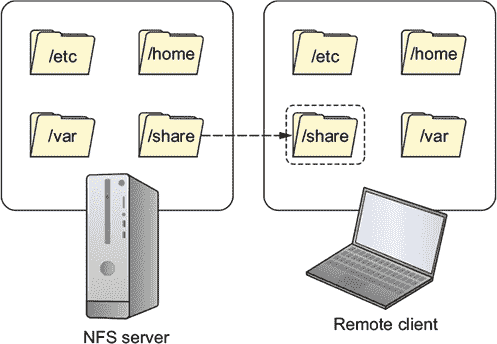

## 第十二章\. 在私有网络上共享数据

*本章涵盖*

+   使用网络文件系统（NFS）共享文档

+   微调对 NFS 共享的受限访问

+   使用 /etc/fstab 自动化远程文件共享

+   保护并加密 NFS 共享

+   为与 Windows 客户端共享文件配置 Samba

+   使用符号链接和硬链接组织系统资源

如果你已经阅读了第八章，那么你已经熟悉了如何使用 Nextcloud 在互联网等不安全网络上共享文件。但对于受信任的本地网络，有更简单的方法进行协作，这些方法与 Linux 文件系统本身更加紧密地集成。

我并不是建议你只能在本地做这件事。完全加密和确保基于文件系统的共享工具的安全性，以便在互联网上安全使用是可能的，但正确地做到这一点并不容易。而且，这些工具的特定优势最好在更接近家的环境中发挥。

在本章中，你将学习如何将服务器文件系统中精心定义的部分暴露出来，以便远程受信任的客户端可以协作处理文件和文档。你不需要像 Nextcloud 那样创建一个单独的文档存储，因为你的客户端将能够访问它们在本地位置的文档。这在许多常见场景中可能很有用：

+   你希望工作人员能够登录到建筑内任何物理工作站，并立即访问他们自己的家目录中的文件。

+   你希望将特定的数据集合提供给适当团队的成员，无论他们可能在何处。

+   你希望为一些远程工作人员提供完整的文档读写访问权限，但为其他人提供只读访问权限。

稍后我们将探讨设置 Samba 的方法，这是与 Windows 客户端共享基于 Linux 文档的首选工具。但我们的大部分注意力将集中在使用 NFS 允许 Linux 系统之间集成协作。

### 12.1\. 通过网络文件系统（NFS）共享文件

完成事情的时间。个人如何通过网络共享对文档的完全访问权限？如图 12.1 所示，NFS 通过允许客户端将远程服务器上托管的特定目录挂载为本地分区来实现。一旦挂载，这些目录的内容将在客户端系统上可见，无论是在命令行级别还是在桌面 GUI 中。

##### 图 12.1\. 挂载的文件共享将像远程客户端上的本地资源一样出现。



在第六章中，你学习了如何挂载外围媒体驱动器以允许从文件系统访问。这里是一个提醒：

```
# mkdir /media/mountdir/
# mount /dev/sdb1 /media/mountdir/
```

你将在这里使用`mount`命令，但这次是将远程 NFS 服务器上的目录挂载为本地分区。不过，在我们到达那里之前，还有一些事情要做。以下是如何一步一步进行的：

1.  在服务器上安装 NFS。

1.  通过 /etc/exports 文件定义客户端对服务器资源的访问。

1.  更新服务器上的 NFS。

1.  在客户端安装 NFS。

1.  挂载 NFS 共享。

1.  配置 NFS 共享在启动时挂载。

1.  打开你正在运行的任何防火墙（如果需要）。

#### 12.1.1. 设置 NFS 服务器

让我向你展示如何在你的服务器上共享家目录，以便多个用户可以远程访问内容。对于 CentOS 服务器，你想要安装的包是 nfs-utils。在 Ubuntu 上，那将是 nfs-kernel-server。

| |
| --- |

##### 注意

在 LXC 容器上安装 NFS 服务器软件并欺骗它认为它有足够的内核访问权限来正常运行可能是可能的，但我怀疑这不会值得你花费时间。如果你想虚拟化这个练习，请坚持使用 VirtualBox。

| |
| --- |

无论哪种方式，你将要工作的配置文件叫做 exports，它位于 /etc/ 目录下。至少在 Ubuntu 上，该文件包含了一些有用的示例指令，每个指令都通过 `#` 注释字符禁用。对于我们的简单示例（并且假设你的客户端计算机使用的 IP 地址是 192.168.1.11），这是文件中唯一的活动行：

```
/home 192.168.1.11(rw,sync)
```

让我们分解一下：

+   `/home` 告诉 NFS 你想要在服务器上公开 /home 目录及其所有子目录。只要你不无谓地公开敏感的系统或个人数据，你可以自由地公开你喜欢的任何目录。

+   `192.168.1.11` 是你想要允许进入的 NFS 客户端的 IP 地址。

+   `rw` 为该客户端分配了在暴露目录中的文件上的读写权限。

+   `sync` 通过在回复远程请求之前将更改写入磁盘来维护一个稳定的环境。

默认的 NFS 值包括 `ro`（只读，意味着阻止写操作）和 `root_squash`（远程客户端用户不允许以 root 身份在服务器上执行操作，无论他们在自己的系统上有什么状态）。这两个设置都为服务器及其文件提供了保护。如果你试图开放一些资源作为某种知识库，那么默认设置将是最合适的。

如果你想要覆盖 `root_squash` 默认设置并允许远程用户执行 `root` 操作，你可以添加 `no_root_squash` 值。尽管可能是一个严重的安全漏洞，但在你需要客户端用户对系统文件执行管理任务时，`no_root_squash` 有时可能是必要的。下面是这样的样子：

```
/home 192.168.1.11(rw,sync,no_root_squash)
```

根据为贵公司所有用户提供单一基于网络的 home 目录层次结构的用例场景，你可能希望为不仅仅是单个客户端开放访问权限。接下来的示例将允许来自本地网络任何地方的人挂载并使用服务器的/home/目录。它假设你信任所有访问 192.168.1.0 网络的人。然而，如果这个网络可以通过你为商务访客提供的 WiFi 服务访问，那么这可能不是一个好主意：

```
/home  192.168.1.0/255.255.255.0(rw,sync)
```

如果你对于`255.255.255.0`可能的作用以及所有这些网络结构是如何工作的感到困惑，第 14.1 节应该能让你明白。


##### 注意

再次强调，在 Linux 中拼写很重要——标点符号也同样重要。请注意，`192.168.1.11 (rw,sync)`表示来自 192.168.1.11 的客户端将获得读写权限。但是，如果在这个指令中添加一个空格，使其变为`192.168.1.11 (rw,sync)`，那么世界上任何地方的人都将获得`rw`权限，而来自 192.168.1.11 IP 地址的客户端将默认只有只读权限！


当你完成编辑 exports 文件后，你需要运行`exportfs`来强制 NFS 采用你的新设置。你可能会看到一个通知告诉你默认禁用了子树检查。这是对默认行为的更改，因为对于大多数现代用例，这通常不值得麻烦：

```
# exportfs -ra                                                             *1*
exportfs: /etc/exports [2]: Neither 'subtree_check' or 'no_subtree_check'
  specified for export "192.168.1.0/255.255.255.0:/home".
  Assuming default behaviour ('no_subtree_check').
  NOTE: this default has changed since nfs-utils version 1.0.x
```

+   ***1* r 标志告诉 exportfs 同步文件系统，而 a 标志将操作应用于所有目录。**

如果你感兴趣，当启用时，子树检查用于确保文件使用与基于服务器的文件系统和导出的树所遵循的政策保持一致。

你可以使用`exportfs`查看当前向客户端公开的所有 NFS 文件系统：

```
# exportfs
/home      192.168.1.0/255.255.255.0
```

为了便于从客户端测试共享，在服务器上的家目录中创建一个新文件，并添加一些文本。如果你在 CentOS 上运行 NFS 服务器，别忘了打开防火墙（默认完全启用）并启动 NFS（默认停止）。以下是这样做的外观：

```
# firewall-cmd --add-service=nfs
# firewall-cmd --reload
# systemctl start nfs-server
```

你现在可以开始在一台客户端计算机上设置 NFS 了。关于这一点，你将在下一节中详细了解。

#### 12.1.2\. 设置客户端

从客户端来看，事情变得快速且简单。在 CentOS 上安装与服务器相同的 nfs-utils 包，在 Ubuntu 上安装 nfs-common。从这里开始只需再走两步。首先，创建一个新目录，你将在其中挂载远程文件系统。然后使用 NFS 服务器的 IP 地址和服务器/etc/export 配置文件中公开的文件系统地址挂载它：

```
# mkdir -p /nfs/home/                        *1*
# mount 192.168.1.23:/home /nfs/home/
```

+   ***1* -p 标志告诉 Linux 创建路径中尚不存在任何目录（如/nfs/）。**

到目前为止，你应该能够打开和编辑共享文件。导航到您创建的挂载点，你应该会找到一个子目录，即属于您服务器主用户的目录（以我的情况为例是 ubuntu）。进入该目录，尝试打开、编辑和保存文件，然后返回服务器查看您是否可以看到新的、更新的版本：

```
$ cd /nfs/home/
$ ls
ubuntu
```

成功？恭喜！虽然和你自己对话有点诡异。我保证不会告诉任何人。

没有成功？以下是一些可以考虑的故障排除技巧：

+   确保您的客户端和服务器之间有基本的网络连接，并且实际上可以通信。从服务器 ping 客户端的 IP 地址，从客户端 ping 服务器的 IP 地址（例如，`ping 192.168.1.23`），并确认您得到了适当的响应。记得你在 第三章 中是如何做的吗？

+   确保没有防火墙阻止流量。默认情况下，NFS 需要打开 TCP 端口 2049 才能工作。如果你使用 ufw，你不需要记住端口号：`ufw allow nfs` 就可以完成这项工作（有关可用服务别名的完整列表，请参阅 /etc/services 文件）。

+   确保 NFS 在服务器上运行正常。使用 `exportfs` 检查您的配置，以验证 NFS 是否使用您最新的版本 `exportfs -a`。

+   确保服务器的 IP 地址没有更改。如果服务器从 DHCP 服务器动态获取 IP 地址，这很容易发生。理想情况下，您的 NFS 服务器应使用静态地址（有关详细信息，请参阅 第十四章）。在任何情况下，您都可以通过更新 /etc/fstab 中的指令（见下一节）临时解决这个问题。

如果您想从客户端删除 NFS 挂载，请使用 `umount`：

```
# umount /nfs/home/
```

#### 12.1.3\. 在启动时挂载 NFS 共享

虽然你现在可以访问那些远程文件，但我恐怕你的快乐不会持续到下一次系统关闭。你可以每次启动时都运行`mount`命令，但这可能不会是一个持久的习惯。相反，你可以通过编辑 /etc/fstab 文件来告诉 Linux 每次启动时自动挂载共享：

##### 列表 12.1\. 典型 /etc/fstab 文件的内容

```
# /etc/fstab: static file system information.
#
# Use 'blkid' to print a universally unique identifier                     *1*
# for a device; this may be used with UUID= as a more robust way to name
# devices that works even if disks are added and removed. See fstab(5).
#
# <file system>      <mount point> <type>  <options>      <dump>  <pass>
# / was on /dev/sda2 during installation
UUID=130fe070-9c44-4236-8227-6b1515baf270 /
   ext4    errors=remount-ro 0       1
# /boot was on /dev/sda1 during installation
UUID=e06b8003-255f-44b4-ab0f-291367d2928b /boot
   ext4    defaults          0       2
# /utility was on /dev/sda5 during installation
UUID=9cae6b93-963d-4995-8d33-5826da106426 /utility
   ext4    defaults          0       2
```

+   ***1* 寻找尚未列出设备的 UUID 标识符的说明**

如你所见，一个活跃的 fstab 行将包括包含有关每个列出设备信息的六个字段（有关表格 12.1 的详细信息，请参阅 table 12.1）。


##### 注意

一些 fstab 选项包括 `exec`（或 `noexec`）来控制是否可以从文件系统执行二进制文件，`ro` 来限制只读访问，`rw` 来允许读写访问，以及 `defaults` 来调用默认设置（`rw`、`suid`、`dev`、`exec`、`auto`、`nouser` 和 `async`）。


##### 表 12.1\. fstab 文件中的字段

| 字段 | 目的 |
| --- | --- |
| File system | 通过启动时的指定（例如/dev/sda1，有时会发生变化）或更可靠的 UUID 来识别设备。 |
| Mount point | 识别文件系统中设备当前挂载的位置。 |
| Type | 文件系统类型。 |
| Options | 分配给设备的挂载选项。 |
| Dump | 告诉（过时的）Dump 程序是否（1）或不是（0）备份设备。 |
| Pass | 在启动时告诉 fsck 程序首先检查哪个文件系统。根分区应该是第一个（1）。 |

fstab 文件最初在 OS 安装期间填充了附加硬件设备的引用。作为管理员，您有权添加自己的设备，以便它们在启动时也能挂载。请记住设备的引用方式。为您的 NFS 共享在客户端的 fstab 文件中添加新行可能看起来像这样：

```
192.168.1.23:/home  /nfs/home  nfs
```

重新启动您的客户端。这次，不要手动挂载 NFS 共享，而是立即前往它应该挂载的目录(/nfs/home/)，以确保您可以看到基于服务器的文件。如果它在那里，那么您就知道 fstab 已经完成了它的任务。单独运行`mount`命令；除了其他文件系统外，您应该看到分配给它的新 NFS 共享及其选项。

##### 列表 12.2\. 客户端挂载的文件系统部分输出

```
# mount
sysfs on /sys type sysfs (rw,nosuid,nodev,noexec,relatime)
/dev/sda2 on / type
 ext4 (rw,relatime,errors=remount-ro,data=ordered)                      *1*
/dev/sda1 on /boot type ext4 (rw,relatime,data=ordered)
192.168.1.23:/home on /nfs/home type nfs4                               *2*
 (rw,relatime,vers=4.0,rsize=262144,wsize=262144,namlen=255,hard,
 proto=tcp,port=0,timeo=600,retrans=2,sec=sys,clientaddr=192.168.1.11,
 local_lock=none,addr=192.168.1.23)
tmpfs on /run/user/1000 type tmpfs (rw,nosuid,nodev,relatime,
 size=204828k,mode=700,uid=1000,gid=1000)
```

+   ***1* 根分区**

+   ***2* 随后是 NFS 共享及其启动选项**

#### 12.1.4\. NFS 安全

再快速看一下本章标题（“通过私有网络共享数据”）并注意单词*private*。正如我之前提到的，如果 NFS 任其自然，它不会加密在主机之间来回传输的数据。您应该只在私有空间中使用它。

但是私有空间有多安全呢？当我们说一个网络*私有*时，意味着它不能通过正常的访问规则从外部访问。但是如果您还不知道，让我尽可能温和地告诉您：黑客并不害羞地使用异常访问规则。或者，更准确地说，他们很可能会生成和部署他们自己的自制规则。

如果您对 NFS 服务器共享的安全性取决于您对办公室里的人的信任程度，那么它可能需要一些改进。这并不是说您永远不应该信任您认识并与之共事的人，而是您不能总是确定他们的工作站和账户是否已被外部人员破坏。您也不能确定是否有外部人员正在监听您的网络流量。

您的一般方法应该是遵循*最小权限原则*：永远不要打开比绝对必要更宽的资源，永远不要给用户（或客户端）提供他们完成工作所绝对需要的更多访问权限。例如，如果您的客户端不需要编辑文件，那么在/etc/exports 文件中绝对可以通过`ro`（只读）选项。或者，如果您的客户端只需要访问目录层次结构中的某些文件，那么阻止其他所有文件。

##### 防火墙规则

一条重要的防御线将是您的防火墙。如果您的受信任私有网络中有任何不需要访问 NFS 服务器的个人工作站，请将其锁定：

```
# ufw deny to 192.168.1.10
```

在 CentOS 上，那将是

```
# firewall-cmd --add-rich-rule="rule family='ipv4'
     source address='192.168.1.10' reject"
# firewall-cmd --reload
```

谈到将它们锁定在外，在 NFS 服务器上更改防火墙规则之后，在 NFS 共享完全被阻止之前，您可能需要重新启动客户端机器。

有时候你可能希望你的服务器不仅仅托管 NFS 文件。可能还需要存储与开发团队或管理员团队无关的数据和配置文件，这些团队在自己的机器上工作。以下是如何阻止一个 IP 地址为 192.168.1.10 的开发者访问服务器上的 NFS，同时保留对其他服务器资源的完全访问权限的方法：

```
# ufw deny from 192.168.1.10 to any port 2049
```

为了测试这一点，考虑在你的 NFS 服务器上除了 NFS 之外还安装 Apache 网络服务器。如果你的 NFS 共享在客户端无法加载，但你仍然可以访问服务器上的网络应用程序，那么你就知道你已经找到了你的最佳平衡点：

```
# ls /nfs/home/
# curl 192.168.1.3                              *1*
Welcome to my web server on my NFS machine
```

+   **1* curl 获取可访问网页的内容。**

##### 加密

和往常一样，限制对您资源的访问并不意味着您在服务器和客户端之间传输的数据是安全的——至少当这些数据未加密时是这样的。如果您只是在您的本地私有网络内传输数据，并且您确信这些数据确实是本地且私有的，那么您依赖现有的系统是可以被原谅的。但是，任何将在不安全网络上传输的数据都需要额外的保护。

这里有一份简短的列表，列出了你可以用来处理问题的方法（除了闭上眼睛并希望只有好事发生给你，这在严格意义上来说，更像是一种应对机制）：

+   你可以在 VPN 之上运行一个 NFS 共享，这与你在第十章中使用 VPN 加密数据传输的方式非常相似。

+   IPSec 协议通过防止 IP 欺骗和包篡改，在 IP 网络级别确保数据安全。它通过使用会话密钥加密 IP 数据包中包含的所有数据。您可以将 IPSec 配置为隧道，从广义上讲，其工作方式与 OpenVPN 隧道相似。

+   NFS 可以配置为在底层的 SSH 会话上运行，这又是一种隧道形式。在遇到不寻常的使用场景时，拥有多个选项总是好的。请注意，这是一个非标准选项。

+   假设您已经在您的基础设施中运行了一个 Kerberos 身份验证服务器，并且您至少使用了 NFS v.4，将`sec=krb5p`行添加到您的 NFS 配置中，将把管理问题的任务交给 Kerberos 的强大之手。

+   最后，NFS 的一个替代方案是 SSH 文件系统（SSHFS）。SSHFS 类似地将远程文件系统挂载为本地卷，但通过使用用户空间文件系统（FUSE）软件接口通过 SFTP 协议工作。

### 12.2. 使用 Samba 与 Windows 用户共享文件

如果您的办公网络包括需要从他们的 Windows PC 访问基于 Linux 文件的用户，那么 Samba 是一个简单而复杂得令人难以置信的解决方案。我的意思是什么？设置一个基本连接，就像我将要演示的那样，不会花费太多精力。但是，将身份验证与 Windows Active Directory 域集成或与 Linux 服务器上的 SELinux 作斗争可能会给您带来相当多的麻烦。多年来出版了一整套 Samba 配置书籍，这并非偶然。

对于我们的目的，您可以在 Ubuntu 上仅安装 samba 和 smbclient 软件包。对于 CentOS，运行 `yum` 对 `samba*` 进行操作以获取整个 Samba 相关工具集合要简单得多（记住：`*` 字符被解释为返回包含前面文本的所有结果）。以下是其余过程将如何展开：

1.  在 Linux 服务器上创建一个 Samba 用户账户。

1.  指定共享目录。

1.  通过编辑 smb.conf 文件来定义共享。

1.  测试配置。

1.  从 Windows 客户端连接。

您需要使用一个名为 smbpasswd 的程序来设置一个 Samba 用户，作为客户端将用于登录的账户。但由于 Samba 权限将添加到现有账户中，您应该首先创建一个新的 Linux 账户。我将称它为 sambauser，但您可以选择任何您喜欢的名称：

```
# adduser sambauser
# smbpasswd -a sambauser
```

接下来，您可以创建一个共享将基于的目录。我将遵循我之前为我的 NFS 共享使用的相同模式。为了便于稍后测试，我将在新目录中创建一个文件。因为多个客户端最终可能会在这个目录中处理文件，您可以通过使用 `chmod` 将目录权限设置为 777（所有用户的读取、写入和执行权限）来避免潜在权限问题：

```
# mkdir -p /samba/sharehome
# touch /samba/sharehome/myfile
# chmod 777 /samba/sharehome
```

这样，Samba 环境就全部搭建好了。现在您可以将配置添加到 /etc/samba/ 目录下的 smb.conf 文件中。您应该浏览配置文件，以了解可以进行的多少定制以及事情可能会变得多么复杂：

```
# nano /etc/samba/smb.conf
```

然而，就您目前谦逊的愿望而言，您只需要添加一个定义您的共享的单个部分。我将冒险将其称为 sharehome。您绝对必须包含的两个条目是 `path`，它指向您计划用于共享文档的目录，以及，假设您希望客户端能够创建和编辑文件，`writable` 的值为 `yes`。完成这些操作后，保存文件并关闭文本编辑器。

##### 列表 12.3\. 来自 /etc/samba/smb.conf 文件的文件共享配置部分

```
[sharehome]
path = /samba/sharehome
writable = yes
```

现在请使用 systemctl 启动并启用 Samba 守护进程。Ubuntu 将 Samba 识别为 `smbd`，但在 CentOS 上，它将是 `smb`（不带 *d*）：

```
# systemctl start smbd            *1*
# systemctl enable smbd
```

+   ***1* 注意，smbd 是 Ubuntu 上 systemctl 识别的守护进程名称；在 CentOS 上将是 smb。**

#### 12.2.1\. 测试您的 Samba 配置

在深入挖掘之前测试你的配置总是一个好主意，所以运行 `testparm` 将会显示你添加的章节是否可以被 Samba 服务正确读取。这个输出表明一切正常：

```
# testparm                                                  *1*
Load smb config files from /etc/samba/smb.conf
rlimit_max: increasing rlimit_max (1024) to minimum Windows limit (16384)
WARNING: The "syslog" option is deprecated
Processing section "[printers]"
Processing section "[print$]"
Processing section "[sharehome]"                            *2*
Loaded services file OK.
Server role: ROLE_STANDALONE
Press Enter to see a dump of your service definitions
```

+   ***1* testparm 测试并显示你的 Samba 配置。**

+   ***2* 确认你的 sharehome 部分被识别**

在邀请你的 Windows 朋友加入之前，还有一个测试：你可以使用 smbclient 程序从本地机器登录到你的 Samba 共享。首先，你需要切换用户（`su`）到之前与 Samba 关联的 sambauser 账户。然后，你可以运行 `smbclient` 对共享的主机地址和名称（//localhost/sharehome）进行操作：

```
$ su sambauser
Password:
# smbclient //localhost/sharehome
Enter sambauser's password:
Domain=[WORKGROUP] OS=[Windows 6.1] Server=[Samba 4.3.11-Ubuntu]
smb: \>                                                               *1*
```

+   ***1* 注意特殊的 Samba 命令提示符告诉你你现在处于 Samba 壳层会话中。**

在这种情况下，正如你从命令行提示符中可以看到的，你已经进入了 Samba 壳层。运行 `ls` 来显示内容，你应该能看到你创建的 myfile 文件：

```
smb: \> ls
  .          D        0  Thu Sep 14 20:54:32 2017
  ..         D        0  Thu Sep 14 20:36:52 2017
  myfile     N        0  Thu Sep 14 20:54:32 2017

    953363332 blocks of size 1024\. 732660884 blocks available
```

顺便说一句，正如你从第九章章节 9 中已经知道的，训练不足和/或缺乏耐心的管理员有时会一遇到冲突就倾向于关闭 SELinux。这是件坏事，而且绝对不是像我们这样受过高度训练且极具耐心的 Linux 用户会考虑的事情。大多数时候。

如果你在这个演示中运行 CentOS 并且发现自己无法访问共享中的文件，那可能是因为 SELinux 在作祟：

```
smb: \> ls
NT_STATUS_ACCESS_DENIED listing \*
```

千万不要做我即将告诉你的事情。即使是在非生产服务器上的简单演示也不要做。永远不要。但如果你想禁用 SELinux 一分钟或两分钟以避免不得不阅读 smb.conf 文件文档来找出如何正确修复问题，我确信你会记得运行 `setenforce 0` 将会禁用 SELinux。但我从未告诉你这一点。事实上，这个段落从未发生过。

如果你服务器上有防火墙保护，你需要打开一些端口以便 Samba 可以进出。但你需要的具体端口将至少部分取决于你在 Samba 配置中包含的内容。Kerberos、LDAP、DNS 和 NetBIOS 是与 Samba 一起运行的常见服务。

在服务器上使用 `netstat` 扫描 Samba（使用 `smbd` 搜索词）使用的端口将给出基本系统上的关键端口。这个例子返回了 139 和 445，但可能有更多：

```
# netstat -tulpn | egrep smbd                             *1*
tcp   0  0 0.0.0.0:139  0.0.0.0:*  LISTEN  2423/smbd
tcp   0  0 0.0.0.0:445  0.0.0.0:*  LISTEN  2423/smbd
tcp6  0  0 :::139       :::*       LISTEN  2423/smbd
tcp6  0  0 :::445       :::*       LISTEN  2423/smbd
```

+   ***1* 如果你机器上没有 netstat，请安装 net-tools 软件包。**

#### 12.2.2\. 从 Windows 访问 Samba 服务器

从 Windows 客户端机器创建一个桌面快捷方式（Windows 也有这些功能！），并将其位置指向你的 Linux 服务器上的 Samba 共享。假设 Linux 服务器的 IP 地址是 192.168.1.23，你给 Samba 共享起的名字是 sharehome，你将输入的地址将看起来像这样：

```
\\192.168.1.23\sharehome
```

为了连接，Windows 用户必须使用你之前创建的 Linux Samba 用户名和密码进行身份验证，除非你选择将 Samba 身份验证与 Windows Active Directory 域集成。这可能是长期来看更高效且更安全的方法，而不是依赖于简单的密码。我会向你展示如何做到这一点，但首先让我快速看一下书封面以确认我的怀疑。是的，这是一本 Linux 书。抱歉，没有 Windows 配置指南。

### 12.3. 使用符号链接与自身共享文件

承认，这个章节与本章的联系可能有点牵强，但用户有时会想要与自己共享文件。创建符号链接（也称为**symlinks**）可以实现这一点。为了明确，我并不是在谈论让你的文件同时对你和你邪恶的李生兄弟可用，而是在你可能在的任何地方都能更方便地访问它们。

让我来举例说明。在本章的早期部分，你使用了一个 NFS 共享来让你的用户能够访问中央/home/目录。目标是让任何用户坐在办公室的任何工作站前，通过你创建的/nfs/home/目录，立即开始使用自己的文档。

但如果并非所有用户都对 Linux 文件系统层次结构如此熟悉，更不用说命令行了怎么办？也许有些用户不知道他们的文件在文件系统中的具体位置。你可以自由地创建一个指向挂载的共享目录的符号链接，该目录将在用户的 GUI 桌面上显示。


##### 注意

GUI Linux 系统上的用户账户在他们的/home/username/目录中有一组子目录（如文档和图片），他们可以在其中方便地组织他们的文档。其中一个子目录被称为桌面，任何保存到其中的文件都将作为图标出现在用户登录时首先看到的 GUI 屏幕上。请记住，这些子目录直到用户首次登录新账户时才会创建。


你可以通过使用带有 `-s` 参数的 `ln` 命令，想要链接的文件系统对象，以及你希望放置链接的位置来创建一个符号链接：

```
# ln -s /nfs/home/ /home/username/Desktop/
```

这就是全部内容。事实上，它如此简单，你可能想知道为什么它值得单独成节。这与 `-s` 参数有关。这里的 `s` 代表符号，这意味着也必须有一种不同类型的链接。确实，默认情况下，`ln` 命令会创建一个硬链接。

但区别在哪里呢？一个**符号链接**指向一个独立的文件系统对象。读取、执行或编辑符号链接将会读取、执行或编辑链接的对象。但如果移动或删除原始的符号链接，由于它仅仅是一个指向独立对象的指针，它将会断开。

与之相反，*硬链接*是其目标的精确副本，以至于两个文件将共享一个单一的 inode。正如你从第一章中回忆的那样，inode 是描述对象属性的元数据：特别是它在文件系统中的位置。

让我们看看这一切是如何付诸实践的。创建两个文件，并为每个文件添加不同的文本。现在为其中一个文件创建一个硬链接，为另一个文件创建一个符号链接：

```
$ nano file1
$ nano file2
$ ln file1 file1-hard
$ ln -s file2 file2-sym
```

使用`i`参数运行`ls`来显示 inode ID。注意，硬链接文件共享相同的 inode ID 号码。注意文件 2-sym 文件指向文件 2：

```
$ ls -il
9569544 -rw-rw-r-- 2 ubuntu ubuntu   4 Sep 14 15:40 file1
9569544 -rw-rw-r-- 2 ubuntu ubuntu   4 Sep 14 15:40 file1-hard
9569545 -rw-rw-r-- 1 ubuntu ubuntu   5 Sep 14 15:40 file2
9569543 lrwxrwxrwx 1 ubuntu ubuntu   5 Sep 14 15:40 file2-sym -> file2
```

如果你删除、重命名或移动文件 2，它的符号链接将会断裂，并且根据你的 shell 颜色方案，将以愤怒的红色背景显示。另一方面，硬链接将能够承受对原始文件的所有更改。试着亲自试试：重命名文件 1 和文件 2，看看它们的链接会发生什么变化：

```
$ mv file1 newname1
$ mv file2 newname2
```

当你再次运行`ls -il`时，你可能已经注意到，即使在用`mv`重命名文件 1 之后，file1-hard 仍然存在，更重要的是，它仍然与 newname1 共享相同的 inode。对其中一个文件的任何编辑都会反映在另一个文件上。遗憾的是，file2-sym 已经被遗弃。

为什么要费这么大的劲？为什么不直接复制呢？想想你之前看到的情况，你创建了一个指向用户桌面文件系统位置的链接。或者，关于你在第八章中看到的/sbin/init 和/lib/systemd/systemd 文件之间的连接，或者第三章中/etc/apache2/sites-available/和/etc/apache2/sites-enabled/的内容？这些都是使用链接来增强系统功能的事例。

硬链接在 Linux 中应用得更为广泛，但它们的目的并不总是那么明显。在一种常见的使用场景中，尽管文件存储在文件系统的不同位置，但它们会被链接在一起。这可以使得备份重要的但分布广泛的配置文件变得更加容易，而无需定期创建新的副本。并且由于硬链接不占用任何空间，你不必担心额外的磁盘使用。

### 摘要

+   NFS 共享在远程计算机上公开定义的文件系统资源，允许方便的文档访问和团队之间的协作。

+   文件系统和设备可以通过命令行手动挂载（并使用），或者通过在/etc/fstab 文件中的条目在启动时挂载。

+   你可以通过智能配置策略、防火墙规则以及通过第三方解决方案（如 Kerberos 和 IPSec）提供的加密来确保 NFS 共享的安全。

+   Windows 客户端可以使用 Samba 以及 Samba 生成的账户认证来消费基于 Linux 的文件。

+   符号链接指向文件系统对象，而硬链接创建的对象是原始文件的精确副本，不占用存储空间。

### 关键术语

+   *共享*是一组文档或文件系统，与远程客户端共享。

+   可以使用`testparm`测试一个*Samba 服务器配置*。

+   *符号链接和硬链接*允许 Linux 文件系统对象（文件和目录）在多个位置表示。

### 安全最佳实践

+   NFS 共享应尽可能具体，包括需要访问的客户端以及每个客户端需要的权限。这符合*最小权限原则*。

+   在可能的情况下，NFS 共享策略应始终包括`squash_root`，以确保远程客户端不会获得对服务器的无限制 root 访问。

+   NFS（和 Samba）共享默认不加密。如果您的客户端将通过不受信任的网络访问它们，那么您应该应用加密。

### 命令行审查

+   `/home 192.168.1.11(rw,sync)`（NFS 服务器/etc/exports 文件中的条目）定义了一个远程客户端共享。

+   `firewall-cmd --add-service=nfs` 为 CentOS 防火墙打开客户端访问您的 NFS 共享。

+   `192.168.1.23:/home /nfs/home nfs`（NFS 客户端/etc/fstab 文件中的典型条目）加载了一个 NFS 共享。

+   `smbpasswd -a sambauser` 为现有 Linux 用户账户添加 Samba 功能（以及一个唯一的密码）。

+   `nano /etc/samba/smb.conf` 控制服务器上的 Samba。

+   `smbclient //localhost/sharehome` 使用 Samba 用户账户登录到本地 Samba 共享。

+   `ln -s /nfs/home/ /home/username/Desktop/` 创建了一个符号链接，允许用户通过点击桌面图标轻松访问 NFS 共享。

### 测试自己

> **1**
> 
> 以下哪个指令可以为使用 192.168.1.11 IP 地址的 NFS 客户端提供只读访问？
> 
> 1.  `/home 192.168.1.11(ro,sync)`
> 1.  
> 1.  `192.168.1.11 /home(ro,sync)`
> 1.  
> 1.  `/home 192.168.1.11(rw,sync)`
> 1.  
> 1.  `192.168.1.11 /home(r,sync)`
> 1.  
> **2**
> 
> 应编辑哪个客户端配置文件以确保在启动时加载 NFS 共享？
> 
> 1.  /etc/nfs
> 1.  
> 1.  /etc/exports
> 1.  
> 1.  /etc/nfs/exports
> 1.  
> 1.  /etc/fstab
> 1.  
> **3**
> 
> `exportfs -ra`命令将完成什么？
> 
> 1.  强制 NFS 重新加载配置文件中的策略
> 1.  
> 1.  列出当前 NFS 文件系统
> 1.  
> 1.  测试 Samba 配置
> 1.  
> 1.  重新加载所有附加设备
> 1.  
> **4**
> 
> 以下哪个将完全阻止单个远程客户端机器从服务器访问？
> 
> 1.  `ufw deny ALL 192.168.1.10/UDP`
> 1.  
> 1.  `ufw deny ALL 192.168.1.10`
> 1.  
> 1.  `ufw deny to 192.168.1.10`
> 1.  
> 1.  `ufw deny to 192.168.1.10/255.255.255.0`
> 1.  
> **5**
> 
> 以下哪个安全工具在服务器和客户端机器之间传输数据时不会帮助保护数据？
> 
> 1.  Kerberos
> 1.  
> 1.  firewalld
> 1.  
> 1.  SSHFS
> 1.  
> 1.  IPSec
> 1.  
> **6**
> 
> 以下哪个是 Samba 服务器配置文件的正确名称和位置？
> 
> 1.  /etc/samba/smb.conf
> 1.  
> 1.  /etc/smb.cfg
> 1.  
> 1.  /etc/samba/smb.conf
> 1.  
> 1.  /etc/samba.cfg
> 1.  
> **7**
> 
> 以下哪个命令将在 Ubuntu 服务器上启动 Samba？
> 
> 1.  `systemctl start sambad`
> 1.  
> 1.  `systemctl start smbd`
> 1.  
> 1.  `systemctl start smb`
> 1.  
> 1.  `systemctl start samba`
> 1.  
> **8**
> 
> 以下哪个命令在创建指向配置文件的链接以使常规备份更简单、更可靠方面最有意义？
> 
> 1.  `ln -s /var/backups/important_config_file_backup.cfg /etc/important_config_file.cfg`
> 1.  
> 1.  `ln /var/backups/important_config_file_backup.cfg /etc/important_config_file.cfg`
> 1.  
> 1.  `ln -s /etc/important_config_file.cfg /var/backups/important_config_file_backup.cfg`
> 1.  
> 1.  `ln /etc/important_config_file.cfg /var/backups/important_config_file_backup.cfg`

#### 答案键

> **1.**
> 
> a
> 
> **2.**
> 
> d
> 
> **3.**
> 
> a
> 
> **4.**
> 
> c
> 
> **5.**
> 
> b
> 
> **6.**
> 
> c
> 
> **7.**
> 
> b
> 
> **8.**
> 
> d
