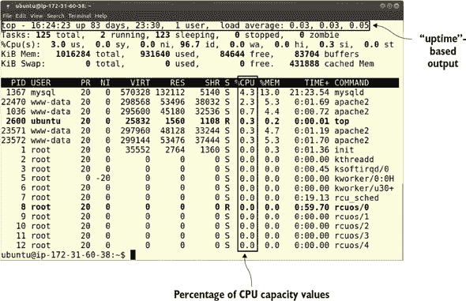
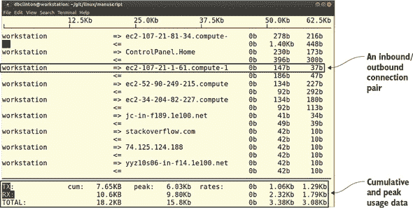
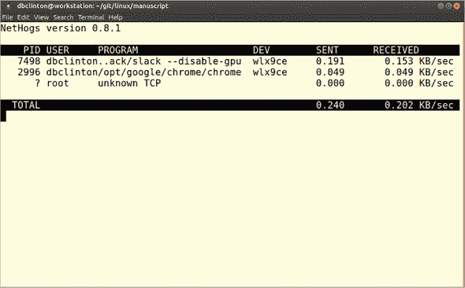
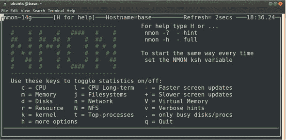
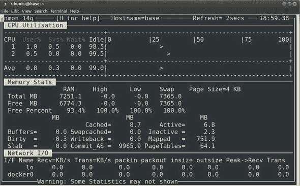
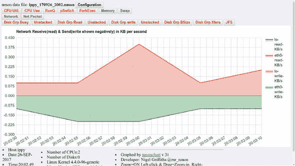

## 第十三章：系统性能问题故障排除

*本章涵盖*

+   理解和衡量你的系统行为

+   控制应用和客户端对系统资源的需求

+   应对资源短缺的多层次策略

+   有效的持续监控协议策略

“级联混沌”和“即将到来的灾难”是否正是你现在 IT 运营的写照？你的服务器是否运行缓慢且无响应？你的客户是否抱怨应用性能不佳？或者，你是否已经停止吹嘘你那新购置的工作站带来的不可思议体验？

即使情况没有这么糟糕，生活也不会总是顺利。我们总是试图从 IT 投资中获得最大价值，这是定义上的，这意味着有时我们会做得太过分：压力过大的系统有时会崩溃，复杂的软件堆栈元素有时会停止协同工作。

长寿和幸福生活的秘诀是预见麻烦，快速识别症状和原因，并在正确的时间采取正确的修复措施。这对于你作为 IT 管理员的工作同样适用。

我所说的“系统”是指你用来提供服务的硬件和软件环境，无论是应用、数据库、Web 服务器，还是简单独立工作站的可靠使用。在本章中，你将关注系统四个核心元素的健康和福祉：中央处理器（CPU）、内存（RAM，包括物理和虚拟）、存储设备和网络负载管理。你将学习如何发现问题、确定原因，然后修复根本问题，或者在必要时投入更多硬件。

当然，你总是希望避免问题。一种方法是让你的健康系统接受压力测试，看看它如何应对。在本章稍后，我还会简要介绍`yes`，这是一个将你的基础设施暴露于残酷和非常规折磨的出色工具。

在任何情况下，我将假设你负责的其中一台服务器或工作站出现了异常行为：在最糟糕的时刻崩溃或变慢。你用你最凶狠、最恶毒的表情瞪视它一两分钟，但机器似乎并不在意，也没有响应。让我们一步一步解决这个问题。

### 13.1. CPU 负载问题

CPU 是电脑的大脑。构成 CPU 的电子电路，无论有多少核心和它们使用的总线有多宽，都只预期做一件事：等待软件程序传入的指令，执行计算，并返回答案。

总体来说，你的 CPU 要么工作，要么不工作。大多数与 CPU 相关的性能问题（如响应时间缓慢或意外关机）都可以追溯到超出它们的物理容量。当你怀疑某个性能问题可能与 CPU 有关时，你需要做的第一件事就是找出你是否对它太过苛刻。

#### 13.1.1. 测量 CPU 负载

CPU 状态的两个指标包括 CPU 负载和 CPU 利用率：

+   *CPU 负载*是衡量 CPU 作为总容量百分比所执行的工作量（意味着当前活跃和排队进程的数量）的度量。表示随时间推移的系统活动的负载平均数，因为它们提供了一个更准确的系统状态图景，是表示此指标更好的方式。

+   *CPU 利用率*（或使用率）是衡量 CPU 不空闲时间的度量（描述为总 CPU 容量的比例）。

在单核机器上，负载得分为 1 表示满负荷。如果你的系统有多个 CPU 核心，比如四个，那么满负荷将表示为数字 4。一旦 CPU 利用率得分超过 75%，用户体验可能会开始受到影响（至少有时如此），对于单核来说，这将表示为 0.75，而对于四核系统来说，将表示为 3.0。

获取你的 CPU 负载平均数很容易。运行`uptime`会返回当前时间、自最近一次系统启动以来经过的时间、当前登录的用户数，以及对我们来说现在最重要的是，过去一分钟、五分钟和十五分钟的负载平均数：

```
$ uptime
10:08:02 up 82 days, 17:13,  1 user,  load average: 0.12, 0.18, 0.27
```

在一个拥有一个 CPU 的系统上，平均负载为 1.27 意味着 CPU 平均处于满负荷工作状态，另外 27%的进程正在等待轮到它们使用 CPU。相比之下，在一个拥有一个 CPU 的系统上，平均负载为 0.27 意味着 CPU 平均有 73%的时间未被使用。在一个四核系统上，你可能会看到负载平均在 2.1 左右，这将是 50%以上的容量（或大约 52%的时间未被使用）。

要正确理解这些数字，你需要知道你的系统有多少核心。如果这些信息没有打印在机箱标签上，而你又不感兴趣打开机箱亲自查看，你可以查询伪文件 cpuinfo：

```
$ cat /proc/cpuinfo | grep processor
processor    : 0
processor    : 1
processor    : 2
processor    : 3
```

看起来那个系统有四个核心。因为你在那里，不妨浏览一下那个文件的其余部分，以了解 Linux 是如何描述你的 CPU 的。特别是，尝试理解标志部分，它列出了你的硬件支持的功能。

#### 13.1.2. 管理 CPU 负载

持续低于满负荷（基于你从`uptime`得到的结果）？你可以只是享受额外的空间。或者，你可能会考虑通过使用未充分利用的计算机提供额外服务（而不是购买额外的服务器）来整合资源，以最大化投资回报率。

持续超负荷？你可能需要切换到具有更多 CPU 核心的更健壮的硬件架构，或者在虚拟环境中，为更多的 VM 或容器提供额外的负载。偶尔，你也可以仔细查看系统上运行的进程，看看是否有可以关闭的，甚至是否有未经你知晓而运行异常的进程。运行`top`提供了丰富、自动更新的进程信息显示。

图 13.1 是`top`的典型全屏数据。注意第一行提供了与运行`uptime`相同的见解。因为你试图解决性能问题，你应该最感兴趣的列是%CPU（当前由给定进程使用的 CPU 容量百分比）以及特别是出现在列表顶部的进程。

##### 图 13.1\. `top`显示的进程数据快照



在这种情况下，你可以看到 MySQL 守护进程正在使用服务器 CPU 的 4.3%，从下一列来看，占其内存的 13%。如果你将那一行向左移动，你会看到进程 ID 是 1367，进程属于 mysql 用户。你可能会得出结论，这个进程占用的资源比可以证明的要多，将不得不牺牲（为了更大的利益，你知道的）。你可以通过按 q 键退出`top`。

那个`top`显示给了你结束进程所需的一切。因为 MySQL 是由 systemd 管理的服务，你的首选应该是使用`systemctl`来温和地结束进程，以免任何应用程序数据处于风险之中：

```
# systemctl stop mysqld
```

如果它不是由 systemd 管理的，或者如果出了问题，`systemctl`未能停止它，那么你可以使用`kill`或`killall`来消除你的进程（某些系统要求你作为 psmisc 包的一部分安装`killall`）。你可以这样将 PID 传递给`kill`：

```
# kill 1367
```

另一方面，`killall`使用进程名而不是其 ID：

```
# killall mysqld
```

要`kill`还是要`killall`，这是一个问题。实际上，答案相当明显。`kill`将基于 PID 关闭单个进程，而`killall`将杀死尽可能多的特定程序实例。如果有两个或三个独立的 MySQL 实例，可能属于不同的用户，所有这些都将被停止。


##### 注意

在启动`killall`之前，确保没有运行着类似名称的进程，否则可能会成为附带损害。


你还必须再次使用 systemctl 来确保进程在下次启动时不会重新启动：

```
# systemctl disable mysqld
```

##### 使用“良好”来设置优先级

有时候您可能无法终止一个进程，因为它是一个关键任务服务的必要部分。但您可以使用 `nice` 来限制它获得的 CPU 资源。默认情况下，新进程被赋予 `nice` 值为 `0`，但您可以将其更改为介于 -20 和 19 之间的任何数字。数字越高，进程在放弃资源以供其他进程使用时越“友好”。相反，数字越低，进程在尽可能多地获取资源时越“不友好”，无论这可能会给其他人带来多少痛苦和困扰。

假设您想运行一个名为 mybackup.sh 的脚本，该脚本启动一个远程备份操作。问题是这是一个活跃的服务器，它不时需要大量电力来响应重要的客户端请求。如果在备份全速运行时收到请求，性能将无法接受。另一方面，如果从开始到结束备份都进行节流，它可能永远无法完成。

这就是 `nice` 如何帮助您以让每个人都轻松微笑的方式处理这种情况。在脚本（或任何其他命令名称）前加上 `nice` 和您为其选择的数值。在这种情况下，跟在破折号（`-`）后面的 `15` 告诉 Linux 该脚本将以非常友好的态度运行。这意味着当资源访问发生冲突时，您的脚本会退让，但除此之外，它会接受可用的任何资源：

```
# nice -15 /var/scripts/mybackup.sh
```

如果运行您的脚本是一个紧急优先事项，必须尽快完成，您可以在第二个破折号中添加一个负值（`-15`），如下例所示：

```
# nice --15 /var/scripts/mybackup.sh
```

无论哪种方式，如果您想看到这种情况，创建一个脚本，并在它执行时，在第二个终端中运行 `top`。您应该看到您的进程正在运行，并且其适当的 `nice` 值应出现在 NI 列中。

对于许多 Linux 程序，您也可以设置默认的 `nice` 值。至少在 Ubuntu 上，rsync 允许您通过 /etc/default/rsync 中的 RSYNC_NICE 设置显式定义其友好程度。

##### 列表 13.1\. 来自 /etc/default/rsync 配置文件的可能的 `nice` 设置

```
RSYNC_NICE='10'
```

您还可以使用 `renice` 来更改进程的行为，即使它在启动后也是如此。此示例将在必要时限制分配给 PID 2145 的进程可用的资源：

```
renice 15 -p 2145
```

##### `top` 的技巧

如果您需要，您之前看到的 `top` 输出的第三行会为您提供许多其他 CPU 指标的时间值（作为百分比）。表 13.1 提供了您在那里看到的混乱缩写的快速概述。

##### 表 13.1\. `top` 显示的与 CPU 相关的指标符号

| 指标 | 含义 |
| --- | --- |
| us | 运行高优先级（非友好）进程花费的时间 |
| sy | 运行内核进程花费的时间 |
| ni | 运行低优先级（友好）进程花费的时间 |
| id | 空闲时间 |
| wa | 等待 I/O 事件完成花费的时间 |
| hi | 管理硬件中断花费的时间 |
| si | 软件中断管理所花费的时间 |
| st | 虚拟机（主机）从该 VM 中窃取的时间 |

注意，`top`显示可以通过键盘输入实时自定义。输入`h`以获取更多信息。

#### 13.1.3\. 制造麻烦（模拟 CPU 负载）

想要尝试这些技巧，但你知道吗，一切似乎都在正常运行？为什么不自己模拟危机级别的 CPU 过载呢？

与孩子一样，`yes`会持续输出（数字）噪音，直到被告知停止。再想想，这根本不像孩子。这个命令会将噪音重定向到可丢弃的`/dev/null`文件，并且`&`字符会将进程推入后台，将命令行的控制权交还给你。为了增加压力，可以多次启动该命令：

```
$ yes > /dev/null &
```

这样应该能让它们忙起来。当所有这些都在运行时，观察`top`以了解发生了什么。你也可以尝试运行其他应用程序，看看需要多少才能使它们变慢。完成后，运行`killall`一次性结束所有的`yes`会话：

```
$ killall yes
```

### 13.2\. 内存问题

尽管信息技术在过去的几十年中取得了巨大的进步，但随机存取存储器（RAM）本身的使用方式仍然和以前一样。计算机通过将操作系统内核和其他软件代码加载到易失性 RAM 模块中来加速核心计算操作。这允许快速访问频繁请求的软件指令。

内存的最大挑战通常是它的限制。我的第一台电脑有 640 KB 的 RAM（那不到 1 MB），这还不够。我不得不让电脑整夜运行，只是为了渲染一个 640 × 480 的 GIF 图像。现在放在我桌子下的工作站有 8 GB，一旦我向我的常规工作量添加三个 VirtualBox 虚拟机，它也开始感到压力。

#### 13.2.1\. 评估内存状态

通常，内存不足的系统将无法完成请求的任务或只是变慢。当然，这些问题可以描述各种各样的事情，所以在得出结论之前，你需要得到确认。除了将电子显微镜聚焦在你主板上的内存模块上，运行`free`是最直接的方法。

`free`解析`/proc/meminfo`文件并显示可用的总物理内存（在本例中描述为 7.1 GB）以及它的当前使用方式。`shared`是 tmpfs 使用的内存，用于维护我们熟悉和喜爱的各种伪文件系统，如`/dev/`和`/sys/`。缓冲区和缓存与内核用于块级 I/O 操作的内存相关联（如果你不理解这一切，不必过于担心）。

任何由系统进程使用的内存都被标记为`used`。`available`值是对当前可用于启动新应用程序的内存的估计，即使它目前正被磁盘缓存使用，也不需要涉及到交换内存（你将在稍后遇到它）。以下是一个例子：

```
$ free -h
       total   used   free   shared  buff/cache  available
Mem:   7.1G    2.8G   1.3G   372M          3.0G       3.5G
Swap:  7.2G    540K   7.2G
```

您会注意到我为`free`添加了`-h`参数，它以人类可读的格式显示输出，使用更易于阅读的较大数值单位（GB、MB 和 KB）而不是字节。

这个例子看起来像是一个健康系统，有足够的空间进行扩展。但如果`free`的值持续接近 0，并且将负载转移到交换内存不能缓解问题，那么您可能需要增加内存。现在，关于那个交换空间...

#### 13.2.2\. 评估交换状态

因为，从字节到字节，RAM 模块通常比磁盘存储更昂贵，许多操作系统安装将存储驱动器上的一个文件或分区指定为用作虚拟 RAM 的紧急来源。这样，即使严格来说，您可能没有足够的 RAM 来运行所有进程，过载的系统也不会失败，尽管它会明显变慢。

您可以通过`vmstat`命令了解系统上交换空间的使用情况。在此命令中添加的`30`和`4`参数告诉程序返回四个读数，每个读数之间间隔 30 秒。在实际情况下，您可能希望将测试扩展到更长时间，例如几个小时，以提高结果的准确性。您应该密切关注的两列是`si`，它衡量从交换空间到系统内存的数据传输，以及`so`，它报告从系统内存到交换空间的传输。正如承诺的那样，以下是该命令：

```
$ vmstat 30 4
procs -----------memory---------- ---swap-- -----io---- -system-- ------cpu--
r  b  swpd   free   buff  cache   si  so   bi   bo   in   cs us sy id wa st
0  0  540 1311400 373100 2779572    0   0   35   41  418  186  4  1 94  1  0
0  0  540 1311168 373104 2779540    0   0    0    9  671  881  0  0 99  0  0
0  0  540 1311216 373116 2779508    0   0    0   33  779 1052  1  1 98  0  0
0  0  540 1310564 373116 2779476    0   0    0    2  592  815  0  0 99  0  0
```

如果您发现交换空间中的数据流动持续不断，您应该考虑增加物理 RAM，除非较慢的性能对您的负载不是问题。

### 13.3\. 存储可用性问题

如果您的应用程序软件堆栈经常将新的文档、数据或日志文件写入存储驱动器，那么您不能忽视这样一个事实：您可用的空间总是有限的。有些事情不可能永远持续下去，最终会停止。当您的驱动器上没有剩余空间时，这些数据写入将停止，您的系统功能也将随之停止。

您如何知道您有多接近极限？很简单。您已经遇到了`df`。因为设备不使用任何实际的磁盘空间，您可以忽略`Use%`列中列出的使用 0%最大空间的条目。您已经知道它们是伪文件系统。但您应该关注其他条目，尤其是根分区（`/`）。在这种情况下，根仍有 686 GB（近 80%）的空闲空间，所以目前没有必要担心。但显然这是您需要定期检查的事情：

```
$ df -h
Filesystem      Size  Used Avail Use% Mounted on
udev            3.5G     0  3.5G   0% /dev
tmpfs           726M  1.5M  724M   1% /run
/dev/sda2       910G  178G  686G  21% /                  *1*
tmpfs           3.6G   71M  3.5G   2% /dev/shm
tmpfs           5.0M  4.0K  5.0M   1% /run/lock
tmpfs           3.6G     0  3.6G   0% /sys/fs/cgroup     *2*
/dev/sda1       511M  3.4M  508M   1% /boot/efi
tmpfs           726M   72K  726M   1% /run/user/1000
```

+   ***1* 根分区条目**

+   ***2* 一个伪文件系统；注意使用了 0 字节。**

这是跟踪使用情况的一种简单方法。困难的方式发生在您发现无法将文件保存到磁盘上，或者您登录到系统并收到一条消息，表明您的会话是只读的。


**满载或失败？**

当然，并非所有的只读失败都是由于存储驱动器已满。这也可能意味着物理设备正在故障。在这种情况下，你将需要立即开始将任何重要数据保存到外围驱动器或在线存储账户中，以免驱动器完全故障。你如何判断区别？如果你的系统足够健康可以运行`df`，那么它应该会帮助，但如果不确定，安全总是比后悔好。


#### 13.3.1\. Inode 限制

物理空间并不是 Linux 数据存储的唯一限制。你还记得我们在第十二章中的讨论，我们提到所有 Linux 文件系统对象都是通过包含在唯一 inode 中的元数据来识别和管理的。结果证明，系统上允许的 inode 数量有一个硬限制，即使还有足够的物理空间，也可能耗尽 inode。


##### 注意

当文件系统创建时，可用的 inode 数量是永久设置的。考虑到 inode 本身会占用空间，在创建文件系统（例如使用 mkfs.ext4 这样的工具）时，目标是找到一个平衡点，既能允许最多的潜在文件，又能浪费最少的磁盘空间。


这里是我在之前相同的系统上运行 `df` 命令时的样子，但这次使用了 `-i` 参数来显示 inode 数据：

```
$ df -i
Filesystem       Inodes  IUsed    IFree IUse% Mounted on
udev             914806    546   914260    1% /dev
tmpfs            928143    797   927346    1% /run
/dev/sda2      60547072 701615 59845457    2% /                  *1*
tmpfs            928143    155   927988    1% /dev/shm
tmpfs            928143      5   928138    1% /run/lock
tmpfs            928143     16   928127    1% /sys/fs/cgroup
/dev/sda1             0      0        0     - /boot/efi
tmpfs            928143     31   928112    1% /run/user/1000
```

+   ***1* 这是根分区，其 inode 状态最为重要。**

虽然这个系统上有许多空闲 inode，但并没有立即的警报原因，但如果你发现自己接近了 10%或 20%的容量上限，你肯定会想采取行动。我的一个服务器曾经遇到过 inode 用尽的情况，我花了几分钟才明白发生了什么。让我告诉你所有关于这件事的细节。

当我尝试使用`apt`安装一些新软件时，麻烦的第一迹象出现了。安装失败，显示的错误信息中包含了“设备空间不足”的字样。这显然是胡说八道，因为我知道还有几 GB 的空闲空间。经过一些网络搜索，我意识到需要检查 inode 级别：果然，我恰好在那个特定的分区上耗尽了 inode。

从逻辑上讲，下一步是搜索包含最多文件的目录。毕竟，inode 的集中可能会出现在文件频繁访问的地方。以下是如何调整`find`以获取这些信息的方法：

```
$ cd /
# find . -xdev -type f | cut -d "/" -f 2 | sort | uniq -c | sort -n
```

表 13.2 解释了这一切的含义。

##### 表 13.2\. `find`命令语法

| 语法 | 功能 |
| --- | --- |
| . | 在当前目录及其以下开始搜索。 |
| -xdev | 保持在一个文件系统内。 |
| -type f | 搜索文件类型的对象。 |
| cut -d "/" | 删除由分隔符（/字符，在这种情况下）标识的文本。 |
| -f 2 | 选择找到的第二个字段。 |
| sort | 对输出行进行排序，并发送到标准输出（stout）。 |
| uniq -c | 计算 sort 发送的行数。 |
| sort -n | 以数字顺序显示输出。 |

这是一个很棒的命令。问题是它失败了，因为`find`临时将原始数据保存到磁盘上。但是因为我 inode 用完了，所以目前保存任何东西都是不可能的。太棒了。现在怎么办？通过找到一些不必要的文件并将它们删除来腾出一些空间。完成这些后，这是`find`显示给我的：

```
# find . -xdev -type f | cut -d "/" -f 2 | sort | uniq -c | sort -n
5 root
48 tmp
127 sbin
128 bin
377 boot
989 etc
2888 home
6578 var
15285 lib
372893 usr            *1*
```

+   ***1* /usr/目录显然是“单个目录树中文件最多”的奖项获得者。**


##### 警告

因为它可能需要搜索成千上万的文件和目录，`find`可能需要一些时间来运行。


最大的文件数量都在/usr/目录的某个地方。但具体在哪里？没问题，降级一层并再次运行`find`：

```
$ cd usr
# find . -xdev -type f | cut -d "/" -f 2 | sort | uniq -c | sort -n
6 include
160 sbin
617 bin
7211 lib
16518 share
348381 src                 *1*
```

+   ***1* 包含最多文件的目录**

这次，/usr/src/显然是罪魁祸首。/usr/src/里到底发生了什么？结果是那里保存了内核头文件，包括之前安装在你机器上的旧内核版本留下的那些。如果你深入目录树，你会发现确实有很多文件。

#### 13.3.2. 解决方案

为了腾出空间，你可能需要手动删除一些旧的目录。然后，假设你使用的是 Ubuntu，让`dpkg`通过`--configure`安全地移除不需要的其他内容：

```
# dpkg --configure -a
```

要安全地移除所有旧的内核头文件，运行`autoremove`，一切应该都会恢复到最佳工作状态：

```
# apt-get autoremove
```

在 CentOS 上，安装 yum-utils 包，然后运行`package-cleanup`。添加`--count=2`将删除除了最新的两个内核之外的所有内核：

```
# package-cleanup --oldkernels --count=2
```


##### 小贴士

总是保留至少一个较旧的内核以备不时之需是个好主意，以防最新的内核出现问题。


为了解决存储限制，我们可以做些什么？最明显的事情是添加更多的存储。但你也可以定期审计你的系统，看看什么可以被删除或转移到替代的、通常更便宜的存储解决方案。亚马逊的 Glacier 是一个存放不常访问的大型数据存储的绝佳地点。

你还应该努力减少你产生的数据量。正如你在第十一章中看到的，做到这一点的一种方法就是确保你的日志定期轮换和退役。

### 13.4. 网络负载问题

当单词“网络”和“问题”在同一个句子中出现时，大多数人可能首先想到的是失败的连接。但这就是我们将在下一章讨论的内容。然而，在这里我们将讨论如何处理一个活跃且健康的过载连接。

您应该在什么时候怀疑负载超出了您的处理能力？在常规桌面工作站上，您可能会看到下载时间比预期长或完全失败；在面向公众的服务器上，您的客户可能会抱怨服务缓慢。这些症状可能是多个原因的结果，因此您将需要进行一些进一步的调查，然后尝试可能的解决方案。这就是您接下来将要学习的。

#### 13.4.1\. 测量带宽

实际上存在数十种 Linux 工具可以提供对网络使用的洞察。我将向您展示的两个工具特别有用，可以快速识别使用最多带宽的资源，从而让您能够智能地解决根本问题。

与 top 类似，iftop（通过通过安装 iftop 软件包通过常规渠道获得）显示通过网络接口传输的最贪婪的网络活动的自更新记录：指定 `iftop -i eth0`。

如您从 图 13.2 中所见，iftop 列出了我的计算机（工作站）和远程主机之间的网络连接，以及以字节或千字节为单位的带宽消耗。连接按入站/出站对列出。显然，高消耗的连接需要检查，并在必要时删除。显示的底部行跟踪累积和峰值使用（入站和出站），以及平均使用率。

##### 图 13.2\. 网络连接及其带宽使用的典型 iftop 显示



您应该仔细扫描和分析 iftop 识别的远程主机。定期监控可能会揭示您网络资源上的意外消耗，甚至 iftop 捕获的以前未识别的恶意软件“回家”的调用。对亚马逊或谷歌的调用可能并不引人注目，但奇怪和隐秘的 URL 应该激发您再次审视。

iftop 对于从远程主机角度缩小网络使用范围非常有用（例如，对于故障排除网络浏览器流量很有用）。但有时您需要通过它们的 PID 管理本地进程；iftop 对此无能为力。另一方面，NetHogs（通过 nethogs 存储库软件包安装），将会有所帮助。通过指定网络接口从命令行启动 NetHogs。请注意，这次您不需要包含 `-i` 标志：

```
# nethogs eth0
```

图 13.3 展示了我工作站的典型 NetHogs 显示，包括我的 Linux Slack 客户端（嘿，我还需要跟上我的同事）和 Chrome 浏览器的 PID。如果有什么行为不当，我可以通过其 PID 跟踪并控制它。

##### 图 13.3\. 通过 NetHogs 看到的我的工作站上相对安静的一天



#### 13.4.2\. 解决方案

一旦你缩小了导致你麻烦的系统进程，你就必须找出如何处理它。如果不是必需的，或者它是一个恶意软件进程，你可以像之前使用 `systemctl`、`kill` 或 `killall` 那样永久关闭它。但，更常见的情况是，这不可能：你服务器上运行的大多数进程可能都有一定的原因。

你还可以考虑升级你的网络连接。这可能涉及联系你的 ISP 讨论提高提供的服务级别。对于本地现场网络，你也可能考虑改善你的网络硬件。如果你的布线容量目前限制在 100 MB/s（CAT 5），你可以升级到 1000 MB/s（CAT 6）。记住，仅仅更换电缆是不够的。你所有的路由器、交换机以及连接到你的设备的接口也必须具备这种容量，才能充分感受到好处。除了以太网布线外，转向光纤可以提供更高的性能，但价格要高得多。

#### 13.4.3\. 使用 tc 整形网络流量

对于负载问题，有一种更微妙和复杂的解决方案，即 *流量整形*。而不是完全关闭特定的服务，例如，你可以限制进程所获得的带宽上限。从某种意义上说，你希望以与之前看到 `nice` 管理进程相同的方式管理带宽。这可以使有限的资源在你的系统中均匀或战略性地共享。

例如，你可以限制允许网络客户端的带宽，以确保其他进程（如 DNS 更新或备份）不会因带宽不足而受影响。作为一个快速而简单的说明，我将向你展示如何使用流量控制 (`tc`) 工具对面向互联网的网络接口施加基本节流。`tc` 通常在 Linux 上默认安装。

首先，ping 一个远程站点，并注意你得到的响应时间。这个例子平均大约是 37 毫秒：

```
$ ping duckduckgo.com
PING duckduckgo.com (107.21.1.61) 56(84) bytes of data.
64 bytes from duckduckgo.com (107.21.1.61):
      icmp_seq=1 ttl=43 time=35.6 ms                                       *1*
64 bytes from duckduckgo.com (107.21.1.61): icmp_seq=2 ttl=43 time=37.3 ms
64 bytes from duckduckgo.com (107.21.1.61): icmp_seq=3 ttl=43 time=37.7 ms
```

+   ***1* 时间值表示单程操作所需的时间。**

为了确保没有与你的网络接口（例如，eth0）关联的现有规则，列出所有当前规则：

```
$ tc -s qdisc ls dev eth0                                      *1*
qdisc noqueue 0: root refcnt 2
 Sent 0 bytes 0 pkt (dropped 0, overlimits 0 requeues 0)
 backlog 0b 0p requeues 0
```

+   ***1* qdisc 代表排队规则，网络数据包必须通过的队列。**

现在添加一个规则，延迟所有流量 100 毫秒。这将给每个网络传输增加 100 毫秒的额外时间，允许其他进程获得更多的资源份额。它也会减慢你的网络活动，所以你必须对结果感到满意。别担心，我很快就会向你展示如何撤销所有这些操作：

```
# tc qdisc add dev eth0 root netem delay 100ms
```

再次列出 `tc` 规则，并注意新的规则将延迟流量 100 毫秒：

```
$ tc -s qdisc ls dev eth0
qdisc netem 8001:
   root refcnt 2 limit 1000 delay 100.0ms                     *1*
 Sent 514 bytes 3 pkt (dropped 0, overlimits 0 requeues 0)
 backlog 102b 1p requeues 0
```

+   ***1* qdisc 现在有一个单独的规则，延迟流量 100 毫秒。**

测试你的规则。再次运行 `ping`，并观察 `time` 的值。它们现在应该比之前高约 100 毫秒：

```
$ ping duckduckgo.com
PING duckduckgo.com (107.21.1.61) 56(84) bytes of data.
64 bytes from duckduckgo.com (107.21.1.61): icmp_seq=1 ttl=43 time=153 ms
64 bytes from duckduckgo.com (107.21.1.61): icmp_seq=2 ttl=43 time=141 ms
64 bytes from duckduckgo.com (107.21.1.61): icmp_seq=3 ttl=43 time=137 ms
```

如您预期的那样完成了吗？太好了。您可能想要将系统恢复到原始状态，因此运行此命令以删除规则，然后再次测试一切以确认您已恢复正常：

```
# tc qdisc del dev eth0 root
```

`tc`是一个复杂的软件，一本完整的指南可能需要填满一本书。但我认为您已经看到了足够的功能。与其他所有内容一样，目标是将工具交到您的手中，以便您可以深入研究并将它们应用于您特定的难题。

### 13.5. 监控工具

就像大多数与管理工作相关的任务一样，记住运行本章中讨论的各个工具，嗯，这并不经常发生。一些任务可以编写脚本，由 cron 管理，并在预设阈值达到时发出警报。这些都很不错。但有时，至少偶尔查看实际进行中的数据也是不可或缺的。以下是一些帮助您设置有效监控系统的一些建议。

#### 13.5.1. 聚合监控数据

nmon 是一个多目标系统监控和基准测试工具。它为您提供了一个可定制的单视图，可以查看所有系统组件的状态的有限细节。您可以通过安装 nmon 软件包并在命令行中运行`nmon`来启动它。您将看到的第一个屏幕将类似于图 13.4，并显示用于切换各种视图的按键。

##### 图 13.4。nmon 简介屏幕，包括基本使用说明



关键在于*切换*，因为例如，按一次 c 键会显示 CPU 信息视图，而再次按它会使 CPU 消失。这种设置使得在屏幕上添加多个视图成为可能。按 c、m 和 n 键可以同时启用 CPU、内存和网络视图，正如您在图 13.5 中看到的那样。这是一种构建单个窗口视图的绝佳方式，通过它可以捕捉到系统频繁更新的概述。顺便说一句，按 q 键将退出屏幕。

##### 图 13.5。在单个 nmon 屏幕中监控多个服务



nmon 只能覆盖单个服务器。如果您负责整个服务器群，您将需要一些更健壮的工具，如 Nagios 或 collectd 来跟踪多个服务器的健康和活动，以及 Munin 来跟踪趋势并提供有用的分析。

#### 13.5.2. 可视化您的数据

太好了。但这仍然只能在您实际查看时起作用。如果您出去喝个长时间的咖啡，可能会完全错过全面崩溃。幸运的是，nmon 允许您将随时间收集的数据记录到文件中。此示例将收集到的数据每 30 秒保存一次，持续一小时（120 * 30 秒），保存到当前工作目录的文件中：

```
# nmon -f -s 30 -c 120
```

如果您的系统主机名为 ubuntu，则默认文件名将包含 ubuntu、日期和时间戳，以及.nmon 扩展名：

```
ubuntu_170918_1620.nmon
```

只要您的系统安装了 Web 服务器，您就可以使用一个名为 nmonchart 的工具将数据文件转换为更用户友好的.html 格式。您需要从 nmon SourceForge 网站([`sourceforge.net/projects/nmon/files`](https://sourceforge.net/projects/nmon/files))获取该工具。最简单的方法是右键单击 nmonchartx.tar 文件（*x* 将是版本号）并复制 URL。从您的服务器的命令行使用 wget 下载 tar 文件，然后以通常的方式解压缩存档：

```
$ wget http://sourceforge.net/projects/nmon/files/nmonchart31.tar
$ tar xvf nmonchart31.tar
```

这是您将如何调用 nmonchart 以转换.nmon 文件并将其保存到您的 Web 根目录的方法：

```
# ./nmonchart ubuntu_170918_1620.nmon /var/www/html/datafile.html
```

如果您遇到一个关于缺少 ksh 解释器的错误，请随意安装 ksh 包。ksh 是一个命令行解释器，是 Bash 的替代品：

```
-bash: ./nmonchart: /usr/bin/ksh: bad interpreter: No such file or directory
```

当所有这些完成后，您可以将浏览器指向您的服务器的 IP 地址，后面跟您为 nmonchart 指定的文件名：

```
10.0.3.57/datafile.html
```

这应该会给你一个看起来像图 13.6 的页面。

##### 图 13.6\. 点击网络按钮的 nmap 生成的网页



您可以将所有这些脚本化，包括生成顺序.html 文件名的代码。这使得跟踪新事件和归档事件都变得方便。

### 摘要

+   `uptime` 工具可以提供关于平均 CPU 负载随时间变化的洞察，异常结果可能会提示您查找和管理高使用进程。

+   `nice` 命令可以密切控制进程之间为有限系统资源竞争的方式。

+   实际内存和交换内存可以使用`free`和`vmstat`等工具进行监控。

+   存储限制由可用的物理磁盘空间和可用的 inode 定义。

+   iftop 和 NetHogs 是众多用于访问网络负载数据的 Linux 工具中的两个，而 tc 可以用来控制使用。

+   定期监控是可能的，但使用命令行工具进行脚本化或推送监控数据到基于浏览器的可视化表示可能更有效。

### 关键术语

+   *CPU 负载* 是 CPU 正在执行的工作量。

+   *CPU 利用率* 是当前正在使用的 CPU 容量的比例。

+   `nice` 允许您在有限资源冲突的情况下控制进程的优先级。

+   *RAM 内存* 存储操作系统内核和其他重要软件，以提供对关键数据的快速访问。

+   *交换内存* 是在硬盘上指定为虚拟 RAM 的空间，以防您用完真实的东西。

+   *inode* 是包含位置和其他信息的元数据，并与所有 Linux 文件系统对象相关联。

+   *网络流量限制* 限制了允许一个进程使用的带宽量，以优先考虑一个或多个优先级更高的进程。

### 安全最佳实践

+   定期扫描正在运行的过程，寻找未经认证用户或您的基系统启动的恶意软件。

+   运行 iftop 可以显示与你的系统有实时连接的远程网络主机。如果你不认识一个连接，它可能是未经授权且危险的。

### 命令行审查

+   `uptime` 返回过去 1 分钟、5 分钟和 15 分钟的 CPU 负载平均值。

+   `cat /proc/cpuinfo | grep processor` 返回系统 CPU 处理器的数量。

+   `top` 显示正在运行的 Linux 进程的实时统计信息。

+   `killall yes` 关闭所有正在运行的 `yes` 命令的实例。

+   `nice --15 /var/scripts/mybackup.sh` 提高了 mybackup.sh 脚本的系统资源优先级。

+   `free -h` 显示系统总 RAM 和可用 RAM。

+   `df -i` 显示每个文件系统的可用和总 inode。

+   `find . -xdev -type f | cut -d "/" -f 2 | sort | uniq -c | sort -n` 按父目录计数并显示文件数量。

+   `apt-get autoremove` 删除旧的未使用的内核头文件。

+   `nethogs eth0` 使用 eth0 接口显示与网络连接相关的进程和数据传输。

+   `tc qdisc add dev eth0 root netem delay 100ms` 通过 eth0 接口将所有网络传输速度减慢 100 毫秒。

+   `nmon -f -s 30 -c 120` 将一系列 `nmon` 扫描的数据记录到一个文件中。

### 测试自己

> **1**
> 
> 以下哪个 CPU 负载分数可能会在双核系统上导致系统减慢？
> 
> 1.  1.7
> 1.  
> 1.  2.1
> 1.  
> 1.  .17
> 1.  
> 1.  3.0
> 1.  
> **2**
> 
> `uptime` 显示的负载分数代表过去 1 分钟、5 分钟和 15 分钟的平均值。
> 
> 1.  1 分钟、10 分钟和 25 分钟
> 1.  
> 1.  1 小时、5 小时和 24 小时
> 1.  
> 1.  1 分钟、5 分钟和 15 分钟
> 1.  
> 1.  10 秒、60 秒和 300 秒
> 1.  
> **3**
> 
> 以下哪个文件将包含有关系统处理器数量的信息？
> 
> 1.  /proc/uptime
> 1.  
> 1.  /sys/cpuconf
> 1.  
> 1.  /proc/cpuinfo
> 1.  
> 1.  /etc/proc/envinfo
> 1.  
> **4**
> 
> 以下哪个命令将关闭 PID 为 4398 的 mysqld 进程？
> 
> 1.  `kill mysqld`
> 1.  
> 1.  `killall mysqld`
> 1.  
> 1.  `killall 4398`
> 1.  
> 1.  `kill mysqld:4398`
> 1.  
> **5**
> 
> 你想要降低 mybackup.sh 脚本所赋予的优先级。以下哪个选项会将其优先级降低最多？
> 
> 1.  `nice -10 /var/scripts/mybackup.sh`
> 1.  
> 1.  `nice -0 /var/scripts/mybackup.sh`
> 1.  
> 1.  `nice --15 /var/scripts/mybackup.sh`
> 1.  
> 1.  `nice -15 /var/scripts/mybackup.sh`
> 1.  
> **6**
> 
> 以下哪组症状最可能表明一个严重且持续的记忆问题？
> 
> 1.  慢速应用程序性能和交换进出的数据传输高等级
> 1.  
> 1.  慢速应用程序性能和交换进出的数据传输低水平
> 1.  
> 1.  慢速应用程序性能和高的 CPU 平均负载分数
> 1.  
> 1.  慢速应用程序性能和高 inode 可用性
> 1.  
> **7**
> 
> 以下哪个选项将提供与网络带宽数据一起的进程 ID？
> 
> 1.  `nmon -i eth0`
> 1.  
> 1.  `nethogs eth0`
> 1.  
> 1.  `nethogs -i eth0`
> 1.  
> 1.  `iftop eth0`
> 1.  
> **8**
> 
> 你应该如何通过 eth0 接口减慢网络流量 100 毫秒？
> 
> 1.  `tc qdisc add dev eth0 root netem delay 1000ms`
> 1.  
> 1.  `tc qdisc add eth0 root netem delay 100ms`
> 1.  
> 1.  `tc qdisc add dev eth0 root netem delay 100ms`
> 1.  
> 1.  `tc qdisc add dev eth0 root netem -h delay 100ms`

#### 答案键

> **1.**
> 
> a
> 
> **2.**
> 
> c
> 
> **3.**
> 
> c
> 
> **4.**
> 
> b
> 
> **5.**
> 
> d
> 
> **6.**
> 
> a
> 
> **7.**
> 
> b
> 
> **8.**
> 
> c
