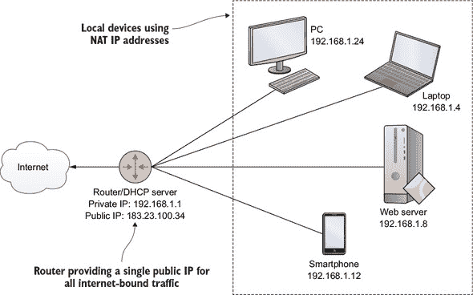
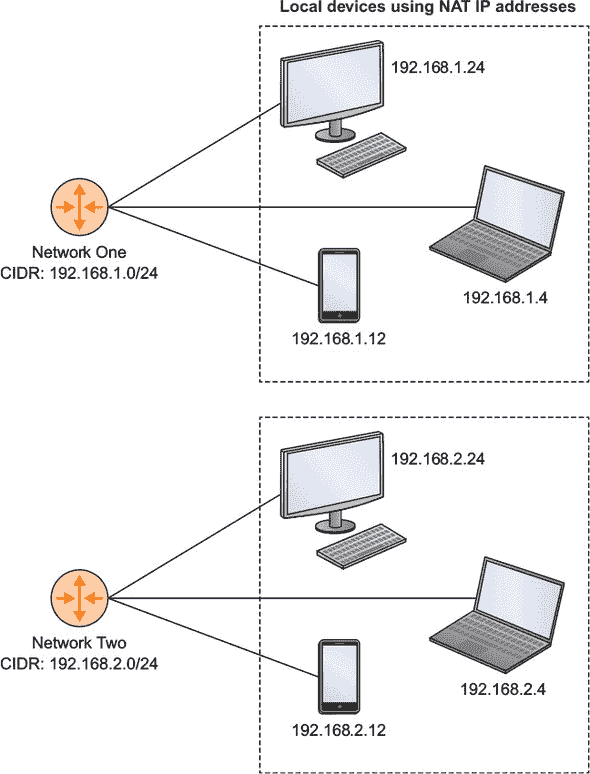
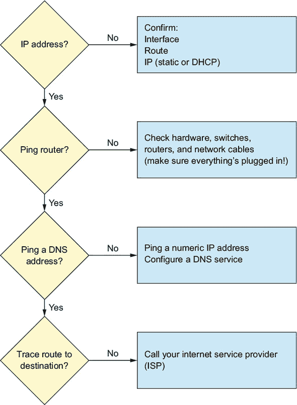
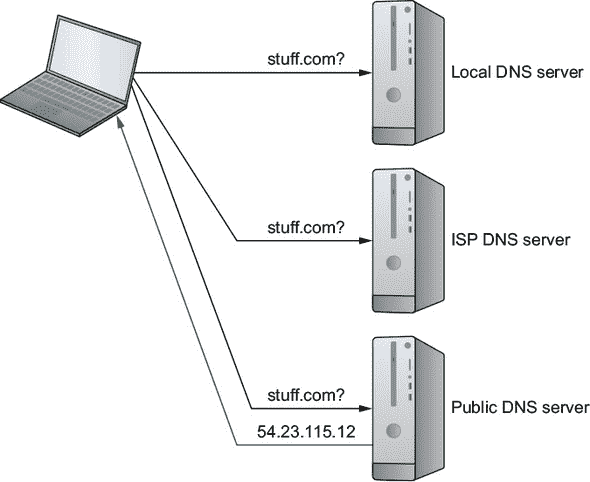

## 第十四章. 故障排除网络问题

*本章涵盖*

+   使用 TCP/IP 网络管理网络问题

+   网络和网络接口的故障排除

+   管理 DHCP 连接

+   配置 DNS 进行地址转换

+   故障排除入站网络连接

当我还是个孩子的时候，为 PC 获取新软件意味着要么自己编写，要么开车去商店购买一个包含一个或多个 5.25 英寸软盘的程序盒。通常情况下，远程协作需要点阵打印机和邮局。流媒体视频？别逗我了。我不记得我的第一台 PC 是否有调制解调器。如果有，我肯定从未使用过它。

现在，网络连接对计算的重要性就像键盘和浓咖啡一样不可或缺。随着语音界面的发展，比如亚马逊的 Alexa，可能不太明智地大量投资于键盘制造。（不过咖啡的前景仍然看好。）总之，没有快速可靠的网络访问，你和你要支持的用户将会非常无助。

为了提供快速可靠的网络访问，你需要知道如何使用网络工具和协议在你的网络接口和外部世界之间建立连接。你还需要知道如何识别和连接网络适配器到你的计算机上，这样工具和协议才能有所作为。我们很快就会谈到这一点。

但如果你要面对可能困扰你的网络通信的令人烦恼和不可预测的中断，你首先需要扎实的网络协议基础知识，通常被称为传输控制协议（TCP）和互联网协议（IP），简称 TCP/IP。从技术上讲，TCP/IP 根本不是 Linux 主题，因为无论运行什么操作系统，所有联网设备都普遍使用这些协议。由于本章的工作不涉及 TCP/IP，我们将从这里开始。如果你已经熟悉这些材料，可以自由跳过这一部分。 

### 14.1. 理解 TCP/IP 寻址

网络最基本单元是谦逊的互联网协议（IP）地址，至少必须分配给每个连接的设备。每个地址在整个网络中必须是唯一的；否则，消息路由将陷入混乱。

几十年来，标准的地址格式遵循 IPv4 协议：每个地址由四个 8 位八位字节组成，总共 32 位。（如果你不懂如何用二进制计数，不用担心。）每个八位字节必须是一个介于 0 到 255 之间的数字。这里有一个典型的（虚构的）例子：

```
154.39.230.205
```

从 IPv4 池中可以提取的最大理论地址数量超过 40 亿（256⁴）。曾经，这看起来很多。但随着互联网远远超出任何人的预期，IPv4 池中显然不会有足够的唯一地址来满足无数寻求连接的设备。

四十亿个可能的地址听起来是一个很大的数字，但考虑到目前有超过 10 亿部正在使用的 Android 智能手机；这还加上数以百万计的服务器、路由器、PC 和笔记本电脑，更不用说苹果手机了。有很大可能性，您的汽车、冰箱和家用安全摄像头也有它们自己的网络可访问地址，所以显然必须做出一些妥协。

提出了两种解决互联网地址系统即将崩溃（以及我们所知生活的终结）的方案：IPv6（一个全新的地址协议）和网络地址转换（NAT）。IPv6 提供了更大的地址池，但由于它还没有得到广泛部署，我将重点介绍 NAT。

#### 14.1.1\. 什么是 NAT 地址？

NAT 背后的组织原则非常出色：为什么不给每个设备分配一个唯一的、网络可读的地址，而是让它们都共享路由器使用的单个公共地址呢？但是，如何使流量流向和离开本地设备呢？通过使用 *私有* 地址。如果你想要将网络资源分成多个子组，如何才能有效地管理一切呢？通过网络分段。听起来很模糊？让我们看看 NAT 地址是如何工作的，以获得一些视角。

#### 14.1.2\. 使用 NAT 地址

当连接到您家庭 WiFi 的笔记本电脑上的浏览器访问网站时，它使用的是您互联网服务提供商（ISP）提供的 DSL 调制器/路由器分配的公共 IP 地址。通过同一 WiFi 网络连接的其他设备将使用相同的地址进行所有浏览活动（参见 图 14.1）。

##### 图 14.1\. 一个典型的 NAT 配置，展示了多个具有各自私有地址的本地设备如何都可以用一个单一的公共 IP 地址来表示



在大多数情况下，路由器使用动态主机配置协议（DHCP）为每个本地设备分配唯一的私有（NAT）地址，但这些地址在本地环境中是唯一的。这样，所有本地设备都可以与它们的本地对等方进行全面、可靠的通信。这对大型企业来说同样适用，其中许多企业使用成千上万的 NAT IP 地址，所有这些地址都位于单个公共 IP 后面。

NAT 协议预留了三个只能用于私有地址的 IPv4 地址范围：

+   10.0.0.0 至 10.255.255.255

+   172.16.0.0 至 172.31.255.255

+   192.168.0.0 至 192.168.255.255

本地网络管理员可以自由地以任何方式使用这些地址（有超过 1700 万个地址）。但是，地址通常被组织成更小的网络（或*子网*）块，其中主机网络由地址左侧的八位字节标识。这为地址右侧的八位字节留出了空间，可以分配给单个设备。

例如，你可能会选择在 192.168.1 上创建一个子网，这意味着这个子网中的所有地址都将以 192.168.1（地址的网络部分）开头，并以 2 到 254 之间的唯一单字节设备地址结尾。因此，该子网上的一个 PC 或笔记本电脑可能会获得地址 192.168.1.4，另一个可能会获得 192.168.1.48。

| |
| --- |

##### 注意

根据网络惯例，DHCP 服务器通常不会将数字 0、1 和 255 分配给网络设备。

| |
| --- |

继续使用这个例子，你可能随后想要使用 192.168.2 添加一个并行但独立的网络子网。在这种情况下，192.168.1.4 和 192.168.2.4 不仅是两个不同的地址，可以分配给两个不同的设备，而且由于它们位于不同的网络上，这两个设备甚至可能无法互相访问（参见图 14.2）。

##### 图 14.2\. 192.168.*x*网络范围内连接到两个单独 NAT 子网的设备



| |
| --- |

**子网表示法**

由于确保系统知道网络地址属于哪种子网至关重要，我们需要一种标准表示法，可以准确地传达哪些八位字节是网络的一部分，哪些是分配给设备的。有两种常用的标准：*无类域间路由（CIDR）*表示法和*子网掩码*。使用 CIDR，上一个例子中的第一个网络将被表示为 192.168.1.0/24。/24 告诉你前三个八位字节（8×3=24）构成了网络部分，只留下第四个八位字节用于设备地址。第二个子网在 CIDR 中表示为 192.168.2.0/24。

这两个相同的网络也可以通过子网掩码 255.255.255.0 来描述。这意味着前三个八位字节中的所有 8 位都被网络使用，但第四个八位字节没有被使用。

| |
| --- |

你不必完全按照这种方式拆分地址块。如果你知道你不太可能在域中需要很多网络子网，但你预计需要连接超过 255 个设备，你可以选择只将前两个八位字节（192.168）指定为网络地址，将 192.168.0.0 到 192.168.255.255 之间的所有内容留给设备。在 CIDR 表示法中，这将被表示为 192.168.0.0/16，并具有子网掩码 255.255.0.0。

你的网络部分也不需要使用完整的（8 位）八位字节。特定八位字节范围内的部分可以专门用于整个网络的地址（例如 192.168.14.*x*），其余的留给设备（或主机，更常见的是这样称呼）。这样，你可以预留子网前两个八位字节的所有地址（192 和 168），以及第三八位字节的一些地址（0），作为网络地址。这可以表示为 192.168.0.0/20 或使用子网掩码 255.255.240.0。

我从哪里得到这些符号编号？大多数经验丰富的管理员使用他们的二进制计数技能自己解决。但对于一个关于一般网络故障排除的章节，这有点超出范围，对于你可能会遇到的正常工作来说也是不必要的。尽管如此，仍然有许多在线子网计算器可以为你完成计算。

你为什么要将你的网络划分为子网？一个常见的场景涉及需要某些团队（可能是开发者）访问但不需要其他团队访问的公司资产。将它们逻辑上分离到它们自己的子网中可以是一个有效的方法。

### 14.2. 建立网络连接

每个人都在周一早上早早地来到工作场所。他们互相交换简短但愉快的问候，坐在他们的笔记本电脑和工作站上，准备开始一周富有成效的工作，然后发现无法访问互联网。除了可能愉快和富有成效的部分，你应该预期这种情况很快就会发生在你身上（如果还没有发生的话）。网络中断的原因可能是以下任何一种：

+   本地机器上的硬件或操作系统故障

+   对你的物理布线、路由或无线连接的干扰

+   本地路由软件配置问题

+   在 ISP 层面的故障

+   整个互联网本身出现故障

你的第一项工作是通过排除不相关的内容来缩小搜索范围。你可以通过遵循一个从最接近的地方开始的协议来完成这项工作，确认故障不在你自己的本地系统中，然后逐渐向外扩展。图 14.3 展示了这个过程流程。

##### 图 14.3. 展示在故障排除出站连接问题时可能遵循的顺序的流程图



让我们看看这一切可能如何运作。你将从解决本地计算机可能访问外部资源的问题开始，然后解决外部客户端或用户可能访问你的服务器上的资源的问题。

### 14.3. 故障排除出站连接

有可能你的计算机从未被分配自己的 IP 地址，没有它，作为网络良好成员的存在是不可能的。运行`ip`来显示你的网络接口设备，并确认你有一个活跃的外部设备，并且与之关联了一个有效的 IP 地址。在以下示例中，eth0 接口正在使用 10.0.3.57：

```
$ ip addr                                                               *1*
1: lo: <LOOPBACK,UP,LOWER_UP> mtu 65536 qdisc noqueue
        state UNKNOWN group default qlen 1                              *2*
    link/loopback 00:00:00:00:00:00 brd 00:00:00:00:00:00
    inet 127.0.0.1/8 scope host lo                                      *3*
       valid_lft forever preferred_lft forever
    inet6 ::1/128 scope host
       valid_lft forever preferred_lft forever
7: eth0@if8: <BROADCAST,MULTICAST,UP,LOWER_UP> mtu 1500 qdisc noqueue
        state UP group default qlen 1000                                *4*
    link/ether 00:16:3e:29:8e:87 brd ff:ff:ff:ff:ff:ff link-netnsid 0
    inet 10.0.3.57/24 brd 10.0.3.255 scope global eth0                  *5*
       valid_lft forever preferred_lft forever
    inet6 fe80::216:3eff:fe29:8e87/64 scope link
       valid_lft forever preferred_lft forever
```

+   ***1* ip 的 addr 参数也可以缩短为 a。**

+   ***2* 通过回环（lo）接口访问本地（localhost）资源**

+   ***3* 注意回环设备使用的 IP 地址是 127.0.0.1。这遵循了标准的网络约定。**

+   ***4* 接口状态显示为 UP。**

+   ***5* 计算机的当前公共 IP 地址显示为 inet 的值。**

如果`inet`行上没有列出 IP 地址，或者根本没有列出网络接口，那么这就是你需要集中注意力的地方。

#### 14.3.1. 跟踪网络状态

首先，确认你的计算机上安装了物理*网络适配器*（也称为*网络接口卡*，或 NIC），并且 Linux 能够识别它。你可以使用`lspci`列出当前安装的所有基于 PCI 的硬件。在以下输出中，`lspci`发现了一个 PCI Express 千兆以太网控制器：

```
$ lspci
00:00.0 Host bridge: Advanced Micro Devices, Inc. [AMD]
    Family 15h (Models 10h-1fh) Processor Root Complex
[...]
01:00.0 Ethernet controller:
    Realtek Semiconductor Co., Ltd. RTL8111/8168/8411
    PCI Express Gigabit Ethernet Controller (rev 06)        *1*
```

+   ***1* 术语“以太网控制器”指的是一种硬件网络接口设备。**

如果`lspci`没有返回任何网络接口卡（NIC），你应该考虑你可能有某种硬件故障的可能性。


##### 注意

*外围组件互连*（PCI）是一种硬件标准，用于允许外围设备通过 PCI 总线连接到计算机主板上的微处理器。还存在着各种更新的标准，如 PCI Express（PCIe），每个标准都使用其独特的形式因子来物理连接到主板。


除了`lspci`之外，你还可以使用`lshw`工具来显示系统所知的网络硬件。`lshw`本身返回一个完整的硬件配置文件，但`lshw-class network`将只显示与网络相关的配置文件子集。试试看。

`lspci`的积极结果本身不会让你走得太远，因为它没有告诉你如何从命令行访问该设备。但它确实提供了一些重要信息。例如，从`lspci`输出中提取*以太网*这个词，并使用 grep 来搜索`dmesg`的输出。你可能还记得第十一章，`dmesg`是涉及设备的内核相关事件的记录。经过一些尝试和错误，我发现通过包括包含搜索字符串的行之后的两个`dmesg`行（使用`-A 2`）进行搜索将是最有效的：

```
$ dmesg | grep -A 2 Ethernet
[    1.095265] r8169 Gigabit Ethernet driver 2.3LK-NAPI loaded
[    1.095840] r8169 0000:01:00.0 eth0<1>: RTL8168evl/8111evl
        at 0xffffc90000cfa000, 74:d4:35:5d:4c:a5, XID 0c900800 IRQ 36
[    1.095842] r8169 0000:01:00.0
        eth0: jumbo features [frames: 9200 bytes, tx checksumming: ko]   *1*
```

+   ***1* 设备标识 eth0 显示与千兆以太网设备相关联。**

成功！您可以看到设备被分配了 eth0 的指定。等等。别急。尽管 eth0 最初被分配给设备是因为 Linux 现在使用可预测的接口名称（请参阅第十章），但这可能不是接口实际使用的指定。为了安全起见，您想再次搜索`dmesg`以查看 eth0 是否出现在其他地方：

```
$ dmesg | grep eth0
[    1.095840] r8169 0000:01:00.0
        eth0: RTL8168evl/8111evl at 0xffffc90000cfa000, 74:d4:35:5d:4c:a5,
        XID 0c900800 IRQ 36
[    1.095842] r8169 0000:01:00.0
        eth0: jumbo features [frames: 9200 bytes, tx checksumming: ko]
[    1.129735] r8169 0000:01:00.0 enp1s0:
        renamed from eth0                         *1*
```

+   ***1* eth0 的指定已被删除，并替换为 enp1s0。**

哎。看起来在启动过程中某个时刻设备被重命名为 enp1s0。好的。您已经配置了正确的网络接口，但仍然没有 IP 地址，也没有网络连接，接下来是什么？`dhclient`，但首先有一些背景知识。

#### 14.3.2\. 分配 IP 地址

网络设备可以通过以下方式获取 IP 地址：

+   有些人手动设置了一个静态地址，希望它位于本地网络的地址范围内。

+   DHCP 服务器会自动为设备提供一个未使用的地址。

如通常情况，每种方法都有其权衡。DHCP 服务器自动且无形地完成工作，并保证两个管理设备永远不会尝试使用相同的地址。但另一方面，这些地址是动态的，这意味着它们今天使用的地址可能不是他们明天得到的。考虑到这一点，如果您一直在成功使用，比如说，192.168.1.34 通过 SSH 远程连接到服务器，请准备好应对意外变化。

相反，手动设置 IP 地址确保这些地址永久关联到它们的设备。但总有可能您可能会引起地址冲突——结果不可预测。一般来说，除非您有特定的静态地址需求——比如您可能需要通过地址可靠地远程访问资源——否则我会选择 DHCP。

##### 定义网络路由

在寻找地址之前，您需要确保 Linux 首先知道如何找到网络。如果 Linux 已经可以看到通往工作网络的路，那么`ip route`将显示您的计算机的路由表，包括本地网络和您用作网关路由器的设备的 IP 地址：

```
$ ip route
default via 192.168.1.1                            *1*
    dev enp0s3 proto static metric 100
192.168.1.0/24 dev enp0s3 proto kernel scope
    link src 192.168.1.22 metric 100               *2*
```

+   ***1* 本地计算机将通过该网关路由器访问更广泛的网络**

+   ***2* 本地 NAT 网络的 NAT 网络（192.168.1.x）和子网掩码（/24）**

如果没有列出工作路由，那么您需要创建一个，但首先您需要确定您本地网络的子网范围。如果有其他计算机使用相同的网络，请检查它们的 IP 地址。比如说，如果其中一台计算机正在使用 192.168.1.34，那么路由器的地址很可能是 192.168.1.1。同样，如果连接的计算机的 IP 地址是 10.0.0.45，那么路由器的地址将是 10.0.0.1。您应该明白了。基于此，以下是创建到网关的新默认路由的`ip`命令：

```
# ip route add default via 192.168.1.1 dev eth0
```


##### 注意

本章讨论的 `ip` 命令相对较新，旨在取代现在已弃用的命令集，如 `ifconfig`、`route` 和 `ifupdown`。您仍然会看到大量专注于这些旧命令的指南，至少目前它们仍然有效，但您应该习惯使用 `ip`。


##### 请求动态地址

请求 DHCP 地址的最佳方式是使用 `dhclient` 在您的网络上搜索 DHCP 服务器，然后请求一个动态地址。以下是一个示例，假设您的外部网络接口名为 enp0s3：

```
# dhclient enp0s3
Listening on LPF/enp0s3/08:00:27:9c:1d:67
Sending on   LPF/enp0s3/08:00:27:9c:1d:67
Sending on   Socket/fallback
DHCPDISCOVER on enp0s3 to 255.255.255.255
   port 67 interval 3 (xid=0xf8aa3055)
DHCPREQUEST of 192.168.1.23 on enp0s3 to 255.255.255.255
   port 67 (xid=0x5530aaf8)
DHCPOFFER of 192.168.1.23 from 192.168.1.1             *1*
DHCPACK of 192.168.1.23 from 192.168.1.1
RTNETLINK answers: File exists
bound to 192.168.1.23 -- renewal in 34443 seconds.     *2*
```

+   ***1* 在这种情况下 DHCP 服务器的地址是 192.168.1.1。**

+   ***2* 新地址已成功租用一定时间；续订将是自动的。**

##### 配置静态地址

您可以使用 `ip` 从命令行临时为接口分配一个静态 IP 地址，但这只会持续到下一次系统启动。考虑到这一点，以下是操作方法：

```
# ip addr add 192.168.1.10/24 dev eth0
```

这对于快速且简单的单次配置很有用，例如在故障排除时尝试在受影响的系统上获得连接。但通常您可能更喜欢使您的编辑永久化。在 Ubuntu 机器上，这需要编辑 /etc/network/interfaces 文件。该文件可能已经包含一个部分，将您的接口定义为 DHCP 而不是静态。

##### 列表 14.1\. /etc/network/interfaces 文件中的一个部分

```
auto enp0s3
iface enp0s3 inet dhcp
```

您将编辑该部分，将 `dhcp` 改为 `static`，输入您希望它拥有的 IP 地址，子网掩码（以 *x.x.x.x* 格式），以及计算机将使用的网络网关（路由器）的 IP 地址。以下是一个示例：

```
auto enp0s3
iface enp0s3 inet static
    address 192.168.1.10
    netmask 255.255.255.0
    gateway 192.168.1.1
```

在 CentOS 上，每个接口都会在 /etc/sysconfig/network-scripts/ 目录中有一个自己的配置文件。一个典型的用于 DHCP 地址设置的接口配置将如下所示。

##### 列表 14.2\. /etc/sysconfig/network-scripts/ifcfg-enp0s3 中的配置

```
TYPE="Ethernet"
BOOTPROTO="dhcp"            *1*
DEFROUTE="yes"
PEERDNS="yes"
PEERROUTES="yes"
IPV4_FAILURE_FATAL="no"
IPV6INIT="yes"
IPV6_AUTOCONF="yes"
IPV6_DEFROUTE="yes"
IPV6_PEERDNS="yes"
IPV6_PEERROUTES="yes"
IPV6_FAILURE_FATAL="no"
NAME="enp0s3"
UUID="007dbb43-7335-4571-b193-b057c980f8d0"
DEVICE="enp0s3"
ONBOOT="yes"
```

+   ***1* 告诉 Linux 为该接口请求一个动态 IP 地址**

下一个列表显示了在编辑以允许静态地址后该文件可能的样子。

##### 列表 14.3\. CentOS 接口配置文件的静态版本

```
BOOTPROTO=none            *1*
NETMASK=255.255.255.0
IPADDR=10.0.2.10          *2*
USERCTL=no
DEFROUTE="yes"
PEERDNS="yes"
PEERROUTES="yes"
IPV4_FAILURE_FATAL="no"
IPV6INIT="yes"
IPV6_AUTOCONF="yes"
IPV6_DEFROUTE="yes"
IPV6_PEERDNS="yes"
IPV6_PEERROUTES="yes"
IPV6_FAILURE_FATAL="no"
NAME="enp0s3"
UUID="007dbb43-7335-4571-b193-b057c980f8d0"
DEVICE="enp0s3"
ONBOOT="yes"
```

+   ***1* 不会使用 DHCP 地址**

+   ***2* 设置您想要使用的静态 IP 地址**

如果您希望您的设置立即生效，您需要重新启动网络。大多数情况下，现代系统中的网络由 systemd 服务 NetworkManager 管理。但在 Ubuntu 上至少，启动或停止 /etc/network/interfaces 文件中定义的接口是由网络服务处理的。因此，如果您想应用接口文件中的新编辑设置，您将运行 `systemctl restart networking` 而不是 `systemctl restart NetworkManager`。或者，您可以使用 `ip` 只启动（或关闭）一个接口：

```
# ip link set dev enp0s3 up
```

了解你的系统中 NetworkManager 隐藏工作文件的某些位置不会有害。在`/etc/NetworkManager/`目录中有一个名为`NetworkManager.conf`的配置文件，每个你的电脑历史上建立的网络的配置文件都在`/etc/NetworkManager/system-connections/`中，以及详细说明你的电脑历史 DHCP 连接的数据在`/var/lib/NetworkManager/`中。为什么不快速浏览一下这些资源呢？

#### 14.3.3. 配置 DNS 服务

如果你有一个有效的网络路由和 IP 地址，但连接问题还没有解决，那么你可能需要扩大你的搜索范围。想想看，你到底不能做什么。

你的网页浏览器无法加载页面吗？（我不知道，也许像 bootstrap-it.com 这样的例子。）这可能意味着你没有连接性。也可能意味着没有发生 DNS 转换。

##### 什么是 DNS？

虽然看起来不是这样，但万维网实际上完全是关于数字的。没有名为 manning.com 或 wikipedia.org 的地方。相反，它们分别是 35.166.24.88 和 208.80.154.224。连接我们到我们所知和喜爱的网站的软件只识别数字 IP 地址。

在文本爱好者的人类和我们的更数字化机器之间进行翻译的工具被称为*域名系统*（DNS）。*域名*是一个常用来描述一个独特的网络资源组的词，特别是那些由唯一可读的名称标识的资源。如图 14.4 所示，当你你在浏览器中输入一个文本地址时，会寻求 DNS 服务器提供的服务。

##### 图 14.4. 对 stuff.com 的 DNS 地址查询及其包含（虚构）IP 地址的回复



##### DNS 是如何工作的？

第一个地方通常是本地索引，其中包含名称及其关联的 IP 地址，这些信息存储在一个由电脑上的操作系统自动创建的文件中。如果这个本地索引没有回答这个特定的转换问题，它将请求转发到一个指定的公共 DNS 服务器，该服务器维护一个更完整的索引，并且可以连接到你想要的网站。知名的公共 DNS 服务器包括由 Google 提供的，它们使用美味的简单地址 8.8.8.8 和 8.8.4.4，以及 OpenDNS。

##### 修复 DNS

除非出了问题，否则你通常不会花很多时间去思考 DNS 服务器。但恐怕真的出了点问题。你可以使用 ping 工具来确认问题。如果你 ping 一个正常的网站 URL（如 manning.com）不起作用，但使用 IP 地址可以，那么你就找到了你的问题所在。这可能看起来是这样的：

```
$ ping 8.8.8.8
PING 8.8.8.8 (8.8.8.8) 56(84) bytes of data.
64 bytes from 8.8.8.8: icmp_seq=1 ttl=60 time=10.3 ms
64 bytes from 8.8.8.8: icmp_seq=2 ttl=60 time=10.2 ms
64 bytes from 8.8.8.8: icmp_seq=3 ttl=60 time=9.33 ms
^C                                                                *1*
--- 8.8.8.8 ping statistics ---
3 packets transmitted, 3 received, 0% packet loss, time 2002ms
rtt min/avg/max/mdev = 9.339/10.002/10.378/0.470 ms
```

+   ***1* 这个符号告诉你 Ctrl-c 键组合被用来中断 ping 操作。**

解决方案？这取决于。很多时候，单个计算机将通过它们连接到更广网络的路由器继承 DNS 设置。我想这意味着你接下来几分钟将花费在抽屉里寻找路由器登录密码（提示：默认密码通常打印在路由器外壳上）。

一旦你成功登录，通常是从一个连接的 PC 登录，该 PC 运行一个指向路由器 IP 地址的浏览器，通过路由器操作系统的 GUI 菜单进行操作，确保 DNS 设置有效。你还可以在本地计算机上配置 DNS 设置，这将覆盖路由器上的设置。在 CentOS 机器上，将几个公共 DNS 服务器的引用添加到接口的`/etc/sysconfig/network-scripts/ifcfg-enp0s3`文件中。此示例使用 Google DNS 服务器使用的两个 IP 地址：

```
DNS1=8.8.8.8
DNS2=8.8.4.4
```

在 Ubuntu 上，将`dns-nameserver`值添加到`/etc/network/interfaces`文件中相应的接口：

```
dns-nameserver 8.8.8.8
dns-nameserver 8.8.4.4
```

#### 14.3.4\. 水暖工程

是的。现在是卷起袖子，拿出排水蛇的时间了。如果你已经有了工作界面、路由、IP 地址和 DNS 服务，但仍然没有完整的连接性，那么肯定有什么东西在外面阻挡了流量。

Linux 中排水蛇的等效物，特别是带有视频摄像头末端的复杂类型，是 Traceroute——正如其名，它追踪数据包在网络中到达目标的路由。如果任何地方有阻塞流量，Traceroute 至少会显示阻塞的位置。即使你无法进一步调查，这些信息也可能特别有价值，因为你的 ISP 试图让一切恢复正常。

此示例显示了从我的家庭工作站到 google.com（表示为 172.217.0.238）的成功端到端行程。如果出了任何问题，显示的跳转会在达到目标之前停止。只包含星号（`*`）的输出行有时可能表示数据包未能返回。通常，完全失败会伴随着错误信息：

```
$ traceroute google.com
traceroute to google.com (172.217.0.238), 30 hops max, 60 byte packets
 1  ControlPanel.Home (192.168.1.1)
        21.173 ms  21.733 ms  23.081 ms                              *1*
 2  dsl-173-206-64-1.tor.primus.ca (173.206.64.1)
        25.550 ms  27.360 ms  27.865 ms                              *2*
 3  10.201.117.22 (10.201.117.22)  31.185 ms  32.027 ms  32.749 ms
 4  74.125.48.46 (74.125.48.46)  26.546 ms  28.613 ms  28.947 ms
 5  108.170.250.241 (108.170.250.241)  29.820 ms  30.235 ms  33.190 ms
 6  108.170.226.217 (108.170.226.217)
        33.905 ms 108.170.226.219 (108.170.226.219)  10.716 ms  11.156 ms
 7  yyz10s03-in-f14.1e100.net (172.217.0.238)  12.364 ms *  6.315 ms
```

+   ***1* 第一跳是我的本地路由器；显示的~20 毫秒跳转时间有点慢，但可以接受。**

+   ***2* 我的互联网服务提供商**

仍然没有解决问题？听起来是时候给你的 ISP 打电话了。

接下来要讨论的是：当你的本地网络内的人可以访问互联网上的一切，但你的远程工作人员、客户和访客无法进入以消费你提供的服务时会发生什么。

### 14.4\. 故障排除入站连接

不论是你们公司的网站、支持你们应用的 API 还是内部文档维基，你们的基础设施中都有一些部分你们希望 24/7 可用。这类入站连接对于你们的企业或组织来说可能和刚刚讨论的出站连接一样重要。

如果您的远程客户端无法连接到您的服务，或者它们的连接速度太慢，您的业务将受到影响。因此，您需要定期确认您的应用程序运行正常，正在监听传入的请求，这些请求拥有所需的访问权限，并且有足够的带宽来处理所有流量。`netstat` 和 `netcat` 可以帮助您做到这一点。

#### 14.4.1\. 内部连接扫描：netstat

在服务器上运行 `netstat` 会显示广泛的网络和接口统计信息。然而，当面对一群愤怒的 Web 客户端时，您最感兴趣的可能是一份正在监听网络请求的服务列表。

`netstat -l` 将显示当前所有打开的套接字。如果您正在运行一个网站，则可以通过过滤 `http` 来缩小结果。在这种情况下，端口 80（http）和 443（https）似乎都是活跃的：

```
$ netstat -l | grep http
tcp6 0  0 [::]:http   [::]:*  LISTEN            *1*
tcp6 0  0 [::]:https   [::]:*  LISTEN
```

+   ***1* 协议显示为 tcp6，这表明这是一个专用的 IPv6 服务。实际上，它涵盖了 IPv6 和 IPv4。**


**网络套接字究竟是什么？**

坦白说，我不太确定如何描述它。对于一个 C 语言程序员来说，这可能感觉有些奇怪，但对于一个简单的系统管理员，比如我这样的谦卑仆人来说，可能感觉更奇怪。尽管如此，我还是冒险简化一下，说一个 *服务端点* 是由服务器的 IP 地址和端口号（例如 192.168.1.23:80）定义的。这种组合确定了 *网络套接字*。在涉及两个端点/套接字（客户端和服务器）的会话期间创建连接。


`netstat -i` 将列出您的网络接口。表面上，这看起来可能不是什么大问题；毕竟，`ip addr` 也能做到这一点，对吧？啊，是的。但是 `netstat` 还会显示接收到的数据包数量（`RX`）和发送的数据包数量（`TX`）。`OK` 表示无错误传输；`ERR` 表示损坏的数据包；`DRP` 表示丢弃的数据包。当您不确定服务是否活跃时，这些统计数据可能会有所帮助：

```
$ netstat -i
Kernel Interface table
Iface   MTU Met RX-OK RX-ERR RX-DRP RX-OVR TX-OK TX-ERR Flg
enp1s0     1500 0       0       0      0 0      0     0 BMU
lo        65536 0   16062       0      0 0  16062     0 LRU
wlx9cefd5fe6a19  1500 0 1001876 0      0 0 623247     0 BMRU
```

该示例似乎显示了一个健康且繁忙的无线接口（不幸的名称为 wlx9cefd5fe6a19），以及一个名为 enp1s0 的非活动接口。发生了什么事？这是一台带有未使用的以太网端口且通过 WiFi 获取互联网的 PC。在代码中，`lo` 是 localhost 接口，也称为 127.0.0.1。这是一种从服务器内部评估事物的好方法，但外部看起来如何呢？

#### 14.4.2\. 外部连接扫描：netcat

您已经使用 `cat` 来流式传输文本文件，使用 `zcat` 来流式传输压缩归档的内容。现在是时候认识（猫科）家族的另一位成员了：`netcat`（通常称为 `nc`）。正如您从其名称中猜测的那样，`netcat` 可以用于在网络上流式传输文件，甚至可以作为简单的双向聊天应用程序。

但现在您更感兴趣的是服务器状态，特别是客户端将如何看到它。`nc`在针对远程地址运行时，会告诉您是否能够建立连接。`-z`将`netcat`的输出限制为扫描监听守护进程的结果（而不是尝试建立连接），而`-v`增加了输出的详细程度。您需要指定要扫描的端口或端口。以下是一个示例：

```
$ nc -z -v bootstrap-it.com 443 80
Connection to bootstrap-it.com 443 port [tcp/https] succeeded!
Connection to bootstrap-it.com 80 port [tcp/http] succeeded!
```

如果其中任何一个或两个服务（HTTP 和 HTTPS）不可用，扫描将失败。这可能是因为服务没有在服务器上运行（例如，您的 Apache 网络服务器已停止）或者存在过于严格的防火墙规则阻止访问。失败的扫描将如下所示：

```
$ nc -z -v bootstrap-it.com 80
nc: connect to bootstrap-it.com port 80 (tcp) failed: Connection timed out
```

然而，这是 Linux，所以您可以确信完成这项工作有不止一种好方法。因此，请注意，`nmap`可以用来执行类似的扫描：

```
$nmap -sT -p80 bootstrap-it.com
Nmap scan report for bootstrap-it.com (52.3.203.146)
Host is up (0.036s latency).
PORT   STATE SERVICE
80/tcp open  http
Nmap done: 1 IP address (1 host up) scanned in 0.37 seconds
```

这个`nmap`命令将扫描 1 到 1023 端口之间的任何开放端口，这是一种快速审计系统以确保没有不应该开放的端口的好方法：

```
$ nmap -sT -p1-1023 bootstrap-it.com
Nmap scan report for bootstrap-it.com (52.3.203.146)
Host is up (0.038s latency).
Not shown: 1020 filtered ports
PORT    STATE SERVICE
80/tcp  open  http
443/tcp open  https
Nmap done: 1 IP address (1 host up) scanned in 4.69 seconds
```

哪些端口“应该”开放？这取决于您在服务器上运行的软件。作为一个经验法则，如果`nmap`报告任何不熟悉的开放端口，请在网上搜索以找出使用这些端口的软件，然后问问自己，该软件在您的服务器上运行是否合理。

### 摘要

+   至少在实践上，Linux 在 NAT 网络协议的上下文中定义和管理网络接口和路由。

+   Linux 需要识别连接的硬件外围设备，如网络接口，但在它们可用之前还需要指定设备标签（如 eth0）。

+   可以通过编辑配置文件和从命令行（使用`ip`）为设备分配自定义静态 IP 地址。动态地址可以从 DHCP 服务器自动请求，但您无法控制获得的地址。

+   确认远程客户端可以访问适当的本地服务涉及扫描开放的套接字和端口。

### 关键术语

+   *TCP/IP*是定义网络行为管理的传输控制协议和互联网协议约定。

+   *公网 IP 地址*必须是全局唯一的，而*NAT 地址*只需要在本地网络内是唯一的。*动态主机配置协议*（DHCP）通常用于管理动态（非永久性）地址分配。

+   *网络路由*是通过计算机获得网络访问的网关路由器的地址。

+   *域名系统*（DNS）提供数字 IP 地址和可读 URL 之间的转换，使得方便地导航互联网资源。

+   *网络套接字*是 IP 地址和端口的表示，通过网络连接可以通过它被激活。

### 安全最佳实践

定期使用像`nmap`这样的工具来审计您的系统，检查是否有不适当地开放的端口，这是一个好习惯。

### 命令行审查

+   `ip addr` lists the active interfaces on a Linux system. You can shorten it to `ip a` or lengthened it to `ip address`. It’s your choice.

+   `lspci` lists the PCI devices currently connected to your computer.

+   `dmesg | grep -A 2 Ethernet` searches the `dmesg` logs for references to the string *Ethernet* and displays references along with the subsequent two lines of output.

+   `ip route add default via 192.168.1.1 dev eth0` manually sets a new network route for a computer.

+   `dhclient enp0s3` requests a dynamic (DHCP) IP address for the enp0s3 interface.

+   `ip addr add 192.168.1.10/24 dev eth0` assigns a static IP address to the eth0 interface, which won’t persist past the next system restart.

+   `ip link set dev enp0s3 up` starts the enp0s3 interface (useful after editing the configuration).

+   `netstat -l | grep http` scans a local machine for a web service listening on port 80.

+   `nc -z -v bootstrap-it.com 443 80` scans a remote web site for services listening on the ports 443 or 80.

### 测试自己

> **1**
> 
> 以下哪个是有效的 NAT IP 地址？
> 
> 1.  11.0.0.23
> 1.  
> 1.  72.10.4.9
> 1.  
> 1.  192.168.240.98
> 1.  
> 1.  198.162.240.98
> 1.  
> **2**
> 
> 你将如何描述使用两个八位字节作为网络地址的 IPv4 网络子网，同时使用 CIDR 和 netmask 表示法？
> 
> 1.  x.x.x.x/16 或 255.255.0.0
> 1.  
> 1.  x.x.x.x/24 或 255.255.255.0
> 1.  
> 1.  x.x.x.x/16 或 255.0.0.0
> 1.  
> 1.  x.x.x.x/16 或 255.255.240.0
> 1.  
> **3**
> 
> 以下哪个命令可以帮助你发现 Linux 为网络接口指定的名称？
> 
> 1.  `dmesg`
> 1.  
> 1.  `lspci`
> 1.  
> 1.  `lshw -class network`
> 1.  
> 1.  `dhclient`
> 1.  
> **4**
> 
> 你正在设置办公室的 PC，并希望它具有可靠的网络连接。以下哪个配置文件将最适合？
> 
> 1.  动态 IP 地址，直接连接到互联网
> 1.  
> 1.  静态 IP 地址，属于 NAT 网络的一部分
> 1.  
> 1.  静态 IP 地址，直接连接到互联网
> 1.  
> 1.  动态 IP 地址，属于 NAT 网络的一部分
> 1.  
> **5**
> 
> 以下哪个命令用于请求动态 IP 地址？
> 
> 1.  `ip route`
> 1.  
> 1.  `dhclient enp0s3`
> 1.  
> 1.  `ip client enp0s3`
> 1.  
> 1.  `ip client localhost`
> 1.  
> **6**
> 
> 你将编辑哪个文件来配置 CentOS 机器上名为 enp0s3 的网络接口？
> 
> 1.  /etc/sysconfig/networking/ipcfg-enp0s3
> 1.  
> 1.  /etc/sysconfig/network-scripts/ipcfg-enp0s3
> 1.  
> 1.  /etc/sysconfig/network-scripts/enp0s3
> 1.  
> 1.  /etc/sysconfig/network-scripts/ifcfg-enp0s3
> 1.  
> **7**
> 
> 你会在 Ubuntu 机器的`/etc/network/interfaces`文件的哪个网络接口配置部分添加哪一行，以强制接口使用 Google DNS 名称服务器？
> 
> 1.  DNS1=8.8.8.8
> 1.  
> 1.  dns-nameserver 8.8.8.8
> 1.  
> 1.  nameserver 8.8.8.8
> 1.  
> 1.  dns-nameserver1 8.8.8.8
> 1.  
> **8**
> 
> 以下哪个命令将扫描远程服务器上知名 TCP 端口，以查找可访问的监听服务？
> 
> 1.  `nmap -s -p1-1023 bootstrap-it.com`
> 1.  
> 1.  `nmap -sU -p80 bootstrap-it.com`
> 1.  
> 1.  `nmap -sT -p1-1023 bootstrap-it.com`
> 1.  
> 1.  `nc -z -v bootstrap-it.com`

#### 答案键

> **1.**
> 
> c
> 
> **2.**
> 
> a
> 
> **3.**
> 
> a
> 
> **4.**
> 
> d
> 
> **5.**
> 
> b
> 
> **6.**
> 
> d
> 
> **7.**
> 
> d
> 
> **8.**
> 
> c
