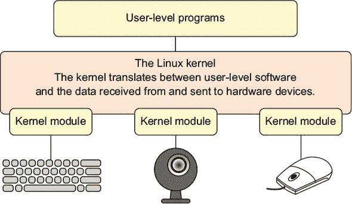
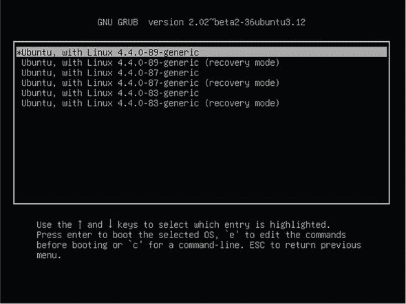
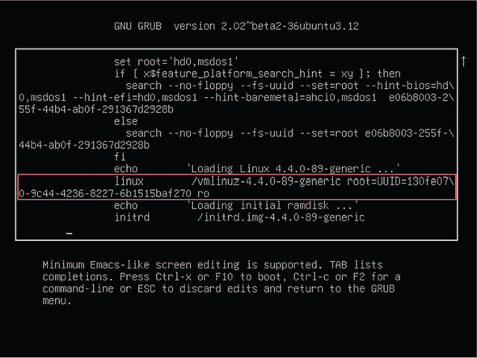
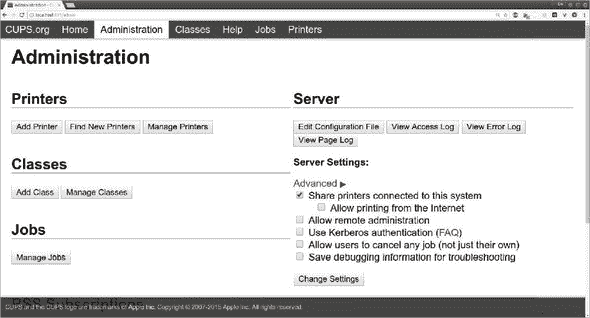

## 第十五章\. 解决外围设备故障

*本章涵盖*

+   分析系统硬件配置文件

+   管理内核模块以管理硬件设备

+   管理内核设置以解决硬件启动冲突

+   使用 CUPS 管理和解决打印机问题

点击鼠标按钮和你在屏幕上看到发生的事情之间的连接很复杂。简单来说，你需要某种软件过程，它将在鼠标和电脑之间、电脑和运行在其上的软件之间、以及软件和屏幕之间来回穿梭数据。

不仅仅是数据传输，你还需要一种方法来在只知道它所坐的桌面的鼠标和只知道零和一的软件之间转换数据。将这一点乘以数千种设备型号，再加上许多连接类型（PCI、SATA、USB、串行），你就在你的 PC 中煮了一锅相当复杂的汤。

考虑到整个系统的复杂性，它竟然如此可靠地工作，真是令人惊讶。在本章中，你将学习如何处理那些它不工作的时候……比如当市场营销团队在等待你激活摄像头，以便他们的虚拟会议开始。或者当他们的 WiFi 不允许他们首先连接。要完成所有这些魔法，你需要了解 Linux 如何看待你的外围设备，以及你如何引导 Linux 内核将一个害羞的设备纳入其羽翼下并照顾它。因为我们关心我们所有的设备。

### 15.1\. 识别连接的设备

插入的摄像头没有在互联网上展示你的笑脸？打印机没有打印？WiFi 适配器没有适配（或者它们所做的任何事情）？

在你投入太多时间和精力去激活硬件设备之前，你必须首先接受这个令人悲伤的事实：操作系统（OS）有时甚至可能无法识别其连接的一些硬件。如果你新插入的设备似乎不起作用，你首先应该确认 Linux 知道它的存在。这将让你忙上接下来的几页。如果你运行我即将展示的诊断程序，仍然没有生命迹象，那么考虑一下这种可能性：

+   设备与你的硬件或 Linux 不兼容。

+   设备损坏或故障。

+   硬件接口或电缆损坏或故障。

+   系统需要重启。

+   你今天过得不太好。

当它们开始互相通信后，我会向你展示如何使用内核模块，让 Linux 和你的设备能够联手为你完成一些工作。我们将从通过 Linux 的视角查看你的硬件开始。实际上，这个“找出 Linux 是否识别了你刚刚插入的设备”的业务并不是全新的。你还记得在第六章中使用了 `lsblk` 来发现附加的块设备。嗯，`lsblk` 有一些表亲：`lsusb` 列出 Linux 所知的任何 USB 设备，正如你在上一章中看到的，`lspci` 会为 PCI 设备做同样的事情。以下是一个例子：

```
$ lsusb
Bus 005 Device 001: ID 1d6b:0001 Linux Foundation 1.1 root hub
Bus 002 Device 001: ID 1d6b:0002 Linux Foundation 2.0 root hub
Bus 001 Device 008: ID 04f9:0249
    Brother Industries, Ltd                                                *1*
Bus 001 Device 007: ID 413c:2005 Dell Computer Corp. RT7D50 Keyboard
Bus 001 Device 006: ID 046d:081a Logitech, Inc.                            *2*
Bus 001 Device 005: ID b58e:9e84 Blue Microphones Yeti Stereo Microphone
Bus 001 Device 004: ID 1a40:0101
    Terminus Technology Inc. Hub                                           *3*
Bus 001 Device 002: ID 148f:5372
    Ralink Technology, Corp. RT5372 Wireless Adapter                       *4*
Bus 003 Device 002: ID 093a:2510 Pixart Imaging, Inc. Optical Mouse
```

+   ***1* 一台兄弟激光打印机**

+   ***2* 一款网络摄像头**

+   ***3* 一款 USB 多端口集线器**

+   ***4* 一款 USB 无线网卡**

第十四章也是你看到 `ls` 家族的老大 `lshw` 的地方。当以 `root` 权限运行时，`lshw` 会打印出系统的完整硬件配置文件。你首先会注意到的是，`lshw` 对你硬件的每一部分都有很多话要说。驯服这个巨兽的一种方法是将输出转换为易于阅读的 .html 文件，你可以在网页浏览器中查看它。`-html` 参数就是用来做这个的。在 Nautilus 这样的 GUI 文件管理器中点击文件名应该会将其加载到你的默认浏览器中。以下是操作方法：

```
# lshw -html > lshw-output.html
```

记得我们在上一章中使用 `lshw -class network` 来限制输出只显示与网络相关的内容吗？这个技巧同样适用于其他数据子集。例如，`lshw -c memory` 会显示系统使用所有类型的内存的详细信息（包括 RAM、BIOS 固件和缓存）；你可能已经猜到了，`-c` 作为 `-class` 的快捷方式，可以更快地使用。除此之外，`lshw -c storage` 会显示 SATA 和 SCSI 接口的信息，`-c multimedia` 包括音频和视频设备，而 `-c cpu` 会告诉你关于连接到主板上的 CPU 的所有信息。这就是如何优雅地*消费* `lshw` 信息。但你应该如何*使用*它呢？

这是一个常见的场景。假设你正在考虑向系统添加额外的 RAM——也许你在第十三章中收集的指标表明你的 RAM 可能不足。你需要知道你已经有多少 RAM 以及它的类型，更不用说你需要了解你正在使用的主板，以便你可以研究有多少 RAM 插槽可用以及它们的最大容量是多少。

好的。所以 RAM 并不完全是一个外围设备，但它很好地作为一个例子，说明了可能的硬件发现类型。而且，在解决硬件问题时，硬件发现始终应该是你的第一步。

为了说明这一点，`lshw`告诉我我的主板有四个 RAM 插槽，其中两个目前被 4GB A-Data DDR3 1600 内存模块占用。由于你应该避免在单个系统上安装不匹配的内存模块，这告诉我我应该购买什么类型的 RAM 来填充这两个空槽，并将我的容量加倍。

我应该指出，我目前没有升级工作站的计划。我为什么要升级呢？我已经拥有的硬件配置相当适中，它允许我在编辑和/或编码少量视频（使用 Kdenlive）的同时运行多个虚拟机，并且还能让至少一个网络浏览器保持忙碌，打开十几个标签页。而我用不到 300 美元从头搭建的电脑，其性能比许多同事使用的 1000 多美元的设备要好得多。区别在哪里？那些可怜的家伙在喂养着资源消耗巨大的 Windows 和 macOS 操作系统，而我却在使用快速高效的 Linux。看吧。

如果你的设备被 Linux 识别但仍然不活跃，可能有一个合适的内核模块正在等待被加载。

### 15.2. 使用 Linux 内核模块管理外围设备

Linux 通过内核模块来管理硬件外围设备。以下是它是如何工作的。

运行中的 Linux 内核是你不希望打扰的东西之一。毕竟，内核是驱动你电脑所有操作的软件。考虑到在实时系统中需要同时管理的许多细节，最好是让内核在没有太多干扰的情况下完成其工作。但如果连对计算环境进行微小更改都需要重启整个系统，那么插入新的摄像头或打印机可能会对你的工作流程造成痛苦的干扰。每次添加设备都需要重启以使系统识别它，这几乎是不高效的。

为了在稳定性和可用性这两种对立的优点之间创造一个有效的平衡，Linux 将内核本身隔离出来，但允许你通过*可加载内核模块*（LKMs）即时添加特定功能。查看图 15.1，你可以将模块想象成一段软件，它告诉内核设备的位置以及如何处理它。反过来，内核将设备提供给用户和进程，并监督其操作。

##### 图 15.1. 内核模块作为设备和 Linux 内核之间的翻译器。



没有什么阻止你编写自己的模块来支持你想要的设备，但你为什么要费这个劲呢？Linux 模块库已经非常强大，通常没有必要自己开发。而且，绝大多数情况下，Linux 会自动加载新设备的模块，而你甚至可能都不知道。

然而，有时出于某种原因，它不会自动发生。（你不想让那个招聘经理不耐烦地等待太久，直到你的笑脸加入视频会议面试。）为了帮助事情顺利进行，你需要了解更多关于内核模块的信息，特别是如何找到将运行你的外围设备的实际模块，然后如何手动激活它。

#### 15.2.1\. 查找内核模块

根据公认的习惯，模块是以.ko（内核对象）扩展名的文件，位于/lib/modules/目录之下。然而，在你导航到那些文件之前，你可能需要做出一个选择。因为你在启动时可以从一系列版本中选择加载一个，所以支持你的选择（包括内核模块）的特定软件必须存在于某个地方。好吧，/lib/modules/就是那些某个地方之一。你会在那里找到每个可用的 Linux 内核版本的模块目录，如下所示：

```
$ ls /lib/modules
4.4.0-101-generic
4.4.0-103-generic
4.4.0-104-generic
```

在我的情况下，活动的内核是具有最高发布号的版本（4.4.0-104-generic），但并不能保证这对你来说也是一样的（内核经常更新）。如果你打算做一些你希望在实时系统上使用模块的工作，你需要确保你有了正确的目录树。

好消息：有一个可靠的技巧。与其通过名称识别目录并希望得到正确的目录，不如使用始终指向活动内核名称的系统变量。你可以使用`uname -r`（`-r`指定系统信息中通常显示的内核发布号）来调用该变量：

```
$ uname -r
4.4.0-104-generic
```

通过这些信息，你可以使用称为*命令替换*的过程将`uname`整合到你的文件系统引用中。例如，为了导航到正确的目录，你可以在/lib/modules/中添加它。为了告诉 Linux`uname`本身不是一个文件系统位置，将`uname`部分用反引号括起来，如下所示：

```
$ ls /lib/modules/`uname -r`
build   modules.alias        modules.dep      modules.softdep
initrd  modules.alias.bin    modules.dep.bin  modules.symbols
kernel  modules.builtin      modules.devname  modules.symbols.bin
misc    modules.builtin.bin  modules.order    vdso
```

你会发现大多数模块都组织在 kernel/目录下的自己的子目录中。现在花几分钟浏览这些目录，以了解事物的组织方式和可用性。文件名通常会给你一个很好的提示，你正在看什么：

```
$ ls /lib/modules/`uname -r`/kernel
arch  crypto  drivers  fs  kernel  lib  mm
    net  sound  ubuntu  virt  zfs                *1*
```

+   ***1* 这里列出的子目录中最繁忙的是 kernel，在其下你可以找到数百个设备的模块。**

这实际上是一种定位内核模块的方法，也是快速而简单的方法。但并非只有这一种方法。如果你想获取完整的集合，你可以使用`lsmod`列出所有当前加载的模块和一些基本信息。第一列是模块名称，后面是文件大小和数量，然后是每个模块所依赖的其他模块的名称：

```
$ lsmod
[...]
vboxdrv               454656  3 vboxnetadp,vboxnetflt,vboxpci   *1*
rt2x00usb              24576  1 rt2800usb                       *1*
rt2800lib              94208  1 rt2800usb                       *1*
[...]
```

+   ***1* 这一小部分结果展示了与 VirtualBox 和我的 USB WiFi 适配器相关的模块。**

多少才算太多？好吧，让我们再次运行`lsmod`，但这次将输出通过管道传递给`wc -l`以获取行数：

```
$ lsmod | wc -l
113
```

这些是已加载的模块。总共有多少个可用？运行`modprobe -c`并计算行数将给出这个数字：

```
$ modprobe -c | wc -l
33350
```

33,350 个可用的模块？看起来有人在多年来努力为我们提供运行物理设备的软件。

| |
| --- |

##### 注意

在某些系统上，你可能会遇到自定义模块，这些模块要么在`/etc/modules`文件中有它们自己的唯一条目，要么作为配置文件保存在`/etc/modules-load.d/`中。这些模块很可能是本地开发项目的产物，可能涉及前沿实验。无论如何，了解你所看到的内容总是一个好主意。

| |
| --- |

这就是如何查找模块。你的下一个任务是弄清楚如何手动加载一个非活跃模块，如果由于某种原因它没有自动发生。

#### 15.2.2\. 手动加载内核模块

在加载内核模块之前，逻辑上你必须确认它存在。而在你能够做到这一点之前，你需要知道它的名字。有时候，获取这部分信息可能需要魔法和运气的同等部分，以及来自在线文档作者的某些帮助。

我将通过描述我之前遇到的一个问题来阐述这个过程。有一天，出于我至今仍无法理解的原因，笔记本电脑上的 WiFi 接口突然停止工作。就是这样。可能是一个软件更新让它失效了。谁知道呢？我运行了`lshw -c network`并得到了以下非常奇怪的信息：

```
network UNCLAIMED
    AR9485 Wireless Network Adapter
```

Linux 识别了接口（Atheros AR9485），但将其列为未声明。嗯，正如他们所说，“当困难来临时，坚强的人会去搜索互联网。”我搜索了“atheros ar9 linux module”，在翻阅了成页甚至 10 年前的结果后，建议我要么编写自己的模块，要么放弃，我终于发现，至少在 Ubuntu 16.04 上，存在一个可用的模块。它的名字是 ath9k。

是的！战斗几乎已经胜利！向内核添加模块比听起来要容易得多。为了确认它可用，你可以对模块的目录树运行`find`命令，指定`-type f`告诉 Linux 你正在寻找一个文件，然后添加字符串`ath9k`以及通配符星号来包括所有以你的字符串开头的文件名：

```
$ find /lib/modules/$(uname -r) -type f -name ath9k*
/lib/modules/4.4.0-97-generic/kernel/drivers/net/wireless/ath/
 ath9k/ath9k_common.ko
/lib/modules/4.4.0-97-generic/kernel/drivers/net/wireless/ath/ath9k/ath9k.ko
/lib/modules/4.4.0-97-generic/kernel/drivers/net/wireless/ath/ath9k/ath9k_htc.ko
/lib/modules/4.4.0-97-generic/kernel/drivers/net/wireless/ath/ath9k/ath9k_hw.ko
```

只需再走一步，加载模块：

```
# modprobe ath9k
```

就这样。无需重启。无需麻烦。

再举一个例子，展示如何处理已损坏的活跃模块。曾经有一段时间，使用我的罗技摄像头与某款特定软件配合时，会使摄像头在下次系统启动之前对任何其他程序都不可用。有时我需要在不同应用程序中打开摄像头，但没有时间关闭和重新启动。（我运行了很多应用程序，启动后需要一些时间才能将它们全部设置好。）

因为这个模块可能处于活动状态，使用`lsmod`搜索单词*video*给了我关于相关模块名称的提示。实际上，这比提示更好——唯一描述了单词*video*的模块是 uvcvideo，如下所示：

```
$ lsmod | grep video
uvcvideo               90112  0
videobuf2_vmalloc      16384  1 uvcvideo
videobuf2_v4l2         28672  1 uvcvideo
videobuf2_core         36864  2 uvcvideo,videobuf2_v4l2
videodev              176128  4 uvcvideo,v4l2_common,videobuf2_core,
 videobuf2_v4l2
media                  24576  2 uvcvideo,videodev
```

对于导致崩溃的原因，可能有一些我可以控制的事情；而且，我想，我可以挖得更深，看看是否可以正确地解决问题。但你知道，有时候你不在乎理论，只想让你的设备工作。所以我使用`rmmod`来终止 uvcvideo 模块，并使用`modprobe`来重新启动它，让它焕然一新：

```
# rmmod uvcvideo
# modprobe uvcvideo
```

再次强调：无需重启。无需顽固的血迹。

### 15.3. 手动管理启动时的内核参数

因为无论如何我们都在谈论内核，现在正是讨论内核参数的好时机。你知道，我们一直推迟的对话，因为内核参数听起来很吓人。好吧，它们确实很吓人：选错它们可能会让你的电脑至少暂时无法启动。而且拼写也很重要。

最初为什么要制造麻烦？因为有时你的内核默认启动配置可能不适合你的需求，而唯一解决问题的方法就是改变内核的启动方式。

在启动时向内核传递自定义参数有两种方式。一种是在启动过程中编辑 GRUB 菜单项，另一种是在运行的系统上编辑`/etc/default/grub`配置文件，以便在下次启动时生效。为了说明这些方法，我将使用两个实际用例场景。你必须继续阅读才能了解这些是什么。

#### 15.3.1. 在启动时传递参数

我不确定这个问题有多普遍，但它作为一个教学示例会很合适。一些不幸的人发现他们无法正确关闭或重启 Linux，每次都会遇到不想要的系统冻结。添加一个简单的内核参数有时可以解决这个问题。下面是如何操作的。

在 GRUB 菜单中选择你想要启动的 Linux 版本（见图 15.2），按 e 键，你将被带到编辑屏幕。在那里，你可以使用常规的光标和文本键进行导航，然后编辑内容。

##### 图 15.2. 主要 GRUB 菜单显示可加载的多个 Linux 内核



滚动直到你到达图 15.3 中突出显示的 Linux 条目。在这个例子中，在换行后，该条目以*ro*结束。（如果你的不同，不用担心。）然后在行尾添加`reboot=bios`，并按 Ctrl-x 接受更改并启动。如果这不能解决关闭问题，你可以尝试再次使用`reboot=pci`而不是`reboot=bios`。

##### 图 15.3. 显示启动参数的 Linux 行，指向 Linux 镜像的位置



请记住，这次编辑不会是永久的。下次启动后，GRUB 设置将再次由文件系统中的配置文件控制。要了解如何进行持久更改，请继续阅读。

#### 15.3.2\. 通过文件系统传递参数

好吧，这个怎么样？可能会有时候你想在没有 GUI 的情况下启动桌面机器。也许 GUI 本身的一些元素没有正确加载，你需要一个干净、可靠的 shell 会话来排除故障。你知道吗，你可以通过 GRUB 将默认运行级别设置为 3（多用户，非图形模式）。

| |
| --- |

##### 备注

*运行级别* 是一个设置，用于定义特定会话的 Linux 系统状态。在运行级别 0–6 之间进行选择，确定哪些服务应该可用，从完整的图形多用户系统到没有任何服务（即关机）。

| |
| --- |

打开 /etc/default/grub 文件，找到 `GRUB_CMDLINE_LINUX_DEFAULT` 行。它通常带有几个参数，看起来像这样：

```
GRUB_CMDLINE_LINUX_DEFAULT="quiet splash"
```

将 `systemd.unit=runlevel3.target` 添加到行尾，使其看起来如下所示。（`quiet splash` 对我们来说无关紧要；它控制你在启动时在屏幕上看到的内容。）

```
GRUB_CMDLINE_LINUX_DEFAULT="quiet splash systemd.unit=runlevel3.target"
```

在 Ubuntu 上运行 `update-grub` 或在 CentOS 上运行 `grub2-mkconfig` 以使更改生效。下次启动计算机时，你将进入命令行 shell。一旦你完成了故障排除，你可以从 /etc/default/grub 中移除 `systemd.unit=runlevel3.target`，再次更新 GRUB，然后重新启动。

### 15.4\. 管理打印机

准备好受到惊吓了吗？确保你已经坐好。我将建议你跳过一个完美的命令行工具，转而使用其 GUI 等效工具。命令行工具？`lp`。在引擎盖下配备了更新的引擎，`lp` 仍然存在，并且它确实可以做一些有趣的事情。但相信我，如果你支持的办公室打印机从网络上消失，你不会打开命令行来排除故障。如今，一切都是 Common UNIX Printing System (CUPS)，一直如此。但在我们深入之前，我会给你一些可能用得上的 `lp` 命令。

#### 15.4.1\. `lp` 的基础知识

假设有一台远程计算机上的文件需要打印。你知道通过远程 X 会话启动 LibreOffice 并不是很有趣，对吧？通过简单、快速、可靠的 SSH shell 来做不是更好吗？说吧，不再多说了。使用 `lpq` 列出可用的打印机（包括当前的作业队列）：

```
$ lpq
Brother-DCP-7060D is ready
no entries
```

然后使用 `lp` 打印文件。如果系统上有多个打印机，你还需要指定你想要使用的打印机。以下是一个示例：

```
$ lp -d Brother-DCP-7060D /home/user/myfile.pdf
```

不想立即打印？稍后安排。`-H` 调度设置始终使用 UTC 时间而不是本地时间：

```
$ lp -H 11:30 -d Brother-DCP-7060D /home/user/myfile.pdf
```

#### 15.4.2\. 使用 CUPS 管理打印机

从前，在购买打印机用于 Linux 系统之前，你需要进行仔细且耗时的研究以确保其兼容性。如果兼容，你通常需要下载并安装适当的驱动程序，然后通过操作系统手动安装打印机。当它工作正常时，这会是一个值得庆祝的时刻。在过去几年中，有三件事情的发生使得 Linux 打印变得更好：

+   CUPS 模块化打印系统已被许多，如果不是所有，的 Linux 发行版采用来管理打印机和打印。信不信由你，CUPS 是由苹果公司代表社区进行管理的。正如你很快就会看到的，CUPS 界面极大地简化了管理和故障排除，并且非常可靠。

+   主要打印机制造商现在通常提供 Linux 驱动程序。它们并不总是完美的，但它们是可行的。这意味着，如今，几乎任何现代打印机都可以与 Linux 计算机一起部署。尽管如此，快速查看像[`help.ubuntu.com/community/Printers`](https://help.ubuntu.com/community/Printers)这样的在线资源也无妨。

+   从 17.04 版本开始，Ubuntu 现在提供无驱动打印。这意味着任何可访问的本地或网络打印机都将自动添加到 CUPS，无需任何设置。

无论如何，你通过浏览器访问 CUPS 界面，将其指向你自己的机器上的端口 631（localhost:631）。管理标签页（在图 15.4 中可见）包含管理查找、保护、安排和跟踪所有可用打印机的直接链接。

##### 图 15.4\. 默认情况下通过任何运行 CUPS 的 Linux 计算机的端口 631 可用的 CUPS 浏览器界面



你甚至可以管理一组打印机，以允许有效使用多个设备。这可以是一种组织资源的好方法，例如，确保昂贵的彩色打印仅用于高优先级的工作，草稿文档被迫打印在更便宜、质量较低的打印机上。

CUPS 无痕处理所有脏管理细节。如果你需要将特定的打印机从一台计算机（或网络子网，如果是网络打印机）断开连接，并将其连接到另一台，你只需在主机计算机的 CUPS 界面上进行相关更改即可。适当的路由信息将在一分钟或两分钟内自动更新到网络中。

CUPS 知道哪些打印机可用，因为默认情况下，连接到任何运行 CUPS 的计算机的打印机都会向网络上的所有其他计算机广播其存在。这，连同许多其他配置设置，可以通过/etc/cups/cupsd.conf 文件进行控制。

##### 列表 15.1\. /etc/cups/cupsd.conf 配置文件的一部分

```
LogLevel warn
PageLogFormat
MaxLogSize 0
# Allow remote access
Port 631                                        *1*
Listen /var/run/cups/cups.sock
# Share local printers on the local network.
Browsing On
BrowseLocalProtocols dnssd
DefaultAuthType Basic
WebInterface Yes                                *2*
[...]
```

+   **1** 你可以更改 CUPS 使用的网络端口。

+   **2** 如果出于安全考虑需要，你可以完全阻止对 Web 界面的访问。

如果 CUPS 未能识别您的打印机，在搜索互联网（使用打印机的名称和单词 *linux*）之前，有一些事情可以尝试：

+   检查错误信息。运行 `systemctl status cups` 是查看最新警报的好方法。

+   从命令行运行 `lsusb`（假设是 USB 打印机）和/或 `lpinfo -v` 以确认系统可以看到您的打印机。

+   确保在 `/etc/cups/printers .conf` 文件中没有重复或过时的条目。如果有，关闭 CUPS（`systemctl stop cups`），保存原始文件的副本，然后删除任何旧条目。再次启动 CUPS，并尝试从浏览器界面添加打印机。

+   确保在 `/etc/cups/cupsd.conf` 文件的 `<Policy default>` 部分没有过于严格的设置，这些设置可能会阻止合法请求。

### 摘要

+   应该使用 Linux 工具（如 `lshw`）提供的硬件配置的可见性和洞察力来辅助所有硬件升级和维修决策。

+   Linux 内核通过隔离系统活动来保护自己免受不稳定变化的影响，但内核模块可以安全地为硬件设备提供对内核资源的动态访问。

+   Linux 内核可以通过在启动时添加参数来修改，无论是通过编辑配置文件还是通过 GRUB 菜单。

+   CUPS 提供了一个网络管理打印机的接口。

### 关键术语

+   *内核模块* 是一种软件，它为 Linux 内核定义了硬件设备的属性，以供其使用。

+   *内核参数* 是在运行时添加到内核的参数，用于控制系统行为。

### 安全最佳实践

使用 `/etc/cups/cupsd.conf` 文件来控制对打印机的网络访问。

### 命令行审查

+   `lshw -c memory`（或 `lshw -class memory`）显示系统硬件配置的内存部分。

+   `` ls /lib/modules/`uname -r` `` 列出 `/lib/modules/` 目录下包含当前活动内核模块的内容。

+   `lsmod` 列出所有活动模块。

+   `modprobe -c` 列出所有可用的模块。

+   `find /lib/modules/$(uname -r) -type f -name ath9k*` 在可用的内核模块中搜索以 *ath9k* 开头的文件。

+   `modprobe ath9k` 将指定的模块加载到内核中。

+   `GRUB_CMDLINE_LINUX_DEFAULT="systemd.unit=runlevel3.target"`（在 `/etc/default/grub` 文件中）以多用户、非图形会话方式加载 Linux。

+   `lp -H 11:30 -d Brother-DCP-7060D /home/user/myfile.pdf` 在 UTC 时间 11:30 调度打印任务到 Brother 打印机。

### 测试自己

> **1**
> 
> 什么是最简单的方法来直观地查看计算机的完整硬件配置？
> 
> 1.  `lsmod`
> 1.  
> 1.  `lshw -class memory`
> 1.  
> 1.  `lshw -html > lshw-output.html`
> 1.  
> 1.  `modprobe -C`
> 1.  
> **2**
> 
> 最好的方法来引用包含活动内核模块的文件系统位置是什么？
> 
> 1.  `/lib/kernel/uname -a`
> 1.  
> 1.  `/lib/modules/name -r`
> 1.  
> 1.  `/usr/modules/uname -r`
> 1.  
> 1.  `/lib/modules/uname -r`
> 1.  
> **3**
> 
> 以下哪个命令将禁用内核模块？
> 
> 1.  `delmod uvcvideo`
> 1.  
> 1.  `rmmod uvcvideo`
> 1.  
> 1.  `modprobe -d uvcvideo`
> 1.  
> 1.  `rmmod -r uvcvideo`
> 1.  
> **4**
> 
> 您需要向 Linux 内核传递一个参数，使其立即且永久生效。您应该采取哪些步骤？
> 
> 1.  在引导时，编辑 GRUB 菜单的“编辑”菜单中的 linux 行，使用 Ctrl-x 保存文件，然后引导系统。
> 1.  
> 1.  将参数添加到 /etc/default/grub 文件中，更新 GRUB，然后重启系统。
> 1.  
> 1.  从命令行升级 GRUB，重启系统，在引导时编辑 GRUB 菜单的“编辑”菜单中的 linux 行，使用 Ctrl-x 保存文件，然后引导系统。
> 1.  
> 1.  重启系统，从命令行升级 GRUB，并将参数添加到 /etc/default/grub 文件中。
> 1.  
> **5**
> 
> 以下哪个命令将在十点半安排打印作业？
> 
> 1.  `lpd 10:30 -d Brother-DCP-7060D /home/user/myfile.pdf`
> 1.  
> 1.  `lpq -h 10:30 -d Brother-DCP-7060D /home/user/myfile.pdf`
> 1.  
> 1.  `lp -T 10:30 -d Brother-DCP-7060D /home/user/myfile.pdf`
> 1.  
> 1.  `lp -H 10:30 -d Brother-DCP-7060D /home/user/myfile.pdf`

#### 答案键

> **1.**
> 
> c
> 
> **2.**
> 
> d
> 
> **3.**
> 
> b
> 
> **4.**
> 
> b
> 
> **5.**
> 
> d
