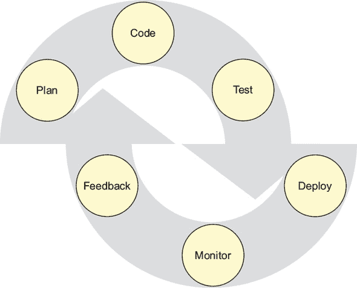
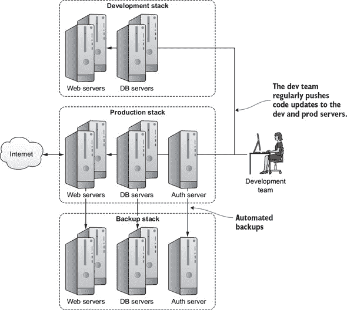
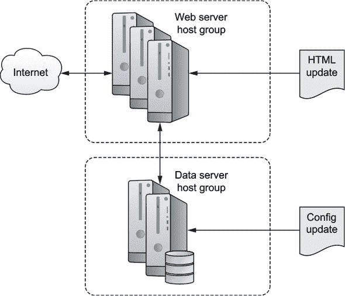
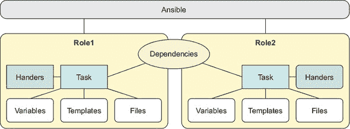

## 第十六章\. DevOps 工具：使用 Ansible 部署脚本化服务器环境

*本章涵盖*

+   使用编排工具自动化分层 Linux 部署

+   使用 Ansible 剧本管理 Linux 服务器

+   在模块化架构中组织部署相关数据

你已经看到了脚本如何自动化复杂且无聊的过程，以确保它们定期且正确地完成。你曾在第五章中编写脚本以帮助备份工作。你也在第二章中看到了虚拟 Linux 服务器如何在几秒钟内配置和启动。有什么理由你不能将这些工具组合起来，自动化整个虚拟基础设施环境的创建呢？没有。完全没有理由。

你是否想要这样做？好吧，如果你和你的团队参与了一个涉及多个开发者定期将软件版本推送到多个服务器的 IT 项目，那么你可能需要认真考虑一下，尤其是如果你有计划采用图 16.1 中展示的 DevOps 项目管理方法之一。

##### 图 16.1\. 典型的 DevOps 周期将反馈、测试和监控纳入开发过程。



什么是 DevOps？它是一种通过项目开发、质量保证（QA）和系统管理团队之间的紧密协作来组织科技公司和组织工作流程的方法。目标是使用模板（*基础设施即代码*）来加快部署和软件更新周期，并允许更高水平的流程自动化和监控。

许多自动化收益将通过智能实施像 Ansible 这样的编排工具来实现。能够将新的或更新的代码插入到一个虚拟装配线上，所有底层基础设施和兼容性细节都无形中得到了处理，这无疑可以加快速度。但它也可以大大提高质量并减少错误。

因为大多数 DevOps 操作都是建立在 Linux 基础设施之上的，而且系统管理员在流程中的重要性不亚于开发者，所以你的 Linux 职业生涯迟早会接触到 DevOps。在结束这本书之前，了解一点 DevOps 和编排的世界会是个不错的选择。

想象一下，您负责一个像图 16.2 中展示的复杂平台。这包括单独的应用程序、数据库和认证服务器，所有这些都在开发、生产和备份环境中进行了复制。开发服务器为您提供了一个安全的地方来测试您的代码，在将其推送到生产环境之前，备份服务器可以在生产服务器崩溃时投入使用。您的开发人员不断努力添加功能和修复错误。他们定期将新代码推送到生产周期中。此外，您运行的服务器数量不断变化，以满足不断上升和下降的用户需求。

##### 图 16.2. 一个典型的应用程序开发环境，由开发团队定期提供的常规软件更新所驱动



在如此多的代码在多个方向上飞来飞去的情况下，您将需要一些帮助来保持一切井然有序。

### 16.1. 部署编排器能为您做什么

部署编排器在旧式的裸金属服务器上施展它们的魔力时会非常满意，但只有当您将它们融入虚拟化部署中时，您才能享受到它们的全部力量。鉴于在您自己的硬件上或使用像 AWS 这样的云服务提供商的资源上创建虚拟服务器的脚本化过程是多么容易，能够自动化为您的虚拟机创建软件堆栈只会增加速度和效率。

理念是您编写一个或多个文本文件，其内容声明了您希望指定机器（通常称为*主机*）上所有系统和应用程序软件的精确状态。当运行时，编排器将读取这些文件，登录到适当的宿主或宿主机，并执行所有必要的命令以实现所需的状态。您不必在您启动的每个宿主机上手动进行繁琐且容易出错的流程，而是告诉编排器为您完成所有这些工作。一旦您的基础设施扩展到数十个甚至数千个宿主机，这种自动化不仅方便，而且是必不可少的。

但如果这一切都是关于自动化文件系统操作，为什么不用您已经拥有的 Bash 脚本技能呢？好吧，您可能可以，但一旦您开始尝试将这些脚本与远程认证和冲突的软件堆栈等元素结合起来，您的生活很快就会变得疯狂复杂。

编排器将安全可靠地为你管理变量和密码，并在适当的情况下以必要的方式和次数应用它们。你不需要自己跟踪所有细节。由于有各种各样的编排工具，你选择的工具将主要取决于你项目的具体细节、组织背景。你需要问自己一些基本问题：“大多数参与人员会是开发者还是 IT 专业人士？” “你将使用持续集成方法吗？” 表 16.1 提供了四个主要参与者的快速简略介绍。

##### 表 16.1\. 流行的部署编排器

| 工具 | 功能 |
| --- | --- |
| --- | --- |
| Puppet | 广泛的社区支持 |
|   | 推荐一些编码技能 |
|   | 可使用 Ruby 扩展 |
|   | 需要在所有客户端上安装代理 |
| Chef | 与 Git 集成 |
|   | 推荐一些编码技能 |
|   | 可使用 Ruby 扩展 |
|   | 学习曲线高 |
|   | 广泛的社区支持 |
|   | 需要在所有客户端上安装 chef-client |
| Ansible | 系统管理员友好 |
|   | 基于 Python |
|   | 无需代码，无需基于主机的代理 |
|   | 简单、快速通过 SSH 连接 |
|   | 通过基于文本的文件（称为 playbooks）运行 |
|   | 学习曲线最小 |
| Salt | 通过代理（称为 minions）工作 |
|   | 高度可扩展 |
|   | 系统管理员友好 |

作为系统管理员，Ansible 对我来说听起来是一个赢家，所以我们将在本章的剩余部分集中关注它。但你的具体项目和期望可能不同。

### 16.2\. Ansible：安装和设置

在开始之前，你需要在 Ansible 服务器以及你计划用作主机的所有机器上安装最新的 Python 版本。无论是使用`apt install python`还是`yum install python`都可以完成这项工作。无论你使用哪个版本的 Python（意味着 Python 2 或 3），确保`python --version`可以从命令行工作。


##### 注意

到目前为止，Ansible 通常使用较旧的 2.7 版本的 Python 表现更好。然而，这可能不会是一个长期的状态。


为了在服务器（或*控制机器*）上安装 Ansible，你需要启用 EPEL 仓库（针对 CentOS 6）、 Extras 仓库（针对 CentOS 7），或者 Ubuntu 的 ppa:ansible 仓库。然而，在 Ubuntu 上使用`add-apt-repository`命令启用该仓库之前，你可能需要安装软件包`software-properties-common`。操作步骤如下：

```
# apt install software-properties-common
# add-apt-repository ppa:ansible/ansible
# apt update
# apt install ansible
```

最后，启动两个或三个 Python 就绪的 LXC 容器作为主机（或*节点*），这些是执行所有工作的生物。不需要在任何主机上安装 Ansible，只需在控制机器上安装即可。

#### 16.2.1\. 设置无密码访问主机

让我们看看如何设置对主机的无密码访问。Ansible 倾向于通过 SSH 连接来完成其工作。尽管从命令行处理身份验证是可能的，但将 SSH 密钥发送到主机以实现无密码访问要远远好于从命令行处理身份验证。你记得这是从 第三章 中学到的，但这里再重复一遍：

```
$ ssh-keygen                                                           *1*
$ ssh-copy-id -i .ssh/id_rsa.pub ubuntu@10.0.3.142                     *2*
/usr/bin/ssh-copy-id: INFO: attempting to log in with the new key(s),
    to filter out any that are already installed
/usr/bin/ssh-copy-id: INFO: 1 key(s) remain to be installed --
    if you are prompted now it is to install the new keys
ubuntu@10.0.3.142's password:                                          *3*
```

+   ***1* 如果你本地系统上还没有密钥对，请运行此命令。**

+   ***2* 你要复制服务器 SSH 密钥的主机机器的登录名和 IP 地址**

+   ***3* 你需要为主机机器用户账户输入密码以授权密钥传输。**

现在，Ansible 已经正确安装并连接到你的主机，是时候配置你的环境了。

#### 16.2.2\. 组织 Ansible 主机

Ansible 从位于 /etc/ansible 目录下的名为 hosts 的清单文件中获取有关要管理的哪些主机的信息。该文件可以是 IP 地址或域名的一个简单列表，或者两者的组合。

##### 列表 16.1\. 一个简单的 /etc/ansible/hosts 文件示例

```
10.0.3.45
192.168.2.78
database.mydomain.com
```

但是，随着你期望 Ansible 管理的主机数量以及你整体环境的复杂性增长，你可能想要更好地组织这些事情。实现这一目标的一种方法是将你的主机划分为主机组，然后可以对它们执行精确的 Ansible 操作。

##### 列表 16.2\. 一个组织成主机组的 /etc/ansible/hosts 文件示例

```
[webservers]
10.0.3.45
192.168.2.78

[databases]
database1.mydomain.com
```

使用主机组，Ansible 任务可以配置为仅针对定义良好的主机子集运行，例如，仅向 Web 服务器发送更新的公共网页，向数据库发送新的配置文件（如图 16.3 所示）。

##### 图 16.3\. 推送到主机组中特定任务的更新



可以应用于 hosts 文件的控制还有很多。你会发现，在安装过程中在 /etc/ansible/ 中创建的默认 hosts 文件已经包含了一些很好的语法建议，例如，如何在单行中引用多个主机名：`www[001:006].example.com`。


##### 注意

因此，你将能够跟随本章中的演示，将你的 Python 准备好的 LXC（或其他）主机的 IP 地址添加到 hosts 文件中。


#### 16.2.3\. 测试连接性

为了测试设置是否正确，Ansible 可以尝试联系 hosts 文件中列出的主机。这个命令以所谓的 *ad hoc* 模式从命令行运行 Ansible。`-m` 参数告诉 Ansible 加载并运行 ping 模块，向 hosts 文件中列出的所有主机发送简单的“你在吗？”请求：

```
$ ansible all -m ping
10.0.3.103 | SUCCESS => {
    "changed": false,
    "ping": "pong"
}
```

该命令中的 `all` 条件表示你希望此操作在 hosts 文件中列出的所有主机上执行。如果你只想 ping 一个特定的主机组，你将使用组名而不是 `all`：

```
$ ansible webservers -m ping
```

现在你已经连接上了，你可以远程运行简单的命令。这个例子将/etc/group 文件复制到每个主机的家目录中。记住，你之所以能够不提供认证就完成这项操作，是因为你之前使用了`ssh-keygen`将你的 SSH 密钥保存到了远程主机上：

```
$ ansible all -a "cp /etc/group /home/ubuntu"
```

你可以通过在 SSH 上运行`ls`来确认操作是否成功：

```
$ ssh ubuntu@10.0.3.103 "ls /home/ubuntu"
```

如果你登录到 Ansible 服务器上的账户的用户名与你的主机上的用户名不同，你需要告诉 Ansible。你可以通过命令行使用`--user`参数来做到这一点，假设主机用户名是 ubuntu，它看起来像这样：`ansible --user ubuntu all -m ping`。

### 16.3\. 认证

现在假设你需要在你远程主机上执行需要 sudo 权限的命令。想象一下，你想要将更新的.html 文件推送到你负载均衡器后面辛勤工作的数十个 Web 服务器上。一次性完成这个操作，而不是为每个主机单独重复操作，确实很有意义。


**什么是负载均衡器？**

如果你对这个好奇，*负载均衡器*是一个服务器或网络路由器，它接收访问服务的请求并将这些请求重定向到多个应用服务器。负载均衡器擅长在服务器之间分配需求，以确保没有一台服务器过载，并且能够将请求从不健康或不可用的服务器上移开。两个广泛使用的开源 Linux 负载均衡软件包是 HAProxy 和 nginx，除了其 Web 服务器功能外，nginx 也用于负载均衡。


为什么不自己试试？看看当你尝试使用 copy 模块将本地家目录中的文件（可能是你之前复制到那里的 group 文件）复制到远程主机的/var/www/html 目录时会发生什么。如果你的主机没有预先设置/var/www/html 目录，你可以通过替换任何不属于你的用户的系统目录（如/etc/）来产生相同的效果：

```
$ ansible webservers -m copy -a "src=/home/ubuntu/group \
    dest=/var/www/html/"                                         *1*
10.0.3.103 | FAILED! => {
    "changed": false,
    "checksum": "da39a3ee5e6b4b0d3255bfef95601890afd80709",
    "failed": true,
    "msg": "Destination /var/www/html not writable"              *2*
}
```

+   ***1* src=指向本地机器上源文件的位置；dest=指向主机上的目标位置。**

+   ***2* 一个描述性的错误消息，解释出了什么问题**

哎呀。 “目标/var/www/html 不可写”听起来像是一个权限问题。看起来你需要找到一种方法来提升你的权限。最好的方法是通过/etc/ansible/ansible.cfg 文件中的设置。正如以下示例所示，我通过取消注释 ansible.cfg 文件中的四行来编辑了`[privilege_escalation]`部分。

##### 列表 16.3\. /etc/ansible/ansible.cfg 中的更改设置

```
[privilege_escalation]
become=True
become_method=sudo
become_user=root
become_ask_pass=True
```

当你再次运行 copy 操作时，这次添加了`--ask-become-pass`参数，Ansible 会读取更新的配置文件并提示输入远程 ubuntu 用户的 sudo 密码。这次你会成功：

```
$ ansible --ask-become-pass webservers -m copy -a "src=/home/ubuntu/group \
    dest=/var/www/html/"
SUDO password:
10.0.3.103 | SUCCESS => {
    "changed": true,
    "checksum": "da39a3ee5e6b4b0d3255bfef95601890afd80709",
    "dest": "/var/www/html/stuff.html",
    "gid": 0,
    "group": "root",
    "md5sum": "d41d8cd98f00b204e9800998ecf8427e",
    "mode": "0644",
    "owner": "root",
    "size": 0,
    "src": "/home/ubuntu/.ansible/tmp/
        ansible-tmp-1509549729.02-40979945256057/source",
    "state": "file",
    "uid": 0
}
```

登录到你的远程服务器以确认文件已被复制。顺便说一句，从安全的角度来看，将你的组文件留在 web 根目录里是一个糟糕的主意。这只是一个例子。请不要将其留在那里。

### 16.4\. Ansible playbooks

正如你所看到的，你可以在一两分钟内启动一些基本的 Ansible 活动。但那些基础知识不会让你走得太远。如果你想利用工具的真正力量，使其能够编排我在章节引言中描述的那种自动化多级基础设施，你需要学习如何使用 playbooks。*Playbooks*是你紧密定义 Ansible 想要触发的策略和动作的方式。它们也是共享工作配置配置文件的一种简单方法。这里有你可以使用 playbook 的两种方式：

+   作为简单的独立脚本

+   作为指向一个特别结构的目录树中分布的资源（用于更复杂的环境）的参考

#### 16.4.1\. 编写简单的 playbook

让我们学习如何创建一个简单的 playbook，它可以一次性部署一个相对简单的 web 服务器。为此，你需要使用模块（如之前看到的 copy 模块），运行 Linux 系统操作的 tasks，以及用于动态响应系统事件的 handlers。首先，确保你的/etc/ansible/目录下的 hosts 文件是最新的。

##### 列表 16.4\. 一个简单的/etc/ansible/hosts 文件

```
10.0.3.103
10.0.3.96
```

接下来，你需要创建一个名为 site.yml 的 YAML 格式文件。*YAML*是一种与更广泛使用的 JavaScript Object Notation (JSON)相关的文本格式化语言。虽然你需要小心地正确缩进，但 YAML 格式确实可以生成易于阅读、理解和编辑的配置配置文件。

在文件中以包含三个短横线（`---`）的行开始后，你的文件将包括三个部分：`hosts`、`tasks`和`handlers`。在这种情况下，`hosts`部分告诉 Ansible 将 playbook 的操作应用于 hosts 文件中 webservers 组的所有地址。`tasks`部分（缩进与 hosts 相同数量的空格）介绍了三个 tasks（或*modules*）：`apt`用于安装 Apache web 服务器，`copy`用于将本地文件复制到 web 文档根目录，以及`service`，类似于 systemd 环境中的`systemctl`，以确保 Apache 正在运行。

##### 列表 16.5\. 一个简单的名为 site.yml 的 Ansible playbook

```
- hosts: webservers                                                        *1*

  tasks:
  - name: install the latest version of apache
    apt:
      name: apache2                                                        *2*
      state: latest                                                        *3*
      update_cache: yes
  - name: copy an index.html file to the web root and rename it index2.html
    copy: src=/home/ubuntu/project/index.html                              *4*
        dest=/var/www/html/index2.html
    notify:
    - restart apache
  - name: ensure apache is running
    service: name=apache2 state=started

  handlers:
   - name: restart apache                                                  *5*
     service: name=apache2 state=restarted
```

+   ***1* 只在 webservers 主机组中列出的主机上运行任务**

+   ***2* apt 模块在 Ubuntu 机器上安装 apache2 包**

+   ***3* 确保 state 属性的最新值确保安装了软件的最新版本。**

+   ***4* 需要一个名为 project/**的本地目录中存在 index.html 文件**

+   ***5* 处理器名称；尽管它看起来更像是一个描述，但它可以在任务内部用作参考。**

要自己测试，你可以创建一个名为 index.html 的简单文件，并将其保存到你的 Ansible 服务器上的一个目录中。（我在我的 Ansible 实验室中使用了 LXC 容器。）确保在剧本中正确引用文件位置（就像上一个剧本示例中的 `copy: src=` 行那样）。如果你愿意，该文件可以不包含比 *Hello World* 更复杂的单词。它仅仅是为了确认剧本是否工作。一旦剧本运行，该文件的副本应该存在于网页文档根目录中。

此外，请注意上一个示例中复制任务内的 `notify:` 行。一旦复制任务完成，`notify` 将触发名为 `restart apache` 的处理程序，这将确保 Apache 被重新启动并正常运行。

当你构建自己的剧本时，你肯定需要更多的语法和功能信息。运行 `ansible-doc` 和特定模块的名称将帮助你入门：

```
$ ansible-doc apt
```

##### 运行你的剧本

假设你的 /etc/ansible/ansible.cfg 文件仍然正确配置以处理主机身份验证，你现在可以使用 `ansible-playbook` 命令来运行你的剧本。默认情况下，该命令将使用 /etc/ansible/hosts 中列出的主机，但你可以使用 `-i` 来指向不同的文件。以下是一个示例：

```
$ ansible-playbook site.yml
SUDO password:
PLAY ****************************************************
TASK [setup] ********************************************
ok: [10.0.3.96]
TASK [ensure apache is at the latest version] ***             *1*
changed: [10.0.3.96]
TASK [copy an index.html file to the root directory] ****
changed: [10.0.3.96]
TASK [ensure apache is running] *************************
ok: [10.0.3.96]                                               *2*
RUNNING HANDLER [restart apache] ************************
changed: [10.0.3.96]
PLAY RECAP **********************************************
10.0.3.96 : ok=5 changed=3 unreachable=0 failed=0             *3*
```

+   ***1* 对任务目的的简要总结**

+   ***2* 成功消息告诉你任务已成功完成。**

+   ***3* 运行剧本的结果摘要**

成功！使用这个单一命令，你已经在你的 hosts 文件中列出的所有主机上建立了一个工作的 Web 服务器。你不相信吗？将你的浏览器指向应该由你复制的 index2.html 文件使用的 URL（在我的例子中是 10.0.3.96/index2.html）。你应该能看到你的 index2.html 文件被显示出来。

#### 16.4.2\. 创建多级、基于角色的剧本

一旦你的 Ansible 管理的基础设施被层层元素压垮，每个元素都有其详细的参数，将它们全部放在一个剧本脚本中是不切实际的。试着想象一下，管理前面在 图 16.2 中展示的那种平台会是什么样子。

将任务、处理程序和其他数据类型拆分到单独的目录和文件中会使内容更加易于阅读。这种模块化组织也使得构建新的剧本成为可能，而无需重新发明轮子：你将始终能够轻松访问你创建的一切。

Ansible 将其模块化元素组织到角色中，甚至提供自己的命令行工具 ansible-galaxy 来管理现有角色并生成启动新角色所需必要的文件系统框架。图 16.4 展示了基本的 Ansible 拓扑。

##### 图 16.4\. 以资源自包含分组形式展示的 Ansible 角色，包括对系统依赖的访问



##### 生成 Ansible 角色

选择一个目录作为你的 Ansible 根目录。如果你在一个容器或 VM 上工作，其整个目的就是作为 Ansible 服务器，那么这也可以是你的主要用户的文档根目录（/home/username/）。从 Ansible 根目录开始，你将创建一个名为 roles 的目录，然后移动到新目录。

一旦到达那里，使用 `ansible-galaxy init` 初始化目录，然后跟随着你想要用于你的角色的名称：

```
$ mkdir roles
$ cd roles
$ ansible-galaxy init web-app
- web-app was created successfully
```

创建了一个名为 web-app 的新目录。运行 `ls -R` 以递归列出 ansible-galaxy 为你创建的新子目录及其内容：

```
$ cd web-app
$ ls -R
.:
defaults  files  handlers  meta  README.md  tasks  templates  tests  vars
./defaults:                                                               *1*
main.yml                                                                  *2*
./files:
./handlers:
main.yml
./meta:
main.yml
./tasks:
main.yml
./templates:
./tests:
inventory  test.yml
./vars:
main.yml
```

+   ***1* web-app 中的每个子目录都以 ./ 开头。**

+   ***2* 一些目录已经包含了自己大量为空的 playbook 文件。**

Ansible 如何消费这些目录中的数据？这里有件事值得思考：那些文件中设置的变量值和参数通常会控制 Ansible 使用该特定角色管理资源的方式。

读一遍或两遍。完成了吗？好的，有两件事应该会突出：*经常控制*（但并不总是？）和*那个特定的角色*（你是说我可以有其他角色？）。

对，对。添加到你的 web-app 角色目录下文件中的设置可以从顶层 playbook 或通过 ad hoc 命令行操作来调用。例如，你可能在 roles/web-app/defaults/main.yml 文件中定义了一个网络文档根位置，为 `webroot_location: /var/www/myroot/`。调用 `webroot_location` 变量将始终返回 `/var/www/myroot/` 的值。

除了某些情况外。你看，Ansible 是为包含多个项目的环境设计的。你可能为几个独立的应用程序各自有一个单独的 playbook，还有其他用于公司内部服务的 playbook。没有任何阻止你从单个 Ansible 服务器管理多个应用程序的。这可能意味着你希望特定的变量对于应用程序 *x* 来说意味着一件事，而对于应用程序 *y* 来说意味着另一件事。

这就引出了第二个值得注意的点：每个应用程序或服务都可以通过其自己的 Ansible 角色来定义。但是，为了让多个角色能够在单个系统上愉快地共存，你需要一种方法来优先处理它们的重叠变量。Ansible 这样做的方式相当复杂，但我可以总结说，角色 vars/ 目录中的值会覆盖 /defaults 中的值，而使用 `-e`（或 `--extra-vars=`）显式设置的值会覆盖其他所有值。

你的 roles/web-app/ 目录中可能包含什么内容？这里有一个简短的列表：

+   vars/ 目录可能包含有关加密密钥文件系统位置的信息。

+   templates/ 目录将包含模板，这些模板旨在以，例如，Apache 配置文件的形式安装，格式为 Python 的 .j2。

+   files/ 目录可能包含其他文件（比如你在上一个例子中复制的那个 .html 文件），这些文件用于基于主机的数据。

#### 16.4.3\. 在 Ansible 中管理密码

尽管你可能需要在 Ansible 基础设施中包含主机密码，但你绝不应该以纯文本形式存储它们。永远不要。相反，Ansible 提供了一个名为 Vault 的工具，该工具将敏感数据存储在加密文件中，当需要时，可以通过 playbook 安全地调用。此片段打开一个编辑器，你可以在此处输入新的 Vault 密码：

```
$ export EDITOR=nano                        *1*
$ ansible-vault create mypasswordfile
New Vault password:                         *2*
Confirm New Vault password:
```

+   ***1* 如果你不希望 Vault 在 Vim 中打开密码文件，可以将编辑器变量导出为 Nano。**

+   ***2* 在添加你想要用于主机访问的密码之前，你将被提示输入一个新的 Vault 密码。**

假设你的主机都只使用单个密码，这是通过在`ansible-playbook`命令中添加`--ask-vault-pass`参数来实现的：

```
$ ansible-playbook site.yml --ask-vault-pass
Vault password:
```

供你参考，自从 Ansible 版本 2.3 以来，也可以利用 Ansible 所说的*加密变量*，这实际上是一个存储在纯文本 YAML 文件中的加密密码。这使得管理多个密码成为可能。

### 摘要

+   编排工具让你能够大规模自动化服务器基础设施，无论是单个主机还是数千个。你选择的工具将取决于你团队的技能、项目需求和公司文化。

+   Ansible 不需要编写代码，在 SSH 上运行，并且占用资源较少。

+   Ansible playbooks，尤其是通过角色运行资源的 playbooks，是管理和有效利用安全资源的高效方式。

### 关键术语

+   *DevOps*是一种项目组织结构，旨在帮助开发和运维团队加快并自动化产品开发周期。

+   *编排部署*工具让你能够精确地通过自动化脚本基础设施行为来实现所需的状态。

+   *主机组*是一种组织主机的方式，以便 Ansible 可以指向管理主机群集中的明确子集。

+   在 Ansible playbooks 中，*模块*是在主机系统上运行的预定义命令序列，*处理器*是由事件触发的动作，而*角色*是组织成单一项目服务的捆绑资源。

### 安全最佳实践

+   将 Ansible 指向使用无密码、基于密钥对的 SSH 访问你的主机，比在每次操作中输入密码更受欢迎。

+   永远不要在 Ansible playbooks 或其他纯文本脚本中包含密码。请使用 Ansible Vault。

### 命令行审查

+   `add-apt-repository ppa:ansible/ansible`将 Debian Ansible 软件仓库添加到 apt 中，以便在 Ubuntu/Debian 机器上安装 Ansible。

+   `ansible webservers -m ping`测试 webservers 主机组中的所有主机以检查网络连接性。

+   `ansible webservers -m copy -a "src=/home/ubuntu/stuff.html dest=/var/www/html/"`将本地文件复制到 webservers 组中所有主机的指定文件位置。

+   `ansible-doc apt`显示 apt 模块的语法和用法信息。

+   `ansible-playbook site.yml`根据 site.yml playbooks 启动操作。

+   `ansible-playbook site.yml --ask-vault-pass` 使用 Vault 密码进行身份验证并执行 playbook 操作。

### 测试自己

> **1**
> 
> 以下哪个编排工具最适合对 DevOps 经验较少的开发者团队构建大型且复杂的平台？
> 
> 1.  Ansible
> 1.  
> 1.  Chef
> 1.  
> 1.  Puppet
> 1.  
> 1.  Salt
> 1.  
> **2**
> 
> 以下哪个软件包必须在每个主机上安装，以便 Ansible 能够工作？
> 
> 1.  Ansible
> 1.  
> 1.  Python
> 1.  
> 1.  software-properties-common
> 1.  
> 1.  Ansible 和 Python
> 1.  
> **3**
> 
> 以下哪个设计考虑因素主要是安全关注点？
> 
> 1.  将您的宿主机组织成宿主机组
> 1.  
> 1.  为所有宿主机安排定期的连通性测试
> 1.  
> 1.  分离环境变量
> 1.  
> 1.  在 Ansible Vault 中存储数据
> 1.  
> **4**
> 
> 哪个命令告诉 Ansible 仅在运行 Apache 的宿主机上自动用本地文件填充默认的 Web 文档根目录？
> 
> 1.  `ansible all -i copy -a "src=/var/www/html/ dest=/home/ubuntu/stuff.html"`
> 1.  
> 1.  `ansible all webservers -m copy -a "/home/ubuntu/stuff.html /var/www/html/"`
> 1.  
> 1.  `ansible webservers -m copy -a "src=/home/ubuntu/stuff.html dest=/var/www/html/"`
> 1.  
> 1.  `ansible webservers -m copy -a src=/home/ubuntu/stuff.html dest=/var/www/html/`
> 1.  
> **5**
> 
> 以下哪个命令将创建您为新的 Ansible 角色所需的所有目录和文件？
> 
> 1.  `ansible-root-directory/roles/ansible-galaxy init rolename`
> 1.  
> 1.  `ansible-root-directory/ansible-galaxy rolename`
> 1.  
> 1.  `ansible-root-directory/roles/ansible-init rolename`
> 1.  
> 1.  `ansible-root-directory/roles/ansible init rolename`

#### 答案键

> **1.**
> 
> b
> 
> **2.**
> 
> b
> 
> **3.**
> 
> d
> 
> **4.**
> 
> c
> 
> **5.**
> 
> a
