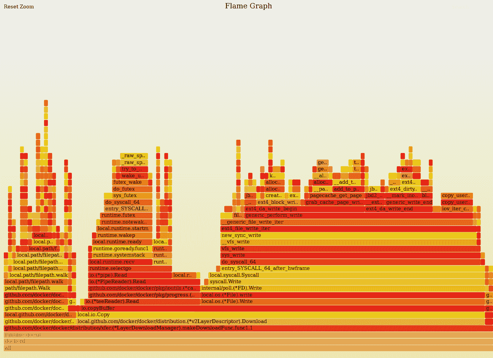

# 第四章：使用 BPF 进行跟踪

在软件工程中，跟踪是一种收集数据以进行性能分析和调试的方法。其目的是在运行时提供有用的信息以供将来分析。使用 BPF 进行跟踪的主要优势在于，您可以访问来自 Linux 内核和您的应用程序几乎任何信息。与其他跟踪技术相比，BPF 对系统性能和延迟的开销最小，并且不要求开发人员为了从中收集数据而修改其应用程序。

Linux 内核提供了几种可与 BPF 结合使用的仪器化能力。在本章中，我们讨论这些不同的能力。我们向您展示内核如何在您的操作系统中公开这些能力，以便您知道如何找到您的 BPF 程序可用的信息。

跟踪的最终目标是通过获取所有可用数据并以有用的方式呈现给您，从而让您对任何系统有深入的理解。我们将讨论几种不同的数据表示以及您如何在不同的场景中使用它们。

从本章开始，我们将使用一个强大的工具包来编写 BPF 程序，即 BPF 编译器集合（BCC）。BCC 是一组组件，使构建 BPF 程序更加可预测。即使您精通 Clang 和 LLVM，您也可能不想花费比必要更多的时间来构建相同的实用程序，并确保 BPF 验证器不会拒绝您的程序。BCC 提供了用于常见结构的可重用组件，如 Perf 事件映射，并与 LLVM 后端集成，以提供更好的调试选项。此外，BCC 还包括对几种编程语言的绑定；我们将在示例中使用 Python。这些绑定允许您使用高级语言编写 BPF 程序的用户空间部分，从而产生更有用的程序。我们还将在接下来的章节中继续使用 BCC，以使我们的示例更加简洁。

能够在 Linux 内核中跟踪程序的第一步是识别它为您提供的用于附加 BPF 程序的扩展点。这些扩展点通常被称为*探针*。

# 探针

英语词典中“探针”一词的一个定义如下：

> 一个无人探测航天器，设计用于传输有关其环境的信息。

这个定义唤起了我们关于科幻电影和史诗般的 NASA 任务的回忆，也可能唤起了你的回忆。当我们谈论跟踪探针时，我们可以使用非常类似的定义。

> 跟踪探针是设计用于传输有关其执行环境信息的探索性程序。

它们在系统中收集数据，并使其可供您探索和分析。在 Linux 中传统上使用探测点涉及编写编译成内核模块的程序，这可能会在生产系统中造成严重问题。多年来，它们已经进化为更安全的执行方式，但仍然繁琐地编写和测试。像 SystemTap 这样的工具建立了新的协议来编写探测点，并为从 Linux 内核和所有运行在用户空间的程序中获取更丰富信息铺平了道路。

BPF 通过跟踪探测点来收集调试和分析信息。BPF 程序的安全性质使其比仍依赖于重新编译内核的工具更具吸引力。重新编译内核以包括外部模块可能会由于代码行为不端引入崩溃风险。BPF 验证器通过在加载到内核之前分析程序来消除此风险。BPF 开发者利用了探测点定义，并修改了内核以执行 BPF 程序，而不是在代码执行时加载内核模块。

了解您可以定义的不同类型的探测点对于探索系统内部发生的情况至关重要。在本节中，我们分类了不同的探测点定义，如何在您的系统中发现它们，以及如何将 BPF 程序附加到它们上。

在本章中，我们涵盖了四种不同类型的探测点：

内核探测点

这些点使您可以动态访问内核中的内部组件。

跟踪点

这些提供对内核中内部组件的静态访问。

用户空间探测点

这些点使您可以动态访问运行在用户空间程序中的内容。

用户静态定义的跟踪点

这些允许静态访问运行在用户空间的程序。

让我们从内核探测点开始。

## 内核探测点

内核探测点允许您在几乎任何内核指令上设置动态标志或断点，并且开销最小。当内核达到这些标志时，它会执行与探测点附加的代码，然后恢复其通常的例程。内核探测点可以为您提供关于系统中发生的任何事情的信息，例如在系统中打开的文件和正在执行的二进制文件。关于内核探测点需要记住的一件重要事情是它们没有稳定的应用程序二进制接口（ABI），这意味着它们可能会在内核版本之间发生变化。如果尝试将相同的探测点附加到具有两个不同内核版本的系统上，相同的代码可能会停止工作。

内核探测点分为两类：*kprobes* 和 *kretprobes*。它们的使用取决于您可以在执行周期中的何处插入您的 BPF 程序。本节指导您如何使用每一个来将 BPF 程序附加到这些探测点上，并从内核中提取信息。

### Kprobes

Kprobes 允许你在执行任何内核指令之前插入 BPF 程序。你需要知道要中断的函数签名，并且正如前面提到的，这不是一个稳定的 ABI，因此如果要在不同的内核版本中运行相同的程序，设置这些探针时需要格外小心。当内核执行到设置探针的指令时，它会跳转到你的代码中，运行你的 BPF 程序，然后返回到原始指令的执行中。

展示如何使用 kprobes，我们将编写一个 BPF 程序，打印在系统中执行的任何二进制文件的名称。在这个示例中，我们将使用 BCC 工具的 Python 前端，但你也可以使用其他 BPF 工具来编写它：

```
from bcc import BPF

bpf_source = """
int do_sys_execve(struct pt_regs *ctx, void filename, void argv, void envp) { 
 char comm[16];
 bpf_get_current_comm(&comm, sizeof(comm));
 bpf_trace_printk("executing program: %s", comm);
 return 0;
}
"""

bpf = BPF(text = bpf_source)	
execve_function = bpf.get_syscall_fnname("execve")		
bpf.attach_kprobe(event = execve_function, fn_name = "do_sys_execve")	
bpf.trace_print()
```


我们的 BPF 程序开始运行。辅助函数 `bpf_get_current_comm` 将获取内核正在运行的当前命令名称，并将其存储在我们的 `comm` 变量中。我们将其定义为固定长度数组，因为内核对命令名称有一个 16 字符的限制。在获取命令名称后，我们将其打印在调试跟踪中，以便运行 Python 脚本的人可以看到 BPF 捕获的所有命令。


将 BPF 程序加载到内核中。


将程序与 `execve` 系统调用关联起来。这个系统调用的名称在不同的内核版本中可能会有所变化，而 BCC 提供了一个函数，可以获取这个名称，而无需记住你正在运行哪个内核版本。


该代码输出跟踪日志，因此你可以看到通过此程序跟踪的所有命令。

### Kretprobes

Kretprobes 将在内核指令执行后返回一个值时插入你的 BPF 程序。通常，你会希望将 kprobes 和 kretprobes 结合到一个单独的 BPF 程序中，以便全面了解指令的行为。

我们将使用类似于前一节的示例来展示 kretprobes 的工作原理：

```
from bcc import BPF

bpf_source = """
int ret_sys_execve(struct pt_regs *ctx) { 
 int return_value;
 char comm[16];
 bpf_get_current_comm(&comm, sizeof(comm));
 return_value = PT_REGS_RC(ctx);

 bpf_trace_printk("program: %s, return: %d", comm, return_value);
 return 0;
}
"""

bpf = BPF(text = bpf_source)	   
execve_function = bpf.get_syscall_fnname("execve")
bpf.attach_kretprobe(event = execve_function, fn_name = "ret_sys_execve")  
bpf.trace_print()
```


定义实现 BPF 程序的函数。内核将在 `execve` 系统调用完成后立即执行它。`PT_REGS_RC` 是一个宏，将从 BPF 寄存器中读取特定上下文的返回值。我们还使用 `bpf_trace_printk` 在调试日志中打印命令及其返回值。


初始化 BPF 程序并加载到内核中。


将附着功能更改为 `attach_kretprobe`。

内核探针是访问内核的强大方式。但正如我们之前提到的，它们可能不稳定，因为你要附加到内核源代码中的动态点，这些点可能会在不同版本之间改变或消失。现在你将看到一种更安全的方法来将程序附加到内核。

## 跟踪点

跟踪点是内核代码中的静态标记，你可以用来在运行的内核中附加代码。与 kprobes 的主要区别在于，当内核开发人员实现内核更改时，它们会为其编码；这就是我们称它们为静态的原因。由于它们是静态的，跟踪点的 ABI 更稳定；内核始终保证旧版本中的跟踪点会存在于新版本中。然而，由于开发人员需要将它们添加到内核中，它们可能无法覆盖构成内核的所有子系统。

正如我们在第二章中提到的，你可以通过列出*/sys/kernel/debug/tracing/events*中的所有文件来查看系统中所有可用的跟踪点。例如，你可以通过列出*/sys/kernel/debug/tracing/events/bpf*中定义的事件来找到 BPF 本身的所有跟踪点：

```
sudo ls -la /sys/kernel/debug/tracing/events/bpf
total 0
drwxr-xr-x  14 root root 0 Feb  4 16:13 .
drwxr-xr-x 106 root root 0 Feb  4 16:14 ..
drwxr-xr-x   2 root root 0 Feb  4 16:13 bpf_map_create
drwxr-xr-x   2 root root 0 Feb  4 16:13 bpf_map_delete_elem
drwxr-xr-x   2 root root 0 Feb  4 16:13 bpf_map_lookup_elem
drwxr-xr-x   2 root root 0 Feb  4 16:13 bpf_map_next_key
drwxr-xr-x   2 root root 0 Feb  4 16:13 bpf_map_update_elem
drwxr-xr-x   2 root root 0 Feb  4 16:13 bpf_obj_get_map
drwxr-xr-x   2 root root 0 Feb  4 16:13 bpf_obj_get_prog
drwxr-xr-x   2 root root 0 Feb  4 16:13 bpf_obj_pin_map
drwxr-xr-x   2 root root 0 Feb  4 16:13 bpf_obj_pin_prog
drwxr-xr-x   2 root root 0 Feb  4 16:13 bpf_prog_get_type
drwxr-xr-x   2 root root 0 Feb  4 16:13 bpf_prog_load
drwxr-xr-x   2 root root 0 Feb  4 16:13 bpf_prog_put_rcu
-rw-r--r--   1 root root 0 Feb  4 16:13 enable
-rw-r--r--   1 root root 0 Feb  4 16:13 filter
```

每个在该输出中列出的子目录对应一个我们可以附加 BPF 程序的跟踪点。但是这里还有两个额外的文件。第一个文件，`enable`，允许你启用和禁用 BPF 子系统的所有跟踪点。如果文件的内容为 0，则跟踪点被禁用；如果文件的内容为 1，则跟踪点被启用。*filter* 文件允许你编写表达式，内核中的 Trace 子系统将使用这些表达式来过滤事件。BPF 不使用这个文件；在内核的[跟踪文档](https://oreil.ly/miNRd)中可以了解更多信息。

编写 BPF 程序以利用跟踪点的方式与使用 kprobes 进行跟踪相似。下面是一个示例，使用 BPF 程序跟踪系统中加载其他 BPF 程序的所有应用程序：

```
from bcc import BPF

bpf_source = """
int trace_bpf_prog_load(void ctx) { 
 char comm[16];
 bpf_get_current_comm(&comm, sizeof(comm));

 bpf_trace_printk("%s is loading a BPF program", comm);
 return 0;
}
"""

bpf = BPF(text = bpf_source)
bpf.attach_tracepoint(tp = "bpf:bpf_prog_load",
                      fn_name = "trace_bpf_prog_load") 
bpf.trace_print()
```


声明定义 BPF 程序的函数。这段代码你应该已经很熟悉了；与我们在讨论 kprobes 时看到的第一个示例相比，只有几个语法上的变化。


这个程序的主要区别在于：我们不是将程序附加到 kprobe，而是附加到一个跟踪点。BCC 遵循一种命名跟踪点的约定；首先指定要跟踪的子系统——在这种情况下是`bpf`——然后是一个冒号，接着是子系统中的跟踪点，`bpf_prog_load`。这意味着每当内核执行函数`bpf_prog_load`时，该程序将接收该事件，并打印执行该`bpf_prog_load`指令的应用程序的名称。

内核探针和跟踪点将为您提供对内核的全面访问。我们建议您尽可能使用跟踪点，但不要因为它们更安全就感到必须遵循跟踪点。利用内核探针的动态特性。在下一节中，我们将讨论如何在运行在用户空间的程序中获得类似的可见性水平。

## 用户空间探针

用户空间探针允许您在运行在用户空间的程序中设置动态标志。它们相当于内核外运行的程序的内核探针。当您定义一个 uprobes 时，内核会在附加指令周围创建一个陷阱。当您的应用程序达到该指令时，内核会触发一个事件，该事件具有您的探针函数作为回调。Uprobes 还允许您访问任何您的程序链接到的库，并且如果您知道指令的正确名称，还可以跟踪这些调用。

与内核探针类似，用户空间探针也分为两类，即 uprobes 和 uretprobes，具体取决于您可以在执行周期中的哪个位置插入您的 BPF 程序。让我们直接通过一些示例来了解。

### Uprobes

一般而言，uprobes 是内核在特定指令执行之前插入到程序指令集中的钩子。当您将 uprobes 附加到同一程序的不同版本时，需要小心，因为函数签名在这些版本之间可能会在内部更改。确保 BPF 程序能够在两个不同版本中运行的唯一方法是确保签名未更改。您可以在 Linux 中使用 `nm` 命令列出包含在 ELF 对象文件中的所有符号，这是检查您正在跟踪的指令是否仍然存在于您的程序中的好方法，例如：

```
package main
import "fmt"

func main() {
        fmt.Println("Hello, BPF")
}
```

您可以通过使用 `go build -o hello-bpf main.go` 编译此 Go 程序。您可以使用 `nm` 命令获取关于二进制文件包含的所有指令点的信息。`nm` 是 GNU 开发工具中包含的程序，用于列出对象文件中的符号。如果您使用包含 `main` 在其名称中的符号进行过滤，您会得到类似以下列表：

```
nm hello-bpf | grep main
0000000004850b0 T main.init
00000000567f06 B main.initdone.
00000000485040 T main.main
000000004c84a0 R main.statictmp_0
00000000428660 T runtime.main
0000000044da30 T runtime.main.func1
00000000044da80 T runtime.main.func2
000000000054b928 B runtime.main_init_done
00000000004c8180 R runtime.mainPC
0000000000567f1a B runtime.mainStarted
```

现在您有了符号列表，您可以追踪它们何时被执行，甚至在执行相同二进制文件的不同进程之间。

要追踪我们之前的 Go 示例中的主函数何时执行，我们将编写一个 BPF 程序，并将其附加到一个 uprobes 上，在任何进程调用该指令之前都会触发：

```
from bcc import BPF

bpf_source = """
int trace_go_main(struct pt_regs *ctx) {
 u64 pid = bpf_get_current_pid_tgid(); 
 bpf_trace_printk("New hello-bpf process running with PID: %d", pid);
}
"""

bpf = BPF(text = bpf_source)
bpf.attach_uprobe(name = "hello-bpf",
    sym = "main.main", fn_name = "trace_go_main")	
bpf.trace_print()
```


使用函数 `bpf_get_current_pid_tgid` 来获取运行我们的 `hello-bpf` 程序的进程标识符（PID）。


将该程序附加到一个 uprobe 上。此调用需要知道我们要跟踪的对象`hello-bpf`的绝对路径。它还需要我们在对象内部正在跟踪的符号，例如在这种情况下是`main.main`，以及我们想要运行的 BPF 程序。有了这些，每当有人在我们的系统中运行`hello-bpf`时，我们将在我们的跟踪管道中获得一个新的日志。

### Uretprobes

Uretprobes 是用户空间程序的并行探针，类似于 kretprobes。它们将 BPF 程序附加到返回值的指令上，并通过从您的 BPF 代码访问寄存器来访问这些返回值。

结合 uprobes 和 uretprobes 允许您编写更复杂的 BPF 程序。它们可以为您提供系统中正在运行的应用程序的更全面视图。当您可以在函数运行之前和完成之后注入跟踪代码时，您可以开始收集更多数据并测量应用程序的行为。一个常见的用例是测量函数执行所需的时间，而无需更改应用程序中的任何代码。

我们将重用我们在“Uprobes”中编写的 Go 程序，以测量执行主函数所需的时间。这个 BPF 示例比您以前看到的示例更长，因此我们将其分成不同的代码块：

```
bpf_source = """
int trace_go_main(struct pt_regs *ctx) {
 u64 pid = bpf_get_current_pid_tgid();
 bpf_trace_printk("New hello-bpf process running with PID: %d", pid); 
}
"""

bpf = BPF(text = bpf_source)
bpf.attach_uprobe(name = "hello-bpf", 	
    sym = "main.main", fn_name = "trace_go_main")	
bpf.trace_print()
```


创建一个 BPF 哈希映射表。这个表允许我们在 uprobe 和 uretprobe 函数之间共享数据。在本例中，我们使用应用程序的 PID 作为表键，并将函数开始时间存储为值。我们的 uprobe 函数中最有趣的两个操作如下所述。


捕获内核中当前时间的纳秒级时间戳。


在我们的缓存中创建一个条目，其中包含程序的 PID 和当前时间。我们可以假设这个时间是应用程序函数的启动时间。现在让我们声明我们的 uretprobe 函数：

实现在指令完成时附加的函数。这个 uretprobe 函数与您在“Kretprobes”中看到的其他函数类似：

```
bpf_source += """
static int print_duration(struct pt_regs *ctx) {
 u64 pid = bpf_get_current_pid_tgid(); 
 u64 start_time_ns = cache.lookup(&pid);
 if (start_time_ns == 0) {
 return 0;
 }
 u64 duration_ns = bpf_ktime_get_ns() - start_time_ns;
 bpf_trace_printk("Function call duration: %d", duration_ns); 
 return 0; 
}
"""
```


获取我们应用程序的 PID；我们需要它来找到其启动时间。我们使用映射函数`lookup`从我们之前存储函数运行前时间的映射中获取该时间。


通过从当前时间减去该时间来计算函数持续时间。


将延迟打印到我们的跟踪日志中，以便在终端中显示。

现在，程序的其余部分需要将这两个 BPF 函数附加到正确的探针上：

```
bpf = BPF(text = bpf_source)
bpf.attach_uprobe(name = "hello-bpf", sym = "main.main",
           fn_name = "trace_start_time")
bpf.attach_uretprobe(name = "hello-bpf", sym = "main.main",
           fn_name = "print_duration")
bpf.trace_print()
```

我们已经在我们原始的 uprobe 示例中添加了一行，其中我们将我们的打印函数附加到我们应用程序的 uretprobe 上。

在本节中，您看到了如何使用 BPF 跟踪发生在用户空间中的操作。通过组合在应用程序生命周期的不同点执行的 BPF 函数，您可以开始从中提取更丰富的信息。但是，正如我们在本节开始时提到的，用户空间探针功能强大，但也不稳定。我们的 BPF 示例可能会因为有人决定重命名应用程序的函数而停止工作。现在让我们看一看跟踪用户空间程序的更稳定方法。

## 用户静态定义的跟踪点

用户静态定义的跟踪点（USDT）为用户空间的应用程序提供了静态跟踪点。这是一种方便的方法来为应用程序添加仪器，因为它们为您提供了 BPF 提供的跟踪能力的低开销入口点。您还可以将它们用作一种约定，用于在生产环境中跟踪应用程序，而不管这些应用程序使用哪种编程语言编写。

USDTs 被 DTrace 推广，DTrace 是最初由 Sun Microsystems 开发的用于动态仪器化 Unix 系统的工具。由于许可问题，DTrace 直到最近才在 Linux 中可用；但是 Linux 内核开发人员从 DTrace 的原始工作中汲取了许多灵感来实现 USDT。

就像您之前看到的静态内核跟踪点一样，USDTs 要求开发人员使用内核将用作陷阱以执行 BPF 程序的指令来仪器化其代码。USDTs 的 Hello World 版本只有几行代码：

```
 #include <sys/sdt.h>
 int main() {
   DTRACE_PROBE("hello-usdt", "probe-main");
 }
```

在这个例子中，我们使用 Linux 提供的宏来定义我们的第一个 USDT。您已经可以看到内核从哪里得到灵感了。`DTRACE_PROBE` 将注册内核将用于注入我们的 BPF 函数回调的跟踪点。此宏的第一个参数是报告跟踪的程序。第二个参数是我们正在报告的跟踪的名称。

许多您可能在系统中安装的应用程序使用此类探针，以可预测的方式向您提供运行时跟踪数据访问。例如，流行的数据库 MySQL 使用静态定义的跟踪点公开各种信息。您可以从服务器中执行的查询以及从许多其他用户操作中获取信息。基于 Chrome 的 V8 引擎构建的 JavaScript 运行时 Node.js 也提供了您可以使用的跟踪点，以提取运行时信息。

在向您展示如何将 BPF 程序附加到用户定义的跟踪点之前，我们需要讨论可发现性。因为这些跟踪点在可执行文件内以二进制格式定义，所以我们需要一种列出程序定义的探针的方法，而无需深入源代码。提取此信息的一种方法是直接读取 ELF 二进制文件。首先，我们将编译我们之前的 Hello World USDT 示例；我们可以使用 GCC 来完成：

```
gcc -o hello_usdt hello_usdt.c
```

此命令将生成一个名为*hello_usdt*的二进制文件，我们可以使用多种工具开始探索其定义的跟踪点。Linux 提供了一个名为`readelf`的实用程序，用于显示关于 ELF 文件的信息。您可以将其与我们编译的示例一起使用：

```
readelf -n ./hello_usdt
```

您可以看到我们在此命令的输出中定义的 USDT：

```
Displaying notes found in: .note.stapsdt
  Owner                 Data size        Description
  stapsdt              0x00000033        NT_STAPSDT (SystemTap probe descriptors)
    Provider: "hello-usdt"
    Name: "probe-main"
```

`readelf`可以为二进制文件提供大量信息；在我们的小示例中，它仅显示了少量信息行，但对于更复杂的二进制文件，其输出变得难以解析。

发现二进制文件中定义的跟踪点的更好选择是使用 BCC 的`tplist`工具，它可以显示内核跟踪点和 USDT。该工具的优点是其输出的简单性；它只显示跟踪点定义，不提供有关可执行文件的任何其他信息。其使用方法类似于`readelf`：

```
 tplist -l ./hello_usdt
```

它列出您在单独行中定义的每个跟踪点。在我们的示例中，它仅显示了一个包含我们的`probe-main`定义的单行：

```
 ./hello_usdt "hello-usdt":"probe-main"
```

在您了解二进制文件中支持的跟踪点之后，您可以以与之前示例中所见相似的方式将 BPF 程序附加到它们上：

```
from bcc import BPF, USDT

bpf_source = """
#include <uapi/linux/ptrace.h>
int trace_binary_exec(struct pt_regs *ctx) {
 u64 pid = bpf_get_current_pid_tgid();
 bpf_trace_printk("New hello_usdt process running with PID: %d", pid);
}
"""

usdt = USDT(path = "./hello_usdt")	
usdt.enable_probe(probe = "probe-main", fn_name = "trace_binary_exec")     
bpf = BPF(text = bpf_source, usdt = usdt)	
bpf.trace_print()
```

此示例中有一个重大更改，需要进行一些解释。


创建一个 USDT 对象；我们在之前的示例中没有这样做过。USDT 与 BPF 不同，您可以在不与 BPF 虚拟机交互的情况下使用它们。因为它们彼此独立，所以它们的使用与 BPF 代码的使用是独立的。


将 BPF 函数附加到我们应用程序中的探测点以跟踪程序执行。


初始化我们的 BPF 环境，使用刚刚创建的跟踪点定义。这将通知 BCC 需要生成代码，以连接我们的 BPF 程序与二进制文件中的探测点定义。当它们连接起来时，我们可以打印由我们的 BPF 程序生成的跟踪信息，以发现我们的二进制示例的新执行。

### 其他语言的 USDT 绑定

您还可以使用 USDT 来跟踪使用除了 C 语言之外的编程语言编写的应用程序。您可以在 GitHub 上找到 Python、Ruby、Go、Node.js 和许多其他语言的绑定。Ruby 绑定是我们喜欢的之一，因为它们与诸如 Rails 之类的框架的简单性和互操作性。目前在 Shopify 工作的 Dale Hamel 在他的[博客](https://oreil.ly/7pgNO)中撰写了一篇关于 USDT 使用的优秀报告。他还维护着一个名为[*ruby-static-tracing*](https://oreil.ly/ge6cu)的库，使得跟踪 Ruby 和 Rails 应用程序变得更加简单。

Hamel 的静态跟踪库允许您在类级别注入跟踪能力，而无需在该类的每个方法中添加跟踪逻辑。在复杂情景中，它还为您提供了方便的方法来注册专用的跟踪端点。

要在您的应用程序中使用`ruby-static-tracing`，首先需要配置何时启用跟踪点。您可以在应用程序启动时默认启用它们，但如果您想避免始终收集数据的开销，可以使用系统调用信号来激活它们。Hamel 建议使用`PROF`作为此信号：

```
require 'ruby-static-tracing'

StaticTracing.configure do |config|
  config.mode = StaticTracing::Configuration::Modes::SIGNAL
  config.signal = StaticTracing::Configuration::Modes::SIGNALS::SIGPROF
end
```

有了这个配置，您可以使用`kill`命令随需启用您应用程序的静态跟踪点。在下一个示例中，我们假设我们的机器上只有一个 Ruby 进程正在运行，并且我们可以使用`pgrep`获取其进程标识符：

```
kill -SIGPROF `pgrep -nx ruby`
```

除了配置跟踪点何时激活外，您可能还想使用*ruby-static-tracing*提供的一些内置跟踪机制。在撰写本文时，该库整合了跟踪点以测量延迟和收集堆栈跟踪。我们特别喜欢如何通过使用这个内置模块使得诸如测量函数延迟这样的繁琐任务几乎变得微不足道。首先，您需要将延迟跟踪器添加到您的初始配置中：

```
require 'ruby-static-tracing'
require 'ruby-static-tracing/tracer/concerns/latency_tracer'

StaticTracing.configure do |config|
  config.add_tracer(StaticTracing::Tracer::Latency)
end
```

之后，每个包含延迟模块的类都会为其定义的每个公共方法生成静态跟踪点。启用跟踪时，您可以查询这些跟踪点以收集时间数据。在我们的下一个示例中，`ruby-static-tracing`生成一个名为`usdt:/proc/X/fd/Y:user_model:find`的静态跟踪点，遵循使用类名作为跟踪点的命名空间并使用方法名作为跟踪点名称的约定：

```
class UserModel
  def find(id)
  end

  include StaticTracing::Tracer::Concerns::Latency
end
```

现在我们可以使用 BCC 提取每次调用我们的`find`方法时的延迟信息。为此，我们使用了 BCC 的内置函数`bpf_usdt_readarg`和`bpf_usdt_readarg_p`。这些函数每次我们应用程序的代码被执行时读取设置的参数。`ruby-static-tracing`始终将方法名设置为跟踪点的第一个参数，而将计算出的值设置为第二个参数。下一段代码片段实现了获取跟踪点信息并将其打印到跟踪日志中的 BPF 程序：

```
bpf_source = """
#include <uapi/linux/ptrace.h>
int trace_latency(struct pt_regs *ctx) {
 char method[64];
 u64 latency;

 bpf_usdt_readarg_p(1, ctx, &method, sizeof(method));
 bpf_usdt_readarg(2, ctx, &latency);

 bpf_trace_printk("method %s took %d ms", method, latency);
}
"""
```

我们还需要将之前的 BPF 程序加载到内核中。因为我们正在跟踪一个已在本机上运行的特定应用程序，所以可以将程序附加到特定的进程标识符上：

```
parser = argparse.ArgumentParser()
parser.add_argument("-p", "--pid", type = int, help = "Process ID")	
args = parser.parse_args()

usdt = USDT(pid = int(args.pid))
usdt.enable_probe(probe = "latency", fn_name = "trace_latency")		
bpf = BPF(text = bpf_source, usdt = usdt)
bpf.trace_print()
```


指定该 PID。


启用探针，将程序加载到内核中，并打印跟踪日志。（本节与您之前看到的非常相似。）

在本节中，我们展示了如何检查静态定义跟踪点的应用程序。许多知名的库和编程语言都包含这些探针，以帮助您在生产环境中调试正在运行的应用程序，从而获得更多的可见性。这只是冰山一角；在获取数据之后，您需要理解这些数据。这是我们接下来要探讨的内容。

# 可视化跟踪数据

到目前为止，我们展示了打印数据的示例，这在生产环境中并不是非常有用。您希望理解这些数据，但没有人喜欢理解冗长且复杂的日志。如果我们想要监视延迟和 CPU 利用率的变化，通过查看一段时间内的图表比从文件流中聚合数字更容易。

本节探讨了展示 BPF 跟踪数据的不同方法。一方面，我们将展示 BPF 程序如何为您结构化信息聚合。另一方面，您将学习如何以便携的表示形式导出这些信息，并使用现成工具访问更丰富的表示，并与他人分享您的发现。

## 火焰图

*火焰图* 是帮助您可视化系统花费时间的图表。它们可以清晰地展示应用程序中哪些代码执行得更频繁。火焰图的创建者布兰登·格雷格在 GitHub 上维护了一组脚本，以便轻松生成这些可视化格式的工具 [on GitHub](https://oreil.ly/3iiZx)。我们在本节的后面部分使用这些脚本从使用 BPF 收集的数据生成火焰图。您可以在 Figure 4-1 中看到这些图表的样式。



###### 图 4-1\. 一个 CPU 火焰图

关于火焰图展示的两个重要事项：

+   x 轴按字母顺序排序。每个堆栈的宽度表示在收集数据时它出现的频率，这可以与分析器启用时访问代码路径的频率相关联。

+   y 轴显示堆栈跟踪，按照分析器读取它们的顺序排列，保留了跟踪的层次结构。

最知名的火焰图代表了系统中消耗 CPU 最频繁的代码；这些称为*on-CPU 图*。另一种有趣的火焰图可视化是*off-CPU 图*；它们表示 CPU 在与您的应用程序无关的其他任务上花费的时间。通过结合 on-CPU 和 off-CPU 图，您可以完整地了解系统在 CPU 周期上的花费情况。

*on-CPU* 和 *off-CPU* 图都使用堆栈跟踪来指示系统花费时间的位置。某些编程语言（如 Go）始终在其二进制文件中包含跟踪信息，但其他一些（如 C++ 和 Java）需要额外的工作来使堆栈跟踪可读。在应用程序包含堆栈跟踪信息后，BPF 程序可以使用它来聚合内核看到的最频繁的代码路径。

###### 注意

内核中的堆栈跟踪聚合有其优势和劣势。一方面，它是计算堆栈跟踪频率的高效方式，因为它发生在内核中，避免了将每个堆栈信息发送到用户空间，并减少了内核与用户空间之间的数据交换。另一方面，处理离 CPU 图表的事件数量可能会显著增加，因为你要跟踪在应用程序上下文切换期间发生的每个事件。如果试图对其进行长时间性能分析，这可能会给系统带来显著的开销。在使用火焰图时，请牢记这一点。

BCC 提供了几个实用工具，帮助你聚合和可视化堆栈跟踪，但主要工具是宏 `BPF_STACK_TRACE`。这个宏生成了一个类型为 `BPF_MAP_TYPE_STACK_TRACE` 的 BPF Map，用于存储你的 BPF 程序积累的堆栈。此外，这个 BPF Map 还增强了方法，用于从程序上下文中提取堆栈信息，并在聚合后想要使用时遍历积累的堆栈跟踪。

在下一个示例中，我们构建了一个简单的 BPF 分析器，用于打印从用户空间应用程序收集的堆栈跟踪。我们使用我们的分析器收集的跟踪生成了 on-CPU 火焰图。为了测试这个分析器，我们将编写一个生成 CPU 负载的最小化 Go 程序。以下是该最小应用程序的代码：

```
package main

import "time"

func main() {
	j := 3
	for time.Since(time.Now()) < time.Second {
		for i := 1; i < 1000000; i++ {
			j *= i
		}
	}
}
```

如果你将这段代码保存为 *main.go* 文件，并使用 `go run main.go` 运行它，你会看到系统的 CPU 利用率显著增加。你可以通过在键盘上按下 Ctrl-C 来停止执行，CPU 利用率将恢复正常。

我们 BPF 程序的第一部分将初始化分析器结构：

```
bpf_source = """
#include <uapi/linux/ptrace.h>
#include <uapi/linux/bpf_perf_event.h>
#include <linux/sched.h>

struct trace_t { 
 int stack_id;
}

BPF_HASH(cache, struct trace_t); 
BPF_STACK_TRACE(traces, 10000); 
"""
```


初始化一个结构，用于存储我们的分析器接收到的每一个堆栈帧的参考标识符。稍后我们使用这些标识符来查找在该时间点执行的代码路径。


初始化一个 BPF 哈希 Map，用于聚合同一堆栈帧的频率。火焰图脚本使用这个聚合值来确定同一代码执行的频率。


初始化我们的 BPF 堆栈跟踪 Map。我们为这个 Map 设置了最大大小，但它可以根据你要处理的数据量而变化。最好将这个值作为变量，但我们知道我们的 Go 应用程序不是很大，所以 10,000 个元素已经足够。

接下来，我们实现了在我们的分析器中聚合堆栈跟踪的函数：

```
bpf_source += """
int collect_stack_traces(struct bpf_perf_event_data *ctx) {
 u32 pid = bpf_get_current_pid_tgid() >> 32; 
 if (pid != PROGRAM_PID)
 return 0;

 struct trace_t trace = { 
 .stack_id = traces.get_stackid(&ctx->regs, BPF_F_USER_STACK)
 };

 cache.increment(trace); 
 return 0;
}
"""
```


确认当前 BPF 上下文中程序的进程 ID 是否与我们 Go 应用程序的相符；否则，我们将忽略此事件。当前我们尚未定义 `PROGRAM_PID` 的值。在初始化 BPF 程序之前，让我们在分析器的 Python 部分替换这个字符串。这是 BCC 初始化 BPF 程序方式的一种限制；我们无法从用户空间传递任何变量，并且通常在初始化代码之前会替换这些字符串。


创建一个跟踪以聚合其使用情况。我们从程序上下文中使用内置函数 `get_stackid` 获取堆栈 ID。这是 BCC 添加到我们堆栈跟踪映射中的帮助之一。我们使用标志 `BPF_F_USER_STACK` 表示我们要获取用户空间应用程序的堆栈 ID，并且我们不关心内核内部发生的事情。


增加我们的跟踪计数器，以跟踪相同代码被执行的频率。

接下来，我们将把我们的堆栈跟踪收集器附加到内核中所有的 Perf 事件上：

```
program_pid = int(sys.argv[0])		
bpf_source = bpf_source.replace('PROGRAM_PID', program_pid) 

bpf = BPF(text = bpf_source)
bpf.attach_perf_event(ev_type = PerfType.SOFTWARE,          
                      ev_config = PerfSWConfig.CPU_CLOCK,
                      fn_name = 'collect_stack_traces')
```


我们 Python 程序的第一个参数。这是我们正在分析的 Go 应用程序的进程标识符。


使用 Python 内置的 `replace` 函数，将字符串 `PROGRAM_ID` 在我们的 BPF 源码中替换为分析器提供的参数。


将 BPF 程序附加到所有软件 Perf 事件上，这将忽略其他事件，如硬件事件。我们还配置我们的 BPF 程序使用 CPU 时钟作为时间源，以便测量执行时间。

最后，在分析器被中断时，我们需要实现将堆栈跟踪转储到标准输出的代码。

```
try:
  sleep(99999999)
except KeyboardInterrupt:
  signal.signal(signal.SIGINT, signal_ignore)

for trace, acc in sorted(cache.items(), key=lambda cache: cache[1].value):   
  line = []
  if trace.stack_id < 0 and trace.stack_id == -errno.EFAULT		     
    line = ['Unknown stack']
  else
    stack_trace = list(traces.walk(trace.stack_id))
    for stack_address in reversed(stack_trace)			             
      line.extend(bpf.sym(stack_address, program_pid))		     	

  frame = b";".join(line).decode('utf-8', 'replace')		     	
  print("%s %d" % (frame, acc.value))
```


迭代我们收集的所有跟踪，以便按顺序打印它们。


验证我们得到的堆栈标识符，以便稍后可以将其与特定代码行相关联。如果得到无效值，我们将在火焰图中使用占位符。


逆序迭代堆栈跟踪中的所有条目。我们这样做是因为我们希望看到最近执行的代码路径位于顶部，就像在任何堆栈跟踪中所期望的那样。


使用 BCC 辅助工具 `sym` 将堆栈帧的内存地址转换为我们源代码中的函数名称。


将堆栈跟踪行格式化为分号分隔的格式。这是火焰图脚本后续期望能够生成我们可视化的格式。

完成了我们的 BPF 分析器后，我们可以以`sudo`权限运行它，收集我们繁忙的 Go 程序的堆栈跟踪。我们需要将 Go 程序的进程 ID 传递给我们的分析器，以确保我们仅收集该应用程序的跟踪；我们可以使用`pgrep`找到该 PID。如果将其保存在名为*profiler.py*的文件中，则以下是运行分析器的方法：

```
./profiler.py `pgrep -nx go` > /tmp/profile.out
```

`pgrep`将搜索在您的系统上运行名称匹配`go`的进程的 PID。我们将分析器的输出发送到临时文件中，以便我们可以生成火焰图可视化。

正如我们之前提到的，我们将使用 Brendan Gregg 的 FlameGraph 脚本来生成我们图表的 SVG 文件；您可以在他的[GitHub 存储库](https://oreil.ly/orqcb)中找到这些脚本。下载了该存储库后，您可以使用`flamegraph.pl`来生成图表。您可以使用您喜欢的浏览器打开图表；我们在这个示例中使用的是 Firefox 浏览器：

```
./flamegraph.pl /tmp/profile.out > /tmp/flamegraph.svg && \
  firefox /tmp/flamefraph.svg
```

这种性能分析工具非常有用，可以用于追踪系统中的性能问题。BCC 已经包含了一个比我们示例中更高级的分析工具，您可以直接在生产环境中使用它。除了性能分析工具外，BCC 还包括帮助您生成 CPU 闲置火焰图和许多其他可视化工具来分析系统。

火焰图对性能分析非常有用。我们在日常工作中经常使用它们。在许多场景中，除了可视化热点代码路径外，您还希望测量系统中事件发生的频率。接下来我们将重点关注这一点。

## 直方图

直方图是显示多个数值范围发生频率的图表。用于表示数值数据的区间分为多个桶，每个桶内包含桶中任何数据点的出现次数。直方图测量的频率是每个桶的高度和宽度的组合。如果桶的范围是相等的，这个频率就匹配直方图的高度，但如果范围不是均匀的，则需要将每个高度乘以每个宽度以找到正确的频率。

直方图是进行系统性能分析的基本组件。它们是表示可测量事件（如指令延迟）分布的强大工具，因为它们向您展示的信息比其他测量方法（如平均值）更准确。

BPF 程序可以基于许多指标创建直方图。您可以使用 BPF 映射收集信息，将其分类到桶中，然后为数据生成直方图表示。实现此逻辑并不复杂，但如果您想要在每次分析程序输出时打印直方图，这将变得很乏味。BCC 已经包含了一个开箱即用的实现，您可以在每个程序中重复使用它，而无需手动计算分桶和频率。然而，内核源代码中也有一个出色的实现，我们建议您在 BPF 示例中查看它。

作为一个有趣的实验，我们将展示如何使用 BCC 的直方图来可视化在应用程序调用`bpf_prog_load`指令时加载 BPF 程序引入的延迟。我们使用 kprobes 来收集该指令完成所需的时间，并将结果累积在稍后将可视化的直方图中。我们已将此示例分成几个部分，以便更容易跟进。

第一部分包括我们的 BPF 程序的初始源代码：

```
bpf_source = """
#include <uapi/linux/ptrace.h>

BPF_HASH(cache, u64, u64);
BPF_HISTOGRAM(histogram);

int trace_bpf_prog_load_start(void ctx) { 
 u64 pid = bpf_get_current_pid_tgid(); 
 u64 start_time_ns = bpf_ktime_get_ns();
 cache.update(&pid, &start_time_ns); 
 return 0;
}
"""
```


使用宏创建一个 BPF 哈希映射，以存储`bpf_prog_load`指令触发时的初始时间。


使用新的宏创建一个 BPF 直方图映射。这不是一个原生 BPF 映射；BCC 包含这个宏是为了让您更容易创建这些可视化效果。在底层，这个 BPF 直方图使用数组映射来存储信息。它还有几个帮助函数来进行桶分配并创建最终的图表。


使用程序的 PID 来存储应用程序触发我们想要跟踪的指令的时间。（这个函数会让您感到熟悉——我们从先前的 Uprobes 示例中获取了它。）

让我们看看如何计算延迟的时间差并将其存储在我们的直方图中。这个新代码块的初始行也会看起来很熟悉，因为我们仍然在遵循我们在"Uprobes"中讨论的示例。

```
bpf_source += """
int trace_bpf_prog_load_return(void ctx) {
 u64 *start_time_ns, delta;
 u64 pid = bpf_get_current_pid_tgid();
 start_time_ns = cache.lookup(&pid);
 if (start_time_ns == 0)
 return 0;

 delta = bpf_ktime_get_ns() - *start_time_ns; 
 histogram.increment(bpf_log2l(delta)); 
 return 0;
}
"""
```


计算指令被调用时与程序到达此处所需的时间差；我们可以假设这也是指令完成时的时间。


将该时间差存储在我们的直方图中。在这行中，我们进行了两个操作。首先，我们使用内置函数`bpf_log2l`为时间差的值生成桶标识符。该函数会随着时间生成一个稳定的值分布。然后，我们使用`increment`函数向此桶添加一个新项。默认情况下，如果直方图中存在该桶，则`increment`将其值加 1；如果不存在，则创建一个初始值为 1 的新桶，因此您不必担心事先存在的值。

我们需要编写的最后一段代码是将这两个函数附加到有效的 kprobes 并将直方图打印到屏幕上，以便我们可以查看延迟分布。在这一部分，我们初始化我们的 BPF 程序并等待事件以生成直方图：

```
bpf = BPF(text = bpf_source)			
bpf.attach_kprobe(event = "bpf_prog_load",
    fn_name = "trace_bpf_prog_load_start")
bpf.attach_kretprobe(event = "bpf_prog_load",
    fn_name = "trace_bpf_prog_load_return")

try:						
  sleep(99999999)
except KeyboardInterrupt:
  print()

bpf["histogram"].print_log2_hist("msecs")	
```


初始化 BPF 并将我们的函数附加到 kprobes。


使我们的程序等待，以便我们可以从系统中收集到足够的事件。


在终端上打印带有跟踪事件分布的直方图映射——这是另一个允许我们获取直方图映射的 BCC 宏。

正如我们在本节开头提到的，直方图可以用来观察系统中的异常情况。BCC 工具包括许多使用直方图表示数据的脚本；当您需要启发以深入了解系统时，我们强烈推荐您查看它们。

## Perf 事件

我们认为 Perf 事件可能是您需要掌握的最重要的通信方法，以成功使用 BPF 跟踪。我们在前一章讨论了 BPF Perf 事件数组映射。它们允许您将数据放入一个缓冲环中，实时与用户空间程序同步。当您在 BPF 程序中收集大量数据并希望将处理和可视化转移到用户空间程序时，这是理想的选择。这将使您能够更好地控制呈现层，因为您不受 BPF VM 在编程能力上的限制。您可以找到的大多数 BPF 跟踪程序仅出于此目的使用 Perf 事件。

这里，我们向您展示如何使用它们来提取有关二进制执行的信息，并将该信息分类，以打印出系统中最常执行的二进制文件。我们将此示例分为两个代码块，以便您可以轻松地跟随示例。在第一个代码块中，我们定义了我们的 BPF 程序，并将其附加到一个 kprobe，就像我们在“探针”中所做的那样：

```
bpf_source = """
#include <uapi/linux/ptrace.h>

BPF_PERF_OUTPUT(events); 

int do_sys_execve(struct pt_regs *ctx, void filename, void argv, void envp) {
 char comm[16];
 bpf_get_current_comm(&comm, sizeof(comm));

 events.perf_submit(ctx, &comm, sizeof(comm)); 
 return 0;
}
"""

bpf = BPF(text = bpf_source)						
execve_function = bpf.get_syscall_fnname("execve")
bpf.attach_kprobe(event = execve_function, fn_name = "do_sys_execve")
```

在此示例的第一行中，我们从 Python 标准库导入了一个库。我们将使用 Python 计数器来聚合我们从 BPF 程序接收到的事件。


使用`BPF_PERF_OUTPUT`来声明一个 Perf 事件映射。这是 BCC 提供的一个便利宏，用于声明这种类型的映射。我们将此映射命名为*events*。


在我们获得内核执行的程序名称后，将其发送到用户空间进行聚合。我们使用`perf_submit`来完成这个任务。此函数使用我们的新信息更新 Perf 事件映射。


初始化 BPF 程序并将其附加到 kprobe，以在系统中执行新程序时触发。

现在我们已经编写了收集系统中所有执行程序的代码，我们需要在用户空间中对它们进行聚合。在下一个代码片段中有很多信息，所以我们将带您浏览最重要的几行：

```
from collections import Counter
aggregates = Counter()			

def aggregate_programs(cpu, data, size):	
  comm = bpf["events"].event(data)		 
  aggregates[comm] += 1

bpf["events"].open_perf_buffer(aggregate_programs)	
while True:
    try:
      bpf.perf_buffer_poll()
    except KeyboardInterrupt:				
      break

for (comm, times) in aggregates.most_common():
  print("Program {} executed {} times".format(comm, times))
```


声明一个计数器来存储我们的程序信息。我们将程序的名称用作键，值将是计数器。我们使用`aggregate_programs`函数来从 Perf 事件映射中收集数据。在这个示例中，您可以看到我们如何使用 BCC 宏来访问映射，并从栈顶提取下一个传入数据事件。


增加我们接收到具有相同程序名称的事件的次数。


使用函数 `open_perf_buffer` 告诉 BCC 每次从 Perf 事件映射接收事件时都需要执行 `aggregate_programs` 函数。


在打开环形缓冲区后，BCC 会轮询事件，直到我们中断此 Python 程序。您等待的时间越长，处理的信息就越多。您可以看到我们如何使用 `perf_buffer_poll` 来实现这一目的。


使用 `most_common` 函数获取计数器中的元素列表，并循环打印系统中首先执行的顶级程序。

Perf 事件可以打开处理 BPF 提供的所有数据的大门，以新颖和意想不到的方式。我们展示了一个示例，启发您的想象力，当您需要从内核中收集某种任意数据时；您可以在 BCC 提供的跟踪工具中找到许多其他示例。

# 结论

在这一章中，我们只是初步涉及了使用 BPF 进行跟踪的内容。Linux 内核为您提供了一些其他工具难以获取的信息。BPF 通过提供一个通用接口来访问这些数据，使得这个过程更加可预测。在接下来的章节中，您将看到更多使用本章介绍的技术的示例，例如将函数附加到跟踪点。这些示例将帮助您巩固在这里学到的知识。

在本章中，我们使用了 BCC 框架编写了大部分示例。您可以像在之前的章节中所做的那样，在 C 语言中实现相同的示例，但 BCC 提供了几个内置功能，使编写跟踪程序比 C 语言更加容易。如果您愿意接受一个有趣的挑战，请尝试用 C 语言重写这些示例。

在下一章中，我们会展示一些构建在 BPF 之上的系统社区构建的工具，用于进行性能分析和跟踪。编写自己的程序是强大的，但这些专用工具使您可以以打包的方式访问我们在这里看到的大部分信息。这样，您就无需重写已经存在的工具。
